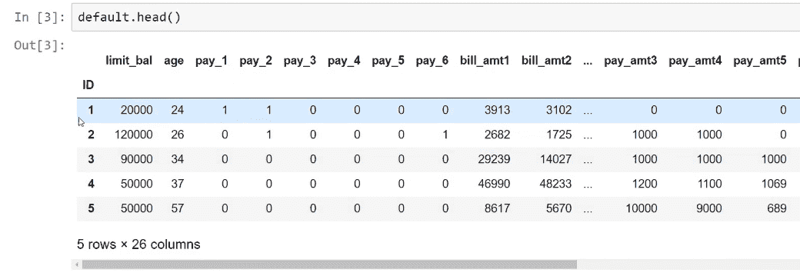
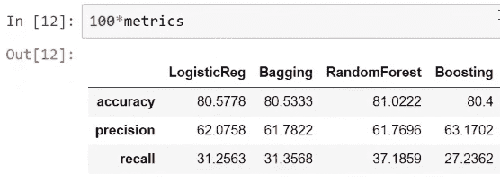
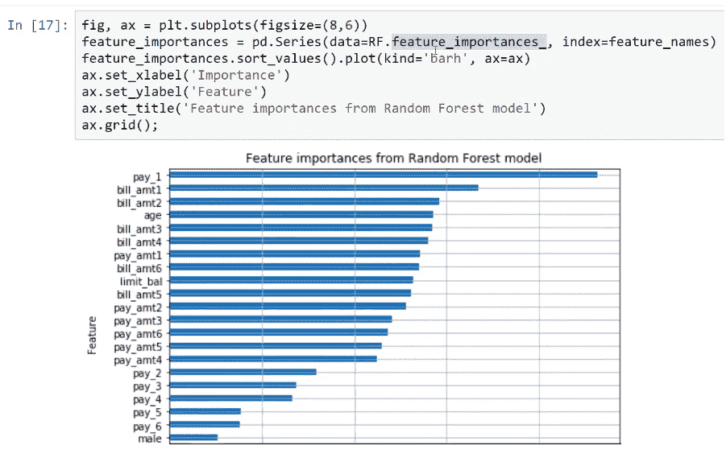

# 第一章：回归和分类的集成方法

高级分析工具在商业企业中被广泛应用，以利用数据解决问题。分析工具的目标是分析数据并提取相关信息，以解决问题或提高业务某些方面的绩效。它还涉及各种机器学习算法，通过这些算法我们可以创建预测模型，从而获得更好的结果。

在本章中，我们将探讨一种可以显著提高基础预测模型性能的简单思想。

在本章中，我们将涵盖以下主题：

+   集成方法及其工作原理

+   回归的集成方法

+   分类的集成方法

# 集成方法及其工作原理

集成方法基于一个非常简单的思想：与其使用单一模型进行预测，不如使用多个模型，然后采用某种方法来**聚合**这些预测。拥有不同的模型就像拥有不同的视角，已经证明，通过聚合提供不同视角的模型，预测可以更加准确。这些方法进一步提高了模型的泛化能力，因为它们减少了选择表现不佳的分类器的风险：


在前面的图示中，我们可以看到每个对象属于三种类别之一：三角形、圆形和正方形。在这个简化的例子中，我们有两个特征来将对象分离或分类到不同的类别中。正如你所见，我们可以使用三种不同的分类器，且这三种分类器代表不同的方法，并具有不同类型的决策边界。

集成学习将所有个体预测结合为一个单一的预测。通过结合三个边界做出的预测通常比单一模型产生的预测具有更好的性能。这就是集成方法背后的简单思想，也称为**集成学习**。

最常用的集成方法如下：

+   自助抽样

+   自助法（Bagging）

+   随机森林

+   提升法（Boosting）

在对这些方法进行高层次解释之前，我们需要讨论一种非常重要的统计技术，称为**自助抽样**。

# 自助抽样

许多集成学习方法使用一种统计技术，称为自助抽样（bootstrap sampling）。数据集的自助抽样是通过从原始数据集中随机抽样观测值*有放回*地生成的另一个数据集。

这种技术在统计学中广泛应用，例如，它用于估计样本统计量的标准误差，如均值或标准差。

让我们通过查看以下图示来更好地理解这一技术：


假设我们有一个从 1 到 10 的种群数据，可以视为原始种群数据。为了获得自助样本，我们需要从原始数据中以有放回的方式抽取 10 个样本。想象你有 10 张写着数字的卡片放在一顶帽子里；对于样本的第一个元素，你从帽子中随机抽取一张卡片并记录下来，然后将卡片放回帽子里，这个过程一直进行，直到你得到 10 个元素。这就是你的自助样本。如前面的例子所示，**9**在自助样本中被重复了三次。

这种带放回的数字重抽样提高了对真实种群数据的准确性。它还有助于理解在重抽样过程中涉及的各种差异和特征，从而提高相同过程的准确性。

# 袋装法

袋装法，也称为自助聚合法，是一种常用的减少机器学习模型方差的程序。它基于自助抽样技术，通常与回归或分类树一起使用，但原则上，这种袋装技术可以用于任何模型。

袋装过程包括以下步骤：

1.  我们选择使用的估计器或单独模型的数量。我们将其视为参数 B。

1.  我们从 B 中使用自助抽样法从训练集中抽取样本数据集。

1.  对于每一个训练数据集，我们在每个自助样本中拟合机器学习模型。这样，我们就得到了参数 B 的单独预测器。

1.  我们通过聚合所有单独的预测结果来获得集成预测。

在回归问题中，获取集成预测结果的最常见方法是求所有单独预测的平均值。

在分类问题中，最常见的获取聚合预测结果的方法是通过多数投票。我们可以通过一个例子来解释多数投票。假设我们有 100 个单独的预测器，其中 80 个投票支持某一特定类别。那么，我们就选择该类别作为我们的聚合预测结果。这就是多数投票的含义。

# 随机森林

这个集成方法是专门为回归或分类树创建的。它与袋装法非常相似，因为在这里，每棵单独的树都是在训练数据集的自助样本上训练的。与袋装法的不同之处在于，它使模型非常强大，并且在对树进行节点分裂时，选择的分裂是特征的随机子集中的最佳分裂。因此，每个单独的预测器都会考虑特征的随机子集。这会导致每个单独的预测器稍微变得较差且更具偏差，但由于单独预测器之间的相关性，整体集成预测通常比单个预测器要好。

# 提升法

提升（Boosting）是集成学习的另一种方法。提升有许多方法，但最成功和最受欢迎的一种方法是**AdaBoost**算法，也叫**自适应提升**。该算法的核心思想是，不是单独训练多个预测器，而是训练一系列弱学习器。下一个算法依赖于前一个算法的结果。在 AdaBoost 算法中，每次迭代都会重新加权所有样本。这里的训练数据会根据前一个学习器或模型的结果重新加权。

例如，在分类中，基本思想是错误分类的示例会增加权重，而正确分类的示例则减少权重。因此，序列中的下一个学习器或模型会更关注错误分类的示例。

# 回归的集成方法

关于回归，我们将训练这些不同的模型，并随后比较它们的结果。为了测试所有这些模型，我们需要一个样本数据集。我们将使用这个数据集来实现这些方法，看看它如何帮助我们提高模型的性能。

# 钻石数据集

让我们通过使用不同的集成学习模型对钻石价格进行实际预测。我们将使用一个钻石数据集（可以在此处找到：[`www.kaggle.com/shivam2503/diamonds`](https://www.kaggle.com/shivam2503/diamonds)）。该数据集包含约 54,000 颗钻石的价格以及其他特征。以下是该数据集中的特征：

+   **特征信息**：一个包含 53,940 行和 10 个变量的数据框

+   **价格**：以美元为单位的价格

以下是九个预测特征：

+   `carat`：该特征表示钻石的重量（0.2-5.01）

+   `cut`：该特征表示切割的质量（`Fair`，`Good`，`Very Good`，`Premium`，`Ideal`）

+   `color`：该特征表示钻石的颜色，从`J`（最差）到`D`（最好）

+   `clarity`：该特征表示钻石的清晰度测量（`I1`（最差），`SI2`，`SI1`，`VS2`，`VS1`，`VVS2`，`VVS1`，`IF`（最好））

+   `x`：该特征表示钻石的长度，单位为毫米（0-10.74）

+   `y`：该特征表示钻石的宽度，单位为毫米（0-58.9）

+   `z`：该特征表示钻石的深度，单位为毫米（0-31.8）

+   `depth`：该特征表示 z/平均值(x, y) = 2 * z/(x + y)（43-79）

+   `table`：该特征表示钻石顶部宽度与最宽点的比率（43-95）

`x`、`y` 和 `z` 变量表示钻石的尺寸。

我们将使用的库有`numpy`、`matplotlib`和`pandas`。要导入这些库，可以使用以下代码：

```py
import numpy as np
import matplotlib.pyplot as plt
import pandas as pd
%matplotlib inline
```

以下截图展示了我们用来调用原始数据集的代码行：


上述数据集包含一些数值特征和一些类别特征。这里，53,940 是我们数据集中样本的确切数量。现在，为了编码这些类别特征中的信息，我们使用独热编码技术将这些类别特征转换为虚拟特征。这样做的原因是因为`scikit-learn`只能处理数字。

下图展示了将类别特征转换为数字时使用的代码行：


在这里，我们可以看到如何使用来自`pandas`的`get_dummies`函数实现这一点。最终的数据集看起来类似于以下截图所示的样子：


在这里，对于类别变量中的每个类别，我们都有虚拟特征。当类别在特定的钻石中出现时，值为`1`，否则为`0`。

现在，为了重新缩放数据，我们将使用`RobustScaler`方法将所有特征转换到相似的尺度。

下图展示了导入`train_test_split`函数和`RobustScaler`方法时使用的代码行：


在这里，我们提取了`X`矩阵中的特征，指定了目标，然后使用来自`scikit-learn`的`train_test_split`函数将数据分为两组。

# 训练不同的回归模型

下图展示了我们将用来记录这些模型度量值的 dataframe，以及我们将使用的性能指标。由于这是一个回归任务，我们将使用均方误差。在这里，列中展示了我们将使用的四个模型。我们将使用`KNN`、`Bagging`、`RandomForest`和`Boosting`变量：


# KNN 模型

**K-Nearest Neighbours**（**KNN**）模型不是集成学习模型，但它在所有简单模型中表现最好：


在上述模型中，我们可以看到在做 KNN 时使用的过程。我们将使用 20 个邻居。我们使用`euclidean`度量来衡量点之间的距离，然后训练模型。在这里，性能度量已保存，因为其值为`1`，即均方误差。

# Bagging 模型

Bagging 是一种集成学习模型。任何估算器都可以与 Bagging 方法一起使用。所以，假设我们使用 KNN，如下图所示：


使用`n_estimators`参数，我们可以生成 15 个独立的估计器。因此，这将生成 15 个训练数据集的自助抽样（bootstrap samples），然后在每个样本中，使用 20 个邻居来拟合 KNN 回归模型。最后，我们将使用袋装方法（bagging method）获得个别的预测结果。该算法生成个别预测的方式是通过多数投票。

# 随机森林模型

随机森林是另一种集成学习模型。在这里，我们从`scikit-learn`中的`ensemble`子模块获取所有集成学习对象。例如，在这里，我们使用`RandomForestRegressor`方法。以下截图展示了这个模型使用的算法：


所以，在生成 50 个独立预测器的森林的情况下，这个算法会生成 50 棵独立的树。每棵树的`max_depth`为`16`，然后通过多数投票方法生成单独的预测结果。

# Boosting 模型

Boosting 也是一种集成学习模型。在这里，我们使用`AdaBoostRegressor`模型，并且我们将再次生成`50`个估计器。以下截图展示了这个模型使用的算法：


以下截图展示了训练所有这些模型后得到的`train_mse`和`test_mse`结果：


以下截图展示了算法，并基于测试集均方误差值对这些模型进行比较。结果通过水平条形图显示：


现在，当我们比较所有这些模型的结果时，可以看到随机森林模型是最成功的。袋装（bagging）和 KNN 模型分别排名第二和第三。这就是为什么我们将 KNN 模型与袋装模型结合使用的原因。

以下截图展示了用于生成预测价格与实际价格之间图形表示的算法，同时还展示了随机森林模型的性能：


使用该模型时，通过`predict` API 或`predict`方法，我们可以获得个别预测。

例如，假设我们要预测从测试数据集获得的前十个预测值。以下算法展示了这个随机森林模型做出的预测结果，同时展示了测试数据集中钻石的真实价格和预测价格：


从这张截图中可以看到，`真实价格`和`预测价格`的值非常接近，无论是对于昂贵的钻石还是便宜的钻石。

# 使用集成方法进行分类

我们现在已经熟悉了集成学习和集成方法的基本概念。接下来，我们将实际应用这些方法，利用各种机器学习算法构建模型，并比较它们生成的结果。为了实际测试这些方法，我们需要一个样本数据集，以便将这些方法应用于给定数据集，并查看它如何帮助我们提升模型的性能。

# 预测信用卡数据集

让我们以一个信用卡数据集为例。这个数据集来自台湾的一个金融机构，可以在这里找到：[`www.kaggle.com/uciml/default-of-credit-card-clients-dataset`](https://www.kaggle.com/uciml/default-of-credit-card-clients-dataset)。看看下面的截图，它展示了数据集的信息和特征：


这里，我们有每个客户的以下详细信息：

+   它包含了信用额度，即提供给使用信用卡的客户的信用限额。

+   然后，我们有一些关于每个客户的个人信息特征，比如性别、教育、婚姻状况和年龄。

+   我们还拥有过去付款的历史记录。

+   我们还有账单金额。

+   我们有从上个月到六个月前客户的账单金额和以前支付金额的历史记录。

有了这些信息，我们将预测下个月客户的付款状态。我们将首先对这些特征做一点转换，以便更容易理解。

在这种情况下，正类将是违约，所以数字 1 代表属于违约状态的客户，数字 0 代表已支付信用卡账单的客户。

现在，在开始之前，我们需要通过运行一些命令来导入所需的库，如下代码片段所示：

```py
import numpy as np
import matplotlib.pyplot as plt
import pandas as pd
%matplotlib inline
```

以下截图展示了用于准备信用卡数据集的代码行：


让我们为教育特征生成虚拟变量`grad_school`、`university`和`high_school`。用`male`虚拟变量代替性别一词，并且用`married`特征代替婚姻状况。这个特征在当一个人已婚时赋值为 1，否则为 0。对于`pay_1`特征，我们将进行一点简化处理。如果我们看到这里有一个正数，意味着客户在`i`个月内延迟了付款。这意味着 ID 为 1 的客户延迟了前两个月的付款。我们可以看到，3 个月前他/她并没有延迟付款。数据集大致如下：



在拟合我们的模型之前，我们做的最后一件事是重新缩放所有特征，因为正如我们在这里看到的，我们有些特征的尺度差异非常大。例如，`limit_bal`的尺度与`age`有很大不同。

这就是我们将使用`scikit-learn`中的`RobustScaler`方法的原因——为了尝试将所有特征转换到类似的尺度：


正如我们在前面的截图中看到的，在最后一行代码中，我们将数据集划分为训练集和测试集，在此之后，`CMatrix`函数用于打印每个模型的混淆矩阵。这个函数在下面的代码片段中进行了说明：

```py
def CMatrix(CM, labels=['pay', 'default']):
    df = pd.DataFrame(data=CM, index=labels, columns=labels)
    df.index.name='TRUE'
    df.columns.name='PREDICTION'
    df.loc['Total'] = df.sum()
    df['Total'] = df.sum(axis=1)
    return df
```

# 训练不同的回归模型

以下截图显示了一个数据框，我们将把性能保存到这个数据框中。我们将运行四个模型，分别是逻辑回归、装袋、随机森林和提升：


在这种情况下，我们将使用以下评估指标：

+   `accuracy`：该指标衡量模型预测违约者和非违约者的准确性

+   `precision`：该指标衡量模型预测违约的准确性以及模型的正确预测频率

+   `recall`：该指标表示模型正确预测的实际违约者的比例

这些指标中最重要的是`recall`。原因在于我们希望最大化模型识别实际违约者的比例，因此选择具有最佳召回率的模型。

# 逻辑回归模型

正如在`scikit-learn`中，我们只需导入对象，然后实例化估算器，再将训练集`X`和训练集`Y`传递给`fit()`方法。首先，我们将预测测试数据集，然后生成准确率、精度和召回率的分数。以下截图显示了代码和混淆矩阵的输出：


稍后，我们将把这些数据保存到我们刚刚创建的`pandas`数据框中。

# 装袋模型

使用集成学习方法中的装袋模型进行训练时，需要导入带有逻辑回归方法的装袋分类器。为此，我们将拟合 10 个逻辑回归模型，然后通过装袋方法将这 10 个单独的预测结果合并为一个预测结果。之后，我们将把它保存在我们的指标数据框中。

以下截图显示了代码和混淆矩阵的输出：


# 随机森林模型

要使用随机森林模型进行分类，我们必须导入`RandomForestClassifier`方法。例如，我们选择 35 棵单独的树，每棵树的`max_depth`为`20`。`max_features`参数告诉`scikit-learn`，在决定最佳拆分特征时，我们应该使用特征总数的平方根。这些都是我们可以调整的超参数。

以下截图显示了代码和混淆矩阵作为输出：


# 提升模型

在使用提升模型进行分类时，我们将使用`AdaBoostClassifier`对象。在这里，我们还将使用`50`个估计器来组合各个预测。我们将使用的学习率是`0.1`，这是该模型的另一个超参数。

以下截图显示了代码和混淆矩阵：


现在，我们将比较以下截图中显示的四个模型：



上述截图显示了四个模型的准确率相似，但对于这个特定应用，最重要的指标是`recall`（召回率）。

以下截图显示了最佳召回率和准确率的模型是随机森林模型：


上述截图证明了随机森林模型总体上优于其他模型。

要查看`precision`（精准率）、`recall`（召回率）和`threshold`（阈值）之间的关系，我们可以使用`scikit-learn`中的`precision_recall_curve`函数。在这里，传入预测结果和实际观察值，得到的结果将是允许我们生成`precision_recall_curve`函数代码的对象。

以下截图显示了`scikit-learn`中`precision_recall_curve`函数的代码：


以下截图将可视化使用随机森林模型和逻辑回归模型时，精准率和召回率之间的关系：


上述截图显示了随机森林模型更好，因为它位于逻辑回归曲线之上。因此，在`0.30`的精准率下，随机森林模型的召回率比逻辑回归模型更高。

为了查看`RandomForestClassifier`方法的性能，我们改变分类阈值。例如，我们设置分类阈值为`0.12`，这样我们将获得`30`的精准率和`84`的召回率。该模型将正确预测 84%的可能违约者，对于金融机构来说非常有用。这表明，提升模型比逻辑回归模型更适合这种情况。

以下截图显示了代码和混淆矩阵：


特征重要性是我们在使用随机森林模型时获得的非常重要的信息。`scikit-learn`库会计算我们在模型中使用的每个特征的特征重要性指标。内部计算使我们能够得到每个特征在预测中的重要性指标。

以下截图展示了这些特征的可视化，从而突出了使用`RandomForestClassifier`方法的重要性：



对于预测客户是否会在下个月违约或客户是否在上个月已违约，最重要的特征是`pay_1`。在这里，我们只需要验证客户是否在上个月支付过。该模型的其他重要特征是两个月的账单金额，而另一个重要的特征是年龄。

对于预测目标不重要的特征包括客户的性别、婚姻状况和教育水平。

总体来说，随机森林模型已经证明比逻辑回归模型更好。

根据“没有免费午餐”定理，没有一个模型能在所有问题和数据集上都表现最好。这意味着集成学习并不总是优于简单方法，因为有时简单方法的表现比复杂方法更好。因此，对于每一个机器学习问题，我们必须先使用简单方法，再评估两种方法的性能，以获得最佳结果。

# 总结

在本章中，我们介绍了不同的集成方法，如自助抽样、装袋法、随机森林和提升法，并通过一些例子解释了它们的工作原理。然后，我们将它们用于回归和分类问题。对于回归，我们以一个钻石数据集为例，同时也训练了一些 KNN 和其他回归模型。随后，我们比较了它们的性能。对于分类，我们以信用卡数据集为例，再次训练了所有回归模型。我们比较了它们的性能，发现随机森林模型表现最好。

在下一章中，我们将学习 k 折交叉验证和参数调优。我们将使用 k 折交叉验证比较不同的集成学习模型，随后，我们将利用 k 折交叉验证进行超参数调优。
