# 第二章：交叉验证与参数调优

预测分析是关于对未知事件进行预测的。我们使用它来生成能够泛化数据的模型。为此，我们使用一种叫做交叉验证的技术。

交叉验证是一种验证技术，用于评估统计分析结果的泛化能力，能够给出样本外准确度的度量。它通过对数据进行多次随机划分成训练样本和测试样本，然后对这些划分进行平均来完成这项任务。它通常用于超参数调优，即通过对多个可能的参数值进行交叉验证，选择给出最低交叉验证平均误差的参数值。

交叉验证有两种类型：穷举交叉验证和非穷举交叉验证。K 折交叉验证就是非穷举交叉验证的一种例子。它是一种获得更准确的模型性能评估的技术。通过使用 K 折交叉验证，我们可以进行超参数调优。超参数调优是选择适合我们模型的最佳超参数。像 K 折交叉验证和超参数调优这样的技术对于构建优秀的预测分析模型至关重要。交叉验证有许多变种或方法，例如保留法交叉验证和 K 折交叉验证。

在本章中，我们将涵盖以下主题：

+   保留法交叉验证

+   K 折交叉验证

+   使用 K 折交叉验证比较模型

+   超参数调优简介

# 保留法交叉验证

在保留法交叉验证中，我们将一部分观察数据保留出来，因此会得到两个数据集。一个被称为训练数据集，另一个被称为测试数据集。在这里，我们使用测试数据集来计算评估指标，剩下的数据则用于训练模型。这就是保留法交叉验证的过程。

保留法交叉验证的主要优点是它非常容易实现，是一种非常直观的交叉验证方法。

这种交叉验证方法的问题在于它只提供了模型评估指标的一个估计值。这个问题在于某些模型依赖于随机性。因此，原则上，由于随机因素的影响，计算出的测试评估指标有时会有很大的波动。因此，保留法交叉验证的主要问题是我们只得到评估指标的一个估计值。

# K 折交叉验证

在 K 折交叉验证中，我们基本上多次执行保留法交叉验证。因此，在 K 折交叉验证中，我们将数据集划分为*k*个相等大小的子样本。在这些*k*个子样本中，单个子样本被保留作为验证数据，用于测试模型，其余的*k−1*个子样本用作训练数据。这个交叉验证过程将重复*k*次，每个子样本都恰好作为验证数据使用一次。然后，这*k*个结果可以进行平均，从而得出一个单一的估计值。

以下截图展示了 5 折交叉验证的可视化示例（*k=5*）：

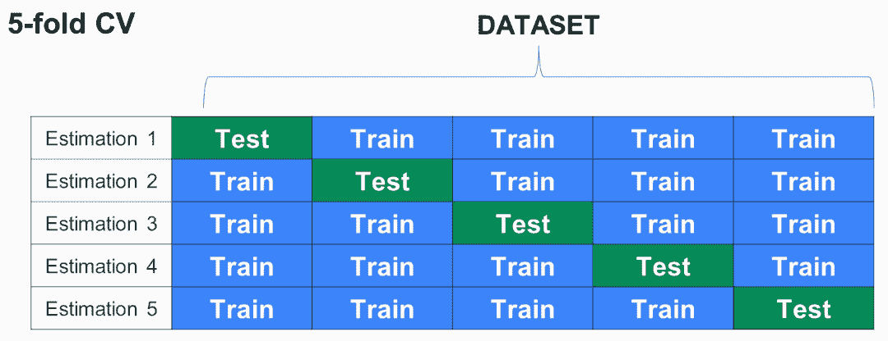

在这里，我们看到我们的数据集被划分为五个部分。我们使用第一部分进行测试，其余部分用于训练。

以下是我们在 5 折交叉验证方法中遵循的步骤：

1.  我们获得了评估指标的首次估计。

1.  我们使用第二部分进行测试，其余部分用于训练，并用其获取评估指标的第二次估计。

1.  我们使用第三部分进行测试，其余部分用于训练，依此类推。这样，我们会得到五次评估指标的估计。

在 k 折交叉验证中，观察到* k *次评估矩阵后，我们会取其平均值。这将为我们提供模型性能的更好估计。因此，我们不仅能获得该评估指标的一个估计，而是通过 k 折交叉验证获得*n*次估计，然后取其平均值，从而为模型性能提供更好的估计。

如此所见，k 折交叉验证方法的优点在于它不仅可以用于模型评估，还可以用于超参数调优。

在这种验证方法中，*k*的常见值为 5 和 10。

以下是 k 折交叉验证的变体：

+   **重复交叉验证：** 在重复交叉验证中，我们会进行多次 k 折交叉验证。所以，如果我们需要 30 次评估指标的估计，我们可以进行 5 折交叉验证六次。这样我们就能得到 30 次评估指标的估计。

+   **留一法（LOO）交叉验证：** 在这种方法中，我们使用整个数据集进行训练，除了一个数据点。我们使用这个数据点进行评估，然后对数据集中的每个数据点重复此过程。

如果我们有数百万个数据点，这种验证方法在计算上会非常昂贵。在这种情况下，我们使用重复的 k 折交叉验证，因为这种验证方法能够提供相对较好的结果。

# 实现 k 折交叉验证

让我们以`diamond`数据集为例来理解 k 折交叉验证的实现。

在`scikit-learn`中执行 k 折交叉验证时，我们首先需要导入将要使用的库。以下代码片段展示了用于导入库的代码：

```py
import numpy as np
import matplotlib.pyplot as plt
import pandas as pd
%matplotlib inline
```

第二步是准备我们将在此示例中使用的`diamond`数据集。以下展示了用于准备该数据集数据的代码：

```py
# importing data
data_path= '../data/diamonds.csv'
diamonds = pd.read_csv(data_path)
diamonds = pd.concat([diamonds, pd.get_dummies(diamonds['cut'], prefix='cut', drop_first=True)],axis=1)
diamonds = pd.concat([diamonds, pd.get_dummies(diamonds['color'], prefix='color', drop_first=True)],axis=1)
diamonds = pd.concat([diamonds, pd.get_dummies(diamonds['clarity'], prefix='clarity', drop_first=True)],axis=1)
diamonds.drop(['cut','color','clarity'], axis=1, inplace=True)
```

准备好数据后，我们将创建用于建模的对象。以下展示了用于创建建模对象的代码：

```py
from sklearn.preprocessing import RobustScaler
target_name = 'price'
robust_scaler = RobustScaler()
X = diamonds.drop('price', axis=1)
X = robust_scaler.fit_transform(X)
y = diamonds[target_name]
# Notice that we are not doing train-test split
#X_train, X_test, y_train, y_test = train_test_split(X, y, test_size=0.2, random_state=55)
```

这是我们在第一章《回归与分类的集成方法》中使用的相同单元格。这里的区别是我们没有使用`train_test_split`函数。在这里，我们正在生成`X`矩阵，其中包含所有特征，同时也包含我们的目标特征。因此，我们有了`X`矩阵和`y`向量。

在训练模型时，我们将实例化我们的`RandomForestRegressor`函数，经过测试，我们发现它是第一章《回归与分类的集成方法》中最适合该数据集的模型。以下展示了实例化`RandomForestRegressor`函数的代码**：**

```py
from sklearn.ensemble import RandomForestRegressor
RF = RandomForestRegressor(n_estimators=50, max_depth=16, random_state=123, n_jobs=-1)
```

为了执行 k 折交叉验证，我们从`scikit-learn`的`model_selection`模块中导入了`cross_validate`函数。以下展示了导入`cross_validate`函数的代码：

```py
# this will work from sklearn version 0.19, if you get an error 
# make sure you upgrade: $conda upgrade scikit-learn
from sklearn.model_selection import cross_validate
```

这个`cross_validate`函数的工作原理如下：

+   我们提供了估算器，它将是`RandomForestRegressor`函数。以下展示了应用`RandomForestRegressor`函数的代码：

```py
 scores = cross_validate(estimator=RF,X=X,y=y,
 scoring=['mean_squared_error','r2'],
 cv=10, n_jobs=-1)
```

在这里，我们传递了`X`对象和`y`对象。

+   我们为该模型和数据集提供了一组我们希望评估的指标。在本例中，评估是使用`mean_squared_error`函数和`r2`指标来完成的，如前面的代码所示。在这里，我们传递了`cv`中的*k*值。因此，在本例中，我们将进行十折交叉验证。

从这个`cross_validate`函数中得到的输出将是一个字典，包含相应的矩阵。为了更好地理解，输出被转换为一个数据框。以下截图展示了用于在数据框中可视化分数的代码以及数据框的输出：

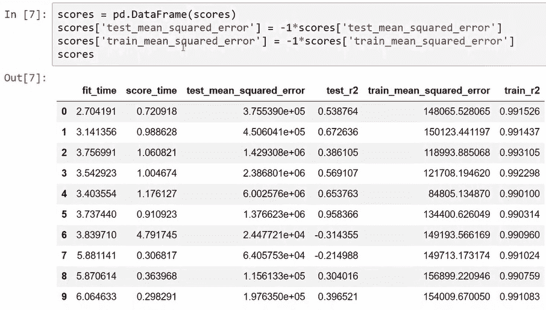

在这里，我们应用了`test_mean_squared_error`和`test_r2`，这正是我们希望评估的两个指标。评估后，我们得到了`train_mean_squared_error`值和`test_r2`集合。因此，我们对测试指标感兴趣。

为了更好地评估模型的性能，我们将对所有单独的测量结果取平均值（均值）。

以下展示了获取`平均测试 MSE`和`平均测试 R 平方`值的代码，以及输出显示它们的值：

```py
print("Mean test MSE:", round(scores['test_mean_squared_error'].mean()))
print("Mean test R-squared:", scores['test_r2'].mean())
```

因此，在这里，通过取平均，我们看到测试 MSE 的均值就是我们这里的值，另外一个指标是 R 平方评估指标的平均值。

# 使用 k 折交叉验证比较模型

由于 k 折交叉验证方法被证明是更好的方法，它更适合用来比较模型。其原因在于，k 折交叉验证提供了对评估指标的更多估计，通过对这些估计进行平均，我们可以更好地评估模型性能。

以下展示了用于导入比较模型的库的代码：

```py
import numpy as np
import matplotlib.pyplot as plt
import pandas as pd
%matplotlib inline
```

导入库之后，我们将导入`diamond`数据集。以下是用于准备这个`diamond`数据集的代码：

```py
# importing data
data_path= '../data/diamonds.csv'
diamonds = pd.read_csv(data_path)
diamonds = pd.concat([diamonds, pd.get_dummies(diamonds['cut'], prefix='cut', drop_first=True)],axis=1)
diamonds = pd.concat([diamonds, pd.get_dummies(diamonds['color'], prefix='color', drop_first=True)],axis=1)
diamonds = pd.concat([diamonds, pd.get_dummies(diamonds['clarity'], prefix='clarity', drop_first=True)],axis=1)
diamonds.drop(['cut','color','clarity'], axis=1, inplace=True)
```

现在，我们需要在准备好数据集以进行模型比较后，准备建模对象。以下展示了用于准备建模对象的代码。在这里，我们有`X`矩阵，表示特征，以及`y`向量，表示该数据集的目标：

```py
from sklearn.preprocessing import RobustScaler
target_name = 'price'
robust_scaler = RobustScaler()
X = diamonds.drop('price', axis=1)
X = robust_scaler.fit_transform(X)
y = diamonds[target_name]
```

在这里，我们将比较 KNN 模型、随机森林模型和集成模型。在这些模型中，使用十折交叉验证，我们将使用`KNNRegressor`、`RandomForestRegressor`和`AdaBoostRegressor`函数。

然后，我们将导入`cross_validate`函数。以下是用于导入这三个模型的`cross_validate`函数的代码：

```py
from sklearn.neighbors import KNeighborsRegressor
from sklearn.ensemble import RandomForestRegressor
from sklearn.ensemble import AdaBoostRegressor
from sklearn.model_selection import cross_validate
```

下一步是使用`cross_validate`函数比较模型。以下是用于比较这三种模型的代码块：

```py
## KNN
knn = KNeighborsRegressor(n_neighbors=20, weights='distance', metric='euclidean', n_jobs=-1)
knn_test_mse = cross_validate(estimator=knn,X=X,y=y,
 scoring='mean_squared_error', 
 cv=10, n_jobs=-1)['test_score']

## Random Forests
RF = RandomForestRegressor(n_estimators=50, max_depth=16, random_state=55, n_jobs=-1)
RF_test_mse = cross_validate(estimator=RF,X=X,y=y,
 scoring='mean_squared_error', 
 cv=10, n_jobs=-1)['test_score']

## Boosting
boosting = AdaBoostRegressor(n_estimators=50, learning_rate=0.05, random_state=55) 
boosting_test_mse = cross_validate(estimator=boosting,X=X,y=y,
 scoring='mean_squared_error', 
 cv=10, n_jobs=-1)['test_score']
```

在这里，我们看到将用于每个模型的测试评估指标的结果。我们使用`mean_squared_error`函数。对于每个模型，我们使用十折交叉验证，获得结果后，我们得到`test_score`变量。这个`test_score`变量在此情况下是均方误差，并在以下代码中显示：

```py
 mse_models = -1*pd.DataFrame({'KNN':knn_test_mse,
 'RandomForest': RF_test_mse,
 'Boosting':boosting_test_mse})
```

下图展示了运行每个模型的十折交叉验证后得到的结果代码，并且展示了三种模型的 10 次评估指标估算值的表格：

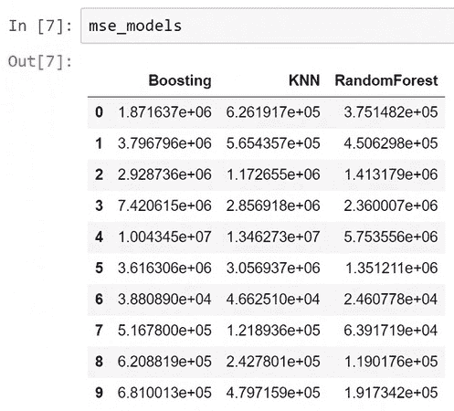

该表展示了每个模型评估值的较大变化。为了了解任何模型的实际表现，我们取结果的平均值。因此，在前面的图表中，我们取所有值的均值后再绘制。

下图展示了用于计算均值的代码，以及显示每个模型的均值 MSE 值的图表：

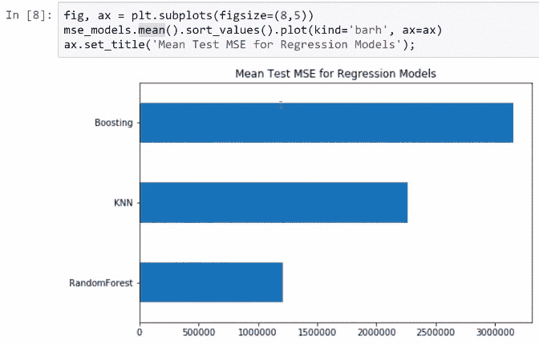

经平均后，随机森林模型在这三种模型中表现最好。因此，经过平均后，第二名是 KNN 模型，集成模型则排名最后。

下图展示了用于获取这些评估指标箱线图的代码，以及显示三种模型箱线图的结果：

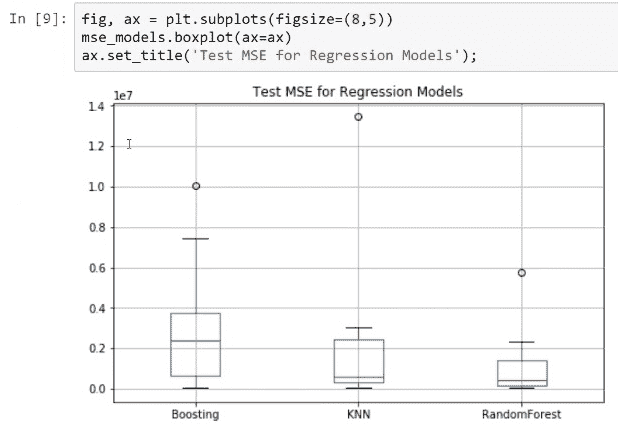

因此，观察这些评估指标的箱线图，我们看到随机森林表现最佳。

为了检查这些模型的变异度，我们可以分析回归模型测试 MSE 的标准差。以下截图展示了用于检查变异度的代码，以及展示这些模型标准差的图表：

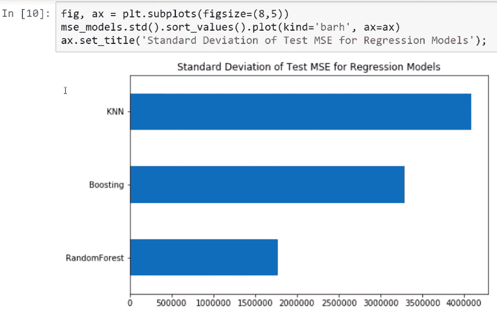

上面的截图显示，在这个案例中，最常用的模型是 KNN 模型，其次是提升模型，而随机森林模型的变化最小。所以，在这三种模型中，随机森林模型是最好的。即使对于这个数据集，随机森林模型表现最佳。

# 超参数调优介绍

用于选择特定数据集的最佳估算器或选择所有超参数最佳值的方法称为**超参数调优**。超参数是那些在估算器中不能直接学习的参数。它们的值由建模人员决定。

例如，在`RandomForestClassifier`对象中，有许多超参数，如`n_estimators`、`max_depth`、`max_features`和`min_samples_split`。建模人员决定这些超参数的值。

# 穷举网格搜索

执行超参数调优的一个非常重要且常用的方法叫做**穷举网格搜索**。这是一种暴力搜索方法，因为它会尝试所有超参数网格中的组合。然后，对于每个超参数组合，使用 k 折交叉验证和任何其他指定的度量标准来评估模型。所以，给出最佳度量标准的组合将由我们将在`scikit-learn`中使用的对象返回。

让我们来看一个超参数网格的例子。在这里，我们尝试为`n_estimators`超参数选择三个不同的值，如 10、30 和 50。我们为`max_features`选择两个选项，如 auto 和平方根，并为`max_depth`分配四个值——5、10、20 和 30。所以，在这种情况下，我们将有 24 种超参数组合。这 24 个组合将会被评估。在这 24 个组合的每一种情况下，我们使用十折交叉验证，计算机将训练并评估 240 个模型。网格搜索面临的最大缺点是维度灾难，接下来的章节将详细讨论。维度灾难本质上意味着，随着参数数量的增加，你需要评估模型的次数会呈指数级增长。

如果某些超参数组合没有被测试，则可以将不同的网格传递给`GridSearchCV`对象。在这里，可以通过字典列表的形式传递不同的网格，因为每个网格在`scikit-learn`中都是一个字典。

永远不要使用整个数据集来调优参数，调优参数时始终进行训练集-测试集划分，否则超参数可能会过拟合于特定数据集，导致模型无法很好地泛化到新数据。

因此，我们进行训练集-测试集划分，并使用数据集的一部分来学习模型的超参数；我们留作测试的部分应当用于最终模型评估，之后再使用整个数据集来拟合模型。

# 在 scikit-learn 中的超参数调优

让我们以`diamond`数据集为例来理解`scikit-learn`中的超参数调整。

为了进行超参数调整，我们首先需要导入我们将使用的库。导入库的代码如下：

```py
import numpy as np
import matplotlib.pyplot as plt
import pandas as pd
from sklearn.metrics import mean_squared_error
%matplotlib inline
```

接着，我们对将用于本示例的`diamond`数据集进行转换。以下展示了为该数据集准备数据的代码：

```py
# importing data
data_path= '../data/diamonds.csv'
diamonds = pd.read_csv(data_path)
diamonds = pd.concat([diamonds, pd.get_dummies(diamonds['cut'], prefix='cut', drop_first=True)],axis=1)
diamonds = pd.concat([diamonds, pd.get_dummies(diamonds['color'], prefix='color', drop_first=True)],axis=1)
diamonds = pd.concat([diamonds, pd.get_dummies(diamonds['clarity'], prefix='clarity', drop_first=True)],axis=1)
diamonds.drop(['cut','color','clarity'], axis=1, inplace=True)
```

在准备好数据后，我们将创建用于建模的对象。以下展示了创建建模对象的代码：

```py
from sklearn.preprocessing import RobustScaler
from sklearn.model_selection import train_test_split
target_name = 'price'
robust_scaler = RobustScaler()
X = diamonds.drop('price', axis=1)
X = robust_scaler.fit_transform(X)
y = diamonds[target_name]
X_train, X_test, y_train, y_test = train_test_split(X, y, test_size=0.1, random_state=123)
```

在执行并创建用于建模的对象之后，我们执行`train_test_split`函数。在前面的代码块中，我们将数据的 10%（0.1）用于测试，因此这一部分数据将在调整超参数后用于模型评估。

我们将使用以下参数来调整`RandomForestRegressor`模型：

+   `n_estimators`：此参数表示森林中树的数量。

+   `max_features`：此参数表示在寻找最佳分割时考虑的特征数量。可选择的选项有`n_features`，对应于自动超参数，或者特征数量的`log2`平方根。

+   `max_depth`：此参数表示树的最大深度。

将使用不同的网格搜索值来调整这些参数。对于`n_estimators`和`max_depth`，我们将使用四个不同的值。对于`n_estimators`，我们将使用`[25,50,75,100]`作为值，对于`max_depth`，我们将使用`[10,15,20,30]`作为值。对于`max_features`，我们将使用自动和平方根。

现在我们将显式实例化`RandomForestRegressor`模型，不带任何超参数。以下展示了用于实例化它的代码：

```py
from sklearn.ensemble import RandomForestRegressor
RF = RandomForestRegressor(random_state=55, n_jobs=-1)
```

参数网格基本上是一个字典，其中我们传递超参数的名称和我们想尝试的值。以下代码块展示了具有不同参数的参数网格：

```py
 parameter_grid = {'n_estimators': [25,50,75,100], 
 'max_depth': [10,15,20,30],
 'max_features': ['auto','sqrt']}
```

总的来说，我们有四个`n_estimators`值，四个`max_depth`值，以及两个`max_features`值。因此，计算后，总共有 32 种超参数组合。

为了在`scikit-learn`中执行超参数调整，我们将使用`GridSearchCV`对象。以下展示了用于从`scikit-learn`导入该对象的代码：

```py
from sklearn.model_selection import GridSearchCV
```

在这里，我们传递我们想要调整的估算器，在此案例中是`RandomForestRegressor`。以下截图展示了使用的代码和我们得到的输出：

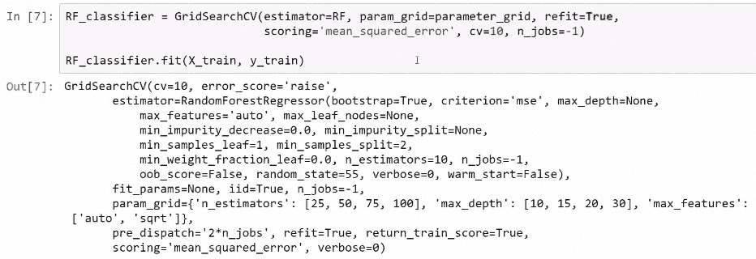

然后我们传递要尝试的参数网格。在这里，`refit`表示该估计器对象将使用通过网格搜索和交叉验证过程找到的最佳参数进行重新拟合。这是该对象用来评估所有可能超参数组合的评估指标。在这个例子中，我们将使用十折交叉验证。创建完之后，我们可以使用`fit`方法并传递训练对象。由于我们使用的是十折交叉验证，并且有 32 种组合，模型将评估 320 个模型。

我们可以使用从`GridSearchCV`方法创建的对象中的`cv_results_`属性来获取结果。以下截图展示了获取结果的代码和输出结果：

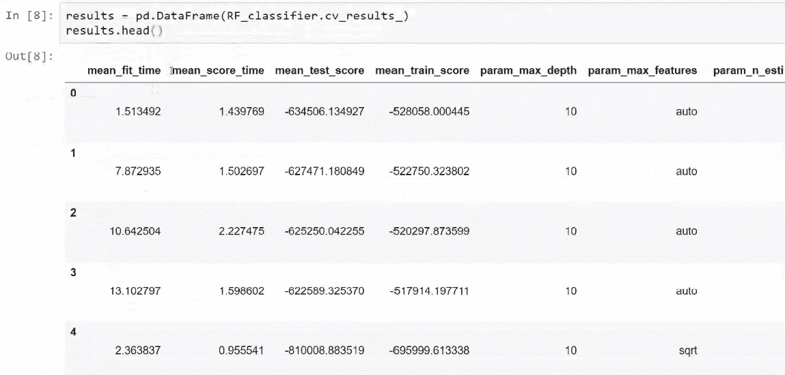

在这里，最重要的是获取`best_params_`。通过`best_params_`，我们可以看到所有 32 种组合的参数。以下截图展示了获取参数的输入和显示最佳结果的参数组合的输出：

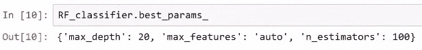

在这里，我们可以看到能给出`best_params_`的组合是`max_depth`值为`20`，`max_features`值为 auto，`n_estimators`值为`100`。所以这是参数的最佳组合。

我们还可以获取`best_estimator_`对象，这个对象包含了完整的超参数列表。以下截图展示了获取`best_estimator_`的代码和输出结果：

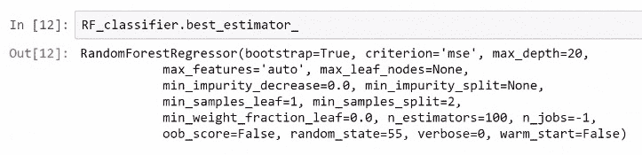

所以，在调优了随机森林模型的超参数后，我们得到的值与之前得到的值不同；之前我们设置`n_estimators`为`50`，`max_depth`为`16`，`max_features`为 auto 时，模型的参数是未调优的。

# 比较调优和未调优的模型

我们可以将调优后的最佳模型与未调优的最佳模型进行比较，后者的`n_estimators`值为`50`，`max_depth`值为`16`，`max_features`为 auto，在这两种情况下，都是使用随机森林。以下代码展示了调优和未调优模型的参数值：

```py
## Random Forests
RF_model1 = RandomForestRegressor(n_estimators=50, max_depth=16, random_state=123, n_jobs=-1)
RF_model1.fit(X_train, y_train)
RF_model1_test_mse = mean_squared_error(y_pred=RF_model1.predict(X_test), y_true=y_test)

## Random Forest with tunned parameters 
RF_tunned_test_mse = mean_squared_error(y_pred=RF_classifier.predict(X_test), y_true=y_test)
```

要实际看到调优和未调优模型之间的比较，我们可以查看均方误差的值。以下截图展示了获取两个模型的`mean_squared_error`值的代码，以及比较两个模型 MSE 值的图表：

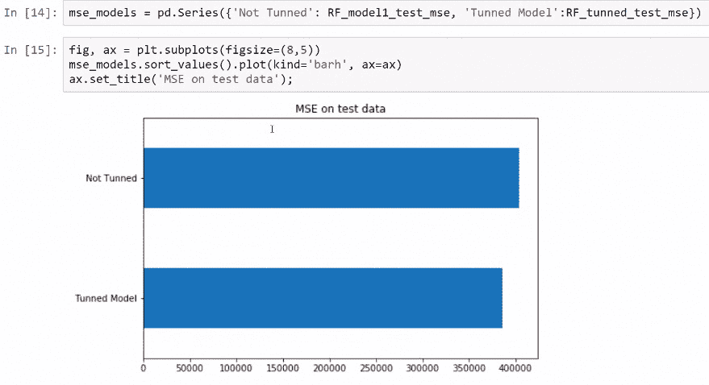

我们可以清楚地观察到，在比较中，这些调优后的参数在两个随机森林模型中表现得比未调优的参数更好。

为了查看两个模型之间的实际数值差异，我们可以做一些计算。以下截图展示了如何计算改进的百分比，并输出实际的百分比值：

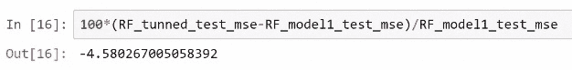

在这里，调优后的模型比未调优的模型提高了 4.6%，这是一个非常好的结果。在这些模型中，即使是 1%-3%的改进也可能产生巨大的实际影响。

# 总结

在本章中，我们了解了交叉验证及其不同方法，包括保持法交叉验证和 k 折交叉验证。我们了解到，k 折交叉验证其实就是多次进行保持法交叉验证。我们使用`diamond`数据集实现了 k 折交叉验证。我们还通过 k 折交叉验证比较了不同的模型，并找到了表现最佳的模型——随机森林模型。

然后，我们讨论了超参数调优。我们遇到了穷举网格搜索方法，这是一种用于执行超参数调优的方法。我们再次使用`diamond`数据集实现了超参数调优。我们还比较了调优后的模型和未调优的模型，发现调优后的参数使得模型表现优于未调优的模型。

在下一章，我们将学习特征选择方法、降维技术和**主成分分析**（**PCA**），以及特征工程。我们还将学习一种通过特征工程改进模型的方法。
