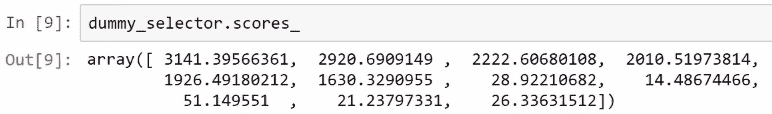
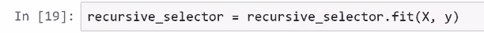
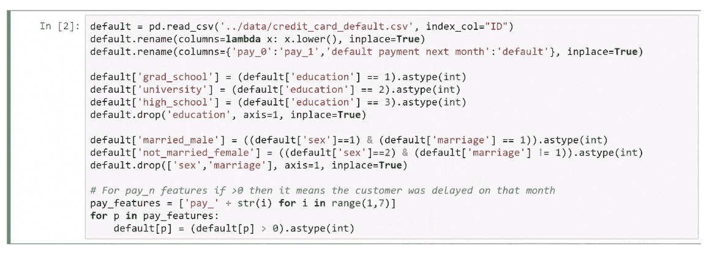
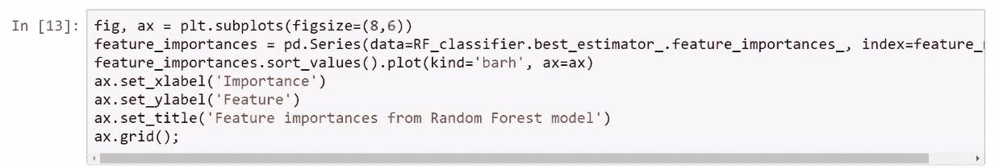

# 第三章：特征工程

本章将详细探讨特征在特征工程技术中的重要作用。我们将学习一些技术，这些技术将帮助我们从两个方面改进预测分析模型：一是提升模型的性能指标，二是理解特征与我们试图预测的目标变量之间的关系。

本章将涵盖以下主题：

+   特征选择方法

+   降维和 PCA

+   创建新特征

+   通过特征工程改进模型

# 特征选择方法

特征选择方法用于选择可能有助于预测的特征。以下是三种特征选择方法：

+   去除低方差的虚拟特征

+   统计学上识别重要特征

+   递归特征消除

在构建预测分析模型时，某些特征可能与目标无关，这将对预测帮助较小。问题在于，将无关特征包含在模型中可能会引入噪声并增加模型的偏差。因此，特征选择技术是一系列技术，用于选择最相关和有用的特征，以帮助预测或理解我们的模型。

# 去除低方差的虚拟特征

我们将学习的第一种特征选择技术是去除低方差的虚拟特征。到目前为止，我们对特征进行的唯一变换是使用编码技术转换类别特征。如果我们取一个类别特征并使用这种编码技术，我们会得到一组虚拟特征，需要检查这些特征是否具有变异性。因此，方差非常低的特征可能对预测几乎没有影响。那么，为什么会这样呢？假设你有一个数据集，其中有一个性别特征，且 98%的样本都是女性。这个特征对预测没有任何影响，因为几乎所有的样本都属于同一类别，所以变异性不足。这些样本成为待淘汰的候选项，这类特征应该更仔细地进行检查。接下来，看看以下公式：

你可以去除在超过 x%的样本中为 0 或 1 的所有虚拟特征，或者你可以为这些特征建立一个最小方差阈值。现在，这些特征的方差可以通过前面的公式计算，其中**p**是虚拟特征中**1**的数量或比例。我们将在 Jupyter Notebook 中看到这种方法的应用。

# 统计学上识别重要特征

这种方法将帮助你利用一些统计检验来识别和选择相关特征。举个例子，对于分类任务，我们可以使用 ANOVA F 统计量来评估数值特征与目标之间的关系，目标将是一个分类特征，因为这是经典任务的例子。或者，评估分类特征与目标之间的统计关系时，我们将使用卡方检验来评估这种关系。在`scikit-learn`中，我们可以使用`SelectKBest`对象，接下来我们将展示如何在 Jupyter Notebook 中使用这些对象。

# 递归特征消除

识别重要特征并去除我们认为不重要的特征的过程叫做**递归特征消除**（**RFE**）。RFE 也可以在`scikit-learn`中应用，我们可以使用这种技术来计算系数，比如线性回归、逻辑回归，或者通过模型计算所谓的**特征重要性**。随机森林模型为我们提供了这些特征重要性指标。因此，对于那些不计算系数或特征重要性的模型，无法使用这些方法；例如，对于 KNN 模型，你不能应用 RFE 技术，因为这首先要求预定义模型中需要使用的特征。使用所有特征时，该方法先拟合模型，然后基于系数或特征重要性，最不重要的特征被消除。这个过程会在选定的特征集上递归重复，直到最终选择出所需数量的特征。

选择模型中重要特征的方法如下：

+   L1 特征

+   选择阈值方法

+   基于树的方法

让我们进入 Jupyter Notebook，看看我们如何在`scikit-learn`中实际应用这些方法。以下截图展示了需要导入的必要库和模块：

在下面的截图中，我们首先使用了信用卡默认数据集，并对原始数据应用了传统的转换方法：

以下截图展示了数据集中我们拥有的虚拟特征和数值特征，取决于特征的类型：

在这里，我们应用了特征建模的缩放操作：

在演示中我们讨论的第一个方法是使用`var()`方法去除低方差的虚拟特征，从而得到特征的方差：

让我们只查看虚拟特征的方差。例如，方差的阈值将仅考虑方差大于`0.1`的虚拟特征。在这种情况下，使用 0.1 作为阈值，`pay_5`和`pay_6`这两个候选特征将是第一个需要删除的方差较低的虚拟特征。请看下面的截图，展示了候选的删除特征：

我们讨论的第二种方法是通过统计方法选择与目标相关的特征，我们有两种情况，虚拟特征和数值特征。

让我们对虚拟特征执行统计检验。我们将从`scikit-learn`库中的`feature_selection`模块导入`chi2`对象。我们还将使用`SelectKBest`对象，对所有虚拟特征执行统计检验，如下图所示：

在这里，我们实例化了一个名为`dummy _selector`的对象，并传入了要应用的统计检验。这里，我们传入了`k ="all"`参数，因为这个统计检验是应用于所有的虚拟特征。实例化这个对象后，调用`fit()`方法。请看下面的截图：

在下图中，我们展示了卡方得分。这不是一个统计检验，数字越大，特征与目标之间的关系越强：

现在，如果你还记得你的统计学课，这其实是一个假设检验的设置。因此，我们也可以计算 p 值，并且可以说，`pvalues_`大于`0.05`的特征与目标没有关系。现在，在这种情况下，我们得到所有特征的非常小的 p 值，如下图所示：

目标与所有虚拟特征之间都有关系，因此在这种方法下，我们不应该删除任何一个虚拟特征。

现在，我们可以使用另一个统计检验方法，叫做`f_ classif`，来评估数值特征与目标之间的关系，如下图所示：

重新使用这个`f_classif`对象，我们将传入所需的统计检验和特征数量。在这种情况下，我们希望将检验应用于所有数值特征，然后再次使用`fit()`方法，处理数值特征和目标：

我们从这个统计检验中得到的 p 值如下图所示：

我们可以通过`f_classif`统计检验，然后选择那些 p 值大于`0.05`的数值特征，这通常是统计检验的阈值；这里得到的特征是`bill_amt4`、`bill_amt5`和`bill_amt6`，这些特征可能不相关或与目标无关：

我们有三个待排除的候选特征，可以排除也可以保留。我们已经使用了前面步骤中的第二种技术，现在我们将在下一部分使用第三种技术。

RFE 是我们将使用`RandomForestClassifier`模型的第三种技术，记住这里有 25 个特征：

所以，假设我们只想选择 12 个特征，并且我们希望使用仅包含 12 个特征的模型。也就是说，我们只使用了大约一半的特征。我们可以使用`scikit-learn`中的`RFE`对象，来自`feature_selection`模块。我们可以用它来实际选择这 12 个特征，使用 RFE 技术。所以，我们通过传递所需的估计器和要选择的特征数量来实例化这个对象：

现在，记住随机森林为我们提供了特征重要性度量，这可以与 RFE 技术一起使用：

在对整个数据集使用`fit()`方法后，我们得到`recursive_selector.support_`，对于包含在模型中的特征（我们想要的 12 个特征）返回`True`，而对于应该排除的特征返回`False`：

所以，根据这个对象和方法，我们应该在我们的随机森林模型中包含 12 个最重要的特征，以便预测目标，比如`limit_bal`、`age`、`pay`，所有账单金额，以及`pay_amt1`、`pay_amt2`和`pay_amt3`，如以下截图所示：

这些是应该被排除的特征，因为根据这个方法和模型，它们与预测目标的相关性不大：

现在我们可以评估更简单的模型，这个模型只有 12 个特征，与我们目前为止使用的完整模型进行比较，然后我们可以使用交叉验证来计算这些指标。所以，在这个例子中，我们使用了 10 折交叉验证来估算这两个模型的性能。记住，这个选择器模型是根据 RFE 技术得到的完整模型，以下是结果：

完整模型的召回率是`0.361365`，而只包含 12 个特征的模型的召回率是`0.355791`。由于这个模型的召回率较低，完整模型依然是最好的。但是，如果我们使用一半的特征，完整模型也会给出类似的表现：

正如你在下面的截图中看到的那样，这些值非常接近：

现在，你可以决定是使用完整模型，还是使用更简单的模型。这个取决于你，但在准确性方面，我们几乎得到了相同的结果，尽管完整模型的准确性稍微高一些：

现在，你有了一种技术来决定是否使用一个更复杂的模型，它使用更多的特征，或者使用一个更简单的模型。

# 降维和 PCA

降维方法是通过获取一组主变量来减少考虑的特征数量的过程。**主成分分析**（**PCA**）技术是用于降维的最重要技术。在这里，我们将讨论为什么需要降维，并且还将看到如何在`scikit-learn`中执行 PCA 技术。

这些是在进行预测分析时拥有大量特征的原因：

+   它使得模型简化，从而更容易理解和解释。如果你处理的是成千上万的特征，可能会涉及一些计算上的考虑。在这种情况下，减少特征数量有助于节省计算资源。

+   另一个原因是避免“维度灾难”。这是一个技术术语，指的是当你处理高维数据时会遇到的一组问题。

+   这也有助于我们减少过拟合，因为如果你包含了很多无关的特征来预测目标，那么你的模型可能会对这些噪声过拟合。因此，去除无关特征有助于避免过拟合。

本章之前看到的特征选择可以被认为是一种降维方式。当你拥有一组密切相关甚至冗余的特征时，PCA 将是首选技术，用更少的特征编码相同的信息。那么，什么是 PCA 呢？它是一种统计过程，将一组可能相关的变量转换为一组线性不相关的变量，称为**主成分**。我们不深入讨论 PCA 背后的数学细节。

假设我们有一个二维的数据集。PCA 识别出一个方向，在这个方向上数据集变化最大，并将这两个特征上的最大信息量编码成一个特征，从而将维度从二维降低到一维。此方法将每个点投影到这些轴或新的维度上。

正如你在下面的截图中看到的那样，这两个特征的第一个主成分将是这些点投影到红线上的结果，这就是 PCA 中发生的主要数学直觉：

现在，让我们进入 Jupyter Notebook，看看如何实现降维方法并在给定的数据集上应用 PCA：

在这种情况下，我们将使用信用卡违约数据集。所以，在这里我们做了到目前为止我们已覆盖的转换：

现在，让我们看看账单金额特征。我们有这六个特征，它们是来自一到六个月前的账单金额历史，正如你从以下截图中生成的可视化中看到的，它们密切相关：

所以，它们表示相同的信息。如果你看到一个客户在两三个月前账单金额非常高，那很有可能他在一个月前也有非常高的账单金额。正如你从以下截图中的可视化中看到的，这些特征真的有很高的相关性：

我们通过计算相关系数来确认这一点。正如你所看到的，它们的相关性非常高：

账单金额一个月前和两个月前之间的相关系数为`0.95`。我们有非常高的相关性，这是应用降维技术的一个好机会，比如在`scikit-learn`中的 PCA，我们从`sklearn.decomposition`导入它，如下截图所示：

之后，我们实例化这个`PCA`对象。然后，我们传入我们想要应用 PCA 分解的列或特征：

所以，在使用从该对象派生的`fit()`方法后，我们获得了其中一个属性——解释方差比率，如下图所示：

让我们绘制这个量，以便了解这些特征的情况。正如你在这里看到的，我们得到了所有六个组件的解释方差：

阅读这个图的方式是，我们对这六个特征做的 PCA 的第一个成分编码了所有六个特征总方差的 90%以上。第二个成分展示了非常小的方差，第三、第四、第五和第六个成分也有最小的方差。

现在，我们可以在以下截图中看到累积解释方差的图像：

如你所见，第一个主成分编码了我们使用的六个特征中超过 90%的方差。因此，你只用一个特征就能获得超过 90%的信息。因此，与你使用六个特征相比，你只需使用一个特征就能得到超过 90%的方差。或者，你可以使用前两个主成分，通过这两个主成分就能获得六个特征中超过 95%的信息。所以，这就是实际操作的方式，我们可以将其作为进行特征工程的一种技术。

# 特征工程

特征工程在使机器学习算法有效工作中起着至关重要的作用，如果执行得当，它可以增强机器学习算法的预测能力。换句话说，特征工程是从原始数据中提取现有特征或利用领域知识、问题背景或专业技术创造新特征的过程，从而得出更准确的预测模型。这是一个领域知识和创造力发挥重要作用的活动。这是一个重要的过程，能够显著提高我们预测模型的性能。你对问题的背景了解得越多，创造新特征的能力就越强。基本上，特征工程过程将特征转换为算法可以理解的输入值。

实现特征工程的方式有很多种。你可能不会发现所有技术都可行，可能最终会排除一些方法。这里的目的不是进行学术讨论，而是展示一些我们在处理特征和尝试创建新特征时常用的技术。第一种是特征缩放，用于将特征的范围转换为更合适的范围。另一种是更好的编码信息，稍后我们将在本章中看到一个例子。特征工程涉及从现有特征中创建新特征，以便通过对它们进行一些数学运算来组合现有特征。

另一种创建新特征的方式是使用降维技术，比如我们之前看到的 PCA。无论你使用什么技术，只要能够富有创造性就行。如前所述，你对问题了解得越多，效果就越好。

# 创建新特征

我们将在这里使用信用卡违约和钻石数据集。现在，让我们进入 Jupyter Notebook，创建新特征，并看看这些技术如何在实践中应用：

让我们通过执行几个命令来导入信用卡违约数据集，具体操作请参考下面的截图：

我们将做的第一个转换是创建另一种编码`education`特征信息的方式。到目前为止，我们在`education`特征中使用了一种编码技术，我们将利用`x`变量的上下文来提出另一种编码方式。具有研究生教育水平的人，比其他教育水平的人更受教育。因此，我们可以为这些特征想出某种积分系统；例如，我们可以给具有研究生教育的人分配两分，给具有大学教育的人分配一分，并为数据集中其他教育水平的人分配负分。

让我们看一下下面的截图，看看这是如何做到的：

上面的截图反映了我们在这些教育水平中的顺序，所以这可能是另一种编码信息的方式。这可能有助于或可能没有帮助于预测下个月的违约者。然而，我们可以尝试这种新技术来编码这些信息，并查看接下来的截图中的结果：

我们可以在这个数据集中使用的另一个技巧是，利用账单金额和支付金额特征，在这个问题的背景下计算这两个变量/特征之间的差异。因此，如果我们取某个月的账单金额，并减去该月的支付金额，就会得到一个数值或数量。在这个示例中，我们将其称为`bill_minus_pay`变量，代表客户在该月针对账单支付的金额。因此，这个新衍生的数量可以用来预测下个月的违约者。我们已经将其包含在这个数据集的潜在预测模型中：

现在让我们来看一下下面的输出，它显示了某个月的违约者情况：

现在，我们可以使用另一种方法，既然我们已经有了这些特征的一部分信息，在一个名为`bill_minus_pay`的新特征中，我们可以使用 PCA 技术将前面截图中显示的六个特征的主要信息总结为仅一个特征：

我们可以对支付特征做同样的操作。从之前的分析中，我们知道`pay_1`特征对于预测谁将下一个支付非常重要。因此，为了将其他五个`pay_i`特征减少到仅两个，我们将六个账单金额特征减少到仅一个，并将六个`pay_i`特征减少到两个。除此之外，我们再次在剩余的五个`pay_i`特征上应用 PCA 技术，将这五个特征减少到仅一个。看看下面的截图：

这些是一些特征工程技术，带有示例，您可以在数据集中执行这些操作，但您可能希望根据现有特征创建其他转换或变量。

现在，让我们看几个钻石数据集的例子。我们需要通过执行几个命令来导入钻石数据集，如下图所示：

如前面的截图所示，我们已经使用编码技术对一些分类特征进行了转换。现在，让我们来看一下我们导入的数据集，如下图所示：

这是我们四个特征的散点图矩阵：`x`、`y`、`z` 和 `price`。前三个特征指的是钻石的测量值，而`price`表示这三个特征与钻石定价之间的关系：

在前面的截图中，正如你所看到的，前三个特征之间有非常强的线性关系，这也是该散点图矩阵中的一个有趣之处。

由于钻石是三维物体，我们将这三个特征合并成一个单一的特征，称为体积。

现在，我们将乘以`x`、`y`和`z`轴的测量值，这将得出一个接近该物体体积的数字：

现在我们知道它们不是盒子，而且没有固定的形状。然而，这将是一个非常好的体积近似值。因此，这可以是我们从数据集中现有特征中创建新特征体积的另一种方法。

在下一个截图中，我们有了物体的体积，以及钻石的重量（以`克拉`为单位），我们将使用这些来创建一个新的特征，称为`密度`：

正如你在前面的截图中看到的，我们将克拉除以体积，从而得到钻石物体的密度。

这是我们如何从给定的背景中创建两个特征，这也证明了“对问题的知识或背景越多，效果越好”这一说法。正如你所看到的，凭借仅有的背景知识，我们能够提出新的特征。

现在，让我们试着看看这些特征在预测模型中的帮助。我们将在这里使用的例子是，如何将现有特征组合起来生成新的特征。下图展示了体积与价格之间的紧密关系：

我们可以假设体积在预测价格中会有帮助。

然而，在下面的密度与价格的散点图中，我们发现所有钻石的预期密度都是相同的：

当我们看到 `price` 和 `carat` 之间的相关性时，正如我们之前所说，似乎 `density` 与 `price` 的关系不大：

所以，这个新特征可能对预测帮助不大。`volume` 和 `carat` 特征之间有相似的关系。我们可能无法通过这个特征获得太多的预测能力，但解释这个例子的主要目的是展示如何结合数据集中已有的不同特征来创建新特征。

这就是特征工程的核心。你也许还可以为这个数据集提出其他特征。

# 通过特征工程改进模型

现在我们已经看到特征工程技术如何帮助构建预测模型，接下来让我们尝试提高这些模型的性能，并评估新构建的模型是否比之前的模型表现得更好。然后，我们将讨论两个在进行预测分析时必须始终牢记的重要概念，这就是预测模型中的可约误差和不可约误差。

首先，我们需要导入必要的模块，如下图所示：

所以，让我们进入 Jupyter Notebook，看看我们在本章前面看到的信用卡违约数据集，但正如你所看到的，这个数据集已经做了一些修改：

对于这个模型，之前我们一直在使用的 `sex` 和 `marriage` 特征被转换成了两个虚拟特征——`male` 和 `married`；因此，让我们以稍微不同的方式编码这些信息，看看这种方式是否更有效。所以，我们将这些信息编码为 `married_male` 和 `not_married_female`，并看看这种方法是否更好。这是我们在这里进行的第一次转换。数据集如下所示：

现在，让我们做一些更多的特征工程。我们首先要做的是计算这些新特征，这些特征是通过从账单金额中减去支付金额得到的，如下图所示：

对于这个问题，我们将执行一个数学操作。我们将使用前面截图中显示的新特性来预测目标。账单金额特性中的大部分信息现在已编码到这些特性中，因此这些特性不再需要，但我们可以做的是使用 PCA 技术将六个账单金额特性减少到一个特性。因此，让我们应用 PCA 技术将六个特性减少到一个组件。现在有一个新的特性叫做`bill_amt_new_feat`。这就是我们执行的第二个特性工程步骤。最后，对于`pay_i`特性，我们将保留第一个特性不变，并对最后五个特性`pay_2`、`pay_3`、`pay_4`、`pay_5`和`pay_6`应用 PCA 技术，将这五个特性减少为两个组件。你可以使用`PCA`对象的`fit_transform`方法来获取这些组件。

现在，让我们看看下面的截图，展示了所有与金钱相关的特性。正如你所看到的，这里的方差非常大，因为货币金额很大：

现在，通过将这些特性除以 1,000 来重新缩放它们，以减少方差，如下图所示：

这有助于我们使这些数字更易理解。因此，这就是我们进行的另一个转换，现在让我们使用这些新特性来训练我们的模型。

# 训练你的模型

以下模型是一个新模块，因为它与其他模型相比具有不同的特性。由于特性发生了变化，我们需要使用`GridSearchCV`模块为`RandomForestClassifier`模块找到最佳超参数。因此，之前找到的最佳参数可能不适合这些新特性；因此，我们将再次运行`GridSearchCV`算法：

如下图所示，在这种情况下，这些新特性最佳的参数组合是`max_depth`为`30`，`max_features`为`auto`，`n_estimators`（估计器数量）应该是`100`：

现在，让我们评估我们通过特性工程构建的这个新模型，并与我们之前构建的模型的度量进行比较：

正如你在前面的截图中看到的，我们使用了 0.2 的阈值。该模型生成了`71.39`%的召回率和`37.38`的精确度。这里，精确度相似，但正如前面提到的，召回率可能是我们更应关注的指标，因为它与之前的模型略有不同。我们通过这个模型略微提高了召回率；这个变化可能只有 2%或 3%，看起来不算多，但请记住，在这些金融应用中，1%或 2%的提升在实际中可能意味着大量资金。所以，通过这个小小的特征工程技巧，我们在模型的预测能力上取得了一些微小的改进；接下来我们来看下一个截图中的特征重要性：

你可以在下面这张随机森林模型的截图中评估这个特征重要性是否合理：

你可以将这个特征重要性与之前的进行比较。在应用特征工程后，你可以做很多事情。我们可能会改善性能，并从模型中获得洞见。观察到通过使用这个技巧，我们的模型有所改进。现在，你可以通过不同的方式组合现有特征，以进一步改善模型。这只是一个小而简单的例子，旨在向你展示，你实际上可以通过合适的方式对特征进行调整。

# 可约错误和不可约错误

在继续之前，有两个非常重要的概念需要在预测分析中讲解。错误可以分为以下两种类型：

+   **可约错误**：这些错误可以通过对模型进行一定的改进来减少。

+   **不可约错误**：这些错误是无法减少的。

假设在机器学习中，特征与目标之间的关系通过一个函数表示，如下图所示：

假设目标（**y**）是机器学习的基本假设，特征与目标之间的关系由一个函数表示。由于在大多数情况下，我们认为特征和目标之间的关系具有某种随机性，我们在这里加入了一个噪声项，这在现实中总是存在的。这就是机器学习中的基本假设。

在模型中，我们尝试通过使用实际函数来近似理论函数，同时进行特征工程、调优参数等操作：

因此，我们的预测是这些近似结果应用到概念性或理论性**f**的结果。我们在机器学习中所做的一切，都是通过训练模型来尽量逼近这个**f**函数。

训练模型意味着逼近这个函数。从数学上可以证明，定义为真实**y**与预测**y**之间差异的期望误差，可以分解为两个项。一个项叫做**可约误差**，另一个项叫做**不可约误差**，如以下截图所示：

现在，**不可约误差** 项是该随机项的方差。你无法控制这个项。总会存在一个不可约误差成分。因此，你的模型总是会出错；无论你有多少特征和数据点，你的模型无法始终达到 100%的准确度。我们必须尝试使用更好的、更复杂的方法进行特征工程，并尽量让我们的估计尽可能接近真实函数。仅仅因为你使用了更复杂的模型或拥有更多数据，并不意味着你的模型会完美，你无法精确预测**y**的值，因为几乎所有你将使用的过程都包含一些随机性。所以，这是一个非常有趣部分的结束。

# 摘要

在本章中，我们讨论了特征选择方法，如何区分有用特征和那些在预测中不太可能有帮助的特征。我们讨论了降维，并学习了如何在`scikit-learn`中执行 PCA。我们还讨论了特征工程，并尝试为我们至今使用的数据集提出新的特征。最后，我们通过提出新特征并结合本章所学的所有技术，尝试改进我们的信用卡模型。希望你喜欢本章内容。

在下一章中，我们将学习人工神经网络，并了解在使用神经网络和人工智能时如何使用`tensorflow`库。
