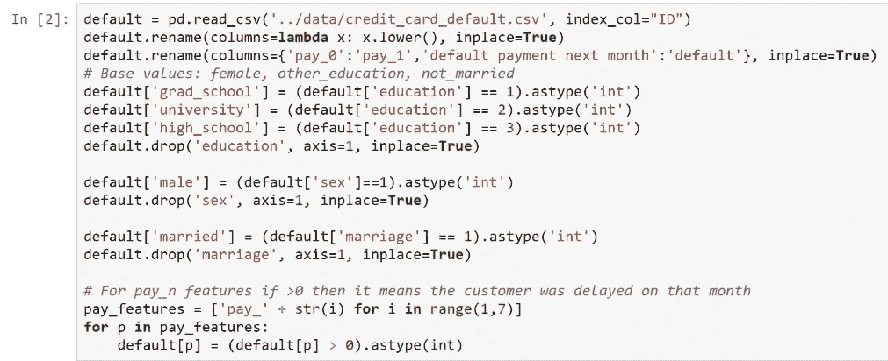
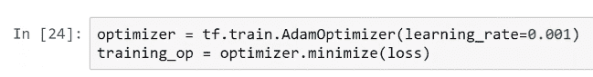

# 第五章：使用 TensorFlow 和深度神经网络进行预测分析

TensorFlow 是由**Google Brain 团队**开发的开源库。它用于大规模机器学习应用，如神经网络，并用于数值计算。开发者可以使用 TensorFlow 创建数据流图，这些图展示了数据的流动。TensorFlow 可以用于训练和运行深度神经网络，用于图像识别、机器语言翻译和自然语言处理等各种应用。

我们已经知道，预测分析是关于对未知事件做出预测。我们将在这里使用 TensorFlow 来实现它。

在本章中，我们将涵盖以下主题：

+   使用 TensorFlow 进行预测

+   使用**深度神经网络**（**DNNs**）进行回归

+   使用 DNNs 进行分类

# 使用 TensorFlow 进行预测

我们将执行深度学习的`hello world`示例。这个示例用于检查和确保模型按预期工作。为此，我们将使用 MNIST 数据集。

# MNIST 数据集简介

MNIST 代表**混合国家标准与技术研究所**，它生成了一个手写数字数据集。这是机器学习中最常被研究的数据集之一，用于分类手写数字。这个数据集因其庞大的规模而有助于预测分析，使得深度学习能够高效地发挥作用。该数据集包含 60,000 个训练图像和 10,000 个测试图像，格式为 28 x 28 像素的单色图像。以下截图显示了该数据集中的图像：


在前面的截图中，我们可以看到，对于每个手写数字，都有一个对应的真实标签；因此，我们可以使用这个数据集来构建分类模型。所以我们可以利用图像将每个手写数字分类为 0 到 9 之间的其中一个数字。

# 使用 MNIST 数据集构建分类模型

让我们来看一下以下步骤，学习如何构建一个分类模型：

1.  我们需要导入在这个数据集中将使用的库。使用以下代码行导入`tensorflow`、`numpy`和`matplotlib`库：

```py
import tensorflow as tf
import numpy as np
import matplotlib.pyplot as plt

from tensorflow.contrib.layers import fully_connected

%matplotlib inline
```

1.  我们将从`tensorflow.contrib.layers`导入`fully_connected`函数，用于构建我们网络的各层。

# DNN 模型的元素

在运行模型之前，我们首先需要确定构建多层感知器模型时将使用的元素。以下是我们将在此模型中使用的元素：

+   **架构**：模型的输入层包含 728 个神经元。这是因为我们有 28 张图像，每张图像有 28 个像素。在这里，每个像素都是一个特征，因此我们有 728 个像素。输出层将包含 10 个元素，我们还将使用三个隐藏层，尽管我们可以使用任意数量的隐藏层。这里，我们将使用三个隐藏层。每个层中神经元的数量为：第一层 350 个，第二层 200 个，最后一层 100 个。

+   **激活函数**：我们将使用 ReLU 激活函数，如以下代码块所示：

```py
vector = np.arange(-5,5,0.1)
def relu(x) :
return max(0.,x)
relu = np.vectorize(relu)
```

如果输入是负数，函数输出`0`；如果输入是正数，函数输出与输入相同的值。因此，从数学上讲，ReLU 函数看起来类似于这个。下面的截图展示了用于生成 ReLU 激活函数图形表示的代码行：


它计算输入值与`0`之间的最大值。这个激活函数将在每个隐藏层的神经元中使用。

+   **优化算法**：这里使用的优化算法是带有学习率 0.01 的梯度下降法。

+   **损失函数**：对于`loss`函数，我们将使用`cross_entropy`函数，但与本书中使用的其他损失函数一样，该函数测量实际值与模型预测值之间的距离。

+   **权重初始化策略**：为此，我们将使用 Xavier 初始化器，这是一种实际上作为`fully_connected`函数的默认值随 TensorFlow 一起提供的方法。

+   **正则化策略**：我们不会使用任何正则化策略。

+   **训练策略**：我们将使用 20 个 epoch。数据集将被展示给网络 20 次，每次迭代中我们将使用批量大小 80。因此，我们将一次向网络提供 80 个数据点，并且整个数据集会展示 20 次。

# 构建 DNN

现在我们将导入我们要使用的数据集。选择这个数据集的原因是它容易获得。我们将实际使用这个数据集，并围绕它构建一个 DNN 模型。在接下来的部分中，我们将看到构建 DNN 模型的步骤。

# 读取数据

这里，我们在单元格中读取数据。以下截图展示了用于读取数据的代码行：


# 定义架构

我们将使用三个隐藏层，第一个层有 256 个神经元，第二个层有 128 个神经元，第三个层有 64 个神经元。以下代码片段展示了分类示例的架构：

```py
n_inputs = 28*28
n_hidden1 = 350
n_hidden2 = 200
n_hidden3 = 100
n_outputs = 10
```

# 输入和标签的占位符

不同层的值是对象，也被称为输入和标签的占位符。这些占位符用于将数据输入网络。以下代码行用于显示输入和标签的占位符：

```py
X = tf.placeholder(tf.float32, shape=[None, n_inputs])
y = tf.placeholder(tf.int64)
```

所以我们有一个占位符`X`用于特征，这是输入层，另外还有一个占位符`y`用于目标值。因此，这个对象将包含数字的真实标签。

# 构建神经网络

在构建 DNN 时，我们使用`fully_connected`函数作为第一个隐藏层。这个隐藏层的输入是`x`，即来自占位符的数据。`n_hidden1`是我们在该隐藏层中拥有的神经元数量，你会记得它是 350 个神经元。现在，隐藏层 1 将作为隐藏层 2 的输入，`n_hidden2`是这一层的神经元数量。同样，隐藏层 2 将作为第三隐藏层的输入，我们将在这一层使用相应数量的神经元。最后，输出层，我们称之为`logits`，是我们用作输入的完全连接层，隐藏层 3。以下截图显示了用于构建神经网络的代码行：


我们将输出设置为 10，因为我们的分类问题有 10 个类别，并且我们知道在输出层中我们不使用任何激活函数。

# 损失函数

对于我们的`loss`函数，我们使用了交叉熵函数。TensorFlow 提供了许多此类函数。例如，在这种情况下，我们使用的是`sparse_softmax_cross_entropy_with_logits`函数，因为这里我们得到了来自网络的`logits`。所以，在这个函数中，我们传入了实际标签。这些是真实标签，即`logits`——我们网络的结果或输出。以下截图显示了用于显示`reduce_mean`函数与交叉熵一起计算损失的代码行：


现在，使用这个交叉熵，我们可以将损失计算为我们在这里得到的向量的均值。这就是`loss`函数和交叉熵的均值。

# 定义优化器和训练操作

优化器的目标是最小化损失，它通过调整我们网络中所有层的不同权重来实现这一点。这里使用的优化器是带有`0.01`学习率的梯度下降。以下截图展示了定义优化器的代码行，并显示了训练操作。


每次运行训练操作`training_op`时，优化器都会稍微改变这些权重的值。通过这样做，它最小化了损失，使得预测值和实际值尽可能接近。

# 分类的训练策略和准确性评估

在这里，我们设置训练策略。我们将使用 20 个周期，每个批次大小为 80。在这些单元中，我们已经构建了将在该程序中使用的计算图。以下截图展示了用于显示训练策略以及用于评估分类准确度的几个节点的代码：


# 运行计算图

为了实际运行计算图，首先我们需要初始化程序中的所有变量。以下截图展示了用于运行计算图的代码行：


在第 3 行中，我们初始化了程序中的所有变量。现在，在这里，我们并没有显式定义任何变量。然而，内部的变量是完全连接的。`fully_connected`函数是我们定义所有隐藏层并包含权重的地方。这些就是变量，因此我们必须使用`global_variables_initializer`对象来初始化变量并运行此节点。对于每个周期，我们运行此循环 20 次。现在，对于每个迭代，我们遍历批次大小为 80 的所有示例，获取特征值和目标值。这意味着每次迭代都会有 80 个数据点。然后，我们运行训练操作并传递特征值作为`x`，目标值则传递给`y`。记住，`x`和`y`是我们的占位符。接着，我们评估训练的准确度，并评估测试数据集的准确度，我们会从`mnist.test.images`获取测试数据集。这些现在是特征，`test.labels`是目标。最后，在这两个循环完成后，我们打印出两个准确度。

接着我们为测试数据集中的前 15 张图片生成一些单独的预测。运行后，我们得到第一个周期，训练准确率为 86%，测试准确率为 88-89%。以下截图展示了不同周期的训练和测试结果：


程序运行需要一些时间，但经过 20 个周期后，测试准确率几乎达到了 97%。下面的截图展示了实际标签和预测标签。这些是网络做出的预测：


所以我们已经构建了第一个 DNN 模型，并且能够用这个程序以接近 97%的准确率对手写数字进行分类。

# 深度神经网络（DNN）的回归

对于使用 DNN 的回归，我们首先需要导入将要使用的库。我们将导入 TensorFlow、pandas、NumPy 和 matplotlib，以下截图展示了相关的代码：


我们将使用来自`tensorflow.contrib.layers`模型的`fully_connected`函数。

# DNN 模型的元素

在运行模型之前，我们首先需要确定在构建多层感知机模型时将使用的元素，如下所示：

+   **架构：** 模型的输入层包含 23 个元素，因此这个数据集有 25 个特征。输出层只有一个元素，我们将使用三个隐藏层，尽管我们可以使用任意数量的隐藏层。我们将为第一个隐藏层使用 256 个神经元，第二个隐藏层使用 128 个神经元，第三个隐藏层使用 64 个神经元。这些数字是 2 的幂。

+   **激活函数：** 我们将选择 ReLu 激活函数。

+   **优化算法：** 这里使用的优化算法是 Adam 优化器。Adam 优化器是最受欢迎的优化器之一，因为它是许多问题的最佳选择。

+   **损失函数：** 我们将使用均方误差，因为我们正在做回归问题，而这是`loss`函数的最佳选择之一。

+   **权重初始化策略：** 为此，我们将使用 Xavier 初始化器，这是 TensorFlow 中的`fully_connected`函数的默认初始化方式。

+   **正则化策略：** 我们不会使用任何正则化策略。

+   **训练策略：** 我们将使用 40 个 epoch。我们将在每次训练操作时将数据集展示给网络 40 次，并且每次迭代时，我们将使用每次 50 个数据点的批量。所以，我们将使用 50 个数据集元素。

# 构建 DNN

首先，我们导入将要使用的数据集。选择这个数据集的原因是它容易获得。以下是构建 DNN 模型所涉及的步骤。

# 读取数据

我们将在该单元格中读取数据，并根据我们的需求进行过滤。下图展示了用于读取数据的代码行：


# 建模对象

导入数据集后，我们为建模准备对象。因此，我们在这里为`x`和`y`分别准备了训练和测试数据。下图展示了用于准备建模对象的代码行：


# 训练策略

这是带有 40 个 epoch 和 50 批次大小的训练策略。通过以下代码行创建：

```py
n_epochs = 40
batch_size = 50
```

# DNN 的输入管道

由于这是一个外部数据集，我们必须使用数据输入管道，而 TensorFlow 提供了多种工具来将数据导入到深度学习模型中。在这里，我们通过以下代码行创建数据集对象和迭代器对象：


首先，我们生成数据集对象。然后，我们将整个训练数据集传递给一些我们将要使用的占位符。接下来，我们打乱数据，并将训练数据集划分成 50 个一批的批次。因此，数据集对象已准备好，包含所有的训练样本，并分割成大小为 50 的批次。接着，我们创建一个迭代器对象。然后，通过`get_next`方法，我们创建一个名为`next_element`的节点，提供来自训练示例的 50 个批次。

# 定义架构

我们使用三个隐藏层，第一个层有 256 个神经元，第二层有 128 个，第三层有 64 个。以下代码片段展示了这一过程的架构：

```py
n_inputs = X_train.shape[1] #23
n_hidden1 = 256
n_hidden2 = 128
n_hidden3 = 64
n_outputs = 1
```

# 输入值和标签的占位符

不同层的值是对象，也叫做占位符，用于输入和标签。这些占位符用于将数据传递到网络中。以下代码行展示了用于输入和标签的占位符：

```py
X = tf.placeholder(X_train.dtype, shape=[None,n_inputs])
y = tf.placeholder(y_train.dtype)
```

# 构建 DNN

为了构建以下示例，我们首先必须定义`DNN`函数。该函数将接收`X_values`并输出预测结果。对于第一个隐藏层，我们使用`fully_connected`函数。该隐藏层的输入是`X`，即来自占位符的数据，`n_hidden1`是该隐藏层中的神经元数量。记住，我们在第一个隐藏层中有 350 个神经元。现在，第一个隐藏层成为第二个隐藏层的输入，`n_hidden2`是我们在第二个隐藏层中使用的神经元数量。同样，第二个隐藏层成为第三个隐藏层的输入，我们在该层中使用的神经元数量也是如此。最后，我们有输出层，我们将其称为`y_pred`，它是一个全连接层，第三个隐藏层作为输入。这个输出层没有激活函数。以下截图展示了构建神经网络的代码行：


# 损失函数

我们将使用`mean_squared_error`函数—TensorFlow 为我们提供了许多类似的函数。我们传递观测值和预测值，该函数计算均方误差。以下截图展示了用于显示`mean_squared_error`函数的代码行：


# 定义优化器和训练操作

优化器的目标是最小化损失，它通过调整我们网络中所有层的不同权重来实现这一目标。这里使用的优化器是 Adam 优化器，学习率为 0.001。

以下截图展示了用于定义优化器的代码行，同时也显示了训练操作：


以下截图展示了我们创建的一些 NumPy 数组，这些数组将用于评估目的：


# 运行计算图

在实际运行计算图时，首先我们需要初始化程序中的所有变量。以下截图展示了用于运行计算图的代码行：


这些变量是 `fully_connected` 函数中隐式的权重。然后，对于每一个周期，我们初始化迭代器对象并传入训练数据集。在这里，我们有 `batch_data`，运行这个 `next_ element` 节点后，我们获得 50 个数据的批次。我们可以获取特征值和标签，获取标签后可以进行训练操作。当对象没有数据时，我们会遇到错误。此时，若遇到这种错误，意味着我们已经使用完了所有训练数据集。然后，我们跳出这个 `while` 循环，进入下一个周期。稍后，我们会产生一些单独的预测结果，您可以查看该神经网络做出的具体预测。

以下截图展示了在我们将数据输入到这个网络时，训练和测试的 MSE（均方误差）在 40 个周期中的变化情况：


在最后一次测试的 MSE（第 40 个周期）中，我们得到了训练和测试 MSE 的最终值。

我们从网络中获得了实际的预测结果，这些值相对较为接近。这里，我们可以看到预测的价格。对于便宜的钻石，网络生成的值相对较为接近。而对于非常昂贵的钻石，网络生成的值较高。此外，预测值与观察值也非常接近。以下截图展示了我们从网络中得到的实际值和预测值：


以下截图展示了训练 MSE 与测试 MSE 的图表，以及生成该图表的代码行：


# 使用 DNN 进行分类

为了理解 DNN 的分类，我们首先需要理解指数线性单元函数的概念以及模型的各个元素。

# 指数线性单元激活函数

**指数线性单元**（**ELU**）函数是对 ReLU 函数的一个相对较新的修改。它与 ReLU 函数非常相似，但在数学性质上却有很大的不同。以下截图展示了 ELU 函数：


前面的截图显示，在`0`时，我们没有出现拐角。对于 ReLU 函数，我们有一个拐角。在这个函数中，取值并不会直接趋向`0`，而是 ELU 函数会慢慢逼近负的 alpha 参数。

# 使用 DNN 进行分类

对于 DNN（深度神经网络）的分类，我们首先需要导入将要使用的库。请使用以下截图中的代码行导入 `tensorflow`、`pandas`、`numpy` 和 `matplotlib` 库：


我们还将从 `sklearn.model_selection` 导入 `train_test_split` 函数，从 `sklearn.preprocessing` 导入 `RobustScaler`，并从 `sklearn.metrics` 导入 `precision_score`、`recall_score` 和 `accuracy_score`。我们还将从 `tensorflow.contrib.layers` 导入 `fully_connected` 函数，用于构建网络的各层。

# DNN 模型的元素

在运行模型之前，我们首先必须确定我们将使用的元素

构建一个多层感知器模型，如下所示：

+   **架构**：该模型在输入层包含 25 个元素，因为我们有

    数据集中的 25 个特征。输出层中有两个元素，我们将

    还将使用三个隐藏层，尽管我们可以使用任意数量的隐藏层

    层。我们将在每层使用相同数量的神经元，200。这里我们使用

    2 的幂，这是一个任意选择。

+   **激活函数**：我们将选择 ELU 激活函数，已被

    如前一章所述。

+   **优化算法**：这里使用的优化算法是 Adam

    学习率为 0.001 的优化器。

+   **损失函数**：对于 `loss` 函数，我们将使用交叉熵函数。

+   **权重初始化策略**：为此，我们将使用 Xavier 初始化器，

    方法，这是 `fully_connected` 函数的默认方法

    TensorFlow。

+   **正则化策略**：我们不打算使用任何正则化策略。

+   **训练策略**：我们将使用 40 个 epoch。因此，我们将呈现数据集

    40 次迭代，每次迭代我们将使用 100 的批量大小。

# 构建 DNN

现在，我们导入我们将使用的数据集。使用这个数据集的原因是它

数据是轻松获取的。构建 DNN 模型的步骤如下。

# 读取数据

我们将在该单元中读取数据。以下截图显示了用于读取数据的代码行

用于读取数据：



# 生成建模对象

现在，我们生成用于建模的对象。我们将使用 10% 用于测试

90% 用于训练。以下截图显示了用于

生成建模对象：


# 训练策略

这就是我们之前提到的训练策略，40 个 epoch 和批量大小为

100。以下代码块显示了我们在此策略中设置的参数：

```py
n_epochs = 40
batch_size = 100
```

# DNN 的输入流水线

现在，我们执行与回归示例相同的操作。我们创建一个

`dataset` 对象和一个迭代器对象。最后，我们有 `next_element`。这将是我们计算图中的一个节点，每次给我们 100 个数据点。因此，我们得到

批次。以下截图显示了用于生成输入的代码行

DNN 的流水线：


# 定义架构

我们将使用三个隐藏层，每个层有 200 个神经元。以下代码片段

显示了我们将在这个示例中使用的架构：

```py
n_inputs = X_train.shape[1] #25
n_hidden1 = 200
n_hidden2 = 200
n_hidden3 = 200
n_outputs = 2
```

# 输入和标签的占位符

不同层的值是对象，也称为占位符，用于输入和

标签。这些占位符用于将数据输入网络。以下

以下代码行用于展示输入和标签的占位符：

```py
X = tf.placeholder(X_train.dtype, shape=[None,n_inputs])
y = tf.placeholder(y_train.dtype)
```

# 构建神经网络

对于构建深度神经网络，我们将使用`DNN`函数。我们有三层，并将使用 ELU 函数作为激活函数。你可以从

TensorFlow，`tf.nn.elu`，它提供了许多可以帮助你构建深度学习模型的功能。以下截图显示了用于

生成此函数并以`logits`形式获取输出：


最后一层叫做`logits`层。我们不会在此层使用任何激活函数

这一层。

# 损失函数

对于`loss`函数，我们再次将从 DNN 中获取`logits`，然后将此`logits`传递给 TensorFlow 中的`softmax_cross_entropy_with_logits`函数。我们传入真实标签和`logits`，然后可以使用`reduce_mean`函数和`cross_entropy`来计算损失。以下截图显示了用于展示如何使用`reduce_mean`函数和`cross_entropy`来计算损失的代码行：


# 评估节点

现在，进行评估时，我们将计算违约和非违约变量的概率；你可以通过对`logits`应用`softmax`函数来获得概率。以下截图显示了`softmax`函数：


`softmax`函数用于为不同类别提供概率。

# 优化器和训练操作

优化器的目标是最小化损失，通过调整我们网络中各层的不同权重来实现。

以下截图显示了用于定义优化器并展示训练操作的代码行：



在这种情况下，优化器再次使用 Adam 优化器，学习率为`0.001`。训练操作是优化器最小化损失的操作。

# 运行计算图

要实际运行计算图，首先我们需要初始化所有变量

程序。变量是`fully_connected`函数中隐含的权重。我们运行四个周期，在每个周期中初始化我们的迭代器对象。我们传入训练数据`x`和`y`，然后运行这个循环。只要`next_elementelement`中有数据，我们就会运行这个循环。因此，我们获取接下来的 100 个元素，然后在下一次迭代中获取下一个 100 个元素，以此类推。在每次迭代中，我们都会运行训练操作。训练操作的作用是要求优化器调整参数和权重，以便做出更好的预测。

以下截图展示了用于运行计算图的代码行：


最终，我们可以获得概率值，并可用于评估目的。

# 使用设定阈值评估模型

`probabilities`对象实际上是用来评估模型性能的。

不同的分类阈值。分类阈值可以根据需要修改，用于二分类问题。

分类问题，并可用于计算召回率、精确度和

精度。使用分类阈值`0.16`时，在测试数据集中得到的指标如下：


通过计算，我们得到了`82.53`的召回率，`34.02`的精确度，以及`60.7`的准确率。

# 总结

在本章中，我们学习了如何使用 TensorFlow 进行预测。我们研究了 MNIST 数据集，并使用该数据集进行了模型分类。我们了解了 DNN 模型的各个元素及其构建过程。之后，我们深入研究了使用 DNN 进行回归和分类。我们对手写数字进行了分类，并学习了如何在 TensorFlow 中构建模型。这标志着本书的结束！我们学会了如何使用集成算法生成准确的预测。我们应用了多种技术来组合并构建更好的模型。我们还学习了如何高效地进行交叉验证。我们实施了多种技术来解决预测分析领域当前的问题。最重要的是，我们使用自己构建的 DNN 模型来解决分类和回归问题。本书帮助我们实现了多种机器学习技术，构建了先进的预测模型，并将其应用于现实世界。
