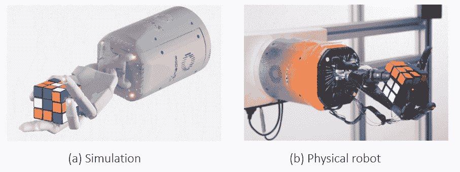
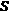
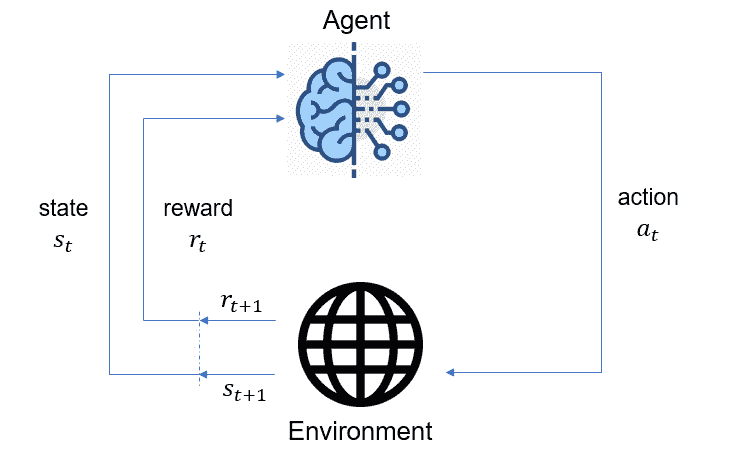
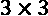
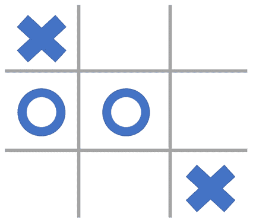

# 第一章：强化学习简介

**强化学习**（**RL**）旨在创建能够在复杂和不确定的环境中做出决策的**人工智能**（**AI**）代理，其目标是最大化代理的长期利益。这些代理通过与环境互动来学习如何做到这一点，这模仿了我们作为人类通过经验学习的方式。因此，强化学习具有极其广泛和可适应的应用领域，具有颠覆和革命全球行业的潜力。

本书将为你提供关于这一领域的高级理解。我们将深入探讨一些你可能已经知道的算法背后的理论，并覆盖最前沿的强化学习。此外，本书是一本实践性很强的书。你将看到来自现实行业问题的示例，并在过程中学习到专家技巧。到书的最后，你将能够使用 Python 建模并解决你自己的序列决策问题。

所以，让我们从复习一下强化学习的概念开始，为接下来的高级内容做好准备。具体来说，本章将涵盖以下内容：

+   为什么选择强化学习？

+   机器学习的三种范式

+   强化学习应用领域和成功案例

+   强化学习问题的元素

+   设置你的强化学习环境

# 为什么选择强化学习？

创建能够做出与人类相当或更优决策的智能机器是许多科学家和工程师的梦想，而这个梦想正逐渐变得触手可及。在过去七十年里，自从图灵测试以来，人工智能（AI）的研究和发展经历了过山车般的起伏。最初的期望值非常高；例如，20 世纪 60 年代，赫伯特·西蒙（后来获得诺贝尔经济学奖）预测，机器将在 20 年内能够完成所有人类能做的工作。正是这种兴奋感吸引了大量政府和企业的资金流入人工智能研究，但接着迎来的是巨大的失望和一个被称为“人工智能寒冬”的时期。几十年后，得益于计算、数据和算法的惊人进展，人类再次感到前所未有的兴奋，追求人工智能梦想的脚步比以往任何时候都更加坚定。

注意事项

如果你不熟悉艾伦·图灵在 1950 年关于人工智能基础的开创性工作，那么值得了解一下图灵测试： [`youtu.be/3wLqsRLvV-c`](https://youtu.be/3wLqsRLvV-c)。

人工智能的梦想无疑是宏伟的。毕竟，智能自主系统的潜力巨大。想想看，全球专科医生的数量是如何受到限制的。培养一位专科医生需要多年时间，并且要投入大量的智力和财力资源，而许多国家在这方面并不具备足够的水平。此外，即便经过多年的教育，专科医生也几乎不可能跟上自己领域中所有的科学进展，无法从世界各地成千上万的治疗结果中学习，并有效地将所有这些知识应用于实践。

相反，一个 AI 模型可以处理并从所有这些数据中学习，并将其与有关患者的丰富信息（如病史、实验室结果、表现症状、健康档案等）结合起来，做出诊断并建议治疗方案。这个模型可以服务于世界上最偏远的地区（只要有互联网连接和计算机），并指导当地的医疗人员进行治疗。毫无疑问，它将彻底改变国际医疗体系，并改善数百万人的生活。

注意

人工智能已经在改变医疗行业。在一篇最近的文章中，谷歌公布了其 AI 系统在乳腺癌预测中超越人类专家的成果，该系统使用了乳腺 X 光片（McKinney 等，2020）。微软正在与印度最大的医疗服务提供商之一合作，利用 AI 检测心脏疾病（Agrawal，2018）。IBM 的 Watson 临床试验匹配系统使用自然语言处理技术，从医疗数据库中为患者推荐潜在的治疗方案（[`youtu.be/grDWR7hMQQQ`](https://youtu.be/grDWR7hMQQQ)）。

在我们追求开发与人类水平相当或超越人类水平的 AI 系统的过程中——这一目标有些争议，称之为**人工通用智能**（**AGI**）——开发一种可以从自身经验中学习的模型是有意义的，而不必依赖于监督者。强化学习（RL）是使我们能够创造这种智能体的计算框架。为了更好地理解 RL 的价值，有必要将其与其他**机器学习**（**ML**）范式进行比较，我们将在接下来的部分进行探讨。

# 机器学习的三种范式

强化学习（RL）是机器学习（ML）中的一个独立范式，和**监督学习**（**SL**）以及**无监督学习**（**UL**）并列。它超越了其他两个范式所涉及的内容——例如感知、分类、回归和聚类——并做出决策。然而，更重要的是，RL 在实现这一点时，利用了监督学习和无监督学习的方法。因此，RL 是一个独立但与 SL 和 UL 紧密相关的领域，掌握它们是很重要的。

## 监督学习

有监督学习是学习一个数学函数，将一组输入映射到相应的输出/标签，并尽可能精确。其核心思想是，我们不知道生成输出的过程的动态，但我们尝试利用从中获得的数据来推测它。考虑以下示例：

+   一个图像识别模型，它将自动驾驶汽车摄像头中的物体分类为行人、停车标志、卡车等。

+   一个预测特定假期季节产品客户需求的预测模型，使用的是过去的销售数据。

确定如何在视觉上区分物体，或是什么因素导致客户需求某个产品，极其困难。因此，有监督学习模型从标记数据中推断这些规则。以下是它如何工作的关键要点：

+   在训练过程中，模型从监督者（可以是人类专家或某个过程）提供的真实标签/输出中学习。

+   在推理过程中，模型会根据输入预测输出可能是什么。

+   模型使用函数逼近器来表示生成输出的过程的动态。

## 无监督学习

无监督学习算法识别数据中先前未知的模式。在使用这些模型时，我们可能有一定的预期结果，但不会给模型提供标签。考虑以下示例：

+   识别自动驾驶汽车摄像头提供的图像中的同质区域。模型可能会根据图像中的纹理将天空、道路、建筑物等区分开来。

+   根据销售量将每周销售数据分成三组。输出可能是销售量低、中、高的周次。

如你所见，这与有监督学习的工作方式非常不同，具体体现在以下几个方面：

+   无监督学习模型不知道什么是真实标签，也没有标签来映射输入。它们只是识别数据中的不同模式。即使这样做了，例如，模型也不会意识到它将天空与道路分开，或将假期周与常规周区分开来。

+   在推理过程中，模型会将输入聚类到它已识别的某个组中，同样，它并不知道这个组代表的是什么。

+   函数逼近器，如神经网络，在某些无监督学习算法中被使用，但并不总是如此。

在重新引入有监督学习（SL）和无监督学习（UL）之后，我们将它们与强化学习（RL）进行比较。

## 强化学习

强化学习是一个框架，旨在通过试错法在不确定性下做出决策，以最大化长期收益。这些决策是按顺序做出的，早期的决策会影响后续将遇到的情况和收益。这使得强化学习与有监督学习（SL）和无监督学习（UL）有所不同，因为后者并不涉及任何决策。让我们重新回顾一下之前提供的示例，看看强化学习模型与有监督学习和无监督学习模型在它们尝试找出什么方面有何不同：

+   对于自驾车来说，给定摄像头捕捉到的所有物体的类型和位置，以及道路上的车道边缘，模型可能会学到如何转动方向盘以及应该以何种车速通过前方的车辆，以尽可能安全、快速地通过。

+   给定产品的历史销售数据以及将库存从供应商送到商店所需的时间，模型可能会学到何时以及订购多少单位库存，以便以高概率满足季节性客户需求，同时将库存和运输成本最小化。

正如你可能已经注意到的，RL 试图完成的任务与 SL 和 UL 单独处理的任务性质不同，且更为复杂。我们来详细阐述一下 RL 的不同之处：

+   RL 模型的输出是在特定情况下的决策，而不是预测或聚类。

+   没有由监督者提供的“真实”决策来告诉模型在不同情况下理想的决策是什么。相反，模型通过反馈自己的经验和过去做出的决策来学习最佳决策。例如，通过反复试验，RL 模型会学到，超速超车可能会导致事故，而在假期前订购过多库存则会导致后期的库存过剩。

+   RL 模型通常使用 SL 模型的输出作为输入来做决策。例如，自驾车中图像识别模型的输出可以用来做驾驶决策。同样，预测模型的输出经常作为 RL 模型的输入，用来做库存补充决策。

+   即便没有来自辅助模型的这种输入，RL 模型也会在隐式或显式的情况下预测其决策未来将导致的情况。

+   RL 利用了许多为 SL 和 UL 开发的方法，例如将各种类型的神经网络作为函数近似器。

那么，RL 与其他机器学习方法的不同之处在于，它是一个决策框架。然而，使其令人兴奋和强大的地方在于它与我们人类通过经验做决策的学习方式相似。试想一个学步的孩子如何学着用玩具积木搭建塔楼。通常，塔楼越高，孩子就越开心。每增加一块积木的高度都是一次成功，每次倒塌都是一次失败。他们很快发现，下一块积木越靠近下面积木的中心，塔楼就越稳定。当积木放得离边缘太近时，它更容易倒塌。这种经验得到了强化，经过练习，他们能将几块积木堆叠起来。他们意识到，早期积木的堆放方式创造了一个基础，决定了他们能建造多高的塔楼。由此，他们学会了。

当然，那个学步的小孩并不是从蓝图中学到这些建筑原理的。他们从失败和成功的共性中学习。塔楼高度的增加或倒塌为他们提供了反馈信号，基于这些信号他们调整了策略。从经验中学习，而非从蓝图中学习，这正是强化学习的核心。就像小孩发现哪些积木摆放的位置可以造出更高的塔一样，强化学习的智能体通过试错来识别出能带来最高长期回报的行动。这就是强化学习如此深刻的原因，它显然是人类的智慧体现。

在过去的几年里，许多令人惊叹的成功故事证明了强化学习的潜力。此外，强化学习正在改变许多行业。所以，在深入探讨强化学习的技术细节之前，让我们通过了解强化学习在实际中的应用来进一步激励自己。

# 强化学习的应用领域和成功故事

强化学习并不是一个新兴领域。在过去的七十年里，强化学习的许多基本思想是在动态规划和最优控制的背景下提出的。然而，得益于深度学习的突破和更强大的计算资源，强化学习的成功实现最近才迎来了爆发。在这一节中，我们将讨论一些强化学习的应用领域以及一些著名的成功故事。我们将在接下来的章节中深入探讨这些实现背后的算法。

## 游戏

桌面游戏和视频游戏一直是强化学习的研究实验室，催生了许多著名的成功案例。游戏之所以成为良好的强化学习问题，原因如下：

+   游戏本质上涉及到带有不确定性的顺序决策。

+   它们以计算机软件的形式存在，使得强化学习模型可以灵活地与这些游戏互动，并生成数十亿的数据点用于训练。而且，训练过的强化学习模型也会在同样的计算环境中进行测试。这与许多物理过程不同，后者很难创建出准确且快速的模拟器。

+   游戏中的自然基准是最优秀的人类玩家，这使得它成为人工智能与人类比较的一个充满吸引力的战场。

在本介绍之后，让我们来看看一些引人注目的强化学习（RL）工作，这些工作已经登上了头条。

### TD-Gammon

第一个著名的强化学习实现是 TD-Gammon，这是一个学习如何玩超级人类水平的西洋双陆棋（backgammon）的模型——这是一种具有 1,020 种可能配置的双人棋盘游戏。该模型由 IBM 研究院的 Gerald Tesauro 于 1992 年开发。TD-Gammon 的成功引起了当时西洋双陆棋社区的巨大关注，它为人类带来了许多新颖的策略。该模型中使用的许多方法（例如时序差分、自对弈和神经网络的应用）至今仍是现代强化学习实现的核心。

### 在 Atari 游戏中超越人类表现

强化学习（RL）领域最具影响力和开创性的研究之一是 2015 年由 Volodymry Mnih 及其在 Google DeepMind 的同事们完成的工作。研究人员训练了 RL 代理，使其仅通过屏幕输入和游戏得分，利用深度神经网络学习如何玩 Atari 游戏，超越人类表现，而无需任何手工设计或特定于游戏的特征。他们将这个算法命名为**深度 Q 网络**（**DQN**），它是今天最流行的 RL 算法之一。

### 击败围棋、国际象棋和将棋的世界冠军

也许为 RL 带来最多声誉的 RL 实现是 Google DeepMind 的 AlphaGo。它是第一个在 2015 年击败职业围棋选手的计算机程序，后来在 2016 年击败了世界冠军李世石。这一故事后来被拍成了同名纪录片。AlphaGo 模型是通过人类专家棋局数据以及通过自我对弈与 RL 训练出来的。后来的版本 AlphaGo Zero 以 100-0 的成绩击败了原版 AlphaGo，而这个模型只通过自我对弈训练，并且没有任何人类知识输入。最后，公司在 2018 年发布了 AlphaZero，它能够学习国际象棋、将棋（日本象棋）和围棋，成为每个游戏历史上最强的玩家，且只了解游戏规则，没有任何关于游戏的先验信息。AlphaZero 在仅数小时的**张量处理单元**（**TPU**）训练后达到了这个表现。AlphaZero 的非常规策略得到了世界著名棋手的赞扬，比如加里·卡斯帕罗夫（国际象棋）和羽生善治（将棋）。

### 在复杂战略游戏中的胜利

RL 的成功后来超越了 Atari 和棋盘游戏，扩展到了马里奥、Quake III Arena、Capture the Flag、Dota 2 和 StarCraft II 等游戏。这些游戏对 AI 程序极具挑战性，需要战略规划、多方决策者之间的博弈论、信息不完全以及大量的可能行动和游戏状态。由于这些复杂性，训练这些模型需要大量资源。例如，OpenAI 使用 256 个 GPU 和 128,000 个 CPU 核心训练了 Dota 2 模型，进行了数月的训练，每天为模型提供了 900 年的游戏经验。Google DeepMind 的 AlphaStar 在 2019 年击败了星际争霸 II 的顶级职业选手，其训练过程也需要数百个精密模型的复制，每个模型有 200 年的实时游戏经验，尽管这些模型最初是基于人类玩家的真实游戏数据进行训练的。

## 机器人学与自主系统

机器人技术和物理自主系统是强化学习领域中的挑战性领域。这是因为强化学习智能体通常是在仿真环境中训练的，以收集足够的数据，但仿真环境无法反映现实世界的所有复杂性。因此，这些智能体在实际任务中常常失败，尤其是在任务涉及到安全性时，这种失败尤为严重。此外，这些应用通常涉及连续的动作，这需要与 DQN 不同类型的算法。尽管面临这些挑战，但另一方面，强化学习在这些领域也有许多成功的案例。此外，使用强化学习应用于自动驾驶地面和空中车辆等令人兴奋的应用领域的研究也有很多。

### 电梯优化

一个早期的成功案例证明了强化学习（RL）可以为现实世界的应用创造价值，这个案例发生在 1996 年，由 Robert Crites 和 Andrew Barto 进行的电梯优化研究。研究人员开发了一个强化学习模型，用于优化一栋有 10 层楼和 4 部电梯的建筑中的电梯调度。这比早期的 TD-Gammon 问题要具有更大的挑战性，因为模型可能会遇到的情境数量、部分可观察性（例如，不同楼层等待的人数对于强化学习模型不可观察）以及可选择的决策数量都大大增加。这个强化学习模型在多个指标上显著提高了当时最佳电梯控制启发式算法的表现，例如平均乘客等待时间和旅行时间。

### 人形机器人与灵巧操作

2017 年，谷歌 DeepMind 的 Nicolas Heess 等人能够在计算机仿真中教会不同类型的身体（例如，人形机器人等）各种运动行为，例如如何奔跑、跳跃等。2018 年，OpenAI 的 Marcin Andrychowicz 等人训练了一个五指人形机器人手臂，将一个方块从初始状态移动到目标状态。2019 年，OpenAI 的 Ilge Akkaya 等研究人员再次成功地训练了一个机器人手臂来解魔方：



图 1.1 – OpenAI 的强化学习模型，通过仿真训练（a），并部署到物理机器人上（b）（图像来源：OpenAI Blog，2019）

后两种模型都是在仿真中训练的，并成功地通过领域随机化技术转移到物理实现中（*图 1.1*）。

### 紧急响应机器人

在灾难发生后，使用机器人可能会非常有帮助，特别是在危险环境下作业时。例如，机器人可以在损坏的建筑物中寻找幸存者，关闭燃气阀门等。创造能够自主操作的智能机器人将使紧急响应操作得到扩展，并为更多的人提供支持，这比目前人工操作能够提供的支持要多得多。

### 自主驾驶车辆

尽管完全自动驾驶汽车的复杂性使得单靠 RL 模型无法解决，但其中一些任务可以由 RL 处理。例如，我们可以训练 RL 代理来实现自动停车，并决定何时及如何超车。此外，我们还可以使用 RL 代理来执行自动驾驶无人机中的某些任务，例如如何起飞、着陆、避免碰撞等。

## 供应链

供应链中的许多决策具有顺序性质并涉及不确定性，因此 RL 是一个自然的解决方案。以下是一些这类问题的示例：

+   **库存规划**是关于决定何时下订单以补充商品库存以及订购多少数量的问题。订购不足会导致短缺，订购过多则会导致库存积压、产品腐烂以及以降价处理库存。RL 模型被用来做出库存规划决策，以减少这些操作的成本。

+   **装箱问题**是制造业和供应链中常见的问题，其中到达某一工作站的物品需要被放入容器中，以最小化使用的容器数量并确保工厂内操作顺利进行。这是一个难题，可以通过 RL 来解决。

## 制造业

强化学习（RL）将在制造业中产生巨大影响，许多人工任务可能会由自主代理以更低的成本和更高的质量完成。因此，许多公司正在研究将 RL 引入其制造环境。以下是一些 RL 在制造业中的应用示例：

+   **机器校准**是制造环境中常由人类专家处理的任务，这种方式既低效又容易出错。RL 模型通常能够以更低的成本和更高的质量完成这些任务。

+   **化工厂操作**通常涉及顺序决策，这些决策通常由人类专家或启发式方法来处理。研究表明，RL 代理能够有效地控制这些过程，从而获得更好的最终产品质量并减少设备磨损。

+   **设备维护**需要规划停机时间以避免昂贵的设备故障。RL 模型可以有效平衡停机成本与潜在故障的成本。

+   除了这些示例之外，许多成功的 RL 应用在**机器人技术**领域也可以转化为制造解决方案。

## 个性化与推荐系统

个性化无疑是 RL 迄今为止创造最大商业价值的领域。大科技公司通过 RL 算法为个性化提供服务，算法在背后运行。以下是一些示例：

+   在**广告**中，向（潜在）客户传递促销材料的顺序和内容是一个顺序决策问题，可以通过 RL 来解决，从而提高客户满意度和转化率。

+   **新闻推荐**是微软新闻广为应用强化学习的一个领域，通过改进文章的选择和推荐顺序，成功增加了访客的参与度。

+   **个性化的艺术作品**，比如 Netflix 中展示的标题，是由强化学习算法来处理的。通过这个方式，观众可以更好地识别与自己兴趣相关的标题。

+   **个性化医疗**变得越来越重要，因为它能以较低的成本提供更有效的治疗。强化学习在为患者选择合适治疗方案方面有许多成功的应用。

## 智慧城市

强化学习可以帮助改善城市运作的许多领域。以下是几个例子：

+   在一个包含多个交叉口的交通网络中，交通信号灯应该协调工作，以确保交通流畅。事实证明，这个问题可以建模为一个多智能体强化学习问题，并改善现有的交通信号灯控制系统。

+   实时平衡电网中的电力生成和需求是一个重要的问题，以确保电网安全。实现这一目标的一种方式是控制需求，比如在电力生成充足时，充电电动车和开启空调系统，而不会影响服务质量，强化学习方法已经成功地应用于此。

这个列表可以写好几页，但这已经足够展示强化学习的巨大潜力。领域先驱安德鲁·吴（Andrew Ng）关于人工智能的观点，对于强化学习同样适用：

就像 100 年前电力几乎改变了所有行业一样，今天我很难想到一个行业，我认为人工智能在未来几年不会改变的。（安德鲁·吴：为什么人工智能是新的电力；斯坦福新闻；2017 年 3 月 15 日）

当前的强化学习仍处于其黄金时代的初期，而你正在通过投入精力去理解强化学习的本质及其潜力，做出一个伟大的投资。现在，是时候更技术化地定义强化学习问题中的各个元素了。

# 强化学习（RL）问题的元素

到目前为止，我们已经涵盖了可以用强化学习建模的各种问题类型。在接下来的章节中，我们将深入探讨解决这些问题的最先进算法。然而，在此过程中，我们需要正式定义强化学习问题中的元素。这将为更技术化的内容奠定基础，帮助建立我们的词汇体系。在给出这些定义之后，我们将通过井字游戏的例子来解释这些概念的具体含义。

## 强化学习概念

让我们从定义强化学习问题中的最基本组成部分开始：

+   在强化学习问题的核心，是学习者，强化学习术语中称之为**智能体（agent）**。我们处理的大多数问题类只有一个智能体。另一方面，如果有多个智能体，那么这个问题类被称为**多智能体强化学习（multi-agent RL）**，简称**MARL**。在 MARL 中，智能体之间的关系可以是合作的、竞争的，或者两者的混合。

+   强化学习问题的本质是智能体学习在其所处的世界中该做什么——也就是采取哪个**行动**——以应对不同的情况。我们将这个世界称为**环境**，它指的是智能体之外的所有事物。

+   所有能够精确且充分描述环境中情况的信息集合称为**状态**。因此，如果环境在不同时间点处于相同的状态，意味着环境的所有情况完全相同——就像复制粘贴一样。

+   在某些问题中，智能体对状态的知识是完全可用的。在许多其他问题中，尤其是在更现实的情况中，智能体并不能完全观察到状态，而只能观察到其中的一部分（或某部分状态的推导）。在这种情况下，智能体使用其**观察**来采取行动。当情况如此时，我们称该问题为**部分可观察**。除非另有说明，我们假设智能体能够完全观察到环境所处的状态，并基于该状态来执行其行动。

    信息

    *状态* 这一术语及其符号  在抽象讨论中更常被使用，尤其是在假设环境是完全可观察的情况下，尽管 *观察* 是一个更广泛的术语；智能体所接收到的总是观察结果，有时是状态本身，有时是状态的一部分或从状态中推导出的内容，这取决于环境。如果你看到它们在某些语境中交替使用，不要感到困惑。

到目前为止，我们还没有真正定义什么是好的或不好的行动。在强化学习中，每当智能体采取一个行动时，它都会从环境中获得一个**奖励**（尽管有时奖励为零）。*奖励*在一般意义上可以有很多含义，但在强化学习术语中，其含义非常具体：它是一个标量数字。数字越大，奖励也越高。在强化学习问题的每次迭代中，智能体观察到环境所处的状态（无论是完全观察还是部分观察），并根据其观察采取行动。结果是，智能体获得奖励，环境进入新的状态。这个过程在*图 1.2*中有所描述，您可能已经很熟悉了：



图 1.2 – 强化学习过程图

记住，在强化学习中，智能体关心的是长期有益的行动。这意味着智能体必须考虑其行动的长期后果。一些行动可能会使智能体立即获得高奖励，但接下来却会迎来非常低的奖励，反之亦然。因此，智能体的目标是最大化其获得的累计奖励。自然的后续问题是：这个时间跨度是多长？答案取决于所关注的问题是在有限还是无限的时间范围内定义的：

+   如果是前者，那么问题被描述为一个**情节任务**，其中**情节**定义为从初始状态到**终止状态**的交互序列。在情节任务中，代理的目标是最大化在一个情节内收集到的期望总累计奖励。

+   如果问题是在无限时域内定义的，它被称为**持续任务**。在这种情况下，代理会尝试最大化平均奖励，因为总奖励将趋向于无穷大。

+   那么，代理如何实现这个目标呢？代理根据对环境的观察，确定最好的行动。换句话说，强化学习问题的核心是找到一种**策略**，它将给定的观察映射到一个（或多个）行动，从而最大化期望的累计奖励。

所有这些概念都有具体的数学定义，我们将在后面的章节中详细讨论。但现在，让我们试着理解这些概念在具体例子中的含义。

## 将井字棋视为一个强化学习问题

井字棋是一个简单的游戏，两个玩家轮流在一个网格中标记空位。我们现在将其作为一个强化学习问题，将之前提供的定义映射到游戏中的概念。玩家的目标是将自己的标记排成一行（纵向、横向或对角线），以赢得比赛。如果没有任何一个玩家在所有空位用完之前完成这一目标，游戏将以平局结束。在游戏进行中，井字棋的棋盘可能看起来像这样：



图 1.3 – 井字棋的示例棋盘配置

现在，假设我们有一个强化学习代理与一个人类玩家对战：

+   代理采取的行动是在轮到代理的回合时，将其标记（比如叉）放置到棋盘上的空位之一。

+   这里，棋盘就是整个环境，棋盘上标记的位置就是状态，代理可以完全观察到这些状态。

+   在一个 3 x 3 的井字棋游戏中，有 765 种状态（唯一的棋盘位置，排除了旋转和镜像），代理的目标是学习一种策略，能够为这些状态中的每一个建议一个行动，以最大化获胜的概率。

+   这个游戏可以定义为一个情节性强化学习任务。为什么？因为游戏最多会持续 9 轮，环境会达到一个终止状态。终止状态是指三个 X 或 O 排成一行，或者没有任何标记能排成一行且棋盘上没有空位（即平局）。

+   注意，除非在游戏结束时某个玩家获胜，否则在游戏过程中，玩家每进行一次操作都不会获得奖励。所以，如果代理获胜，它会得到+1 奖励，失败则得到-1 奖励，平局则得到 0 奖励。在所有迭代中，直到游戏结束，代理将获得 0 奖励。

+   我们可以通过用另一个 RL 代理替换人类玩家来将其转化为一个多智能体 RL 问题，让新代理与第一个代理竞争。

希望这能刷新你对智能体、状态、动作、观察、策略和奖励含义的记忆。这只是一个简单的例子，放心，后面会有更先进的内容。在这个入门性的背景介绍完成后，我们需要做的就是设置计算机环境，以便能够运行我们在接下来的章节中将要讲解的 RL 算法。

# 设置你的 RL 环境

RL 算法利用最先进的机器学习库，这些库需要一些复杂的硬件。为了跟随本书中我们将解决的示例，你需要设置你的计算机环境。接下来我们将介绍你在设置过程中所需的硬件和软件。

## 硬件要求

如前所述，最先进的 RL 模型通常在数百个 GPU 和数千个 CPU 上进行训练。我们当然不期望你能访问这些资源。然而，拥有多个 CPU 核心将帮助你同时模拟多个智能体和环境，更快地收集数据。拥有一个 GPU 将加速训练现代 RL 算法中使用的深度神经网络。此外，为了能够高效处理所有这些数据，拥有足够的内存资源也很重要。但不用担心，利用你现有的硬件，你仍然能够从本书中获得大量的知识。供参考，以下是我们用来运行实验的桌面配置：

+   AMD Ryzen Threadripper 2990WX CPU，拥有 32 核

+   NVIDIA GeForce RTX 2080 Ti GPU

+   128 GB 内存

作为构建带有昂贵硬件的桌面的替代方案，你可以使用由各家公司提供的具有相似能力的**虚拟机**（**VMs**）。最著名的几个如下：

+   亚马逊 AWS

+   Microsoft Azure

+   谷歌云平台

这些云服务提供商还为你的虚拟机（VM）提供数据科学镜像，这样用户就不需要安装深度学习所需的软件（例如 CUDA、TensorFlow 等）。他们还提供了详细的指南，说明如何设置你的虚拟机，关于设置的细节我们将在后面讨论。

一个最终选项是谷歌的 Colab，它可以让你在 TensorFlow 上进行小规模的深度学习实验。Colab 提供的虚拟机实例可以直接从浏览器访问，且所需的软件已经安装。你可以立即在类似 Jupyter Notebook 的环境中开始实验，这是一个非常方便的快速实验选项。

## 操作系统

当你为教育目的开发数据科学模型时，Windows、Linux 或 macOS 之间通常没有太大区别。然而，在本书中，我们计划做的事情不仅仅如此，还会使用运行在 GPU 上的高级 RL 库。这个环境在 Linux 上得到最好的支持，我们使用的是 Ubuntu 18.04.3 LTS 发行版。另一个选择是 macOS，但它通常没有 GPU。最后，尽管设置可能有些复杂，**Windows 子系统 Linux** (**WSL**) 2 是你可以探索的一个选项。

## 软件工具箱

设置数据科学项目的软件环境时，人们通常首先安装 **Anaconda**，它为你提供了一个 Python 平台，并附带了许多有用的库。

提示

`virtualenv` 是一个比 Anaconda 更轻量的工具，用于创建 Python 虚拟环境，并且在大多数生产环境中更为推荐。我们也将在某些章节中使用它。你可以在 [`virtualenv.pypa.io/en/latest/installation.html`](https://virtualenv.pypa.io/en/latest/installation.html) 找到 `virtualenv` 的安装说明。

我们特别需要以下几个包：

+   **Python 3.7**：Python 是今天数据科学的*共同语言*。我们将使用版本 3.7。

+   **NumPy**：这是 Python 中用于科学计算的最基础的库之一。

+   `pandas` 是一个广泛使用的库，提供强大的数据结构和分析工具。

+   **Jupyter Notebook**：这是一个非常方便的工具，特别适合运行小规模的 Python 代码任务。它通常默认随 Anaconda 安装一起提供。

+   **TensorFlow 2.x**：这是我们选择的深度学习框架。在本书中，我们使用的是版本 2.3.0。有时，我们也会提到使用 TensorFlow 1.x 的仓库。

+   **Ray 和 RLlib**：Ray 是一个用于构建和运行分布式应用的框架，正在越来越受欢迎。RLlib 是一个运行在 Ray 上的库，包含许多流行的 RL 算法。在编写本书时，Ray 只支持 Linux 和 macOS 进行生产环境部署，Windows 支持仍处于 Alpha 阶段。我们将使用版本 0.8.7。

+   **gym**：这是一个由 OpenAI 创建的 RL 框架，如果你曾接触过 RL，你可能已经使用过它。它允许我们以标准方式定义 RL 环境，并让它们与像 RLlib 这样的算法包进行交互。

+   **OpenCV Python 绑定**：我们需要这个库来进行一些图像处理任务。

+   `Cufflinks` 包将它绑定到 `pandas`。

你可以在终端中使用以下命令来安装特定的包。使用 Anaconda 时，我们使用以下命令：

```py
conda install pandas==0.20.3
```

使用 `virtualenv`（在大多数情况下也适用于 Anaconda），我们使用以下命令：

```py
pip install pandas==0.20.3
```

有时候，你可以灵活选择包的版本，在这种情况下，你可以省略等号及其后面的内容。

提示

为了实验的顺利进行，最好为本书创建一个专门的虚拟环境，并在该环境中安装所有相关的包。这样，你就不会破坏其他 Python 项目的依赖性。Anaconda 提供了全面的在线文档，指导你如何管理环境，文档地址：[`bit.ly/2QwbpJt`](https://bit.ly/2QwbpJt)。

就是这样！有了这些，你就准备好开始编写强化学习（RL）代码了！

# 摘要

这是我们对强化学习基础知识的复习！我们从讨论强化学习是什么，以及为什么它是如此热门并成为人工智能的下一前沿话题开始。我们还探讨了强化学习的多种应用及其在过去几年成为新闻头条的成功案例。我们还定义了将在本书中使用的基本概念。最后，我们介绍了你需要的硬件和软件，以运行我们将在接下来的章节中介绍的算法。到目前为止的内容，都是为了让你刷新强化学习的记忆，激励你，并为接下来的内容做好准备：实现先进的强化学习算法，解决具有挑战性的实际问题。在下一章，我们将直接进入多臂赌博机问题，它是强化学习算法中的一个重要类别，在个性化和广告领域有着广泛的应用。

# 参考文献

1.  Sutton, R. S., Barto, A. G. (2018). 强化学习：导论。*MIT 出版社*。

1.  Tesauro, G. (1992). 时序差分学习中的实际问题。*Machine Learning 8, 257–277*。

1.  Tesauro, G. (1995). 时序差分学习与 TD-Gammon。*Commun. ACM 38, 3, 58-68*。

1.  Silver, D. (2018). 深度强化学习的成功案例。来源：[`youtu.be/N8_gVrIPLQM`](https://youtu.be/N8_gVrIPLQM)。

1.  Crites, R. H., Barto, A.G. (1995). 使用强化学习提高电梯性能。*在第 8 届国际神经信息处理系统会议论文集（NIPS'95）中*。

1.  Mnih, V. 等人 (2015). 通过深度强化学习实现人类级控制。*Nature, 518(7540), 529–533*。

1.  Silver, D. 等人 (2018). 一种通用的强化学习算法，通过自我对弈掌握国际象棋、将棋和围棋。*Science, 362(6419), 1140–1144*。

1.  Vinyals, O. 等人 (2019). 通过多智能体强化学习在《星际争霸 II》上达到大师级水平。*Nature*。

1.  OpenAI. (2018). OpenAI Five。来源：[`blog.openai.com/openai-five/`](https://blog.openai.com/openai-five/)。

1.  Heess, N. 等人 (2017). 在丰富环境中出现的运动行为。*ArXiv, abs/1707.02286*。

1.  OpenAI 等人 (2018). 学习灵巧的手内操作。*ArXiv, abs/1808.00177*。

1.  OpenAI 等人 (2019). 用机器人手解决魔方。*ArXiv, abs/1910.07113*。

1.  OpenAI 博客 (2019). 用机器人手解决魔方。来源：[`openai.com/blog/solving-rubiks-cube/`](https://openai.com/blog/solving-rubiks-cube/)。

1.  Zheng, G. 等（2018）。DRN：一种用于新闻推荐的深度强化学习框架。*2018 年全球信息网大会论文集（WWW '18）*。国际全球信息网会议指导委员会，瑞士日内瓦，167–176。DOI：[`doi.org/10.1145/3178876.3185994`](https://doi.org/10.1145/3178876.3185994)。

1.  Chandrashekar, A. 等（2017）。Netflix 中的艺术作品个性化。*The Netflix Tech Blog*。取自 [`medium.com/netflix-techblog/artwork-personalization-c589f074ad76`](https://medium.com/netflix-techblog/artwork-personalization-c589f074ad76)。

1.  McKinney, S. M. 等（2020）。国际评估用于乳腺癌筛查的人工智能系统。*Nature, 89-94*。

1.  Agrawal, R.（2018 年 3 月 8 日）。*Microsoft News Center India*。取自 [`news.microsoft.com/en-in/features/microsoft-ai-network-healthcare-apollo-hospitals-cardiac-disease-prediction/`](https://news.microsoft.com/en-in/features/microsoft-ai-network-healthcare-apollo-hospitals-cardiac-disease-prediction/)。
