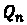
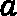
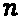
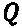

# 第二章：*第二章*：多臂赌博机

当你登录到你最喜欢的社交媒体应用时，你很可能会看到当时正在测试的多种版本之一。当你访问一个网站时，展示给你的广告是根据你的个人资料量身定制的。在许多在线购物平台上，价格是动态决定的。你知道这些现象有什么共同点吗？它们通常被建模为**多臂赌博机**（**MAB**）问题，用于识别最优决策。MAB 问题是一种**强化学习**（**RL**）的形式，其中智能体在一个由单一步骤组成的时间范围内做出决策。因此，目标是最大化即时奖励，并且没有考虑任何后续步骤的后果。虽然这比多步骤 RL 做了简化，但智能体仍然必须处理 RL 中的一个基本权衡：探索可能导致更高奖励的新动作与利用已知能带来合理奖励的动作之间的权衡。许多商业问题，如前面提到的，涉及到优化这种探索与利用的权衡。在接下来的两章中，你将了解这个权衡的意义——它几乎会成为所有 RL 方法的反复出现的主题——并学习如何有效地应对它。

在本章中，我们通过解决不考虑“上下文”的 MAB 问题来奠定基础，例如访问网站/应用的用户资料、时间等。为此，我们介绍了四种基本的探索策略。在下一章中，我们将扩展这些策略以解决**上下文相关的 MAB**问题。在这两章中，我们将使用在线广告——多臂赌博机问题的重要应用——作为我们的持续案例研究。

好的，让我们开始吧！在本章中，我们将具体讨论以下内容：

+   探索与利用的权衡

+   什么是 MAB？

+   案例研究——在线广告

+   A/B/n 测试作为探索策略

+   -贪婪动作用于探索

+   使用上置信界限进行动作选择

+   汤普森（后验）采样

# 探索与利用的权衡

正如我们之前提到的，RL 完全依赖于从经验中学习，而无需监督员为代理标记正确的行动。代理观察其行动的后果，确定在每种情况下导致最高奖励的行动，并从这种经验中学习。现在，请考虑一下你从自己的经验中学到的东西——例如，如何为考试学习。很可能你探索了不同的方法，直到发现最适合你的方法。也许你先是定期为考试学习，但后来你测试过在考试前夜学习是否足够有效——也许对某些类型的考试确实有效。关键是你必须进行**探索**以找到最大化你的“奖励”的方法（s），这是你的考试成绩、闲暇活动时间、考试前后的焦虑水平等的函数。实际上，探索对基于经验的任何学习都至关重要。否则，我们可能永远不会发现更好的做事方式或根本可行的方式！另一方面，我们不能总是试验新方法。不去利用我们已经学到的东西是愚蠢的！因此，探索和开发之间存在*探索与开发之间的权衡*，这种权衡是 RL 的核心所在。在 MAB 中有效平衡这种权衡至关重要。

如果探索与开发的权衡在所有 RL 问题中都是一个挑战，那么为什么我们特别在 MAB 的背景下提出它？这主要有两个原因：

+   MAB 是单步 RL。因此，它允许我们从多步 RL 的复杂性中分离出各种探索策略，并在理论上证明它们的优越性。

+   在多步 RL 中，我们经常在离线状态下训练代理（并在模拟中），并在线使用其策略，在 MAB 问题中，代理通常在线训练和使用（几乎总是）。因此，低效的探索成本不仅仅是计算机时间：它实际上通过不良行动花费真钱。因此，在 MAB 问题中有效平衡探索和开发变得非常关键。

有了这个想法，现在是时候定义什么是 MAB 问题，然后看一个例子。

# 什么是 MAB？

MAB 问题的关键是在通过试错确定的一组行动中识别最佳行动，例如在一些选择中找出网站的最佳外观或产品的最佳广告横幅。我们将专注于 MAB 的更常见变体，其中代理可以选择  离散行动，也称为 **-臂老虎机问题**。

让我们通过得名的示例更详细地定义问题。

## 问题定义

MAB 问题是以需要选择一台老虎机（强盗）来玩的赌徒为案例命名的情况：

+   当拉动机器的拉杆时，它会根据该机器特定的概率分布给出一个随机奖励。

+   尽管这些机器看起来相同，但它们的奖励概率分布是不同的。

赌博者的目标是最大化他们的总奖励。因此，在每一轮中，他们需要决定是继续玩目前为止提供最高平均奖励的机器，还是尝试其他机器。最初，赌博者并不知道机器的奖励分布。

很明显，赌博者需要在利用目前为止表现最好的机器和探索其他选择之间找到平衡。为什么需要这样做呢？因为奖励是随机的。一个机器可能在长期内不会提供最高的平均奖励，但由于某种偶然性，它可能在短期内看起来是最好的！


图 2.1 – MAB 问题涉及从多个选项中识别出最好的拉杆

所以，总结一下 MAB 问题的特点，我们可以得出以下结论：

+   代理执行顺序动作。在每次动作之后，会获得奖励。

+   一个动作只会影响即时奖励，而不会影响后续奖励。

+   系统中没有“状态”，也就是说，代理采取的动作不会改变任何状态。

+   代理没有任何用于决策的输入。这个问题将在下一章中讨论上下文强盗问题时涉及。

到目前为止，一切顺利！让我们通过实际编码一个例子来更好地理解这个问题。

## 实验一个简单的 MAB 问题

在这一部分，你将通过一个例子体验即使是一个简单的 MAB 问题也可能非常棘手。我们将创建一些虚拟的老虎机，并通过识别最幸运的机器来最大化总奖励。此代码可以在 GitHub 代码库的`Chapter02/Multi-armed bandits.ipynb`中找到。

### 设置虚拟环境

在开始之前，我们建议你使用`virtualenv`或 Conda 命令为练习创建一个虚拟环境。在你希望放置虚拟环境文件的文件夹中，在终端执行以下命令：

```py
virtualenv rlenv
source rlenv/bin/activate
pip install pandas==0.25.3
pip install plotly==4.10.0
pip install cufflinks==0.17.3
pip install jupyter
ipython kernel install --name «rlenv» –user
jupyter notebook
```

这将打开一个浏览器标签，加载一个 Jupyter 笔记本。找到从代码库中获得的`.ipynb`文件，打开它，并将内核设置为我们刚刚创建的`rlenv`环境。

### 强盗练习

让我们开始练习吧：

1.  首先，让我们为一个单一的老虎机创建一个类，该老虎机根据给定的均值和标准差从正态（高斯）分布中获取奖励：

    ```py
    import numpy as np # Class for a single slot machine. Rewards are Gaussian.class GaussianBandit(object):    def __init__(self, mean=0, stdev=1):        self.mean = mean         self.stdev = stdev         def pull_lever(self):        reward = np.random.normal(self.mean, self.stdev)        return np.round(reward, 1)
    ```

1.  接下来，我们创建一个类来模拟游戏：

    ```py
    class GaussianBanditGame(object):
        def __init__(self, bandits):
            self.bandits = bandits
            np.random.shuffle(self.bandits)
            self.reset_game()

        def play(self, choice):
            reward = self.bandits[choice - 1].pull_lever()
            self.rewards.append(reward)
            self.total_reward += reward
            self.n_played += 1
            return reward

        def user_play(self):
            self.reset_game()
            print("Game started. " + 
                  "Enter 0 as input to end the game.")
            while True:
                print(f"\n -- Round {self.n_played}")
                choice = int(input(f"Choose a machine " + 
                         f"from 1 to {len(self.bandits)}: "))
                if choice in range(1, len(self.bandits) + 1):
                    reward = self.play(choice)
                    print(f"Machine {choice} gave " + 
                          f"a reward of {reward}.")
                    avg_rew = self.total_reward/self.n_played
                    print(f"Your average reward " +
                          f"so far is {avg_rew}.")
                else:
                    break
            print("Game has ended.")
            if self.n_played > 0:
                print(f"Total reward is {self.total_reward}" + 
                      f" after {self.n_played} round(s).")
                avg_rew = self.total_reward/self.n_played
                print(f"Average reward is {avg_rew}.")              

        def reset_game(self):
            self.rewards = []
            self.total_reward = 0
            self.n_played = 0
    ```

    一个游戏实例接收一组老虎机作为输入。它会打乱这些老虎机的顺序，以便你无法识别哪个机器提供最高的平均奖励。在每一步，你需要选择一个机器并尽量获得最高的奖励。

1.  然后，我们创建一些老虎机和一个游戏实例：

    ```py
    slotA = GaussianBandit(5, 3)slotB = GaussianBandit(6, 2)slotC = GaussianBandit(1, 5)game = GaussianBanditGame([slotA, slotB, slotC])
    ```

1.  现在，通过调用游戏对象的`user_play()`方法开始游戏：

    ```py
    game.user_play()
    ```

    输出结果如下所示：

    ```py
    Game started. Enter 0 as input to end the game. 
    -- Round 0
    Choose a machine from 1 to 3:
    ```

1.  当你输入选择时，你将看到该回合获得的奖励。我们对机器一无所知，所以从 1 开始吧：

    ```py
    slotB machine, so there is no reason to try something else and lose money! 
    ```

1.  让我们再玩几个回合同样的机器：

    ```py
    -- Round 1
    Choose a machine from 1 to 3: 1
    Machine 1 gave a reward of 4.9.
    Your average reward so far is 6.65.
     -- Round 2
    Choose a machine from 1 to 3: 1
    Machine 1 gave a reward of -2.8.
    Your average reward so far is 3.5.
    ```

    咔嚓！这看起来确实是最差的机器！`slotA`或`slotB`机器给出`-2.8`奖励的可能性非常小。

1.  让我们检查一下游戏中的第一台机器（记住第一台机器对应`bandits`列表中的索引 0），通过查看它的均值参数。执行`game.bandits[0].mean`时，我们得到的输出是`1`！

事实上，我们以为我们选择了最好的机器，尽管它实际上是最差的！为什么会发生这种情况呢？嗯，原因在于奖励是随机的。根据奖励分布的方差，某个特定奖励可能与我们期望的该机器的平均奖励相差甚远。正因为如此，在我们经历足够的游戏轮数之前，很难知道该拉哪个拉杆。事实上，只有少量的样本，我们的观察结果可能会非常具有误导性，就像刚刚发生的那样。此外，如果你自己玩这个游戏，你会发现很难区分`slotA`和`slotB`，因为它们的奖励分布相似。你可能会想，“这有这么重要吗？”嗯，如果差异对应着显著的金钱和资源，像许多现实世界的应用一样，那是非常重要的。

接下来，我们将介绍一种应用——在线广告，这是我们在本章及下一章中的示例。

# 案例研究——在线广告

假设有一家公司希望通过数字横幅广告在各大网站上推广产品，目的是吸引访客进入产品的登陆页面。在多个广告选择中，广告主希望找出最有效的横幅，并且拥有最高的**点击率**（**CTR**），点击率定义为广告获得的总点击数除以广告展示的总次数（即广告的曝光次数）。

每次横幅广告将在网站上展示时，都是广告主的算法选择横幅（例如，通过广告主提供的 API 接口）并观察该展示是否导致了点击。这是一个很好的多臂老虎机（MAB）模型应用场景，可以提高点击率和产品销量。我们希望 MAB 模型尽早识别出表现最好的广告，更多地展示它，并尽早淘汰明显失败的广告。

提示

在展示后观察点击与未点击的概率（二元结果），可以使用伯努利分布来建模。它有一个参数，，即接收到点击的概率，或者更一般地，观察到 1 而不是 0 的概率。注意，这是一个离散概率分布，而我们之前使用的正态分布是一个连续的分布。

在前面的例子中，我们的奖励来自正态分布。在在线广告的情况中，奖励是二元的。对于每个广告版本，有不同的点击概率（CTR），广告商不知道这个概率，但试图去发现它。所以，奖励将来自每个广告的不同伯努利分布。我们来编写代码，以便稍后与我们的算法一起使用：

1.  我们首先创建一个类来建模广告行为：

    ```py
    class BernoulliBandit(object):
        def __init__(self, p):
            self.p = p
        def display_ad(self):
            reward = np.random.binomial(n=1, p=self.p)
            return reward
    ```

1.  现在，我们来创建五个不同的广告（横幅），并随便选择相应的 CTR：

    ```py
    adA = BernoulliBandit(0.004)
    adB = BernoulliBandit(0.016)
    adC = BernoulliBandit(0.02)
    adD = BernoulliBandit(0.028)
    adE = BernoulliBandit(0.031)
    ads = [adA, adB, adC, adD, adE]
    ```

到目前为止，一切顺利。现在，是时候实施一些探索策略，以最大化广告活动的 CTR 了！

# A/B/n 测试

最常见的探索策略之一是所谓的**A/B 测试**，这是一种确定两个备选方案（如在线产品、页面、广告等）中哪个表现更好的方法。在这种测试中，用户会被随机分成两组，尝试不同的备选方案。在测试期结束时，比较结果以选择最佳方案，然后在剩余的时间内用于生产。在我们的例子中，我们有多个广告版本。因此，我们将实施所谓的**A/B/n 测试**。

我们将使用 A/B/n 测试作为基准策略，便于与之后介绍的更先进方法进行比较。在进入实现之前，我们需要定义一些符号，这些符号将在本章中使用。

## 符号

在各种算法的实现过程中，我们需要跟踪与特定行为（选择展示的广告）相关的一些量，。现在，我们为这些量定义一些符号。最初，为了简洁起见，我们省略了，但在本节末，我们会重新添加：

+   首先，我们表示在选择动作后收到的奖励（即，点击为 1，未点击为 0），，为第次由获得。

+   在选择此相同行为之前观察到的平均奖励定义如下：


这估计了该行为产生的奖励的期望值！[](img/Formula_02_011.png)，在进行次观察后。

+   这也被称为**行为值**！[](img/Formula_02_013.png)。在这里，这就是在选择此行为次后，的行为值估计。

+   现在，我们需要一些简单的代数运算，就能得到一个非常方便的公式来更新动作值：


+   记住， 是我们在执行  次动作之前对  的动作值的估计。当我们观察到奖励  时，它为我们提供了一个新的动作值信号。我们不想丢弃之前的观察结果，但我们也希望更新我们的估计以反映这个新信号。

    因此，我们调整当前估计值 ，使其朝着我们基于最新观察到的奖励  计算出的 **误差** 的方向进行调整，步长为 ，并获得新的估计值 。这意味着，例如，如果最新观察到的奖励大于我们当前的估计值，我们会将动作值估计向上修正。

+   为了方便起见，我们定义 。

+   请注意，随着我们进行更多观察，我们调整估计的速率会变得更小，因为有了  项。所以，我们会对最新的观察结果赋予较小的权重，并且某个特定动作的动作值估计会随着时间的推移而趋于稳定。

+   然而，如果环境不是静态的，而是随时间变化，这可能是一个缺点。在这些情况下，我们希望使用一个不会随时间衰减的步长，例如固定步长 。

+   请注意，为了使估计收敛，这个步长必须小于 1（并且大于 0 以确保适当更新）。

+   使用固定值  会使得随着我们越来越多地执行动作 ，较早的观察结果的权重呈指数衰减。

让我们把  带回符号中，这样我们就能得到更新动作值的公式：


这里， 是一个介于 0 和 1 之间的数。对于静态问题，我们通常设定 ，其中  是到目前为止已采取的动作  的次数（最初表示为 ）。在静态问题中，由于逐渐减少的  项，这将有助于动作值更快地收敛，而不是追逐噪声观察值。

这就是我们需要的一切。事不宜迟，让我们实现一个 A/B/n 测试。

## 应用于在线广告场景

在我们的示例中，我们有五个不同的广告版本，我们以相等的概率随机展示给用户。让我们在 Python 中实现这一点：

1.  我们从创建变量来跟踪实验中的奖励开始：

    ```py
    n_test = 10000
    n_prod = 90000
    n_ads = len(ads)
    Q = np.zeros(n_ads)  # Q, action values
    N = np.zeros(n_ads)  # N, total impressions
    total_reward = 0
    avg_rewards = []  # Save average rewards over time
    ```

1.  现在，让我们运行 A/B/n 测试：

    ```py
    for i in range(n_test):
        ad_chosen = np.random.randint(n_ads)
        R = ads[ad_chosen].display_ad() # Observe reward
        N[ad_chosen] += 1
        Q[ad_chosen] += (1 / N[ad_chosen]) * (R - Q[ad_chosen])
        total_reward += R
        avg_reward_so_far = total_reward / (i + 1)
        avg_rewards.append(avg_reward_so_far)
    ```

    请记住，我们在测试期间随机选择一个广告进行展示，并观察是否获得点击。我们更新计数器、行动值估计值以及到目前为止观察到的平均奖励。

1.  在测试期结束时，我们选择获得最高行动值的广告作为获胜者：

    ```py
    best_ad_index = np.argmax(Q)
    ```

1.  我们使用`print`语句展示获胜者：

    ```py
    print("The best performing ad is {}".format(chr(ord('A') + best_ad_index)))
    ```

1.  结果如下：

    ```py
    The best performing ad is D.
    ```

    在这种情况下，A/B/n 测试将 D 识别为表现最佳的广告，但这并不完全正确。显然，测试期不够长。

1.  让我们在生产中运行 A/B/n 测试识别出的最佳广告：

    ```py
    ad_chosen = best_ad_index
    for i in range(n_prod):
        R = ads[ad_chosen].display_ad()
        total_reward += R
        avg_reward_so_far = total_reward / (n_test + i + 1)
        avg_rewards.append(avg_reward_so_far)
    ```

    在此阶段，我们不会再探索其他操作。所以，广告 D 的错误选择将在整个生产期内产生影响。我们继续记录到目前为止观察到的平均奖励，以便之后可视化广告活动表现。

    现在，展示结果的时间到了：

1.  让我们创建一个`pandas` DataFrame 来记录 A/B/n 测试的结果：

    ```py
    import pandas as pd
    df_reward_comparison = pd.DataFrame(avg_rewards, columns=['A/B/n'])
    ```

1.  为了显示平均奖励的进展，我们使用 Plotly 和 Cufflinks：

    ```py
    import cufflinks as cf
    import plotly.offline
    cf.go_offline()
    cf.set_config_file(world_readable=True, theme="white")
    df_reward_comparison['A/B/n'].iplot(title="A/B/n Test Avg. Reward: {:.4f}"
                                       .format(avg_reward_so_far),
                                        xTitle='Impressions', 
                                        yTitle='Avg. Reward')
    ```

    这将产生以下输出：


图 2.2 – A/B/n 测试奖励

从*图 2.2*中可以看到，在探索结束后，平均奖励接近 2.8%，这是广告 D 的预期 CTR。另一方面，由于在前 10k 展示期间进行了一些探索，我们尝试了几个表现不佳的选择，因此在 100k 展示后，CTR 最终为 2.71%。如果 A/B/n 测试能识别广告 E 作为最佳选择，CTR 可能会更高。

就这样！我们刚刚实现了一个 A/B/n 测试。总体而言，这个测试帮助我们识别出了一些表现较好的广告，尽管并非最好的。接下来，我们讨论 A/B/n 测试的优缺点。

## A/B/n 测试的优缺点

现在，让我们对这种方法进行定性评估，并讨论其缺点：

+   **A/B/n 测试效率低下，因为它不会通过从观察中学习动态地修改实验**。相反，它在固定的时间预算内探索，并且尝试不同选择的概率是预先设定的。它没有利用测试中的早期观察，甚至在某些选择明显表现不佳/表现出色时，也未能及时淘汰或推广这些选择。

+   **它一旦做出决策就无法纠正**。如果由于某些原因，测试期间错误地将某个选择识别为最佳（通常是因为测试时间不足），则该选择在生产期间会一直保持固定。因此，无法在剩余的部署期内纠正该决策。

+   **它无法适应动态环境中的变化**。与前述问题相关，这种方法在非静态环境中尤其有问题。因此，如果基础的奖励分布随时间发生变化，简单的 A/B/n 测试就无法在选择固定后检测到这些变化。

+   **测试期长度是一个需要调整的超参数，影响测试的效率**。如果选择的期限比所需期限短，由于观察中的噪声，可能会错误地宣布某个错误的替代品是最佳选择。如果测试期限选择得太长，将在探索中浪费太多资金。

+   **A/B/n 测试很简单**。尽管存在这些缺点，但它直观且易于实施，因此在实践中被广泛使用。

因此，普通的 A/B/n 测试对于 MAB 而言是一种相当幼稚的方法。接下来，让我们探讨一些其他更高级的方法，这些方法将克服 A/B/n 测试的一些缺点，首先是ε贪婪。

# ε贪婪动作

一种易于实施、有效且广泛使用的探索-利用问题方法被称为**ε贪婪**动作。这种方法建议在大多数决策中贪心地选择到目前为止根据观察到的奖励最好的动作（即以 1-ε的概率）；但偶尔（即以ε的概率），无论动作表现如何，都会随机选择一个动作。在这里，ε是一个介于 0 和 1 之间的数字，通常接近零（例如，0.1），以便在实验中持续探索替代动作。

## 应用于在线广告场景

现在，让我们将ε贪婪动作应用于我们的在线广告场景：

1.  我们开始初始化实验所需的变量，用于跟踪动作值估计、每个广告显示次数和奖励的移动平均值：

    ```py
    eps = 0.1
    n_prod = 100000
    n_ads = len(ads)
    Q = np.zeros(n_ads)
    N = np.zeros(n_ads)
    total_reward = 0
    avg_rewards = []
    ```

    请注意我们选择 0.1 作为ε值，但这是一个相对随意的选择。不同的ε值将导致不同的性能，因此应将其视为需要调整的超参数。一个更复杂的方法是从较高的ε值开始，逐渐减少。稍后我们将详细讨论这一点。

1.  接下来，我们进行实验。注意我们如何以ε的概率选择随机动作，否则选择最佳动作。根据我们之前描述的规则更新我们的动作值估计：

    ```py
    ad_chosen = np.random.randint(n_ads)
    for i in range(n_prod):
        R = ads[ad_chosen].display_ad()
        N[ad_chosen] += 1
        Q[ad_chosen] += (1 / N[ad_chosen]) * (R - Q[ad_chosen])
        total_reward += R
        avg_reward_so_far = total_reward / (i + 1)
        avg_rewards.append(avg_reward_so_far)
        # Select the next ad to display
        if np.random.uniform() <= eps:
            ad_chosen = np.random.randint(n_ads)
        else:
            ad_chosen = np.argmax(Q)
    df_reward_comparison['e-greedy: {}'.format(eps)] = avg_rewards
    ```

1.  对不同的ε值（即 0.01、0.05、0.1 和 0.2），运行*步骤 1 和 2*。然后，比较ε选择如何影响性能，如下：

    ```py
    greedy_list = ['e-greedy: 0.01', 'e-greedy: 0.05', 'e-greedy: 0.1', 'e-greedy: 0.2']
    df_reward_comparison[greedy_list].iplot(title="ε-Greedy Actions",
     dash=['solid', 'dash', 'dashdot', 'dot'],
     xTitle='Impressions', 
     yTitle='Avg. Reward')
    ```

    这导致以下输出：


图 2.3 – 使用ε贪婪动作进行探索

最佳奖励由ε=0.05 和ε=0.1 分别为 2.97%给出。结果表明，使用其他两个ε值的探索效果要么太低要么太高。此外，所有的ε贪婪策略都比 A/B/n 测试给出了更好的结果，特别是因为在这种情况下 A/B/n 测试做出了错误的选择。

## ε贪婪动作的优缺点

让我们讨论使用ε贪婪动作的利弊：

+   **ε-贪心策略和 A/B/n 测试在分配探索预算时同样低效且静态**。ε-贪心策略也未能及时淘汰明显不好的动作，而是继续将相同的探索预算分配给每一个备选项。例如，在实验进行到一半时，显然广告 A 的表现很差。将探索预算用于尝试区分其他备选项，找出最佳选择，效率会更高。相关的一个问题是，如果某个动作在某一时刻被探索过少或过多，探索预算并不会相应调整。

+   **使用ε-贪心策略时，探索是持续的，这与 A/B/n 测试不同**。这意味着，如果环境不是静态的，ε-贪心策略有潜力发现变化，并调整对最佳备选项的选择。然而，在静态环境中，我们可以预期 A/B/n 测试和ε-贪心策略表现相似，因为它们在本质上非常相似，区别仅在于何时进行探索。

+   **通过动态变化ε值，ε-贪心策略可以提高效率**。例如，你可以从较高的ε值开始，初期进行更多的探索，之后逐渐降低ε值以进行更多的利用。这样，仍然会有持续的探索，但不像最开始那样频繁，因为那时对环境还没有了解。

+   **通过提高近期观察结果的重要性，可以使ε-贪心策略更加动态**。在标准版本中，前述的  值是作为简单平均值来计算的。请记住，在动态环境中，我们可以使用以下公式：


这将以指数方式减小较早观察结果的权重，从而使得该方法能够更容易地察觉环境的变化。

+   **修改ε-贪心策略引入了新的超参数，这些超参数需要调整**。前面提到的两个建议——逐渐减小ε值和使用指数平滑来处理*Q*——都涉及额外的超参数，且可能不容易直观地知道该设置什么值。而且，选择这些超参数不当可能导致比标准版本更差的结果。

到目前为止，一切顺利！我们已经使用ε-贪心策略优化了我们的在线广告活动，并取得了比 A/B/n 测试更好的结果。我们还讨论了如何修改该方法，以便在更广泛的环境中使用。然而，ε-贪心策略的动作选择仍然过于静态，我们可以做得更好。现在，让我们看看另一种方法——上置信区间，它能动态调整动作的探索。

# 使用上置信区间进行动作选择

**上置信界** (**UCB**) 是一种简单而有效的解决探索与利用权衡问题的方法。其思路是在每一个时间步骤中，我们选择潜在回报最高的动作。动作的潜力通过动作值估计和该估计的不确定性度量之和来计算。这个和就是我们所说的 UCB。因此，选择一个动作的原因可能是我们对该动作值的估计很高，或者该动作还没有得到足够的探索（即，探索的次数不如其他动作），且对其价值的不确定性很高，或者两者兼有。

更正式地说，我们使用以下公式在时间  选择要执行的动作：


让我们稍微拆解一下：

+   现在，我们使用了一种与之前介绍的略有不同的符号！[](img/Formula_02_047.png) 和  的含义与之前基本相同。这个公式关注的是变量值，这些值可能是在决策时已经更新过的！[](img/Formula_02_0451.png)，而之前的公式描述的是如何更新这些值。

+   在这个方程中，平方根项是一个衡量动作值估计不确定性的指标！[](img/Formula_02_0332.png)。

+   我们选择的次数越多，关于  的不确定性就越小，因此分母中的  项也会减小。

+   然而，随着时间的推移，由于  项（特别是在环境不是静态的情况下，这一点是有道理的），不确定性会增加，从而鼓励更多的探索。

+   另一方面，决策时对不确定性的重视程度是由超参数  控制的。显然，这需要调优，而不恰当的选择可能会降低该方法的效果。

现在，是时候看看 UCB 的实际应用了。

## 应用于在线广告场景

跟着一起实现 UCB 方法来优化广告展示：

1.  和往常一样，让我们首先初始化必要的变量：

    ```py
    c = 0.1
    n_prod = 100000
    n_ads = len(ads)
    ad_indices = np.array(range(n_ads))
    Q = np.zeros(n_ads)
    N = np.zeros(n_ads)
    total_reward = 0
    avg_rewards = []
    ```

1.  现在，实现主循环来使用 UCB 进行动作选择：

    ```py
    for t in range(1, n_prod + 1):
        if any(N==0):
            ad_chosen = np.random.choice(ad_indices[N==0])
        else:
            uncertainty = np.sqrt(np.log(t) / N)
            ad_chosen = np.argmax(Q + c * uncertainty)  
        R = ads[ad_chosen].display_ad()
        N[ad_chosen] += 1
        Q[ad_chosen] += (1 / N[ad_chosen]) * (R - Q[ad_chosen])
        total_reward += R
        avg_reward_so_far = total_reward / t
        avg_rewards.append(avg_reward_so_far)
    df_reward_comparison['UCB, c={}'.format(c)] = avg_rewards
    ```

    请注意，我们在每个时间步骤中选择具有最高 UCB 的动作。如果一个动作还没有被选择过，那么它将具有最高的 UCB。如果有多个动作具有相同的 UCB，我们将随机打破平局。

1.  如前所述，不同的  选择会导致不同的表现水平。使用不同的  超参数选择运行 *步骤 1 和 2*。然后，比较结果，如下所示：

    ```py
    ucb_list = [‹UCB, c=0.1›, ‹UCB, c=1›, ‹UCB, c=10›]
    best_reward = df_reward_comparison.loc[t-1,ucb_list].max()
    df_reward_comparison[ucb_list].iplot(title=»Action Selection using UCB. Best avg. reward: {:.4f}»
                                        .format(best_reward),
                                        dash = [‹solid›, ‹dash›, ‹dashdot›],
                                        xTitle=›Impressions›, 
                                        yTitle=›Avg. Reward›)
    ```

    这会产生以下输出：


图 2.4 – 使用 UCB 进行探索

在这种情况下，使用 UCB 进行探索，在经过一些超参数调优后，取得了比 ε-greedy 探索和 A/B/n 测试更好的结果（3.07% 点击率）！当然，问题的关键在于如何进行超参数调优。有趣的是，这本身就是一个 MAB 问题！首先，你需要形成一组合理的  值，并使用我们到目前为止描述的某种方法选择最佳值。

提示

尝试使用对数尺度的超参数，如 [0.01, 0.1, 1, 10]，而不是线性尺度，如 [0.08, 0.1, 0.12, 0.14]。前者允许探索不同数量级的变化，在这些变化中，我们可能会看到显著的性能跳跃。在确定了正确的数量级后，可以使用线性尺度进行搜索。

为了简化事情，你可以使用 A/B/n 测试来选择 。这可能看起来像一个无限循环——你用 MAB 来解决一个 MAB 问题，而 MAB 本身可能还需要调优超参数，依此类推。幸运的是，一旦你为你的问题类型（例如，在线广告）找到了一个合适的  值，通常可以在以后的实验中反复使用该值，只要奖励尺度保持相似（例如，在线广告的点击率大约在 1–3% 之间）。

## 使用 UCB 的优缺点

最后，让我们讨论一下 UCB 方法的优缺点：

+   **UCB 是一种设置后即忘的方法**。它系统地并动态地将预算分配给需要探索的选项。如果环境发生变化——例如，如果某个广告由于某种原因变得更受欢迎，奖励结构发生变化——该方法会相应地调整其行动选择。

+   **UCB 可以进一步优化以适应动态环境，可能会引入额外的超参数代价**。我们提供的 UCB 公式是一个常见的公式，但它可以得到改进——例如，通过使用指数平滑来计算  值。文献中也有更有效的不确定性成分估算方法。然而，这些修改可能会使方法变得更加复杂。

+   **UCB 可能难以调优**。相比于 ε-greedy 方法中简单地说“我想 10% 的时间用于探索，其余时间用于开发”，要说“我希望我的  为 0.729”对 UCB 方法来说要复杂一些，尤其是在你尝试这些方法来解决一个全新问题时。如果没有调优，UCB 实现可能会给出出乎意料的差结果。

就这样！你现在已经实现了多种解决在线广告问题的方法，并且使用 UCB 方法特别有助于在潜在的非平稳环境中有效管理探索。接下来，我们将介绍另一种非常强大的方法——汤普森抽样，它将是你武器库中的一个重要补充。

# 汤普森（后验）抽样

在多臂老虎机（MAB）问题中的目标是估计每个臂（即前面例子中的广告）的奖励分布参数。此外，衡量我们对估计的 uncertainty 是指导探索策略的一个好方法。这个问题非常符合贝叶斯推断框架，而汤普森采样正是利用了这一框架。贝叶斯推断从先验概率分布开始——即参数  的初始假设——并随着数据的到来更新这个先验分布。这里， 指的是正态分布的均值和方差，或伯努利分布中观察到 1 的概率。因此，贝叶斯方法将参数视为给定数据后的随机变量。

这个公式的表达式如下所示：


在这个公式中， 是 **先验分布**，表示当前对  分布的假设。 代表数据，通过这些数据我们可以得到 **后验分布**，即 。这就是我们基于所观察到的数据对参数分布的更新假设。 被称为 **似然函数**（给定参数下观察到数据  的概率），而  被称为 **证据**。

接下来，让我们探讨如何在 0–1 类型的结果中实现汤普森采样，例如在在线广告场景中出现的情况。

## 在线广告场景的应用

在我们的例子中，对于给定的广告 ，观察一次点击是一个伯努利随机变量，参数为 ，我们试图对其进行估计。由于  本质上是广告  显示时被点击的概率，因此 CTR 介于 0 和 1 之间。需要注意的是，除了在线广告外，许多问题也具有这样的二元结果。因此，我们在这里的讨论和公式可以扩展到其他类似的情况。

### 汤普森采样的细节

现在，让我们看看如何将贝叶斯方法应用到我们的问题中：

+   最初，我们没有理由相信给定广告的参数是高还是低。因此，假设  在  上服从均匀分布是合理的。

+   假设我们展示了广告 ，并且该广告获得了点击。我们将此视为一个信号，更新  的概率分布，使得期望值略微向 1 移动。

+   随着我们收集越来越多的数据，我们还应该看到参数的方差估计值逐渐缩小。这正是我们希望平衡探索和利用的方式。当我们使用 UCB 时，我们做了类似的事情：我们将参数的估计值与该估计值的相关不确定性结合起来，以指导探索。汤普森采样使用贝叶斯推断，正是这样做的。

+   这种方法告诉我们从参数的后验分布中采样，。如果！[](img/Formula_02_0732.png)的期望值较高，我们可能会得到更接近 1 的样本。如果方差较高，因为该广告！[](img/Formula_02_0722.png)在此时尚未被多次选择，我们的样本也将具有较高的方差，这将导致更多的探索。在给定的时间步长内，我们为每个广告采样一次，并选择最大的样本来确定要显示的广告。

在我们的例子中，似然（广告印象转化为点击的概率）是伯努利分布，我们将应用之前描述的逻辑。以下是用较少的技术术语来描述实际情况：

+   我们想要了解每个广告的 CTR。我们有估计值，但我们对它们不确定，因此我们会为每个 CTR 关联一个概率分布。

+   随着新数据的到来，我们会更新 CTR 的概率分布。

+   当需要选择广告时，我们会对每个广告的 CTR 做出猜测——也就是采样！[](img/Formula_02_083.png)。然后我们选择我们猜测 CTR 最高的广告。

+   如果某个广告的 CTR 概率分布方差较大，意味着我们对此非常不确定。这将导致我们对该广告做出较为冒险的猜测，并更频繁地选择它，直到方差减少——也就是我们变得更加确信它。

现在，让我们讨论伯努利分布的更新规则。如果你没有完全理解这里的术语也没关系，前面的解释应该能告诉你发生了什么：

+   一个常见的先验选择是贝塔分布。如果你稍微思考一下，参数！[](img/Formula_02_084.png)的取值范围在！[](img/Formula_02_085.png)内。因此，我们需要使用一个具有相同支持度的概率分布来建模！[](img/Formula_02_086.png)，贝塔分布正好符合这一要求。

+   此外，如果我们使用贝塔分布作为先验，并将其代入贝叶斯公式与伯努利似然结合，后验分布也会变成贝塔分布。这样，我们就可以在观察到新数据时，将后验分布作为下一次更新的先验。

+   具有相同分布族的后验与先验相比，带来了极大的便利，甚至它有一个特殊的名称：它们被称为**共轭分布**，先验被称为似然函数的**共轭先验**。贝塔分布是伯努利分布的共轭先验。根据你选择的似然建模方式，在实现汤普森抽样之前，可以找到一个共轭先验。

不再废话，接下来我们来实现汤普森抽样用于在线广告的例子。

### 实现

广告！[](img/Formula_02_087.png)的先验的贝塔分布由以下公式给出：


这里，！[](img/Formula_02_089.png)和！[](img/Formula_02_090.png)是表征贝塔分布的参数，！[](img/Formula_02_091.png)是伽马函数。别让这个公式吓到你！其实它非常容易实现。为了初始化先验，我们使用！[](img/Formula_02_092.png)，这使得！[](img/Formula_02_093.png)在！[](img/Formula_02_094.png)上均匀分布。一旦我们观察到奖励，！[](img/Formula_02_095.png)，选择了广告！[](img/Formula_02_096.png)，我们就能得到如下的后验分布：

s

现在，让我们用 Python 来实现：

1.  首先，初始化我们需要的变量：

    ```py
    n_prod = 100000
    n_ads = len(ads)
    alphas = np.ones(n_ads)
    betas = np.ones(n_ads)
    total_reward = 0
    avg_rewards = []
    ```

1.  现在，初始化主循环并进行贝叶斯更新：

    ```py
    for i in range(n_prod):
        theta_samples = [np.random.beta(alphas[k], betas[k]) for k in range(n_ads)]
        ad_chosen = np.argmax(theta_samples)
        R = ads[ad_chosen].display_ad()
        alphas[ad_chosen] += R
        betas[ad_chosen] += 1 - R
        total_reward += R
        avg_reward_so_far = total_reward / (i + 1)
        avg_rewards.append(avg_reward_so_far)
    df_reward_comparison['Thompson Sampling'] = avg_rewards
    ```

    我们从各自的后验分布中为每个！[](img/Formula_02_100.png)值抽取样本，并展示与最大抽样参数对应的广告。一旦我们观察到奖励，我们就将后验作为先验，并按照前述规则更新，以获得新的后验。

1.  然后，展示结果：

    ```py
    df_reward_comparison['Thompson Sampling'].iplot(title="Thompson Sampling Avg. Reward: {:.4f}"
                                       .format(avg_reward_so_far),
                                        xTitle='Impressions', 
                                        yTitle='Avg. Reward')
    ```

    这将产生如下输出：


图 2.5 – 使用汤普森抽样的探索

汤普森抽样的表现与ε-贪心和 UCB 方法相似，CTR 为 3%。

## 汤普森抽样的优缺点

汤普森抽样是一个非常有竞争力的方法，其相较于ε-贪心和 UCB 方法有一个主要的优势：*汤普森抽样不需要我们进行任何超参数调优*。在实践中，这带来了以下好处：

+   **节省大量时间**，这些时间本来会花费在超参数调优上。

+   **节省大量资金**，这些资金本来会在其他方法中被浪费在低效的探索和超参数选择错误上。

此外，文献中展示了汤普森抽样在许多基准测试中是一个非常有竞争力的选择，并且在过去几年中越来越受欢迎。

干得好！现在汤普森抽样已经在你的工具箱中了，和其他方法一起，你已经准备好解决现实世界中的 MAB 问题！

# 总结

在本章中，我们讨论了多臂赌博机（MAB）问题，这是一种一阶强化学习（RL）方法，具有许多实际的商业应用。尽管表面上看似简单，但在 MAB 问题中平衡探索与利用的难度很大，任何在管理这一权衡方面的改进，都能带来成本节省和收入增加。我们介绍了四种方法来解决这一问题：A/B/n 测试、ε-贪婪策略、基于 UCB 的动作选择和汤普森抽样。我们在在线广告场景中实现了这些方法，并讨论了它们的优缺点。

到目前为止，在做决策时，我们并没有考虑到环境中的任何情境信息。例如，在在线广告场景中，我们没有使用任何关于用户的信息（如位置、年龄、历史行为等），这些信息可能对我们的决策算法有所帮助。在下一章中，您将学习一种更高级的多臂赌博机形式——上下文强盗问题，它可以利用这些信息来做出更好的决策。

# 参考文献

+   Chapelle, O., & Li, L. (2011). 汤普森抽样的实证评估. *神经信息处理系统进展 24*，(第 2249-2257 页)

+   Marmerola, G. D. (2017 年 11 月 28 日). *汤普森抽样在上下文强盗问题中的应用*. 取自 Guilherme 的博客：[`gdmarmerola.github.io/ts-for-contextual-bandits/`](https://gdmarmerola.github.io/ts-for-contextual-bandits/)

+   Russo, D., Van Roy, B., Kazerouni, A., Osband, I., & Wen, Z. (2018). *汤普森抽样教程. 机器学习基础与趋势*，(第 1-96 页)
