# 第三章：上下文赌博机

多臂赌博机的一个更高级版本是**上下文赌博机**（**CB**）问题，在这种问题中，决策是根据所处的上下文量身定制的。在上一章中，我们识别了在线广告场景中表现最佳的广告。在此过程中，我们没有使用任何关于用户的人物特征、年龄、性别、位置或之前访问的信息，而这些信息本应增加点击的可能性。CB 允许我们利用这些信息，这意味着它们在商业个性化和推荐应用中起着核心作用。

上下文类似于多步**强化学习**（**RL**）问题中的状态，唯一的区别是。在多步 RL 问题中，智能体采取的动作会影响它在后续步骤中可能访问的状态。例如，在玩井字棋时，智能体在当前状态下的动作会以某种方式改变棋盘配置（状态），这会影响对手可以采取的动作，依此类推。然而，在 CB 问题中，智能体只是观察上下文，做出决策，并观察奖励。智能体接下来会观察到的上下文并不依赖于当前的上下文/动作。这个设置虽然比多步 RL 简单，但在许多应用中都有出现。因此，本章内容将为你添加一个重要的工具。

我们将继续解决不同版本的在线广告问题，使用更先进的工具，如神经网络，与 CB 模型一起使用。具体而言，在本章中，你将学习以下内容：

+   为什么我们需要函数逼近

+   使用函数逼近来处理上下文

+   使用函数逼近来处理动作

+   多臂赌博机和 CB 的其他应用

# 为什么我们需要函数逼近

在解决（上下文）多臂赌博机问题时，我们的目标是从观察中学习每个臂（动作）的行动值，我们将其表示为 。在在线广告的例子中，它代表了我们对用户点击广告的概率的估计，如果我们展示了 。现在，假设我们对看到广告的用户有两条信息，分别如下：

+   设备类型（手机或台式机）

+   位置（国内/美国或国际/非美国）

广告表现很可能会因设备类型和位置的不同而有所差异，这些差异构成了这个例子中的上下文。因此，CB 模型将利用这些信息，估计每个上下文的行动值，并相应地选择行动。

这看起来像是为每个广告填写一个类似于以下内容的表格：

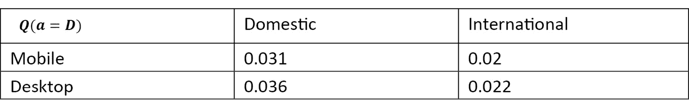

表格 3.1 – 广告 D 的样本行动值

这意味着解决四个 MAB 问题，每个上下文一个：

+   手机 – 国内

+   手机 – 国际

+   台式机 – 国内

+   台式机 – 国际

虽然在这个简单的例子中可以正常工作，但考虑到当你将额外的信息（例如年龄）添加到上下文中时会发生什么，这就引入了许多挑战：

+   首先，我们可能没有足够的观察数据来（准确地）学习每个上下文的动作值（例如：移动设备、国际、57 岁）。然而，我们希望能够进行跨学习，并且如果我们有接近年龄的用户数据，就可以估计 57 岁用户的动作值（或者改进该估计）。

+   第二，可能的上下文数量增加了 100 倍。当然，我们可以通过定义年龄组来缓解这个问题，但这样我们就需要花时间和数据来校准这些组，这并不是一件简单的事。此外，上下文空间的增长将会更受限制（增长系数为 10 而不是 100），但仍然是指数级的。随着我们向上下文中添加越来越多的维度，这在任何现实的实现中都是非常可能的，问题可能很容易变得无法处理。

接下来，我们使用函数逼近来解决这个问题。这将使我们能够处理非常复杂和高维的上下文。稍后，我们还将使用函数逼近来处理动作，这将使我们能够处理变化和/或高维的动作空间。

# 使用函数逼近处理上下文

函数逼近使我们能够从我们已经观察到的数据（如上下文和广告点击）中建模过程的动态。像上一章一样，考虑一个在线广告场景，其中有五个不同的广告（A、B、C、D 和 E），上下文包括用户设备、位置和年龄。在本节中，我们的智能体将学习五个不同的 Q 函数，每个广告一个，每个广告接收一个上下文 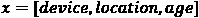，并返回动作值估计。这在*图 3.1* 中进行了说明：

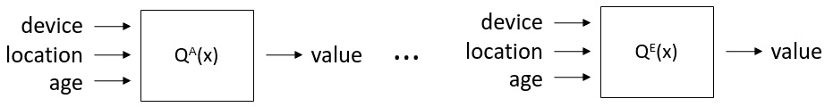

图 3.1 – 我们为每个动作学习一个函数，接收上下文并返回动作值

在这一点上，我们需要解决一个有监督的机器学习问题，针对每个动作。我们可以使用不同的模型来获得 Q 函数，例如逻辑回归或神经网络（实际上，这允许我们使用一个单一的网络来估计所有动作的值）。一旦我们选择了函数逼近的类型，就可以使用我们在上一章中介绍的探索策略，来确定在给定上下文下要展示的广告。但首先，我们先创建一个合成过程来生成模仿用户行为的点击数据。

## 案例研究 – 使用合成用户数据的上下文在线广告

假设用户的真实点击行为遵循逻辑函数：

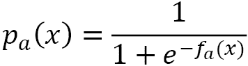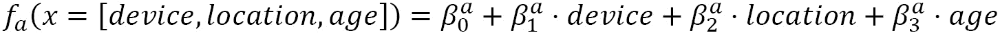

这里，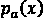 是用户在上下文  和广告  展示时点击的概率。另假设 *device* 对于移动设备为 1，其他设备为 0；*location* 对于美国为 1，其他地区为 0。这里有两个需要注意的重要事项：

+   这种行为，特别是  参数，对于广告商来说是未知的，他们将尝试揭示这些信息。

+   请注意  上标在 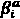 中，表示这些因素对用户行为的影响可能因广告而异。

现在，让我们在 Python 中实现这一点，按照以下步骤：

Chapter03/Contextual Bandits.ipynb

1.  首先，我们需要导入所需的 Python 包：

    ```py
    import numpy as np
    import pandas as pd
    from scipy.optimize import minimize
    from scipy import stats
    import plotly.offline
    from plotly.subplots import make_subplots
    import plotly.graph_objects as go
    import cufflinks as cf
    cf.go_offline()
    cf.set_config_file(world_readable=True, theme='white') 
    ```

    这些包括用于科学计算的库，如 NumPy 和 SciPy，以及强大的可视化工具 Plotly。

1.  现在，我们创建一个 `UserGenerator` 类来模拟用户动态。在这里设置一些真实的 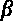 参数，广告商（代理）将尝试学习这些参数：

    ```py
    class UserGenerator(object):
        def __init__(self):
            self.beta = {}
            self.beta['A'] = np.array([-4, -0.1, -3, 0.1]) 
            self.beta['B'] = np.array([-6, -0.1, 1, 0.1])
            self.beta['C'] = np.array([2, 0.1, 1, -0.1])
            self.beta['D'] = np.array([4, 0.1, -3, -0.2])
            self.beta['E'] = np.array([-0.1, 0, 0.5, -0.01])
            self.context = None    
    ```

1.  让我们定义生成点击或无点击的方法，给定用户的上下文：

    ```py
        def logistic(self, beta, context):
            f = np.dot(beta, context)
            p = 1 / (1 + np.exp(-f))
            return p
        def display_ad(self, ad):
            if ad in ['A', 'B', 'C', 'D', 'E']:
                p = self.logistic(self.beta[ad], self.context)
                reward = np.random.binomial(n=1, p=p)
                return reward
            else:
                raise Exception('Unknown ad!') 
    ```

    请注意，每个广告都有一组不同的  值。当广告展示给用户时，`logistic` 方法会计算点击的概率，而 `display_ad` 方法会根据这个概率生成一个点击。

1.  我们定义了一个方法，将随机生成不同上下文的用户：

    ```py
        def generate_user_with_context(self):
            # 0: International, 1: U.S.
            location = np.random.binomial(n=1, p=0.6)
            # 0: Desktop, 1: Mobile
            device = np.random.binomial(n=1, p=0.8)
            # User age changes between 10 and 70, 
            # with mean age 34
            age = 10 + int(np.random.beta(2, 3) * 60)
            # Add 1 to the concept for the intercept
            self.context = [1, device, location, age]
            return self.context
    ```

    如你所见，`generate_user_with_context` 方法生成一个 60%概率的美国用户。此外，广告有 80%的概率在移动设备上展示。最后，用户年龄范围为 10 到 70 岁，平均年龄为 34 岁。这些数字是为了示例目的我们设定的，具有一定的随意性。为了简化，我们不假设这些用户属性之间存在任何相关性。你可以修改这些参数并引入相关性，以创建更现实的场景。

1.  我们可以创建一些函数（在类外部）来可视化，直观地展示上下文与与之相关的点击概率之间的关系。为此，我们需要一个函数来为给定的广告类型和数据创建散点图：

    ```py
    def get_scatter(x, y, name, showlegend):
        dashmap = {'A': 'solid',
                   'B': 'dot',
                   'C': 'dash',
                   'D': 'dashdot',
                   'E': 'longdash'}
        s = go.Scatter(x=x, 
                       y=y, 
                       legendgroup=name, 
                       showlegend=showlegend,
                       name=name, 
                       line=dict(color='blue', 
                                 dash=dashmap[name]))
        return s 
    ```

1.  现在，我们定义一个函数来绘制点击概率如何随年龄变化，在不同的子图中展示每种设备类型和位置的组合：

    ```py
    def visualize_bandits(ug):
        ad_list = 'ABCDE'
        ages = np.linspace(10, 70)
        fig = make_subplots(rows=2, cols=2, 
                subplot_titles=("Desktop, International", 
                                "Desktop, U.S.", 
                                "Mobile, International", 
                                "Mobile, U.S."))
        for device in [0, 1]:
            for loc in [0, 1]:
                showlegend = (device == 0) & (loc == 0)
                for ad in ad_list:
                    probs = [ug.logistic(ug.beta[ad], 
                              [1, device, loc, age]) 
                                     for age in ages]
                    fig.add_trace(get_scatter(ages, 
                                              probs, 
                                              ad, 
                                              showlegend), 
                               row=device+1, 
                               col=loc+1)             
        fig.update_layout(template="presentation")
        fig.show()
    ```

1.  现在，我们创建一个对象实例来生成用户并可视化用户行为：

    ```py
    ug = UserGenerator()
    visualize_bandits(ug)
    ```

    输出如 *图 3.2* 所示：

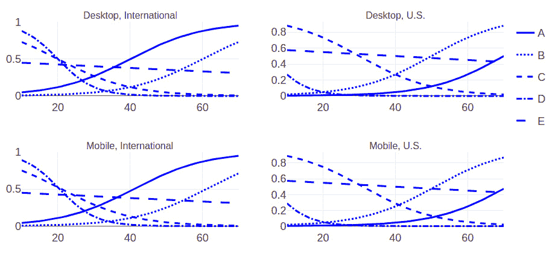

图 3.2 – 给定上下文的真实广告点击概率比较（x 轴：年龄，y 轴：点击概率）

看着*图 3.2*中的图表，我们应该期望我们的算法能够识别出，例如，对于大约 40 岁、来自美国并使用移动设备的用户，展示广告 E。同时，请注意，这些概率不现实地偏高。为了使`logistic`类中的`p`计算更为现实，我们将调整其值为 0.05。为了简化问题，暂时保持这种方式。

现在，我们已经实现了一个生成用户点击的过程。以下是这一场景的流程：

1.  我们将生成一个用户，并使用`ug`对象中的`generate_user_with_context`方法获取相关的上下文信息。

1.  一个 CB 模型将利用上下文来展示五个广告中的一个：A、B、C、D 或 E。

1.  选定的广告将传递给`ug`对象中的`display_ad`方法，给予奖励 1（点击）或 0（未点击）。

1.  CB 模型将根据奖励进行训练，并且这一循环将不断进行。

在实际实现这个流程之前，让我们深入了解将要使用的 CB 方法。

## 使用正则化逻辑回归的函数逼近

我们希望我们的 CB 算法能够观察用户对广告的反应，更新估计行动值的模型（函数逼近），并根据上下文、行动值估计以及探索策略来决定展示哪个广告。需要注意的是，在大多数现实设置中，用户流量较高，模型通常不会在每次观察后更新，而是在一批观察之后更新。因此，让我们先讨论使用哪种函数逼近器。我们有许多选择，包括许多为 CB 设计的定制和复杂算法。这些模型大多数基于以下几种方法：

+   逻辑回归

+   决策树/随机森林

+   神经网络

在探索策略方面，我们将继续关注以下三种基本方法：

+   ε-贪心算法（ε-greedy）

+   上置信界（Upper Confidence Bounds）

+   汤普森/贝叶斯采样

现在，假设作为主题专家，我们知道 CTR 可以通过逻辑回归来建模。我们还提到过，更新模型在每次观察后进行并不实际，因此我们更倾向于对模型进行批量更新。最后，我们希望在探索工具箱中加入汤普森采样（Thompson sampling），因此我们需要获得逻辑回归模型参数的后验分布。为此，我们使用一种正则化逻辑回归算法，并由代理提供批量更新（Chapelle 等，2011）。该算法执行以下操作：

+   通过高斯分布来近似模型权重的后验分布。这样，我们可以在下一个批次中将后验分布作为先验，并且可以使用高斯分布作为似然函数，因为高斯族是自共轭的。

+   使用对角协方差矩阵表示权重，这意味着我们假设权重之间不相关。

+   使用拉普拉斯近似来获取权重分布的均值和方差估计，这是统计学中常用的估计后验参数的方法之一，假设后验是高斯分布。

    信息

    你可以在[`bookdown.org/rdpeng/advstatcomp/laplace-approximation.html`](https://bookdown.org/rdpeng/advstatcomp/laplace-approximation.html)了解更多关于拉普拉斯近似计算后验均值的内容。

接下来，我们来看看这个算法的实际应用。

### 实现正则化逻辑回归

我们将按照以下步骤实现正则化逻辑回归，之后将用它：

1.  首先，我们创建一个类并初始化我们将跟踪的参数：

    ```py
    class RegularizedLR(object):
        def __init__(self, name, alpha, rlambda, n_dim):
            self.name = name
            self.alpha = alpha
            self.rlambda = rlambda
            self.n_dim = n_dim
            self.m = np.zeros(n_dim)
            self.q = np.ones(n_dim) * rlambda
            self.w = self.get_sampled_weights()
    ```

    让我们更好地理解这些参数是什么：

    a) `name` 用于识别对象实例正在估算的广告动作值。我们为每个广告都有一个单独的模型，并且根据各自的点击数据分别更新它们。

    b) `alpha`超参数控制探索与利用之间的权衡。较小的值减少方差（例如，0.25），从而鼓励利用。

    c) 这是一种正则化回归，意味着我们有一个正则化项，λ。它是一个需要调整的超参数。我们也用它来初始化`q`数组。

    d) `n_dim`表示参数向量的维度，每个上下文输入的元素对应一个，以及一个偏置项。

    e) 逻辑函数的权重由`w`数组表示，其中`w[i]`对应我们赌博机动态模型中的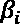。

    f) `w[i]`的均值估计由`m[i]`给出，方差估计由`q[i]`的倒数给出。

1.  然后，我们定义一个方法来对逻辑回归函数的参数进行采样：

    ```py
        def get_sampled_weights(self): 
            w = np.random.normal(self.m, self.alpha * self.q**(-1/2))
            return w
    ```

    注意，我们需要这个方法来使用汤普森采样，它要求从后验中对`w`数组参数进行采样，而不是使用均值。这里的后验是一个正态分布。

1.  定义损失函数和拟合函数，后者将执行训练：

    ```py
        def loss(self, w, *args):
            X, y = args
            n = len(y)
            regularizer = 0.5 * np.dot(self.q, (w - self.m)**2)
            pred_loss = sum([np.log(1 + np.exp(np.dot(w, X[j])))
                                        - y[j] * np.dot(w, X[j]) for j in range(n)])
            return regularizer + pred_loss
        def fit(self, X, y):
            if y:
                X = np.array(X)
                y = np.array(y)
                minimization = minimize(self.loss, 
                                        self.w, 
                                        args=(X, y), 
                                        method="L-BFGS-B", 
                                        bounds=[(-10,10)]*3 + [(-1, 1)],
                                        options={'maxiter': 50})
                self.w = minimization.x
                self.m = self.w
                p = (1 + np.exp(-np.matmul(self.w, X.T)))**(-1)
                self.q = self.q + np.matmul(p * (1 - p), X**2)
    ```

    让我们详细说明拟合部分是如何工作的：

    a) 我们使用`fit`方法和`loss`函数通过给定的上下文和相关的点击数据（点击为 1，未点击为 0）来更新模型。

    b) 我们使用 SciPy 的 minimize 函数进行模型训练。为了防止指数项中的数值溢出，我们对`w`施加了边界。根据输入值的范围，这些边界需要进行调整。对于设备类型的二进制特征和年龄输入，位置[-10, +10]和[-1, +1]分别是我们用例中的合理范围。

    c) 在每次使用新一批数据更新模型时，之前的`w`值作为先验。

1.  实现预测的上置信界限，这是我们将在实验中使用的探索方法之一：

    ```py
        def calc_sigmoid(self, w, context):
            return 1 / (1 + np.exp(-np.dot(w, context)))
        def get_ucb(self, context):
            pred = self.calc_sigmoid(self.m, context)
            confidence = self.alpha * np.sqrt(np.sum(np.divide(np.array(context)**2, self.q)))
            ucb = pred + confidence
            return ucb
    ```

1.  实现两种预测方法，一种使用均值参数估计，另一种使用采样参数，并与汤普森采样结合使用：

    ```py
        def get_prediction(self, context):
            return self.calc_sigmoid(self.m, context)
        def sample_prediction(self, context):
            w = self.get_sampled_weights()
            return self.calc_sigmoid(w, context)
    ```

现在，在实际开始解决问题之前，我们将定义一个度量标准来比较不同的探索策略。

## 目标——遗憾最小化

用于比较多臂老虎机（MAB）和上下文绑定（CB）算法的一个常见指标叫做**遗憾**。我们通过以下公式定义总遗憾，直到我们观察到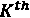用户：

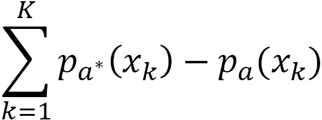

这里，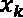是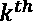用户的上下文，是应该采取的最佳行动（广告），它能带来最高的预期点击率（CTR），而是所选行动（广告）的预期点击率。需要注意的是，我们能够计算遗憾是因为我们可以访问真实的行动值（预期 CTR），而在现实中并不具备这一条件（尽管遗憾仍然可以被估计）。请注意，任何步骤中的最小遗憾值为零。

提示

使用良好的探索策略，我们应该看到随着算法发现最佳行动，累积遗憾会随着时间的推移而逐渐减缓。

我们将使用以下代码根据上下文和选择的广告来计算遗憾：

```py
def calculate_regret(ug, context, ad_options, ad):
    action_values = {a: ug.logistic(ug.beta[a], context) for a in ad_options}
    best_action = max(action_values, key=action_values.get)
    regret = action_values[best_action] - action_values[ad]
    return regret, best_action
```

最后，让我们编写代码，使用不同的探索策略来实际解决这个问题。

## 解决在线广告问题

由于我们已经定义了所有辅助方法来使用之前提到的三种探索策略，按策略选择行动将变得非常简单。现在，我们来实现这些策略的相关函数：

1.  我们从编写一个函数开始，来实现ε-贪心策略，该策略大多数时候选择最佳行动，其他时候则探索随机行动：

    ```py
    def select_ad_eps_greedy(ad_models, context, eps):
        if np.random.uniform() < eps:
            return np.random.choice(list(ad_models.keys()))
        else:
            predictions = {ad: ad_models[ad].get_prediction(context) 
                           for ad in ad_models}
            max_value = max(predictions.values()); 
            max_keys = [key for key, value in predictions.items() if value == max_value]
            return np.random.choice(max_keys)
    ```

1.  接下来，我们编写一个函数，使用上置信度界限进行行动选择：

    ```py
    def select_ad_ucb(ad_models, context):
        ucbs = {ad: ad_models[ad].get_ucb(context) 
                       for ad in ad_models}
        max_value = max(ucbs.values()); 
        max_keys = [key for key, value in ucbs.items() if value == max_value]
        return np.random.choice(max_keys)
    ```

1.  然后，我们定义一个函数来实现使用汤普森采样的行动选择：

    ```py
    def select_ad_thompson(ad_models, context):
        samples = {ad: ad_models[ad].sample_prediction(context) 
                       for ad in ad_models}
        max_value = max(samples.values()); 
        max_keys = [key for key, value in samples.items() if value == max_value]
        return np.random.choice(max_keys)
    ```

1.  最后，我们进行实际的实验，依次运行并比较每种策略。我们从初始化广告名称、实验名称和必要的数据结构开始：

    ```py
    ad_options = ['A', 'B', 'C', 'D', 'E']
    exploration_data = {}
    data_columns = ['context', 
                    'ad', 
                    'click', 
                    'best_action', 
                    'regret', 
                    'total_regret']
    exploration_strategies = ['eps-greedy', 
                              'ucb', 
                              'Thompson']
    ```

1.  我们需要实现一个外部的`for`循环来启动一个干净的实验，针对每一种探索策略。我们初始化所有算法参数和数据结构：

    ```py
    for strategy in exploration_strategies:
        print("--- Now using", strategy)
        np.random.seed(0)
        # Create the LR models for each ad
        alpha, rlambda, n_dim = 0.5, 0.5, 4
        ad_models = {ad: RegularizedLR(ad, 
                                       alpha, 
                                       rlambda, 
                                       n_dim) 
                     for ad in 'ABCDE'}
        # Initialize data structures
        X = {ad: [] for ad in ad_options}
        y = {ad: [] for ad in ad_options}
        results = []
        total_regret = 0
    ```

1.  现在，我们实现一个内部循环，用于在 10K 次用户展示中运行活跃的策略：

    ```py
        for i in range(10**4):
            context = ug.generate_user_with_context()
            if strategy == 'eps-greedy':
                eps = 0.1
                ad = select_ad_eps_greedy(ad_models, 
                                          context,
                                          eps)
            elif strategy == 'ucb':
                ad = select_ad_ucb(ad_models, context)
            elif strategy == 'Thompson':
                ad = select_ad_thompson(ad_models, context)
            # Display the selected ad
            click = ug.display_ad(ad)
            # Store the outcome
            X[ad].append(context)
            y[ad].append(click)
            regret, best_action = calculate_regret(ug, 
                                                   context, 
                                                   ad_options, 
                                                   ad)
            total_regret += regret
            results.append((context, 
                            ad, 
                            click, 
                            best_action, 
                            regret, 
                            total_regret))
            # Update the models with the latest batch of data
            if (i + 1) % 500 == 0:
                print("Updating the models at i:", i + 1)
                for ad in ad_options:
                    ad_models[ad].fit(X[ad], y[ad])
                X = {ad: [] for ad in ad_options}
                y = {ad: [] for ad in ad_options}

        exploration_data[strategy] = {'models': ad_models,
                           'results': pd.DataFrame(results, 
                                             columns=data_columns)}
    ```

    让我们逐步分析一下：

    a) 我们生成一个用户，并根据上下文来决定在每次迭代中展示哪个广告，依据的是探索策略。

    b) 我们观察并记录结果。我们还会在每次展示后计算遗憾，以便比较不同策略的效果。

    c) 我们以批量的方式更新逻辑回归模型，也就是每当有 500 次广告展示后进行一次更新。

1.  执行完此代码块后，我们可以使用以下代码来可视化结果：

    ```py
    df_regret_comparisons = pd.DataFrame({s: exploration_data[s]['results'].total_regret
                                         for s in exploration_strategies})
    df_regret_comparisons.iplot(dash=['solid', 'dash','dot'],
                                xTitle='Impressions', 
                                yTitle='Total Regret',
                                color='black')
    ```

    这将生成图 3.3 中所示的图表：

    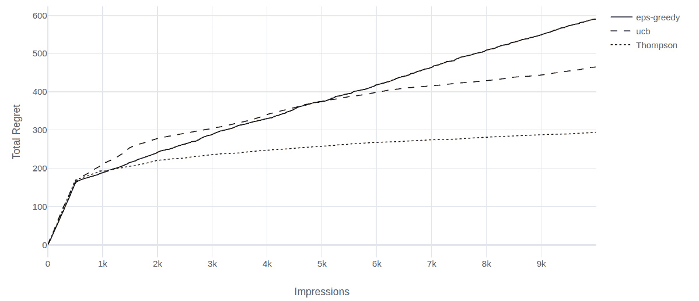

    图 3.3 – 在线广告示例中探索策略的比较

    我们清楚地看到，汤普森采样优于ε-贪婪和 UCB 的`alpha`，后者可能会导致更好的表现。但这正是重点：汤普森采样提供了一种非常有效的探索策略，几乎可以开箱即用。这是*Chapelle 等人，2011*通过实验证明的，并帮助该方法在它被提出近一个世纪后获得了广泛的关注。

    提示

    在实际生产系统中，使用维护良好的库来处理 CB 中的监督学习部分，比我们这里做的自定义实现要更为合理。一个用于概率编程的库是 PyMC3（[`docs.pymc.io/`](https://docs.pymc.io/)）。使用 PyMC3，你可以将监督学习模型拟合到你的数据上，然后对模型参数进行采样。作为一个练习，考虑在 PyMC3 中使用逻辑回归模型实现汤普森采样。

1.  让我们通过可视化模型的参数估计来结束这一部分。例如，当我们使用ε-贪婪策略时，广告 A 的系数被估计如下：

    ```py
    lrmodel = exploration_data['eps-greedy']['models']['A']
    df_beta_dist = pd.DataFrame([], index=np.arange(-4,1,0.01))
    mean = lrmodel.m
    std_dev = lrmodel.q ** (-1/2)
    for i in range(lrmodel.n_dim):
        df_beta_dist['beta_'+str(i)] = stats.norm(loc=mean[i], 
                                                  scale=std_dev[i]).pdf(df_beta_dist.index)

    df_beta_dist.iplot(dash=['dashdot','dot', 'dash', 'solid'],
                       yTitle='p.d.f.',
                       color='black')
    ```

    这会生成以下输出：

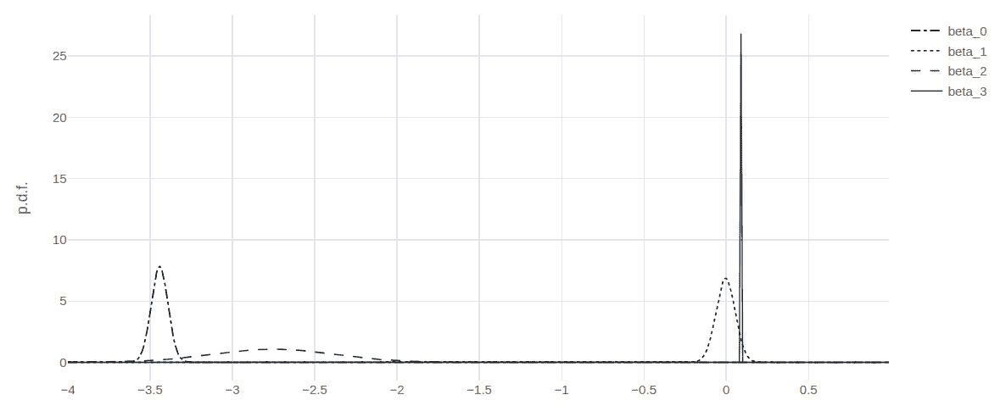

图 3.4 – 实验结束时，使用ε-贪婪探索的广告 A 的后验分布可视化

逻辑回归模型的系数估计为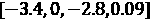，而实际的系数为。该模型对于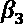的估计特别确定，这在图中的分布非常狭窄。

做得非常好！这是一个相当长的练习，但它将为你在实际应用中的成功奠定基础。深呼吸一下，休息片刻，接下来我们将看看一个更为现实的在线广告版本，其中广告库存随时间变化。

# 使用函数逼近来处理行动

在我们到目前为止的在线广告示例中，我们假设有一组固定的广告（行动/臂）可供选择。然而，在许多 CB 的应用中，可用的行动集合是随着时间变化的。以一个现代广告网络为例，该网络使用广告服务器将广告匹配到网站/应用。这是一个非常动态的操作，涉及到的，抛开定价不谈，主要有三个组成部分：

+   网站/应用内容

+   观众/用户画像

+   广告库存

之前，我们只考虑了用户配置文件作为上下文。广告服务器需要额外考虑网站/应用内容，但这并没有真正改变我们之前解决的问题结构。然而，现在，由于广告库存是动态的，我们不能为每个广告使用单独的模型。我们通过将广告特征输入单一模型来处理这个问题。这在*图 3.5*中有所说明：

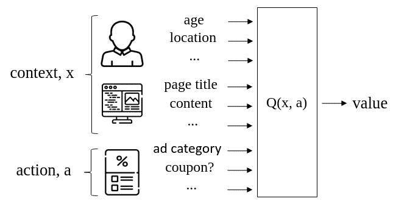

图 3.5 – 在广告网络示例中，带有上下文和动作输入的行动值的函数近似

在做出决策时，我们将上下文视为已知条件。因此，决策是关于从当前可用广告库存中展示哪个广告。因此，为了做出这个决定，我们使用这个单一模型为所有可用广告生成行动值。

现在是时候谈谈在这种情况下使用什么样的模型了：

+   记住模型的作用：它学习了给定用户在给定网站/应用上看到的给定广告后的反应，并估计点击的概率。

+   当你考虑所有可能的用户和网站/应用上下文，以及所有可能的广告时，这是一个非常复杂的关系需要弄清楚。

+   这样的模型需要在大量数据上进行训练，并且应足够复杂，以能够提供真实点击动态的良好近似。

+   当我们面对如此复杂性，并希望有足够的数据时，有一个明显的选择：**深度神经网络**（**DNNs**）。

在前一节中，我们比较了不同的探索策略，并展示了汤普森抽样是一个非常有竞争力的选择。然而，汤普森抽样要求我们能够从模型参数的后验分布中进行采样；对于诸如神经网络之类的复杂模型，这通常是不可行的。为了克服这一挑战，我们依赖于文献中提供的近似贝叶斯方法。

信息

有许多近似方法，它们的比较超出了这里的范围。*Riquelme 等人，2018*在 TensorFlow 存储库中提供了一个很好的比较及其代码。

一个这些近似方法包括在深度神经网络中使用辍学正则化，并在推断时保持其活跃。作为提醒，辍学正则化会以给定概率停用 DNN 中的每个神经元，并增加泛化能力。通常，辍学仅在训练期间使用。当推断时保持其活跃时，由于神经元以概率方式被禁用，输出相应变化。*Gal 等人，2015*显示，这类似于近似贝叶斯推断，这是我们用于汤普森抽样所需的。

## 案例研究 – 利用来自美国人口普查的用户数据进行上下文在线广告投放

现在，我们来谈谈这一部分将使用的示例。之前，我们设计了自己的示例。这一次，我们将使用一个经过修改的数据集，该数据集来源于 1994 年的美国人口普查，并将其调整为在线广告场景。这个数据集被称为人口普查收入数据集，可以在[`archive.ics.uci.edu/ml/datasets/Census+Income`](https://archive.ics.uci.edu/ml/datasets/Census+Income)找到。

在这个数据集中，我们使用了参与普查的个人的以下信息：年龄、工作类别、教育、婚姻状况、职业、关系、种族、性别、每周工作小时数、原籍国和收入水平。

接下来，让我们讨论如何将这些数据转化为在线广告场景。

### 场景描述

假设有一个广告服务器，它知道用户的所有前述信息，除了教育水平。另一方面，广告网络管理着针对特定教育水平的广告。例如，在任何给定时刻，广告服务器可能有一则广告针对接受过大学教育的用户，另一则广告则针对接受过小学教育的用户。如果展示的广告目标用户的教育水平与用户的实际教育水平相匹配，则点击的概率很高。如果不匹配，随着目标教育水平与用户教育水平之间的差距增大，点击的概率会逐渐下降。换句话说，广告服务器在隐式地尝试尽可能准确地预测用户的教育水平。

接下来，我们准备为这个场景提供数据集。

### 数据准备

按照以下步骤清理和准备数据：

1.  我们首先导入稍后将使用的必要包：

    ```py
    from collections import namedtuple
    from numpy.random import uniform as U
    import pandas as pd
    import numpy as np
    import io
    import requests
    from tensorflow import keras
    from tensorflow.keras.layers import Dense, Dropout
    import cufflinks as cf
    cf.go_offline()
    cf.set_config_file(world_readable=True, theme='white')
    ```

1.  接下来，我们需要下载数据并选择感兴趣的列：

    ```py
    url="https://archive.ics.uci.edu/ml/machine-learning-databases/adult/adult.data"
    s=requests.get(url).content
    names = ['age', 
               'workclass', 
               'fnlwgt', 
               'education',
               'education_num',
               'marital_status',
               'occupation',
               'relationship',
               'race',
               'gender',
               'capital_gain',
               'capital_loss',
               'hours_per_week',
               'native_country',
              'income']
    usecols = ['age', 
               'workclass', 
               'education',
               'marital_status',
               'occupation',
               'relationship',
               'race',
               'gender',
               'hours_per_week',
               'native_country',
               'income']
    df_census = pd.read_csv(io.StringIO(s.decode('utf-8')), 
                            sep=',',
                            skipinitialspace=True,
                            names=names,
                            header=None,
                            usecols=usecols)
    ```

1.  让我们删除包含缺失数据的行，这些行用`?`标记：

    ```py
    df_census = df_census.replace('?', np.nan).dropna()
    ```

    通常，一个缺失的条目本身可能是一个有价值的指示，模型可以使用它。此外，仅因为某个条目缺失而删除整行数据也有些浪费。然而，数据插补超出了本讨论的范围，所以我们继续专注于 CB 问题。

1.  我们还将不同的教育水平合并为四个类别：`小学`、`中学`、`本科`和`研究生`：

    ```py
    edu_map = {'Preschool': 'Elementary',
               '1st-4th': 'Elementary',
               '5th-6th': 'Elementary',
               '7th-8th': 'Elementary',
               '9th': 'Middle',
               '10th': 'Middle',
               '11th': 'Middle',
               '12th': 'Middle',
               'Some-college': 'Undergraduate',
               'Bachelors': 'Undergraduate',
               'Assoc-acdm': 'Undergraduate',
               'Assoc-voc': 'Undergraduate',
               'Prof-school': 'Graduate',
               'Masters': 'Graduate',
               'Doctorate': 'Graduate'}
    for from_level, to_level in edu_map.items():
        df_census.education.replace(from_level, to_level, inplace=True)
    ```

1.  接下来，我们将分类数据转换为独热编码（one-hot vectors），以便输入到 DNN 中。我们保留教育列不变，因为它不是上下文的一部分：

    ```py
    context_cols = [c for c in usecols if c != 'education']
    df_data = pd.concat([pd.get_dummies(df_census[context_cols]),
               df_census['education']], axis=1)
    ```

    通过在开始时进行此转换，我们假设我们知道所有可能的工作类别和原籍国类别。

就这样！我们已经准备好数据。接下来，我们实现逻辑，通过用户的实际教育水平和广告所针对的教育水平来模拟广告点击。

### 模拟广告点击

在这个示例中，广告的可用性是随机的，广告点击是随机的。我们需要设计一些逻辑来模拟这种行为：

1.  让我们先确定每个教育类别的广告可用性概率，并实现广告的抽样：

    ```py
    def get_ad_inventory():
        ad_inv_prob = {'Elementary': 0.9, 
                       'Middle': 0.7, 
                       'HS-grad': 0.7, 
                       'Undergraduate': 0.9, 
                       'Graduate': 0.8}
        ad_inventory = []
        for level, prob in ad_inv_prob.items():
            if U() < prob:
                ad_inventory.append(level)
        # Make sure there are at least one ad
        if not ad_inventory:
            ad_inventory = get_ad_inventory()
        return ad_inventory
    ```

    如前所述，广告服务器每个目标组最多只有一个广告。我们还确保库存中至少有一个广告。

1.  然后，我们定义一个函数，通过概率生成一个点击，其中点击的可能性随着用户教育水平和广告目标匹配的程度而增加：

    ```py
    def get_ad_click_probs():
        base_prob = 0.8
        delta = 0.3
        ed_levels = {'Elementary': 1, 
                     'Middle': 2, 
                     'HS-grad': 3, 
                     'Undergraduate': 4, 
                     'Graduate': 5}
        ad_click_probs = {l1: {l2: max(0, base_prob - delta * abs(ed_levels[l1]- ed_levels[l2])) for l2 in ed_levels}
                               for l1 in ed_levels}
        return ad_click_probs
    def display_ad(ad_click_probs, user, ad):
        prob = ad_click_probs[ad][user['education']]
        click = 1 if U() < prob else 0
        return click
    ```

    所以，当一个广告展示给用户时，如果广告的目标匹配用户的教育水平，则点击概率为 。每当不匹配一个级别时，这个概率会减少 。例如，一个拥有高中学历的人点击一个针对小学毕业生（或大学毕业生）用户组的广告的概率为 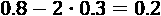。注意，CB 算法并不知道这些信息，它只会用于模拟点击。

我们已经设置好了问题。接下来，我们将转向实现一个 CB 模型。

## 使用神经网络的函数逼近

如前所述，我们使用一个（并不那么）DNN，它将在给定上下文和行动的情况下估计行动值。我们将使用的 DNN 有两层，每层有 256 个隐藏单元。这个模型使用 Keras——TensorFlow 的高级 API——来创建相当简单。

提示

请注意，在我们的模型中，我们使用了 dropout，并且在推理时将其保持激活状态，作为我们为 Thompson 采样所需的贝叶斯近似。这是通过在 dropout 层设置 `training=True` 来配置的。

网络输出一个标量，这是给定上下文和行动特征（目标用户组）下的行动值估计。使用二元交叉熵最适合这种输出，所以我们将在模型中使用它。最后，我们将使用流行的 Adam 优化器。

信息

如果你需要开始使用 Keras 或者回顾一下，访问 [`www.tensorflow.org/guide/keras`](https://www.tensorflow.org/guide/keras)。使用它构建标准的 DNN 模型非常简单。

现在，让我们创建用于模型创建和更新的函数：

1.  我们创建一个函数，返回一个已编译的 DNN 模型，给定输入维度和一个 dropout 比率：

    ```py
    def get_model(n_input, dropout):
        inputs = keras.Input(shape=(n_input,))
        x = Dense(256, activation='relu')(inputs)
        if dropout > 0:
            x = Dropout(dropout)(x, training=True)
        x = Dense(256, activation='relu')(x)
        if dropout > 0:
            x = Dropout(dropout)(x, training=True)
        phat = Dense(1, activation='sigmoid')(x)
        model = keras.Model(inputs, phat)
        model.compile(loss=keras.losses.BinaryCrossentropy(),
                      optimizer=keras.optimizers.Adam(),
                      metrics=[keras.metrics.binary_accuracy])
        return model
    ```

1.  当数据可用时，我们将按批次更新这个模型。接下来，编写一个函数，用每个批次训练模型 10 个周期：

    ```py
    def update_model(model, X, y):
        X = np.array(X)
        X = X.reshape((X.shape[0], X.shape[2]))
        y = np.array(y).reshape(-1)
        model.fit(X, y, epochs=10)
        return model
    ```

1.  然后，我们定义一个函数，返回基于目标教育水平的指定广告的一-hot 表示：

    ```py
    def ad_to_one_hot(ad):
        ed_levels = ['Elementary', 
                     'Middle', 
                     'HS-grad', 
                     'Undergraduate', 
                     'Graduate']
        ad_input = [0] * len(ed_levels)
        if ad in ed_levels:
            ad_input[ed_levels.index(ad)] = 1
        return ad_input
    ```

1.  我们实现了 Thompson 采样来根据上下文和手头的广告库存选择一个广告：

    ```py
    def select_ad(model, context, ad_inventory):
        selected_ad = None
        selected_x = None
        max_action_val = 0
        for ad in ad_inventory:
            ad_x = ad_to_one_hot(ad)
            x = np.array(context + ad_x).reshape((1, -1))
            action_val_pred = model.predict(x)[0][0]
            if action_val_pred >= max_action_val:
                selected_ad = ad
                selected_x = x
                max_action_val = action_val_pred
        return selected_ad, selected_x
    ```

    要显示的广告是基于我们从 DNN 获得的最大行动值估计来选择的。我们通过尝试库存中所有可用的广告来获得这一点——请记住，我们每个目标用户组最多只有一个广告——并结合用户的上下文。注意，目标用户组等同于`action`，我们以一-hot 向量的格式将其输入到 DNN。

1.  最后，我们编写一个函数，通过从数据集中随机选择来生成用户。该函数将返回用户数据以及派生的上下文：

    ```py
    def generate_user(df_data):
        user = df_data.sample(1)
        context = user.iloc[:, :-1].values.tolist()[0]
        return user.to_dict(orient='records')[0], context
    ```

这就结束了我们使用汤普森采样来决定展示广告所需的步骤。

## 计算后悔值

我们将继续使用后悔值来比较 CB 算法的不同版本。计算方法如下：

```py
def calc_regret(user, ad_inventory, ad_click_probs, ad_selected):
    this_p = 0
    max_p = 0
    for ad in ad_inventory:
        p = ad_click_probs[ad][user['education']]
        if ad == ad_selected:
            this_p = p
        if p > max_p:
            max_p = p
    regret = max_p - this_p
    return regret
```

在后悔值计算也完成后，让我们现在实际解决问题。

## 解决在线广告问题

现在我们准备将所有这些组件整合在一起。我们将在 5,000 次展示中尝试使用不同的丢弃概率的算法。每进行 500 次迭代后，我们会更新 DNN 参数。以下是 Python 中不同丢弃率的实现：

```py
ad_click_probs = get_ad_click_probs()
df_cbandits = pd.DataFrame()
dropout_levels = [0, 0.01, 0.05, 0.1, 0.2, 0.4]
for d in dropout_levels:
    print("Trying with dropout:", d)
    np.random.seed(0)
    context_n = df_data.shape[1] - 1
    ad_input_n = df_data.education.nunique()
    model = get_model(context_n + ad_input_n, 0.01)
    X = []
    y = []
    regret_vec = []
    total_regret = 0
    for i in range(5000):
        if i % 20 == 0:
            print("# of impressions:", i)
        user, context = generate_user(df_data)
        ad_inventory = get_ad_inventory()
        ad, x = select_ad(model, context, ad_inventory)
        click = display_ad(ad_click_probs, user, ad)
        regret = calc_regret(user, ad_inventory,    ad_click_probs, ad)
        total_regret += regret
        regret_vec.append(total_regret)
        X.append(x)
        y.append(click)
        if (i + 1) % 500 == 0:
            print('Updating the model at', i+1)
            model = update_model(model, X, y)
            X = []
            y = []

    df_cbandits['dropout: '+str(d)] = regret_vec
```

累积后悔值随时间的变化存储在`df_cbandits` `pandas` DataFrame 中。让我们来可视化它们的比较：

```py
df_cbandits.iplot(dash = ['dash', 'solid', 'dashdot', 
                          'dot', 'longdash', 'longdashdot'],
                  xTitle='Impressions', 
                  yTitle='Cumulative Regret')
```

这将产生以下输出：

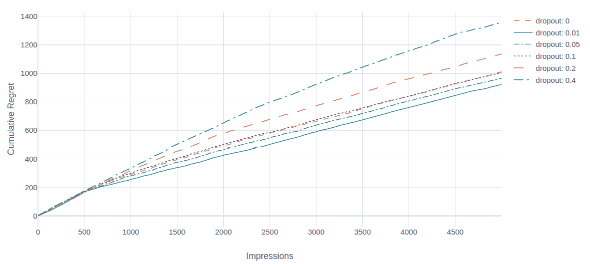

图 3.6 – 不同丢弃率下累积后悔的比较

*图 3.6*中的结果显示，我们的赌徒模型在经过一些观察后，学会了如何根据用户特征选择广告。由于不同的丢弃率导致了不同的算法表现，一个重要的问题再次出现，那就是如何选择丢弃率。一个明显的答案是，随着时间的推移，尝试不同的丢弃率，以确定在类似的在线广告问题中最有效的丢弃率。这个方法通常适用于业务需要长期解决类似问题的情况。然而，更好的方法是学习最优的丢弃率。

提示

**Concrete dropout**是一种变体，能够自动调节丢弃概率。（Collier & Llorens, 2018）成功地在 CB 问题中使用了这种方法，并报告了比固定丢弃选择更优的性能。关于 Concrete dropout 的 TensorFlow 实现，参见[`github.com/Skydes/Concrete-Dropout`](https://github.com/Skydes/Concrete-Dropout)。

至此，我们的 CB 讨论已结束。请注意，在制定 CB 问题时，我们主要关注了两个组件：

+   函数逼近

+   探索策略

你可以经常将不同的函数逼近与各种探索技术混合使用。虽然汤普森采样与 DNN 的组合可能是最常见的选择，但我们鼓励你参考文献，了解其他方法。

# 多臂老虎机和 CB 的其他应用

到目前为止，我们一直将在线广告作为我们的示例。如果你在想这种带有赌博算法的应用在这个领域的普及程度如何，其实它们相当常见。例如，微软有一个基于赌博算法的服务，叫做 Personalizer（免责声明：作者在写这本书时是微软的员工）。这里的示例本身受到 HubSpot（一个营销解决方案公司）的工作的启发（Collier & Llorens, 2018）。此外，赌博问题在广告以外有许多实际应用。在本节中，我们将简要介绍其中一些应用。

## 推荐系统

本章中我们所定义并解决的赌博问题是一种推荐系统：它们推荐应该显示哪个广告，可能会利用关于用户的信息。还有许多其他推荐系统也以类似的方式使用赌博算法，诸如：

+   电影标题的艺术作品选择，正如 Netflix 著名的实现方式（Chandrashekar, Amat, Basilico, & Jebara, 2017）

+   新闻门户的文章推荐

+   社交媒体平台上的帖子推荐

+   在线零售平台上的产品/服务推荐

+   根据用户在搜索引擎上的行为定制搜索结果

## 网页/应用功能设计

我们每天访问的大多数著名网站和应用，都会在经过大量测试后决定使用哪种设计。例如，他们会为购物车中的“购买”按钮设计不同的版本，并观察哪种设计带来最多的销售量。这些实验会不间断地进行，涵盖数百个功能。进行这些实验的一种高效方式是使用多臂赌博算法。通过这种方式，可以尽早识别出差的功能设计，并将其淘汰，从而最小化这些实验对用户的干扰（Lomas et al., 2016）。

## 医疗保健

赌博问题在医疗保健中有重要应用。尤其是随着患者数据的增加，通过维护良好的患者数据库和通过移动设备收集数据，现在许多治疗方法都可以个性化地应用于个人。因此，在随机对照试验中决定应用哪种治疗方法时，CB 是一个重要工具。CB 成功应用的另一个例子是决定药物的治疗剂量，比如调节血液凝固的华法林（Bastani and Bayati, 2015）。另一个应用是与最优分配数据采样到不同动物模型以评估治疗效果相关。CB 通过比传统方法更好地识别有前景的治疗方式，证明了能提高这一过程的效率（Durand et al., 2018）。

## 动态定价

对在线零售商来说，一个重要的挑战是如何在数百万种商品上动态调整价格。这可以建模为一个上下文带宽（CB）问题，其中上下文可能包括产品需求预测、库存水平、产品成本和位置。

## 财务

CBs 在文献中用于通过混合被动和主动投资，构建最佳投资组合，以实现风险和预期回报之间的平衡。

## 控制系统调节

许多机械系统使用 **比例-积分-微分** (**PID**) 控制器的变体来控制系统。PID 控制器需要调节，通常由相关领域的专家分别为每个系统进行调节。这是因为控制器的最佳增益取决于设备的具体情况，如材料、温度和磨损。这一手动过程可以通过使用 CB 模型来自动化，CB 模型评估系统特性并相应地调节控制器。

# 总结

在这一章中，我们结束了关于带有 CBs 的强盗问题的讨论。正如我们所提到的，强盗问题有许多实际应用。因此，如果你已经在自己的业务或研究中遇到一个可以建模为强盗问题的情况，也不会感到惊讶。现在你知道如何构造和解决一个强盗问题，去应用你所学的知识吧！强盗问题对于发展解决探索与利用困境的直觉非常重要，这一困境几乎会出现在每个强化学习场景中。

现在你已经深入理解了如何解决单步强化学习，接下来是时候进入完整的多步强化学习了。在下一章中，我们将深入探讨与多步强化学习相关的马尔科夫决策过程理论，并为现代深度强化学习方法打下基础，这些方法将在随后的章节中讨论。

# 参考文献

+   Bouneffouf, D., & Rish, I. (2019). *多臂和情境强盗的实际应用调查*. 取自 arXiv: [`arxiv.org/abs/1904.10040`](https://arxiv.org/abs/1904.10040)

+   Chandrashekar, A., Amat, F., Basilico, J., & Jebara, T. (2017 年 12 月 7 日). Netflix 技术博客. 取自 Netflix 的艺术作品个性化: [`netflixtechblog.com/artwork-personalization-c589f074ad76`](https://netflixtechblog.com/artwork-personalization-c589f074ad76)

+   Chapelle, O., & Li, L. (2011). *汤普森采样的实证评估. 神经信息处理系统进展*, 24, (第 2249-2257 页)

+   Collier, M., & Llorens, H. U. (2018). *深度情境多臂强盗*. 取自 arXiv: [`arxiv.org/abs/1807.09809`](https://arxiv.org/abs/1807.09809)

+   Gal, Y., Hron, J., & Kendall, A. (2017). *具体丢弃法. 神经信息处理系统进展*, 30, (第 3581-3590 页)

+   Marmerola, G. D. (2017 年 11 月 28 日). *情境强盗的汤普森采样*. 取自 Guilherme 的博客: [`gdmarmerola.github.io/ts-for-contextual-bandits`](https://gdmarmerola.github.io/ts-for-contextual-bandits)

+   Riquelme, C., Tucker, G., & Snoek, J. (2018). *深度贝叶斯强盗对决：汤普森采样的贝叶斯深度网络实证比较*. 国际学习表征会议（ICLR）

+   Russo, D., Van Roy, B., Kazerouni, A., Osband, I., & Wen, Z. (2018). *Thompson Sampling 教程。机器学习基础与趋势*，（第 1-96 页）

+   Lomas, D., Forlizzi, J., Poonawala, N., Patel, N., Shodhan, S., Patel, K., Koedinger, K., & Brunskill, E. (2016). *作为多臂 bandit 问题的界面设计优化*。（第 4142-4153 页）。10.1145/2858036.2858425

+   Durand, A., Achilleos, C., Iacovides, D., Strati, K., Mitsis, G.D., & Pineau, J. (2018). *用于在小鼠新生致癌模型中适应性治疗的上下文 bandit 方法*。第三届医疗健康机器学习会议论文集，PMLR 85:67-82

+   Bastani, H. & Bayati, M. (2015). *具有高维协变量的在线决策制定*。可在 SSRN 2661896 上获得
