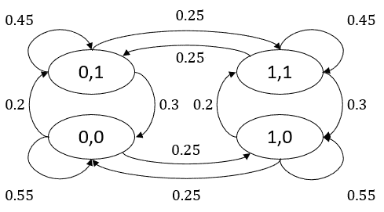
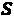
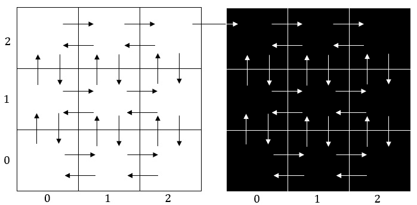
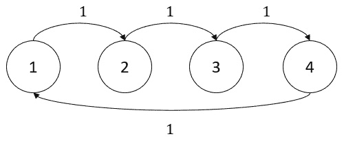
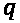
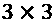
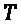
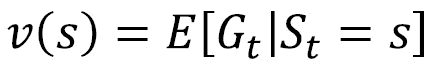
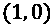

# 第四章：*第四章*：马尔可夫决策过程的构成

在第一章中，我们讨论了**强化学习**（**RL**）的许多应用，从机器人学到金融。在为这些应用实现任何 RL 算法之前，我们需要先对其进行数学建模。**马尔可夫决策过程**（**MDP**）是我们用来建模这些序贯决策问题的框架。MDP 具有一些特殊的特性，使得我们可以更容易地从理论上分析这些问题。在此基础上，**动态规划**（**DP**）是提出 MDP 解决方法的领域。从某种意义上讲，RL 是一组近似 DP 方法，能够让我们为非常复杂、无法通过精确的 DP 方法解决的问题找到较好的（但不一定是最优的）解决方案。

在本章中，我们将一步一步地构建一个 MDP，解释其特性，并为后续章节中将介绍的 RL 算法奠定数学基础。在 MDP 中，智能体采取的行动具有长期后果，这也是它与我们之前讨论的**多臂老虎机**（**MAB**）问题的区别。本章重点讨论一些量化这一长期影响的关键概念。虽然涉及的理论比其他章节稍多，但别担心，我们将很快进入 Python 实践环节，帮助更好地掌握这些概念。本章具体包括以下内容：

+   马尔可夫链

+   马尔可夫奖励过程

+   马尔可夫决策过程

+   部分可观测的 MDP

# 从马尔可夫链开始

我们从马尔可夫链开始，这不涉及任何决策过程。它们仅仅是建模某些内部转移动态驱动的特定类型的随机过程。因此，我们暂时不谈及智能体。理解马尔可夫链如何工作，将帮助我们为后续涉及的马尔可夫决策过程（MDP）奠定基础。

## 具有马尔可夫性质的随机过程

我们已经定义了**状态**，即完全描述环境所处情境的集合。如果环境将要转移到的下一个状态仅仅依赖于当前状态，而不依赖于过去的状态，我们称该过程具有**马尔可夫性质**。这一性质得名于俄国数学家安德烈·马尔可夫。

想象一个在网格世界中随机移动的坏掉的机器人。在任何给定的步骤中，机器人以 0.2、0.3、0.25 和 0.25 的概率分别向上、向下、向左和向右移动。如下图 *图 4.1* 所示：


图 4.1 – 一个坏掉的机器人，当前位于 (1,2) 的网格世界中

机器人当前处于状态中。它从哪里来并不重要；它将以的概率进入状态，以的概率进入状态，依此类推。由于它下一步的转移概率仅取决于当前所处的状态，而与之前所处的状态无关，因此该过程具有马尔可夫性质。

让我们更正式地定义这一点。我们用表示时间时的状态。如果对于所有状态和时间，以下条件成立，则该过程具有马尔可夫性质：


这样的随机过程称为**马尔可夫链**。请注意，如果机器人撞到墙壁，我们假设它会反弹回去并保持在原状态。因此，例如，在状态时，机器人将在下一步仍停留在那里，概率为。

马尔可夫链通常使用有向图来表示。在网格世界中，破损机器人示例的有向图如下所示，如*图 4.2*所示：



图 4.2 – 2x2 网格世界中机器人示例的马尔可夫链图

提示

许多系统可以通过将历史信息包含在状态中来变成马尔可夫过程。考虑一个修改后的机器人示例，其中机器人更可能继续沿着上一步的方向移动。虽然这样的系统表面上似乎不满足马尔可夫性质，但我们可以简单地重新定义状态，将过去两步中访问过的单元格包括在内，例如。在这个新状态定义下，转移概率将与过去的状态无关，马尔可夫性质将得到满足。

现在我们已经定义了马尔可夫链，接下来让我们深入探讨。接下来，我们将研究如何根据转移行为的不同来分类马尔可夫链中的状态。

## 马尔可夫链中状态的分类

一种环境可以在若干次过渡后从任何状态转移到任何其他状态，正如我们在机器人示例中所看到的那样，这是一种特殊类型的马尔可夫链。正如你所想，现实中更复杂的系统会涉及到具有更丰富特征集的状态，接下来我们将介绍这些特征。

### 可达状态与可通信状态

如果环境能够在一定步数后以正概率从状态  过渡到状态 ，我们称  是从  **可达** 的。如果  也是从  可达的，那么这些状态被称为**通讯**。如果马尔可夫链中的所有状态都彼此通讯，我们称该马尔可夫链是**不可约**的，这正是我们机器人示例中的情况。

### 吸收态

如果一个状态  只能过渡到自身，即 ，那么这个状态被称为**吸收态**。想象一下，如果在前述例子中机器人撞到墙壁后无法再移动，那么这就是吸收态的一个例子，因为机器人永远无法离开这个状态。带有吸收态的网格世界版本可以用马尔可夫链图表示，如*图 4.3*所示：


图 4.3 – 具有吸收态的马尔可夫链图

在 RL 上下文中，吸收态等同于标记了一集结束的终端状态，我们在*第一章** 强化学习导论*中定义过。除了终端状态外，一集还可以在达到时间限制 T 后结束。

### 瞬态状态和经常态状态

如果存在另一个状态 ，可以从状态  到达它，但反之不成立，则状态  被称为**瞬态状态**。在足够长的时间内，环境最终会远离瞬态状态并且不再返回。

考虑一个修改后的网格世界，分为两个部分；我们可以玩味地称它们为光面和暗面。这个世界中的可能过渡如 *图 4.4* 所示。你能识别出瞬态状态吗？



图 4.4 – 具有明暗面的网格世界

如果你认为光面上的答案是 ，请再想一想。光面上的每个状态都有一条通向暗面的出路，但没有返回的可能性。因此，无论机器人位于光面的哪个位置，它最终都会过渡到暗面并且无法返回。因此，所有光面上的状态都是瞬态的。这是一个类似于反乌托邦的世界！同样，在带有**崩溃**状态的修改后网格世界中，所有状态都是瞬态的，除了**崩溃**状态。

最后，不是瞬态的状态被称为**经常态状态**。在这个例子中，暗面上的状态是经常态的。

### 周期性和非周期性状态

我们称一个状态  为**周期性**，如果所有从  离开的路径在经过某个多倍数的  步后会返回。考虑 *图 4.5* 中的例子，其中所有状态的周期为 ：



图 4.5 – 具有周期状态的马尔可夫链，k=4

如果 ，则称重现状态为**非周期性**。

### 遍历性

我们最终可以定义一个重要类别的马尔可夫链。如果所有状态都表现出以下特性，则称马尔可夫链为**遍历**：

+   彼此通信（不可约）

+   是重现的

+   是非周期性的

对于遍历马尔可夫链，我们可以计算出一个单一的概率分布，告诉我们系统在经过很长时间从初始化开始后，会以什么概率处于某个状态。这被称为**稳态概率分布**。

到目前为止，一切顺利，但我们所涉及的内容也稍微有些密集，充满了定义的集合。在我们进入实际例子之前，让我们先定义一下马尔可夫链在状态之间转换的数学原理。

## 转移和稳态行为

我们可以通过数学方法计算马尔可夫链随时间的行为。为此，我们首先需要知道系统的**初始概率分布**。例如，当我们初始化一个网格世界时，机器人一开始会处于哪个状态？这就是由初始概率分布给出的。然后，我们定义**转移概率矩阵**，它的条目给出了从一个时间步到下一个时间步之间所有状态对的转移概率。更正式地，矩阵中位于  行和  列的条目给出 ，其中  和  是状态索引（按照我们的惯例，从 1 开始）。

现在，为了计算系统在经过  步后处于状态  的概率，我们使用以下公式：


这里， 是初始概率分布， 是转移概率矩阵的幂 。请注意， 给出了在从状态  开始后，经过  步后处于状态  的概率。

信息

一个马尔可夫链完全由  元组来表征，其中  是所有状态的集合， 是转移概率矩阵。

是的，到目前为止我们已经介绍了很多定义和理论。现在，正是时候看一下实际的例子了。

## 示例 – 网格世界中的 n 步行为

在许多强化学习算法中，核心思想是使我们对环境当前状态的理解与经过步转移后的理解保持一致，并不断迭代，直到这种一致性得到确保。因此，了解作为马尔可夫链建模的环境随时间演化的直觉非常重要。为此，我们将研究步的网格世界行为。跟着一起走吧！

1.  我们从创建一个网格世界开始，机器人在其中，类似于*图 4.1*中的情况。现在，我们总是将机器人初始化在中心。此外，我们将状态/单元格索引为所以，初始概率分布由以下代码给出：

    ```py
    import numpy as np
    m = 3
    m2 = m ** 2
    q = np.zeros(m2)
    q[m2 // 2] = 1
    ```

    这里，`q` 是初始概率分布。

1.  我们定义一个函数，给出的转移概率矩阵：

    ```py
    def get_P(m, p_up, p_down, p_left, p_right):
        m2 = m ** 2
        P = np.zeros((m2, m2))
        ix_map = {i + 1: (i // m, i % m) for i in range(m2)}
        for i in range(m2):
            for j in range(m2):
                r1, c1 = ix_map[i + 1]
                r2, c2 = ix_map[j + 1]
                rdiff = r1 - r2
                cdiff = c1 - c2
                if rdiff == 0:
                    if cdiff == 1:
                        P[i, j] = p_left
                    elif cdiff == -1:
                        P[i, j] = p_right
                    elif cdiff == 0:
                        if r1 == 0:
                            P[i, j] += p_down
                        elif r1 == m - 1:
                            P[i, j] += p_up
                        if c1 == 0:
                            P[i, j] += p_left
                        elif c1 == m - 1:
                            P[i, j] += p_right
                elif rdiff == 1:
                    if cdiff == 0:
                        P[i, j] = p_down
                elif rdiff == -1:
                    if cdiff == 0:
                        P[i, j] = p_up
        return P
    ```

    这段代码看起来有点长，但它的功能非常简单：它根据指定的上、下、左、右移动概率，填充一个 转移概率矩阵。

1.  获取我们这个网格世界的转移概率矩阵：

    ```py
    P = get_P(3, 0.2, 0.3, 0.25, 0.25)
    ```

1.  计算步的转移概率。例如，对于，我们有以下内容：

    ```py
    n = 1
    Pn = np.linalg.matrix_power(P, n)
    np.matmul(q, Pn)
    ```

1.  结果将如下所示：

    ```py
    array([0., 0.3, 0., 0.25, 0., 0.25, 0., 0.2, 0.])
    ```

    没什么令人惊讶的，对吧？输出只是告诉我们，从中心出发的机器人，以的概率在上面一个单元，以的概率在下面一个单元，依此类推。让我们对 3 步、10 步和 100 步进行测试。结果如*图 4.6*所示：


图 4.6 – n 步转移概率

你可能会注意到，10 步和 100 步后的概率分布非常相似。这是因为系统在几步之后几乎达到了稳态。因此，我们在特定状态下找到机器人的机会在 10 步、100 步或 1000 步后几乎是相同的。此外，你应该注意到，我们更有可能在底部单元格找到机器人，这仅仅是因为我们有。

在我们结束关于转移状态和稳态行为的讨论之前，让我们回到遍历性，探讨遍历马尔可夫链的一个特殊性质。

## 示例 – 在遍历马尔可夫链中的一个样本路径

如果马尔可夫链是遍历的，我们可以通过长时间模拟它，并通过访问频率估计状态的稳态分布。这对于我们无法访问系统转移概率的情况特别有用，但我们可以进行模拟。

让我们通过一个例子来看看：

1.  首先，让我们导入 SciPy 库来统计访问次数。将样本路径的步数设为一百万，初始化一个向量来跟踪访问次数，并将第一个状态初始化为`4`，即 ：

    ```py
    from scipy.stats import itemfreq
    s = 4
    n = 10 ** 6
    visited = [s]
    ```

1.  模拟环境一百万步：

    ```py
    for t in range(n):
    s = np.random.choice(m2, p=P[s, :])
    visited.append(s)
    ```

1.  统计每个状态的访问次数：

    ```py
    itemfreq(visited)
    ```

1.  你将看到类似于以下的数字：

    ```py
    array([[0, 158613],       [1, 157628],       [2, 158070],       [3, 105264],       [4, 104853],       [5, 104764],       [6,  70585],       [7,  70255],       [8,  69969]], dtype=int64)
    ```

这些结果确实与我们计算的稳态概率分布非常一致。

到目前为止，你做得很棒，我们已经详细讨论了马尔可夫链，做了一些例子，并且获得了扎实的直觉！在我们结束这一部分之前，让我们简要地了解一种更现实的马尔可夫过程类型。

## 半马尔可夫过程和连续时间马尔可夫链

到目前为止，我们提供的所有示例和公式都与离散时间马尔可夫链相关，这是过渡在离散时间步长（如每分钟或每 10 秒）发生的环境。但在许多现实世界的场景中，下一个过渡发生的时间也是随机的，这使得它们成为**半马尔可夫过程**。在这种情况下，我们通常感兴趣的是预测经过  时间后系统的状态（而不是经过  步骤后的状态）。

时间成分重要的一个示例场景是排队系统——例如，顾客在客服队列中的等待人数。顾客可以随时加入队列，而客服人员也可以在任何时间为顾客提供服务——而不仅仅是在离散时间步长处。另一个例子是工厂中等待在组装站前处理的在制品库存。在这些情况下，随着时间推移分析系统的行为是非常重要的，这样才能改善系统并采取相应的行动。

在半马尔可夫过程中，我们需要知道系统的当前状态，以及系统在该状态下的持续时间。这意味着从时间的角度来看，系统依赖于过去，但从过渡类型的角度来看并不依赖过去——因此称为半马尔可夫过程。

让我们来看一下几个可能的版本，看看这对我们来说有何意义：

+   如果我们只对过渡本身感兴趣，而不关心它们发生的时刻，我们可以简单地忽略所有与时间相关的内容，并使用**半马尔可夫过程的嵌入式马尔可夫链**，这实际上与使用离散时间马尔可夫链是一样的。

+   在某些过程中，虽然过渡之间的时间是随机的，但它是无记忆的，这意味着是指数分布的。那么，我们就完全满足马尔可夫性质，系统就是**连续时间马尔可夫链**。排队系统就是常常属于这一类的模型。

+   如果我们既对时间成分感兴趣，又过渡时间不是无记忆的，那么我们就有一个一般的半马尔可夫过程。

在使用强化学习（RL）解决这些类型的环境时，尽管不是最理想的，通常将所有内容视为离散的，并使用为离散时间系统开发的相同 RL 算法，并通过一些变通方法解决。现在，你需要了解并承认这些差异，但我们不会深入讨论半马尔可夫过程。相反，当我们在后面的章节中解决连续时间示例时，你会看到这些变通方法是如何工作的。

我们在通过马尔可夫链构建 MDP（马尔可夫决策过程）理解方面取得了很大进展。接下来，我们的目标是为环境引入“奖励”。

# 引入奖励 – 马尔可夫奖励过程

在我们目前的机器人示例中，我们并未真正识别出任何“好”或“坏”的情境/状态。然而，在任何系统中，都会有理想的状态和其他不太理想的状态。在本节中，我们将奖励附加到状态/转移上，这给我们带来了**马尔可夫奖励过程**（**MRP**）。然后我们评估每个状态的“价值”。

## 将奖励附加到网格世界示例

记得机器人示例的版本吗？当它撞到墙壁时，它无法反弹回原来的格子，而是以无法恢复的方式碰撞并崩溃？从现在开始，我们将使用这个版本，并为过程附加奖励。现在，让我们构建这个示例：

1.  修改转移概率矩阵，将自转移概率分配给我们添加到矩阵中的“碰撞”状态：

    ```py
    P = np.zeros((m2 + 1, m2 + 1))
    P[:m2, :m2] = get_P(3, 0.2, 0.3, 0.25, 0.25)
    for i in range(m2):
        P[i, m2] = P[i, i]
        P[i, i] = 0
    P[m2, m2] = 1
    ```

1.  为转移分配奖励：

    ```py
    n = 10 ** 5
    avg_rewards = np.zeros(m2)
    for s in range(9):
        for i in range(n):
            crashed = False
            s_next = s
            episode_reward = 0
            while not crashed:
                s_next = np.random.choice(m2 + 1, \
                                          p=P[s_next, :])
                if s_next < m2:
                    episode_reward += 1
                else:
                    crashed = True
            avg_rewards[s] += episode_reward
    avg_rewards /= n
    ```

    每当机器人保持活着时，它就会获得+1 的奖励。当它碰撞时，获得 0 奖励。由于“碰撞”是一个终止/吸收状态，我们将在此处终止该回合。模拟该模型，使用不同的初始化，每个初始化进行 100K 次模拟，并观察每种情况下的平均奖励。

    结果将如*图 4.7*所示（由于随机性，你的结果会稍有不同）：


图 4.7 – 相对于初始状态的平均回报

在这个例子中，如果初始状态是，那么平均回报是最高的。这使得它成为一个“有价值”的状态。与此对比的是状态，其平均回报为。不出所料，这不是一个理想的状态。这是因为当机器人从角落开始时，它更可能早早撞到墙壁。另一个不奇怪的现象是，回报在垂直方向上几乎对称，因为。

现在我们已经计算了每种初始化情况下的平均奖励，让我们深入探讨一下它们之间的关系。

## 不同初始化情况下平均奖励的关系

我们观察到的平均回报之间有着相当的结构性关系。想一想：假设机器人从开始，并过渡到。由于它仍然存活，我们获得了+1 的奖励。如果我们知道状态的“值”，我们还需要继续模拟以确定预期的回报吗？其实不需要！这个值已经告诉我们从那时起的预期回报。记住，这是一个马尔科夫过程，接下来的事情不依赖于过去的状态！

我们可以扩展这一关系，从其他状态值推导出某一状态的值。但请记住，机器人可能已经过渡到其他状态。考虑到其他可能性，并将状态的值表示为，我们得到以下关系：


如你所见，除了状态值估计中的一些小误差外，状态值彼此之间是一致的。

提示

状态值之间的这种递归关系是许多强化学习算法的核心，它将一再出现。我们将在下一节使用贝尔曼方程来正式化这个想法。

让我们在下一节正式化所有这些概念。

## 返回、折扣和状态值

我们将马尔科夫过程在时间步骤之后的**回报**定义如下：


这里，是时间的奖励，是终止时间步骤。然而，这个定义可能会有潜在的问题。在一个没有终止状态的马尔科夫过程（MRP）中，回报可能会无限大。为了解决这个问题，我们在此计算中引入了**折扣率**，，并定义了**折扣回报**，如下所示：


对于，只要奖励序列是有限的，这个和就一定是有限的。下面是折扣率变化时如何影响和的示意：

+   对于接近 1 的值，远期奖励和即时奖励几乎被赋予相等的重要性。

+   当时，所有的奖励，无论是远期的还是即时的，都会被赋予相同的权重。

+   对于接近 0 的值，和的结果更为短视。

+   当时，回报等于即时奖励。

在接下来的章节中，我们的目标是最大化预期的折扣回报。因此，理解使用折扣计算回报的其他好处是很重要的：

+   折扣减少了我们对遥远未来所获得奖励的重视。这是合理的，因为我们对于遥远未来的估计可能并不准确，尤其是当我们利用其他估计来推算价值时（稍后会详细讨论）。

+   人类（以及动物）行为倾向于选择立即奖励而非未来奖励。

+   对于金融奖励，立即奖励更具价值，因为金钱的时间价值。

现在我们已经定义了折扣回报，**状态**的价值，，被定义为在状态下开始时的期望折扣回报：



请注意，这一定义允许我们使用我们在上一节中推导出的递归关系：


这个方程被称为**Bellman 方程（MRP）**。它就是我们在前面的网格世界示例中用来根据其他状态值计算一个状态的价值时所使用的方程。Bellman 方程是许多强化学习算法的核心，具有至关重要的意义。我们将在介绍 MDP 之后给出它的完整版本。

让我们以 MRP 的一个更正式的定义结束这一部分，详细内容请见下方的信息框。

信息

MRP 完全由一个元组来表征，其中是一个状态集合，是一个转移概率矩阵，是奖励函数，而是折扣因子。

接下来，我们将看看如何分析地计算状态值。

## 分析地计算状态值

Bellman 方程为我们提供了状态值、奖励和转移概率之间的关系。当转移概率和奖励动态已知时，我们可以使用 Bellman 方程精确计算状态值。当然，只有在状态的总数足够小以便进行计算时，这才是可行的。现在让我们看看如何做到这一点。

当我们将 Bellman 方程写成矩阵形式时，它如下所示：


这里，是一个列向量，每个条目是相应状态的值，而是另一个列向量，每个条目对应转移到该状态时获得的奖励。因此，我们得到了前面公式的扩展表示：


我们可以通过如下方式求解这个线性方程组：


现在是时候在我们的网格世界示例中实现这一点了。请注意，在示例中，我们有 10 个状态，其中第 10 个状态表示机器人的撞车。转移到任何状态都会得到+1 奖励，除了“撞车”状态。让我们开始吧：

1.  构建向量：

    ```py
    R = np.ones(m2 + 1)
    R[-1] = 0
    ```

1.  设定 （实际例子中接近 1 的值），并计算状态值：

    ```py
    inv = np.linalg.inv(np.eye(m2 + 1) - 0.9999 * P)
    v = np.matmul(inv, np.matmul(P, R))
    print(np.round(v, 2)) 
    ```

    输出将类似于这样：

    ```py
    [1.47 2.12 1.47 2.44 3.42 2.44 1.99 2.82 1.99 0.]
    ```

请记住，这些是真正的（理论上的，而非估算的）状态值（对于给定的折扣率），它们与我们之前通过模拟在*图 4.7*中估算的结果是一致的！

如果你在想，为什么我们不直接将  设为 1，请记住，我们现在引入了折扣因子，这对于数学收敛是必要的。如果你仔细想想，机器人有可能随机移动，但能无限长时间存活，获得无限奖励。是的，这种情况极其不可能，而且你在实际中也永远不会遇到。所以，你可能会认为我们可以在这里设定 。然而，这会导致一个奇异矩阵，我们无法求其逆。所以，我们选择 。在实际应用中，这个折扣因子几乎等权重地考虑了即时奖励和未来奖励。

我们可以通过其他方法来估算状态值，而不仅仅是通过模拟或矩阵求逆。接下来我们来看一种迭代方法。

## 迭代估算状态值

强化学习中的一个核心思想是使用价值函数定义来迭代估算价值函数。为了实现这一点，我们随便初始化状态值，并使用其定义作为更新规则。由于我们是基于其他估算值来估算状态，这是一种**自举**方法。我们会在所有状态的最大更新低于设定阈值时停止。

这是估算我们机器人例子中的状态值的代码：

```py
def estimate_state_values(P, m2, threshold):
    v = np.zeros(m2 + 1)
    max_change = threshold
    terminal_state = m2 
    while max_change >= threshold:
        max_change = 0
        for s in range(m2 + 1):
            v_new = 0
            for s_next in range(m2 + 1):
                r = 1 * (s_next != terminal_state)
                v_new += P[s, s_next] * (r + v[s_next])
            max_change = max(max_change, np.abs(v[s] - v_new))
            v[s] = v_new
    return np.round(v, 2)
```

结果将与*图 4.7*中的估计值非常相似。只需运行以下代码：

```py
estimate_state_values(P, m2, 0.01)
```

你应该得到类似以下的结果：

```py
array([1.46, 2.11, 1.47, 2.44, 3.41, 2.44, 1.98, 2.82, 1.99, 0.])
```

看起来不错！再次提醒，记住以下几点：

+   我们必须遍历所有可能的状态。当状态空间很大时，这是不可行的。

+   我们显式地使用了转移概率。在一个现实的系统中，我们并不知道这些概率。

现代强化学习算法通过使用函数逼近来表示状态，并从（环境的模拟）中采样转移，从而解决了这些缺点。我们将在后续章节中探讨这些方法。

到目前为止，一切顺利！现在，我们将把最后一个主要部分加入到这个图景中：动作。

# 引入动作 – MDP

MRP 使我们能够建模和研究带有奖励的马尔可夫链。当然，我们的最终目标是控制这样的系统，以实现最大奖励。现在，我们将把决策融入到 MRP 中。

## 定义

MDP 只是一个 MRP，其中决策影响转移概率，并可能影响奖励。

信息

MDP 的特征是一个  元组，其中我们在 MRP 的基础上添加了一个有限的动作集合，。

MDP 是强化学习背后的数学框架。所以，现在是时候回顾我们在*第一章*中介绍的强化学习图示 *Introduction to Reinforcement Learning*：


图 4.8 – MDP 图示

我们在 MDP 中的目标是找到一个**策略**，使得期望的累积奖励最大化。策略简单地告诉给定状态下应该采取哪些行动。换句话说，它是一个从状态到行动的映射。更正式地说，策略是给定状态下的行动分布，用  表示：


代理的策略可能会影响转移概率和奖励，它完全定义了代理的行为。策略也是静态的，不会随时间改变。因此，MDP 的动态由以下转移概率定义：


这些适用于所有状态和行动。

接下来，让我们看看 MDP 在网格世界示例中的表现。

## 网格世界作为 MDP

假设我们可以控制网格世界中的机器人，但仅限于某种程度。在每一步中，我们可以采取以下行动之一：上、下、左和右。然后，机器人以 70%的概率朝着所选方向移动，并以 10%的概率朝着其他方向移动。基于这些动态，可能的一个策略如下：

+   对了，当处于状态  时

+   上，当处于状态 ­ 时

策略还决定了转移概率矩阵和奖励分布。例如，我们可以将状态  下给定策略的转移概率写成如下：

+   

+   

+   

    提示

    一旦在 MDP 中定义了策略，状态和奖励序列就变成了 MRP。

到目前为止，一切顺利。现在，让我们更加严谨地表达策略。记住，策略实际上是给定状态下的一种行动的概率分布。因此，说“策略是在状态  下采取‘右’行动”，实际上意味着“在状态  下，我们以概率 1 采取‘右’行动。”这可以更正式地表示如下：


一个完全合法的策略是一个概率策略。例如，我们可以选择在状态  下以相等的概率采取左或上行动，表达式如下：


再次强调，我们在强化学习中的目标是找出一个最优策略，使得环境和当前问题最大化期望的折扣回报。从下一章开始，我们将详细介绍如何做到这一点，并解决详细的示例。现在，这个例子足以说明在玩具示例中 MDP 是什么样子的。

接下来，我们将像定义 MRP 时那样，定义 MDP 的值函数和相关方程。

## 状态值函数

我们已经在 MRP 的背景下讨论过状态的值。现在我们正式称之为**状态值函数**，它被定义为在状态  开始时的期望折扣回报。然而，这里有一个关键点：*在 MDP 中，状态值函数是针对策略定义的*。毕竟，转移概率矩阵是由策略决定的。因此，改变策略很可能会导致不同的状态值函数。这个定义如下：


请注意状态值函数中的  下标，以及期望操作符。除此之外，思路与我们在 MRP 中定义的相同。

现在，我们终于可以为  定义贝尔曼方程：


你已经知道，状态的值彼此是相关的，这一点我们在讨论 MRP 时已经提到过。这里唯一不同的是，转移概率现在依赖于动作以及根据策略在给定状态下采取这些动作的相应概率。假设“无动作”是我们网格世界中的一种可能动作。*图 4.7*中的状态值对应于在任何状态下都不采取动作的策略。

## 动作值函数

在强化学习中，我们常用的一个有趣量是动作值函数。假设你有一个策略，（不一定是最优的）。该策略已经告诉你每个状态应该采取哪些动作以及相应的概率，并且你会遵循该策略。然而，对于当前时间步，你问：“如果我在当前状态下最初采取动作 ，然后在所有状态下都遵循 ，那么预期的累计回报会是多少？”这个问题的答案就是**动作值函数**。正式地，我们可以以各种但等效的方式定义它：


现在，你可能会问，如果我们之后反正会遵循策略 ，那么定义这个量有什么意义呢？好吧，事实证明，我们可以通过选择在状态  下给出最高动作值的动作来改进我们的策略，这个值由  表示。

我们将在下一章讨论如何改进并找到最优策略。

## 最优状态值和动作值函数

最优策略是给出最优状态值函数的策略：


最优策略用表示。请注意，可能有多个策略是最优的。然而，只有一个最优状态值函数。我们也可以定义最优的行动值函数，如下所示：


最优状态值函数和行动值函数之间的关系如下所示：


## 贝尔曼最优性

当我们之前定义贝尔曼方程时，针对，我们需要在方程中使用。这是因为状态值函数是针对策略定义的，我们需要计算期望的奖励以及根据策略在状态下建议的行动所得到的后续状态的值（如果多个行动被建议且有正概率被采取，还需要考虑相应的概率）。这个方程式如下所示：


然而，在处理最优状态值函数时，我们实际上不需要从某个地方检索并将其代入方程式。为什么？因为最优策略应该建议一个能够最大化后续表达式的行动。毕竟，状态值函数代表的是累积的期望奖励。如果最优策略没有建议一个能够最大化期望项的行动，那它就不是最优策略。因此，对于最优策略和状态值函数，我们可以写出贝尔曼方程的特殊形式。这就是**贝尔曼最优性方程**，定义如下：


我们可以类似地为行动值函数写出贝尔曼最优性方程：


贝尔曼最优性方程是强化学习中的核心思想之一，它将构成我们在下一章中介绍的许多算法的基础。

这样，我们已经覆盖了强化学习算法背后的大部分理论。在我们实际使用这些算法来解决一些强化学习问题之前，我们将讨论 MDP 的一个扩展，叫做部分可观测的 MDP，这种情况在许多现实世界问题中经常出现。

# 部分可观测的 MDP

在本章中，我们所使用的策略定义是，它是从环境状态到行动的映射。现在，我们应该问一个问题：*在所有类型的环境中，代理是否真的能完全知道状态？* 记住状态的定义：它描述了与代理决策相关的环境中的一切（例如，在网格世界的例子中，墙壁的颜色并不重要，因此它不会成为状态的一部分）。

如果你仔细想想，这是一个非常强的定义。考虑一下有人开车的情形。司机在做出驾驶决策时，是否了解周围世界的所有信息？当然不是！首先，汽车经常会挡住司机的视线。尽管不知道世界的精确状态，并不会阻止任何人驾驶。在这种情况下，我们会基于**观察**来做决策，例如在驾驶过程中我们看到和听到的内容，而不是基于状态。然后，我们就说环境是**部分可观察的**。如果这是一个 MDP，我们就称之为**部分可观察的 MDP**，或**POMDP**。

在 POMDP 中，智能体看到特定观察的概率取决于最新的动作和当前状态。描述这一概率分布的函数称为**观察函数**。

信息

一个部分可观察的马尔可夫决策过程（POMDP）由一个  元组来描述，其中  是可能观察的集合，  是观察函数，具体如下：


在实际操作中，部分可观察环境通常需要保留观察记忆，以便基于这些观察采取行动。换句话说，策略不仅是基于最新的观察，还基于过去几步的观察。为了更好地理解为什么这样有效，可以想象一辆自动驾驶汽车从它的摄像头获取到的一幅静态场景能获得多少信息。仅凭这一张图片无法揭示有关环境的一些重要信息，比如其他汽车的速度和确切行驶方向。为了推断这些信息，我们需要一系列场景，并观察汽车在这些场景之间是如何移动的。

提示

在部分可观察环境中，保留观察记忆使得能够揭示更多关于环境状态的信息。这就是为什么许多著名的强化学习（RL）设置使用**长短期记忆**（**LSTM**）网络来处理观察信息。我们将在后续章节中更详细地讨论这个问题。

至此，我们已结束关于 MDP 的讨论。现在你可以开始深入了解如何解决强化学习问题了！

# 概述

本章中，我们覆盖了建模现实生活中顺序决策问题的数学框架：马尔可夫决策过程（MDPs）。为此，我们从不涉及奖励或决策概念的马尔可夫链开始。马尔可夫链仅仅描述了基于当前状态转移的随机过程，转移与之前访问过的状态无关。接着，我们加入了奖励的概念，开始讨论哪些状态在预期未来奖励的角度更具优势。这样产生了“状态价值”的概念。最后，我们引入了“决策/行动”的概念，并定义了 MDP。我们最终明确了状态值函数和行动值函数的定义。最后，我们讨论了部分可观察环境以及它们如何影响智能体的决策。

本章介绍的贝尔曼方程变体是今天许多强化学习算法的核心，通常被称为“基于价值的方法”。现在你已经对它们有了扎实的理解，从下一章开始，我们将利用这些思想来得出最优策略。具体来说，我们将首先讨论马尔可夫决策过程（MDPs）的精确解法算法，即动态规划方法。接着，我们将讨论像蒙特卡罗和时序差分学习这样的算法，它们提供近似解法，但不像动态规划方法那样需要知道环境的精确动态。

敬请期待，下章再见！

# 练习

1.  使用我们介绍的马尔可夫链模型计算机器人在状态下的-步转移概率。你会注意到，系统到达稳态所需的时间稍长。

1.  修改马尔可夫链，将机器人撞墙的吸收状态包括在内。对于一个较大的，你的看起来是什么样的？

1.  使用*图 4.7*中的状态值，计算一个角落状态的值，利用邻近状态值的估计。

1.  使用矩阵形式和运算代替`for`循环，迭代估计网格世界马尔可夫决策过程中的状态值。

1.  计算的行动值，其中π策略对应于在任何状态下不采取行动，使用*图 4.7*中的数值。根据与的比较，你会考虑在状态中改变策略，采取向上的行动，而不是不行动吗？

# 进一步阅读

+   Silver, D. (2015). *第 2 讲：马尔可夫决策过程*。来自 UCL 的强化学习课程：[`www.davidsilver.uk/wp-content/uploads/2020/03/MDP.pdf`](https://www.davidsilver.uk/wp-content/uploads/2020/03/MDP.pdf)

+   Sutton, R. S., & Barto, A. G. (2018). *强化学习：导论*。Bradford 出版社

+   Ross, S. M. (1996). *随机过程*. 第 2 版，Wiley
