# 第五章：*第五章*：解决强化学习问题

在上一章，我们为强化学习（RL）问题的建模提供了数学基础。在本章中，我们将奠定解决该问题的基础。接下来的许多章节将专注于一些特定的解决方法，这些方法将基于这个基础进行展开。为此，我们将首先讲解**动态规划**（**DP**）方法，通过它我们将介绍一些关键的理念和概念。DP 方法为**马尔可夫决策过程**（**MDPs**）提供了最优解，但需要对环境的状态转移和奖励动态有完整的知识和紧凑的表示。在现实场景中，这可能会变得极为限制且不切实际，因为在这种情况下，代理要么直接在环境中进行训练，要么在该环境的仿真中进行训练。与 DP 不同，后面我们将讲解的**蒙特卡洛**（**Monte Carlo**）和**时序差分**（**TD**）方法使用来自环境的采样转移，并放宽了上述限制。最后，我们还将详细讨论什么样的仿真模型适合用于强化学习。

本章特别介绍了以下几个部分：

+   探索动态规划

+   使用蒙特卡洛方法训练你的代理

+   时序差分学习

+   理解仿真在强化学习中的重要性

# 探索动态规划

DP 是数学优化的一个分支，提出了针对 MDPs 的最优解法。尽管大多数现实问题过于复杂，无法通过 DP 方法得到最优解，但这些算法背后的思想对许多 RL 方法至关重要。因此，深入理解这些方法是非常重要的。在本章中，我们将从这些最优方法出发，通过系统地介绍近似方法，逐步过渡到更实际的解决方案。

我们将通过描述一个示例来开始本节，该示例将作为我们后续介绍的算法的用例。接下来，我们将讲解如何使用动态规划（DP）进行预测和控制。

让我们开始吧！

## 示例用例——食品车的库存补充

我们的用例涉及一个食品车业务，需要决定每个工作日购买多少个汉堡肉饼以补充库存。库存规划是零售和制造业中一个重要的问题类别，许多公司都需要不断处理这类问题。当然，为了教学的需要，我们的示例比实际情况要简单得多。然而，它仍然能帮助你理解这个问题类别。

现在，让我们深入到这个例子中：

+   我们的食品车在工作日运营于市中心。

+   每个工作日上午，店主需要决定购买多少个汉堡肉饼，选择如下：。单个肉饼的成本是。

+   餐车在工作日最多可以存储  个肉饼。然而，由于餐车在周末不运营，且任何到周五晚上仍未售出的库存都会变质，如果在工作日内，购买的肉饼数量和现有库存超过容量，超出的库存也会变质。

+   每个工作日的汉堡需求是一个随机变量 ，其概率质量函数如下：


+   每个汉堡的净收入（扣除除肉饼之外的其他原料成本）是 。

+   一天的销售量是需求量与可用库存中的最小值，因为餐车不能卖出超过可用肉饼数量的汉堡。

所以，我们面临的是一个多步骤的库存规划问题，我们的目标是在一周内最大化总预期利润 (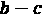)。

信息

单步库存规划问题通常被称为“新闻 vendor 问题”。它是关于在给定需求分布的情况下平衡过剩和不足的成本。对于许多常见的需求分布，这个问题可以通过解析方法解决。当然，许多现实世界中的库存问题是多步骤的，类似于我们在本章中将要解决的问题。你可以在[`en.wikipedia.org/wiki/Newsvendor_model`](https://en.wikipedia.org/wiki/Newsvendor_model) 阅读更多关于新闻 vendor 问题的内容。我们将在*第十五章*《供应链管理》中解决这个问题的更复杂版本。

到目前为止一切顺利。接下来，让我们在 Python 中创建这个环境。

### 在 Python 中实现餐车环境

我们即将创建的是一个餐车示例的仿真环境，依据我们上述描述的动态。在这个过程中，我们将使用一个专门为此目的设计的流行框架，即 OpenAI 的 Gym 库。你可能以前听说过它。如果没有，也完全没问题，因为它在本示例中并不起决定性作用。我们将逐步讲解你需要知道的内容。

信息

OpenAI 的 Gym 是定义强化学习（RL）环境、开发和比较解决方法的标准库。它还兼容各种 RL 解决库，如 RLlib。如果你还不熟悉 Gym 环境，可以查看它的简明文档：[`gym.openai.com/docs/`](https://gym.openai.com/docs/)。

现在，让我们进入实现部分：

1.  我们首先导入我们需要的库：

    ```py
    import numpy as np
    import gym
    ```

1.  接下来，我们创建一个 Python 类，该类初始化时使用我们在上一节中描述的环境参数：

    ```py
    class FoodTruck(gym.Env):
        def __init__(self):
            self.v_demand = [100, 200, 300, 400]
            self.p_demand = [0.3, 0.4, 0.2, 0.1]
            self.capacity = self.v_demand[-1]
            self.days = ['Mon', 'Tue', 'Wed', 
                         'Thu', 'Fri', "Weekend"]
            self.unit_cost = 4
            self.net_revenue = 7
            self.action_space = [0, 100, 200, 300, 400]
            self.state_space = [("Mon", 0)] \
                             + [(d, i) for d in self.days[1:] 
                                 for i in [0, 100, 200, 300]]
    ```

    状态是一个元组，包括星期几（或周末）和当天的起始库存水平。再次强调，动作是销售开始前要购买的肉饼数量。这些购买的库存会立即可用。请注意，这是一个完全可观察的环境，因此状态空间和观察空间是相同的。给定某一天的可能库存水平是 0、100、200 和 300（因为我们定义了动作集、可能的需求情景和容量）；除非我们从星期一开始没有库存。

1.  接下来，我们定义一个方法，给定当前状态、动作和需求，计算下一个状态和奖励，以及相关的量。请注意，这个方法不会改变对象的任何内容：

    ```py
        def get_next_state_reward(self, state, action, demand):
            day, inventory = state
            result = {}
            result['next_day'] = self.days[self.days.index(day) \
                                           + 1]
            result['starting_inventory'] = min(self.capacity, 
                                               inventory 
                                               + action)
            result['cost'] = self.unit_cost * action 
            result['sales'] = min(result['starting_inventory'], 
                                  demand)
            result['revenue'] = self.net_revenue * result['sales']
            result['next_inventory'] \
                = result['starting_inventory'] - result['sales']
            result['reward'] = result['revenue'] - result['cost']
            return result
    ```

1.  现在，我们定义一个方法，使用 `get_next_state_reward` 方法返回给定状态-动作对的所有可能转换和奖励，以及相应的概率。请注意，如果需求超过库存，不同的需求情景将导致相同的下一个状态和奖励：

    ```py
        def get_transition_prob(self, state, action):
            next_s_r_prob = {}
            for ix, demand in enumerate(self.v_demand):
                result = self.get_next_state_reward(state, 
                                                    action, 
                                                    demand)
                next_s = (result['next_day'],
                          result['next_inventory'])
                reward = result['reward']
                prob = self.p_demand[ix]
                if (next_s, reward) not in next_s_r_prob:
                    next_s_r_prob[next_s, reward] = prob
                else:
                    next_s_r_prob[next_s, reward] += prob
            return next_s_r_prob
    ```

现在我们所需的内容就这些。稍后，我们将向这个类中添加其他方法，以便能够模拟环境。现在，我们将深入讨论使用策略评估方法的动态规划（DP）。

## 策略评估

在马尔可夫决策过程（MDPs）和强化学习（RL）中，我们的目标是获得（近似）最优策略。那么我们如何评估给定的策略呢？毕竟，如果我们不能评估它，就无法与其他策略进行比较，进而决定哪个更好。因此，我们开始讨论使用**策略评估**（也称为**预测问题**）的动态规划方法。有多种方式可以评估给定的策略。事实上，在 *第四章*，《马尔可夫决策过程的构建》中，当我们定义状态值函数时，我们讨论了如何通过解析和迭代的方式计算它。嗯，这就是策略评估！在本节中，我们将采用迭代版本，接下来我们会详细介绍。

### 迭代策略评估

让我们首先讨论迭代策略评估算法，并回顾一下我们在上一章中覆盖的内容。然后，我们将评估食品车老板已经拥有的策略（即基础策略）。

#### 迭代策略迭代算法

回想一下，状态的值是根据给定的策略如下定义的：


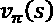 是从状态  开始并遵循策略  的预期折扣累积奖励。在我们的食品车示例中，状态  的值是从零库存开始的星期一的预期奖励（利润）。最大化  的策略就是最优策略！

现在，贝尔曼方程告诉我们状态值必须彼此一致。这意味着预期的单步奖励加上下一个状态的折扣值应该等于当前状态的值。更正式地说，表达式如下：


由于我们知道这个简单问题的所有转移概率，我们可以解析地计算出这个期望：


开头的  项是因为策略可能会根据状态概率性地选择动作。由于转移概率依赖于动作，我们需要考虑策略可能引导我们执行的每一个可能动作。

现在，我们所需要做的就是将贝尔曼方程转换为如下的更新规则，从而获得一个迭代算法：


*一次更新过程，* *，涉及更新所有状态值*。该算法会在状态值的变化在连续迭代中变得足够小后停止。我们不讨论证明，但这个更新规则可以证明会收敛到 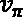，当  时。这个算法被称为**迭代政策评估**，具有**期望更新**，因为我们考虑了所有可能的单步转移。

在我们实现这个方法之前，最后要提到的是，与其为  和  维护两个状态值副本，并在一次完整的更新后将  替换为 ，我们将直接进行原地更新。这种方法往往收敛得更快，因为我们会立即将最新的状态值估算结果用于其他状态的更新。

接下来，我们来评估库存补充问题的一个基础策略。

#### 基于库存补充策略的迭代评估

假设食品卡车的老板有以下策略：在一个工作日的开始，老板将库存补充到 200 或 300 个肉饼，且概率相等。例如，如果当天开始时库存为 100 个，他们有相同的概率购买 100 个或 200 个肉饼。我们来评估这个策略，看看在一周内我们应该预期多少利润：

1.  我们首先定义一个返回`policy`字典的函数，其中字典的键对应状态。每个状态对应的值是另一个字典，字典的键是动作，值是该状态下选择该动作的概率：

    ```py
    def base_policy(states):
        policy = {}
        for s in states:
            day, inventory = s
            prob_a = {} 
            if inventory >= 300:
                prob_a[0] = 1
            else:
                prob_a[200 - inventory] = 0.5
                prob_a[300 - inventory] = 0.5
            policy[s] = prob_a
        return policy
    ```

1.  现在是政策评估。我们定义一个函数，用于计算给定状态的期望更新和该状态对应的策略：

    ```py
    def expected_update(env, v, s, prob_a, gamma):
        expected_value = 0
        for a in prob_a:
            prob_next_s_r = env.get_transition_prob(s, a)
            for next_s, r in prob_next_s_r:
                expected_value += prob_a[a] \
                                * prob_next_s_r[next_s, r] \
                                * (r + gamma * v[next_s])
        return expected_value
    ```

    换句话说，这个函数为给定的  计算 。

1.  策略评估函数会对所有状态执行预期的更新，直到状态值收敛（或达到最大迭代次数）：

    ```py
    def policy_evaluation(env, policy, max_iter=100, 
                          v = None, eps=0.1, gamma=1):
        if not v:
            v = {s: 0 for s in env.state_space}
        k = 0
        while True:
            max_delta = 0
            for s in v:
                if not env.is_terminal(s):
                    v_old = v[s]
                    prob_a = policy[s]
                    v[s] = expected_update(env, v, 
                                           s, prob_a, 
                                           gamma)
                    max_delta = max(max_delta, 
                                    abs(v[s] - v_old))
            k += 1
            if max_delta < eps:
                print("Converged in", k, "iterations.")
                break
            elif k == max_iter:
                print("Terminating after", k, "iterations.")
                break
        return v
    ```

    让我们详细说明一下这个函数的工作原理：

    a) `policy_evaluation`函数接收一个环境对象，在我们的示例中它将是`FoodTruck`类的一个实例。

    b) 该函数评估指定的策略，策略以字典的形式存在，字典将状态映射到动作概率。

    c) 所有的状态值初始为 0，除非在函数中传入了初始化值。终止状态（在本例中对应周末的状态）的状态值不会被更新，因为从那时起我们不再期望任何奖励。

    d) 我们定义了一个 epsilon 值作为收敛的阈值。如果在某一轮更新中，所有状态值的最大变化小于该阈值，则评估终止。

    e) 由于这是一个具有有限步数的阶段性任务，我们默认将折扣因子`gamma`设置为 1。

    f) 该函数返回状态值，稍后我们将需要这些状态值。

1.  现在，我们使用这个函数来评估所有者的基础策略。首先，从我们之前定义的类中创建一个`foodtruck`对象：

    ```py
    foodtruck = FoodTruck()
    ```

1.  获取环境的基础策略：

    ```py
    policy = base_policy(foodtruck.state_space)
    ```

1.  评估基础策略并获取对应的状态值——特别是对于初始状态：

    ```py
    v = policy_evaluation(foodtruck, policy)
    print("Expected weekly profit:", v["Mon", 0])
    ```

1.  结果将如下所示：

    ```py
    Converged in 6 iterations.
    Expected weekly profit: 2515.0
    ```

在这个策略下，`("Mon", 0)`这个初始状态的状态值为 2515。对于一周的时间来说，这可不算坏的利润！

到目前为止做得很好！现在你已经能够评估给定的策略并计算出对应的状态值。在进入策略改进之前，我们再做一件事。让我们验证一下，在这个策略下模拟环境是否会导致类似的奖励。

### 比较策略评估与模拟结果

为了能够模拟环境，我们需要向`FoodTruck`类添加一些额外的方法：

1.  创建一个`reset`方法，简单地将对象初始化/重置为周一早晨，并将库存设为零。每次开始一个阶段时，我们都会调用这个方法：

    ```py
        def reset(self):
            self.day = "Mon"
            self.inventory = 0
            state = (self.day, self.inventory)
            return state
    ```

1.  接下来，定义一个方法来检查给定状态是否是终止状态。请记住，在本例中，阶段会在周末结束时终止：

    ```py
        def is_terminal(self, state):
            day, inventory = state
            if day == "Weekend":
                return True
            else:
                return False
    ```

1.  最后，定义`step`方法来模拟给定当前状态和动作的一次环境步骤：

    ```py
        def step(self, action):
            demand = np.random.choice(self.v_demand, 
                                      p=self.p_demand)
            result = self.get_next_state_reward((self.day, 
                                                 self.inventory), 
                                           action, 
                                           demand)
            self.day = result['next_day']
            self.inventory = result['next_inventory']
            state = (self.day, self.inventory)
            reward = result['reward']
            done = self.is_terminal(state)
            info = {'demand': demand, 'sales': result['sales']}
            return state, reward, done, info
    ```

    该方法返回新的状态、一轮奖励、该阶段是否完成，以及我们想要返回的任何附加信息。这是标准的 Gym 约定。它还会更新类中的状态。

1.  现在我们的`FoodTruck`类已经准备好进行模拟。接下来，让我们创建一个函数，在给定状态的情况下，从一个（可能是概率性的）策略中选择一个动作：

    ```py
    def choose_action(state, policy):
        prob_a = policy[state]
        action = np.random.choice(a=list(prob_a.keys()), 
                                  p=list(prob_a.values()))
        return action
    ```

1.  让我们创建一个函数（在类外部）来模拟给定的策略：

    ```py
    def simulate_policy(policy, n_episodes):
        np.random.seed(0)
        foodtruck = FoodTruck()
        rewards = []
        for i_episode in range(n_episodes):
            state = foodtruck.reset()
            done = False
            ep_reward = 0
            while not done:
                action = choose_action(state, policy)
                state, reward, done, info = foodtruck.step(action) 
                ep_reward += reward
            rewards.append(ep_reward)
        print("Expected weekly profit:", np.mean(rewards))
    ```

    `simulate_policy`函数仅执行以下操作：

    a) 接收一个策略字典，返回给定状态下该策略建议的动作及其相应的概率。

    b) 它模拟策略执行指定次数的回合。

    c) 在一次回合内，它从初始状态开始，并在每一步按概率选择策略建议的动作。

    d) 选择的动作传递给环境，环境根据其动态转移到下一个状态。

1.  现在，让我们用基础策略来模拟环境！

    ```py
    simulate_policy(policy, 1000)
    ```

1.  结果应该如下所示：

    ```py
    Expected weekly profit: 2518.1
    ```

太棒了！这和我们通过解析计算得到的结果非常接近！现在是时候利用这种迭代策略评估方法做些更有用的事情了：寻找最优策略！

## 策略迭代

现在我们有了一种评估给定策略的方法，可以用它来比较两个策略并迭代改进它们。在这一节中，我们首先讨论如何比较策略。接着，我们介绍策略改进定理，最后将所有内容整合到策略改进算法中。

### 策略比较与改进

假设我们有两个策略， 和 ，我们想要比较它们。我们说如果满足以下条件， 就和  一样好：

。

换句话说，如果在一个策略  下的状态值大于或等于另一个策略 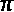 下的状态值，且对于所有可能的状态都成立，那么意味着  和  一样好。如果对于任何状态 ，这种关系是严格不等式，那么  就是比  更好的策略。这应该是直观的，因为状态值表示从该点开始的期望累积奖励。

现在，问题是我们如何从  过渡到更好的策略 。为此，我们需要回顾在 *第四章* 中定义的动作价值函数，*马尔科夫决策过程的构建*：


记住，动作价值函数的定义有些细微之处。它是当以下情况发生时的期望累积未来奖励：

+   在当前状态  执行动作 。

+   然后遵循该策略 。

其中的细微之处是，策略  在状态 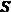 时，通常可能会建议另一个动作。q 值表示当前步骤中从策略  偏离的即时偏差。

那么这对改进策略有什么帮助呢？**策略改进定理**表明，*如果在状态*  *时选择*  *初始动作比一直选择*  *更好，则在状态*  *时，每次选择*  *而不是一直跟随*  *将是一个比*  *更好的策略。换句话说，如果* ，*那么我们可以通过在状态* 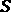 *采取动作* 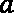 *并在其余状态下跟随*  *来改进* 。我们这里不包括该定理的证明，但其实它是非常直观的，并且可以参考 *Sutton & Barto, 2018*。

让我们对这个论点进行一般化。假设某个策略  至少和另一个策略  一样好，如果对于所有 ，以下条件成立：


接下来，我们要做的就是选择能够最大化每个状态的 q 值的动作来改进策略。即，


在我们结束这个讨论之前，有一个最后的说明：尽管我们描述了确定性策略的策略改进方法，对于给定状态，策略只建议一个单一动作 ，但这个方法同样适用于随机策略。

到目前为止，一切顺利！现在，让我们将这个策略改进转化为一个算法，帮助我们找到最优策略！

### 策略迭代算法

策略迭代算法的基本过程是：从任意策略开始，进行策略评估步骤，然后进行策略改进步骤。当这个过程重复进行时，最终会得到一个最优策略。这个过程在下面的图中得到了展示：


图 5.1 – 广义策略迭代

实际上，在某些形式的策略评估和策略改进步骤之间迭代，是解决强化学习问题的一种通用方法。这就是为什么这个想法被称为**广义策略迭代（GPI）** *Sutton & Barto, 2018*。只不过我们在这一节描述的策略迭代方法涉及这些步骤的特定形式。

让我们为餐车环境实现一个策略迭代。

### 为库存补货问题实现策略迭代

我们已经编写了策略评估和期望更新步骤。我们为策略迭代算法所需要的附加步骤是策略改进步骤，完成后我们就能得到最优策略！这真令人兴奋，让我们开始吧：

1.  让我们从实现上述描述的策略改进开始：

    ```py
    def policy_improvement(env, v, s, actions, gamma):
        prob_a = {}
        if not env.is_terminal(s):
            max_q = np.NINF
            best_a = None
            for a in actions:
                q_sa = expected_update(env, v, s, {a: 1}, gamma)
                if q_sa >= max_q:
                    max_q = q_sa
                    best_a = a
            prob_a[best_a] = 1
        else:
            max_q = 0
        return prob_a, max_q
    ```

    该函数根据当前策略下得到的值函数，搜索在给定状态下产生最大 q 值的动作。对于终止状态，q 值始终为 0。

1.  现在，我们将所有内容整合到一个策略迭代算法中：

    ```py
    def policy_iteration(env,  eps=0.1, gamma=1):
        np.random.seed(1)
        states = env.state_space
        actions = env.action_space
        policy = {s: {np.random.choice(actions): 1}
                 for s in states}
        v = {s: 0 for s in states}
        while True:
            v = policy_evaluation(env, policy, v=v, 
                              eps=eps, gamma=gamma)
            old_policy = policy
            policy = {}
            for s in states:
                policy[s], _ = policy_improvement(env, v, s, 
                                        actions, gamma)
            if old_policy == policy:
                break
        print("Optimal policy found!")
        return policy, v
    ```

    该算法从一个随机策略开始，在每次迭代中实施策略评估和改进步骤。当策略稳定时，它停止。

1.  终于迎来了关键时刻！让我们找出食品车的最优策略，并看看预期的周利润是多少！

    ```py
    policy, v = policy_iteration(foodtruck)
    print("Expected weekly profit:", v["Mon", 0])
    ```

1.  结果应如下所示：

    ```py
    Converged in 6 iterations.
    Converged in 6 iterations.
    Converged in 5 iterations.
    Optimal policy found!
    Expected weekly profit: 2880.0
    ```

我们刚刚找到了一个策略，它的预期周利润为$2,880。这比基础策略有了显著的提升！感谢您支持本地企业！

从输出结果可以看出，相较于随机策略，进行了两次策略改进。第三次策略改进未导致策略的任何变化，算法因此终止。

让我们看看最优策略是什么样的：


图 5.2 – 食品车示例的最优策略

策略迭代算法得出的结果非常直观。让我们分析一下这个策略：

+   在周一和周二，保证在剩余的时间内将售出 400 个汉堡。由于肉饼可以在工作日安全存储，因此将库存填充至最大容量是有意义的。

+   在周三开始时，可能会发生直到本周末销售总量为 300，并且 100 个肉饼会变质的情况。然而，这种情况的可能性较小，预期利润仍然为正。

+   对于周四和周五，更保守一些是更明智的，以防需求少于库存，从而避免昂贵的变质损失。

恭喜！你已经成功地使用策略迭代解决了一个 MDP 问题！

提示

我们发现的最优策略，严重依赖于肉饼的成本、每单位的净收入以及需求分布。通过修改问题参数并再次求解，你可以更直观地理解最优策略的结构以及它如何变化。

你已经走了很长一段路！我们从 MDP 和 DP 的基础开始构建了一个精确的求解方法。接下来，我们将研究另一种通常比策略迭代更高效的算法。

## 值迭代

策略迭代要求我们完全评估所有策略，直到状态值收敛，然后才进行改进步骤。在更复杂的问题中，等待完成评估可能会非常耗费计算资源。即使在我们的例子中，单次策略评估步骤也需要对所有状态进行 5-6 次遍历才能收敛。事实证明，我们可以在策略评估未收敛时提前终止，而不会失去策略迭代的收敛保证。实际上，我们甚至可以通过将上一章中介绍的贝尔曼最优方程转化为更新规则，将策略迭代和策略改进合并为一个步骤：


我们不断对所有状态执行更新，直到状态值收敛为止。这个算法称为**价值迭代**。

提示

请注意策略评估更新和价值迭代更新之间的区别。前者从给定的策略中选择动作，因此在期望更新前有项。而后者则不遵循策略，而是通过运算符主动搜索最佳动作。

这就是实现价值迭代算法所需要的全部内容。接下来，让我们直接进入实现部分。

### 实现库存补充问题的价值迭代

为了实现价值迭代，我们将使用之前定义的`policy_improvement`函数。然而，在改进每个状态的策略后，我们还将更新该状态的状态值估计。

现在，我们可以按照以下步骤实现价值迭代：

1.  我们首先定义如上所述的价值迭代函数，通过原地替换状态值来实现：

    ```py
    def value_iteration(env, max_iter=100, eps=0.1, gamma=1):
        states = env.state_space
        actions = env.action_space
        v = {s: 0 for s in states}
        policy = {}
        k = 0
        while True:
            max_delta = 0
            for s in states:
                old_v = v[s]
                policy[s], v[s] = policy_improvement(env, 
                                                     v, 
                                                     s, 
                                                     actions, 
                                                     gamma)
                max_delta = max(max_delta, abs(v[s] - old_v))
            k += 1
            if max_delta < eps:
                print("Converged in", k, "iterations.")
                break
            elif k == max_iter:
                print("Terminating after", k, "iterations.")
                break
        return policy, v
    ```

1.  然后，我们执行价值迭代并观察初始状态的值：

    ```py
    policy, v = value_iteration(foodtruck)
    print("Expected weekly profit:", v["Mon", 0])
    ```

1.  结果应如下所示：

    ```py
    Converged in 6 iterations.
    Expected weekly profit: 2880.0
    ```

价值迭代提供了最优策略，但相比于策略迭代算法，它的计算量更小！价值迭代只对状态空间进行 6 次遍历，而策略迭代则需要 20 次遍历（17 次用于策略评估，3 次用于策略改进）。

现在，记住我们关于广义策略改进的讨论。实际上，你可以将策略改进步骤与截断的策略评估步骤结合起来，在一些复杂的示例中，当策略改进后状态值发生显著变化时，收敛速度比策略迭代和价值迭代算法都要快。

干得好！我们已经涵盖了如何使用动态规划解决 MDP 的预测问题，以及找到最优策略的两种算法，并且它们在我们的简单示例中表现出色。另一方面，动态规划方法在实践中有两个重要的缺点。接下来我们将讨论这些缺点，以及为什么我们需要在本章后续介绍的其他方法。

## 动态规划的缺点

动态规划方法非常适合学习如何扎实掌握 MDP 的解决方法。与直接搜索算法或线性规划方法相比，它们效率更高。另一方面，在实际应用中，这些算法仍然要么不可行，要么无法使用。接下来我们将详细说明为什么。

### 维度灾难

策略迭代和价值迭代算法都会多次遍历整个状态空间，直到找到最优策略。同时，我们还以表格形式存储每个状态的策略、状态值和动作值。然而，任何实际问题都会有一个巨大的可能状态数，这一现象被称为**维度灾难**。这指的是，随着我们增加维度，变量（状态）的可能值数呈指数增长。

以我们的餐车示例为例。除了跟踪肉饼，我们还假设同时跟踪汉堡包胚、番茄和洋葱。还假设这些物品的每个容量是 400，并且我们精确地统计了库存数量。在这种情况下，可能的状态数量将是，即大于。这是一个荒谬的状态数量，要为这么一个简单的问题跟踪这么多状态。

解决维度灾难的一个方法是**异步动态规划**：

+   这种方法建议在每次策略改进迭代中，避免遍历整个状态空间，而是集中在更有可能被遇到的状态上。

+   对于许多问题，状态空间的各个部分并不是同等重要的。因此，在对整个状态空间进行完整遍历之前等待更新策略是浪费的。

+   使用异步算法，我们可以在进行策略改进的同时并行模拟环境，观察哪些状态被访问，并更新这些状态的策略和值函数。

+   同时，我们可以将更新后的策略传递给代理，这样模拟将继续以新的策略进行。

假设代理足够探索了状态空间，算法最终会收敛到最优解。

另一方面，我们用来解决这个问题的一个更重要的工具是**函数逼近器**，比如深度神经网络。想一想！如果我们为库存水平 135、136、137 分别存储一个单独的策略/状态值/动作值，那有什么好处呢？其实并没有什么太大意义。与表格表示法相比，函数逼近器以一种更紧凑（尽管是近似的）方式表示我们想要学习的内容。事实上，在许多情况下，深度神经网络之所以成为函数逼近的一个有意义的选择，是因为它们具有强大的表示能力。这也是为什么从下一章开始，我们将专注于深度强化学习算法的原因。

### 对环境完整模型的需求

在我们目前使用的方法中，我们依赖于环境的状态转移概率来进行策略评估、策略迭代和价值迭代算法，从而获得最优策略。然而，这种方法在实际中通常并不可行。通常要么这些概率对于每一个可能的转移计算起来非常困难（甚至往往无法列举出来），要么我们根本不知道这些概率。你知道什么更容易获得吗？一个从环境本身或其**模拟**中获得的样本轨迹。事实上，模拟是强化学习中一个特别重要的组成部分，我们将在本章末尾单独讨论。

那么问题变成了如何使用样本轨迹来学习近似最优策略。实际上，这正是我们将在本章剩余部分通过蒙特卡洛（Monte Carlo）和时序差分（TD）方法讲解的内容。你将学到的这些概念是许多高级强化学习（RL）算法的核心。

# 使用蒙特卡洛方法训练你的代理

假设你想要学习一个特定的、可能存在偏差的硬币翻转正面朝上的概率：

+   计算这个概率的一种方法是通过仔细分析硬币的物理属性。尽管这样做能够给出结果的精确概率分布，但这远不是一种实用的方法。

+   或者，你可以多次投掷硬币，查看样本中的分布。如果你的样本量不大，估计值可能会有些偏差，但对于大多数实际应用来说，这已经足够了。使用后一种方法时需要处理的数学问题将简单得多。

就像硬币示例中一样，我们可以通过随机样本估计 MDP 中的状态值和动作值。**蒙特卡洛（MC）**估计是一种通用概念，指的是通过重复的随机采样进行估计。在强化学习的背景下，它指的是*通过完整回合的样本轨迹估计状态值和动作值的方法集合*。使用随机样本非常方便，事实上，对于任何实际的 RL 问题来说都是至关重要的，因为环境动态（状态转移和奖励概率分布）通常具有以下特点：

+   过于复杂，无法处理

+   初始时未知

因此，蒙特卡罗方法是强大的方法，可以让强化学习代理仅通过与环境交互收集的经验来学习最优策略，而无需了解环境是如何工作的。

在本节中，我们首先将研究如何使用蒙特卡罗方法估计给定策略的状态值和动作值。然后，我们将介绍如何进行改进以获得最优策略。

## 蒙特卡罗预测

与 DP 方法一样，我们需要能够评估给定策略！[](img/Formula_05_075.png)，才能改进它。在本节中，我们将介绍如何通过估计相应的状态和动作值来评估策略。在此过程中，我们将简要回顾上一章的网格世界示例，并进一步探讨食品卡车库存补充问题。

### 估计状态值函数

记住，在策略！[](img/Formula_05_061.png)下，状态！[](img/Formula_05_010.png)的值，！[](img/Formula_05_078.png)定义为从状态！[](img/Formula_05_079.png)开始时的期望累计奖励：


MC 预测建议通过观察（多个）样本**轨迹**，即一系列的状态-动作-奖励元组，从状态！[](img/Formula_05_081.png)开始，以估计这种期望值。这类似于抛硬币来估计其分布。

最好通过一个例子来解释蒙特卡罗方法。特别是在网格世界的例子中，它的工作原理非常直观，因此我们接下来将再次回顾它。

#### 使用样本轨迹进行状态值估计

回想一下，网格世界中的机器人每次移动都能获得+1 的奖励，只要它不撞墙。当它撞到墙壁时，该回合结束。假设这个机器人只能在一定程度上被控制。当指示它朝某个特定方向移动时，它有 70%的概率会按命令执行。其余三个方向的概率各为 10%。

考虑一个确定性策略！[](img/Formula_05_061.png)，如*图 5.3 (a)*所示。如果机器人从状态(1,2)开始，它可以遵循的两个示例轨迹，！[](img/Formula_05_083.png)和！[](img/Formula_05_084.png)，以及每个转移的相应概率如*图 5.3 (b)*所示：


图 5.3 – a) 一个确定性策略π，b) 在π下的两个样本轨迹

提示

请注意，机器人遵循的是随机轨迹，但策略本身是确定性的，这意味着在给定状态下采取的动作（发给机器人的命令）始终是相同的。随机性来自环境，由于概率性的状态转移。

对于轨迹！[](img/Formula_05_085.png)，观察到该轨迹的概率和相应的折扣回报如下：


那对于  来说：


对于这两个示例轨迹，我们能够计算出相应的概率和回报。然而，要计算  的状态值，我们需要评估以下表达式：


这意味着我们需要识别以下内容：

+   每一条可能的轨迹 ，它可以从  出发，依据策略 

+   在  下观察到 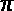， 的概率

+   相应的折扣回报，

嗯，那是一个不可能完成的任务。即便是在这个简单的问题中，可能的轨迹数也是无限的。

这正是蒙特卡洛预测的作用所在。它简单地告诉我们通过如下方式，利用样本回报的平均值来估计状态  的值：


就是这样！样本轨迹和回报就是你估计状态值所需的全部。

小贴士

请注意， 表示状态的真实值，而 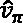 表示估计值。

在这一点上，你可能会问以下问题：

+   *怎么会仅凭两个样本回报就能估计出一个结果，这个结果是无限多个轨迹的结果？* 其实并不行。你有的样本轨迹越多，你的估计就越准确。

+   *我们怎么知道我们有足够的样本轨迹？* 这个问题很难量化。但在更复杂的环境中，尤其是当存在显著的随机性时，可能需要更多的样本才能做出准确的估计。不过一个好主意是，在增加更多轨迹样本时，检查估计值是否趋于收敛。

+    *和*  *发生的概率是非常不同的。将它们在估计中赋予相等的权重合适吗？* 当我们只有两个轨迹样本时，这确实是一个问题。然而，随着样本轨迹的增多，我们可以期待样本中轨迹的出现与它们真实发生的概率成比例。

+   *我们能否使用相同的轨迹来估计它访问的其他状态的值？* 是的！实际上，这就是我们在蒙特卡洛预测中所做的事情。

接下来我们来详细讨论如何使用相同的轨迹来估计不同状态的值。

#### 首次访问与每次访问的蒙特卡洛预测

如果你回忆一下什么是马尔可夫性质，它简单地告诉我们，未来依赖于当前状态，而不是过去。因此，我们可以把例如  看作是从状态  和  出发的三个独立轨迹。我们称后两个轨迹为  和 。因此，我们可以为样本集中的所有访问过的状态获得一个值估计。例如，状态  的值估计如下：


由于没有其他轨迹访问状态 ，我们使用单一回报来估计状态值。注意，折现因子会根据回报与初始时间步的时间距离应用。这就是为什么  折现因子的指数减少了一。

请考虑图*5.4*中的一组轨迹，并假设我们再次想估计 。这些样本轨迹中没有任何轨迹真正从状态  出发，但这完全没问题。我们可以使用轨迹 、 和  来进行估计。但这里有一个有趣的情况： 访问了状态  两次。我们应该仅使用它第一次访问的回报，还是每次访问的回报？


图 5.4 – 蒙特卡洛估计 

这两种方法都是有效的。前者被称为**首次访问 MC 方法**，后者被称为**每次访问 MC 方法**。它们的比较如下：

+   随着访问次数趋近于无限，它们都收敛到真实的 。

+   首次访问 MC 方法给出了状态值的无偏估计，而每次访问 MC 方法则是有偏的。

+   **均方误差** (**MSE**) 在首次访问 MC 方法中样本较少时较高，但在样本较多时低于每次访问的 MSE。

+   每次访问的 MC 方法在使用函数逼近时更为自然。

如果听起来很复杂，其实并不复杂！只需记住以下几点：

+   我们尝试估计一个参数，例如 、 的状态值。

+   通过观察随机变量  ，从  开始，折现值返回多次。

+   考虑从它们首次访问  开始的轨迹，或者从每次访问开始的轨迹，都是有效的。

现在是时候实现蒙特卡洛预测了！

#### 实现首次访问的蒙特卡洛状态值估计

我们使用了网格世界示例来获得直观的理解，现在让我们回到我们的餐车示例来进行实现。在这里，我们将实现首次访问蒙特卡洛（MC）方法，但这个实现可以很容易地修改为每次访问 MC。只需要去掉在计算回报时的条件，即只有当状态在此之前的轨迹中没有出现时才计算回报。对于餐车示例，由于轨迹中每天的状态都不同——因为每次转换后，状态中的星期几部分都会变化——所以这两种方法是相同的。

让我们按照这些步骤进行实现：

1.  我们首先定义一个函数，接收一个轨迹并计算从首次访问开始的每个状态的回报：

    ```py
    def first_visit_return(returns, trajectory, gamma):
        G = 0
        T = len(trajectory) - 1
        for t, sar in enumerate(reversed(trajectory)):
            s, a, r = sar
            G = r + gamma * G
            first_visit = True
            for j in range(T - t):
                if s == trajectory[j][0]:
                    first_visit = False
            if first_visit:
                if s in returns:
                    returns[s].append(G)
                else:
                    returns[s] = [G]
        return returns
    ```

    该函数执行以下操作：

    a) 输入一个字典`returns`，其键是状态，值是一些其他轨迹中计算出的回报列表。

    b) 输入一个`trajectory`列表，它是一个状态-动作-奖励元组的列表。

    c) 将每个状态的计算回报添加到`returns`中。如果该状态以前从未被其他轨迹访问过，则初始化该状态的列表。

    d) 从轨迹的末尾开始反向遍历，方便计算折扣回报。每一步都会应用折扣因子。

    e) 在每次计算后检查某个状态是否在轨迹中已被访问过。如果该状态是首次访问，则将计算的回报保存到`returns`字典中。

1.  接下来，我们实现一个函数，用给定的策略模拟一个单一的回合，并返回轨迹：

    ```py
    def get_trajectory(env, policy):
        trajectory = []
        state = env.reset()
        done = False
        sar = [state]
        while not done:
            action = choose_action(state, policy)
            state, reward, done, info = env.step(action)
            sar.append(action)
            sar.append(reward)
            trajectory.append(sar)
            sar = [state]
        return trajectory
    ```

1.  现在，实现在指定回合数/轨迹数的环境中模拟，使用给定策略，并跟踪轨迹，计算每个状态的回报平均值，这些回报由`first_visit_return`函数计算：

    ```py
    def first_visit_mc(env, policy, gamma, n_trajectories):
        np.random.seed(0)
        returns = {}
        v = {}
        for i in range(n_trajectories):
            trajectory = get_trajectory(env, policy)
            returns = first_visit_return(returns, 
                                         trajectory, 
                                         gamma)
        for s in env.state_space:
            if s in returns:
                v[s] = np.round(np.mean(returns[s]), 1)
        return v
    ```

1.  我们确保创建一个环境实例（或者直接使用前面章节中的环境实例）。同时获取基本策略，这个策略会以相等的概率将汉堡饼库存填充到 200 或 300：

    ```py
    foodtruck = FoodTruck()
    policy = base_policy(foodtruck.state_space)
    ```

1.  现在，让我们使用首次访问 MC 方法，通过 1,000 个轨迹来估计状态值：

    ```py
    v_est = first_visit_mc(foodtruck, policy, 1, 1000)
    ```

1.  结果，`v_est`，将如下所示：

    ```py
    {('Mon', 0): 2515.9,
     ('Tue', 0): 1959.1,
     ('Tue', 100): 2362.2,
     ('Tue', 200): 2765.2,
    ...
    ```

1.  现在，记住我们可以使用动态规划（DP）中的策略评估方法来计算真实的状态值进行比较：

    ```py
    v_true = policy_evaluation(foodtruck, policy)
    ```

1.  真实的状态值看起来会非常相似：

    ```py
    {('Mon', 0): 2515.0,
     ('Tue', 0): 1960.0,
     ('Tue', 100): 2360.0,
     ('Tue', 200): 2760.0,
    ...
    ```

1.  我们可以使用不同数量的轨迹来获得估计结果，例如 10、100 和 1000 个轨迹。我们来做一下这个比较，看看状态值的估计如何逐渐接近真实值，如*图 5.5*所示：


图 5.5 – 首次访问蒙特卡洛估计与真实状态值

让我们更仔细地分析一下结果：

a) 随着我们收集更多的轨迹，估计值越来越接近真实的状态值。你可以增加轨迹的数量，甚至使用更高的数量来获得更精确的估计。

b) 在我们收集了 10 条轨迹后，状态("Tue", 200)没有被估算值。这是因为在这 10 条轨迹中该状态从未被访问过。这凸显了收集足够轨迹的重要性。

c) 对于那些在当天开始时拥有 300 单位库存的状态，没有估算值。这是因为在基础策略下，这些状态是无法访问的。但是，我们对这些状态的值一无所知。另一方面，这些状态可能是我们希望策略引导我们去的有价值的状态。这是一个我们需要解决的**探索问题**。

现在我们有了一种估算状态值的方法，无需了解环境的动态，只需使用智能体在环境中的经验。到目前为止，做得很棒！然而，仍然存在一个重要问题。仅凭状态值估算，我们无法真正改进当前的策略。为了理解为什么会这样，回想一下我们是如何通过动态规划方法（如值迭代）来改进策略的：


我们结合*状态值估算与转移概率*来获得行动（q）值。然后，我们为每个状态选择一个最大化该状态 q 值的行动。现在，由于我们假设不了解环境，我们无法通过状态值来推导行动值。

这给我们留下了一个选择：我们需要直接估算行动值。幸运的是，这将类似于我们估算状态值的方式。接下来，我们来探讨使用蒙特卡洛方法估算行动值。

### 估算行动值函数

行动值，，表示从状态开始，执行行动，并遵循策略时的预期折现累计回报。考虑以下轨迹：


可以使用观察到的折现回报来估算，等等。然后，我们可以用它们来确定给定状态的最佳行动，如下所示：


这是一个挑战：如果我们没有所有可能的的行动值估算，怎么办？考虑网格世界的例子。如果策略总是选择在状态下往右走，我们将永远不会有一个以状态-行动对或开始的轨迹。因此，即使这些行动中的某一个提供的行动值高于，我们也永远无法发现它。这个问题在食物车示例中的基础策略下也是类似的。一般来说，当我们使用确定性策略，或者使用一个在某些状态下不会以正概率选择所有行动的随机策略时，都会遇到这种情况。

因此，我们在这里面临的本质上是一个*探索*问题，这是强化学习中的一个基本挑战。

解决这个问题有两种可能的方案：

+   从一个随机选择的动作开始轨迹，在一个随机初始状态下，然后像往常一样遵循策略 。这被称为 **探索性起始**。这样可以确保每个状态-动作对至少被选择一次，从而可以估计动作值。这个方法的缺点是，我们需要始终从随机初始化开始每个 episode。如果我们希望通过与环境的持续互动来学习动作值，而不需要频繁重新开始，那么这种方法就不是特别有用。

+   探索问题的另一种更常见的解决方案是保持一个策略，在任何状态下都以正概率选择所有动作。更正式地说，我们需要一个满足 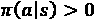 的策略，适用于所有  和所有 ；其中  是所有可能状态的集合， 是状态 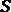 中所有可能动作的集合。这样的策略  称为 **软策略**。

在接下来的章节中，我们将使用软策略动作值估计，进而用于策略改进。

## 蒙特卡罗控制

蒙特卡罗控制指的是一类方法，通过使用*折扣回报*的样本来找到最优/近似最优的策略。换句话说，这就是通过经验学习最优策略。而且，由于我们依赖经验来发现最优策略，我们必须进行探索，正如我们上面所解释的那样。接下来，我们将实现  **ε-greedy** 策略，使我们能够在训练过程中进行探索，这是一种特殊形式的软策略。之后，我们将讨论蒙特卡罗控制的两种不同变体，即在策略方法和离策略方法。

### 实现 -greedy 策略

与我们在赌徒问题中所做的非常相似，-greedy 策略以 ε 的概率随机选择一个动作；以  的概率选择最大化动作值函数的动作。这样，我们可以继续探索所有状态-动作对，同时选择我们识别出的最佳动作，并且高概率地做出选择。

现在让我们实现一个函数，将一个确定性动作转换为 -greedy 动作，稍后我们将需要它。该函数将为最佳动作分配  的概率，并为所有其他动作分配  的概率：

```py
def get_eps_greedy(actions, eps, a_best):
    prob_a = {}
    n_a = len(actions)
    for a in actions:
        if a == a_best:
            prob_a[a] = 1 - eps + eps/n_a
        else:
            prob_a[a] = eps/n_a
    return prob_a
```

在训练过程中，探索是找到最优策略所必需的。另一方面，在训练结束后（即推理阶段），我们并不希望进行探索性行动，而是选择最佳行动。因此，这两种策略是不同的。为了区分这两者，前者被称为**行为策略**，后者被称为**目标策略**。我们可以使状态和值函数与前者或后者对齐，从而产生两种不同的方法：**在策略方法**和**离策略方法**。接下来我们将详细比较这两种方法。

### 在策略与离策略方法

请记住，状态和值函数与特定的策略相关联，因此使用和符号。在策略方法估计的是用于训练的行为策略下的状态和值函数，例如生成训练数据/经验的策略。离策略方法则估计的是与行为策略不同的策略下的状态和值函数，例如目标策略。我们理想的情况是将探索与值估计分开。接下来我们将详细探讨为什么要这样做。

#### 在策略方法对值函数估计的影响

探索性策略通常不是最优的，因为它们会不定期地采取随机动作以进行探索。由于在策略方法是针对行为策略来估计状态和值函数的，这种次优性会反映在值估计中。

请考虑以下修改后的网格世界示例，以观察将探索性行动的影响纳入值估计可能会带来的负面影响：机器人需要在状态下选择向左或向右，并在状态 1 和 3 之间选择向上或向下。机器人完美地遵循这些动作，因此环境中没有随机性。此情况在*图 5.6*中有所展示：


图 5.6 – 修改后的网格世界

该机器人采用了一个-贪婪策略，意味着以 0.99 的概率选择最佳行动，以 0.01 的概率选择探索性行动。在状态 3 下，最佳策略是以较高的可能性向上移动。在状态 1 中，选择其实并不重要。通过在策略上进行估计得到的状态值如下：


在基于策略的方式下，为状态 2 获得的策略会建议向左走，朝向状态 1。另一方面，在这个确定性环境中，当没有探索时，机器人可以完美地避免大的惩罚。基于策略的方法无法识别这一点，因为探索会影响价值估计，从而导致次优策略。另一方面，在某些情况下，如果例如样本是通过物理机器人收集的，且某些状态访问成本非常高，我们可能希望智能体考虑探索的影响。

#### 基于策略和离策略方法的样本效率比较

如上所述，离策略方法估计与行为策略不同的策略的状态和动作值。而基于策略的方法，只估算行为策略的状态和动作值。当我们在后面的章节中讨论深度强化学习的基于策略方法时，我们将看到，这将要求基于策略的方法在行为策略更新后丢弃过去的经验。然而，离策略的深度强化学习方法可以一次又一次地重复利用过去的经验。这在样本效率上是一个显著的优势，尤其是在获得经验的成本很高时。

离策略方法能够利用由非行为策略生成的经验的另一个场景是，当我们希望基于非强化学习控制器（例如经典的 PID 控制器或人工操作员）生成的数据来热启动训练时。这在环境难以模拟或采集经验时尤为有用。

#### 基于策略方法的优势

那么，天然的问题是，为什么我们还要讨论基于策略的方法，而不是直接忽略它们呢？基于策略方法有几个优势：

+   如上所述，如果从环境中采样的成本很高（指实际环境而非模拟环境），我们可能希望有一个能够反映探索影响的策略，以避免灾难性后果。

+   离策略方法与函数逼近器结合时，可能会出现收敛到一个良好策略的问题。我们将在下一章讨论这一点。

+   当动作空间是连续时，基于策略的方法更容易操作，正如我们稍后会讨论的那样。

有了这些，我们终于可以实现基于策略的蒙特卡洛方法，然后是离策略的蒙特卡洛方法！

### 基于策略的蒙特卡洛控制

我们之前描述的 GPI 框架，它建议在某些形式的策略评估和策略改进之间来回交替，这也是我们与蒙特卡洛方法一起用来获得最优策略的方式。在每个周期中，我们从一个完整的情节中收集一个轨迹，然后估算动作值并更新策略，依此类推。

让我们实现一个基于策略的蒙特卡洛控制算法，并用它来优化餐车库存补充：

1.  我们首先创建一个生成随机策略的函数，在这个策略中所有动作的概率是一样的，用于初始化策略：

    ```py
    def get_random_policy(states, actions):
        policy = {}
        n_a = len(actions)
        for s in states:
            policy[s] = {a: 1/n_a for a in actions}
        return policy
    ```

1.  现在，我们构建在策略的首次访问蒙特卡洛控制算法：

    ```py
    import operator
    def on_policy_first_visit_mc(env, n_iter, eps, gamma):
        np.random.seed(0)
        states =  env.state_space
        actions = env.action_space
        policy =  get_random_policy(states, actions)
        Q = {s: {a: 0 for a in actions} for s in states}
        Q_n = {s: {a: 0 for a in actions} for s in states}
        for i in range(n_iter):
            if i % 10000 == 0:
                print("Iteration:", i)
            trajectory = get_trajectory(env, policy)
            G = 0
            T = len(trajectory) - 1
            for t, sar in enumerate(reversed(trajectory)):
                s, a, r = sar
                G = r + gamma * G
                first_visit = True
                for j in range(T - t):
                    s_j = trajectory[j][0]
                    a_j = trajectory[j][1]
                    if (s, a) == (s_j, a_j):
                        first_visit = False
                if first_visit:
                    Q[s][a] = Q_n[s][a] * Q[s][a] + G
                    Q_n[s][a] += 1
                    Q[s][a] /= Q_n[s][a]
                    a_best = max(Q[s].items(), 
                                 key=operator.itemgetter(1))[0]
                    policy[s] = get_eps_greedy(actions, 
                                               eps, 
                                               a_best)
        return policy, Q, Q_n
    ```

    这与首次访问蒙特卡洛预测方法非常相似，关键的不同之处如下：

    a) 我们不再估计状态值 ，而是估计动作值 。

    b) 为了探索所有的状态-动作对，我们使用 ε-贪婪策略。

    c) 这是一个首次访问方法，但我们不检查状态是否早些时候出现在轨迹中，而是在更新  估计值之前，检查状态-动作对是否在轨迹中出现过。

    d) 每当我们更新状态-动作对的  估计值时，我们还会更新策略，给与能最大化  的动作最高概率，即 。

1.  使用该算法优化餐车策略：

    ```py
    policy, Q, Q_n = on_policy_first_visit_mc(foodtruck, 
                                              300000, 
                                              0.05, 
                                              1)
    ```

1.  显示 `policy` 字典。你会看到它是我们之前使用 DP 方法找到的最优策略：

    ```py
    {('Mon', 0):{0:0.01, 100:0.01, 200:0.01, 300:0.01, 400:0.96},
    …
    ```

就是这样！这个算法不像 DP 方法那样使用任何环境知识。它从与（环境模拟）的交互中学习！而且，当我们运行该算法足够长时间时，它会收敛到最优策略。

做得很好！接下来，让我们继续进行离策略蒙特卡洛控制。

### 离策略蒙特卡洛控制

在离策略方法中，我们有一组样本（轨迹），这些样本是在某种行为策略  下收集的，但我们希望利用这些经验来估计在目标策略  下的状态和动作值。这要求我们使用一种称为 **重要性采样** 的技巧。接下来我们将深入了解它，并描述离策略蒙特卡洛控制。

#### 重要性采样

让我们从一个简单的游戏设置开始描述重要性采样，在这个游戏中，你投掷一个六面骰子。根据骰子上出现的点数，你会获得一个随机奖励。可能是这样的情况：如果你得到 1，那么你将获得一个均值为 10，方差为 25 的正态分布的奖励。对于所有的结果，都有类似的隐藏奖励分布，这些分布对你来说是未知的。我们用随机变量  来表示当面朝  时，你所获得的奖励。

你想估计一次投掷后的期望奖励，即


其中  是观察到面朝  的概率。

现在，假设你有两个骰子可以选择，A 和 B，它们具有不同的概率分布。你首先选择 A，并投掷骰子  次。你的观察结果如下表所示：


表 5.1 – 使用骰子 A 投掷 n 次后的观察奖励

在这里， 表示在第  次投掷后观察到的奖励，当观察到的面是  时。使用骰子 A 的估计期望奖励，，简单地给出如下公式：

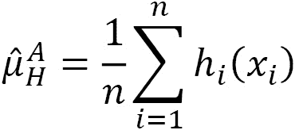

现在的问题是，我们是否可以使用这些数据来估计使用骰子 B 时的期望奖励，比如 ，而无需任何新的观测？答案是，如果我们知道  和 ，那么答案是肯定的。下面是方法。

在当前的估计中，每个观测的权重为 1。重要性采样建议根据  来调整这些权重。现在，考虑观测 。如果使用骰子 B 时，我们观察到  的可能性是使用骰子 A 时的三倍，那么我们将在总和中增加该观测的权重，增加至 3。更正式地，我们执行如下操作：


这里，比例  被称为重要性采样比率。顺便说一下，上述的前一个估计，，被称为**普通重要性采样**。我们还可以根据新的权重对新估计进行归一化，从而得到**加权重要性采样**，如下所示：


现在，在这个绕道之后，让我们回到使用这些来获得脱离策略的预测。在蒙特卡罗预测的上下文中，观察骰子的某一面对应于观察一个特定的轨迹，而骰子的奖励则对应于总回报。

如果你在想 *“嗯，我们并不真正知道观察特定轨迹的概率，这就是我们使用蒙特卡罗方法的原因，不是吗？”* 你是对的，但我们不需要知道。原因如下。从某个  开始，在行为策略  下观察到轨迹  的概率如下：

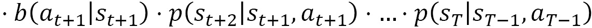

对于目标策略，表达式是一样的，唯一的不同是  替换了 。现在，当我们计算重要性采样比率时，转移概率会相互抵消，我们最终得到如下结果（*Sutton & Barto, 2018*）：


有了这些，我们就可以从估计行为策略下的期望值开始：


估计目标策略下的期望值：


在我们实现之前，让我们通过一些关于重要性采样的笔记来结束这一部分：

+   为了能够使用在行为策略下获得的样本！[](img/Formula_05_211.png) 来估计在！[](img/Formula_05_221.png) 下的状态和值动作，需要满足！[](img/Formula_05_222.png)，如果！[](img/Formula_05_223.png)成立。由于我们不希望强加目标策略下可能采取的！[](img/Formula_05_224.png)，通常选择！[](img/Formula_05_225.png)作为一种软策略。

+   在加权重要性采样中，如果分母为零，则该估计值被视为零。

+   上述公式忽略了回报中的折扣因素，这处理起来稍微复杂一些。

+   观察到的轨迹可以根据首次访问或每次访问规则进行切分。

+   普通的重要性采样是无偏的，但可能具有非常高的方差。加权重要性采样则是有偏的，但通常具有较低的方差，因此在实践中更受青睐。

这有点绕远了，希望你还跟得上！如果你跟得上，我们回到编码吧！

#### 应用于库存补充问题

在我们应用离策略蒙特卡罗方法时，我们使用加权重要性采样。行为策略选择为！[](img/Formula_05_226.png)-贪心策略，而目标是最大化每个状态下动作值的贪心策略。此外，我们使用增量方法更新状态和值动作估计，如下所示（Sutton & Barto，2018）：


以及这个：


现在，可以按如下方式实现：

1.  我们首先定义用于增量实现离策略蒙特卡罗的函数：

    ```py
    def off_policy_mc(env, n_iter, eps, gamma):
        np.random.seed(0)
        states =  env.state_space
        actions = env.action_space
        Q = {s: {a: 0 for a in actions} for s in states}
        C = {s: {a: 0 for a in actions} for s in states}
        target_policy = {}
        behavior_policy = get_random_policy(states, 
                                            actions)
        for i in range(n_iter):
            if i % 10000 == 0:
                print("Iteration:", i)
            trajectory = get_trajectory(env, 
                                        behavior_policy)
            G = 0
            W = 1
            T = len(trajectory) - 1
            for t, sar in enumerate(reversed(trajectory)):
                s, a, r = sar
                G = r + gamma * G
                C[s][a] += W
                Q[s][a] += (W/C[s][a]) * (G - Q[s][a])
                a_best = max(Q[s].items(), 
                             key=operator.itemgetter(1))[0]
                target_policy[s] = a_best
                behavior_policy[s] = get_eps_greedy(actions, 
                                                    eps, 
                                                    a_best)
                if a != target_policy[s]:
                    break
                W = W / behavior_policy[s][a]
        target_policy = {s: target_policy[s] for s in states}
        return target_policy, Q
    ```

1.  我们使用离策略蒙特卡罗（MC）方法来优化食品车库存补充策略：

    ```py
    policy, Q = off_policy_mc(foodtruck, 300000, 0.05, 1)
    ```

1.  最后，展示获得的策略。你会看到它是最优的！

    ```py
    {('Mon', 0): 400,
     ('Tue', 0): 400,
     ('Tue', 100): 300,
     ('Tue', 200): 200,
     ('Tue', 300): 100,
     ('Wed', 0): 400,
    ...
    ```

耶！我们暂时完成了蒙特卡罗方法。恭喜，这部分并不简单！你应该休息一下。接下来，我们将深入探讨另一个非常重要的话题：时序差分学习。

# 时序差分学习

本章介绍的解决 MDP 的第一类方法是动态规划（DP）：

+   它需要完全了解环境的动态，才能找到最优解。

+   它允许我们通过对价值函数进行一步步更新来推进解决方案。

接下来，我们介绍了蒙特卡罗（MC）方法：

+   它们只要求能够从环境中采样，因此它们从经验中学习，而不是知道环境的动态——这是相对于动态规划（DP）的巨大优势。

+   但是它们需要等待一个完整的剧集轨迹来更新策略。

**时序差分（TD）**方法在某种意义上是两全其美：它们从经验中学习，并且可以通过**自举**在每一步后更新策略。TD 与 DP 和 MC 的比较在*表 5.2*中进行了说明：


表 5.2 – 动态规划（DP）、蒙特卡罗（MC）和时序差分（TD）学习方法的比较

因此，TD 方法在强化学习中占据核心地位，你将反复遇到它们的不同形式。在本节中，你将学习如何在表格形式中实现 TD 方法。我们将在接下来的章节中介绍现代强化学习算法，这些算法使用函数逼近方法（如神经网络）来实现 TD 方法。

## 一步 TD 学习 – TD(0)

TD 方法可以在单次状态转移或多次状态转移后更新策略。前者被称为一步 TD 学习或 TD(0)，相比之下，-步 TD 学习更复杂，实施起来更困难。我们将从一步 TD 学习开始，首先探讨预测问题。然后，我们将介绍一种基于策略的方法 SARSA，再介绍一种离策略的算法——著名的 Q-learning。

### TD 预测

记得我们如何将一个策略的状态-价值函数  通过一步奖励和下一个状态的价值来表示：


当智能体在状态  下执行策略  所采取的动作时，它会观察到三个随机变量的实现：

+   

+   

+   

我们已经知道在策略中观察到的  的概率，但后两个来自环境。观察到的量  基于单一样本为我们提供了  的新估计。当然，我们不希望完全丢弃现有的估计并用新估计替换它，因为过渡通常是随机的，即使采取相同的行动 ，我们也可能观察到完全不同的  和  值。*TD 学习中的思想是，我们利用这个观察结果来更新现有的估计*  *，使其朝着这个新估计的方向移动*。步长  控制我们向新估计迈进的速度。更正式地，我们使用以下更新规则：


方括号中的项被称为**TD 误差**。顾名思义，它估计当前的状态-价值估计 ， 与基于最新观察的真实值之间的偏差。 将完全忽略新的信号，而  将完全忽略现有的估计。再次强调，由于单次观察通常是噪声的，并且新估计本身使用了另一个错误的估计（）；因此，不能完全依赖新估计。为此， 的值在  和 1 之间选择，且通常更接近 。

这样，我们就可以轻松实现一个 TD 预测方法来评估给定的策略  并估计状态值。请继续跟随，使用 TD 预测在食品卡车示例中评估基本策略：

1.  首先，我们实现如上所述的 TD 预测，如下函数所示：

    ```py
    def one_step_td_prediction(env, policy, gamma, alpha, n_iter):
        np.random.seed(0)
        states = env.state_space
        v = {s: 0 for s in states}
        s = env.reset()
        for i in range(n_iter):
            a = choose_action(s, policy)
            s_next, reward, done, info = env.step(a)
            v[s] += alpha * (reward + gamma * v[s_next] - v[s])
            if done:
                s = env.reset()
            else:
                s = s_next
        return v
    ```

    该函数简单地通过指定的策略，在指定的迭代次数内模拟给定的环境。在每次观察后，它使用给定的  步长和折扣因子  进行一步的 TD 更新。

1.  接下来，我们获得之前介绍的 `base_policy` 函数定义的基本策略：

    ```py
    policy = base_policy(foodtruck.state_space)
    ```

1.  然后，让我们通过 TD 预测估算  和  在 100,000 步中得到的状态值：

    ```py
    one_step_td_prediction(foodtruck, policy, 1, 0.01, 100000)
    ```

1.  经过四舍五入，状态值估计将如下所示：

    ```py
    {('Mon', 0): 2507.0, 
     ('Tue', 0): 1956.0
    ...
    ```

如果你回到 DP 方法部分，查看在基本策略下真实的状态值（我们使用策略评估算法获得），你会发现 TD 估计与这些值非常一致。

太好了！我们已经成功使用 TD 预测评估了给定的策略，一切按预期工作。另一方面，就像 MC 方法一样，我们知道必须估算动作值，才能在缺乏环境动态的情况下改进策略并找到最优策略。接下来，我们将研究两种不同的方法，SARSA 和 Q-learning，它们正是为此而设计。

### 使用 SARSA 进行策略控制

通过对 TD(0) 做轻微的添加和修改，我们可以将其转化为一个最优控制算法。具体来说，我们将执行以下操作：

+   确保我们始终拥有一个软策略，例如 -贪婪，以便随着时间的推移尝试在给定状态下的所有动作。

+   估计动作值。

+   基于动作-价值估计来改进策略。

我们将在每个步骤中使用观察值  来执行所有这些操作，因此得名 **SARSA**。特别地，动作值的更新如下：


现在，让我们深入了解实现过程！

1.  我们定义了函数 `sarsa`，它将接受环境、折扣因子 、探索参数  和学习步长  作为参数。此外，实施常规初始化：

    ```py
    def sarsa(env, gamma, eps, alpha, n_iter):
        np.random.seed(0)
        states = env.state_space
        actions = env.action_space
        Q = {s: {a: 0 for a in actions} for s in states}
        policy = get_random_policy(states, actions)
        s = env.reset()
        a = choose_action(s, policy)
    ```

1.  接下来，我们实现算法循环，在该循环中，我们模拟环境的单步操作，观察 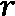 和 ，基于  和 -贪婪策略选择下一个动作 ，并更新动作-价值估计：

    ```py
        for i in range(n_iter):
            if i % 100000 == 0:
                print("Iteration:", i)
            s_next, reward, done, info = env.step(a)
            a_best = max(Q[s_next].items(), 
                         key=operator.itemgetter(1))[0]
            policy[s_next] = get_eps_greedy(actions, eps, a_best)
            a_next = choose_action(s_next, policy)
            Q[s][a] += alpha * (reward 
                                + gamma * Q[s_next][a_next] 
                                - Q[s][a])
            if done:
                s = env.reset()
                a_best = max(Q[s].items(), 
                             key=operator.itemgetter(1))[0]
                policy[s] = get_eps_greedy(actions, eps, a_best)
                a = choose_action(s, policy)
            else:
                s = s_next
                a = a_next
        return policy, Q
    ```

1.  然后，让我们使用一些超参数（例如 ）并执行算法，进行 100 万次迭代：

    ```py
    policy, Q = sarsa(foodtruck, 1, 0.1, 0.05, 1000000)
    ```

1.  我们获得的 `policy` 如下：

    ```py
    {('Mon', 0): {0: 0.02, 100: 0.02, 200: 0.02, 300: 0.02, 400: 0.92},
     ('Tue', 0): {0: 0.02, 100: 0.02, 200: 0.02, 300: 0.92, 400: 0.02},
     ('Tue', 100): {0: 0.02, 100: 0.02, 200: 0.02, 300: 0.92, 400: 0.02},
    ...
    ```

    注意，实施该策略后，探索性动作将被忽略，我们将简单地为每个状态始终选择概率最高的动作。

1.  例如，状态为星期一 – 0 初始库存（通过 `Q[('Mon', 0)]` 访问）时的动作值如下：

    ```py
    {0: 2049.95351191411,
     100: 2353.5460655683123,
     200: 2556.736260693101,
     300: 2558.210868908282,
     400: 2593.7601273913133}
    ```

就是这样！我们已经成功实现了针对我们的示例的 TD(0) 算法。然而，注意到，我们获得的策略是一个近似最优策略，而不是我们通过动态规划方法获得的最优策略。策略中也存在一些不一致性，例如在状态（星期二，0）和（星期二，100）时都有买 300 个肉饼的策略。未能获得最优策略的原因有很多：

+   SARSA 在极限情况下会收敛到最优解，例如当  时。在实际操作中，我们会运行该算法有限步数。尝试增加 ，你会发现策略（通常）会变得更好。

+   学习率  是需要调整的超参数。收敛的速度依赖于这个选择。

+   这是一个基于策略的算法。因此，动作值反映了由于 -贪婪策略而产生的探索性，这不是我们在这个示例中真正想要的。因为在训练后，执行策略时不会进行探索（因为我们只需要探索来发现每个状态的最佳动作）。我们实际使用的策略与我们为其估算动作值的策略不同。

接下来，我们转向 Q-learning，它是一种脱政策的 TD 方法。

### 基于 Q-learning 的脱政策控制

如上所述，我们希望将动作值估计与探索效应隔离开来，这意味着需要一种脱政策的方法。Q-learning 就是这样的一种方法，这使得它非常强大，因此也非常流行。

以下是 Q-learning 中动作值的更新方式：


注意到，代替 ，我们有了项 。这看起来可能很小，但它是关键。*这意味着代理用于更新动作值的动作*，*，不一定是在* * 中下一个步骤时执行的动作*，*。相反，*  *是一个最大化* * 的动作，就像我们在非训练时会使用的那样。*因此，动作值估计中不涉及探索性动作，它们与训练后实际会遵循的策略一致。

这意味着智能体在下一步所采取的行动，例如 ，不会被用于更新。相反，我们在更新中使用状态  的最大动作值，例如 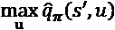。这种动作  是我们在使用这些动作值进行训练后会采用的，因此在动作值估计中不涉及探索性动作。

Q 学习的实现与 SARSA 的实现仅有微小差异。我们接下来看看 Q 学习的实际应用：

1.  我们通过定义常见初始化的 `q_learning` 函数来开始：

    ```py
    def q_learning(env, gamma, eps, alpha, n_iter):
        np.random.seed(0)
        states = env.state_space
        actions = env.action_space
        Q = {s: {a: 0 for a in actions} for s in states}
        policy = get_random_policy(states, actions)
        s = env.reset()
    ```

1.  然后，我们实现主循环，其中智能体在 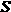 中采取的行动来自 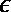-贪婪策略。在更新过程中，使用 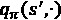 的最大值：

    ```py
         for i in range(n_iter):
            if i % 100000 == 0:
                print("Iteration:", i)
            a_best = max(Q[s].items(), 
                         key=operator.itemgetter(1))[0]
            policy[s] = get_eps_greedy(actions, eps, a_best)
            a = choose_action(s, policy)
            s_next, reward, done, info = env.step(a)
            Q[s][a] += alpha * (reward 
                                + gamma * max(Q[s_next].values()) 
                                - Q[s][a])
            if done:
                s = env.reset()
            else:
                s = s_next
    ```

1.  在主循环结束后，我们返回去除探索性动作的策略：

    ```py
        policy = {s: {max(policy[s].items(), 
                     key=operator.itemgetter(1))[0]: 1}
                     for s in states}
        return policy, Q
    ```

1.  最后，我们通过选择超参数来执行算法，例如以下内容：

    ```py
    policy, Q = q_learning(foodtruck, 1, 0.1, 0.01, 1000000)
    ```

1.  观察返回的 `policy`：

    ```py
    {('Mon', 0): {400: 1},
     ('Tue', 0): {400: 1},
     ('Tue', 100): {300: 1},
     ('Tue', 200): {200: 1},
     ('Tue', 300): {100: 1},
    ...
    ```

你会看到这个超参数集为你提供了最佳策略（或者根据随机化的不同，可能接近最佳策略）。

这就是我们对 Q 学习的讨论。接下来，让我们讨论这些方法如何扩展到 -步学习。

## n 步 TD 学习

在蒙特卡洛方法中，我们在进行策略更新之前会收集完整的回合。另一方面，在 TD(0)方法中，我们在环境中的一次过渡后就会更新价值估计和策略。通过在中间路径上更新策略，例如在 -步过渡后，可能会找到一个合适的平衡点。对于 ，两步回报看起来如下：


其一般形式如下：


这种形式可以在 TD 更新中使用，以减少在自举中使用的估计值的权重，特别是在训练初期，这些估计值可能会非常不准确。我们在这里不包括实现，因为它会变得有些复杂，但仍然想提醒你，这个替代方法可以作为你工具箱中的一种选择。

有了这些，我们完成了 TD 方法！在结束本章之前，让我们更深入地了解模拟在强化学习中的重要性。

# 理解模拟在强化学习中的重要性

正如我们多次提到的，特别是在第一章讨论强化学习成功案例时，强化学习对数据的需求远远大于常规深度学习。这就是为什么训练一些复杂的强化学习智能体通常需要数月时间，经历数百万或数十亿次迭代。由于在物理环境中收集如此数据通常不可行，我们在训练强化学习智能体时高度依赖模拟模型。这也带来了一些挑战：

+   许多企业没有自己的业务过程仿真模型，这使得在业务中应用强化学习技术变得具有挑战性。

+   当存在仿真模型时，它通常过于简单，无法捕捉真实世界的动态。因此，强化学习模型可能容易过拟合仿真环境，并在部署时失败。要校准和验证一个仿真模型，使其足够反映现实，通常需要大量的时间和资源。

+   一般来说，将一个在仿真中训练的强化学习代理部署到现实世界并不容易，因为，它们是两个不同的世界。这与机器学习中的核心原则相悖，该原则认为训练和测试应遵循相同的分布。这被称为**仿真到现实（sim2real）**的差距。

+   仿真精度的提高通常伴随着速度变慢和计算资源的消耗，这对于快速实验和强化学习（RL）模型开发来说是一个真实的劣势。

+   许多仿真模型不够通用，无法涵盖过去未遇到但未来可能遇到的场景。

+   许多商业仿真软件可能很难与强化学习包天然支持的语言（如 Python）进行集成（由于缺乏适当的 API）。

+   即使可以进行集成，仿真软件可能也不够灵活，无法与算法兼容。例如，它可能无法揭示环境的状态，在需要时重置环境，定义终止状态，等等。

+   许多仿真供应商在每个许可证下允许的会话数量有限，而强化学习模型开发是最快的——你可以并行运行成千上万的仿真环境。

在本书中，我们将介绍一些克服这些挑战的技术，例如针对 sim2real 差距的领域随机化和针对没有仿真的环境的离线强化学习。然而，本节的关键内容是，通常你应该投资于你的仿真模型，以便从强化学习中获得最佳效果。特别是，你的仿真模型应该快速、准确，并且能够扩展到多个会话。

到此为止，我们结束了这一章。干得好！这标志着我们在本书旅程中的一个里程碑。我们已经走了很长一段路，并建立了强化学习解决方案方法的坚实基础！接下来，让我们总结一下我们所学的内容，并看看下一章将带来什么。

# 总结

在本章中，我们介绍了解决 MDP 的三种重要方法：动态规划（DP）、蒙特卡洛方法和时序差分学习（TD）。我们已经看到，虽然动态规划提供了 MDP 的精确解，但它依赖于对环境的了解。另一方面，蒙特卡洛和 TD 学习方法则是通过探索环境并从经验中学习。特别地，TD 学习方法可以仅凭环境中的单步转移进行学习。在此过程中，我们还讨论了策略方法，它估计行为策略的价值函数，以及目标策略的离策略方法。最后，我们还讨论了模拟器在强化学习实验中的重要性，以及在使用模拟器时需要注意的事项。

接下来，我们将把旅程推向下一个阶段，深入探讨深度强化学习，这将使我们能够使用强化学习解决一些实际问题。特别地，在下一章中，我们将详细介绍深度 Q 学习。

到时候见！

# 习题

1.  改变这些值，观察修改后的问题中最优策略的变化。

1.  在价值迭代算法中的策略改进步骤后，添加一个策略评估步骤。你可以设置一个迭代次数，用于执行评估，然后再返回策略改进。使用`policy_evaluation`函数，并选择一个`max_iter`值。同时，注意如何跟踪状态值的变化。

# 参考文献

+   Sutton, R. S., & Barto, A. G. (2018). *强化学习：一种介绍*。A Bradford Book。网址：[`incompleteideas.net/book/the-book.html`](http://incompleteideas.net/book/the-book.html)

+   Barto, A. (2006). *强化学习*。马萨诸塞大学 – 阿姆赫斯特 CMPSCI 687。网址：[`www.andrew.cmu.edu/course/10-703/textbook/BartoSutton.pdf`](https://www.andrew.cmu.edu/course/10-703/textbook/BartoSutton.pdf)

+   Goldstick, J. (2009). *重要性抽样。密歇根大学统计学 406：统计计算导论*：[`dept.stat.lsa.umich.edu/~jasoneg/Stat406/lab7.pdf`](http://dept.stat.lsa.umich.edu/~jasoneg/Stat406/lab7.pdf)
