# 第六章：*第六章*：大规模深度 Q 学习

在上一章中，我们介绍了用 **动态规划**（**DP**）方法解决 **马尔可夫决策过程**（**MDP**），并提到它们存在两个重要的局限性：首先，DP 假设我们完全了解环境的奖励和转移动态；其次，DP 使用表格化的状态和动作表示，而在许多实际应用中，由于可能的状态-动作组合太多，这种方式无法扩展。我们通过引入 **蒙特卡洛**（**MC**）和 **时间差分**（**TD**）方法解决了前者问题，这些方法通过与环境的交互（通常是在模拟环境中）来学习，而无需了解环境的动态。另一方面，后者问题尚未解决，这正是深度学习发挥作用的地方。**深度强化学习**（**深度 RL 或 DRL**）是利用神经网络的表示能力来学习适应各种情况的策略。

尽管听起来很棒，但在 **强化学习**（**RL**）的背景下，让函数逼近器（function approximators）有效工作是相当棘手的，因为我们在表格化 Q 学习中所拥有的许多理论保证在深度 Q 学习中都丧失了。因此，深度 Q 学习的故事在很大程度上是关于使神经网络在 RL 中有效工作的技巧。本章将带你了解函数逼近器为何失败以及如何解决这些失败。

一旦我们让神经网络与 RL 配合好，就会面临另一个挑战：深度 RL 对数据的巨大需求，这一需求甚至比监督学习更为严重。这要求我们开发高度可扩展的深度 RL 算法，本章将使用现代 Ray 库实现深度 Q 学习的可扩展性。最后，我们将向你介绍 RLlib，这是一个基于 Ray 的生产级 RL 库。因此，本章的重点将是加深你对各种深度 Q 学习方法之间联系的理解，什么有效，为什么有效；而不是在 Python 中实现每一个算法，你将使用 Ray 和 RLlib 来构建和使用可扩展的方法。

这将是一次激动人心的旅程，让我们一起深入探索！具体来说，本章将涵盖以下内容：

+   从表格化 Q 学习到深度 Q 学习

+   深度 Q 网络

+   DQN 的扩展 – Rainbow

+   分布式深度 Q 学习

+   使用 Ray 实现可扩展的深度 Q 学习算法

+   使用 RLlib 进行生产级深度 RL

# 从表格化 Q 学习到深度 Q 学习

在我们在*第五章*《解决强化学习问题》中讨论表格 Q-learning 方法时，应该已经很明显，我们无法将这些方法真正扩展到大多数实际场景中。想象一下一个使用图像作为输入的强化学习问题。一个包含三个 8 位色彩通道的图像将会导致种可能的图像，这是你的计算器无法计算的数字。正因为如此，我们需要使用函数逼近器来表示值函数。鉴于它们在监督学习和无监督学习中的成功，神经网络/深度学习成为了这里的明显选择。另一方面，正如我们在引言中提到的，当函数逼近器介入时，表格 Q-learning 的理论保证就不再成立。本节介绍了两种深度 Q-learning 算法——**神经拟合 Q 迭代**（**NFQ**）和在线 Q-learning，并讨论了它们的一些不足之处。通过这些内容，我们为接下来讨论现代深度 Q-learning 方法奠定了基础。

## 神经拟合 Q 迭代

NFQ 算法旨在拟合一个神经网络，表示行动值，即 Q 函数，将目标 Q 值与从环境中采样并通过先前可用的 Q 值自举的值进行匹配（Riedmiller，2015）。让我们首先了解 NFQ 如何工作，然后讨论一些实际考虑事项以及 NFQ 的局限性。

### 算法

回想一下在表格 Q-learning 中，行动值是从环境中收集的样本中学习的，这些样本是元组，通过反复应用以下更新规则：


这里，表示最优策略的行动值估计，（注意我们开始使用大写字母，这是深度强化学习文献中的惯例）。目标是通过将采样的贝尔曼最优性操作符应用到样本上，更新现有估计值，使其接近一个“目标”值。NFQ 有类似的逻辑，以下是不同之处：

+   Q 值由一个由参数化的神经网络表示，而不是一个表格，我们用表示它。

+   与通过每个样本逐步更新 Q 值不同，NFQ 一次性从环境中收集一批样本，并将神经网络拟合到目标值上。

+   有多轮计算目标值并拟合参数的过程，以便能够通过最新的 Q 函数获得新的目标值。

在整体描述之后，下面是 NFQ 算法的详细步骤：

1.  初始化和策略。

1.  使用  策略收集一组  样本，。

1.  将采样的贝尔曼最优算子应用于所有样本，以获得目标值，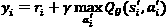，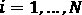，但如果  是终止状态，则设置 。

1.  通过最小化  和目标值之间的差距，获得 。更正式地说，

    ，其中  是一个损失函数，例如平方误差，。

1.  根据新的  值更新 。

对拟合 Q 迭代可以进行许多改进，但这不是我们在此讨论的重点。相反，接下来我们将提到在实现该算法时需要考虑的几个关键要点。

### 拟合 Q 迭代的实际考虑

为了使拟合 Q 迭代在实践中有效，有几个重要的注意事项，我们在此列出：

+    策略应该是软策略，在样本收集过程中允许足够的探索不同的状态-动作对，例如 -贪心策略。因此，探索率是一个超参数。

+   设置  太大可能会导致问题，因为某些状态只有在坚持使用良好的策略（它开始改善后）若干步之后才能到达。一个例子是在视频游戏中，只有在成功完成早期步骤后才能到达后续关卡，而高度随机的策略不太可能做到这一点。

+   当目标值被获取时，这些值很可能使用了不准确的动作值估计，因为我们使用不准确的  值进行自举。因此，我们需要重复 *步骤 2* 和 *步骤 3*， 次，期望在下一轮中获得更准确的目标值。这为我们提供了另一个超参数，。

+   我们最初用于收集样本的策略可能不足以将智能体引导到状态空间的某些部分，这类似于高  的情况。因此，通常在更新策略后收集更多的样本，将它们添加到样本集，并重复该过程是个好主意。

+   请注意，这是一个离策略算法，因此样本可以来自所选策略，也可以来自其他地方，比如环境中已部署的非强化学习控制器。

即使有这些改进，在实践中，使用 NFQ 求解 MDP 可能会很困难。接下来我们将在下一节中探讨原因。

### 拟合 Q 迭代的挑战

尽管拟合 Q 迭代有一些成功的应用，但它存在几个主要缺点：

+   它需要每次重复使用手头的目标批次来从头学习 ，换句话说，*步骤 3* 涉及到一个  运算符，而不是像梯度下降中那样逐步更新  以适应新数据。在一些应用中，强化学习模型需要在数十亿个样本上训练。一次又一次地在数十亿个样本上训练神经网络，并且使用更新后的目标值进行训练是不切实际的。

+   SARSA 和类似 Q-learning 的方法在表格情形下有收敛性保证。然而，当使用函数逼近时，这些理论保证会丧失。

+   使用带有函数逼近的 Q-learning，这是一个使用自举的脱策略方法，特别不稳定，这被称为 **致命三重奏**。

在深入探讨如何解决这些问题之前，我们先来详细分析后两个点。现在，这将涉及一些理论，如果你理解这些理论，将帮助你对深度强化学习中的挑战有更深入的直觉。另一方面，如果你不想了解理论，可以跳过直接进入 *在线 Q-learning* 部分。

#### 使用函数逼近器的收敛性问题

为了说明为什么当使用函数逼近器时，Q-learning 的收敛性保证会丧失，我们先回顾一下为什么表格 Q-learning 一开始是收敛的：

+    的定义是，如果我们在状态  下选择动作 ，仅在一开始偏离策略 ，然后在剩余时间内遵循该策略，期望的折扣回报：


+   Bellman 最优性算子，用符号  表示，接收一个动作-价值函数 、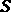 和 ，并映射到以下量：


请注意期望值中的  的使用，而不是遵循其他策略 。 是一个算子，一个函数，*不同于动作-价值函数的定义*。

+   如果且仅当动作-价值函数是最优时， 会将  映射回 ，对于所有  和  的实例：


更正式地说，算子  的唯一固定点是最优的 ，用  表示。这就是 Bellman 最优性方程的内容。

+    是一个**收缩**，这意味着每次我们将其应用于任何两个不同的动作值函数，例如  和  向量，这些向量的条目是所有  和  实例的某些动作值估计，它们会变得越来越接近。这是相对于  范数，即  和  以及  的元组之间绝对差值的最大值：，这里是 。

    如果我们选择其中一个动作值向量作为最优向量，我们将得到以下关系：


这意味着我们可以通过从某个任意的  值开始，反复应用 Bellman 操作符，并更新  值，逐渐接近 。

+   有了这些， 就变成了一个更新规则，通过任意的  值来获得 ，这与值迭代方法的工作原理非常相似。

现在请注意，将神经网络拟合到一批采样的目标值并不保证能使动作值估计接近每个  元组的最优值，因为拟合操作并不关心个别误差——而且它不一定有能力做到这一点，因为它假设由于参数化，动作值函数具有某种结构——但它最小化了平均误差。因此，我们失去了 Bellman 操作在  范数下的收缩性质。相反，NFQ 将  拟合到目标值，以  范数为基础，但它并不具备相同的收敛性属性。

信息

如果你想更详细和直观地了解为什么值函数理论在函数逼近中失败，可以查看 Sergey Levine 教授的讲座：[`youtu.be/doR5bMe-Wic?t=3957`](https://youtu.be/doR5bMe-Wic?t=3957)，这也启发了本节内容。整个课程可以在线访问，是你深入了解强化学习理论的一个很好的资源。

现在让我们来看看著名的致命三元组，它提供了一个新的视角，说明为什么在诸如 Q-learning 等脱机策略算法中使用带有自举的函数逼近器会有问题。

#### 致命三元组

Sutton 和 Barto 提出了“致命三元组”这一术语，表示如果一个强化学习算法涉及以下所有操作，它很可能会发散：

+   函数逼近器

+   自举

+   脱机策略样本收集

他们提供了这个简单的例子来解释问题。考虑一个由两个状态（左和右）组成的 MDP 的一部分。左边只有一个动作，就是右移，奖励为 0。左状态的观察值为 1，右状态的观察值为 2。一个简单的线性函数近似器用于表示动作值，只有一个参数，。这是在下图中表示的：


图 6.1 – 一段发散的 MDP 片段（来源：Sutton & Barto，2018）

现在，想象一下一个行为策略只从左边的状态中采样。同时，假设初始值为  为 10 和 。然后，TD 误差计算如下：


现在，如果使用唯一的现有数据（即从左到右的转换，假设使用 ），更新线性函数近似，那么新的  值变为 。请注意，这也更新了右状态的动作值估计。在下一轮中，行为策略再次只从左侧采样，而新的 TD 误差变为如下：


它甚至大于第一个 TD 误差！你可以看到它最终如何发散。问题发生的原因如下：

+   这是一种离策略方法，行为策略恰好只访问状态-动作空间的一个部分。

+   使用一个函数近似器，其参数基于我们有限的样本进行更新，但未访问的状态动作的价值估计也会随之更新。

+   我们进行引导式估计，并使用我们从未实际访问过的状态动作所得到的错误价值估计来计算目标值。

这个简单的例子说明了当这三种组件结合在一起时，它如何可能会破坏强化学习方法。有关其他例子和更详细的解释，我们建议您阅读 Sutton & Barto，2018 中的相关章节。

由于我们只讨论了挑战，现在我们终于开始解决它们。记住，NFQ 要求我们完全将整个神经网络拟合到现有的目标值，并且我们如何寻找更渐进的更新。这就是在线 Q 学习给我们的结果，我们将在下一节介绍它。另一方面，在线 Q 学习也引入了其他挑战，我们将在下一节使用**深度** **Q 网络**（**DQNs**）来解决这些问题。

## 在线 Q 学习

如前所述，拟合 Q 迭代法的一个缺点是每次处理一批样本时都需要计算  值，这在问题复杂且需要大量数据训练时显得不切实际。在线 Q 学习则走到了另一个极端：在观察到每一个样本后，它通过梯度更新 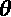，即 。接下来，我们将深入探讨在线 Q 学习算法的细节。

### 算法

在线 Q 学习算法的工作方式如下：

1.  初始化  和一个策略，，然后初始化环境并观察 。

    对于  到 ，继续进行以下步骤。

1.  在给定状态  的情况下，执行某些操作 ，使用策略 ，然后观察  和 ，它们构成了  元组。

1.  获取目标值 ，但如果  是终止状态，则设置 。

1.  执行梯度步骤以更新 ，其中  是步长。

1.  更新策略以  为新  值。

    **结束**

如你所见，与 NFQ 的关键区别是，每当从环境中抽取一个  元组时，才更新神经网络参数。以下是关于在线 Q 学习的额外考虑：

+   类似于 NFQ 算法，我们需要一个不断探索状态-动作空间的策略。同样，这可以通过使用 -贪婪策略或其他软策略来实现。

+   与拟合 Q 迭代法相似，样本可能来自与 Q 网络所建议的策略无关的政策，因为这是一种离策略方法。

除了这些之外，在线 Q 学习方法还可以进行许多其他改进。我们将暂时聚焦于 DQN，它是 Q 学习的突破性改进，而不是讨论一些相对次要的在线 Q 学习调整。但在此之前，我们先来看一下为何目前形式的在线 Q 学习难以训练。

### 在线 Q 学习的挑战

在线 Q 学习算法面临以下问题：

+   **梯度估计有噪声**：类似于机器学习中的其他梯度下降方法，在线 Q 学习的目标是通过样本估计梯度。另一方面，它在执行时仅使用一个样本，这导致了噪声较大的估计，使得优化损失函数变得困难。理想情况下，我们应使用一个包含多个样本的小批量来估计梯度。

+   **梯度步伐并不是真正的梯度下降**：这是因为  包含了 ，我们将其视为常量，尽管它并非如此。  本身依赖于 ，然而我们忽略了这一事实，因为我们没有对  求其导数。

+   **目标值在每次梯度步骤后更新，这变成了一个网络试图从中学习的动态目标**：这与监督学习不同，在监督学习中，标签（例如图像标签）不会根据模型预测的结果而变化，这使得学习变得非常困难。

+   **样本并非独立同分布（i.i.d.）**：事实上，它们通常高度相关，因为马尔可夫决策过程（MDP）是一个顺序决策问题，接下来的观察高度依赖于我们之前采取的行动。这是与经典梯度下降的另一种偏离，打破了其收敛性。

由于所有这些挑战，以及我们在 NFQ 部分中提到的致命三联体，在线 Q 学习算法并不是解决复杂强化学习问题的可行方法。随着 DQNs 的革命性工作，这改变了我们之前提到的后两个挑战。事实上，正是通过 DQN，我们才开始讨论深度强化学习。所以，不再赘述，让我们直接进入讨论 DQNs。

# 深度 Q 网络

DQN 是 Mnih 等人（2015）的一项开创性工作，它使得深度强化学习成为解决复杂顺序控制问题的可行方法。作者证明了一个单一的 DQN 架构能够在许多雅达利游戏中达到超人水平的表现，且不需要任何特征工程，这为人工智能的进展带来了巨大的兴奋。让我们看看是什么使得 DQN 比我们之前提到的算法更为有效。

## DQN 中的关键概念

DQN 通过使用经验重放和目标网络这两个重要概念，修改了在线 Q 学习，从而极大地稳定了学习过程。接下来我们将描述这些概念。

### 经验重放

如前所述，单纯地使用从环境中顺序采样的经验会导致梯度步骤高度相关。而 DQN 则将这些经验元组  存储在重放缓冲区（记忆）中，这一概念早在 1993 年就由 Lin 提出（1993 年）。在学习过程中，样本是从该缓冲区中均匀随机抽取的，这消除了用于训练神经网络的样本之间的相关性，提供了类似独立同分布（i.i.d.）的样本。

使用经验重放而非在线 Q 学习的另一个好处是，经验被重用而不是丢弃，这减少了与环境交互所需的次数——鉴于强化学习中需要大量数据，这是一项重要的优势。

关于经验回放的一个有趣注解是，有证据表明，动物的大脑中也有类似的过程发生。动物似乎会在其海马体中回放过去的经验，这有助于它们的学习（McClelland，1995）。

### 目标网络

使用引导法（bootstrapping）与函数逼近的另一个问题是它会创建一个不断变化的目标供学习。这使得本已具有挑战性的任务，如从噪声样本中训练神经网络，变成了一项注定失败的任务。作者提出的一个关键见解是创建一个神经网络的副本，该副本仅用于生成用于采样 Bellman 更新的 Q 值估计。即，样本的目标值  如下所示：


这里，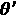 是目标网络的参数，它会每隔  个时间步更新一次，通过设置  来更新。

创建更新目标网络的滞后可能会使其动作价值估计与原始网络相比略显过时。另一方面，作为回报，目标值变得稳定，原始网络可以进行训练。

在给出完整的 DQN 算法之前，我们先来讨论一下它所使用的损失函数。

### 损失函数

引入经验回放和目标网络后，DQN 最小化以下损失函数：


这里， 是重放缓冲区，从中均匀随机抽取一个最小批量的  元组以更新神经网络。

现在，终于到了给出完整算法的时候。

## DQN 算法

DQN 算法包含以下步骤：

1.  初始化  和一个具有固定容量  的重放缓冲区 。将目标网络参数设置为 。

1.  设置策略 ，使其对  采用 -贪心策略。

1.  给定状态  和策略 ，采取动作 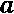，并观察 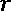 和 。将过渡  添加到重放缓冲区 。如果 ，则从缓冲区中弹出最旧的过渡。

1.  如果 ，则均匀采样一个来自  的随机最小批量的  过渡，否则返回 *第 2 步*。

1.  获取目标值，，，除非  是终止状态，此时设置 。

1.  进行一次梯度更新步骤来更新 ，它是 。这里，

1.  每次步骤，更新目标网络参数，。

1.  返回到*步骤 1*。

DQN 算法可以通过*图 6.2*中的示意图来说明：


图 6.2 – DQN 算法概述（来源：Nair 等人，2015）

在 DQN 开创性工作之后，许多论文提出了多种扩展方法来改进它们。Hessel 等人（2018）将其中一些最重要的扩展结合起来，命名为 Rainbow，接下来我们将讨论这些扩展。

# DQN 的扩展 – Rainbow

Rainbow 的改进相较于原始的 DQN 提供了显著的性能提升，并且已成为大多数 Q 学习实现中的标准方法。在本节中，我们将讨论这些改进的内容，它们如何提供帮助，以及它们相对的重要性。最后，我们将讨论 DQN 及这些扩展如何共同克服致命三重困境。

## 这些扩展

Rainbow 算法包含了对 DQN 的六种扩展。这些扩展包括双重 Q 学习、优先重放、对抗网络、多步学习、分布式强化学习和噪声网络。我们将从双重 Q 学习开始描述这些扩展。

### 双重 Q 学习

Q 学习中的一个著名问题是，我们在学习过程中获得的 Q 值估计值通常高于真实 Q 值，这是由于最大化操作所致，。这种现象被称为**最大化偏差**，其产生的原因在于我们在对 Q 值的噪声观察结果上进行最大化操作。结果，我们最终估算的不是真实值的最大值，而是可能观察到的最大值。

为了简单地说明这种现象，考虑*图 6.3*中的示例：


图 6.3 – 最大化偏差的两个示例

*图 6.3 (a)* 和 *6.3 (b)* 展示了在给定状态下，对于可用动作的各种 Q 值估计的概率分布，，其中竖线表示真实的动作值。在*(a)*中，有三个可用的动作。在某些轮次的样本收集中，偶然地我们获得的估计值恰好是。不仅最优动作被错误地预测为，而且其动作值被高估了。在*(b)*中，有六个可用的动作，它们具有相同的 Q 值估计的概率分布。尽管它们的真实动作值相同，但当我们随机抽样时，它们之间就会出现顺序，仅仅是偶然的结果。而且，由于我们对这些噪声观察结果进行最大化操作，因此很有可能最终估算值会高于真实值，Q 值又一次被高估。

双 Q 学习通过使用两个独立的动作价值函数， 和 ，将寻找最大化动作和为其获取动作价值估计的过程解耦，从而提出了对最大化偏差的解决方案。更正式地，我们通过其中一个函数来寻找最大化动作：


然后，我们使用另一个函数来获得动作价值，即 。

在表格 Q 学习中，这需要额外的努力来维持两个动作价值函数。然后， 和  在每一步中会随机交换。另一方面，DQN 已经提出了维护一个目标网络，使用  参数来为引导提供动作价值估计。因此，我们在 DQN 上实现了双 Q 学习，以获得最大化动作的动作价值估计，具体如下：

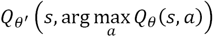

然后，状态-动作对  的对应损失函数变为以下形式：


就是这样！这就是双 Q 学习在 DQN 中的工作原理。现在，让我们深入了解下一个改进：优先重放。

### 优先经验重放

正如我们提到的，DQN 算法建议从重放缓冲区中均匀随机地采样经验。另一方面，自然地可以预期某些经验比其他经验更“有趣”，因为代理从中学到的东西更多。这尤其在困难探索问题中表现突出，尤其是那些稀疏奖励的问题，在这些问题中有很多“不感兴趣”的“失败”案例，只有少数几个带有非零奖励的“成功”案例。Schaul 等人（2015）建议使用 TD 误差来衡量某个经验对代理来说有多么“有趣”或“令人惊讶”。从重放缓冲区中采样某个特定经验的概率将与 TD 误差成正比。即，在时间 ， 遇到的经验的采样概率与 TD 误差之间有以下关系：


这里， 是一个超参数，用来控制分布的形状。注意，对于 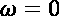，这会在经验上产生均匀分布，而更大的 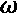 值则会把更多的权重放在具有大 TD 误差的经验上。

### 对战网络

在 RL 问题中，一个常见的情况是，在某些状态下，代理采取的动作对环境几乎没有影响。举个例子，考虑以下情况：

+   在网格世界中移动的机器人应该避免进入“陷阱”状态，因为从该状态中机器人无法通过自己的动作逃脱。

+   相反，环境会以某个低概率将机器人随机从这个状态转移出去。

+   在此状态下，机器人失去了一些奖励积分。

在这种情况下，算法需要估计陷阱状态的价值，以便它知道应该避免该状态。另一方面，尝试估计单个行动值是没有意义的，因为它只是追逐噪声。事实证明，这会损害 DQN 的有效性。

对偶网络通过一种架构提出了解决这个问题的方法，该架构同时估计给定状态下的状态值和行动**优势**，并在并行流中进行处理。一个给定状态下的行动的**优势值**，顾名思义，是选择该行动所带来的额外预期累计奖励，而不是所使用的策略所建议的行动！[](img/Formula_05_040.png)。它的正式定义如下：


因此，选择具有最高优势的行动等同于选择具有最高 Q 值的行动。

通过从状态值和行动优势的显式表示中获取 Q 值，如*图 6.4*所示，我们使得网络能够很好地表示状态值，而不需要准确估计给定状态下的每个行动值：


图 6.4 – (a) 常规 DQN 和(b) 对偶 DQN（来源：Wang 等，2016）

在这一点上，你可能会认为，行动-价值估计只是通过我们之前给出的公式，在这个架构中得到的。事实证明，这种简单的实现并不有效。这是因为仅凭这个架构并不能强制网络学习相应分支中的状态和行动值，因为它们是通过它们的总和间接监督的。例如，如果你从状态值估计中减去 100，并且将 100 加到所有的优势估计中，那么总和并不会改变。为了克服这个“可识别性”问题，我们需要记住这一点：在 Q 学习中，策略是选择具有最高 Q 值的行动。我们用！[](img/Formula_06_181.png)表示这个最佳行动。然后，我们得到以下内容：


这导致了！[](img/Formula_06_183.png)。为了强制执行这一点，一种获得行动-价值估计的方法是使用以下方程：


这里， 和  分别表示常见的编码器、状态值和优势流；而！[](img/Formula_06_187.png)。另一方面，作者使用以下替代方案，这导致了更稳定的训练：


通过这种架构，作者在当时的 Atari 基准测试中获得了最先进的结果，证明了该方法的价值。

接下来，让我们来看看 DQN 的另一个重要改进：多步学习。

### 多步学习

在上一章中，我们提到可以通过在从环境获得的估计中使用多步折扣奖励来获得更准确的状态-动作对的目标值。在这种情况下，回溯中使用的 Q 值估计会受到更大的折扣，从而减小这些估计不准确的影响。相反，目标值将更多地来自采样的奖励。更正式地，多个步骤设置中的时间差分（TD）误差变为以下形式：


可以看到，随着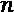的增大，项的影响逐渐减小，因为。

下一个扩展是分布式强化学习（distributional RL），这是基于值学习中最重要的思想之一。

### 分布式强化学习

在传统的 Q 学习设置中，动作值函数估计在状态下执行动作时的预期折扣回报，然后遵循某个目标策略。Bellemare 等人（2017）提出的分布式强化学习模型则学习状态值的离散支持上的概率质量函数。这是一个包含个原子的向量，其中，。然后，神经网络架构被修改为估计每个原子的，即。当使用分布式强化学习时，TD 误差可以通过当前和目标分布之间的**Kullback-Leibler**（**KL**）散度来计算。

这里举个例子，假设环境中任何状态的状态值范围可以从到。我们可以将这个范围离散化为 11 个原子，从而得到。然后，值网络会估计，对于给定的值，其值为 0、10、20 等的概率。事实证明，这种对值函数的细粒度表示在深度 Q 学习中带来了显著的性能提升。当然，这里的额外复杂性在于，和是需要调优的附加超参数。

最后，我们将介绍最后一个扩展——噪声网络（noisy nets）。

### 噪声网络

正常 Q 学习中的探索由控制，该值在状态空间中是固定的。另一方面，某些状态可能需要比其他状态更高的探索。噪声网络将噪声引入动作值函数的线性层，噪声的程度在训练过程中学习。更正式地，噪声网络定位线性层：


然后将其替换为以下形式：


在这里， 和  是学习到的参数，而  和  是具有固定统计数据的随机变量， 表示逐元素乘积。通过这种设置，探索率成为学习过程的一部分，尤其在困难探索问题中，这一点尤为重要（Fortunato 等，2017 年）。

这就结束了关于扩展的讨论。接下来，我们将转向讨论这些扩展结合后的结果。

## 集成智能体的性能

Rainbow 论文的贡献在于将所有前述的改进整合成一个单一的智能体。因此，它在当时的著名 Atari 2600 基准测试中取得了最先进的结果，展示了将这些改进整合在一起的重要性。当然，一个自然的问题是，每一个单独的改进是否对结果产生了显著影响。作者通过一些消融实验来展示结果，我们将在接下来的部分讨论这一点。

## 如何选择使用哪些扩展 —— Rainbow 的消融实验

Rainbow 论文得出了关于各个扩展重要性的以下结论：

+   事实证明，优先回放和多步学习是对结果贡献最大的扩展。将这些扩展从 Rainbow 架构中移除导致性能的最大下降，表明它们的重要性。

+   分布式 DQN 被证明是下一个重要的扩展，尤其在训练的后期阶段更为显著。

+   移除 Rainbow 智能体中的噪声网络导致性能下降，尽管其影响不如之前提到的其他扩展显著。

+   移除对抗性架构和双重 Q 学习对性能没有显著影响。

当然，这些扩展的效果取决于具体问题，而它们的选择变成了一个超参数。然而，这些结果表明，优先回放、多步学习和分布式 DQN 是训练强化学习智能体时需要尝试的重要扩展。

在我们结束本节内容之前，让我们回顾一下关于致命三重奏的讨论，并尝试理解为什么随着这些改进的出现，它变得不再是一个大问题。

## 致命三重奏发生了什么？

致命三重奏假设当离策略算法与函数逼近器和自举法结合时，训练可能会很容易发散。另一方面，前述的深度 Q 学习工作却展现了巨大的成功。那么，如果致命三重奏的理论是准确的，我们如何能够实现如此好的结果呢？

Hasselt 等人研究了这个问题，并支持以下假设：

+   在将 Q 学习与传统的深度强化学习函数空间结合时，无界发散并不常见。因此，尽管可能发生发散，但并不意味着一定会发生。作者们提出的结果表明，这其实并不是一个重大问题。

+   在独立网络上进行自举时，发散较少。DQN 论文中引入的目标网络有助于减少发散。

+   在纠正过度估计偏差时，发散较少，这意味着双重 DQN 在缓解发散问题方面发挥了作用。

+   更长的多步回报将更不容易发散，因为它减少了自举影响。

+   更大、更灵活的网络由于其表征能力接近表格化表示，而不像容量较小的函数逼近器那样容易发散。

+   更强的更新优先级（高 ）将更容易发散，这不好。但随后，可以通过重要性采样来纠正更新量，从而帮助防止发散。

这些为我们提供了关于深度 Q 学习情况为何不像最初看起来那么糟糕的重要见解。这也从过去几年报告的非常令人兴奋的结果中得到了体现，深度 Q 学习已成为一种非常有前景的强化学习问题解决方案。

这标志着我们关于深度 Q 学习理论的讨论结束。接下来，我们将转向深度强化学习中的一个非常重要的维度——其可扩展的实现。

# 分布式深度 Q 学习

深度学习模型以对数据的渴求而闻名。对于强化学习而言，这种对数据的需求更为强烈，因此需要在训练强化学习模型时使用并行化。原始的 DQN 模型是一个单线程过程。尽管取得了巨大的成功，但它的可扩展性有限。在本节中，我们将介绍将深度 Q 学习并行化到多个（可能是成千上万个）进程的方法。

分布式 Q 学习背后的关键洞察是其脱离策略的特性，这实际上将训练与经验生成解耦。换句话说，生成经验的特定进程/策略对训练过程并不重要（尽管这一说法有一些警告）。结合使用重放缓冲区的思想，这使我们能够并行化经验生成，并将数据存储在中央或分布式重放缓冲区中。此外，我们还可以并行化从这些缓冲区中采样数据的方式，并更新行动-价值函数。

让我们深入探讨分布式深度 Q 学习的细节。

## 分布式深度 Q 学习架构的组件

在本节中，我们将描述分布式深度 Q 学习架构的主要组成部分，然后我们将深入探讨具体实现，遵循 Nair 等人（2015）提出的结构。

### 演员

**演员**是与环境副本交互的进程，它们根据给定的策略在所处状态下采取行动，并观察奖励和下一个状态。例如，如果任务是学习如何下棋，每个演员都会进行自己的棋局并收集经验。演员由**参数服务器**提供 Q 网络副本，并提供一个探索参数，帮助它们选择行动。

### 经验重放记忆（缓冲区）

当演员收集经验元组时，它们会将其存储在重放缓冲区中。根据实现的不同，可能会有一个全局重放缓冲区，或多个本地重放缓冲区，每个演员可能有一个。当重放缓冲区是全局的时，数据仍然可以以分布式的方式存储。

### 学习者

一个**学习者**的工作是计算将更新 Q 网络的梯度，并将其传递到参数服务器。为此，学习者携带 Q 网络的副本，从重放记忆中采样一个小批量的经验，计算损失和梯度，然后将这些信息传回参数服务器。

### 参数服务器

**参数服务器**是存储 Q 网络主副本的地方，并随着学习的进行更新。所有进程会定期从这个参数服务器同步它们的 Q 网络版本。根据实现的不同，参数服务器可能包括多个分片，以便存储大量数据并减少每个分片的通信负载。

在介绍这个通用结构后，我们来详细了解 Gorila 的实现——这是最早的分布式深度 Q 学习架构之一。

## Gorila – 一般强化学习架构

Gorila 架构引入了一个通用框架，通过我们之前描述的组件来并行化深度 Q 学习。这一架构的具体版本，由作者实现，将演员、学习者和本地重放缓冲区组合在一起进行学习。然后，你可以创建多个包来进行分布式学习。该架构在下图中有所描述：


图 6.5 – Gorila 架构

请注意，随着 Rainbow 的改进，具体流程会有所变化。

分布式深度 Q 学习算法的详细步骤如下，包含在一个包中：

1.  初始化一个重放缓冲区，，具有固定的容量，。初始化参数服务器并提供一些。同步行动值函数和目标网络的参数，和。

    对于 到，继续执行以下步骤。

1.  将环境重置为初始状态，。同步。

    对于到，继续执行以下步骤。

1.  执行一个动作，，根据给定的-贪心策略，使用和；观察和。将经验存储在回放缓冲区中，。

1.  同步；从中随机采样一个小批次并计算目标值，。

1.  计算损失；计算梯度并将其发送到参数服务器。

1.  每个梯度更新在参数服务器中；同步。

1.  结束。

伪代码中的一些细节被省略了，例如如何计算目标值。原始的 Gorila 论文实现了一个普通的 DQN，而没有 Rainbow 的改进。然而，你可以修改它来使用，例如，-步学习。算法的细节需要相应地填写。

Gorila 架构的一个缺点是它涉及大量在参数服务器、演员和学习者之间传递参数。根据网络的大小，这将意味着一个显著的通信负载。接下来，我们将探讨 Ape-X 架构如何改进 Gorila。

## Ape-X — 分布式优先经验回放

Horgan 等人（2018）介绍了 Ape-X DQN 架构，它在 DQN、Rainbow 和 Gorila 上取得了一些显著的改进。实际上，Ape-X 架构是一个通用框架，可以应用于除 DQN 之外的其他学习算法。

### Ape-X 的关键贡献

以下是 Ape-X 如何分配强化学习训练的关键点：

+   与 Gorila 类似，每个演员从其自己的环境实例中收集经验。

+   与 Gorila 不同，Ape-X 有一个单独的回放缓冲区，所有的经验都在其中收集。

+   与 Gorila 不同，Ape-X 有一个单独的学习者，它从回放缓冲区中采样并更新中央 Q 和目标网络。

+   Ape-X 架构完全解耦了学习者和演员，它们按照自己的节奏运行。

+   与常规的优先经验回放不同，演员在将经验元组添加到回放缓冲区之前计算初始优先级，而不是将它们设置为最大值。

+   Ape-X DQN 在其论文中适应了双重 Q 学习和多步学习的改进，尽管其他 Rainbow 的改进可以集成到架构中。

+   每个演员被分配不同的探索率，在范围内，其中具有低值的演员利用已学到的环境信息，而具有高值的演员则增加收集经验的多样性。

Ape-X DQN 架构在下图中描述：


图 6.6 – DQN 的 Ape-X 架构

现在，让我们深入了解演员和学习者算法的细节。

### 演员算法

以下是演员的算法：

1.  初始化 、 和 。

    对于  到 ，继续以下步骤。

1.  采取行动 ，该行动来自 ，并观察 。

1.  将  经验添加到本地缓冲区。

    如果本地缓冲区中的元组数超过阈值，，则继续以下步骤。

1.  从本地缓冲区获取 ，一个多步转移的批次。

1.  计算 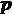 以得到 ，并为经验设置初始优先级。

1.  将  和  发送到中央重放缓冲区。

1.  如果结束

1.  每经过  步骤从学习者同步本地网络参数，

1.  结束

对于前述算法有一点澄清：不要将本地缓冲区与重放缓冲区混淆。本地缓冲区只是临时存储，用于积累经验并在发送到重放缓冲区之前处理，而学习者并不直接与本地缓冲区交互。此外，向重放缓冲区发送数据的过程在后台运行，并不会阻塞与环境交互的过程。

现在，让我们来看一下学习者算法。

### 学习者算法

以下是学习者的工作方式：

1.  初始化 Q 和目标网络，

    对于  到 ，继续以下步骤。

1.  从经验中采样一个批次，，其中  有助于唯一标识所采样的经验。

1.  使用 、 和  计算梯度 ；使用这些梯度更新网络参数到 。

1.  计算新的优先级 ，用于 ，并使用  信息更新重放缓冲区中的优先级。

1.  定期从重放缓冲区中移除旧经验。

1.  定期更新目标网络参数。

1.  结束

如果你查看演员和学习者算法，它们并不复杂。然而，将它们解耦的关键直觉带来了显著的性能提升。

在我们结束这一部分讨论之前，让我们接下来讨论一些 Ape-X 框架的实际细节。

### 实现 Ape-X DQN 时的实际考虑

Ape-X 论文包含了实现的更多细节，以下是一些关键点：

+   演员的探索率为 ，当  和  与  时，这些值在训练过程中保持不变。

+   在学习开始之前，有一个宽限期来收集足够的经验，作者将其设置为 50,000 次转换，用于 Atari 环境。

+   奖励和梯度范数被裁剪以稳定学习过程。

所以，请记住在你的实现中关注这些细节。

到目前为止，这是一个漫长的旅程，充满了理论和抽象讨论——感谢你的耐心！现在，终于到了实践环节。接下来的章节和本书的其余部分，我们将大量依赖 Ray/RLlib 库。所以，接下来让我们先了解一下 Ray，然后实现一个分布式深度 Q 学习代理。

# 使用 Ray 实现可扩展的深度 Q 学习算法

在本节中，我们将使用 Ray 库实现一个并行化的 DQN 变体。Ray 是一个强大、通用且简单的框架，适用于在单台机器以及大型集群上构建和运行分布式应用程序。Ray 是为具有异构计算需求的应用程序而构建的。这正是现代深度 RL 算法所需要的，因为它们涉及到长时间和短时间任务的混合、GPU 和 CPU 资源的使用等。事实上，Ray 本身有一个强大的 RL 库，称为 RLlib。Ray 和 RLlib 在学术界和工业界的应用日益广泛。

信息

要将 Ray 与其他分布式后端框架（如 Spark 和 Dask）进行比较，请参见[`bit.ly/2T44AzK`](https://bit.ly/2T44AzK)。你会发现，Ray 是一个非常具有竞争力的替代方案，甚至在某些基准测试中击败了 Python 自带的多进程实现。

编写生产级的分布式应用程序是一项复杂的工作，这并不是我们在这里的目标。为此，我们将在下一节中介绍 RLlib。另一方面，实现你自己的自定义——虽然是简单的——深度 RL 算法是非常有益的，至少从教育角度来说是如此。因此，这个练习将帮助你实现以下目标：

+   向你介绍 Ray，除了 RL，你还可以用它来做其他任务。

+   让你了解如何构建自定义的并行化深度 RL 算法。

+   如果你希望深入了解 RLlib 源代码，这将是一个踏脚石。

如果你愿意，你可以在这个练习的基础上构建自己的分布式深度 RL 想法。

好了，让我们开始吧！

## Ray 简介

我们将先介绍 Ray，然后进入我们的练习。这将是一次简短的介绍，确保内容连贯。关于 Ray 工作原理的详细文档，请参考 Ray 的官方网站。

信息

Ray 和 RLlib 的文档可以在 [`docs.ray.io/en/latest/index.html`](https://docs.ray.io/en/latest/index.html) 找到，其中包括 API 参考、示例和教程。源代码可以在 GitHub 上找到，地址是 [`github.com/ray-project/ray`](https://github.com/ray-project/ray)。

接下来，让我们讨论一下 Ray 中的主要概念。

### Ray 中的主要概念

在我们深入探讨如何编写 Ray 应用程序之前，我们需要先讨论它所涉及的主要组件。Ray 使得你可以通过一个简单的 Python 装饰器 `@ray.remote`，让常规的 Python 函数和类在分离的远程进程上运行。在执行过程中，Ray 会处理这些函数和类的执行位置——无论是在你本地机器上的进程，还是如果你有集群的话，在集群中的某个地方。更详细地说，以下是它们的内容：

+   **远程函数（任务）** 类似于常规的 Python 函数，只不过它们是异步执行的，并且是分布式运行的。一旦调用，远程函数会立即返回一个对象 ID，并创建一个任务在工作进程上执行它。请注意，远程函数在调用之间不会保持状态。

+   **对象 ID（未来对象）** 是远程 Python 对象的引用，例如，远程函数的整数输出。远程对象存储在共享内存对象存储中，可以通过远程函数和类访问。请注意，对象 ID 可能指向一个未来可用的对象，例如，等远程函数执行完成后，该对象才会可用。

+   **远程类（演员）** 类似于常规的 Python 类，但它们运行在工作进程中。与远程函数不同，远程类是有状态的，它们的方法像远程函数一样工作，共享远程类中的状态。顺便提一下，这里的 "演员" 术语不要与分布式 RL 中的 "演员" 混淆——尽管可以使用 Ray actor 实现一个 RL actor。

接下来，让我们看看如何安装 Ray 并使用远程函数和类。

### 安装和启动 Ray

Ray 可以通过简单的 `pip install -U ray` 命令安装。如果要与我们稍后使用的 RLlib 库一起安装，只需使用 `pip install -U ray[rllib]`。

信息

请注意，Ray 支持 Linux 和 macOS。在本书撰写时，它的 Windows 版本仍处于测试阶段。

一旦安装完成，Ray 需要在创建任何远程函数、对象或类之前进行初始化：

```py
import ray
ray.init()
```

接下来，让我们创建一些简单的远程函数。在此过程中，我们将使用 Ray 文档中的示例。

### 使用远程函数

如前所述，Ray 通过一个简单的装饰器将常规的 Python 函数转换为远程函数：

```py
@ray.remote
def remote_function():
    return 1
```

一旦调用，该函数将执行一个工作进程。因此，调用该函数多次将创建多个工作进程以实现并行执行。为此，远程函数需要通过 `remote()` 来调用：

```py
object_ids = []
for _ in range(4):
    y_id = remote_function.remote()    
    object_ids.append(y_id)
```

请注意，函数调用不会等待彼此完成。然而，一旦调用，函数会立即返回一个对象 ID。为了像常规 Python 对象一样使用对象 ID 获取函数结果，我们只需要使用 `objects = ray.get(object_ids)`。请注意，这会使进程等待该对象可用。

对象 ID 可以像常规 Python 对象一样传递给其他远程函数或类：

```py
@ray.remote
def remote_chain_function(value):
    return value + 1
y1_id = remote_function.remote()
chained_id = remote_chain_function.remote(y1_id)
```

这里有几点需要注意：

+   这在两个任务之间创建了依赖关系。`remote_chain_function` 的调用将等待 `remote_function` 调用的输出。

+   在 `remote_chain_function` 中，我们不需要调用 `ray.get(value)`。Ray 会自动处理，无论是对象 ID 还是已经接收到的对象。

+   如果这两个任务的两个工作进程位于不同的机器上，输出将会从一台机器复制到另一台机器。

这只是 Ray 远程函数的简要概述。接下来，我们将深入了解远程对象。

### 使用远程对象

普通 Python 对象可以轻松地转换为 Ray 远程对象，如下所示：

```py
y = 1
object_id = ray.put(y)
```

这会将对象存储在共享内存对象存储中。请注意，远程对象是不可变的，创建后其值不能更改。

最后，让我们来了解一下 Ray 远程类。

### 使用远程类

在 Ray 中使用远程类（演员）与使用远程函数非常相似。以下是如何使用 Ray 的远程装饰器装饰一个类的示例：

```py
@ray.remote
class Counter(object):
    def __init__(self):
        self.value = 0
    def increment(self):
        self.value += 1
        return self.value
```

为了初始化该类的对象，我们除了调用类外，还需要使用 `remote`：

```py
a = Counter.remote()
```

同样，调用该对象的方法时需要使用 `remote`：

```py
obj_id = a.increment.remote()
ray.get(obj_id) == 1
```

就这样！Ray 的这一简要概述为我们继续实现可扩展的 DQN 算法奠定了基础。

## Ray 实现的 DQN 变体

在本节中，我们将使用 Ray 实现一个 DQN 变体，这将类似于 Ape-X DQN 结构，只是为了简单起见，我们没有实现优先回放。代码将包括以下组件：

+   `train_apex_dqn.py` 是主脚本，接受训练配置并初始化其他组件。

+   `actor.py` 包含与环境交互并收集经验的 RL 演员类。

+   `parameter_server.py` 包含一个参数服务器类，它将优化后的 Q 模型权重提供给演员。

+   `replay.py` 包含回放缓冲区类。

+   `learner.py` 包含一个学习者类，该类从回放缓冲区接收样本，进行梯度更新，并将新的 Q 网络权重推送到参数服务器。

+   `models.py` 包含使用 TensorFlow/Keras 创建前馈神经网络的函数。

然后我们在 Gym 的 CartPole (v0) 上运行这个模型，看看它的表现如何。让我们开始吧！

### 主脚本

主脚本的初步步骤是接收一组将在训练过程中使用的配置。这看起来像下面这样：

```py
    max_samples = 500000
    config = {"env": "CartPole-v0",
              "num_workers": 50,
              "eval_num_workers": 10,
              "n_step": 3,
              "max_eps": 0.5,
              "train_batch_size": 512,
              "gamma": 0.99,
              "fcnet_hiddens": [256, 256],
              "fcnet_activation": "tanh",
              "lr": 0.0001,
              "buffer_size": 1000000,
              "learning_starts": 5000,
              "timesteps_per_iteration": 10000,
              "grad_clip": 10}
```

让我们看看这些配置的一些细节：

+   `env` 是 Gym 环境的名称。

+   `num_workers` 是将会创建的训练环境/代理的数量，用于收集经验。请注意，每个 worker 会占用计算机上的一个 CPU，因此你需要根据你的机器进行调整。

+   `eval_num_workers` 是将会创建的评估环境/代理的数量，用于在训练的该时刻评估策略。同样，每个 worker 会占用一个 CPU。请注意，这些代理具有 ，因为我们不需要它们来探索环境。

+   `n_step` 是多步学习的步数。

+   `max_eps` 将设置训练代理中的最大探索率，，因为我们会为每个训练代理分配不同的探索率，范围在  之间。

+   `timesteps_per_iteration` 决定我们运行评估的频率；多步学习的步数。请注意，这不是我们进行梯度更新的频率，因为学习者会持续采样并更新网络参数。

使用这个配置，我们创建了参数服务器、重放缓存和学习者。我们稍后会详细介绍这些类的具体内容。请注意，由于它们是 Ray actor，我们使用`remote`来启动它们：

```py
    ray.init()
    parameter_server = ParameterServer.remote(config)
    replay_buffer = ReplayBuffer.remote(config)
    learner = Learner.remote(config, 
                             replay_buffer,
                             parameter_server)
```

我们提到过，学习者是一个独立的进程，它会持续从重放缓存中采样并更新 Q 网络。我们在主脚本中启动学习过程：

```py
learner.start_learning.remote()
```

当然，单独这样做不会有什么效果，因为 actor 还没有开始收集经验。接下来我们启动训练 actor 并立即让它们开始从环境中采样：

```py
    for i in range(config["num_workers"]):
        eps = config["max_eps"] * i / config["num_workers"]
        actor = Actor.remote("train-" + str(i), 
                             replay_buffer, 
                             parameter_server, 
                             config, 
                             eps)
        actor.sample.remote()
```

我们还启动了评估 actor，但我们不希望它们立即开始采样。这将在学习者更新 Q 网络时发生：

```py
    for i in range(config["eval_num_workers"]):
        eps = 0
        actor = Actor.remote("eval-" + str(i), 
                             replay_buffer, 
                             parameter_server, 
                             config, 
                             eps, 
                             True)
```

最后，我们有主循环，在其中交替进行训练和评估。随着评估结果的改善，我们会保存训练过程中最好的模型：

```py
    total_samples = 0
    best_eval_mean_reward = np.NINF
    eval_mean_rewards = []
    while total_samples < max_samples:
        tsid = replay_buffer.get_total_env_samples.remote()
        new_total_samples = ray.get(tsid)
        if (new_total_samples - total_samples
                >= config["timesteps_per_iteration"]):
            total_samples = new_total_samples
            parameter_server.set_eval_weights.remote()
            eval_sampling_ids = []
            for eval_actor in eval_actor_ids:
                sid = eval_actor.sample.remote()
                eval_sampling_ids.append(sid)
            eval_rewards = ray.get(eval_sampling_ids)
            eval_mean_reward = np.mean(eval_rewards)
            eval_mean_rewards.append(eval_mean_reward)
            if eval_mean_reward > best_eval_mean_reward:
                best_eval_mean_reward = eval_mean_reward
                parameter_server.save_eval_weights.remote()
```

请注意，代码中还有一些没有包括在这里的内容（例如将评估指标保存到 TensorBoard）。有关所有细节，请参阅完整的代码。

接下来，让我们详细了解 actor 类的内容。

### RL actor 类

RL actor 负责根据探索策略从环境中收集经验。探索的速率在主脚本中为每个 actor 确定，并且在整个采样过程中保持不变。actor 类还在将经验推送到重放缓存之前，先在本地存储经验，以减少通信开销。同时，请注意，我们区分训练和评估 actor，因为我们仅为评估 actor 运行单一回合的采样步骤。最后，actor 会定期拉取最新的 Q 网络权重，以更新其策略。

这是我们初始化 actor 的方法：

```py
@ray.remote
class Actor:
    def __init__(self,
                 actor_id,
                 replay_buffer,
                 parameter_server,
                 config,
                 eps,
                 eval=False):
        self.actor_id = actor_id
        self.replay_buffer = replay_buffer
        self.parameter_server = parameter_server
        self.config = config
        self.eps = eps
        self.eval = eval
        self.Q = get_Q_network(config)
        self.env = gym.make(config["env"])
        self.local_buffer = []
        self.obs_shape = config["obs_shape"]
        self.n_actions = config["n_actions"]
        self.multi_step_n = config.get("n_step", 1)
        self.q_update_freq = config.get("q_update_freq", 100)
        self.send_experience_freq = \
                    config.get("send_experience_freq", 100)
        self.continue_sampling = True
        self.cur_episodes = 0
        self.cur_steps = 0
```

actor 使用以下方法来更新和同步其策略：

```py
    def update_q_network(self):
        if self.eval:
            pid = \
              self.parameter_server.get_eval_weights.remote()
        else:
            pid = \
              self.parameter_server.get_weights.remote()
        new_weights = ray.get(pid)
        if new_weights:
            self.Q.set_weights(new_weights)
```

评估权重被单独存储和提取的原因是，由于学习者始终在学习，不论主循环中发生了什么，我们需要对 Q 网络进行快照以进行评估。

现在，我们为演员编写采样循环。让我们从初始化将在循环中更新的变量开始：

```py
    def sample(self):
        self.update_q_network()
        observation = self.env.reset()
        episode_reward = 0
        episode_length = 0
        n_step_buffer = deque(maxlen=self.multi_step_n + 1)
```

循环中的第一件事是获取一个动作并在环境中采取一步：

```py
        while self.continue_sampling:
            action = self.get_action(observation)
            next_observation, reward, \
            done, info = self.env.step(action)
```

我们的代码支持多步学习。为了实现这一点，滚动轨迹存储在一个最大长度为  的双端队列中。当双端队列满时，表示轨迹足够长，可以将经验存储到重放缓冲区中：

```py
            n_step_buffer.append((observation, action,
                                  reward, done))
            if len(n_step_buffer) == self.multi_step_n + 1:
                self.local_buffer.append(
                    self.get_n_step_trans(n_step_buffer))
```

我们记得更新我们所拥有的计数器：

```py
            self.cur_steps += 1
            episode_reward += reward
            episode_length += 1
```

在每一集结束时，我们重置环境和特定于该集的计数器。我们还将经验保存到本地缓冲区，无论其长度如何。还要注意，如果这是一次评估回合，我们会在回合结束时中断采样循环：

```py
            if done:
                if self.eval:
                    break
                next_observation = self.env.reset()
                if len(n_step_buffer) > 1:
                    self.local_buffer.append(
                        self.get_n_step_trans(n_step_buffer))
                self.cur_episodes += 1
                episode_reward = 0
                episode_length = 0
```

我们定期将经验发送到重放缓冲区，并且也定期更新网络参数：

```py
            observation = next_observation
            if self.cur_steps % \
                    self.send_experience_freq == 0 \
                    and not self.eval:
                self.send_experience_to_replay()
            if self.cur_steps % \
                    self.q_update_freq == 0 and not self.eval:
                self.update_q_network()
        return episode_reward
```

接下来，让我们看看动作采样的细节。动作是以 -贪婪的方式选择的，如下所示：

```py
     def get_action(self, observation):
        observation = observation.reshape((1, -1))
        q_estimates = self.Q.predict(observation)[0]
        if np.random.uniform() <= self.eps:
            action = np.random.randint(self.n_actions)
        else:
            action = np.argmax(q_estimates)
        return action
```

经验是从轨迹双端队列中提取的，如下所示：

```py
    def get_n_step_trans(self, n_step_buffer):
        gamma = self.config['gamma']
        discounted_return = 0
        cum_gamma = 1
        for trans in list(n_step_buffer)[:-1]:
            _, _, reward, _ = trans
            discounted_return += cum_gamma * reward
            cum_gamma *= gamma
        observation, action, _, _ = n_step_buffer[0]
        last_observation, _, _, done = n_step_buffer[-1]
        experience = (observation, action, discounted_return,
                      last_observation, done, cum_gamma)
        return experience
```

最后，存储在本地的经验元组将被发送到重放缓冲区，如下所示：

```py
    def send_experience_to_replay(self):
        rf = self.replay_buffer.add.remote(self.local_buffer)
        ray.wait([rf])
        self.local_buffer = []
```

到这里，演员部分就完成了！接下来，让我们看看参数服务器。

### 参数服务器类

参数服务器是一种简单的结构，用于接收来自学习者的更新参数（权重），并将它们提供给演员。它主要由设置器和获取器，以及一个保存方法组成。再一次提醒，我们定期拍摄参数的快照并将其用于评估。如果结果超过之前的最佳结果，则保存权重：

```py
@ray.remote
class ParameterServer:
    def __init__(self, config):
        self.weights = None
        self.eval_weights = None
        self.Q = get_Q_network(config)
    def update_weights(self, new_parameters):
        self.weights = new_parameters
        return True
    def get_weights(self):
        return self.weights
    def get_eval_weights(self):
        return self.eval_weights
    def set_eval_weights(self):
        self.eval_weights = self.weights
        return True
    def save_eval_weights(self,
                          filename=
                          'checkpoints/model_checkpoint'):
        self.Q.set_weights(self.eval_weights)
        self.Q.save_weights(filename)
        print("Saved.")
```

请注意，参数服务器仅存储实际的 Q 网络结构，以便能够使用 TensorFlow 方便的保存功能。除此之外，仅在不同进程之间传递神经网络的权重，而不是完整的模型，以避免不必要的开销和序列化问题。

接下来，我们将介绍重放缓冲区的实现。

### 重放缓冲区类

如前所述，为了简化，我们实现了一个标准的重放缓冲区（没有优先级采样）。因此，重放缓冲区从演员处接收经验，并将采样的经验发送给学习者。它还跟踪它在训练过程中已经接收到的所有经验元组的数量：

```py
@ray.remote
class ReplayBuffer:
    def __init__(self, config):
        self.replay_buffer_size = config["buffer_size"]
        self.buffer = deque(maxlen=self.replay_buffer_size)
        self.total_env_samples = 0
    def add(self, experience_list):
        experience_list = experience_list
        for e in experience_list:
            self.buffer.append(e)
            self.total_env_samples += 1
        return True
    def sample(self, n):
        if len(self.buffer) > n:
            sample_ix = np.random.randint(
                len(self.buffer), size=n)
            return [self.buffer[ix] for ix in sample_ix]
    def get_total_env_samples(self):
        return self.total_env_samples
```

### 模型生成

由于我们仅在进程之间传递 Q 网络的权重，因此每个相关演员都会创建其自己的 Q 网络副本。这些 Q 网络的权重随后会根据从参数服务器接收到的内容进行设置。

Q 网络使用 Keras 创建，如下所示：

```py
def get_Q_network(config):
    obs_input = Input(shape=config["obs_shape"],
                      name='Q_input')
    x = Flatten()(obs_input)
    for i, n_units in enumerate(config["fcnet_hiddens"]):
        layer_name = 'Q_' + str(i + 1)
        x = Dense(n_units,
                  activation=config["fcnet_activation"],
                  name=layer_name)(x)
    q_estimate_output = Dense(config["n_actions"],
                              activation='linear',
                              name='Q_output')(x)
    # Q Model
    Q_model = Model(inputs=obs_input,
                    outputs=q_estimate_output)
    Q_model.summary()
    Q_model.compile(optimizer=Adam(), loss='mse')
    return Q_model
```

这里一个重要的实现细节是，这个 Q 网络并不是我们想要训练的，因为它对于给定的状态，会预测所有可能动作的 Q 值。另一方面，给定的经验元组只包含一个目标值，针对这些可能动作中的一个：在该元组中由智能体选择的动作。因此，当我们使用该经验元组更新 Q 网络时，梯度应该仅通过所选动作的输出流动。其余的动作应该被遮蔽。我们通过使用基于所选动作的遮蔽输入，在这个 Q 网络之上添加一个自定义层来实现，这个层仅计算所选动作的损失。这样，我们就得到了一个可以训练的模型。

下面是我们如何实现遮蔽损失的：

```py
def masked_loss(args):
    y_true, y_pred, mask = args
    masked_pred = K.sum(mask * y_pred, axis=1, keepdims=True)
    loss = K.square(y_true - masked_pred)
    return K.mean(loss, axis=-1)
```

然后，得到可训练模型，如下所示：

```py
def get_trainable_model(config):
    Q_model = get_Q_network(config)
    obs_input = Q_model.get_layer("Q_input").output
    q_estimate_output = Q_model.get_layer("Q_output").output
    mask_input = Input(shape=(config["n_actions"],),
                       name='Q_mask')
    sampled_bellman_input = Input(shape=(1,),
                                  name='Q_sampled')
    # Trainable model
    loss_output = Lambda(masked_loss,
                         output_shape=(1,),
                         name='Q_masked_out')\
                        ([sampled_bellman_input,
                          q_estimate_output,
                          mask_input])
    trainable_model = Model(inputs=[obs_input,
                                    mask_input,
                                    sampled_bellman_input],
                            outputs=loss_output)
    trainable_model.summary()
    trainable_model.compile(optimizer=
                            Adam(lr=config["lr"],
                            clipvalue=config["grad_clip"]),
                            loss=[lambda y_true,
                                         y_pred: y_pred])
    return Q_model, trainable_model
```

正是这个可训练的模型将由学习者来优化。编译后的 Q 网络模型永远不会单独训练，我们在其中指定的优化器和损失函数只是占位符。

最后，让我们看一下学习者的部分。

### 学习者类

学习者的主要任务是从重放缓冲区接收一批经验样本，解包它们，并通过梯度步骤优化 Q 网络。这里，我们只包括了类初始化和优化步骤的一部分。

类的初始化如下：

```py
@ray.remote
class Learner:
    def __init__(self, config, replay_buffer, parameter_server):
        self.config = config
        self.replay_buffer = replay_buffer
        self.parameter_server = parameter_server
        self.Q, self.trainable = get_trainable_model(config)
        self.target_network = clone_model(self.Q)
```

现在是优化步骤。我们从重放缓冲区中采样，并更新我们保持的计数器：

```py
    def optimize(self):
        samples = ray.get(self.replay_buffer
                          .sample.remote(self.train_batch_size))
        if samples:
            N = len(samples)
            self.total_collected_samples += N
            self.samples_since_last_update += N
            ndim_obs = 1
            for s in self.config["obs_shape"]:
                if s:
                    ndim_obs *= s
```

然后，我们解包样本并重新调整其形状：

```py
            n_actions = self.config["n_actions"]
            obs = np.array([sample[0] for sample \
                        in samples]).reshape((N, ndim_obs))
            actions = np.array([sample[1] for sample \
                        in samples]).reshape((N,))
            rewards = np.array([sample[2] for sample \
                        in samples]).reshape((N,))
            last_obs = np.array([sample[3] for sample \
                        in samples]).reshape((N, ndim_obs))
            done_flags = np.array([sample[4] for sample \
                        in samples]).reshape((N,))
            gammas = np.array([sample[5] for sample \
                        in samples]).reshape((N,))
```

我们创建掩码，仅更新在经验元组中选择的动作的 Q 值：

```py
            masks = np.zeros((N, n_actions))
            masks[np.arange(N), actions] = 1
            dummy_labels = np.zeros((N,))
```

在主函数中，我们首先准备好输入给可训练 Q 网络，然后调用`fit`函数。在此过程中，我们使用双 DQN：

```py
            # double DQN
            maximizer_a = np.argmax(self.Q.predict(last_obs), axis=1)
            target_network_estimates = self.target_network.predict(last_obs)
            q_value_estimates = np.array([target_network_estimates[i,
                                   maximizer_a[i]]
                                   for i in range(N)]).reshape((N,))
            sampled_bellman = rewards + gammas * \
                              q_value_estimates * (1 - done_flags)
            trainable_inputs = [obs, masks,
                                sampled_bellman]
            self.trainable.fit(trainable_inputs, dummy_labels, verbose=0)
            self.send_weights()
```

最后，我们定期更新目标网络：

```py
            if self.samples_since_last_update > 500:
                self.target_network.set_weights(self.Q.get_weights())
                self.samples_since_last_update = 0
            return True
```

更多细节，请参见`learner.py`中的完整代码。

就这样！让我们看看这个架构在 CartPole 环境中的表现。

### 结果

你可以通过简单地运行主脚本来开始训练。在运行之前有几点需要注意：

+   不要忘记激活已安装 Ray 的 Python 环境。强烈推荐使用虚拟环境。

+   将工人的总数（用于训练和评估）设置为小于你机器上 CPU 的数量。

这样，你就可以按照如下方式开始训练：

```py
python train_apex_dqn.py
```

完整代码包括一些保存评估进度到 TensorBoard 的附加功能。你可以在相同的文件夹内启动 TensorBoard，方法如下：

```py
tensorboard --logdir logs/scalars
```

然后，访问默认的 TensorBoard 地址`http://localhost:6006/`。我们实验的评估图如下所示：


图 6.7 – CartPole v0 的分布式 DQN 评估结果

你可以看到，在大约 150,000 次迭代后，奖励达到了最大值 200。

做得好！你已经实现了一个深度 Q 学习算法，并且能够通过 Ray 将其扩展到多个 CPU，甚至是集群中的多个节点！可以随意改进这个实现，加入更多技巧，融入自己的创意！

让我们以在 RLlib 中如何运行类似实验来结束本章。

# 使用 RLlib 进行生产级深度强化学习

正如我们在开头提到的，Ray 的创造者之一的动机是构建一个易于使用的分布式计算框架，能够处理像深度强化学习这样的复杂和异构应用。因此，他们还基于 Ray 创建了一个广泛使用的深度强化学习库。使用 RLlib 训练一个类似于我们的模型非常简单，主要步骤如下：

1.  导入 Ape-X DQN 的默认训练配置和训练器。

1.  自定义训练配置。

1.  训练训练器。

就是这样！所需的代码非常简单。你只需要以下内容：

```py
import pprint
from ray import tune
from ray.rllib.agents.dqn.apex import APEX_DEFAULT_CONFIG
from ray.rllib.agents.dqn.apex import ApexTrainer
if __name__ == '__main__':
    config = APEX_DEFAULT_CONFIG.copy()
    pp = pprint.PrettyPrinter(indent=4)
    pp.pprint(config)
    config['env'] = "CartPole-v0"
    config['num_workers'] = 50
    config['evaluation_num_workers'] = 10
    config['evaluation_interval'] = 1
    config['learning_starts'] = 5000
    tune.run(ApexTrainer, config=config)
```

这样，你的训练应该开始了。RLlib 有很棒的 TensorBoard 日志记录功能。通过运行以下命令来初始化 TensorBoard：

```py
tensorboard --logdir=~/ray_results
```

我们训练的结果如下所示：


图 6.8 – RLlib 对 CartPole v0 的评估结果

事实证明，我们的 DQN 实现非常具有竞争力！但现在，借助 RLlib，你可以访问来自强化学习文献的许多改进。你可以通过更改默认配置来自定义你的训练。请花点时间浏览我们代码中打印出来的所有可用选项的长长列表。它看起来像这样：

```py
{   'adam_epsilon': 1e-08,
    'batch_mode': 'truncate_episodes',
    'beta_annealing_fraction': -1,
    'buffer_size': 2000000,
    'callbacks': <class 'ray.rllib.agents.callbacks.DefaultCallbacks'>,
    'clip_actions': True,
    'clip_rewards': None,
    'collect_metrics_timeout': 180,
    'compress_observations': False,
    'custom_eval_function': None,
    'custom_resources_per_worker': {},
    'double_q': True,
    'dueling': True,
...
```

再次提醒，列表很长。但这展示了你在 RLlib 中拥有的强大功能！我们将在接下来的章节中继续使用 RLlib，并深入探讨更多细节。

恭喜你！你在本章中做得非常出色，取得了很多成就。仅仅我们在这里所覆盖的内容，就为你提供了一个强大的工具库，能够解决许多顺序决策问题。接下来的章节将深入探讨更先进的深度强化学习材料，现在你已经准备好迎接挑战！

# 摘要

在本章中，我们从使用表格型 Q 学习到实现一个现代化的分布式深度 Q 学习算法，已经走了很长一段路。在此过程中，我们介绍了 NFQ、在线 Q 学习、带有 Rainbow 改进的 DQN、Gorila 和 Ape-X DQN 算法的细节。我们还介绍了 Ray 和 RLlib，这两个强大的分布式计算和深度强化学习框架。

在下一个章节中，我们将探讨另一类深度 Q 学习算法：基于策略的方法。这些方法将允许我们直接学习随机策略并使用连续动作。

# 参考文献

+   Sutton, R. S. & Barto, A. G. (2018). *强化学习：导论*. *MIT 出版社*. URL：[`incompleteideas.net/book/the-book.html`](http://incompleteideas.net/book/the-book.html)

+   Mnih, V. 等人 (2015). *通过深度强化学习实现人类级控制*. *自然*，518(7540)，529–533

+   Riedmiller, M. (2005) 神经拟合 Q 迭代 – 数据高效的神经强化学习方法初步经验。载于：Gama, J., Camacho, R., Brazdil, P.B., Jorge, A.M., & Torgo L.（编辑）《机器学习：ECML 2005》. ECML 2005. *计算机科学讲座笔记*，第 3720 卷。Springer，柏林，海德堡

+   Lin, L. (1993). *使用神经网络的机器人强化学习*。

+   McClelland, J. L., McNaughton, B. L., & O'Reilly, R. C. (1995). *为何海马体和新皮层中存在互补的学习系统：来自联结主义学习和记忆模型成功与失败的启示*. 心理学评论，102(3)，419–457

+   van Hasselt, H., Guez, A., & Silver, D. (2016). *深度强化学习与双 Q 学习*. 载于：AAAI 会议论文集，2094–2100

+   Schaul, T., Quan, J., Antonoglou, I., & Silver, D. (2015). *优先经验回放*. 载于：ICLR 会议论文集

+   Wang, Z., Schaul, T., Hessel, M., van Hasselt, H., Lanctot, M., & de Freitas, N. (2016). *深度强化学习的对抗网络架构*. 载于：第 33 届国际机器学习会议论文集，1995–2003

+   Sutton, R. S. (1988). *通过时间差分方法学习预测*. 机器学习 3(1), 9–44

+   Bellemare, M. G., Dabney, W., & Munos, R. (2017). *强化学习的分布式视角*. 载于：ICML 会议论文集

+   Fortunato, M., Azar, M. G., Piot, B., Menick, J., Osband, I., Graves, A., Mnih, V., Munos, R., Hassabis, D., Pietquin, O., Blundell, C., & Legg, S. (2017). *用于探索的噪声网络*. 网址：[`arxiv.org/abs/1706.10295`](https://arxiv.org/abs/1706.10295)

+   Hessel, M., Modayil, J., Hasselt, H.V., Schaul, T., Ostrovski, G., Dabney, W., Horgan, D., Piot, B., Azar, M.G., & Silver, D. (2018). *Rainbow: 结合深度强化学习中的改进*. 网址：[`arxiv.org/abs/1710.02298`](https://arxiv.org/abs/1710.02298)

+   Hasselt, H.V., Doron, Y., Strub, F., Hessel, M., Sonnerat, N., & Modayil, J. (2018). *深度强化学习与致命三合一问题*. 网址：[`arxiv.org/abs/1812.02648`](https://arxiv.org/abs/1812.02648)

+   Nair, A., Srinivasan, P., Blackwell, S., Alcicek, C., Fearon, R., Maria, A.D., Panneershelvam, V., Suleyman, M., Beattie, C., Petersen, S., Legg, S., Mnih, V., Kavukcuoglu, K., & Silver, D. (2015). *大规模并行深度强化学习方法*. 网址：[`arxiv.org/abs/1507.04296`](https://arxiv.org/abs/1507.04296)

+   Horgan, D., Quan, J., Budden, D., Barth-Maron, G., Hessel, M., Hasselt, H.V., & Silver, D. (2018). *分布式优先经验回放*. 网址：[`arxiv.org/abs/1803.00933`](https://arxiv.org/abs/1803.00933)
