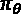
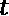
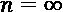
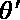
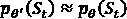
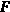
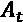
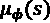

# 第七章：基于策略的方法

在上一章中我们讨论的基于价值的方法在许多具有离散控制空间的环境中取得了良好的效果。然而，许多应用，如机器人技术，需要连续控制。在本章中，我们将深入讨论另一类重要的算法——基于策略的方法，这些方法使我们能够解决连续控制问题。此外，这些方法直接优化策略网络，因此站在更强的理论基础上。最后，基于策略的方法能够学习真正的随机策略，这是部分可观察环境和游戏中所需的，而基于价值的方法无法学习。总的来说，基于策略的方法在许多方面补充了基于价值的方法。本章将深入探讨基于策略的方法，因此你将深入理解它们的工作原理。

本章我们将讨论以下主题：

+   为什么我们应该使用基于策略的方法？

+   基础策略梯度

+   Actor-critic 方法

+   信任区域方法

+   离策略方法

+   在《月球着陆》中的基于策略方法的比较

+   如何选择合适的算法

+   开源的基于策略方法的实现

让我们直接开始吧！

# 为什么我们应该使用基于策略的方法？

我们将从本章开始讨论为什么我们需要基于策略的方法，因为我们已经介绍了许多基于价值的方法。基于策略的方法 i) 可以说更有原则，因为它们直接基于策略参数进行优化，ii) 允许我们使用连续动作空间，iii) 能够学习真正的随机策略。现在让我们深入探讨这些要点的细节。

## 一种更有原则的方法

在 Q 学习中，策略是通过学习动作值间接获得的，然后用这些值来确定最佳动作。然而，我们真的需要知道一个动作的值吗？大多数时候我们不需要，因为它们只是帮助我们获得最优策略的代理。基于策略的方法通过学习函数逼近来直接给出策略，而不需要这样的中间步骤。这可以说是一种更有原则的方法，因为我们可以直接通过梯度步骤来优化策略，而不是代理的动作值表示。当存在许多具有相似值的动作时，后者尤其低效，可能这些动作对我们来说都没有吸引力，因为它们都是糟糕的动作。

## 使用连续动作空间的能力

我们在上一节提到的所有基于价值的方法都适用于离散动作空间。另一方面，有许多应用场景需要使用连续动作空间，例如机器人技术，其中动作的离散化会导致代理行为变差。那么，使用基于价值的方法与连续动作空间有什么问题呢？神经网络当然可以为连续动作学习价值表示——毕竟，状态并没有这样的限制。

然而，记住我们在计算目标值时是如何进行动作最大化的：

并在使用时获得在环境中执行的最佳动作。虽然我们可以通过以下方法使这些最大化在连续动作空间上有效，但实现起来并不简单：

1.  在最大化过程中，从连续动作空间中采样离散动作，并使用具有最大值的动作。或者，可以拟合一个函数来表示采样动作的值，并在该函数上进行最大化，这被称为**交叉熵方法（CEM）**。

1.  替代使用神经网络，采用一个如动作二次函数的函数逼近器，其最大值可以通过解析方法计算得出。一个例子是**归一化优势函数（NAF）**（*Gu et al, 2016*）。

1.  学习一个单独的函数逼近器来获得最大值，例如在**深度确定性策略梯度（DDPG）**算法中。

现在，CEM 和 NAF 的缺点是与直接表示连续动作策略的神经网络相比，它们的效果较差。另一方面，DDPG 仍然是一个有竞争力的替代方案，我们将在本章后续部分讨论。

信息

大多数基于策略的方法同时适用于离散和连续动作空间。

## 学习真正随机的随机策略的能力

在整个 Q 学习过程中，我们使用了软策略，如-贪婪策略，以便在训练期间让智能体探索环境。尽管这种方法在实践中效果相当不错，而且可以通过退火来使其更复杂，但它仍然不是一个学习到的参数。基于策略的方法可以学习随机策略，从而在训练过程中实现更有原则的探索。

也许更大的问题是，我们可能不仅仅为了训练需要学习随机策略，推理时也可能需要这样做。我们可能想要这样做的原因有两个：

+   在**部分可观察环境**（**POMDPs**）中，我们可能会遇到所谓的**同态状态**，这些状态虽然不同，但发出的观察是相同的，对于这些状态，最佳动作可能是不同的。考虑以下示例：


图 7.1 – 在部分可观察环境中的机器人

智能体只观察它所在状态的形态，但无法判断状态是什么。智能体随机初始化在除状态 3 以外的状态中，目标是通过左右移动，在最少步数内到达状态 3 中的硬币。当智能体观察到六边形时，最佳动作是随机的，因为一个确定性的策略（比如始终向左走）会让智能体在 1 和 2 之间（如果始终选择左走）或 4 和 5 之间卡住。

+   在对抗性智能体的游戏设置中，可能会出现唯一最优策略是随机策略的情况。经典的例子是石头剪子布，在这种情况下，最优策略是随机选择一个动作。任何其他策略都可能被环境中的对手利用。

基于价值的方法无法学习这种随机策略进行推断，而基于策略的方法则可以。

提示

如果环境是完全可观察的，并且不是游戏环境，那么总会存在一个确定性的最优策略（尽管可能有多个最优策略，而且其中一些可能是随机的）。在这种情况下，我们在推断过程中不需要随机策略。

通过这个介绍，让我们深入了解最流行的基于策略的方法。接下来，我们将概述基础的策略梯度方法，为我们稍后将要介绍的更复杂的算法做铺垫。

# 原始策略梯度方法

我们将从讨论最基础的算法——原始策略梯度方法开始。尽管这种算法在实际问题中很少有用，但理解它对于建立强大的直觉和理论基础至关重要，以便我们能够理解后面将要介绍的更复杂的算法。

## 策略梯度方法中的目标

在基于价值的方法中，我们专注于找到对动作值的良好估计，之后利用这些估计来获得策略。而策略梯度方法则直接专注于根据强化学习目标优化策略——尽管我们仍然会利用价值估计。如果你不记得这个目标是什么，它是期望的折扣回报：


这是比之前写法稍微严谨一些的目标表达方式。让我们来解读一下：

+   目标由  表示，它是当前策略的一个函数，。

+   策略本身由  参数化，我们正在尝试确定这个参数。

+   智能体观察到的轨迹  是随机的，其概率分布为 。正如你所期待的，它是策略的一个函数，因此也是  的函数。

+    是一个函数（对智能体未知），根据环境动态、给定的状态  和动作  给予奖励。

现在，我们有一个目标函数 ，我们希望最大化它，这个目标函数依赖于我们可以控制的参数 。一种自然的做法是朝上升方向采取梯度步伐：


其中  是某个步长。这就是策略梯度方法的主要思想，正如之前所说，它直接优化策略。

现在，百万美元的问题（好吧，也许没那么多）是如何求出梯度项。接下来我们来看看怎么解决。

## 计算梯度

理解如何从目标函数对策略参数的梯度，，中获得梯度对于理解不同的策略梯度方法变种至关重要。接下来让我们一步步推导在经典策略梯度中使用的公式。

### 目标函数的另一种表示方式

首先，让我们稍微不同地表示目标函数：


在这里，我们只是将轨迹和与之对应的奖励整体表示出来，而不是逐个状态-动作对表示，。然后，我们使用期望的定义将其写成一个积分（稍微有点滥用符号，因为我们用相同的来表示随机变量和它的一个实现，但从上下文中应该能明显看出来）。请记住，观察到特定轨迹的概率是以下形式：


这只是一个关于观察某个状态、在给定状态下采取特定动作并观察下一个状态的概率链条。这里，表示环境转移概率。

接下来，我们用这个来找到一个便捷的梯度公式。

### 得出便捷的梯度表达式

现在让我们回到目标函数。我们可以将其梯度表示为：


现在我们有了需要处理的项。我们将做一个简单的技巧来消除它：


这直接来自的定义。将其代回积分后，我们得到了目标函数梯度的期望值（小心—不是目标函数本身的期望值）：


 

现在，这将变成一个非常便捷的梯度公式。退后一步，我们现在得到了梯度的期望。当然，我们不能完全评估它，因为我们不知道，但我们可以从环境中获取样本。

提示

每当你在强化学习公式中看到期望值时，你可以合理地预期我们将使用来自环境的样本来进行评估。

这个公式构成了策略梯度方法的核心。接下来，让我们看看我们如何能更便捷地进行。

### 获得梯度

在开始从样本中估计梯度之前，我们需要消除另外一个项，因为我们并不真正知道它是什么。结果证明，我们可以通过为轨迹写出明确的概率乘积来解决这个问题：


当我们对  求梯度时，求和中的第一个和最后一个项会被去掉，因为它们不依赖于 。因此，我们可以用已知的内容来表示这个梯度，即我们拥有的策略 ：


我们可以通过以下方式从一批  轨迹中估计梯度：


该梯度旨在增加具有高总奖励的轨迹的可能性，并减少那些低总奖励的轨迹（或增加它们的可能性较少）。

这为我们提供了构建一个策略梯度算法的所有要素，即 REINFORCE，接下来我们将继续介绍。

## REINFORCE

REINFORCE 算法是最早的策略梯度方法之一，使用了我们上面介绍的内容。为了能够解决现实问题，我们需要在此基础上做很多改进。另一方面，理解 REINFORCE 对于在算法的背景下形式化这些想法是有用的。

在忽略折扣因子的有限时间问题中，REINFORCE 的工作原理如下：

1.  初始化一个策略 ：

    *当某些停止准则未满足时，执行：*

1.  使用  从环境中收集  轨迹 。

1.  计算

    。

1.  更新 ：

    *结束时*

REINFORCE 算法简单地建议使用当前的策略从环境中采样轨迹，然后使用这些样本估计梯度，并采取梯度步骤来更新策略参数。

信息

由于采样的轨迹用于获取当前策略参数的梯度估计，策略梯度方法是**基于策略的**。因此，我们不能使用在不同策略下获得的样本来改善现有策略，这与基于价值的方法不同。话虽如此，本章最后会有一节讨论几种基于策略外的方法。

REINFORCE 算法要求使用完整的轨迹进行网络更新，因此它是一种蒙特卡洛方法。

接下来，让我们讨论为什么我们需要对 REINFORCE 进行改进。

## REINFORCE 和所有策略梯度方法的问题

一般来说，策略梯度算法的最重要问题是  估计的高方差。如果你仔细思考，实际上有许多因素导致了这一点：

+   **环境中的随机性**可能导致即使使用相同策略，代理也会有许多不同的轨迹，这些轨迹的梯度可能会有很大差异。

+   **样本轨迹的长度**可能会有很大差异，导致对数和奖励项的总和差异很大。

+   **稀疏奖励的环境**可能尤其成问题（根据稀疏奖励的定义）。

+   **大小**  通常保持在几千左右，以使学习过程可行，但它可能不足以捕捉完整的轨迹分布。

因此，我们从样本中获得的梯度估计可能具有较高的方差，这可能会导致学习不稳定。减少这种方差是使学习可行的一个重要目标，我们为此采用了各种技巧。接下来，我们将介绍其中的第一个技巧。

### 用前往奖励替换奖励总和

让我们首先将梯度估计中的项重新排列如下：


这种原始形式意味着每个  项都会根据整个轨迹获得的总奖励进行加权。然而直觉告诉我们，我们应该只根据跟随该状态-动作对的奖励总和来加权对数项，因为它们无法影响之前发生的事情（因果关系）。更正式地，我们可以将梯度估计写为如下：


事实证明，这仍然能为我们提供一个无偏的梯度估计。随着我们减少奖励项的数量，方差也会减小，结果是乘以对数项的权重变得更小。 被称为时间  的前往奖励。请注意，这实际上是对  的估计。我们将在后续的演员-评论员算法中使用它。

这种对 REINFORCE 算法的改进是一种 *普通策略梯度* 方法。接下来，我们将展示如何使用 RLlib 的普通策略梯度实现。

## 使用 RLlib 的普通策略梯度

RLlib 允许我们使用普通策略梯度与多个回合工作者（演员）一起并行化样本收集。你会注意到，与基于值的方法不同，样本收集将与网络权重更新同步，因为普通策略梯度算法是一种基于策略的方法。

信息

由于策略梯度方法是基于当前策略的，我们需要确保用于更新神经网络参数（权重）的样本来自网络建议的现有策略。这就要求在所有回合工作者中同步使用的策略。

并行化的普通策略梯度的总体架构如下所示：


图 7.2 – 普通策略梯度架构

此时，值得注意的是 RLlib 实现将样本作为  从演员传输到学习者，并在学习者中将它们连接起来以恢复完整的轨迹。

在 RLlib 中使用原始策略梯度非常简单，且与我们在上一章中使用基于值的方法非常相似。让我们为 OpenAI Lunar Lander 环境（具有连续动作空间）训练一个模型。请跟着一起操作！

1.  首先，为了避免与 Gym 和 Box2D 包发生冲突，请使用以下命令安装 Gym：

    ```py
    pip install gym[box2d]==0.15.6
    ```

1.  然后开始实现 Python 代码。导入我们需要的包，用于参数解析的 `ray` 和 `tune`：

    ```py
    import argparse
    import pprint
    from ray import tune
    import ray
    ```

1.  导入原始 **策略** **梯度**（**PG**）训练器类以及相应的配置字典：

    ```py
    from ray.rllib.agents.pg.pg import (
        DEFAULT_CONFIG,
        PGTrainer as trainer)
    ```

    注意，当我们想使用不同的算法时，这部分会有所不同。

1.  创建一个主函数，该函数接收 Gym 环境名称作为参数：

    ```py
    if __name__ == "__main__":
        parser = argparse.ArgumentParser()
        parser.add_argument('--env',
                            help='Gym env name.')
        args = parser.parse_args()
    ```

1.  修改配置字典，设置我们希望用于训练的 GPU 数量以及我们希望用于样本收集和评估的 CPU 数量：

    ```py
        config = DEFAULT_CONFIG.copy()
        config_update = {
                     "env": args.env,
                     "num_gpus": 1,
                     "num_workers": 50,
                     "evaluation_num_workers": 10,
                     "evaluation_interval": 1
                }
        config.update(config_update)
        pp = pprint.PrettyPrinter(indent=4)
        pp.pprint(config)
    ```

    `print` 语句是让您查看如果需要更改配置时，还有哪些其他配置可供选择。例如，您可以修改学习率。现在，我们暂时不讨论这种超参数优化的细节。对于原始策略梯度，超参数的数量远少于更复杂算法所涉及的数量。最后一点说明：我们设置单独的评估工作者是为了使训练与我们后续介绍的离策略算法保持一致。通常，我们不需要这么做，因为在策略方法中，训练和评估过程中都遵循相同的策略。

1.  实现这一部分，初始化 `ray` 并为给定的迭代次数训练代理：

    ```py
        ray.init()
        tune.run(trainer,
                 stop={"timesteps_total": 2000000},
                 config=config
                 )
    ```

1.  将此代码保存在一个 Python 文件中，例如 `pg_agent.py`。然后，您可以按如下方式训练代理：

    ```py
    python pg_agent.py --env "LunarLanderContinuous-v2"
    ```

1.  在 TensorBoard 上监控训练过程：

    ```py
    tensorboard --logdir=~/ray_results
    ```

    训练进度将如下所示：


图 7.3 – Gym 中连续 Lunar Lander 环境下原始策略梯度代理的训练进度

这就是关于原始策略梯度方法的全部内容！对于一个没有许多改进的算法来说，表现还不错，我们将在接下来的章节中引入这些改进。欢迎尝试在其他 Gym 环境中使用此算法。提示：Pendulum 环境可能会让您头疼。

提示

在使用 Tune 训练模型时，为了保存最佳表现的模型，您需要编写一个简单的包装训练函数，详细描述可以参考这里：[`github.com/ray-project/ray/issues/7983`](https://github.com/ray-project/ray/issues/7983)。每当您观察到评估得分的提升时，就保存模型。

接下来，我们将介绍一种更强大的算法类别：演员-评论家方法。

# 演员-评论家方法

演员-评论家方法为解决策略梯度算法中的高方差问题提出了进一步的补救措施。就像 REINFORCE 和其他策略梯度方法一样，演员-评论家算法已经存在了几十年。然而，将这种方法与深度强化学习结合，使其能够解决更现实的 RL 问题。我们将在本节开始时介绍演员-评论家方法背后的思想，随后会更详细地定义它们。

## 进一步减少基于策略方法中的方差

记住，之前为了减少梯度估计中的方差，我们将轨迹中获得的奖励总和替换为奖励累积项。虽然这朝着正确的方向迈出了第一步，但通常还不够。我们现在将介绍两种方法，进一步减少这个方差。

### 估计奖励的累积值

在一条轨迹中获得的奖励累积项，，是现有策略下的动作值  的估计值 。

信息

注意我们在此使用的动作值估计值  和 Q-learning 方法估计的值  之间的区别。前者估计的是现有行为策略下的动作值 ，而后者估计的是目标策略下的动作值，即 。

现在，每条访问特定  对的轨迹可能会产生不同的奖励累积估计值。这会增加梯度估计中的方差。如果我们能够在每次策略更新周期中使用一个固定的估计值来表示给定的  呢？这将消除由那些噪声奖励累积（动作值）估计值引起的方差。但是我们如何获得这样的估计值呢？答案是训练一个神经网络来为我们生成该估计值。然后我们使用采样的奖励累积值来训练这个网络。当我们查询它以获取特定状态-动作对的估计时，它会给我们一个单一的数字，而不是多个不同的估计，这反过来减少了方差。

本质上，这种网络的作用是评估策略，这就是为什么我们称之为**评论家**，而策略网络则告诉智能体如何在环境中**行动**——因此得名**演员-评论家**。

信息

我们不会在每次策略更新后从头开始训练评论家网络。相反，像策略网络一样，我们使用新的采样数据进行梯度更新。因此，评论家会偏向于旧的策略。然而，我们愿意做出这个权衡，以减少方差。

最后但同样重要的是，我们使用基准线来减少方差，接下来我们将详细讲解这一点。

### 使用基准线

策略梯度方法背后的直觉是，我们希望调整策略的参数，使得产生高奖励轨迹的动作变得更加可能，而产生低奖励轨迹的动作变得不太可能：


这种公式的一个缺点是，梯度步长的方向和大小在很大程度上由轨迹中的总奖励！[](img/Formula_07_073.png)决定。考虑以下两个例子：

+   这是一个迷宫环境，智能体试图在最短时间内退出。奖励是直到到达出口所用的时间的负值。

+   相同的迷宫环境，但奖励为$1M，每经过一秒钟就会扣除一美元的惩罚，直到到达出口。

在数学上，这两者是相同的优化问题。现在，考虑某个策略！[](img/Formula_07_074.png)下，特定轨迹会导致什么样的梯度步长，假设奖励结构有所不同。第一种奖励结构会导致所有轨迹的负梯度更新（尽管有些比其他的更小），而不管策略的质量如何；而第二种奖励结构几乎肯定会导致正梯度更新。此外，在后者的情况下，经过的时间的影响可以忽略不计，因为固定奖励太大，这使得策略网络的学习变得非常困难。

理想情况下，我们希望衡量在特定轨迹中观察到的**相对**奖励表现，即相对于其他轨迹，某个动作序列所带来的奖励。这样，我们就可以朝着那些产生高奖励轨迹的参数方向进行正梯度更新，而对于其他轨迹则进行负梯度更新。为了衡量相对表现，一个简单的技巧是从奖励和中减去基准！[](img/Formula_07_075.png)：


最直观的基准选择是平均轨迹奖励，样本采样如下：


事实证明，减去这样的项仍然可以给出梯度的无偏估计，但方差较小，而且在某些情况下，差异可能非常显著。因此，使用基准几乎总是好的。

当结合使用奖励未来预估时，基准的自然选择是状态价值，这样就得到了以下的梯度估计：


其中！[](img/Formula_07_080.png)是**优势**项，表示智能体通过在状态！[](img/Formula_07_082.png)采取动作！[](img/Formula_07_081.png)相较于遵循现有策略，能够获得多少收益。

由评论员估计优势，直接或间接地，产生了**优势演员-评论员**算法，接下来我们将介绍这一部分。

## 优势演员-评论员 – A2C

到目前为止，我们所涵盖的内容几乎足以组成所谓的 A2C 算法。让我们在详细讨论完整的算法和 RLlib 实现之前，再详细讨论一下如何估计优势项。

### 如何估计优势

使用评论家估计优势有不同的方法。评论家网络可以执行以下操作：

+   直接估计 。

+   估计 ，从中我们可以恢复 。

请注意，这两种方法都涉及到维护一个网络，其输出依赖于状态和动作。然而，我们可以用一个更简单的结构。记住动作值的定义：


当我们采样单步转移时，我们已经观察到了奖励和下一个状态，并获得了一个元组 。因此，我们可以按如下方式获得估计值 ：


其中  是真实状态值  的某个估计值。

信息

注意符号中的细微差别。 和  表示真实值，而  和  是它们的估计值。 和  是随机变量，而  和  是它们的实现。

我们最终可以按如下方式估计优势：


这使我们能够使用一个仅仅估计状态值的神经网络来获得优势估计。为了训练这个网络，我们可以使用引导法来获得状态值的目标值。因此，使用采样元组 ， 的目标被计算为 （与  的估计相同，因为我们碰巧从现有的随机策略中获得了动作）。

在展示完整的 A2C 算法之前，让我们先来看一下实现架构。

### A2C 架构

A2C 提出不同代理之间同步采样，也就是说，所有的回合工作者在同一时间使用相同的策略网络来收集样本。然后，这些样本被传递给学习者，更新演员（策略网络）和评论家（价值网络）。从这个意义上讲，架构和普通的策略梯度基本相同，关于这一点我们上面已经给出了示意图。唯一的区别是，这次我们有一个评论家网络。那么，问题是如何将评论家网络引入其中。

演员和评论家的设计可以从完全隔离的神经网络（如下图左侧所示）到完全共享的设计（除了最后几层）不等：


图 7.4 – 独立与共享神经网络

独立设计的优势在于它通常更稳定。这是因为演员和评论员目标的方差和目标值的大小可能非常不同。如果它们共享神经网络，就需要仔细调整学习率等超参数，否则学习可能会不稳定。另一方面，使用共享架构的优势在于可以进行交叉学习，并利用共同的特征提取能力。当特征提取是训练的重要部分时（例如当观测值为图像时），这一点尤其有用。当然，介于两者之间的任何架构也是可能的。

最后，是时候介绍 A2C 算法了。

### A2C 算法

让我们将所有这些思想汇集在一起，形成 A2C 算法：

1.  初始化演员和评论员网络， 和 。

    *当某些停止准则未被满足时，执行以下操作：*

1.  使用  从（并行）环境收集一批  样本 。

1.  获取状态值目标 。

1.  使用梯度下降更新 ，以优化损失函数 ，例如平方损失。

1.  获取优势值估计：

    。

1.  计算

    。

1.  更新

    。

1.  将新的  广播到回滚工作者。

    *结束时*

请注意，我们也可以使用多步学习，而不是使用单步估计来计算优势估计和状态值目标。我们将在演员-评论员部分的最后呈现多步学习的广义版本。但现在，让我们来看一下如何使用 RLlib 的 A2C 算法。

### 使用 RLlib 的 A2C

在 RLlib 中使用 A2C 训练 RL 代理与我们为传统策略梯度所做的非常相似。因此，我们不会再次呈现完整的流程，而是简要描述它们之间的区别。主要的区别在于导入 A2C 类：

```py
from ray.rllib.agents.a3c.a2c import (
    A2C_DEFAULT_CONFIG as DEFAULT_CONFIG,
    A2Ctrainer as trainer)
```

然后，您可以像传统策略梯度代理一样训练该代理。我们不会在这里展示我们的训练结果，而是会在本章结束时对所有算法进行比较。

接下来，我们介绍另一种著名的演员-评论员算法：A3C。

## 异步优势演员评论员：A3C

A3C 在损失函数和如何使用评论员方面与 A2C 非常相似。事实上，A3C 是 A2C 的前身，尽管我们为了教学目的将它们按相反顺序呈现。A2C 和 A3C 之间的区别在于架构，以及梯度的计算和应用方式。接下来，让我们讨论 A3C 的架构。

### A3C 架构

A3C 架构与 A2C 的不同之处如下：

+   A3C 中的异步性是因为回滚工作者以自己的节奏从主策略网络拉取参数！[](img/Formula_07_117.png)，而不是与其他工作者同步。

+   结果是，工作者们可能会同时使用不同的策略。

+   为了避免在中央学习者计算梯度时使用可能已经在不同策略下获得的样本，梯度是由回滚工作者根据当时在工作者中使用的策略参数计算的。

+   因此，传递给学习者的不是样本，而是梯度。

+   这些梯度被应用到主策略网络，再次是异步地应用，随着它们到达。

下图描绘了 A3C 架构：


图 7.5 – A3C 架构

A3C 有两个重要的缺点：

+   更新主策略网络的梯度可能已经过时，并且是在与主策略网络中不同的！[](img/Formula_07_011.png)下获得的。这在理论上是有问题的，因为这些不是策略网络参数的真实梯度。

+   传递梯度，尤其是当神经网络很大时，梯度可能是一个巨大的数字向量，这可能会产生相对于仅传递样本的显著通信开销。

尽管存在这些缺点，A3C 的主要动机是获得不相关的样本和梯度更新，类似于经验回放在深度 Q 学习中的作用。另一方面，在许多实验中，人们发现 A2C 与 A3C 一样好，有时甚至更好。因此，A3C 并不常用。不过，我们展示它是为了让你理解这些算法是如何发展的，以及它们之间的关键区别。让我们也看看如何使用 RLlib 的 A3C 模块。

### 使用 RLlib 的 A3C

RLlib 的 A3C 算法可以通过导入相应的训练器类轻松访问：

```py
from ray.rllib.agents.a3c.a3c import (
    DEFAULT_CONFIG,
    A3CTrainer as trainer)
```

然后，您可以按照我们之前提供的代码训练一个代理。

最后，我们将在本节结束时讨论政策梯度方法背景下的多步 RL 的概括。

## 广义优势估计器

我们之前提到，您可以使用多步估计来计算优势函数。也就是说，不仅仅使用单步过渡，如下所示：


使用！[](img/Formula_05_231.png)-步过渡可能会提供更准确的优势函数估计：


当然，当  时，我们实际上回到了使用采样奖励的方法，这个方法我们曾经放弃过，以减少优势估计中的方差。另一方面，  可能会对现有的  估计引入过多的偏差。因此，超参数  是控制偏差-方差权衡的一种方式，同时估计优势。

自然的问题是，是否必须在优势估计中使用“单一的” 。例如，我们可以使用 、  和  计算优势估计，并取其平均值。那么，取所有可能的  的加权平均（凸组合）怎么样呢？这正是**广义优势估计器（GAE）**所做的。更具体地说，它以指数衰减的方式加权  项：


其中  和  是超参数。因此，GAE 为我们提供了另一个控制偏差-方差权衡的调节器。具体来说，  会导致 ，这具有较高的偏差；而  导致 ，这相当于使用采样奖励减去基线，这具有较高的偏差。任何值的  都是两者之间的折衷。

我们通过注意到，你可以通过配置标志`"use_gae"`和`"lambda"`来开启或关闭 RLlib 中的 GAE（广义优势估计）功能，这适用于其演员-评论家实现。

这就结束了我们对演员-评论家函数的讨论。接下来，我们将研究一种名为**信赖域方法**的最新方法，它已在 A2C 和 A3C 之上带来了显著的改进。

# 信赖域方法

在基于策略的方法中，一个重要的发展是信赖域方法的演变。特别是，TRPO 和 PPO 算法相较于 A2C 和 A3C 等算法带来了显著的改进。例如，著名的 Dota 2 AI 代理，达到了比赛中的专家级表现，就是使用 PPO 和 GAE 进行训练的。在这一部分，我们将深入探讨这些算法的细节，帮助你更好地理解它们是如何工作的。

信息

Sergey Levine 教授，TRPO 和 PPO 论文的共同作者，在他的在线讲座中详细讲解了这些方法背后的数学内容，讲解的深度超过了我们在本节中的内容。该讲座可通过[`youtu.be/uR1Ubd2hAlE`](https://youtu.be/uR1Ubd2hAlE)观看，我强烈推荐你观看它，以提升你对这些算法的理论理解。

不再赘述，让我们直接深入探讨！

## 策略梯度作为策略迭代

在前面的章节中，我们描述了大多数 RL 算法可以看作是一种策略迭代的形式，在策略评估和改进之间交替进行。你可以在相同的背景下理解策略梯度方法：

+   样本收集和优势估计：策略评估

+   梯度步长：策略改进

现在我们将使用策略迭代的观点来为即将到来的算法做铺垫。首先，让我们看看如何量化 RL 目标中的改进。

### 量化改进

一般来说，策略改进步骤的目标是尽可能改进现有策略。更正式地说，目标如下：


其中  是现有的策略。利用  的定义和一些代数运算，我们可以推导出以下结果：


让我们解读一下这个公式告诉我们的信息：

+   新策略  相对于现有策略  的改进可以通过现有策略下的优势函数来量化。

+   我们在这个计算中需要的期望运算是在新策略下的 。

请记住，完全计算这样的期望或优势函数几乎从来不可行。我们总是使用现有策略进行估计，在这个案例中是 ，并与环境进行交互。现在，前者是一个愉快的点，因为我们知道如何利用样本估计优势——上一节讲的正是这个内容。我们也知道，我们可以收集样本来估计期望，这就是我们在  中所做的。然而，问题在于，这个期望是相对于一个新策略  计算的。我们并不知道  是什么，事实上，这正是我们试图找出的问题。因此，我们不能使用  从环境中收集样本。从现在开始，我们将讨论如何绕过这个问题，以便我们能够逐步改进策略。

### 去除 

让我们展开这个期望，并用组成  的边际概率表示它：


它使用以下公式：


我们可以通过重要性采样去除内层期望中的 ：


现在，去除外层期望中的  是最具挑战性的部分。*关键思想是在优化过程中保持与现有策略“足够接近”，也就是说，* 。在这种情况下，可以证明 ，并且我们可以将前者替换为后者。

这里的一个关键问题是如何衡量策略的“接近度”，以确保前面的近似是有效的。由于其良好的数学性质，一个常用的度量方法是**库尔巴克-莱布勒**（**KL**）散度。

信息

如果你对 KL 散度不太熟悉，或者需要复习一下，可以参考这里的一个很好的解释：[`youtu.be/2PZxw4FzDU?t=226`](https://youtu.be/2PZxw4FzDU?t=226)。

利用策略之间接近的近似，并界定这种接近性，结果得到了以下优化函数：


其中  是某个界限。

接下来，让我们看看如何使用其他近似方法来进一步简化这个优化问题。

### 在优化中使用泰勒级数展开

现在我们有了一个函数 ，并且我们知道它是在接近另一个点  处被评估的，这应该让你想到使用泰勒级数展开。

信息

如果你需要复习泰勒级数，或者加深你的直觉，一个很好的资源是这个视频：[`youtu.be/3d6DsjIBzJ4`](https://youtu.be/3d6DsjIBzJ4)。我还推荐订阅该频道——3Blue1Brown 是一个非常好的视觉化数学概念资源。

在  处的一阶展开如下：


注意，第一项与  无关，因此我们可以在优化中去掉它。还要注意，梯度项是相对于  而不是  的，这应该会很有帮助。

我们的目标变成了以下内容：


最后，让我们看看如何计算梯度项。

### 计算 

首先，让我们看看  长什么样。记住，我们可以写出以下公式：


因为根据定义，。然后我们可以写成：


现在，记住我们在寻找的是 ，而不是 。将所有的  替换为 ，得到如下结果：


我们得到了一个看起来应该很熟悉的结果！ 正是进入优势行为者-批评方法中梯度估计  的内容。最大化策略更新间的政策改进目标使我们得到了一个与常规梯度上升方法相同的目标。当然，我们不能忘记约束条件。所以，我们要解决的优化问题变成了以下内容：


这是一个关键结果！让我们梳理一下目前为止得到的内容：

+   常规的演员-评论员方法与梯度上升法和信任域方法具有相同的目标，即朝着梯度的方向移动。

+   信任域方法的目标是通过限制 KL 散度，保持接近现有策略。

+   另一方面，常规的梯度上升法则是按照特定的步长朝着梯度的方向移动，就像在中那样。

+   因此，常规梯度上升法的目标是将保持得尽可能接近，而不是将保持得接近。

+   在中为所有维度使用相同的步长，就像常规梯度上升法那样，可能会导致收敛速度非常慢，或者根本不收敛，因为参数向量中的某些维度可能对策略（变化）有比其他维度更大的影响。

    提示

    信任域方法的关键目标是在更新策略到某个时，保持足够接近现有策略。这不同于简单地将保持得接近，这是常规梯度上升法的做法。

所以，我们知道和应该是接近的，但我们尚未讨论如何实现这一点。事实上，TRPO 和 PPO 这两种不同的算法将以不同的方式处理这一要求。接下来，我们将深入讨论 TRPO 算法的细节。

## TRPO – 信任域策略优化

TRPO 是一个重要的算法，它在 PPO 之前。让我们在本节中理解它如何处理我们上面提到的优化问题，以及 TRPO 解决方案的挑战是什么。

### 处理 KL 散度

TRPO 算法通过其二阶泰勒展开近似 KL 散度约束：


其中被称为费舍尔信息矩阵，其定义如下：


其中期望值需要从样本中估计。请注意，如果是一个维的向量，那么就会变成一个矩阵。

信息

费舍尔信息矩阵是一个重要的概念，你可能会想了解更多，维基百科页面是一个很好的起点：[`en.wikipedia.org/wiki/Fisher_information`](https://en.wikipedia.org/wiki/Fisher_information)。

这种近似方法导致了以下的梯度更新步骤（我们省略了推导过程）：


其中和是超参数，和。

如果这让你感到害怕，你并不孤单！TRPO 确实不是一个最容易实现的算法。接下来，让我们看看 TRPO 所涉及的挑战。

### TRPO 的挑战

下面是实现 TRPO 时遇到的一些挑战：

+   由于 KL 散度约束是通过其二阶泰勒展开式近似的，因此可能会出现违反约束的情况。

+   这时，项就发挥作用了：它会缩小梯度更新的幅度，直到满足约束条件。为此，在估算和之后，会进行一次线搜索：从开始，每次增加 1，直到更新的幅度足够小，以使约束条件得到满足。

+   请记住，是一个矩阵，这个矩阵的大小取决于策略网络的大小，因此可能会非常庞大，存储起来也非常昂贵。

+   由于是通过样本估算的，鉴于其大小，估算过程中可能会引入很多不准确性。

+   计算和存储是一个更加痛苦的步骤。

+   为了避免处理和的复杂性，作者使用了共轭梯度算法，这允许你在不构建整个矩阵和求逆的情况下进行梯度更新。

如你所见，实施 TRPO 可能会很复杂，我们省略了其实现的细节。这就是为什么沿着相同思路工作的更简单算法 PPO 更加流行和广泛使用的原因，接下来我们会介绍它。

## PPO – 近端策略优化

PPO 再次通过最大化策略改进目标来激励：


同时保持接近。PPO 有两个变种：PPO-Penalty 和 PPO-Clip。后者更简单，我们将在这里重点介绍它。

### PPO-clip 代理目标

相比 TRPO，通过剪辑目标函数来实现旧策略和新策略之间的接近度是一种更简单的方法，这样偏离现有策略就不会带来额外的好处。更正式地说，PPO-clip 在这里最大化代理目标：


其中定义如下：


这简单地说，如果优势是正的，那么最小化过程就会变为：


因此，这会限制比率能达到的最大值。这意味着，即使趋势是增加在状态中采取行动的可能性，因为它对应于一个正的优势，我们也会限制这种可能性偏离现有策略的程度。因此，进一步的偏离不会对优势产生贡献。

相反，如果优势是负的，表达式将变为：


类似地，它限制了在状态  下采取行动的可能性  的减少。这一比率受  的限制。

接下来，让我们列出完整的 PPO 算法。

### PPO 算法

PPO 算法的工作流程如下：

1.  初始化演员和评论员网络， 和 。

    *当某个停止准则未满足时，执行以下操作：*

1.  从（并行）环境中收集一批  样本 ，使用 。

1.  获取状态值目标 。

1.  使用梯度下降法更新 ，以最小化损失函数 ，例如平方损失。

1.  获取优势值估计

    。

1.  朝着最大化代理目标函数的方向执行梯度上升步骤 

    并更新 。虽然我们没有提供这种梯度更新的显式形式，但可以通过如 TensorFlow 等包轻松实现。

1.  将新的  广播到执行的工作者。

    *当满足某停止准则时结束*

最后，请注意，PPO 实现的架构与 A2C 非常相似，采用同步采样和策略更新的执行工作者。

### 使用 RLlib 的 PPO

非常类似于我们如何为早期算法导入代理训练器类，PPO 类可以通过以下方式导入：

```py
from ray.rllib.agents.ppo.ppo import (
    DEFAULT_CONFIG,
    PPOTrainer as trainer)
```

我们将在本章稍后展示训练结果。

这就是我们关于信任域方法讨论的结束。本章最后一类算法将介绍基于策略的离策略方法。

# 离策略方法

基于策略的方法的一个挑战是它们是基于策略的，这要求在每次策略更新后收集新的样本。如果从环境中收集样本的成本很高，那么基于策略的方法的训练可能会非常昂贵。另一方面，我们在上一章中讨论的基于价值的方法是离策略的，但它们仅适用于离散的动作空间。因此，需要一种适用于连续动作空间并且是离策略的方法。在本节中，我们将介绍这类算法。让我们从第一个算法开始：深度确定性策略梯度（DDPG）。

## DDPG – 深度确定性策略梯度

从某种意义上讲，DDPG 是深度 Q 学习对连续动作空间的扩展。记住，深度 Q 学习方法学习动作值的表示，。然后，在给定状态  中，最佳动作由  给出。现在，如果动作空间是连续的，学习动作值的表示就不是问题。然而，接着，执行最大操作来获取连续动作空间中的最佳动作会非常繁琐。DDPG 解决了这个问题。接下来我们来看它是如何处理的。

### DDPG 如何处理连续动作空间

DDPG 只是学习另一个近似，即 ，它估计在给定状态下的最佳动作。如果你想知道为什么这样可行，可以考虑以下的思考过程：

+   DDPG 假设连续动作空间对  可微。

+   暂时假设动作值  是已知的或已经学习过的。

+   然后，问题就简单变成了学习一个函数近似，即 ，其输入为 ，输出为 ，参数为 。优化过程的“奖励”则由  提供。

+   因此，我们可以使用梯度上升方法来优化 。

+   随着时间的推移，学习到的动作值希望能够收敛，并且成为策略函数训练中的不变目标。

    信息

    由于 DDPG 假设策略函数相对于动作是可微的，因此它只能用于连续的动作空间。

接下来，让我们深入了解一些关于 DDPG 算法的更多细节。

### DDPG 算法

由于 DDPG 是深度 Q 学习的扩展，并且学习了一个策略函数，因此我们不需要在这里写出完整的算法。此外，我们在上一章讨论的许多方法，如优先经验回放和多步学习，可以用来构成 DDPG 的变种。而原始的 DDPG 算法则更接近 DQN 算法，并使用以下内容：

+   一个**回放缓冲区**用于存储经验元组，并从中均匀地随机进行采样。

+   一个**目标** **网络**，它通过使用 Polyak 平均方法更新，如 ，而不是每隔  步骤与行为网络同步。

DDPG 然后用以下公式替换了 DQN 算法中的目标计算：


替换成这个：


DQN 和 DDPG 之间的另一个重要区别在于，DQN 在训练过程中使用-贪心策略。然而，DDPG 中的策略网络为给定状态提供一个确定性的动作，因此名字中有“deterministic”一词。为了在训练过程中进行探索，会向动作中添加一些噪声。更正式地说，动作的获取方式如下：


其中可以选择为白噪声（尽管原始实现使用了所谓的 OU 噪声）。在此操作中，和代表连续动作空间的边界。

这就是 DDPG 的核心内容。接下来，我们将探讨如何对其进行并行化。

### Ape-X DDPG

鉴于深度 Q 学习和 DDPG 之间的相似性，DDPG 的并行化可以通过 Ape-X 框架轻松实现。事实上，原始的 Ape-X 论文将 DDPG 与 DQN 一起展示在他们的实现中。它在某些基准测试中将常规 DDPG 的性能提高了几个数量级。作者还表明，随着回滚工人（演员）数量的增加，实际运行时间的性能持续提高。

### 使用 RLlib 的 DDPG 和 Ape-X DPG

可以按如下方式导入 DDPG 的训练器类和配置：

```py
from ray.rllib.agents.ddpg.ddpg import(
    DEFAULT_CONFIG,
    DDPGTrainer as trainer)
```

同样，对于 Ape-X DDPG，我们引入如下内容：

```py
from ray.rllib.agents.ddpg.apex import (
    APEX_DDPG_DEFAULT_CONFIG as DEFAULT_CONFIG,
    ApexDDPGTrainer as trainer) 
```

就是这样！其余部分与我们在章节开始时描述的训练流程几乎相同。现在，在深入讨论改进 DDPG 的算法之前，我们先来探讨一下 DDPG 算法的不足之处。

### DDPG 的缺点

尽管最初受到欢迎，但该算法仍然存在几个问题：

+   它对超参数的选择可能非常敏感。

+   它在学习行动价值时会遇到最大化偏差的问题。

+   行动价值估计中的峰值（可能是错误的）被策略网络利用，进而干扰学习过程。

接下来，我们将研究 TD3 算法，它引入了一系列改进来解决这些问题。

## TD3 – 双延迟深度确定性策略梯度

TD3 算法的关键在于，它解决了 DDPG 中的函数逼近误差。因此，它在 OpenAI 的连续控制基准测试中，大大超过了 DDPG、PPO、TRPO 和 SAC，达到了最大奖励。让我们看看 TD3 提出了什么改进。

### TD3 相较于 DDPG 的改进

TD3 相较于 DDPG 有三个主要改进：

+   它学习两个（双重）Q 网络，而不是一个，从而创建两个目标 Q 网络。然后，目标使用以下方式获得：


其中是给定状态的目标动作。这是一种双 Q 学习的形式，用于克服最大化偏差。

+   在训练过程中，策略和目标网络的更新速度比 Q 网络更新慢，推荐的周期是每进行两次 Q 网络更新后进行一次策略更新，因此算法名称中有“延迟”一词。

+   目标动作，，是在策略网络的输出中添加一些噪声后得到的：


其中  是一些白噪声。请注意，这与用于环境探索的噪声不同。此噪声的作用是作为正则化项，防止策略网络利用 Q 网络错误估算为非常高且在其区域内不平滑的某些动作值。

信息

就像 DDPG 一样，TD3 只能用于连续动作空间。

接下来，让我们看看如何使用 RLlib 的 TD3 实现来训练一个 RL 代理。

### 使用 RLlib 的 TD3

可以按如下方式导入 TD3 训练器类：

```py
from ray.rllib.agents.ddpg.td3 import (
    TD3_DEFAULT_CONFIG as DEFAULT_CONFIG,
    TD3Trainer as trainer)
```

另一方面，如果你查看 RLlib 中 `td3.py` 模块的代码，你会发现它只是修改了默认的 DDPG 配置，并在后台使用了 DDPG 训练器类。这意味着 TD3 的改进可以在 DDPG 训练器类中选择性地使用，你可以修改它们来获得 Ape-X TD3 变体。

这就是 TD3 的全部内容。接下来，我们将讨论 SAC。

## SAC – Soft actor-critic（软演员-评论家）

SAC 是另一个流行的算法，它对 TD3 进行了进一步的改进。它使用熵作为奖励的一部分来鼓励探索：


其中  是熵项， 是相应的权重。

提示

SAC 可以同时用于连续和离散动作空间。

要导入 SAC 训练器，可以使用以下代码：

```py
from ray.rllib.agents.sac.sac import (
    DEFAULT_CONFIG,
    SACTrainer as trainer)
```

我们将讨论的最后一个算法是 IMPALA。

## IMPALA – 基于重要性加权的演员-学习者架构

IMPALA 是一种基于策略梯度的算法，而 DDPG、TD3 和 SAC 本质上是基于值的方法。因此，IMPALA 并不完全是一个离策略方法。实际上，它类似于 A3C，但有以下几个关键区别：

+   与 A3C 不同，它发送采样经验（异步）给学习者，而不是参数梯度。这显著减少了通信开销。

+   当一个样本轨迹到达时，它很可能是通过一个比学习者当前策略更新滞后几个步骤的策略获得的。IMPALA 使用截断的重要性采样来考虑策略滞后，同时计算价值函数目标。

+   IMPALA 允许多个同步的工作学习者从样本中计算梯度。

可以按如下方式将 IMPALA 训练器类导入到 RLlib 中：

```py
from ray.rllib.agents.impala.impala import (
    DEFAULT_CONFIG,
    ImpalaTrainer as trainer)
```

这就是我们关于算法讨论的总结。接下来是有趣的部分！让我们在 OpenAI 的连续控制 Lunar Lander 环境中比较它们的表现！

# Lunar Lander 中基于策略的方法对比

下面是不同基于策略的算法在单次训练过程中在月球着陆器环境中的评估奖励表现进展对比：


图 7.6 – 各种基于策略的算法在月球着陆器训练中的表现

为了让你更清楚每次训练耗时以及训练结束时的表现，以下是前述图表的 TensorBoard 工具提示：


图 7.7 – 实际时间和训练结束时的性能对比

在进一步讨论之前，让我们先做以下免责声明：这里的对比不应被视为不同算法的基准测试，原因有多方面：

+   我们没有进行任何超参数调整，

+   这些图表来自每个算法的单次训练实验。训练一个强化学习（RL）智能体是一个高度随机的过程，公平的比较应包括至少 5-10 次训练实验的平均结果。

+   我们使用的是 RLlib 中这些算法的实现，这些实现可能比其他开源实现效率更高或更低。

在这个免责声明之后，让我们讨论一下这些结果中的观察：

+   PPO 在训练结束时获得了最高奖励。

+   传统的策略梯度算法在达到“合理”奖励时是最快的（从实际时间角度来看）。

+   TD3 和 DDPG 在实际时间方面非常慢，尽管它们的奖励高于 A2C 和 IMPALA。

+   相比其他算法，TD3 的训练图表明显更不稳定。

+   在某些时刻，TD3 在相同样本数量下的奖励超过了 PPO。

+   IMPALA 在达到（并超越）2M 样本时非常迅速。

你可以扩展这个列表，但这里的核心思想是，不同算法可能有不同的优缺点。接下来，我们来讨论你在为应用选择算法时应该考虑哪些标准。

# 如何选择合适的算法

和所有机器学习领域一样，针对不同应用的算法选择没有“银弹”。你应该考虑多个标准，在某些情况下，某些标准可能比其他标准更为重要。

选择算法时，以下是你应该关注的不同算法表现维度：

+   **最高奖励**：当你不受计算和时间资源限制，且目标仅仅是为你的应用训练出最优秀的智能体时，最高奖励是你应关注的标准。在这种情况下，PPO 和 SAC 是很有前景的选择。

+   **样本效率**：如果您的采样过程耗费时间或成本高昂，那么样本效率（使用较少样本实现更高奖励）就变得很重要。在这种情况下，您应该考虑离策略算法，因为它们可以重用过去的经验进行训练，而在策略方法中，样本的使用通常是极其浪费的。在这种情况下，SAC 是一个很好的起点。

+   **墙钟效率**：如果您的模拟器速度快和/或您有资源进行大规模并行化，那么 PPO、IMPALA 和 Ape-X SAC 通常是一个不错的选择。

+   **稳定性**：在不运行多次试验的情况下获得良好的奖励，并且在训练过程中稳步提高，也是很重要的。离策略算法可能难以稳定。在这方面，PPO 通常是一个不错的选择。

+   **泛化能力**：如果一个算法需要为每个训练环境进行广泛调整，这可能会耗费大量时间和资源。由于其在奖励中使用熵，SAC 被认为对超参数选择不太敏感。

+   **简单性**：拥有一个易于实现的算法对于避免错误和确保可维护性至关重要。这就是为什么 TRPO 被 PPO 所取代而被放弃的原因。

这就是算法选择标准讨论的结束。最后，让我们进入一些资源，您可以找到这些算法易于理解的实现。

# 政策梯度方法的开源实现

在本章中，我们涵盖了许多算法。由于空间限制，我们无法显式实现所有这些算法。相反，我们依赖 RLlib 的实现来训练我们的用例代理。RLlib 是开源的，因此您可以访问[`github.com/ray-project/ray/tree/ray-0.8.5/rllib`](https://github.com/ray-project/ray/tree/ray-0.8.5/rllib)，并深入研究这些算法的实现。

话虽如此，RLlib 的实现是为生产系统而构建的，因此涉及许多其他关于错误处理和预处理的实现。此外，还有很多代码复用，导致了具有多个类继承的实现。OpenAI 的 Spinning Up 库提供了一个更简单的实现集合，可访问[`github.com/openai/spinningup`](https://github.com/openai/spinningup)，我强烈推荐你进入该库，并深入研究我们在本章讨论的算法的实现细节。

信息

OpenAI 的 Spinning Up 也是一个很好的资源，可以查看强化学习主题和算法的概述，可访问[`spinningup.openai.com`](https://spinningup.openai.com)。

就是这样！我们已经走过了很长的路，并深入讨论了基于策略的方法。祝贺您达到了这个重要的里程碑！

# 摘要

在本章中，我们介绍了一类重要的算法，称为基于策略的方法。这些方法直接优化策略网络，与我们在上一章介绍的基于价值的方法不同。因此，它们具有更强的理论基础。此外，它们可以用于连续的动作空间。通过这一部分，我们详细介绍了无模型方法。在下一章中，我们将深入探讨基于模型的方法，旨在学习智能体所处环境的动态。

# 参考文献

+   *强化学习算法的种类*：[`spinningup.openai.com/en/latest/spinningup/rl_intro2.html`](https://spinningup.openai.com/en/latest/spinningup/rl_intro2.html)

+   *带函数逼近的强化学习策略梯度方法*，理查德·S·萨顿，戴维·麦卡莱斯特，萨廷德·辛格，伊沙伊·曼索尔：[`papers.nips.cc/paper/1713-policy-gradient-methods-for-reinforcement-learning-with-function-approximation.pdf`](https://papers.nips.cc/paper/1713-policy-gradient-methods-for-reinforcement-learning-with-function-approximation.pdf)

+   *连接主义强化学习的简单统计梯度跟踪算法*，罗纳德·J·威廉姆斯：[`link.springer.com/content/pdf/10.1007/BF00992696.pdf`](https://link.springer.com/content/pdf/10.1007/BF00992696.pdf)

+   *Dota 2 与大规模深度强化学习*，克里斯托弗·伯纳，格雷格·布洛克曼等：[`arxiv.org/pdf/1912.06680.pdf`](https://arxiv.org/pdf/1912.06680.pdf)
