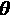
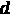
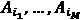
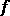
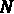
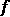
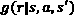
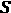
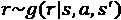
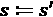

# 第八章：基于模型的方法

到目前为止，我们所讨论的所有深度**强化学习**（**RL**）算法都是**无模型**的，这意味着它们并不假设任何关于环境过渡动态的知识，而是从采样的经验中学习。事实上，这种做法是故意有意偏离了动态规划方法，从而避免了需要环境模型的要求。在本章中，我们稍微将方向调整，讨论一类依赖于模型的方法，称为**基于模型的方法**。这些方法在某些问题中能显著提高样本效率，效率提升幅度可能达到几个数量级，这使得它成为一种非常有吸引力的方法，特别是在像机器人技术这样收集经验代价高昂的情况下。话虽如此，我们仍然不会假设我们有一个现成的模型，而是会讨论如何学习一个模型。一旦我们拥有了模型，它可以用于决策时的规划，并改善无模型方法的性能。

本章重要内容包括以下主题：

+   介绍基于模型的方法

+   通过模型进行规划

+   学习世界模型

+   统一基于模型和无模型的方法

让我们开始吧。

# 技术要求

本章的代码可以在本书的 GitHub 仓库找到，网址为[`github.com/PacktPublishing/Mastering-Reinforcement-Learning-with-Python`](https://github.com/PacktPublishing/Mastering-Reinforcement-Learning-with-Python)。

# 介绍基于模型的方法

想象一下，你正驾驶汽车在一条没有分隔带的道路上行驶，突然，另一辆汽车在与你对向而来的车道上快速行驶，并且它正在超车一辆卡车。你的大脑可能会自动模拟不同的情境，预测接下来可能发生的情景：

+   另一辆车可能会立刻回到它的车道上，或者加速尽快超车。

+   另一种情境可能是汽车朝着右侧行驶，但这种情况不太可能发生（在右侧通行的交通流中）。

驾驶员（可能是你）接着评估每种情景的可能性和风险，以及他们可能采取的行动，并做出决定，安全地继续行驶。

在一个不太夸张的例子中，考虑一场象棋比赛。在做出一步棋之前，棋手会在脑海中“模拟”多种场景，并评估几步之后可能的结果。事实上，能够准确评估更多的可能场景，会增加赢得比赛的机会。

在这两个例子中，决策过程涉及到想象多个“虚拟”的环境演化，评估不同的备选方案，并根据情况采取适当的行动。但我们是怎么做到这一点的呢？我们之所以能够这样做，是因为我们对生活的世界有一个心理模型。在驾驶汽车的例子中，驾驶员会对可能的交通行为、其他驾驶员的动作以及物理规律有一定了解。在国际象棋的例子中，玩家知道游戏的规则，哪些走法是好的，并且可能知道某个玩家可能使用的策略。这种“基于模型”的思维几乎是我们规划行动的自然方式，不同于不利用关于世界运作的先验知识的无模型方法。

基于模型的方法由于利用了更多关于环境的信息和结构，可能比无模型方法更具样本效率。这在样本采集代价昂贵的应用场景中尤为有用，比如机器人技术。因此，这是我们在本章讨论的一个重要话题。我们将重点讨论基于模型方法的两个主要方面：

+   如何使用环境模型（或我们所称的*世界模型*）来实现最优的行动规划

+   当没有模型时，如何学习这样一个模型

在下一部分，我们从前者开始，介绍在有模型时进行规划的一些方法。一旦我们确信学习环境模型是值得的，并且确实可以通过最优规划方法获得良好的行动，我们将讨论如何学习这些模型。

# 通过模型进行规划

在这一部分，我们首先定义通过模型进行规划在最优控制中的含义。然后，我们将介绍几种规划方法，包括交叉熵法和协方差矩阵自适应进化策略。你还将看到如何使用 Ray 库将这些方法并行化。现在，让我们开始定义问题。

## 定义最优控制问题

在强化学习（RL）或一般的控制问题中，我们关心的是智能体所采取的行动，因为我们希望完成某个任务。我们将这个任务表达为一个数学目标，以便我们可以使用数学工具来找到实现任务的行动——在强化学习中，这就是预期的累积折扣奖励总和。你当然已经了解了这一点，因为这正是我们一直在做的事情，但现在是时候重申一下了：我们实际上是在解决一个优化问题。

现在，假设我们试图为一个有时间步的任务找出最佳行动。作为例子，你可以想象 Atari 游戏、Cartpole、自动驾驶汽车、网格世界中的机器人等等。我们可以如下定义优化问题（使用*Levine, 2019*中的符号）：


这所有的意思是如何找到一系列动作，其中  对应于时间步长  处的动作，能够在  步内最大化得分。这里需要注意的是， 可能是多维的（例如，），如果在每个步骤中有多个动作（比如汽车中的转向和加速/刹车决策）。我们还可以用  表示一系列  个动作。因此，我们关注的是找到一个 ，它能够最大化 。

在这一点上，我们可以选择不同的优化和控制方式。接下来我们将详细探讨这些。

### 基于导数和无导数优化

当我们遇到一个优化问题时，解决它的自然反应可能是“我们取一阶导数，设其为零”，以此类推。但不要忘了，大多数时候，我们并没有像  这样的封闭式数学表达式可以求导。以玩 Atari 游戏为例。我们可以通过玩游戏来评估在给定的  下， 的值，但我们无法计算任何导数。这一点对于我们能采用的优化方法至关重要，特别需要注意以下几种类型：

+   **基于导数的方法**需要对目标函数进行求导，以便优化它。

+   **无导数方法**依赖于系统地反复评估目标函数，以寻找最佳输入。

因此，我们将在这里依赖后者。

这部分讲的是我们将使用哪种优化过程，最终它给我们带来一些 。另一个重要的设计选择是如何执行它，接下来我们将讨论这个问题。

### 开环、闭环和模型预测控制

让我们从一个例子开始解释不同类型的控制系统：假设我们有一个代理，它是一个前锋位置的足球运动员。为了简单起见，我们假设该代理的唯一目标是在接到球时进球。在拥有球的第一时刻，代理可以执行以下任意操作：

+   想出一个计划来得分，闭上眼睛和耳朵（也就是任何感知手段），然后执行计划直到结束（无论是得分还是失误）。

+   或者，代理可以保持感知手段活跃，并根据环境发生的最新信息修改计划。

前者是**开环控制**的一个例子，在采取下一动作时不会使用来自环境的反馈，而后者则是**闭环控制**的例子，它使用环境反馈。一般来说，在强化学习中，我们使用的是闭环控制。

提示

使用闭环控制的优点是能够在规划时考虑最新的信息。这在环境和/或控制器动态不确定的情况下尤其有优势，因为在这种情况下，完美的预测是不可能的。

现在，智能体可以以不同的方式使用反馈，即在时间点  从环境中获得的最新观察结果。具体来说，智能体可以执行以下操作：

+   从给定  的策略  中选择一个动作，即 。

+   解决优化问题，找到后续  时间步的 。

后者被称为**模型预测控制**（**MPC**）。重申一下，在 MPC 中，智能体重复执行以下循环：

1.  为接下来的  步骤制定一个最佳控制计划。

1.  执行第一步的计划。

1.  继续执行下一步。

请注意，到目前为止我们提出的优化问题尚未给出一个策略 。相反，我们将使用无导数优化方法来搜索一个好的 。

接下来，让我们讨论一种非常简单的无导数方法：随机射击。

## 随机射击

随机射击程序仅涉及以下步骤：

1.  生成一堆候选动作序列，均匀地随机生成，例如生成  个。

1.  评估每一个 。

1.  采取行动 ，它给出最佳的 ，即 。

如你所见，这不是一个特别复杂的优化过程。然而，它可以作为一个基准，供我们与更复杂的方法进行比较。

提示

基于随机搜索的方法可能比你想象的更有效。*Mania 等人*在他们的论文《*简单随机搜索提供了一种竞争性的 RL 方法*》中概述了这种方法，用于优化策略参数，正如其名字所示，产生了一些令人惊讶的好结果（*Mania 等人, 2018*）。

为了使我们的讨论更加具体，让我们引入一个简单的例子。在此之前，我们需要设置将在本章中使用的 Python 虚拟环境。

### 设置 Python 虚拟环境

你可以在虚拟环境中安装我们需要的包，方法如下：

```py
$ virtualenv mbenv
$ source mbenv/bin/activate
$ pip install ray[rllib]==1.0.1
$ pip install tensorflow==2.3.1
$ pip install cma==3.0.3
$ pip install gym[box2d]
```

现在，我们可以继续我们的示例了。

### 简单的加农炮射击游戏

我们中的一些人足够老，曾经在 Windows 3.1 或 95 上玩过经典的*Bang! Bang!*游戏。游戏的玩法非常简单，就是通过调整火炮弹的射击角度和速度来击中对手。在这里，我们将玩一个更简单的游戏：我们有一门火炮，可以调整射击角度（）。我们的目标是最大化距离，即弹丸在平面上行进的距离，初速度为固定值。如*图 8.1*所示：


](img/B14160_08_001.jpg)

图 8.1 – 通过调整来最大化的简单火炮射击游戏

现在，如果你记得一些高中数学，你会意识到这实际上并不是一个游戏：最大距离可以通过设置来实现。好吧，假设我们不知道这一点，并用这个例子来说明我们目前已经介绍的概念：

+   动作是，即火炮的角度，这是一个标量。

+   这是一个单步问题，也就是说，我们只采取一个动作，游戏就结束了。因此，和。

现在我们来编写代码：

1.  我们可以访问环境，它将*评估我们考虑的动作，在我们实际执行之前*。我们并不假设知道环境内所有数学方程式和动态的定义。换句话说，我们可以调用`black_box_projectile`函数来获取，对于我们选择的，以及固定的初速度和重力：

    ```py
    from math import sin, pi
    def black_box_projectile(theta, v0=10, g=9.81):
        assert theta >= 0
        assert theta <= 90
        return (v0 ** 2) * sin(2 * pi * theta / 180) / g
    ```

1.  对于随机射击过程，我们只需在和之间均匀随机地生成个动作，像这样：

    ```py
    import random
    def random_shooting(n, min_a=0, max_a=90):
        return [random.uniform(min_a, max_a) for i in range(n)]
    ```

1.  我们还需要一个函数来评估所有候选动作并选择最好的一个。为此，我们将定义一个更通用的函数，稍后会用到。它将选择最好的 **精英**，即最佳动作：

    ```py
    import numpy as np
    def pick_elites(actions, M_elites):
        actions = np.array(actions)
        assert M_elites <= len(actions)
        assert M_elites > 0
        results = np.array([black_box_projectile(a)
                            for a in actions])
        sorted_ix = np.argsort(results)[-M_elites:][::-1]
        return actions[sorted_ix], results[sorted_ix]
    ```

1.  寻找最佳动作的循环就很简单：

    ```py
    n = 20
    actions_to_try = random_shooting(n)
    best_action, best_result = pick_elites(actions_to_try, 1)
    ```

就是这样。要执行的动作就是`best_action[0]`。重申一遍，到目前为止，我们并没有做任何特别有趣的事。这里只是用来说明这些概念，并为即将到来的更有趣的方法做准备。

## 交叉熵方法

在火炮射击的例子中，我们评估了在寻找最佳动作过程中生成的一些动作，这个最佳动作恰好是。正如你可以想象的那样，我们可以在搜索中更加智能。例如，如果我们有预算生成并评估个动作，为什么要盲目地用均匀生成的动作呢？相反，我们可以采取以下方法：

1.  首先生成一些动作（这可以通过均匀随机的方式完成）。

1.  查看动作空间中哪个区域似乎给出了更好的结果（在炮弹射击示例中，这个区域大约在  附近）。

1.  在动作空间的该部分生成更多动作。

我们可以重复这个过程来引导我们的搜索，这将更有效地使用我们的搜索预算。事实上，这正是**交叉熵方法**（**CEM**）所建议的！

我们之前对 CEM 的描述有些模糊。更正式的描述如下：

1.  初始化一个概率分布 ，参数为 。

1.  从 ，  中生成  个样本（解，动作）。

1.  按照奖励从高到低对解进行排序，索引为 ， 。

1.  选择最佳的  解，精英， ，并将分布  拟合到精英集合中。

1.  返回到*第 2 步*并重复，直到满足停止准则。

该算法特别通过将概率分布拟合到当前迭代中最佳的动作，来识别最佳的动作区域，并从中采样下一代动作。由于这种进化性质，它被视为**进化策略**（**ES**）。

提示

当搜索的维度，即动作维度乘以 ，相对较小时（比如小于 50），CEM 可能会显示出良好的前景。还要注意，CEM 在过程的任何部分都不使用实际的奖励，这使我们不用担心奖励的尺度问题。

接下来，让我们实现 CEM 在炮弹射击示例中的应用。

### 交叉熵方法的简单实现

我们可以通过对随机射击方法进行一些轻微修改来实现 CEM。在我们这里的简单实现中，我们执行以下操作：

+   从一个均匀生成的动作集合开始。

+   将一个正态分布拟合到精英集合中，以生成下一组样本。

+   使用固定的迭代次数来停止过程。

这可以通过以下方式实现：

```py
from scipy.stats import norm
N, M_elites, iterations = 5, 2, 3
actions_to_try = random_shooting(N)
elite_acts, _ = pick_elites(actions_to_try, M_elites)
for r in range(iterations - 1):
    mu, std = norm.fit(elite_acts)
    actions_to_try = np.clip(norm.rvs(mu, std, N), 0, 90)
    elite_acts, elite_results = pick_elites(actions_to_try, 
                                                    M_elites)            
best_action, _ = norm.fit(elite_acts)
```

如果你添加一些`print`语句来查看执行该代码后的结果，它将看起来像下面这样：

```py
--iteration: 1
actions_to_try: [29.97 3.56 57.8 5.83 74.15]
elites: [57.8  29.97]
--iteration: 2
fitted normal mu: 43.89, std: 13.92
actions_to_try: [26.03 52.85 36.69 54.67 25.06]
elites: [52.85 36.69]
--iteration: 3
fitted normal mu: 44.77, std: 8.08
actions_to_try: [46.48 34.31 56.56 45.33 48.31]
elites: [45.33 46.48]
The best action: 45.91
```

你可能会想，为什么我们需要拟合分布，而不是选择我们已经识别出的最佳动作。嗯，对于环境是确定性的炮弹射击示例，这样做没有太大意义。然而，当环境中存在噪声/随机性时，选择我们遇到的最佳动作意味着过拟合噪声。相反，我们将分布拟合到一组精英动作上，以克服这个问题。你可以参考 GitHub 仓库中的 `Chapter08/rs_cem_comparison.py` 来查看完整的代码。

CEM 的评估（和动作生成）步骤可以并行化，这将减少做出决策所需的墙钟时间。接下来我们将实现这一点，并在一个更复杂的示例中使用 CEM。

### 交叉熵方法的并行化实现

在本节中，我们使用 CEM 来解决 OpenAI Gym 的 Cartpole-v0 环境。这个示例与大炮射击的不同之处如下：

+   动作空间是二元的，对应于左和右。因此，我们将使用多变量伯努利分布作为概率分布。

+   最大问题时间范围为 200 步。然而，我们将使用 MPC 在每一步中规划 10 步前瞻，并执行计划中的第一步动作。

+   我们使用 Ray 库进行并行化。

现在，让我们来看看实现中的一些关键组件。完整的代码可以在 GitHub 仓库中找到。

Chapter08/cem.py

让我们从描述代码开始，首先是从多变量伯努利分布中采样动作序列（我们使用 NumPy 的`binomial`函数），，并在规划范围内执行该序列以估计奖励：

```py
@ray.remote
def rollout(env, dist, args):
    if dist == "Bernoulli":
        actions = np.random.binomial(**args)
    else:
        raise ValueError("Unknown distribution")
    sampled_reward = 0
    for a in actions:
        obs, reward, done, info = env.step(a)
        sampled_reward += reward
        if done:
            break
    return actions, sampled_reward
```

`ray.remote`装饰器将允许我们轻松地并行启动这些工作者。

CEM 以我们创建的`CEM`类的以下方法运行：

1.  我们初始化伯努利分布的参数，设置时间范围为`look_ahead`步，初始值为`0.5`。我们还根据总样本的指定比例确定精英样本的数量：

    ```py
        def cross_ent_optimizer(self):
            n_elites = int(np.ceil(self.num_parallel * \
                                       self.elite_frac))
            if self.dist == "Bernoulli":
                p = [0.5] * self.look_ahead
    ```

1.  对于固定次数的迭代，我们在并行的展开工作中生成和评估动作。注意我们是如何将现有环境复制到展开工作者中，以便从该点开始采样。我们将分布重新拟合到精英集合中：

    ```py
                for i in range(self.opt_iters):
                    futures = []
                    for j in range(self.num_parallel):
                        args = {"n": 1, "p": p, 
                                "size": self.look_ahead}
                        fid = \
                           rollout.remote(copy.deepcopy(self.env), 
                                                  self.dist, args)
                        futures.append(fid)
                    results = [tuple(ray.get(id)) 
                                           for id in futures]
                    sampled_rewards = [r for _, r in results]
                    elite_ix = \
                         np.argsort(sampled_rewards)[-n_elites:]
                    elite_actions = np.array([a for a, 
                                        _ in results])[elite_ix]
                    p = np.mean(elite_actions, axis=0)
    ```

1.  我们基于最新的分布参数来最终确定计划：

    ```py
                actions = np.random.binomial(n=1, p=p,
                                             size=self.look_ahead)
    ```

执行此代码将解决环境问题，你将看到摆杆在最大时间范围内保持存活！

这就是如何使用 Ray 实现并行化 CEM 的方式。到目前为止，一切顺利！接下来，我们将更进一步，使用 CEM 的高级版本。

## 协方差矩阵自适应进化策略

**协方差矩阵自适应进化策略**（**CMA-ES**）是最先进的黑盒优化方法之一。其工作原理与 CEM 类似。另一方面，CEM 在整个搜索过程中使用固定的方差，而 CMA-ES 则动态地调整协方差矩阵。

我们再次使用 Ray 来并行化 CMA-ES 的搜索。但这次，我们将搜索的内部动态交给一个名为`pycma`的 Python 库来处理，这个库是由 CMA-ES 算法的创造者 Nikolaus Hansen 开发和维护的。当你为本章创建虚拟环境时，已经安装了这个包。

信息

`pycma`库的文档和详细信息可以在[`github.com/CMA-ES/pycma`](https://github.com/CMA-ES/pycma)中找到。

CMA-ES 与 CEM 实现的主要区别在于它使用 CMA 库来优化行动：

```py
    def cma_es_optimizer(self):
        es = cma.CMAEvolutionStrategy([0] \
                                      * self.n_tot_actions, 1)
        while (not es.stop()) and \
                es.result.iterations <= self.opt_iter:
            X = es.ask()  # get list of new solutions
            futures = [
                rollout.remote(self.env, x,
                               self.n_actions, 
                               self.look_ahead)
                for x in X
            ]
            costs = [-ray.get(id) for id in futures]
            es.tell(X, costs)  # feed values
            es.disp()
        actions = [
            es.result.xbest[i * self.n_actions : \
                            (i + 1) * self.n_actions]
            for i in range(self.look_ahead)
        ]
        return actions
```

你可以在我们的 GitHub 仓库中的`Chapter08/cma_es.py`找到完整的代码。它解决了双足行走器环境，输出将会是 CMA 库中的如下结果：

```py
(7_w,15)-aCMA-ES (mu_w=4.5,w_1=34%) in dimension 40 (seed=836442, Mon Nov 30 05:46:55 2020)
Iterat #Fevals   function value  axis ratio  sigma  min&max std  t[m:s]
    1     15 7.467667956594279e-01 1.0e+00 9.44e-01  9e-01  9e-01 0:00.0
    2     30 8.050216186274498e-01 1.1e+00 9.22e-01  9e-01  9e-01 0:00.1
    3     45 7.222612141709712e-01 1.1e+00 9.02e-01  9e-01  9e-01 0:00.1
   71   1065 9.341667377266198e-01 1.8e+00 9.23e-01  9e-01  1e+00 0:03.1
  100   1500 8.486571756945928e-01 1.8e+00 7.04e-01  7e-01  8e-01 0:04.3
Episode 0, reward: -121.5869865603307
```

你应该能看到你的双足行走器走出 50 到 100 步！不错！

接下来，让我们讨论另一类重要的搜索方法，称为**蒙特卡罗树搜索**（**MCTS**）。

## 蒙特卡罗树搜索

一种自然的规划未来行动的方式是，首先考虑第一步，然后将第二个决策基于第一步做出，依此类推。这本质上是在一个决策树上进行搜索，这正是 MCTS 所做的。它是一个非常强大的方法，已被 AI 社区广泛采纳。

信息

MCTS 是一种强大的方法，在 DeepMind 战胜围棋世界冠军、传奇人物李世石的比赛中发挥了关键作用。因此，MCTS 值得广泛讨论；而不是将一些内容塞进本章，我们将其解释和实现推迟到博客文章中，链接为：[`int8.io/monte-carlo-tree-search-beginners-guide/`](https://int8.io/monte-carlo-tree-search-beginners-guide/)。

到目前为止，我们讨论了代理如何通过环境模型进行规划的不同方法，我们假设存在这样的模型。在接下来的部分，我们将探讨当代理所在的世界模型（即环境）无法获得时，如何学习该模型。

# 学习世界模型

在本章的介绍部分，我们提到过如何从动态规划方法中脱离，以避免假设代理所在的环境模型是可用且可以访问的。现在，回到模型的讨论，我们还需要探讨如何在模型不可用时学习世界模型。具体来说，在这一部分中，我们讨论当我们需要学习模型时，学习什么内容，何时学习，以及学习模型的一般程序，如何通过将模型的不确定性纳入学习过程中来改进模型，以及当我们面对复杂的观测时该怎么做。让我们深入探讨一下！

## 理解模型的含义

从我们目前所做的来看，环境的模型可以等同于你脑海中对环境的模拟。另一方面，基于模型的方法并不要求完全还原模拟的精度。相反，我们从模型中期望获得的是在当前状态和动作下的下一状态。也就是说，当环境是确定性时，模型就是一个函数 ：


如果环境是随机的，那么我们需要一个概率分布来确定下一状态，，以便进行抽样：


将其与模拟模型进行对比，后者通常对所有基础动态（如运动物理学、客户行为和市场动态等，具体取决于环境类型）有明确的表示。我们学习的模型将是一个“黑箱”，通常表示为神经网络。

信息

我们学习的世界模型并不能替代完整的模拟模型。模拟模型通常具有更强的泛化能力；它的忠实度也更高，因为它基于对环境动态的明确表示。另一方面，模拟也可以充当世界模型，正如前一节所述。

请注意，在本节剩余部分中，我们将使用  来表示该模型。现在，让我们讨论何时可能需要学习一个世界模型。

## 确定何时学习一个模型

有许多原因可能导致我们学习一个世界模型：

+   可能并不存在一个模型，即便是一个模拟模型。这意味着智能体正在实际环境中进行训练，这将不允许我们进行想象中的“展开”（rollouts）来进行规划。

+   可能存在一个模拟模型，但它可能太慢或计算要求过高，无法用于规划。将神经网络作为世界模型进行训练可以在规划阶段探索更广泛的场景。

+   可能存在一个模拟模型，但它可能不允许从某个特定状态开始进行“展开”。这可能是因为模拟可能无法揭示底层状态，或者它不允许用户将其重置为所需的状态。

+   我们可能希望明确表示具有预测未来状态能力的状态/观察，这样就不再需要复杂的策略表示，甚至不需要基于“展开”的规划。该方法具有生物学启发，已被证明是有效的，如*Ha 等人，2018 年*所述。你可以在[`worldmodels.github.io/`](https://worldmodels.github.io/)上访问这篇互动版论文，它是关于这一主题的非常好的阅读资料。

现在我们已经确定了几种学习模型可能是必要的情况，接下来，让我们讨论如何实际进行学习。

## 引入一种学习模型的通用程序

学习一个模型（ 或对于随机环境的 ）本质上是一个监督学习问题：我们希望从当前状态和动作预测下一个状态。然而，请注意以下几个关键点：

+   我们不像传统的监督学习问题那样从手头有数据开始。相反，我们需要通过与环境的互动来生成数据。

+   我们也没有一个（良好的）策略来开始与环境互动。毕竟，我们的目标就是获得一个策略。

所以，我们首先需要做的是初始化一些策略。一个自然的选择是使用随机策略，这样我们可以探索状态-行动空间。另一方面，纯粹的随机策略在一些困难的探索问题中可能无法带来太多进展。举个例子，考虑训练一个类人机器人走路。随机的动作不太可能让机器人走起来，我们也无法获得足够的数据来训练这个状态下的世界模型。这需要我们同时进行规划和学习，使得智能体既能进行探索，也能进行利用。为此，我们可以使用以下过程（*Levine, 2019*）：

1.  初始化一个软策略 ，以将数据元组  收集到数据集  中。

1.  训练  来最小化 。

1.  通过  来规划以选择行动。

1.  执行 MPC：执行第一个规划的动作并观察结果的 。

1.  将获得的  附加到 。

1.  每隔  步骤，返回*第 3 步*；每隔  步骤，返回*第 2 步*。

这种方法最终会得到一个训练好的 ，你可以在推理时与 MPC 程序一起使用。另一方面，事实证明，使用这种方法的智能体表现往往比无模型方法差。在下一节，我们将探讨为什么会发生这种情况，以及如何减轻这个问题。

## 理解并缓解模型不确定性的影响

当我们像之前描述的那样训练一个世界模型时，我们不应期望得到一个完美的模型。这应该不足为奇，但事实证明，当我们使用像 CMA-ES 这样的优秀优化器在不完美的模型上进行规划时，这些缺陷会严重影响智能体的表现。尤其是当我们使用高容量模型，如神经网络，并且数据有限时，模型会有大量错误，错误地预测高奖励状态。为了减轻模型误差的影响，我们需要考虑模型预测中的不确定性。

说到模型预测中的不确定性，实际上有两种类型，我们需要区分它们。接下来，我们就来做这个区分。

### 统计性（随机性）不确定性

假设有一个预测模型，它预测一个六面公平骰子的掷出结果。一个完美的模型对于结果会有很高的不确定性：任何一面都有相等的概率出现。这可能令人失望，但这并不是模型的“错”。这种不确定性来源于过程本身，而不是因为模型没有正确解释它观察到的数据。这种类型的不确定性被称为**统计性**或**随机性不确定性**。

### 认识论性（模型）不确定性

在另一个例子中，假设训练一个预测模型来预测一个六面骰子的掷骰结果。我们不知道骰子是否公平，事实上，这正是我们试图从数据中学习的内容。现在，假设我们仅根据一个观察值进行模型训练，而这个观察值恰好是 6。当我们用模型预测下一个结果时，模型可能会预测出 6，因为它只见过这个值。然而，这仅基于非常有限的数据，因此我们对模型的预测会有很大的不确定性。这种不确定性被称为**知识性不确定性**（**epistemic**）或**模型不确定性**。正是这种类型的不确定性在基于模型的 RL 中给我们带来了麻烦。

接下来我们将介绍一些处理模型不确定性的方法。

### 缓解模型不确定性的影响

将模型不确定性融入基于模型的 RL 过程中的两种常见方法是使用贝叶斯神经网络和集成模型（ensemble models）。

#### 使用贝叶斯神经网络

贝叶斯神经网络为（网络参数）中的每个参数分配一个分布，而不是单一的数值。这为我们提供了一个概率分布，可以从中采样一个神经网络。通过这种方式，我们可以量化神经网络参数的不确定性。

信息

注意，我们在*第三章*《上下文赌博机（Contextual Bandits）》中使用了贝叶斯神经网络。回顾那一章可能会帮助你复习这个话题。如果你想深入了解，可以参考*Jospin 等人，2020*的完整教程。

使用这种方法，每当我们进入规划步骤时，我们会多次从中采样，以估算一个动作序列的奖励。

#### 使用集成模型与自助法

估算不确定性的另一种方法是使用自助法，它比贝叶斯神经网络更易于实现，但也是一种不那么严格的方法。自助法简单地通过训练多个（例如 10 个）神经网络，每个网络都使用从原始数据集中重新抽样的数据（带有替换）。

信息

如果你需要快速复习统计学中的自助法（bootstrapping），可以查看 Trist'n Joseph 的这篇博客文章：[`bit.ly/3fQ37r1`](https://bit.ly/3fQ37r1)。

与使用贝叶斯网络类似，这时我们会对这些多个神经网络给出的奖励进行平均，以评估在规划过程中的一个动作序列。

这样，我们就结束了关于将模型不确定性融入基于模型的强化学习（RL）的讨论。在结束本节之前，简要讨论一下如何处理复杂的观察数据来学习世界模型。

## 从复杂的观察数据中学习模型

到目前为止，我们所描述的内容，在以下情况之一或两者同时出现时，可能会变得有些复杂：

+   部分可观察的环境，因此智能体看到的是而不是。

+   高维度观察，如图像。

我们将在*第十一章*，《泛化与部分可观察性》一章中详细讨论部分可观察性。在这一章中，我们将讨论如何通过保留过去的观察来帮助我们揭示环境中的隐藏状态。一个常用的架构是**长短期记忆**（**LSTM**）模型，这是一类特殊的**递归神经网络**（**RNN**）架构。因此，在部分可观察性下，使用 LSTM 来表示是常见的选择。

当面对高维度的观察时，例如图像，一个常见的方法是将它们编码成紧凑的向量。**变分自编码器**（**VAE**）是获取这种表示的首选方法。

信息

Jeremy Jordan 的关于变分自编码器（VAE）的精彩教程可以在[`www.jeremyjordan.me/variational-autoencoders/`](https://www.jeremyjordan.me/variational-autoencoders/)找到。

当环境既是部分可观察的，又产生图像观察时，我们需要首先将图像转换为编码，使用 RNN 来预测与下一个观察相对应的编码，并通过这个进行规划。*Ha 等人，2018 年*在他们的“*世界模型*”论文中使用了类似的方法来处理图像和部分可观察性。

这结束了我们关于学习世界模型的讨论。在本章的下一节，也是最后一节，我们来讨论如何使用到目前为止描述的方法，为强化学习智能体获得一个策略。

# 统一基于模型和无模型的方法

当我们从基于动态规划的方法转向蒙特卡罗和时序差分方法时，参见*第五章*，《解决强化学习问题》，我们的动机是：假设环境转移概率已知是有限制的。现在我们知道如何学习环境动态，我们将利用这一点找到一个折衷方案。事实证明，拥有一个已学习的环境模型后，使用无模型的方法进行学习可以加速。因此，在这一部分，我们首先回顾 Q-learning，然后介绍一类叫做**Dyna**的方法。

## Q-learning 复习

让我们从回顾动作值函数的定义开始：


这里的期望算子是因为向下一个状态的过渡是概率性的，因此  和  都是随机变量。另一方面，如果我们知道  和  的概率分布，我们可以通过解析方法计算这个期望值，这就是像价值迭代等方法所做的。

在缺乏过渡动态信息的情况下，像 Q 学习这样的算法通过从单一样本  中估算期望值：


Dyna 算法基于这样的想法：与其使用从环境中采样的简单 ，我们可以通过从环境中采样多个 ，利用学习到的环境模型来更好地估计期望值，给定 。

提示

到目前为止，我们在讨论中隐含地假设一旦  已知，奖励  就可以计算。如果不是这样，尤其是在部分可观测的情况下，我们可能需要为  学习一个单独的模型。

接下来，让我们更正式地概述这个想法。

## 使用世界模型加速无模型方法的 Dyna 风格

Dyna 方法是一个相当古老的算法（*Sutton, 1990*），旨在“集成学习、规划和反应”。这个方法有以下一般流程（*Levine, 2019*）：

1.  当处于状态  时，使用  采样 。

1.  观察  和 ，并将元组  添加到回放缓冲区 。

1.  更新世界模型 ，并可选地更新 。

    对于  到 ：

1.  从  中采样 。

1.  选择某些 ，可以从 、从  或随机选择。

1.  采样  和 。

1.  使用无模型强化学习方法（深度 Q 学习）在  上进行训练。

1.  可选地，在  后执行进一步的步骤。

    结束 For

1.  返回到 *步骤 1*（并且 ）。

就是这样！Dyna 是强化学习中的一个重要方法类别，现在你知道它是如何工作的了！

信息

RLlib 有一个先进的 Dyna 风格方法实现，称为 **基于模型的 RL 通过元策略优化**，或 **MBMPO**。你可以在 [`docs.ray.io/en/releases-1.0.1/rllib-algorithms.html#mbmpo`](https://docs.ray.io/en/releases-1.0.1/rllib-algorithms.html#mbmpo) 查看。自 Ray 1.0.1 以来，它已在 PyTorch 中实现，因此如果你想尝试它，请在你的虚拟环境中安装 PyTorch。

这就是我们关于基于模型的强化学习（RL）章节的结尾，恭喜你走到了这一步！我们只是略微触及了这一广泛话题的表面，但现在你已经具备了使用基于模型的方法来解决问题的知识！接下来，让我们总结一下我们所覆盖的内容。

# 总结

在这一章节中，我们介绍了基于模型的方法。我们从描述人类如何利用大脑中的世界模型来规划行为开始，然后介绍了几种在拥有模型的情况下，可以用来规划智能体在环境中行为的方法。这些方法是无导数的搜索方法，对于 CEM 和 CMA-ES 方法，我们实现了并行版本。作为本节的自然延伸，我们接着讲解了如何学习一个世界模型，用于规划或开发策略。本节内容包含了关于模型不确定性以及学习到的模型可能受到不确定性影响的重要讨论。章节的最后，我们将无模型和基于模型的方法统一在 Dyna 框架中。

随着我们结束关于基于模型的强化学习的讨论，我们将进入下一个章节，探讨另一个令人兴奋的话题：多智能体强化学习。休息一下，我们很快再见！

# 参考文献

+   Levine, Sergey. (2019). *最优控制与规划*。CS285 Fa19 10/2/19。YouTube。网址：[`youtu.be/pE0GUFs-EHI`](https://youtu.be/pE0GUFs-EHI)

+   Levine, Sergey. (2019). *基于模型的强化学习*。CS285 Fa19 10/7/19。YouTube。网址：[`youtu.be/6JDfrPRhexQ`](https://youtu.be/6JDfrPRhexQ)

+   Levine, Sergey. (2019). *基于模型的策略学习*。CS285 Fa19 10/14/19。YouTube。网址：[`youtu.be/9AbBfIgTzoo`](https://youtu.be/9AbBfIgTzoo)。

+   Ha, David, 和 Jürgen Schmidhuber. (2018). *世界模型*。arXiv.org，网址：[`arxiv.org/abs/1803.10122`](https://arxiv.org/abs/1803.10122)。

+   Mania, Horia 等人. (2018). *简单随机搜索提供了一种具有竞争力的强化学习方法*。arXiv.org，网址：[`arxiv.org/abs/1803.07055`](http://arxiv.org/abs/1803.07055)

+   Jospin, Laurent Valentin 等人. (2020). *动手实践贝叶斯神经网络 - 深度学习用户教程*。arXiv.org，网址：[`arxiv.org/abs/2007.06823`](http://arxiv.org/abs/2007.06823)。

+   Joseph, Trist'n. (2020). *引导统计学：它是什么以及为什么使用它*。Medium。网址：[`bit.ly/3fOlvjK`](https://bit.ly/3fOlvjK)。

+   Richard S. Sutton. (1991). *Dyna，一种集成学习、规划和反应的架构*。SIGART Bull. 2, 4 (1991 年 8 月)，160–163。DOI：[`doi.org/10.1145/122344.122377`](https://doi.org/10.1145/122344.122377)
