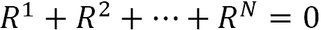

# 第九章：多智能体强化学习

如果有比训练一个**强化学习**（**RL**）智能体表现出智能行为更令人兴奋的事情，那就是训练多个智能体进行合作或竞争。**多智能体 RL**（**MARL**）是你真正能感受到人工智能潜力的地方。许多著名的 RL 故事，例如 AlphaGo 或 OpenAI Five，都源自 MARL，我们将在这一章中介绍它们。当然，天下没有免费的午餐，MARL 也伴随着许多挑战与机遇，我们也将对此进行探索。在本章的最后，我们将通过竞争性自我博弈训练一群井字游戏智能体。所以，最后你将有一些伙伴一起玩游戏。

这一章将会很有趣，我们将具体涵盖以下主题：

+   介绍多智能体强化学习，

+   探索多智能体强化学习中的挑战，

+   在多智能体环境中训练策略，

+   通过自我博弈训练井字游戏智能体。

让我们开始吧！

# 介绍多智能体强化学习

到目前为止，我们书中讨论的所有问题和算法都涉及在环境中训练单一智能体。另一方面，在从游戏到自动驾驶车队的许多应用中，存在多个决策者，即多个智能体，这些智能体并行训练，但执行的是本地策略（即没有中央决策者）。这引导我们进入 MARL，它涉及比单一智能体 RL 更为丰富的问题和挑战。在本节中，我们将概述 MARL 的整体格局。

## MARL 智能体之间的协作与竞争

MARL 问题可以根据智能体之间的协作和竞争结构分为三大类。让我们看看这三类是什么，以及每类适合哪些应用。

### 完全合作环境

在这种环境下，所有智能体都朝着一个共同的长期目标努力。环境所反馈的回报会平等地分配给所有智能体，因此没有任何智能体有动机偏离共同目标。

这里有一些完全合作环境的例子：

+   **自动驾驶车辆/机器人车队**：有许多应用场景，自动驾驶车辆/机器人车队可以协同完成一个共同的任务。一个例子是灾后恢复/紧急响应/救援任务，车队尝试完成如向急救人员运送紧急物资、关闭气阀、清理道路上的杂物等任务。类似地，在供应链中出现的运输问题，或通过多个机器人运输大物体的场景也属于这一类。

+   **制造业**：工业 4.0 背后的整体理念是实现设备和网络物理系统的互联，以达到高效的生产和服务。如果你想象一个单一的制造车间，里面通常有许多决策设备，MARL 是建模此类控制问题的自然选择。

+   **智能电网**：在新兴的智能电网领域，许多问题可以归类为这一类。例如，涉及许多冷却单元的数据中心冷却问题。类似地，交叉路口交通信号灯的控制也是这一领域的另一个好例子。事实上，在*第十七章**《智能城市与网络安全》*中，我们将使用 MARL 来建模和解决这个问题。

在讨论其他类型的 MARL 环境之前，在我们讨论自动驾驶车辆的 MARL 时，让我们简要提到一个有用的平台，MACAD-Gym，供你实验使用。

#### MACAD-Gym 用于多代理连接的自动驾驶

MACAD-Gym 是一个基于 Gym 的库，用于多代理设置中的连接与自动驾驶应用，建立在著名的 CARLA 模拟器之上。


图 9.1：MACAD-Gym 平台（来源：MACAD-Gym GitHub 仓库）

该平台提供了一套丰富的场景，包括汽车、行人、交通信号灯、自行车等，如图 9.1 所示。更详细地说，MACAD-Gym 环境包含各种 MARL 配置，如以下示例所示：

```py
Environment-ID: Short description
{'HeteNcomIndePOIntrxMATLS1B2C1PTWN3-v0': 
'Heterogeneous, Non-communicating, '
'Independent,Partially-Observable '
'Intersection Multi-Agent scenario '
'with Traffic-Light Signal, 1-Bike, '
'2-Car,1-Pedestrian in Town3, '
'version 0'}
```

要查看你可以用 MACAD-Gym 做什么，请访问其由 Praveen Palanisamy 开发和维护的 Github 仓库：[`github.com/praveen-palanisamy/macad-gym`](https://github.com/praveen-palanisamy/macad-gym)。

在这一短暂的绕道之后，我们继续讨论 MARL 中的完全竞争环境。

### 完全竞争环境

在完全竞争的环境中，一个代理的成功意味着其他代理的失败。因此，这些环境被建模为零和博弈：



其中！[](img/Formula_09_002.png)是！[](img/Formula_09_003.png)代理的奖励。

完全竞争环境的一些例子如下：

+   **棋盘游戏**：这是这种环境的经典例子，例如国际象棋、围棋和井字游戏。

+   **对抗性设置**：在我们希望最小化代理在现实生活中失败风险的情况下，我们可能会让它与对抗性代理进行训练。这就创建了一个完全竞争的环境。

最后，让我们来看一下混合合作-竞争环境。

### 混合合作-竞争环境

第三类环境涉及代理之间的合作与竞争。这些环境通常被建模为一般和博弈：


这里！[](img/Formula_09_005.png)是！[](img/Formula_09_006.png)代理的奖励，！[](img/Formula_09_007.png)是代理可以收集的固定总奖励。

以下是一些混合环境的例子：

+   **团队竞争**：当智能体分成多个团队并相互竞争时，每个团队内的智能体会合作，以击败其他团队。

+   **经济**：如果你思考我们所参与的经济活动，它是竞争与合作的结合。一个很好的例子是像微软、谷歌、Facebook 和亚马逊这样的科技公司，它们在某些业务上相互竞争，但也在一些开源项目上合作，以推动软件技术的发展。

    信息

    在这一点上，值得暂停一下，观看 OpenAI 的演示，展示了智能体在团队中玩捉迷藏的场景。智能体在经历了大量对局后，发展出了非常酷的合作与竞争策略，这激发了我们对强化学习（RL）在实现人工通用智能（AGI）方面的潜力的思考。参见图 9.2，获取快速截图和视频链接。


图 9.2：OpenAI 的智能体玩捉迷藏（来源：[`youtu.be/kopoLzvh5jY`](https://youtu.be/kopoLzvh5jY)）

现在我们已经介绍了基础知识，接下来让我们探讨一下多智能体强化学习（MARL）面临的一些挑战。

# 探索多智能体强化学习中的挑战

在本书的前几章中，我们讨论了强化学习中的许多挑战。特别是，我们最初介绍的动态规划方法无法扩展到具有复杂和大规模观察与动作空间的问题。另一方面，深度强化学习方法尽管能够处理复杂问题，但缺乏理论保证，因此需要许多技巧来稳定和收敛。现在，我们谈论的是在多个智能体共同学习、相互作用并影响环境的情况下；单智能体强化学习中的挑战和复杂性被成倍增加。因此，MARL 中的许多结果都是经验性的。

在本节中，我们讨论了为什么 MARL 特别复杂且充满挑战。

## 非平稳性

单智能体强化学习背后的数学框架是马尔可夫决策过程（MDP），它表明环境动态依赖于当前状态，而非历史。这表明环境是平稳的，许多方法依赖于此假设来实现收敛。但现在环境中有多个智能体在学习，因此随着时间的推移改变其行为，这一基本假设被打破，阻碍了我们像分析单智能体强化学习那样分析 MARL。

举个例子，考虑使用带有重放缓冲区的 Q 学习等脱政策方法。在 MARL 中，使用这种方法尤其具有挑战性，因为较早收集的经验可能与环境（部分由其他智能体构成）对单个智能体行动的反应截然不同。

## 可扩展性

解决非平稳性的一个可能方法是考虑其他智能体的行为，例如使用联合行动空间。随着智能体数量的增加，这种方法会变得越来越不可行，这使得 MARL 的可扩展性成为一个问题。

话虽如此，当环境中只有两个智能体时，分析智能体行为如何收敛相对容易。如果你熟悉博弈论，一种常见的看待这种系统的方式是理解均衡点，在这些点上，智能体不会通过改变他们的策略而受益。

信息

如果你需要对博弈论和纳什均衡的简要介绍，可以查看这个视频：[`www.youtube.com/watch?v=0i7p9DNvtjk`](https://www.youtube.com/watch?v=0i7p9DNvtjk)

当环境中有超过两个智能体时，这种分析会变得非常困难，这使得大规模 MARL 变得非常难以理解。

## 不明确的强化学习目标

在单一智能体强化学习（RL）中，目标很明确：最大化预期的累积回报。另一方面，在多智能体强化学习（MARL）中并没有一个唯一明确的目标。

想象一个棋局，我们试图训练一个非常强大的棋手。为此，我们训练许多智能体，让它们通过**自我对弈**相互竞争。你会如何设定这个问题的目标？最初的想法可能是最大化最佳智能体的奖励。但是，这可能导致除了一个以外所有智能体都成为糟糕的棋手。这显然不是我们所希望的结果。

MARL 中一个流行的目标是实现纳什均衡的收敛。这个方法通常很有效，但当智能体不完全理性时，它也有缺点。此外，纳什均衡自然意味着对其他智能体策略的过拟合，这不一定是我们想要的。

## 信息共享

MARL 中的另一个重要挑战是设计智能体之间的信息共享结构。我们可以考虑三种信息结构：

+   **完全中心化**：在这种结构下，所有智能体收集的信息都由一个中央机制处理，局部策略将利用这一集中知识。该结构的优势在于智能体之间的完全协调。另一方面，这可能导致一个优化问题，随着智能体数量的增加，它的扩展性变差。

+   **完全去中心化**：在这种结构下，智能体之间不交换信息，每个智能体将基于他们的本地观察做出决策。显而易见的好处是没有中心化协调器的负担。另一方面，由于智能体对环境的信息有限，智能体的行为可能是次优的。此外，当训练完全独立时，由于高度部分可观测性，强化学习算法可能会很难收敛。

+   **去中心化但网络化的代理**：这种结构允许小群体（邻居）代理之间交换信息。反过来，这有助于信息在它们之间传播。这里的挑战是创建一个能够在不同环境条件下有效工作的强健通信结构。

根据强化学习问题的目标以及计算资源的可用性，不同的方式可能会更为优选。考虑一个合作环境，其中大量的机器人群体试图达成一个共同的目标。在这种问题中，完全集中式或网络化的控制可能是合理的。而在完全竞争的环境中，比如策略类视频游戏，完全去中心化的结构可能更为适合，因为在代理之间没有共同的目标。

在这么多理论之后，现在是时候进入实践了！很快，我们将训练一个井字游戏代理，你可以在会议或课堂上与其对战。首先，我们将描述如何进行训练，然后再进入实现部分。

# 在多代理环境中训练策略

有许多针对 MARL 设计的算法和方法，可以大致分为以下两大类。

+   **独立学习**：这种方法建议独立训练代理，并将环境中的其他代理视为环境的一部分。

+   **集中式训练与去中心化执行**：在这种方法中，有一个集中式控制器，在训练过程中使用来自多个代理的信息。在执行（推理）时，代理将独立地执行策略，而不依赖于中央机制。

一般来说，我们可以选择之前章节中提到的任何算法，并将其应用于多代理环境中，通过独立学习来训练策略，事实证明，这是一种非常有竞争力的替代方法，比专门的多代理强化学习（MARL）算法还要有效。因此，在本章中，我们将跳过讨论任何特定 MARL 算法的技术细节，并将相关资料交给你参考文献部分。

信息

关于深度 MARL 算法比较的简明且强烈推荐的阅读资料可以参考(Papoudakis et al. 2020)。只需访问参考文献部分，找到论文的链接。

所以，我们将采用独立学习。那么它是如何工作的呢？嗯，它要求我们：

+   拥有多个代理的环境，

+   维持支持代理的策略，

+   适当地将来自环境的奖励分配给代理。

对我们来说，设计一个合适的框架来处理上述问题可能会有些棘手。幸运的是，RLlib 提供了一个多代理环境来解决这个问题。接下来，让我们看看它是如何工作的。

## RLlib 多代理环境

RLlib 的多智能体环境灵活地允许我们连接到一个你已经熟悉的算法，用于 MARL。事实上，RLlib 文档方便地展示了哪些算法与这种环境类型兼容：

）

](img/B14160_09_003.jpg)

图 9.3：RLlib 的算法列表显示了多智能体的兼容性（来源：[`docs.ray.io/en/releases-1.0.1/rllib-algorithms.html`](https://docs.ray.io/en/releases-1.0.1/rllib-algorithms.html)）

在该列表中，你还会看到一个单独的部分，列出了针对 MARL 特定算法的内容。在本章中，我们将使用 PPO。

当然，下一步是理解如何将我们选择的算法与多智能体环境一起使用。此时，我们需要做一个关键区分：*使用 RLlib 时，我们将训练策略，而不是智能体（至少不是直接训练）。一个智能体将映射到正在训练的某个策略，以获取动作。*

RLlib 文档通过以下图示说明了这一点：

）

](img/B14160_09_004.jpg)

图 9.4：RLlib 中智能体和策略之间的关系（来源：[`docs.ray.io/en/releases-1.0.1/rllib-env.html#multi-agent-and-hierarchical`](https://docs.ray.io/en/releases-1.0.1/rllib-env.html#multi-agent-and-hierarchical)）

如果你还没有意识到，这为我们提供了一个非常强大的框架，用来建模多智能体强化学习（MARL）环境。例如，我们可以灵活地向环境中添加智能体、移除智能体，并为同一任务训练多个策略。只要我们指定了策略与智能体之间的映射，一切都能顺利进行。

有了这些，让我们看看 RLlib 中的训练循环在与多智能体环境配合使用时需要哪些要求：

1.  带有相应 id 的策略列表。这些是将要被训练的策略。

1.  一个将给定智能体 id 映射到策略 id 的函数，这样 RLlib 就知道为给定智能体生成的动作来自哪里。

一旦设置好，环境将使用 Gym 规范与 RLlib 进行通信。不同之处在于，观察、奖励和终止语句将为环境中的多个智能体发出。例如，重置函数将返回如下所示的观察字典：

```py
> env.reset()
{"agent_1": [[...]], "agent_2":[[...]], "agent_4":[[...]],...
```

同样，由策略生成的动作会传递给我们从中收到观察的智能体，类似于：

```py
... = env.step(actions={"agent_1": ..., "agent_2":..., "agent_4":..., ...
```

这意味着，如果环境返回一个智能体的观察，它就会要求返回一个动作。

到目前为止一切顺利！这些内容应该能给你一些关于它如何工作的初步了解。等我们进入实现部分时，事情会变得更加清晰！

很快，我们将训练井字棋策略，正如我们之前提到的。使用这些策略的智能体将相互竞争，学习如何玩游戏。这就是**竞争性自我对弈**，我们接下来会讨论这个话题。

## 竞争性自我对弈

自我对弈是训练 RL 智能体进行竞争性任务的一个很好的工具，这些任务包括棋类游戏、多人视频游戏、对抗性场景等。你听说过的许多著名 RL 智能体，都是通过这种方式训练的，比如 AlphaGo、OpenAI Five（用于 Dota 2）以及 DeepMind 的《星际争霸 II》智能体。

信息

OpenAI Five 的故事非常有趣，展示了该项目是如何开始并发展成今天的模样的。关于该项目的博客文章提供了许多有用的信息，从模型中使用的超参数到 OpenAI 团队如何克服工作中的各种挑战。你可以在[`openai.com/projects/five/`](https://openai.com/projects/five/)找到该项目页面。

传统自我对弈的一个缺点是，智能体仅看到以相同方式训练的其他智能体，因此容易过拟合到彼此的策略。为了解决这个问题，训练多个策略并让它们彼此对抗是有意义的，这也是我们在本章中要做的事情。

信息

过拟合在自我对弈中是一个挑战，甚至训练多个策略并将它们彼此对抗也不足以解决问题。DeepMind 创建了一个代理/策略的“联赛”，就像篮球联赛一样，以获得一个真正具有竞争性的训练环境，这也促成了他们在《星际争霸 II》上的成功。他们在一个很棒的博客中解释了他们的方法，[`deepmind.com/blog/article/AlphaStar-Grandmaster-level-in-StarCraft-II-using-multi-agent-reinforcement-learning`](https://deepmind.com/blog/article/AlphaStar-Grandmaster-level-in-StarCraft-II-using-multi-agent-reinforcement-learning)。

最后，到了尝试多智能体强化学习的时候了！

# 通过自我对弈训练井字棋智能体

在本节中，我们将为您提供一些关于我们 Github 仓库中代码的关键解释，以便您更好地掌握使用 RLlib 进行 MARL 的技巧，同时在 3x3 的井字棋棋盘上训练智能体。完整代码可以参考[`github.com/PacktPublishing/Mastering-Reinforcement-Learning-with-Python`](https://github.com/PacktPublishing/Mastering-Reinforcement-Learning-with-Python)。


图 9.5：一个 3x3 的井字棋。图片来源以及如何玩游戏的说明，见[`en.wikipedia.org/wiki/Tic-tac-toe`](https://en.wikipedia.org/wiki/Tic-tac-toe)。

我们从设计多智能体环境开始。

## 设计多智能体井字棋环境

在游戏中，我们有两个代理，X 和 O，它们在玩游戏。我们将为代理训练四个策略，每个策略可以选择 X 或 O 的行动。我们构建环境类如下：

Chapter09/tic_tac_toe.py

```py
class TicTacToe(MultiAgentEnv):
    def __init__(self, config=None):
        self.s = 9
        self.action_space = Discrete(self.s)
        self.observation_space = MultiDiscrete([3] * self.s)
        self.agents = ["X", "O"]
        self.empty = " "
        self.t, self.state, self.rewards_to_send = \
                                    self._reset()
```

这里，9 代表棋盘上的方格数量，每个方格可以被 X、O 或空白填充。

我们按以下方式重置这个环境：

```py
    def _next_agent(self, t):
        return self.agents[int(t % len(self.agents))]
    def _reset(self):
        t = 0
        agent = self._next_agent(t)
        state = {"turn": agent, 
                 "board": [self.empty] * self.s}
        rews = {a: 0 for a in self.agents}
        return t, state, rews
```

然而，我们不会将这个状态直接传递给策略，因为它仅仅是充满字符。我们会处理它，以便在即将进行的玩家面前，他们自己的标记总是用 1 表示，而对手的标记总是用 2 表示。

```py
    def _agent_observation(self, agent):
        obs = np.array([0] * self.s)
        for i, e in enumerate(self.state["board"]):
            if e == agent:
                obs[i] = 1
            elif e == self.empty:
                pass
            else:
                obs[i] = 2
        return obs
```

这个处理后的观察结果就是传递给策略的数据：

```py
    def reset(self):
        self.t, self.state, self.rewards_to_send =\
                            self._reset()
        obs = {self.state["turn"]: \
               self._agent_observation(self.state["turn"])}
        return obs
```

最后，`step` 方法会处理玩家的操作，并将环境推进到下一步。如果赢了，玩家会得到一个 ，如果输了，则得到 。注意，策略可能会建议在已占据的方格上放置标记，这种行为会被惩罚并扣除  分。

## 配置训练器

我们创建了 4 个策略来训练，给它们分配一些 ID，并指定它们的观察空间和行动空间。我们是这样做的：

Chapter09/ttt_train.py

```py
    env = TicTacToe()
    num_policies = 4
    policies = {
        "policy_{}".format(i): (None, 
                                env.observation_space, 
                                env.action_space, {})
        for i in range(num_policies)}
```

在创建传递给训练器的配置字典时，我们将代理映射到策略上。为了减少过拟合，而不是为某个特定代理分配特定策略，我们随机选择一个策略来获取即将执行的代理的行动。

```py
    policy_ids = list(policies.keys())
    config = {
        "multiagent": {
            "policies": policies,
            "policy_mapping_fn": (lambda agent_id: \
                           random.choice(policy_ids)),
        },
...
```

在训练过程中，我们会保存模型，以便跟踪它们的改进。由于涉及多个策略，作为进度的代理，我们检查回合是否因有效的操作而变长。我们希望随着代理变得更具竞争力，越来越多的游戏将以平局结束，这时棋盘上将充满标记。

```py
    trainer = PPOTrainer(env=TicTacToe, config=config)
    best_eps_len = 0
    mean_reward_thold = -1
    while True:
        results = trainer.train()
        if results["episode_reward_mean"] > mean_reward_thold\
           and results["episode_len_mean"] > best_eps_len:
            trainer.save("ttt_model")
            best_eps_len = results["episode_len_mean"]
        if results.get("timesteps_total") > 10 ** 7:
            break
```

就这样！现在开始观看训练的乐趣吧！

## 观察结果

游戏开始时，会有很多无效操作，导致回合长度延长，并且代理受到过多惩罚。因此，代理的平均奖励图像将如下所示：


图 9.6：平均代理奖励

注意到它如何从深度负值开始，逐渐趋近于零，表明平局成为了常见的结果。与此同时，你应该看到回合长度趋近于 9：


图 9.7：回合长度进展

当你看到竞争愈演愈烈时，你可以停止训练！更有趣的是，运行 `ttt_human_vs_ai.py` 脚本与 AI 对战，或者运行 `ttt_ai_vs_ai.py` 观察它们的对战。

就这样，我们结束了这一章。这是一个有趣的章节，不是吗？接下来我们来总结一下本章的学习内容。

# 总结

在这一章中，我们讲解了多智能体强化学习（MARL）。与其他强化学习分支相比，它更具挑战性，因为有多个决策者影响环境，而且这些决策者在时间上也会发生变化。在介绍了 MARL 的一些概念后，我们详细探讨了这些挑战。随后，我们通过 RLlib 进行竞争性自我博弈来训练井字游戏智能体。它们竞争激烈，训练结束时总是以平局告终！

在下一章中，我们将转向讨论一种新兴的强化学习方法——机器教学，它将让领域专家（也就是你）更积极地参与到训练过程中，指导训练进展。期待在那里见到你！

# 参考文献

1.  Mosterman, P. J. 等（2014）。用于自动化人道主义任务的异构车队。计算科学与工程，16 卷，第 3 期，页 90-95。网址：[`msdl.cs.mcgill.ca/people/mosterman/papers/ifac14/review.pdf`](http://msdl.cs.mcgill.ca/people/mosterman/papers/ifac14/review.pdf)

1.  Papoudakis, Georgios, 等（2020）。多智能体深度强化学习算法的比较评估。arXiv.org，[`arxiv.org/abs/2006.07869`](http://arxiv.org/abs/2006.07869)

1.  Palanisamy, Praveen.（2019）。基于深度强化学习的多智能体自动驾驶。arxiv.org，[`arxiv.org/abs/1911.04175v1`](https://arxiv.org/abs/1911.04175v1)
