# 第十章：*第十章*：机器教学

**强化学习**（**RL**）的巨大兴奋感，在很大程度上源于它与人类学习的相似性：RL 智能体通过经验进行学习。这也是为什么许多人认为它是通向人工通用智能的路径。另一方面，如果你仔细想想，将人类学习仅仅归结为反复试验，实在是大大的低估了人类的学习过程。我们并非从出生开始就从零发现我们所知道的一切——无论是在科学、艺术、工程等领域！相反，我们建立在数千年来积累的知识和直觉之上！我们通过各种不同的、有结构的或无结构的**教学**形式将这些知识在我们之间传递。这种能力使得我们能够相对快速地获得技能并推动共识知识的进步。

从这个角度来看，我们使用机器学习的方式似乎相当低效：我们将大量原始数据投入到算法中，或者让它们暴露于环境中（对于 RL 而言），几乎没有任何指导。这部分也是为什么机器学习需要如此大量的数据，并且有时会失败的原因。

**机器教学**（**MT**）是一种新兴的方式，它将重点转向从教师中提取知识，而不是仅仅依赖原始数据，从而指导训练机器学习算法的过程。反过来，学习新技能和映射的过程变得更加高效，且所需的数据、时间和计算资源更少。在本章中，我们将介绍 MT 在 RL 中的组成部分及其一些最重要的方法，例如奖励函数工程、课程学习、示范学习和动作屏蔽。最后，我们还将讨论 MT 的缺点与未来发展。具体而言，我们将在本章中涵盖以下内容：

+   MT 简介

+   奖励函数的设计

+   课程学习

+   热启动与示范学习

+   动作屏蔽

+   概念网络

+   MT 的缺点与前景

# 技术要求

本章的所有代码可以在以下 GitHub 链接找到：

[`github.com/PacktPublishing/Mastering-Reinforcement-Learning-with-Python`](https://github.com/PacktPublishing/Mastering-Reinforcement-Learning-with-Python)

# MT 简介

MT 是一种通用方法及其相关技术的集合，旨在高效地将知识从教师——即学科专家——转移到机器学习算法中。通过这种方式，我们旨在使训练过程更加高效，甚至使那些否则不可能完成的任务变得可行。接下来，我们将详细讨论 MT 是什么，为什么我们需要它，以及它的组成部分。

## 理解 MT 的需求

你知道吗？美国预计在 2021 年将花费约 1.25 万亿美元，约占其国内生产总值的 5%，用于教育开支。这应该能反映教育对我们社会和文明的生死攸关的重要性（许多人会争辩说，我们应该投入更多）。我们人类建立了这样一个庞大的教育系统，我们期望人们在其中花费多年，因为我们不指望自己能够独立解码字母表或数学。不仅如此，我们不断从身边的老师那里学习，如何使用软件、如何开车、如何做饭，等等。这些老师不必是人类教师：书籍、博客文章、手册和课程材料都为我们提炼了有价值的信息，让我们能够学习，不仅是在学校，而是在整个生活过程中。

我希望这能让你信服教学的重要性。但如果你觉得这个例子过于民粹化，或许与 RL 有些不相关，那么让我们来讨论机器翻译（MT）如何在 RL 中发挥特定作用。

### 学习的可行性

你是否曾在没有（好的）老师的情况下，尝试独自学习某些东西时感到力不从心？这就像一个 RL 代理由于可能的策略数量过多，无法为当前问题找到合适的策略。这个过程中主要的障碍之一是缺乏关于策略质量的适当反馈。你也可以将**困难的探索问题**与稀疏奖励相提并论，这是 RL 中的一个严重挑战。

考虑以下例子：一个 RL 代理正在与一个竞争对手对弈国际象棋，胜利奖励为+1，平局奖励为 0，失败奖励为-1。RL 代理需要不断“偶然”地找到数十个“好棋步”，一招接一招，在每一步的众多备选棋步中，才能获得第一次 0 或+1 的奖励。由于这种情况的发生概率较低，如果没有巨大的探索预算，训练很可能会失败。另一方面，教师可以引导探索，使得 RL 代理至少知道几种成功的方式，从而逐渐改进其胜利策略。

信息

当 DeepMind 创建其 AlphaStar 代理来玩《星际争霸 II》时，他们首先使用监督学习训练代理，基于过去的人类游戏日志，然后才进入基于强化学习（RL）的训练。在某种意义上，人类玩家是代理的第一批教师，没有他们，这种训练将变得不可行或成本过高。为了支持这一论点，可以以训练 OpenAI Five 代理玩《Dota 2》的例子为例。训练该代理花费了近一年的时间。

以下图展示了代理在行动中的情形：

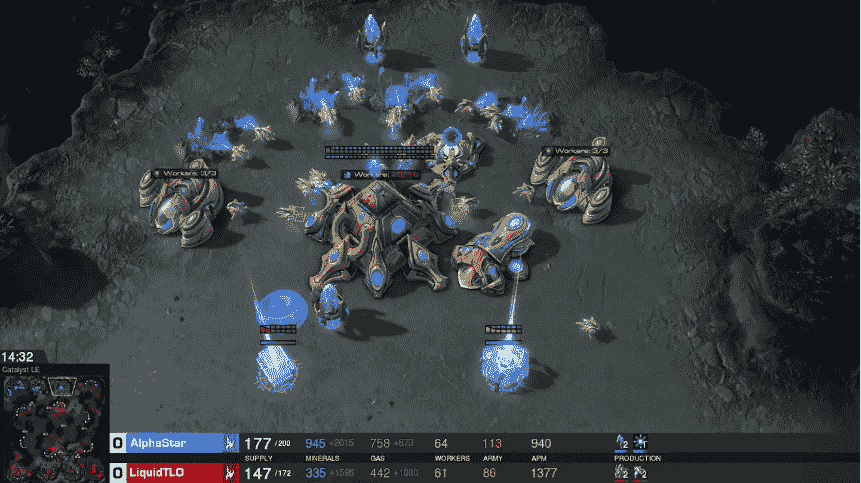

图 10.1 – DeepMind 的 AlphaStar 代理在行动中（来源：AlphaStar 团队，2019）

总结来说，有一个教师可以让学习在合理的时间内变得可行。

### 时间、数据和计算效率

假设你拥有足够的计算资源，并且能够尝试大量的动作序列，让 RL 代理在一个环境中发现获胜策略。仅仅因为你能做到，并不意味着你应该这样做并浪费所有这些资源。教师可以帮助你大大减少训练时间、数据和计算量。你可以利用节省下来的资源来反复改进你的想法，开发更好的代理人。

提示

你是否有导师帮助你在职业、教育、婚姻等方面的发展？或者你是否阅读过关于这些主题的书籍？你的动力是什么？你不想重复他人的错误，也不想重新发明别人已经知道的东西，浪费你的时间、精力和机会，对吧？MT 以类似的方式帮助你的代理人快速开始任务。

MT 的好处不仅仅在于学习的可行性或效率。接下来，我们来谈谈另一个方面：你代理人的安全性。

### 确保代理人的安全性

教师是某个主题的专家。因此，教师通常对在什么条件下采取哪些行动可能会让代理人陷入困境有一个相当清晰的认识。教师可以通过限制代理人可以采取的行动来告知代理人这些条件，从而确保其安全。例如，在为自动驾驶汽车训练强化学习（RL）代理时，根据路况限制汽车的速度是很自然的。如果训练发生在现实世界中，这一点尤为重要，以确保代理人不会盲目探索危险的行为来发现如何驾驶。即便训练发生在模拟环境中，施加这些限制也有助于高效使用探索预算，这与上一节中的提示相关。

### 机器学习的民主化

当教师训练学生时，他们不会担心学习的生物机制细节，比如哪些化学物质在什么脑细胞之间传递。这些细节被从教师的视野中抽象了出来；神经科学家和研究大脑的专家会发布关于有效教学和学习技术的研究。

就像教师不需要是神经科学家一样，学科专家也不必是机器学习专家才能训练机器学习算法。MT 范式通过开发有效且直观的教学方法，建议将机器学习的低层细节从机器教师中抽象出来。这样，学科专家将更容易将他们的知识注入到机器中。最终，这将导致机器学习的民主化，并使其在更多的应用中得到更广泛的使用。

数据科学通常需要将商业洞察和专业知识与数学工具和软件相结合，以创造价值。当你想将强化学习（RL）应用于商业问题时，情况也是一样的。这通常要求数据科学家了解商业领域，或者要求领域专家了解数据科学，或者让两者领域的人一起合作组成团队。这给许多场景下（高级）机器学习技术的采用带来了很高的门槛，因为很少能在同一个地方找到这两类人。

信息

一项麦肯锡的研究表明，缺乏分析人才是释放数据和分析价值的主要障碍。机器教学，除了它的特定工具外，是一种克服这些障碍的范式，通过创建直观的工具降低非机器学习专家的入门门槛，以此来解决问题。要查看这项研究，请访问[`mck.co/2J3TFEj`](https://mck.co/2J3TFEj)。

我们刚刚提到的这个愿景更侧重于长远目标，因为它需要大量的研究和机器学习方面的抽象。我们将在本节中讨论的方法将非常技术性。例如，我们将讨论**动作屏蔽**方法，根据代理所处的状态限制可用的动作，这将需要编码并修改神经网络的输出。然而，你可以想象一个高级机器教学工具，听到老师说“在城市限速范围内不要超过 40 英里每小时”，然后解析这个命令，在后台为自动驾驶汽车代理实现动作屏蔽：

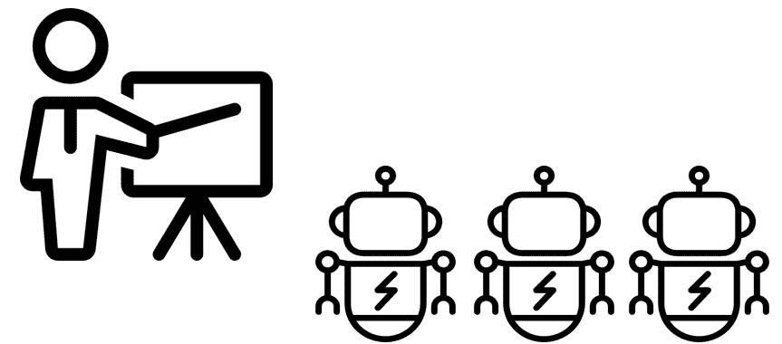

图 10.2 – 机器教学的未来？

在结束这一节并深入探讨机器教学的细节之前，让我先声明一下必要的免责声明。

免责声明

机器教学（MT）方法的最 vocal 拥护者之一是微软及其自动化系统部门。截至本书编写时，我是微软自动化系统组织的一名员工，致力于利用机器教学创建智能系统。然而，我在这里的目标并不是推广任何微软的产品或话语，而是向你介绍这个我认为很重要的新兴话题。此外，我并没有以任何身份正式代表微软，我对这个话题的看法也不一定与公司立场一致。如果你对微软对机器教学的看法感兴趣，可以查看[`blogs.microsoft.com/ai/machine-teaching/`](https://blogs.microsoft.com/ai/machine-teaching/)上的博客文章以及[`www.microsoft.com/en-us/ai/autonomous-systems`](https://www.microsoft.com/en-us/ai/autonomous-systems)上的自动化系统网站。

现在，是时候让讨论变得更具体了。在下一节中，我们将看看机器教学的要素。

## 探索机器教学的要素

由于机器教学是一个新兴领域，定义其元素是非常困难的。不过，让我们来看一下其中一些常见的组成部分和主题。我们已经讨论了机器教师是谁，但为了完整性，让我们从这点开始。接着，我们将探讨概念、课程、训练数据和反馈。

### 机器教师

**机器教师**，或简称**教师**，是当前问题的主题专家。在没有将机器学习与教学解耦的抽象概念的情况下，教师通常是数据科学家——也就是你——但这次的角色是明确地利用你对问题领域的知识来指导训练。

### 概念

**概念**是解决问题所需技能集的一个特定部分。想象一下在现实生活中训练一名篮球运动员。训练不仅仅是进行练习赛，还包括掌握个别技能。一些技能如下：

+   投篮

+   传球

+   运球

+   停止与着陆

传统的强化学习训练篮球智能体通常是通过进行整场比赛来实现，期望智能体通过比赛掌握这些个别技能。机器教学建议将问题拆解成更小的概念进行学习，比如我们之前列出的那些技能。这样做有几个好处：

+   单一的任务往往伴随着稀疏的奖励，这对于强化学习智能体来说是很难从中学习的。例如，赢得篮球比赛的奖励是+1，输掉比赛则是-1。然而，机器教师会知道，通过掌握个别技能，赢得比赛是可能的。为了训练智能体掌握个别技能和概念，将会为这些技能和概念分配奖励。这有助于绕过稀疏奖励的问题，并为智能体提供更频繁的反馈，从而促进学习。

+   信用分配问题是强化学习中的一个严重挑战，它涉及到将后期阶段的奖励归因于早期阶段个别动作的难度。当训练被拆分成概念时，更容易看到智能体在哪些概念上不擅长。具体来说，这并不能解决信用分配问题。仍然是教师决定是否掌握某个特定概念很重要。但一旦这些概念被教师定义，就更容易隔离出智能体擅长和不擅长的部分。

+   作为前述观点的推论，教师可以将更多的训练预算分配给那些需要更多训练和/或难以学习的概念。这样可以更高效地利用时间和计算资源。

正因为如此，一个不切实际或代价高昂的任务，可以通过将其拆分成概念来高效地解决。

### 课程和教学大纲

机器教学中的另一个重要元素是**课程学习**。在训练智能体某个概念时，暴露给它专家级难度可能会偏离训练目标。相反，更合理的做法是从一些简单的设置开始，逐步增加难度。这些难度级别分别构成一个**课程**，它们与定义从一个课程到下一个课程的过渡标准的成功阈值一起，组成了整个课程体系。

课程学习是强化学习中最重要的研究领域之一，我们将在后续详细讲解。课程可以由教师手动设计，也可以使用**自动课程**算法来生成。

### 训练材料/数据

与之前的观点相关，机器教学的另一个方面是设计智能体学习的数据。例如，机器教师可以通过使用非策略方法来为训练提供包含成功案例的数据，从而克服困难的探索任务。这些数据可以通过现有的非 RL 控制器或教师的动作获取。这种方法也被称为**示范学习**。

信息

示范学习是一种流行的强化学习智能体训练方法，特别是在机器人领域。Nair 等人在 ICARA 论文中展示了如何通过示范机器人如何拾取和放置物体来为强化学习智能体的训练提供种子。请查看视频：[`youtu.be/bb_acE1yzDo`](https://youtu.be/bb_acE1yzDo)。

反过来，教师可以引导智能体远离不良行为。一种有效的实现方式是通过**行动掩蔽**，即将观察到的可用动作空间限制为一组期望的动作。

另一种设计智能体训练数据的方式是监控智能体的表现，识别其在状态空间中需要更多训练的部分，并将智能体暴露于这些状态中以提升其表现。

### 反馈

RL 智能体通过奖励的反馈进行学习。设计奖励函数使得学习变得简单——甚至在某些情况下，原本不可能实现的情况也能变得可行——这是机器教师最重要的任务之一。通常这是一个迭代过程。在项目的过程中，奖励函数往往需要多次修订，以促使智能体学习期望的行为。未来的机器教学工具可能涉及通过自然语言与智能体互动，提供这种反馈，从而塑造背后使用的奖励函数。

通过这些内容，我们已经向您介绍了机器教学及其元素。接下来，我们将探讨具体的方法。与其讨论一个样本问题的完整机器教学策略，不如专注于单个方法。根据您的问题需求，您可以将它们作为机器教学策略的构建模块。我们将从最常见的方法开始——奖励函数设计，您可能已经使用过它。

# 奖励函数设计

奖励函数工程是指在强化学习问题中设计环境的奖励动态，使其反映出你为智能体设定的确切目标。你如何定义奖励函数可能会使训练变得容易、困难，甚至是不可能的。因此，在大多数强化学习项目中，会投入大量精力来设计奖励。在本节中，我们将介绍一些需要设计奖励的具体案例以及如何设计奖励，接着提供一个具体的例子，最后讨论进行奖励函数设计时所面临的挑战。

## 何时进行奖励函数设计

本书中多次提到，包括在我们讨论概念的上一节中，我们讨论了稀疏奖励给学习带来的问题。解决这一问题的一种方法是**奖励塑形**，使奖励变得不再稀疏。因此，稀疏奖励是我们需要进行奖励函数设计的常见原因之一。然而，这并不是唯一的原因。并非所有环境/问题都像 Atari 游戏那样为你预定义了奖励。此外，在某些情况下，你可能希望你的智能体实现多个目标。由于这些原因，许多现实生活中的任务需要机器教师根据他们的专业知识来指定奖励函数。接下来，我们将探讨这些情况。

### 稀疏奖励

当奖励稀疏时，意味着智能体通过一系列不太可能的随机动作，看到奖励的变化（从恒定的 0 变为正数/负数，从恒定的负数变为正数，等等），学习就变得困难。这是因为智能体需要通过随机试错来偶然碰到这个序列，这使得问题的探索变得困难。

与一位竞争性玩家对弈时，奖励设定为赢得比赛为+1、平局为 0、输掉比赛为-1，最后的这个例子就是一个稀疏奖励环境的典型例子。强化学习基准测试中常用的经典例子是《蒙特祖玛的复仇》，这是一款 Atari 游戏，玩家需要收集装备（钥匙、火把等），开门等，才能取得进展，而仅凭随机行动几乎不可能完成：


图 10.3 – 《蒙特祖玛的复仇》

在这样的困难探索问题中，一个常见的策略是**奖励塑形**，即修改奖励，以引导智能体朝向高奖励方向。例如，奖励塑形策略可以是在学习国际象棋时，如果智能体丢掉了皇后，就给它-0.1 的惩罚奖励，丢失其他棋子的惩罚也较小。通过这种方式，机器教师将关于皇后是游戏中重要棋子的知识传达给智能体，尽管丢失皇后或其他棋子（除国王外）本身并不是游戏的目标。

我们将在后续部分更详细地讨论奖励塑形。

### 定性目标

假设你正在试图教一个类人机器人如何走路。那么，什么是走路？你如何定义走路？如何用数学定义走路？什么样的走路会得到高奖励？仅仅是前进就够了吗，还是其中有一些美学的元素？如你所见，把你脑海中的走路概念转化为数学表达式并不容易。

在他们的著名研究中，DeepMind 的研究人员为他们训练的类人机器人走路使用了以下奖励函数：

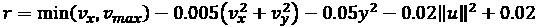

在这里，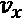 和 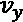 是沿着 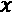 和 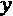 轴的速度， 是在 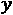 轴上的位置，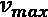 是速度奖励的截止值，而 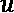 是施加在关节上的控制。正如你所看到的，这里有许多任意系数，很可能对于其他种类的机器人会有所不同。实际上，这篇论文为三种不同的机器人身体使用了三个独立的函数。

信息

如果你对机器人在经过这种奖励训练后的走路方式感到好奇，可以观看这个视频：[`youtu.be/gn4nRCC9TwQ`](https://youtu.be/gn4nRCC9TwQ)。机器人的走路方式，怎么说呢，有点奇怪……

简而言之，定性目标需要精心设计奖励函数，以实现预期的行为。

### 多目标任务

在强化学习中，一个常见的情况是任务是多目标的。另一方面，传统上，强化学习算法优化的是标量奖励。因此，当存在多个目标时，它们需要被调和成一个单一的奖励。这通常导致“把苹果和橙子混在一起”，而在奖励中恰当地加权这些目标可能相当困难。

当任务目标是定性时，它通常也是多目标的。例如，驾驶汽车的任务包含了速度、安全性、燃油效率、设备磨损、舒适度等因素。你可以猜到，用数学表达舒适度是件不容易的事情。但也有许多任务需要同时优化多个定量目标。一个例子是控制暖通空调（HVAC）系统，使房间温度尽可能接近指定的设定点，同时最小化能源成本。在这个问题中，机器学习的任务是平衡这些权衡。

在强化学习（RL）任务中，涉及到前述一种或多种情况是非常常见的。接着，设计奖励函数成为了一个主要的挑战。

在经过这么多讨论后，我们稍微更专注于奖励塑造（reward shaping）一点。

## 奖励塑造

奖励塑造的背后思想是通过使用相对较小的正负奖励（相较于实际奖励和惩罚），激励智能体朝着成功状态前进，并阻止其到达失败状态。这通常会缩短训练时间，因为智能体不会花费过多时间去探索如何达到成功状态。为了让讨论更具体，这里有一个简单的例子。

### 简单机器人示例

假设一个机器人在一个水平坐标轴上以 0.01 的步长移动。目标是到达+1 并避免-1，它们是终止状态，如下所示：

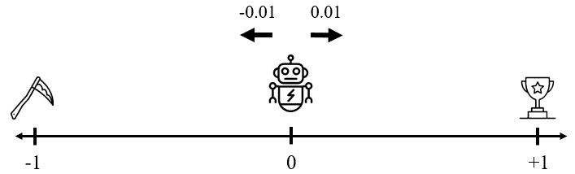

图 10.4 – 带稀疏奖励的简单机器人示例

正如你所想，使用稀疏奖励时，例如为到达奖杯给+1，为到达失败状态给-1，机器人很难发现奖杯。如果任务有超时限制，比如 200 步后，任务可能就会结束。

在这个例子中，我们可以通过给机器人提供一个随着其朝奖杯移动而增加的奖励来引导它。一个简单的选择是设定！[](img/Formula_10_010.png)，其中！[](img/Formula_10_011.png)是坐标轴上的位置。

这个奖励函数有两个潜在问题：

+   随着机器人向右移动，继续向右移动的相对增益逐渐变小。例如，从！[](img/Formula_10_012.png)到！[](img/Formula_10_013.png)的步进奖励增加了 10%，但从！[](img/Formula_10_014.png)到！[](img/Formula_10_015.png)的奖励只增加了 1.1%。

+   由于智能体的目标是最大化总的累计奖励，因此，智能体最好的选择并不是去达成奖杯目标，因为那样会终止任务。相反，智能体可能会选择永远停留在 0.99 处（或直到时间限制到达）。

我们可以通过塑造奖励来解决第一个问题，使得智能体朝成功状态移动时获得越来越多的附加奖励。例如，我们可以将奖励设置为！[](img/Formula_10_016.png)，范围为！[](img/Formula_10_017.png)：

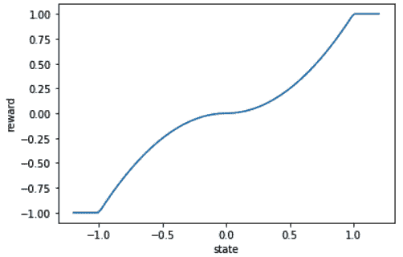

图 10.5 – 奖励塑造的示例，其中！[](img/Formula_10_018.png)

这样，随着机器人接近奖杯，激励的强度加大，进一步鼓励机器人向右移动。对于向左移动的惩罚情况也是类似的。

为了解决后者，我们应鼓励智能体尽快结束任务。我们需要通过对每一步时间进行惩罚，来促使智能体尽早结束任务。

这个例子展示了两点：即使在如此简单的问题中，设计奖励函数也可能变得复杂，并且我们需要将奖励函数的设计与我们设置的终止条件一起考虑。

在进入具体的奖励塑形建议之前，让我们也讨论一下终端条件在智能体行为中的作用。

### 终端条件

由于智能体的目标是最大化整个剧集的期望累积奖励，因此剧集的结束方式将直接影响智能体的行为。因此，我们可以并且应该利用一组好的终端条件来引导智能体。

我们可以讨论几种类型的终端条件：

+   **正向终端**表示智能体已经完成任务（或部分任务，具体取决于您如何定义成功）。该终端条件伴随着显著的正奖励，以鼓励智能体达成目标。

+   **负向终端**表示失败状态，并会给予显著的负奖励。智能体将尽力避免这些条件。

+   **中性终端**本身既不是成功也不是失败，但它表明智能体没有成功的路径，且在最后一步时，剧集会以零奖励结束。机器教师不希望智能体在此后继续在环境中待下去，而是应该重置回初始条件。虽然这不会直接惩罚智能体，但它防止了智能体收集额外的奖励（或惩罚）。因此，这是对智能体的隐性反馈。

+   **时间限制**限制了在环境中所花费的时间步数。它鼓励智能体在这一时间预算内寻求高奖励，而不是永远游荡。它作为反馈，告知哪些行动序列在合理的时间内能够获得奖励，哪些则不能。

在某些环境中，终端条件是预设的；但在大多数情况下，机器教师具有设置终端条件的灵活性。

现在我们已经描述了所有组件，接下来让我们讨论一些奖励塑形的实用技巧。

### 奖励塑形的实用技巧

在设计奖励函数时，您应该牢记以下一些一般性指导原则：

+   尽可能保持步奖励在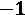和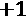之间，以保证数值稳定性。

+   用可以推广到问题其他版本的术语来表达您的奖励（和状态）。例如，与其奖励智能体到达某一点！[](img/Formula_10_021.png)，不如根据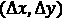激励其减少与目标的距离。

+   拥有平滑的奖励函数将为智能体提供易于跟随的反馈。

+   智能体应该能够将奖励与其观察结果相关联。换句话说，观察结果必须包含一些信息，说明什么行为导致了高奖励或低奖励。否则，智能体就无法根据这些信息做出决策。

+   接近目标状态的总激励不应超过到达目标状态的实际奖励。否则，智能体将倾向于集中精力积累这些激励，而不是实现实际目标。

+   如果您希望智能体尽快完成任务，可以为每个时间步分配一个负奖励。智能体将尝试完成回合，以避免积累负奖励。

+   如果智能体能够通过不到达终止状态来收集更多的正奖励，它将尝试在达到终止条件之前收集奖励。如果智能体在一个回合内可能只会收集到负奖励（例如，每个时间步都有惩罚），它将尝试尽快到达终止状态。如果智能体的生命过于痛苦，它可能会产生自杀行为，即智能体会寻求任何终止状态，包括自然的或失败的状态，以避免因保持生命而遭受过度的惩罚。

现在，我们将来看一个使用 OpenAI 进行奖励塑形的示例。

## 示例 – 山地车的奖励塑形

在 OpenAI 的山地车环境中，汽车的目标是到达其中一座山丘顶部的目标点，如*图 10.6*所示。动作空间包括将汽车推向左、推向右或不施加任何力量：

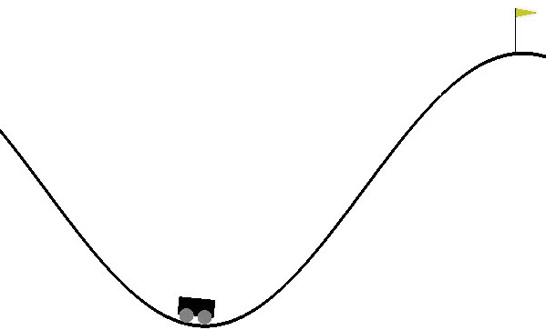

图 10.6 – 山地车环境

由于我们施加的力量不足以爬上山丘并到达目标，汽车需要通过朝相反方向逐渐积累势能来实现目标。弄清楚这一点并不简单，因为汽车在到达目标之前并不知道目标是什么，而这一点可以通过 100 多个正确动作来实现。在默认环境中，唯一的奖励是在每个时间步内给予-1，以鼓励汽车尽可能快地到达目标，从而避免积累负面奖励。该过程在 200 步后结束。

在本章中，我们将使用各种 MT 技术来训练我们的智能体。为此，我们将有一个自定义的训练流程和一个可以用来实验这些方法的定制化环境。首先，先进行设置。

### 设置环境

我们的自定义`MountainCar`环境包装了 OpenAI 的`MountainCar-v0`，其外观如下：

Chapter10/custom_mcar.py

```py
class MountainCar(gym.Env):
    def __init__(self, env_config={}):
        self.wrapped = gym.make("MountainCar-v0")
        self.action_space = self.wrapped.action_space
        ...
```

如果现在访问该文件，它可能看起来很复杂，因为它包含了一些我们还未讲解的附加组件。目前，只需要知道这是我们将要使用的环境。

我们将在本章中使用 Ray/RLlib 的 Ape-X DQN 来训练我们的智能体。请确保已安装这些工具，最好是在虚拟环境中：

```py
$ virtualenv rlenv
$ source rlenv/bin/activate
$ pip install gym[box2d]
$ pip install tensorflow==2.3.1
$ pip install ray[rllib]==1.0.1
```

这样，接下来让我们通过训练一个不使用任何 MT 的智能体来获取基线表现。

### 获取基线表现

我们将使用一个脚本进行所有的训练。在脚本的顶部，我们定义一个`STRATEGY`常量，用于控制训练中使用的策略：

Chapter10/mcar_train.py

```py
ALL_STRATEGIES = [
    "default",
    "with_dueling",
    "custom_reward",
    ...
]
STRATEGY = "default"
```

对于每种策略，我们将启动五次不同的训练，每次训练 200 万时间步，因此我们设置 `NUM_TRIALS = 5` 和 `MAX_STEPS = 2e6`。在每次训练结束时，我们将对训练好的代理进行评估，共进行 `NUM_FINAL_EVAL_EPS = 20` 次回合评估。因此，每种策略的结果将反映 100 个测试回合的平均长度，较低的数字表示更好的表现。

对于大多数策略，你会看到我们有两种变体：启用和不启用对战网络。当启用对战网络时，代理会取得接近最优的结果（大约 100 步达到目标），因此对于我们的案例来说变得不再有趣。此外，当我们在本章后续实现动作掩蔽时，为了避免 RLlib 中的复杂性，我们将不会使用对战网络。因此，在我们的示例中，我们将重点关注不使用对战网络的情况。最后，请注意，实验结果将写入 `results.csv` 文件。

这样，我们就开始训练我们的第一个代理。当我没有使用 MT 时，得到的平均回合长度如下：

```py
STRATEGY = "default"
```

结果如下：

```py
Average episode length: 192.23
```

接下来，我们来看看奖励塑造是否能在这里帮助我们。

### 通过奖励塑造解决问题

任何人看到山地车问题时都会明白，我们应该鼓励汽车向右行驶，至少最终如此。在本节中，我们就是这样做的。汽车的下沉位置对应于 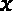 的 -0.5 位置。我们修改奖励函数，为代理提供一个二次增长的奖励，当它越过该位置向右行驶时。这发生在自定义的 `MountainCar` 环境中：

```py
    def step(self, action):
        self.t += 1
        state, reward, done, info = self.wrapped.step(action)
        if self.reward_fun == "custom_reward":
            position, velocity = state
            reward += (abs(position+0.5)**2) * (position>-0.5)
        obs = self._get_obs()
        if self.t >= 200:
            done = True
        return obs, reward, done, info
```

当然，欢迎在这里尝试自己定义奖励塑造，以获得更好的理解。

提示

应用恒定奖励，例如 -1，是稀疏奖励的一个例子，尽管步长奖励不是 0。之所以如此，是因为代理在整个回合结束前没有任何反馈；其行动在长时间内不会改变默认奖励。

我们可以通过以下标志启用自定义（塑造的）奖励策略：

```py
STRATEGY = "custom_reward"
```

我们得到的结果大致如下：

```py
Average episode length: 131.33
```

显然，这是一个显著的收益，因此我们的奖励塑造函数值得赞扬！不过，诚然，我花了几次迭代才找到能够带来显著改进的方式。这是因为我们鼓励的行为比单纯地向右行驶更复杂：我们希望代理在左右之间来回移动，以加速。这在奖励函数中有点难以捕捉，且很容易让人头疼。

奖励函数工程通常会变得相当棘手且耗时——这让这个话题值得专门的章节来讨论，我们接下来将深入探讨。

## 奖励函数工程的挑战

强化学习的目标是找到一个策略，最大化代理所收集的期望累计奖励。我们设计并使用非常复杂的算法来克服这一优化挑战。在某些问题中，我们使用数十亿个训练样本来实现这一目标，并尽力挤出一点额外的奖励。经过这一切折腾后，观察到你的代理获得了很高的奖励，但它展示的行为并不是你所期望的，这并不罕见。换句话说，代理学到的东西与你希望它学到的不同。如果你遇到这种情况，不要太生气。因为代理的唯一目的是最大化你指定的奖励。如果这个奖励并不能准确反映你心中的目标，这比你想象的要复杂得多，那么代理的行为也不会符合你的预期。

信息

由于奖励函数指定错误，OpenAI 的 CoastRunners 代理是一个著名的行为异常例子。在游戏中，代理的目标是尽可能快地完成船只竞速，同时沿途收集奖励。经过训练后，代理找到了一种收集更多奖励而不必完成比赛的方法，这违背了原始目的。你可以在 OpenAI 的博客中阅读更多关于它的信息：[`openai.com/blog/faulty-reward-functions/`](https://openai.com/blog/faulty-reward-functions/)。

因此，为你的任务指定一个好的奖励函数是至关重要的，尤其是当它包括定性和/或复杂的目标时。不幸的是，设计一个好的奖励函数更多的是一种艺术而非科学，你将通过实践和试错获得直觉。

提示

谷歌的机器学习研究员 Alex Irpan 优美地表达了奖励函数设计的重要性和挑战：“我开始把深度强化学习想象成一个恶魔，它故意误解你的奖励并积极寻找最懒的局部最优解。这有点荒谬，但我发现这实际上是一种富有成效的思维方式。”（Irpan, 2018）。Keras 的作者 François Chollet 说：“损失函数工程可能会成为未来的职业头衔。”（[`youtu.be/Bo8MY4JpiXE?t=5270`](https://youtu.be/Bo8MY4JpiXE?t=5270)）。

尽管面临这些挑战，我们刚才讨论的技巧应该能给你一个良好的开端。其余的将随着经验积累而到来。

这样，我们的奖励函数工程讨论就到此为止。这是一个漫长但必要的讨论。在下一节中，我们将讨论另一个主题——课程学习，这不仅在 MT 中重要，在强化学习中也是如此。

# 课程学习

当我们学习一项新技能时，我们从基础开始。学习篮球时，弹跳和运球是第一步。做空中接力不是第一课就该尝试的内容。你需要在掌握了前面的基本技能后，逐步进入更高级的课程。按照从基础到高级的课程体系学习，这也是整个教育系统的基础。问题是，机器学习模型是否也能从这种方法中获益？结果证明，确实可以！

在强化学习（RL）的背景下，当我们创建课程时，我们类似地从“简单”的环境配置开始。这种方式可以让智能体尽早了解什么是成功，而不是花费大量时间盲目探索环境，希望能偶然找到成功的办法。如果我们观察到智能体超过了某个奖励阈值，我们就会逐步增加难度。这些难度级别中的每一个都被视为一个**课程**。已经证明，课程学习能提高训练效率，并使那些对智能体来说无法实现的任务变得可行。

提示

设计课程和过渡标准是一项复杂的工作。它需要深思熟虑和领域专业知识。尽管我们在本章中遵循手动课程设计，但当我们在*第十一章*《泛化与部分可观察性》和*第十四章*《机器人学习》中重新讨论该主题时，我们将讨论自动课程生成方法。

在我们的山地车示例中，我们通过修改环境的初始条件来创建课程。通常，当剧集开始时，环境会随机化汽车在山谷底部的位置（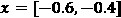），并将速度（）设置为 0。在我们的课程中，汽车将在第一课中靠近目标并朝右以较高的速度启动。这样，它将很容易到达目标。随着课程的进展，我们将逐渐将难度恢复到原本的状态。

具体来说，下面是我们如何定义课程的：

+   **课程 0**: 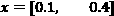, 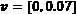

+   **课程 1**: 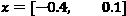, 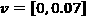

+   **课程 2**: 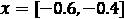, 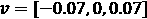

+   **课程 3**: 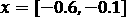, 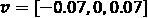

+   **课程 4（最终版 / 原版）**: 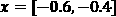, 

这是如何在环境中设置的：

```py
    def _get_init_conditions(self):
        if self.lesson == 0:
            low = 0.1
            high = 0.4
            velocity = self.wrapped.np_random.uniform(
                low=0, high=self.wrapped.max_speed
            )
        ...
```

一旦智能体在当前课程中取得了足够的成功，我们将允许它进入下一个课程。我们将这一成功标准定义为在 10 次评估剧集中，平均剧集长度小于 150。我们在训练和评估工作中使用以下功能来设置课程：

```py
CURRICULUM_TRANS = 150
...
def set_trainer_lesson(trainer, lesson):
    trainer.evaluation_workers.foreach_worker(
        lambda ev: ev.foreach_env(lambda env: env.set_lesson(lesson))
    )
    trainer.workers.foreach_worker(
        lambda ev: ev.foreach_env(lambda env: env.set_lesson(lesson))
    )
    ...
def increase_lesson(lesson):
    if lesson < CURRICULUM_MAX_LESSON:
        lesson += 1
    return lesson    if "evaluation" in results:
        if results["evaluation"]["episode_len_mean"] < CURRICULUM_TRANS:
            lesson = increase_lesson(lesson)
            set_trainer_lesson(trainer, lesson)
```

这些设置随后会被用于训练流程中：

```py
            if results["evaluation"]["episode_len_mean"] < CURRICULUM_TRANS:
                lesson = increase_lesson(lesson)
                set_trainer_lesson(trainer, lesson)
                print(f"Lesson: {lesson}")
```

所以，这就是我们如何实现手动课程安排。假设你用这个方法训练智能体：

```py
STRATEGY = "curriculum"
```

你会看到，我们得到的性能接近最优！

```py
Average episode length: 104.66
```

你刚刚通过课程安排教会了机器某些东西！挺酷的，对吧？现在它应该感觉像是 MT 了！

接下来，我们将看看另一种有趣的方法：使用示范的 MT 方法。

# 热启和示范学习

一个流行的技巧是通过训练智能体使用来自合理成功控制器（如人类）的数据，来向其展示成功的方式。在 RLlib 中，可以通过保存来自山地车环境的人类游戏数据来实现：

Chapter10/mcar_demo.py

```py
        ...
        new_obs, r, done, info = env.step(a)
        # Build the batch
        batch_builder.add_values(
            t=t,
            eps_id=eps_id,
            agent_index=0,
            obs=prep.transform(obs),
            actions=a,
            action_prob=1.0,  # put the true action probability here
            action_logp=0,
            action_dist_inputs=None,
            rewards=r,
            prev_actions=prev_action,
            prev_rewards=prev_reward,
            dones=done,
            infos=info,
            new_obs=prep.transform(new_obs),
        )
        obs = new_obs
        prev_action = a
        prev_reward = r
```

这些数据然后可以输入到训练中，该训练实现于 `Chapter10/mcar_train.py`。当我尝试时，RLlib 在多次尝试中都在训练时由于使用这种方法进行初始化时遇到 NaN 值而停滞。因此，现在你知道了这点，我们将把这个细节留给 RLlib 的文档：[`docs.ray.io/en/releases-1.0.1/rllib-offline.html`](https://docs.ray.io/en/releases-1.0.1/rllib-offline.html)，而不是在这里详细讨论。

# 动作屏蔽

我们将使用的最后一种 MT 方法是动作屏蔽（action masking）。通过这种方法，我们可以根据我们定义的条件，防止智能体在某些步骤中执行特定的动作。对于山地车问题，假设我们有一个直觉：在尝试爬坡之前需要积累动能。因此，如果汽车已经在山谷周围向左移动，我们希望智能体施加左侧的力。那么，在这些条件下，我们将屏蔽所有动作，除了左移：

```py
    def update_avail_actions(self):
        self.action_mask = np.array([1.0] * self.action_space.n)
        pos, vel = self.wrapped.unwrapped.state
        # 0: left, 1: no action, 2: right
        if (pos < -0.3) and (pos > -0.8) and (vel < 0) and (vel > -0.05):
            self.action_mask[1] = 0
            self.action_mask[2] = 0
```

为了能够使用这个屏蔽，我们需要构建一个自定义模型。对于被屏蔽的动作，我们将所有的 logits 推向负无穷大：

```py
class ParametricActionsModel(DistributionalQTFModel):
    def __init__(
        self,
        obs_space,
        action_space,
        num_outputs,
        model_config,
        name,
        true_obs_shape=(2,),
        **kw
    ):
        super(ParametricActionsModel, self).__init__(
            obs_space, action_space, num_outputs, model_config, name, **kw
        )
        self.action_value_model = FullyConnectedNetwork(
            Box(-1, 1, shape=true_obs_shape),
            action_space,
            num_outputs,
            model_config,
            name + "_action_values",
        )
        self.register_variables(self.action_value_model.variables())
    def forward(self, input_dict, state, seq_lens):
        action_mask = input_dict["obs"]["action_mask"]
        action_values, _ = self.action_value_model(
            {"obs": input_dict["obs"]["actual_obs"]}
        )
        inf_mask = tf.maximum(tf.math.log(action_mask), tf.float32.min)
        return action_values + inf_mask, state
```

最后，使用这个模型时，我们关闭对抗网络，以避免过于复杂的实现。此外，我们注册我们的自定义模型：

```py
    if strategy == "action_masking":
        config["hiddens"] = []
        config["dueling"] = False
        ModelCatalog.register_custom_model("pa_model", ParametricActionsModel)
        config["env_config"] = {"use_action_masking": True}
        config["model"] = {
            "custom_model": "pa_model",
        }
```

为了用这种策略训练智能体，请设置以下内容：

```py
STRATEGY = "action_masking"
```

性能将如下所示：

```py
Average episode length: 147.22
```

这肯定比默认情况下有所改进，但它仍落后于奖励塑形和课程学习方法。更智能的屏蔽条件和添加对抗网络可以进一步提高性能。

这就是我们在山地车问题中使用的 MT 技巧的结束部分。在总结之前，我们再看一个 MT 中的重要话题。

# 概念网络

MT 方法的一个重要部分是将问题划分为对应不同技能的概念，以便促进学习。例如，对于自动驾驶汽车，为高速公路上的巡航和超车训练不同的智能体可能有助于提高性能。在某些问题中，概念之间的划分更加明确。在这些情况下，为整个问题训练一个单一的智能体通常会带来更好的表现。

在结束这一章之前，我们来谈谈 MT 方法的一些潜在缺点。

# MT 的缺点与前景

MT 方法有两个潜在的缺点。

首先，通常很难提出好的奖励塑造、好的课程设计、一组动作屏蔽条件等等。这在某些方面也违背了从经验中学习、无需进行特征工程的初衷。另一方面，凡是我们能够做到的，特征工程和 MT 在帮助智能体学习并提高数据效率方面可能非常有帮助。

其次，当我们采用 MT 方法时，可能会将教师的偏见传递给智能体，这可能会阻碍其学习更好的策略。机器教师需要尽量避免这种偏见。

做得好！我们已经完成了这一激动人心章节的内容。接下来，让我们总结一下我们所覆盖的内容。

# 摘要

在本章中，我们讨论了人工智能中的一个新兴范式——MT，它涉及将学科专家（教师）的专业知识有效传递给机器学习算法。我们讨论了这与人类教育的相似之处：通过在他人知识的基础上建立，通常不需要重新发明这些知识。这种方法的优点是极大提高了机器学习中的数据效率，并且在某些情况下，使得没有教师的情况下本不可能实现的学习变得可能。我们讨论了该范式中的各种方法，包括奖励函数工程、课程学习、示范学习、动作屏蔽和概念网络。我们观察到这些方法中的一些显著提高了 Ape-X DQN 的基本应用。最后，我们还介绍了这一范式的潜在弊端，即教学过程和工具的设计难度，以及可能引入的偏见。尽管有这些弊端，MT 将在不久的将来成为强化学习科学家工具箱中的标准组成部分。

在下一章中，我们将讨论泛化和部分可观察性，这是强化学习中的一个关键主题。在这个过程中，我们将再次回顾课程学习，并看看它如何帮助创建鲁棒的智能体。

另一面见！

# 参考文献

+   Bonsai. (2017). *深度强化学习模型：奖励函数编写技巧与窍门*。Medium。网址：[`bit.ly/33eTjBv`](https://bit.ly/33eTjBv)

+   Weng, L. (2020). *强化学习课程设计*。Lil'Log。网址：[`bit.ly/39foJvE`](https://bit.ly/39foJvE)

+   OpenAI. (2016). *野外中的有缺陷奖励函数*。OpenAI 博客。网址：[`openai.com/blog/faulty-reward-functions/`](https://openai.com/blog/faulty-reward-functions/)

+   Irpan, A. (2018). *深度强化学习尚未成功*。Sorta Insightful。网址：[`www.alexirpan.com/2018/02/14/rl-hard.html`](https://www.alexirpan.com/2018/02/14/rl-hard.html)

+   Heess, N. 等. (2017). *在丰富环境中运动行为的出现*。arXiv.org。网址：[`arxiv.org/abs/1707.02286`](http://arxiv.org/abs/1707.02286)

+   Bonsai. (2017). *编写优秀的奖励函数* – Bonsai。YouTube。网址：[`youtu.be/0R3PnJEisqk`](https://youtu.be/0R3PnJEisqk)

+   Badnava, B. & Mozayani, N. (2019). *一种基于潜力的新型奖励塑形方法用于强化学习代理*. arXiv.org. URL: [`arxiv.org/abs/1902.06239`](http://arxiv.org/abs/1902.06239)

+   微软研究院. (2019). *奖励机器：构建奖励函数规范并减少样本复杂度*. YouTube. URL: [`youtu.be/0wYeJAAnGl8`](https://youtu.be/0wYeJAAnGl8)

+   美国政府财政. (2020). URL: [`www.usgovernmentspending.com/`](https://www.usgovernmentspending.com/)

+   AlphaStar 团队. (2019). *AlphaStar：掌握即时战略游戏《星际争霸 II》*. DeepMind 博客. URL: [`bit.ly/39fpDIy`](https://bit.ly/39fpDIy)
