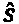
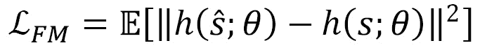
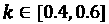
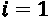
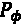

# 第十一章：*第十一章*：泛化与领域随机化

深度**强化学习**（**RL**）已经实现了早期 AI 方法无法做到的事情，例如在围棋、Dota 2 和星际争霸 II 等游戏中击败世界冠军。然而，将 RL 应用于现实问题仍然充满挑战。实现这一目标的两个关键障碍是将训练好的策略推广到广泛的环境条件，并开发能够处理部分可观测性的策略。正如我们将在本章中看到的，这两个挑战紧密相关，我们将提出解决方案。

本章将覆盖以下内容：

+   泛化与部分可观测性的概述

+   泛化的领域随机化

+   利用记忆克服部分可观测性

这些主题对理解 RL 在现实世界应用中的成功实施至关重要。让我们立即深入探讨吧！

# 泛化与部分可观测性的概述

正如所有机器学习一样，我们希望我们的 RL 模型不仅能在训练数据上工作，还能在测试时应对广泛的条件。然而，当你开始学习 RL 时，过拟合的概念不像在监督学习中那样被优先讨论。在本节中，我们将比较监督学习和 RL 中的过拟合与泛化，描述泛化与部分可观测性之间的密切关系，并提出一个通用方法来应对这些挑战。

## 监督学习中的泛化与过拟合

监督学习中最重要的目标之一，例如在图像识别和预测中，就是防止过拟合，并在未见过的数据上获得高准确性——毕竟，我们已经知道训练数据中的标签。为此，我们使用各种方法：

+   我们为模型训练、超参数选择和模型性能评估分别使用独立的训练集、开发集和测试集。模型不应根据测试集进行修改，以确保对模型性能的公正评估。

+   我们使用各种正则化方法，例如惩罚模型方差（例如 L1 和 L2 正则化）和丢弃法，以防止过拟合。

+   我们尽可能使用大量数据来训练模型，这本身就具有正则化作用。在数据不足的情况下，我们利用数据增强技术生成更多数据。

+   我们的目标是拥有一个多样化的数据集，并且该数据集与我们在模型部署后期望看到的数据分布相同。

这些概念在你学习监督学习时就会出现，并且它们构成了如何训练模型的基础。然而，在 RL 中，我们似乎并没有以相同的心态来看待过拟合。

让我们更详细地了解 RL 中的不同之处，探讨原因，以及泛化是否真的不那么重要。

## RL 中的泛化与过拟合

深度监督学习众所周知需要大量的数据。但深度强化学习对数据的需求远远超过了深度监督学习，因为反馈信号中存在噪声，而且强化学习任务本身的复杂性。训练强化学习模型常常需要数十亿的数据点，并且持续多个月。由于使用物理系统生成如此庞大的数据几乎不可能，深度强化学习研究已经利用了数字环境，如仿真和视频游戏。这模糊了训练与测试之间的界限。

想一想：如果你训练一个强化学习代理来玩雅达利游戏，比如《太空入侵者》（Space Invaders），并且训练得非常好（这是大多数强化学习算法的基准测试），并且使用了大量的数据，那么如果代理在训练后玩《太空入侵者》非常好，这样有问题吗？嗯，在这种情况下，没有问题。然而，正如你可能已经意识到的，这样的训练工作流程并没有像监督学习模型训练那样采取任何措施来防止过拟合。可能你的代理已经记住了游戏中的各种场景。如果你只关心雅达利游戏，那么看起来强化学习中的过拟合似乎并不是一个问题。

当我们离开雅达利（Atari）环境，例如训练一个代理去击败人类竞争者，比如围棋、Dota 2 和星际争霸 II，过拟合开始成为一个更大的问题。正如我们在*第九章*中看到的，*多智能体强化学习*，这些代理通常是通过自我对弈进行训练的。在这种环境下，一个主要的危险是代理会过拟合彼此的策略。为了防止这种情况，我们通常会训练多个代理，并让它们分阶段地相互对战，这样一个代理就能遇到多样化的对手（从代理的视角来看就是环境），从而减少过拟合的机会。

过拟合在强化学习（RL）中成为了一个巨大的问题，远远超过了我们之前提到的两种情况，即我们在仿真环境中训练模型并将其部署到物理环境中。这是因为，无论仿真有多高保真度，它（几乎）永远不会与现实世界完全相同。这就是所谓的**sim2real gap**（仿真到现实的差距）。仿真涉及许多假设、简化和抽象。它只是现实世界的一个模型，正如我们都知道的，所有模型都是错误的。我们无处不在地使用模型，那为什么这一下子在强化学习中变成了一个主要问题呢？嗯，原因在于，训练和强化学习代理需要大量的数据（这也是我们最初需要仿真环境的原因），而在相似数据上长期训练任何机器学习模型都会导致过拟合。因此，强化学习模型极有可能会过拟合仿真环境中的模式和怪癖。在这种情况下，我们真的需要强化学习策略能够超越仿真环境，从而使其变得有用。这对强化学习来说是一个严峻的挑战，也是将强化学习应用于实际应用中的最大障碍之一。

sim2real 差距是一个与部分可观察性密切相关的概念。接下来我们将讨论这一联系。

## 泛化与部分可观察性之间的联系

我们提到过，模拟永远不可能和现实世界完全相同。这种差异可以通过以下两种形式表现出来：

+   在一些问题中，你永远无法在模拟中得到与现实世界完全相同的观察结果。训练自动驾驶汽车就是一个例子。现实场景总是不同的。

+   在某些问题中，你可以训练代理在与现实世界中看到的相同观察下进行操作——例如一个工厂生产规划问题，其中观察到的内容包括需求预测、当前库存水平和机器状态。如果你知道观察数据的范围，你可以设计模拟以反映这一点。然而，模拟和现实生活总会有所不同。

在前一种情况中，你的训练代理可能在模拟之外无法很好地泛化，这一点更为明显。然而，后一种情况就有些微妙了。在这种情况下，尽管观察结果相同，但两种环境之间的世界动态可能并不一致（诚然，这对于前一种情况也会是一个问题）。你能回忆起这和什么相似吗？部分可观察性。你可以将模拟与现实世界之间的差距视为部分可观察性的结果：有一个环境的状态被隐藏，影响了转移动态。所以，即使代理在模拟和现实世界中做出相同的观察，它并未看到这个我们假设用来捕捉两者差异的隐藏状态。

正因为有这种联系，我们在本章中将泛化和部分可观察性一并讨论。话虽如此，即使在完全可观察的环境中，泛化仍然可能是一个问题，而即便泛化不是主要问题，我们也可能需要处理部分可观察性。我们稍后会探讨这些维度。

接下来，让我们简要讨论如何解决这些挑战，然后再深入到后续章节的细节中。

## 通过记忆克服部分可观察性

你还记得第一次进入高中教室时的感觉吗？很可能有很多新面孔，你希望交朋友。然而，你不会仅凭第一印象就接近别人。尽管第一印象确实能让我们了解一些关于人的信息，但它仅仅反映了他们的一部分。你真正想做的是随着时间的推移进行观察，然后再做判断。

在强化学习（RL）背景下情况类似。以下是来自 Atari 游戏《Breakout》的一个例子：


图 11.1 – Atari 游戏的单一帧画面提供了环境的部分观察

从单一游戏场景中并不十分清楚球的移动方向。如果我们有来自先前时刻的另一张快照，我们就能估算球的位置变化和速度变化。再多一张快照，能够帮助我们估算速度变化、加速度等等。因此，当环境是部分可观察的时，根据不仅是单一观察，而是一系列观察采取行动，会导致更有依据的决策。换句话说，拥有**记忆**使得 RL 代理能够发现单一观察中不可见的部分。

在 RL 模型中，有多种方式可以保持记忆，我们将在本章稍后详细讨论这些方法。

在此之前，让我们简要讨论如何克服过拟合。

## 通过随机化克服过拟合

如果你是一名司机，想想你是如何在不同条件下获得驾驶经验的。你可能开过小车、大车、加速快慢不一的车、车身高低不同的车，等等。此外，你可能还在雨天、雪天、沥青路面和碎石路面上开过车。我个人就有过这些经历。所以，当我第一次试驾特斯拉 Model S 时，刚开始确实感觉是一种完全不同的体验。但几分钟后，我就习惯了，并开始驾驶得相当舒适。

现在，作为一名司机，我们通常无法精确地定义一辆车与另一辆车之间的差异：它们在重量、扭矩、牵引力等方面的确切差异，使得我们在面对环境时会有部分不可见的感知。但是，我们在多样化驾驶条件下的过去经验帮助我们在开车几分钟后快速适应新的环境。这是如何发生的呢？我们的脑袋能够为驾驶过程建立一个通用的物理模型（并作出相应的行为），当经历足够多样时，而不是“过拟合”某种驾驶风格到特定的车和条件上。

我们处理过拟合并实现泛化的方法在我们的 RL（强化学习）代理中是类似的。我们将使代理暴露于许多不同的环境条件，包括那些它不一定能够完全观察到的条件，这被称为**领域随机化**（**DR**）。这将为代理提供超越模拟及其训练条件的泛化所必需的经验。

除此之外，我们在监督学习中使用的正则化方法对于 RL 模型也非常有帮助，正如我们将要讨论的那样。

接下来，让我们在下一节中总结与泛化相关的讨论。

## 泛化的配方

如今通过前面的示例，应该已经很清楚，我们实现泛化需要三种成分：

+   多样化的环境条件帮助代理丰富其经验

+   模型记忆帮助代理发现环境中的潜在条件，尤其是当环境是部分可观察时

+   使用类似于监督学习中的正则化方法

现在是时候让讨论更具体，谈论如何处理泛化和部分可观测性的方法了。我们从使用域随机化进行泛化开始，然后讨论使用记忆克服部分可观测性。

# 域随机化用于泛化

我们之前提到过，经验的多样性有助于泛化。在强化学习（RL）中，我们通过在训练过程中随机化环境参数来实现这一点，这被称为 DR。这些参数的例子，比如对于一个搬运和操作物体的机器人手来说，可能如下：

+   物体表面的摩擦系数

+   重力

+   物体的形状和重量

+   输入执行器的功率

深度强化学习（DR）在机器人应用中尤其受欢迎，因为它能够克服仿真与现实之间的差距，因为智能体通常在仿真环境中训练，并在现实世界中部署。然而，每当涉及到泛化时，DR 是训练过程中必不可少的一部分。

为了更具体地说明环境参数是如何随机化的，我们需要讨论如何表示相同类型问题的两个环境可能会有所不同。

## 随机化的维度

从*Rivilin*（2019）借鉴的，下面的章节展示了相似环境之间差异的有用分类。

### 相同/相似状态下的不同观察结果

在这种情况下，两个环境发出的观察结果不同，尽管底层的状态和转移函数是相同的或非常相似的。一个例子是相同的 Atari 游戏场景，但背景和纹理颜色不同。游戏状态没有变化，但观察结果有所不同。一个更现实的例子是，当训练自动驾驶汽车时，仿真中的场景呈现“卡通化”外观，而在真实摄像头输入下却呈现真实的外观，即使是完全相同的场景。

#### 解决方案——向观察结果中添加噪声

在这些情况下，帮助泛化的方法是向观察结果中添加噪声，这样强化学习模型就能专注于那些实际重要的观察模式，而不是对无关细节进行过拟合。很快，我们将讨论一种具体的方法，叫做**网络随机化**，它将解决这个问题。

### 相同/相似的观察结果对应不同的状态

POMDP（部分可观察马尔可夫决策过程）之间的另一个区别是，当观察结果相同或相似时，底层状态实际上是不同的，这也叫做**同态状态**（aliased states）。一个简单的例子是两个不同版本的山地车环境，外观完全相同，但重力不同。这种情况在机器人应用中非常常见。考虑用机器人手操作物体，正如 OpenAI 的著名工作所展示的（我们将在本章后面详细讨论）：摩擦、重量、输入执行器的实际功率等，可能在不同的环境版本之间有所不同，而这些差异对智能体是不可观察的。

#### 解决方案 – 在随机化的环境参数下进行训练，并使用记忆

在这里应该采取的方法是，在多个不同版本的环境中进行训练，每个版本有不同的底层参数，并在强化学习（RL）模型中加入记忆。这将帮助智能体揭示环境的潜在特征。一个著名的例子是 OpenAI 的机器人手 manipulating objects（操作物体）在模拟中训练，容易受到模拟与现实之间差距（sim2real gap）的影响。我们可以通过随机化模拟参数来克服这种差距，适用于以下情境：

当与记忆结合使用，并且经过大多数环境条件的训练后，策略有望获得适应所处环境的能力。

### 同一问题类别的不同复杂度层次

这是我们本质上处理相同类型问题，但在不同复杂度层次下的情况。一个来自*Rivlin*，*2019*的好例子是带有不同节点数量的**旅行商问题**（**TSP**）。在这个环境中，RL 智能体的任务是在每个时间步决策下一个访问的节点，使得所有节点都被访问一次且以最小成本完成，同时在最后回到初始节点。事实上，我们在 RL 中处理的许多问题自然面临这种挑战，比如训练一个象棋智能体与不同水平的对手对战等。

#### 解决方案 – 通过课程在不同复杂度层次下进行训练

不出所料，在不同难度层次的环境中训练智能体是实现泛化的必要条件。也就是说，使用一种从简单环境配置开始，逐渐增加难度的课程，如我们之前在书中所描述的。这将可能使学习更加高效，甚至在某些没有课程时无法实现的情况下变得可行。

现在我们已经介绍了实现不同维度泛化的高级方法，接下来将讨论一些具体的算法。但首先，让我们介绍一个用于量化泛化的基准环境。

## 量化泛化

有多种方法可以测试某些算法/方法在未见过的环境条件下是否比其他方法更好地进行泛化，例如以下几种：

+   创建具有不同环境参数集的验证和测试环境

+   在现实生活中的部署中评估策略性能

执行后者并不总是可行的，因为现实生活中的部署可能不一定是一个选项。前者的挑战是确保一致性，并确保验证/测试数据在训练过程中没有被使用。此外，当基于验证性能尝试太多模型时，也可能会对验证环境进行过拟合。克服这些挑战的一种方法是使用程序化生成的环境。为此，OpenAI 创建了 CoinRun 环境，用于基准测试算法的泛化能力。我们来更详细地了解一下。

### CoinRun 环境

CoinRun 环境是一个角色尝试在没有碰到任何障碍物的情况下收集硬币的游戏。角色从最左边开始，硬币在最右边。关卡是根据底层概率分布程序化生成的，难度各异，如下所示：


图 11.2：CoinRun 中的两个关卡，难度不同（来源：Cobbe 等，2018）

以下是关于环境奖励函数和终止条件的更多细节：

+   环境中有动态和静态障碍物，当角色与其碰撞时会死亡，从而终止该回合。

+   只有在收集到硬币时才会给予奖励，这也会终止回合。

+   每个回合有 1,000 步的时间限制，回合会在时间到达时终止，除非角色死亡或到达硬币。

请注意，CoinRun 环境生成的所有（训练和测试）关卡都来自相同的分布，因此它不会测试策略的超出分布（外推）性能。

接下来，我们来安装这个环境并进行实验。

### 安装 CoinRun 环境

你可以按照以下步骤安装 CoinRun 环境：

1.  我们从设置和激活一个虚拟 Python 环境开始，因为 CoinRun 需要特定的包。因此，在你选择的目录中运行以下命令：

    ```py
    virtualenv coinenv
    source coinenv/bin/activate
    ```

1.  然后，我们安装必要的 Linux 包，包括一个著名的并行计算接口 MPI：

    ```py
    sudo apt-get install mpich build-essential qt5-default pkg-config
    ```

1.  然后，我们安装从 GitHub 仓库获取的 Python 依赖项和 CoinRun 包：

    ```py
    git clone https://github.com/openai/coinrun.git
    cd coinrun
    pip install tensorflow==1.15.3 # or tensorflow-gpu
    pip install -r requirements.txt
    pip install -e .
    ```

    请注意，我们需要安装一个旧版本的 TensorFlow。官方建议使用 CoinRun 的创建者推荐的 TensorFlow 1.12.0 版本。然而，使用较新的 TensorFlow 1.x 版本可能有助于避免使用 GPU 时出现的 CUDA 冲突。

1.  你可以使用键盘上的箭头键通过以下命令来测试环境：

    ```py
    python -m coinrun.interactive
    ```

很棒；祝你玩得开心，玩 CoinRun 愉快！我建议你先熟悉一下这个环境，以便更好地理解我们接下来要讨论的比较。

信息

你可以访问 CoinRun 的 GitHub 仓库，获取完整的命令集：[`github.com/openai/coinrun`](https://github.com/openai/coinrun)。

引入该环境的论文（*Cobbe 等，2018*）还提到了各种正则化技术如何影响 RL 中的泛化能力。我们将接下来讨论这一点，然后介绍其他的泛化方法。

## 正则化和网络架构对 RL 策略泛化的影响

作者发现，在监督学习中用于防止过拟合的几种技术，在强化学习（RL）中也同样有效。由于在论文中复现实验结果需要非常长的时间，每个实验需要数亿步，因此我们在此不再尝试复现。相反，我们为你提供了结果摘要和运行不同版本算法的命令。但你可以观察到，即使在 500k 时间步之后，应用我们接下来提到的正则化技术也能提高测试表现。

你可以通过以下命令查看该环境的所有训练选项：

```py
python -m coinrun.train_agent –help
```

让我们从运行一个没有任何正则化应用的基准开始。

### 基础训练

你可以使用 PPO 和 Impala 架构训练一个 RL 代理，而不对泛化能力进行任何改进，如下所示：

```py
python -m coinrun.train_agent --run-id BaseAgent --num-levels 500 --num-envs 60
```

这里，`BaseAgent`是你为代理决定的 ID，`--num-levels 500`表示训练时使用 500 个游戏关卡，并使用论文中默认的种子，`--num-envs 60`启动 60 个并行环境进行回滚，你可以根据机器上可用的 CPU 数量调整该参数。

为了在三个并行会话中测试训练好的代理，每个会话有 20 个并行环境，每个环境有五个关卡，你可以运行以下命令：

```py
mpiexec -np 3 python -m coinrun.enjoy --test-eval --restore-id BaseAgent -num-eval 20 -rep 5
```

平均测试奖励将显示在`mpi_out`中。在我的情况下，奖励从训练后的 300K 时间步的约 5.5 降至测试环境中的 0.8，以给你一个大概的参考。

此外，你可以通过运行以下命令来观察你的训练代理：

```py
python -m coinrun.enjoy --restore-id BaseAgent –hres
```

这实际上是很有趣的。

### 使用更大的网络

作者发现，正如在监督学习中一样，使用更大的神经网络通过更高的容量成功解决更多的测试场景，从而提高了泛化能力。他们还指出，然而，随着网络规模的增大，泛化能力的提升是递减的，因此泛化能力并不会随着网络规模线性提升。

要使用一个具有五个残差块的架构，而不是三个，每层中的通道数是原来的两倍，你可以添加`impalalarge`参数：

```py
python -m coinrun.train_agent --run-id LargeAgent --num-levels 500 --num-envs 60 --architecture impalalarge
```

同样，你可以使用为大代理案例提供的运行 ID 进行测试评估。

### 训练数据的多样性

为了测试多样化训练数据的重要性，作者比较了两种类型的训练，均包含 256M 时间步数，跨越 100 个和 10,000 个游戏关卡（通过`--num-levels`控制）。使用更多样化的数据后，测试性能从 30%提升到 90%以上（这也与训练性能相当）。

提示

增加数据多样性在监督学习和强化学习（RL）中起到了正则化的作用。这是因为随着多样性的增加，模型必须在相同的模型容量下解释更多的变化，从而迫使模型利用其容量专注于输入中的最重要模式，而不是过拟合噪声。

这强调了环境参数随机化在实现泛化中的重要性，稍后我们将在本章中单独讨论这一点。

### Dropout 和 L2 正则化

实验结果表明，dropout 和 L2 正则化都能改善泛化能力，分别增加了约 5%和 8%的成功率，基准测试性能约为 79%。

提示

如果您需要复习 dropout 和 L2 正则化，可以查看 Chitta Ranjan 的博客：[`towardsdatascience.com/simplified-math-behind-dropout-in-deep-learning-6d50f3f47275`](https://towardsdatascience.com/simplified-math-behind-dropout-in-deep-learning-6d50f3f47275)。

我们可以通过以下方式更详细地探讨这个问题：

+   从经验上来看，作者发现最佳的 L2 权重为 ，最佳的 dropout 率为 0.1。

+   从经验来看，L2 正则化对泛化的影响比 dropout 更大。

+   如预期所示，使用 dropout 的训练收敛速度较慢，因此分配了两倍的时间步数（512M）。

要在普通代理的基础上使用 0.1 的 dropout 率，可以使用以下命令：

```py
python -m coinrun.train_agent --run-id AgentDOut01 --num-levels 500 --num-envs 60 --dropout 0.1
```

同样，要使用 L2 正则化，权重为 0.0001，可以执行以下操作：

```py
python -m coinrun.train_agent --run-id AgentL2_00001 --num-levels 500 --num-envs 60 --l2-weight 0.0001
```

在您的 TensorFlow RL 模型中，您可以通过以下方式使用`Dropout`层来添加 dropout：

```py
from tensorflow.keras import layers 
...
x = layers.Dense(512, activation="relu")(x) 
x = layers.Dropout(0.1)(x)
...
```

要添加 L2 正则化，可以做类似以下操作：

```py
from tensorflow.keras import regularizers
...
x = layers.Dense(512, activation="relu", kernel_regularizer=regularizers.l2(0.0001))(x) 
```

信息

TensorFlow 有一个非常好的关于过拟合和欠拟合的教程，您可以查看：[`www.tensorflow.org/tutorials/keras/overfit_and_underfit`](https://www.tensorflow.org/tutorials/keras/overfit_and_underfit)。

接下来，让我们讨论数据增强。

### 使用数据增强

一种常见的防止过拟合的方法是数据增强，即对输入进行修改/扭曲，通常是随机的，以增加训练数据的多样性。当应用于图像时，这些技术包括随机裁剪、改变亮度和锐度等。以下是使用数据增强的 CoinRun 场景示例：


图 11.3 – 带数据增强的 CoinRun（来源：Cobbe 等，2018 年）

信息

关于数据增强的 TensorFlow 教程，请查看[`www.tensorflow.org/tutorials/images/data_augmentation`](https://www.tensorflow.org/tutorials/images/data_augmentation)。

数据增强，事实证明，在强化学习（RL）中也很有帮助，它能够提升测试性能，虽然略逊色于 L2 正则化。

### 使用批量归一化

批量归一化是深度学习中的关键工具之一，它有助于稳定训练并防止过拟合。

信息

如果你需要复习批量归一化的知识，可以查看 Chris Versloot 的博客：[`bit.ly/3kjzjno`](https://bit.ly/3kjzjno)。

在 CoinRun 环境中，你可以通过如下方式启用训练中的批量归一化层：

```py
python -m coinrun.train_agent --run-id AgentL2_00001 --num-levels 500 --num-envs 60 --use-data-augmentation 1
```

这将在每个卷积层后添加一个批量归一化层。

当你实现自己的 TensorFlow 模型时，批量归一化层的语法是`layers.BatchNormalization()`，并且可以传入一些可选的参数。

报告结果显示，使用批量归一化在所有其他正则化方法中（除了增加训练数据的多样性）能为测试性能提供第二大的提升。

### 添加随机性

最后，向环境中引入随机性/噪声被证明是最有用的泛化技术，能够将测试性能提高约 10%。本文在训练中使用了两种方法与 PPO 算法：

+   使用！[](img/Formula_11_002.png)-贪婪策略（通常与 Q 学习方法一起使用）

+   在 PPO 中增加熵奖励系数（），以鼓励策略提出的动作具有更多的方差

这些方法的良好超参数选择分别是！[](img/Formula_11_004.png) 和 。需要注意的是，如果环境的动态已经高度随机化，那么引入更多的随机性可能没有那么显著的影响。

### 结合所有方法

在训练过程中同时使用所有这些正则化方法，仅稍微改善了单个方法带来的提升，表明这些方法各自都在防止过拟合方面起到了类似的作用。需要注意的是，无法确定这些方法对所有 RL 问题的影响完全相同。但我们需要记住的是，传统的监督学习正则化方法也能显著影响 RL 策略的泛化能力。

这就结束了我们关于 RL 的基本正则化技术的讨论。接下来，我们将研究另一种方法，这种方法紧随原始 CoinRun 论文之后，即网络随机化。

## 网络随机化和特征匹配

网络随机化，由 Lee 等人于 2020 年提出，简单地涉及使用观测的随机变换，！[](img/Formula_11_006.png)，如下所示：


然后，变换后的观察值作为输入被送入 RL 算法中使用的常规策略网络。在这里，是此变换的参数，每次训练迭代时都会随机初始化。通过在输入层之后添加一个不可训练并且定期重新初始化的层，可以简单实现这一点。在 TensorFlow 2 中，可以按如下方式实现一个在每次调用后转换输入的随机化层：

```py
class RndDense(tf.keras.layers.Layer):
    def __init__(self, units=32):
        super(RndDense, self).__init__()
        self.units = units
    def build(self, input_shape):  
        self.w_init = tf.keras.initializers.GlorotNormal()
        self.w_shape = (input_shape[-1], self.units)
        self.w = tf.Variable(
            initial_value=self.w_init(shape=self.w_shape, dtype="float32"),
            trainable=True,
        )
    def call(self, inputs):  
        self.w.assign(self.w_init(shape=self.w_shape, dtype="float32"))
        return tf.nn.relu(tf.matmul(inputs, self.w))
```

请注意，这个自定义层具有以下特性：

+   权重是不可训练的

+   在每次调用时为层分配随机权重

对该架构的进一步改进是进行两次前向传递，一次带有随机输入，一次不带，并强制网络给出相似的输出。这可以通过向 RL 目标添加一个损失来实现，该损失惩罚输出差异：



在这里，是策略网络的参数，而是策略网络中倒数第二层（即在输出动作的层之前的那一层）。这被称为**特征匹配**，它使得网络能够区分输入中的噪声和信号。

信息

该架构在 CoinRun 环境中的 TensorFlow 1.x 实现可以在[`github.com/pokaxpoka/netrand`](https://github.com/pokaxpoka/netrand)找到。通过将`random_ppo2.py`与`ppo2.py`进行比较，并将`random_impala_cnn`方法与`impala_cnn`方法在`policies.py`中的对比，您可以将其与原始的 CoinRun 环境进行比较。

回到我们之前提到的泛化维度，网络随机化有助于 RL 策略在这三个维度上进行泛化。

接下来，我们将讨论一种实现泛化的关键方法，该方法在现实生活中已被证明有效。

## 泛化的课程学习

我们已经讨论过，丰富的训练经验有助于 RL 策略更好地泛化。假设在您的机器人应用中，您已识别出需要在环境中随机化的两个参数，并为它们指定了最小值和最大值：

+   摩擦：

+   执行器扭矩：

这里的目标是使代理准备好在测试时应对具有未知摩擦-扭矩组合的环境。

事实证明，正如我们在上一章讨论课程学习时提到的，训练可能会导致一个平庸的智能体，如果你在一开始就尝试在这些参数的整个范围内进行训练。这是因为参数范围的极端值可能对尚未掌握任务基础的智能体来说过于具有挑战性（假设这些极端值围绕着某些合理的参数值）。课程学习的核心思想是从简单的场景开始，比如第一课可以是  和 ，然后通过扩展范围逐步增加难度。

接下来，一个关键问题是我们应该如何构建课程，课程应该是什么样子（也就是说，当智能体在当前课题中成功后，下一步的参数范围应是什么），以及何时宣布当前课题的成功。在本节中，我们将讨论两种自动生成和管理课程的课程学习方法，以有效进行领域随机化。

### 自动领域随机化

**自动领域随机化**（**ADR**）是 OpenAI 在其研究使用机器人手操控魔方时提出的一种方法。这是 RL 在机器人技术应用中最成功的案例之一，原因有很多：

+   灵活的机器人由于其高度的自由度，控制起来 notoriously 困难。

+   策略完全在仿真中训练，然后成功地转移到物理机器人上，成功弥合了模拟与现实之间的差距。

+   在测试时，机器人成功地在训练时未曾见过的条件下完成任务，例如手指被绑住、戴上橡胶手套、与各种物体发生扰动等。

    这些结果在训练策略的泛化能力方面是非常出色的。

    信息

    你应该查看这篇关于这一重要研究的博客文章，[`openai.com/blog/solving-rubiks-cube/`](https://openai.com/blog/solving-rubiks-cube/)。它包含了很好的可视化和对结果的深刻见解。

**ADR** 是该应用成功的关键方法。接下来，我们将讨论 ADR 是如何工作的。

#### ADR 算法

我们在训练过程中创建的每个环境都会对某些参数进行随机化，例如在前面的例子中，摩擦力和扭矩。为了正式表示这一点，我们说一个环境，，是由来参数化的，其中是参数的数量（在这个例子中为 2）。当一个环境被创建时，我们从一个分布中抽取，。ADR 调整的是参数分布的，从而改变不同参数样本的可能性，使得环境变得更难或更容易，具体取决于智能体在当前难度下是否成功。

一个例子，，将包括每个参数维度的均匀分布，，其中有。与我们的例子相联系，对应摩擦系数，。然后，对于初始课程，我们将有。对于扭矩参数也类似，。然后，变为以下内容：


ADR 建议如下：

+   随着训练的进行，分配一些环境用于评估，以决定是否更新。

+   在每个评估环境中，选择一个维度，，然后选择上限或下限之一进行关注，例如和。

+   将选定维度的环境参数固定在选定的边界上。其余参数从中抽样。

+   评估智能体在给定环境中的表现，并将该回合中获得的总奖励保存在与维度和边界相关的缓冲区中（例如，）。

+   当缓冲区中的结果足够时，将平均奖励与您事先设定的成功和失败阈值进行比较。

+   如果给定维度和边界的平均表现高于您的成功阈值，则扩展该维度的参数范围；如果低于失败阈值，则缩小范围。

总结来说，ADR 系统地评估每个参数维度在参数范围边界上的智能体表现，然后根据智能体的表现扩大或缩小范围。您可以参考论文中的伪代码，它应该与前面的解释配合使用时很容易理解。

接下来，我们将讨论另一种重要的自动课程生成方法。

### 使用高斯混合模型的绝对学习进展

另一种自动课程生成的方法是**使用高斯混合模型的绝对学习进展**（**ALP-GMM**）方法。该方法的本质如下：

+   用于识别环境参数空间中表现出最多学习进展的部分（称为 ALP 值）

+   为了将多个 GMM 模型拟合到 ALP 数据上，使用个核，然后选择最佳的一个

+   从最佳 GMM 模型中采样环境参数

这个想法源于认知科学，用来建模婴儿早期的语言发展。

新采样的参数向量的 ALP 分数，，计算公式如下：


这里，是通过获得的回合奖励，是先前回合获得的最接近的参数向量，是与相关的回合奖励。所有的对都保存在一个数据库中，表示为，通过它来计算 ALP 分数。然而，GMM 模型是使用最新的对来获得的。

请注意，具有较高 ALP 分数的参数空间部分更有可能被采样以生成新环境。高 ALP 分数表明该区域有学习潜力，可以通过观察新采样的下回合奖励的大幅下降或增加来获得。

信息

ALP-GMM 论文的代码库可以在[`github.com/flowersteam/teachDeepRL`](https://github.com/flowersteam/teachDeepRL)找到，其中还包含了展示算法如何工作的动画。由于篇幅限制，我们无法在这里详细讲解代码库，但我强烈建议你查看实现和结果。

最后，我们将提供一些关于泛化的额外资源，供进一步阅读。

## Sunblaze 环境

本书中无法覆盖所有的泛化方法，但一个有用的资源是 Packer & Gao, 2019 年发布的博客，介绍了 Sunblaze 环境，旨在系统地评估强化学习（RL）的泛化方法。这些环境是经典的 OpenAI Gym 环境的修改版，经过参数化以测试算法的插值和外推性能。

信息

你可以在[`bair.berkeley.edu/blog/2019/03/18/rl-generalization/`](https://bair.berkeley.edu/blog/2019/03/18/rl-generalization/)找到描述 Sunblaze 环境及其结果的博客文章。

做得非常棒！你已经了解了有关真实世界强化学习中最重要的主题之一！接下来，我们将讨论一个紧密相关的话题，即克服部分可观察性。

# 利用记忆克服部分可观察性

在本章开始时，我们描述了内存作为一种处理部分可观察性的有用结构。我们还提到过，泛化问题往往可以看作是部分可观察性的结果：

+   一个区分两个环境（例如模拟环境与真实世界）的隐藏状态可以通过内存揭示出来。

+   当我们实现领域随机化时，我们的目标是创建许多版本的训练环境，其中我们希望代理为世界动态建立一个总体模型。

+   通过内存，我们希望代理能够识别它所在环境的特征，即使它在训练过程中没有看到过这个特定的环境，然后相应地进行行动。

现在，模型的内存不过是将一系列观察作为输入处理的方式。如果你曾经处理过其他类型的序列数据与神经网络结合的任务，比如时间序列预测或**自然语言处理**（**NLP**），你可以采用类似的方法，将观察内存作为 RL 模型的输入。

让我们更详细地了解如何实现这一点。

## 堆叠观察

将观察序列传递给模型的一种简单方法是将它们拼接在一起，并将这个堆叠视为单一的观察。将时间点上的观察表示为，记作，我们可以形成一个新的观察，，并将其传递给模型，如下所示：


这里，是内存的长度。当然，对于，我们需要以某种方式初始化内存的早期部分，例如使用与维度相同的零向量。

事实上，简单地堆叠观察就是原始 DQN 工作处理 Atari 环境中部分可观察性的方法。更详细地说，该预处理的步骤如下：

1.  获取一个重新缩放的 RGB 屏幕帧。

1.  提取 Y 通道（亮度）进一步将帧压缩成图像。这样就得到了一个单一的观察。

1.  最新的帧被拼接成一个图像，形成一个具有内存的模型观察。

请注意，只有最后一步涉及内存，前面的步骤并不是严格必要的。

这种方法的明显优点是非常简单，生成的模型也很容易训练。然而，缺点是，这并不是处理序列数据的最佳方法，如果你曾经处理过时间序列问题或 NLP，应该不会对这一点感到惊讶。以下是一个原因的示例。

想象一下你对虚拟语音助手（如苹果的 Siri）说的以下句子：

*“帮我买一张从旧金山到波士顿的机票。”*

这与以下说法是相同的：

*"给我买一张从旧金山到波士顿的机票"*

假设每个单词都被传递到输入神经元，神经网络很难将它们轻松地理解为相同的句子，因为通常每个输入神经元期望特定的输入。在这种结构中，你需要使用该句子的所有不同组合来训练网络。更复杂的是，输入大小是固定的，但每个句子的长度可能不同。你也可以将这个思路扩展到强化学习问题中。

现在，在大多数问题中，堆叠观察值就足够了，比如 Atari 游戏。但是如果你试图教会你的模型如何玩 Dota 2 这种策略视频游戏，那么你就会遇到困难。

幸运的是，**递归** **神经** **网络**（**RNN**）来救场了。

## 使用 RNN

RNN 设计用于处理序列数据。一个著名的 RNN 变体，**长短期记忆**（**LSTM**）网络，能够有效地训练来处理长序列。当涉及到处理复杂环境中的部分可观察性时，LSTM 通常是首选：它被应用于 OpenAI 的 Dota 2 和 DeepMind 的 StarCraft II 模型中，当然还有许多其他模型。

信息

详细描述 RNN 和 LSTM 如何工作的内容超出了本章的范围。如果你想了解更多关于它们的知识，Christopher Olah 的博客是一个不错的资源：[`colah.github.io/posts/2015-08-Understanding-LSTMs/`](http://colah.github.io/posts/2015-08-Understanding-LSTMs/)。

在使用 RLlib 时，可以按如下方式启用 LSTM 层，比如在使用 PPO 时，并在默认值的基础上进行一些可选的超参数调整：

```py
import ray
from ray.tune.logger import pretty_print
from ray.rllib.agents.ppo.ppo import PPOTrainer
from ray.rllib.agents.ppo.ppo import DEFAULT_CONFIG
config = DEFAULT_CONFIG.copy()
config["model"]["use_lstm"] = True
# The length of the input sequence
config["model"]["max_seq_len"] = 8
# Size of the hidden state
config["model"]["lstm_cell_size"] = 64
# Whether to use
config["model"]["lstm_use_prev_action_reward"] = True
```

请注意，输入首先被传递到 RLlib 中的（预处理）"模型"，该模型通常是由一系列全连接层组成。预处理的输出随后会传递给 LSTM 层。

全连接层的超参数也可以类似地被覆盖：

```py
config["model"]["fcnet_hiddens"] = [32]
config["model"]["fcnet_activation"] = "linear"
```

在配置文件中指定环境为 Gym 环境名称或自定义环境类后，配置字典将传递给训练器类：

```py
from ray.tune.registry import register_env
def env_creator(env_config):
    return MyEnv(env_config)    # return an env instance
register_env("my_env", env_creator)
config["env"] = "my_env"
ray.init()
trainer = PPOTrainer(config=config)
while True:
    results = trainer.train()
    print(pretty_print(results))
    if results["timesteps_total"] >= MAX_STEPS:
        break
print(trainer.save())
```

使用 LSTM 模型时，有几个需要注意的事项，与简单地堆叠观察值不同：

+   由于需要对多步输入进行顺序处理，LSTM 的训练通常较慢。

+   与前馈网络相比，训练 LSTM 可能需要更多的数据。

+   你的 LSTM 模型可能对超参数更敏感，因此你可能需要进行一些超参数调优。

说到超参数，如果你的训练在像 PPO 这样的算法上进展不顺利，以下是一些可以尝试的值：

+   学习率（`config["lr"]`）：。

+   LSTM 单元大小（`config["model"]["lstm_cell_size"]`）：64，128，256。

+   值网络和策略网络之间的层共享（`config["vf_share_layers"]`）：如果你的回报是几百或更多，请尝试将其设为假，以防值函数损失主导策略损失。或者，你也可以减少 `config["vf_loss_coeff"]`。

+   熵系数（`config["entropy_coeff"]`）：

+   将奖励和之前的动作作为输入（`config["model"]["lstm_use_prev_action_reward"]`）：尝试将其设为真，以便在观察之外为智能体提供更多信息。

+   预处理模型架构（`config["model"]["fcnet_hiddens"]` 和 `config["model"]["fcnet_activation"]`）：尝试使用单一线性层。

希望这些内容有助于为你的模型构建一个良好的架构。

最后，我们来讨论一下最流行的架构之一：Transformer。

## Transformer 架构

在过去几年中，Transformer 架构基本上取代了 RNNs 在自然语言处理（NLP）应用中的地位。

Transformer 架构相较于最常用的 RNN 类型 LSTM，具有几个优势：

+   LSTM 编码器将从输入序列中获得的所有信息压缩到一个单一的嵌入层，然后传递给解码器。这在编码器和解码器之间创建了一个瓶颈。而 Transformer 模型允许解码器查看输入序列的每个元素（准确来说，是查看它们的嵌入）。

+   由于 LSTM 依赖时间反向传播，梯度很可能在更新过程中爆炸或消失。而 Transformer 模型则同时查看每个输入步骤，并不会遇到类似的问题。

+   结果是，Transformer 模型能够有效地处理更长的输入序列。

正因为如此，Transformer 也有可能成为强化学习应用中，RNNs 的竞争替代方案。

信息

如果你想了解该主题的更多内容，Jay Alammar 提供了一篇关于 Transformer 架构的优秀教程，网址为 [`jalammar.github.io/illustrated-transformer/`](http://jalammar.github.io/illustrated-transformer/)。

尽管原始的 Transformer 模型有其优势，但已被证明在强化学习应用中不稳定。已有改进方案被提出（*Parisotto et al., 2019*），名为**Gated Transformer-XL**（**GTrXL**）。

RLlib 已将 GTrXL 实现为自定义模型。它可以如下使用：

```py
...
from ray.rllib.models.tf.attention_net import GTrXLNet
...
config["model"] = {
    "custom_model": GTrXLNet,
    "max_seq_len": 50,
    "custom_model_config": {
        "num_transformer_units": 1,
        "attn_dim": 64,
        "num_heads": 2,
        "memory_tau": 50,
        "head_dim": 32,
        "ff_hidden_dim": 32,
    },
}
```

这为我们提供了另一个强大的架构，可以在 RLlib 中尝试。

恭喜你！我们已经到达本章的结尾！我们已经涵盖了几个重要主题，这些内容远比我们的篇幅所能表达的要更为深刻。请继续阅读*参考文献*部分的来源，并尝试我们介绍的仓库，以加深你对该主题的理解。

# 总结

在本章中，我们涵盖了强化学习中的一个重要主题：泛化和部分可观测性，这对于现实世界的应用至关重要。请注意，这是一个活跃的研究领域：保持我们在这里的讨论作为建议，并尝试为您的问题尝试的第一种方法。新方法定期推出，所以请留意。重要的是，您应始终关注泛化和部分可观测性，以便在视频游戏之外成功实施强化学习。在下一节中，我们将通过元学习将我们的探险提升到另一个高级水平。所以，请继续关注！

# 参考文献

+   Cobbe, K., Klimov, O., Hesse, C., Kim, T., & Schulman, J. (2018). *强化学习中的泛化量化*: [`arxiv.org/abs/1812.02341`](https://arxiv.org/abs/1812.02341)

+   Lee, K., Lee, K., Shin, J., & Lee, H. (2020). *网络随机化：深度强化学习中的一种简单技术用于泛化*: [`arxiv.org/abs/1910.05396`](https://arxiv.org/abs/1910.05396)

+   Rivlin, O. (2019 年 11 月 21 日). *深度强化学习中的泛化*。从 Towards Data Science 检索：[`towardsdatascience.com/generalization-in-deep-reinforcement-learning-a14a240b155b`](https://towardsdatascience.com/generalization-in-deep-reinforcement-learning-a14a240b155b)

+   Rivlin, O. (2019). *深度强化学习中的泛化*。从 Towards Data Science 检索：[`towardsdatascience.com/generalization-in-deep-reinforcement-learning-a14a240b155`](https://towardsdatascience.com/generalization-in-deep-reinforcement-learning-a14a240b155)

+   Cobbe, K., Klimov, O., Hesse, C., Kim, T., & Schulman, J. (2018). *强化学习中的泛化量化*: [`arxiv.org/abs/1812.0234`](https://arxiv.org/abs/1812.0234)

+   Lee, K., Lee, K., Shin, J., & Lee, H. (2020). *网络随机化：深度强化学习中的一种简单技术用于泛化*: [`arxiv.org/abs/1910.0539`](https://arxiv.org/abs/1910.0539)

+   Parisotto, E., 等人 (2019). *用于强化学习的稳定变换器*: [`arxiv.org/abs/1910.06764`](http://arxiv.org/abs/1910.06764)
