# 第十二章：元强化学习

与**强化学习**（**RL**）智能体相比，人类从较少的数据中学习新技能。这是因为首先，我们出生时大脑中就带有先验知识；其次，我们能够高效地将一种技能的知识迁移到另一种技能上。元强化学习（Meta-RL）旨在实现类似的能力。在本章中，我们将描述什么是元强化学习，我们使用了哪些方法，以及在以下主题下面临的挑战：

+   元强化学习简介

+   带有递归策略的元强化学习

+   基于梯度的元强化学习

+   元强化学习作为部分观测强化学习

+   元强化学习中的挑战

# 元强化学习简介

在本章中，我们将介绍元强化学习，这实际上是一个非常直观的概念，但一开始可能比较难以理解。为了让你更加清楚，我们还将讨论元强化学习与前几章中涉及的其他概念之间的联系。

## 学会学习

假设你正在说服一个朋友一起去你非常想去的旅行。你脑海中浮现出了几个论点。你可以谈论以下几点：

+   你目的地自然风光的美丽。

+   你已经精疲力尽，真的很需要这段时间休息。

+   这可能是你们一起旅行的最后机会，因为你将会很忙于工作。

好吧，你已经认识你的朋友很多年了，知道他们有多喜欢大自然，所以你意识到第一个论点将是最具吸引力的，因为他们喜欢大自然！如果是你的妈妈，也许你可以用第二个论点，因为她非常关心你，并且希望支持你。在这些情况下，你知道如何达成你想要的目标，因为你和这些人有共同的过去。

你曾经在一家商店离开时，比如去车行，买了比原计划更贵的东西吗？你是怎么被说服的？也许销售员猜出了你在乎以下几点：

+   你的家人，并说服你购买一辆让他们更舒适的 SUV

+   你的外表，并说服你购买一辆能吸引众人目光的跑车

+   环境，并说服你购买一辆没有排放的电动汽车

销售员不了解你，但通过多年的经验和培训，他们知道如何迅速有效地了解你。他们问你问题，了解你的背景，发现你的兴趣，弄清楚你的预算。然后，他们会给你提供一些选项，根据你的喜好和不喜欢，最终会给你一个定制的报价套餐，包括品牌、型号、升级选项和支付计划。

在这里，前面的例子对应强化学习（RL），其中智能体为特定环境和任务学习一个好的策略，以最大化其奖励。后面的例子则对应元强化学习（Meta-RL），其中智能体学习一个好的**过程**，以快速适应新的环境和任务，从而最大化奖励。

在这个例子之后，让我们正式定义元强化学习（meta-RL）。

## 定义元强化学习（meta-RL）。

在元强化学习中，每一轮，智能体面临一个任务 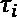，该任务来自一个分布 ， 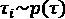。任务 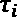 是一个**马尔可夫** **决策** **过程**（**MDP**），可能具有不同的转移和奖励动态，描述为 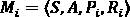，其中包括以下内容：

+    是状态空间。

+    是动作空间。

+   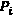 是任务 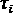 的转移分布。

+   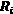 是任务  的奖励函数。

因此，在训练和测试期间，我们期望任务来自相同的分布，但我们并不期望它们完全相同，这正是典型机器学习问题中的设定。在元强化学习中，在测试时，我们期望智能体做以下事情：

1.  有效地探索以理解任务。

1.  适应任务。

元学习（meta-learning）是嵌入在动物学习中的。接下来让我们探索这种联系。

## 与动物学习及哈洛实验的关系

人工神经网络 notoriously 需要大量数据来训练。另一方面，我们的大脑能够从少量数据中更高效地学习。这主要有两个因素：

+   与未经训练的人工神经网络不同，我们的大脑是预训练的，且内嵌了视觉、听觉和运动技能任务的**先验**。一些尤其令人印象深刻的预训练生物是**初生性**动物，例如鸭子，它们的小鸭子在孵化后的两小时内便能下水。

+   当我们学习新任务时，我们在两个时间尺度上学习：在**快速循环**中，我们学习关于当前任务的具体内容；而如我们将看到的更多例子，在**慢速循环**中，我们学习**抽象**，这有助于我们将知识快速泛化到新的例子中。假设你学习某一特定的猫品种，例如美式卷耳猫，且你见到的所有例子都呈现白色和黄色。当你看到一只黑色的这种品种猫时，你不会觉得难以辨认。这是因为你已经发展出一种抽象的知识，帮助你通过这种猫独特的耳朵（向后卷曲）识别它，而非通过它的颜色。

机器学习中的一个大挑战是使得能够从类似先前情况的少量数据中学习。为了模仿*步骤 1*，我们会对训练好的模型进行微调，适应新任务。例如，一个在通用语料库（如维基百科页面、新闻文章等）上训练的语言模型，可以在一个专业语料库（如海事法）上进行微调，尽管可用的数据量有限。*步骤 2* 就是元学习的核心内容。

小贴士

经验上，对于新任务进行微调训练的模型，在强化学习（RL）中并不像在图像或语言任务中那样有效。事实证明，强化学习策略的神经网络表示不像图像识别中的那样层次化，例如，在图像识别中，第一层检测边缘，最后一层检测完整的物体。

为了更好地理解动物中的元学习能力，我们来看一个典型的例子：哈罗实验。

### 哈罗实验

哈罗实验探讨了动物中的元学习，涉及一只猴子，它一次被展示两个物体：

+   这些物体中的一个与食物奖励相关联，猴子需要发现这一点。

+   在每一步（共六步）中，物体被随机放置在左侧或右侧位置。

+   猴子必须学会根据物体本身，而不是物体的位置，来判断哪个物体给它带来奖励。

+   在六个步骤结束后，物体被替换为猴子不熟悉的新物体，并且这些物体与未知的奖励关联。

+   猴子在第一步中学会了随机挑选一个物体，理解哪个物体给它带来奖励，并在剩下的步骤中根据物体是否带来奖励而选择这个物体，而不考虑物体的位置。

这个实验很好地表达了动物中的元学习能力，因为它涉及到以下内容：

+   对于智能体来说，这是一个不熟悉的环境/任务

+   智能体通过一种策略有效适应不熟悉的环境/任务，这种策略包括必要的探索，实时制定特定任务的策略（根据与奖励相关联的物体做出选择，而非其位置），然后是利用阶段。

元强化学习的目标与此相似，正如我们稍后会看到的那样。现在，让我们继续探索元强化学习与我们已经涵盖的其他概念的关系。

## 与部分可观测性和领域随机化的关系

元强化学习程序的主要目标之一是在测试时揭示潜在的环境/任务。根据定义，这意味着环境是部分可观测的，而元强化学习是一种专门应对这一问题的方法。

在上一章，*第十一章*，*泛化与部分可观测性*中，我们讨论了处理部分可观测性时需要使用记忆和领域随机化。那么，元强化学习（meta-RL）有什么不同呢？嗯，记忆依然是元强化学习中一个关键的工具。我们还在训练元强化学习智能体时对环境/任务进行随机化，这类似于领域随机化。此时，它们可能对你来说似乎没有区别。然而，存在一个关键的区别：

+   在领域随机化中，训练智能体的目标是为环境的所有变化开发一个健壮的策略，涵盖一系列参数范围。例如，一个机器人可以在一系列摩擦力和扭矩值下进行训练。在测试时，基于一系列携带信息和扭矩的观察，智能体使用训练好的策略采取行动。

+   在元强化学习中，训练智能体的目标是为新的环境/任务开发一个适应程序，这可能会导致在探索阶段后测试时使用不同的策略。

在基于记忆的元强化学习方法中，差异仍然可能很微妙，并且在某些情况下，训练过程可能是相同的。为了更好地理解这种差异，请记住哈洛实验：领域随机化的想法不适用于该实验，因为每一集展示给智能体的对象在每次都是全新的。因此，智能体在元强化学习中并不是学习如何在一系列对象上采取行动。而是它学习如何发现任务，并在展示完全新对象时相应地采取行动。

现在，终于是时候讨论几种元强化学习方法了。

信息

元学习的先驱之一是斯坦福大学的切尔西·芬教授，她在博士阶段曾与加州大学伯克利分校的谢尔盖·莱文教授合作。芬教授开设了一门关于元学习的课程，课程链接在[`cs330.stanford.edu/`](https://cs330.stanford.edu/)。在本章中，我们主要遵循芬教授和莱文教授使用的元强化学习方法的术语和分类。

接下来，让我们从使用递归策略的元强化学习开始。

# 使用递归策略的元强化学习

在本节中，我们将介绍元强化学习中一种更直观的方法，该方法使用**递归** **神经** **网络**（**RNNs**）来保持记忆，也被称为 RL-2 算法。让我们从一个示例开始，理解这种方法。

## 网格世界示例

假设有一个网格世界，智能体的任务是从起始状态 S 到达目标状态 G。这些状态在不同任务中是随机放置的，因此智能体必须学会探索世界，以发现目标状态在哪里，并在此后获得丰厚奖励。当同一任务被重复时，期望智能体能够快速到达目标状态，这也就是适应环境，因为每经过一步就会遭受惩罚。这个过程在*图 12.1*中有所示意：

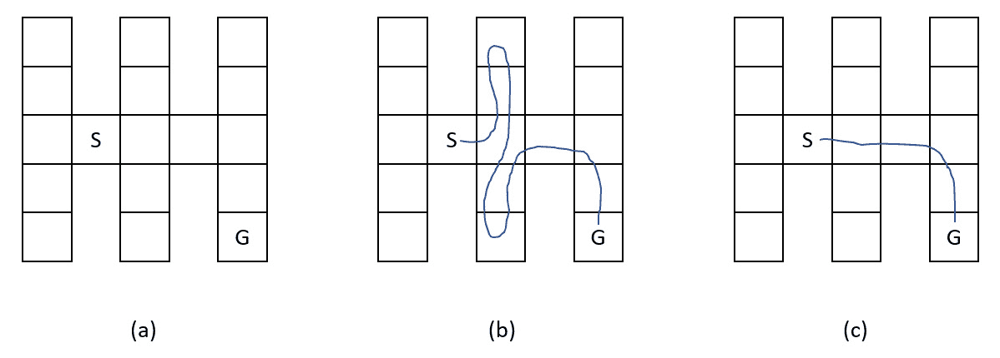

图 12.1 – 元强化学习的网格世界示例。（a）任务，（b）智能体对任务的探索，（c）智能体利用其所学的知识

为了在任务中表现出色，智能体必须执行以下操作：

1.  探索环境（在测试时）。

1.  记住并利用其先前学到的知识。

现在，由于我们希望智能体记住其先前的经验，我们需要引入一个记忆机制，意味着使用递归神经网络（RNN）来表示策略。有几个要点需要注意：

1.  仅仅记住过去的观察值是不够的，因为目标状态在不同任务之间是变化的。智能体还需要记住过去的动作和奖励，以便能够关联在特定状态下采取的哪些动作导致了哪些奖励，从而揭示任务的规律。

1.  仅仅记住当前回合中的历史是不够的。请注意，一旦智能体达到目标状态，回合就结束了。如果我们不将记忆传递到下一个回合，智能体将无法从前一个回合中获得的经验中受益。再者，请注意，在这里没有进行任何训练或更新策略网络的权重。这一切都发生在测试时，在一个未知的任务中。

处理前者很简单：我们只需要将动作和奖励与观察值一起喂给 RNN。为了处理后者，我们确保*除非任务发生变化，否则在回合之间不会重置循环状态*，以确保记忆不会中断。

现在，在训练过程中，为什么智能体会学习一个明确地以探索阶段开始新任务的策略呢？那是因为探索阶段帮助智能体发现任务，并在后续收获更高的奖励。如果我们在训练过程中仅基于单个回合奖励智能体，智能体将不会学到这种行为。因为探索是有即时成本的，这些成本只有在后续回合中才能回收，且当相同任务的记忆跨回合传递时才会得到补偿。为此，我们形成了**元回合**或**试验**，即！[](img/Formula_12_012.png)是将多个同一任务的回合串联起来的过程。再次强调，在每个回合内，循环状态不会被重置，奖励是根据元回合来计算的。如*图 12.2*所示：

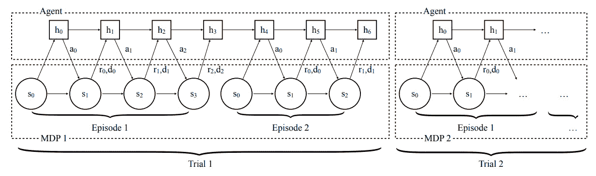

图 12.2 – 智能体与环境交互的过程（来源：Duan et al., 2017）

接下来，让我们看看如何在 RLlib 中实现这一点。

## RLlib 实现

关于我们之前提到的，元回合可以通过修改环境来形成，因此与 RLlib 并没有直接关系。至于其他部分，我们在智能体配置中的模型字典里进行修改：

1.  首先，我们启用**长短期记忆**（**LSTM**）模型：

    ```py
    "use_lstm": True
    ```

1.  我们将动作和奖励与观察值一起传递给 LSTM：

    ```py
    "lstm_use_prev_action_reward": True
    ```

1.  我们确保 LSTM 输入序列足够长，能够覆盖一个元任务中的多个回合。默认的序列长度为 `20`：

    ```py
    max_seq_len": 20
    ```

就是这些！你只需要通过几行代码更改，就可以训练你的元强化学习智能体！

信息

该过程可能并不总是收敛，或者即使收敛，也可能收敛到不好的策略。可以尝试多次训练（使用不同的种子）并调整超参数设置，这可能会帮助你获得一个好的策略，但这并不能保证成功。

这样，我们可以继续使用基于梯度的方法。

# 基于梯度的元强化学习

基于梯度的元强化学习方法提出，通过在测试时继续训练来改进策略，使策略能够适应所应用的环境。关键在于，策略参数在适应之前的状态，，应该设置成一种能够在少数几步内完成适应的方式。

提示

基于梯度的元强化学习（meta-RL）基于一个思想：某些策略参数的初始化可以使得在适应过程中，从非常少的数据中进行学习。元训练过程旨在找到这种初始化。

这个分支中的一个特定方法叫做**无模型元学习**（**MAML**），它是一种通用的元学习方法，也可以应用于强化学习。MAML 训练智能体完成各种任务，以找到一个有助于适应和从少量样本中学习的良好  值。

让我们来看一下如何使用 RLlib 来实现这一点。

## RLlib 实现

MAML 是 RLlib 中实现的一个智能体，并且可以很容易地与 Ray 的 Tune 一起使用：

```py
tune.run(
    "MAML",
    config=dict(
        DEFAULT_CONFIG,
        ...
    )
)
```

使用 MAML 需要在环境中实现一些额外的方法。这些方法分别是 `sample_tasks`、`set_task` 和 `get_task`，它们有助于在各种任务之间进行训练。一个示例实现可以是一个摆环境，RLlib 中的实现如下 ([`github.com/ray-project/ray/blob/releases/1.0.0/rllib/examples/env/pendulum_mass.py`](https://github.com/ray-project/ray/blob/releases/1.0.0/rllib/examples/env/pendulum_mass.py))：

```py
class PendulumMassEnv(PendulumEnv, gym.utils.EzPickle, MetaEnv):
    """PendulumMassEnv varies the weight of the pendulum
    Tasks are defined to be weight uniformly sampled between [0.5,2]
    """
    def sample_tasks(self, n_tasks):
        # Mass is a random float between 0.5 and 2
        return np.random.uniform(low=0.5, high=2.0, size=(n_tasks, ))
    def set_task(self, task):
        """
        Args:
            task: task of the meta-learning environment
        """
        self.m = task
    def get_task(self):
        """
        Returns:
            task: task of the meta-learning environment
        """
        return self.m
```

在训练 MAML 时，RLlib 会通过 `episode_reward_mean` 测量智能体在任何适应之前的环境表现。经过 *N* 次梯度适应步骤后的表现会显示在 `episode_reward_mean_adapt_N` 中。这些内部适应步骤的次数是智能体的一个配置项，可以修改：

```py
"inner_adaptation_steps": 1
```

在训练过程中，您可以在 TensorBoard 上看到这些指标：

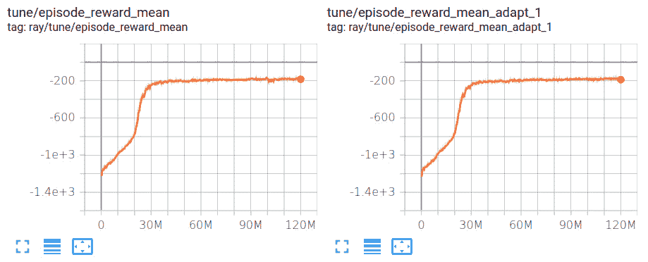

图 12.3 – TensorBoard 统计数据

就这样！现在，让我们介绍本章的最后一种方法。

# 元强化学习作为部分观测强化学习

元强化学习中的另一种方法是专注于任务的部分可观测特性，并明确地从直到此时为止的观测中估计状态：

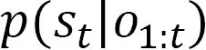

然后，基于任务在该回合中处于活动状态的可能性，或者更准确地说，基于包含任务信息的向量，形成一个可能任务的概率分布：

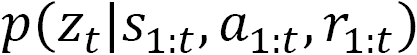

然后，从这个概率分布中迭代地抽取任务向量，并将其与状态一起传递给策略：

1.  抽样 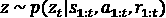。

1.  从接收状态和任务向量作为输入的策略中采取行动，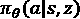。

有了这些内容，我们就结束了对三种主要元强化学习方法的讨论。在总结本章之前，让我们讨论一些元强化学习中的挑战。

# 元强化学习中的挑战

关于元强化学习的主要挑战，参见 *Rakelly*，*2019*，如下所示：

+   元强化学习需要在多个任务上进行元训练，这些任务通常是手工设计的。一个挑战是创建一个自动化过程来生成这些任务。

+   在元训练过程中，应该学习的探索阶段实际上并未有效学习。

+   元训练涉及从独立同分布的任务中进行采样，而这一假设并不现实。因此，一个目标是通过让元强化学习从任务流中学习，使其变得更加“在线”。

恭喜你走到这一步！我们刚刚讨论了元强化学习，这是一个可能很难吸收的概念。希望这次介绍能给你勇气深入阅读相关文献，并进一步探索这个话题。

# 总结

在这一章中，我们讨论了元强化学习（meta-RL），它是强化学习领域最重要的研究方向之一，因为它的潜力是训练能够快速适应新环境的智能体。为此，我们介绍了三种方法：递归策略、基于梯度的方法和基于部分可观察性的策略。目前，元强化学习还处于起步阶段，其表现尚不如更成熟的方法，因此我们讨论了该领域面临的挑战。

在下一章，我们将涵盖多个高级主题，并将其集中在一章中。所以，请继续关注，以进一步加深你的强化学习（RL）专业知识。

# 参考文献

+   *前额叶皮层作为元强化学习系统*，Wang, JX., Kurth-Nelson, Z., 等人： [`www.nature.com/articles/s41593-018-0147-8`](https://www.nature.com/articles/s41593-018-0147-8)

+   *元强化学习*： [`blog.floydhub.com/meta-rl/`](https://blog.floydhub.com/meta-rl/)

+   *前额叶皮层作为元强化学习系统*，博客： [`deepmind.com/blog/article/prefrontal-cortex-meta-reinforcement-learning-system`](https://deepmind.com/blog/article/prefrontal-cortex-meta-reinforcement-learning-system)

+   *RL2，快速强化学习通过慢速强化学习*，Duan, Y., Schulman, J., Chen, X., Bartlett, P. L., Sutskever, I., & Abbeel P.： [`arxiv.org/abs/1611.02779`](https://arxiv.org/abs/1611.02779)

+   *学习强化学习*，Wang, JX., Kurth-Nelson, Z., Tirumala, D., Soyer, H., Leibo, J. Z., Munos, R., Blundell, C., Kumaran, D., & Botvinick, M.： [`arxiv.org/abs/1611.05763`](https://arxiv.org/abs/1611.05763)

+   *开源 Psychlab*： [`deepmind.com/blog/article/open-sourcing-psychlab`](https://deepmind.com/blog/article/open-sourcing-psychlab)

+   *结构化探索策略的元强化学习*： [`papers.nips.cc/paper/2018/file/4de754248c196c85ee4fbdcee89179bd-Paper.pdf`](https://papers.nips.cc/paper/2018/file/4de754248c196c85ee4fbdcee89179bd-Paper.pdf)

+   *早熟性*： [`en.wikipedia.org/wiki/Precociality`](https://en.wikipedia.org/wiki/Precociality)

+   *元学习：从少样本学习到快速强化学习*：[`icml.cc/media/Slides/icml/2019/halla(10-09-15)-10-13-00-4340-meta-learning.pdf`](https://icml.cc/media/Slides/icml/2019/halla(10-09-15)-10-13-00-4340-meta-learning.pdf)

+   元学习研讨会（MetaLearn 2020）：[`meta-learn.github.io/2020/`](https://meta-learn.github.io/2020/)
