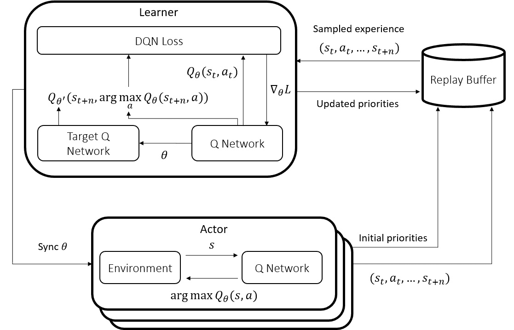
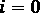
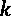
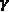
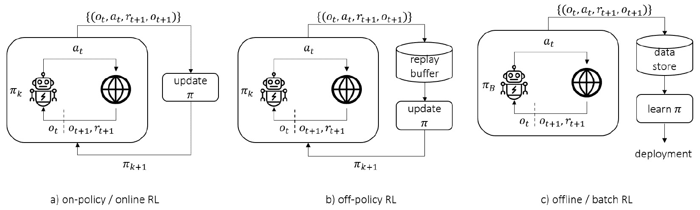

# 第十三章：*第十三章*：其他高级主题

本章将涵盖强化学习（RL）的几个高级主题。首先，我们将深入探讨分布式强化学习，除了之前章节中涉及的内容之外。这个领域对于处理训练智能体进行复杂任务所需的过多数据至关重要。好奇驱动的强化学习处理传统探索技术无法解决的困难探索问题。离线强化学习利用离线数据来获得良好的策略。所有这些都是热门的研究领域，您将在未来几年听到更多相关内容。

所以，在本章中，您将学习以下内容：

+   分布式强化学习

+   好奇驱动的强化学习

+   离线强化学习

让我们开始吧！

# 分布式强化学习

正如我们在之前的章节中提到的，训练复杂的强化学习智能体需要大量的数据。虽然研究的一个关键领域是提高强化学习中的样本效率；另一个互补方向则是如何最好地利用计算能力和并行化，减少训练的实际时间和成本。我们已经在前面的章节中讨论、实现并使用了分布式强化学习算法和库。因此，本节将是对之前讨论的扩展，因为这一话题非常重要。在这里，我们将介绍更多关于最先进的分布式强化学习架构、算法和库的内容。那么，让我们从 SEED RL 开始，这是一种为大规模和高效并行化设计的架构。

## 可扩展、高效的深度强化学习 – SEED RL

我们从重新审视 Ape-X 架构开始讨论，它是可扩展强化学习的一个里程碑。Ape-X 的关键贡献是将学习和行动解耦：演员们按自己的节奏生成经验，学习器按自己的节奏从这些经验中学习，而演员们则定期更新他们本地的神经网络策略副本。Ape-X DQN 的流程示意图见*图 13.1*：



图 13.1 – Ape-X DQN 架构，重新审视

现在，让我们从计算和数据通信的角度来分析这个架构：

1.  演员们，可能有数百个，会定期从中央学习器拉取  参数，即神经网络策略。根据策略网络的大小，成千上万的数字会从学习器推送到远程演员。这会在学习器和演员之间产生很大的通信负载，远远超过传输动作和观察所需的两倍数量级。

1.  一旦一个演员接收到策略参数，它便使用这些参数推断每个环境步骤的动作。在大多数设置中，只有学习者使用 GPU，演员则在 CPU 节点上工作。因此，在这种架构中，大量的推断必须在 CPU 上进行，相较于 GPU 推断，这种方式效率要低得多。

1.  演员在环境和推断步骤之间切换，这两者具有不同的计算需求。将这两个步骤执行在同一节点上，要么会导致计算瓶颈（当需要推断的节点是 CPU 节点时），要么会导致资源的低效利用（当节点是 GPU 节点时，GPU 的计算能力被浪费）。

为了克服这些低效问题，SEED RL 架构提出了以下关键方案：*将动作推断移至学习者端*。因此，演员将观察结果发送给中央学习者（那里存储着策略参数），并接收到回传的动作。通过这种方式，推断时间被缩短，因为推断在 GPU 上进行，而不是 CPU 上。

当然，故事并未结束。我们迄今所描述的情况带来了另一组挑战：

+   由于演员需要在每个环境步骤中将观察结果发送到远程学习者以接收动作，因此出现了**延迟**问题，这是之前所没有的。

+   当演员等待动作时，它保持空闲状态，导致*演员节点计算资源的低效利用*。

+   将单个观察结果传递给学习者 GPU 会增加总的*与 GPU 的通信开销*。

+   GPU 资源需要调整，以同时处理推断和学习。

为了克服这些挑战，SEED RL 具有以下结构：

+   一种非常快速的通信协议，称为**gRPC**，用于在演员和学习者之间传输观察结果和动作。

+   多个环境被放置在同一个演员上，以最大化利用率。

+   在将观察结果传递给 GPU 之前，会对其进行批处理以减少开销。

资源分配调整是第四个挑战，但这只是一个调优问题，而非根本性的架构问题。因此，SEED RL 提出了一种架构，可以做到以下几点：

+   每秒处理数百万条观察数据。

+   将实验成本降低高达 80%。

+   通过将训练速度提高三倍，减少墙钟时间。

SEED RL 架构如*图 13.2*所示，取自 SEED RL 论文，并将其与 IMPALA 进行了比较，IMPALA 也面临与 Ape-X 类似的缺点：


图 13.2 – IMPALA 与 SEED 架构的比较（来源：Espeholt 等人，2020）

到目前为止，一切顺利。有关实现细节，我们推荐参考*Espeholt 等人，2020*以及与论文相关的代码库。

信息

作者已将 SEED RL 开源，地址为 [`github.com/google-research/seed_rl`](https://github.com/google-research/seed_rl)。该仓库包含了 IMPALA、SAC 和 R2D2 代理的实现。

我们将很快介绍 R2D2 代理，并进行一些实验。但在结束本节之前，我们还会为你提供另一个资源。

信息

如果你有兴趣深入了解架构的工程方面，gRPC 是一个非常有用的工具。它是一个快速的通信协议，广泛应用于许多科技公司的微服务之间的连接。可以在 [`grpc.io`](https://grpc.io) 查看。

做得好！你现在已经掌握了分布式强化学习的最新技术。接下来，我们将介绍一种在分布式 RL 架构中使用的最先进的模型，R2D2。

## 分布式强化学习中的递归经验回放

最近强化学习文献中最具影响力的贡献之一，是 **递归回放分布式 DQN**（**R2D2**）代理，它在当时设定了经典基准的最新技术水平。R2D2 研究的主要贡献实际上是与 **递归神经网络**（**RNNs**）在强化学习代理中的有效应用有关，且这一方法也在分布式环境中实现。论文中使用了 **长短期记忆**（**LSTM**）作为 RNN 的选择，我们在接下来的讨论中也会采用这种方法。那么，首先让我们从训练 RNN 时初始化递归状态的挑战谈起，再讨论 R2D2 代理如何解决这个问题。

### 递归神经网络中的初始递归状态不匹配问题

在前几章中，我们讨论了携带观察记忆的重要性，以便揭示部分可观察的状态。例如，单独使用一帧 Atari 游戏画面将无法传达物体速度等信息，而基于一系列过去的画面，推算出物体速度等信息来做决策，会带来更高的奖励。如我们前面提到的，处理序列数据的有效方法是使用 RNNs。

RNN 的基本思想是将序列的输入逐一传递给同一个神经网络，同时将过去步骤的信息、记忆和摘要从一个步骤传递到下一个步骤，这一点在 *图 13.3* 中有所说明：


图 13.3 – RNN 的示意图，其中 a) 为紧凑表示，b) 为展开表示

这里的一个关键问题是，如何为初始递归状态  进行初始化。最常见和便捷的方式是将递归状态初始化为全零。对于环境中每一步的演员来说，这并不是一个大问题，因为这个初始递归状态对应于一个回合的开始。然而，在从对应于较长轨迹小段的存储样本进行训练时，这种初始化就成了一个问题。我们来看看为什么。

请考虑*图 13.4*所示的场景。我们正在尝试训练一个 RNN 来处理一个存储的样本 ，因此观测值是四帧组成的序列，这些帧被传递到策略网络中。所以， 是第一帧， 是采样的  序列中的最后一帧，也是最新的帧（同样的情况适用于 ）。当我们输入这些数据时， 将被获取并传递到后续步骤中，而我们对  使用零值：


图 13.4 – 使用一系列帧从 RNN 获取动作

现在，记住递归状态  的作用是总结直到第  步所发生的事情。当我们在训练期间使用零向量作为  时，例如在生成价值函数预测和 Q 函数的目标值时，会产生一些问题，这些问题虽然相关，但有所不同：

+   它不会传达任何关于该时间步之前发生了什么的有意义信息。

+   我们使用相同的向量（零向量），无论采样序列之前发生了什么，这会导致过载的表示。

+   由于零向量不是 RNN 的输出，它本身并不是 RNN 的有意义表示。

结果是，RNN 对隐状态的处理变得“混乱”，并减少了对记忆的依赖，这违背了使用递归神经网络的初衷。

一种解决方案是记录整个轨迹，并在训练时处理/重放它，以计算每一步的递归状态。这也存在问题，因为在训练时重放所有任意长度的样本轨迹会带来大量开销。

接下来，我们来看一下 R2D2 智能体是如何解决这个问题的。

### R2D2 对初始递归状态不匹配的解决方案

R2D2 智能体的解决方案是双管齐下：

+   存储回合中的递归状态。

+   使用烧入期。

接下来我们将更详细地探讨这些解决方案。

#### 存储回合中的递归状态

当智能体在环境中执行时，在每一集的开始，它初始化递归状态。然后，它使用递归策略网络在每个步骤采取行动，并且每个观察对应的递归状态也会被生成。R2D2 智能体将这些递归状态与采样的经验一起发送到重放缓冲区，以便稍后在训练时用它们初始化网络，而不是用零向量。

总体而言，这显著弥补了使用零初始化的负面影响。然而，这仍然不是一个完美的解决方案：存储在重放缓冲区中的递归状态在训练时使用时会变得过时。因为网络是不断更新的，而这些状态会携带由旧版本网络生成的表示，例如在回放时使用的网络。这被称为**表示漂移**。

为了缓解表示漂移，R2D2 提出了一种额外的机制，即在序列开始时使用预热期。

#### 使用预热期

使用预热期的工作方式如下：

1.  存储一个比我们通常存储的序列更长的序列。

1.  使用序列开头的额外部分，用当前参数展开 RNN。

1.  这样，生成一个不会过时的初始状态，适用于预热部分之后。

1.  在反向传播时不要使用预热部分。

这在*图 13.5*中有所描述：


图 13.5 – 表示 R2D2 使用存储的递归状态并进行两步预热的示意图

所以，图中的例子是说，与其使用 ，它是由某些旧策略  生成的，不如做如下操作：

1.  使用  来在训练时初始化递归状态。

1.  使用当前参数  展开 RNN 的递归状态，通过预热部分生成 。

1.  这有望从过时的表示  中恢复，并且比  更准确地初始化。

1.  这在精确度上更好，因为它更接近我们如果从一开始存储并展开整个轨迹，直到 ，使用  所得到的结果。

所以，这就是 R2D2 智能体。在我们结束这一部分之前，先来讨论一下 R2D2 智能体的成就。

### R2D2 论文的关键结果

R2D2 的工作提供了非常有趣的见解，我强烈推荐你阅读完整的论文。然而，为了我们讨论的完整性，以下是一个总结：

+   R2D2 在 Atari 基准测试中将 Ape-X DQN 创下的先前最高纪录提高了四倍，是第一个在 57 款游戏中有 52 款取得超人类水平表现的智能体，并且具有更高的样本效率。

+   它通过在所有环境中使用一组超参数来实现这一点，显示出智能体的强大鲁棒性。

+   有趣的是，即便在被认为是完全可观察的环境中，R2D2 也能提高性能，而在这些环境中，通常不指望使用记忆来帮助。作者通过 LSTM 的高表示能力来解释这一点。

+   存储递归状态并使用预热期都非常有益，其中前者的影响更大。可以将这两种方法结合使用，这是最有效的，或者单独使用。

+   使用零初始状态会降低智能体对记忆的依赖能力。

供您参考，在五个环境中，R2D2 智能体未能超过人类级别的表现，但通过修改参数，它实际上可以实现超越。剩下的两个环境，Montezuma's Revenge 和 Pitfall，是著名的难探索问题，后续章节将进一步讨论这两个环境。

这样一来，让我们在这里总结讨论，并进入一些实践工作。下一节中，我们将使用 SEED RL 架构与 R2D2 智能体。

## 实验 SEED RL 和 R2D2

在本节中，我们将简要演示 SEED RL 仓库及其如何用于训练智能体。让我们从设置环境开始。

### 设置环境

SEED RL 架构使用多个库，如 TensorFlow 和 gRPC，它们之间以相当复杂的方式进行交互。为了简化大部分配置工作，SEED RL 的维护者使用 Docker 容器来训练 RL 智能体。

信息

Docker 和容器技术是当今互联网服务背后的基础工具。如果你从事机器学习工程，或有兴趣在生产环境中提供你的模型，了解 Docker 是必不可少的。Mumshad Mannambeth 的快速 Docker 启蒙课程可在 [`youtu.be/fqMOX6JJhGo`](https://youtu.be/fqMOX6JJhGo) 上找到。

设置说明可以在 SEED RL GitHub 页面找到。简而言之，设置步骤如下：

1.  在你的机器上安装 Docker。

1.  启用以非 root 用户身份运行 Docker。

1.  安装 `git`。

1.  克隆 SEED 仓库。

1.  使用 `run_local.sh` 脚本启动仓库中定义的环境训练，如下所示：

    ```py
    ./run_local.sh [Game] [Agent] [Num. actors] 
    ./run_local.sh atari r2d2 4
    ```

如果你的 NVIDIA GPU 没有被 SEED 容器识别，可能需要对该设置进行一些附加配置：

+   在 [`docs.nvidia.com/datacenter/cloud-native/container-toolkit/install-guide.html`](https://docs.nvidia.com/datacenter/cloud-native/container-toolkit/install-guide.html) 安装 NVIDIA Container Toolkit。

+   安装 NVIDIA Modprobe，例如在 Ubuntu 上使用 `sudo apt-get install nvidia-modprobe`。

+   重启你的工作站。

一旦你的设置成功，你应该看到代理开始在 tmux 终端上训练，如*图 13.6*所示：


图 13.6 – SEED RL 在 tmux 终端上的训练

信息

Tmux 是一个终端复用器，基本上是终端内的窗口管理器。要快速了解如何使用 tmux，请查看[`www.hamvocke.com/blog/a-quick-and-easy-guide-to-tmux/`](https://www.hamvocke.com/blog/a-quick-and-easy-guide-to-tmux/)。

现在，你的机器上已经运行了 SEED，这是一款最先进的强化学习框架！你可以通过按照 Atari、Football 或 DMLab 示例文件夹中的说明，插入自定义环境进行训练。

信息

R2D2 代理也可以在 DeepMind 的 ACME 库中找到，里面还有许多其他代理：[`github.com/deepmind/acme`](https://github.com/deepmind/acme)。

接下来，我们将讨论好奇心驱动的强化学习。

# 好奇心驱动的强化学习

当我们讨论 R2D2 代理时，我们提到在基准测试集中只剩下少数几个 Atari 游戏，代理在这些游戏中无法超过人类表现。代理面临的剩余挑战是解决**困难探索**问题，这些问题有非常稀疏和/或误导性的奖励。后续的工作来自 Google DeepMind，也解决了这些挑战，使用了名为**Never Give Up**（**NGU**）和**Agent57**的代理，在基准测试中使用的 57 个游戏中都达到了超人类水平的表现。在本节中，我们将讨论这些代理以及它们用于有效探索的方法。

让我们从描述**困难探索**和**好奇心驱动学习**的概念开始。

## 针对困难探索问题的好奇心驱动学习

让我们来看看*图 13.7*所示的简单网格世界：


图 13.7 – 一个困难探索的网格世界问题

假设在这个网格世界中有以下设置：

+   总共有 102 个状态，101 个用于网格世界，1 个用于环绕它的悬崖。

+   代理从世界的最左端开始，目标是到达最右端的奖杯。

+   到达奖杯的奖励为 1,000，掉入悬崖的奖励为-100，每个时间步的奖励为-1，以鼓励快速探索。

+   一个回合结束的条件是：代理到达奖杯，掉进悬崖，或经过 1,000 个时间步。

+   在每个时间步，代理有五种可用的动作：保持静止，或向上、向下、向左或向右移动。

如果你在当前设置下训练一个代理，即使使用我们已覆盖的最强算法，如 PPO、R2D2 等，最终得到的策略可能也是自杀式的：

+   通过随机动作很难偶然找到奖杯，因此代理可能永远不会发现网格世界中有一个高奖励的奖杯。

+   等到回合结束会导致总奖励为-1000。

+   在这个黑暗的世界里，智能体可能决定尽早自杀，以避免长时间的痛苦。

即使是最强大的算法，这种方法中的薄弱环节也在于通过随机动作进行探索的策略。偶然碰到最优动作集的概率是！[](img/Formula_13_022.png)。

提示

为了计算智能体通过随机动作到达奖杯所需的预期步数，我们可以使用以下方程：


其中， 是智能体在状态  时到达奖杯所需的预期步数。我们需要为所有状态生成这些方程（对于  会有所不同），并求解结果的方程组。

在我们之前讨论机器教学方法时，我们提到过，教师可以设计奖励函数，鼓励智能体在世界中走对路。这种方法的缺点是，在更复杂的环境中，手动设计奖励函数可能不可行。事实上，教师可能连最优策略都不知道，无法引导智能体。

那么问题就变成了，如何鼓励智能体高效地探索环境呢？一个好的答案是对智能体首次访问的状态给予奖励，例如，在我们的网格世界中，给它+1 的奖励。享受发现世界的乐趣可能会成为智能体避免自杀的动力，这最终也会导致赢得奖杯。

这种方法被称为**好奇心驱动学习**，它通过基于观察的新奇性给智能体提供**内在奖励**。奖励的形式如下：


其中， 是环境在时间  给予的外在奖励， 是时间  对观察的新奇性给予的内在奖励，而  是调节探索相对重要性的超参数。

在我们讨论 NGU 和 Agent57 智能体之前，让我们深入探讨一下好奇心驱动的强化学习中的一些实际挑战。

## 好奇心驱动的强化学习中的挑战

上面我们提供的网格世界示例是最简单的设置之一。另一方面，我们对强化学习智能体的期望是它们能够解决许多复杂的探索问题。当然，这也带来了挑战。我们来讨论其中的几个挑战。

### 在观察处于连续空间和/或高维空间时评估新奇性

当我们有离散的观察时，评估一个观察是否新颖很简单：我们只需要计算智能体已经看到每个观察的次数。然而，当观察处于连续空间时，例如图像，就变得复杂，因为无法简单地进行计数。类似的挑战是，当观察空间的维度过大时，就像在图像中一样。

### 噪声电视问题

对于好奇心驱动的探索，一个有趣的失败状态是环境中有噪声源，比如在迷宫中播放随机画面的嘈杂电视。


图 13.8 – OpenAI 实验中展示的噪声电视问题（来源：OpenAI 等，2018）

然后，智能体会像很多人一样，困在嘈杂的电视前，进行无意义的探索，而不是实际地发现迷宫。

### 终身新颖性

如前所述，内在奖励是基于一个回合内观察到的新颖性给予的。然而，我们希望智能体能够避免在不同回合中一再做出相同的发现。换句话说，我们需要一个机制来评估*终身新颖性*，以实现有效的探索。

解决这些挑战有多种方法。接下来，我们将回顾 NGU 和 Agent57 智能体是如何应对这些挑战的，并探讨它们如何在经典强化学习基准测试中实现最先进的性能。

## 永不放弃

NGU 智能体有效地将一些关键的探索策略结合在一起。接下来我们将在以下章节中详细探讨这一点。

### 获取观察的嵌入

NGU 智能体通过从观察中获得嵌入方式，处理了关于 a) 高维观察空间和 b) 观察中的噪声这两个挑战。具体来说：给定从环境中采样的一个三元组 ，其中  是观察， 是时间  时的动作，它通过训练神经网络从两个连续观察中预测动作。这个过程如*图 13.9*所示：


图 13.9 – NGU 智能体嵌入网络

这些嵌入，即来自  嵌入网络的图像的  维度表示，记作 ，是智能体稍后用于评估观察新颖性的依据。

如果你想知道为什么有这样一个复杂的设置来获取图像观察的低维表示，这是为了应对噪声电视问题。观察中的噪声在预测导致环境从发出观察到的动作时并没有提供有用的信息。换句话说，代理执行的动作不会解释观察中的噪声。因此，我们不希望一个从观察中预测动作的网络学习到包含噪声的表示，至少不会是主导的。所以，这是一个巧妙的去噪方式，处理观察表示。

接下来，让我们看看这些表示是如何使用的。

### 回合新颖性模块

为了评估观察结果与回合中先前观察结果的相对新颖性，并计算一个回合内的内在奖励，NGU 代理执行以下操作：

1.  将在一个回合中遇到的观察结果的嵌入存储在一个记忆中！[](img/Formula_08_077.png)

1.  将与-最近的嵌入在中进行比较

1.  计算一个内在奖励，该奖励与和其邻居之间相似度之和成反比

这个想法在*图 13.10*中得到了说明：


图 13.10 – NGU 回合新颖性模块

为了避免有些拥挤的符号表示，我们将计算的细节留给论文，但这应该能让你大致了解。

最后，让我们讨论 NGU 代理如何评估终身新颖性。

### 终身新颖性模块，带有随机蒸馏网络

在训练过程中，强化学习代理会在许多并行进程和回合中收集经验，这在某些应用中会导致数十亿次观察。因此，判断一个观察是否在所有观察中是新颖的并不完全直接。

解决这一问题的巧妙方法是使用**随机网络蒸馏**（**RND**），这正是 NGU 代理所做的。RND 涉及两个网络：一个随机网络和一个预测器网络。它们的工作方式如下：

1.  随机网络在训练开始时是随机初始化的。自然，它导致了从观察到输出的任意映射。

1.  预测器网络试图学习这个映射，这是随机网络在整个训练过程中所做的。

1.  预测器网络的误差会在先前遇到的观察上较低，而在新颖的观察上较高。

1.  预测误差越大，内在奖励就会越大。

RND 架构在*图 13.11*中得到了说明：


图 13.11 – NGU 代理中的 RND 架构

NGU 智能体利用此误差来获得乘数，，以调整 。更具体地说，


其中， 和  是预测网络误差的均值和标准差。因此，要获得大于 1 的乘数，预测网络的误差，即“惊讶”，应该大于它所做的平均误差。

现在，让我们将一切整合起来。

### 结合内在奖励和外在奖励

在获得基于长期新奇性的观察的季节性内在奖励和乘数后，结合的内在奖励在时间  时的计算方式如下：


其中， 是一个超参数，用于限制乘数的上限。然后，回合奖励是内在奖励和外在奖励的加权和：


就是这样！我们已经涵盖了 NGU 智能体的一些关键思想。它还有更多的细节，例如如何在并行化的行为者中设置  值，然后利用它来参数化价值函数网络。

在我们结束关于好奇心驱动学习的讨论之前，让我们简要谈谈 NGU 智能体的扩展，Agent57。

## Agent57 改进

Agent57 扩展了 NGU 智能体，设定了新的技术前沿。主要改进如下：

+   它为内在奖励和外在奖励分别训练价值函数网络，然后将它们结合起来。

+   它训练一组策略，并使用滑动窗口**上置信界限** (**UCB**) 方法来选择  和折扣因子 ，同时优先考虑一个策略而非另一个。

有了这些，我们就结束了关于好奇心驱动的强化学习的讨论，这是解决强化学习中难以探索问题的关键。话虽如此，强化学习中的探索策略是一个广泛的话题。为了更全面地了解这一主题，我建议你阅读 Lilian Weng 关于此话题的博客文章（*Weng*，*2020*），然后深入研究博客中提到的论文。

接下来，我们将讨论另一个重要领域：离线强化学习。

# 离线强化学习

**离线强化学习** 是通过使用智能体与环境进行的一些先前交互（可能是非强化学习的，如人类智能体）录制的数据来训练智能体，而不是直接与环境互动。这也被称为**批量强化学习**。在这一部分，我们将研究离线强化学习的一些关键组成部分。让我们从一个概述开始，了解它是如何工作的。

## 离线强化学习工作原理概述

在离线强化学习中，智能体不会直接与环境互动来探索和学习策略。*图 13.12* 将其与在线策略和离策略设置进行了对比：



图 13.12 – 在线策略、离策略和离线深度 RL 的比较（改编自*Levine, 2020*）

让我们解读一下这张图所展示的内容：

+   在在线策略 RL 中，代理会使用每个策略收集一批经验。然后，使用这批经验来更新策略。这个循环会一直重复，直到获得令人满意的策略。

+   在离策略 RL 中，代理从重放缓冲区采样经验，以周期性地改进策略。更新后的策略会在回合中使用，生成新的经验，并逐渐替换重放缓冲区中的旧经验。这个循环会一直重复，直到获得令人满意的策略。

+   在离线 RL 中，存在一些行为策略  与环境交互并收集经验。这个行为策略不一定属于 RL 代理。事实上，在大多数情况下，它可能是人类行为、基于规则的决策机制、经典控制器等。从这些交互中记录的经验将是 RL 代理用来学习策略的依据，希望能够改进行为策略。因此，在离线 RL 中，RL 代理并不与环境进行交互。

你可能会问的一个显而易见的问题是，为什么我们不能将离线数据放入类似重放缓冲区的东西，并使用 DQN 代理或类似的方法呢？这是一个重要的问题，我们来讨论一下。

## 为什么我们需要为离线学习设计特殊的算法

对于强化学习（RL）代理来说，必须与环境进行交互，以便观察其在不同状态下行为的后果。另一方面，离线 RL 不允许代理进行交互和探索，这是一个严重的限制。以下是一些示例来说明这一点：

+   假设我们有来自一个人类在城市中开车的数据。根据日志，驾驶员达到的最大速度是 50 英里每小时。RL 代理可能会从日志中推断出，增加速度会减少旅行时间，并可能提出一个策略，建议在城市中以 150 英里每小时的速度行驶。由于代理从未观察到这种做法可能带来的后果，它没有太多机会纠正这种做法。

+   当使用基于值的方法，如 DQN 时，Q 网络是随机初始化的。因此，某些  值可能仅凭运气就非常高，从而暗示一个策略，推动代理执行  并采取行动 。当代理能够进行探索时，它可以评估该策略并纠正这些不好的估计。但在离线 RL 中，它无法做到这一点。

所以，这里问题的核心是**分布变化**，即行为策略与 RL 策略之间的差异。

所以，希望你已经信服了离线 RL 需要一些特殊的算法。那么，下一个问题是，这样做值得吗？当我们可以使用我们迄今为止讨论的所有聪明方法和模型获得超人类级别的表现时，为什么我们还要为此费心呢？让我们看看原因。

## 为什么离线强化学习至关重要

视频游戏之所以是强化学习（RL）最常见的测试平台，是因为我们可以收集到用于训练所需的大量数据。当涉及到为实际应用（如机器人技术、自动驾驶、供应链、金融等）训练 RL 策略时，我们需要这些过程的模拟，以便能够收集必要的数据量并广泛探索各种策略。*这无疑是现实世界 RL 中最重要的挑战之一*。

以下是一些原因：

+   构建一个高保真度的现实世界过程模拟通常非常昂贵，可能需要数年时间。

+   高保真度的模拟可能需要大量的计算资源来运行，这使得它们很难在 RL 训练中进行规模化。

+   如果环境动态发生变化且未在模拟中进行参数化，模拟可能会很快变得过时。

+   即使保真度非常高，也可能不足以满足 RL 的要求。RL 容易对它所交互的（模拟）环境中的错误、怪癖和假设过拟合。因此，这就产生了模拟到现实的差距。

+   部署可能已对模拟过拟合的 RL 智能体可能会很昂贵或不安全。

因此，模拟在企业和组织中是一种稀有的存在。你知道我们拥有的是什么吗？数据。我们有许多生成大量数据的过程：

+   制造环境有机器日志。

+   零售商有关于他们过去定价策略及其结果的数据。

+   交易公司有他们的买卖决策日志。

+   我们有很多汽车驾驶视频，并且能够获得它们。

离线 RL 有潜力为所有这些过程推动自动化，并创造巨大的现实世界价值。

经过这段冗长但必要的动机说明后，终于到了介绍具体的离线 RL 算法的时刻。

## 优势加权演员评论家

离线 RL 是一个热门的研究领域，已经提出了许多算法。一个共同的主题是确保学习到的策略保持接近行为策略。评估差异的常用衡量标准是 KL 散度：


另一方面，与其他方法不同，**优势加权演员评论家**（**AWAC**）表现出以下特征：

+   它并不试图拟合一个模型来显式地学习 。

+   它通过惩罚分布的偏移来隐式地进行调整。

+   它使用动态规划来训练数据效率高的  函数。

为此，AWAC 优化以下目标函数：


这导致了以下的策略更新步骤：


其中  是超参数，  是归一化量。这里的关键思想是鼓励具有较高优势的动作。

信息

AWAC 的一个关键贡献是，基于离线数据训练的策略在有机会的情况下，可以通过与环境互动进行有效的微调。

我们将算法的详细信息推迟到论文中（由*Nair 等人，2020*），实现则可以在 RLkit 代码库中找到，地址为[`github.com/vitchyr/rlkit`](https://github.com/vitchyr/rlkit)。

让我们总结一下关于离线强化学习的讨论，包含基准数据集及相应的代码库。

## 离线强化学习基准

随着离线强化学习（Offline RL）逐渐兴起，来自 DeepMind 和加利福尼亚大学伯克利分校的研究人员创建了基准数据集和代码库，以便离线强化学习算法可以通过标准化的方式进行相互比较。这些将成为离线强化学习的“Gym”，可以这么理解：

+   *RL Unplugged* 由 DeepMind 推出，包含来自 Atari、Locomotion、DeepMind Control Suite 环境的数据集，以及真实世界的数据集。它可以在[`github.com/deepmind/deepmind-research/tree/master/rl_unplugged`](https://github.com/deepmind/deepmind-research/tree/master/rl_unplugged)上获得。

+   *D4RL* 由加利福尼亚大学伯克利分校的**机器人与人工智能实验室**（**RAIL**）推出，包含来自不同环境的数据集，如 Maze2D、Adroit、Flow 和 CARLA。它可以在[`github.com/rail-berkeley/d4rl`](https://github.com/rail-berkeley/d4rl)上获得。

干得好！你现在已经跟上了这一新兴领域的步伐——离线强化学习。

# 总结

本章涵盖了几个非常热门的研究领域的高级主题。分布式强化学习是高效扩展强化学习实验的关键。基于好奇心驱动的强化学习通过有效的探索策略使解决困难的探索问题成为可能。最后，离线强化学习有潜力通过利用已经可用的许多过程的数据日志，彻底改变强化学习在现实世界问题中的应用。

在本章中，我们结束了关于算法和理论讨论的部分。接下来的章节将更侧重于应用，从下一章的机器人学应用开始。

# 参考文献

+   [`arxiv.org/abs/1910.06591`](https://arxiv.org/abs/1910.06591)

+   [`lilianweng.github.io/lil-log/2020/06/07/exploration-strategies-in-deep-reinforcement-learning.html`](https://lilianweng.github.io/lil-log/2020/06/07/exploration-strategies-in-deep-reinforcement-learning.html)

+   [`deepmind.com/blog/article/Agent57-Outperforming-the-human-Atari-benchmark`](https://deepmind.com/blog/article/Agent57-Outperforming-the-human-Atari-benchmark)

+   [`openai.com/blog/reinforcement-learning-with-prediction-based-rewards/`](https://openai.com/blog/reinforcement-learning-with-prediction-based-rewards/)

+   [`youtu.be/C3yKgCzvE_E`](https://youtu.be/C3yKgCzvE_E)

+   `medium.com/@sergey.levine/decisions-from-data-how-offline-reinforcement-learning-will-change-how-we-use-ml-24d98cb069b0`

+   [`offline-rl-neurips.github.io/`](https://offline-rl-neurips.github.io/)

+   [`github.com/vitchyr/rlkit/tree/master/rlkit`](https://github.com/vitchyr/rlkit/tree/master/rlkit)

+   [`arxiv.org/pdf/2005.01643.pdf`](https://arxiv.org/pdf/2005.01643.pdf)

+   [`arxiv.org/abs/2006.09359`](https://arxiv.org/abs/2006.09359)

+   [`offline-rl.github.io/`](https://offline-rl.github.io/)

+   [`bair.berkeley.edu/blog/2020/09/10/awac/`](https://bair.berkeley.edu/blog/2020/09/10/awac/)
