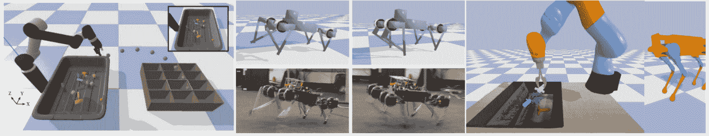
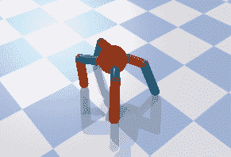
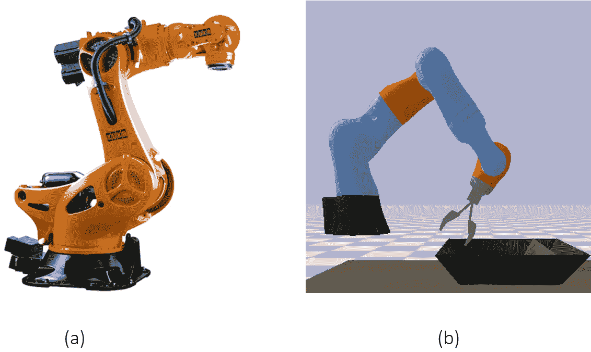
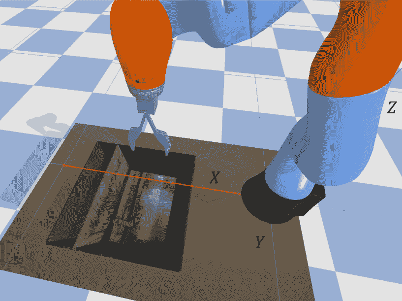
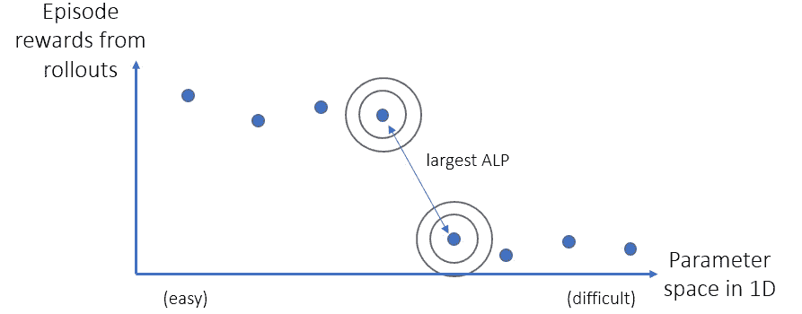
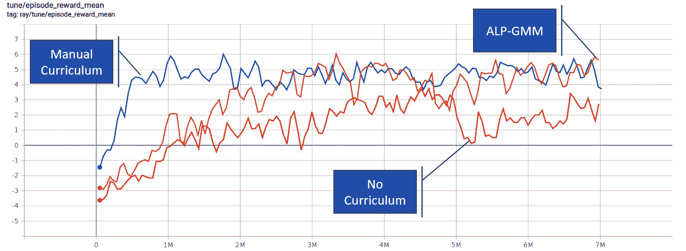

# 第十四章：自主系统

到目前为止，本书已经涵盖了许多强化学习中的最前沿算法和方法。从本章开始，我们将看到它们如何在实际应用中应对现实问题！我们将从机器人学习开始，这是强化学习的重要应用领域。为此，我们将使用 PyBullet 物理仿真训练 KUKA 机器人抓取托盘上的物体。我们将讨论几种解决这个困难探索问题的方法，并且会通过手动构建课程学习法和 ALP-GMM 算法来解决它。在本章结束时，我们还将介绍其他用于机器人学和自动驾驶的仿真库，这些库通常用于训练强化学习代理。

所以，本章内容包括以下几点：

+   介绍 PyBullet

+   熟悉 KUKA 环境

+   开发解决 KUKA 环境的策略

+   使用课程学习法训练 KUKA 机器人

+   超越 PyBullet，进入自动驾驶领域

这是强化学习中最具挑战性且有趣的领域之一。让我们深入了解吧！

# 介绍 PyBullet

PyBullet 是一个流行的高保真物理仿真模块，广泛应用于机器人学、机器学习、游戏等领域。它是使用强化学习进行机器人学习时最常用的库之一，特别是在从仿真到现实的迁移研究和应用中：



图 14.1 – PyBullet 环境与可视化（来源：PyBullet GitHub 仓库）

PyBullet 允许开发者创建自己的物理仿真。此外，它还提供了使用 OpenAI Gym 接口的预构建环境。部分这些环境如*图 14.1*所示。

在接下来的部分，我们将为 PyBullet 设置一个虚拟环境。

## 设置 PyBullet

在 Python 项目中使用虚拟环境几乎总是一个好主意，这也是我们将在本章中的机器人学习实验中所做的。所以，让我们继续执行以下命令来安装我们将使用的库：

```py
$ virtualenv pybenv
$ source pybenv/bin/activate
$ pip install pybullet --upgrade
$ pip install gym
$ pip install tensorflow==2.3.1
$ pip install ray[rllib]==1.0.0
$ pip install scikit-learn==0.23.2
```

你可以通过运行以下命令来测试你的安装是否正常：

```py
$ python -m pybullet_envs.examples.enjoy_TF_AntBulletEnv_v0_2017may
```

如果一切正常，你会看到一个很酷的蚂蚁机器人四处游走，正如在*图 14.2*中所示：



图 14.2 – 蚂蚁机器人在 PyBullet 中行走

太棒了！我们现在可以继续进行我们将要使用的 KUKA 环境了。

# 熟悉 KUKA 环境

KUKA 是一家提供工业机器人解决方案的公司，这些解决方案广泛应用于制造和组装环境。PyBullet 包含了 KUKA 机器人的仿真，用于物体抓取仿真（*图 14.3*）：



图 14.3 – KUKA 机器人广泛应用于工业中。(a) 一台真实的 KUKA 机器人（图片来源：CNC Robotics 网站），(b) 一种 PyBullet 仿真

PyBullet 中有多个 KUKA 环境，具体如下：

+   使用机器人和物体的位置及角度抓取矩形块

+   使用摄像头输入抓取矩形块

+   使用摄像头/位置输入抓取随机物体

在本章中，我们将重点关注第一个动作，接下来会更详细地介绍它。

## 使用 KUKA 机器人抓取矩形块

在这个环境中，机器人的目标是到达一个矩形物体，抓取它并将其抬升到一定高度。环境中的一个示例场景以及机器人坐标系如*图 14.4*所示：



图 14.4 – 物体抓取场景和机器人坐标系

机器人关节的动力学和初始位置在 `pybullet_envs` 包中的 `Kuka` 类中定义。我们将根据需要讨论这些细节，但你可以自由深入了解类定义，以更好地理解动力学。

信息

为了更好地理解 PyBullet 环境以及 `Kuka` 类的构建，你可以查看 *PyBullet 快速入门指南*，链接：[`bit.ly/323PjmO`](https://bit.ly/323PjmO)。

现在让我们深入了解为控制此机器人在 PyBullet 内部创建的 Gym 环境。

## KUKA Gym 环境

`KukaGymEnv` 封装了 `Kuka` 机器人类，并将其转化为一个 Gym 环境。动作、观察、奖励和终止条件定义如下。

### 动作

在这个环境中，代理执行的三种动作都与移动夹持器有关。这些动作如下：

+   沿轴的速度

+   沿轴的速度

+   用于旋转夹持器的角速度（偏航）

环境本身将夹持器沿轴移动到托盘上，物体位于托盘中。当夹持器足够接近托盘时，它会闭合夹持器的手指以尝试抓取物体。

环境可以配置为接受离散或连续的动作。我们将在本案例中使用后者。

### 观察值

代理从环境中接收九个观察值：

+   三个观察值用于夹持器的、和位置

+   三个观察值用于夹持器相对于、和轴的欧拉角

+   两个观察值用于物体相对于夹持器的和位置，**相对**于夹持器。

+   一个观察值用于物体相对于夹持器的欧拉角，沿轴

### 奖励

成功抓取对象并将其提升到一定高度的奖励是 10,000 分。 此外，还有一个轻微的成本，用于惩罚夹爪与对象之间的距离。 另外，旋转夹爪也会消耗一些能量。

### 终止条件

一个 episode 在 1,000 步之后或夹爪关闭之后结束，以先发生者为准。

要理解环境如何运作的最佳方式是实际进行实验，这也是接下来要做的事情。

这可以通过以下代码文件完成：`Chapter14/manual_control_kuka.py.`

该脚本允许您手动控制机器人。 您可以使用 "类似 gym 的" 控制模式，在此模式下，环境控制垂直速度和夹爪指角度。 或者，您可以选择非类似 gym 的模式来更多地控制。

您会注意到的一件事是，即使在类似 gym 的控制模式下将速度沿着  和  轴保持为零，机器人在下降时会改变其  和  位置。 这是因为夹爪沿  轴的默认速度太高。 您可以验证，在非类似 gym 的模式下，为  以下的值对  会使其他轴的位置发生较大改变。 在我们定制环境时，我们将减少速度以减轻这种情况。

现在您已经熟悉 KUKA 环境，让我们讨论一些解决它的替代策略。

# 开发解决 KUKA 环境的策略

环境中的抓取物体问题是一个 **难探索** 问题，这意味着在抓取对象后代理程序接收的稀疏奖励不太可能被发现。 像我们即将做的减少垂直速度将使它稍微容易一些。 不过，让我们回顾一下我们已经涵盖的解决这类问题的策略：

+   **奖励塑形** 是我们之前讨论过的最常见的 **机器教学** 策略之一。 在某些问题中，激励代理朝向目标非常直接。 虽然在许多问题中，这样做可能会很痛苦。 因此，除非有明显的方法，否则制定奖励函数可能需要太多时间（以及对问题的专业知识）。 还请注意，原始奖励函数有一个成分来惩罚夹爪与对象之间的距离，因此奖励已经在某种程度上被塑造。 在我们的解决方案中，我们将不会超越此范围。

+   **以好奇心驱动的学习** 激励代理程序发现状态空间的新部分。 对于这个问题，我们不需要代理程序过多地随机探索状态空间，因为我们已经对它应该做什么有一些想法。 因此，我们也将跳过这个技术。

+   `"entropy_coeff"` 配置位于 RLlib 的 PPO 训练器中，这是我们将使用的配置。然而，我们的超参数搜索（稍后会详细介绍）最终将这个值选为零。

+   **课程学习** 可能是这里最合适的方法。我们可以识别出使问题变得具有挑战性的因素，从简单的水平开始训练智能体，并逐渐增加难度。

因此，课程学习是我们将用来解决这个问题的方法。但首先，让我们识别出参数化环境的维度，以便创建课程。

## 参数化问题的难度

当你实验环境时，你可能已经注意到一些让问题变得困难的因素：

+   夹爪的起始位置过高，无法发现正确的抓取顺序。因此，调整高度的机器人关节将是我们需要参数化的一个维度。事实证明，它是在 `Kuka` 类的 `jointPositions` 数组的第二个元素中设置的。

+   当夹爪不在原始高度时，它可能会与物体沿  轴的位置发生错位。我们还将对控制此位置的关节进行参数化，该关节是 `Kuka` 类的 `jointPositions` 数组的第四个元素。

+   随机化物体位置是另一个给智能体带来困难的因素，它影响到  和  的位置以及物体的角度。我们将对这些组件的随机化程度进行参数化，范围从 0% 到 100%。

+   即使物体没有被随机放置，它的中心也未必与机器人在  轴上的默认位置对齐。我们将对物体在  位置添加一些偏差，同样进行参数化。

这太棒了！我们知道该怎么做，这是一个重要的第一步。现在，我们可以开始课程学习！

# 使用课程学习训练 KUKA 机器人

在实际启动训练之前，第一步是定制 `Kuka` 类和 `KukaGymEnv`，使其能够与我们上面描述的课程学习参数一起工作。接下来我们就来做这个。

## 为课程学习定制环境

首先，我们通过创建一个继承自 PyBullet 原始 `Kuka` 类的 `CustomKuka` 类来开始。以下是我们的实现方式：

Chapter14/custom_kuka.py

1.  我们首先需要创建一个新的类，并接受一个额外的参数，`jp_override` 字典，它代表 **关节位置覆盖**：

    ```py
    class CustomKuka(Kuka):
        def __init__(self, *args, jp_override=None, **kwargs):
            self.jp_override = jp_override
            super(CustomKuka, self).__init__(*args, **kwargs)
    ```

1.  我们需要这个来改变在我们重写的 `reset` 方法中设置的 `jointPositions` 数组：

    ```py
        def reset(self):
        ...
            if self.jp_override:
                for j, v in self.jp_override.items():
                    j_ix = int(j) - 1
                    if j_ix >= 0 and j_ix <= 13:
                        self.jointPositions[j_ix] = v
    ```

    现在，是时候创建 `CustomKukaEnv` 了。

1.  创建一个自定义环境，接受所有这些课程学习的参数化输入：

    ```py
    class CustomKukaEnv(KukaGymEnv):
        def __init__(self, env_config={}):
            renders = env_config.get("renders", False)
            isDiscrete = env_config.get("isDiscrete", False)
            maxSteps = env_config.get("maxSteps", 2000)
            self.rnd_obj_x = env_config.get("rnd_obj_x", 1)
            self.rnd_obj_y = env_config.get("rnd_obj_y", 1)
            self.rnd_obj_ang = env_config.get("rnd_obj_ang", 1)
            self.bias_obj_x = env_config.get("bias_obj_x", 0)
            self.bias_obj_y = env_config.get("bias_obj_y", 0)
            self.bias_obj_ang = env_config.get("bias_obj_ang", 0)
            self.jp_override = env_config.get("jp_override")
            super(CustomKukaEnv, self).__init__(
                renders=renders, isDiscrete=isDiscrete, maxSteps=maxSteps
            )
    ```

    请注意，我们还通过接受 `env_config` 使其兼容 RLlib。

1.  我们使用`reset`方法中的随机化参数来覆盖物体位置的默认随机化程度：

    ```py
        def reset(self):
            ...
            xpos = 0.55 + self.bias_obj_x + 0.12 * random.random() * self.rnd_obj_x
            ypos = 0 + self.bias_obj_y + 0.2 * random.random() * self.rnd_obj_y
            ang = (
                3.14 * 0.5
                + self.bias_obj_ang
                + 3.1415925438 * random.random() * self.rnd_obj_ang
            )
    ```

1.  此外，我们现在应该用`CustomKuka`替换旧的`Kuka`类，并将关节位置重写的输入传递给它：

    ```py
            ...
            self._kuka = CustomKuka(
                jp_override=self.jp_override,
                urdfRootPath=self._urdfRoot,
                timeStep=self._timeStep,
            )
    ```

1.  最后，我们重写了环境的`step`方法，以降低在轴上的默认速度：

    ```py
        def step(self, action):
            dz = -0.0005
            ...
    		...
                realAction = [dx, dy, dz, da, f]
            obs, reward, done, info = self.step2(realAction)
            return obs, reward / 1000, done, info
    ```

    还要注意，我们重新缩放了奖励（它将在-10 到 10 之间），以便训练更容易。

做得好！接下来，让我们讨论使用什么样的课程。

## 设计课程中的课程

确定参数化问题难度的维度是一回事，而决定如何将这种参数化暴露给代理则是另一回事。我们知道，代理应该从简单的课程开始，逐渐过渡到更难的课程。然而，这也引发了一些重要问题：

+   参数化空间的哪些部分容易？

+   课与课之间，调整参数的步长应该是多少？换句话说，我们应该如何将空间划分成不同的课程？

+   代理转到下一课的成功标准是什么？

+   如果代理在某一课上失败，意味着它的表现出乎意料地差，该怎么办？是否应该回到上一节课？失败的标准是什么？

+   如果代理长时间无法进入下一课，该怎么办？这是否意味着我们设定的成功标准太高？是否应该将这一课划分为子课？

如你所见，在手动设计课程时，这些问题并非易事。但也请记得，在*第十一章*《泛化与部分可观察性》中，我们介绍了**使用高斯混合模型的绝对学习进度（ALP-GMM）**方法，它会为我们处理所有这些决策。在这里，我们将实现两者，首先从手动课程开始。

## 使用手动设计的课程对代理进行训练

我们将为这个问题设计一个相对简单的课程。当代理达到成功标准时，课程会将它推进到下一课；当表现不佳时，会回退到前一课。该课程将在`CustomKukaEnv`类内部实现，并包含`increase_difficulty`方法：

1.  我们首先定义在课程过渡期间参数值的增量变化。对于关节值，我们将关节位置从用户输入的值（简单）降低到环境中的原始值（困难）：

    ```py
        def increase_difficulty(self):
            deltas = {"2": 0.1, "4": 0.1}
            original_values = {"2": 0.413184, "4": -1.589317}
            all_at_original_values = True
            for j in deltas:
                if j in self.jp_override:
                    d = deltas[j]
                    self.jp_override[j] = max(self.jp_override[j] - d, original_values[j])
                    if self.jp_override[j] != original_values[j]:
                        all_at_original_values = False
    ```

1.  在每节课的过渡过程中，我们还确保增加物体位置的随机化程度：

    ```py
            self.rnd_obj_x = min(self.rnd_obj_x + 0.05, 1)
            self.rnd_obj_y = min(self.rnd_obj_y + 0.05, 1)
            self.rnd_obj_ang = min(self.rnd_obj_ang + 0.05, 1)
    ```

1.  最后，当物体位置完全随机化时，我们记得将偏差设置为零：

    ```py
            if self.rnd_obj_x == self.rnd_obj_y == self.rnd_obj_ang == 1:
                if all_at_original_values:
                    self.bias_obj_x = 0
                    self.bias_obj_y = 0
                    self.bias_obj_ang = 0
    ```

到目前为止，一切顺利。我们几乎准备好训练代理了。在此之前，还有一件事：让我们讨论如何选择超参数。

### 超参数选择

为了在 RLlib 中调节超参数，我们可以使用 Ray Tune 库。在*第十五章*，《供应链管理》中，我们将提供一个示例，说明如何进行调节。现在，您可以直接使用我们在`Chapter14/configs.py`中选择的超参数。

小贴士

在困难的探索问题中，可能更合理的是先为问题的简化版本调节超参数。这是因为如果没有观察到一些合理的奖励，调节过程可能不会选择一个好的超参数集。我们在一个简单的环境设置中进行初步调节后，如果学习停滞，选择的值可以在后续过程中进行调整。

最后，让我们看看如何在训练过程中使用我们刚刚创建的环境，以及我们定义的课程。

#### 使用 RLlib 在课程中训练智能体

为了继续进行训练，我们需要以下要素：

+   课程的初始参数

+   一些定义成功（以及失败，如果需要）的标准

+   一个回调函数，将执行课程过渡

在以下代码片段中，我们使用 RLlib 中的 PPO 算法，设置初始参数，并在执行课程过渡的回调函数中将奖励阈值（经验值）设置为*5.5*：

Chapter14/train_ppo_manual_curriculum.py

```py
config["env_config"] = {
    "jp_override": {"2": 1.3, "4": -1}, "rnd_obj_x": 0, 
    "rnd_obj_y": 0, "rnd_obj_ang": 0, "bias_obj_y": 0.04}
def on_train_result(info):
    result = info["result"]
    if result["episode_reward_mean"] > 5.5:
        trainer = info["trainer"]
        trainer.workers.foreach_worker(
            lambda ev: ev.foreach_env(lambda env: env.increase_difficulty()))
ray.init()
tune.run("PPO", config=dict(config,
                            **{"env": CustomKukaEnv,
                               "callbacks": {
                          "on_train_result": on_train_result}}
                            ),
          checkpoint_freq=10)
```

这应该会启动训练，您将看到课程学习的实际效果！您会注意到，当智能体过渡到下一课时，随着环境变得更困难，其表现通常会下降。

我们稍后会查看此训练的结果。现在让我们继续实现 ALP-GMM 算法。

## 使用绝对学习进展的课程学习

ALP-GMM 方法专注于在参数空间中性能变化最大（绝对学习进展）的位置，并在该空隙周围生成参数。这个想法在*图 14.5*中得到了说明：



图 14.5 – ALP-GMM 在点周围生成参数（任务），在这些点之间，观察到最大的回合奖励变化

这样，学习预算就不会花费在已经学习过的状态空间部分，或者花费在当前智能体无法学习的部分上。

在这次回顾之后，让我们继续实现它。我们首先创建一个自定义环境，在这个环境中将运行 ALP-GMM 算法。

Chapter14/custom_kuka.py

我们直接从与论文（Portelas 等，2019）附带的源代码库中获取 ALP-GMM 的实现，并将其放置在`Chapter14/alp`目录下。然后，我们可以将其插入到我们创建的新环境`ALPKukaEnv`中，关键部分如下：

1.  我们创建类并定义我们尝试教授给智能体的参数空间的所有最小值和最大值：

    ```py
    class ALPKukaEnv(CustomKukaEnv):
        def __init__(self, env_config={}):
            ...
            self.mins = [...]
            self.maxs =  [...]
            self.alp = ALPGMM(mins=self.mins, 
                         maxs=self.maxs, 
                               params={"fit_rate": 20})
            self.task = None
            self.last_episode_reward = None
            self.episode_reward = 0
            super(ALPKukaEnv, self).__init__(env_config)
    ```

    这里的任务是由 ALP-GMM 算法生成的参数空间中的最新样本，用于配置环境。

1.  每个回合开始时都会采样一个任务。一旦回合结束，任务（在该回合中使用的环境参数）和回合奖励将被用来更新 GMM 模型：

    ```py
        def reset(self):
            if self.task is not None and self.last_episode_reward is not None:
                self.alp.update(self.task, 
                                self.last_episode_reward)
            self.task = self.alp.sample_task()
            self.rnd_obj_x = self.task[0]
            self.rnd_obj_y = self.task[1]
            self.rnd_obj_ang = self.task[2]
            self.jp_override = {"2": self.task[3], 
                                "4": self.task[4]}
            self.bias_obj_y = self.task[5]
            return super(ALPKukaEnv, self).reset()
    ```

1.  最后，我们确保跟踪每一回合的奖励：

    ```py
        def step(self, action):
            obs, reward, done, info = super(ALPKukaEnv,  self).step(action)
            self.episode_reward += reward
            if done:
                self.last_episode_reward = self.episode_reward
                self.episode_reward = 0
            return obs, reward, done, info
    ```

这里需要注意的一点是，ALP-GMM 通常以集中式方式实现：一个中心进程为所有回合工作者生成任务，并收集与这些任务相关的回合奖励进行处理。在这里，由于我们在 RLlib 中工作，所以更容易在环境实例中实现它。为了考虑单次回合中收集的数据量减少，我们使用了`"fit_rate": 20`，低于原始的 250 水平，这样回合工作者在拟合 GMM 到它收集的任务-奖励数据之前不会等待太久。

创建`ALPKukaEnv`后，其余的工作只是简单地调用 Ray 的`tune.run()`函数，位于`Chapter14/train_ppo_alp.py`中。请注意，与手动课程不同，我们没有指定参数的初始值。而是传递了 ALP-GMM 进程的边界，这些边界引导了课程的设计。

现在，我们准备进行一个课程学习的比拼！

## 比较实验结果

我们启动了三次训练：一次使用我们描述的手动课程，一次使用 ALP-GMM，另一次则没有实现任何课程。训练进度的 TensorBoard 视图显示在*图 14.6*中：



图 14.6 – TensorBoard 上的训练进度

一开始你可能认为手动课程和 ALP-GMM 相近，而不使用课程的则排在第三。实际上情况并非如此。让我们来解析这个图：

+   手动课程从简单到困难。这就是为什么它大部分时间都排在顶部的原因。在我们的运行中，它甚至在时间预算内无法完成最新的课程。因此，图中显示的手动课程表现被夸大了。

+   无课程训练始终在最困难的级别进行竞争。这就是它大部分时间处于最底部的原因：其他代理并没有运行在最难的参数配置上，因此它们会慢慢到达那里。

+   ALP-GMM 大部分时间处于中间位置，因为它在同时尝试困难和极难的配置，同时关注中间的一些地方。

    由于这个图没有给出明确结论，我们在原始（最困难）配置上评估了代理的表现。每个代理经过 100 个测试回合后的结果如下：

    ```py
    Agent ALP-GMM score: 3.71
    Agent Manual score: -2.79
    Agent No Curriculum score: 2.81
    ```

+   手动课程表现最差，因为在训练结束时无法完成最新的课程。

+   无课程训练取得了一些成功，但从最困难的设置开始似乎让其退步。此外，评估性能与 TensorBoard 上显示的结果一致，因为在这种情况下，评估设置与训练设置没有不同。

+   ALP-GMM 似乎从逐渐增加难度中受益，并且表现最佳。

+   无课程训练在 TensorBoard 图表上的峰值与 ALP-GMM 的最新表现相似。因此，我们在垂直速度方面的修改减少了两者之间的差异。然而，不使用课程训练会导致代理在许多困难探索场景中完全无法学习。

您可以在`Chapter14/evaluate_ppo.py`中找到评估的代码。此外，您还可以使用脚本`Chapter14/visualize_policy.py`来观察您训练的代理如何表现，看到它们的不足之处，并提出改进性能的想法！

这部分结束了我们对 KUKA 机器人学习示例的讨论。在下一部分，我们将总结本章，并列出一些常用的仿真环境，用于训练自动化机器人和车辆。

# 超越 PyBullet，进入自动驾驶领域

PyBullet 是一个极好的环境，可以在高保真物理仿真中测试强化学习算法的能力。在机器人技术和强化学习交叉的领域，您会遇到以下一些库：

+   Gazebo: [`gazebosim.org/`](http://gazebosim.org/)。

+   MuJoCo（需要许可证）：[`www.mujoco.org/`](http://www.mujoco.org/)。

+   Adroit: [`github.com/vikashplus/Adroit`](https://github.com/vikashplus/Adroit)。

此外，您将看到基于 Unity 和 Unreal Engine 的环境被用于训练强化学习代理。

下一个更常见的自主性层级当然是自动驾驶车辆。RL 在现实的自动驾驶车辆仿真中也得到了越来越多的实验。这方面最流行的库有：

+   CARLA: [`github.com/carla-simulator/carla`](https://github.com/carla-simulator/carla)。

+   AirSim: [`github.com/microsoft/AirSim`](https://github.com/microsoft/AirSim)。（免责声明：本书作者在写作时是微软员工，并且是开发 AirSim 的团队成员之一。）

到此，我们结束了这一章关于机器人学习的内容。这是 RL 中的一个非常热门的应用领域，里面有很多环境，我希望您享受这部分内容并从中获得灵感，开始动手尝试机器人。

# 总结

自主机器人和车辆将在未来在我们的世界中发挥巨大作用，而强化学习是创建这些自主系统的主要方法之一。在本章中，我们简单了解了训练机器人完成物体抓取任务的过程，这是机器人学中的一大挑战，在制造业和仓库物料搬运中有着广泛应用。我们使用 PyBullet 物理仿真器，在一个困难的探索环境中训练了一个 KUKA 机器人，并使用了手动和基于 ALP-GMM 的课程学习方法。现在，既然你已经较为熟练地掌握了如何利用这些技术，你可以尝试解决其他类似的问题。

在下一章中，我们将深入探讨强化学习应用的另一个主要领域：供应链管理。敬请期待另一段激动人心的旅程！

# 参考文献

+   Coumans, E., Bai, Y. (2016-2019). PyBullet，一个用于游戏、机器人和机器学习的物理仿真 Python 模块. 网址：[`pybullet.org`](http://pybullet.org)。

+   Bulletphysics/Bullet3\. (2020). Bullet Physics SDK, GitHub. 网址：[`github.com/bulletphysics/bullet3`](https://github.com/bulletphysics/bullet3)。

+   CNC Robotics. (2018). KUKA 工业机器人，机器人专家. 网址：[`www.cncrobotics.co.uk/news/kuka-robots/`](https://www.cncrobotics.co.uk/news/kuka-robots/)。

+   KUKA AG. (2020). 网址：[`www.kuka.com/en-us`](https://www.kuka.com/en-us)。

+   Portelas, Rémy, 等人. (2019). 深度强化学习在连续参数化环境中的教学算法. ArXiv:1910.07224 [Cs, Stat], 2019 年 10 月\. arXiv.org, [`arxiv.org/abs/1910.07224`](http://arxiv.org/abs/1910.07224)。
