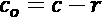
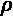
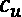
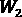
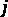
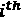

# 第十五章：*第十五章*：供应链管理

有效的供应链管理是许多企业面临的挑战，但它对于企业的盈利能力和竞争力至关重要。这一领域的困难来自于影响供需关系的复杂动态、处理这些动态的商业约束，以及其中巨大的不确定性。**强化学习**（**RL**）为我们提供了一套关键能力，帮助解决这类序列决策问题。

在本章中，我们特别关注两个重要问题：库存和路由优化。对于前者，我们深入探讨了如何创建环境、理解环境中的变化，以及如何通过超参数调优有效地使用强化学习解决问题。对于后者，我们描述了一个现实的车辆路由问题——一名临时司机为在线餐饮订单提供配送服务。接着，我们展示了为什么传统的神经网络在解决不同规模的问题时存在局限性，以及指针网络如何克服这一问题。

这将是一段有趣的旅程。本章将涵盖以下内容：

+   优化库存采购决策

+   路由问题建模

# 优化库存采购决策

几乎所有制造商、分销商和零售商需要不断做出的最重要决策之一就是，如何保持足够的库存，以便可靠地满足客户需求，同时最小化成本。有效的库存管理对于大多数公司的盈利能力和生存至关重要，特别是在当今竞争激烈的环境中，考虑到薄弱的利润率和不断提升的客户期望。在本节中，我们将利用强化学习来解决这一挑战，并优化库存采购决策。

## 库存的需求及其管理中的权衡

当你走进超市时，你会看到物品堆积在一起。超市的仓库里可能有更多的这些物品，分销商的仓库里也有更多，制造商的工厂里更是如此。想一想，这些巨大的产品堆积物就静静地待在某个地方，等待着未来某个时刻被客户需求。如果这听起来像是资源浪费，那它在很大程度上确实是。另一方面，企业必须保持一定量的库存，因为以下原因：

+   未来充满不确定性。客户需求、制造能力、运输计划和原材料的可用性，都可能在某些时刻以无法预见的方式变化。

+   不可能以完美的准时制方式运作，并在客户要求时立即制造并交付物品。

由于保持库存通常是不可避免的，那么问题就在于“多少”。回答这一问题涉及到一个复杂的权衡：

+   最小化无法满足客户需求的机会，这不仅会导致利润损失，更重要的是会损失客户忠诚度，而忠诚度一旦丧失，恢复将变得非常困难。

+   降低库存，因为它会带来资本、劳动力、时间、材料、维护和仓储租金等成本，还可能导致商品过期或过时以及组织管理的开销。

那么，你会如何处理这种情况？是将客户满意度作为绝对优先考虑，还是更愿意保持库存的可控？实际上，这种平衡行为需要仔细的规划和高级方法的应用，而并非所有公司都有能力做到这一点。因此，大多数公司更倾向于选择“保险策略”，即保持比实际需求更多的库存，这有助于掩盖缺乏规划和相关问题。这个现象通常被形象地描述为“库存之海”，如*图 15.1*所示：


图 15.1 – 库存之海隐藏了许多问题

在这种情况下，强化学习（RL）可以发挥作用，在面对不确定性时优化库存决策。接下来，我们通过讨论库存优化问题的组成部分，开始构建我们的解决方案。

## 库存优化问题的组成部分。

有多个因素影响库存流动的动态，以及在给定商品的情况下，最佳补货政策将会是什么样子：

+   商品的**价格**是决定其销售价格的关键因素。

+   商品的**采购成本**是另一个关键因素，它与价格一起决定了每件商品所赚取的毛利润。这反过来影响了失去一个客户需求单位的成本。

+   **库存持有成本**是指在单个时间步（例如一天、一周或一个月等）内，持有单个库存单位的所有成本总和。这包括存储租金、资本成本以及任何维护成本等。

+   **客户信任流失**是由于丧失单个需求单位所导致的客户不满的货币成本。毕竟，这会减少客户忠诚度并影响未来的销售。虽然不满通常是定性衡量的，但企业需要估算其货币等价物，以便在决策中使用。

+   对商品的**客户需求**在单个时间步中的变化是影响决策的主要因素之一。

+   **供应商交货时间**（**VLT**）是指从向供应商下订单到商品到达库存的延迟时间。毫不奇怪，VLT 是决定何时下订单以应对预期需求的关键因素。

+   **容量**限制，例如单次批量可订购商品的数量，以及公司的存储能力，将限制代理可以采取的行动。

这些是我们在这里设置时需要考虑的主要因素。此外，我们还将重点关注以下内容：

+   单一商品情景

+   具有泊松分布的随机客户需求，在给定时期内具有确定的且固定的均值。

+   除需求外的确定性因素

这使得我们的案例在保持足够复杂性的同时变得可解。

提示

在实际环境中，大多数动态都涉及不确定性。例如，可能到达的库存存在缺陷；价格可能会随着物品的过时程度而变化；可能由于天气原因导致现有库存损失；可能有物品需要退货。估算所有这些因素的特征并创建过程的仿真模型是一个真正的挑战，成为了将强化学习作为此类问题工具的障碍。

我们所描述的是一个复杂的优化问题，当前没有可行的最优解。然而，它的单步版本，称为**新闻售货员问题**，已被广泛研究和应用。这是一个极好的简化方法，可以帮助我们形成对问题的直观理解，并且还将帮助我们为多步情况获得一个接近最优的基准。让我们深入研究一下。

## 单步库存优化 – 新闻售货员问题

当库存优化问题涉及以下内容时：

+   单一时间步长（因此没有 VLT；库存到货是确定性的）

+   单一商品

+   已知价格、购买成本和未售出库存的成本

+   一个已知的（且方便的高斯）需求分布

然后，这个问题被称为新闻售货员问题，我们可以为其获得封闭形式的解。它描述了一个报纸销售员，旨在规划当天购买多少份报纸，单位成本为，以单位价格出售，并在当天结束时以单位价格退还未售出的份数。接着，我们定义以下量：

+   缺货成本，，是由于错失一单位需求所造成的利润损失：。

+   过剩成本，，是未售出的单元成本：。

为了找到最优的订货量，我们接下来计算一个关键比率，，如下所示：


现在，让我们来分析这个关键比率如何随着缺货和过剩成本的变化而变化：

+   随着的增加，增加。更高的和意味着错失客户需求的成本更高。这表明，在补充库存时应更加积极，以避免错失机会。

+   随着的增加，减少，这意味着未售出库存的成本更高。这表明我们在库存量上应该保持保守。

结果表明，给出了为了优化预期利润，应该覆盖的需求场景的百分比。换句话说，假设需求有一个概率分布函数，并且有一个**累积分布函数**（**CDF**）。最佳订货量由给出，其中是 CDF 的逆函数。

让我们通过一个例子来进行实验。

### 新闻供应商示例

假设某昂贵商品的价格为，其来源为。如果该商品未售出，不能退还给供应商，且会变成废品。因此，我们有。在这种情况下，缺货成本为，过剩成本为，这使得我们得出临界比率。这表明订货量有 80%的几率能满足需求。假设需求服从正态分布，均值为 20 件，标准差为 5 件，则最佳订货量约为 24 件。

您可以使用在`Newsvendor plots.ipynb`文件中定义的`calc_n_plot_critical_ratio`函数计算并绘制最佳订货量：

Chapter15/Newsvendor plots.ipynb

```py
calc_n_plot_critical_ratio(p=2000, c=400, r=0, mean=20, std=5)
```

您应该看到如下输出：

```py
Cost of underage is 1600
Cost of overage is 400
Critical ratio is 0.8
Optimal order qty is 24.20810616786457
```

*图 15.2*展示了需求的概率分布、累积分布函数（CDF）以及该问题对应的临界比率值：


图 15.2 – 示例新闻供应商问题的最佳订货量

这是为了让您对单步库存优化问题的解决方案有一个直观的了解。现在，多步问题涉及到许多其他复杂性，我们在上一节中进行了描述。例如，库存到货存在滞后，剩余库存会带到下一步并产生持有成本。这就是不确定性下的序列决策问题，而这正是强化学习的强项。所以，让我们来使用它。

## 模拟多步库存动态

在本节中，我们创建了一个模拟环境，用于描述的多步库存优化问题。

信息

本章的其余部分紧密跟随*Balaji 等人，2019*中定义的问题和环境，其中的代码可在[`github.com/awslabs/or-rl-benchmarks`](https://github.com/awslabs/or-rl-benchmarks)找到。我们建议您阅读该论文，以获取有关经典随机优化问题的强化学习（RL）方法的更多细节。

在开始描述环境之前，让我们讨论几个注意事项：

+   我们希望创建一个不仅适用于特定产品需求场景的策略，而是适用于广泛场景的策略。因此，对于每个周期，我们会随机生成环境参数，正如您将看到的那样。

+   这种随机化增加了梯度估计的方差，使得学习过程比静态场景更加具有挑战性。

有了这些，我们来详细讨论一下环境的细节。

### 事件日历

为了正确地应用环境的阶跃函数，我们需要了解每个事件发生的时间。让我们来看一下：

1.  每天开始时，库存补货订单会被下达。根据提前期，我们将其记录为“运输中”库存。

1.  接下来，当前日程安排的物品到达。如果提前期为零，那么当天一开始就下的订单会立刻到达。如果提前期为一天，那么昨天的订单会到达，依此类推。

1.  在货物收到后，需求会在一天内逐渐显现。如果库存不足以满足需求，实际销售量将低于需求，并且会失去客户的好感。

1.  在一天结束时，我们从库存中扣除已售出的物品（不是总需求），并相应更新状态。

1.  最后，如果提前期非零，我们会更新运输中的库存（即，我们将原本在 t + 2 到达的库存移至 t + 1）。

现在，让我们编码我们所描述的内容。

### 编码环境

你可以在我们的 GitHub 仓库中找到完整的环境代码，链接为：[`github.com/PacktPublishing/Mastering-Reinforcement-Learning-with-Python/blob/master/Chapter15/inventory_env.py`](https://github.com/PacktPublishing/Mastering-Reinforcement-Learning-with-Python/blob/master/Chapter15/inventory_env.py)。

在这里，我们只描述环境的一些关键部分：

1.  如前所述，每个回合将抽样某些环境参数，以便获得可以在广泛的价格、需求等场景中工作的策略。我们设置这些参数的最大值，然后从中生成特定回合的参数：

    ```py
    class InventoryEnv(gym.Env):
        def __init__(self, config={}):
            self.l = config.get("lead time", 5)
            self.storage_capacity = 4000
            self.order_limit = 1000
            self.step_count = 0
            self.max_steps = 40
            self.max_value = 100.0
            self.max_holding_cost = 5.0
            self.max_loss_goodwill = 10.0
            self.max_mean = 200
    ```

    我们使用 5 天的提前期，这对确定观察空间非常重要（可以认为它等同于此问题中的状态空间，因此我们可以互换使用这两个术语）。

1.  价格、成本、持有成本、客户好感损失和预期需求是状态空间的一部分，我们假设这些也对代理可见。此外，我们需要追踪现有库存，以及如果提前期非零，还需要追踪运输中的库存：

    ```py
            self.inv_dim = max(1, self.l)
            space_low = self.inv_dim * [0]
            space_high = self.inv_dim * [self.storage_capacity]
            space_low += 5 * [0]
            space_high += [
                self.max_value,
                self.max_value,
                self.max_holding_cost,
                self.max_loss_goodwill,
                self.max_mean,
            ]
            self.observation_space = spaces.Box(
                low=np.array(space_low), 
                high=np.array(space_high), 
                dtype=np.float32
            )
    ```

    请注意，对于 5 天的提前期，我们有一个维度表示现有库存，四个维度（从到）表示运输中的库存。正如你将看到的，通过在步骤计算结束时将运输中库存添加到状态中，我们可以避免追踪将会到达的运输中库存（更一般地说，我们不需要，表示提前期）。

1.  我们将动作规范化为在  之间，其中 1 表示以订单限额下单：

    ```py
            self.action_space = spaces.Box(
                low=np.array([0]), 
                high=np.array([1]), 
                dtype=np.float32
            )
    ```

1.  一个非常重要的步骤是规范化观察值。通常，智能体可能不知道观察值的边界以便进行规范化。在这里，我们假设智能体有这个信息，因此我们在环境类中方便地处理了它：

    ```py
        def _normalize_obs(self):
            obs = np.array(self.state)
            obs[:self.inv_dim] = obs[:self.inv_dim] / self.order_limit
            obs[self.inv_dim] = obs[self.inv_dim] / self.max_value
            obs[self.inv_dim + 1] = obs[self.inv_dim + 1] / self.max_value
            obs[self.inv_dim + 2] = obs[self.inv_dim + 2] / self.max_holding_cost
            obs[self.inv_dim + 3] = obs[self.inv_dim + 3] / self.max_loss_goodwill
            obs[self.inv_dim + 4] = obs[self.inv_dim + 4] / self.max_mean
            return obs
    ```

1.  特定回合的环境参数是在 `reset` 函数中生成的：

    ```py
        def reset(self):
            self.step_count = 0
            price = np.random.rand() * self.max_value
            cost = np.random.rand() * price
            holding_cost = np.random.rand() * min(cost, self.max_holding_cost)
            loss_goodwill = np.random.rand() * self.max_loss_goodwill
            mean_demand = np.random.rand() * self.max_mean
            self.state = np.zeros(self.inv_dim + 5)
            self.state[self.inv_dim] = price
            self.state[self.inv_dim + 1] = cost
            self.state[self.inv_dim + 2] = holding_cost
            self.state[self.inv_dim + 3] = loss_goodwill
            self.state[self.inv_dim + 4] = mean_demand
            return self._normalize_obs()
    ```

1.  我们按照前一部分描述的方式实现 `step` 函数。首先，我们解析初始状态和接收到的动作：

    ```py
        def step(self, action):
            beginning_inv_state, p, c, h, k, mu = \
                self.break_state()
            action = np.clip(action[0], 0, 1)
            action = int(action * self.order_limit)
            done = False
    ```

1.  然后，我们在观察容量的同时确定可以购买的数量，如果没有提前期，就将购买的部分添加到库存中，并采样需求：

    ```py
            available_capacity = self.storage_capacity \
                                 - np.sum(beginning_inv_state)
            assert available_capacity >= 0
            buys = min(action, available_capacity)
            # If lead time is zero, immediately
            # increase the inventory
            if self.l == 0:
                self.state[0] += buys
            on_hand = self.state[0]
            demand_realization = np.random.poisson(mu)
    ```

1.  奖励将是收入，我们从中扣除购买成本、库存持有成本和失去的客户信誉成本：

    ```py
            # Compute Reward
            sales = min(on_hand,
                        demand_realization)
            sales_revenue = p * sales
            overage = on_hand - sales
            underage = max(0, demand_realization
                              - on_hand)
            purchase_cost = c * buys
            holding = overage * h
            penalty_lost_sale = k * underage
            reward = sales_revenue \
                     - purchase_cost \
                     - holding \
                     - penalty_lost_sale
    ```

1.  最后，我们通过将在途库存移动一天来更新库存水平，如果 VLT 不为零，还需要将当日购买的物品添加到在途库存中：

    ```py
            # Day is over. Update the inventory
            # levels for the beginning of the next day
            # In-transit inventory levels shift to left
            self.state[0] = 0
            if self.inv_dim > 1:
                self.state[: self.inv_dim - 1] \
                    = self.state[1: self.inv_dim]
            self.state[0] += overage
            # Add the recently bought inventory
            # if the lead time is positive
            if self.l > 0:
                self.state[self.l - 1] = buys
            self.step_count += 1
            if self.step_count >= self.max_steps:
                done = True
    ```

1.  最后，我们将规范化后的观察值和缩放后的奖励返回给智能体：

    ```py
            # Normalize the reward
            reward = reward / 10000
            info = {
                "demand realization": demand_realization,
                "sales": sales,
                "underage": underage,
                "overage": overage,
            }
            return self._normalize_obs(), reward, done, info
    ```

花时间理解库存动态是如何在步骤函数中体现的。一旦准备好，我们就可以开始开发基准策略。

## 开发近似最优基准策略

这个问题的精确解不可得。然而，通过类似新闻商政策的两项修改，我们获得了一个近似最优的解：

+   考虑到的总需求是在  时间步长内的需求，而不是单一时间步。

+   我们还将客户流失的损失加到缺货成本中，除了每单位的利润之外。

之所以仍然是近似解，是因为该公式将多个步骤视为一个单一步骤，并汇总需求和供应，意味着它假设需求在某个步骤到达，并可以在随后的步骤中积压并得到满足，这一过程持续在  步长内进行。不过，这仍然为我们提供了一个近似最优的解决方案。

以下是如何编写此基准策略的代码：

```py
def get_action_from_benchmark_policy(env):
    inv_state, p, c, h, k, mu = env.break_state()
    cost_of_overage = h
    cost_of_underage = p - c + k
    critical_ratio = np.clip(
        0, 1, cost_of_underage
              / (cost_of_underage + cost_of_overage)
    )
    horizon_target = int(poisson.ppf(critical_ratio,
                         (len(inv_state) + 1) * mu))
    deficit = max(0, horizon_target - np.sum(inv_state))
    buy_action = min(deficit, env.order_limit)
    return [buy_action / env.order_limit]
```

请注意，在我们计算临界比率后，我们进行以下操作：

+   我们为  步骤找到最优的总供应量。

+   然后，我们减去下一步  时间步长内的在手库存和在途库存。

+   最后，我们下单以弥补这一差额，但单次订单有上限。

接下来，让我们看看如何训练一个强化学习智能体来解决这个问题，以及强化学习解决方案与此基准的比较。

## 一种用于库存管理的强化学习解决方案

在解决这个问题时，有几个因素需要考虑：

+   由于环境中的随机化，每一回合的奖励有很高的方差。

+   这要求我们使用高于正常的批量和小批量大小，以更好地估计梯度并对神经网络权重进行更稳定的更新。

+   在高方差的情况下，选择最佳模型也是一个问题。这是因为如果测试/评估的回合数不足，可能会仅仅因为在一些幸运的配置中评估了某个策略，就错误地认为它是最好的。

为了应对这些挑战，我们可以采取以下策略：

1.  在有限的计算预算下进行有限的超参数调优，以识别出一组好的超参数。

1.  使用一个或两个最佳超参数集来训练模型，并在训练过程中保存最佳模型。

1.  当你观察到奖励曲线的趋势被噪声主导时，增加批量和小批量的大小，以便更精确地估计梯度并去噪模型性能指标。再次保存最佳模型。

1.  根据您的计算预算，重复多次并选择最佳模型。

所以，让我们在 Ray/RLlib 中实现这些步骤以获得我们的策略。

### 初始超参数搜索

我们使用 Ray 的 Tune 库进行初步的超参数调优。我们将使用两个函数：

+   `tune.grid_search()` 在指定的值集合上进行网格搜索。

+   `tune.choice()` 在指定的集合中进行随机搜索。

对于每个试验，我们还指定停止条件。在我们的案例中，我们希望运行一百万个时间步骤的试验。

下面是一个示例搜索的代码：

```py
import ray
from ray import tune
from inventory_env import InventoryEnv
ray.init()
tune.run(
    "PPO",
    stop={"timesteps_total": 1e6},
    num_samples=5,
    config={
        "env": InventoryEnv,
        "rollout_fragment_length": 40,
        "num_gpus": 1,
        "num_workers": 50,
        "lr": tune.grid_search([0.01, 0.001, 0.0001, 0.00001]),
        "use_gae": tune.choice([True, False]),
        "train_batch_size": tune.choice([5000, 10000, 20000, 40000]),
        "sgd_minibatch_size": tune.choice([128, 1024, 4096, 8192]),
        "num_sgd_iter": tune.choice([5, 10, 30]),
        "vf_loss_coeff": tune.choice([0.1, 1, 10]),
        "vf_share_layers": tune.choice([True, False]),
        "entropy_coeff": tune.choice([0, 0.1, 1]),
        "clip_param": tune.choice([0.05, 0.1, 0.3, 0.5]),
        "vf_clip_param": tune.choice([1, 5, 10]),
        "grad_clip": tune.choice([None, 0.01, 0.1, 1]),
        "kl_target": tune.choice([0.005, 0.01, 0.05]),
        "eager": False,
    },
)
```

为了计算总的调优预算，我们执行以下操作：

+   获取所有网格搜索的交叉乘积，因为根据定义必须尝试每一个可能的组合。

+   将交叉乘积与 `num_samples` 相乘，得到将要进行的试验总数。使用前面的代码，我们将有 20 次试验。

+   在每次试验中，每个 `choice` 函数会从相应的集合中随机均匀地选择一个参数。

+   当满足停止条件时，给定的试验将停止。

执行时，您将看到搜索过程正在进行。它看起来像*图 15.3*：


图 15.3 – 使用 Ray 的 Tune 进行超参数调优

一些试验会出错，除非你特别注意避免数值问题的超参数组合。然后，你可以选择表现最好的组合进行进一步的训练，如*图 15.4*所示：


图 15.4 – 在搜索中获得的优质超参数集的样本性能

接下来，让我们进行广泛的训练。

### 模型的广泛训练

现在，我们开始使用选定的超参数集进行长时间训练（或者使用多个超参数集——在我的案例中，之前的最佳集表现不好，但第二个集表现良好）：

Chapter15/train_inv_policy.py

```py
import numpy as np
import ray
from ray.tune.logger import pretty_print
from ray.rllib.agents.ppo.ppo import DEFAULT_CONFIG
from ray.rllib.agents.ppo.ppo import PPOTrainer
from inventory_env import InventoryEnv
config = DEFAULT_CONFIG.copy()
config["env"] = InventoryEnv
config["num_gpus"] = 1
config["num_workers"] = 50
config["clip_param"] = 0.3
config["entropy_coeff"] = 0
config["grad_clip"] = None
config["kl_target"] = 0.005
config["lr"] = 0.001
config["num_sgd_iter"] = 5
config["sgd_minibatch_size"] = 8192
config["train_batch_size"] = 20000
config["use_gae"] = True
config["vf_clip_param"] = 10
config["vf_loss_coeff"] = 1
config["vf_share_layers"] = False
```

一旦设置了超参数，就可以开始训练：

```py
ray.init()
trainer = PPOTrainer(config=config, env=InventoryEnv)
best_mean_reward = np.NINF
while True:
    result = trainer.train()
    print(pretty_print(result))
    mean_reward = result.get("episode_reward_mean", np.NINF)
    if mean_reward > best_mean_reward:
        checkpoint = trainer.save()
        print("checkpoint saved at", checkpoint)
        best_mean_reward = mean_reward
```

这里有一点需要注意，那就是批量和小批量的大小：通常情况下，RLlib 中的 PPO 默认设置是`"train_batch_size": 4000`和`"sgd_minibatch_size": 128`。然而，由于环境和奖励的方差，使用如此小的批量会导致学习效果不佳。因此，调优模型选择了更大的批量和小批量大小。

现在进行训练。此时，您可以根据训练进度开发逻辑来调整各种超参数。为了简化起见，我们将手动观察进度，并在学习停滞或不稳定时停止。在那之后，我们可以进一步增加批量大小进行训练，以获得最终阶段的更好梯度估计，例如 `"train_batch_size": 200000` 和 `"sgd_minibatch_size": 32768`。这就是训练过程的样子：


图 15.5 – 训练从 20k 的批量大小开始，并继续使用 200k 的批量大小以减少噪声

更高的批量大小微调帮助我们去噪奖励并识别真正高效的模型。然后，我们可以比较基准和强化学习（RL）解决方案。经过 2,000 个测试回合后，基准性能如下所示：

```py
Average daily reward over 2000 test episodes: 0.15966589703658918\. 
Average total epsisode reward: 6.386635881463566
```

我们可以在这里看到 RL 模型的表现：

```py
Average daily reward over 2000 test episodes: 0.14262437792900876\. 
Average total epsisode reward: 5.70497511716035
```

我们的 RL 模型性能在接近最优基准解的 10%以内。我们可以通过进一步的试验和训练来减少差距，但在如此噪声的环境下，这是一个具有挑战性且耗时的工作。请注意，*Balaji et al., 2019*报告的指标略微改善了基准，因此这是可行的。

至此，我们结束了对这个问题的讨论。做得好！我们已经将一个现实且噪声较大的供应链问题从初始形态中建模，使用 RL 进行建模，并通过 RLlib 上的 PPO 解决了它！

接下来，我们描述两个可以通过 RL 解决的额外供应链问题。由于篇幅限制，我们在这里无法解决这些问题，但我们建议您参考[`github.com/awslabs/or-rl-benchmarks/`](https://github.com/awslabs/or-rl-benchmarks/)获取更多信息。

那么，接下来让我们讨论如何使用 RL 来建模和解决路由优化问题。

# 路由问题建模

路由问题是组合优化中最具挑战性和最受研究的问题之一。事实上，有相当多的研究人员将毕生精力投入到这一领域。最近，RL 方法作为一种替代传统运筹学方法的路由问题解决方案已经浮出水面。我们从一个相对复杂的路由问题开始，它是关于在线餐饮订单的取送。另一方面，这个问题的 RL 建模并不会太复杂。我们稍后将根据该领域的最新文献，扩展讨论更先进的 RL 模型。

## 在线餐饮订单的取送

考虑一个“零工”司机（我们的代理），他为一个在线平台工作，类似于 Uber Eats 或 Grubhub，从餐厅接订单并配送给客户。司机的目标是通过配送更多高价值订单来赚取尽可能多的小费。以下是这个环境的更多细节：

+   城市中有多个餐厅，这些餐厅是订单的取件地点。

+   与这些餐厅相关的订单会动态地出现在配送公司的应用程序上。

+   司机必须接受一个订单才能去取件并进行配送。

+   如果一个已接受的订单在创建后的一定时间内未被配送，则会遭受高额罚款。

+   如果司机未接受一个开放订单，该订单会在一段时间后消失，意味着订单被竞争的其他司机抢走。

+   司机可以接受任意数量的订单，但实际能携带的已取件订单数量有限。

+   城市的不同区域以不同的速率和不同的规模生成订单。例如，一个区域可能生成频繁且高价值的订单，从而吸引司机。

+   不必要的行程会给司机带来时间、燃料和机会成本。

在这个环境下，每个时间步，司机可以采取以下动作之一：

+   接受其中一个开放订单。

+   朝一个与特定订单相关的餐厅移动一步（取件）。

+   朝客户位置移动一步（进行配送）。

+   等待并什么都不做。

+   朝一个餐厅移动一步（不是去取现有订单，而是希望很快会从该餐厅接到一个高价值订单）。

代理观察以下状态以做出决策：

+   司机、餐厅和客户的坐标

+   司机使用的和可用的运载能力

+   订单状态（开放、已接受、已取件、非活动/已配送/未创建）

+   订单与餐厅的关联

+   从订单创建开始经过的时间

+   每个订单的奖励（小费）

如需更多信息，可以访问此环境：[`github.com/awslabs/or-rl-benchmarks/blob/master/Vehicle%20Routing%20Problem/src/vrp_environment.py`](https://github.com/awslabs/or-rl-benchmarks/blob/master/Vehicle%20Routing%20Problem/src/vrp_environment.py)。

*Balaji et al., 2019* 研究表明，RL 解决方案在此问题上的表现优于基于**混合整数** **规划**（**MIP**）的方法。这是一个相当令人惊讶的结果，因为 MIP 模型理论上可以找到最优解。MIP 解决方案在此情况下被超越的原因如下：

+   它解决了一个眼前问题，而 RL 代理学习预测未来事件并相应地进行规划。

+   它使用了有限的预算，因为 MIP 解决方案可能需要很长时间，而 RL 推理一旦训练好策略后，几乎是瞬时发生的。

对于如此复杂的问题，报告的强化学习（RL）性能相当鼓舞人心。另一方面，我们所采用的问题建模方式有一定局限性，因为它依赖于固定的状态和动作空间大小。换句话说，如果状态和动作空间设计为处理最多 *N* 个订单/餐馆，那么训练后的智能体无法用于更大的问题。另一方面，混合整数规划（MIP）模型可以接受任何大小的输入（尽管大规模问题可能需要很长时间才能解决）。

深度学习领域的最新研究为我们提供了指针网络，用于处理动态大小的组合优化问题。接下来我们将深入探讨这个话题。

## 用于动态组合优化的指针网络

指针网络使用基于内容的注意力机制来指向其输入中的一个节点，输入的数量可以是任意的。为了更好地解释这一点，考虑一个旅行推销员问题，其目标是在二维平面上访问所有节点，每个节点仅访问一次，并在最后回到初始节点，且以最小的总距离完成。*图 15.6* 展示了一个示例问题及其解决方案：

）

](img/B14160_15_6.jpg)

图 15.6 – 旅行推销员问题的解决方案（来源：[`en.wikipedia.org/wiki/Travelling_salesman_problem`](https://en.wikipedia.org/wiki/Travelling_salesman_problem)）

该问题中的每个节点通过其  坐标表示。指针网络具有以下特点：

+   使用递归神经网络从编码器中的输入节点  的  获得嵌入 ，并在解码的  步骤中类似地获得解码器中的 。

+   在解码  步骤时，计算输入节点  的注意力，计算方式如下：


其中  和  是可学习的参数。

+   拥有最高注意力  的输入节点  将成为路径中需要访问的  节点。

这种注意力方法完全灵活，可以在不对输入节点总数做任何假设的情况下指向特定的输入节点。该机制在 *图 15.7* 中得到了展示：


图 15.7 – 一个指针网络（来源：Vinyals 等，2017）

后来的研究（*Nazari 等人，2018*）将指针网络应用于基于策略的强化学习模型，并在相对复杂的问题中取得了非常有前景的结果，与开源路径优化器相比具有优势。指针网络的细节及其在强化学习中的应用值得进一步的探讨，我们将在本章末尾引用的论文中深入讨论。

通过上述内容，我们结束了关于强化学习在供应链问题中的应用讨论。让我们总结一下所涉及的内容，以便结束这一章节。

# 总结

本章中，我们讨论了供应链管理中的两个重要问题类别：库存优化和车辆路径规划。这些问题都非常复杂，强化学习（RL）最近作为一种竞争性工具出现，用于解决这些问题。在本章中，对于前者问题，我们提供了如何创建环境并解决相应强化学习问题的详细讨论。这个问题的挑战在于各个回合之间的高方差，我们通过细致的超参数调优程序来缓解这一问题。对于后者问题，我们描述了一个真实的案例，讲述了一名外卖司机如何处理来自顾客的动态订单。我们讨论了如何通过指针网络使得模型在处理不同节点大小时更加灵活。

在下一章节中，我们将讨论另一组令人兴奋的应用，涉及个性化、市场营销和金融领域。我们在那里见！

# 参考文献

+   *ORL: 在线随机优化问题的强化学习基准测试*，Balaji, Bharathan 等人（2019）：[`arxiv.org/abs/1911.10641`](http://arxiv.org/abs/1911.10641)

+   *指针网络*，Vinyals, Oriol 等人（2017）：[`arxiv.org/abs/1506.03134`](http://arxiv.org/abs/1506.03134)

+   *强化学习在解决车辆路径规划问题中的应用*，Nazari, M 等人（2018）：[`arxiv.org/abs/1802.04240`](http://arxiv.org/abs/1802.04240)
