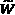
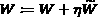

# 第十六章：营销、个性化和金融

本章中，我们讨论了强化学习（RL）在三个领域中获得显著关注的情况。首先，我们描述了它如何用于个性化和推荐系统。通过这一点，我们超越了之前章节中介绍的单步强盗方法。一个相关领域也可以从 RL 中受益匪浅，那就是营销。除了个性化营销应用，RL 还可以帮助管理活动预算和减少客户流失等领域。最后，我们讨论了 RL 在金融领域的前景和相关挑战。在这个过程中，我们介绍了 TensorTrade，这是一个用于开发和测试基于 RL 的交易算法的 Python 框架。

因此，在本章中，我们将涵盖以下内容：

+   超越强盗模型进行个性化

+   使用强化学习（RL）开发有效的营销策略

+   将 RL 应用于金融

# 超越强盗模型进行个性化

当我们在本书的早期章节中讨论多臂强盗和上下文强盗问题时，我们提出了一个案例研究，旨在最大化**点击率（CTR）**的在线广告。这只是一个例子，展示了强盗模型如何用于为用户提供个性化内容和体验，这是几乎所有在线（和离线）内容提供商面临的共同挑战，从电子零售商到社交媒体平台。在这一部分，我们将超越强盗模型，描述一个多步强化学习方法来进行个性化。让我们首先讨论强盗模型的不足之处，然后再看看多步 RL 如何解决这些问题。

## 强盗模型的缺点

强盗问题的目标是最大化即时（单步）回报。在一个在线广告点击率（CTR）最大化问题中，这通常是一个很好的思考目标：展示在线广告，用户点击，然后完成！如果没有点击，那就是错失。

用户与平台之间的关系，比方说，YouTube 或 Amazon，远比这更复杂。在这些平台上的用户体验是一个过程，而不是一个事件。平台推荐一些内容，如果用户没有点击，也不完全是失败。可能用户发现了推荐的内容有趣且吸引人，只是继续浏览。即使该用户会话没有产生点击或转化，用户也可能很快回来，因为他们知道平台会推荐一些与其兴趣相关的内容。相反，如果会话中有太多的点击，很可能意味着用户没有找到他们想要的内容，从而导致了不好的体验。这种“过程性”的问题特性——即平台（代理）的决策对客户满意度和商业价值（奖励）有下游影响——正是使得多步强化学习成为这里吸引人的方法。

提示

虽然从赌博模型转向多步强化学习是诱人的，但在这么做之前要三思而后行。赌博算法更容易使用，并且具有公认的理论特性，而在多步强化学习的设定中成功训练代理人可能会非常具有挑战性。需要注意的是，许多多步问题可以通过为代理人包含记忆并在当前奖励中考虑动作的期望未来价值，将其转化为单步问题，这样我们就可以留在赌博框架中。

深度强化学习在个性化方面的一个成功实现与新闻推荐相关，由郑等人（2018）提出。在下一节中，我们将描述一种类似的解决方法，灵感来自这项工作，尽管我们的讨论会比论文中的内容更高层次和更广泛。

## 深度强化学习在新闻推荐中的应用

当我们打开最喜欢的新闻应用时，我们期待阅读一些有趣且可能重要的内容。当然，什么内容是有趣或重要的对每个人来说都不同，因此我们面临个性化问题。正如郑等人（2018）提到的，新闻推荐中有一些额外的挑战：

+   动作空间并非固定的。实际上，情况恰恰相反：每天涌入大量新闻，每条新闻都有一些独特的特征，这使得很难将问题看作一个传统的 Gym 环境。

+   用户偏好也是相当动态的：它们随着时间变化而改变和演变。本周对政治感兴趣的用户，下周可能会感到厌倦，转而阅读关于艺术的内容，郑等人（2018）通过数据证明了这一点。

+   正如我们所提到的，这是一个真正的多步问题。如果有两条新闻可以展示，一条是关于灾难的，另一条是关于体育比赛的，展示前者可能因为其轰动效应而更容易被点击。然而，这也可能导致用户因情绪低落而提前离开平台，从而减少更多平台上的互动。

+   代理人对用户的观察相对于可能影响用户行为的所有因素来说是非常有限的。因此，环境是部分可观察的。

因此，问题在于从动态库存中选择哪些新闻展示给用户，用户的兴趣一方面随着时间变化，另一方面受到许多代理人未完全观察到的因素的影响。

接下来我们描述一下强化学习问题的组成部分。

### 观察和动作空间

借鉴郑等人（2018）的研究，关于特定用户和新闻内容的观察和动作空间包括以下信息：

+   **用户特征**，与用户在该会话中、当天、过去一周点击的所有新闻的特征相关，用户在不同时间段内访问平台的次数等等。

+   **上下文特征**与一天中的时间、星期几、是否是节假日、选举日等信息相关。

+   **用户-新闻特征**，例如这篇特定新闻在过去一小时内出现在特定用户的新闻流中的次数，以及与新闻中的实体、主题和类别相关的类似统计数据。

+   这篇新闻的**新闻特征**，如主题、类别、提供者、实体名称、过去一小时、过去 6 小时、过去一天的点击次数等。

现在，这构成了一个与我们通常使用的观察-动作空间不同的空间：

+   前两组特征更像是一种观察：用户出现，请求新闻内容，代理观察用户和与上下文相关的特征。

+   然后，代理需要选择一个新闻条目进行展示（或者如论文所示，选择一组新闻条目）。因此，新闻相关的特征和用户-新闻特征对应着一个动作。

+   有趣的是，可用的动作集是动态的，并且它包含了与用户/观察相关的元素（在用户-新闻特征中）。

尽管这不是一种传统的设置，但不要让它吓到你。我们仍然可以估算，例如，给定观察-动作对的 Q 值：我们只需要将所有这些特征输入到一个神经网络中，该网络估算 Q 值。具体来说，论文使用了两个神经网络，一个估算状态值，另一个估算优势，以计算 Q 值，尽管也可以使用一个单独的网络。这个过程在图 16.1 中有说明：


图 16.1 – 新闻推荐代理的 Q 网络

现在，比较一下传统的 Q 网络：

+   一个常规的 Q 网络会有多个头，每个头对应一个动作（如果动作头估算的是优势而不是 Q 值，还会有一个额外的头用于价值估算）。这样的网络在一次前向传播中输出给定观察的所有固定动作集的 Q 值估算。

+   在这种设置下，我们需要对每个可用的新闻条目进行单独的前向传播，基于用户的输入，然后选择具有最高 Q 值的新闻条目。

这种方法实际上类似于我们在*第三章*中使用的，*上下文型强盗*。

接下来，我们来讨论在这种设置中可以使用的另一种建模方法。

### 使用动作嵌入

当动作空间非常大和/或在每个时间步骤中有所变化时，就像这个问题中那样，**动作嵌入**可以用来根据观察选择一个动作。动作嵌入是一个表示动作的固定大小数组，通常通过神经网络的输出得到。

其工作原理如下：

+   我们使用一个策略网络，它输出的不是动作值，而是**意图向量**，这是一个固定大小的数字数组。

+   意图向量携带关于在给定观察情况下理想动作的相关信息。

+   在新闻推荐问题中，这样的意图向量可能意味着：“根据这些用户和上下文特征，该用户想阅读来自国际联赛、正在进行决赛的团队运动新闻。”

+   然后，将这个意图向量与可用的动作进行比较。选择与“意图”最“接近”的动作。例如，一篇关于外国联赛团队运动的新闻，但不是正在进行决赛的新闻。

+   相似度的衡量标准是余弦相似度，它是意图和动作嵌入的点积。

这个设置如图 16.2 所示：


](img/B14160_16_02.jpg)

图 16.2 – 使用动作嵌入进行新闻推荐

信息

这种使用嵌入的方法是 OpenAI 为了应对 Dota 2 中巨大的动作空间而引入的。一篇很好的博客解释了他们的方法，链接在这里：[`neuro.cs.ut.ee/the-use-of-embeddings-in-openai-five/`](https://neuro.cs.ut.ee/the-use-of-embeddings-in-openai-five/)。这种方法也可以很容易地在 RLlib 中实现，具体内容请见：[`bit.ly/2HQRkfx`](https://bit.ly/2HQRkfx)。

接下来，我们来讨论在新闻推荐问题中，奖励函数是什么样的。

### 奖励函数

在我们在书本开始部分解决的在线广告问题中，最大化点击率（CTR）是唯一目标。而在新闻推荐问题中，我们希望最大化与用户的长期互动，同时也提高即时点击的可能性。这就需要一个衡量用户活跃度的标准，论文中使用了生存模型。

### 使用对抗式乐队梯度下降进行探索

探索是强化学习（RL）的一个基本组成部分。当我们在模拟中训练 RL 智能体时，尽管我们不介意为了学习而采取不好的行动，只是这会浪费一些计算资源。但如果 RL 智能体是在真实环境中训练的，例如新闻推荐这种场景，那么探索的后果不仅仅是计算效率低下，它可能还会损害用户满意度。

如果你考虑常见的ε-greedy 方法，在探索过程中，它会从整个动作空间中随机选择一个动作，尽管我们知道有些动作其实是很糟糕的。例如，尽管智能体知道读者主要对政治感兴趣，它仍会随机显示一些关于美妆、体育、名人等的新闻，这些对读者来说可能完全没有关联。

克服这个问题的一种方法是逐步偏离贪心策略进行探索，并在智能体通过探索性行动获得好奖励时更新策略。以下是我们可以如何操作：

+   除了常规的网络外，我们还使用**探索网络**来生成探索性动作。

+   的权重，由表示，通过扰动的权重得到，表示。

+   更正式地说，，其中是一个系数，用来控制探索与开发之间的权衡，而生成一个介于输入之间的随机数。

+   为了获得一组展示给用户的新闻，我们首先从和生成两组推荐，每组一个，然后从两者中随机选择一些项来添加到展示集中。

+   一旦展示集展示给用户，代理就会收集用户反馈（奖励）。如果由生成的项的反馈更好，则不变化。否则，权重会更新为，其中是某个步长。

最后，让我们讨论一下如何训练和部署该模型以获得有效的结果。

### 模型训练与部署

我们已经提到用户行为和偏好的动态特性。Zheng 等人（2018 年）通过全天频繁训练和更新模型来克服这一问题，从而使得模型能够捕捉到环境中的最新动态。

这结束了我们关于 RL 个性化应用的讨论，特别是在新闻推荐环境中的应用。接下来，我们转向一个相关领域——市场营销，它也可以通过个性化受益，并通过 RL 做得更多。

# 使用 RL 制定有效的市场营销策略

RL 可以显著改善多个领域的市场营销策略。现在我们来谈谈其中的一些。

## 个性化营销内容

与上一节相关，市场营销中总是有更多个性化的空间。与其向所有客户发送相同的电子邮件或传单，或进行粗略的客户细分，不如利用 RL 来帮助确定向客户传达个性化营销内容的最佳顺序。

## 客户获取的市场营销资源分配

市场营销部门通常根据主观判断和/或简单模型来决定如何分配预算。RL 实际上能够提出非常动态的政策来分配市场营销资源，同时利用有关产品的信息、来自不同营销渠道的反馈，以及季节性等上下文信息。

## 降低客户流失率

零售商长期以来一直研究预测模型，以识别即将流失的客户。在识别后，通常会向客户发送折扣券、促销商品等。但考虑到客户类型及先前行动的反应，采取这些行动的顺序还没有得到充分探讨。强化学习可以有效评估这些行动的价值，减少客户流失。

## 重新赢回流失的客户

如果你曾经订阅过《经济学人》杂志，然后做了取消订阅的错误决定，你可能收到了很多电话、邮件、通知等等。人们不禁会想，这种垃圾邮件式的做法真的是最佳方法吗？可能不是。而基于强化学习的方法，则可以帮助确定使用哪些渠道、何时使用，并通过最大化客户回流的机会，同时最小化这些努力的成本，来获得相应的好处。

这个列表还可以继续下去。我建议你花一两分钟思考一下，作为某公司的客户，你觉得哪些营销行为令人不安、无效或无关紧要，并思考强化学习如何能够帮助改进这些行为。

接下来，我们本章的最后一个领域：金融。

# 在金融中应用强化学习

如果我们需要重申强化学习的优势，那就是通过获取用于顺序决策的策略，在不确定性下最大化回报。金融领域岂不是与这种工具的最佳匹配？在金融中，以下几项是成立的：

+   目标确实是最大化某种货币奖励。

+   当前做出的决策必定会在未来产生影响。

+   不确定性是一个决定性因素。

因此，强化学习在金融社区中变得越来越受欢迎。

为了明确，这一部分将不会包含任何成功的交易策略示例，嗯，显然有两个原因：首先，作者并不知晓任何成功策略；其次，即使知道，也不会在书中提及（也没有人会这么做）。此外，在金融中使用强化学习也存在一些挑战。因此，我们将从讨论这些挑战开始。一旦我们站稳脚跟，就会继续定义一些应用领域，并介绍一些可以在该领域使用的工具。

## 在金融中使用强化学习（RL）面临的挑战

当你第一次玩一款视频游戏时，花了多长时间才能获得不错的成绩？一个小时？两个小时？无论如何，这只是强化学习智能体所需经验的微不足道一部分，如果不是数亿次游戏帧的话，可能需要数百万次。因为强化学习智能体在这样的环境中获得的梯度噪声太大，导致我们所使用的算法无法快速学习。而且，毕竟视频游戏并不那么难。

你是否曾想过，成为股市成功交易员需要具备什么条件？多年金融经验，或许还有物理学或数学的博士学位？即便如此，交易员也很难击败市场表现。

这可能是一个过于冗长的声明，旨在让你相信通过股市交易赚钱很困难，原因如下：

+   金融市场是高度高效的（尽管不是完美的），并且预测市场是非常困难的，甚至几乎不可能。换句话说，**信号**在金融数据中非常微弱，几乎完全是**噪声**。

+   金融市场是动态的。今天有利可图的交易策略可能不会持续太久，因为其他人可能会发现相同的策略并进行交易。例如，如果人们知道比特币会在第一次日全食时交易到 10 万美元，那么价格现在就会跳到那个水平，因为人们不会等到那天才购买它。

+   与视频游戏不同，金融市场是现实世界中的过程。因此，我们需要创建一个模拟环境，以便能够收集大量数据，训练一个比视频游戏环境更嘈杂的 RL 代理。记住，所有模拟都是不完美的，代理学到的内容很可能是模拟模型的独特性，而不是实际信号，这些内容在模拟之外不会有用。

+   现实世界的数据足够大，可以轻松地检测到其中微弱的信号。

所以，这是一个冗长的、令人沮丧但必要的免责声明，我们需要告诉你，训练一个交易代理远不是轻而易举的事。话虽如此，RL 是一种工具，一种强大的工具，它的有效使用取决于用户的能力。

现在，是时候引发一些乐观情绪了。市面上有一些很酷的开源库，供你创建交易代理，而 TensorTrade 是其中之一。它可能对教育用途有所帮助，并且可以在进入更定制的工具之前，帮助你策划一些交易思路。

## 介绍 TensorTrade

TensorTrade 旨在轻松构建类似 Gym 的股市交易环境。它允许用户定义并连接各种数据流、观察特征提取、动作空间、奖励结构以及训练交易代理所需的其他便捷工具。由于环境遵循 Gym API，它可以轻松地与 RL 库（如 RLlib）连接。

在本节中，我们将简要介绍 TensorTrade，并将其详细用途留给文档进行说明。

信息

你可以在 [`www.tensortrade.org/`](https://www.tensortrade.org/) 找到 TensorTrade 的文档。

让我们从安装开始，然后将一些 TensorTrade 组件组合起来创建一个环境。

### 安装 TensorTrade

TensorTrade 可以通过以下简单的 `pip` 命令进行安装：

```py
pip install tensortrade
```

如果你想创建一个虚拟环境来安装 TensorTrade，请别忘了也安装 Ray RLlib。

### TensorTrade 的概念和组件

正如我们提到的，TensorTrade 环境可以由高度模块化的组件组成。让我们在这里搭建一个基本环境。

#### 工具

金融中的工具是可以交易的资产。我们可以如下定义`美元`和`TensorTrade Coin`工具：

```py
USD = Instrument("USD", 2, "U.S. Dollar")
TTC = Instrument("TTC", 8, "TensorTrade Coin")
```

前面的整数参数表示这些工具的数量精度。

#### 流

流指的是一个传输数据的对象，例如来自市场模拟的价格数据。例如，我们可以创建一个简单的正弦波 USD-TTC 价格流，如下所示：

```py
x = np.arange(0, 2*np.pi, 2*np.pi / 1000)
p = Stream.source(50*np.sin(3*x) + 100,
                  dtype="float").rename("USD-TTC")
```

#### 交易所和数据流

接下来，我们需要创建一个交易所来交易这些工具。我们将刚刚创建的价格流放入交易所：

```py
coinbase = Exchange("coinbase", service=execute_order)(p)
```

现在我们已经定义了价格流，我们还可以为其定义转换，并提取一些特征和指标。所有这些特征也将是流，它们将全部打包成数据流：

```py
feed = DataFeed([
    p,
    p.rolling(window=10).mean().rename("fast"),
    p.rolling(window=50).mean().rename("medium"),
    p.rolling(window=100).mean().rename("slow"),
    p.log().diff().fillna(0).rename("lr")])
```

如果你在想最后一行在做什么，它是两个连续时间步价格的对数比，用于评估相对变化。

#### 钱包和投资组合

现在，是时候为自己创造一些财富并把它放进我们的钱包了。随意对自己慷慨一些：

```py
cash = Wallet(coinbase, 100000 * USD)
asset = Wallet(coinbase, 0 * TTC)
portfolio = Portfolio(USD, [cash, asset])
```

我们的钱包共同构成了我们的投资组合。

#### 奖励方案

奖励方案就是我们希望用来激励代理的奖励函数。如果你在想“目标只有一个，赚取利润！”，其实还有更多内容。你可以使用类似风险调整回报的东西，或者定义你自己的目标。现在，让我们保持简单，使用利润作为奖励：

```py
reward_scheme = default.rewards.SimpleProfit()
```

#### 动作方案

动作方案定义了你希望代理能够执行的动作类型，例如简单的**买入**/**卖出**/**持有**所有资产（**BSH**），或者是分数买入/卖出等。我们还将现金和资产放入其中：

```py
action_scheme = default.actions.BSH(cash=cash, asset=asset)
```

#### 将它们全部放在一个环境中

最后，这些可以全部组合起来，形成一个具有一些附加参数的环境：

```py
env = default.create(
    feed=feed,
    portfolio=portfolio,
    action_scheme=action_scheme,
    reward_scheme=reward_scheme,
    window_size=25,
    max_allowed_loss=0.6)
```

这就是在 TensorTrade 中创建环境的基本知识。你当然可以做得远不止这些，但你已经明白了大致的思路。完成这一步后，它可以轻松地插入 RLlib，或者几乎任何与 Gym API 兼容的库。

### 在 TensorTrade 中训练 RLlib 代理

正如你从前几章记得的那样，使用 Gym 中的自定义环境的一种方式是将它们放入一个返回环境的函数中并注册它们。所以，它看起来像这样：

```py
def create_env(config):
    ...
    return env
register_env("TradingEnv", create_env)
```

环境名称可以在 RLlib 的训练配置中引用。你可以在 GitHub 仓库的`Chapter16/tt_example.py`中找到完整的代码。

信息

这个示例主要遵循 TensorTrade 文档中的内容。要获取更详细的 Ray/RLlib 教程，你可以访问[`www.tensortrade.org/en/latest/tutorials/ray.html`](https://www.tensortrade.org/en/latest/tutorials/ray.html)。

这就是我们关于 TensorTrade 的讨论总结。现在你可以继续尝试一些交易想法。当你回来时，我们简要谈谈如何开发基于机器学习的交易策略，并结束这一章。

## 开发股票交易策略

几乎与市场本身一样嘈杂的是关于如何交易它们的信息。如何制定有效的交易策略远超本书的范围。然而，下面有一篇博客文章，可以让你对在为交易开发机器学习模型时需要注意的事项有一个现实的了解。像往常一样，使用你的判断力和尽职调查来决定相信什么：[`www.tradientblog.com/2019/11/lessons-learned-building-an-ml-trading-system-that-turned-5k-into-200k/`](https://www.tradientblog.com/2019/11/lessons-learned-building-an-ml-trading-system-that-turned-5k-into-200k/)。

这样，我们就可以结束本章的内容。

# 总结

在本章中，我们介绍了三个重要的强化学习（RL）应用领域：个性化、营销和金融。对于个性化和营销，本章不仅讨论了这些领域中常用的赌博算法应用，还讨论了多步骤强化学习的优点。我们还介绍了如对抗赌博梯度下降（dueling bandit gradient descent）等方法，这帮助我们实现了更保守的探索，以避免过度的奖励损失，以及行动嵌入（action embeddings），它有助于处理大型动作空间。最后，我们讨论了强化学习在金融中的应用及其面临的挑战，并介绍了 TensorTrade 库。

下一章是本书的最后一个应用章节，我们将重点讨论智能城市和网络安全。

# 参考文献

Zheng, G. et al. (2018). *DRN: A Deep RL Framework for News Recommendation*. WWW '18: 2018 年全球互联网大会论文集，2018 年 4 月，第 167–176 页， [`doi.org/10.1145/3178876.3185994`](https://doi.org/10.1145/3178876.3185994)。
