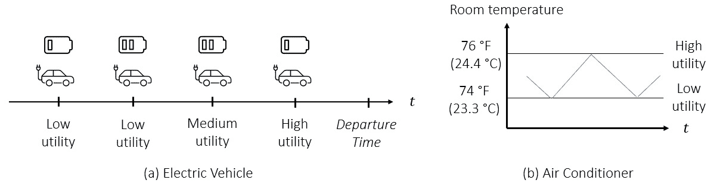
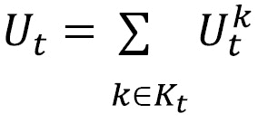

# 第十七章：智能城市与网络安全

智能城市预计将在未来几十年成为定义性体验之一。智能城市通过位于城市各个区域的传感器收集大量数据，如道路、公共设施基础设施和水资源。然后，这些数据用于做出基于数据和自动化的决策，如如何分配城市资源、实时管理交通以及识别和减轻基础设施问题。这个前景带来了两个挑战：如何编程自动化以及如何保护高度互联的城市资产免受网络攻击。幸运的是，**强化学习**（**RL**）可以帮助解决这两个问题。

在本章中，我们将探讨与智能城市和网络安全相关的三个问题，并描述如何将其建模为强化学习（RL）问题。在这个过程中，我们将向你介绍 Flow 库，这是一个将交通仿真软件与 RL 库连接的框架，并使用它解决一个交通信号灯控制问题。

具体来说，我们将在本章中解决以下问题：

+   通过交通信号灯控制优化车辆流量

+   为电网提供辅助服务

+   检测智能电网中的网络攻击

这将是一次有趣的旅程，让我们开始吧！

# 通过交通信号灯控制优化车辆流量

智能城市的一个关键挑战是优化道路网络上的交通流量。减少交通拥堵有许多好处，如下所示：

+   减少交通中浪费的时间和能源

+   节省燃油和减少排放

+   延长车辆和道路使用寿命

+   降低事故发生率

在这个领域已经进行了大量研究；但最近，强化学习（RL）已成为与传统控制方法竞争的替代方案。因此，在本节中，我们将通过使用多智能体强化学习（RL）控制交通信号灯行为来优化道路网络上的交通流量。为此，我们将使用 Flow 框架，它是一个开源的强化学习（RL）库，并在现实交通微观仿真中进行实验。

## 介绍 Flow

交通研究在很大程度上依赖于仿真软件，如**SUMO**（**城市交通模拟**）和 Aimsun，用于交通信号灯控制、车辆路线选择、交通监控和交通预测等领域，这些都涉及到这些智能体的最优控制。另一方面，深度强化学习作为传统控制方法的替代方案的兴起，催生了许多库，如 RLlib 和 OpenAI Baselines。Flow 是一个开源框架，连接了交通仿真器和强化学习库这两个领域。

在本节中，与之前的章节一样，我们将使用 RLlib 作为强化学习后端。对于交通仿真，我们将使用 SUMO，这是一个强大的开源库，自 2000 年代初期以来一直在开发。

信息

在这里，我们将仅简单介绍如何将强化学习应用于交通问题。详细的文档和教程（我们在这里严格遵循的）可以在 Flow 网站上找到：[`flow-project.github.io/`](https://flow-project.github.io/)。SUMO 的文档和库可以在 [`www.eclipse.org/sumo/`](https://www.eclipse.org/sumo/) 获得。

让我们从安装 Flow 和 SUMO 开始。

### 安装 Flow 和 SUMO

为了安装 Flow，我们需要创建一个新的虚拟环境，因为它依赖的库版本与我们在前面章节中使用的不同：

```py
$ sudo apt-get install python3-pip 
$ virtualenv flowenv
$ source flowenv/bin/activate
```

要安装 Flow，我们需要下载仓库并运行以下命令：

```py
$ git clone https://github.com/flow-project/flow.git
$ cd flow
$ pip3 install -e .
$ pip3 install ipykernel
$ python -m ipykernel install --user --name=flowenv
```

这些命令安装了必要的依赖项，包括 TensorFlow 和 RLlib。最后两个命令用于在 Jupyter Notebook 上运行 Flow，这也是 Flow 教程以及我们的示例代码所依赖的环境。要在 Ubuntu 18.04 上安装 SUMO，请使用以下命令：

```py
$ scripts/setup_sumo_ubuntu1804.sh
$ source ~/.bashrc
```

针对早期 Ubuntu 版本和 macOS 的设置脚本也可以在同一文件夹中找到。

你可以通过运行以下命令来查看 Flow 和 SUMO 的实际操作（在 Flow 文件夹中，并且虚拟环境已激活）：

```py
$ python examples/simulate.py ring
```

应该会出现一个类似于*图 17.1*中所示的窗口：


图 17.1 – 一个示例的 SUMO 窗口，模拟环路上的交通情况

如果在设置过程中遇到问题，Flow 文档可以帮助你进行故障排除。

现在我们已经设置好环境，接下来让我们深入了解如何使用 Flow 构建交通环境。

## 在 Flow 中创建实验

现在我们已经完成了设置，可以在 Flow 中创建环境和实验。接下来，我们将它们与 RLlib 连接，以训练 RL 代理。

一个 Flow 实验中有几个关键元素：

+   **一个道路网络**，比如一个环形道路（如*图 17.1*所示），或类似曼哈顿的网格网络。Flow 提供了一套预定义的网络。对于高级用户，它还允许创建自定义网络。交通信号灯与道路网络一起定义。

+   **一个仿真后端**，这不是我们关注的重点，我们将使用默认设置。

+   **一个 RL 环境**，它配置了实验中控制、观察和奖励的内容，类似于 Gym 环境。

+   **车辆**是整个实验的核心，它们的行为和特征是单独定义的。

所有这些组件都是参数化的，并且会单独传递给 Flow。然后，我们将它们打包在一起，创建一个 Flow 参数对象。

使用自下而上的方法可能会很困难，从每个组件的单独参数开始，来拼凑出整体的情况。此外，这些细节超出了本章的范围。相反，解包一个预构建的 Flow 参数对象会更容易。接下来我们就做这个。

### 分析 Flow 参数对象

Flow 定义了一些用于网格网络上交通信号灯优化的基准实验。请查看 Grid-0 实验的 Flow 参数对象：

Chapter17/Traffic Lights on a Grid Network.ipynb

```py
from flow.benchmarks.grid0 import flow_params
flow_params
{'exp_tag': 'grid_0',
 'env_name': flow.envs.traffic_light_grid.TrafficLightGridBenchmarkEnv,
 'network': flow.networks.traffic_light_grid.TrafficLightGridNetwork,
 'simulator': 'traci',
 'sim': <flow.core.params.SumoParams at 0x7f25102d1350>,
 'env': <flow.core.params.EnvParams at 0x7f25102d1390>,
 'net': <flow.core.params.NetParams at 0x7f25102d13d0>,
 'veh': <flow.core.params.VehicleParams at 0x7f267c1c9650>,
 'initial': <flow.core.params.InitialConfig at 0x7f25102d6810>}
```

我们可以举个例子，检查网络参数中的内容：

```py
print(dir(flow_params['net']))
flow_params['net'].additional_params
...
{'speed_limit': 35,
 'grid_array': {'short_length': 300,
  'inner_length': 300,
  'long_length': 100,
  'row_num': 3,
...
```

当然，理解它们如何工作的一个好方法是通过视觉化实验来进行：

```py
from flow.core.experiment import Experiment
sim_params = flow_params['sim']
sim_params.render = True
exp = Experiment(flow_params)
results = exp.run(1)
```

这将弹出一个与*图 17.2*中类似的 SUMO 屏幕：


图 17.2 – 网格网络的 SUMO 渲染

有了这些，我们现在有了一个正在运行的示例。在进入 RL 建模和训练之前，让我们讨论一下如何为这个实验获取基准奖励。

### 获取基准奖励

我们 GitHub 仓库中的 Jupyter notebook 包括一个从 Flow 代码库中提取的代码片段，用于获取该环境的基准奖励。它包含一些经过精心优化的交通信号灯阶段定义，平均奖励为 -204。我们将使用这个奖励来作为 RL 结果的基准。同样，随时可以修改阶段设置，看看它们对网络中交通模式的影响。

有了这些，我们现在准备好定义 RL 环境了。

## 建模交通信号灯控制问题

和往常一样，我们需要为 RL 问题定义动作、观察和奖励。我们将在接下来的章节中进行定义。

### 定义动作

我们希望为给定交叉口的所有信号灯训练一个单一控制器，如*图 17.2*中所示，例子`b`。在图中，信号灯处于绿-红-绿-红状态。我们定义一个二进制动作，0：继续，1：切换。当指示切换时，图中的信号灯状态将变为黄-红-黄-红，几秒钟后将变为红-绿-红-绿。

默认环境接受每个交叉口的连续动作，，并且按照之前描述的方法将其四舍五入以离散化。

### 单一智能体与多智能体建模

我们接下来的设计决策是，是否使用一个集中式智能体控制所有交通信号灯，或者采用多智能体方法。如果选择后者，无论是为所有交叉口训练一个单一策略，还是训练多个策略，我们需要注意以下几点：

+   集中式方法的优势在于，理论上我们可以完美协调所有交叉口，从而获得更好的奖励。另一方面，训练好的智能体可能不容易应用于不同的道路网络。此外，对于更大的网络，集中式方法不容易扩展。

+   如果我们决定使用多智能体方法，我们没有太多理由区分交叉口和它们使用的策略。因此，训练一个单一策略更有意义。

+   为所有交叉口训练一个单一的通用策略，其中智能体（交叉口的信号灯）协同尝试最大化奖励，这是一个可扩展且高效的方法。当然，这缺乏集中的单智能体方法的完全协调能力。实际上，这是一个需要你评估的权衡。

因此，我们将采用多智能体设置，其中策略将使用来自所有智能体的数据进行训练。智能体将根据其本地观察从策略中获取动作。

有了这些，让我们定义观察。

### 定义观察

默认的多智能体网格环境使用以下内容作为观察：

+   ！[](img/Formula_17_002.png) 接近交叉口的车辆的速度

+   ！[](img/Formula_17_003.png) 接近交叉口的车辆的距离

+   这些车辆所在道路边缘的 ID 是 ­

+   每个本地边缘的交通密度、平均速度和交通方向

+   当前信号灯是否处于黄色状态

有关更多详细信息，您可以查看 Flow 仓库中的`flow.envs.multiagent.traffic_light_grid`模块。

最后，让我们定义奖励。

### 定义奖励

环境对于给定时间步长有一个简单直观的成本定义，衡量的是与允许的最高速度相比，车辆的平均延迟：


这里，！[](img/Formula_17_006.png) 是总车辆数为  的车辆的速度，而  是允许的最高速度。然后，奖励可以定义为此成本项的负值。

现在我们已经有了所有的公式，是时候解决问题了。

## 使用 RLlib 解决交通控制问题

由于我们将使用 RLlib 的多智能体接口，我们需要做以下操作：

1.  在 RLlib 中注册环境，并提供一个名称和环境创建函数。

1.  定义我们将训练的策略的名称，我们只有一个策略，`tlight`。

1.  定义一个生成 RLlib 训练器所需参数的函数，以便为策略提供支持。

1.  定义一个函数，将智能体映射到策略，在我们的情况下这很简单，因为所有智能体都映射到相同的策略。

因此，这些可以通过以下代码实现：

```py
create_env, env_name = make_create_env(params=flow_params, 
                                       version=0)
register_env(env_name, create_env)
test_env = create_env()
obs_space = test_env.observation_space
act_space = test_env.action_space
def gen_policy():
    return PPOTFPolicy, obs_space, act_space, {}
def policy_mapping_fn(_):
    return 'tlight'
policy_graphs = {'tlight': gen_policy()}
policies_to_train = ['tlight']
```

一旦定义完毕，我们需要将这些函数和列表传递给 RLlib 配置：

```py
config['multiagent'].update({'policies': policy_graphs})
config['multiagent'].update({'policy_mapping_fn': 
                             policy_mapping_fn})
config['multiagent'].update({'policies_to_train': 
                             policies_to_train})
```

其余部分是常规的 RLlib 训练循环。我们使用在 Flow 基准测试中使用的超参数进行 PPO 训练。所有代码的完整内容可以在`Chapter17/Traffic Lights on a Grid Network.ipynb`中找到。

### 获取并观察结果

在经过几百万次训练步骤后，奖励收敛到约-243，略低于手工制作的基准。训练进度可以在 TensorBoard 中观察到：


图 17.3 – Flow 中多智能体交通信号灯环境的训练进度

你还可以通过在 Jupyter Notebook 中运行以下格式的命令，来可视化训练后智能体的表现：

```py
!python /path/to/your/flow/visualize/visualizer_rllib.py /path/to/your/ray_results/your_exp_tag/your_run_id 100
```

这里，末尾的参数指的是检查点编号，该编号在训练过程中定期生成。

接下来，我们还将讨论为什么强化学习的表现稍微逊色于手工设计的策略。

### 进一步改进

有几个原因可能导致强化学习未能达到基准性能：

+   缺乏更多的超参数调优和训练。这一因素始终存在。我们无法知道是否通过更多调整模型架构和训练可以提升性能，直到你尝试为止，我们鼓励你去尝试。

+   基准策略对黄灯持续时间进行了更精细的控制，而强化学习模型则没有对这一点进行控制。

+   基准策略协调网络中的所有交叉口，而每个强化学习智能体则做出局部决策。因此，我们可能会遇到去中心化控制的缺点。

+   通过增加一些观察，可以缓解这一问题，这些观察将有助于智能体与邻居之间的协调。

+   强化学习（RL）算法在优化的最后阶段，尤其是在达到奖励曲线的顶峰时，遇到困难并不罕见。这可能需要通过减少学习率和调整批量大小来精细控制训练过程。

因此，尽管仍有改进空间，我们的智能体已经成功学会如何控制交通信号灯，这比手动设计策略更具可扩展性。

在我们结束这个话题之前，来讨论一些资源，帮助更深入了解问题和我们使用的库。

## 进一步阅读

我们已经提供了 Flow 和 SUMO 文档的链接。Flow 库及其获得的基准测试在 *Wu et al., 2019* 和 *Vinitsky et al*., *2018* 中有所解释。在这些资源中，你将发现其他你可以用各种强化学习库建模和解决的问题。

恭喜！我们在如此短的时间和篇幅内，成功利用强化学习解决了交通控制问题。接下来，我们将探讨另一个有趣的问题，那就是调节电力需求以稳定电网。

# 为电网提供辅助服务

在这一部分中，我们将描述强化学习如何通过管理家居和办公大楼中的智能设备，帮助将清洁能源资源集成到电网中。

## 电网操作与辅助服务

从发电机到消费者的电力传输与分配是一项庞大的操作，需持续监控和控制系统。特别是，发电与消耗必须在一个地区几乎保持平衡，以使电流频率保持在标准频率（美国为 60 Hz），防止停电和损坏。这是一个具有挑战性的任务，原因如下：

+   电力供应在能源市场中提前规划，与该地区的发电机一起匹配需求。

+   尽管有这些规划，未来的电力供应仍然不确定，尤其是当电力来源于可再生能源时。风能和太阳能的供给可能低于或超过预期，导致供给过剩或不足。

+   未来的需求也不确定，因为消费者通常可以自由决定何时以及消费多少。

+   电网故障，如发电机或输电线路出现问题，可能导致供需发生突然变化，从而危及系统的可靠性。

供需平衡由称为**独立系统操作员**（**ISO**）的主管部门维持。传统上，ISO 根据电网的变化要求发电机增加或减少供应，这是发电机为 ISO 提供的附加服务，ISO 会支付费用。然而，关于发电机提供这种服务存在一些问题：

+   发电机通常对电网平衡的突变反应较慢。例如，可能需要数小时才能投入新的发电机组来应对电网中的供应不足。

+   近年来，可再生能源供应显著增加，进一步加剧了电网的不稳定性。

因此，已有一条研究路线开始，旨在使消费者也能向电网提供这些附加服务。换句话说，目标是调节需求，而不仅仅是供应，以更好地维持平衡。这需要更复杂的控制机制，这就是我们引入强化学习（RL）来协助的地方。

在这段介绍之后，让我们更具体地定义这里的控制问题。

## 描述环境与决策问题

重申一下，我们的目标是动态地增加或减少一个区域内的总电力消费。首先，我们来描述在这种情境下的各方及其角色。

### 独立系统操作员

该地区的 ISO 持续监控供需平衡，并向该地区的所有附加服务提供商广播自动信号，要求他们调整需求。我们将这个信号称为 ，它只是一个在  范围内的数字。稍后我们会详细解释这个数字的确切含义。目前，我们只需要说明，ISO 每 4 秒更新一次这个信号（这是一种叫做调节服务的附加服务）。

### 智能建筑操作员

我们假设有一个**智能建筑操作员**（**SBO**），负责调节（一栋或多栋）建筑的总需求，以跟随 ISO 信号。SBO 将作为我们的强化学习（RL）代理，按照以下方式操作：

+   SBO 将调节服务出售给该区域的 ISO（独立系统运营商）。根据这一义务，SBO 承诺将消耗维持在 kW 的速率，并在 ISO 的要求下，上下调节最多 kW。我们假设和是为我们的问题预先设定的。

+   当，SBO 需要快速将社区的消耗量降低到 kW。当，消耗速率需要提升至 kW。

+   一般来说，SBO 需要控制消耗，以遵循一个 kW 的速率。

SBO 控制着一群智能家电/设备，例如**供暖、通风和空调**（**HVAC**）设备和**电动** **汽车**（**EVs**），以遵循信号。在这里我们将利用强化学习（RL）。

我们在*图 17.4*中展示了这一设置：


图 17.4 – 智能建筑运营商提供调节服务

接下来，让我们更详细地了解一下智能家电是如何运作的。

### 智能家电

你可能会对某些算法干预你的家电并导致它们开关感到不舒服。毕竟，谁会希望在看超级碗的时候，电视为了省电而自动关掉，或者仅仅因为外面的风力比预期强，导致半夜电视突然打开呢？这显然没有意义。另一方面，如果空调比平时晚一分钟或早一分钟启动，你可能就会觉得没问题。或者你并不介意你的电动汽车在早上 4 点或 5 点充满电，只要它能在你离家前准备好。总之，重点是一些家电在运行时间上有更多的灵活性，这在本案例中是我们关注的焦点。

我们还假设这些家电是智能的，并且具备以下能力：

+   它们可以与 SBO 进行通信，以接收指令。

+   它们可以评估“效用”，即衡量家电在某一时刻需要消耗电力的程度。

#### 定义效用

让我们举两个例子，说明不同情况下效用的变化。考虑一个需要在早上 7 点之前充满电的电动汽车（EV）：

+   如果是早上 6 点，且电池电量仍然较低，那么效用就会很高。

+   相反，如果离出发时间还很远和/或电池已经接近充满，那么效用就会很低。

同样地，当房间温度即将超过用户的舒适区时，空调的效用会很高；当房间温度接近底部时，效用则很低。

请参见*图 17.5*以了解这些情况的示意图：



图 17.5 – 不同条件下电动汽车（a）和空调（b）的效用水平

接下来，让我们讨论为什么这是一个顺序决策问题。

### 定义顺序决策问题

到现在为止，你可能已经注意到，现在采取的 SBO 动作将会对以后产生影响。过早地为系统中的电动汽车（EV）充满电，可能会限制将来在需要时消费量的增加。相反，如果保持过多房间的室温过高，可能会导致所有空调在之后一起开启，以使房间温度恢复到正常水平。

在下一节中，让我们将其视为一个强化学习问题。

## 强化学习模型

和往常一样，我们需要定义动作、观察和奖励来创建一个强化学习模型。

### 定义动作

关于如何定义 SBO 控制，有不同的方法：

+   首先，更明显的方法是通过观察电器的效用来直接控制系统中的每个电器。另一方面，这会使模型变得不灵活，且可能无法处理：每当添加新电器时，我们必须修改并重新训练智能体。此外，当电器数量众多时，动作和观察空间会变得过于庞大。

+   另一种方法是为每个电器类别（空调、加热设备和电动汽车）在多智能体设置中训练一个策略。这将引入多智能体强化学习的固有复杂性。例如，我们必须设计一个机制来协调各个电器。

+   一个折衷的方法是应用间接控制。在这种方法中，SBO 会广播其动作，让每个电器自行决定该怎么做。

让我们更详细地描述这种间接控制可能是什么样子的。

#### 电器的间接控制

这里是我们如何定义间接控制/动作：

+   假设有  种电器类型，如空调、电动汽车和冰箱。

+   在任何给定的时刻，一个电器，，具有效用，，其最大值为 。

+   在每个时间步，SBO 会广播一个动作，，针对每种电器类型，。因此，动作是  和 

+   每个电器在关闭时，会时不时地检查其类别的动作。这并不是在每个时间步都会发生，而是取决于电器的类型。例如，空调（AC）可能会比电动汽车（EV）更频繁地检查广播的动作。

+   当电器，，类型为 ，检查动作  时，只有在  的情况下才会开启。因此，动作就像是**电价**。电器只有在其效用大于或等于**电价**时才会开启。

+   一旦开启，电器会保持开启一段时间。然后，它会关闭并开始定期检查动作。

通过这种机制，SBO 能够间接影响需求。它对环境的控制不如直接控制或多代理控制精确，但相比之下复杂度大大降低。

接下来，让我们定义观察空间。

### 定义观察

SBO 可以利用以下观察来做出有根据的决策：

+   时间时的 ISO 信号，，因为 SBO 有义务通过调整其需求来跟踪该信号。

+   时间时，每种类型的开启家电数量，。为了简单起见，可以假设每种类型家电的电力消耗率为固定值，，。

+   时间和日期特征，例如一天中的时间、一周中的天数、节假日日历等。

+   辅助信息，如天气温度。

除了在每个时间步进行这些观察之外，还需要保持对观察的记忆。这是一个部分可观察的环境，其中家电的能量需求和电网状态对代理是隐藏的。因此，保持记忆将帮助代理揭示这些隐藏状态。

最后，让我们描述奖励函数。

### 定义奖励函数

在此模型中，奖励函数由两部分组成：跟踪成本和效用。

我们提到过，SBO 有义务跟踪 ISO 信号，因为它为此项服务获得报酬。

因此，我们为偏离信号所暗示的目标时间分配了惩罚：


这里，是目标，而是时间时的实际消费率。

奖励函数的第二部分是由家电实现的总效用。我们希望家电能够开启并消耗能源，但要在它们真正需要的时候进行。以下是这一点为何有益的一个例子：当空调将室内温度保持在舒适区的上限（*图 17.3*中的 76°F）时，它的能耗要低于当温度保持在下限而外部温度高于舒适区时。因此，在时间时实现的总效用如下：



这里，是那些在离散时间步内开启的家电集合。然后，RL 目标变为以下形式：


这里，是一个系数，用于控制效用和跟踪成本之间的权衡，是折扣因子。

### 终端条件

最后，我们来谈谈这个问题的终止条件。通常，这是一个没有自然终止状态的连续任务。然而，我们可以引入终止条件，例如，如果跟踪误差过大，则停止任务。除此之外，我们还可以将其转化为一个阶段性任务，将每个阶段的长度设定为一天。

就是这样！我们没有详细介绍该模型的具体实现，但你现在已经对如何处理这个问题有了清晰的思路。如果需要更多细节，可以查看本章末尾由 Bilgin 和 Caramanis 提供的参考文献。

最后但同样重要的是，让我们转变思路，建模电网中网络攻击的早期检测。

# 在智能电网中检测网络攻击

智慧城市在定义上依赖于资产之间的强大数字通信。尽管这一点带来了好处，但也使得智慧城市容易受到网络攻击。随着强化学习（RL）逐步应用于网络安全，本节将描述它如何应用于检测智能电网基础设施中的攻击。在本节中，我们将遵循*Kurt et al., 2019*提出的模型，具体细节请参见该论文。

让我们从描述电网环境开始。

## 电网中网络攻击的早期检测问题

电力网由称为**总线**的节点组成，这些节点对应于发电、需求或电力线路的交叉点。电网管理者从这些总线收集测量数据，以做出某些决策，例如调入额外的发电单元。为此，关键的测量量是每个总线的**相位角**（参考总线除外），这使得它成为网络攻击者的潜在目标，因此我们对其感兴趣：

+   不出所料，来自仪表的测量数据是嘈杂的，且容易出错。

+   对这些仪表及其测量结果进行网络攻击，可能会误导电网管理者的决策，并导致系统崩溃。

+   因此，检测系统是否遭受攻击是非常重要的。

+   然而，要区分噪声和由攻击引起的异常与真实系统变化并不容易。通常，等待并收集更多的测量数据有助于解决这个问题。

+   另一方面，迟迟不宣布攻击可能会导致此期间做出错误的决策。因此，我们的目标是尽快识别这些攻击，但又不能产生过多的误报。

因此，我们的网络安全代理可以采取的可能行动集合很简单：宣布攻击或不宣布攻击。一个关于错误和真实（但延迟的）警报的示例时间线如*图 17.6*所示：


图 17.6 – (a) 错误警报和 (b) 真实但延迟的警报的示例时间线

以下是任务生命周期和奖励的详细信息：

+   一旦宣布攻击，任务终止。

+   如果是误报，则会产生奖励。如果是实警，则奖励为 0。

+   如果发生攻击但行动继续（且未声明攻击），则每个时间步会产生奖励！[](img/Formula_17_052.png)，。

+   在所有其他时间步中，奖励为 0。

由此，智能体的目标是最小化以下代价函数（或最大化其负值）：


这里，第一个项是误报的概率，第二个项是宣布攻击的预期（正向）延迟，是用于管理两者之间折衷的成本系数。

一个缺失的部分是观测值，我们将在接下来的内容中讨论。

## 电网状态的部分可观测性

系统的真实状态，即是否发生攻击，智能体无法直接观测到。相反，它收集相位角的测量值，。*Kurt 等人，2019*的一个关键贡献是以以下方式使用相位角的测量值：

1.  使用卡尔曼滤波器根据先前的观测值预测真实的相位角。

1.  基于此预测，估计预期的测量值，。

1.  定义作为和之间差异的度量，接着成为智能体使用的观测值。

1.  观察并保留过去观测的记忆供智能体使用。

本文使用表格化的 SARSA 方法通过离散化来解决此问题，并展示了该方法的有效性。一个有趣的扩展是使用深度强化学习方法，在没有离散化的情况下，适应不同的电网拓扑和攻击特征。

由此，我们结束了这一主题的讨论以及本章内容。做得好，我们已经完成了很多！让我们总结一下本章的内容。

# 总结

强化学习将在自动化领域发挥重要作用。智慧城市是利用强化学习力量的一个重要领域。在本章中，我们讨论了三个示例应用：交通信号控制、电力消耗设备提供辅助服务以及检测电网中的网络攻击。第一个问题使我们能够展示一个多智能体环境，我们使用了一种类似价格的间接控制机制来解决第二个问题，最后一个问题是部分观测环境中先进输入预处理的一个很好的例子。

在下一章也是最后一章，我们将总结本书内容，并讨论现实生活中强化学习的挑战及未来的方向。

# 参考文献

+   Wu, C., et al. (2019). *流动：一种面向交通自主性的模块化学习框架*。ArXiv:1710.05465 [Cs]。arXiv.org，[`arxiv.org/abs/1710.05465`](http://arxiv.org/abs/1710.05465)

+   Vinitsky, E., Kreidieh, A., Flem, L.L., Kheterpal, N., Jang, K., Wu, C., Wu, F., Liaw, R., Liang, E., & Bayen, A.M. (2018). *混合自主交通中的强化学习基准*. 第二届机器人学习会议论文集，PMLR 87:399-409，[`proceedings.mlr.press/v87/vinitsky18a.html`](http://proceedings.mlr.press/v87/vinitsky18a.html)

+   Bilgin, E., Caramanis, M. C., Paschalidis, I. C., & Cassandras, C. G. (2016). *智能建筑提供调节服务*. IEEE 智能电网学报, 第 7 卷，第 3 期，1683-1693 页，DOI: 10.1109/TSG.2015.2501428

+   Bilgin, E., Caramanis, M. C., & Paschalidis, I. C. (2013). *智能建筑实时定价以提供负荷端调节服务储备*. 第 52 届 IEEE 决策与控制会议，佛罗伦萨，4341-4348 页，DOI: 10.1109/CDC.2013.6760557

+   Caramanis, M., Paschalidis, I. C., Cassandras, C., Bilgin, E., & Ntakou, E. (2012). *通过灵活的分布式负荷提供调节服务储备*. 第 51 届 IEEE 决策与控制会议（CDC），毛伊岛，HI，3694-3700 页，DOI: 10.1109/CDC.2012.6426025

+   Bilgin, E. (2014). *分布式负荷参与同时优化能源和备用的电力市场*. 论文，波士顿大学

+   Kurt, M. N., Ogundijo, O., Li C., & Wang, X. (2019). *智能电网中的在线网络攻击检测：一种强化学习方法*. IEEE 智能电网学报, 第 10 卷，第 5 期，5174-5185 页，DOI: 10.1109/TSG.2018.2878570
