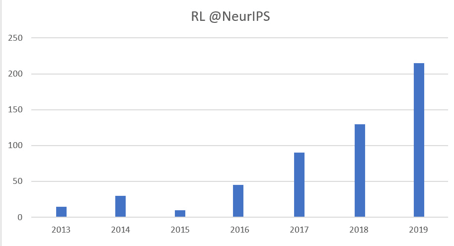
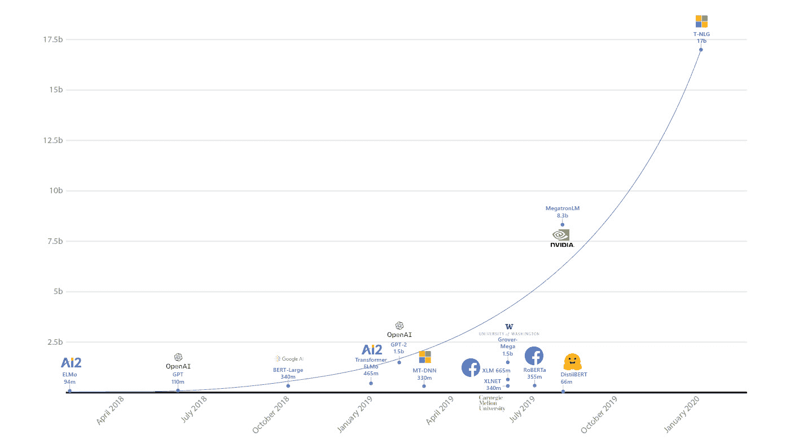

# 第十八章：强化学习中的挑战与未来方向

在最后一章中，我们将总结我们在本书中的旅程：你已经做了很多，所以把它当作一次庆祝，也是对你成就的全景回顾。另一方面，当你将所学应用于解决实际问题时，你可能会遇到许多挑战。毕竟，深度 RL 仍然是一个快速发展的领域，正在取得大量进展以解决这些挑战。我们在书中已经提到了大部分挑战，并提出了解决方法。接下来，我们将简要回顾这些内容，并讨论 RL 的其他未来方向。最后，我们将介绍一些资源和策略，帮助你成为 RL 专家，你已经在这条道路上走得非常远。

那么，这一章我们将讨论的内容如下：

+   你在本书中取得的成就

+   挑战与未来方向

+   对有志成为 RL 专家的建议

+   结束语

# 你在本书中取得的成就

首先，恭喜你！你已经远远超越了基础，掌握了在现实世界中应用强化学习（RL）所需的技能和心态。至此，我们已经共同完成了以下内容：

+   我们花费了相当多的时间讨论赌博问题，这些问题不仅在工业界有着广泛的应用，而且在学术界也作为辅助工具来解决其他问题。

+   我们比一般的应用书籍更深入地探讨了理论，以加强你在 RL 方面的基础。

+   我们涵盖了很多 RL 最成功应用背后的算法和架构。

+   我们讨论了先进的训练策略，以最大化地发挥高级 RL 算法的效果。

+   我们通过现实案例进行过实际操作。

+   在整个过程中，我们不仅实现了我们各自版本的一些算法，还利用了如 Ray 和 RLlib 等库，这些库为顶尖科技公司中的许多团队和平台提供了 RL 应用的技术支持。

你完全值得花点时间庆祝你的成功！

现在，一旦你回过神来，是时候讨论一下你面前的道路了。RL 正处于崛起的初期阶段。这意味着多方面的含义：

+   首先，这也是一个机会。通过做出这一投资并走到今天，你已经走在了前沿。

+   其次，由于这是前沿技术，RL 在成为成熟、易用的技术之前，还面临着许多需要解决的挑战。

在接下来的章节中，我们将讨论这些挑战是什么。这样，当你遇到它们时，你就能识别出来，知道自己并不孤单，并且能够根据解决问题所需的资源（数据、时间、计算资源等）设定合理的期望。但你不必担心！RL 是一个非常活跃且快速发展的研究领域，因此我们应对这些挑战的工具和方法日渐丰富。看看 Katja Hofmann，这位著名的 RL 研究员，在 2019 年 NeurIPS 会议上整理并展示的关于 RL 在 NeurIPS 会议上提交的论文数量：

图 18.1 – RL 贡献者在 NeurIPS 会议上的数量，由 Katja Hofmann 整理并展示（来源：Hofmann，2019）

因此，在我们讨论这些挑战的同时，我们也会讨论相关的研究方向，这样你就能知道应该在哪里寻找答案。

# 挑战与未来方向

你可能会想，为什么在完成一本高级强化学习书籍后，我们又回到讨论 RL 挑战的问题。确实，在全书中，我们提出了许多缓解这些挑战的方法。另一方面，我们不能声称这些挑战已经被解决。因此，指出这些挑战并讨论每个挑战的未来发展方向是非常重要的，这样可以为你提供一把指南针，帮助你应对这些问题。让我们从其中一个最重要的挑战开始讨论：样本效率。

## 样本效率

正如你现在已经清楚地知道，训练一个强化学习（RL）模型需要大量的数据。OpenAI Five，这个在战略游戏《Dota 2》中成为世界级玩家的 AI，训练过程中使用了 128,000 个 CPU 和 GPU，持续了好几个月，每天收集相当于 900 年的游戏经验**每一天**（OpenAI，2018）。RL 算法的性能通常是在它们已经训练过超过 100 亿帧 Atari 游戏画面后进行基准测试的（Kapturowski，2019）。这无疑需要大量的计算和资源，仅仅是为了玩游戏。所以，样本效率是现实世界 RL 应用中面临的最大挑战之一。

让我们讨论一下缓解这个问题的总体方向。

### 样本高效算法

一个显而易见的方向是尝试创建更加样本高效的算法。实际上，研究界对此方向有很大的推动。我们将越来越多地比较算法，不仅仅是基于它们的最佳性能，还会评估它们在达到这些性能水平时的速度和效率。

为此，我们将可能越来越多地讨论以下几种算法类别：

+   **脱策略方法**，不要求数据必须是在最新策略下收集的，这使它们在样本效率上相较于策略方法具有优势。

+   **基于模型的方法**，通过利用它们对环境动态的了解，比起无模型方法能在效率上高出几个数量级。

+   **具有先验知识的模型**，这些模型将假设空间限制为一个合理的集合。这类模型的例子包括使用神经常微分方程和拉格朗日神经网络的 RL 模型（Du, 2020；Shen, 2020）。

### 用于分布式训练的专用硬件和软件架构

我们可以预期，算法前沿的进展将是渐进且缓慢的。对于那些充满激情、迫不及待的爱好者来说，更快速的解决方案是向 RL 项目投入更多的计算资源，充分利用现有资源，训练越来越大的模型。因此，完全合理地预期，在**自然语言处理**（**NLP**）领域发生的事情也会发生在 RL 中：NLP 模型的规模从 80 亿参数增加到 170 亿参数，再到 1750 亿参数，OpenAI 的 GPT-3 在不到一年的时间内达到了这一规模，这要归功于训练架构的优化，当然还有专门用于此任务的超级计算机。

图 18.2 – 最大的 NLP 模型规模的增长。纵轴是参数的数量。图像修改自 Rosset, 2020

此外，RL 训练架构的创新，如 Ape-X 和 SEED RL 中的创新（*Espeholt, 2019*），帮助现有的 RL 算法运行得更加高效，这是一个我们可以期待看到更多进展的方向。

### 机器教学

机器教学方法，如课程学习、奖励塑形和示范学习，旨在将上下文和专业知识融入到 RL 训练中。这些方法通常在训练过程中显著提高样本效率，在某些情况下，它们是让学习变得更加可行所必需的。机器教学方法将在不久的将来变得越来越流行，以提高 RL 中的样本效率。

### 多任务/元学习/迁移学习

由于从头开始训练一个 RL 模型可能非常昂贵，因此复用在其他相关任务上训练过的模型才是明智的做法。例如，当我们想开发一个涉及图像分类的应用时，现在很少有情况下我们从头开始训练模型。相反，我们会使用一个预训练的模型，并根据我们的应用需求进行微调。

信息

ONNX 模型库是一个预训练的、先进的模型集合，采用开放标准格式，适用于图像分类和机器翻译等流行任务，我强烈建议你查看一下：[`github.com/onnx/models`](https://github.com/onnx/models)。

我们可以预期在 RL 任务中也会看到类似的资源库。在相关的背景下，像多任务学习（训练多个任务的模型）和元学习（训练能够高效转移到新任务的模型）等方法，将在 RL 研究人员和实践者中获得更多的关注和更广泛的应用。

### RL 即服务

如果你需要在应用程序中以编程方式翻译文本，正如我们之前提到的，一种方法是使用预训练模型。但是，如果你不想投入精力去维护这些模型呢？答案通常是从微软、谷歌、亚马逊等公司购买该服务。这些公司拥有大量的数据和计算资源，并且他们通过尖端的机器学习方法不断升级自己的模型。对于其他没有相同资源和聚焦的企业来说，做到同样的事情可能是一个艰巨的任务，甚至是不可行的，或者根本就是不实际的。我们可以预见到，RL 即服务（RL-as-a-service）将成为行业中的一种趋势。

样本效率（sample efficiency）是一个难题，但在多个领域已经有了进展，正如我们所总结的那样。接下来，我们将讨论另一个主要挑战：对良好仿真模型的需求。

## 对高精度和快速仿真模型的需求

强化学习在工业中广泛应用的最大障碍之一是缺乏能够有效仿真公司希望优化的过程的模型，或者这些模型的逼真度不足以达到要求。创建这些仿真模型通常需要大量投资，在一些复杂任务中，仿真模型的逼真度可能不足以支撑典型的强化学习方法。为了克服这些挑战，我们可以预见到在以下几个领域会有更多的进展。

### 离线强化学习从数据中直接学习

尽管工业中的大多数过程没有仿真模型，但更常见的是会有日志记录描述过程中的发生事件。离线强化学习（Offline RL）方法旨在直接从数据中学习策略，随着强化学习逐渐进入现实世界应用，这种方法的重要性将变得越来越大。

### 处理泛化、部分可观测性和非平稳性的方法

即使在存在过程仿真模型的情况下，这种模型通常也很难达到足够的逼真度，无法直接训练一个可以在现实世界中工作的强化学习模型，而不需要额外的考虑。这个“仿真到现实”的差距可以看作是部分可观测性的一种形式，通常通过强化学习模型架构中的记忆机制来处理。结合领域随机化和正则化等泛化技术，我们已经看到了一些非常成功的应用场景，其中在仿真中训练的策略被转移到现实世界。处理非平稳性（non-stationarity）问题也与强化学习算法的泛化能力密切相关。

### 在线学习和边缘设备上的微调

使强化学习方法成功应用的一个重要能力是，在将模型部署到边缘设备后仍能继续进行训练。这样，我们将能够用实际数据对在仿真中训练的模型进行微调。此外，这一能力将帮助强化学习策略适应环境中变化的条件。

总结来说，我们将看到强化学习（RL）从视频游戏中的工具转变为传统控制和决策方法的替代方案，这一转变将通过去除对高保真模拟的依赖的方式得到促进。

## 高维动作空间

CartPole，作为 RL 的标志性测试平台，其动作空间只有少数几个元素，就像大多数用于 RL 研究的 RL 环境一样。然而，现实问题通常在可用动作数量上非常复杂，这也常常取决于智能体所处的状态。在这种现实场景中，像动作嵌入、动作屏蔽和动作淘汰等方法将帮助应对这一挑战。

## 奖励函数的保真度

制定正确的奖励函数，使智能体实现期望行为，是 RL 中公认的困难任务。逆向 RL 方法（通过示范学习奖励）和基于好奇心的学习（依赖内在奖励）是有前景的减少手工设计奖励函数依赖性的方法。

奖励函数工程的挑战在目标多样且具有定性时更加复杂。关于多目标 RL 方法的文献越来越多，这些方法要么分别处理每个子问题，要么为给定的目标组合生成策略。

关于 RL 环境中奖励信号的另一个挑战是奖励的延迟和稀疏性。例如，一个由 RL 智能体控制的营销策略可能会在行动后几天、几周甚至几个月才观察到奖励。解决因果关系和信用分配问题的 RL 方法在这些环境中至关重要，能够让 RL 在这些环境中得以有效应用。

这些都是值得关注的重要分支，因为现实世界中的 RL 问题很少具有明确、密集且标量的目标。

## 安全性、行为保证和可解释性

在计算机仿真中训练 RL 智能体时，尝试随机和疯狂的动作以找到更好的策略是完全可以接受的，事实上，这是必须的。对于与世界级选手在棋盘游戏中竞争的 RL 模型来说，最糟糕的情况就是输掉比赛，或许是有些尴尬。当 RL 智能体负责化学过程或自动驾驶汽车时，风险则是完全不同的类别。这些都是安全关键系统，容错空间几乎为零。事实上，这是 RL 方法相比于传统控制理论方法的一大劣势，后者通常伴随着理论保证和对预期行为的深刻理解。因此，约束 RL 和安全探索的研究对于在此类系统中使用 RL 至关重要。

即便系统并非安全至关重要的场景，例如在库存补充问题中，相关的挑战仍然是 RL 智能体所建议的行动的可解释性。在这些过程中，监督决策的专家往往需要解释，尤其是当建议的行动违背直觉时。人们往往会为了可解释性而牺牲准确性，这使得黑箱方法处于不利地位。深度学习在可解释性方面已经取得了长足的进展，而 RL 无疑会从中受益。另一方面，这将是机器学习面临的持续挑战。

## 再现性和对超参数选择的敏感性

对于一个特定任务，通过众多专家的密切监督和指导训练一个 RL 模型，经过多次迭代，这是一回事；而在多个生产环境中部署多个 RL 模型，并定期进行再训练，同时在新数据到来时不需人工干预，这又是另一回事。在各种条件下，RL 算法生成成功策略的一致性和韧性将成为评估这些算法时越来越重要的因素，既适用于研究社区，也适用于实际操作中需要处理这些模型及其维护的从业者。

## 鲁棒性与对抗性智能体

深度学习在其表示方面是脆弱的。这种缺乏鲁棒性使得对抗性智能体能够操控依赖深度学习的系统。这是一个重大问题，也是机器学习社区中非常活跃的研究领域。强化学习（RL）肯定会借助广泛的机器学习研究成果，解决该领域的鲁棒性问题。

这些 RL 挑战对于希望使用这些工具解决现实世界问题的从业者来说非常重要，且这一总结希望能够帮助到你。我们在书中覆盖了许多解决方案方法，并在本节中也提到了整体的方向，所以你知道该从哪里寻找解决方案。所有这些都是活跃的研究领域，因此，每当你遇到这些挑战时，回顾文献是一个很好的做法。

在结束之前，我想对有志成为 RL 专家的人提供一些个人看法。

# 对有志成为 RL 专家的建议

本书面向的读者群体是那些已经掌握了强化学习基础的人。既然你已经读完了这本书，你已经具备了成为 RL 专家的基础条件。话虽如此，RL 是一个庞大的话题，本书的真正目的是为你提供一份指南和启动器。如果你决定深入研究，成为一名 RL 专家，我有一些建议。

## 深入了解理论

在机器学习中，模型往往无法在一开始就产生预期的结果。有一个重要因素可以帮助你克服这些障碍，那就是为你用来解决问题的算法背后的数学打下坚实的基础。这将帮助你更好地理解这些算法的局限性和假设，并能识别它们是否与当前问题的实际情况冲突。为此，以下是一些建议：

+   深入理解概率论和统计学永远不是坏主意。别忘了，所有这些算法本质上都是统计模型。

+   对强化学习的基本概念有扎实的理解，如 Q-learning 和贝尔曼方程，对于构建现代强化学习是至关重要的。本书在某种程度上服务于这个目的。然而，我强烈推荐你多次阅读 Rich Sutton 和 Andrew Barto 的书籍 *Reinforcement Learning: An Introduction*，这本书基本上是传统强化学习的圣经。

+   赛尔吉·莱文教授的 UC Berkeley 深度强化学习课程，是本书在此领域受益匪浅的一个重要资源。这个课程可以通过 [`rail.eecs.berkeley.edu/deeprlcourse/`](http://rail.eecs.berkeley.edu/deeprlcourse/) 访问。

+   另一个很棒的资源，专门涉及多任务学习和元学习，是切尔西·芬恩教授的斯坦福课程，网址是 [`cs330.stanford.edu/`](https://cs330.stanford.edu/)。

+   由该领域专家教授的 Deep RL Bootcamp 是另一个优秀的资源：[`sites.google.com/view/deep-rl-bootcamp/home`](https://sites.google.com/view/deep-rl-bootcamp/home)。

当你浏览这些资源，并不时参考它们时，你会发现自己对该主题的理解变得更加深入。

## 关注优秀的从业者和研究实验室

有一些优秀的研究实验室专注于强化学习（RL），并且他们也通过详细的博客文章发布他们的研究成果，这些文章包含了很多理论和实践的见解。以下是一些例子：

+   OpenAI 博客: [`openai.com/blog/`](https://openai.com/blog/)

+   DeepMind 博客: [`deepmind.com/blog`](https://deepmind.com/blog)

+   **伯克利人工智能研究**（**BAIR**）博客: [`bair.berkeley.edu/blog`](https://bair.berkeley.edu/blog)

+   微软研究院强化学习小组: [`www.microsoft.com/en-us/research/theme/reinforcement-learning-group/`](https://www.microsoft.com/en-us/research/theme/reinforcement-learning-group/)

+   Google AI 博客: [`ai.googleblog.com/`](https://ai.googleblog.com/)

即使你不阅读每一篇帖子，定期查看它们也是个好主意，这样可以保持与强化学习研究趋势同步。

## 从论文和它们的优秀解释中学习

在人工智能（AI）研究中，一年就像是狗年：发生了很多事。所以，保持最新的最好的方式就是关注该领域的研究。这也会让你接触到方法的理论和严格的解释。现在，这样做有两个挑战：

+   每年发布的论文数量庞大，几乎不可能阅读所有论文。

+   阅读公式和证明可能会让人感到望而生畏。

为了解决前者，我建议你关注像 NeurIPS、ICLR、ICML 和 AAAI 等会议上接收的论文。这仍然会是一大堆论文，因此你需要制定自己的筛选标准，决定哪些论文值得阅读。

为了解决后者，你可以查看是否有优秀的博客文章解释你想更好理解的论文。以下是一些高质量的博客（不限于 RL）：

+   Lilian Weng 的博客: [`lilianweng.github.io/lil-log/`](https://lilianweng.github.io/lil-log/)

+   Distill: [`distill.pub/`](https://distill.pub/)

+   The Gradient: [`thegradient.pub/`](https://thegradient.pub/)

+   Adrian Colyer 的《晨间论文》: [`blog.acolyer.org/`](https://blog.acolyer.org/)

+   Jay Alammar 的博客: [`jalammar.github.io/`](http://jalammar.github.io/)

+   Christopher Olah 的博客（他也是 Distill 团队的一员）: [`colah.github.io/`](https://colah.github.io/)

+   Jian Zhang 的博客: `medium.com/@jianzhang_23841`

我个人从这些博客中学到了很多，并且仍然在持续学习。

## 关注深度学习其他领域的趋势

深度学习的许多重大进展，如 Transformer 架构，仅需几个月时间就能进入强化学习（RL）领域。因此，保持对广泛的机器学习和深度学习研究中的主要趋势的关注，将帮助你预测 RL 领域即将到来的发展。我们在前一部分列出的博客是跟踪这些趋势的好方法。

## 阅读开源代码库

到目前为止，强化学习中的算法实在是太多了，无法在书中逐行解释。因此，你需要在某个阶段培养这种素养，直接阅读这些算法的优质实现。以下是我的建议：

+   OpenAI Spinning Up 网站: [`spinningup.openai.com/`](https://spinningup.openai.com/)，以及代码库: [`github.com/openai/spinningup`](https://github.com/openai/spinningup)

+   OpenAI Baselines: [`github.com/openai/baselines`](https://github.com/openai/baselines)

+   Stable Baselines: [`github.com/hill-a/stable-baselines`](https://github.com/hill-a/stable-baselines)

+   DeepMind OpenSpiel: [`github.com/deepmind/open_spiel`](https://github.com/deepmind/open_spiel)

+   Ray 和 RLlib: [`github.com/ray-project/ray`](https://github.com/ray-project/ray)

+   Maxim Lapan 的《动手深度强化学习》书籍代码库: [`github.com/PacktPublishing/Deep-Reinforcement-Learning-Hands-On`](https://github.com/PacktPublishing/Deep-Reinforcement-Learning-Hands-On)

除了这些，许多论文现在也有自己的代码库，就像我们在本书的某些章节中使用过的那样。有一个非常好的网站，[`paperswithcode.com/`](https://paperswithcode.com/)，你可以用来查找这类论文。

## 实践！

无论你读了多少内容，真正的学习只有通过实践才能实现。所以，尽可能亲自动手去做。你可以通过复现强化学习论文和算法，或者更好的是，进行自己的强化学习项目。深入理解实现的内部细节所带来的益处是任何其他方式都无法替代的。

我希望这套资源对你有帮助。需要明确的是，这些内容量很大，消化这些信息需要时间，因此请设定实际的目标。此外，你还需要在阅读和跟随内容时有所选择，这个习惯会随着时间的推移而逐步养成。

# 最后的话

好了，是时候总结了。感谢你投入时间和精力阅读这本书。希望它对你有所帮助。最后我想强调的是，掌握一项技能需要很长时间，而且你能达到的水平是没有限制的。没有人是所有领域的专家，即使是强化学习或计算机视觉这样的小领域也是如此。你需要不断实践。无论你的目标是什么，持续性和一致性将决定你的成功。祝你在这条路上一路顺利。

# 参考文献

+   Hofmann, K. (2019). *强化学习：过去、现在和未来的视角*。神经信息处理系统会议，温哥华，加拿大。网址：[`slideslive.com/38922817/reinforcement-learning-past-present-and-future-perspectives`](https://slideslive.com/38922817/reinforcement-learning-past-present-and-future-perspectives)

+   OpenAI (2018). *OpenAI Five*。OpenAI 博客。网址：[`openai.com/blog/openai-five/`](https://openai.com/blog/openai-five/)

+   Kapturowski, S., Ostrovski, G., Dabney, W., Quan, J., & Munos R. (2019). *分布式强化学习中的递归经验回放*。国际学习表征大会

+   Espeholt, L., Marinier, R., Stanczyk, P., Wang, K., & Michalski, M. (2019). *SEED RL：具有加速中央推理的可扩展高效深度强化学习*。arXiv.org，[`arxiv.org/abs/1910.06591`](http://arxiv.org/abs/1910.06591)

+   Du, J., Futoma, J., & Doshi-Velez, F. (2020). *基于模型的强化学习在神经 ODE 下的半马尔可夫决策过程中的应用*。arXiv.org， [`arxiv.org/abs/2006.16210`](https://arxiv.org/abs/2006.16210)

+   Shen, P. (2020). *神经 ODE 在可微分强化学习与最优控制中的应用：Cartpole 问题再探*。The startup。网址：[`bit.ly/2RROQi3`](https://bit.ly/2RROQi3)

+   Rosset, C. (2020). *Turing-NLG：微软的 17 亿参数语言模型*。微软研究博客。网址：[`www.microsoft.com/en-us/research/blog/turing-nlg-a-17-billion-parameter-language-model-by-microsoft/`](https://www.microsoft.com/en-us/research/blog/turing-nlg-a-17-billion-parameter-language-model-by-microsoft/)

+   Dulac-Arnold, G. 等人（2020）。*现实世界强化学习挑战的实证研究*。arXiv:2003.11881 [Cs]。arXiv.org，[`arxiv.org/abs/2003.11881`](http://arxiv.org/abs/2003.11881)

+   Dulac-Arnold, G. 等人（2019）。*现实世界强化学习的挑战*。arXiv:1904.12901 [Cs, Stat]。arXiv.org，[`arxiv.org/abs/1904.12901`](http://arxiv.org/abs/1904.12901)

+   Irpan, A.（2018）。*深度强化学习尚未奏效*。[`www.alexirpan.com/2018/02/14/rl-hard.html`](http://www.alexirpan.com/2018/02/14/rl-hard.html)

+   Levine, S.（2019）。深度强化学习 – CS285 Fa19 11/18/19，YouTube，[`youtu.be/tzieElmtAjs?t=3336`](https://youtu.be/tzieElmtAjs?t=3336)。访问日期：2020 年 9 月 26 日。

+   Hoffmann, K. 等人（2020）。*终身强化学习中的挑战与机遇*。ICML 2020。URL：[`slideslive.com/38930956/challenges-opportunities-in-lifelong-reinforcement-learning?ref=speaker-16425-latest`](https://slideslive.com/38930956/challenges-opportunities-in-lifelong-reinforcement-learning?ref=speaker-16425-latest)
