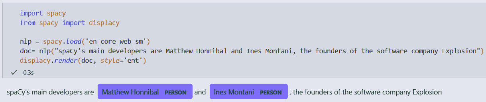

# 第一章：开始使用 spaCy

在本章中，我们将全面介绍使用 `Python` 和 `spaCy` 进行自然语言处理（`NLP`）应用开发。首先，我们将了解 NLP 开发如何与 Python 相辅相成，以及 spaCy 作为 Python 库提供的内容概述。

在热身之后，您将快速开始使用 spaCy，通过下载库和加载模型。然后，您将探索 spaCy 的流行可视化工具 `displaCy`，以可视化语言数据并探索其各种特性。

在本章结束时，您将了解使用 spaCy 可以实现什么，并对其关键特性有一个概述。您还将熟悉您的开发环境，该环境将用于本书的所有章节。

我们将涵盖以下主题：

+   spaCy 概述

+   安装 spaCy

+   安装 spaCy 的语言模型

+   使用 displaCy 进行可视化

# 技术要求

本章的代码可以在 [`github.com/PacktPublishing/Mastering-spaCy-Second-Edition`](https://github.com/PacktPublishing/Mastering-spaCy-Second-Edition) 找到。

# spaCy 概述

自然语言处理（NLP）是人工智能的一个子领域，它分析文本、语音和其他形式的人类生成语言数据。人类语言很复杂——即使是简短的段落也包含对先前单词的引用、指向现实世界对象的指针、文化引用以及作者或说话者的个人经历。*图 1.1* *.1* 展示了这样一个例子句子，其中包含对*相对日期*的引用（最近），只有*知道说话者的人*才能解决的短语（关于说话者父母居住的城市），以及*对世界有一般知识的人*（城市是人类共同生活的地方）：


图 1.1 – 包含许多认知和文化方面的人类语言示例

我们如何使用计算机处理如此复杂的结构？使用 spaCy，我们可以轻松地用统计模型建模自然语言，并处理语言特征，将文本转换为结构良好的表示。本书为您提供了所有必要的背景和工具，以从文本中提取意义。

2022 年 11 月 ChatGPT 的推出，全世界都为模型能够以与我们人类非常相似的方式理解指令和生成文本的能力而感到震惊。然而，就像食品加工器可以在几秒钟内切碎、切片和搅拌一样，它并不总是每个工作的最佳工具。有时，你只需要一把简单的厨房刀就能快速高效地完成任务。同样，虽然**大型语言模型**（`LLMs`）如 ChatGPT 功能强大且多才多艺，但它们对于许多需要**专注**、**高效**和**可解释**解决方案的真实世界应用来说可能是过度配置的。

因此，了解如 spaCy 之类的库非常有价值。spaCy 提供了专门用于 NLP 的工具，允许你快速处理特定任务，而无需 LLM 的复杂性和资源需求。并且，通过`spacy-llm`，你还可以将 LLM 组件纳入 spaCy 管道中。无论你是构建命名实体识别器、文本分类器还是分词器，spaCy 都提供了实用的、优化良好的*厨房刀*，能够高效地解决复杂语言任务。了解何时以及如何使用正确的工具，在构建有效的 NLP 系统中可以起到决定性作用。

## spaCy 库的高级概述

spaCy 是一个开源的 Python 库，旨在帮助我们完成实际工作。它非常快，因为其性能关键部分是用 Cython 实现的，允许优化速度同时仍然易于与 Python 一起使用。spaCy 附带预训练的语言模型和 75 多种语言的词向量。

另一个著名且经常使用的 Python 库是**自然语言工具包**（`NLTK`）。NLK 的焦点是为学生和研究人员提供一个语言处理的概念。spaCy 从第一天起就专注于提供生产就绪的代码。你可以期待模型在真实世界数据上的表现，代码的效率，以及能够在合理的时间内处理大量文本数据的能力。

spaCy 专注于真实世界 NLP 应用的事实并不仅仅是因为其处理速度，还因为使用它构建的应用程序易于维护代码。在 2019 年 PyCon 印度大会的主题演讲“让他们编写代码”（幻灯片可在[`speakerdeck.com/inesmontani/let-them-write-code-keynote-pycon-india-2019`](https://speakerdeck.com/inesmontani/let-them-write-code-keynote-pycon-india-2019)）中，Ines Montani（spaCy 的核心开发者之一）讨论了 spaCy 创建背后的哲学。spaCy 设计背后的主要思想是“*帮助人们完成工作*”。一些最糟糕的开发者体验是“*想要完全* *集成解决方案*的工具。”

使用 spaCy，我们可以将每个 NLP 应用程序分解为管道组件，重用预构建的库组件或创建我们自己的自定义组件。我们将在*第五章*中深入探讨 spaCy 管道。spaCy 容器对象（`Doc`、`Token`和`Span`）使文本的处理和加工变得无缝（在*第二章*中详细介绍）并且我们可以使用 spaCy 的**配置系统**（[`spacy.io/usage/training#config`](https://spacy.io/usage/training#config)）来训练统计模型，这带来了模块化、灵活性和清晰的声明性配置，使得 NLP 组件的定制和重用变得容易（*第六章*）。SpaCy 还使得在我们的 NLP 处理管道中集成使用 LLMs 的组件变得容易（*第七章*），并且还帮助我们使用`Weasel`（*第九章*）管理和共享不同用例和领域的端到端工作流程。最后，spaCy 还与其他酷炫的开源库如`DVC`、`Streamlit`和`FastAPI`（*第九章*和*第十章*）集成。所有这些内容涵盖了 spaCy 库的结构以及它如何帮助我们构建可维护的 NLP 解决方案的主要构建块。

到目前为止，我希望您在本书的学习之旅中学习如何使用所有这些酷炫功能感到兴奋。在下一节中，让我们安装 spaCy，这样我们就可以开始编码了。

# 安装 spaCy

让我们从安装和设置 spaCy 开始。spaCy 与 64 位 CPython 3.7+兼容，可以在 Unix/Linux、macOS/OS X 和 Windows 上运行。CPython 是用 C 实现的 Python 的参考实现。如果您已经在系统上运行了 Python，那么您的 CPython 模块很可能也是好的——因此，您不需要担心这个细节。最新的 spaCy 版本总是可以通过`pip`（[`pypi.org/`](https://pypi.org/)）和`conda`（[`conda.io/en/latest/`](https://conda.io/en/latest/)）下载。`pip`和`conda`是最受欢迎的发行包之一。

总是创建一个虚拟环境来隔离每个项目的独立 Python 包集是一个好主意。在 Windows 上，我们可以使用以下命令创建虚拟环境并使用`pip`安装`spacy`：

```py
python -m venv .env
.env\Scripts\activate
pip install -U pip setuptools wheel
pip install -U spacy
```

如果您的机器有可用的 GPU，您可以使用以下命令安装具有 GPU 支持的 spaCy：

```py
pip install -U 'spacy[cuda12x]'
```

您可以在[`spacy.io/usage#quickstart`](https://spacy.io/usage#quickstart)查看每个操作系统的安装说明。*图 1.2*展示了所有可用的安装选项。


图 1.2 – spaCy 安装选项

安装库后，我们需要安装语言模型。让我们在下一节中完成这个操作。

# 安装 spaCy 的语言模型

spaCy 的安装不包括 spaCy 管道任务所需的统计语言模型。spaCy 语言模型包含从一组资源收集的特定语言的知识。语言模型使我们能够执行各种 NLP 任务，包括**词性标注**，通常称为**POS 标注**和**命名实体****识别**（`NER`）。

不同的语言有不同的语言特定模型。同一语言也有不同的模型可供选择。模型的命名约定是`[lang]_[name]`。`[name]`部分通常包含有关模型功能、类型和大小的信息。例如，`pt_core_web_sm`模型是在网络文本上训练的小型葡萄牙语管道。大型模型可能需要大量的磁盘空间，例如，`en_core_web_lg`占用 382 MB，而`en_core_web_md`需要 31 MB，而`en_core_web_sm`只需 12 MB。

将模型类型与您的文本类型相匹配是一种良好的实践。我们建议选择尽可能接近您文本的类型。例如，社交媒体类型的词汇将与维基百科类型的词汇大不相同。如果您有社交媒体帖子、报纸文章或财经新闻，可以选择网络类型，即更多来自日常生活的语言。维基百科类型适用于较为正式的文章、长文档和技术文档。如果您不确定哪种类型最适合，您可以下载几个模型，测试一些来自您自己的语料库的示例句子，并查看每个模型的表现。

现在我们已经了解了如何选择模型，让我们下载我们的第一个模型。

## 安装语言模型

我们可以将 spaCy 模型作为 Python 软件包安装，这意味着您可以将它们像安装任何其他 Python 模块一样安装，并将它们作为您 Python 应用程序的一部分。它们也可以放入您的`requirements.txt`文件中作为依赖项。您可以手动从下载 URL 或本地目录安装模型，或通过`pip`安装。

您可以通过 spaCy 的`download`命令下载模型。`download`会寻找与您的 spaCy 版本最兼容的模型，然后下载并安装它。这样，您就不必担心模型与您的 spaCy 版本之间可能存在的任何不匹配。这是安装模型的最简单方法：

```py
python -m spacy download en_core_web_sm
```

上述命令选择并下载与您本地 spaCy 版本最兼容的此特定模型的版本。要下载确切的模型版本，您可以使用以下命令（尽管您通常不需要这样做）：

```py
python -m spacy download en_core_web_sm-3.8.0 --direct
```

**下载**命令在幕后使用`pip`。当您进行下载时，`pip`会安装该软件包并将其放置在您的`site-packages`目录中，就像任何其他已安装的 Python 软件包一样。

下载后，我们可以通过 spaCy 的`load()`方法加载软件包：

```py
import spacy
nlp = spacy.load('en_core_web_sm')
doc = nlp("One step forward and you're no longer in the same place")
```

到目前为止，我们已经设置好了一切，可以开始使用 spaCy。现在让我们了解一下 spaCy 强大的可视化工具`displaCy`。

# 使用 displaCy 进行可视化

可视化是向您的同事、老板以及任何技术或非技术受众解释一些概念的最简单方法。语言数据可视化特别有用，并允许您一眼就能识别数据中的模式。

有许多 Python 库和插件，如`matplotlib`、`seaborn`、`tensorboard`等。spaCy 也自带其可视化器 – displaCy。在本节中，您将学习如何在您的机器上启动 displaCy 服务器，在 Jupyter 笔记本中，以及在 Web 应用程序中。我们将从最简单的方法开始探索 – 使用 displaCy 的交互式演示。

## 开始使用 displaCy

请前往[`demos.explosion.ai/displacy`](https://demos.explosion.ai/displacy)使用交互式演示。在**文本解析**框中输入您的文本，然后点击右侧的搜索图标以生成可视化。结果可能看起来像*图 1.3*。


图 1.3 – displaCy 的在线演示

可视化器执行两个句法分析，**词性标注**和**依存句法分析器**。我们将在接下来的章节中探讨它们。现在，只需将结果视为句子结构。现在，让我们看看如何使用 displaCy 可视化命名实体。

## 实体可视化器

displaCy 的实体可视化器突出显示文本中的命名实体。在线演示在[`demos.explosion.ai/displacy-ent`](https://demos.explosion.ai/displacy-ent) 。我们还没有讲解命名实体，但您可以将它们视为重要实体的专有名词，例如人名、公司名、日期、城市和国家名称等。

在线演示与句法分析器演示类似。将您的文本输入到文本框中，然后点击**搜索**按钮。*图 1.4*显示了示例。


图 1.4 – displaCy 的命名实体可视化器

右侧包含实体类型的复选框。您可以选择与您的文本类型匹配的复选框，例如，对于财务文本，可以选择`MONEY`和`QUANTITY`。就像在句法分析器演示中一样，您可以从可用的模型中选择。

## 使用纯 Python 与 displaCy 结合

displaCy 的可视化器集成到核心库中。这意味着您可以在安装 spaCy 到您的机器后立即开始使用 displaCy。让我们通过一些示例来了解：

1.  首先，让我们导入 spaCy 和 displaCy，加载模型，并处理一个句子：

    ```py
    import spacy
    from spacy import displacy
    nlp = spacy.load('en_core_web_sm')
    doc= nlp("One step forward and you're no longer in the same place")
    ```

1.  现在，我们可以使用 displaCy 的`serve()`方法在本地运行服务器，指定我们想要查看依存句法分析器的可视化：

    ```py
    displacy.serve(doc, style='dep')
    ```

1.  启动此代码后，您应该会看到 displaCy 的响应，如图*图 1.5*所示。


图 1.5 – 在本地启动 displaCy

1.  我们可以看到 `http://0.0.0.0:5000` 是 displaCy 渲染您可视化本地的地址。您可以在浏览器中打开此 URL 来查看它。当您想要关闭服务器时，您可以按 *Ctrl* + `C` 来关闭 displaCy 服务器并返回到命令行。

1.  如果您想使用另一个端口号，或者如果您因为端口号 `5000` 已经被占用而遇到错误，您可以使用 displaCy 的 `port` 参数与另一个端口号。将前面代码块的最后一行替换为以下行就足够了：

    ```py
    displacy.serve(doc, style='dep', port=5001)
    ```

在这里，我们明确地提供了端口号 `5001`。在这种情况下，displaCy 将在 `http://0.0.0.0:5001` 上渲染图形。

1.  创建实体识别器可视化也是类似的。我们传递 `ent` 到样式参数而不是 `dep`：

    ```py
    import spacy
    from spacy import displacy
    nlp = spacy.load('en_core_web_sm')
    doc= nlp("spaCy's main developers are Matthew Honnibal and Ines Montani, the founders of the software company Explosion")
    displacy.serve(doc, style='ent')
    ```

让我们继续了解其他我们可以用来显示结果的平台。

## 在 Jupyter notebooks 中使用 displaCy

Jupyter Notebook 是日常数据科学工作的重要组成部分。为了在 Jupyter notebooks 中显示可视化，我们可以将 `serve()` 方法更改为 `render()`。其余的代码都是相同的。*图 1* *.6* 展示了在 Jupyter notebook 中运行 `displaCy` 的结果。



图 1.6 – displaCy 在 Jupyter notebook 中的渲染结果

如果你想了解如何使用不同的背景图片、背景颜色和字体，你可以访问 displaCy 文档，网址为 [`spacy.io/usage/visualizers`](http://spacy.io/usage/visualizers)。

# 摘要

本章为您介绍了使用 Python 和 spaCy 的 NLP（自然语言处理）。您现在对为什么使用 Python 进行语言处理以及为什么选择 spaCy 创建您的 NLP 应用程序的原因有了简要的了解。我们还通过安装 spaCy 和下载语言模型开始了我们的 spaCy 之旅。本章还介绍了可视化工具 displaCy。

在下一章中，我们将继续我们的激动人心的 spaCy 之旅，学习 spaCy 的核心操作，如**分词**和**词形还原**。这将是我们第一次详细接触 spaCy 的功能。那里见！
