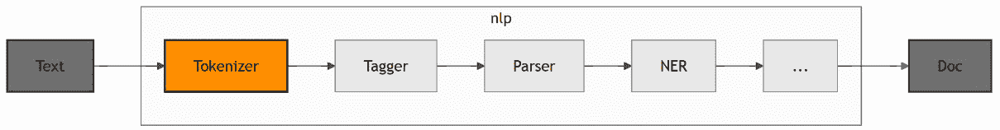
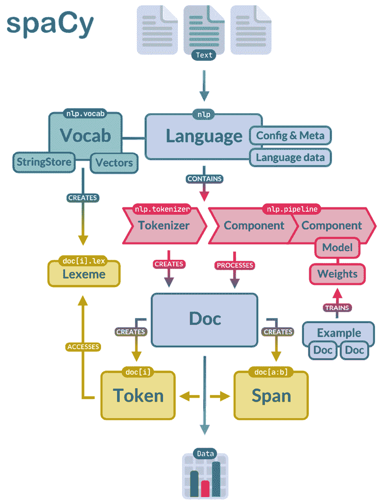
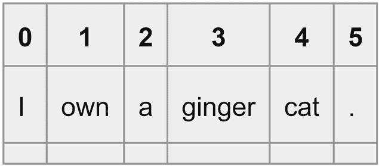
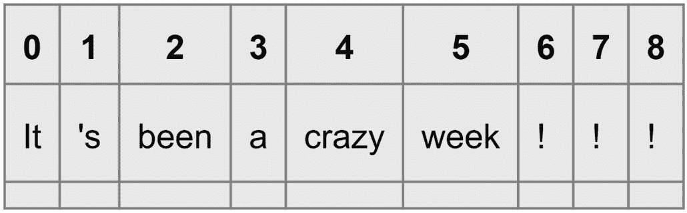
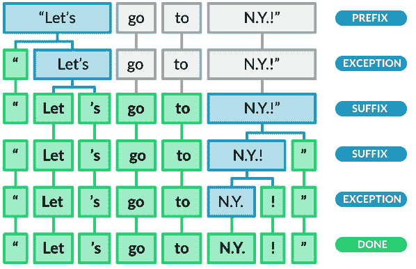

# 第二章：spaCy 的核心操作

在本章中，你将学习关于 spaCy 的核心操作，例如创建语言管道、分词文本以及将文本分解成句子。

首先，你将了解什么是语言处理管道，并探索管道组件。我们将继续介绍一般的 spaCy 约定——重要的类和类组织——以帮助你更好地理解 spaCy 并建立对该库的坚实基础。

接下来，你将了解第一个管道组件——**分词器**。你还将了解一个重要的语言概念——**词形还原**——以及其在**自然语言理解**（`NLU`）中的应用。在此之后，我们将详细介绍**容器**类和**spaCy 数据结构**。我们将以一些有用的 spaCy 特性结束本章，这些特性将在日常 NLP 开发中使用。

在本章中，我们将涵盖以下主要主题：

+   spaCy 约定概述

+   介绍分词

+   理解词形还原

+   spaCy 容器对象

+   更多 spaCy 标记特性

# 技术要求

本章的代码可以在[`github.com/PacktPublishing/Mastering-spaCy-Second-Edition`](https://github.com/PacktPublishing/Mastering-spaCy-Second-Edition)找到。

# spaCy 约定概述

在我们的文本上调用`nlp`会使 spaCy 运行一个由许多处理步骤组成的管道。第一个步骤是分词，以生成**文档**对象。然后，根据我们添加到管道中的 spaCy 组件，文本可以进一步由如**词性标注器**、**解析器**和**实体识别器**等组件处理。我们称之为**语言处理管道**。每个管道都是使用**组件**构建的。每个组件返回处理后的**文档**，然后将其传递给下一个组件。这个过程在以下图中展示：



图 2.1 – 处理管道的高级视图

当我们加载语言模型时创建 spaCy 管道对象。在以下代码段中，我们加载一个英语模型并初始化一个管道：

1.  首先，我们导入 spaCy 并使用`spacy.load`返回一个**语言**类实例：

    ```py
    import spacy
    nlp = spacy.load("en_core_web_md")
    ```

1.  现在我们可以使用这个**语言**实例来获取**文档**对象：

    ```py
    doc = nlp("I went there")
    ```

**语言**类在幕后将所有管道步骤应用于输入句子。在将`nlp`应用于句子后，**文档**对象包含标记，这些标记被标记、词形还原，如果**标记**是**实体**，则标记为实体（我们将在*第五章*中详细介绍实体，*使用 spaCy 管道提取语义表示*)。

每个管道组件都有一个明确的任务：

+   **Tokenizer (分词器)** : 将文本分割成标记

+   **Tagger (词性标注器)** : 分配词性标签

+   **DependencyParser (解析器)** : 分配依存标签

+   **实体识别器 (ner)**：检测和标记命名实体

spaCy 语言处理管道 *始终依赖于* 驱动组件的统计模型。每个组件对应一个 spaCy 类。spaCy 类具有自解释的名称，例如 `Language`、`Doc` 和 `Vocab`。您可以在以下位置查看所有 spaCy 管道组件的列表：[`spacy.io/usage/spacy-101/#architecture-pipeline`](https://spacy.io/usage/spacy-101/#architecture-pipeline)。还有用于表示文本和语言数据的数据结构类。我们已经熟悉了 `Doc` 类，但我们还有这些其他容器类：

+   `Doc`：spaCy 中的一个容器对象，代表整个处理过的文本，持有文档的结构及其标记。

+   **标记**：`Doc` 对象中的一个单一文本单元，如单词、标点符号或符号。

+   **跨度**：在 `Doc` 对象内部的一块连续标记，代表文本的一部分，如短语或命名实体。

+   **词元**：一个存储关于单词的词汇信息（如其基本形式、拼写和属性）的对象，独立于其在文本中的上下文。

最后，spaCy 提供了用于向量、语言词汇和注释的辅助类。在这本书中，我们将经常看到 `Vocab` 类。`Vocab` 代表一种语言的词汇。spaCy 库的主干数据结构是 `Doc` 和 `Vocab`。`Doc` 对象通过拥有标记序列及其所有属性来抽象文本。`Vocab` 对象为所有其他类提供集中化的字符串和词汇属性。这样，spaCy 避免存储多个语言数据的副本。*图 2.2* 展示了所有 spaCy 容器是如何协同工作的。



图 2.2 – spaCy 架构

spaCy 在幕后为我们执行所有文本处理操作，使我们能够专注于我们自己的应用程序开发。让我们从 `Tokenizer` 类开始。

# 介绍分词

我们在 *图 2.1* 中看到，文本处理管道中的第一步是分词。**分词**始终是第一个操作，因为所有其他操作都需要标记。

分词简单地说就是将句子分割成其标记。您可以将标记视为文本片段中最小的有意义的部分。标记可以是单词、数字、标点符号、货币符号以及构成句子的任何其他有意义的符号。以下是一些标记的示例：

```py
USA
N.Y.
City
33
3rd
!
…
?
's
```

spaCy 分词器的输入是 Unicode 文本，输出是一个 `Doc` 对象。以下代码展示了分词过程：

1.  首先，我们导入库并加载英语语言模型：

    ```py
    import spacy
    nlp = spacy.load("en_core_web_md")
    ```

1.  接下来，我们将 `nlp` 对象应用于一个句子以创建一个 `Doc` 对象。`Doc` 对象是 `Token` 对象序列的容器。然后我们打印标记文本：

    ```py
    doc = nlp("I own a ginger cat.")
    print([token.text for token in doc])
    >>> ['I', 'own', 'a', 'ginger', 'cat', '.']
    ```

*图 2* *.3* 展示了我们分割的分词及其索引。



图 2.3 – “I own a ginger cat.”的分词

分词可能很棘手。有许多方面我们应该注意 – 标点符号、空白、数字等等。使用`text.split(" ")`从空白处分割可能很有吸引力，看起来在示例句子*I own a* *ginger cat*中似乎有效。

关于句子`"It's been a crazy week!!!"`呢？如果我们进行分割( `" "` )，生成的分词将是`It's`、`been`、`a`、`crazy`、`week!!!`，这并不是您想要的。首先，`It's`不是一个分词，它是两个分词：`it`和`'s`。`week!!!`不是一个有效的分词，因为标点符号没有被正确分割。此外，`!!!`应该按符号分词，并生成三个`!`。这可能看起来不是一个重要的细节，但对于情感分析来说很重要。让我们看看 spaCy 分词器生成了什么：

```py
import spacy
nlp = spacy.load("en_core_web_md")
doc = nlp("It's been a crazy week!!!")
print([token.text for token in doc])
>>> ['It', "'s", 'been', 'a', 'crazy', 'week', '!', '!', '!']
```

*图 2* *.4* 展示了分词及其索引。



图 2.4 – 引号和标点符号的分词

spaCy 是如何知道在哪里分割句子的？与其他管道部分不同，分词器不需要统计模型。分词基于*语言特定的规则*。您可以在以下链接中看到语言特定数据的示例：[`github.com/explosion/spaCy/tree/master/spacy/lang`](https://github.com/explosion/spaCy/tree/master/spacy/lang)。

分词器异常定义了异常的规则，例如`it's`、`don't`、`won't`、缩写等等。如果您查看英语的规则（[`github.com/explosion/spaCy/blob/master/spacy/lang/en/tokenizer_exceptions.py`](https://github.com/explosion/spaCy/blob/master/spacy/lang/en/tokenizer_exceptions.py)），您会看到规则看起来像`{ORTH: "n't", LEMMA: "not"}`，这描述了分词器对`n't`的分割规则。

前缀、后缀和中缀主要描述了如何处理标点符号 – 例如，如果句尾有一个句号，我们就分割它，否则，它很可能是像`N.Y.`这样的缩写的一部分，我们不应该触碰它。在这里，`ORTH`表示文本，`LEMMA`表示不带任何屈折的词的基本形式。*图 2* *.5* 展示了 spaCy 分词算法的执行过程：



图 2.5 – spaCy 使用异常规则进行分词，来源：[`spacy.io/usage/linguistic-features#tokenization`](https://spacy.io/usage/linguistic-features#tokenization)

分词规则取决于个别语言的语法规则。如分割句号、逗号或感叹号之类的标点符号规则在许多语言中是相似的；然而，一些规则是针对个别语言的，例如缩写词和撇号的使用。spaCy 通过允许手动编码的数据和规则来支持每个语言都有其特定的规则，因为每个语言都有自己的子类。

提示

spaCy 提供了非破坏性分词，这意味着我们总是能够从标记中恢复原始文本。在分词过程中，空白和标点信息被保留，因此输入文本保持原样。

每个 `Language` 对象都包含一个 `Tokenizer` 对象。`Tokenizer` 类是执行分词的类。当你创建 `Doc` 类实例时，通常不会直接调用这个类，而 `Tokenizer` 类在幕后工作。当我们想要自定义分词时，我们需要与这个类进行交互。让我们看看它是如何完成的。

## 自定义分词器

当我们处理特定领域，如医学、保险或金融时，我们经常会遇到需要特别关注的单词、缩写和实体。你将要处理的多数领域都有其特有的单词和短语，需要自定义分词规则。以下是向现有的 `Tokenizer` 类实例添加特殊案例规则的方法：

1.  首先，让我们导入 spaCy 和 `ORTH` 符号，它表示正字法：

    ```py
    import spacy
    from spacy.symbols import ORTH
    ```

1.  现在我们像往常一样实例化 `Language` 对象，处理 `Doc` 对象，并打印标记：

    ```py
    nlp = spacy.load("en_core_web_sm")
    doc = nlp("lemme that")
    print([w.text for w in doc])
    >>> ['lemme', 'that']
    ```

1.  最后，我们可以定义一个特殊情况，其中单词 `lemme` 应该被分词为两个标记，`lem` 和 `me`：

    ```py
    special_case = [{ORTH: "lem"}, {ORTH: "me"}]
    nlp.tokenizer.add_special_case("lemme", special_case)
    print([w.text for w in nlp("lemme that")])
    >>> ['lem', 'me', 'that']
    ```

在定义自定义规则时，默认的标点符号分割规则仍然会被应用。即使特殊情况被标点符号包围，它仍然会被识别。分词器会逐步处理标点符号，并将相同的处理过程应用于剩余的子字符串，如下例所示：

```py
print([w.text for w in nlp("lemme!")])
>>> ['lem', 'me', '!']
```

只有在你确实需要的时候，才应该通过添加新规则来修改分词器。相信我，使用自定义规则可能会得到相当意外的结果。特别是如果你有社交媒体文本，首先将一些句子输入到 spaCy NLP 管道中，看看分词是如何进行的。让我们看看如何调试分词器组件。

## 调试分词器

spaCy 有一个用于调试的工具：`nlp.tokenizer.explain(sentence)`。它返回（**分词规则/模式，标记**）元组，帮助我们了解在分词过程中确切发生了什么。让我们看看一个例子：

1.  让我们像往常一样处理文本：

    ```py
    import spacy
    nlp = spacy.load("en_core_web_sm")
    text = "Let's go!"
    doc = nlp(text)
    ```

1.  现在我们可以要求 `Language` 对象的 `Tokenizer` 类实例解释这个句子的分词：

    ```py
    tok_exp = nlp.tokenizer.explain(text)
    for t in tok_exp:
        print(t[1], "\t", t[0])
    >>> Let  SPECIAL-1
    's  SPECIAL-2
    go  TOKEN
    ! SUFFIX
    ```

`nlp.tokenizer.explain()` 方法逐一解释了分词器使用的规则。在将句子分割成其标记后，就到了将文本分割成其句子的时间了。

## 句子分割

我们看到，将一个句子分解为其标记并不是一个简单的任务。那么，将文本分解为句子呢？由于标点符号、缩写等原因，标记句子开始和结束的确要复杂一些。

`Doc` 对象的句子可以通过 `doc.sents` 属性访问：

```py
import spacy
nlp = spacy.load("en_core_web_sm")
text = "I flied to N.Y yesterday. It was around 5 pm."
doc = nlp(text)
for sent in doc.sents:
    print(sent.text)
>>> I flied to N.Y yesterday.
It was around 5 pm.
```

确定句子边界比标记化更复杂。因此，spaCy 使用 **依存句法分析器** 来执行句子分割。这是 spaCy 的一个独特特性——没有其他库将如此复杂的思想付诸实践。一般来说，结果非常准确，除非你处理的是非常特定类型的文本，例如来自对话领域或社交媒体文本。

现在我们知道了如何将文本分割成句子并对句子进行标记化，让我们从词形还原开始，这是语义和情感分析中常用的操作。

# 理解词形还原

**词元** 是一个标记的基本形式。你可以把词元看作是标记在词典中出现的形态。例如，*eating* 的词元是 *eat* ；*eats* 的词元也是 *eat* ；*ate* 同样映射到 *eat*。**词形还原** 是将词形缩减到词元的过程。以下代码是使用 spaCy 进行词形还原的快速示例：

```py
import spacy
nlp = spacy.load("en_core_web_sm")
doc = nlp("I went there for working and worked for 3 years.")
for token in doc:
    print(token.text, token.lemma_)
>>> I I
went go
there there
for for
working work
and and
worked work
for for
3 3
years year
. .
```

到现在为止，你应该熟悉代码的前三行做了什么。在 `for` 循环中，我们打印出每个标记，`text` 和 `lemma_` 。让我们通过一个现实世界的例子来看看词形还原的实际应用。

## NLU 中的词形还原

词形还原是 NLU 中的一个重要步骤。我们将在本小节中通过一个例子来讲解。假设你为票务预订系统设计了一个 NLP 管道。你的应用程序处理客户的句子，从中提取必要的信息，然后将它传递给预订 API。

NLP 管道想要提取旅行的形式（航班、巴士或火车）、目的地城市和日期。应用程序需要验证的第一件事是旅行方式：

+   飞行

+   航班

+   航路

+   飞机

+   飞机

+   巴士

+   铁路

+   火车

我们有这个关键词列表，我们希望通过在关键词列表中搜索标记来识别旅行方式。进行这种搜索的最紧凑方式是查找标记的 **词元** 。考虑以下客户句子：

```py
List me all flights to Atlanta.
I need a flight to NY.
I flew to Atlanta yesterday evening and forgot my baggage.
```

在这里，我们不需要在关键词列表中包含动词 *fly* 的所有词形（ *fly* , *flying* , *flies* , *flew* , 和 *flown* ），对于单词 `flight` 也是如此；我们将所有可能的变体都缩减到了基本形式 – *fly* 和 *flight* 。不要只考虑英语；像葡萄牙语、德语和芬兰语这样的语言也有许多来自单个词元的词形。

当我们想要识别目的地城市时，词形化也很有用。全球城市有许多昵称，例如 *Angeltown* 对应于 *Los Angeles*。默认的标记化和词形化器不会区分官方名称和昵称。`AttributeRuler` 组件允许我们使用 `Matcher` 模式设置自定义标记属性（我们将在 *第四章* 中了解更多关于 `Matcher` 的内容）。

让我们添加一个特殊规则来设置 `Angeltown` 的词形为 `Los Angeles`：

1.  `nlp.get_pipe()` 方法返回一个管道组件。我们将获取 `AttributeRuler` 组件并添加特殊规则：

    ```py
    import spacy
    nlp = spacy.load("en_core_web_sm")
    nlp.get_pipe("attribute_ruler").add([[{
        "TEXT": "Angeltown"}]], {"LEMMA": "Los Angeles"})
    ```

1.  让我们通过处理 `doc` 并打印词形来查看这是否有效：

    ```py
    doc = nlp("I am flying to Angeltown")
    for token in doc:
        print(token.text, token.lemma_)
    >>> I I
    am be
    flying fly
    to to
    Angeltown Los Angeles
    ```

现在我们已经了解了 `tokenizer` 和 `lemmatizer` 组件（通常是一个处理管道的两个组件），让我们继续学习更多关于 spaCy **容器对象** 的内容。

# spaCy 容器对象

在本章的开头，我们看到了一个包括 `Doc`、`Token`、`Span` 和 `Lexeme` 在内的容器对象列表。在本节中，我们将详细查看容器对象的属性。

使用容器对象，我们可以访问 spaCy 分配给文本的语言学属性。一个 **容器对象** 是文本单元（如文档、标记或文档的一部分）的逻辑表示。

spaCy 中的容器对象遵循文本的自然结构：一个文档由句子组成，句子由标记组成。我们在开发中最广泛使用 `Doc`、`Token` 和 `Span` 对象，分别代表文档、单个标记和短语。一个容器可以包含其他容器——例如，一个文档包含标记和跨度。

让我们逐一探索每个类及其有用的属性。

## 文档

我们在代码中创建了 `Doc` 对象来表示文本，所以你可能已经猜到 `Doc` 代表文本。在这里，`doc.text` 返回文档文本的 Unicode 表示：

```py
doc = nlp("I like cats.")
print(doc.text)
>>> I like cats.
```

`Doc` 对象的构建块是 `Token`，因此当你迭代一个 `Doc` 对象时，你会得到作为项的 `Token` 对象：

```py
for token in doc:
    print(token.text)
>>> I
like
cats
.
```

同样的逻辑适用于索引：

```py
print(doc[1])
>>> like
```

`Doc` 对象的长度是它包含的标记数量：

```py
print(len(doc))
>>> 4
```

关于文本的句子，`doc.sents` 返回一个句子列表的迭代器。每个句子都是一个 `Span` 对象：

```py
doc = nlp("This is a sentence. This is the second sentence")
sentences = list(doc.sents)
print(sentences)
>>> [This is a sentence., This is the second sentence]
```

文本中的命名实体由 `doc.ents` 提供。结果是 `Span` 对象的列表。我们将在本书的后面部分详细讨论命名实体——现在，把它们看作专有名词：

```py
doc = nlp("I flied to New York with Ashley.")
print(doc.ents)
>>> (New York, Ashley)
```

另一个句法属性是 `doc.noun_chunks`。它返回文本中找到的名词短语：

```py
doc = nlp("Sweet brown fox jumped over the fence.")
print(list(doc.noun_chunks))
>>> [Sweet brown fox, the fence]
```

属性 `doc.lang_` 返回创建的文档的语言：

```py
print(doc.lang_)
>>> en
```

一个有用的序列化方法是 `doc.to_json`。这是将 `Doc` 对象转换为 `JSON` 的方法：

```py
from pprint import pprint
doc = nlp("Hi")
json_doc = doc.to_json()
pprint(json_doc)
>>> {'ents': [],
'sents': [{'end': 2, 'start': 0}],
'text': 'Hi',
'tokens': [{'dep': 'ROOT',
            'end': 2,
            'head': 0,
            'id': 0,
            'lemma': 'hi',
            'morph': '',
            'pos': 'INTJ',
            'start': 0,
            'tag': 'UH'}]}
```

小贴士

您可能已经注意到，我们调用的是 `doc.lang_`，而不是 `doc.lang`。`doc.lang` 调用返回语言 ID，而 `doc.lang_` 返回语言的 Unicode 字符串，即语言名称。您可以在以下内容中看到相同约定：`token.lemma_`、`token.tag_` 和 `token.pos_`。

`Doc` 对象具有非常实用的属性，您可以使用这些属性来理解句子的句法属性，并在您自己的应用程序中使用它们。让我们继续了解 `Token` 对象，看看它提供了什么。

## Token

`token` 对象代表一个单词。词元对象是 `Doc` 和 `Span` 对象的构建块。在本节中，我们将介绍 `Token` 类的以下属性：

+   `token.text`

+   `token.text_with_ws`

+   `token.i`

+   `token.idx`

+   `token.doc`

+   `token.sent`

+   `token.is_sent_start`

+   `token.ent_type`

我们通常不会直接构造 `Token` 类的对象，而是构造 `Doc` 对象，然后访问其词元：

```py
doc = nlp("Hello Madam!")
print(doc[0])
>>> Hello
```

`token.text` 属性类似于 `doc.text`，提供了底层的 Unicode 字符串。`token.text_with_ws` 是一个类似的属性。如果它在 `doc` 对象中存在，它将提供带有尾随空白的文本：

```py
print(doc[0].text_with_ws)
print(doc[2].text_with_ws)
>>> 'Hello '
'!'
```

查找词元的长度与查找 Python 字符串的长度类似：

```py
print(len(doc[0]))
>>> 5
```

`token.i` 属性提供了词元在 `doc` 对象中的索引：

```py
token = doc[2]
print(token.i)
>>> 2
```

词元的字符偏移量（字符位置）由 `token.idx` 提供：

```py
print(doc[0].idx)
print(doc[1].idx)
>>> 0
6
```

另一个有趣的词元属性是，我们还可以访问创建词元的 `doc` 对象，如下所示：

```py
token = doc[0]
print(token.doc)
>>> Hello Madam!
```

这也适用于获取词元所属的句子：

```py
token = doc[1]
print(token.sent)
>>> Hello Madam!
```

另一个有用的属性是 `token.is_sent_start`；它返回一个布尔值，指示该词元是否是一个句子的开始：

```py
doc = nlp("He entered the room. Then he nodded.")
print(doc[0].is_sent_start)
>>> True
print(doc[5].is_sent_start)
>>> True
print(doc[6].is_sent_start)
>>> False
```

这些是您每天都会使用的 `Token` 对象的基本属性。还有另一组属性，它们与句法和语义更相关。我们已经在上一节中看到了如何计算词元词干：

```py
doc = nlp("I went there.")
print(doc[1].lemma_)
>>> go
```

您已经了解到 `doc.ents` 属性提供了文档中的命名实体。如果您想了解词元是哪种类型的实体，请使用 `token.ent_type_`：

```py
doc = nlp("The Brazilian president visited Beijing")
print(doc.ents)
>>> (Brazilian, Beijing)
print(doc[1].ent_type_, spacy.explain(doc[1].ent_type_))
>>> NORP Nationalities or religious or political groups
```

与 POS 标注相关的两个句法特征是 `token.pos_` 和 `token.tag`。我们将在下一章中学习它们是什么以及如何使用它们。`Token` 对象具有丰富的功能集，使我们能够从头到尾处理文本。让我们继续了解 `Span` 对象，看看它提供了什么。

## Span

`Span` 对象代表短语或文本的片段。`Span` 对象必须是词元的连续序列。我们通常不会初始化 `Span` 对象，而是从 `Doc` 对象中切片：

```py
import spacy
nlp = spacy.load("en_core_web_sm")
doc = nlp("All my moves are coldly calculated.")
print(doc[4:6])
>>> coldly calculated
```

尝试切片无效索引将引发 `IndexError`。Python 字符串的大多数索引和切片规则也适用于 `Doc` 切片：

```py
doc = nlp("All my moves are coldly calculated.")
print(doc[5:]) # end index empty means rest of the string calculated.
print(doc[4:-1]) # minus indexes are supported
>>> calculated.
coldly calculated
```

创建`Span`对象还有另一种方法——我们可以使用`char_span([start_idx, end_idx])`从`Doc`对象中创建一个字符级别的切片：

```py
doc = nlp("Recife has a thousand charms, it's a little piece of Brazil.")
print(doc.char_span(37, 59))
>>> little piece of Brazil
```

`Span`对象的基本构建块是`Token`对象。如果你遍历一个`Span`对象，你会得到`Token`对象：

```py
doc = nlp("You went there after you saw me")
span = doc[2:4]
for token in span:
    print(token)
>>> there
after
```

你可以将`Span`对象视为一个初级`Doc`对象。因此，`Doc`的大多数特性也适用于`Span`。例如，`len`是相同的：

```py
doc = nlp("Hi Lorena!!")
span = doc[:2]
len(span)
>>> 2
```

`Span`对象也支持索引。切片`Span`对象的结果是另一个`Span`对象：

```py
doc = nlp("You went there after you saw me")
span = doc[2:6]
print(span)
>>> there after you saw
print(span[1:3])
>>> after you
```

正如`Token`知道它是由哪个`Doc`对象创建的一样，`Span`也知道自己是由哪个`Doc`对象创建的：

```py
doc = nlp("You went there after you saw me")
span = doc[2:6]
print(span.doc)
>>> You went there after you saw me
print(span.sent)
>>> You went there after you saw me
```

我们还可以在原始的`Doc`对象中定位`Span`对象：

```py
doc = nlp("You went there after you saw me")
span = doc[2:6]
print(span.start) # index of the first token of the Span
>>> 2
print(span.end)
>>> 6
print(span.start_char) # start offset of the Span at character level
>>> 9
print(span.end_char)
>>> 28
```

如果你想创建一个新的`Doc`对象，你可以调用`span.as_doc()`。它会将数据复制到一个新的`Doc`对象中：

```py
doc = nlp("You went there after you saw me")
span = doc[2:6]
small_doc = span.as_doc()
print(type(small_doc))
>>> <class 'spacy.tokens.doc.Doc'>
```

属性`span.ents`、`span.sent`、`span.text`和`span.text_with_ws`与它们对应的`Doc`和`Token`方法类似。现在我们将介绍更多特性和方法，以便在下一节中进行更详细的分析文本。

# 更多 spaCy 标记特性

大多数 NLP 开发都是基于标记和跨度进行的；也就是说，它处理标签、依存关系、标记本身和短语。我们应用一些转换，比如消除小词和意义不大的词，处理 URL 时考虑到协议和子域部分等。这些操作有时取决于*标记形状*（例如，如果标记是一个短词或如果标记看起来像 URL 字符串）或更语义化的特性（例如，标记是一个冠词，或标记是一个连词）。在本节中，我们将通过一些示例来查看这些标记特性。我们将从与标记形状相关的特性开始：

```py
doc = nlp("Hello, hi!")
print(doc[0].lower_)
>>> hello
```

`token.lower_`特性将标记转换为小写。返回值是一个 Unicode 字符串，这个特性等同于`token.text.lower()`。

特性`is_lower`和`is_upper`与它们的 Python 字符串方法对应，`islower()`和`isupper()`。`is_lower`特性如果所有字符都是小写则返回`True`，而`is_upper`则对大写执行相同的操作。

`is_alpha`特性如果标记的所有字符都是字母则返回`True`。非字母字符的例子包括数字、标点和空白字符：

```py
doc = nlp("Cat and Cat123")
print(doc[0].is_alpha)
>>> True
print(doc[2].is_alpha)
>>>False
```

`is_ascii`特性如果标记的所有字符都是 ASCII 字符则返回`True`：

```py
doc = nlp("UR7 and Várzea")
print(doc[0].is_ascii)
>>>True
print(doc[2].is_ascii)
>>>False
```

`is_digit`特性如果标记的所有字符都是数字则返回`True`：

```py
doc = nlp("Cat Cat123 123")
print(doc[0].is_digit)
>>>False
print(doc[1].is_digit)
>>>False
print(doc[2].is_digit)
>>> True
```

特性`is_punct`如果标记是一个标点符号则返回`True`：

```py
doc = nlp("You, him and Sally")
print(doc[1])
>>>,
print(doc[1].is_punct)
>>>True
```

特征 `is_left_punct` 和 `is_right_punct` 分别在标记是左标点或右标点时返回 `True`。一个右标点可以是任何关闭左标点的标记，例如右括号、`>` 或 **»**。左标点类似，左括号 `<` 和 **«** 是一些例子：

```py
doc = nlp("( [ He said yes. ] )")
print(doc[0])
>>> (
print(doc[0].is_left_punct)
>>>True
print(doc[-2])
>>>]
print(doc[-2].is_right_punct)
>>>True
```

方法 `like_url`、`like_num` 和 `like_email` 捕获关于标记形状的信息，如果标记看起来像 URL、数字或电子邮件，则分别返回 `True`。当我们想要处理社交媒体文本和抓取的网页时，这些方法非常实用：

```py
doc = nlp("I emailed you at least 100 times")
print(doc[-2])
>>>100
print(doc[-2].like_num)
>>>True
doc = nlp("I emailed you at least hundred times")
print(doc[-2])
>>>hundred
print(doc[-2].like_num)
>>>True
doc = nlp("His email is hello@hello.com and his website is https://nicewebsite.com")
print(doc[3])
>>>hello@hellp.com
print(doc[3].like_email)
>>>True
print(doc[8])
>>>https://nicewebsite.com
print(doc[8].like_url)
>>>True
```

`token.shape_` 是一个不寻常的特性——在其他 NLP 库中没有类似的东西。它返回一个字符串，显示了标记的正字法特征。数字被替换为 `d`，大写字母被替换为 `X`，小写字母被替换为 `x`。你可以将结果字符串用作机器学习算法中的特征，并且标记形状可以与文本情感相关联：

```py
doc = nlp("Girl called Kathy has a nickname Cat123.")
for token in doc:
    print(token.text, token.shape_)
>>>Girl Xxxx
called xxxx
Kathy Xxxxx
has xxx
a x
nickname xxxx
Cat123 Xxxddd
. .
```

特征 `is_stop` 经常被机器学习算法使用。通常，我们会过滤掉那些意义不大的词，例如 *the*、`a`、*an*、*and*、*just*、*with* 等等。这样的词被称为停用词。每种语言都有自己的停用词列表，你可以在 [`github.com/explosion/spaCy/blob/master/spacy/lang/en/stop_words.py`](https://github.com/explosion/spaCy/blob/master/spacy/lang/en/stop_words.py) 查找英语停用词：

```py
doc = nlp("One step forward, and you're no longer in the same place.")
for token in doc:
    print(token, token.is_stop)
>>>One True
step False
forward False
, False
and True
you True
're True
no True
longer False
in True
the True
same True
place False
. False
```

我们终于完成了 spaCy 的一些句法、语义和正字法特征的学习。许多方法都集中在 `Token` 对象上，因为一个标记是文本的句法单位。

# 摘要

本章为你全面介绍了 spaCy 库的类和方法。我们深入研究了语言处理管道，并了解了管道组件。我们还介绍了基本但重要的句法任务：分词。我们继续探讨了词形还原这一语言概念，并学习了 spaCy 这一特性的实际应用。我们详细探讨了 spaCy 容器类，并在本章最后部分审视了精确且有用的 spaCy 特性。在下一章中，我们将深入 spaCy 的全部语言能力。你将发现包括 spaCy 最常用的特性：词性标注器、依存句法分析器和命名实体。

# 第二部分：高级语言和语义分析

在基础知识的基础上，本节探讨了使用 spaCy 的语言和基于规则的工具分析文本和提取信息的先进技术。你将学习如何进行复杂的解析和匹配，甚至开发自己的自定义组件来处理复杂任务。

本部分包含以下章节：

+   *第三章* ，*提取语言特征*

+   *第四章* ，*基于规则的匹配精通*

+   *第五章* ，*使用 spaCy 管道提取语义表示*

+   *第六章* ，*使用 Transformers 与 spaCy*
