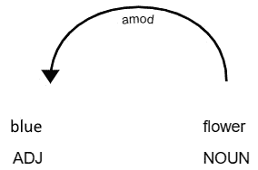
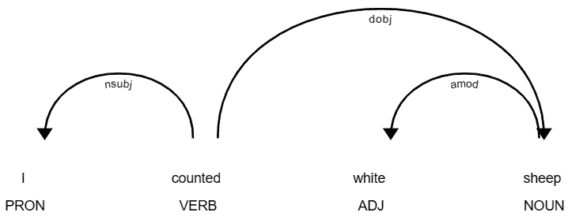
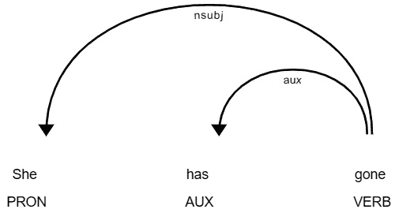
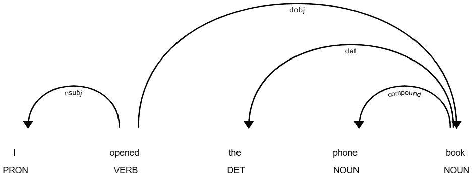
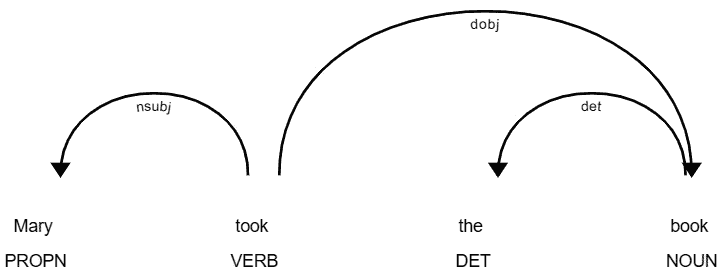
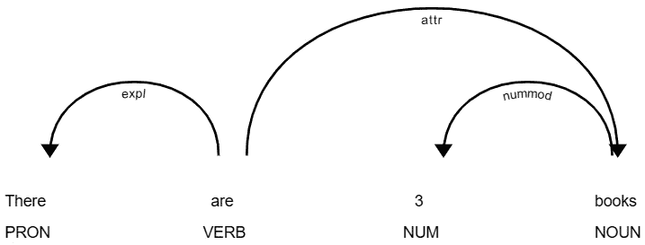
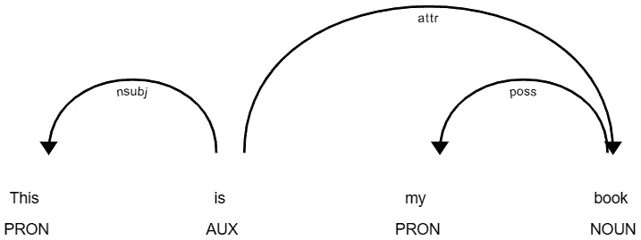

# 第三章：提取语言特征

本章深入探讨了 spaCy 的全部功能。您将发现语言特征，包括 spaCy 最常用的功能，如**词性**（`POS`）**标注器**、**依存句法分析器**、**命名实体识别器**和**合并/分割**功能。

首先，您将了解词性标注的概念，spaCy 词性标注器的功能以及如何将词性标注放入您的**自然语言理解**（`NLU`）应用中。接下来，您将学习一种结构化的方法来通过依存句法分析器表示句子语法。您将了解 spaCy 的依存标签以及如何通过揭示性例子来解释 spaCy 依存标签分析器的结果。然后，您将学习一个非常重要的 NLU 概念，它是许多**自然语言处理**（`NLP`）应用的核心——**命名实体识别**（`NER`）。我们将通过 NER 从文本中提取信息的例子进行讲解。最后，您将学习如何合并和分割提取的实体。

在本章中，我们将涵盖以下主要主题：

+   什么是词性标注（POS tagging）？

+   依存句法分析简介

+   介绍命名实体识别（NER）

+   合并和分割标记

# 技术要求

本章的代码可以在[`github.com/PacktPublishing/Mastering-spaCy-Second-Edition`](https://github.com/PacktPublishing/Mastering-spaCy-Second-Edition)找到。

# 什么是词性标注（POS tagging）？

词性是一个句法类别，每个词都根据其在句子中的功能落入一个类别。例如，英语有九个主要类别：动词、名词、代词、限定词、形容词、副词、介词、连词和感叹词。我们可以如下描述每个类别的功能：

+   **动词**：表达动作或存在状态

+   **名词**：指代人、地点或事物，或命名这些事物中的特定一个（专有名词）

+   **代词**：可以替换名词或名词短语

+   **限定词**：置于名词之前，表示数量或明确名词所指的内容——简而言之，名词引入者

+   **形容词**：修饰名词或代词

+   **副词**：修饰动词、形容词或另一个副词

+   **介词**：连接名词/代词与其他句子部分

+   **连词**：将单词、子句和句子粘合在一起

+   **感叹词**：以突然和感叹的方式表达情感

这个核心类别集，没有任何语言特定的形态学或句法特征，被称为**通用标签**。spaCy 通过`pos_**`特征**捕获通用标签。

在整本书中，我们提供英语语言的例子，因此我们只会关注英语。不同的语言提供不同的标签集。您可以通过选择模型语言在[`spacy.io/models`](https://spacy.io/models)并点击**标签方案**按钮来查看每个模型使用的标签方案。

spaCy 支持的语言都有自己的细粒度标签集和标注方案。这种语言特定的标注方案通常包括形态学特征、动词的时态和语气、名词的数量（单数/复数）、代词的人称和数量信息（第一、第二或第三人称，单数或复数）、代词类型（人称、指示或疑问）、形容词类型（比较级或最高级）等等。

spaCy 支持细粒度词性标注以满足特定语言的需求。`tag_feature` 对应于细粒度标签。如果你之前没有使用过词性标注，不要担心，通过我们的示例练习，你会变得熟悉。你还可以始终在标签上调用 `spacy.explain()`。我们通常有两种调用 `spacy.explain()` 的方式，要么直接在标签名称字符串上，要么使用 `token.tag_`。

让我们在实践中通过一些编码来实现这一点。到这一点，你应该已经安装了 spaCy 库和英语模型，如果没有，只需运行 **python –m pip install spacy** 然后运行 **python –m spacy download en_core_web_sm**。一切准备就绪；让我们开始吧：

1.  首先，让我们导入 spaCy 并解释一下 `NNS` 标签的含义：

    ```py
    import spacy
    spacy.explain("NNS")
    >>> 'noun, plural'
    ```

1.  现在，让我们加载英语模型并处理一个句子：

    ```py
    nlp = spacy.load("en_core_web_sm")
    doc = nlp("I saw flowers.")
    ```

1.  我们可以打印出每个标记的文本和词性标注：

    ```py
    for token in doc:
        print(token.text, "tag:", token.tag_)
    >>> I tag: PRP
    saw tag: VBD
    flowers tag: NNS
    . tag: .
    ```

1.  我们也可以使用 `token.tag_` 作为输入来打印解释：

    ```py
    for token in doc:
        print(token.text, "tag:", token.tag_, "explanation:",
              spacy.explain(token.tag_))
    >>> I tag: PRP explanation: pronoun, personal
    saw tag: VBD explanation: verb, past tense
    flowers tag: NNS explanation: noun, plural
    . tag: . explanation: punctuation mark, sentence closer
    ```

如果你想了解更多关于词性的信息，你可以在 *Eight Parts of* *Speech*：[`www.butte.edu/departments/cas/tipsheets/grammar/parts_of_speech.html`](http://www.butte.edu/departments/cas/tipsheets/grammar/parts_of_speech.html) 上了解更多。

词性标注提供了对句子非常基本的句法理解。当我们想要在句子中找到动词和名词或更好地消除一些词的意义歧义时，会使用词性标注（关于这个话题很快就会有更多介绍）。

每个词根据其上下文——其他周围的词及其词性标注——被标注为一个词性标签。词性标注器是顺序统计模型，这意味着“一个词的标签取决于其邻近的词、它们的标签以及这个词本身”。词性标注一直以不同的形式存在。**序列到序列学习**（`Seq2seq`）始于**隐马尔可夫模型**（`HMMs`），并演变为使用**长短期记忆**（`LSTM`）单元的神经网络模型。

许多自然语言理解（NLU）应用仍然需要知道词的类型以获得更高的准确性。句法信息可以用于一个传统的任务，称为**词语消歧**（`WSD`）。让我们在下一节中看看如何使用 spaCy 标注器来处理它。

## 词语消歧（WSD）

词语消歧是自然语言理解中的一个经典问题，它决定一个特定的词在句子中使用的意义。一个词可以有多个意义——例如，考虑一下“bass”这个词。以下是我们能想到的一些意义：

+   低音——海鲈鱼，鱼类

+   低音——最低的男性声音

+   低音——音域最低的男歌手

在搜索引擎、机器翻译和问答系统中，确定词义可能至关重要。对于先前的例子，不幸的是，词性标注器并没有太大的帮助，因为标注器将所有词义都标记为名词。我们需要的不只是一个词性标注器。关于“beat”这个词怎么样？让我们看看这里：

+   Beat—猛烈地打击（**动词**（`V`））

+   Beat—在游戏或比赛中击败某人（**动词**（`V`））

+   Beat—音乐或诗歌中的节奏（**名词**（`N`））

+   Beat—鸟的翅膀运动（**名词**（`N`））

+   Beat—完全筋疲力尽（**形容词**（`ADJ`））

在这里，词性标注确实能帮上大忙。**形容词标签**决定了词义的确切性；如果“beat”被标记为形容词，它表示的词义是**完全筋疲力尽**。对于动词和名词标签来说则不是这样；如果“beat”被标记为动词标签，它的词义可以是**猛烈地打击**或**击败某人**。词义消歧是一个开放性问题，已经提出了许多统计模型。然而，如果你需要一个快速的原型，你可以在某些情况下（例如在先前的例子中）借助 spaCy 标签器来解决这个问题。

### NLU 应用中的动词时态和体

在上一章中，我们使用了旅行社应用的例子，我们通过使用**词形还原**得到了动词的基础形式（这些形式摆脱了动词的时态和体）。在本小节中，我们将重点介绍如何使用在词形还原过程中丢失的动词时态和体信息。

**动词时态**和**体**可能是动词为我们提供的最有趣的信息，告诉我们动作何时发生以及动作是否完成或正在进行。时态和体一起表明动词对当前时间的参照。英语有三种基本时态：过去、现在和将来。动词时态可以表达不同的体和形式，如简单、进行/连续、完成、完成进行和将来时态。例如，在句子*I’m eating*中，动作*eat*发生在现在并且正在进行。因此，我们描述这个动词为**现在进行/连续**。

然而，我们如何在我们的旅行社 NLU 中使用这些信息？考虑以下可以指向我们的 NLU 应用的客户句子：

+   我飞往罗马

+   我正在飞往罗马

+   我将飞往罗马

在所有句子中，动作是**飞**：然而，只有一些句子表明有订票的意图。让我们想象以下带有周围上下文的句子：

+   我三天前飞往罗马。我还没收到账单，请尽快发送。

+   我下周将飞往罗马。你能查一下航班可用性吗？

+   我下周将飞往罗马。你能查一下航班吗？

从表面上看，动词 fly 的过去式并不表明预订意图。相反，它指向客户投诉或客户服务问题。另一方面，**不定式**和**现在进行时**形式则指向预订意图。我们可以使用词性标注来通过过滤具有 `VBG` 标签（现在进行时态的动词）或 `VB` 标签（基本/不定式形式的动词）的句子来过滤这些意图。让我们在下面的代码段中这样做：

```py
import spacy
nlp = spacy.load("en_core_web_sm")
sent1 = "I flew to Rome"
sent2 = "I'm flying to Rome"
sent3 = "I will fly to Rome"
doc1 = nlp(sent1)
doc2 = nlp(sent2)
doc3 = nlp(sent3)
for doc in [doc1, doc2, doc3]:
    print([(w.text, w.lemma_) for w in doc if 
           w.tag_== 'VBG' or w.tag_== 'VB'])
>>> []
    [('flying', 'fly')]
    [('fly', 'fly')]
```

我们已经涵盖了一个语义任务和一个形态学任务——WSD 和动词的时态/体。现在我们将继续另一个句法概念——依存句法分析。

# 依存句法分析简介

使用 spaCy 的依存句法分析器，我们可以**表示句子的句法结构**。在前一节中，我们关注了词性标注，它将词按照句法进行分类。虽然词性标注可以提供关于相邻词标签的见解，但它并没有揭示句子中非直接相邻词之间的关系。

正如其名所示，依存句法分析涉及通过标记之间的依存关系来分析句子结构。依存句法分析器为句子中的标记之间的句法关系进行标记，并连接句法相关的标记。依存关系或依存关系是一个两个标记之间的有向链接。

我们可以将依存句法分析可视化为一棵树，如图 *图 3.1* 所示。


图 3.1 – 在句子上运行依存句法分析的结果

让我们在下一节中了解更多关于这些依存关系的信息。

## 依存关系

NLP 中的许多统计方法都围绕单词的向量表示展开，并将句子视为单词的序列。如图 *图 3.1* 所示，句子不仅仅是标记的序列——它具有结构。句子中的每个单词都有一个明确定义的角色，例如动词、主语、宾语等；因此，句子具有结构。这种结构在聊天机器人、问答系统和机器翻译中得到广泛应用。

最有用的应用之一是确定句子中的宾语和主语。再次，让我们回到我们的旅行社应用程序。想象一下，一位客户正在抱怨服务。比较以下两个句子：“我把邮件转发给你”和“你把邮件转发给我”；如果我们消除了停用词“我”、“你”、“我”和“的”，剩下的就是：

+   我把邮件转发给你 -> 转发邮件

+   你把邮件转发给我 -> 转发邮件

尽管句子的剩余部分相同，但这两个句子具有非常不同的含义，需要不同的答案。在第一句中，句子主语是**我**（因此，答案很可能会以**你**开头），而第二句的主语是**你**（这将导致以**我**结尾的答案）。

依存分析器帮助我们更深入地了解句子句法和语义，超越了仅分析单词本身的分析。让我们从依存关系开始探索更多内容。

## 句法关系

spaCy 为每个标记分配一个依存标签，就像其他语言特征（如词元或 POS 标签）一样。spaCy 使用有向弧显示依存关系。*图 3* *.2*显示了名词与其修饰形容词之间的依存关系示例：



图 3.2 – 名词与其形容词之间的依存关系

一个依存标签描述了两个标记之间的句法关系如下：其中一个标记是**句法父节点**（称为**头**）而另一个是其**依存项**（称为**子节点**）。在先前的例子中，`flower`是头，`blue`是其依存项/子节点。

依存标签被分配给子节点。标记对象有`dep`（整数值）和`dep_`（Unicode，可读字符串）属性，它们持有依存标签，如下面的代码片段所示：

```py
doc = nlp("blue flower")
for token in doc:
    print(token.text, "\tdep:",token.dep_)
>>> blue dep: amod
    flower dep: ROOT
```

在这个例子中，我们遍历了标记并打印了它们的文本和依存标签。让我们了解这些依存标签：

+   `blue`被分配了`amod`标签。`amod`是形容词-名词关系的依存标签。

+   `flower`是`ROOT`。`ROOT`是依存树中的一个特殊标签；它被分配给句子的主要动词。如果我们处理的是一个短语（而不是完整的句子），则`ROOT`标签被分配给短语的根，即短语的中心名词。在`blue flower`短语中，中心名词`flower`是短语的根。

+   每个句子或短语恰好有一个根，它是分析树的根。

+   树节点可以有多个子节点，但每个节点只能有一个父节点（由于树的限制，以及不包含循环的树）。换句话说，每个标记恰好有一个头，但父节点可以有多个子节点。这就是为什么依存标签被分配给依存节点的原因。

让我们看看最常见的和最有用的依存标签列表，然后我们将了解它们如何确切地链接标记。首先是这个列表：

+   `amod` : 形容词修饰符

+   `aux` : 辅助

+   `compound` : 复合

+   `dative` : 宾格宾语

+   `det` : 限定词

+   `dobj` : 直接宾语

+   `nsubj` : 名词主语

+   `nsubjpass` : 名词主语，被动

+   `nummod` : 数量修饰符

+   `poss` : 所有权修饰符

+   `root` : 根

让我们看看这些标签的使用示例以及它们表达的关系：

+   `amod`是一个形容词修饰符。从其名称可以理解，这种关系修饰名词（或代词）。在*图 3* *.3*中，我们看到白色修饰绵羊：



图 3.3 – amod 关系

+   `aux`是你可能猜到的：它是助动词与其主要动词之间的依赖关系。依赖项是一个助动词，中心项是主要动词。在*图 3.4*中，我们看到`has`是主要动词`gone`的助动词：



图 3.4 – aux 关系

+   `compound`用于名词复合；第二个名词由第一个名词修饰。在*图 3.5*中，`phone book`是一个名词复合，`phone`名词修饰`book`名词：



图 3.5 – 复合关系

+   `det`关系将限定词（依赖项）与其修饰的名词（其中心项）联系起来。在*图 3.6*中，`the`是这句话中名词`girl`的限定词：


图 3.6 – det 关系

接下来，我们将探讨两种宾语关系，`dative`和`dobj`。`dobj`关系在动词和它的直接宾语之间。一个句子可以有一个以上的宾语（如下面的例子所示）；直接宾语是动词所作用的对象，其他的是称为**间接宾语**。

直接宾语通常用**宾格**来标记。`dative`关系指向**dative 宾语**，它从动词那里接受间接动作。在*图 3.7*中显示的句子中，间接宾语是`me`，直接宾语是`book`：


图 3.7 – 句子的直接和间接宾语

`nsubj`和`nsubjposs`是两种与名词性句子主语相关的关联。句子的主语是执行动作的人。被动主语仍然是主语，但我们用`nsubjposs`来标记它。在*图 3.8*中，`Mary`是句子的名词主语：



图 3.8 – nsubj 关系

*图 3.9*中的句子是`you`的被动名词主语：


图 3.9 – nsubjpass 关系

我们现在已经涵盖了句子主语和宾语关系。现在，我们将发现两种修饰关系；一个是**nummod（数字修饰语**），另一个是**poss（拥有性修饰语**）。数字修饰语通过数字或数量来修饰中心名词的意义。在*图 3.10*中的句子中，`nummod`很容易找到；它在`3`和`books`之间：



图 3.10 – nummod 关系

拥有性修饰语发生在所有格代词和名词之间，或者所有格的所有格和名词之间。在*图 3.11*中显示的句子中，`my`是名词`book`的拥有性标记：



图 3.11 – my 和 book 之间的 poss 关系

最后但同样重要的是，`is`是**根**标签，它不是一个真正的关系，而是句子动词的标记。根词在句法树中没有真正的父节点；根是句子的主要动词。在前面的句子中，主要动词是`is`助动词。请注意，根节点没有进入弧线——也就是说，没有父节点。

这些是我们 NLU 目的中最有用的标签。现在让我们练习如何利用依存关系标签。`token.dep_`包括从属标记的依存关系标签。`token.head`属性指向头/父标记。只有根标记没有父节点；spaCy 在这种情况下指向标记本身。让我们从*图 3.11*的示例句子中分割出以下内容：

```py
doc = nlp("This is my book")
for token in doc:
    print(token.text, "\tpos:", token.pos_, "\tdep:", token.dep_)
>>> This   pos: PRON    dep: nsubj
    is     pos: AUX     dep: ROOT
    my     pos: PRON    dep: poss
    book   pos: NOUN    dep: attr
```

我们遍历了标记并打印了细粒度的词性标注和依存关系标签。`is`是句子的主要动词，并标记为`ROOT`标签。**这**是句子的主语。我们可以深入一级并打印这次标记的头，如下所示：

```py
doc = nlp("This is my book")
for token in doc:
    print(token.text, "\tpos:", token.pos_, "\tdep:", token.dep_, "\thead:", token.head)
>>> This   pos: PRON   dep: nsubj   head: is
    is     pos: AUX    dep: ROOT    head: is
    my     pos: PRON   dep: poss    head: book
    book   pos: NOUN   dep: attr    head: is
```

我们可以看到动词`is`是除了`my`之外所有标记的头，而`my`的头是`book`。让我们检查一个更长、更复杂的句子的依存关系树，如下所示：

```py
doc = nlp("We are trying to understand the difference.")
for token in doc:
    print(token.text, token.pos_, "\tdep:", token.dep_, "\thead:", token.head)
>>>  We         PRON  dep: nsubj      head: trying
     are        AUX   dep: aux        head: trying
     trying     VERB  dep: ROOT       head: trying
     to         PART  dep: aux        head: understand
     understand VERB  dep: xcomp      head: trying
     the        DET   dep: det        head: difference
     difference NOUN  dep: dobj       head: understand
     .          PUNCT dep: punct      head: trying
```

如*图 3.12*所示，我们可以定位到主要动词和**尝试**的根（它没有进入弧线）。**尝试**这个词的左侧看起来可以管理，但右侧有一系列弧线。让我们从左侧开始。**我们**这个代词被标记为`nsubj`。因此，这是句子的名词主语。另一个左侧的弧线，标记为`aux`，指向**尝试**的从属（`are`），它是主要动词**尝试**的助动词。


图 3.12 – 一个复杂的解析示例

现在我们来看看右侧发生了什么。**尝试**通过一个`xcomp`关系附加到第二个动词**理解**上。动词的`xcomp`（或开放补语）关系是一个没有自己主语的子句。在这里，**理解差异**这个子句没有主语，所以它是一个开放补语。我们跟随从第二个动词**理解**出发的`dobj`弧线，最终落在名词**差异**上，它是`to understand the difference`子句的直接宾语。

*displaCy*在线演示（[`demos.explosion.ai/displacy`](https://demos.explosion.ai/displacy)）是一个很好的工具，你可以用它来尝试自己的示例句子并查看解析结果。本节为我们将在*第四章*中看到的模式匹配练习提供了坚实的基础。

为了完成这一章，让我们了解一个非常著名的 NLP 任务：NER。

# 介绍 NER

什么是**命名实体**？命名实体是我们可以通过一个专有名称或感兴趣的数量来指代的现实世界中的对象。它可以是一个人、一个地方（城市、国家、地标或著名建筑）、一个组织、一家公司、一个产品、日期、时间、百分比、货币金额、一种药物或疾病名称。一些例子包括 Alicia Keys、巴黎、法国、勃兰登堡门、世界卫生组织、谷歌、保时捷卡宴等。

命名实体总是指向一个特定的对象，而这个对象可以通过相应的命名实体来区分。例如，如果我们标记“**巴黎是法国的首都**”这个句子，我们会将**巴黎**和**法国**解析为命名实体，但不会将单词**首都**解析为命名实体。原因是**首都**并不指向一个特定的对象；它是许多对象的通用名称。

NER 分类与 POS 分类略有不同。在这里，分类的数量可以高达我们想要的。最常见的分类是人物、地点和组织，并且几乎每个可用的 NER 标记器都支持这些分类。

spaCy 支持广泛的实体类型。你使用哪些类型取决于你的语料库。如果你处理财务文本，你很可能比`WORK_OF_ART`更频繁地使用`MONEY`和`PERCENTAGE`。以下是 spaCy 支持的实体类型列表（来源：[`towardsdatascience.com/explorations-in-named-entity-recognition-and-was-eleanor-roosevelt-right-671271117218`](https://towardsdatascience.com/explorations-in-named-entity-recognition-and-was-eleanor-roosevelt-right-671271117218)）：

+   `PERSON`：人物，包括虚构人物

+   `NORP`：民族或宗教或政治团体

+   `FAC`：建筑物、机场、高速公路、桥梁等

+   `ORG`：公司、机构、机构等

+   `GPE`：国家、城市、州

+   `LOC`：非 GPE 地点、山脉、水体等

+   `PRODUCT`：物体、车辆、食品等（不包括服务）

+   `EVENT`：命名的飓风、战役、战争、体育赛事等

+   `WORK_OF_ART`：书籍、歌曲等的标题

+   `LAW`：成为法律的命名文件

+   `LANGUAGE`：任何命名的语言

+   `DATE`：绝对或相对日期或时期

+   `TIME`：小于一天的时间

+   `PERCENT`：百分比，包括%

+   `MONEY`：货币价值，包括单位

+   `QUANTITY`：测量值，如重量或距离

+   `ORDINAL`：第一、第二等

+   `CARDINAL`：不属于其他类型的数词

就像 POS 标记器的统计模型一样，NER 模型也是顺序模型。第一个现代 NER 标记器模型是**条件随机字段**（`CRF`）。CRF 是用于结构化预测问题（如标记和解析）的序列分类器。当前最先进的 NER 标记是使用`transformers`架构实现的（更多内容请参阅*第六章*）。

文档中的命名实体可以通过`doc.ents`属性访问。`doc.ents`是一个`Span`对象的列表，如下面的代码片段所示：

```py
doc = nlp("The Brazilian president visited Beijing.")
print(doc.ents)
print(type(doc.ents[0]))
>>> (Brazilian, Beijing)
<class 'spacy.tokens.span.Span'>
```

spaCy 也为每个标记标记了实体类型。命名实体的类型可以通过`token.ent_type`（整数）和`token.ent_type_`（Unicode）访问。如果标记不是命名实体，那么`token.ent_type_`只是一个空字符串。

正如对于词性和依存标签一样，我们可以在标签字符串或`token.ent_type_`上调用`spacy.explain()`，如下所示：

```py
doc = nlp("He worked for NASA.")
token = doc[3]
print(token.ent_type_, spacy.explain(token.ent_type_))
>>> ORG Companies, agencies, institutions, etc.
```

在标记不同的句法特征后，我们有时希望将实体合并或拆分为更少或更多的标记。在下一节中，我们将看到这种合并和拆分是如何进行的。

# 合并和拆分标记

在某些情况下，我们希望合并或拆分多词命名实体。例如，当分词器在某些不寻常的标记上表现不佳，需要手动拆分时，这就很有必要。在本小节中，我们将介绍一种针对我们的多词表达式、多词命名实体和错别字的非常实用的补救方法：`doc.retokenize`。

`doc.retokenize`用于上下文管理器，并且是合并和拆分`doc`对象跨度范围的正确工具。`retokenizer.merge()`方法应该接收要合并的跨度以及要设置在这些合并标记上的属性。让我们看看以下如何通过合并多词命名实体进行重新分词的示例：

1.  首先，让我们从句子中创建一个`doc`并打印实体：

    ```py
    doc = nlp("She lived in New Hampshire.")
    print(doc.ents)
    ```

1.  现在，让我们看看 spaCy 是如何分离标记的：

    ```py
    print([(token.text, token.i) for token in doc])
    >>> [('She', 0), ('lived', 1), ('in', 2), ('New', 3), ('Hampshire', 4), ('.', 5)]
    ```

1.  我们希望合并位置`3`和`4`的标记，并且分割的切片设置为**（包含值，不包含值）**，因此我们将分割`doc[3:5]`并设置这个新标记的`LEMMA`：

    ```py
    with doc.retokenize() as retokenizer:
        retokenizer.merge(
            doc[3:5], attrs={"LEMMA": "new hampshire"})
    ```

1.  让我们再次打印标记，看看合并是否成功：

    ```py
    print([(token.text, token.i) for token in doc])
    >>> [('She', 0), ('lived', 1), ('in', 2), ('New Hampshire', 3), ('.', 4)]
    ```

合并标记工作得很好，但拆分多词标记为几个标记又会如何呢？在这个设置中，要么是想要修复的文本中存在错别字，要么是自定义分词对于你的特定句子来说不满意。

拆分跨度比合并跨度要复杂一些，原因如下：

+   我们正在改变依存句法树

+   我们需要为新标记分配新的词性标签、依存标签和必要的标记属性

基本上，我们需要考虑如何为新创建的标记分配语言特征。让我们通过以下如何修复错别字的示例来了解如何处理新标记：

```py
doc = nlp("She lived in NewHampshire")
print([(token.text, token.lemma_, token.i) for token in doc])
>>> [('She', 'she', 0),
('lived', 'live', 1),
('in', 'in', 2),
('NewHampshire', 'NewHampshire', 3)]
```

*图 3* *.13* 展示了在分割操作之前依存句法树的样子。


图 3.13 – 在重新分词之前样本句子的依存句法树

现在，我们将 `doc[3]` ， `NewHampshire` ，拆分为两个标记：`New` 和 `Hampshire` 。我们将通过将新的标记的依赖关系通过 `heads` 参数传递给 `retokenize.split()` 方法，为新标记提供细粒度的 POS 标签和依赖标签。我们还将通过传递新标记的父节点通过 `heads` 参数来重新排列依赖树。在安排头部时，有两个事情需要考虑，如下所述：

1.  首先，当你提供一个相对位置，例如 `(doc[3], 1)` ，这意味着 `doc[3]` 的头部将是 *前一个位置* 的标记——在这种情况下，那就是 `doc[4]` 。

1.  其次，如果你提供一个绝对位置，这意味着在原始 `Doc` 对象中的位置。在下面的代码片段中，`heads` 列表中的第二个项目表示 `Hampshire` 标记的头是原始 Doc 中的第二个标记，即 `in` 标记。

让我们在代码中实现这个功能：

```py
with doc.retokenize() as retokenizer:
    heads = [(doc[3], 1), doc[2]]
    attrs = {"TAG":["NNP", "NNP"], "DEP": ["compound", "pobj"]}
    retokenizer.split(doc[3], ["New", "Hampshire"], heads=heads, attrs=attrs)
print([(token.text, token.lemma_, token.i) for token in doc])
>>> [('She', 'she', 0),
('lived', 'live', 1),
('in', 'in', 2),
('New', 'New', 3),
('Hampshire', '', 4)]
```

*图 3* *.14* 展示了拆分操作后依赖树的样子。


图 3.14 – 拆分操作后的依赖树

你可以将合并和拆分操作应用于任何跨度，而不仅仅是命名实体跨度。这里最重要的部分是正确安排新的依赖树和语言属性。

# 摘要

本章为您提供了 spaCy 的语言特征及其使用方法的详细信息。您了解了 POS 标记和其应用，并了解了 spaCy 中的一个重要但不太为人所知且使用较少的特征——依赖标签。然后，我们发现了一个著名的 NLU 工具和概念：NER。我们通过示例了解了如何进行命名实体提取。最后，我们以一个方便的工具来合并和拆分跨度结束了本章。

接下来是什么？在下一章中，我们将发现如何使用这些语言特征通过 `Matcher` ， `PhraseMatcher` ，和 `SpanRuler` 类来提取信息。
