# 第四章：掌握基于规则的匹配

基于规则的实体抽取对于任何自然语言处理（NLP）流程都是必不可少的。某些类型的实体，如时间、日期和电话号码，具有独特的格式，可以通过一组规则进行识别，而无需训练统计模型。

在本章中，你将学习如何通过匹配模式和短语快速从文本中提取信息。你将使用 **形态学` `特征**、**词性**（`POS`）标签、**正则表达式**（`regexes`）以及其他 spaCy 特征来形成模式对象，并将其提供给 `Matcher` 对象。你将继续使用基于规则的匹配进行细粒度统计模型，以提高统计模型的准确性。

到本章结束时，你将了解信息提取的一个关键部分。你还将能够提取特定格式的实体，以及特定领域的实体。

在本章中，我们将涵盖以下主要主题：

+   基于标记的匹配

+   使用 `PhraseMatcher` 创建模式

+   使用 `SpanRuler` 创建模式

+   结合 spaCy 模型和匹配器

# 技术要求

本章的代码可以在[`github.com/PacktPublishing/Mastering-spaCy-Second-Edition`](https://github.com/PacktPublishing/Mastering-spaCy-Second-Edition)找到。我们使用 `Python 3.10` 和 `spaCy 3.7.4`。

# 基于标记的匹配

一些自然语言理解（NLU）任务可以在不借助任何统计模型的情况下解决。其中一种方法就是使用 **正则表达式**，我们用它来将预定义的模式集与我们的文本进行匹配。

正则表达式是一系列字符，用于指定搜索模式。正则表达式描述了一组遵循指定模式的字符串。这些模式可以包括字母、数字和具有特殊意义的字符，如 `?`、`.` 和 `*`。Python 内置库 `re` 提供了强大的支持来定义和匹配正则表达式。

那么，正则表达式看起来是什么样子呢？以下正则表达式匹配以下字符串：

```py
"Barack Obama"
"Barack Obama"
"Barack Hussein Obama"
reg = r"Barack\s(Hussein\s)?Obama"
```

这个模式可以这样读取：字符串 `Barack` 可以可选地后跟字符串 `Hussein`（正则表达式中的 `?` 字符表示可选；即 `0` 或 `1` 次出现）并且应该后跟字符串 `Obama`。单词间的空格可以是一个空格字符、一个制表符或任何其他空白字符（`\s` 匹配所有类型的空白字符，包括换行符）。

即使是如此简短且简单的模式，也不太易读，对吧？正则表达式的缺点如下：

+   难以阅读

+   调试困难

+   空格、标点符号和数字字符容易出错

由于这些原因，许多软件工程师不喜欢在生产代码中使用正则表达式。spaCy 提供了一个非常干净、易读、生产级和可维护的替代方案：`Matcher` 类。`Matcher` 类可以将我们预定义的规则与 `Doc` 和 `Span` 对象中的标记序列进行匹配。正如我们将在本章中看到的，规则还可以引用标记或其语言属性。

让我们从如何调用 `Matcher` 类的基本示例开始：

1.  首先，我们导入库、`Matcher` 对象、`Span` 标记，并加载模型：

    ```py
    import spacy
    from spacy.matcher import Matcher
    from spacy.tokens import Span
    nlp = spacy.load("en_core_web_sm")
    ```

1.  现在，我们实例化 `Matcher` 对象，传入模型的词汇表，定义一个模式，并将其以标签 `morningGreeting` 添加到 `Matcher` 对象中：

    ```py
    matcher = Matcher(nlp.vocab)
    pattern = [{"LOWER": "good"}, {"LOWER": "morning"}, 
               {"IS_PUNCT": True}]
    matcher.add("morningGreeting", [pattern])
    ```

1.  最后，我们可以处理文本。为了使用 displaCy 可视化 `Span` 对象，我们将 `Span` 对象添加到列表中，并将 `doc.spans["sc"]` 赋值给此列表。`sc` 实例是默认的 `span_key` 值（任意 `Span` 对象的组）。以下是代码：

    ```py
    doc = nlp("Good morning, I want to reserve a ticket.")
    matches = matcher(doc)
    spans = []
    for match_id, start, end in matches:
        spans.append(Span(doc, start, end, 
                          nlp.vocab.strings[match_id]))
    doc.spans["sc"] = spans
    ```

1.  现在，让我们使用 `displacy` 显示 spans：

    ```py
    from spacy import displacy
    displacy.render(doc, style="span")
    ```

*图 4* *.1* 展示了上一段代码块的结果：


图 4.1 – 第一个 Matcher 模式的 Span 匹配

你可以按以下方式读取前一个 *步骤 2* 列表中的 `Matcher` 模式：

+   一个文本转换为小写后为 `good` 的标记

+   一个文本转换为小写后为 `morning` 的标记

+   一个标点符号（即，`IS_PUNCT` 特征为 `True`）

匹配结果是一个三元组列表，形式为 `(match id`，**起始位置**，和 **结束位置**）。你可能已经注意到，`Good` 和 `morning` 之间的空白根本不重要。事实上，我们可以在它们之间放两个空格，写下 `Good morning`，结果将是相同的。为什么？因为 `Matcher` 只匹配标记和标记属性。

模式始终引用标记对象的连续序列，并且每个括号中的项对应一个标记对象。让我们回到前面代码片段中的模式：

```py
pattern = [{"LOWER": "good"}, {"LOWER": "morning"},
           {"IS_PUNCT": True}]
```

结果始终是三个标记的匹配。我们能否添加多个模式？答案是肯定的。让我们通过以下示例看看：

1.  如前所述，导入库并设置 `Matcher` 对象：

    ```py
    import spacy
    from spacy.matcher import Matcher
    from spacy.tokens import Span
    nlp = spacy.load("en_core_web_sm")
    matcher = Matcher(nlp.vocab)
    ```

1.  定义两个模式并将它们添加到 `Matcher` 对象中：

    ```py
    pattern1 = [{"LOWER": "good"}, {"LOWER": "morning"}, 
    {"IS_PUNCT": True}]
    matcher.add("morningGreeting", [pattern1])
    pattern2 = [{"LOWER": "good"}, {"LOWER": "evening"}, 
    {"IS_PUNCT": True}]
    matcher.add("eveningGreeting", [pattern2])
    ```

1.  处理文本，将 `doc` 对象发送到 `Matcher` 对象，并将 `Span` 对象存储在列表中：

    ```py
    doc = nlp("Good morning, I want to reserve a ticket. I will then say good evening!")
    matches = matcher(doc)
    spans = []
    for match_id, start, end in matches:
        pattern_name = nlp.vocab.strings[match_id]
        spans.append(Span(doc, start, end, pattern_name))
    doc.spans["sc"] = spans
    ```

1.  现在，我们可以使用 displacy 显示 `Span` 对象：

    ```py
    from spacy import displacy
    displacy.render(doc, style="span")
    ```

*图 4* *.2* 展示了使用新模式的匹配结果：

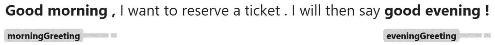

图 4.2 – 使用两种模式进行 Span 匹配

在前面的代码示例中，`pattern1` 和 `pattern2` 只在单个标记上有所不同：`evening** / **morning`。我们是否可以用 `IN` 属性来表示晚上或早上，而不是编写两个模式？让我们在下一节中了解更多。

## 扩展语法支持

`Matcher` 允许在花括号内使用一些运算符，从而使模式更加丰富。这些运算符用于扩展比较，类似于 Python 的 `in`、`not in` 和 **比较** 运算符。您可以在 spaCy 的文档中查看完整的属性列表，文档可在 [`spacy.io/api/matcher/#patterns`](https://spacy.io/api/matcher/#patterns) 找到。之前我们使用两个不同的模式匹配了 `good evening` 和 `good morning`。现在，我们可以通过使用 `IN` 来匹配 `good morning** / **evening`，如下所示：

```py
pattern = [{"LOWER": "good"},
           {"LOWER": {"IN": ["morning", "evening"]}},
           {"IS_PUNCT": True}]
matcher.add("greetings",  [pattern])
doc = nlp("Good morning, I'm here. I'll say good evening!!")
matches = matcher(doc)
spans = []
for match_id, start, end in matches:
    pattern_name = nlp.vocab.strings[match_id]
    spans.append(Span(doc, start, end, pattern_name))
doc.spans["sc"] = spans
```

比较运算符通常与 `LENGTH` 属性一起使用。以下是一个查找长标记的示例：

```py
pattern = [{"LENGTH": {">=" : 10}}]
matcher.add("longWords",  [pattern])
doc = nlp("I suffered from Trichotillomania when I was in college. The doctor prescribed me Psychosomatic medicine.")
matches = matcher(doc)
spans = []
for match_id, start, end in matches:
    pattern_name = nlp.vocab.strings[match_id]
    spans.append(Span(doc, start, end, pattern_name))
doc.spans["sc"] = spans
```

*图 4* *.3* 展示了使用此模式的匹配结果：

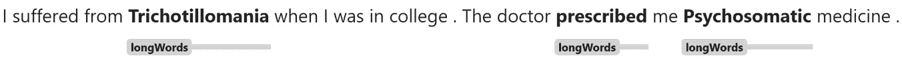

图 4.3 – 使用 LENGTH 模式匹配的结果

在下一节中，我们将探讨一些最常用的标记属性，这些属性用于创建模式。

## 标记属性

让我们通过一些示例来回顾一些有用的标记模式键。在前面的例子中我们使用了 `LOWER`；它表示标记文本的小写形式。`ORTH` 和 `TEXT` 与 `LOWER` 类似：它们表示对标记文本的精确匹配，包括大小写。以下是一个示例：

```py
pattern = [{"TEXT": "Bill"}]
```

上述代码将匹配 `Bill` 但不会匹配 `bill`。

下一个标记属性块是 `IS_ALPHA`、`IS_ASCII` 和 `IS_DIGIT`。这些特性对于查找数字标记和普通单词很有用。以下模式匹配两个标记的序列，一个数字后面跟一个普通单词：

```py
pattern = [{"IS_DIGIT": True},{"IS_ALPHA": True}]
matcher.add("numberAndPlainWord",  [pattern])
doc1 = nlp("I met him at 2 o'clock.")
matches = matcher(doc1)
spans = []
for match_id, start, end in matches:
    pattern_name = nlp.vocab.strings[match_id]
    spans.append(Span(doc1, start, end, pattern_name))
doc1.spans["sc"] = spans
displacy.render(doc1, style="span")
```

在前面的代码段中，`2 o'clock` 没有匹配到模式，因为 `o'clock` 包含撇号，这不是一个字母字符（字母字符是数字、字母和下划线字符）。让我们使用另一个句子来测试这个模式：

```py
doc2 = nlp("He brought me 2 apples.")
matches = matcher(doc2)
spans = []
for match_id, start, end in matches:
    pattern_name = nlp.vocab.strings[match_id]
    spans.append(Span(doc2, start, end, pattern_name))
doc2.spans["sc"] = spans
displacy.render(doc2, style="span")
```

*图 4* *.4* 显示了 **2 个苹果** 匹配的原因是 `apples` 标记由字母组成：

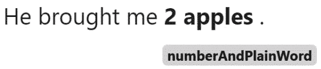

图 4.4 – 使用数字和平常单词模式匹配

`IS_LOWER`、`IS_UPPER` 和 `IS_TITLE` 是用于识别标记大小写的有用属性。如果标记全部为大写字母，则 `IS_UPPER` 为 `True`；如果标记以大写字母开头，则 `IS_TITLE` 为 `True`。如果标记全部为小写字母，则 `IS_LOWER` 为 `True`。想象一下，如果我们想在文本中找到强调的单词；一种方法就是寻找全部为大写字母的标记。大写标记通常在情感分析模型中具有显著的重要性。以下是一个示例：

```py
pattern = [{"IS_UPPER": True}]
matcher.add("capitals",  [pattern])
doc = nlp("Take me out of your SPAM list. We never asked you to contact me. If you write again we'll SUE!!!!")
matches = matcher(doc)
spans = []
for match_id, start, end in matches:
    pattern_name = nlp.vocab.strings[match_id]
    spans.append(Span(doc, start, end, pattern_name))
doc.spans["sc"] = spans
displacy.render(doc, style="span")
```

`IS_PUNCT`、`IS_SPACE` 和 `IS_STOP` 通常用于包含一些辅助标记的模式中，分别对应于标点符号、空格和停用词标记（停用词是语言中不携带太多信息的常见单词，例如英语中的 *a*、*an* 和 *the*）。`IS_SENT_START` 是另一个有用的属性；它匹配句子开头的标记。以下是一个以单词 *can* 开头且第二个单词首字母大写的句子模式：

1.  在这个模式中，我们将把两个属性放入一个大括号中。`pattern` 中的第一个项目意味着一个标记是句子的第一个标记，并且其小写文本为 `can`：

    ```py
    pattern = [{"IS_SENT_START": True, "LOWER": "can"}, {"IS_TITLE": True}]
    matcher.add("canThenCapitalized", [pattern])
    ```

1.  现在，我们处理文本并显示匹配结果：

    ```py
    doc2 = nlp("Can Sally swim?")
    matches = matcher(doc2)
    spans = []
    for match_id, start, end in matches:
        pattern_name = nlp.vocab.strings[match_id]
        spans.append(Span(doc2, start, end, pattern_name))
    doc2.spans["sc"] = spans
    displacy.render(doc2, style="span")
    ```

*图 4* *.5* 显示了前面列表的匹配结果：

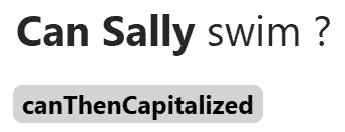

图 4.5 – 使用两个标记进行匹配

我们可以给大括号添加任意多的属性。例如，`{"IS_SENT_START": False, "IS_TITLE": True, "LOWER": "bill"}` 是一个完全有效的属性字典，它描述了一个大写字母开头、不是句子第一个标记，并且文本为 `bill` 的标记。因此，它是那些作为句子第一个单词不出现的 `bill` 实例的集合。

`LIKE_NUM`、`LIKE_URL` 和 `LIKE_EMAIL` 是与标记形状相关的属性；我们在 *第三章* 中讨论了它们。这些属性匹配看起来像数字、URL 和电子邮件的标记。

现在，让我们看看 `POS`、`TAG`、`DEP`、`LEMMA` 和 `SHAPE` 语言属性。您在上一章中看到了这些标记属性；现在，我们将使用它们进行标记匹配。以下代码片段查找以助动词开头的句子：

```py
pattern = [{"IS_SENT_START": True, "TAG": "MD"}]
matcher.add("sentStartAuxBVerb", [pattern])
doc = nlp("Will you go there?")
matches = matcher(doc)
```

`MD` 是情态动词和助动词的标记。前面的代码片段是查找是/否疑问句的标准方法。在这种情况下，我们通常寻找以情态动词或助动词开头的句子。

当我们想要提取一个单词的含义时，我们通常将 `TEXT/LEMMA` 与 `POS/TAG` 结合。例如，当 match 是动词时，它需要与 `POS/TAG` 结合，或者当它是名词时，它可以是一个点火工具。在这种情况下，我们做出以下区分：

`{"LEMMA": "match", "** **POS": "VERB"}`

`{"LEMMA": "match", "** **POS": "NOUN"}`

同样，你可以将其他语言特征与标记形状属性结合，以确保只提取你想要的模式。

在接下来的章节中，我们将看到更多将语言特征与 `Matcher` 类结合的示例。现在，我们将继续探讨 `Matcher` 模式的一个非常实用的特性：类似正则表达式的操作符。

## 类似正则表达式的操作符

在本章的开头，我们指出 spaCy 的`Matcher`类提供了对正则表达式操作的更干净、更易读的等效方法，确实更干净、更易读。最常见的正则表达式操作是可选匹配（`?`）、至少匹配一次（`+`）和匹配 0 次或多次（`*`）。您可以在以下位置查看 spaCy 的`Matcher`运算符的完整列表：[`spacy.io/api/matcher/#patterns`](https://spacy.io/api/matcher/#patterns)。本章的第一个正则表达式示例是匹配 Barack Obama 的名字，中间名是可选的。正则表达式如下：

```py
R"Barack\s(Hussein\s)?Obama
```

`?`运算符在`Hussein`之后表示括号内的模式是可选的，因此这个正则表达式可以匹配`Barack Obama`和`Barack Hussein Obama`。我们在`Matcher`模式中使用`?`运算符如下：

```py
pattern = [{"LOWER": "barack"},
           {"LOWER": "hussein", "OP": "?"},
           {"LOWER": "obama"}]
matcher.add("obamaNames",  [pattern])
doc1 = nlp("Barack Obama visited France.")
doc2 = nlp("Barack Hussein Obama visited France.")
```

在这里，通过在第二个列表项中使用`"OP": "?"`，我们使这个标记可选。匹配器选择了第一个`doc`对象中的`Barack Obama`和第二个中的`Barack Hussein Obama`，正如你在*图 4* *.6*中可以看到：

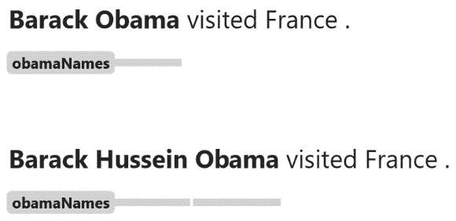

图 4.6 – 使用正则表达式进行匹配

我们之前指出，`+`和`*`运算符与它们的正则表达式对应物具有相同的意义。`+`表示标记至少出现一次，而`*`表示标记可以出现 0 次或多次。让我们看看一些例子：

```py
pattern = [{"LOWER": {"IN": ["hello", "hi", "hallo"]}, "OP":"+"}, 
           {"IS_PUNCT": True}]
matcher.add("greetings",  [pattern])
doc1 = nlp("Hello hello hello, how are you?")
doc2 = nlp("Hi, how are you?")
doc3 = nlp("How are you?")
for doc in [doc1, doc2, doc3]:
    spans = []
    matches = matcher(doc)
    for match_id, start, end in matches:
        pattern_name = nlp.vocab.strings[match_id]
        spans.append(Span(doc, start, end, pattern_name))
    doc.spans["sc"] = spans
    displacy.render(doc, style="span")
```

*图 4* *.7*显示了当我们使用`+`运算符时会发生什么：

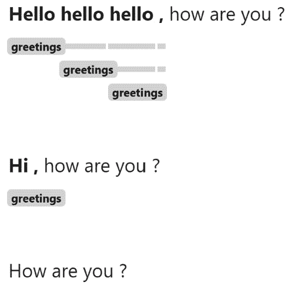

图 4.7 – 使用+运算符进行匹配

在模式中，第一个标记读作`hello`、`hi`或`hallo`中的任何一个，应该出现一次或多次。注意模式的贪婪性质（每个`hello`实例都得到匹配）。第二个 doc 也有匹配，但第三个没有（因为它没有`hello`、`hi`或`hallo`中的任何词）。

当我们查看第一个 doc 对象匹配的结果时，我们看到不仅有一次，而是有三个不同的匹配。这是完全正常的，因为确实有三个序列与模式匹配。如果你仔细查看匹配结果，你会发现它们都匹配我们创建的模式，因为它们都匹配`(** **hello)+`模式。

让我们用`*`来做同样的模式，看看这次会发生什么：

```py
pattern = [{"LOWER": {"IN": ["hello", "hi", "hallo"]},
            "OP": "*"}, {"IS_PUNCT": True}]
matcher.add("greetings",  [pattern])
doc1 = nlp("Hello hello hello, how are you?")
doc2 = nlp("Hello, how are you?")
doc3 = nlp("How are you?")
for doc in [doc1, doc2, doc3]:
    spans = []
    matches = matcher(doc)
    for match_id, start, end in matches:
        pattern_name = nlp.vocab.strings[match_id]
        spans.append(Span(doc, start, end, pattern_name))
    doc.spans["sc"] = spans
    displacy.render(doc, style="span")
```

*图 4* *.8*显示了结果：

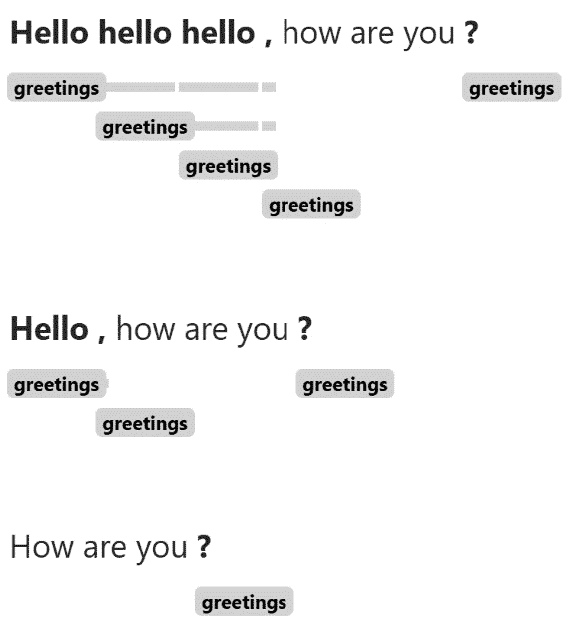

图 4.8 – 使用*运算符的匹配

现在，仅凭标点符号而没有问候词被选中。这可能不是你希望在 NLP 应用中看到的情况。

上述例子是一个很好的例子，说明我们在创建模式时应该小心；有时我们会得到不想要的匹配。因此，我们通常考虑使用`IS_SENT_START`并使用`*`运算符来处理其余部分。

spaCy `Matcher`类还接受一个非常特殊的模式，即通配符标记模式。通配符标记将匹配任何标记。我们通常用它来选择我们想要独立于它们的文本或属性或忽略的单词。让我们看一个例子：

```py
matcher = Matcher(nlp.vocab)
pattern = [{"LOWER": "name"},{"LEMMA": "be"},{}]
matcher.add("pickName", [pattern])
doc = nlp("My name is Alice and his name was Elliot.")
matches = matcher(doc)
spans = []
for match_id, start, end in matches:
    pattern_name = nlp.vocab.strings[match_id]
    spans.append(Span(doc, start, end, pattern_name))
doc.spans["sc"] = spans
displacy.render(doc, style="span")
```

在这里，我们想要捕捉句子中的名字。我们通过解析形式为`name is/was/be firstname`的标记序列实现了这一点。第一个标记模式，`LOWER: "name"`，匹配文本小写后的文本为`name`的标记。第二个标记模式，`LEMMA: "be"`，匹配`is`、`was`和`be`标记。第三个标记是通配符标记，`{}`，表示任何标记。我们使用这个模式拾取任何在`name is/was/be`之后的标记。*图 4.9* *.9*显示了结果：

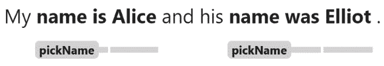

图 4.9 – 使用通配符标记的匹配

当我们想要忽略一个标记时，我们也会使用通配符标记。让我们一起来做一个例子：

```py
pattern = [{"LEMMA": "forward"}, {}, {"LOWER": "email"}]
matcher.add("forwardMail",  [pattern])
doc1 = nlp("I forwarded his email to you.")
doc2 = nlp("I forwarded an email to you.")
doc3 = nlp("I forwarded the email to you.")
for doc in [doc1, doc2, doc3]:
    spans = []
    matches = matcher(doc)
    for match_id, start, end in matches:
        pattern_name = nlp.vocab.strings[match_id]
        spans.append(Span(doc, start, end, pattern_name))
    doc.spans["sc"] = spans
    displacy.render(doc, style="span")
```

这与前面的例子正好相反。在这里，我们想要捕捉`forward email`序列，并且允许一个标记在`forward`和`email`之间。在这种情况下，语义上重要的部分是转发电子邮件的动作；它是谁的电子邮件并不重要。

到目前为止，我们已经在本章中提到了很多正则表达式，现在是时候看看 spaCy 的`Matcher`类如何使用正则表达式语法了。

## 正则表达式支持

当我们匹配单个标记时，通常我们想要允许一些变化，例如常见的拼写错误、UK/US 英语字符差异等。正则表达式非常适合这项任务，spaCy `Matcher`提供了对标记级正则表达式匹配的全支持。让我们探索如何为我们自己的应用使用正则表达式：

```py
pattern = [{"POS": "PRON"},
           {"TEXT": {"REGEX": "[Tt]ravell?ed"}}]
matcher.add("regex", [pattern])
doc1 = nlp("I travelled by bus.")
doc2 = nlp("She traveled by bike.")
for doc in [doc1, doc2]:
    spans = []
    matches = matcher(doc)
    for match_id, start, end in matches:
        pattern_name = nlp.vocab.strings[match_id]
        spans.append(Span(doc, start, end, pattern_name))
    doc.spans["sc"] = spans
    displacy.render(doc, style="span")
```

在这里，我们的第二个标记模式是`[Tt]ravell?ed`，这意味着标记可以是首字母大写也可以不是。此外，在第一个`l`实例之后有一个可选的`l`实例。允许双元音和 ise/ize 变化是处理英国和美式英语变化的标准方式。

使用正则表达式还有另一种方式，即不仅与文本一起使用，还与 POS 标签一起使用。以下代码段做了什么？

```py
pattern = [{"TAG": {"REGEX": "^V"}}]
matcher.add("verbs",  [pattern])
doc = nlp("I went to Italy; he has been there too. His mother also has told me she wants to visit Rome.")
spans = []
for match_id, start, end in matches:
    pattern_name = nlp.vocab.strings[match_id]
    spans.append(Span(doc, start, end, pattern_name))
doc.spans["sc"] = spans
displacy.render(doc, style="span")
```

我们已经提取了所有的有限动词（你可以将有限动词视为非情态动词）。我们是如何做到这一点的呢？我们的标记模式包括正则表达式`^V`，这意味着所有以 V 开头的细粒度 POS 标签：`VB`、`VGD`、`VBG`、`VBN`、`VBP`和`VBZ`。然后，我们提取了具有动词 POS 标签的标记。

## Matcher 在线演示

spaCy `Matcher`在其在线演示页面上提供了一个工具：[`explosion.ai/demos/matcher`](https://explosion.ai/demos/matcher)。我们可以创建模式并交互式地测试它们与我们要测试的文本。

在 *图 4* *.10* 中，我们可以看到一个匹配示例。在右侧，我们可以选择属性、值和运算符（如 `+` 、 `*` 、 `!` 和 `?`）。在做出此选择后，演示在复选框下方右侧输出相应的模式字符串。在左侧，我们首先选择我们想要的 spaCy 语言模型（在本例中为英语核心小型），然后查看结果：

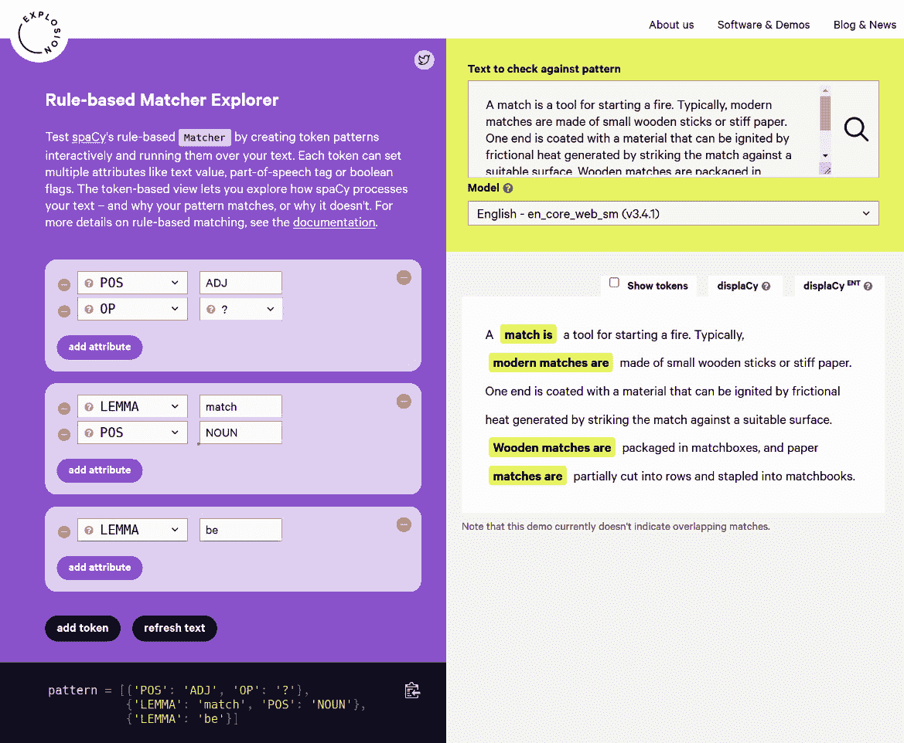

图 4.10 – spaCy 的基于规则的 Matcher 探索器

spaCy 的 `Matcher` 示例帮助你了解为什么你的模式匹配或未匹配。

# 使用 PhraseMatcher 创建模式

在处理金融、医疗或法律文本时，我们经常有长列表和字典，我们希望将文本与我们的列表进行扫描。正如我们在上一节中看到的，`Matcher` 模式相当是手工制作的；我们逐个编码每个标记。如果你有一长串短语列表，`Matcher` 并不很方便。不可能逐个编码所有术语。

spaCy 为比较文本与长字典提供了一种解决方案 – `PhraseMatcher` 类。`PhraseMatcher` 类帮助我们匹配长字典。让我们从一个使用 `PhraseMatcher` 匹配列表中定义的术语的基本示例开始：

1.  导入库和类，并像往常一样实例化 `nlp` 管道：

    ```py
    import spacy
    from spacy.matcher import PhraseMatcher
    nlp = spacy.load("en_core_web_sm")
    ```

1.  现在，我们可以实例化 `PhraseMatcher` 对象，并对每个术语逐个调用 `nlp.make_doc()` 来创建模式：

    ```py
    matcher = PhraseMatcher(nlp.vocab)
    terms = ["Angela Merkel", "Donald Trump", "Alexis Tsipras"]
    patterns = [nlp.make_doc(term) for term in terms]
    matcher.add("politiciansList", patterns)
    ```

1.  最后，我们检查匹配项：

    ```py
    doc = nlp("3 EU leaders met in Berlin. German chancellor Angela Merkel first welcomed the US president Donald Trump. The following day Alexis Tsipras joined them in Brandenburg.")
    matches = matcher(doc)
    spans = []
    for match_id, start, end in matches:
        pattern_name = nlp.vocab.strings[match_id]
        spans.append(Span(doc, start, end, pattern_name))
    doc.spans["sc"] = spans
    displacy.render(doc, style="span")
    ```

这样，我们通过它们的精确文本值来匹配模式，如图 *图 4* *.11* 所示：

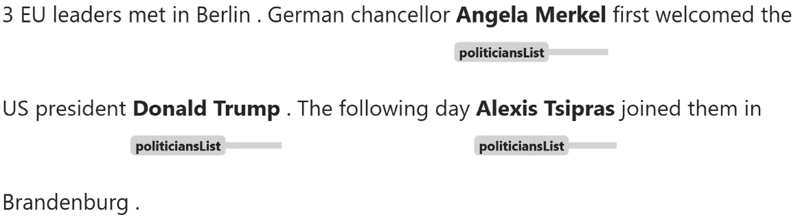

图 4.11 – 使用 PhraseMatcher 进行匹配

如果我们想用其他属性进行匹配怎么办？这里是一个通过 `LOWER` 属性进行匹配的示例。

首先，我们创建一个 `PhraseMatcher` 实例，传递一个额外的参数，`attr=LOWER`。这样，`PhraseMatcher` 在匹配时使用 `token.lower` 属性：

```py
matcher = PhraseMatcher(nlp.vocab, attr="LOWER")
terms = ["Asset", "Investment", "Derivatives", "Demand", "Market"]
patterns = [nlp.make_doc(term) for term in terms]
matcher.add("financeTerms", patterns)
```

现在，让我们显示结果：

```py
doc = nlp("During the last decade, derivatives market became an asset class of their own and influenced the financial landscape strongly.")
matches = matcher(doc)
spans = []
for match_id, start, end in matches:
    pattern_name = nlp.vocab.strings[match_id]
    spans.append(Span(doc, start, end, pattern_name))
doc.spans["sc"] = spans
displacy.render(doc, style="span")
```

*图 4* *.12* 显示了匹配结果：

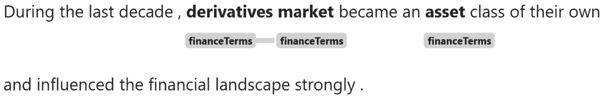

图 4.12 – 使用 PhraseMatcher LOWER 属性进行匹配

`PhraseMatcher` 的另一个可能的用法是匹配 `SHAPE` 属性。这种匹配策略可以用于系统日志，其中 IP 地址、日期和其他数值出现很多。这里的好事是您不必担心数字是如何分词的；您只需将其留给 `PhraseMatcher`。让我们看一个例子：

```py
matcher = PhraseMatcher(nlp.vocab, attr="SHAPE")
ip_nums = ["127.0.0.0", "127.256.0.0"]
patterns = [nlp.make_doc(ip) for ip in ip_nums]
matcher.add("IPNums", patterns)
doc = nlp("This log contains the following IP addresses: 192.1.1.1 and 192.160.1.1 .")
matches = matcher(doc)
spans = []
for match_id, start, end in matches:
    pattern_name = nlp.vocab.strings[match_id]
    spans.append(Span(doc, start, end, pattern_name))
doc.spans["sc"] = spans
displacy.render(doc, style="span")
```

*图 4* *.13* 显示了结果：

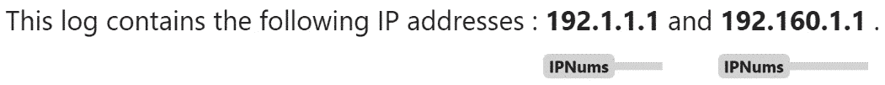

图 4.13 – 使用 PhraseMatcher SHAPE 属性进行匹配

很方便，对吧？我们成功匹配了标记和短语；现在，让我们继续到**命名实体识别**（`NER`）。命名实体提取是任何 NLP 系统的基本组成部分，你将要设计的多数管道都将包括一个 NER 组件。下一节将专注于基于规则的命名实体提取。

# 使用 SpanRuler 创建模式

spaCy 的`SpanRuler`组件允许我们使用基于标记的规则或精确短语匹配将跨度添加到`Doc.spans`和/或`Doc.ents`字典中。

`SpanRuler`不是一个匹配器；它是一个管道组件，我们可以通过`nlp.add_pipe`将其添加到我们的管道中。当它找到匹配项时，匹配项将被追加到`doc.ents`或`doc.spans`中。如果添加到`doc.ents`，`ent_type`将是我们在模式中传递的标签。让我们看看它是如何工作的：

1.  首先，为实体定义一个模式：

    ```py
    patterns = [{"label": "ORG",
                "pattern": [{"LOWER": "chime"}]}]
    ```

1.  现在，我们添加`SpanRuler`组件。默认情况下，它将跨度添加到`doc.spans`中，而我们希望将其添加到`doc.ents`中，所以我们在配置中指定了这一点：

    ```py
    span_ruler = nlp.add_pipe(
        "span_ruler", config={"annotate_ents":True})
    ```

1.  现在，我们可以将模式添加到组件中并处理文本：

    ```py
    span_ruler.add_patterns(patterns)
    doc = nlp("I have an acccount with chime since 2017")
    displacy.render(doc, style="ent")
    ```

*图 4.14*显示了我们所匹配的实体：


图 4.14 – 使用 SpanRuler 创建的实体

我们可以在*图 4.14*中看到，`chime`标记被添加到了`Doc.ents`字典中。如果你不想覆盖现有的实体，可以将`overwrite`设置为`False`。让我们试试：

```py
nlp.remove_pipe("span_ruler")
patterns = [{"label": "ORG",
            "pattern": [{"LOWER": "chime"}]}]
span_ruler = nlp.add_pipe(
    "span_ruler", config={"annotate_ents":True, "overwrite":False})
span_ruler.add_patterns(patterns)
doc = nlp("I have an acccount with chime since 2017")
displacy.render(doc, style="ent")
```

*图 4.15*显示了结果。现在，由`ner`组件添加的实体也出现了（你将在*第五章*中了解更多关于组件和管道的内容）：


图 4.15 – 使用 SpanRuler 和 ner 组件创建的实体

就这样——简单，却强大。我们只用了几行代码就添加了自己的实体。

现在我们已经看到了如何使用`Matcher`类和`SpanRuler`提取信息，我们将继续到一个专门的部分，快速且非常实用的食谱。

# 结合 spaCy 模型和匹配器

在本节中，我们将介绍一些食谱，这些食谱将指导你了解你可能在 NLP 旅程中遇到的实体提取类型。所有示例都是现成的、真实世界的食谱。让我们从数字格式化的实体开始。

## 提取 IBAN

`IBAN`是金融和银行业中经常出现的重要实体类型。我们将学习如何解析它。

IBAN 是一种国际银行账户号码格式。它由两位数字的国家代码和随后的数字组成。

我们如何创建一个 IBAN 的模式？我们首先用两个大写字母开始，然后是两个数字。接着，可以跟任意数量的数字。我们可以这样表示国家代码和接下来的两个数字：

```py
{"SHAPE": "XXdd"}
```

这里，`XX` 代表两个大写字母，而`dd` 是两个数字。然后，`XXdd` 模式完美地匹配 IBAN 的第一个数字块。那么其他数字块呢？对于其他块，我们需要匹配一个一到四个数字的块。`\d{1,4}`正则表达式表示一个由一到四个数字组成的标记。这个模式将匹配一个数字块：

```py
{"TEXT": {"REGEX": "\d{1,4}"}}
```

我们有这些块的数量，所以匹配 IBAN 数字块的模式如下：

```py
{"TEXT": {"REGEX": "\d{1,4}"}, "OP": "+"}
```

然后，我们将第一个形状块与其他块结合起来。让我们检查模式的完整代码：

1.  定义模式并将其添加到`Matcher`对象中：

    ```py
    pattern = [{"SHAPE": "XXdd"},
               {"TEXT": {"REGEX": "\d{1,4}"}, "OP":"+"}]
    matcher = Matcher(nlp.vocab)
    matcher.add("ibanNum",  [pattern])
    ```

1.  现在，让我们添加代码来显示匹配项：

    ```py
    doc = nlp("My IBAN number is BE71 0961 2345 6769, please send the money there.")
    doc1 = nlp("My IBAN number is FR76 3000 6000 0112 3456 7890 189, please send the money there.")
    for doc in [doc, doc1]:
        spans = []
        matches = matcher(doc)
        for match_id, start, end in matches:
            pattern_name = nlp.vocab.strings[match_id]
            spans.append(Span(doc, start, end, pattern_name))
        doc.spans["sc"] = spans
        displacy.render(doc, style="span")
    ```

*图 4.16* 显示了结果。在解析数字实体时，你可以始终遵循类似的策略：首先，将实体分成一些有意义的部分/块，然后尝试确定各个块的形式或长度：

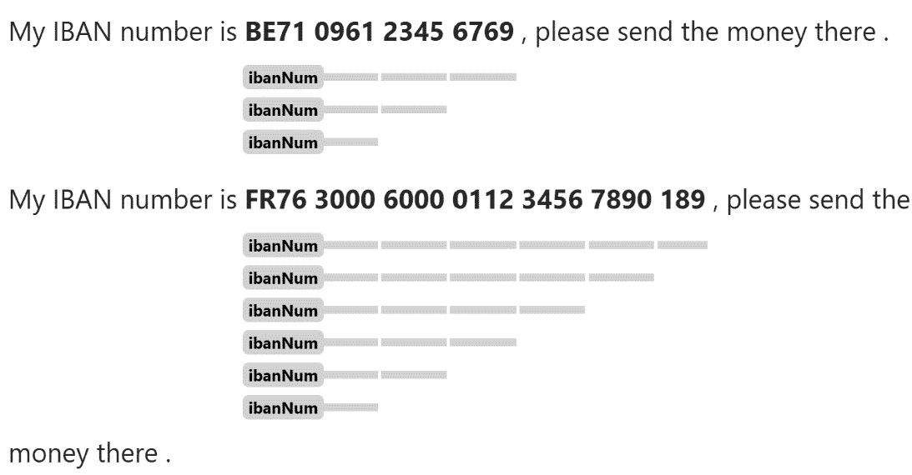

图 4.16 – 提取 IBAN

我们成功解析了 IBAN。现在，我们将提取另一种常见的数字实体：电话号码。

## 提取电话号码

电话号码的格式因国家而异，匹配电话号码通常是一项棘手的工作。这里的最佳策略是明确你想要解析的国家电话号码格式。如果有多个国家，你可以在匹配器中添加相应的单个模式。如果你有太多的国家，那么你可以放宽一些条件，采用更通用的模式（我们将看到如何做到这一点）。

让我们从美国的电话号码格式开始。美国国内电话号码写作（541）754-3010，国际电话号码写作+1（541）754-3010。我们可以用一个可选的`+1`实例，然后是一个三位数的区号，然后是两个用可选的`-`实例分隔的数字块来形成我们的模式。以下是模式：

```py
{"TEXT": "+1", "OP": "?"}, {"TEXT": "("}, {"SHAPE": "ddd"}, {"TEXT": ")"}, {"SHAPE": "ddd"}, {"TEXT": "-", "OP": "?"}, {"SHAPE": "dddd"}
```

让我们看看模式的例子：

```py
pattern = [{"TEXT": "+1", "OP": "?"}, {"TEXT": "("},
           {"SHAPE": "ddd"}, {"TEXT": ")"},
           {"SHAPE": "ddd"}, {"TEXT": "-", "OP": "?"},
           {"SHAPE": "dddd"}]
matcher = Matcher(nlp.vocab)
matcher.add("usPhonNum",  [pattern])
```

接下来，我们有一些示例句子和显示匹配项的代码：

```py
doc1 = nlp("You can call my office on +1 (221) 102-2423 or email me directly.")
doc2 = nlp("You can call me on (221) 102 2423 or text me.")
for doc in [doc1, doc2]:
    spans = []
    matches = matcher(doc)
    for match_id, start, end in matches:
        pattern_name = nlp.vocab.strings[match_id]
        spans.append(Span(doc, start, end, pattern_name))
    doc.spans["sc"] = spans
    displacy.render(doc, style="span")
```

*图 4.17* 显示了结果。我们是否可以将模式变得更通用，以便也适用于其他国家？在这种情况下，我们可以从一个一到三位数的国家代码开始，后面跟一些数字块。这将匹配更广泛的数字集合，因此最好小心不要匹配文本中的其他数字实体：

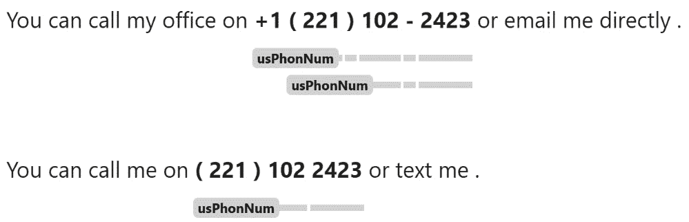

图 4.17 – 提取电话号码

我们将把文本实体从数字实体中提取出来。现在，我们将处理社交媒体文本并提取社交媒体文本中可能出现的不同类型的实体。

## 提取提及

想象一下分析关于公司和个人产品的社交媒体帖子数据集，你的任务是找出以何种方式提及了哪些公司。数据集将包含这些类型的句子：

```py
CafeA is very generous with the portions.
CafeB is horrible, we waited for mins for a table.
RestaurantA is terribly expensive, stay away!
RestaurantB is pretty amazing, we recommend.
```

我们要找的可能是`BusinessName is/was/be adverb`形容词形式的模式。以下模式将有效：

```py
[{"ENT_TYPE": "ORG"}, {"LEMMA": "be"}, {"POS": "ADV", "OP": "*"}, {"POS": "ADJ"}]
```

这里，我们寻找一个组织类型实体，然后是一个`is/was/be`实例，接着是可选的副词，最后是一个形容词。

如果你想提取一个特定的商业实体——比如说，ACME 公司？你只需要将第一个标记替换为特定的公司名称：

```py
[{"LOWER": "acme"}, {"LEMMA": "be"}, {"POS": "ADV", "OP": "*"}, {"POS": "ADJ"}]
```

就这样——简单易懂！在提取社交媒体提及之后，接下来要做的事情是提取哈希标签。

## 哈希标签提取

处理社交媒体文本有一些挑战。社交媒体文本有一个不寻常的标记类型：`hashtags`。它们对文本的意义有巨大影响。哈希标签指的是句子的主题/对象。

哈希标签由一个`#`字符开头，然后是一个 ASCII 字符的单词，没有单词间空格。一些例子是`#MySpace`，`#MondayMotivation`等等。spaCy 分词器将这些单词分词成两个标记：

```py
doc = nlp("#MySpace")
print([token.text for token in doc])
>>> ['#', 'MySpace']
```

因此，我们的模式需要匹配两个标记：`#`字符和其余部分。以下模式可以轻松匹配 hashTag：

```py
{"TEXT": "#"}, {"IS_ASCII": True}
```

以下模式提取了一个哈希标签：

```py
pattern = [{"TEXT": "#"}, {"IS_ASCII": True}]
matcher = Matcher(nlp.vocab)
matcher.add("hashTag",  [pattern])
```

现在，让我们使用句子`"Start working out** **now #WeekendShred"`来显示匹配结果：

```py
doc = nlp("Start working out now #WeekendShred")
matches = matcher(doc)
spans = []
for match_id, start, end in matches:
    pattern_name = nlp.vocab.strings[match_id]
    spans.append(Span(doc, start, end, pattern_name))
doc.spans["sc"] = spans
displacy.render(doc, style="span")
```

同样简单。*图 4* *.18* 展示了结果：

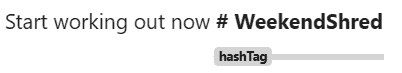

图 4.18 – 匹配 hashTag 模式

表情符号是另一种不寻常的标记，它有可能将情感赋予一个句子。我们还可以使用 spacymoji 包（[`spacy.io/universe/project/spacymoji`](https://spacy.io/universe/project/spacymoji)）提取表情符号标记。

现在，让我们提取一些实体。我们将在下一节中介绍扩展命名实体的常用方法。

## 扩展命名实体

通常，我们希望将命名实体的范围扩展到左侧或右侧。想象一下，你想提取带有标题的`PERSON`类型命名实体，这样你可以轻松推断性别或职业。spaCy 的`NER`类已经提取了人名，那么标题呢？

```py
doc = nlp("Ms. Smith left her house 2 hours ago.")
print(doc.ents)
>>> (Smith, 2 hours ago)
```

如你所见，单词`Ms.`没有包含在命名实体中，因为它不是人名的一部分。一个快速的解决方案是创建一个新的实体类型，称为`TITLE`：

```py
nlp.remove_pipe("span_ruler")
patterns = [{"label": "TITLE",
             "pattern": [{"LOWER": {"IN": [
                 "ms.", "mr.", "mrs.", "prof.", "dr."]}}]}]
ruler = nlp.add_pipe("span_ruler", 
                     config={"annotate_ents":True, "overwrite":False})
ruler.add_patterns(patterns)
```

现在，让我们再次显示匹配结果：

```py
doc = nlp("Ms. Smith left her house")
displacy.render(doc, style="ent")
```

*图 4* *.19* 展示了结果：


图 4.19 – 使用 Matcher 扩展实体

这是一个快速且非常实用的方法。如果你处理维基文本或财经文本，经常会遇到解析标题。

# 摘要

在本章中，你学习了如何使用语言和标记级特征进行基于规则的匹配。你学习了关于`Matcher`类，spaCy 的基于规则的匹配器。我们通过使用不同的标记特征，如形状、词元、文本和实体类型，来探索`Matcher`类。

然后，你学习了关于`SpanRuler`的知识，这是一个可以让你取得很多成就的救命工具。你还学习了如何使用`SpanRuler`类提取命名实体。

最后，我们将本章所学内容与你的先前知识相结合，并通过几个示例将语言特征与基于规则的匹配相结合。你学习了如何提取模式、特定格式的实体以及特定领域的实体。

通过本章，你完成了语言特征的构建。在下一章中，我们将利用所有这些知识，通过 spaCy 管道从文本中提取语义表示。
