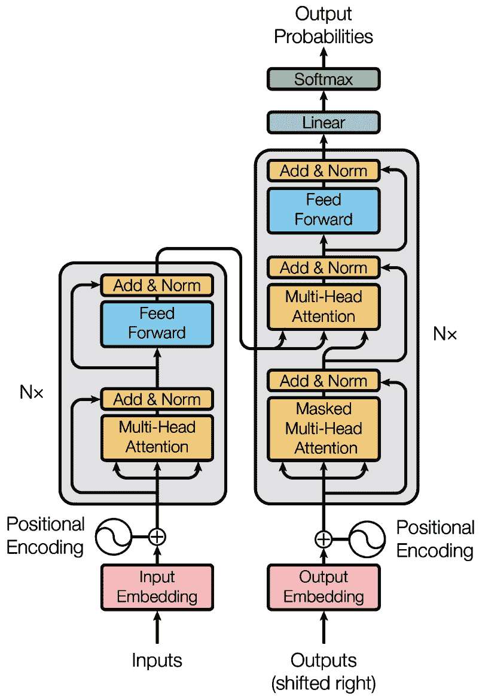
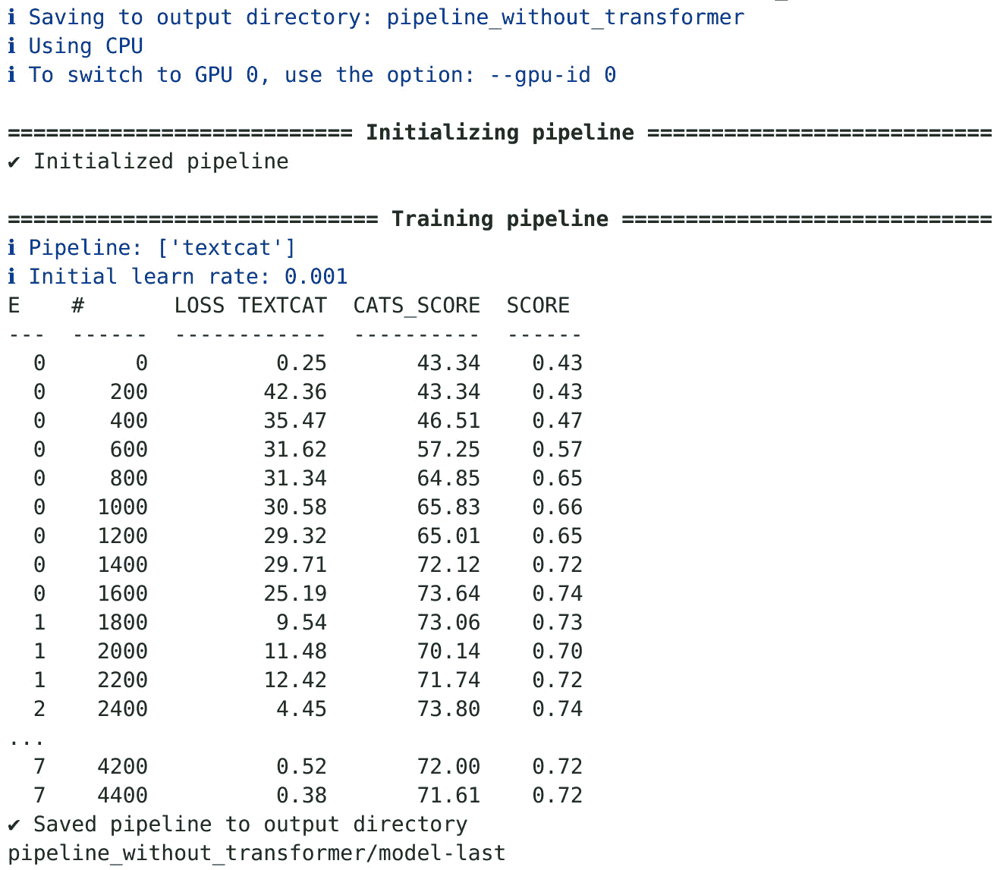
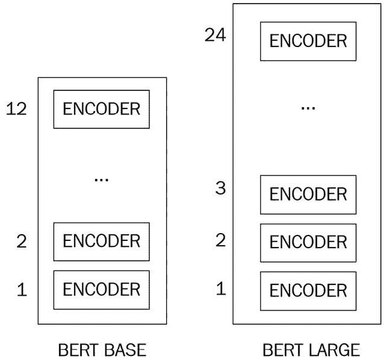
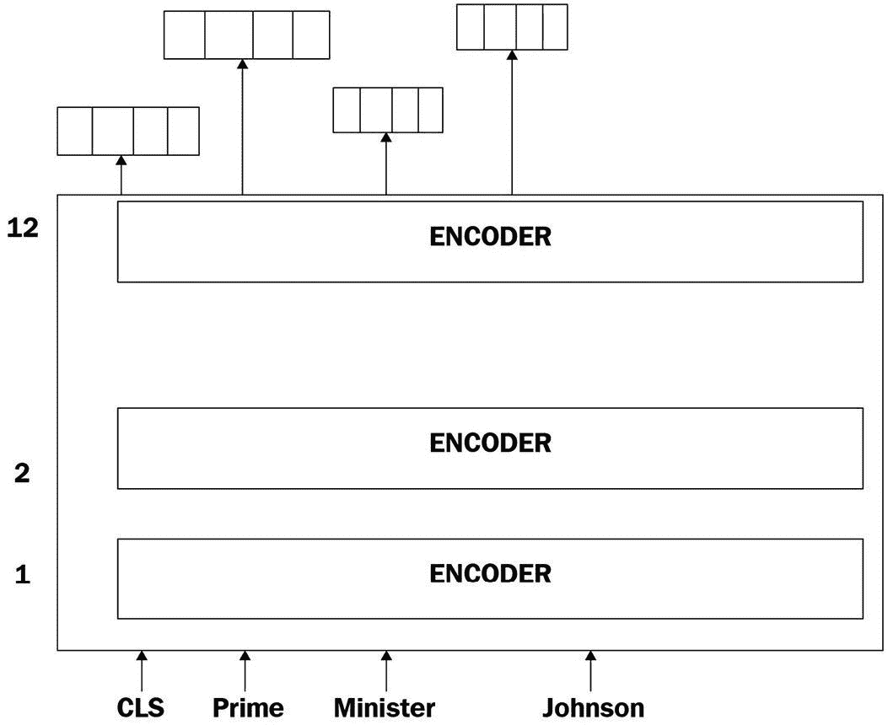
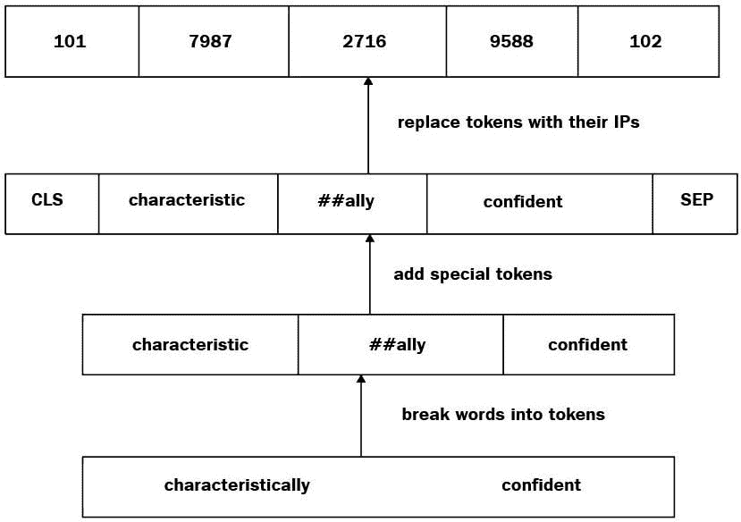

# 第六章：利用 spaCy 与转换器一起工作

**转换器**是 NLP 中的最新热门话题。本章的目标是学习如何使用转换器来提高 spaCy 中可训练组件的性能。

首先，你将了解转换器和迁移学习。接下来，你将更深入地了解 spaCy 可训练组件以及如何训练一个组件，介绍 spaCy 的 `config.cfg` 文件和 spaCy 的 CLI。然后，你将了解常用 Transformer 架构的架构细节——**双向编码器` `Transformer 表示**（`BERT`）及其继任者 RoBERTa。最后，你将训练 `TextCategorizer` 组件，使用转换器层来提高准确率对文本进行分类。

到本章结束时，你将能够准备训练数据并微调你自己的 spaCy 组件。由于 spaCy 的设计方式；在这样做的时候，你将遵循软件工程的最佳实践。你还将对转换器的工作原理有一个坚实的基础，这在我们与 **大型` `语言模型**（`LLMs`）在 *第七章* 一起工作时将非常有用。你将能够仅用几行代码就利用 Transformer 模型和迁移学习构建最先进的 NLP 管道。

在本章中，我们将涵盖以下主要主题：

+   使用 spaCy 进行模型训练和迁移学习

+   使用 spaCy 管道对文本进行分类

+   与 spaCy `config.cfg` 文件一起工作

+   准备训练数据以使用 spaCy 微调模型

+   使用 Hugging Face 的 Transformer 进行 spaCy 的下游任务

# 技术要求

数据集和章节代码可以在 [`github.com/PacktPublishing/Mastering-spaCy-Second-Edition`](https://github.com/PacktPublishing/Mastering-spaCy-Second-Edition) 找到。

我们将使用 `pandas` 库来操作数据集，并安装 `spacy-transformers` 库以与 `transformer` spaCy 组件一起工作。

# 转换器和迁移学习

2017 年，随着 Vaswani 等人发表的研究论文 *Attention Is All You Need* 的发布，自然语言处理领域发生了一个里程碑事件（[`arxiv.org/abs/1706.03762`](https://arxiv.org/abs/1706.03762)），该论文介绍了一种全新的机器学习思想和架构——**转换器**。NLP 中的转换器是一个新颖的想法，旨在解决序列建模任务，并针对 **长短期记忆**（`LSTM`）架构引入的一些问题。以下是论文如何解释转换器的工作原理：

“*Transformer 是第一个完全依赖自注意力来计算其输入和输出表示的转换模型，不使用序列对齐 RNN 或卷积*”

在这个上下文中，**转换**意味着通过将输入单词和句子转换为向量来转换输入到输出。通常，一个变压器在一个巨大的语料库上训练。然后，在我们的下游任务中，我们使用这些向量，因为它们携带有关词语义、句子结构和句子语义的信息。

在变压器之前，NLP 世界中的热门技术是**词向量**技术。词向量基本上是一个词的密集数字表示。这些向量令人惊讶的地方在于，语义相似的词具有相似的词向量。例如，`GloVe`和`FastText`向量已经在维基百科语料库上进行了训练，可以用于语义相似度计算。`Token.similarity()`、`Span.similarity()`和`Doc.similarity()`方法都使用词向量来预测这些容器之间的相似度。这是一个简单的迁移学习示例用法，其中我们使用文本中的知识（从词向量训练中提取的词的知识）来解决新问题（相似度问题）。变压器更强大，因为它们被设计成能够理解上下文中的语言，这是词向量无法做到的。我们将在*BERT*部分了解更多关于这一点。

`Transformer`是模型架构的名称，但 Hugging Face Transformers 也是 Hugging Face 提供的一套 API 和工具，用于轻松下载和训练最先进的预训练模型。Hugging Face Transformers 提供了数千个预训练模型，用于执行 NLP 任务，如文本分类、文本摘要、问答、机器翻译以及超过 100 种语言的自然语言生成。目标是让最先进的 NLP 技术对每个人可访问。

在本章中，我们将使用变压器模型来应用一种迁移学习形式，以提高下游任务的准确性——在我们的案例中，是文本分类任务。我们将通过结合使用 spaCy 的`transformer`组件（来自`spacy-transformers`包）和`textcat`组件来实现这一点，以提高管道的准确性。使用 spaCy，还有直接使用现有 Hugging Face 模型的预测选项。为此，你可以使用`spacy-huggingface-pipelines`包中的封装器。我们将在*第十一章*中看到如何做到这一点。

好的，现在你已经知道了什么是变压器，让我们继续学习更多关于该技术背后的机器学习概念。

## 从 LSTMs 到 Transformers

在 Transformer 出现之前，LSTM 神经网络单元是用于建模文本的常用解决方案。LSTM 是**循环神经网络**（`RNN`）单元的一种变体。RNN 是一种特殊的神经网络架构，可以分步骤处理序列数据。在通常的神经网络中，我们假设所有输入和输出都是相互独立的。问题是这种建模方式并不适用于文本数据。每个单词的存在都依赖于其相邻的单词。例如，在机器翻译任务中，我们通过考虑之前预测的所有单词来预测一个单词。RNN 通过捕获关于过去序列元素的信息并将它们保持在内存中（称为**隐藏状态**）来解决这种情况。

LSTM 是为了解决 RNN 的一些计算问题而创建的。RNN 有一个问题，就是会忘记序列中的一些数据，以及由于链式乘法导致的梯度消失和爆炸等数值稳定性问题。LSTM 单元比 RNN 单元稍微复杂一些，但计算逻辑是相同的：我们每个时间步输入一个单词，LSTM 在每个时间步输出一个值。

LSTM 比传统的 RNN 更好，但它们也有一些缺点。LSTM 架构有时在学习长文本时会有困难。长文本中的统计依赖关系可能很难用 LSTM 表示，因为随着时间步的推移，LSTM 可能会忘记之前处理的一些单词。此外，LSTM 的本质是顺序的。我们每个时间步处理一个单词。这意味着学习过程的并行化是不可能的；我们必须顺序处理。不允许并行化造成了一个性能瓶颈。

Transformer 通过完全不使用循环层来解决这些问题。Transformer 架构由两部分组成——左侧的输入编码器块（称为**编码器**）和右侧的输出解码器块（称为**解码器**）。以下图表来自原始论文《Attention Is All You Need》（[`arxiv.org/abs/1706.03762`](https://arxiv.org/abs/1706.03762)），展示了 Transformer 架构：



图 6.1 – 来自论文“Attention is All You Need”的 Transformer 架构

上述架构用于机器翻译任务；因此，输入是源语言的单词序列，输出是目标语言的单词序列。编码器生成输入单词的向量表示，并将它们传递给解码器（编码器块指向解码器块的箭头表示词向量转移）。解码器接收这些输入单词向量，将输出单词转换为单词向量，并最终生成每个输出单词的概率（在*图 6.1*中标记为**输出概率**）。

变压器带来的创新在于**多头注意力**块。该块通过使用自注意力机制为每个单词创建一个密集表示。自注意力机制将输入句子中的每个单词与句子中的其他单词相关联。每个单词的词嵌入是通过取其他单词嵌入的加权平均来计算的。这样，就可以计算出输入句子中每个单词的重要性，因此架构依次关注每个输入单词。

下面的图示说明了 Transformer 模型中自注意力的机制。它展示了左侧的输入单词如何关注右侧的输入单词“它”。图中的颜色渐变表示每个单词与“它”的相关程度。颜色较深、较鲜艳的单词，如“动物”，相关性较高，而颜色较浅的单词，如“没”或“太累了”，相关性较低。

这个可视化演示了 Transformer 可以精确地确定这个句子中的代词“它”指的是“动物”。这种能力使得 Transformer 能够解决句子中的复杂语义依赖和关系，展示了它们理解上下文和意义的能力。


图 6.2 – 自注意力机制的说明

在本章的后面部分，我们将学习一个名为`BERT`的著名 Transformer 模型，所以如果现在所有这些内容看起来太抽象，请不要担心。我们将通过文本分类用例学习如何使用 Transformer，但在使用 Transformer 之前，我们需要了解如何使用 spaCy 解决文本分类问题。让我们在下一节中这样做。

# 使用 spaCy 进行文本分类

spaCy 模型在通用 NLP 目的上非常成功，例如理解句子的句法，将段落分割成句子，以及提取实体。然而，有时我们处理的是非常具体的领域，而 spaCy 预训练模型并没有学会如何处理这些领域。

例如，X（以前是 Twitter）文本包含许多非正规词，如标签、表情符号和提及。此外，X 句子通常只是短语，而不是完整的句子。在这里，spaCy 的 POS 标记器以不标准的方式表现是完全可以理解的，因为 POS 标记器是在完整的、语法正确的英语句子上训练的。

另一个例子是医疗领域。它包含许多实体，如药物、疾病和化学化合物名称。这些实体不被期望被 spaCy 的 NER 模型识别，因为它没有疾病或药物实体标签。NER 完全不知道医疗领域。

在本章中，我们将使用 *Amazon Fine Food Reviews* 数据集（[`www.kaggle.com/snap/amazon-fine-food-reviews`](https://www.kaggle.com/snap/amazon-fine-food-reviews)）。这个数据集包含了关于在亚马逊上销售的精致食品的客户评论（*J. McAuley 和 J. Leskovec. 隐藏因素和隐藏主题：通过评论文本理解评分维度。RecSys，2013*，[`dl.acm.org/doi/abs/10.1145/2507157.2507163`](https://dl.acm.org/doi/abs/10.1145/2507157.2507163)）。评论包括用户和产品信息、用户评分和文本。我们希望将这些评论分类为正面或负面。由于这是一个特定领域的问题，spaCy（目前）不知道如何进行分类。为了教会管道如何做到这一点，我们将使用 `TextCategorizer`，这是一个可训练的文本分类组件。我们将在下一节中这样做。

## 训练 TextCategorizer 组件

`TextCategorizer` 是一个可选的可训练管道组件，用于预测整个文档的类别。要训练它，我们需要提供示例及其类别标签。*图 6* *.3* 显示了 `TextCategorizer` 组件在 NLP 管道中的确切位置；该组件位于基本组件之后。


图 6.3 – NLP 管道中的 TextCategorizer

spaCy 的 `TextCategorizer` 组件背后是一个神经网络架构，它为我们提供了用户友好且端到端的训练分类器的途径。这意味着我们不必直接处理神经网络架构。`TextCategorizer` 有两种形式：单标签分类器（`textcat`）和多标签分类器（`textcat_multilabel`）。正如其名所示，多标签分类器可以预测多个类别。单标签分类器对每个示例只预测一个类别，且类别互斥。组件的预测结果以字典形式保存在 `doc.cats` 中，其中键是类别的名称，值是介于 0 和 1（包含）之间的分数。

要了解如何使用 `TextCategorizer` 组件，学习如何一般地训练深度模型是有帮助的。让我们在下一节中这样做。

### 训练深度学习模型

要训练一个神经网络，我们需要配置模型参数并提供训练示例。神经网络的每个预测都是其权重值的总和；因此，训练过程通过我们的示例调整神经网络的权重。如果你想了解更多关于神经网络如何工作的信息，你可以阅读优秀的指南[`neuralnetworksanddeeplearning.com/`](http://neuralnetworksanddeeplearning.com/)。

在训练过程中，我们将多次遍历训练集，并多次展示每个示例。每次迭代被称为`epoch`。在每次迭代中，我们还会洗牌训练数据，以防止模型学习到与示例顺序相关的特定模式。这种训练数据的洗牌有助于确保模型能够很好地泛化到未见过的数据。

在每个 epoch 中，训练代码通过增量更新来更新神经网络的权重。这些增量更新通常通过将每个 epoch 的数据分成**小批量**来应用。通过比较实际标签与神经网络当前输出，计算出一个**损失**。**优化器**是更新神经网络权重以适应该损失的函数。**梯度下降**是用于找到更新网络参数的方向和速率的算法。优化器通过迭代更新模型参数，使其朝着减少损失的方向移动。这就是简而言之的训练过程。

如果你曾经使用 PyTorch 或 TensorFlow 训练过深度学习模型，你可能会熟悉这个过程经常具有挑战性的性质。spaCy 使用 Thinc，这是一个轻量级的深度学习库，具有功能编程 API，用于组合模型。使用 Thinc，我们可以在不更改代码的情况下（并且无需直接使用这些库进行编码）在 PyTorch、TensorFlow 和 MXNet 模型之间切换。

Thinc 概念模型与其他神经网络库略有不同。为了训练 spaCy 模型，我们需要了解 Thinc 的配置系统。我们将在本章的下一节中介绍这一点。

总结训练过程，我们需要收集和准备数据，定义优化器以更新每个小批量的权重，将数据分成小批量，并对每个小批量进行洗牌以进行训练。

我们还没有涉及到收集和准备数据的阶段。spaCy 的**示例**容器包含一个训练实例的信息。它存储了两个`Doc`对象：一个用于存储参考标签，另一个用于存储管道的预测。让我们在下一节学习如何从我们的训练数据中构建**示例**对象。

### 为 spaCy 可训练组件准备数据

要创建用于训练的数据集，我们需要构建`Example`对象。可以使用带有 Doc 引用和金标准注释字典的`Example.from_dict()`方法来创建`Example`对象。对于`TextCategorizer`组件，`Example`的注释名称应该是表示文本类别相关性的`cat`标签/值对字典。

我们将要处理的数据集中的每个评论可以是正面或负面的。以下是一个评论示例：

```py
review_text = 'This Hot chocolate is very good. It has just the right amount of milk chocolate flavor. The price is a very good deal and more than worth it!'
category = 'positive'
```

`Example.from_dict()`方法将`Doc`作为第一个参数，将`Dict[str, Any]`作为第二个参数。对于我们的分类用例，`Doc`将是评论文本，`Dict[str, Any]`将是带有标签和正确分类的`cat`字典。让我们为之前的评论构建`Example`：

1.  首先，让我们加载一个空的英文管道：

    ```py
    import spacy
    from spacy.training import Example
    nlp = spacy.blank("en")
    ```

1.  现在，让我们创建一个`Doc`来封装评论文本，并创建带有正确标签的`cats`字典：

    ```py
    review_text = 'This Hot chocolate is very good. It has just the right amount of milk chocolate flavor. The price is a very good deal and more than worth it!'
    doc = nlp(review_text)
    annotation = {"cats": {"positive": 1, "negative": 0}}
    ```

1.  最后，让我们创建一个`Example`对象：

    ```py
    example = Example.from_dict(doc, annotation)
    ```

在本章中，我们仅微调`TextCategorizer`组件，但使用 spaCy，你也可以训练其他可训练组件，如`Tagger`或`DependencyParser`。创建`Example`对象的过程是相同的；唯一不同的是每个对象的注释类型。以下是一些不同注释的示例（完整的列表可以在[`spacy.io/api/data-formats#dict-input`](https://spacy.io/api/data-formats#dict-input)找到）：

+   `text`：原始文本

+   `cats`：表示特定文本类别对文本相关性的`label** / **value`对字典

+   `tags`：细粒度 POS 标签列表

+   `deps`：表示标记与其头标记之间的依赖关系的字符串值列表

`amazon_food_reviews.csv`文件是原始*Amazon Fine Food Reviews*数据集的 4,000 行样本。我们将从中取 80%用于训练，其余 20%用于测试。让我们创建包含所有训练示例的数组：

1.  首先，让我们下载数据集：

    ```py
    mkdir data
    wget -P data https://github.com/PacktPublishing/Mastering-spaCy-Second-Edition/blob/main/chapter_06/data/amazon_food_reviews.csv
    ```

1.  现在，让我们加载并分割 80%的数据集用于训练：

    ```py
    import pandas as pd
    import spacy
    from spacy.training import Example
    df = pd.read_csv("data/amazon_food_reviews.csv")
    df_train = df.sample(frac=0.8,random_state=200)
    df_test = df.drop(df_train.index)
    df_test.to_json("data/df_dev.json")
    ```

1.  最后，让我们创建训练示例并将它们存储在一个列表中：

    ```py
    nlp = spacy.blank("en")
    TRAIN_EXAMPLES = []
    for _,row in df_train.iterrows():
        if row["positive_review"] == 1:
            annotation = {"cats": {"positive": 1, "negative": 0}}
        else:
            annotation = {"cats": {"negative": 1, "positive": 0}}
        example = Example.from_dict(nlp(row["text"]), annotation)
        TRAIN_EXAMPLES.append(example)
    ```

现在你已经知道了如何创建示例来提供训练数据，我们可以继续编写训练脚本。

### 创建训练脚本

训练模型的推荐方法是使用 spaCy 的`spacy train`命令和 spaCy 的 CLI；我们**不应该**编写自己的训练脚本。在本节中，我们将为了学习目的编写自己的训练脚本。我们将在本章的下一节学习如何使用 CLI 正确训练模型。

让我们回顾一下训练深度学习模型的步骤。在每个 epoch 中，我们通过使用`optimizer functions`进行`incremental updates`来随机打乱训练数据并更新神经网络的权重。spaCy 提供了创建训练循环中所有这些步骤的方法。

我们的目标是训练`TextCategorizer`组件，因此第一步是创建它并将其添加到管道中。由于这是一个可训练的组件，我们需要提供`Examples`来初始化它。我们还需要提供当前的`nlp`对象。以下是创建和初始化组件的代码，使用我们在前面的代码块中创建的列表：

```py
import spacy
from spacy.training import Example
nlp = spacy.blank("en")
textcat = nlp.add_pipe("textcat")
textcat.initialize(lambda: TRAIN_EXAMPLES, nlp=nlp)
```

我们将整个`TRAIN_EXAMPLES`列表作为一个`lambda`函数传递。下一步是定义优化器以更新模型权重。spaCy 的`Language`类有一个`resume_training()`方法，它创建并返回一个优化器。默认情况下，它返回`Adam`优化器，我们将坚持使用它。

我们准备好定义训练循环。对于每个 epoch，我们逐个遍历训练示例并更新`textcat`的权重。我们遍历数据 40 个 epochs。spaCy 的`util.minibatch`函数遍历项目批次。`size`参数定义了批次大小。我有一个内存足够的 GPU，所以我将数据分成 200 行的组。

重要提示

如果你运行代码并遇到“GPU out of memory”错误，你可以尝试减小`size`参数。

在训练数据循环到位后，下一步是最终计算模型预测与正确标签之间的差异，并相应地更新权重。`Language`类的`update`方法处理这一点。我们将提供数据和字典来更新损失，这样我们就可以跟踪它和之前创建的优化器。以下代码定义了完整的训练循环：

1.  初始化管道和组件：

    ```py
    import spacy
    from spacy.util import minibatch
    import random
    nlp = spacy.blank("en")
    textcat = nlp.add_pipe("textcat")
    textcat.initialize(lambda: TRAIN_EXAMPLES, nlp=nlp)
    ```

1.  创建优化器：

    ```py
    optimizer = nlp.resume_training()
    ```

1.  定义训练循环：

    ```py
    for epoch in range(40):
        random.shuffle(TRAIN_EXAMPLES)
        batches = minibatch(TRAIN_EXAMPLES, size=200)
        losses = {}
        for batch in batches:
            nlp.update(
                batch,
                losses=losses,
                sgd=optimizer,
            ) 
        if epoch % 10 == 0: 
            print(epoch, "Losses", losses) 
        print(epoch, "Losses", losses)
    ```

由此，你就有了一个第一个训练好的 spaCy 组件。如果一切正常，模型正在学习，损失应该会减少。在每 10 个 epoch 后，我们打印损失以检查这是否发生。让我们预测一些未见过的评论的分类，快速看一下模型的行为：

```py
text = "Smoke Paprika My mother uses it for allot of dishes, but this particular one, doesn't compare to anything she had.  It is now being used for a decoration on the spice shelf and I will never use it and ruin a dish again. I have tried using just a little bit, thinking it was stronger than her's. And I am a decent cook. But this does not taste like the smoke paprika that I have had in the past.  Sorry I don't recommend this product at all."
doc = nlp(text)
print("Example 1", doc.cats)
text = "Terrible Tasting for me The Teechino Caffeine-Free Herbal Coffee, Mediterranean Vanilla Nut tasted undrinkable to me. It lacked a deep, full-bodied flavor, which Cafix and Pero coffee-like substitute products have. I wanted to try something new, and for me, this substitute coffee drink wasn't my favorite."
doc = nlp(text)
print("Example 2", doc.cats)
text = "Dishwater If I had a choice of THIS or nothing, I'd go with nothing. Of all the K-cups I've tasted - this is the worst. Very weak and if you close your eyes and think really hard about it, maybe you can almost taste cinnamon. Blech."
doc = nlp(text)
print("Example 3", doc.cats)
```

*图 5.4* 显示了结果：


图 6.4 – 评论示例的分类

该模型对前两个例子是正确的，但最后一个显然是负面评论，而模型将其分类为正面。我们可以看到，评论中包含一些非常客观的负面评论指标，例如段落**这是最糟糕的**。也许如果我们添加更多关于像 transformers 这样的单词上下文的信息，我们可以提高模型的表现。让我们在下一节尝试一下。

# 在 spaCy 中使用 Hugging Face transformers

在本章中，我们将使用 spaCy 的`transformer`组件（来自`spacy-transformers`）与`textcat`组件结合使用，以提高管道的准确性。这次，我们将使用 spaCy 的`config.cfg`系统创建管道，这是训练 spaCy 组件的推荐方式。

让我们先了解 `Transformer` 组件。

## Transformer 组件

`Transformer` 组件由 `spacy-transformers` 包提供。使用 `Transformer` 组件，我们可以使用 transformer 模型来提高我们任务的准确性。该组件支持通过 Hugging Face `transformers` 库可用的所有模型。在本章中，我们将使用 RoBERTa 模型。我们将在本章的下一节中了解更多关于这个模型的信息。

`Transformer` 为 `Doc` 对象添加一个 `Doc._.trf_data` 属性。这些 transformer 标记可以与其他管道组件共享。在本章中，我们将使用 RoBERTa 模型的标记作为 `TextCategorizer` 组件的一部分。但首先，让我们使用没有 `TextCategorizer` 的 RoBERTa 模型来查看它是如何工作的。`Transformers` 组件允许我们使用许多不同的架构。要使用 Hugging Face 的 `roberta-base` 模型，我们需要使用 `spacy-transformers.TransformerModel.v3` 架构。这就是我们这样做的方式：

1.  导入库并加载一个空白模型：

    ```py
    import spacy
    nlp = spacy.blank("en")
    ```

1.  使用 `Transformer` 组件定义我们想要使用的架构。`Transformer` 组件接受一个 `model` 配置来设置包装 transformer 的 Thinc 模型。我们将架构设置为 `spacy-transformers.TransformerModel.v3` 并将模型设置为 `roberta-base`：

    ```py
    config = {
        "model": {
            "@architectures": "spacy-transformers.TransformerModel.v3",
            "name": "roberta-base"
        }
    }
    ```

1.  将组件添加到管道中，初始化它，并打印向量：

    ```py
    nlp.add_pipe("transformer", config=config)
    nlp.initialize()
    doc = nlp("Dishwater If I had a choice of THIS or nothing, I'd go with nothing. Of all the K-cups I've tasted - this is the worst. Very weak and if you close your eyes and think really hard about it, maybe you can almost taste cinnamon. Blech.")
    print(doc._.trf_data)
    ```

结果是一个包含 transformer 模型的输入和输出对象的批次的 `FullTransformerBatch` 对象。

很酷，现在我们需要使用这个模型输出与 `TextCategorizer` 组件一起使用。我们将使用 `config.cfg` 文件来完成，所以首先我们需要学习如何与这个配置系统一起工作。

## spaCy 的配置系统

spaCy v3.0 引入了配置文件。这些文件用于包含训练管道的所有设置和超参数。在底层，训练配置使用 Thinc 库提供的配置系统。正如 spaCy 文档所指出的，spaCy 训练配置的一些主要优点和功能如下：

+   **结构化部分**：配置被分组到部分中，嵌套部分使用 `.` 符号定义。例如，`[components.textcat]` 定义了管道的 `TextCategorizer` 组件的设置。

+   **插值**：如果您有多个组件使用的超参数或其他设置，请定义一次，并作为变量引用。

+   **无隐藏默认值的可重复性**：配置文件是“单一事实来源”并包含所有设置。

+   `Automated checks and validation`：当你加载一个配置时，spaCy 会检查设置是否完整，以及所有值是否具有正确的类型。这让你能够及早捕捉到潜在的错误。在你的自定义架构中，你可以使用 Python 类型提示来告诉配置期望哪些类型的数据。

配置被分为多个部分和子部分，由方括号和点符号表示。例如，`[components]`是一个部分，而`[components.textcat]`是一个子部分。配置文件的主要顶级部分如下：

+   `paths`：数据和其它资产的路由。在配置中作为变量重用（例如，`${paths.train}`），并且可以在命令行界面（CLI）上覆盖。

+   `system`：与系统和硬件相关的设置。在配置中作为变量重用（例如，`${system.seed}`），并且可以在命令行界面（CLI）上覆盖。

+   `nlp`：`nlp`对象、其分词器和处理流程组件名称的定义。

+   `components`：流程组件及其模型的定义。

+   `training`：训练和评估过程的设置和控制。

+   `pretraining`：语言模型预训练的可选设置和控制。

+   `initialize`：在训练前调用`nlp.initialize()`时传递给组件的数据资源和参数（但不是在运行时）。

现在我们已经知道了如何训练一个深度学习模型，以及如何使用 Thinc 作为 spaCy 训练过程的一部分来定义此训练的配置。这个配置系统对于维护和重现 NLP 流程非常有用，并且不仅限于训练，还包括在我们不需要训练组件时构建流程。当与 spaCy CLI 结合使用时，spaCy 配置系统表现得尤为出色。

## 使用配置文件训练 TextCategorizer

在本节中，我们将使用 spaCy 的命令行界面（CLI）来微调分类流程。通常，训练模型的第一步是准备数据。使用 spaCy 进行训练时，推荐的方式是使用`DocBin`容器，而不是像之前那样创建`Example`对象。`DocBin`容器打包了一系列`Doc`对象，以便进行二进制序列化。

要使用`DocBin`创建训练数据，我们将使用评论的文本创建`Doc`对象，并相应地添加`doc.cats`属性。这个过程相当直接，我们只需要使用`DocBin.add()`方法添加一个`Doc`注释以进行序列化：

1.  首先，我们像之前一样加载数据并进行分割：

    ```py
    import pandas as pd
    import spacy
    from spacy.tokens import DocBin
    df = pd.read_csv("data/amazon_food_reviews.csv")
    df_train = df.sample(frac=0.8,random_state=200)
    nlp = spacy.blank("en")
    ```

1.  现在，我们创建一个`DocBin`对象，并在`for`循环内部创建`Doc`对象并将它们添加到`DocBin`：

    ```py
    db = DocBin()
    for _,row in df_train.iterrows():
        doc = nlp(row["text"])
        if row["positive_review"] == 1:
            doc.cats = {"positive": 1, "negative": 0}
        else:
            doc.cats = {"positive": 0, "negative": 1}
        db.add(doc)
    ```

1.  最后，我们将`DocBin`对象保存到磁盘：

    ```py
    db.to_disk("data/train.spacy")
    ```

1.  我们还需要创建一个`dev`测试集（它将在训练中使用），因此让我们创建一个函数来转换数据集：

    ```py
    from pathlib import Path
    def convert_dataset(lang: str, input_path: Path, 
                        output_path: Path):
        nlp = spacy.blank(lang)
        db = DocBin()
        df = pd.read_json(input_path)
        for _,row in df.iterrows():
            doc = nlp.make_doc(row["Text"])
            if row["positive_review"] == 1:
                doc.cats = {"positive": 1, "negative": 0}
            else:
                doc.cats = {"negative": 1, "positive": 0}
            db.add(doc)
        db.to_disk(output_path)
    convert_dataset("en", "data/df_dev.json", "data/dev.spacy")
    ```

现在，我们已经以推荐的方式准备好了所有数据以训练模型。我们将在一分钟内使用这些 `.spacy` 文件；让我们首先学习如何使用 spaCy CLI。

### spaCy 的 CLI

使用 spaCy 的 CLI，您可以通过命令行执行 spaCy 操作。使用命令行很重要，因为我们可以创建和自动化管道的执行，确保每次运行管道时，它都会遵循相同的步骤。

spaCy 的 CLI 提供了用于训练管道、转换数据、调试配置文件、评估模型等命令。您可以通过输入 `python -m spacy --help` 来查看所有 CLI 命令的列表。

`spacy train` 命令用于训练或更新一个 spaCy 管道。它需要 spaCy 的二进制格式数据，但您也可以使用 `spacy convert` 命令将数据从其他格式转换过来。配置文件应包含训练过程中使用的所有设置和超参数。我们可以使用命令行选项来覆盖设置。例如，`--training.batch_size 128` 会覆盖 `"[** **training]"` 块中 `"batch_size"` 的值。

我们将使用 `spacy init config` CLI 命令来创建配置文件。配置文件中的信息包括以下内容：

+   转换数据集的路径

+   一个种子数和 GPU 配置

+   如何创建 `nlp` 对象

+   如何构建我们将使用的组件

+   如何进行训练本身

对于训练，*明确所有设置* 非常重要。我们不希望有隐藏的默认值，因为它们可以使管道难以重现。这是配置文件设计的一部分。

让我们创建一个不使用 `Transformer` 组件的训练配置，以了解训练模型的正确方式：

```py
python3 -m spacy init config config_without_transformer.cfg --lang “en” --pipeline “textcat”
```

此命令使用英语模型和一个 `TextCategorizer` 组件创建一个名为 `config_without_transformer.cfg` 的配置文件，并默认定义了所有其他设置。

在文件中，在 `paths` 部分中，我们应该指向 `train` 和 `dev` 数据路径。然后，在 `system` 部分中，我们设置随机种子。spaCy 使用 CuPy 来支持 GPU。CuPy 为 GPU 数组提供了一个与 NumPy 兼容的接口。`gpu_allocator` 参数设置 CuPy 将 GPU 内存分配路由到哪个库，其值可以是 `pytorch` 或 `tensorflow`。这避免了在使用 CuPy 与这些库之一一起使用时出现的内存问题，但由于现在的情况，我们可以将其设置为 `null`。

在 `nlp` 部分，我们指定我们将使用的模型并定义管道的组件，目前只是 `textcat`。在 `components` 部分，我们需要指定如何初始化组件，因此我们在 `component.textcat` 子部分中设置了 `factory = "textcat"` 参数。`textcat` 是创建 `TextCategorizer` 组件的注册函数的名称。您可以在 [`spacy.io/api/data-formats#config`](https://spacy.io/api/data-formats#config) 上看到所有可用的配置参数。

配置设置完成后，我们可以运行 `spacy train` 命令。这次运行的输出是一个新的管道，因此您需要指定一个路径来保存它。以下是运行训练过程的完整命令：

```py
python3 -m spacy train config_without_transformer.cfg --paths.train "data/train.spacy" --paths.dev "data/dev.spacy" --output pipeline_without_transformer/
```

这个命令使用我们创建的配置文件训练管道，并指向 `train.spacy` 和 `dev.spacy` 数据。*图 6* *.5* 展示了训练输出。



图 6.5 – 训练输出

`E` 表示时代，你还可以看到每个优化步骤的损失和分数。最佳模型保存在 `pipeline_without_transformer/model-last` 。让我们加载它并检查前述示例的结果：

```py
import spacy
nlp = spacy.load("pipeline_without_transformer/model-best")
text = "Smoke Paprika My mother uses it for allot of dishes, but this particular one, doesn't compare to anything she had.  It is now being used for a decoration on the spice shelf and I will never use it and ruin a dish again. I have tried using just a little bit, thinking it was stronger than her's. And I am a decent cook. But this does not taste like the smoke paprika that I have had in the past.  Sorry I don't recommend this product at all."
doc = nlp(text)
print("Example 1", doc.cats)
text = "Terrible Tasting for me The Teechino Caffeine-Free Herbal Coffee, Mediterranean Vanilla Nut tasted undrinkable to me. It lacked a deep, full-bodied flavor, which Cafix and Pero coffee-like substitute products have. I wanted to try something new, and for me, this substitute coffee drink wasn't my favorite."
doc = nlp(text)
print("Example 2", doc.cats)
text = "Dishwater If I had a choice of THIS or nothing, I'd go with nothing. Of all the K-cups I've tasted - this is the worst. Very weak and if you close your eyes and think really hard about it, maybe you can almost taste cinnamon. Blech."
doc = nlp(text)
print("Example 3", doc.cats)
```

*图 6* *.6* 展示了结果。


图 6.6 – 使用新流程的审查示例类别

现在，模型对前两个示例是不正确的，对第三个示例是正确的。让我们看看我们是否可以使用 `transformers` 组件来改进这一点。在这样做之前，现在是学习最有影响力的变压器模型之一，`BERT` 的内部结构的好时机。然后，我们将了解其继任者，`RoBERTa`，这是我们将在本章分类用例中使用的模型。

## BERT 和 RoBERTa

在本节中，我们将探讨最有影响力和最常用的 Transformer 模型，BERT。BERT 在 Google 2018 年的研究论文中被介绍；您可以在以下链接中阅读：[`arxiv.org/pdf/1810.04805.pdf`](https://arxiv.org/pdf/1810.04805.pdf)。

BERT 究竟做了什么？为了理解 BERT 的输出，让我们剖析一下这个名字：

```py
Bidirectional: Training on the text data is bi-directional, which means each input sentence is processed from left to right as well as from right to left.
Encoder: An encoder encodes the input sentence.
Representations: A representation is a word vector.
Transformers: The architecture is transformer-based.
```

BERT 实质上是一个训练好的变压器编码器堆栈。BERT 的输入是一个句子，输出是一个单词向量的序列。BERT 与之前的词向量技术之间的区别在于，BERT 的词向量是上下文相关的，这意味着一个向量是根据输入句子分配给一个单词的。

类似于 GloVe 的词向量是上下文无关的，这意味着一个单词的词向量在句子中使用时总是相同的，不受句子上下文的影响。以下图表解释了这个问题：


图 6.7 – “bank”单词的词向量

在这里，尽管这两个句子中的单词 *bank* 有两种完全不同的含义，但词向量是相同的。每个单词只有一个向量，并且向量在训练后保存到文件中。

相反，BERT 词向量是动态的。BERT 可以根据输入句子为同一单词生成不同的词向量。以下图表显示了 BERT 生成的词向量：


图 6.8 – BERT 在两个不同语境下为同一单词“bank”生成的两个不同的词向量

BERT 是如何生成这些词向量的？在下一节中，我们将探讨 BERT 架构的细节。

### BERT 架构

BERT 是一个变压器编码器堆叠，这意味着几个编码器层堆叠在一起。第一层随机初始化词向量，然后每个编码器层将前一个编码器层的输出进行转换。论文介绍了两种 BERT 模型大小：BERT Base 和 BERT Large。以下图表显示了 BERT 架构：



图 6.9 – BERT Base 和 Large 架构，分别有 12 和 24 个编码器层

两个 BERT 模型都有大量的编码器层。BERT Base 有 12 个编码器层，BERT Large 有 24 个编码器层。生成的词向量维度也不同；BERT Base 生成 768 大小的词向量，BERT Large 生成 1024 大小的词向量。

以下图表展示了 BERT 输入和输出的高级概述（现在忽略 CLS 标记；你将在 *BERT 输入* *格式* 部分学习有关它的内容）：



图 6.10 – BERT 模型输入词和输出词向量

在前面的图表中，我们可以看到 BERT 输入和输出的高级概述。BERT 输入必须以特殊格式，并包含一些特殊标记，如 *图 6.10* 中的 CLS。在下一节中，你将了解 BERT 输入格式的细节。

### BERT 输入格式

要理解 BERT 如何生成输出向量，我们需要了解 BERT 输入数据格式。BERT 输入格式可以表示单个句子，也可以表示一对句子。对于问答和语义相似度等任务，我们将两个句子作为一个标记序列输入到模型中。

BERT 与一类特殊标记和一种称为 `WordPiece` 的特殊标记化算法一起工作。主要的特殊标记是 `[CLS]`，`[SEP]` 和 `[PAD]`：

+   BERT 的第一个特殊标记是 [ `CLS` ]。每个输入序列的第一个标记必须是 [ `CLS` ]。我们在分类任务中使用此标记作为输入句子的汇总。在非分类任务中，我们忽略此标记。

+   [ `SEP` ] 表示句子分隔符。如果输入是一个单独的句子，我们将此标记放置在句子的末尾。如果输入是两个句子，则使用此标记来分隔两个句子。因此，对于单个句子，输入看起来像 [ `CLS` ] 句子 [ `SEP` ]，而对于两个句子，输入看起来像 [ `CLS` ] 句子 1 [ `SEP` ] 句子 2 [ `SEP` ]。

+   [ `PAD` ] 是一个特殊标记，表示填充。BERT 接收固定长度的句子；因此，我们在将句子输入到 BERT 之前对其进行填充。我们可以输入到 BERT 中的标记的最大长度是 512。

BERT 使用 WordPiece 分词对单词进行分词。一个“词片”字面上就是一个单词的一部分。WordPiece 算法将单词分解成几个子词。其想法是将复杂/长的标记分解成更简单的标记。例如，单词 `playing` 被分词为 `play` 和 `##ing`。一个 `##` 字符放置在每个词片之前，以指示此标记不是语言词汇中的单词，而是词片。

让我们看看更多的例子：

```py
playing  play, ##ing
played   play, ##ed
going    go, ##ing
vocabulary = [play, go, ##ing, ##ed]
```

通过这样做，我们更紧凑地表示语言词汇，将常见的子词分组。WordPiece 分词在罕见/未见过的单词上创造了奇迹，因为这些单词被分解成它们的子词。

在对输入句子进行分词并添加特殊标记后，每个标记被转换为它的 ID。之后，我们将标记 ID 的序列输入到 BERT。

总结来说，这是我们将句子转换为 BERT 输入格式的方法：



图 6.11 – 将输入句子转换为 BERT 输入格式

这个分词过程对于转换器模型至关重要，因为它允许模型处理词汇表外的单词，并有助于泛化。例如，模型可以学习到像 *happiness* 和 *sadness* 这样的单词中 *ness* 后缀具有特定的含义，并且可以使用这种知识来处理具有相同后缀的新单词。

BERT 在一个大型未标记的 Wiki 语料库和庞大的书籍语料库上训练。如 Google Research 的 BERT GitHub 仓库 [`github.com/google-research/bert`](https://github.com/google-research/bert) 中所述，他们在一个大型语料库（维基百科 + BookCorpus）上长时间（1M 更新步骤）训练了一个大型模型（12 层到 24 层的转换器）。

BERT 使用两种训练方法进行训练：**掩码语言模型**（`MLM`）和**下一个句子预测**（`NSP`）。**语言模型**是预测给定先前标记序列的下一个标记的任务。例如，给定单词序列 *Yesterday I visited a*，语言模型可以预测下一个标记为诸如 *church*、*hospital*、*school* 等标记之一。**掩码语言模型**是一种语言模型，其中我们通过用 **掩码标记**随机替换一定比例的标记来掩码。我们期望 MLM 能够预测掩码的单词。

在 BERT 中的掩码语言模型数据准备如下。首先，随机选择 15 个输入标记。然后，发生以下情况：

+   所选择的标记中有 80% 被替换为 **粗体标记**。

+   所选择的标记中有 10% 被替换为词汇表中的另一个标记

+   剩余的 10% 保持不变

MLM 的一个训练示例句子如下：

```py
[CLS] Yesterday I [MASK] my friend at [MASK] house [SEP]
```

NSP 是根据输入句子预测下一个句子的任务。在这个方法中，我们向 BERT 输入两个句子，并期望 BERT 预测句子的顺序，更具体地说，是否第二个句子是跟在第一个句子后面的句子。

让我们做一个 NSP 的示例输入。我们将以 `[SEP]` 标记分隔的两个句子作为输入：

```py
[CLS] A man robbed a [MASK] yesterday [MASK] 8 o'clock [SEP]
He [MASK] the bank with 6 million dollars [SEP]
Label = IsNext
```

在这个例子中，第二句话可以跟在第一句话后面；因此，预测的标签是 `IsNext`。这个例子怎么样？

```py
[CLS] Rabbits like to [MASK] carrots and [MASK] leaves [SEP]
[MASK] Schwarzenegger is elected as the governor of [MASK] [SEP]
Label= NotNext
```

这对句子示例生成的是 `NotNext` 标签，因为它们在上下文或语义上不相关。

这两种训练技术都允许模型学习关于语言的复杂概念。Transformer 是 LLM 的基础。LLM 正在改变 NLP 世界，这主要是因为它们理解上下文的能力。

现在你已经了解了 BERT 架构、输入格式的细节以及训练数据准备，你有了理解 LLM 的工作原理的坚实基础。回到我们的分类用例，我们将使用 BERT 的一个后继模型，即 RoBERTa。让我们在下一节中了解 RoBERTa。

### RoBERTa

RoBERTa 模型在 [`arxiv.org/abs/1907.11692`](https://arxiv.org/abs/1907.11692) 中被提出。它建立在 BERT 的基础上，它们之间的关键区别在于数据准备和训练。

BERT 在数据预处理期间进行一次标记掩码，这导致每个训练实例在每个 epoch 中都有相同的掩码。RoBERTa 使用 *动态掩码*，每次我们向模型输入一个序列时，它们都会生成掩码模式。他们还移除了 NSP，因为他们发现它匹配或略微提高了下游任务性能。

RoBERTa 也比 BERT 使用更大的批量大小和更大的词汇量，从 30K 的词汇量到包含 50K 子词单元的词汇量。这篇论文是一篇非常好的读物，可以了解影响 Transformer 模型的设计决策。

既然我们已经了解了 BERT 和 RoBERTa 的工作原理，现在是时候最终在我们的文本分类管道中使用 RoBERTa 了。

## 使用转换器训练 TextCategorizer

要与`transformer`组件进行下游任务，我们需要告诉 spaCy 如何将组件输出与其他管道组件连接起来。我们将使用`spacy-transformers.TransformerModel.v3`和`spacy-transformers.TransformerListener.v1`层来完成这项工作。

在 spaCy 中，我们有不同的模型架构，这些是连接 Thinc `Model`实例的函数。`TransformerModel`和`TransformerListener`模型都是转换器层。

`spacy-transformers.TransformerModel.v3`层加载并包装了来自 Hugging Face Transformers 库的转换器模型。它与任何具有预训练权重和 PyTorch 实现的转换器一起工作。`spacy-transformers.TransformerListener.v1`层接受一个`Doc`对象列表作为输入，并使用`TransformerModel`层生成一个二维数组列表作为输出。

现在你已经了解了 spaCy 层概念，是时候回顾`TextCategorizer`组件了。在 spaCy 中，`TextCategorizer`组件有不同的模型架构层。通常，每个架构接受子层作为参数。默认情况下，`TextCategorizer`组件使用`spacy.TextCatEnsemble.v2`层，这是一个线性词袋模型和神经网络模型的堆叠集成。我们在使用配置文件训练管道时使用了这个层。

为了结束本章的旅程，我们将`TextCatEnsemble`的神经网络层从默认的`spacy.Tok2Vec.v2`层更改为 RoBERTa 转换器模型。我们将通过创建一个新的配置文件来完成这项工作：

```py
python3 -m spacy init config config_transformer.cfg --lang "en" --pipeline "textcat" --optimize "accuracy" --gpu
```

此命令创建了一个针对准确性和 GPU 训练优化的`config_transformer.cfg`文件。*图 6.12*显示了命令的输出。


图 6.12 – 创建使用 RoBERTa 的新训练配置

现在，我们可以通过指向此配置文件来训练管道，训练模型，并做出预测，就像我们在上一节中所做的那样：

```py
python3 -m spacy train config_transformer.cfg --paths.train "data/train.spacy" --paths.dev "data/dev.spacy" --output pipeline_transformer/ --gpu-id 0
```

这次，我们使用 GPU 进行训练，因此设置了`gpu_id`参数。*图 6.13*显示了使用这个新训练模型的结果。


图 6.13 – 使用转换器管道的评论示例类别

现在，模型能够正确地分类评论。不错，不是吗？

# 摘要

可以说，这一章是本书最重要的章节之一。在这里，我们学习了迁移学习和转换器，以及如何使用 spaCy 配置系统来训练`TextCategorizer`组件。

通过了解如何准备数据以训练 spaCy 组件以及如何使用配置文件来定义训练设置的知识，你现在能够微调任何 spaCy 可训练组件。这是一个巨大的进步，恭喜你！

在本章中，你学习了关于语言模型的内容。在下一章中，你将学习如何使用 LLMs，它们是目前最强大的 NLP 模型。

# 第三部分：定制和集成 NLP 工作流程

本节重点介绍创建定制的 NLP 解决方案以及将 spaCy 与其他工具和平台集成。你将了解如何利用大型语言模型（LLMs）、训练自定义模型以及将 spaCy 项目与网络应用程序集成以构建端到端解决方案。

本部分包含以下章节：

+   *第七章* ，*使用 spacy-llm 增强 NLP 任务*

+   *第八章* ，*使用您自己的数据训练 NER 组件*

+   *第九章* ，*使用 Weasel 创建端到端 spaCy 工作流程*

+   *第十章* ，*使用 spaCy 训练实体链接器模型*

+   *第十一章* ，*将 spaCy 与第三方库集成*
