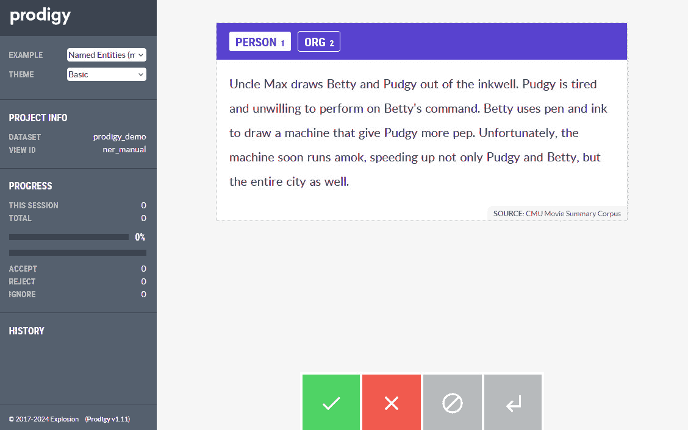

# 第八章：使用自己的数据训练 NER 组件

在本章中，你将学习如何使用自己的数据来训练 spaCy 的预训练模型。我们将通过训练一个**命名实体识别**（`NER`）管道来实现这一点，但你也可以将同样的知识应用到预处理和训练 spaCy 管道的任何 NLP 任务上。在本章中，我们将更多地关注如何收集和标注自己的数据，因为我们已经在*第六章*中看到了如何使用 spaCy 的`config.cfg`文件来训练模型。

本章的学习之旅包括如何最大限度地利用来自 Explosion 的标注工具`Prodigy`以及 spaCy 背后的团队。我们还将看到如何使用 Jupyter Notebook 标注 NER 数据。之后，我们将使用这些标注数据更新 spaCy 管道的 NER 组件。

本章将带你完成整个机器学习实践，包括收集数据、标注数据和训练信息提取模型。

到本章结束时，你将准备好在自己的数据上训练 spaCy 模型。你将具备收集数据、将数据预处理成 spaCy 可以识别的格式，以及最终使用这些数据训练 spaCy 模型的全套技能。我们将涵盖以下主要主题：

+   开始数据准备

+   标注和准备数据

+   训练 NER 管道组件

+   在同一管道中结合多个 NER 组件

# 技术要求

本章的代码可以在[`github.com/PacktPublishing/Mastering-spaCy-Second-Edition`](https://github.com/PacktPublishing/Mastering-spaCy-Second-Edition)找到。我们将使用`nertk`库通过 Jupyter 笔记本来标注 NER 数据。

# 开始数据准备

spaCy 开箱即用的模型在通用 NLP 方面非常成功，但有时我们必须处理需要定制训练的非常具体的领域。

训练模型需要时间和精力。在开始训练过程之前，你应该决定是否需要训练。为了确定你是否真的需要定制训练，一个很好的起点是问自己以下问题：

+   spaCy 模型在你的数据上表现足够好吗？

+   你的领域是否包含许多在 spaCy 模型中缺失的标签？

+   Hugging Face Hub 或其他地方已经有了预训练的模型/应用程序吗？（我们不想重新发明轮子。）

让我们在以下章节中详细讨论这两个问题。

## spaCy 模型在你的数据上表现足够好吗？

通常情况下，如果模型表现足够好（通常，准确率在 0.75 以上），那么你可以通过另一个 spaCy 组件来定制模型输出。例如，假设我们在导航领域工作，我们有以下这样的表述：

```py
navigate to my home
navigate to Oxford Street
```

让我们看看 spaCy 的 NER 模型为这些句子输出了哪些实体：

```py
import spacy
nlp = spacy.load("en_core_web_md")
doc1 = nlp("navigate to my home")
doc1.ents
 ()
doc2 = nlp("navigate to Oxford Street")
doc2.ents
 (Oxford Street,)
 doc2.ents[0].label_
'FAC'
spacy.explain("FAC")
'Buildings, airports, highways, bridges, etc.'
```

在这里，**家**根本不被识别为实体，但我们希望它被识别为地点实体。此外，spaCy 的 NER 模型将**牛津街**标记为`FAC`，意味着建筑/公路/机场/桥梁类型的实体，这并不是我们想要的。

我们希望这个实体被识别为`GPE`，即一个地点。在这里，我们可以进一步训练 NER 以识别街道名称为`GPE`，以及识别一些地点词汇（如工作、家和我的妈妈家）为`GPE`。

另一个例子是报纸领域。在这个领域，**人物**、**地点**、**日期**、**时间**和**组织**都是需要提取的目标实体，但你还需要一个额外的实体类型——**车辆**（汽车、公共汽车、飞机等）。因此，你不必从头开始训练，而是可以使用 spaCy 的`SpanRuler`（在第*第四章*中解释）添加一个新的实体类型。始终首先检查你的数据，并计算 spaCy 模型的成功率。如果成功率令人满意，那么可以使用其他 spaCy 组件进行定制。

## 你的领域是否包含许多在 spaCy 模型中不存在的标签？

例如，在先前的报纸示例中，只有**车辆**这个实体标签在 spaCy 的 NER 模型标签中缺失，但其他实体类型都被识别了。由于我们可以使用`SpanRuler`识别**车辆**实体，在这种情况下，你不需要定制训练。

再次考虑医疗领域。实体包括疾病、症状、药物、剂量、化合物名称等等。这是一份专业且长的实体列表。对于医疗领域，你需要进行定制模型训练。

如果我们需要定制模型训练，我们通常遵循以下步骤：

1.  收集我们的数据。

1.  标注我们的数据。

1.  决定更新现有模型或从头开始训练一个模型。

在数据收集步骤中，我们决定收集多少数据：1,000 个句子、5,000 个句子，或者更多。数据量取决于我们任务的复杂性和领域。通常，我们从可接受的数据量开始，第一次训练模型，看看它的表现；然后，我们可以添加更多数据并重新训练模型。

在收集完数据集后，你需要以这种方式标注你的数据，使得 spaCy 的训练代码能够识别它。在下一节中，我们将看到训练数据格式以及如何使用 Explosion 的 Prodigy 工具标注数据。

第三步是决定从头开始训练一个空白模型，还是对现有模型进行更新。在这里，一个经验法则是：如果你的实体/标签存在于现有模型中，但你没有看到非常好的性能，那么就用你自己的数据更新模型，例如在先前的**车辆**示例中。如果你的实体在当前的 spaCy 模型中根本不存在，那么你很可能需要进行定制训练。

我们将开始构建模型的旅程，第一步是准备我们的训练数据。让我们继续到下一节，看看如何准备和标注我们的训练数据。

## 标注和准备数据

训练模型的第一步始终是准备训练数据。你通常从客户日志中收集数据，然后通过将数据作为 CSV 文件或 JSON 文件导出，将它们转换为数据集。spaCy 模型训练代码与`DocBin`对象一起工作，因此在本章中，我们将标注数据并将其转换为`DocBin`对象。

收集我们的数据后，我们标注我们的数据。标注意味着标记意图、实体、POS 标签等。

这是一个标注数据的示例，取自 spaCy 的*在线评论中检测时尚品牌*教程（可在[`github.com/explosion/projects/tree/v3/tutorials/ner_fashion_brands`](https://github.com/explosion/projects/tree/v3/tutorials/ner_fashion_brands) 获取）：

```py
{
  "text": "Bonobos has some long sizes.",
  "tokens": [
    { "text": "Bonobos", "start": 0, "end": 7, "id": 0 },
    { "text": "has", "start": 8, "end": 11, "id": 1 },
    { "text": "some", "start": 12, "end": 16, "id": 2 },
    { "text": "long", "start": 17, "end": 21, "id": 3 },
    { "text": "sizes", "start": 22, "end": 27, "id": 4 },
    { "text": ".", "start": 27, "end": 28, "id": 5 }
  ],
  "spans": [
    {
      "start": 0,
      "end": 7,
      "token_start": 0,
      "token_end": 0,
      "label": "FASHION_BRAND"
    }
  ]
}
```

我们标注数据的目的是指向统计算法我们想要模型学习的内容。在这个例子中，我们希望模型学习关于实体；因此，我们提供带有标注实体的示例。

在本节中，我们还将看到 spaCy 的标注工具`Prodigy`，以及`nertk`，一个简单的开源 Python 库，用于使用 Jupyter Notebook 标注 NER 数据。Prodigy 专为快速项目的小团队量身定制。尽管它不是免费或开源的，但购买 Prodigy 有助于资助开源项目，包括 spaCy 本身的发展。

### 使用 Prodigy 标注数据

Prodigy 是一个由主动学习驱动的现代工具。我们将使用`Prodigy live demo`（[`demo.prodi.gy/`](https://demo.prodi.gy/)）来展示标注工具的工作方式。

让我们开始吧：

1.  我们导航到 Prodigy Live Demo，并查看 Prodigy 要标注的示例文本，如下截图所示：



图 8.1 – Prodigy 界面（从他们的 Prodigy 演示页面截取的截图）

这张截图，图 8.1，展示了我们想要标注的示例文本。截图底部的按钮展示了接受这个训练示例、拒绝它或忽略它的方法。如果文本相关且标注良好，我们就接受它，并将其加入我们的数据集。

1.  接下来，我们将标注实体。为此，首先，我们从顶部栏中选择一个实体类型。这个语料库包括两种类型的实体，`PERSON`和`ORG`。然后，我们将用光标选择我们想要标注为实体的单词，如下截图所示：


图 8.2 – 在 Prodigy 演示页面上标注 PERSON 实体

1.  在我们完成文本标注后，我们点击**接受**按钮。一旦会话结束，你可以将标注的数据导出为 JSON 文件。

Prodigy 的功能不仅包括命名实体识别（NER），还包括文本分类、计算机视觉、提示工程、大型语言模型等。

### 使用 nertk 标注数据

另一个标注工具是`nertk`，它是一个开源的 Python 库，用于 NER 文本标注（[`github.com/johnsmithm/nertk`](https://github.com/johnsmithm/nertk)）。该工具在 Jupyter Notebook 中在线工作，允许你快速轻松地与数据交互并进行标注。该项目目前处于 alpha 开发阶段，因此它仅适用于简单和快速的 NER 标注会话。

要使用`nertk`，你需要使用`pip install nertk`安装它，运行 Jupyter Notebook 服务器，并在网页浏览器中打开服务器的 URL。为了处理`nertk`的数据，你需要对文本进行分词并传递你想要标注的数据。让我们一步一步来做：

1.  首先，我们需要对数据进行分词，因为`nertk`与单词列表一起工作。我们这一章的数据集是葡萄牙语，所以我们导入`en`模型并仅选择`tokenizer`组件，因为这是我们唯一需要的：

    ```py
    import spacy
    nlp = spacy.load("en_core_web_sm", enable="tokenizer")
    ```

1.  我们将使用 spacy 的*在线评论中检测时尚品牌*教程的数据集。原始文本来自`r/MaleFashionAdvice`和`r/FemaleFashionAdvice`子版块。数据是`jsonl`格式，因此我们将使用`srsly`库来读取它。让我们打印第一个条目来看看数据的样子：

    ```py
    import srsly
    from pprint import pprint
    training_path = "data/fashion_brands_training.jsonl"
    for row in srsly.read_jsonl(training_path):
        pprint(row)
        break
    ```

    由于数据已经用 Prodigy 进行了标注，它具有`['text', 'meta', '_input_hash', '_task_hash', 'tokens', 'spans', '_session_id', '_view_id', 'answer']`键。为了了解如果没有实体我们会怎么做，让我们只使用`text`键，它包含 Reddit 评论的文本。

1.  下一步是对数据进行分词。我们需要创建一个列表，其中每个项目也是一个列表，但它是评论单词的列表。为此，我们将遍历数据，使用我们之前加载的模型对其进行分词，并将其添加到主列表中：

    ```py
    nertk_input_text = []
    for row in srsly.read_jsonl(training_path):
        comment = nlp(row["text"])
        comment_words = [token.text for token in comment]
        nertk_input_text.append(comment_words)
    ```

1.  现在，我们已经准备好开始使用`nertk`工具。我们需要将实体标签名称的列表和每个评论的单词列表传递给`Entator`类。然后，我们可以调用`run()`方法开始标注：

    ```py
    from nertk import Entator
    annotator = Entator(labels=['None', 'FASHION_BRAND'],
    inputs=nertk_input_text)
    annotator.run()
    ```

    我们将标注所有的`FASHION_BRAND`实体。*图 8.3* *.3*显示了`nertk`界面：


图 8.3 – nertk 界面

要选择属于`FASHION_BRAND`实体的标记，你只需点击它们。当你准备好示例后，你可以点击下一个按钮来标注另一个。标注的标记结果存储在`annotator.targets`属性中。

#### 将标注的数据转换为 DocBin 对象

要使用此注释数据来训练模型，我们需要将其转换为`DocBin`格式。为此，我们将为每个注释创建一个`Doc`对象，并添加我们已注释的实体。让我们创建执行此操作的代码：

1.  首件事是创建`DocBin`对象，并遍历每个注释以获取注释实体的索引：

    ```py
    from spacy.tokens import DocBin, Span
    from utils import create_consecutive_token_sequences
    db = DocBin()
    for idx, (row, nerkt_tokens, nertk_entities) in enumerate(
        zip(srsly.read_jsonl(training_path), nertk_input_text,
            annotator.targets)):
        if idx == 5:
            break
        doc = nlp(row["text"])
        indexes_entity_tokens = [index for index, x in enumerate(
            nertk_entities) if x == "FASHION_BRAND"]
    ```

1.  使用`nertk`，我们注释了每个标记，但实体可以包含多个标记。为了处理这种情况，我们使用一个辅助函数，该函数获取`indexes_entity_tokens`列表，并为每个实体的起始和结束标记的索引创建元组（此代码仍然位于主`for`循环内）：

    ```py
    span_indexes = create_consecutive_token_sequences(indexes_entity_tokens)
    ```

1.  现在，是时候为每个实体创建`Span`对象了。我们创建一个`ents`列表来存储这些跨度，将此列表设置为`doc.ents`参数，并将此`Doc`添加到`DocBin`对象中（此代码仍然位于主`for`循环内）：

    ```py
      ents = []
      label = "FASHION_BRAND"
      for start,end in span_indexes:
          span = Span(doc, start, end+1, label)
          ents.append(span)
      doc.ents = ents
      db.add(doc)
    ```

1.  最后，我们将`DocBin`文件保存到磁盘：

    ```py
    db.to_disk("data/nertk_training.spacy")
    ```

    这里是将`nertk`注释的实体转换为`DocBin`的完整代码：

    ```py
    from spacy.tokens import DocBin, Span
    from utils import create_consecutive_token_sequences
    db = DocBin()
    for idx, (row, nerkt_tokens, nertk_entities) in enumerate(
        zip(srsly.read_jsonl(training_path), nertk_input_text,
            annotator.targets)):
        if idx == 5:
            break
        doc = nlp(row["text"])
        indexes_entity_tokens = [index for index, x in enumerate(
            nertk_entities) if x == "FASHION_BRAND"]

        span_indexes = create_consecutive_token_sequences(
            indexes_entity_tokens)

        ents = []
        label = "FASHION_BRAND"
        for start, end in span_indexes:
            span = Span(doc, start, end + 1, label)
            ents.append(span)

        doc.ents = ents
        db.add(doc)
    db.to_disk("data/nertk_training.spacy")
    ```

这是创建用于微调 spaCy 组件的`ner`的训练数据的流程。要为任何其他可训练组件创建训练数据，流程是相同的。你创建`Doc`对象，使用适当的格式设置注释，然后将这些 Docs 保存为`DocBin`对象。你可以在这里检查所有数据格式：[`spacy.io/api/data-formats#dict-input`](https://spacy.io/api/data-formats#dict-input)。

在训练数据集之后，下一步是训练`ner`组件。让我们在下一节中完成这项工作。

# 训练 NER 管道组件

我们的目标是创建一个用于识别`FASHION_BRAND`实体的管道。我们将通过训练`EntityRecognizer`管道组件来实现这一点。它使用基于转换的算法，该算法假设关于接近初始标记的实体的最关键信息。

训练组件的第一件事是创建`config`文件。我们将使用`spacy init config` CLI 命令来完成此操作：

```py
python3 –m spacy init config cpu_config.cfg --lang "en" --pipeline "ner" --optimize "efficiency"
```

这将创建包含所有默认配置的`cpu_config.cfg`文件，并将`ner`组件设置为针对**效率**（更快推理、更小的模型和更低的内存消耗）进行训练优化。我们将使用 spaCy 教程中的`preprocess.py`脚本来将`jsonl`数据转换为`DocBin`对象：

```py
python3 ./scripts/preprocess.py ./data/fashion_brands_training.jsonl ./data/fashion_brands_training.spacy
python3 ./scripts/preprocess.py ./data/fashion_brands_eval.jsonl ./data/fashion_brands_eval.spacy
```

现在，我们准备好使用`spacy train` CLI 命令来训练模型：

```py
python3 -m spacy train cpu_config.cfg --output training_cpu/ --paths.train ./data/fashion_brands_training.spacy --paths.dev ./data/fashion_brands_eval.spacy
```

`output`参数指定了存储训练管道的目录。在*图 8* *.4*中，我们可以看到训练过程中产生的消息。


图 8.4 – ner 组件训练过程中产生的消息

我们可以看到，在训练过程中，有一个`tok2vec`组件和`ner`组件的训练损失。这是因为`ner`组件默认使用`spacy.TransitionBasedParser.v2`模型架构。正如 spaCy 文档所说（[`spacy.io/api/architectures#TransitionBasedParser`](https://spacy.io/api/architectures#TransitionBasedParser)），模型由两个或三个子网络组成。`tok2vec`组件将每个标记转换为一个向量，每次批量运行一次。`Lower`为每个批次的**（标记，特征）**对生成一个向量，结合特征并应用非线性以形成状态表示。`Upper`是一个可选的前馈网络，它从状态表示中推导出分数。如果省略，则直接使用底层模型的输出作为动作分数。总之，`tok2vec`组件负责将标记映射到向量表示。

## 评估 NER 组件的精度

我们可以使用`spacy evaluate` CLI 命令来评估管道的精度。该命令期望一个可加载的 spaCy 管道和`DocBin`格式的评估数据。我们没有测试数据集，所以我们将使用`fashion_brands_eval.spacy`数据集只是为了看看命令是如何工作的。由于数据集也被用来决定何时停止模型训练，所以结果会被高估。这被称为**数据泄露**。然而，在这里，我们是为了学习目的而训练模型，所以我们没问题。让我们运行命令并检查结果：

```py
python3 -m spacy evaluate training_cpu/model-best ./data/fashion_brands_eval.spacy --output training_cpu/metrics.json
```

命令会显示输出并将指标保存到`training_cpu/metrics.json`文件中。*图 8.5*显示了结果：


图 8.5 – ner 模型的精度

精度得分为`76.88`，召回率为`55.88`。这是一个在 CPU 上训练的模型；如果我们用 GPU 训练它并使用 transformers 会怎样呢？spaCy 使尝试这一点变得简单；我们只需要创建一个新的`config.cfg`文件，然后再次运行`spacy train`命令。让我们在下一节中这样做。

## 训练一个针对精度优化的 NER 组件

训练一个针对精度优化且在 GPU 上运行的组件需要您安装`spacy-transformers`库。之后，我们可以创建新的配置文件，如下所示：

```py
python3 -m spacy init config gpu_config.cfg -l "en" -p "ner" --optimize "accuracy" --gpu
```

然后，我们可以再次训练模型，这次指向这个`gpu_config.cfg`文件：

```py
python3 -m spacy train gpu_config.cfg --output training_gpu/ --paths.train ./data/fashion_brands_training.spacy --paths.dev ./data/fashion_brands_eval.spacy --gpu-id 0
```

我的机器有一个 GPU，所以我使用**–gpu-id 1**参数来设置它。当我们为了精度而训练时，通常模型的表现会更好，但我们也可能得到一个更大、更慢的模型。*图 8.6*显示了训练过程中产生的消息：


图 8.6 – 训练 NER 组件以实现精度时产生的消息

这种架构使用了一个 transformer Model 组件而不是`tok2vec`组件。我们可以看到，在每个评估点，这个管道的分数都更高，始终高于`0.78`。让我们再次运行评估来比较模型：

```py
python3 -m spacy evaluate training_gpu/model-best ./data/fashion_brands_eval.spacy --output training_gpu/metrics.json --gpu-id 0
```

命令显示输出并将指标保存到`training_gpu/metrics.json`文件。*图 8.7*显示了结果：


图 8.7 – 为准确性训练的 ner 模型的准确性

准确率为`88.79`，召回率为`79.83`。如果我们将其与为效率训练的模型的`76.88`和`55.88`结果进行比较，这是一个显著的增加。我们可以通过将训练期间创建的目录传递给`nlp.load()`方法来加载模型以供使用。让我们获取句子`Givenchy is looking at buying U.K. startup for $** **1 billion` 的实体：

1.  首先，我们加载库和管道：

    ```py
    import spacy
    from spacy import displacy
    nlp = spacy.load('training_gpu/model-best')
    ```

1.  现在，我们可以将管道应用于文本：

    ```py
    sentence = "Givenchy is looking at buying U.K. startup for $1 billion"
    doc = nlp(sentence)
    displacy.render(doc, style="ent", jupyter=True)
    ```

    结果显示在*图 8.8*；管道能够找到`Givenchy`实体：


图 8.8 – 使用为准确性训练的 ner 管道提取的实体

该组件只能识别`FASHION_BRAND`实体，这是我们唯一为其训练的实体。但 spaCy 提供的`en_core_web_sm`模型可以识别更多实体。让我们来看看：

1.  加载库和模型：

    ```py
    import spacy
    from spacy import displacy
    nlp = spacy.load('en_core_web_sm')
    ```

1.  将管道应用于文本：

    ```py
    sentence = "Givenchy is looking at buying U.K. startup for $1 billion"
    doc = nlp(sentence)
    displacy.render(doc, style="ent", jupyter=True)
    ```

    结果显示在*图 8.9*；管道能够找到`GPE`和`MONEY`实体：


图 8.9 – 使用 en_core_web_sm 管道提取的实体

如果我们想要提取我们训练过的实体以及`en_core_web_sm` NER 组件训练过的实体呢？我们可以通过在同一个管道中结合多个 NER 组件来实现这一点。

# 在同一个管道中结合多个 NER 组件

当 spaCy 加载一个管道时，它会遍历管道名称，并在`[components]`块中查找每个组件名称。组件可以通过`factory`或`source`来构建。`Factories`是命名函数，接受设置并返回一个管道组件函数，而`source`用于引用一个训练管道的路径名称，以便从中复制组件。

要使用我们训练过的 NER 组件以及`en_core_web_sm`的 NER 组件，我们将创建一个新的`config.cfg`文件，并在管道中引用 NER 组件。使用这个`config.cfg`文件设置后，我们将使用`spacy assemble`命令来组装配置，而无需额外的训练。为了能够使用`spacy assemble`引用训练过的 NER 组件，我们将为管道创建一个包，并使用`pip install`安装它。

## 为训练的管道创建包

**spacy 包** CLI 命令从现有的管道目录生成一个可安装的 Python 包。spaCy 创建了一个可以与`pip install`一起安装的构建工件。如果您想在生产环境中部署您的管道或与他人共享，这很有用。

我们将提供包含管道数据的目录路径，创建包文件夹的目录路径以及包名称。这是完整的命令：

```py
python3 -m spacy package training_gpu/model-best ./ --name "ner_fashion_brands"
```

命令创建了一个名为`en_ner_fashion_brands-0.0.0`的文件夹。我们现在可以安装这个包并在 Python 中加载它：

1.  安装包：

    ```py
    python3 -m pip install en_ner_fashion_brands-0.0.0/
    ```

1.  导入包，加载管道，并将其应用于文本：

    ```py
    import en_ner_fashion_brands
    from spacy import displacy
    nlp = en_ner_fashion_brands.load()
    sentence = "Givenchy is looking at buying U.K. startup for $1 billion"
    doc = nlp(sentence)
    displacy.render(doc, style="ent", jupyter=True)
    ```

它的工作方式就像从其目录中加载管道一样。现在，我们可以在新的`config`文件中指向这个管道的 NER 组件，以创建一个使用此 NER 组件和`en_core_web_sm` NER 组件的管道。

## 创建具有不同 NER 组件的管道

`spacy assemble` CLI 命令从`config`文件组装管道，无需额外训练。就这么简单。这个`config`文件更简单，因为它仅用于构建管道，而不是用于训练。让我们创建`combined_ner.cfg`文件：

1.  首先，我们定义`nlp`对象。我们将指定管道语言 ISO 代码和管道组件的名称顺序。我们将在`[components]`部分指定如何加载它们，这样我们就可以按我们的意愿命名它们：

    ```py
    [nlp]
    lang = "en"
    pipeline = ["ner_fashion_brands","ner"]
    ```

1.  由于我们想要从现有管道中复制组件，我们将设置每个组件的`source`参数。参数值可以是可加载的 spaCy 管道包或路径。定义后，我们设置`component`参数，这是`source`管道中组件的名称。让我们首先定义如何加载`en_core_web_sm`管道的`ner`组件：

    ```py
    [components]
    [components.ner]
    source = "en_core_web_sm"
    component = "ner"
    ```

1.  现在，为了加载我们训练来识别时尚品牌的`ner`组件，我们还需要使用`replace_listeners`参数包括`source`管道的`tok2vec`监听器的副本，如下所示：

    ```py
    [components.ner_fashion_brands]
    source = "en_ner_fashion_brands"
    component = "ner"
    replace_listeners = ["model.tok2vec"]
    ```

现在，我们有一个用于组装最终管道的`config`文件。我们将在下一步做这件事。

### 从配置文件组装管道

要组装管道，我们将提供我们创建的`combined_ner.cfg`文件和存储最终管道的输出目录：

```py
python3 -m spacy assemble combined_ner.cfg pipelines/fashion_ner_with_base_entities
```

如果一切正常工作，我们现在可以加载这个管道，它将识别出两个`ner`组件的所有实体。让我们看看这是否是情况：

1.  让我们先加载我们组装的管道：

    ```py
    import spacy
    from spacy import displacy
    nlp = spacy.load("pipelines/fashion_ner_with_base_entities")
    ```

1.  现在，让我们处理文本并使用`displacy`显示实体：

    ```py
    sentence = "Givenchy is looking at buying U.K. startup for $1 billion"
    doc = nlp(sentence)
    displacy.render(doc, style="ent", jupyter=True)
    ```

    我们可以在*图 8.10*中看到结果：


图 8.10 – 使用组装的管道识别的实体 #TODO：获取新的截图

真是 neat，对吧？我们可以组合我们需要的任意数量的`ner`组件。

# 摘要

在本章中，我们探讨了如何使用我们自己的领域和数据来训练 spaCy NER 组件。首先，我们学习了决定我们是否真的需要自定义模型训练的关键点。然后，我们了解了模型训练的一个关键部分——数据收集和标注。

我们了解了两种标注工具——Prodigy 和 `nertk`——并学习了如何将数据转换为训练格式，以及如何使用 spaCy 的 CLI 来训练组件。接着，我们使用 spaCy CLI 命令来训练组件并创建用于管道的 Python 包。

最后，我们学习了如何将不同的 NER 组件组合成一个单一的管道。在下一章中，我们将学习如何使用 spaCy 和 Weasel 管理和共享针对不同用例和领域的端到端工作流程。
