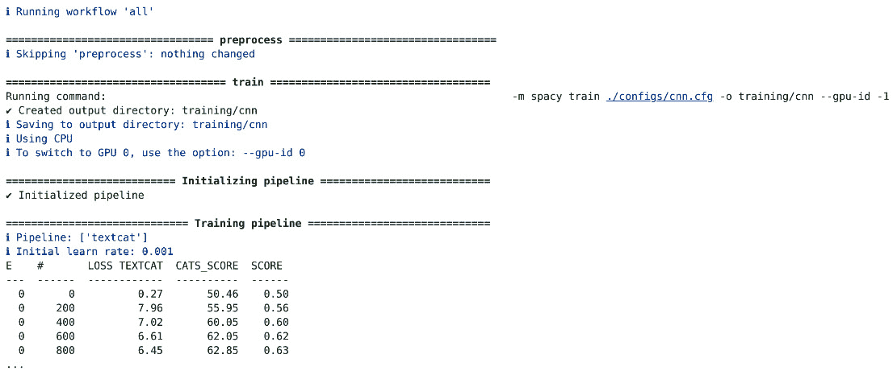

# 第九章：使用 Weasel 创建端到端 spaCy 工作流程

在本章中，我们将探讨如何使用 spaCy 及其配套工具`Weasel`创建端到端 NLP 工作流程。最初是 spaCy 的一部分，Weasel 现在已成为一个独立的库，这意味着您也可以将其用于不是用 spaCy 创建的其他项目。

**数据版本控制**（`DVC`）提供了一套针对数据/模型版本控制和实验跟踪的解决方案，增强了协作和实验管理。通过将 Weasel 与 DVC 集成，我们确保我们的项目能够高效地进行版本控制和跟踪，提高组织和可靠性。

在本章中，我们将首先使用 Weasel 克隆和运行项目模板，遵循最佳软件工程实践以确保可重复和结构良好的工作流程。然后我们将为此模板适应不同的用例，最后我们将探讨如何使用 DVC 跟踪和管理训练好的模型，从而实现高效的协作。这种方法将使我们能够创建健壮的 NLP 管道，为生产和工作团队做好准备。

我们将涵盖以下主要主题：

+   使用 Weasel 克隆和运行项目模板

+   为不同用例修改项目模板

+   使用 DVC Studio 模型注册管理模型

# 技术要求

在本章中，我们将使用 spaCy、Weasel 和 DVC 库。本章代码可以在[`github.com/PacktPublishing/Mastering-spaCy-Second-Edition`](https://github.com/PacktPublishing/Mastering-spaCy-Second-Edition)找到。

# 使用 Weasel 克隆和运行项目模板

`spacy weasel clone`命令从 Git 仓库克隆一个项目模板。默认情况下，它使用 spaCy 的项目模板仓库（[`github.com/explosion/projects`](https://github.com/explosion/projects)），但您可以使用`--repo`选项提供您有权访问的任何其他仓库（公开或私有）。

在本章中，我们将使用**Reddit 帖子情感分类**（也称为**文本分类**）项目作为我们的项目模板。让我们继续并克隆项目：

```py
python3 -m weasel clone tutorials/textcat_goemotions
```

此命令在当前目录中创建一个`textcat_goemotions`文件夹。`project.yml`文件定义了与项目相关的所有内容。这包括资产和自定义命令。`project.yml`文件的主要部分如下：

+   `title`：没错，这定义了项目的标题。

+   `description`：可选的项目描述。

+   `vars`：一个包含路径、URL 和脚本的变量字典，可以通过 CLI 进行覆盖。

+   `env`：一个将变量映射到环境名称的字典，允许项目脚本使用环境变量中的值，例如`${env.name}`。

+   `directories`：要在项目中创建的目录列表，如果不存在，则由 spaCy 自动生成。

+   **资产**：要获取的资产列表，每个资产由一个 URL 或本地路径、项目内的目标位置以及可选的校验和定义。您还可以通过指定`repo`、`branch`和`path`来指定 Git 仓库，直接从 Git 下载资产。

+   **命令**：命令指定了如何运行项目步骤。它通常指定如何运行 Python 脚本。每个命令都使用`script`、`deps`和`outputs`指定。`deps`定义了命令所依赖的文件，而`outputs`定义了命令生成的文件。这允许 spaCy 确定何时重新运行命令，如果依赖项已更改。

+   **工作流程**：工作流程定义了一个应该按顺序执行的命令列表。

现在我们已经克隆了模板，下一步是获取资产。`spacy weasel assets`命令下载`project.yml`中`assets`部分定义的所有资产。让我们下载这些资产：

```py
cd ./textcat_goemotions
python3 -m weasel assets
```

这个项目有四个资产：一个包含训练类别的文件和三个数据文件，一个用于训练，一个用于开发，一个用于测试。数据是`.tsv`格式，因此我们需要将其转换为`.spacy`二进制格式。`scripts/convert_corpus.py`脚本执行这个操作。`project.yml`文件中有一个名为`preprocess`的命令，我们可以使用它来运行这个脚本。让我们看看这个命令是如何定义的：

```py
commands:
  - name: preprocess
    help: "Convert the corpus to spaCy's format"
    script:
      - "python scripts/convert_corpus.py"
    deps:
      - "assets/train.tsv"
      - "assets/dev.tsv"
      - "assets/test.tsv"
      - "assets/categories.txt"
    outputs:
      - "corpus/train.spacy"
      - "corpus/dev.spacy"
      - "corpus/test.spacy"
```

命令指定了`deps`键中的资产（因为我们需要它们来运行代码）以及代码生成的输出。要运行此命令，我们可以使用`spacy project run`和命令名称，例如：`spacy project run preprocess`。此命令在`corpus`文件夹内创建`train.spacy`、`dev.spacy`和`test.spacy`。

`all`工作流程按顺序调用`preprocess`、`train`、`evaluate`和`package`命令。这样很有用，因为我们不需要手动调用每个命令。让我们尝试运行这个工作流程：

```py
python3 -m weasel run all
```

*图 9* *.1*显示了命令输出。Weasel 验证了`preprocess`命令的`deps`没有更改，因此跳过了这一步。



图 9.1 – 运行所有工作流程后的输出

`visualize`命令使用`Streamlit`和`spacy-streamlit`来提供用于与模型交互的 Web 应用程序。我们可以使用`weasel run visualize`运行此命令。*图 9* *.2*显示了 Web 应用程序界面。我们将在*第十一章*中学习如何使用 spaCy 与 Streamlit 一起使用。


图 9.2 – 与模型交互的 Streamlit 界面

所有这些，我们已经成功使用项目模板来重新创建这个文本分类流程。如果我们有另一个数据集并且需要执行这些相同的项目步骤怎么办？我们可以简单地重用模板并调整以满足我们的需求。让我们在下一节中学习如何做到这一点。

# 修改项目模板以适应不同的用例

要为不同的用例重用项目模板，我们首先会克隆项目，指定一个不同的`dest`文件夹。让我们这样做：

```py
cd ..
python3 -m weasel clone tutorials/textcat_goemotions textcat_github_issues
```

这将创建一个`textcat_github_issues`文件夹。新的用例使用来自`Prodigy`的标注数据，我们应该预测 GitHub 问题标题是否关于文档。原始项目在此处可用：[`github.com/explosion/projects/tree/v3/tutorials/textcat_docs_issues`](https://github.com/explosion/projects/tree/v3/tutorials/textcat_docs_issues)。本节的目标是学习如何重用项目模板，因此我们将修改`textcat_goemotions`项目以适应这个领域。

首先，我们应该使用这个新 GitHub 问题项目的信息更新`title`、`description`和`vars`。GitHub 问题的资产以`.jsonl`格式存在，因此我们需要修改命令以将数据转换为`.spacy`格式。我们有三个文件：`train.jsonl`、`dev.jsonl`和`eval.jsonl`。让我们首先修改`project.yml`中的 assets 键，使其指向这些文件：

```py
assets:
  - dest: "assets/train.jsonl"
    url: "https://raw.githubusercontent.com/PacktPublishing/Mastering-spaCy-Second-Edition/refs/heads/main/chapter_09/data/train.jsonl"
    description: "JSONL-formatted training data exported from Prodigy, annotated with `DOCUMENTATION` (661 examples)"
  - dest: "assets/dev.jsonl"
    url: "https://raw.githubusercontent.com/PacktPublishing/Mastering-spaCy-Second-Edition/refs/heads/main/chapter_09/data/dev.jsonl"
    description: "JSONL-formatted development data exported from Prodigy, annotated with `DOCUMENTATION` (500 examples)"
  - dest: "assets/test.jsonl"
    url: "https://raw.githubusercontent.com/PacktPublishing/Mastering-spaCy-Second-Edition/refs/heads/main/chapter_09/data/eval.jsonl"
    description: "JSONL-formatted test data generated with GPT-3.5 (300 examples)"
```

现在，我们可以使用`assets`命令下载资产：

```py
cd textcat_github_issues
python3 -m weasel assets
```

让我们看看训练数据的一个片段：

```py
{"text":"add please","cats":{"DOCUMENTATION":0.0,"OTHER":1.0}}
{"text":"Examples, failed to load qml","cats":{"DOCUMENTATION":0.0,"OTHER":1.0}}
{"text":"DMCHMM","cats":{"DOCUMENTATION":0.0,"OTHER":1.0}}
{"text":"Moving from MySQL to Hybrid SQL","cats":{"DOCUMENTATION":0.0,"OTHER":1.0}}
```

这种格式与`textcat_goemotions`不同，因此我们需要创建一个不同的`convert_corpus.py`脚本。我们将使用`srsly`（一个捆绑了一些最好的 Python 序列化库的包）来读取`.jsonl`数据，并使用`typer`（一个用于构建 CLI 应用程序的库）来指定脚本的参数。让我们编写一个脚本来完成这个任务：

1.  首先，我们导入库并定义目录的变量：

    ```py
    import srsly
    import typer
    import spacy
    from spacy.tokens import DocBin
    from pathlib import Path
    ASSETS_DIR = Path(__file__).parent.parent / "assets"
    CORPUS_DIR = Path(__file__).parent.parent / "corpus"
    ```

1.  要运行脚本，我们应该指定读取资产的目录、保存语料的目录以及我们将用于创建`Doc`对象的模型的语言。使用`typer`，我们可以通过创建一个具有这些参数的函数来完成此操作：

    ```py
    def main(assets_dir: Path=ASSETS_DIR, 
             corpus_dir: Path=CORPUS_DIR, lang: str="en"):
    ```

1.  脚本应该转换所有的`train.jsonl`、`dev.json`和`eval.jsonl`文件，因此我们需要遍历`assets_dir`中的每个文件，如果它是一个`.jsonl`文件，我们将创建一个`DocBin`对象：

    ```py
    nlp = spacy.blank(lang)
    for jsonl_file in assets_dir.iterdir():
        if not jsonl_file.parts[-1].endswith(".jsonl"):
            continue
        db = DocBin()
    ```

1.  对于每个`jsonl_file`，我们将构建`Doc`对象，设置`cats`参数，并将其添加到`DocBin`对象中。最后，我们将此`DocBin`对象保存到磁盘：

    ```py
    for line in srsly.read_jsonl(jsonl_file):
        doc = nlp.make_doc(line["text"])
        doc.cats = line["cats"]
        db.add(doc)
    out_file = corpus_dir / jsonl_file.with_suffix(
        ".spacy").parts[-1]
    db.to_disk(out_file)
    ```

1.  最后一步是将此脚本与 Typer 绑定。我们通过`typer.run(main)`来完成：

    ```py
    if __name__ == "__main__":
        typer.run(main)
    ```

1.  现在，我们可以保存这个新的`convert_corpus.py`脚本并运行以下命令：

    ```py
    python3 -m weasel run preprocess
    ```

    *图 9* *.3*显示了此命令的输出。


图 9.3 – 运行 preprocess 命令后的 Weasel 输出

Weasel 表示我们缺少`assets/train.tsv`依赖项。这是因为我们没有更新`preprocess`命令的`deps`和`outputs`以适应这个新用例。让我们现在做这件事：

```py
  - name: preprocess
    help: "Convert the corpus to spaCy's format"
    script:
      - "python scripts/convert_corpus.py"
    deps:
      - "assets/train.jsonl"
      - "assets/dev.jsonl"
      - "assets/test.jsonl"
    outputs_no_cache:
      - "corpus/train.spacy"
      - "corpus/dev.spacy"
      - "corpus/test.spacy"
```

1.  现在您可以保存这些更改并再次尝试运行`preprocess`命令。该脚本在`/corpus`目录中创建`.spacy`文件。好的，让我们也更新`evaluate`命令的依赖项并运行`all`工作流程来训练、评估并为这个 GitHub 问题项目创建一个包：

    ```py
    python3 -m weasel run all
    ```

    *图 9* *.4* 显示了此管道的评估结果。


图 9.4 – 评估结果

我们能否使用 BERT 获得更好的结果？让我们在`project.yml`的`vars`部分中更改这一点：

```py
vars:
  name: "textcat_github_issues"
  version: "0.0.1"
  # Choose your GPU here
  gpu_id: 0
  # Change this to "bert" to use the transformer-based model
  config: "bert"
```

我在`configs/bert.cfg`文件上定义的批处理配置运行训练时遇到了麻烦，所以让我们将其更改为`spacy.batch_by_padded.v1`：

```py
[training.batcher]
@batchers = "spacy.batch_by_padded.v1"
discard_oversize = true
size = 2000
buffer = 256
get_length = null
```

现在我们可以再次运行工作流程：

```py
python3 -m weasel run all
```

*图 9* *.5* 显示了此模型的评估结果，其性能优于第一个。


图 9.5 – 使用 BERT 的结果

现在我们有了训练好的模型，我们可以使用 Weasel 将它们上传到远程存储。让我们在下一节中这样做。

## 上传和下载项目输出到远程存储

您可以使用`spacy project push`命令将项目输出存储在远程存储中，这样您就可以共享管道包、与团队协作或缓存结果以避免重复任务。`spacy project pull`命令从远程存储检索任何缺失的输出。远程存储在`project.yml`的`remotes`部分中指定。要配置远程存储，您可以在`project.yml`文件的`remotes`部分中列出一个或多个目的地，将字符串名称映射到存储 URL。spaCy 使用`cloudpathlib`与远程存储通信，允许使用`cloudpathlib`支持的任何协议，包括 S3、Google Cloud Storage、Azure Blob Storage 和本地文件系统。

`push`命令将命令中`outputs`部分列出的所有文件或目录上传到远程存储。上传前，输出会被归档和压缩。Weasel 使用命令字符串和依赖项的哈希以及文件内容的哈希。这意味着`push`永远不会覆盖远程存储中的文件。如果所有哈希匹配，内容相同，则不会发生任何操作。如果内容不同，则上传新版本的文件。

`pull`命令下载命令中列出的所有文件或目录，除非它们已经存在于本地。在远程存储中搜索文件时，`pull`将考虑输出路径、命令字符串和依赖项哈希。

我们为 GitHub 问题用例训练了两个模型。如果我们处于生产环境中，我们需要管理这些训练好的模型。最直接的应用场景是在生产环境中在这两个模型之间切换。DVC 是一个库，它帮助我们通过管道连接到版本化的数据源和代码，跟踪实验，并注册模型。Weasel 受到了 DVC 的启发，我们可以使用`spacy weasel dvc`命令来自动生成一个 DVC 配置文件。有了这个文件，我们可以像管理其他 DVC 项目一样管理 spaCy 项目。在下一节中，我们将使用 DVC Studio 模型注册表来编目我们的**机器学习**（`ML`）模型，并在生产环境中管理它们。

# 使用 DVC 模型注册表管理模型

DVC 是一个开源的命令行工具，帮助我们开发可重复的机器学习项目。Weasel 本身受到了 DVC 的启发（[`x.com/honnibal/status/1316792615996592133`](https://x.com/honnibal/status/1316792615996592133)）。它包含版本化数据和模型、跟踪实验、比较数据和共享实验的工具。在本节中，我们将使用 DVC Studio 中的模型注册表，这是一个网络应用程序，它使团队能够运行和跟踪实验，并管理模型的生命周期。

在底层，DVC Studio 使用一个名为`Git Tag Ops`（`GTO`）的命令行来进行模型注册操作。要使用 DVC，了解更多的`GitOps`很有用。让我们在下一节中这样做。

## 什么是 GitOps？

`GitOps`是一组强调使用 Git 版本控制系统作为声明性基础设施和应用程序的真相来源的实践。它借鉴了 DevOps 和基础设施即代码实践的思想。*GitOps WG*（[`opengitops.dev/`](https://opengitops.dev/)）定义了四个 GitOps 原则（v1.0.0）：

+   **声明式**：在 GitOps 管理的系统中，所需状态必须以声明性方式定义

+   **版本化和不可变**：所需状态以强制不可变和版本化的方式存储，并保留完整的版本历史

+   **自动拉取**：软件代理自动从源拉取所需状态声明

+   **持续协调**：软件代理持续监控系统，并努力使其与所需状态保持一致

让我们更深入地探讨以下列表中的每个原则：

+   **原则 1 – 声明式**：在实践中，这意味着你的基础设施和应用程序的所有配置和设置都描述在声明性格式中，例如 YAML 或 JSON 文件。而不是编写执行一系列步骤以达到所需状态的脚本，你定义最终状态应该是什么样子。这也是`Weasel`对`project.yml`文件的原则——它确保我们没有隐藏的默认值。配置文件充当了如何配置你的系统的蓝图。

+   **原则 2 – 版本化和不可变**：这一原则强调所有配置文件（声明性描述）应存储在 Git 仓库中。Git 本身支持版本控制，允许您跟踪随时间的变化。不可变性意味着一旦定义并提交了特定状态，就不应对其进行更改。如果需要更改，应创建一个新的版本。这种做法确保您有配置所做每个更改的完整历史记录，使得理解代码和基础设施的演变以及必要时回滚到先前状态变得更容易。例如，如果新的配置破坏了您的应用程序，您可以使用 Git 的版本历史快速回滚到最后已知的好配置。

+   **原则 3 – 自动拉取**：在 GitOps 设置中，当检测到新的提交时，GitOps 代理应自动拉取更新的配置文件并将更改应用到基础设施或应用程序。这种自动化确保了 Git 仓库中进行的任何更新都能及时反映在实际运行环境中，无需人工干预。

+   **原则 4 – 持续协调**：GitOps 代理应持续比较您基础设施和应用程序的实际状态与 Git 仓库中定义的期望状态。如果两者之间存在差异，代理将尝试通过进行必要的调整来使实际状态与期望状态一致。这种持续协调确保您的系统始终与 Git 中的配置保持一致。这一原则确保了一致性和可靠性，防止了 Git 中声明的内容与您环境中实际运行的内容之间的偏差。

让我们继续讨论 DVC，接下来将解决常见的数据科学和机器学习挑战。

## DVC 如何解决常见的数据科学和机器学习挑战

数据科学和机器学习项目经常面临可以使用 DVC 和 GitOps 原则有效解决的问题。以下是一些常见挑战以及这些工具和原则如何帮助解决它们：

+   **困难的数据共享和协作**：在团队成员之间共享数据集、模型和实验可能很复杂，尤其是在处理大文件或多个版本时，会导致重复工作和错误。使用 DVC，我们可以使用远程存储来跟踪数据集和模型，就像我们使用 Git 跟踪代码一样。这允许团队成员拉取和推送资产，以确保每个人都在使用相同的状态。

+   **管道不可靠或不可重复**：我们通常在 Jupyter 笔记本中开始我们的项目实验。这对于数据分析和原型设计是完全可行的，但当项目增长（我们希望如此）时，结构和自动化变得有益。结构化管道的一些要求包括将代码单元作为`.py`模块，并在专用文件中管理配置（以跟踪参数、文件路径等）。DVC（和 Weasel）为我们完美地创建了一个结构，以便我们可以创建这些可重用的管道。

+   **模型指标跟踪**：保留模型性能指标的历史记录对于理解模型随时间演化和有效性至关重要。DVC 允许存储和版本控制性能指标，与模型一起，便于比较不同版本和分析改进。通过 GitOps，这些指标可以集成到 CI/CD 管道中，确保在部署之前，新模型版本始终与旧版本进行验证。

通过使用 DVC 和 GitOps 原则解决这些挑战，数据科学和机器学习团队可以实现更可靠、可重复和可扩展的工作流程。实施 GitOps 原则的好处包括以下内容：

+   提高开发人员和运营效率

+   提高开发者体验

+   提高稳定性

+   一致性和标准化

DVC 与 GitOps 实践无缝集成，因此通过使用此工具，我们可以获得所有这些好处。既然我们已经了解了 GitOps 是什么以及它所解决的挑战，那么我们就继续将我们的 Weasel 项目转换为 DVC，并将我们的模型添加到模型注册表中，以便我们可以共享它们。

## 从 Weasel 到 DVC

第一步是安装 DVC。DVC 是一个 Python 库，因此我们可以使用`pip`或`conda`进行安装：

```py
python3 -m pip install dvc dvc_gdrive
```

现在，在项目目录内，我们可以运行`dvc init`来初始化一个 DVC 项目。在这个目录中必须初始化一个 Git 仓库。让我们初始化项目：

```py
python3 -m dvc init
git commit -m "First commit"
```

`dvc init`命令创建三个文件：`.dvc/config`，`.dvc/.gitignore`，和`.dvcignore`。DVC 提供了对外部存储位置的访问，使我们能够管理和共享我们的数据和机器学习模型。它支持云提供商，如 Amazon S3、Microsoft Azure Blob Storage 和 Google Cloud Storage，以及自托管/本地选项，如 SSH 和 HDFS。在本章中，我们将使用 Google Drive 作为远程存储。为此，我们需要 Google Drive 文件夹的文件夹 ID。`dvc remote add`命令将远程配置添加到`.dvc/config`文件。让我们来做这件事：

```py
python3 -m dvc remote add --default myremote gdrive:///path/to/folder
python3 -m dvc remote modify myremote gdrive_acknowledge_abuse true
```

`gdrive_acknowledge_abuse`标志允许下载被标记为可能具有滥用行为的文件，例如包含恶意软件或个人信息，但只有当此参数启用时，文件的所有者才能下载。现在，当我们运行`dvc pull`或`dvc push`以使用 Google Drive 作为远程存储来存储或检索模型工件时，浏览器将打开一个新窗口进行身份验证。

一旦配置了 DVC，`spacy project dvc` 命令会自动从你的 `project.yml` 文件中生成一个 `dvc.yaml` 文件。这让你可以使用在 `project.yml` 中定义的工作流程来管理你的 spaCy 项目，因此在本章中，我们只是将要使用模型注册功能，让我们继续看看下一节如何操作。

### 创建一个将模型添加到模型注册表的命令

要将模型添加到模型注册表，我们需要安装 `DVCLive` Python 包。DVCLive 是一个用于记录机器学习指标和其他元数据的 Python 库：

1.  让我们安装它：

    ```py
    python3 -m pip install dvclive
    ```

1.  现在，让我们回顾一下我们的 `project.yml` Weasel 文件。我们在那里定义了 `all` 工作流程，并包含以下命令：

    ```py
      all:
        - preprocess
        - train
        - evaluate
        - package
    ```

1.  我们将要创建三个新的命令，一个用于使用 DVC 跟踪模型，一个用于将模型推送到远程存储，还有一个用于将模型添加到模型注册表中。

1.  将模型推送到远程存储，首先我们需要使用 DVC 来跟踪它。我们通过 `dvc add` 命令来完成这个操作。让我们在 `project.yml` 文件中创建这个命令：

    ```py
      - name: track_model
        help: Track model artifact with DVC
        script:
          - "dvc add packages/${vars.language}_${vars.name}-${vars.version}/dist/${vars.language}_${vars.name}-${vars.version}.tar.gz"
        deps:
          - "packages/${vars.language}_${vars.name}-${vars.version}/dist/${vars.language}_${vars.name}-${vars.version}.tar.gz"
    ```

1.  现在，让我们使用 Weasel 运行这个命令：

    ```py
    python3 -m weasel run track_model
    ```

注意

你应该从 Weasel 创建的根 `.gitignore` 文件中删除 `packages` 文件夹，以便将模型包添加到 DVC（DVC 将在 `model` 文件夹内创建一个新的 `.gitignore` 文件）。

`dvc add` 命令为该工件创建一个 `.dvc` 文件，然后使用 Git 来跟踪这个工件。

1.  现在，我们可以创建一个将此模型添加到 Google Drive 的命令：

    ```py
      - name: push_remote
        help: Push model to DVC remote storage
        script:
          - "dvc push packages/${vars.language}_${vars.name}-${vars.version}/dist/${vars.language}_${vars.name}-${vars.version}.tar.gz"
        deps:
          - "packages/${vars.language}_${vars.name}-${vars.version}/dist/${vars.language}_${vars.name}-${vars.version}.tar.gz"
    ```

    我们也可以使用 Weasel 运行它：

    ```py
    python3 -m weasel run push_remote
    ```

这个命令会打开浏览器，以便我们可以使用 Google Drive 进行身份验证。现在，我们终于准备好创建一个将模型添加到 DVC Studio 模型注册表的命令。为此，我们将创建一个新的 Python 脚本。让我们开始吧：

1.  首先，我们导入库：

    ```py
    import typer
    from dvclive import Live
    ```

1.  现在，我们创建一个带有 DVCLive 日志记录器上下文管理器块的 `main()` 函数，并使用 `log_artifact()` 方法来添加模型：

    ```py
    def main(model: str, description: str, labels: str): 
        with Live() as live: 
            live.log_artifact( 
                str(model), 
                type="model", 
                name="model" 
            )
    ```

1.  最后，我们将 `typer.run(main)` 添加来处理命令行参数：

    ```py
    if __name__ == "__main__":
      typer.run(main)
    ```

1.  我们可以将这个脚本保存为 `scripts/add_model_registry.py`。现在，我们可以创建一个命令来运行这个脚本：

    ```py
    - name: add_to_model_registry
        help: Add model to DVC Studio Model Registry
        script:
          - "python scripts/add_to_model_registry.py packages/${vars.language}_${vars.name}-${vars.version}/dist/${vars.language}_${vars.name}-${vars.version}.tar.gz ${vars.name}"
        deps:
          - "scripts/add_to_model_registry.py"
          - "packages/${vars.language}_${vars.name}-${vars.version}/dist/${vars.language}_${vars.name}-${vars.version}.tar.gz"
    ```

1.  我们现在应该提交创建的 `dvc.yaml` 文件：

    ```py
    git add dvc.yaml
    git commit -m "feat: adding model using dvclive"
    git push
    ```

    现在，你应该前往 [`studio.iterative.ai/`](https://studio.iterative.ai/)，使用 GitHub/GitLab/Bitbucket 连接，并导入你的 Git 仓库。完成之后，你可以点击 **模型** 菜单，在那里可以看到模型。*图 9.6* 显示了这个界面。


图 9.6 – DVC Studio 模型

1.  下一步是注册模型。点击模型名称，可以看到在 *图 9.7* 中显示的选项。


图 9.7 – DVC Studio 模型选项

1.  现在，点击蓝色的 **注册第一个版本** 按钮，选择我们模型开发历史中的一个特定提交，并将其附加到一个版本上，以便更容易跟踪它。*图 9.8* 显示了注册模型弹出窗口。


图 9.8 – DVC Studio 注册模型选项

模型现在已注册，我们可以下载它或将它分配到生命周期阶段。*图 9.9*显示了这些选项。


图 9.9 – 使用 DVC Studio 访问模型的方法

当模型被分配到某个阶段时，它可以自动触发 CI/CD 工作流程中的操作，例如将模型部署到新的环境。你可以在 DVC 文档中了解更多信息：[`dvc.org/doc/start/model-registry/model-cicd`](https://dvc.org/doc/start/model-registry/model-cicd)。

# 摘要

在本章中，你学习了如何使用 Weasel 管理 spaCy 项目。首先，你从 spaCy 的仓库克隆了一个项目模板并在你的机器上运行它。然后，你使用相同的项目结构对一个数据集进行模型训练。之后，你看到了 GitOps 如何解决一些数据科学和机器学习挑战，并使用 DVC 注册了我们训练的模型以与队友分享，或者添加部署设置。本章的目标是教你如何在生产环境中管理 NLP 项目。

在下一章中，我们将探讨如何训练用于指代消解的模型。这包括理解什么是指代消解，为什么它在 NLP 中很重要，以及如何使用 spaCy 来实现它。
