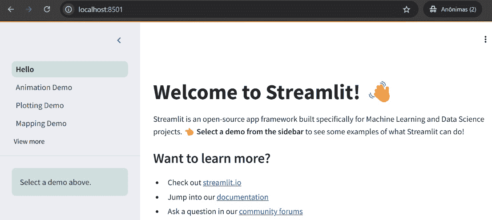
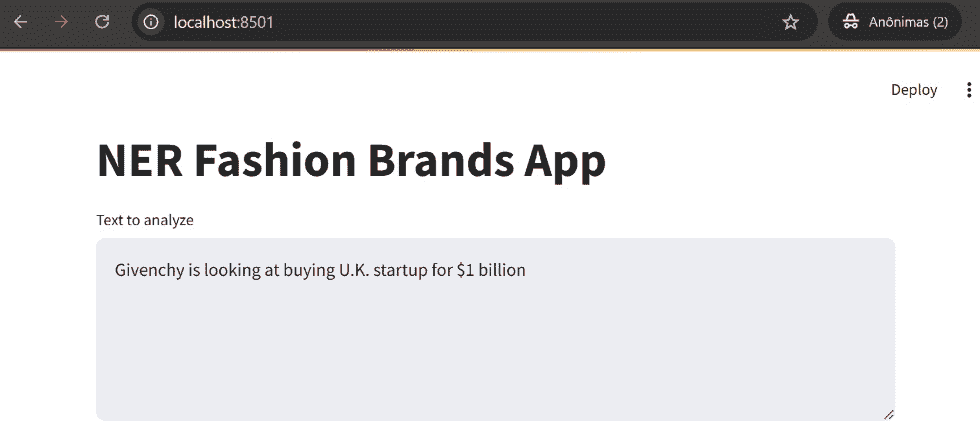
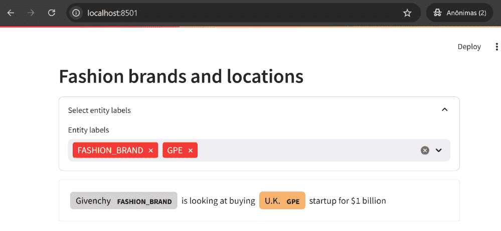
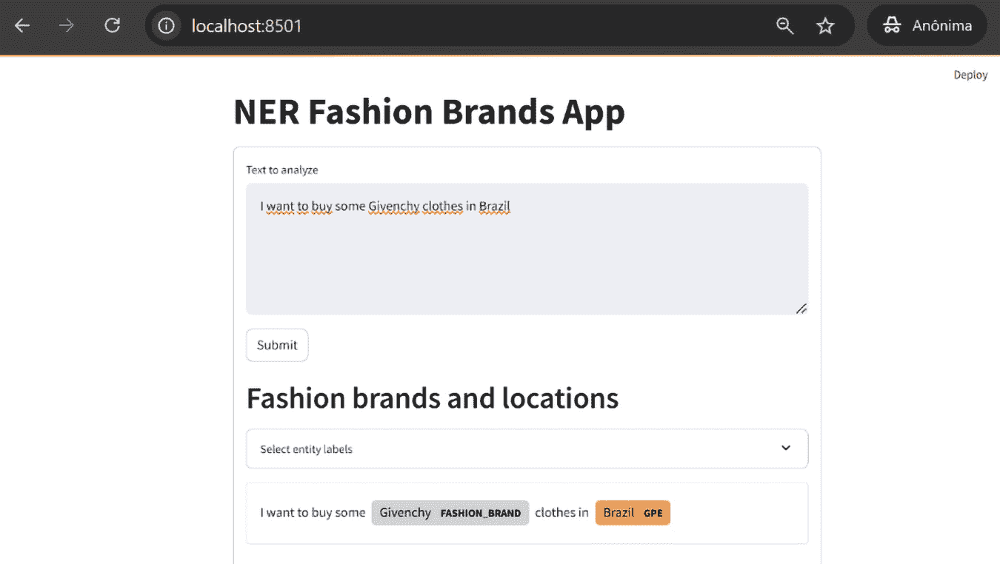
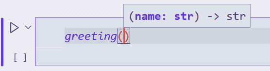
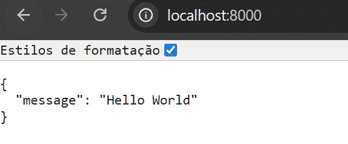
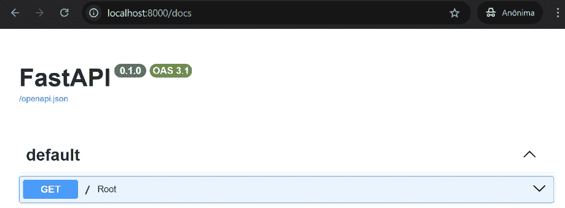
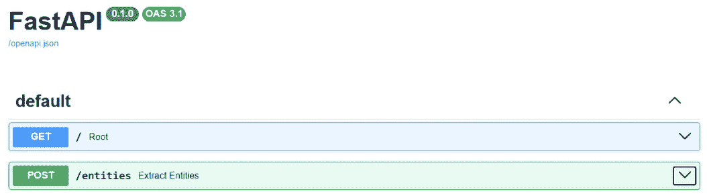

# 第十一章：将 spaCy 与第三方库集成

在本章中，我们将探讨如何将 spaCy 与第三方库集成，重点关注构建用于 NLP 任务的 Web 应用和 API。我们将从 `Streamlit` 开始，这是一个简化 Web 应用创建的 Python 框架，无需广泛的前端知识。我们将演示如何使用 Streamlit 和 `spacy-streamlit` 创建一个简单的 **命名实体识别**（`NER`）应用。在此之后，我们将深入研究 `FastAPI`，这是一个用于构建 API 的现代框架，以其速度和 Python 类型提示的使用而闻名。我们将学习如何创建一个使用 spaCy 模型从文本中提取实体的 API，展示了构建 NLP 驱动的服务的简便性。

在本章中，我们将涵盖以下主要主题：

+   使用 Streamlit 构建 spaCy 驱动的应用

+   使用 FastAPI 为 NLP 模型构建 API

# 技术要求

本章的所有数据和代码都可以在 [`github.com/PacktPublishing/Mastering-spaCy-Second-Edition`](https://github.com/PacktPublishing/Mastering-spaCy-Second-Edition) 找到。

# 使用 Streamlit 构建 spaCy 驱动的应用

作为数据科学家和 NLP 工程师，我们在日常工作中主要使用的编程语言是 Python。如果你没有前端开发背景，曾经尝试构建 Web 应用或处理过 CSS，你就知道要在浏览器中开发应用程序是多么困难和令人沮丧。Streamlit 是一个 Python 框架，旨在帮助我们以简单快捷的方式使用纯 Python 创建 Web 应用。它建立在 `Tornado` Python Web 服务器框架之上（[`www.tornadoweb.org/en/stable/index.html`](https://www.tornadoweb.org/en/stable/index.html)），并在前端使用 `React`。幸运的是，我们不需要了解这些技术的使用方法来创建我们的 Web 应用，因为有了 Streamlit，我们只需声明一些 Python 变量就可以在页面上创建小部件。我们还可以通过使用 *社区云* 功能（[`streamlit.io/cloud`](https://streamlit.io/cloud)）来平滑地部署、管理和共享 Streamlit Web 应用。部署只需一键即可完成，并且是免费的。

在本节中，我们将首先学习 Streamlit 的基础知识，然后学习如何使用 `spacy-streamlit` 包将 spaCy 可视化作为构建 Web 应用的基石。

## 使用 spacy-streamlit 构建 NLP 应用

要开始使用 Streamlit，第一步是使用 `pip install streamlit` 安装库。我们使用 Python 脚本创建 Web 应用。`streamlit run app.py` 命令在机器上运行本地服务器。为了检查安装是否正常，让我们运行 `streamlit hello` 命令。*图 11* *.1* 展示了浏览器中的这个演示页面。



图 11.1 – Streamlit 欢迎页面

正如我们在引言部分所讨论的，使用 Streamlit 创建小部件和视觉组件可以通过简单地声明一个变量来完成。我们还可以通过使用 Streamlit 输入小部件来为应用程序添加交互性。主要的小部件有`st.text_input`、`st.button`和`st.slider`。该库有一个长长的页面元素列表。以下是一些主要元素及其描述：

+   `st.write`：这将内容写入页面，并自动检测内容的类型以正确呈现。如果您写入`st.write('hi friends')`，它将显示文本；如果您提供数据框而不是字符串，它将以适当的格式呈现数据框。

+   `st.title`：这将显示以标题格式化的文本。

+   `st.markdown`：这将显示以 Markdown 格式化的文本。

+   `st.dataframe`：这将以交互式表格的形式显示数据框。

`spacy-streamlit`包提供了可视化 spaCy 模型和开发交互式应用程序的工具。它具有各种组件，可以集成到您自己的 Streamlit 应用程序中，包括句法依存关系、命名实体、文本分类、标记属性等的可视化器。让我们构建一个应用程序，以了解 Streamlit 和`spacy-streamlit`是如何协同工作的。首先，您需要使用`pip install spacy-streamlit`安装该包。安装了库之后，让我们继续构建一个应用程序来显示我们在*第八章*中训练的模型中的实体：

1.  首先，我们导入两个包，`Streamlit`和`spacy_streamlit`：

    ```py
    import streamlit as st
    import spacy_streamlit
    ```

1.  让我们为`st.text_input`组件定义一个默认文本：

    ```py
    DEFAULT_TEXT = """Givenchy is looking at buying U.K. startup for $1 billion"""
    ```

1.  现在我们定义*第八章*最终模型的路径：

    ```py
    spacy_model = "../chapter_08/pipelines/fashion_ner_with_base_entities"
    ```

1.  让我们添加一个标题和文本输入。`text_input`的内容将被保存在`text`变量中：

    ```py
    st.title("NER Fashion Brands App")
    text = st.text_area("Text to analyze", DEFAULT_TEXT, height=200)
    ```

我们还有一些工作要做，但首先，让我们看看只有这段代码时应用程序的样子。将代码保存到`app.py`脚本中，然后运行`streamlit run app.py`以在本地机器上提供服务。*图 11.2*展示了我们目前所拥有的内容。



图 11.2 – 带有 text_area 组件的 Streamlit 应用程序

当使用 Streamlit 构建应用时，每次用户与输入小部件交互时，库都会从顶部到底部重新运行整个 Python 脚本。我们的应用需要在处理文本之前加载模型，这意味着每次用户在 `st.text_area` 小部件中输入另一个文本时，他们可能需要等待模型再次加载。为了处理这种情况，Streamlit 有缓存功能（[`docs.streamlit.io/get-started/fundamentals/advanced-concepts#caching`](https://docs.streamlit.io/get-started/fundamentals/advanced-concepts#caching)）和 `spacy-streamlit` 实现了 `process_text()` 方法。它缓存加载的模型并创建 `Doc` 对象。让我们使用该方法来处理我们应用中的文本，继续我们开始的列表：

1.  `process_text ()` 方法期望模型路径和将要处理的文本：

    ```py
    doc = spacy_streamlit.process_text(spacy_model, text)
    ```

1.  最后，为了显示实体，我们将使用 `visualize_ner()` 函数：

    ```py
    spacy_streamlit.visualize_ner(
        doc,
        labels=["FASHION_BRAND", "GPE"],
        show_table=False,
        title="Fashion brands and locations",
    )
    ```

*图 11* *.3* 显示了最终的应用。



图 11.3 – 使用 Streamlit 构建的 NER 应用

我们想添加一个按钮，让用户可以输入自己的文本并查看实体。由于每次我们与小部件交互时，Streamlit 都会重新运行所有脚本代码，所以我们不能使用 `st.button` 小部件。我们将使用 `st.form` 小部件，它将表单内的所有小部件值批量发送到 Streamlit。我们将使用 `with` 上下文管理器来创建表单。让我们试试：

1.  我们将把所有应该重新加载的元素放入表单上下文管理器中。因此，当用户按下提交按钮时，我们将处理文档并使用可视化器显示它：

    ```py
    with st.form("my_form"):
        text = st.text_area("Text to analyze", DEFAULT_TEXT, 
                            height=200)
        submitted = st.form_submit_button("Submit")
        if submitted:
            doc = spacy_streamlit.process_text(spacy_model, text)
            spacy_streamlit.visualize_ner(
                doc,
                labels=["FASHION_BRAND", "GPE"],
                show_table=False,
                title="Fashion brands and locations",
            )
    ```

*图 11* *.4* 显示了应用，现在有了 **提交** 按钮。



图 11.4 – 带有表单和提交按钮的 Streamlit 应用

1.  下一个列表包含了网络应用的完整代码：

    ```py
    import streamlit as st
    import spacy_streamlit
    DEFAULT_TEXT = """Givenchy is looking at buying U.K. startup for $1 billion"""
    spacy_model = "../chapter_08/pipelines/fashion_ner_with_base_entities"
    st.title("NER Fashion Brands App")
    with st.form("my_form"):
        text = st.text_area("Text to analyze", DEFAULT_TEXT, 
                            height=200)
        submitted = st.form_submit_button("Submit")
        if submitted:
            doc = spacy_streamlit.process_text(spacy_model, text)
            spacy_streamlit.visualize_ner(
                doc,
                labels=["FASHION_BRAND", "GPE"],
                show_table=False,
                title="Fashion brands and locations",
            )
    ```

通过使用 `streamlit` 和 `spacy-streamlit` 库，我们仅用几行代码就能构建一个漂亮的 NLP 应用。其他 `spacy-streamlit` 可视化器包括 `visualize_parser()`、`visualize_spans()`、`visualize_textcat()`、`visualize_similarity()` 和 `visualize_tokens()`。

有时，我们需要为我们的 NLP 项目构建 API 而不是交互式网络应用。对于这种情况，我们可以使用另一个酷炫的库：`FastAPI`。让我们在下一节中了解更多关于它的信息。

# 使用 FastAPI 构建 NLP 模型的 API

`FastAPI` 是一个用于构建 API 的 Python 网络框架。它建立在另外两个 Python 库 `Starlette` 和 `Pydantic` 之上，使其成为可用的最快 Python 框架之一。FastAPI 基于标准的 Python 类型提示。通过类型提示，我们可以指定变量、函数参数或返回值的预期类型。这个特性帮助我们更早地捕捉到开发过程中的错误，所以在我们学习如何使用类型提示之前，让我们先了解如何使用它。

## Python 类型提示 101

Python 是一种动态类型语言，这意味着它在运行时执行变量的类型检查。例如，如果我们运行此代码，它不会抛出任何错误：

```py
string_or_int = "Hi friends"
string_or_int = 10
```

这运行得顺利，因为 Python 解释器处理了`string_or_int`从`String`到`int`的转换。这可能导致由于静默错误而出现的 bug。**类型提示**提供了一种在代码中指定预期类型的方法，因此它减少了我们创建 bug 的机会。让我们先看看一个没有类型提示的简单函数的例子：

```py
def greeting(name):
    return "Hello" + name
```

假设这个函数在一个代码库中，你只是导入它来在你的代码中使用。没有办法看到函数的作者期望`name`参数的类型，也没有关于返回类型的信息。为了获取这些信息，我们需要阅读并检查函数的代码。如果我们使用类型提示，情况就会改变：

```py
def greeting(name: str) -> str:
    return f"Hello {name}"
```

现在这些类型提示可以帮助你的代码编辑器，并显示类型。*图 11.5*显示了例如在*Visual Studio Code*中会发生什么。



图 11.5 – Visual Studio Code 中的类型提示

FastAPI 使用类型提示提供类型检查，导致 bug 和开发者引起的错误更少。现在我们知道了类型提示是什么，让我们使用 FastAPI 为我们的 spaCy 模型创建一个 API。

## 使用 FastAPI 为 spaCy 模型创建 API

我们构建 API 时使用的两个主要 HTTP 方法是`GET`和`POST`。`GET`用于请求不改变任何状态时，`POST`通常用于动作可以改变状态（向数据集添加元素、编辑值等）时。换句话说，`GET`用于*读取数据*，`POST`用于*创建数据*。在使用`GET`请求时，我们在 URL 地址中传递参数。在使用`POST`请求时，我们可以在请求体中传递参数。FastAPI 允许我们通过使用带有`@app.get()`或`@app.post()` Python 装饰器的函数来选择我们想要的请求类型。

让我们使用`GET`方法创建一个返回`json`对象的 API。首先，你需要使用`pip install fastapi[standard]`命令安装 FastAPI。现在创建一个包含以下命令的`main.py`文件：

1.  首先，导入库并创建`app`对象：

    ```py
    from fastapi import FastAPI
    app = FastAPI()
    ```

1.  现在让我们创建`GET`方法。我们将添加`@app.get("/")`装饰器。`"/"`表示调用此方法的 URL 路径将是我们的网站的根路径：

    ```py
    @app.get("/")
    def root():
        return {"message": "Hello World"}
    ```

1.  要在本地运行服务器，请转到命令行并输入`fastapi dev main.py`。*图 11.6*显示了如果你打开浏览器并访问`http://127.0.0.1:8000/` URL 时应该看到的内容。



图 11.6 – GET 端点的响应

1.  FastAPI 的一个优点是它自动为 API 创建文档。默认情况下，它使用`Swagger UI` ([`github.com/swagger-api/swagger-ui`](https://github.com/swagger-api/swagger-ui))。前往`http://127.0.0.1:8000/docs`查看。*图 11* *.7*显示了我们的 FastAPI 的文档文档。



图 11.7 – 由 FastAPI 自动创建的我们的 API 文档

1.  我们将创建一个 API，其风格与我们创建 Streamlit 网络应用时使用的风格相同。该 API 应接收一个文本列表，并返回一个包含实体的 JSON 响应。以下是一个请求示例：

    ```py
    {
      "values": [
        {
          "record_id": "1",
          "text": "Givenchy is looking at buying U.K. startup for $1 billion"
        }
      ]
    }
    ```

对于此请求，API 的响应应该是以下内容：

```py
{
  "values": [
    {
      "record_id": "1",
      "data": {
        "entities": [
          {
            "name": "Givenchy",
            "label": "FASHION_BRAND",
            "matches": [
              {
                "char_start": 0,
                "char_end": 8,
                "text": "Givenchy"
              }
            ]
          },
          // [...]          {
            "name": "$1 billion",
            "label": "MONEY",
            "matches": [
              {
                "char_start": 47,
                "char_end": 57,
                "text": "$1 billion"
              }
            ]
          }
        ]
      }
    }
  ]
}
```

FastAPI 使用`Pydantic`模型来验证数据并构建 API 文档。让我们创建一些 Pydantic 模型来指定我们的 API 的`POST`请求。我们通过创建继承自 Pydantic 的`BaseModel`类的 Python 类来实现这一点：

1.  为了提取实体，API 需要知道记录标识符和文本，因此让我们为它创建一个类：

    ```py
    from pydantic import BaseModel
    from typing import List
    class TextToExtractEntities(BaseModel):
        record_id: str
        text: str
    ```

1.  API 可以处理文本批次，因此请求的正文参数可以包含多个项目。让我们创建这个类：

    ```py
    class TextsRequest(BaseModel):
        values: List[TextToExtractEntities]
    ```

现在是时候使用 spaCy 提取实体以生成响应了。我们将创建一个与 Microsoft 的此 Cookiecutter 中使用的类非常相似的类：

[`github.com/microsoft/cookiecutter-spacy-fastapi`](https://github.com/microsoft/cookiecutter-spacy-fastapi)

让我们开始吧：

1.  我们应该初始化`EntityExtractor`类，提供一个`nlp`模型以及记录标识符和记录文本的关键值：

    ```py
    import spacy
    from spacy.language import Language
    class EntityExtractor:
        def __init__(self, nlp: Language,
                     record_id_col_key: str = "record_id",
                     record_text_col_key: str = "text"):
            self.nlp = nlp
            self.record_id_col_key = record_id_col_key
            self.record_text_col_key = record_text_col_key
    ```

1.  现在让我们创建一个提取实体的方法。该方法将遍历由`nlp.pipe()`创建的文档，并为文本中的实体创建一个包含实体名称、标签以及实体起始和结束字符的列表：

    ```py
    def extract_entities(self, records: List[Dict[str, str]]):
        ids = (item[self.record_id_col_key] for item in records)
        texts = (item[self.record_text_col_key] for item in records)
        response = []
        for doc_id, spacy_doc in zip(ids, self.nlp.pipe(texts)):
            entities = {}
            for ent in spacy_doc.ents:
                ent_name = ent.text
                if ent_name not in entities:
                    entities[ent_name] = {
                        "name": ent_name,
                        "label": ent.label_,
                        "matches": [],
                    }
                entities[ent_name]["matches"].append(
                    {"char_start": ent.start_char, 
                     "char_end": ent.end_char,
                     "text": ent.text}
                )
            response.append({"id": doc_id, 
                             "entities": list(entities.values())})
        return response
    ```

1.  为了测试此代码是否正常工作，让我们将其保存到`extractor.py`脚本中，并按如下方式导入类：

    ```py
    import spacy
    from pprint import pprint
    from extractor import EntityExtractor
    nlp = spacy.load("../chapter_08/pipelines/fashion_ner_with_base_entities")
    sentence = "Givenchy is looking at buying U.K. startup for $1 billion"
    doc = nlp(sentence)
    extractor = EntityExtractor(nlp)
    entities = extractor.extract_entities([{"record_id":1,"text":sentence}])
    pprint(entities)
    ```

1.  我们使用在*第八章*中训练的模型来提取实体。响应应该是包含实体名称、标签和匹配项的字典：

    ```py
    [{
        'entities': [
            {
                'label': 'FASHION_BRAND',
                'matches': [{
                    'char_end': 8,
                    'char_start': 0,
                    'text': 'Givenchy'
                }],
                'name': 'Givenchy'
            },
            {
                'label': 'GPE',
                'matches': [{
                    'char_end': 34,
                    'char_start': 30,
                    'text': 'U.K.'
                }],
                'name': 'U.K.'
            },
            {
                'label': 'MONEY',
                'matches': [{
                    'char_end': 57,
                    'char_start': 47,
                    'text': '$1 billion'
                }],
                'name': '$1 billion'
            }
        ],
        'id': 1
    }]
    ```

现在我们已经准备好完成我们的 API。`/entities`路径将是发送文本进行提取的`POST`端点。让我们回到 FastAPI 代码中创建此方法。

1.  `POST`请求使用`@app.post()`装饰器定义。首先，我们需要将接收到的数据解析为具有`record_id`和`text`键的字典列表：

    ```py
    @app.post("/entities")
    def extract_entities(body: TextsRequest):
        """Extract Named Entities from a batch of Records."""
        documents = []
        for item in body.values:
            documents.append({"record_id": item.record_id, 
                              "text": item.text})
    ```

1.  现在我们将调用`EntityExtractor`类，发送文档，并返回实体：

    ```py
        entities_result = extractor.extract_entities(documents)
        response = [
            {"record_id": er["record_id"], 
             "data": {"entities": er["entities"]}}
            for er in entities_result
        ]
        return {"values": response}
    ```

1.  如果您将此代码添加到`main.py`文件中，然后在终端中运行`fastapi run main.py`，并访问`/docs` URL，您现在应该能看到`POST /entities`端点规范。

1.  关于 Swagger UI 的另一个酷点是，我们可以在浏览器中直接测试端点。点击 `POST /entities` 向下的箭头按钮，然后点击右侧的 `Try it out` 按钮。现在你可以粘贴我们的示例请求，然后点击蓝色的 `Execute` 按钮。*图 11.8* 显示了 `POST /entities` 的箭头按钮。



图 11.8 – 发送数据到实体端点的按钮

下一个列表包含了我们 API 的完整代码：

```py
from fastapi import FastAPI
from typing import List
from pydantic import BaseModel
import spacy
from extractor import EntityExtractor
app = FastAPI()
nlp = spacy.load("../chapter_08/pipelines/fashion_ner_with_base_entities")
extractor = EntityExtractor(nlp)
class TextToExtractEntities(BaseModel):
    record_id: str
    text: str
class TextsRequest(BaseModel):
    values: List[TextToExtractEntities]
@app.get("/")
def root():
    return {"message": "Hello World"}
@app.post("/entities")
def extract_entities(body: TextsRequest):
    """Extract Named Entities from a batch of Records."""
    documents = []
    for item in body.values:
        documents.append({"record_id": item.record_id, 
                          "text": item.text})
    entities_result = extractor.extract_entities(documents)
    response = [
        {"record_id": er["record_id"], 
         "data": {"entities": er["entities"]}}
        for er in entities_result
    ]
    return {"values": response}
```

只用几行代码就能获得所有这些功能，这真是太酷了，对吧？这仅仅是使用 FastAPI 的基础知识。你可以在库的文档中查看更多高级内容，请访问 [`fastapi.tiangolo.com/learn/`](https://fastapi.tiangolo.com/learn/)。

# 摘要

本章介绍了将 spaCy 与第三方库集成的两个强大工具：用于构建交互式网络应用的 Streamlit 和用于创建快速、类型安全的 API 的 FastAPI。我们展示了如何使用 Streamlit 和 spacy-streamlit 包构建一个 NER 网络应用，利用 Streamlit 的简洁性和交互性。然后我们转向使用 FastAPI 构建 API，强调类型提示在减少错误和提高代码可靠性方面的重要性。通过将 spaCy 与这些框架结合，你了解到你可以以最小的努力创建有效的、用户友好的 NLP 应用和服务。

在这一章的最后，我们结束了这本书。这是一段相当精彩的旅程！我希望你已经对 spaCy 的主要功能有了基本的了解，但更重要的是，我希望你现在能够使用 spaCy 创建遵循一些主要软件工程原则编写良好代码的解决方案。我迫不及待地想看看你接下来会构建什么！
