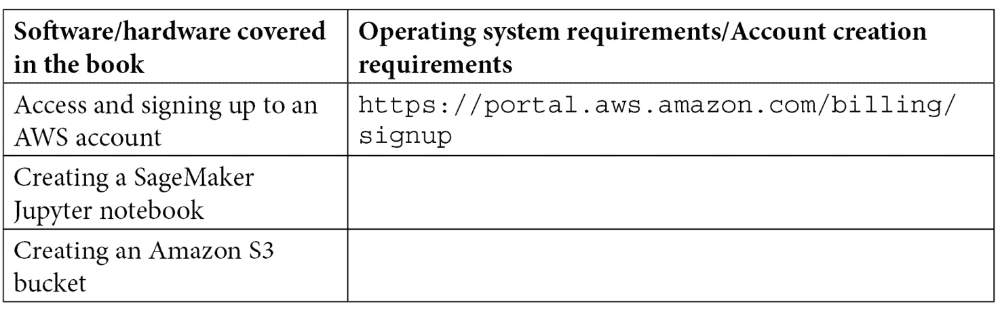

# 前言

作者们总是很有个性，几乎就像伦敦的天气。天色阴沉，你想去特拉法加广场散步，你穿上雨衣，带上雨伞以防万一，觉得自己已经为一切做好了准备。然而，你却完全没意识到大自然对你早已准备好了别有用心的计划。你走了一英里左右，突然间，天空放晴，阳光如最亮的歌曲洒在你的脸上，突然间，你措手不及（就像鹿撞上了车灯），你还穿着雨衣，拿着雨伞，而你距离家太远，无法返回去把它们丢掉。这正是我们在开始写书时最常经历的情况。你带着明确的目标出发，集中思想，写出了一份出色的大纲，得到了批准，然后开始制定章节内容，但你并不知道，书本有着不同的计划，知道自己要如何被写出来。

当这种情况发生时，正如生活中的一切，总是有选择的。你可以让创意的流动通过你的双手在书页上展现，或者你可以抗拒并遵循你预设的模式。当然，也有第三种选择，那就是遵循你想传达的整体结构，但当创意想要掌控时，让它自由发挥。这就是我们为这本书所做的。但这并不像我们最初想的那样容易，因为创意不会轻易妥协。著名的苏菲诗人贾拉尔·阿尔-鲁米曾说：“在沉默中，有着雄辩。停止编织，看看图案如何改进。”最难的部分就是停止“编织”或停止从我们作为 AWS 作者已经发布的内容中获得灵感。这也是本书的硬性要求，因此它成为了我们进行创意发挥、提出原创且有需求的内容的强大动力。

所以，我们停止了“编织”。接下来的逻辑步骤是让模式有所改进。但什么也没有发生。第一章的截止日期迫在眉睫，我们的编辑们非常礼貌地提醒我们截止日期的临近。仍然没有进展。我们利用这段“没有编织”的时间来规划和设计技术章节，但将整本书连贯起来的“胶水”，即主线叙事，依然难以捉摸。然后突然有一天，没有任何预警，这一切迎刃而解。我们完全忽视了鲁米说的那句话的第一部分：“在沉默中，蕴藏着雄辩。”在附近小径的自然散步满足了每天的沉默配额，在这段时间里，一个微弱的念头浮现了，我想起了一个我父亲（Shri T. Rangarajan）小时候讲给我听的故事，叫做*阿里巴巴与四十大盗*。我突然意识到，故事中的著名情节其实是我第一次记得通过声音来执行任务（请参考书中的*第一章*，*商业背景下的自然语言处理与 AWS AI 服务介绍*）。从那时起，灵感之门大开，源源不断的思路涌现，直到整本书最终完成。这就是本书诞生的经过。

我们都知道的生活中一个有趣的事实是，唯一不变的就是变化。而在编写本书的过程中，这一点同样适用。AWS 最棒的一点就是它不断创新的速度，新的功能持续推出。AWS 的产品路线图是基于客户的直接反馈，并且功能通过迭代方式逐步改进，不断推出新的功能。所以，当我们在编写本书时，**Amazon Comprehend**和**Amazon Textract**新增了功能，控制台体验发生了变化，等等。例如，Amazon Comprehend 修改了其控制台体验，增加了对从 PDF 文档直接进行自定义实体识别训练的支持，并改善了其自定义实体识别模型框架，支持每个实体仅用 100 个标注和 250 个文档进行训练。Amazon Textract 将**AnalyzeDocument**和**DetectDocumentText** API 的定价在全球八个 AWS 区域降低了 32%，并宣布支持自动化处理发票等功能。可以通过此链接查看 2021 年 AWS 的新功能完整列表：[`aws.amazon.com/about-aws/whats-new/2021/`](https://aws.amazon.com/about-aws/whats-new/2021/)。

当你为本书中的各种 NLP 用例构建解决方案时，你将会注意到这些变化。*请注意，由于 Amazon Textract 和 Amazon Comprehend 控制台已发生变化，书中的指令可能与你在 AWS 管理控制台中的体验不完全一致；然而，这些指令依然准确，并能满足你的需求*。

例如，Amazon Comprehend 控制台中用于自定义实体识别的**Train Recognizer**按钮现已更改为**Create new model**。类似地，Amazon Comprehend 控制台中用于自定义分类的**Train Classifier**按钮也已更改为**Create new model**。当你为自定义实体识别指定**训练和测试数据集**时，控制台中将新增一个选项，让你选择**PDF、Word 文档**。Amazon Textract 也发生了变化，现在可以通过**AnalyzeExpense**选项查看文档的分析结果。

然而，在本书的大部分内容中，我们使用了 API 来构建解决方案，而 AWS 的一个优势就是其 API 保持一致性。你将获得一致的响应和请求。如果你想使用最新版本，只需要升级 Python Boto3 的版本。此外，我们的目标是确保本书始终保持相关性并与时俱进。

# 本书适合谁阅读

如果你是一个 NLP 开发人员或数据科学家，希望快速开始使用 AWS AI 服务来实现各种 NLP 场景，那么本书就是为你准备的。它将展示如何通过几行代码轻松将 AI 集成到应用程序中。为了理解书中所涉及的概念，你需要具备基本的机器学习知识。拥有 Jupyter Notebooks 和 Python 的经验将会有所帮助。

# 本书的内容

*第一章*，*商业环境中的自然语言处理（NLP）及 AWS AI 服务简介*，介绍了 NLP 的构建和使用 NLP 的商业价值，并概述了 AWS AI 技术栈及关键的 NLP 服务。

*第二章*，*介绍 Amazon Textract*，详细介绍了 Amazon Textract 的功能、它旨在解决的业务挑战、它具有的特性、适用的用户需求类型，以及如何轻松将 Textract 与其他 AWS 服务集成，例如 AWS Lambda 来构建业务应用。

*第三章*，*介绍 Amazon Comprehend*，详细介绍了 Amazon Comprehend 的功能、它旨在解决的业务挑战、它具有的特性、适用的用户需求类型，以及如何轻松将 Comprehend 与其他 AWS 服务集成，例如 AWS Lambda 来构建业务应用。

*第四章*，*自动化文档处理工作流*，深入探讨了基于我们的集体经验和观察到的使用趋势，跨行业的几种常见应用场景，这些场景可以从基于 NLP 的技术中受益。我们将提供详细的代码示例、设计与开发方法，并提供逐步指南，教你如何设置和运行这些示例，并附带 GitHub 代码库的访问链接。

*第五章*，*创建 NLP 搜索*，深入探讨了我们根据集体经验和观察到的使用趋势，在各行业中普遍存在的多种 NLP 应用场景。我们将提供详细的代码示例、设计和开发方法，并附带逐步指导，介绍如何设置和运行这些示例，同时提供 GitHub 仓库的访问权限。

*第六章*，*利用 NLP 提高客户服务效率*，深入探讨了我们根据集体经验和观察到的使用趋势，在各行业中普遍存在的多种 NLP 应用场景。我们将提供详细的代码示例、设计和开发方法，并附带逐步指导，介绍如何设置和运行这些示例，同时提供 GitHub 仓库的访问权限。

*第七章*，*理解客户声音分析*，深入探讨了我们根据集体经验和观察到的使用趋势，在各行业中普遍存在的多种 NLP 应用场景。我们将提供详细的代码示例、设计和开发方法，并附带逐步指导，介绍如何设置和运行这些示例，同时提供 GitHub 仓库的访问权限。

*第八章*，*利用 NLP 变现您的媒体内容*，深入探讨了我们根据集体经验和观察到的使用趋势，在各行业中普遍存在的多种 NLP 应用场景。我们将提供详细的代码示例、设计和开发方法，并附带逐步指导，介绍如何设置和运行这些示例，同时提供 GitHub 仓库的访问权限。

*第九章*，*从金融文档中提取元数据*，深入探讨了我们根据集体经验和观察到的使用趋势，在各行业中普遍存在的多种 NLP 应用场景。我们将提供详细的代码示例、设计和开发方法，并附带逐步指导，介绍如何设置和运行这些示例，同时提供 GitHub 仓库的访问权限。

*第十章*，*通过机器翻译降低本地化成本*，深入探讨了我们根据集体经验和观察到的使用趋势，在各行业中普遍存在的多种 NLP 应用场景。我们将提供详细的代码示例、设计和开发方法，并附带逐步指导，介绍如何设置和运行这些示例，同时提供 GitHub 仓库的访问权限。

*第十一章*，*使用聊天机器人查询文档*，深入探讨了多种行业中普遍存在的使用案例，这些案例可以受益于基于自然语言处理（NLP）的技术，基于我们的集体经验和观察到的使用趋势。我们将提供详细的代码示例、设计和开发方法，以及一步步的指南，指导如何设置和运行这些示例，并提供对 Github 代码库的访问。

*第十二章*，*医疗行业中的 AI 与 NLP*，深入探讨了 AWS NLP 解决方案如何帮助医疗行业实现运营效率，特别是自动化理赔审查的使用案例。

*第十三章*，*提高文档处理工作流的准确性*，讨论了为什么我们需要在文档处理工作流中加入**人类参与**（**HITLs**），以及如何通过 Amazon **增强型 AI**（**A2I**）设置 HITL 流程，从而提高现有文档处理工作流的准确性，特别是利用 Amazon Textract。

*第十四章*，*审计命名实体识别工作流*，通过引入 Amazon Comprehend 进行基于文本的洞察，扩展了前述方法，从而展示了为自定义命名实体识别使用案例设置审计工作流的端到端流程。

*第十五章*，*文档分类与设置人类参与的主动学习*，讲述了如何使用 Amazon Comprehend 自定义分类来对文档进行分类，然后如何使用 Amazon A2I 设置与自定义分类模型相关的主动学习反馈。

*第十六章*，*提高 PDF 批处理的准确性*，解决了一个已经存在一段时间并且普遍存在的操作需求，尽管如此，许多组织依然难以高效地解决它——这就是 PDF 批处理问题。

*第十七章*，*可视化手写内容中的洞察*，专注于如何从文本——即手写文本——中提取洞察并加以利用，从而推动决策过程。

*第十八章*，*构建安全、可靠且高效的 NLP 解决方案*，回顾了最佳实践、技术和指南，探讨了什么样的 NLP 解决方案能够从优秀变为卓越。

# 为了充分利用本书的内容

您将需要一个 AWS 账户，因此在开始之前，我们建议您先创建一个。



**如果您正在使用本书的电子版，我们建议您手动输入代码。这样做可以帮助您避免与复制粘贴代码相关的潜在错误。**

# 下载示例代码文件

您可以从 GitHub 下载本书的示例代码文件，地址是[`github.com/PacktPublishing/Natural-Language-Processing-with-AWS-AI-Services`](https://github.com/PacktPublishing/Natural-Language-Processing-with-AWS-AI-Services)。如果代码有更新，它将在现有的 GitHub 仓库中进行更新。

我们还提供了来自我们丰富书籍和视频目录中的其他代码包，您可以在[`github.com/PacktPublishing/`](https://github.com/PacktPublishing/)查看。

# 下载彩色图像

我们还提供了一份包含本书中使用的截图和图表的彩色图像的 PDF 文件。您可以在此下载：`static.packt-cdn.com/downloads/9781801812535_ColorImages.pdf`。

# 实践中的代码

本书的《实战中的代码》视频可以通过[`bit.ly/3vPvDkj`](https://bit.ly/3vPvDkj)观看。

# 使用的约定

本书中使用了许多文本约定。

`文本中的代码`：表示文本中的代码字、数据库表名、文件夹名、文件名、文件扩展名、路径名、虚拟网址、用户输入和 Twitter 用户名。例如：“复制创建的存储桶名称，打开`Chapter 05/Ch05-Kendra Search.ipynb`，并将其粘贴到以下单元格中，替换掉`'<your s3 bucket name>'`以开始操作。”

代码块的格式如下：

```py
# Define IAM role
role = get_execution_role()
print("RoleArn: {}".format(role))
sess = sagemaker.Session()
s3BucketName = '<your s3 bucket name>'
prefix = 'chapter5'
```

当我们希望您注意到代码块中特定部分时，相关的行或项目会以粗体显示：

```py
    <body>
        <h1>Family Bank Holdings</h1>
        <h3>Date: <span id="date"></span></h3>
        <div id="home">
          <div id="hometext">
        <h2>Who we are and what we do</h2>
```

**粗体**：表示一个新术语、重要词汇或您在屏幕上看到的文字。例如，菜单或对话框中的文字通常以**粗体**显示。举个例子：“您会看到页面有几个标题，然后有一段关于**家庭银行**的段落，**家庭银行**是**LiveRight Holdings**的子公司。”

提示或重要事项

如下所示。

# 联系我们

我们始终欢迎读者的反馈。

**常规反馈**：如果您对本书的任何内容有疑问，请通过电子邮件联系我们：customercare@packtpub.com，并在邮件主题中注明书籍标题。

**勘误表**：尽管我们已经非常小心确保内容的准确性，但错误仍然可能发生。如果您在本书中发现了错误，我们将不胜感激，如果您能将其报告给我们。请访问[www.packtpub.com/support/errata](http://www.packtpub.com/support/errata)并填写表格。

**盗版**：如果您在互联网上发现我们作品的任何非法复制版本，我们将不胜感激，如果您能提供位置地址或网站名称。请通过 mailto:copyright@packt.com 联系我们，并提供该材料的链接。

**如果您有兴趣成为作者**：如果您在某个领域有专业知识，并且有兴趣撰写或为书籍做出贡献，请访问[authors.packtpub.com](http://authors.packtpub.com)。

# 分享您的想法

一旦你阅读了*《使用 AWS AI 服务进行自然语言处理》*，我们非常希望听到你的想法！请[点击这里直接进入本书的亚马逊评论页面](https://packt.link/r/1-801-81253-5)并分享你的反馈。

你的评论对我们和技术社区非常重要，它将帮助我们确保提供优质的内容。
