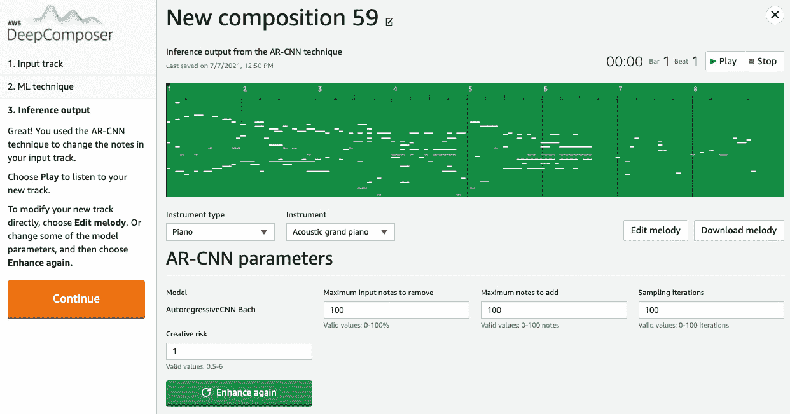

# 第一章：*第一章*：商业背景中的 NLP 及 AWS AI 服务简介

**自然语言处理**（**NLP**）在科学界非常流行，但利用这种**人工智能**（**AI**）技术来获得商业利益的价值，对于主流用户来说并不立刻显现出来。我们的重点将是提高人们的意识并教育您关于 NLP 的商业背景，提供关于非结构化文本中数据激增的示例，并展示 NLP 如何帮助提取有意义的见解，以指导企业的战略决策。

在本引言章节中，我们将建立基本背景，以帮助您熟悉一些人工智能和**机器学习**（**ML**）的基本概念，NLP 可以帮助解决的挑战类型，构建 NLP 解决方案时的常见陷阱，以及 NLP 如何工作以及它擅长做什么，并通过实例进行讲解。

本章内容将涵盖以下内容：

+   介绍 NLP

+   克服构建 NLP 解决方案中的挑战

+   理解为什么 NLP 正在成为主流

+   介绍 AWS ML 技术栈

# 介绍 NLP

语言与文明同在，没有任何一种沟通工具比口语或书面语言更为有效。在他们的童年时代，作者们曾为《一千零一夜》这部集印度、波斯和阿拉伯故事于一体的几百年古老故事集所吸引。在其中一个著名的故事《阿里巴巴与四十大盗》中，阿里巴巴是一个贫穷的男子，他发现了一个盗贼藏匿的藏宝洞，而这个洞只有通过说出魔法词语*芝麻开门*才能打开。在作者的记忆中，这是他们第一次接触到语音激活的应用程序。尽管这纯粹是虚构作品，但它确实激发了探索可能性的兴趣。

最近，在过去的二十年里，互联网的普及和智能设备的激增推动了数字通信技术的重大进展。与此同时，长期以来致力于开发人工智能的研究随着机器学习的出现取得了快速进展。阿瑟·李·塞缪尔（Arthur Lee Samuel）在 1959 年首次提出了*机器学习*这一术语，并通过创建一个跳棋游戏程序，展示了计算机如何被*教授*，使这一概念在计算机科学领域得到了广泛应用。

然而，机器可以被教导模仿人类认知的概念，早在 1950 年就由艾伦·图灵在他的论文《计算机机械与智能》中推广开来。这篇论文介绍了*图灵测试*，这是一种当时常见的派对游戏的变体。测试的目的是让一名解答者提问并比较来自人类参与者和计算机的回答。关键在于，解答者并不知道哪一方是人类，哪一方是计算机，因为三者都被隔离在不同的房间里。如果解答者无法分辨出两者，因为回答非常相似，那么*图灵测试*就成功验证了计算机具备人工智能。

当然，自那时以来，人工智能领域取得了飞跃式的发展，主要得益于机器学习算法在解决现实世界问题中的成功。算法，简单来说，是一种程序化功能，能够根据条件将输入转化为输出。与常规的可编程算法相反，机器学习算法已经学会了根据遇到的数据来调整其处理方式。根据需求，有不同的机器学习算法可供选择，例如：**极端梯度提升**（**XGBoost**），这是一种流行的回归和分类问题算法；**指数平滑**（**ETS**），用于统计时间序列预测；**单次多框检测器**（**SSD**），用于计算机视觉问题；以及**潜在狄利克雷分配**（**LDA**），用于自然语言处理中的主题建模。

对于更复杂的问题，机器学习（ML）已经发展为深度学习，通过引入**人工神经网络**（**ANNs**），这些神经网络能够通过从海量数据中学习来解决高度挑战性的任务。例如，AWS DeepComposer（[`aws.amazon.com/deepcomposer/`](https://aws.amazon.com/deepcomposer/)）是**亚马逊网络服务**（**AWS**）的一项机器学习服务，它通过音乐作为教学媒介来教育开发者。DeepComposer 使用的机器学习模型之一是通过一种叫做**卷积神经网络**（**CNN**）的神经网络类型进行训练，利用**自回归**（**AR**）技术从简单的输入旋律中创作出新的独特音乐作品：

图 1.1 – 使用 AWS DeepComposer 和机器学习创作音乐

钢琴卷轴是音乐的图像表示，AR-CNN 将音乐生成视为这些钢琴卷轴图像的序列：

](img/B17528_01_03.jpg)

图 1.2 – 音乐的钢琴卷轴表示

尽管随着先进技术的普及，机器学习（ML）在各类组织中得到了广泛应用，并且有望解决多种问题，且 AWS 在能力的广度和深度上具备独特优势，但机器学习只是今天 AI 可能实现的功能的一部分。根据一项报告（[`www.gartner.com/en/newsroom/press-releases/2019-01-21-gartner-survey-shows-37-percent-of-organizations-have`](https://www.gartner.com/en/newsroom/press-releases/2019-01-21-gartner-survey-shows-37-percent-of-organizations-have)，2021 年 3 月 23 日访问），2015 到 2019 年间，AI 的采用率增长了 270%。而且这一增长势头仍在迅速发展。AI 不再是只有具备高性能计算机资源的大企业才能使用的外围技术。如今，AI 已成为希望为应用程序增添认知智能、加速商业价值的组织的主流选择。例如，埃克森美孚与亚马逊合作，为客户提供了一种创新且高效的加油支付方式。*Alexa 支付加油*技能使用车辆的 Alexa 设备或智能手机上的 Alexa 应用程序与加油机进行通信，完成支付。作者亲自访问了一家当地的埃克森美孚加油站并亲身体验，感觉非常棒。详情请参见 [`www.exxon.com/en/amazon-alexa-pay-for-gas`](https://www.exxon.com/en/amazon-alexa-pay-for-gas)。

AI 涉及广泛的任务范围，类似于人类的感官和认知能力。通常，这些任务被分为几个类别，例如计算机视觉（模仿人类视觉）、自然语言处理（模仿人类的语言、写作和听觉过程）、对话界面（如聊天机器人，模仿基于对话的交互）和个性化（模仿人类直觉）。例如，**C-SPAN**，一个报道美国参议院和众议院议程的广播公司，使用**Amazon Rekognition**（基于计算机视觉的图像和视频分析服务）标记每个时间点的发言人/镜头前的人。通过 Amazon Rekognition，C-SPAN 能够索引比之前多两倍的内容。此外，AWS 提供了智能搜索、预测、欺诈检测、异常检测、预测性维护等 AI 服务，这也是为什么 AWS 在首次 Gartner 云 AI 魔力象限报告中被评为领导者的原因。

虽然语言本身是有结构的且定义明确，但语言的使用或解释是主观的，可能无意间造成不良影响，因此在构建自然语言解决方案时需要特别注意。举个例子，*电话游戏*就展示了对话如何不自觉地被夸大，最终得到与最初内容完全不同的版本。每个参与者都重复他们认为自己听到的内容，而不是实际听到的内容。作为派对游戏时，这样做很有趣，但在现实生活中可能会带来更严重的后果。计算机也是如此，它们会根据底层机器学习模型如何解读语言来重复它们所“听到”的内容。

为了理解小的增量变化如何彻底改变意思，我们来看另一个受欢迎的游戏：*单词阶梯*（[`en.wikipedia.org/wiki/Word_ladder`](https://en.wikipedia.org/wiki/Word_ladder)）。目标是将一个单词转换成另一个单词，通常是其反义词，尽可能用最少的步骤，每次只更改一个字母。

以下表格展示了一个例子：

图 1.3 – *单词阶梯*游戏

将人工智能适应于自然语言处理，催生了一系列主要处理与人类语言和文本相关的认知和感知过程的计算仿真能力。应用可以被分为两个主要类别：

+   **自然语言理解**（**NLU**），用于像 Amazon Alexa 这样的语音应用，以及语音转文本/文本转语音转换。

+   **NLP**，用于从文本中解读基于上下文的见解。

使用自然语言理解（NLU）技术，以前需要多个且有时繁琐的接口（如屏幕、键盘和鼠标）来实现计算机与人类的互动，现在只需要语音就能高效工作。

在斯坦利·库布里克的 1968 年电影*2001 太空漫游*中，（剧透警告！！）一个名为*HAL 9000*的人工智能计算机使用视觉和声音与船上的人类互动，在电影过程中，它发展出了个性，不接受自己犯错的事实，并在发现人类的停机计划后试图杀死他们。快进到现在，距离电影中描绘的未来已经过去 20 年，我们在语言理解和处理方面取得了显著进展，但幸运的是，尚未达到电影中情节的夸张程度。

现在我们已经很好地理解了自然语言处理（NLP）发展的背景以及它的应用方式，让我们来看看在开发 NLP 解决方案时可能遇到的一些常见挑战。

# 克服构建 NLP 解决方案中的挑战

我们之前提到，常规编程和机器学习（ML）算法的主要区别在于，机器学习算法能够根据输入的数据调整其处理方式。在自然语言处理（NLP）的背景下，正如在其他 ML 领域一样，这些区别带来了显著的价值，并加速了企业业务成果。例如，考虑一个需要为用户展示基于兴趣主题的书籍推荐的书籍出版组织。

在传统的世界里，你需要多个团队来逐一处理整个书籍集合，单独阅读每本书，识别关键词、短语、主题和其他相关信息，创建索引将书名、作者和类型与这些关键词关联，并将其与搜索功能连接起来。这是一个庞大的工作，根据书籍集合的规模、人员数量、他们的技能水平，建立这个系统需要几个月甚至几年的时间，而且索引的准确性容易受到人为错误的影响。随着书籍更新到新版，新增或移除书籍，这项工作还必须逐步重复进行。这也是一项重大成本和时间投入，可能会让很多人却步，除非这段时间和资源已经预先规划好。

要在我们之前的例子中引入一定程度的自动化，我们需要能够从文档中数字化文本。然而，这不仅是唯一的需求，因为我们还希望从书籍中提取基于上下文的洞察，以便为读者提供一个推荐索引。如果我们举例说，比如 Packt 出版公司，拥有超过 7,500 本书籍的收藏，我们需要一个解决方案，它不仅能处理大量页面，还能理解文本中的关系，并基于语义、语法、词语分割和语言提供解释，从而创建智能索引。在*第五章*，*创建 NLP 搜索*中，我们将详细介绍这一解决方案，包括代码示例和演示视频。

当今的企业在从数据中提取有意义的洞察方面面临挑战，主要是由于数据增长的速度。直到大约十年前，大多数组织都使用关系型数据库来满足所有数据管理需求，今天有些组织仍然在使用。这在当时是可以接受的，因为数据量需求通常只有单个 TB 数量级或更少。近年来，随着智能手机的普及、连接设备的大规模扩散（达到数十亿个）、基础设施动态扩展至新地域的能力，以及由于云计算的普及而使存储和计算成本变得更便宜，技术领域发生了巨大变革。这意味着应用程序被更频繁地使用，拥有更大的用户基础、更强的处理能力和功能，能够加快创新步伐，缩短市场推广周期，因此需要存储和管理 PB 级别的数据。再加上应用程序用户对更快响应时间和更高吞吐量的需求，给关系型数据库的性能带来了压力，推动了向专用数据库转型，如 Amazon DynamoDB，这是一种提供单毫秒级延迟的键值和文档数据库，能够在任何规模下运行。

虽然这一举措标志着一个积极的趋势，但更有趣的是企业如何利用这些数据来获得战略性洞察。毕竟，数据的价值在于我们能从中提取的信息。我们看到，许多组织在接受专用工具的好处时，却在孤立的环境中实施这些变化。因此，在正确利用数据优势的成熟度上存在不同的层次。一些部门使用 S3 数据湖（[`aws.amazon.com/products/storage/data-lake-storage/`](https://aws.amazon.com/products/storage/data-lake-storage/)）从不同来源获取数据并运行机器学习以得出基于上下文的洞察，另一些则将数据整合到专用的数据库中，而其余的仍然在使用关系型数据库来满足所有需求。

你可以在以下*图 1.5：Amazon S3 数据湖的示例*中看到数据湖主要组件的基本解释：

图 1.4 – 一个 Amazon S3 数据湖的示例

让我们看看在这种情况下，NLP 如何通过回顾我们的图书出版示例继续增加业务价值。假设我们成功构建了智能索引解决方案，现在我们需要通过 Twitter 反馈更新书评。可搜索的索引应根据评价情感提供书籍推荐（例如，如果最近 3 个月内超过 50%的评价为负面，则不推荐该书）。传统上，通过在巨大的数据仓库上运行一套报告来生成业务洞察力，这些数据仓库收集、挖掘和组织数据到市场和维度中。一条推文甚至可能不被考虑为数据来源。如今，情况已经改变，挖掘社交媒体数据是生成洞察力的重要方面。建立业务规则来检查每条推文是一项耗时且计算密集的任务。此外，由于推文是非结构化文本，语义上的轻微变化可能会影响解决方案的有效性。

现在，如果考虑模型训练，构建精确的 NLP 模型所需的基础设施通常使用称为**变压器**的深度学习架构（请参阅[`www.packtpub.com/product/transformers-for-natural-language-processing/9781800565791`](https://www.packtpub.com/product/transformers-for-natural-language-processing/9781800565791)），它使用序列到序列处理，无需按顺序处理标记，从而实现更高程度的并行化。变压器模型系列使用数十亿个参数进行训练架构，使用实例集群进行分布式学习，这增加了时间和成本。

AWS 提供的 AI 服务允许您只需几行代码即可将 NLP 添加到您的应用程序中，用于对几乎无限规模的非结构化文本进行情感分析，并立即利用等待发现的巨大潜力。我们将从*第二章*，*介绍 Amazon Textract*，开始更详细地介绍 AWS AI 服务。

在本节中，我们审查了组织在构建 NLP 解决方案时遇到的一些挑战，例如在数字化基于纸张的文本、理解来自结构化和非结构化数据的模式以及这些解决方案可能的资源密集型。现在让我们了解为什么 NLP 是当今企业的重要主流技术。

# 理解为什么 NLP 正在成为主流技术

根据这份报告（[`www.marketsandmarkets.com/Market-Reports/natural-language-processing-nlp-825.html`](https://www.marketsandmarkets.com/Market-Reports/natural-language-processing-nlp-825.html)，2021 年 3 月 23 日访问），全球自然语言处理（NLP）市场预计到 2026 年将增长至 351 亿美元，年复合增长率（**CAGR**）为 20.3%。考虑到机器学习（ML）在各行各业（如金融、零售、制造、能源、公共事业、房地产、医疗等）产生的影响，这并不令人惊讶，尤其是在云计算的兴起和规模经济的推动下，各种规模的组织都在广泛应用。

这篇关于*Emergence Cycle*的文章（[`blogs.gartner.com/anthony_bradley/2020/10/07/announcing-gartners-new-emergence-cycle-research-for-ai/`](https://blogs.gartner.com/anthony_bradley/2020/10/07/announcing-gartners-new-emergence-cycle-research-for-ai/)），研究了 NLP 中的新兴技术（基于已提交的专利，且关注仍在实验室中或最近发布的技术），显示了 NLP 最成熟的应用是多媒体内容分析。根据我们的经验，这一趋势是成立的，内容分析以获得战略洞察力是我们与多个行业组织交流中常见的 NLP 需求：

图 1.5 – Gartner 的 NLP 出现周期 2020

例如，在 2020 年，当全球面临疫情的挑战时，许多组织采用了人工智能，特别是自然语言处理技术，来预测病毒传播模式、吸收病毒行为和疫苗研究的知识、监控安全措施的效果等。2020 年 4 月，AWS 推出了一个基于 NLP 的搜索网站[`cord19.aws/`](https://cord19.aws/)，使用了一项名为**Amazon Kendra**（[`aws.amazon.com/kendra/`](https://aws.amazon.com/kendra/)）的 AWS 人工智能服务。该网站提供了一个简单的界面，用户可以通过自然语言问题搜索**COVID-19 开放研究数据集**。由于该数据集根据 COVID-19 的最新研究不断更新，CORD-19 搜索凭借其对 NLP 的支持，能够轻松浏览这一不断扩展的研究文献集合，并找到问题的精确答案。搜索结果不仅提供包含问题答案的具体文本，还提供包含这些答案的原始文本：

图 1.6 – CORD-19 搜索结果

弗雷德·哈钦森癌症研究中心是一个致力于到 2025 年治愈癌症的研究机构。*弗雷德·哈钦森癌症研究中心首席信息官 Matthew Trunnell*曾表示：

“开发临床试验并将其与合适的患者群体连接的过程，要求研究团队筛选并标注大量非结构化的临床记录数据。Amazon Comprehend Medical 将把这一时间负担从数小时减少到数秒。这是一个关键步骤，可以让研究人员在需要时快速访问他们所需的信息，从而发现可操作的见解，以推动救生疗法的发展。”

有关 Amazon Comprehend 和 Amazon Comprehend Medical 的更多详细信息和使用示例，请参见*第三章*，*介绍 Amazon Comprehend*。

那么，AI 和 NLP 如何帮助我们治愈癌症或为大流行做准备呢？这就涉及到在看似不存在的地方识别模式。非结构化文本，如文档、社交媒体帖子和电子邮件消息，类似于阿里巴巴洞中的宝藏。为了理解这一点，让我们简要看一下 NLP 是如何工作的。

NLP 模型通过学习所谓的*词嵌入*进行训练，词嵌入是单词在大规模文档集合中的向量表示。这些词嵌入捕捉了文档中单词之间的语义关系和分布，从而帮助根据单词与其他单词的关系来映射单词的上下文。用于学习词嵌入的两种常见训练架构是**Skip-gram**和**连续词袋模型**（**CBOW**）。在 Skip-gram 中，输入单词的词嵌入用于推导相关单词的分布，以预测上下文；而在 CBOW 中，相关单词的词嵌入则用于预测中间的单词。两者都是基于神经网络的架构，并且在基于上下文的分析用例中效果良好。

现在我们理解了 NLP 的基础（通过将单词转换为向量表示来分析文本中的模式），当我们使用来自不同数据源的文本数据训练模型时，由于在狭窄上下文中看不见的模式在更广泛的视野中显现出来，因此常常能得到独特的见解，因为我们在利用数字来发现文本中的关系。例如，Amazon Prime 电视剧《全球经济的巨大怪物》中的*橡胶一集*展示了真菌性疾病有可能摧毁全球经济，即使乍一看，它们之间似乎没有任何联系。根据*美国国家医学图书馆*，天然橡胶占全球消费量的 40%，而**南美叶斑病**（**SALB**）真菌性疾病有可能在全球传播，并严重影响橡胶生产。没有橡胶，飞机无法着陆，橡胶的用途如此广泛，它对经济的影响将是前所未有的。这是一个机器学习和 NLP 模型在广泛文本语料库中找到具体感兴趣项的典型例子。

在 AWS 和云计算彻底改变了对先进技术的访问之前，设置 NLP 模型进行文本分析至少是充满挑战的。最常见的原因如下：

+   **技能缺乏**：数据识别、特征工程、构建模型、训练和调优等任务都需要一种独特的技能组合，包括软件工程、数学、统计学和数据工程，只有少数从业人员具备这些技能。

+   **初始基础设施设置成本**：机器学习训练是一个迭代过程，通常需要通过反复试验来调优模型，以达到期望的准确性。进一步的训练和推理可能需要基于数据量和请求数量的 GPU 加速，从而需要较高的初期投资。

+   **当前本地环境的可扩展性**：在本地服务器上运行机器学习训练和推理会限制所需的弹性，无法根据模型大小、数据量和推理吞吐量进行计算和存储的扩展。例如，训练大规模的变换器模型可能需要大规模并行集群，而针对这种场景的容量规划非常具有挑战性。

+   **可用工具帮助协调 NLP 训练的各个环节**：如前所述，机器学习工作流包含许多任务，例如数据发现、特征工程、算法选择、模型构建，包括对模型进行多次训练和微调，最后将模型部署到生产环境中。此外，获得一个准确的模型是一个高度迭代的过程。这些任务中的每一项都需要专门的工具和专业知识来实现高效性，而这一点并不容易。

不再需要。AWS 的自然语言能力 AI 服务允许通过 API 调用为应用程序添加语音和文本智能，而不必开发和训练模型。NLU 服务提供将语音转换为文本的能力，使用 **Amazon Transcribe** （[`aws.amazon.com/transcribe/`](https://aws.amazon.com/transcribe/)）或将文本转换为语音的能力，使用 **Amazon Polly** （[`aws.amazon.com/polly/`](https://aws.amazon.com/polly/)）。对于 NLP 需求，**Amazon Textract** （[`aws.amazon.com/textract/`](https://aws.amazon.com/textract/)）使应用程序能够从图像和 PDF 文档中读取和处理手写和打印文本，而通过 **Amazon Comprehend** （[`aws.amazon.com/comprehend/`](https://aws.amazon.com/comprehend/)），应用程序可以快速分析文本，发现洞察和关系，而无需先前的 ML 训练。例如，供应链数据管理公司 Assent 使用 Amazon Textract 阅读表格、表单和自由格式文本，并使用 Amazon Comprehend 从文本中提取业务特定的实体和值。在本书中，我们将引导您如何使用这些服务来处理一些流行的工作流程。更多详细信息，请参阅 *第四章*，*自动化文档处理工作流*。

在本节中，我们看到了一些 NLP 在解决现实世界挑战中的重要性的示例，并且了解了其具体意义。我们明白了数据中的模式可以揭示新的含义，而 NLP 模型非常擅长推导这些模式。然后，我们回顾了一些 NLP 实施中的技术挑战，并简要概述了 AWS AI 服务。在下一节中，我们将介绍 AWS ML 堆栈，并简要概述每一层。

# 介绍 AWS ML 堆栈

AWS ML 服务和功能被组织成堆栈的三层，考虑到一些开发人员和数据科学家是 ML 领域的专家，他们习惯于使用 ML 框架、算法和基础设施来构建、训练和部署模型。

对于这些专家来说，AWS ML 堆栈的底层提供了强大的 CPU 和 GPU 计算实例（[`aws.amazon.com/ec2/instance-types/p4/`](https://aws.amazon.com/ec2/instance-types/p4/) 实例提供了目前云端 ML 训练的最高性能），支持包括**TensorFlow**、**PyTorch** 和 **MXNet** 在内的主要 ML 框架，客户可以使用这些框架通过 **Amazon SageMaker** 进行托管式体验，或使用 **深度学习** AMI 和容器在 Amazon EC2 实例上构建模型。

您可以在下图中看到 AWS ML 堆栈的三层结构。更多详细信息，请参阅 [`aws.amazon.com/machine-learning/infrastructure/`](https://aws.amazon.com/machine-learning/infrastructure/)：

为了让机器学习更加易于访问和扩展，在堆栈的中间层，**Amazon SageMaker**是一个完全托管的机器学习平台，能够消除每个 ML 过程步骤中的繁重工作。SageMaker 于 2018 年推出，是 AWS 历史上增长最快的服务之一，建立在亚马逊二十多年构建真实世界机器学习应用经验的基础上。通过 SageMaker Studio，开发人员和数据科学家拥有了第一个专为 ML 设计的完全集成的开发环境。欲了解如何使用 Amazon SageMaker 构建 ML 模型，请参考 Julien Simon 的书籍，*Learn Amazon SageMaker*，此书由 Packt 出版（[`www.packtpub.com/product/learn-amazon-sagemaker/9781800208919`](https://www.packtpub.com/product/learn-amazon-sagemaker/9781800208919)）：

图 1.7 – 每个 ML 工作流步骤的 Amazon SageMaker 功能的表格列表

对于那些不想处理模型和训练的客户，在堆栈的*最上层*，AWS AI 服务提供了预训练模型，并通过 API 端点进行轻松集成，适用于包括语音、文本、视觉、推荐和异常检测在内的常见 ML 用例：

图 1.8 – AWS AI 服务

好的，现在是时候开始进入技术层面了。既然我们已经理解了云计算如何在将机器学习（ML）和人工智能（AI）推向主流方面发挥了重要作用，以及将自然语言处理（NLP）加入应用程序如何加速业务成果，我们现在深入了解一下用于文档分析的 Amazon Textract 和用于高级文本分析的 Amazon Comprehend 这两个 NLP 服务。

准备好了吗？我们开始吧！！

# 总结

本章中，我们通过追溯人工智能的起源、其在过去几十年中的演变，以及机器学习算法的重大进展如何使人工智能应用成为主流，介绍了 NLP。我们回顾了这些算法的一些示例，并展示了它们如何应用的实例。然后，我们转向人工智能趋势，看到人工智能的采用在过去几年中呈指数增长，并且已经成为加速企业商业价值的关键技术。

我们读到了埃克森美孚如何在他们的加油站使用 Alexa 的一个有趣例子，并深入探讨了人工智能如何被创建以模仿人类认知，以及其应用的广泛类别，如文本、语音和视觉。我们看到，人工智能在自然语言处理方面主要有两个应用领域：*基于语音的自然语言理解（NLU）*和*从文本中提取洞见的自然语言处理（NLP）*。

在分析企业今天如何构建 NLP 模型时，我们回顾了一些常见的挑战以及如何缓解这些挑战，例如数字化纸质文本、从不同来源收集数据、理解数据中的模式，以及这些解决方案可能需要的资源密集度。

接下来，我们回顾了 NLP 行业趋势和市场细分，并通过一个例子展示了 NLP 在疫情期间的重要性及其持续作用。我们深入探讨了 NLP 的哲学，意识到它的核心就是将文本转化为数值表示，理解其中的潜在模式，从而解读新的含义。我们通过一个例子分析了这种模式，展示了 SALB 如何影响全球经济。

最后，我们回顾了设置 NLP 训练的技术影响及相关挑战。我们回顾了 AWS 机器学习栈的三层结构，并介绍了提供预构建模型和即用型智能的 AWS AI 服务。

在接下来的章节中，我们将介绍 Amazon Textract，这是一项完全托管的机器学习服务，可以读取图像和 PDF 中的印刷文字和手写文本，无需训练或构建模型，且不需要机器学习技能即可使用。我们将涵盖 Amazon Textract 的功能、它的作用、它解决的业务挑战、适用的用户需求类型，以及它与其他 AWS 服务（如 AWS Lambda）集成的简便性，以帮助构建业务应用。

# 进一步阅读

+   *《这只巨兽：全球经济》* ([`www.amazon.com/This-Giant-Beast-Global-Economy/dp/B07MJDD22F`](https://www.amazon.com/This-Giant-Beast-Global-Economy/dp/B07MJDD22F))

+   *学习 Amazon SageMaker* 由 Julien Simon 著 ([`www.packtpub.com/product/learn-amazon-sagemaker/9781800208919`](https://www.packtpub.com/product/learn-amazon-sagemaker/9781800208919))

+   *《AWS CORD-19 搜索：COVID-19 文献的神经搜索引擎》* ([`arxiv.org/abs/2007.09186`](https://arxiv.org/abs/2007.09186))

+   *《变形金刚与自然语言处理》* ([`aws.amazon.com/blogs/machine-learning/aws-and-hugging-face-collaborate-to-simplify-and-accelerate-adoption-of-natural-language-processing-models/`](https://aws.amazon.com/blogs/machine-learning/aws-and-hugging-face-collaborate-to-simplify-and-accelerate-adoption-of-natural-language-processing-models/))

+   *使用 Amazon SageMaker 的模型并行库训练 NLP 模型* ([`aws.amazon.com/blogs/machine-learning/how-latent-space-used-the-amazon-sagemaker-model-parallelism-library-to-push-the-frontiers-of-large-scale-transformers/`](https://aws.amazon.com/blogs/machine-learning/how-latent-space-used-the-amazon-sagemaker-model-parallelism-library-to-push-the-frontiers-of-large-scale-transformers/))

+   Oppy, Graham 和 David Dowe，"图灵测试"，*《斯坦福哲学百科全书》* （2021 年冬季版），Edward N. Zalta（主编），即将发布，网址 ([`plato.stanford.edu/archives/win2021/entries/turing-test/`](https://plato.stanford.edu/archives/win2021/entries/turing-test/))
