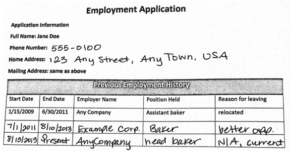
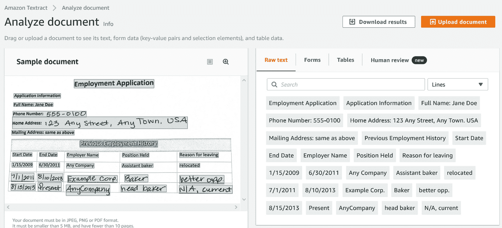

# 第二章：*第二章*：介绍 Amazon Textract

在上一章中，您了解了企业如何利用自然语言处理（NLP）从文本中获取洞察力，并简要介绍了 *AWS ML 堆栈*。接下来，我们将详细介绍 **Amazon Textract**，并提供动手示例代码和说明。Amazon Textract 是一项 AWS AI 服务，可以在几乎没有机器学习（ML）技能的情况下，从文档和图像中提取文本。在了解 Textract 能做什么之前，我们将首先讨论一些文档处理中的挑战。然后，我们将讲解 Textract 如何帮助克服这些挑战。我们还将讨论使用 Amazon Textract 的好处以及其产品特点。最后，我们将介绍如何将 Amazon Textract 快速集成到您的应用程序中。

本章将通过以下部分进行导航：

+   设置您的 AWS 环境

+   克服文档处理的挑战

+   了解 Amazon Textract 的帮助作用

+   展示 Amazon Textract 的产品特点

+   将 Amazon Textract 与您的应用程序集成

# 技术要求

在本章中，您需要访问 [`aws.amazon.com/console/`](https://aws.amazon.com/console/) 上的 AWS 账户。请参考*注册 AWS 账户*小节，位于*设置您的 AWS 环境*部分，了解如何注册 AWS 账户并登录到 **AWS 管理控制台**的详细说明。

本章讨论的解决方案的 Python 代码和示例数据集可以在 [`github.com/PacktPublishing/Natural-Language-Processing-with-AWS-AI-Services/tree/main/Chapter%2002`](https://github.com/PacktPublishing/Natural-Language-Processing-with-AWS-AI-Services/tree/main/Chapter%2002) 获取。

请查看以下视频，在 [`bit.ly/3be9eUh`](https://bit.ly/3be9eUh) 上查看代码演示。

# 设置您的 AWS 环境

重要提示

请不要单独执行本节中的说明。本节是书中所有基本设置任务的参考。您将在本章及本书后续章节中构建解决方案时，指引您进入本节。只有在指引时，才执行这些任务。

根据您所在的章节，您将使用 AWS 管理控制台、Amazon SageMaker Jupyter Notebook、命令行，或者它们的组合来运行任务。无论哪种方式，您都需要正确的 AWS **身份与访问管理**（**IAM**）权限、资源，并且在大多数情况下，还需要一个或多个 Amazon **简单存储服务**（**S3**）存储桶，作为构建解决方案的先决条件。本节提供设置这些基本任务的说明。我们将在本书的后续章节中根据需要参考本节。

## 注册 AWS 账户

在本章及所有后续运行代码示例的章节中，你将需要访问一个 AWS 账户。在开始之前，我们建议你按照以下步骤创建一个 AWS 账户：

注意

请使用 AWS 免费套餐，它允许你基于一定的时间限制或服务使用限制免费试用服务。有关详细信息，请参阅[`aws.amazon.com/free`](https://aws.amazon.com/free)。

1.  打开[`portal.aws.amazon.com/billing/signup`](https://portal.aws.amazon.com/billing/signup)。

1.  点击页面左下角的**创建一个新的 AWS 账户**按钮

1.  输入你的电子邮件地址和密码，确认密码，并提供一个 AWS 账户名称（这可以是你如何使用该账户的参考，例如**沙箱**等）。

1.  选择**使用类型**（**商务或个人**），提供你的联系信息，阅读并同意 AWS 客户协议条款，然后点击**继续**。

1.  提供信用卡信息和账单地址，点击**继续**。

1.  完成剩余步骤以完成 AWS 账户的注册过程。请记下你的用户 ID 和密码；这是你访问 AWS 账户的根凭证。

1.  一旦 AWS 账户创建完成，前往**AWS 管理控制台** – [console.aws.amazon.com](http://console.aws.amazon.com) – 使用你在之前步骤中创建的根凭证登录。

1.  在控制台顶部的服务搜索框中输入`IAM`并选择**IAM**以导航到 IAM 控制台。在 IAM 控制台的左侧面板中选择**用户**，然后点击**添加用户**。

1.  提供一个用户名，然后选择**程序访问**和**AWS 管理控制台访问**作为**访问类型**。保持密码为**自动生成**，并保持**需要密码重置**为已选状态。

1.  点击**下一步：权限**。在**设置权限**页面，点击**直接附加现有策略**，并勾选**AdministratorAccess**左侧的复选框。点击**下一步**两次进入**审核**页面。点击**创建用户**。

1.  现在返回到 AWS 管理控制台([console.aws.amazon.com](http://console.aws.amazon.com))并点击**登录**。提供你在上一步创建的 IAM 用户名、临时密码，并输入新密码以登录控制台。

1.  在各个章节和部分中被提示时，登录到你的 AWS 账户。

现在你可以访问 AWS 管理控制台([`aws.amazon.com/console/`](https://aws.amazon.com/console/))。在接下来的章节中，我们将展示如何创建一个 S3 桶并上传你的文档。

## 创建一个 Amazon S3 桶，一个文件夹，并上传对象

在本书中，我们将使用 Amazon S3 作为我们解决方案的存储选项。因此，我们需要创建一个 S3 桶，在桶内创建文件夹，并上传文档以供解决方案使用。请按照以下步骤学习如何操作：

1.  登录 AWS 管理控制台（[`aws.amazon.com/console/`](https://aws.amazon.com/console/)），在顶部的搜索栏中输入`S3`。

1.  从搜索结果中选择**S3**，并导航到 Amazon S3 控制台。点击**创建存储桶**。

1.  在**创建存储桶**页面上，提供一个**存储桶名称**（名称不能包含空格或大写字母；更多详情，请参阅[`docs.aws.amazon.com/console/s3/bucket-naming`](https://docs.aws.amazon.com/console/s3/bucket-naming)），并从列表中选择一个**AWS 区域**（有关 AWS 区域的更多详情，请参阅[`docs.aws.amazon.com/AmazonRDS/latest/UserGuide/Concepts.RegionsAndAvailabilityZones.html`](https://docs.aws.amazon.com/AmazonRDS/latest/UserGuide/Concepts.RegionsAndAvailabilityZones.html)）。

1.  接受其余选项的默认值，并点击**创建存储桶**。有关这些选项含义的更多详情，请参阅[`docs.aws.amazon.com/AmazonS3/latest/userguide/UsingBucket.html`](https://docs.aws.amazon.com/AmazonS3/latest/userguide/UsingBucket.html)。

1.  现在我们的 S3 存储桶已成功创建，可以在**存储桶**窗格上使用存储桶名称进行搜索，或者如果在**存储桶**窗格中的存储桶列表中显示，则点击存储桶名称。在存储桶页面上，点击页面右侧的**创建文件夹**按钮。

1.  在**创建文件夹**页面上，为文件夹提供一个名称，接受其余字段的默认值，并点击页面右下角的**创建文件夹**。

1.  在**对象**页面上，可以在**对象**标题下方的搜索栏中搜索您创建的文件夹，或者点击文件夹名称。

1.  现在您可以选择右侧的**添加文件**或**添加文件夹**按钮，以显示从计算机选择文件或文件夹添加到我们创建的 S3 存储桶中的选项。

    请注意，AWS 管理控制台并非上传对象到 S3 的唯一选项。您可以使用 AWS **命令行界面**（**CLI**）（更多详情，请参阅[`docs.aws.amazon.com/cli/latest/reference/s3/`](https://docs.aws.amazon.com/cli/latest/reference/s3/)），或者也可以使用 Python SDK 编程方式上传文件，例如（[`boto3.amazonaws.com/v1/documentation/api/latest/reference/services/s3.html`](https://boto3.amazonaws.com/v1/documentation/api/latest/reference/services/s3.html)）。AWS 提供多种编程语言的 SDK（[`aws.amazon.com/tools/`](https://aws.amazon.com/tools/)）。

至此，关于创建 S3 存储桶、创建文件夹和将对象上传到存储桶的说明结束。在下一部分中，让我们看看如何为我们的 Amazon SageMaker Jupyter 笔记本角色添加 IAM 权限策略。

## 创建 Amazon SageMaker Jupyter 笔记本实例

在本节中，我们将看到如何在 Amazon SageMaker 中创建一个笔记本实例。这是一个重要步骤，因为我们的许多解决方案示例是通过笔记本运行的。在创建笔记本之后，请根据正在构建的解决方案，在相关章节中按照说明使用笔记本。请按照以下步骤创建 Amazon SageMaker Jupyter 笔记本实例：

1.  如果尚未登录 AWS 管理控制台，请先登录。然后在页面顶部的服务搜索框中输入`SageMaker`，从列表中选择**SageMaker**，并点击它进入 Amazon SageMaker 管理控制台。

1.  在 SageMaker 控制台的左侧面板中，点击**Notebook**以展开选项，并点击**Notebook 实例**。

1.  在**笔记本实例**页面，点击右上角的**创建笔记本实例**按钮。

1.  为笔记本实例输入名称，并选择合适的笔记本实例类型。对于本书中的大多数解决方案构建，AWS Free Tier（[`aws.amazon.com/free`](https://aws.amazon.com/free)）实例，如`ml.t2.medium`，应该足够了。

1.  在**权限和加密**部分，点击**IAM 角色**列表，选择**创建新角色**，然后选择**任何 S3 存储桶**。

1.  对其余字段选择默认值，并点击**创建笔记本实例**。

    注意

    默认情况下，SageMaker 会为每个笔记本实例提供互联网访问权限。如果您希望禁用此笔记本实例的互联网访问，可以将其附加到您的**虚拟私有云**（**VPC**）中，VPC 是一个高度安全的虚拟网络，用于在云中启动 AWS 资源（https://docs.aws.amazon.com/sagemaker/latest/dg/appendix-notebook-and-internet-access.html），并选择禁用互联网访问。我们需要此笔记本实例的互联网访问，因此，如果您打算附加 VPC 并通过 SageMaker 禁用互联网访问，请配置**网络地址转换**（**NAT**）网关，允许 VPC 子网中的实例与 VPC 外部的资源通信，但反向不可行（[`docs.aws.amazon.com/vpc/latest/userguide/vpc-nat-gateway.html`](https://docs.aws.amazon.com/vpc/latest/userguide/vpc-nat-gateway.html)），或者使用接口 VPC 端点（[`docs.aws.amazon.com/sagemaker/latest/dg/interface-vpc-endpoint.html`](https://docs.aws.amazon.com/sagemaker/latest/dg/interface-vpc-endpoint.html)），通过 AWS 骨干网在笔记本实例和您的 VPC 之间提供私有连接。这样可以通过您在 VPC 中实施的控制来管理笔记本实例的互联网访问。

您的笔记本实例将需要几分钟时间进行配置；一旦准备好，状态将变为**InService**。请按照*使用 Amazon Textract 与您的应用程序*部分的说明，了解如何使用您的笔记本实例。在接下来的几部分中，我们将逐步介绍修改我们附加到笔记本的 IAM 角色所需的步骤。

## 更改 Amazon SageMaker 笔记本执行角色的 IAM 权限和信任关系

注意

您不能向一个 IAM 角色附加超过 10 个托管策略。如果您的 IAM 角色已经有来自前一章节的托管策略，请在根据当前章节的要求添加新策略之前，先解除附加此策略。

当我们创建一个**Amazon SageMaker** Jupyter 笔记本实例（如我们在前一部分所做的那样）时，默认角色创建步骤包括将权限授予您指定的 S3 桶或 AWS 账户中的任何 S3 桶。但通常，我们需要更多的权限。例如，我们可能需要使用**Amazon Textract**或**Amazon Comprehend** API 的权限，或者其他服务的权限。

在本节中，我们将逐步介绍为我们的 Amazon SageMaker Jupyter 笔记本角色添加额外权限策略所需的步骤：

1.  在您的 AWS 管理控制台页面顶部的服务搜索栏中输入`sagemaker`以打开 Amazon SageMaker 控制台，并从列表中选择**Amazon SageMaker**。

1.  在**Amazon SageMaker**控制台的左侧面板中，展开**Notebook**并点击**Notebook 实例**。

1.  点击您需要更改权限的笔记本实例名称。

1.  在**Notebook 实例设置**页面，向下滚动至**权限和加密**，然后点击**IAM 角色 ARN**。

1.  这将打开**IAM 管理控制台**，并显示您的角色**摘要**以及该角色的**权限**和其他详细信息。点击**附加策略**。

1.  在搜索栏中输入`textract`，选择您感兴趣的策略旁边的复选框，然后点击右下角的**附加策略**。现在您应该能看到该策略已附加到您的角色。

1.  在某些情况下，我们可能需要自定义策略来满足我们的需求，而不是 AWS 提供的托管策略。具体来说，我们添加一个内联策略（[`docs.aws.amazon.com/IAM/latest/UserGuide/id_roles_use_passrole.html`](https://docs.aws.amazon.com/IAM/latest/UserGuide/id_roles_use_passrole.html)），以允许我们的 SageMaker 笔记本执行角色将`PassRole`权限授予能够承担该角色的服务（在**信任关系**中添加）以执行从笔记本中需要完成的操作。点击 SageMaker 笔记本执行角色摘要页面右侧的**添加内联策略**。

1.  现在点击**JSON**标签，并将以下 JSON 语句粘贴到输入区域：

    ```py
    { "Version": "2012-10-17", "Statement": [ {
      "Action": [
          "iam:PassRole"
      ],
      "Effect": "Allow",
      "Resource": "<IAM ARN of your current SageMaker notebook execution role>"
      }
     ]
    }
    ```

1.  点击**审查策略**。

1.  在**审查策略**页面中，输入您的策略名称，并点击页面右下角的**创建策略**。

1.  现在您已经知道如何将权限和内联策略附加到您的角色，让我们进入本节的最后一步，更新您的角色的**信任关系**（[`docs.aws.amazon.com/directoryservice/latest/admin-guide/edit_trust.html`](https://docs.aws.amazon.com/directoryservice/latest/admin-guide/edit_trust.html)）。在 SageMaker 笔记本执行角色的**概述**页面上，点击**信任关系**标签页，然后点击**编辑信任关系**。

1.  复制以下 JSON 代码段并将其粘贴到**策略文档**输入字段中。此声明允许 Amazon SageMaker、Amazon S3 和 Amazon Comprehend 获取假设 SageMaker 笔记本执行角色权限的能力。根据我们正在构建的章节和用例，假设角色的服务会有所不同，您将根据需要获得相应的指导。目前，请将以下 JSON 代码段视为示例，以便理解如何编辑信任关系：

    ```py
    { "Version": "2012-10-17", "Statement": [
      { "Effect": "Allow", 
        "Principal": 
          { "Service": 
              [ "sagemaker.amazonaws.com", 
                "s3.amazonaws.com", 
                "comprehend.amazonaws.com" ] 
              }, 
              "Action": "sts:AssumeRole" } 
          ] 
      }
    ```

1.  点击页面右下角的**更新信任策略**按钮。

1.  您应该查看为您的角色更新的**受信任实体**。

您现在已经完成。在本节中，您学习了如何更新 Amazon SageMaker 笔记本实例的 IAM 角色，添加权限策略、添加自定义内联策略，最后，编辑信任关系以添加您解决方案构建所需的受信任实体。您现在可以返回到之前导航到此章节的地方，继续您的解决方案构建任务。

# 克服文档处理中的挑战

自动化运营活动对于希望最小化成本、提高生产力并实现更快市场推广周期的组织来说至关重要。通常，这些企业核心运营活动会优先进行自动化。后勤支持流程，包括行政任务，通常被排在优先级列表的底部，因为它们可能不被视为*至关重要*。根据这份*行业分析师*报告（[`www.industryanalysts.com/111015_konica/`](https://www.industryanalysts.com/111015_konica/)，*撰写于 2015 年，数据来源包括 Gartner Group、AIIM、美国劳动部、Imaging Magazine 和 Coopers and Lybrand，* *并且* *于 2021 年 3 月 30 日访问*），组织仍然依赖纸质文档，而维护这些文档所需的工作量由于缺乏自动化和文档工作流中的低效，给企业带来了重大挑战。

许多组织，如金融机构、医疗保健、制造业以及其他中小型企业，拥有大量扫描和手写文档。这些文档可能采用多种格式，如发票、收据、简历、申请表等。此外，这些文档并不是集中存放的，而是分散在各个地方，这使得从这些文档中提取有用的信息变得非常困难。假设你有一个文档档案库，你希望从中提取数据。假设我们构建了一个应用程序，可以让你轻松地在这些档案库中的大量文档中进行搜索。从这些文档中提取数据对你来说非常重要，因为它们包含了许多对你的组织有用的信息。一旦你提取出所需的信息（当然，我们首先需要确定哪些是有用的，哪些不是），你就可以做很多事情，比如发现业务背景、建立合规性、为重要关键词设计搜索和发现功能，甚至自动化现有的业务流程。

随着时间的推移，我们看到越来越多的组织由于易于与其运营系统集成而开始拥抱数字媒体来处理业务流程，但纸质文档不会很快消失。根据这篇文章（[`medium.com/high-peak-ai/real-time-applications-of-intelligent-document-processing-993e314360f9`](https://medium.com/high-peak-ai/real-time-applications-of-intelligent-document-processing-993e314360f9)，*2021 年 3 月 30 日访问*)，实际上，组织中纸质文档的使用在增加。因此，自动化文档处理工作流变得非常重要。

那么，纸质文档的问题是什么呢？问题在于使用传统方法从文档中提取数据所需的成本和时间。最常见的方法之一是**人工处理**这些文档。什么是人工处理？就是人工阅读文档，然后将所有的数值输入到应用程序中，或者复制粘贴到另一个文档中。这种方法效率低下且成本高昂：不仅需要投入时间和精力培训人工劳动力，使其理解所处理的数据领域，而且由于人为因素，数据输入过程中可能会出现错误。例如，在处理税务表格和财务表格时，你需要一位经验丰富的**注册会计师**（**CPA**）来进行手动输入，因为这需要会计知识来提取所需的详细信息。因此，我们可以看到，传统的人工处理文档的方法既耗时、易出错，又成本高昂。

我们看到的另一种方法是，组织使用基于规则的格式化模板与 **光学字符识别** (**OCR**) 系统结合，从这些文档中提取数据。该方法的挑战在于，这些基于规则的系统没有足够的智能来适应不断变化的文档格式，甚至在模板稍有变化时也会出现故障。随着业务的增长和扩展，其基础流程需要灵活性以适应，这通常导致需要处理多个文档结构，可能达到数百甚至数千种格式。尝试为每种文档类型设置和管理这些格式，很快就会变成一个巨大的维护负担，一旦文档格式发生变化，基于规则的系统就变得难以更新这些格式。另一个需要考虑的挑战是基础设施的配置以及处理数百万份此类文档所需的扩展性和相关成本。

这就是我们拥有 **Amazon Textract** 的原因，它是一个完全托管的机器学习和人工智能服务，具备开箱即用的功能，可以从图像和 PDF 文档中提取表单、表格和页面中的手写和印刷文本。Textract 提供了 **应用程序编程接口** (**APIs**)，背后运行着强大的机器学习模型，这些模型经过数百万文档的训练，提供了一种高效的智能文本提取解决方案。

因此，我们在本节中讨论了处理文档的挑战以及为什么我们需要 Amazon Textract。在下一节中，我们将讨论 Amazon Textract 如何帮助组织快速解决这一痛点。

# 了解 Amazon Textract 如何提供帮助

我们在*第一章*中简要介绍了 *AWS AI 服务*，即 *业务背景中的自然语言处理和 AWS AI 服务简介*，并介绍了 *自然语言处理的业务背景*。Amazon Textract 是 AWS AI 服务堆栈中的一个基于 OCR 的服务，提供现成的智能功能，使您无需任何机器学习经验就可以使用它进行文档处理工作流。值得注意的是，Amazon Textract 的起源来自为 [Amazon.com](http://Amazon.com) 构建的深度学习机器学习模型。它配备了一个预训练模型，并提供 API，您可以通过这些 API 发送 PDF 或图像格式的文档，并得到以文本、表格和键值对的形式返回的响应，并附带一个置信度分数。

注意

Amazon Textract 目前支持 PNG、JPEG 和 PDF 格式。

Amazon Textract 提供了无服务器的 API，无需管理任何基础设施，使你能够快速自动化文档管理并扩展到处理数百万份文档。一旦提取了文档内容，你可以在你的业务应用中使用这些数据，处理各种行业和运营需求的文档处理场景。Amazon Textract 的模型会随着使用不断学习，因此随着你继续使用，它们会变得更加智能，更好地理解你的文档。请参阅以下列表，了解我们将在接下来的章节中介绍的部分 Amazon Textract 使用案例：

+   **自然语言处理 (NLP)** *用于文本提取* – 本应用场景将展示一个端到端的示例，如何使用 Textract 从文档中提取文本，然后对文本应用 NLP 技术以得出洞察。我们将在 *第三章**，Amazon Comprehend 入门* 中介绍一些关键概念和示例。

+   *快速建立自动化文档处理工作流* – 在这个应用场景中，我们将展示如何使用 Textract 和其他 AWS 服务构建一个解决方案，自动化常见的文档管理任务，如贷款申请审批工作流，从而实现成本和时间节省。这个应用场景将在 *第四章**，自动化文档处理工作流* 中进行介绍。

+   *构建可扩展的智能集中式搜索索引* – Amazon Textract 使你能够从扫描文档中提取数据并将其存储在 Amazon *S3* 中。Amazon S3 是一种具有成本效益和可扩展性的对象存储解决方案。存储在 Amazon S3 中的数据可以通过 **Amazon Elasticsearch** 索引，从而使你的档案可搜索。你还可以通过将数据迁移到 Amazon S3 来创建一个集中式搜索解决方案，整合你分散的数据。我们将在 *第五章**，创建 NLP 搜索* 中详细介绍这个应用场景。

+   *在档案文档中实施合规性* – 由于 Textract 本身的机器学习功能，它可以自动识别页面、表格和表单中的文本。当你想构建依赖于文档元数据来确定业务流程合规性的智能系统时，这一功能尤其有用。我们将在 *第六章**，利用 NLP 提高客户服务效率* 中查看这个应用场景的示例。

+   *将自动化数据捕捉从表单集成到现有应用程序/聊天机器人中* – Amazon Textract 提供了 API，可以在您的应用程序中使用，支持多种文档类型。例如，您可能需要查询供应商的收据，并将其作为运营决策的一部分。在这个用例中，我们将看到如何通过 **Amazon Lex**（[`aws.amazon.com/lex/`](https://aws.amazon.com/lex/)）将聊天机器人与您的文档处理应用程序结合使用。详细内容将在*第八章*《利用自然语言处理将您的媒体内容变现》中讲解。

如您所见，Amazon Textract 可用于多种类型的文档处理用例，并提供了传统基于规则系统或 OCR 解决方案中找不到的若干高级功能。您可以在此处阅读其中一些好处：

+   *文本？结构化？非结构化？Textract 来拯救*: Amazon Textract 使用 AI 和机器学习（ML）来检测表格中的结构化文本以及来自文档的非结构化文本，如页面、行和单词中的文本数据。Amazon Textract 首先确定文档的布局，然后检测文档中的内容类型及其关系和上下文，再进行提取。它还为每个检测到的文本、表格和键/值对提供置信度分数。我们将在下一节看到一些示例。

+   *Amazon Textract 克服了 OCR 的局限性*: 虽然 Amazon Textract 隐式使用 OCR，但这并不是唯一的好处。您无需担心维护各种模板和格式，因为它使用的是机器学习，而不是基于模板的方法。因此，它适用于跨行业使用的各种文档模板，例如发票、收据、雇佣表格、简历、税务准备文件、医疗索赔表格、技术规范等。

+   *安全性和合规性*: 安全性是 AWS 的最高优先级。Amazon Textract 遵循共享责任模型（[`aws.amazon.com/compliance/shared-responsibility-model/`](https://aws.amazon.com/compliance/shared-responsibility-model/)）。

    要了解 Amazon Textract 的安全性和合规性功能，请参考[`docs.aws.amazon.com/textract/latest/dg/security.html`](https://docs.aws.amazon.com/textract/latest/dg/security.html)。Amazon Textract 通过多个 AWS 合规程序，包括 **系统和组织控制**（**SOC**）、**国际标准化组织**（**ISO**），以及 **PCI** 和 **HIPAA**，进行合规认证。有关更多细节，请参考[`docs.aws.amazon.com/textract/latest/dg/SERVICENAME-compliance.html`](https://docs.aws.amazon.com/textract/latest/dg/SERVICENAME-compliance.html)。

+   *简易集成到应用程序的 API*：Amazon Textract 提供 Java、Python 和其他语言的 API。这些 API 背后运行强大的 ML 模型，可以轻松从文档中提取文本。有关 API 的详细讲解，请参见 *在应用程序中使用 Amazon Textract* 部分。

+   *Amazon Textract 是无服务器和可扩展的*：Amazon Textract 是一项完全托管的无服务器服务，它会根据你需要处理的文档量自动扩展。它能够扩展以应对更多需求，并在需求减少时缩减规模。

+   *成本效益*：Amazon Textract 的定价类似于其他完全托管的 AWS 服务。客户仅需为实际使用的部分付费。例如，在 us-east-1 区域处理一页文档的费用为 $0.0015。为了让你能够快速入门，我们提供了免费层。更多详情，请参见 [`aws.amazon.com/textract/pricing/`](https://aws.amazon.com/textract/pricing/)。

在本节中，我们简要列出了 Amazon Textract 可以帮助解决的一些有趣的文档处理用例，并回顾了 Amazon Textract 的一些关键优势，如预构建的智能、成本效益、可扩展性和易用性。在下一节中，我们将使用 AWS 管理控制台（[`console.aws.amazon.com/`](https://console.aws.amazon.com/)）来演示 Amazon Textract 的产品特性，如表格检测、表单检测、手写检测、文本检测以及多语言支持。

# 演示 Amazon Textract 的产品特性

好的，现在是时候开始探索我们一直在谈论的酷炫功能了。我们将从查看如何快速上传我们 GitHub 仓库中提供的示例文档开始（[`github.com/PacktPublishing/Natural-Language-Processing-with-AWS-AI-Services`](https://github.com/PacktPublishing/Natural-Language-Processing-with-AWS-AI-Services)）。接下来，我们将演示 Amazon Textract 的关键特性，并使用一个法语 COVID-19 表单来展示多语言支持。我们还将介绍 Amazon Textract 与 Amazon A2I 的集成，A2I 可以帮助你快速设置一个人工审核工作流，适用于需要高度准确的文本，如发票金额（[`aws.amazon.com/augmented-ai/`](https://aws.amazon.com/augmented-ai/)）的高层次处理。我们将涉及以下内容：

1.  登录到你的 AWS 管理控制台。

1.  上传示例文档。

1.  原始文本或文本提取。

1.  关键值提取或表单值提取。

1.  表格提取。

1.  多语言支持。

1.  手写识别。

1.  支持 Amazon Augmented AI 或 A2I 进行人工介入。

作为第一步，请参阅 *技术要求* 部分，注册一个 AWS 账户并登录开始使用。

## 上传示例文档。

现在，让我们看看如何将文档上传到 Textract：

1.  从 GitHub 仓库下载示例文档（[`github.com/PacktPublishing/Natural-Language-Processing-with-AWS-AI-Services/blob/main/Chapter%2002/employment_history.png`](https://github.com/PacktPublishing/Natural-Language-Processing-with-AWS-AI-Services/blob/main/Chapter%2002/employment_history.png)）。

1.  在您的 AWS 管理控制台中，进入 `Textract`，然后选择 **Amazon Textract**。

1.  现在点击**尝试 Amazon Textract**，然后点击**上传文档**按钮选择您在*步骤 1*中下载的文档：


图 2.1 – 点击 Amazon Textract 控制台的上传文档按钮

这将把文档上传到 Amazon Textract：



图 2.2 – Employment application.png

## 原始文本或文本提取

在 Amazon Textract 控制台中显示以下分析：



图 2.3 – Amazon Textract 文本提取控制台

点击**原始文本**选项卡查看提取的文本：


图 2.4 – Amazon Textract 文本响应为行和单词

注

Amazon Textract 支持旋转文档。请参阅 [`docs.aws.amazon.com/textract/latest/dg/limits.html`](https://docs.aws.amazon.com/textract/latest/dg/limits.html) 获取有关 Textract 服务限制的更多详细信息。

### 处理多页文档

Amazon Textract 具有识别多种文档格式的智能功能，并能相应地提取内容。例如，您可能正在处理报告或带有多个段落的提案文档。请下载*图 2.4*中显示的图像（[`github.com/PacktPublishing/Natural-Language-Processing-with-AWS-AI-Services/blob/main/Chapter%2002/two-column-image.jpeg`](https://github.com/PacktPublishing/Natural-Language-Processing-with-AWS-AI-Services/blob/main/Chapter%2002/two-column-image.jpeg)），并将其上传到 Amazon Textract 控制台以尝试：


图 2.5 – 多页扫描图像示例

Amazon Textract 将提取页面、段落、行和单词，并提供这些单词和段落在文档中的确切位置，这对于上下文非常重要。查看以下屏幕截图以了解使用 Textract 获得的边界框或几何形状：


图 2.6 – Textract 检测文本的边界框响应

这是 AWS 控制台中此文档的截图：


图 2.7 – 在 AWS 控制台中使用 Amazon Textract 提取的多页扫描图像文本响应

## 表单数据和键值对

Amazon Textract 会对文档进行分段，以识别表单，从而返回表单中的键值对。我们将使用来自 GitHub 仓库的就业申请示例文档模板（[`github.com/PacktPublishing/Natural-Language-Processing-with-AWS-AI-Services/blob/main/Chapter%2002/emp_app_printed.png`](https://github.com/PacktPublishing/Natural-Language-Processing-with-AWS-AI-Services/blob/main/Chapter%2002/emp_app_printed.png)），这是你从 GitHub 仓库下载的：

1.  在 Amazon Textract 控制台中点击**上传文档**按钮：

    ](img/B17528_02_08.jpg)

    图 2.8 – 在 Textract 控制台中的上传文档按钮

1.  点击**表单**标签。你将看到提取的键值对，如下所示：


](img/B17528_02_09.jpg)

图 2.9 – 在 Amazon Textract 控制台中提取示例文档表单和键值对

## 表格提取

Amazon Textract 能够识别文档中是否包含表格结构的内容，例如收据，或技术规格清单、药房处方数据等。Textract 还允许你指定是否在使用 API 时应查找文档中的表格。除了表格及其内容，Textract 还会返回表格内容的元数据和索引信息，你可以在后面的 API 演示中了解更多内容。在此演示中，你可以下载这个示例收据（[`github.com/PacktPublishing/Natural-Language-Processing-with-AWS-AI-Services/blob/main/Chapter%2002/receipt-image.png`](https://github.com/PacktPublishing/Natural-Language-Processing-with-AWS-AI-Services/blob/main/Chapter%2002/receipt-image.png)）并将其上传到 Amazon Textract 控制台。你将看到以下截图中提取的表格：


图 2.10 – 在 Amazon Textract 控制台中提取示例收据的表格。

## 多语言支持

Amazon Textract 提供多语言文本提取支持。有关最新支持的语言列表，请参阅此链接：[`aws.amazon.com/textract/faqs/`](https://aws.amazon.com/textract/faqs/)。

注意

当前支持手写文本识别的语言仅为英语（截至写作时为*2021 年 4 月*）。

在法国 COVID 封锁期间，任何想要离开家的人都必须填写一份声明表单，解释他们外出的原因。我们将使用此示例表单来演示 Amazon Textract 的法语语言检测功能。该表单可通过 [`www.connexionfrance.com/French-news/Covid-19-in-France-Your-questions-on-declaration-form-needed-to-leave-the-house`](https://www.connexionfrance.com/French-news/Covid-19-in-France-Your-questions-on-declaration-form-needed-to-leave-the-house) 获取。

你也可以从[`github.com/PacktPublishing/Natural-Language-Processing-with-AWS-AI-Services/blob/main/Chapter%2002/form-derogatoire.jpg`](https://github.com/PacktPublishing/Natural-Language-Processing-with-AWS-AI-Services/blob/main/Chapter%2002/form-derogatoire.jpg)下载此表单，并将其上传到 Amazon Textract 控制台。点击**原始文本**标签，然后选择**表单**：


图 2.11 – 从示例扫描的法语 COVID 表单中提取的法语数据

Amazon Textract 能够从这张法语表单中提取键值对和原始文本。

## 手写识别

客户在数据提取中面临的另一个非常常见的挑战是混合内容文档，例如手写文本和打印文本混合的文档。例如，这可能是一张医生为病人开具的处方表单，纸张上印有医生的名字和地址。这也带出了 Amazon Textract 的另一个关键功能：从文档中识别手写内容：

1.  从 GitHub 仓库下载手写发票样本([`github.com/PacktPublishing/Natural-Language-Processing-with-AWS-AI-Services/blob/main/Chapter%2002/sample-invoice.png`](https://github.com/PacktPublishing/Natural-Language-Processing-with-AWS-AI-Services/blob/main/Chapter%2002/sample-invoice.png))。

1.  将样本上传到 Amazon Textract 控制台，如*图 2.12*所示。Amazon Textract 可以从样本文档中提取手写文本和打印文本的键值对（表单数据）、表格和文本：

    图 2.12 – 从示例发票中提取的手写及打印文本

1.  你可以切换到**表单**和**表格**标签，查看 Amazon Textract 如何快速提取来自此样本文档的手写和打印内容。

## 人类参与

Amazon Textract 提供与**Amazon A2I**的内建集成（[`aws.amazon.com/augmented-ai/`](https://aws.amazon.com/augmented-ai/)）。使用 Amazon A2I，您可以构建人工工作流，管理需要进一步人工审核的文档，进行审计或只是检查机器学习预测。例如，社保号码或货币金额可能需要高度准确。它类似于通过 AI 获得文本的初步处理，然后让人工团队核对 AI 为您预测的内容。

当我们进入*第十七章**，《从手写内容中可视化洞察》时，我们将详细讲解手写识别和人工审核流程。

最后，Textract 控制台提供了下载和查看 JSON 文档的选项，这些文档是我们所演示的各种 Textract 特性调用 API 后的响应结果：


图 2.13 – 从控制台下载 Textract 结果

在本节中，我们介绍了 Amazon Textract 的关键产品功能，如何从 PDF 和图像文档中提取文本、表单、表格和手写内容，包括对多语言文档的支持。在下一节中，我们将回顾如何使用 Amazon Textract API，详细解析 JSON 响应，并理解如何将 Textract 与您的应用程序结合使用。

# 将 Amazon Textract 与您的应用程序结合使用

在本节中，我们将介绍并演示 Amazon Textract API，用于文档的实时分析和批量处理。我们将通过 Amazon SageMaker Jupyter 笔记本展示这些 API 的实际应用。在本节中，您需要创建一个 Amazon SageMaker Jupyter 笔记本，并为该笔记本角色设置**IAM**权限，以便访问 Amazon Textract。之后，您需要从我们的 GitHub 仓库克隆笔记本（[`github.com/PacktPublishing/Natural-Language-Processing-with-AWS-AI-Services`](https://github.com/PacktPublishing/Natural-Language-Processing-with-AWS-AI-Services)），下载示例图像，创建一个 Amazon S3（[`aws.amazon.com/s3/`](https://aws.amazon.com/s3/)）桶，将这些图像上传到 S3 桶，然后在笔记本中引用该位置进行处理。

让我们开始吧：

1.  有关创建 Amazon SageMaker 笔记本实例的说明，请参见本章开头的*设置 AWS 环境*部分中的*创建 Amazon SageMaker Jupyter 笔记本实例*子节。或者，您可以参考 Amazon SageMaker 文档来创建笔记本实例：[`docs.aws.amazon.com/sagemaker/latest/dg/gs-setup-working-env.html`](https://docs.aws.amazon.com/sagemaker/latest/dg/gs-setup-working-env.html)。

    创建 Amazon SageMaker Jupyter 笔记本时的 IAM 角色权限

    首先，在创建笔记本时接受 IAM 角色的默认设置，以便访问任何 S3 桶。笔记本实例创建后，按照本章开头**设置 AWS 环境**部分下的*子节：更改 IAM 权限和信任关系以执行 Amazon SageMaker 笔记本角色*中的说明，添加 **AmazonTextractFullAccess** 作为笔记本 IAM 角色的权限策略。

1.  创建笔记本实例并且状态为**InService**后，在笔记本实例的**操作**菜单下点击**打开 Jupyter**：

    图 2.14 – 打开 Jupyter 笔记本

    这将带你进入笔记本实例的主文件夹。

1.  点击**新建**并选择**终端**，如下面的截图所示：

    图 2.15 – 在 Jupyter 笔记本中打开终端

1.  在终端窗口中，首先输入`cd SageMaker`，然后输入`git clone https://github.com/PacktPublishing/Natural-Language-Processing-with-AWS-AI-Services`，如下面的截图所示：

    图 2.16 – git clone 命令

1.  现在，退出终端窗口，返回到主文件夹，你会看到一个名为`Chapter 02`的文件夹。打开该文件夹，你应该能看到一个名为**Amazon Textract API Sample.ipynb**的笔记本。点击打开此笔记本。

1.  按照本笔记本中的步骤执行，每次执行一个单元格，步骤对应于本节接下来的子标题。请阅读每个笔记本单元格上方的描述。

## Textract API

在演示如何使用 Textract API 之前，我们将先探讨这些 API 及其功能。Amazon Textract API 可分为同步 API（用于实时处理）和异步 API（用于批处理）。现在我们来了解这些 API 的功能。

### 用于实时处理的同步 API

这些 API 从你现有的本地文件系统（如本地计算机）或 Amazon S3 桶中获取单页扫描图像（JPG 或 PNG）。有两个 API 用于实时分析：

+   **文档文本检测 API**：该 API 将从扫描的图像中提取单词和行。你可以在只需要从扫描中提取文本内容且数据中没有表单或表格的情况下使用此 API，比如故事书、学生考试卷和扫描的新闻文章。你还可以在网页或移动应用中使用此 API 快速扫描文档中的文本内容。另一种使用此 API 的方式是提取文本数据并对其进行进一步的自然语言处理（NLP），例如识别段落和标题，执行关键/值对的数据标注，或将其用于下游处理。

    键/值对

    在表单的情况下，键/值对的键将是名称，值将是“Jane Doe”。

+   **Analyze Document API**：该 API 功能更为全面，可以帮助您从扫描的图像中提取文本，并识别文档中的表单（键/值对）和表格。您可以将此 API 用于各种类型的文档，如发票、收据、医疗登记表、简历、税表以及各种财务表格。您可以创建一个应用程序，用户拍摄收据照片，然后使用此 API 对发票进行快速分析，提取金额或发票 ID。

### 用于批量处理的异步 API。

这些 API 接受上传到 Amazon S3 存储桶的单页或多页图像（JPG/PNG）和 PDF 文件。它执行批量分析，从这些图像和文档中提取内容：

+   `AnalyzeDocument` 同步 API 的功能，因为它将从输入文档中提取文本、表格和表单数据。不同之处在于，该 API 还支持 PDF 文档。输入文档应存储在 Amazon S3 存储桶中，并提供其 S3 URL 给该 API。此 API 将启动文档分析的批处理作业。

+   `StartDocumentAnalysis` 操作以键/值对、表格和文本的形式进行。这也会返回作业 ID 及其成功或失败状态。

+   `DetectDocumentText` API 的功能，它批量检测已上传到 Amazon S3 存储桶的文档中的文本。我们将在 Python notebook 示例中看到该 API 演示。

+   `StartDocumentTextDetection` 操作以行和字的形式进行。这还会返回作业 ID 及其成功或失败状态。

    注意

    批量 API 可与存储在 Amazon S3 存储桶中的 JPEG、PNG 和 PDF 文档一起使用。

在本节中，我们介绍了 Amazon Textract 的批量和实时 API。在下一节中，我们将通过您在上一节中设置的 Jupyter notebook 来实现这些 API。

## 使用 Jupyter notebook 演示 Textract API。

在本节中，我们将通过 Jupyter notebook 提供 Textract API 的实现。我们将执行您在 [`github.com/PacktPublishing/Natural-Language-Processing-with-AWS-AI-Services/blob/main/Chapter%2002/Amazon%20Textract%20API%20Sample.ipynb`](https://github.com/PacktPublishing/Natural-Language-Processing-with-AWS-AI-Services/blob/main/Chapter%2002/Amazon%20Textract%20API%20Sample.ipynb) 中设置的 Jupyter notebook 代码单元，该 notebook 您在前一步骤中已克隆。该 notebook 包含先决步骤，我们将在这里详细讲解所有 API 的完整代码。书中只提供了重要的代码片段，如下所示：

+   `DetectText API` 使用来自本地文件系统的文档，以图像字节的形式传递。

+   使用传递自 S3 的文档，通过 `AnalyzeText API` 检测发票中的文本、表单和表格。

+   使用 `StartDocumentText` 和 `GetDocumentText` API 对就业申请表进行批量处理。

### DetectText API。

让我们开始吧：

1.  打开笔记本并执行第一个单元格，导入 `boto3` 库，以设置 Amazon Textract `boto3` Python SDK。

1.  请参照笔记本设置和安装 `boto3`：

    1.  设置 Amazon S3 Python SDK `boto3` 客户端：[`boto3.amazonaws.com/v1/documentation/api/latest/reference/services/s3.html`](https://boto3.amazonaws.com/v1/documentation/api/latest/reference/services/s3.html)：

        ```py
        s3 = boto3.client('s3')
        ```

    1.  设置 Amazon Textract Python SDK `boto3` 客户端：[`boto3.amazonaws.com/v1/documentation/api/latest/reference/services/textract.html`](https://boto3.amazonaws.com/v1/documentation/api/latest/reference/services/textract.html)：

        ```py
        textract = boto3.client('textract')
        ```

1.  从 [`github.com/PacktPublishing/Natural-Language-Processing-with-AWS-AI-Services/blob/main/Chapter%2002/sample-invoice.png`](https://github.com/PacktPublishing/Natural-Language-Processing-with-AWS-AI-Services/blob/main/Chapter%2002/sample-invoice.png) 下载示例文档。如果您已经克隆了这个 GitHub 仓库，您无需重新下载示例文件，直接在笔记本的 `Chapter 02` 中引用它们即可。

1.  请按照 *设置 AWS 环境* 部分中的 *创建 Amazon S3 存储桶和文件夹并上传对象* 小节的说明，创建一个 S3 存储桶并上传您的示例文档。

1.  复制您创建的 Amazon S3 存储桶的名称，并粘贴到笔记本中，以便指向您上传的示例文档：

    ```py
    s3BucketName = "<your amazon s3 bucket>" 
    ```

1.  这是我们在这个笔记本中将使用的图像：

    ```py
    documentName = "sample-invoice.png"
    display(Image(filename=documentName))
    ```

    这将显示以下图像：

    

    图 2.17 – 一个示例收据

1.  让我们回到笔记本并运行以下代码，看看 Amazon Textract 的 `DetectText API` 是如何工作的。

    以下代码将读取文档内容，形式为图像字节：

    ```py
    with open(documentName, 'rb') as document:
        imageBytes = bytearray(document.read())
    ```

1.  以下代码将通过传递来自您本地文件系统的图像字节来调用 Amazon Textract：

    ```py
    response = textract.detect_document_text(Document={'Bytes': imageBytes})
    ```

    您将图像字节直接传递给该 API 并获取 JSON 响应。该 JSON 响应的结构包含识别的文本块、页面、行、边界框、表单键值和表格。为了理解 Amazon Textract 的 JSON 结构和数据类型，请参考此链接：[`docs.aws.amazon.com/textract/latest/dg/API_Block.html`](https://docs.aws.amazon.com/textract/latest/dg/API_Block.html)。

1.  现在我们将导入 JSON Python 包，以便打印我们的 API 响应：

    ```py
    import json
    print (json.dumps(response, indent=4, sort_keys=True))
    ```

1.  以下展示了文档中一行的示例 JSON 响应。它包括块、块类型、检测该块类型行的置信度分数，以及使用边界框标示的该行的几何位置，和识别的文本：

    ```py
    {
                "BlockType": "LINE",
                "Confidence": 99.96764373779297,
                "Geometry": {
                    "BoundingBox": {
                        "Height": 0.013190358877182007,
                        "Left": 0.5149770379066467,
                        "Top": 0.16227620840072632,
                        "Width": 0.06892169266939163
                    },

    ```

    注意

    这个 API 不会返回表单和表格。它只返回行、单词及相应的边界框。这个 API 对于像审计文档中的段落检测和从扫描书籍中提取文本等用例非常有用。

执行笔记本中的其余单元，以详细探索 JSON 响应。

### DetectDocument API

现在，我们将向您展示如何使用 `DetectDocument` API 检测双栏文档中的文本，并按阅读顺序显示，数据存储在 Amazon S3 存储桶中：

1.  从 [`github.com/PacktPublishing/Natural-Language-Processing-with-AWS-AI-Services/blob/main/Chapter%2002/two-column-image.jpeg`](https://github.com/PacktPublishing/Natural-Language-Processing-with-AWS-AI-Services/blob/main/Chapter%2002/two-column-image.jpeg) 下载示例文档。如果您已经克隆了这个 GitHub 仓库，就不需要重新下载示例，您可以直接在 `Chapter 02` 中引用它。

1.  使用此处的说明将这些文档上传到您的 Amazon S3 存储桶中的 `textract-samples` 前缀：[`docs.aws.amazon.com/AmazonS3/latest/user-guide/upload-objects.html`](https://docs.aws.amazon.com/AmazonS3/latest/user-guide/upload-objects.html)。

1.  显示来自 Amazon S3 存储桶的输入文档：

    ```py
    documentName = "textract-samples/two-column-image.jpg"
    display(Image(url=s3.generate_presigned_url('get_object', Params={'Bucket': s3BucketName, 'Key': documentName})))
    ```

1.  通过指定 Amazon S3 存储桶和文件名来调用 `DetectDocumentText` API，如以下代码片段所示。我们还将打印响应以检查结果：

    ```py
    Response = textract.detect_document_text(
        Document={
            'S3Object': {
                'Bucket': s3BucketName,
                'Name': documentName
            }
        })
    print(response)
    ```

    注意

    关于 `DetectDocumentText` API 的更多详细信息，请参阅此链接：[`boto3.amazonaws.com/v1/documentation/api/latest/reference/services/textract.html#Textract.Client.detect_document_text`](https://boto3.amazonaws.com/v1/documentation/api/latest/reference/services/textract.html#Textract.Client.detect_document_text)。

1.  一旦获得响应，我们将使用以下代码解析多页文档中的按阅读顺序排列的行。我们将使用 Amazon Textract JSON 响应解析器来获取按阅读顺序排列的行。请运行此命令安装该库：

    ```py
    python -m pip install amazon-textract-response-parser 
    ```

1.  现在，运行以下代码，以查看多列格式文档中逐行打印的结果：

    ```py
    doc = Document(response)
    for page in doc.pages:
        for line in page.getLinesInReadingOrder():
              print(line[1])
    ```

    您将获得以下响应：


图 2.18 – 按阅读顺序排列的 Textract 响应行

### AnalyzeDocument API

现在我们将使用 `AnalyzeDocument` API 分析发票，提取表单和表格：

1.  调用 Amazon Textract `AnalyzeDocument` API：

    ```py
    response = textract.analyze_document(
        Document={
            'S3Object': {
                'Bucket': s3BucketName,
                'Name': documentName
            }
        },
        FeatureTypes=["FORMS","TABLES"])
    ```

1.  运行以下代码以解析键/值对并搜索键。为了便于解析 Textract 响应，您可以使用 Amazon Textract 响应解析器库。我们将使用它来提取数据并搜索一些键：

    ```py
    doc = Document(response)
    for page in doc.pages:
        print("Fields:")
        for field in page.form.fields:
            print("Key: {}, Value: {}".format(field.key, field.value))
    ```

1.  在以下代码中，我们正在查找文档中的 `Phone Number` 键：

    ```py
        print("\nGet Field by Key:")
        key = "Phone Number:"
        field = page.form.getFieldByKey(key)
        if(field):
            print("Key: {}, Value: {}".format(field.key, field.value))
    ```

1.  在以下代码中，我们正在查找文档中的 `Address` 键：

    ```py
        print("\nSearch Fields:")
        key = "address"
        fields = page.form.searchFieldsByKey(key)
        for field in fields:
            print("Key: {}, Value: {}".format(field.key, field.value))
    ```

    您将获得以下输出：

    ```py
    Fields:
    Key: Phone:, Value: 206-555-1234
    Key: Phone:, Value: None
    Key: Phone:, Value: None
    Key: COMMENTS OR SPECIAL INSTRUCTIONS:, Value: loading lack locatal in alley
    Key: SALES TAX, Value: 41.21
    Key: SHIPPING and HANDLING, Value: 50.00
    Key: REQUISITIONER, Value: None
    Key: SUBTOTAL, Value: 457.9n
    Key: TOTAL DUE, Value: 549.15
    Key: SALESPERSON, Value: John SMITH
    Key: SHIP TO:, Value: Jane Doe Doe Street Press 987 Doe St. #800 Seattle, WA 98108 206-555-9876
    Key: P.O. NUMBER, Value: 0000145678
    Key: TO:, Value: Jane Doe Doe Street Press 987 Doe St. #800 Seattle, WA 98108 206-555-9876
    Key: DATE:, Value: 01/10/2021
    ```

1.  要从 JSON 响应中解析表格，请参阅以下代码片段：

    ```py
    doc = Document(response)
    for page in doc.pages:
         # Print tables
        for table in page.tables:
            for r, row in enumerate(table.rows):
                for c, cell in enumerate(row.cells):
                    print("Table[{}][{}] = {}".format(r, c, cell.text))
    ```

1.  您将看到以下响应：

    ```py
    Table[0][0] = QUANTITY 
    Table[0][1] = DESCRIPTION 
    Table[0][2] = UNIT PRICE 
    Table[0][3] = TOTAL 
    Table[1][0] = 4 
    Table[1][1] = OFFILE GARS 
    Table[1][2] = 64.99 
    Table[1][3] = 25996 
    Table[2][0] = 2 
    Table[2][1] = OFFICE DESX 
    Table[2][2] = 98.99 
    Table[2][3] = 197.98 
    ```

    注意

    您可以将这些值转换为 pandas DataFrame，我们将在*第十六章*中讨论，*提高 PDF 批处理精度*。

    要了解更多有关 API JSON 响应的信息，请参考此链接：https://docs.aws.amazon.com/textract/latest/dg/how-it-works-tables.html。

### 使用 Textract 异步 API 处理 PDF 文档

在本节中，你将看到如何使用 Textract 异步 API 分析 PDF 文档，以处理示例工作申请表：


图 2.19 – 一份示例工作申请文件

1.  以下代码将帮助你开始使用`StartDocumentText` API 和`GetDocumentText` API：

    ```py
    jobID = startTextAnalysis(s3Bucket, docName)
    print("Started text analysis for: {}".format(jobID))
    if(isAnalysisComplete(jobID)):
        response = getAnalysisResults(jobID)
    ```

1.  在这个`startTextAnalysis`方法中，你调用`StartDocumentTextDetection` API 来启动文本分析任务：

    ```py
    def startTextAnalysis(s3Bucket, doc):
        response = None
        response = textract.start_document_text_detection(
        DocumentLocation={
            'S3Object': {
                'Bucket': s3Bucket,
                'Name': doc
            }
        })
        return response["JobID"]
    ```

1.  一旦启动分析，你可以使用以下方法检查分析是否完成：

    ```py
    def isAnalysisComplete(jobID):
        response = textract.get_document_text_detection(JobId=jobID)
        status = response["JobStatus"]
        print("Text Analysis status: {}".format(status))
        while(status == "IN_PROGRESS"):
            time.sleep(2)
            response = textract.get_document_text_detection(JobId=jobID)
            status = response["JobStatus"]
            print("Status of Text Analysis is: {}".format(status))
        return status
    ```

1.  一旦任务完成，你可以使用`GetDocumentTextDetection` API 获取结果：

    ```py
    def getAnalysisResults(jobID):
        pages = []
        response = textract.get_document_text_detection(JobId=jobID)
        pages.append(response)
        print("We received results for: {}".format(len(pages)))
        nextToken = None
        if('NextToken' in response):
            nextToken = response['NextToken']
        while(nextToken):
            response = textract.get_document_text_detection(JobId=jobId, NextToken=nextToken)
            pages.append(response)
            print("We got the results for: {}".format(len(pages)))
            nextToken = None
            if('NextToken' in response):
                nextToken = response['NextToken']
        return pages
    ```

演示已完成。希望你有机会回顾并使用不同的 Textract API 进行实时和批量处理，并成功完成了你的笔记本。在接下来的部分，我们将展示如何使用这些 API 构建无服务器应用程序。

## 使用 Amazon Textract API 构建应用程序

我们已经讨论了同步（或实时）API 和异步（或批量）API。现在，问题是如何将这些 API 集成到应用程序中。你可以通过使用 AWS Lambda 快速将这些 API 集成到 Web 应用程序或任何批处理系统中。AWS Lambda 以无服务器的方式运行任何代码，无论是 Java 还是 Python。这是一种基于事件的触发或编程技术，你可以根据事件触发 Lambda 函数。例如，你将文档上传到 Amazon S3，这可以触发 Lambda 函数。在该 Lambda 函数中，你可以调用 Amazon Textract API 并将结果保存到 Amazon S3：


](img/B17528_02_20.jpg)

图 2.20 – 使用 Amazon Textract 构建无服务器架构，以便与你的应用程序一起使用

我们将在接下来的章节中详细讨论架构，届时我们将讨论如何使用 Amazon Textract 的同步和异步 API 构建应用程序。我们还将讨论如何使用 AWS API Gateway 创建 RESTful API，以便将其集成到你的 Web 应用程序或移动应用程序中。

# 总结

在本章中，我们详细介绍了 Amazon Textract 及其产品功能，并进行了控制台操作演示，还展示了使用 Textract API 针对不同类型的文档进行实时和批量分析的代码示例。

我们首先介绍了 Amazon Textract 提供的现成智能，借助强大的预训练机器学习模型以及通过 API 调用将其能力集成到应用程序中的能力。我们还了解了 Textract 的一些常见使用案例，并引用了以下章节中的一些内容，在这些章节中我们将更详细地回顾这些使用案例。我们还了解了与传统 OCR 应用程序和基于规则的文档处理相比，Textract 的优势。

我们介绍了如何将 Amazon Textract 与不同类型的扫描图像和表单结合使用的各种示例。我们回顾了 Textract 的不同功能，例如检测原始文本、检测以键值对形式存储的表单值、检测表格中的文本、检测文本页面、检测行和单词、检测手写文本和打印文本，以及检测多语言文本，还包括检测文档中以双栏样式编写的文本。我们讨论了如何使用 Textract API 进行同步处理和异步处理。我们还了解了如何设置 Amazon SageMaker Jupyter notebook，克隆 GitHub 仓库，并开始运行 Jupyter notebook。我们能够使用 Amazon S3 桶存储输入文档，并将其与 Textract 一起使用，提取来自非结构化文档的数据并将其存储在 Amazon S3 桶中。

在本章中，我们还介绍了 Amazon Textract 实时 API，例如 **AnalyzeDocument** API 和 **DetectDocumentText** API。我们讨论了这些 API 的预期输入文档格式及其限制。接着我们讨论了如何为需要批量提取数据的使用案例扩展文档处理。我们了解了 **批量处理 API** 以及 Python SDK 演示。最后，我们介绍了如何使用 AWS Lambda 将 Textract 集成到应用程序中的架构。

在下一章中，您将了解 Amazon Comprehend，这是一项使用机器学习（ML）来发掘文本中洞察的人工智能服务。您将学习不同的自然语言处理（NLP）技术，回顾 Amazon Comprehend 的功能，了解其 API，学习如何使用 Comprehend 设置自定义的 NLP 模型来检测您业务中独特的实体，正如我们在本章中所做的那样，您将看到 Comprehend 在不同使用案例中的实际应用。
