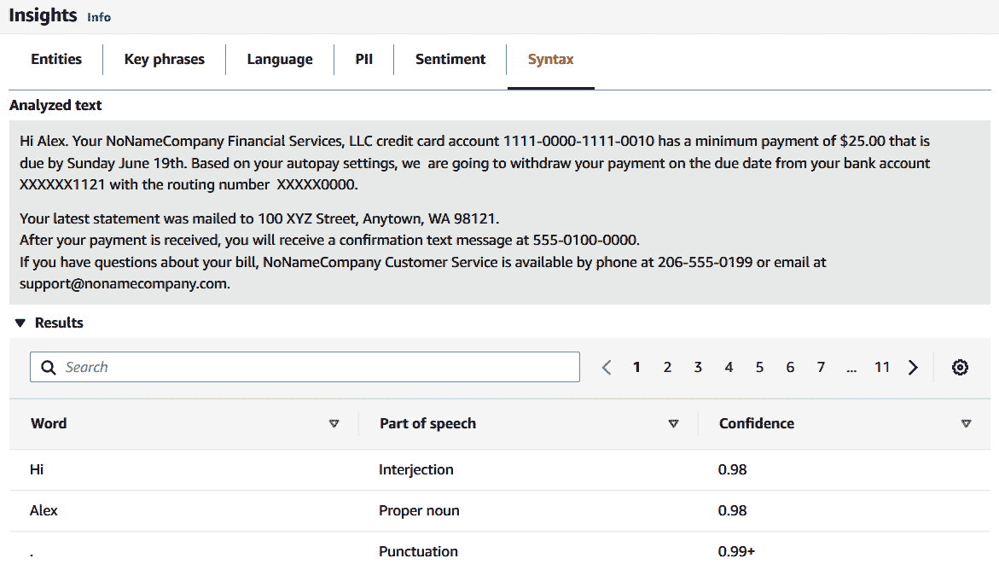

# 第三章：*第三章*：介绍 Amazon Comprehend

在上一章中，我们介绍了如何使用**Amazon Textract**进行**光学字符识别**（**OCR**）并深入探讨了它的功能和特定的 API 实现。在本章中，你将详细了解**Amazon Comprehend**和**Amazon Comprehend Medical**，它们的功能是什么，创建它们的业务挑战是什么，它们具有哪些功能，适用于哪些用户需求，以及如何轻松地将 Comprehend 与不同的**AWS**服务集成，如**AWS Lambda**，以构建业务应用程序。

在本章中，我们将涵盖以下内容：

+   了解 Amazon Comprehend 和 Amazon Comprehend Medical

+   探索 Amazon Comprehend 和 Amazon Comprehend Medical 产品功能

+   将 Amazon Comprehend 与你的应用程序集成

# 技术要求

本章中，你需要访问附加到笔记本实例的 `AmazonComprehendFullAccess` **IAM** 角色，并按照以下步骤操作：

1.  一旦你创建了笔记本实例，并且其状态为**InService**，请在笔记本实例的**操作**菜单下点击**打开 Jupyter**。

1.  在终端窗口中，首先输入`cd SageMaker`，然后输入`git clone` [`github.com/PacktPublishing/Natural-Language-Processing-with-AWS-AI-Services`](https://github.com/PacktPublishing/Natural-Language-Processing-with-AWS-AI-Services)。Amazon Comprehend 示例的 Python 代码和示例数据集在此仓库中：[`github.com/PacktPublishing/Natural-Language-Processing-with-AWS-AI-Services`](https://github.com/PacktPublishing/Natural-Language-Processing-with-AWS-AI-Services)。进入仓库后，请选择*第三章*，*介绍 Amazon Comprehend – 示例代码*。

查看以下视频，观看[`bit.ly/3Gkd1Oi`](https://bit.ly/3Gkd1Oi)中的代码实战。

# 了解 Amazon Comprehend 和 Amazon Comprehend Medical

在本节中，我们将讨论设置**ML**（**ML**）预处理时与**NLP**（**NLP**）相关的挑战。然后，我们将讨论 Amazon Comprehend 和 Amazon Comprehend Medical 如何帮助解决这些痛点。最后，我们将讨论如何使用 Amazon Comprehend 分析通过使用 Amazon Textract 提取数据的文档中的提取文本。

## 设置 NLP 的 ML 预处理时面临的挑战

设置 NLP 预处理时的一些关键挑战是文档可能是半结构化的、非结构化的，或者可能是多种语言。 一旦你拥有大量的非结构化数据，你可能希望使用一些 NLP 技术从数据中提取洞察，用于大多数常见用例，如**情感分析**、**文本分类**、**命名实体识别** (**NER**)、**机器翻译**和**主题建模**。


图 3.1 – NLP 建模

应用这些技术的挑战在于，大部分时间都花费在数据预处理上。这适用于无论你是做机器学习（例如情感分析），还是进行深度学习以应用关键的自然语言处理（NLP）技术来发现洞察。如果你在做机器学习，一些关键的预处理技术包括以下内容：

+   **分词**（**Tokenization**）：这意味着将非结构化的文本分割成单词或句子。例如，对于句子："This book is focusing on NLP"，分词后的结果将是 "This"、"book"、"is"、"focusing"、"on" 和 "NLP"。类似地，如果是复杂的文本，可以按句子而非单词进行分词。

+   **停用词移除**（**Stop word removal**）：停用词是指在句子中没有主要意义的单词，例如 "and"、"a"、"is"、"they" 等，但它们在沟通中仍然具有重要的作用。在以下文本中，停用词的例子是："This book is focusing on NLP"，其中 "is" 和 "on" 会被移除作为预处理的一部分。某些行业（例如医疗保健）中，移除停用词可能会导致语句含义的完全改变，因此在这些领域不应移除停用词。

+   **词干提取**（**Stemming**）：词干提取是指去掉一个给定单词的最后几个字符，得到一个更短的形式，即使这个形式本身没有任何意义。例如，"focusing"、"focuses" 和 "focus" 这几个单词传达的是相同的意思，可以在计算机分析中归为一个词干。因此，我们可以将它们归纳为同一个词："focus"。

+   **词形还原**（**Lemmatization**）：与此相反，词形还原是指根据单词的字典定义，将给定的单词转化为其基本形式。例如，focusing → focus。这个过程比词干提取耗时更多，并且是一个计算密集型的过程。

+   **词性标注**（**PoS**）**标记**：在分词之后，这种方法会将每个单词标记为一种词性。以 "This book is focusing on NLP" 为例，"book" 是名词，"focusing" 是动词。词性标记对于构建**句法分析树**非常有用。句法分析树用于构建命名实体识别器以及提取单词间的关系。词性标注用于构建词形还原器。词形还原器将一个单词还原为其基础形式。此外，进行词性标注有多种方法，如基于词汇的方法、基于规则的方法等。

即使在这些预处理步骤之后，如果你在预处理步骤的基础上进行深度学习，仍然需要应用高级的 NLP 技术。以下是一些常见的技术：

+   **Word embedding**：这些是具有相似语义含义的字符串的向量表示。词嵌入是大多数深度学习 NLP 任务的起始技术，并且是 NLP 中一种流行的**迁移学习**方式。一些常见的词嵌入有**Word2vec**、**Doc2Vec**（用于文档）、**GloVe**、**Continuous Bag of Words**（**CBOW**）和**Skip-gram**。

+   **Transformers**：2017 年，NLP 应用的构建方式发生了范式转变，从传统的方式（例如，使用**RNN**、**LSTM**或**GRU**并初始化词嵌入）转向使用 transformers。transformers 促使了如**BERT**（Bidirectional Encoder Representations from Transformers）和**GPT**（Generative Pretrained Transformer）等预训练系统的发展。BERT 和 GPT 已经使用大量的通用语言数据集进行训练，如**Wikipedia Corpus**和**Common Crawl**，并且可以针对特定的语言任务进行微调。

设置这些 NLP 模型时的一些挑战包括以下几点：

+   计算密集型过程，且需要使用 GPU 和 CPU

+   需要大规模的、有标签的数据集进行训练

+   设置基础设施来管理计算和扩展生产中的模型

+   需要大量时间，且需要机器学习技能来进行建模

为了克服这些挑战，我们有了 Amazon SageMaker，它帮助移除了构建、训练、调优和部署 NLP 模型从创意到执行的所有基础设施繁重工作。

Amazon SageMaker

你可以通过 Julien Simon 的书《*Learn Amazon SageMaker*》了解如何使用 Amazon SageMaker NLP 技术入门。

此外，专门谈到在 NLP 模型中实现 transformers 时，Amazon SageMaker 还支持在**PyTorch**、**TensorFlow**和**HuggingFace**中实现 transformers。

**Hugging Face transformers**包是一个非常受欢迎的 Python 库，提供了对多种 NLP 任务有用的预训练模型。参考这篇博客了解更多：[`aws.amazon.com/blogs/machine-learning/aws-and-hugging-face-collaborate-to-simplify-and-accelerate-adoption-of-natural-language-processing-models/`](https://aws.amazon.com/blogs/machine-learning/aws-and-hugging-face-collaborate-to-simplify-and-accelerate-adoption-of-natural-language-processing-models/)。

所以，我们已经覆盖了处理 NLP 技术和建模时的一些关键挑战。借助 AWS AI 服务，如 Amazon Comprehend，你无需担心启动服务器或设置复杂的 NLP 训练基础设施。你也不需要担心我们已经覆盖的所有预处理技术，例如分词、词性标注等。

你也不需要考虑实现 transformers 来设置深度学习模型，以完成一些关键的 NLP 任务，如文本分类、主题建模、命名实体识别（NER）、关键词检测等。

Amazon Comprehend 和 Comprehend Medical 提供 API，帮助你完成一些关键的自然语言处理（NLP）任务（如情感分析、文本分类或主题建模），可以处理各种非结构化文本（如电子邮件、聊天记录、社交媒体动态或医疗笔记）。

在下一节中，我们将介绍如何在无需预处理的情况下，利用 Comprehend 和 Comprehend Medical 检测文本中的洞察。

## 探索 Amazon Comprehend 和 Comprehend Medical 的优势

在本节中，我们将通过讨论以下示例，介绍 Amazon Comprehend 和 Comprehend Medical 的一些关键优势：

+   集成了使用预训练深度学习模型的 NLP API。这些 API 可以添加到你的应用中，使其具备智能化功能，因为你不需要文本分析的专业知识即可使用它们。

+   提供可扩展的 NLP 处理，因其无服务器 API 使你能够分析多个文档或非结构化文本数据，而无需担心启动和管理服务器。

+   这两个服务都与其他 AWS 服务集成：**AWS IAM**，用于身份和访问管理；**Amazon S3**，用于存储；**AWS Key Management Service** (**KMS**)，用于在加密过程中管理安全密钥；**AWS Lambda**，用于创建无服务器架构。你可以实时分析来自 **Amazon Kinesis** 的流数据，或者来自 Amazon S3 的批量数据，然后使用 NLP API 获取数据洞察，并使用 **Amazon Quicksight**（类似于 **Tableau** 的可视化工具）将结果显示在仪表盘上。

+   这些服务为 Amazon S3 中的输出结果和数据提供加密功能。使用 Amazon Comprehend 时，你可以使用 KMS 密钥加密作业的输出结果，以及在处理分析任务时，计算实例存储卷上附加的数据。

+   该服务具有成本效益，因为你只需为需要分析的文本付费。

## 使用 Comprehend 和 Comprehend Medical 检测文本中的洞察，无需预处理

Amazon Comprehend 和 Amazon Comprehend Medical 是 AWS AI 服务，类似于 Amazon Textract（我们在*第二章*中介绍过的*引入 Amazon Textract*），你无需设置复杂的模型。你只需调用 Amazon Comprehend 和 Amazon Comprehend Medical 的 API，并发送文本请求，便会得到带有检测置信度得分的响应。Amazon Comprehend 和 Amazon Comprehend Medical 的区别在于，Comprehend Medical 专注于医疗领域的 NLP 用例。Comprehend Medical 使用机器学习从非结构化医疗文本中提取与健康相关的有意义信息，而 Amazon Comprehend 使用 NLP 从非结构化文本中识别 **实体**、**关键词短语**、**语言**、**情感**及其他常见元素，从而提取有意义的信息。

Amazon Comprehend 的一些关键应用场景如下：

+   *使用话题建模根据话题搜索文档*：通过 Amazon Comprehend 话题建模，您可以配置在文档或文本文件中寻找的主题数量。使用话题建模，您可以按主题搜索附带的文档。

+   *使用情感分析分析客户对您产品的看法*：通过 Amazon Comprehend 情感分析 API，您可以了解客户对其产品的情感（例如，正面、负面、中立或混合）。例如，假设您在 Yelp 上找到了一家餐厅，这是一家披萨店。您去那里，尝试了披萨，觉得不好，于是您发布了评论：“这里的披萨不怎么样。” 使用 Comprehend 情感分析的商家可以快速分析这段文本的情感，并在实际中采取行动，及时改善用户满意度，避免业务下滑。

+   *基于话题和实体快速发现客户情感*：您可以结合 Amazon Comprehend 的多项功能，例如话题建模，结合实体识别和情感分析，发现您的终端用户在各种论坛中讨论的话题。

+   *带上您的数据执行自定义分类和自定义实体识别*：Amazon Comprehend 为您提供了快速入门自定义实体的能力。例如，如果您是一家制造公司，并且正在寻找文件中的某些产品代码，如 PR123，系统应使用机器学习检测为产品代码。

    您可以带上您的数据样本，使用 Amazon Comprehend 自定义实体识别功能快速入门，而无需担心编写复杂的模型。您也不需要担心标注大规模数据集，因为 Amazon Comprehend **Custom** 在后台使用迁移学习。您可以使用少量标注数据快速开始，创建适用于您用例的自定义实体。同样，您可以带上自己的数据，执行自定义分类，进行多类和多标签分类，以识别不同类别。

在医疗记录的情况下，您可以使用 Amazon Comprehend Medical。您可以将 Comprehend Medical 用于以下医疗应用：

+   使用 Comprehend Medical API 分析病例文档，用于患者病例管理和结果分析。

+   使用 Comprehend Medical API 检测临床文本中的有用信息，以优化生命科学和研究组织的匹配过程和药物安全性。

+   使用 Comprehend Medical 提取账单编码，这可以减少涉及医疗账单的保险支付者的收入时间。

+   Comprehend Medical 还支持本体链接，适用于**ICD-10-CM**（**国际疾病分类-第 10 版-临床修改版**）和**RxNorm**。本体链接意味着在临床文本中检测实体，并将这些实体与标准化医学本体中的概念进行关联，例如 RxNorm 和 ICD-10-CM 知识库。

+   检测 **PHI** 数据，例如临床文件中的年龄、日期，并设置控制措施，以便在医疗组织中实现 PHI 合规性。

我们将在 *第十二章**,* *医疗行业中的 AI 和 NLP* 中详细讨论 Amazon Comprehend Medical 的应用场景。

## 使用这些服务从 Amazon Textract 中提取 OCR 文档信息

如果你的文档是扫描图像或 PDF 格式，你可以使用 Amazon Textract 从这些文档中快速提取数据，然后使用 Amazon Comprehend 从提取的文本中获得有意义的见解，例如实体、关键短语和情感。你还可以使用 Amazon Comprehend 文本分类来进一步对这些文档进行分类，并执行主题建模以识别文档中的关键主题。我们将在 *第四章**,* *为金融机构自动化文档处理工作流* 和 *第五章**,* *创建 NLP 搜索* 中的 *创建 NLP 驱动的智能搜索索引* 部分中，讲解如何将 Amazon Textract 与 Amazon Comprehend 结合使用。此外，对于医疗行业，如果你有大量扫描文档，如病人入院表格、病人记录等，你可以使用 Amazon Textract 从这些文档中提取数据，然后使用 Amazon Comprehend Medical 从这些非结构化文本数据中提取关键见解。

在本节中，我们首先讨论了设置 NLP 模型时遇到的挑战。然后，我们讨论了 Amazon Comprehend 和 Comprehend Medical 如何解决设置 NLP 模型时的痛点，例如可扩展性、预处理步骤和基础设施设置。最后，我们讲解了如何通过将 Amazon Textract 和 Amazon Comprehend 结合使用来自动化文档处理并丰富它们的 NLP 信息。我们已经介绍了 Comprehend 和 Comprehend Medical 如何提供丰富的 API 来构建智能 NLP 应用程序，这些应用程序同样具有可扩展性，可以处理大量文档或非结构化数据。在下一节中，我们将通过 AWS 控制台演示来讲解这些服务的一些产品特性。

# 探索 Amazon Comprehend 和 Amazon Comprehend Medical 产品特性

在本节中，我们将通过 AWS 控制台演示，讨论 Amazon Comprehend 和 Amazon Comprehend Medical 产品特性。我们将从 Amazon Comprehend 开始，然后转到 Amazon Comprehend Medical。

## 发现 Amazon Comprehend

Amazon Comprehend 使你能够分析你的非结构化数据，例如社交媒体信息流、帖子、电子邮件、网页、从 Amazon Textract 提取的数据、电话记录、呼叫中心记录，或者任何形式的非结构化文本数据。通过使用多个预训练模型，它可以帮助你深入理解内容的各种见解。*图 3.2* 是 Amazon Comprehend 实际工作流程的示意图：


图 3.2 – Amazon Comprehend 功能

使用 Amazon Comprehend，您可以通过以下 **文本分析** API 在输入的非结构化文本数据上执行以下操作：

+   **检测实体**

+   **检测关键短语**

+   **检测主导语言**

+   **检测个人身份信息**（**PII**）

+   **确定情感**

+   **分析语法**

+   **主题建模**

这些文本分析 API 可以用于实时处理或批量处理，而主题建模是一个批量任务或异步过程，不能用于实时用例。

您可以使用这些 API 的两种模式：

+   *在任何应用程序中的实时处理*：您可以通过一次发送一个文档来使用这些 API 进行实时处理，或者通过批量实时操作一次发送 15 个文档并立即获得响应。

+   *批量或异步方式*：将大量数据上传到 Amazon S3，指向数据集，然后以批量任务的形式运行前述任何分析。批量任务的结果将保存到 S3 存储桶中。

    注意

    对于同步 API，您的文本必须是 UTF-8 编码并且不超过 5000 字节。

让我们快速浏览一下 AWS 控制台中的一些 Amazon Comprehend 功能。如果您还没有设置 AWS 账户，请参考*技术要求*部分。

由于我们都常常忘记设置自动支付信用卡账单的消息，在本演示中，我们将展示如何使用 Amazon Comprehend 对示例自动支付消息进行快速分析，以提取一些关键信息：

1.  进入 Amazon Comprehend，点击 **启动 Amazon Comprehend**：

    图 3.3 – Amazon Comprehend 控制台

1.  我们将使用以下示例自动支付文本，分析通过 AWS 控制台提供的 Amazon Comprehend 的所有功能：

    ```py
    Hi Alex. Your NoNameCompany Financial Services, LLC credit card account 1111-0000-1111-0010 has a minimum payment of $25.00 that is due by Sunday, June 19th. Based on your autopay settings, we are going to withdraw your payment on the due date from your bank account XXXXXX1121 with the routing number  XXXXX0000.
    Your latest statement was mailed to 100 XYZ Street, Anytown, WA 98121.
    After your payment is received, you will receive a confirmation text message at 555-0100-0000.
    If you have questions about your bill, NoNameCompany Customer Service is available by phone at 206-555-0199 or email at support@nonamecompany.com.
    ```

1.  复制前面的文本并将其插入到 **实时分析 → 输入文本** 中，如*图 3.4*所示，然后点击 **内置**，再点击 **分析**：

    图 3.4 – AWS 控制台中的实时分析输入文本

1.  向下滚动以查看分析结果。

现在，我们将通过更改每个标签页来逐一了解每个 **Insights** API。

### 检测实体

从*图 3.5*的截图中可以看到，Amazon Comprehend 能够检测到您输入文本中的高亮实体：


图 3.5 – 检测实体分析结果

1.  向下滚动查看结果，了解这些实体以及 Amazon Comprehend 内置 API 在没有任何自定义的情况下识别的实体。

    在*图 3.6*中的下图中，你可以看到**Alex**被识别为**人物**，**NoNameCompany**，即自动支付消息的发送方，被识别为**组织**。Alex 的到期日期（**6 月 19 日**）被识别为**日期**实体，并附带了相应的置信度分数。**置信度分数**表示机器学习模型找到匹配项的可能性，范围从 0 到 100。分数越高，匹配结果的信心越大。分数为 100 意味着可能是完全匹配，而分数为 0 则表示未找到匹配答案：

    

    图 3.6 – 检测实体结果

    注意

    开箱即用，Amazon Comprehend 的内置 API 可以检测文本中的人物、位置、数量、组织、日期、商品项、数量和标题。

1.  让我们快速滚动到**应用程序集成**，看看它期望什么类型的请求，以及基于此请求 API 返回什么类型的响应：


图 3.7 – 理解检测实体请求和响应

在本章的最后一节，我们将看到如何使用`python boto 3` **SDK**调用这些 API 并将它们集成到你的应用程序中。

### 检测关键短语

切换到**关键短语**标签页，以了解关键短语是什么，以及 Amazon Comprehend 的预测结果：


图 3.8 – 检测关键短语

在英语中，关键短语由一个名词短语（名词加修饰语）构成，描述特定的事物。例如，在*图 3.8*中的文本，“**你好，Alex**”，“**你的 NoNameCompany 金融服务**”以及“**最低支付额**”是 Amazon Comprehend API 识别的一些关键短语。通过查看这些关键字而不需要阅读全文，一个人就能知道这与一家金融公司和某种支付有关，这在处理大量非结构化文本时非常有用。

### 语言检测

切换到标签页，查看 Amazon Comprehend 识别的主导语言，如*图 3.9*所示：


图 3.9 – 检测语言控制台演示

类似于其他 Comprehend API，Amazon Comprehend 可以检测给定文本的语言，并提供一个置信度分数。你可以使用此功能来处理用多种不同语言书写的书籍，例如法语和印地语。通过使用语言检测 API，你可以检测语言并分类书中每种语言所占的比例，然后可以使用**Amazon Translate**，这是 AWS 提供的将文本从一种语言翻译成另一种语言的服务。我们将在后续章节中看到这个例子，以便进行翻译。

### PII 检测

将标签切换为 PII，以查看使用 Amazon Comprehend 开箱即用的 PII 检测 API 将得到的结果如下：


图 3.10 – PII 检测演示

正如您在*图 3.10*中看到的，Amazon Comprehend 为您提供了通过其实时或同步 PII API 的**偏移量**和**标签**。如果您想从文本中删除 PII 数据，您可以使用异步作业。Amazon Comprehend 可以检测到以下 PII 实体：年龄、地址、AWS 访问密钥、AWS 秘密密钥、银行相关信息（如银行账户和银行路由号码）、信用卡信息（如信用卡号码和有效期）、身份信息（如驾驶执照 ID 和护照号码）、网络相关信息（如电子邮件、IP 地址和 MAC 地址）、网址；密码；和用户名。

通过了解 Amazon Comprehend 检测到的 PII 实体类型，让我们向下滚动，查看您输入文本中的 PII 偏移量检测结果：


图 3.11 – 检测 PII 结果

您还会获得一个置信度分数，以及实体和 PII 实体类型。

如果您不想识别具体实体，只是想了解文档中包含哪些类型的 PII，您可以使用标签 PII 功能。

选择**标签**按钮以查看此功能的实际应用：


图 3.12 – 检测 PII 标签结果

从*图 3.12*中显示的结果中，您可以清楚地看到，**日期时间**、**电子邮件**、**姓名**、**地址**和**电话**是与您输入文本中的某个人相关的 PII 信息。

### 检测情感

切换到**情感**标签以了解您输入文本的情感：


图 3.13 – 检测情感结果

由于文本与自动支付消息相关，Amazon Comprehend 的实时情感分析 API 检测到中性情感。Amazon Comprehend 的情感分析功能帮助确定情感是正面、负面、中性还是混合。您可以将此功能用于各种用例，例如确定在线书评的情感、Twitter 情感分析，或任何社交媒体情感分析，如 Reddit 或 Yelp 评论情感分析。

### 检测语法

点击最后一个标签，**语法**，以查看使用 Amazon Comprehend 的检测语法功能可以获得哪些类型的响应：



图 3.14 – 检测语法或词性结果

Amazon Comprehend 能够识别名词、动词和形容词，并且可以识别总共 17 种词性。这一功能对于需要进行词性标注的 NLP 模型的数据预处理非常有用。

注意

我们详细介绍了所有 Amazon Comprehend 文本分析实时 API。您可以使用我们所讲解的所有这些 API 执行批量实时操作，并一次发送 25-5000 字节的 UTF-8 文本文档（[`docs.aws.amazon.com/comprehend/latest/dg/guidelines-and-limits.html`](https://docs.aws.amazon.com/comprehend/latest/dg/guidelines-and-limits.html)）以获得实时结果。Comprehend 自定义现在可以直接导入 PDF 文档进行分析和自定义训练。

### Amazon Comprehend 自定义功能

使用 Amazon Comprehend 自定义，您可以导入自己的数据集，快速创建自定义实体，并执行自定义分类。此功能是一个批处理或异步功能，涉及两个步骤：

1.  *通过提供一个小型的标记数据集来训练分类器或实体识别器*。此分类器或实体识别器使用**自动化机器学习**（**AutoML**）和迁移学习，根据您提供的训练数据集选择并训练模型。它还会提供 F1 得分以及与该训练模型相关的精度和召回率指标。

1.  *在训练自定义分类器或自定义实体识别器模型后，对该训练模型进行批量或实时分析*。您可以再次选择两种方式：使用该训练模型为数据批量创建“分析作业”，并在 Amazon Comprehend 控制台中执行；也可以创建一个实时端点，用于分类实时用例，如 Twitter 实时动态、新闻动态或客户服务请求等，几乎实时地使用该模型。


图 3.15 – Comprehend 自定义分类工作流程

我们将在*第十四章*中介绍 Comprehend 自定义实体功能，*审计命名实体识别工作流程*，以及在*第十五章*中介绍 Comprehend 自定义分类功能，*分类文档并为主动学习设置人工环节*。

我们将在*第六章*中详细介绍主题建模产品功能，*使用自然语言处理（NLP）提高客户服务效率*。

### Amazon Comprehend 事件

Amazon Comprehend **事件**为金融组织提供了一个特定的使用场景，您可以通过此 API 查看在任何重要的金融事件中（如新闻发布、并购等）通过 Amazon Comprehend 提取的各个实体之间的关系。您可以使用这个 Events 批处理 API 来检测大型文档中的事件，以回答事件发生的“谁、什么、何时、何地”。要了解更多关于 Comprehend 事件的内容，请参考此博客：[`aws.amazon.com/blogs/machine-learning/announcing-the-launch-of-amazon-comprehend-events/`](https://aws.amazon.com/blogs/machine-learning/announcing-the-launch-of-amazon-comprehend-events/)。

## 使用 Comprehend Medical 从医生-患者对话记录中推导诊断

Amazon Comprehend Medical 提供两种分析类型：

+   **文本分析 API**：类似于 Amazon Comprehend 文本分析 API，Comprehend Medical 具有检测医疗实体和检测 PHI 的 API。

+   **肿瘤学检测 API**：这些 API 帮助将实体与 RxNorm 或 ICD-10-CM 链接起来。根据**国家卫生研究院**（**NIH**）([`www.nlm.nih.gov/research/umls/rxnorm/index.html`](https://www.nlm.nih.gov/research/umls/rxnorm/index.html))的说法，RxNorm 为临床药物提供标准化名称，并将其名称链接到许多药房管理和药物相互作用软件中常用的药物词汇表。通过在这些词汇表之间提供链接，RxNorm 可以在不使用相同软件和词汇表的系统之间传递消息。ICD-10-CM（ICD-10 临床修改版）是世界卫生组织授权的 ICD-10 的修改版，并在美国作为诊断代码的来源使用。要了解更多信息，请参阅其维基百科条目：[`en.wikipedia.org/wiki/ICD-10-CM`](https://en.wikipedia.org/wiki/ICD-10-CM)。

现在，我们将再次通过 AWS 控制台快速了解 Amazon Comprehend Medical 的功能：

1.  打开 AWS 控制台：[`console.aws.amazon.com/comprehend/v2/home?region=us-east-1#try-comprehend-medical`](https://console.aws.amazon.com/comprehend/v2/home?region=us-east-1#try-comprehend-medical)

1.  在 Amazon Comprehend Medical 中点击**实时分析**功能，并输入以下示例文本：

    ```py
    Pt is 35 yo woman, IT professional with past medical history that includes
    - status post cardiac catheterization in may 2019.
    She haspalpitations and chest pressure today.
    HPI : Sleeping trouble for present dosage of Catapres. Severe rash on thighs, slightly itchy
    Meds : Xanax100 mgs po at lunch daily,
    Catapres 0.2 mgs -- 1 and 1 / 2 tabs po qhs
    Lungs : clear
    Heart : Regular rhythm
    Next follow up as scheduled on 06/19/2021
    ```

1.  复制此文本并粘贴到*图 3.16*中的**输入文本**，然后点击**分析**：

    图 3.16 – 用于实时 Amazon Comprehend Medical 分析的输入文本

    注意

    使用 Comprehend Medical 实时 API，您可以分析多达 200,000 个字符。

1.  滚动到底部查看 Comprehend Medical 实体的实时 API 结果：

    图 3.17 – Comprehend Medical 检测实体

    您可以看到，Comprehend Medical 还提供这些实体内部的关系，例如**Catapres**剂量以及药物应该被服用的频率。Amazon Comprehend Medical 检测实体、类型和类别，例如实体是否为 PHI 或治疗或时间表达和特征，并附带置信度分数。

1.  进一步向下滚动以查看以`35`为实体检测的检测到的实体，其实体类型为年龄，类别为 PHI。


图 3.18 – Comprehend Medical 检测实体结果

### RxNorm 概念

使用此功能识别药物作为实体：

1.  切换到**RxNorm**选项卡。您将看到一个类似以下截图的屏幕：![图 3.19 – Comprehend Medical InferRxNorm 结果

    ![Figure 3.20 – Comprehend Medical InferICD-10-CM 结果

    图 3.19 – Comprehend Medical InferRxNorm 结果

    如果您向下滚动至**结果**，Comprehend Medical 显示了每种药物的**RXCUI**，以及置信度评分。RXCUI 是一个机器可读的代码，指的是特定药物的唯一名称，具有相同 RXCUI 的药物被视为同一药物。这个 Comprehend Medical 功能提供 RxNorm 信息，例如强度、频率、剂量、剂型和给药途径。您可以将这个 RxNorm 功能用于以下场景：

    +   患者药物筛查。

    +   预防可能由新处方药与患者已经服用的药物相互作用而引起的负面反应。

    +   基于药物历史的筛选，使用 RXCUI 包含在临床试验中。

    +   检查药物的适当频率和剂量以及药物筛查。

### ICD-10-CM 概念

让我们切换到**ICD-10-CM 概念**标签，您将获得以下分析：

![Figure 3.20 – Comprehend Medical InferICD-10-CM 结果

![Figure 3.20 – Comprehend Medical InferICD-10-CM 结果

图 3.20 – Comprehend Medical InferICD-10-CM 结果

**InferICD10CM** API 将可能的医疗状况检测为实体，并将其链接到 ICD-10-CM 的代码，同时附带置信度评分。在医疗保健中，这些代码是标准的医疗交易代码，用于诊断目的，以符合**《健康保险移植与责任法》（HIPAA）**，并用于分类和报告疾病。您可以将这些 ICD-10-CM 代码用于下游分析，作为迹象、症状、特征和属性。

InferICD10CM 非常适合于专业医疗编码协助患者记录、临床试验和研究、与现有医疗软件系统集成、早期检测和诊断以及人群健康管理等场景。

在下一节中，我们将通过执行 Jupyter 笔记本的演示来查看这些 API 的实际效果。

# 使用 Amazon Comprehend 与您的应用程序

在本节中，您将通过 Jupyter 笔记本示例详细了解 Amazon Comprehend 和 Comprehend Medical 提供的广泛类别的 API，您可以在您的 AWS 账户中运行。要设置笔记本，请参阅本章的*技术要求*部分。

我们将展示 Comprehend 中一组关键 API 的子集及其功能，然后将讨论如何构建与 AWS Lambda、**API Gateway**和 Comprehend 集成的应用程序。

注意

我们将在*第十二章**，* *医疗保健中的人工智能和自然语言处理*中涵盖 Amazon Comprehend Medical API。

让我们首先从 Amazon Comprehend 的 API 开始。Amazon Comprehend 提供三种类型的 API。

+   **实时 API**：适用于我们涵盖的所有文本分析功能和 Comprehend 定制模型端点。

+   **批量实时 API**：适用于所有文本分析功能。

+   **批量或分析作业 API**：用于所有文本分析功能、主题建模功能以及 Comprehend 自定义模型训练。

在笔记本中 [`github.com/PacktPublishing/Natural-Language-Processing-with-AWS-AI-Services/blob/main/Chapter%2003/Chapter%203%20Introduction%20to%20Amazon%20Comprehend.ipynb`](https://github.com/PacktPublishing/Natural-Language-Processing-with-AWS-AI-Services/blob/main/Chapter%2003/Chapter%203%20Introduction%20to%20Amazon%20Comprehend.ipynb)，我们将涵盖实时 API 和批处理实时 API。

注意

你可以在其他支持的 API 中实现相同的功能，例如 Java、Ruby、.NET、AWS CLI、Go、C++、JavaScript 和 PHP。有关 Comprehend API 的更多信息，请参考 Amazon 文档：[`docs.aws.amazon.com/comprehend/latest/dg/API_Reference.html`](https://docs.aws.amazon.com/comprehend/latest/dg/API_Reference.html)。

1.  让我们开始设置 Python `boto3` API，以便使用 Amazon Comprehend：

    ```py
    import boto3
    comprehend = boto3.client('comprehend')
    ```

1.  让我们看看如何使用同步或实时 API 执行`detect_entities`的实体提取。我相信你已经读了很多 Packt 的书；让我们看看以下关于 Packt Publications 的示例文本，以及我们可以从中提取哪些实体：

    ```py
    SampleText="Packt is a publishing company founded in 2003 headquartered in Birmingham, UK, with offices in Mumbai, India. Packt primarily publishes print and electronic books and videos relating to information technology, including programming, web design, data analysis and hardware."
    ```

1.  我们将调用`detect_entities` API（`comprehend.detect_entities`）从示例文本中提取实体：

    ```py
    response = comprehend.detect_entities(
    Text=SampleText,
        LanguageCode='en')
    ```

1.  以下是从关于 Packt Publications 的简介中提取的实体的响应：

    ```py
    import json
    print (json.dumps(response, indent=4, sort_keys=True))
    ```

    这将给我们以下输出：

    

    图 3.21 – JSON 结果截图

    Comprehend 能够成功检测实体及其类型，并给出响应，表明 Packt Publications 是位于英国伯明翰和印度孟买的一个组织。

1.  现在我们知道了什么是 Packt Publications，让我们使用`detect_key_phrases` API 来识别关于该组织的一些关键短语，但文本是法语的。

    ```py
    SampleText="Packt est une société d'édition fondée en 2003 dont le siège est à Birmingham, au Royaume-Uni, avec des bureaux à Mumbai, en Inde. Packt publie principalement des livres et des vidéos imprimés et électroniques relatifs aux technologies de l'information, y compris la programmation, la conception Web, l'analyse de données et le matériel"
    ```

1.  我们将使用`detect_key_phrases` API，并将`fr`作为`LanguageCode`参数，来从前面的法文文本中检测关键短语：

    ```py
    response = comprehend.detect_key_phrases(
        Text= SampleText,
        LanguageCode='fr'
    )
    ```

1.  让我们看看来自 Amazon Comprehend 的响应：

    ```py
    print (json.dumps(response, indent=4, sort_keys=True))
    ```

    这将返回以下内容：


图 3.22 – Comprehend 检测关键短语响应

Amazon Comprehend 能够识别关键短语，并且标明文本的位置。

现在，如果你想从 Packt Publications 购买一本书，你可能会想要阅读评论并判断它们是否积极。

使用`batch_detect_sentiment` API，我们将向你展示如何一次分析多个评论。对于这个演示，我们将从《*每个程序员都应该知道的 40 种算法*》这本书中挑选一些示例评论 ([`www.packtpub.com/product/40-algorithms-every-programmer-should-know/9781789801217`](https://www.packtpub.com/product/40-algorithms-every-programmer-should-know/9781789801217))：

1.  我们将使用`batch_detect_sentiment`分析一些这本书的评论：

    ```py
    response = comprehend.batch_detect_sentiment(
        TextList=[
            'Well this is an area of my interest and this book is packed with essential knowledge','kinda all in one With good examples and rather easy to follow', 'There are good examples and samples in the book.', '40 Algorithms every Programmer should know is a good start to a vast topic about algorithms'
        ],
        LanguageCode='en'
    )
    ```

1.  现在，让我们通过运行以下代码来查看该响应：

    ```py
    print (json.dumps(response, indent=4, sort_keys=True))
    ```

    这将产生以下输出：

    

    ](img/B17528_03_23.jpg)

    图 3.23 – Comprehend 情感分析响应

    在分析的这四条评论中，我们可以明显看到，总体来说，这是一本书的积极评论。在阅读这些评论时，有一些是不同语言写的，作为一个英语读者，我并不理解它们。很不幸，我不知道这些评论使用的是哪些语言，因此也不知道该选择哪种语言进行翻译。

1.  让我们使用 Comprehend 的 `batch_detect_dominant_language` API 在翻译之前识别这些评论使用的是哪些语言：

    ```py
    response = comprehend.batch_detect_dominant_language(
        TextList=[
            'It include recenet algorithm trend. it is very helpful.','Je ne lai pas encore lu entièrement mais le livre semble expliquer de façon suffisamment claire lensemble de ces algorithmes.'
        ]
    )
    ```

1.  现在，让我们查看 Comprehend 的响应，以了解评论的语言：

    ```py
    print (json.dumps(response, indent=4, sort_keys=True))
    ```

    这将给出以下输出：


图 3.24 – Comprehend 检测语言响应

有趣的是，我们发现，在这批次中发送的两条评论，分别检测出主导语言，一条是英语，另一条是法语。

我们现在已经介绍了一些关键的 API，如 `detect_entities`、`detect_key_phrases`、`batch_detect_sentiment` 和 `batch_detect_dominant_languages`。

现在，我们将看到如何在构建应用程序时使用这些 API。

## 使用 Amazon API Gateway、AWS Lambda 和 Comprehend 架构应用程序

在前面的章节中，我们介绍了 Amazon Comprehend 的文本分析 API。你可以通过 Lambda 函数以无服务器的方式轻松调用这些 API。Amazon Lambda 是一种无服务器、基于事件的触发器，可以与 Amazon API Gateway 集成，并触发 **GET** 和 **POST** 请求。Amazon API Gateway 是一种无服务器的 **REST** 基础服务，可以让你构建 GET/POST API，轻松与任何应用程序集成，无论是移动应用还是 Web 应用。

你可以创建一个 API，将其嵌入到你的应用程序中，通过 API Gateway 发送待分析的文本；然后 API Gateway 根据收到的请求类型调用 Amazon Lambda 函数。Amazon Lambda 可以进一步调用 Amazon Comprehend API（实时或批处理检测实时 API）。随后，它将 Comprehend 的响应传递给 API Gateway，如 *图 3.25* 所示的架构图：


图 3.25 – 使用 Amazon Comprehend 构建实时应用程序

# 总结

本章我们讲解了为什么需要使用 Amazon Comprehend 和 Amazon Comprehend Medical。我们还讨论了设置 NLP 流水线时面临的挑战。

然后，我们介绍了这些服务，并概述了它们提供的一些关键优势，例如不需要机器学习技能，或轻松使用 API 构建可扩展的 NLP 解决方案。接下来，我们通过控制台演示展示了 Amazon Comprehend 和 Amazon Comprehend Medical 的一些关键产品功能。Amazon Comprehend 的一些功能包括识别实体、关键词短语和情感分析，以及检测主导语言、主题建模等。对于 Amazon Comprehend Medical，我们介绍了如何使用文本分析 API 和肿瘤学 API 来丰富和提取医学笔记中的关键信息。随后，我们通过 Jupyter notebook 对这些 API 进行了简要的操作演示，并讲解了同步和批量同步 API。我们对使用这些 API 创建无服务器应用程序有了基本的理论了解。

在下一章中，我们将讨论如何将 Amazon Textract 与 Amazon Comprehend 集成，以实现财务文档的自动化处理。
