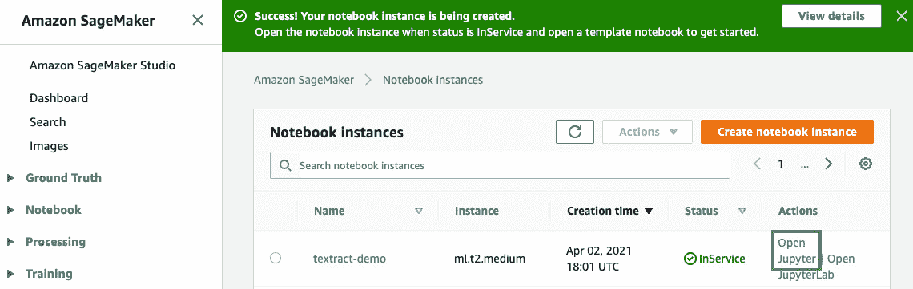

# 第四章：*第四章*：自动化文档处理工作流

在上一章中，我们介绍了**Amazon Comprehend**和**Amazon Comprehend Medical**，并讲解了如何使用这些服务从文本中提取洞察。我们还花了一些时间了解自然语言处理算法如何工作、可以揭示的不同类型的洞察，并且运行了代码示例，尝试使用 Amazon Comprehend APIs。

本章将展示我们的第一个现实世界用例——自动化文档管理工作流，这是许多组织目前面临的挑战。我们根据我们的集体经验以及在职业生涯中观察到的使用趋势，整合了这一解决方案。系好安全带，准备好逐步体验如何构建一个端到端的 AI 解决方案，并看到它在你面前逐渐成型。我们预计在本章的整个过程中将进行实践，但我们已经准备好了所有必要的代码示例，以便开始。

我们将深入探讨如何使用**Amazon Textract**自动化文档处理，接着介绍如何使用**Amazon Comprehend**在文档中设置合规性和控制。最后，我们将讨论在设计**实时文档处理**工作流与**批处理**时的架构最佳实践。我们将提供详细的代码示例、设计和开发方法，并提供逐步指南，帮助您设置并运行这些示例，同时提供对 GitHub 仓库的访问。

本章将涵盖以下主题：

+   自动化文档处理工作流

+   设置合规性和控制

+   实时文档工作流与批量文档工作流的处理

# 技术要求

本章内容需要访问 AWS 账户。请确保按照*第二章*《介绍 Amazon Textract》中的*技术要求*部分的说明创建 AWS 账户，并登录 AWS 管理控制台，然后再尝试本章中的步骤。

本章代码的 Python 代码和示例数据集可以通过以下链接获取：[`github.com/PacktPublishing/Natural-Language-Processing-with-AWS-AI-Services/tree/main/Chapter%2004`](https://github.com/PacktPublishing/Natural-Language-Processing-with-AWS-AI-Services/tree/main/Chapter%2004)。请根据以下章节中的说明，结合仓库中的代码来构建解决方案。

查看以下视频，观看代码的实际应用：[`bit.ly/3GlcCet`](https://bit.ly/3GlcCet)。

# 自动化文档处理工作流

我们在上一章中讨论了 Amazon Textract 如何通过从任何文档中提取文本，帮助我们数字化扫描文档（如 PDF 和图像）。我们还介绍了 Amazon Comprehend 如何帮助我们从这些文档中提取洞察，包括实体、**个人身份信息**（**PII**）和情感。

现在，这些服务可以在架构中一起使用，以自动化大多数组织的文档处理工作流，无论是金融机构还是医疗机构，关于这一点我们将在*第十二章*，*医疗行业中的 AI 和自然语言处理*中讨论。

让我们从一个虚构的银行*LiveRight Pvt Ltd.*开始，该银行的客户正在申请住房贷款。我们都知道，这个贷款发放过程涉及到超过 400 份文件，需要银行在批准贷款之前提交并审核。这一过程的自动化将使银行和客户更容易获得贷款。自动化这些工作流的挑战在于，贷款发放过程有超过 1000 个模板，而使用任何**光学字符识别**（**OCR**）系统都需要管理这些模板。此外，这些基于 OCR 模板的方法不具备可扩展性，并且在格式变化时会出现问题。这就是为什么我们有 Amazon Textract，它可以从任何文档中提取文本，使这些文档能够在数小时内而非数月或数周内完成自动化处理。

你已经从这些表单或半结构化文档中提取了数据。接下来，你将需要对从这些文档中提取的数据进行合规性和控制设置；例如，确保如果数据是个人身份信息（**PII**），你可以进行掩码处理以供进一步处理。如果你想专注于贷款批准流程，还需要提取实体，例如贷款金额或请求人的详细信息。这正是 Amazon Comprehend 可以帮助的地方。事实上，你可以使用 Amazon Comprehend 根据你的需求对提交的文档和自定义实体进行分类；例如，通过 Textract 提取的文档发送至 Amazon Comprehend 进行自定义分类，判断该文档是驾照还是 W2 表格。

以下是如何将 Amazon Textract 和 Amazon Comprehend 一起使用，以自动化现有文档流程的架构：


图 4.1 – 自动化文档处理工作流

在这个架构中，您将接收文档，这些文档可能是财务文档、法律文档、按揭申请等。您将这些文档发送到 Amazon Textract，从中提取文本。提取文本后，您可以将其发送到 Amazon Comprehend，以提取见解。这些见解可以根据文档类型对这些文档进行分类，识别文档中的个人可识别信息（PII），或者通过自定义实体识别进行**命名实体识别**（**NER**）。我们在*第十四章*中讲解了自定义实体，*第十五章*中讲解了文档分类，*审计命名实体识别工作流*以及*文档分类和设置人类介入进行主动学习*。

在本节中，我们介绍了如何通过将 Amazon Textract 和 Amazon Comprehend 两项服务结合使用，快速轻松地设置自动化文档处理工作流。在下一节中，我们将讨论如何将这些服务结合使用，为 LiveRight Pvt Ltd. 设置合规性和控制，特别是通过屏蔽或删除其表单中的 PII 数据。

# 设置合规性和控制

在本节中，我们将讨论如何使用 Amazon Textract 和 Amazon Comprehend 为 LiveRight Pvt Ltd. 设置合规性和控制，并自动化其贷款发放流程。我们将通过在 Jupyter notebook 中使用代码示例来逐步讲解以下架构：


图 4.2 – 设置合规性和控制

我们将通过一个单一文档和示例代码来引导您完成这个架构。然而，这个架构可以通过 **Step Function** 和 **Lambda 函数** 以无服务器的方式自动处理大量文档。在这个架构中，我们将展示以下内容：

1.  如何上传示例文档并使用 `.txt` 或 `.csv` 文件将提取的文本返回到 **Amazon S3 存储桶**。

1.  接下来，我们将展示如何使用 **Amazon Comprehend** 的实时或同步 API 来检测 PII。

1.  接下来，我们将讨论如何使用 Amazon Comprehend 的 PII 检测作业，在 **Amazon S3** 中对提取的文本/CSV 文件中的 PII 数据进行屏蔽和删除。

1.  如何在 Amazon S3 中找到已删除 PII 数据的文档文本，作为 Comprehend PII 检测作业的输出。

那么，让我们开始设置 notebook。

## 设置以解决用例

如果你在前面的章节中没有这样做，你需要先创建一个 Amazon SageMaker Jupyter notebook，并为该 notebook 角色设置**身份和访问管理**（**IAM**）权限，以便访问我们将在本 notebook 中使用的 AWS 服务。之后，你需要克隆 GitHub 仓库（[`github.com/PacktPublishing/Natural-Language-Processing-with-AWS-AI-Services`](https://github.com/PacktPublishing/Natural-Language-Processing-with-AWS-AI-Services)）。请按以下步骤完成这些任务，之后我们才能执行 notebook 中的单元格：

1.  按照*第二章*中[*设置 AWS 环境*]部分的*创建 Amazon SageMaker Jupyter notebook 实例*章节中的说明，创建你的 Jupyter notebook 实例。

    创建 Amazon SageMaker Jupyter Notebooks 时的 IAM 角色权限

    在创建 notebook 时，接受 IAM 角色的默认选项，以允许访问任何 S3 桶。

1.  创建完 notebook 实例并且其状态为**InService**后，点击 notebook 实例的**操作**菜单中的**打开 Jupyter**。

    图 4.3 – 打开 Jupyter notebook

    这将带你进入 notebook 实例的主文件夹。

1.  点击**新建**，然后选择**终端**，如下图所示：

    图 4.4 – 在 Jupyter notebook 中打开终端

1.  在终端窗口中，首先键入 `cd SageMaker`，然后键入 `git clone https://github.com/PacktPublishing/Natural-Language-Processing-with-AWS-AI-Services`，如下图所示：

    图 4.5 – git clone 命令

1.  现在，退出终端窗口，返回主文件夹，你会看到一个名为`Chapter 04`的文件夹。点击该文件夹，你应该会看到一个名为`Chapter 4 Compliance and control.ipynb`的 notebook。

1.  点击此 notebook 打开它。

接下来，我们将介绍其他的 IAM 先决条件。

## 其他 IAM 先决条件

为了训练 Comprehend 自定义实体识别器并设置实时端点，我们必须启用额外的策略，并更新 SageMaker notebook 角色的信任关系。为此，请将 `AmazonS3FullAccess`、`TextractFullAccess` 和 `ComprehendFullAccess` 策略附加到你的 Amazon SageMaker Notebook IAM 角色。要执行此步骤，请参阅*第二章*中[*设置 AWS 环境*]部分的*更改 IAM 权限和信任关系以便 Amazon SageMaker notebook 执行角色*，*介绍 Amazon Textract*。

现在我们已经在 Amazon SageMaker notebook 实例中设置了所需的 IAM 角色和 notebook，接下来让我们进入代码讲解部分。

## 自动化文档控制与符合性

在这一部分，我们将通过代码讲解我们讨论的架构，该架构用于通过 Amazon Textract 自动化文档处理，并通过 Amazon Comprehend 实现符合性和控制，使用 PII 屏蔽，参考*图 14.2*，使用这个笔记本：

1.  执行你刚刚在以下链接设置的 Jupyter 笔记本中，*第 1 步 – 设置并安装库*下的单元格，[`github.com/PacktPublishing/Natural-Language-Processing-with-AWS-AI-Services/blob/main/Chapter%2004/Chapter%204%20Compliance%20and%20control.ipynb`](https://github.com/PacktPublishing/Natural-Language-Processing-with-AWS-AI-Services/blob/main/Chapter%2004/Chapter%204%20Compliance%20and%20control.ipynb)，以确保你拥有笔记本所需的库。请注意，在此单元格中，你正在获取笔记本的 Amazon SageMaker 执行角色以及 SageMaker 会话。你正在设置 boto3 库，以调用 Amazon Textract、Amazon Comprehend 和 Amazon S3 API。你还将使用 SageMaker 会话访问默认的 SageMaker S3 存储桶，用于将数据以前缀或文件夹的方式存储到该存储桶中。

1.  现在，我们将从示例银行对账单开始。执行 Jupyter 笔记本中的*第 2 步*，*从示例文档中提取文本*下的单元格，显示示例文档，以提取文本并编辑 PII 信息：

    ```py
    documentName = "bankstatement.png"
    display(Image(filename=documentName))
    ```

    你将获得以下响应：

    

    图 4.6 – 示例银行对账单

1.  现在，我们将调用 Amazon Textract 的 Detect Document Text Sync API，[`boto3.amazonaws.com/v1/documentation/api/latest/reference/services/textract.html#Textract.Client.detect_document_text`](https://boto3.amazonaws.com/v1/documentation/api/latest/reference/services/textract.html#Textract.Client.detect_document_text)，它可以近实时地从文档中提取文本，用于使用以下代码从示例银行对账单中提取数据：

    ```py
    client = boto3.client(service_name='textract',
             region_name= 'us-east-1',
             endpoint_url='https://textract.us-east-1.amazonaws.com')
    with open(documentName, 'rb') as file:
                img_test = file.read()
                bytes_test = bytearray(img_test)
                print('Image loaded', documentName)
    response = client.detect_document_text(Document={'Bytes': bytes_test})
    print(response)
    ```

    你将从 Amazon Textract 获取一个 JSON 响应，使用 Detect Document Text Sync API。

1.  现在，我们将使用在*第 1 步*中安装的 Amazon Textract 解析器库从这个 JSON 响应中提取文本。运行以下代码将 Textract JSON 响应解析为文本：

    ```py
    doc = Document(response)
    page_string = ''
    for page in doc.pages:
            for line in page.lines:
                page_string += str(line.text)
    print(page_string)
    ```

    现在，我们已经从 Textract JSON 响应中提取了文本，让我们进入下一步。

1.  在这一步中，我们将把从银行对账单中提取的文本保存到一个文本/CSV 文件，并上传到 Amazon S3，以便使用 Amazon Comprehend 批量作业进行处理。运行笔记本单元格*第 3 步*，*将提取的文本保存到文本/CSV 文件并上传到 Amazon S3 存储桶*，以将数据保存到文本文件中，然后上传到 Amazon S3。

1.  现在我们已经从银行对账单中提取了文本，将其转换为文本文件并上传到 Amazon S3，在此步骤中，我们将使用 Amazon Comprehend Detect PII Sync API 检测文本中的 PII。运行笔记本单元格*步骤 4*，*使用 Amazon Comprehend Detect PII Sync API 检查 PII*，通过传递来自 Amazon Textract 提取的文本来调用 Comprehend API：

    a) 首先，初始化 Amazon Comprehend 的 boto3 句柄：

    ```py
    `comprehend = boto3.client('comprehend')
    ```

    b) 然后，调用 Amazon Comprehend，并将我们示例银行对账单图像中聚合的文本传递给 Comprehend，以检测 PII 实体：[`boto3.amazonaws.com/v1/documentation/api/latest/reference/services/comprehend.html#Comprehend.Client.detect_pii_entities`](https://boto3.amazonaws.com/v1/documentation/api/latest/reference/services/comprehend.html#Comprehend.Client.detect_pii_entities):

    ```py
    piilist=comprehend.detect_pii_entities(Text = page_string, LanguageCode='en')
    redacted_box_color='red'
    dpi = 72
    pii_detection_threshold = 0.00
    print ('Finding PII text...')
    not_redacted=0
    redacted=0
    for pii in piilist['Entities']:
        print(pii['Type'])
        if pii['Score'] > pii_detection_threshold:
                        print ("detected as type '"+pii['Type']+"' and will be redacted.")
                        redacted+=1

        else:
            print (" was detected as type '"+pii['Type']+"', but did not meet the confidence score threshold and will not be redacted.")
            not_redacted+=1
    print ("Found", redacted, "text boxes to redact.")
    print (not_redacted, "additional text boxes were detected, but did not meet the confidence score threshold.")s3_entity_key = prefix + "/train/entitylist.csv"
    ```

    您将收到一个响应，识别文本中的 PII，并将在下一步中使用 Amazon Comprehend PII 分析任务删除这些内容。

    

    图 4.7 – 使用 Amazon Comprehend 在银行对账单中进行 PII 检测

    我们将对在示例银行对账单中找到的 15 个个人身份信息（PII）实体进行屏蔽/删除。

1.  接下来，我们将调用 `StartPiiEntitiesDetectionJob` API 来启动一个异步的 PII 实体检测任务，适用于一组文档。在本示例中，我们只使用一个文档样本。您可以使用此任务删除大量文档。运行笔记本单元格*步骤 5*，*使用 Amazon Comprehend PII 分析任务屏蔽 PII*，以设置并启动 Amazon Comprehend 的 PII 删除分析任务：

    a) 然后，任务需要指定待屏蔽文档的 S3 位置以及您希望输出已屏蔽内容的 S3 位置。运行以下单元格，指定我们希望屏蔽的 S3 文本文件位置：

    ```py
    import uuid
    InputS3URI= "s3://"+bucket+ "/pii-detection-redaction/pii_data.txt"
    print(InputS3URI)
    OutputS3URI="s3://"+bucket+"/pii-detection-redaction"
    print(OutputS3URI)
    ```

    b) 现在我们将通过设置删除参数并传递数据存储的输入 S3 位置来调用 `comprehend.start_pii_entities_detection_job`，运行以下笔记本单元格：

    ```py
    response = comprehend.start_pii_entities_detection_job(
        InputDataConfig={
            'S3Uri': InputS3URI,
            'InputFormat': 'ONE_DOC_PER_FILE'
        },
        OutputDataConfig={
            'S3Uri': OutputS3URI

        },
        Mode='ONLY_REDACTION',
        RedactionConfig={
            'PiiEntityTypes': [
               'ALL',
            ],
            'MaskMode': 'MASK',
            'MaskCharacter': '*'
        },
        DataAccessRoleArn = role,
        JobName=job_name,
        LanguageCode='en',   
    )
    Mode='ONLY_REDACTION'|'ONLY_OFFSETS',
        RedactionConfig={
            'PiiEntityTypes': [
                'BANK_ACCOUNT_NUMBER'|'BANK_ROUTING'|'CREDIT_DEBIT_NUMBER'|'CREDIT_DEBIT_CVV'|'CREDIT_DEBIT_EXPIRY'|'PIN'|'EMAIL'|'ADDRESS'|'NAME'|'PHONE'|'SSN'|'DATE_TIME'|'PASSPORT_NUMBER'|'DRIVER_ID'|'URL'|'AGE'|'USERNAME'|'PASSWORD'|'AWS_ACCESS_KEY'|'AWS_SECRET_KEY'|'IP_ADDRESS'|'MAC_ADDRESS'|'ALL',
            ],
            'MaskMode': 'MASK'|'REPLACE_WITH_PII_ENTITY_TYPE',
            'MaskCharacter': 'string'
    ```

    有关更多详细信息，请参考 API 文档：[`docs.aws.amazon.com/comprehend/latest/dg/API_StartPiiEntitiesDetectionJob.html`](https://docs.aws.amazon.com/comprehend/latest/dg/API_StartPiiEntitiesDetectionJob.html)。

    c) 该任务大约需要 6-7 分钟。以下代码用于检查任务的状态。一旦任务完成，单元格执行也会完成：

    ```py
    from time import sleep
    job = comprehend.describe_pii_entities_detection_job(JobId=events_job_id)
    print(job)
    waited = 0
    timeout_minutes = 10
    while job['PiiEntitiesDetectionJobProperties']['JobStatus'] != 'COMPLETED':
        sleep(60)
        waited += 60
        assert waited//60 < timeout_minutes, "Job timed out after %d seconds." % waited
        job = comprehend.describe_pii_entities_detection_job(JobId=events_job_id)
    ```

    您将收到一个 JSON 响应，且该任务大约需要 5-6 分钟。在此期间，您可以去喝杯咖啡，直到笔记本单元格运行并返回响应。

1.  一旦任务成功，我们将在此步骤中向您展示提取的、已屏蔽的文档输出。运行笔记本单元格*步骤 6*，*查看 Amazon S3 存储桶中的已屏蔽/已删除输出*，以从 Amazon S3 存储桶中提取输出：

    ```py
    filename="pii_data.txt"
    s3_client = boto3.client(service_name='s3')
    output_data_s3_file = job['PiiEntitiesDetectionJobProperties']['OutputDataConfig']['S3Uri'] + filename + '.out'
    print(output_data_s3_file)
    output_data_s3_filepath=output_data_s3_file.split("//")[1].split("/")[1]+"/"+output_data_s3_file.split("//")[1].split("/")[2]+"/"+output_data_s3_file.split("//")[1].split("/")[3]+"/"+output_data_s3_file.split("//")[1].split("/")[4]
    print(output_data_s3_filepath)
    f = BytesIO()
    s3_client.download_fileobj(bucket, output_data_s3_filepath, f)
    f.seek(0)
    print(f.getvalue())
    ```

    您将获得以下已屏蔽的银行对账单：


](img/B17528_04_08.jpg)

图 4.8 – 使用 Amazon Comprehend PII Redaction 任务对银行对账单进行脱敏处理

在输出中，你可以看到 Amazon Comprehend PII 任务已经对 PII 数据（如地址、姓名、社会保障号码和银行账号）进行了脱敏处理，这些数据是通过 Amazon Comprehend Detect PII 实体识别出来的。

在本节中，我们为你展示了一个端到端的概念性架构，旨在实现文档的合规性和控制自动化。在下一节中，我们将讨论实时文档处理工作流与批量文档处理工作流的最佳实践。

# 处理实时文档工作流与批量文档工作流

在本节中，我们将讨论在使用 Amazon Textract 构建实时工作流与批量处理文档工作流的解决方案时的一些最佳实践。

让我们将 Textract 的实时 API 与我们在 *第二章* 中讨论的批量 API 做一个对比，*介绍 Amazon Textract*，通过以下表格帮助理解：


图 4.9 – Textract 同步 API 与批量 API 对比

注意

Textract 的定价是基于你将使用的三种不同 API 中的哪一种，分别是 Analyze Document（表单、表格）、Detect Text（文本提取）和 Analyze Expense（发票和收据）。无论你使用的是同步（sync）还是异步（async，批量）实现，都不会收取额外费用。因此，可以根据是否需要实时处理与批量处理来设计架构，因为定价是基于处理的文档数量，而与批量或实时模式无关。查看价格详情请访问：[`aws.amazon.com/textract/pricing/`](https://aws.amazon.com/textract/pricing/)。

例如，LiveRight pvt Ltd*.* 可以使用 Detect Text API 的批量或实时实现来从其银行对账单中提取文本，处理数百万份文档。

我们在 *图 14.2* 中介绍了架构。该架构实现了 Amazon Textract Detect Text Sync API 的代码演示。现在，让我们看看如何通过 Lambda 函数实现架构自动化，以便扩展处理多个文档：


图 4.10 – 同步文档处理工作流

在前述架构中，我们演示了如何使用 Amazon Textract 的同步 API，通过同步文档处理工作流处理扫描图像。以下是该架构的步骤：

+   上传到 Amazon S3 的文档会向 Amazon SQS 队列发送消息以进行文档分析。Amazon SQS 是一种无服务器的托管队列服务，它会将文档轮询到队列中。

+   一个 Lambda 函数会通过包含队列消息的事件同步调用。

+   然后，Lambda 函数调用 Amazon Textract 同步 API，并将 Textract 输出或响应存储在 Amazon S3 或 Amazon DynamoDB 表中的响应元数据里。Amazon DynamoDB 是一个由 AWS 管理的 NoSQL 数据库，类似于键值存储。

您可以通过控制批处理大小和 Lambda 并发性来控制管道的吞吐量。

现在，我们将向您展示以下架构最佳实践，帮助您扩展多页扫描文档（这些文档可以是 PDF 或图片），并使用 Amazon Textract 的批处理 API 进行处理：


](img/B17528_04_11.jpg)

图 4.11 – 批量文档处理工作流程

在上面的图表中，我们展示了一个架构，展示了 Amazon Textract 批处理作业如何工作：

+   多页 PDF 和图片上传到 Amazon S3。这些文档被发送到 **Amazon 简单队列服务**（**SQS**）队列。

+   一个作业调度器 Lambda 函数以一定的频率运行，例如每 5 分钟一次，并轮询 SQS 队列中的消息。

+   对于队列中的每条消息，它会提交一个 Amazon Textract 作业来处理文档，并继续提交这些作业，直到达到 AWS 账户中并发作业的最大限制。

+   当 Amazon Textract 完成文档处理时，它会向 **Amazon 简单通知服务**（**SNS**）主题发送一个完成通知。

+   SNS 然后触发作业调度器 Lambda 函数以启动下一组 Amazon Textract 作业。

+   SNS 还会向 SQS 队列发送一条消息，然后由 Lambda 函数处理，以获取 Amazon Textract 的结果。结果会被存储在相关数据集中，例如 DynamoDB 或 Amazon S3。

这个 GitHub 链接，[`github.com/aws-samples/amazon-textract-serverless-large-scale-document-processing`](https://github.com/aws-samples/amazon-textract-serverless-large-scale-document-processing)，包含了实现建议架构的代码示例，并且还有一些额外的组件，用于填充那些已经存在于 Amazon S3 存储桶中的文档。如果您有大文档进行实验，请随时设置并使用这个解决方案。

您还可以使用以下 GitHub 解决方案，[`github.com/aws-samples/amazon-textract-textractor`](https://github.com/aws-samples/amazon-textract-textractor)，通过 Amazon Comprehend 提供的洞察实现大规模文档处理。

在本节中，我们介绍了使用实时处理或批处理与 Amazon Textract 的架构最佳实践。我们还展示了已经存在的一些 GitHub 实现，用于大规模文档处理。现在，让我们总结一下本章所涵盖的内容。

# 摘要

在本章中，我们介绍了如何使用 Amazon Textract 自动化您现有的文档。我们通过 *LiveRight Pvt Ltd* 提供的一个虚构银行用例展示了如何使用架构帮助银行自动化其贷款起源流程，并通过 Amazon Comprehend 设置合规性和控制。我们还介绍了使用样本银行对账单的代码示例，以及如何从扫描的银行对账单中提取数据并将其保存到 Amazon S3 中的 `CSV.text` 文件进行进一步分析。然后，我们展示了如何使用 Amazon Comprehend 使用同步 API 检测 PII，并如何使用 Amazon Comprehend 批处理 PII 擦除作业在 Amazon S3 中擦除该样本银行数据文本/CSV。

我们随后涵盖了一些关于使用实时处理文档工作流与批处理工作流的架构模式。我们还提供了一些 GitHub 实现，可用于处理大规模文档。

在本章中，您学习了何时以及如何使用实时 API 与批处理 API 来进行文档自动化的区别。您还学习了如何使用 Amazon Comprehend PII 作业设置 PII 擦除。

在下一章中，我们将看一个不同的用例，但它同样受企业欢迎，企业希望利用 NLP 极大化其业务价值，通过构建智能搜索索引。我们将介绍如何使用 Amazon Textract 和 Amazon Comprehend 以及 Amazon Elasticsearch 和 Amazon Kendra 来创建快速基于 NLP 的搜索。我们将介绍用例，讨论如何设计架构，建立先决条件，并详细讲解构建解决方案所需的各个步骤。

# 进一步阅读

+   *使用 Amazon Textract 和 AWS Amplify 构建无服务器文档扫描仪*，作者 Moheeb Zara ([`aws.amazon.com/blogs/compute/building-a-serverless-document-scanner-using-amazon-textract-and-aws-amplify/`](https://aws.amazon.com/blogs/compute/building-a-serverless-document-scanner-using-amazon-textract-and-aws-amplify/))

+   *使用 Amazon Textract 从文档中自动提取文本和结构化数据*，作者 Kashif Imran 和 Martin Schade ([`aws.amazon.com/blogs/machine-learning/automatically-extract-text-and-structured-data-from-documents-with-amazon-textract/`](https://aws.amazon.com/blogs/machine-learning/automatically-extract-text-and-structured-data-from-documents-with-amazon-textract/))
