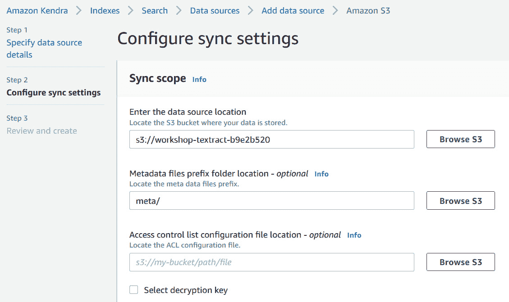

# 第五章：*第五章*：创建 NLP 搜索

在前几章中，您已经了解了如何使用 Amazon Textract 提取文档中的文本，并使用 Amazon Comprehend 提取洞察，而无需提前具备 **机器学习**（**ML**）经验。在上一章中，我们向您展示了如何结合这些功能，通过贷款处理的实例，解决实际的文档自动化案例。

在本章中，我们将使用 Amazon Textract 和 Amazon Comprehend 服务，展示如何快速搭建一个智能搜索解决方案，并结合强大的元素，如 **Amazon Elasticsearch**，这是一项用于设置搜索和日志分析的托管服务，和 **Amazon Kendra**，这是一项由机器学习驱动的智能托管搜索解决方案，支持自然语言搜索。

本章将涵盖以下主题：

+   回顾搜索用例和搜索解决方案的选择

+   使用 Amazon Elasticsearch 为扫描图像构建搜索解决方案

+   使用 Amazon Kendra 设置企业搜索解决方案

# 技术要求

在本章中，您需要访问 AWS 账户。在开始之前，我们建议您按照以下步骤创建一个 AWS 账户：

1.  打开 [`portal.aws.amazon.com/billing/signup`](https://portal.aws.amazon.com/billing/signup)。

1.  请访问并执行网页上提供的步骤进行注册。

1.  在提示时登录到您的 AWS 账户。

本书的 GitHub 仓库中提供了 Amazon Textract 示例的 Python 代码和样本数据集，地址为：[`github.com/PacktPublishing/Natural-Language-Processing-with-AWS-AI-Services/tree/main/Chapter%2005`](https://github.com/PacktPublishing/Natural-Language-Processing-with-AWS-AI-Services/tree/main/Chapter%2005)。

查看以下视频，查看代码演示：[`bit.ly/3nygP5S`](https://bit.ly/3nygP5S)。

# 创建基于 NLP 的智能搜索索引

每个组织都有大量的文档，既有纸质文档，也有存档文件。问题在于，这些文档大多分散在不同的孤岛中，而不是集中在一个地方。因此，对于这些组织来说，基于这些孤立文档中的隐藏信息做出业务决策是极具挑战性的。这些组织采取的一些方法是将文档放入数据湖中以便搜索。然而，从这些文档中提取有意义的信息则是另一项挑战，因为这需要大量的自然语言处理（NLP）专业知识、机器学习（ML）技能以及搭建基础设施的能力。即使您能够从这些文档中提取出有价值的见解，另一个挑战将是建立一个可扩展的搜索解决方案。

本节将通过使用我们在前几章中介绍的 AWS AI 服务来解决这些挑战，并讨论如何利用这些服务建立一个集中式的文档存储。

一旦所有文档都存储在像 Amazon S3 这样的集中存储服务中，Amazon S3 是一种可扩展、耐用的对象存储，类似于 Dropbox，我们可以使用 *Amazon Textract*（如在 *第二章* 中介绍的）提取这些文档中的文本，并使用 *Amazon Comprehend*（如在 *第三章* 中介绍的）提取基于 NLP 的洞察，如实体、关键词、情感等。此外，我们可以快速对这些洞察和文本进行索引，并将其发送到 Amazon Elasticsearch 或 Amazon Kendra，以建立智能搜索解决方案。

以下图示展示了我们将在本节中讨论的架构：


图 5.1 – 创建基于 NLP 的搜索索引

在 *图 5.1* 中，你可以看到我们构建搜索索引的两种选项，具体如下：

1.  使用 Amazon Elasticsearch 在基于 Amazon Textract 和 Amazon Comprehend 的文档处理管道上构建搜索

1.  使用 Amazon Kendra 在现有的基于 Amazon Textract 和 Amazon Comprehend 的文档处理管道上构建无服务器的智能搜索

如果你正在寻找基于自然语言的搜索解决方案，且该解决方案由机器学习驱动，让你能够提问类似人类的问题，而不是只进行关键词搜索，你可以选择 Amazon Kendra 进行搜索，因为 Amazon Kendra 是一个由机器学习驱动的 AWS AI 服务。Amazon Kendra 提供自然语言搜索功能，并将为你提供基于自然语言处理（NLP）的答案，也就是说，提供类似人类的上下文答案。例如，假设你正在为 Salesforce 中的 IT 支持文档设置搜索功能。使用 Amazon Kendra，你可以直接提问诸如 *“IT 服务台在哪里？”* 这样的问题，Amazon Kendra 会给出精确的回答，比如 "*在六楼*"，而在 Amazon Elasticsearch 中，你只能进行基于关键词的搜索。

此外，你还可以将 Amazon Kendra 集成到 Amazon Lex 中，后者是一个用于创建聊天机器人的服务。你可以在网站上部署由 Amazon Lex 和 Amazon Kendra 提供支持的智能搜索聊天机器人。Amazon Kendra 还提供了大量连接器，能够发现并索引你的数据进行搜索，包括 Amazon S3、OneDrive、Google Drive、Salesforce、RDS 等关系型数据库，以及许多第三方供应商支持的其他平台。

你可以在许多不同的有趣用例中设置搜索功能，例如，财务分析师在寻找财务事件时，通常需要浏览大量的 SEC 文件报告，查找有意义的财务实体，如并购事件。使用提议的流程管道以及 Amazon Comprehend Events，可以轻松减少浏览这些文档时的时间和噪音，并在出现财务事件（如并购）时及时更新他们的财务模型。

对于医疗保健公司，他们可以利用 Amazon Comprehend Medical 提供的一整套服务和选项来创建智能搜索，医生可以登录并从 Amazon HealthLake 中集中管理的患者数据中搜索相关的关键词或信息。本章将进一步介绍这一用例。

我们都知道找工作非常困难。对于猎头公司来说，要在成千上万的简历中寻找合适的候选人和相关技能更是难上加难。你可以使用提出的解决方案，建立一个简历处理流水线，将不同候选人的简历上传到 Amazon S3，并根据你所寻找的职位要求，搜索相关技能。

在本节中，我们介绍了两种设置智能搜索索引的选项。在下一节中，我们将展示如何设置此架构，创建一个 NLP 驱动的搜索应用程序，在这个应用程序中，**人力资源**（**HR**）管理员用户可以快速上传候选人的扫描简历，其他用户可以登录并根据职位空缺搜索相关的技能集。

# 使用 Amazon Elasticsearch 构建扫描图像搜索解决方案

在前面的章节中，我们讨论了如何使用 Amazon Lambda 函数创建一个无服务器应用程序。在本节中，我们将通过以下架构，带你一步步建立一个基于扫描图像的搜索解决方案，通过 Amazon Lambda 函数调用 Amazon Textract 和 Amazon Comprehend APIs。我们将为此用例使用 Amazon Elasticsearch。不过，你也可以将 Amazon Elasticsearch 替换为 Amazon Kendra，以创建一个基于 ML 的搜索解决方案，在其中你可以使用自然语言提问进行搜索。


图 5.2 – 使用 Amazon Elasticsearch 构建 NLP 搜索

在之前的架构中使用的 AWS 服务是**Amazon Cognito**，用于设置后台用户的登录。

Amazon S3 用于集中存储。Amazon Lambda 函数作为无服务器事件触发器，在扫描的简历上传到 Amazon S3 后触发，然后我们使用 Amazon Textract 和 Amazon Comprehend 提取文本和洞察信息，如关键短语和实体。接着我们将所有数据索引到 Amazon Elasticsearch。最终用户可以通过 Cognito 登录，并通过与 Amazon Elasticsearch 集成的 Kibana 仪表盘进行可视化访问 Amazon Elasticsearch。

## 先决条件

我们将使用 AWS CloudFormation 模板来启动本章所需的资源。CloudFormation 模板是以 YAML 或 JSON 格式编写的脚本，用于启动资源或**基础设施即代码**（**IaC**）。AWS CloudFormation 模板编写 IaC，并为你设置所有必要的权限：

1.  点击[`forindexing.s3.eu-west-1.amazonaws.com/template-export-textract.yml`](https://forindexing.s3.eu-west-1.amazonaws.com/template-export-textract.yml)下载并部署 AWS CloudFormation 模板。

    图 5.3 – CloudFormation 模板堆栈

1.  向下滚动到`documentsearchapp`，并找到如以下截图所示的**DOMAINNAME**:

    图 5.4 – 输入参数

1.  向下滚动并勾选**Capabilities and transforms**下的所有三个确认框，然后点击**Create stack**。

    图 5.5 – Capabilities and transforms 部分

1.  您将看到堆栈创建过程正在进行中。请等待直到完成，像下面的截图所示——您可以刷新页面以查看状态的变化。部署此堆栈可能需要 20 分钟，趁此机会去喝杯咖啡吧:

    图 5.6 – CloudFormation 资源创建完成

    注意：

    在您的堆栈创建过程中，您将收到一封包含 Cognito 登录详细信息的电子邮件。请确保检查在创建此堆栈时提供的相同电子邮件。管理员可以在部署后通过 Amazon Cognito 控制台添加多个用户的电子邮件地址。这些电子邮件可以发送给最终用户，在将简历数据上传到 Amazon S3 后，用户可以登录系统。

1.  转到**Outputs**标签页，向下滚动到**Outputs**部分。

    图 5.7 – CloudFormation 输出

1.  从**Value**部分复制**S3KeyPhraseBucket**和**KibanaLoginURL**的值。我们将在本节中使用这些链接，逐步指导您操作此应用程序。

现在，您已经通过 CloudFormation 设置了基础设施，包括 Amazon S3 桶、Lambda 函数、Cognito 登录、Kibana 以及 Amazon Elasticsearch 集群。您已经获得了 CloudFormation 的输出，其中包含 S3 桶和 Kibana 仪表板登录的 URL。在接下来的部分中，我们将向您展示如何将扫描的图像上传到此应用程序，并以管理员身份进行交互。

## 上传文档到 Amazon S3

我们将开始以下步骤来上传文档到 Amazon S3:

1.  点击从上一节 CloudFormation 模板输出中复制的 S3 链接。然后，下载[`github.com/PacktPublishing/Natural-Language-Processing-with-AWS-AI-Services/blob/main/Chapter%2005/resume_sample.PNG`](https://github.com/PacktPublishing/Natural-Language-Processing-with-AWS-AI-Services/blob/main/Chapter%2005/resume_sample.PNG)中的示例简历，并通过点击**Upload**按钮，再点击**Add files**上传到 S3。

    图 5.8 – Amazon S3 中的扫描图像

1.  这个上传触发了一个 Amazon S3 事件通知到 AWS Lambda 函数。要检查此项，请转到**属性**标签页，然后滚动到**事件通知**，如下截图所示：

    图 5.9 – S3 事件通知以通知 AWS Lambda 函数

1.  点击**目标**下显示的 Lambda 函数链接。我们将在下一节中检查这个 Lambda 函数。

我们已将示例扫描简历上传到 Amazon S3，并且还向你展示了在哪里可以找到触发 Lambda 函数的 S3 事件通知。在下一节中，让我们一起探索 Lambda 函数中发生了什么。

## 检查 AWS Lambda 函数

在本节中，我们将检查 AWS Lambda 的代码块以及对 Amazon Textract 和 Amazon Comprehend 的 API 调用，并结合使用 Amazon Elasticsearch。


图 5.10 – AWS Lambda 函数

部署代码过于庞大，无法在此 AWS Lambda 控制台中显示。你可以通过以下 GitHub 仓库访问代码：[`github.com/PacktPublishing/Natural-Language-Processing-with-AWS-AI-Services/blob/main/Chapter%2005/lambda/index.py`](https://github.com/PacktPublishing/Natural-Language-Processing-with-AWS-AI-Services/blob/main/Chapter%2005/lambda/index.py)：

1.  首先，我们通过 Amazon S3 事件获取文件，如下所示是来自主 Lambda 处理程序的代码块。在 Lambda 中，所有代码块都从这个主处理程序执行。`handler` 方法会在每次函数调用时由 Lambda 调用，作为入口点。处理程序外的代码包含可以从主处理程序调用的函数以及一些全局变量：

    ```py
    def handler(event, context):
    bucket = event['Records'][0]['s3']['bucket']['name']
    key = unquote_plus(event['Records'][0]['s3']['object']['key'])
    ```

1.  以下代码从 Amazon S3 下载文件，以便使用 Textract 和 Comprehend 进行处理：

    ```py
           s3.Bucket(bucket).download_file(Key=key,Filename='/tmp/{}')
            with open('/tmp/{}', 'rb') as document:
                imageBytes = bytearray(document.read())
            print("Object downloaded")
    ```

1.  在通过 S3 事件获取对象或扫描简历并通过 Lambda 函数读取后，我们将调用 Amazon Textract AnalyzeDocument API，这是一个实时 API，用于提取文本，代码如下：

    ```py
    response = textract.analyze_document(Document={'Bytes': imageBytes},FeatureTypes=["TABLES", "FORMS"])
    document = Document(response)
    ```

1.  我们将解析响应，提取要发送到 Amazon Comprehend 的文本行：

    ```py
     blocks=response['Blocks']
            for block in blocks:
                if block['BlockType'] == 'LINE':
                     text += block['Text']+"\n"
              print(text)
    ```

1.  一旦提取了文本，我们将通过将其放入列表变量中调用 Comprehend Keyphrase API，以便稍后进行索引：

    ```py
    keyphrase_response = comprehend.detect_key_phrases(Text=text, LanguageCode='en')
    KeyPhraseList=keyphrase_response.get("KeyPhrases")
     for s in KeyPhraseList:
                                textvalues.append(s.get("Text")
    ```

1.  现在我们将使用 Comprehend DetectEntities API 提取实体，并将其保存在映射数据结构变量中，以便稍后进行索引：

    ```py
    detect_entity= comprehend.detect_entities(Text=text, LanguageCode='en')
    EntityList=detect_entity.get("Entities")
    for s in EntityList:
                                             textvalues_entity.update([(s.get("Type").strip('\t\n\r'),s.get("Text").strip('\t\n\r'))]
    ```

1.  现在我们将创建一个要进行索引的 Amazon S3 URL：

    ```py
    s3url='https://s3.console.aws.amazon.com/s3/object/'+bucket+'/'+key+'?region='+region
    ```

1.  我们已经获取了文本、关键词和实体，以及上传文档的 S3 链接。接下来，我们将对其进行索引并上传到 Elasticsearch：

    ```py
    searchdata={'s3link':s3url,'KeyPhrases':textvalues,'Entity':textvalues_entity,'text':text, 'table':table, 'forms':forms}
    print(searchdata)
    print("connecting to ES")
    es=connectES()
    es.index(index="document", doc_type="_doc", body=searchdata)
    ```

    注意：

    如果简历中包含表格或表单，我们已经准备好对它们进行索引。此外，这个解决方案还可以用于**发票搜索**。

在本节中，我们向您展示了如何从上传到 Amazon S3 的文档中提取文本和洞察。我们还将数据索引到 Amazon Elasticsearch 中。在接下来的部分，我们将向您展示如何使用您在创建 CloudFormation 模板时设置的管理员登录邮件登录 Kibana，并在 Kibana 仪表板中可视化数据。

## 在 Kibana 控制台中搜索并发现数据

在本节中，我们将讲解如何通过 Amazon Cognito 使用您在通过 AWS CloudFormation 部署资源时输入的管理员电子邮件来注册 Kibana。然后，我们将向您展示如何在 Kibana 中设置索引。我们还将展示如何根据来自 Amazon Comprehend 的实体、关键词和表格过滤器在 Kibana 仪表板中发现和搜索数据。最后，您可以从 Amazon S3 下载搜索到的简历链接。

我们将包括 Kibana 控制台的注册过程、使索引可被搜索功能发现，以及如何在 Kibana 中搜索洞察。

### 注册 Kibana 控制台

在这些步骤中，我们将向您演示如何使用 CloudFormation 生成的输出链接登录 Kibana：

1.  点击您从 CloudFormation 输出中获得的 Kibana 登录链接，如以下截图所示：

    ](img/B17528_05_11.jpg)

    图 5.11 – CloudFormation 输出 – Kibana URL

1.  该链接将把您重定向到此控制台：

    ](img/B17528_05_12.jpg)

    图 5.12 – Kibana 登录对话框

    注意：

    您可以通过点击前一截图中显示的**注册**按钮来注册更多的终端用户。

1.  您应该已收到一封包含用户名和临时密码的电子邮件 – 在前面的对话框中输入这些信息，然后点击**Sign in**。

    ](img/B17528_05_13.jpg)

    图 5.13 – 验证和密码登录邮件

1.  第一次登录时，系统会要求您更改密码。更改密码后，您将被重定向到 Kibana 控制台。

我们已经讲解了如何注册 Kibana。在接下来的部分，我们将向您展示如何在 Kibana 中设置索引。

### 使索引可被搜索功能发现

在本节中，我们将向您展示如何在 Kibana 中设置索引以进行搜索：

1.  到达 Kibana 控制台后，点击**Discover**，我们将引导您在 Kibana 中设置索引。

    图 5.14 – Kibana 创建索引模式页面

1.  在**Index pattern**字段中输入`document`，如以下截图所示，然后点击**Next step**：

    ](img/B17528_05_15.jpg)

    图 5.15 – 定义索引模式

1.  点击**Create index pattern**。这将使您的 Elasticsearch 索引可搜索。


](img/B17528_05_16.jpg)

图 5.16 – 创建索引模式

我们已经创建了索引。现在我们将开始搜索见解。

### 在 Kibana 中搜索见解

在本节中，我们将带您了解如何在 Kibana 中搜索见解：

1.  点击 **Discover**，在左侧您将找到可以添加到搜索筛选器中的实体和关键词短语，位于 **可用字段** 下。

    图 5.17 – Kibana 的 Discover 仪表盘 (a)

    让我们看一下以下截图中的另一个输出：

    

    图 5.18 – Kibana 的 Discover 仪表盘 (b)

1.  **实体搜索**：通过添加 **Entity.TITLE** 和 **Entity.dATE** 等可用字段，按日期和职位搜索候选人以快速查找。您可以点击 **添加筛选器**，这些筛选器将如下面的截图所示被添加。您可以看到它找到了 2017 年 7 月具有大数据分析职称的人：

    图 5.19 – 向选定字段添加实体筛选器

1.  **使用关键词和表格进行搜索**：从 **可用字段** 中添加 **关键词短语** 和 **表格筛选器**，您将获得一张汇总表，列出所有您需要的技能，以及关于候选人的关键词短语。

    图 5.20 – 关键词和表字段搜索

1.  在搜索框中输入 `Amazon Sagemaker 和 MySQL`，查看是否有符合我们需求的候选人简历。我们能够找到一份同时具备这两项技能的候选人简历，如下图所示：

    图 5.21 – 使用 AND 条件的关键词搜索

1.  **下载匹配候选人简历**：我们可以通过在 **选定字段** 上添加 S3 链接来下载匹配候选人的简历，如下所示：


图 5.22 – 下载简历的 S3 链接

在本节中，我们为您提供了扫描图像搜索解决方案的架构概述，其中管理员用户将扫描的文档上传到 Amazon S3，然后展示了如何注册 Kibana 仪表盘并搜索关键词，从扫描文档中获取有意义的见解。

我们已经带您完成了使用 AWS CloudFormation 模板一键部署架构的步骤，您可以查看 *进一步阅读* 部分，了解如何创建这些模板。我们还展示了如何通过上传一些示例文档与此应用程序进行交互。我们指导您如何设置 Kibana 仪表盘，并提供了一些示例查询，以便通过关键词和实体作为筛选条件获得见解。

在接下来的章节中，我们将探索一个基于 Kendra 的搜索解决方案。让我们开始探索 Amazon Kendra，以及如何通过使用它为 Textract 和 Comprehend 提供支持，来加速文档处理工作流。

# 使用 Amazon Kendra 设置企业级搜索解决方案

本节将介绍如何使用 Amazon Kendra 快速创建一个端到端的无服务器文档搜索应用。

## 本节将介绍开始使用的步骤。

### Git 克隆笔记本

我们将演示如何 Git 克隆笔记本，并展示如何使用简单的 boto3 API 设置基于 Kendra 的搜索架构的代码示例。

1.  在前面章节中设置的 SageMaker Jupyter 笔记本中，使用 Git 克隆[`github.com/PacktPublishing/Natural-Language-Processing-with-AWS-AI-Services/`](https://github.com/PacktPublishing/Natural-Language-Processing-with-AWS-AI-Services/)。

1.  前往`Chapter 05/Ch05-Kendra Search.ipynb`并开始运行笔记本。

    注意：

    请为 SageMaker 笔记本的 IAM 角色添加 Kendra IAM 访问权限，以便你能够通过该笔记本调用 Kendra API。在前面的章节中，你已经为 SageMaker 笔记本添加了对 Amazon Comprehend 和 Textract API 的 IAM 访问权限。

### 创建 Amazon S3 存储桶

我们将展示如何创建 Amazon S3 存储桶。我们将使用此存储桶作为 Kendra 数据源，并用于存储从 Amazon Textract 提取的数据。

1.  通过访问 Amazon S3 控制台[`s3.console.aws.amazon.com/s3/home?region=us-east-1`](https://s3.console.aws.amazon.com/s3/home?region=us-east-1)来创建一个 Amazon S3 存储桶。

1.  点击**创建存储桶**按钮，并输入任意存储桶名称，如下图所示：

    图 5.23 – 创建一个 Amazon S3 存储桶

1.  向下滚动并点击**创建存储桶**。

1.  复制已创建的存储桶名称，打开`Chapter 05/Ch05-Kendra Search.ipynb`，并在以下单元格中将其粘贴到`'<your s3 bucket name>'`的位置开始：

    ```py
    # Define IAM role
    role = get_execution_role()
    print("RoleArn: {}".format(role))
    sess = sagemaker.Session()
    s3BucketName = '<your s3 bucket name>'
    prefix = 'chapter5'
    ```

我们已经准备好了笔记本，并且为本节的解决方案创建了 Amazon S3 存储桶。接下来，我们将通过快速的架构演示，帮助你了解关键组件，随后会引导你通过你已经设置的笔记本中的代码。

## 演示解决方案

设置企业级搜索可能比较困难。这就是为什么我们有 Amazon Kendra，它可以通过各种数据连接器爬取数据，快速创建简单的搜索解决方案。在接下来的架构中，我们将引导你了解如何在将 PDF 文档存储在 Amazon S3 中时设置文档搜索。我们将使用 Amazon Textract 从这些 PDF 文档中提取数据，并将其发送到 Amazon Comprehend，以提取一些关键实体，如**组织**、**标题**、**日期**等。这些实体将作为过滤器，在我们将文档直接同步到 Amazon Kendra 进行搜索时使用。


图 5.24 – 基于 Textract 和 Comprehend 的 Amazon Kendra 搜索架构

所以，我们在前面的图示中给出了一个高层次的实现架构。在下一节中，我们将向你展示如何用几行代码以及 Python Boto3 API 构建这个架构。

### 代码讲解

在本节中，我们将带你快速设置建议的架构：

1.  我们将参考这个笔记本：[`github.com/PacktPublishing/Natural-Language-Processing-with-AWS-AI-Services/blob/main/Chapter%2005/Ch05-Kendra%20Search.ipynb`](https://github.com/PacktPublishing/Natural-Language-Processing-with-AWS-AI-Services/blob/main/Chapter%2005/Ch05-Kendra%20Search.ipynb)。以下代码展示了用于 Comprehend、Kendra 和 Textract API 的 Boto3 客户端设置。

    ```py
    comprehend = boto3.client('comprehend')
    textract= boto3.client('textract')
    kendra= boto3.client('kendra')
    ```

1.  现在我们将从这个仓库上传 PDF 文档 [`github.com/PacktPublishing/Natural-Language-Processing-with-AWS-AI-Services/blob/main/Chapter%2005/resume_Sample.pdf`](https://github.com/PacktPublishing/Natural-Language-Processing-with-AWS-AI-Services/blob/main/Chapter%2005/resume_Sample.pdf) 到 Amazon S3。

    注意：

    你可以上传任意数量的文档进行搜索。为了演示，我们只提供了一个样本。请随意上传你的文档到 Amazon S3，并在开始同步文档到 Amazon Kendra 之前生成元数据文件。

    为了从上传到 Amazon S3 的 PDF 中提取文本，我们将使用与在*第二章*中处理异步过程相同的代码，*介绍 Amazon Textract*。

1.  以下代码展示了如何从 Amazon Textract 提取文本：

    ```py
    text=""
    for resultPage in response:
        for item in resultPage["Blocks"]:
            if item["BlockType"] == "LINE":
                #print ('\033[94m' +  item["Text"] + '\033[0m')
                text += item['Text']+"\n"
    print(text)
    ```

    以下屏幕截图展示了从 PDF 中提取的文本：

    

    ](img/B17528_05_25.jpg)

    图 5.25 – 从 Amazon Textract 提取的简历数据文本响应

1.  现在我们将通过运行以下代码将文本发送到 Amazon Comprehend 进行实体提取：

    ```py
    entities= comprehend.detect_entities(Text=text, LanguageCode='en')
    ```

1.  现在我们将创建一个 Amazon Kendra 索引。请访问 Kendra 控制台 [`console.aws.amazon.com/kendra/home?region=us-east-1#indexes`](https://console.aws.amazon.com/kendra/home?region=us-east-1#indexes)，点击**索引名称**，然后向下滚动并点击**创建新角色（推荐）**，如下图所示：

    图 5.26 – 为 Kendra 索引创建新角色

1.  输入`AmazonKendra-us-east-1-kendra`作为角色名称并点击`AmazonKendra-us-east-1-`。

1.  对于**配置用户访问控制**，选择**否**以表示不使用**令牌进行访问控制**，然后点击**下一步**。

1.  对于**指定配置**，选择**开发者版**，然后点击**创建**。或者，在创建 IAM 角色后，您可以运行以下笔记本单元格，使用编程方式创建索引：

    ```py
    response = kendra.create_index(
        Name='Search',
        Edition='DEVELOPER_EDITION',
        RoleArn='<enter IAM role by creating IAM role in IAM console')
    print(response)
    ```

    注意：

    索引创建可能需要最多 30 分钟。

1.  创建索引后，我们需要获取索引 ID，以便在此笔记本中运行。一旦索引创建完成，点击**索引**并进入**索引设置**以复制索引 ID。

    图 5.27 – 从 Kendra 控制台复制 Kendra 索引 ID

    或者，如果您使用*CreateIndex API*编程创建了索引，其响应将包含一个 36 位数字的索引 ID，您需要复制并粘贴该 ID，然后运行下一段代码，以根据 Comprehend 实体更新搜索过滤器。

1.  将 Kendra 索引 ID 复制并粘贴到以下单元格中的占位符处，然后运行该单元格以更新我们使用过滤器进行搜索的索引。有关完整代码以添加所有过滤器，请参阅笔记本：

    ```py
    response = kendra.update_index(
        Id="<paste Index Id from Create Index response>",
        DocumentMetadataConfigurationUpdates=[
            {
                'Name':'ORGANIZATION',
                'Type':'STRING_LIST_VALUE',
                'Search': {
                    'Facetable': True,
                    'Searchable': True,
                    'Displayable': True
                }
            }}
    ```

1.  现在我们将定义 Comprehend 识别的类别列表：

    ```py
    categories = ["ORGANIZATION", "PERSON", "DATE", "COMMERCIAL_ITEM", "OTHER", "TITLE", "QUANTITY"]
    ```

1.  现在，我们将遍历这些实体并生成一个元数据文件，以便根据 Amazon Comprehend 中的实体填充过滤器：

    ```py
    for e in entities["Entities"]:
        if (e["Text"].isprintable()) and (not "\"" in e["Text"]) and (not e["Text"].upper() in category_text[e["Type"]]):
                    #Append the text to entity data to be used for a Kendra custom attribute
                    entity_data[e["Type"]].add(e["Text"])
                    #Keep track of text in upper case so that we don't treat the same text written in different cases differently
                    category_text[e["Type"]].append(e["Text"].upper())
                    #Keep track of the frequency of the text so that we can take the text with highest frequency of occurrance
                    text_frequency[e["Type"]][e["Text"].upper()] = 1
        elif (e["Text"].upper() in category_text[e["Type"]]):
                    #Keep track of the frequency of the text so that we can take the text with highest frequency of occurrance
                    text_frequency[e["Type"]][e["Text"].upper()] += 1
    print(entity_data)
    ```

1.  您将收到一个响应，详细说明从 PDF 文档中的文本检测到的 Comprehend 实体类型和值。

    图 5.28 – Comprehend 提取的实体

1.  从先前的实体填充 Kendra 元数据列表，以便为 Amazon Kendra 属性过滤器使用：

    ```py
    elimit = 10
    for et in categories:
    ```

1.  选择`elimit`数量的识别文本字符串，这些字符串的出现频率最高：

    ```py
        el = [pair[0] for pair in sorted(text_frequency[et].items(), key=lambda item: item[1], reverse=True)][0:elimit]
        metadata[et] = [d for d in entity_data[et] if d.upper() in el]
    metadata["_source_uri"] = documentName
    attributes["Attributes"] = metadata
    ```

1.  最后一步是将此文件保存为`metadata.json`。确保文件名是原始 PDF 文档的文件名，后面跟上`metadata.json`，并将其上传到您的 PDF 文档所在的 Amazon S3 存储桶中：

    ```py
    s3 = boto3.client('s3')
    prefix= 'meta/'
    with open("metadata.json", "rb") as f:
        s3.upload_file( "metadata.json", s3BucketName,'%s/%s' % ("meta","resume_Sample.pdf.metadata.json"))
    ```

我们已经向您展示了如何上传 PDF 文档，使用 Amazon Textract 提取数据，然后使用 Amazon Comprehend 提取实体。然后，我们使用 Comprehend 提取的过滤器或实体创建了一个元数据文件，并将其上传到 Amazon S3。在下一部分，我们将向您展示如何将 Amazon Kendra 与您上传的 S3 文档同步，并且如何创建一个`meta`文件夹并将您的元数据文件放置在其中，以便 Amazon Kendra 在同步时将其作为元数据过滤器。

## 使用来自 Comprehend 的增强过滤器在 Amazon Kendra 中进行搜索

在这一部分，我们将向您展示如何将文档同步到您创建的索引，并同步元数据文件中的过滤器：

1.  将 Kendra 数据源设置为你上传文档的 Amazon S3 存储桶。导航到**Amazon Kendra** | **索引** | **<索引名称>**| **数据源** | **添加数据源** | **Amazon S3**，如下面的截图所示：

    图 5.29 – 配置 Amazon Kendra 同步

1.  在 `meta/` 中输入 `s3://<你的存储桶名称>`，如前面的截图所示。

1.  在 **角色名称** 字段中填写 `AmazonKendra-s3`。

    图 5.30 – Kendra 按需运行的计划

1.  然后将同步运行计划的频率设置为**按需运行**，并点击**下一步**。

1.  点击 **审核** + **创建**。

1.  数据源创建后，点击 **立即同步**。

一旦同步成功，所有你在 Amazon S3 中的文档将被同步，Kendra 过滤器将填充由 Amazon Comprehend 提取的元数据属性。

在下一节中，我们将带你了解如何导航到 Amazon Kendra 控制台进行搜索。

### 在 Amazon Kendra 中进行搜索

Amazon Kendra 附带一个内置的搜索 UI，可用于测试搜索功能。

测试后，你还可以在 React 应用中部署此 UI。页面 [`docs.aws.amazon.com/kendra/latest/dg/deploying.html`](https://docs.aws.amazon.com/kendra/latest/dg/deploying.html) 提供了部署 UI 的代码，可以与任何使用 API Gateway 和 Lambda 的无服务器应用程序集成。

你还可以使用 `Kendra.query()` API 从你在 Kendra 中创建的索引中检索结果。

在本节中，我们将带你了解如何使用内置的 Kendra 搜索控制台：

1.  在搜索框中导航到 `具有云技能的人员`：

    图 5.31 – Kendra 查询结果

    Amazon Kendra 能够提供包含简历中 Jane Doe 的上下文答案，我们已将其简历索引。

    它还为你提供基于 Comprehend 实体的过滤器，位于左侧，可以根据 **组织**、**职位**、**日期** 等实体以及它们的词频快速对个人进行排序。

    你还可以创建 *Comprehend 自定义实体*，正如我们在 *第四章** 自动化文档处理工作流* 中介绍的那样，依据你的业务需求丰富你的元数据过滤器。

1.  接下来，在 Kendra 搜索控制台中输入 `具有 10 年经验的人员` 查询。


图 5.32 – Kendra 查询结果，左侧显示 Comprehend 元数据增强的过滤器

Amazon Kendra 能够为你提供准确的上下文答案。你还可以根据相关性提高 Kendra 的响应，并通过点赞和点踩按钮提供反馈，改进你的 Kendra 模型。

注意：

Amazon Kendra 支持使用 PDF、Word、JSON、TXT、PPT 和 HTML 文档进行搜索功能。可以通过此管道添加更多文档，以提高搜索结果和准确性。

# 摘要

在本章中，我们介绍了设置文档处理工作流的智能搜索解决方案的两种选项。第一个选项涉及快速设置基于 NLP 的搜索，使用 Amazon Textract、Amazon Comprehend 和 Amazon Elasticsearch，通过 Lambda 函数和 CloudFormation 模板进行扫描简历分析，并且可以用于任何扫描的内容，如图像、发票或收据。第二个选项，我们介绍了如何为您的 PDF 文档设置一个企业级的无服务器可扩展搜索解决方案，使用 Amazon Kendra。我们还向您展示了如何利用从 Amazon Comprehend 生成的命名实体，丰富 Amazon Kendra 搜索的额外属性或元数据。

在下一章中，我们将讨论如何使用 AI 来提升联系中心的客户服务。

# 深入阅读

+   *使用 Amazon Textract 和 Amazon Comprehend 构建 NLP 驱动的搜索索引*，作者：Mona Mona 和 Saurabh Shrivastava（[`aws.amazon.com/blogs/machine-learning/building-an-nlp-powered-search-index-with-amazon-textract-and-amazon-comprehend/`](https://aws.amazon.com/blogs/machine-learning/building-an-nlp-powered-search-index-with-amazon-textract-and-amazon-comprehend/)）

+   *构建智能搜索解决方案与自动化内容丰富*，作者：Abhinav Jawadekar 和 Udi Hershkovich（[`aws.amazon.com/blogs/machine-learning/build-an-intelligent-search-solution-with-automated-content-enrichment/`](https://aws.amazon.com/blogs/machine-learning/build-an-intelligent-search-solution-with-automated-content-enrichment/)）
