# 第六章：*第六章*：利用 NLP 提升客户服务效率

到目前为止，我们已经看到了一些有趣的现实世界 NLP 应用案例，比如在*第四章*中用于贷款申请的智能文档处理解决方案，*自动化文档处理工作流*，以及在*第五章*中构建的智能搜索索引，*创建 NLP 搜索*。基于 NLP 的内容搜索索引正变得越来越流行，因为它弥补了传统基于关键词的搜索与自然语言搜索之间的差距。传统的关键词搜索可能让人感到沮丧，除非你知道要使用的确切关键词，而自然语言搜索则可以帮助快速找到你感兴趣的内容。我们还看到，如何利用 Amazon Textract 和 Amazon Comprehend 与如 Amazon Elasticsearch([`aws.amazon.com/elasticsearch-service/`](https://aws.amazon.com/elasticsearch-service/))这样的服务进行集成，Amazon Elasticsearch 是由 AWS 完全管理的服务，提供开源 Elasticsearch 提供的搜索和分析功能，但无需处理设置 Elasticsearch 集群时的基础设施负担、安装或维护问题；以及 Amazon Kendra([`aws.amazon.com/kendra/`](https://aws.amazon.com/kendra/))，这是一个由机器学习驱动的完全托管企业搜索引擎，提供基于 NLP 的搜索功能，可以用来创建端到端的智能搜索解决方案。在本章中，我们将讨论一个普遍存在的用例，它已经存在了几十年，甚至几个世纪，但对于任何企业来说依然非常重要——那就是客户服务的改进。

企业如果没有客户，就无法发展，而客户满意度是一个关键指标，直接与组织的盈利能力相关。虽然组织在销售周期中与客户接触的各个环节非常重要，但更为关键的是其客户服务流程的有效性。组织需要迅速响应客户反馈，理解客户对话中的情感潜流，并在最短时间内解决问题。满意的客户是忠诚的客户，当然，这意味着客户流失率低，从而有助于降低成本并提高盈利能力。

为了展示客户服务改进的实际应用，我们将构建一个使用 AWS NLP 服务——Amazon Comprehend 的 AI 解决方案，分析历史客户服务记录，通过 Amazon Comprehend 主题建模提取关键主题，训练一个自定义分类模型，使用 Amazon Comprehend 自定义分类来预测呼叫路由的主题，并使用 Amazon Comprehend 情感检测来理解客户反馈的情感。我们将在本章中进行动手实践，但我们已经准备好所有需要的代码样本，以便开始。

在本章中，我们将涵盖以下主题：

+   引入客户服务用例

+   构建自然语言处理解决方案以改进客户服务

# 技术要求

对于本章，您将需要访问 AWS 账户。请确保您按照*第二章*中*技术要求*部分的说明来创建您的 AWS 账户。在尝试*构建自然语言处理解决方案以改进客户服务*部分的步骤之前，您还需要登录 AWS 管理控制台。

我们解决方案的 Python 代码和示例数据集可以在[`github.com/PacktPublishing/Natural-Language-Processing-with-AWS-AI-Services/tree/main/Chapter%2006`](https://github.com/PacktPublishing/Natural-Language-Processing-with-AWS-AI-Services/tree/main/Chapter%2006)找到。请按照以下部分的说明和本存储库中的代码构建解决方案。

查看以下视频以查看代码在[`bit.ly/2ZpWveN`](https://bit.ly/2ZpWveN)的实际应用。

# 介绍客户服务使用案例

那么，自然语言处理如何帮助我们改进客户服务呢？为了说明我们的例子，让我们回到我们的虚构银行公司**LiveRight Holdings private limited**。**LiveRight**在美国的许多州设有联系中心，他们每天收到超过 100,000 通来自客户的查询和问题，涉及信用、账户、债务等各种主题。虽然他们有一支经验丰富的团队处理客户请求，但他们的一线分流团队经常在第一分钟内解读客户请求的性质时遇到困难，这对他们来说是重要的服务水平协议。这是为了确定将请求路由给哪些代理人。他们有一支根据产品类型和经验水平专门的代理团队。初级代理处理对产品满意的客户，而处理恼怒客户的挑战通常是更有经验的代理人的任务。

**LiveRight**的高级管理层对一线团队的表现不满，因为他们总是未能满足 1 分钟 SLA 的要求。更糟糕的是，在过去的 3 个月里，一线团队错误地将不满的客户转接给了初级代理，导致了客户流失的增加。因此，高级管理层希望自动化一线筛选流程，以便他们的团队能够解决这些问题。**LiveRight**聘请你设计一个解决方案架构，能够自动确定路由选项和客户对话的情绪。作为该项目的企业架构师，你决定使用 Amazon Comprehend，利用其预训练的机器学习模型进行情感分析，使用 Comprehend 内置的主题建模功能来确定训练数据集中常见的主题，从而确定路由选项标签，并利用 Amazon Comprehend 的自定义分类器功能逐步创建属于自己的客户请求路由分类器，而无需构建复杂的自然语言处理算法。我们将构建的解决方案组件如下图所示：

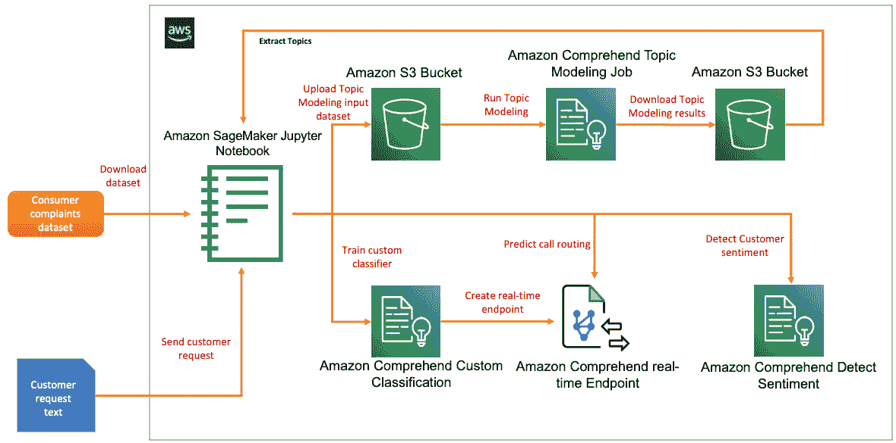

图 6.1 – 客户服务的自然语言处理解决方案构建

我们将使用 Amazon SageMaker Jupyter 笔记本演示这个解决方案，这将使我们能够逐步查看代码和结果。有关如何使用 AWS Lambda（一个无服务器、事件驱动的计算服务来运行代码）将此解决方案构建为实时工作流的代码示例，请参考*进一步阅读*部分：

1.  第一阶段，我们将对输入数据集进行预处理，数据集中包含本书 GitHub 仓库中的消费者投诉内容，将其加载到 S3 桶中，并运行 Amazon Comprehend 的主题建模作业，以确定路由选项标签。

1.  然后，我们将创建包含已分配给消费者投诉的路由选项标签的训练数据集，并将其上传到 S3 桶中。

1.  我们将使用 Amazon Comprehend 自定义分类功能，利用我们先前创建的训练数据集训练分类器模型。

1.  最后，我们将创建一个 Amazon Comprehend 实时端点，部署训练好的模型，并演示如何预测路由选项。然后，我们将演示如何使用 Amazon Comprehend 的情感分析 API 实时确定客户对话的情绪。

在本节中，我们介绍了通过我们的自然语言处理解决方案试图解决的客户服务问题，回顾了**LiveRight**面临的挑战，并概述了我们将要构建的解决方案。在下一节中，我们将逐步展示解决方案的构建过程。

# 构建自然语言处理解决方案以改善客户服务

在上一部分，我们介绍了客户服务的联络中心用例，概述了我们将要构建的解决方案架构，并简要回顾了解决方案组件和工作流程步骤。在本节中，我们将开始执行构建解决方案的任务。但首先，我们必须处理一些前提条件。

## 设置以解决用例

如果您在之前的章节中还未完成此操作，您需要创建一个 Amazon SageMaker Jupyter notebook，然后设置 `Chapter 06` 文件夹，打开 `chapter6-nlp-in-customer-service-github.ipynb` notebook，并在 notebook 中提供存储桶名称以开始执行。

注意

请确保您已完成*技术要求*部分中提到的任务。

如果您已经在之前的章节中完成了以下步骤，请直接跳到*预处理客户服务历史数据*部分：

1.  请参考 Amazon SageMaker 文档创建一个 notebook 实例：[`docs.aws.amazon.com/sagemaker/latest/dg/gs-setup-working-env.html`](https://docs.aws.amazon.com/sagemaker/latest/dg/gs-setup-working-env.html)。要按照这些步骤操作，请登录**AWS 管理控制台**，然后在搜索框中输入并选择**Amazon SageMaker**。接着，导航到**Amazon SageMaker**控制台。

1.  选择**Notebook 实例**，通过指定实例类型、存储和 IAM 角色来创建一个 Notebook 实例。

    创建 Amazon SageMaker Jupyter notebooks 时的 IAM 角色权限

    在 notebook 创建时接受 IAM 角色的默认设置，以允许访问任何 S3 存储桶。通过点击 IAM 角色并导航到身份和访问管理控制台，为正在创建的角色选择**ComprehendFullAccess**作为权限策略。您随时可以返回到您的 notebook 实例的 IAM 角色，并根据需要附加其他权限策略。

1.  创建了 notebook 实例并且其状态为**InService**后，点击 notebook 实例的**操作**菜单中的**打开 Jupyter**：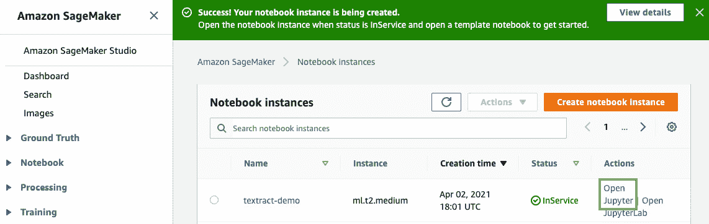

    图 6.2 – 打开 Jupyter notebook

    这将把您带到 notebook 实例的主文件夹。

1.  点击**新建**，然后选择**终端**，如下面的截图所示：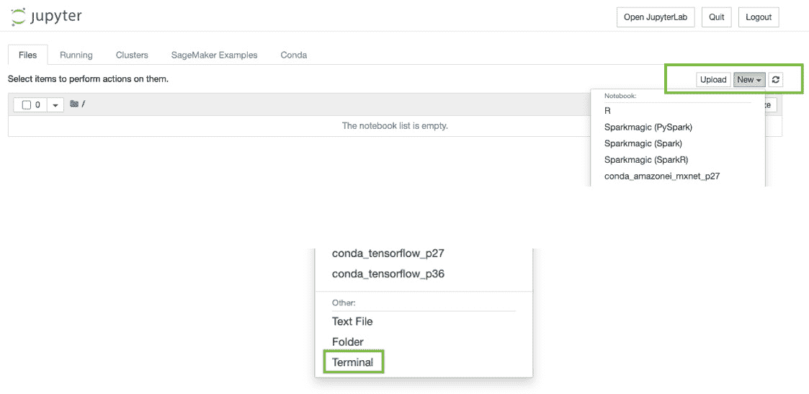

    图 6.3 – 在 Jupyter notebook 中打开终端

1.  在终端窗口中，输入 `cd SageMaker`，然后 `git clone` [`github.com/PacktPublishing/Natural-Language-Processing-with-AWS-AI-Services`](https://github.com/PacktPublishing/Natural-Language-Processing-with-AWS-AI-Services)，如下面的截图所示：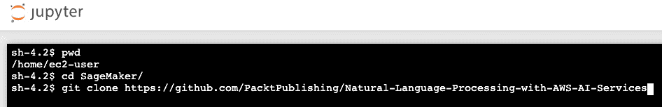

    图 6.4 – git clone 命令

1.  现在，退出终端窗口并返回主文件夹。您将看到一个名为`Natural-Language-Processing-with-AWS-AI-Services`的文件夹。点击它；您将看到一个名为`Chapter 06`的文件夹。点击该文件夹；您应该能看到一个名为`chapter6-nlp-in-customer-service-github`的 Notebook。

1.  点击此 Notebook 以打开它。

1.  按照本 Notebook 中与本节接下来几个小标题对应的步骤操作，一次执行一个单元格。请阅读每个 Notebook 单元格上方提供的描述。

现在我们已经设置好 Notebook 并克隆了代码库，让我们添加所需的权限策略，以便成功运行我们的代码示例。

## 其他 IAM 先决条件

为了训练 Comprehend 自定义实体识别器并设置实时端点，我们需要启用额外的策略，并更新 SageMaker notebook 角色的信任关系。请完成以下步骤：

1.  请将`ComprehendFullAccess`策略附加到您的 Amazon SageMaker Notebook IAM 角色上。要执行此步骤，请参阅[*设置您的 AWS 环境*]章节中*更改 IAM 权限和信任关系以执行 Amazon SageMaker notebook 角色*小节，*第二章**，* *介绍 Amazon Textract*。

1.  您的 SageMaker 执行角色应已具有访问 S3 的权限。如果没有，请将以下 JSON 语句作为内联策略添加。有关说明，请参阅[*设置您的 AWS 环境*]章节中*更改 IAM 权限和信任关系以执行 Amazon SageMaker notebook 角色*小节，*第二章**，* *介绍 Amazon Textract*：

    ```py
    { "Version": "2012-10-17", "Statement": [ {
      "Action": [
          "s3:GetObject",
          "s3:ListBucket",
          "s3:PutObject"
      ],
      "Resource": ["*"],
      "Effect": "Allow"
          }
      ]
    }
    ```

1.  最后，更新您的 SageMaker Notebook 执行角色的信任关系。有关说明，请参阅[*设置您的 AWS 环境*]章节中*更改 IAM 权限和信任关系以执行 Amazon SageMaker notebook 角色*小节，*第二章**，* 介绍 Amazon Textract*：

    ```py
    { "Version": "2012-10-17", "Statement": [
      { "Effect": "Allow", 
        "Principal": 
          { "Service": 
              [ "sagemaker.amazonaws.com", 
                "s3.amazonaws.com", 
                "comprehend.amazonaws.com" ] 
              }, 
              "Action": "sts:AssumeRole" } 
          ] 
      }
    ```

现在我们已经设置了 Notebook 并创建了 IAM 角色来运行演示 Notebook，在下一节中，我们将开始处理主题建模的数据。

## 预处理客户服务历史数据

让我们开始下载并查看我们将用于本章的客户服务记录。我们将使用来自消费者金融保护局（Consumer Financial Protection Bureau）的俄亥俄州消费者投诉数据作为我们的解决方案：[`www.consumerfinance.gov/data-research/consumer-complaints/search/?dataNormalization=None&dateRange=1y&date_received_max=2021-05-17&date_received_min=2020-05-17&searchField=all&state=OH&tab=Map`](https://www.consumerfinance.gov/data-research/consumer-complaints/search/?dataNormalization=None&dateRange=1y&date_received_max=2021-05-17&date_received_min=2020-05-17&searchField=all&state=OH&tab=Map)。你可以尝试该网站上的其他数据集，或者使用你自己的客户服务数据。为了方便起见，投诉数据已作为 CSV 文件包含在 GitHub 存储库中：[`github.com/PacktPublishing/Natural-Language-Processing-with-AWS-AI-Services/blob/main/Chapter%2006/topic-modeling/initial/complaints_data_initial.csv`](https://github.com/PacktPublishing/Natural-Language-Processing-with-AWS-AI-Services/blob/main/Chapter%2006/topic-modeling/initial/complaints_data_initial.csv)。当你克隆该存储库时，这些数据应该是可以使用的。你可以通过点击存储在笔记本中的 CSV 文件来查看其内容，或者使用`chapter6-nlp-in-customer-service-github.ipynb`笔记本中的代码来查看它。

打开笔记本并执行以下步骤：

1.  执行**先决条件**下的单元格，以确保我们有笔记本所需的库。请注意，在此单元格中，你将获取 Amazon SageMaker 执行角色。请确保你创建了一个 Amazon S3 桶（[`docs.aws.amazon.com/AmazonS3/latest/userguide/create-bucket-overview.html`](https://docs.aws.amazon.com/AmazonS3/latest/userguide/create-bucket-overview.html)），并在行中提供桶的名称。输入你选择的前缀，或者接受笔记本中已经提供的前缀：

    ```py
    bucket = '<bucket-name>'
    prefix = 'chapter6'
    ```

1.  执行**预处理文本数据**下的单元格。

    首先，我们将加载包含消费者投诉数据的 CSV 文件（该文件已在本书的 GitHub 存储库中提供，链接为：[`github.com/PacktPublishing/Natural-Language-Processing-with-AWS-AI-Services/blob/main/Chapter%2006/topic-modeling/initial/complaints_data_initial.csv`](https://github.com/PacktPublishing/Natural-Language-Processing-with-AWS-AI-Services/blob/main/Chapter%2006/topic-modeling/initial/complaints_data_initial.csv)），并将其加载到 pandas DataFrame 对象中，便于操作：

    ```py
    raw_df = pd.read_csv('topic-modeling/initial/complaints_data_initial.csv')
    raw_df.shape
    ```

    当我们执行前面的单元格时，我们将看到笔记本返回一个形状为(11485, 18)的数据，这意味着有 11,485 行和 18 列。我们只关心**消费者投诉叙述**字段，因此我们将从数据集中删除其余字段。执行此单元格后，形状应更改为(5152, 1)：

    ```py
    raw_df = raw_df.dropna(subset=['Consumer complaint narrative'])
    raw_df = pd.DataFrame(raw_df['Consumer complaint narrative'].copy())
    raw_df.shape
    ```

    现在，让我们将其转换回更新后的 CSV 文件：

    ```py
    raw_df.to_csv('topic-modeling/raw/complaints_data_subset.csv', header=False, index=False)
    ```

    执行笔记本中的单元格，以清理 CSV 文件中的文本内容，包括将文本重构为单独的句子，使得每个消费者投诉都成为单独的一行。有关此代码块的来源以及如何在句子中使用 Python 正则表达式函数的详细讨论，请参见[`stackoverflow.com/questions/4576077/how-can-i-split-a-text-into-sentences`](https://stackoverflow.com/questions/4576077/how-can-i-split-a-text-into-sentences)。继续执行单元格，以删除不必要的空格或标点符号，使用这些更改创建一个新的 CSV 文件，并将其上传到 S3 存储桶。我们还将创建一个新的 pandas DataFrame 对象，使用格式化后的内容，以便在后续步骤中使用。请执行笔记本中从*预处理文本数据*开始的所有剩余单元格：

    ```py
    # Write the formatted sentences into a CSV file
    import csv
    fnfull = "topic-modeling/input/complaints_data_formatted.csv"
    with open(fnfull, "w", encoding='utf-8') as ff:
        csv_writer = csv.writer(ff, delimiter=',', quotechar = '"')
        for infile in all_files:
            for num, sentence in enumerate(infile):
                csv_writer.writerow([sentence])
    # Let's store the formatted CSV into a Pandas DataFrame 
    # as we will use this to create the training dataset for our custom classifier
    columns = ['Text']
    form_df = pd.read_csv('topic-modeling/input/complaints_data_formatted.csv', header=None, names = columns)
    form_df.shape
    # Upload the CSV file to the input prefix in S3 to be used in the topic modeling job
    s3 = boto3.client('s3')
    s3.upload_file('topic-modeling/input/complaints_data_formatted.csv', bucket, prefix+'/topic_modeling/input/topic_input.csv')
    ```

1.  接下来，我们将在格式化后的 CSV 文件上运行 Amazon Comprehend 主题建模任务，以提取一组可以应用于消费者投诉列表的主题。这些主题代表并帮助我们识别相关文本的主题领域或主题，并且表示文档中具有相同上下文参考的常用词汇集。有关更多详细信息，请参见 Amazon Comprehend 主题建模，[`docs.aws.amazon.com/comprehend/latest/dg/topic-modeling.html`](https://docs.aws.amazon.com/comprehend/latest/dg/topic-modeling.html)。

    要开始，请进入 AWS 控制台（如果您没有访问 AWS 控制台的权限，请参阅*技术要求*部分），并在控制台顶部的服务搜索窗口中输入 Amazon Comprehend。然后，导航到 Amazon Comprehend 控制台。

    点击`8`，如以下截图所示：

    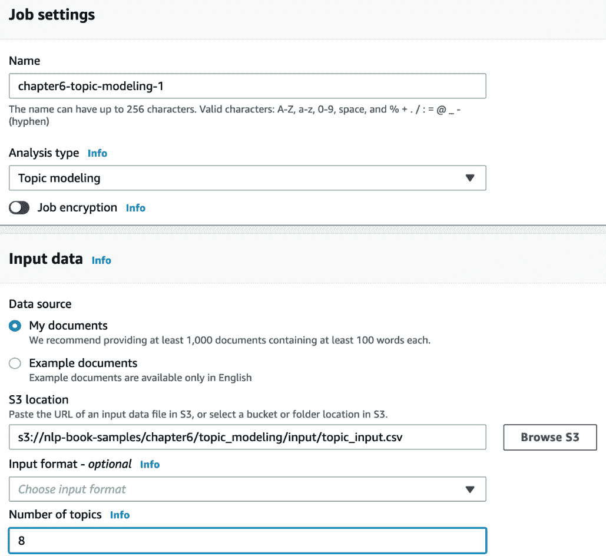

    ](img/B17528_06_06.jpg)

    图 6.6 – 创建主题建模任务输入 – 第一部分

    提供其余字段的详细信息并点击**创建任务**，如以下截图所示：

    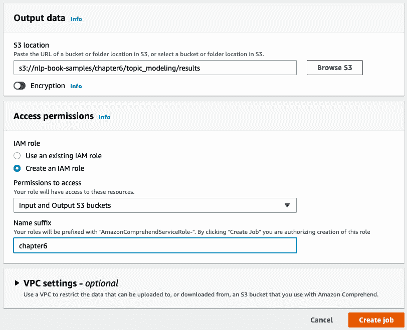

    ](img/B17528_06_07.jpg)

    图 6.7 – 创建主题建模任务输入 – 第二部分

    在 IAM 角色传播完成后，您应该看到任务提交状态，如以下截图所示。任务大约需要 30 分钟完成，这为您提供了快速吃点小吃或喝杯咖啡/茶的时间。现在，点击任务的名称，复制**输出数据位置**字段中提供的 S3 链接，然后返回到您的笔记本。我们将继续在笔记本中的步骤：

    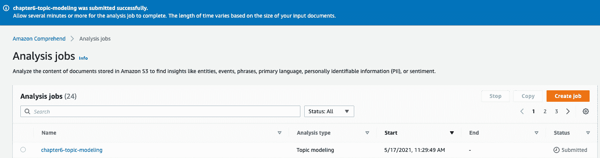

    ](img/B17528_06_08.jpg)

    图 6.8 – 提交主题建模任务

1.  现在，我们将执行“处理主题建模结果”部分中的单元格。

    要下载主题建模任务的结果，我们需要`tpprefix`变量——特别是本地的`output.tar.gz`文件，并将其解压：

    ```py
    # Let's first download the results of the topic modeling job. 
    # Please copy the output data location from your topic modeling job for this step and use it below
    directory = "results"
    parent_dir = os.getcwd()+'/topic-modeling'
    # Path
    path = os.path.join(parent_dir, directory)
    os.makedirs(path, exist_ok = True)
    print("Directory '%s' created successfully" %directory)
    tpprefix = prefix+'/topic_modeling/results/custom-classification and train folders, which we need in the notebook to execute the next step, as shown in the following code block:

    ```

    directory = "custom-classification"

    parent_dir = os.getcwd()

    path = os.path.join(parent_dir, directory)

    os.makedirs(path, exist_ok = True)

    print("目录 '%s' 创建成功" %directory)

    directory = "train"

    parent_dir = os.getcwd()+'/custom-classification'

    path = os.path.join(parent_dir, directory)

    os.makedirs(path, exist_ok = True)

    print("目录 '%s' 创建成功" %directory)

    ```py

    Now, let's rearrange the columns so that we have the label as the first column. We will convert this into a CSV file and upload it into our S3 bucket. This CSV file will be the training dataset for our Amazon Comprehend Custom Classification model:

    ```

    form_df = form_df[['标签', '文本']]

    form_df.to_csv('custom-classification/train/train.csv', header=None, index=False)

    s3.upload_file('custom-classification/train/train.csv', bucket, prefix+'/custom_classification/train/train.csv')

    ```py

    ```

1.  现在，我们将返回到 Amazon Comprehend AWS 控制台，训练我们的自定义分类模型，它可以为给定的文本预测标签。这些标签是我们在上一节中建模的主题。通过 Amazon Comprehend Custom，您可以在预训练的、功能强大的 Comprehend 模型基础上逐步训练出专属于您业务的模型。因此，这些自定义模型充分利用了默认 Comprehend 模型的知识，从而实现快速训练。与从头开始构建自定义分类模型相比，它们的准确性更高。您可以在 Amazon Comprehend 控制台中仅需几次点击即可运行此训练过程，而无需任何机器学习技能。更多详细信息，请参考[`docs.aws.amazon.com/comprehend/latest/dg/how-document-classification.html`](https://docs.aws.amazon.com/comprehend/latest/dg/how-document-classification.html)。

    要开始，请进入 AWS 控制台（如果您没有访问权限，请参考本章开头的*技术要求*部分），然后在控制台顶部的服务搜索窗口中输入 Amazon Comprehend。接着，导航到 Amazon Comprehend 控制台。

    点击**启动 Amazon Comprehend**按钮。

    点击左侧窗格中**自定义分类**下的**自定义**标题。

    点击**训练分类器**按钮，如下图所示：

    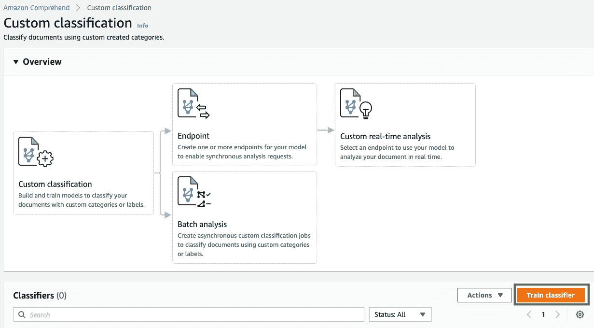

    ](img/B17528_06_09.jpg)

    图 6.9 – 训练分类器按钮

    输入分类器的名称，语言保持为英语，设置**分类器模式**为**多类别**。（对于我们的解决方案，我们为每个文档预测一个标签。如果您需要为每个文档预测多个标签，您可以使用**多标签**模式。）在**训练数据格式**下选择**CSV 文件**，如下图所示：

    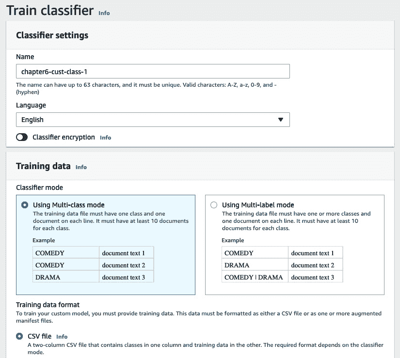

    图 6.10 – 自定义分类器输入 – 第一部分

    提供我们的训练数据集的**S3 位置**；即我们在前一节中创建的那个位置。对于**IAM 角色**，如果您在前几章中创建了**AmazonComprehendServiceRole**，请使用该角色，或者选择**创建一个 IAM 角色**并从列表中选择**任何 S3 桶**。点击**训练分类器**按钮，如下图所示：

    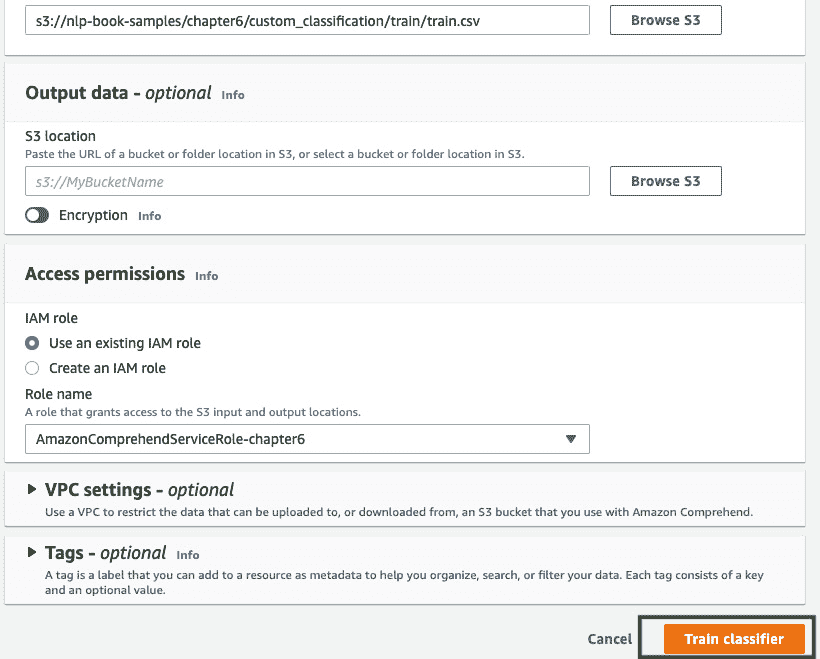

    图 6.11 – 自定义分类器输入 – 第二部分

    训练作业将被提交。稍后，训练作业的状态将变为 **Training**，如下图所示：

    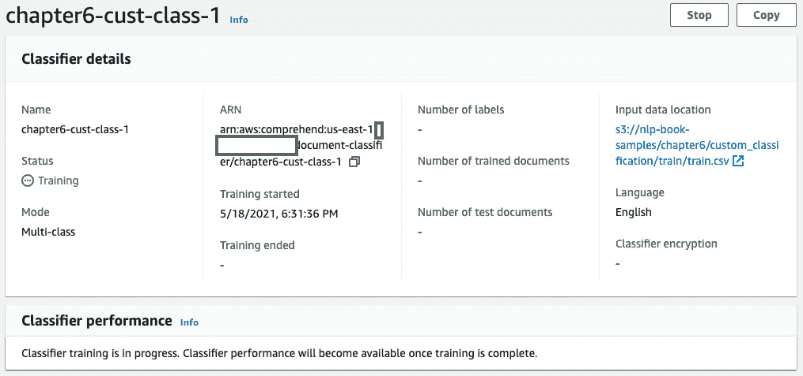

    图 6.12 – 自定义分类器训练

    训练大约需要 1 小时才能完成。当作业完成时，状态将变为 **Trained**，如下图所示：

    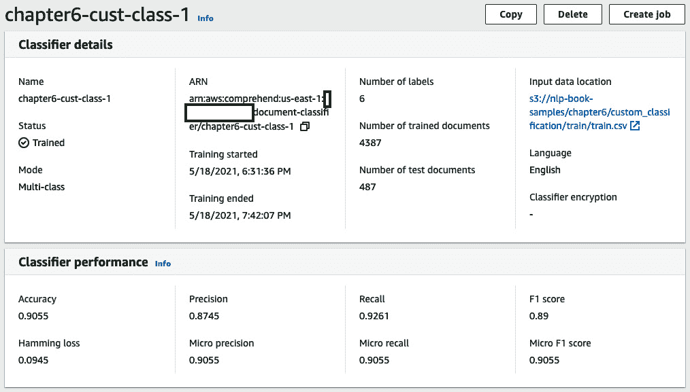

    图 6.13 – 自定义分类器训练完成

1.  现在我们已经完成了分类器的训练，我们将创建一个实时端点来部署模型。我们将在解决方案中使用此端点来执行请求路由预测。

    点击你在 Amazon Comprehend 控制台中的分类器名称。然后，向下滚动至 **Endpoints** 部分并点击 **Create endpoint**，如下图所示：

    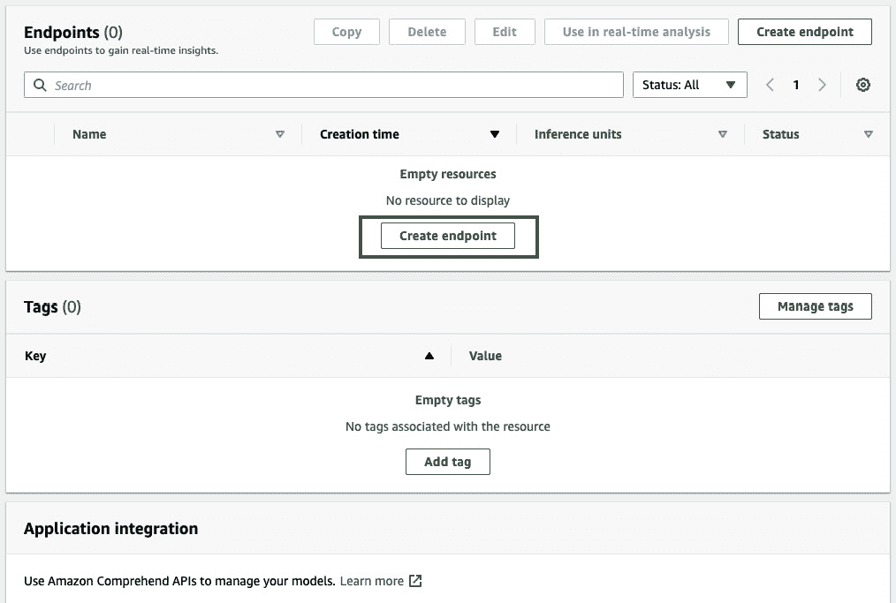

    ](img/B17528_06_14.jpg)

    图 6.14 – 创建 Comprehend 端点

    输入端点名称，提供 1 的推理单元值，然后点击 **Create endpoint**，如下图所示。推理单元决定了端点的价格和容量。一个推理单元每秒提供 100 个字符的预测吞吐量。有关更多详情，请参阅 Amazon Comprehend 的定价指南：[`aws.amazon.com/comprehend/pricing/`](https://aws.amazon.com/comprehend/pricing/)：

    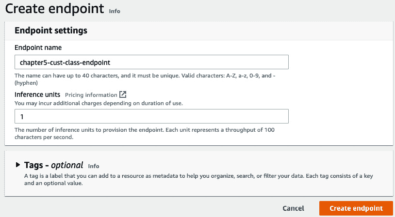

    ](img/B17528_06_15.jpg)

    图 6.15 – 创建 Comprehend 端点输入

    创建完端点后，请通过点击端点名称记录端点的 ARN，如下图所示。这将在笔记本中进行推理时需要用到：

    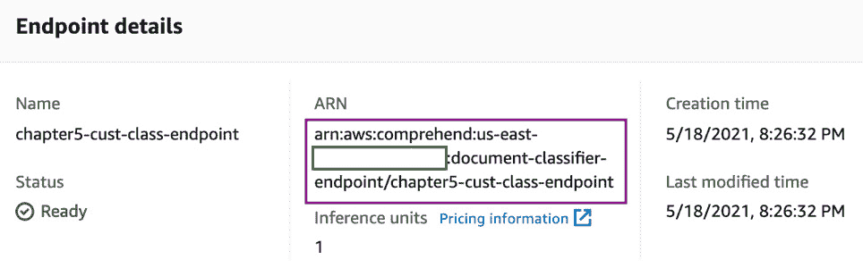

    图 6.16 – Comprehend 端点 ARN

1.  下一步，我们将返回到笔记本并执行 *自动化请求路由* 部分中的步骤。

    在笔记本单元格中提供你在前一步骤中记下的端点 ARN：

    ```py
    endpoint_arn = '<comprehend-custom-classifier-endpoint-arn>'
    ```

    现在，让我们执行下一个单元，它展示了如何使用我们的端点进行实时分析。输入内容将使用一个已经分配给 `test_text` 变量的示例文本消息，如下方代码所示：

    ```py
    test_text = 'because of your inability to accept my payments on time I now have a really bad credit score, you need to fix this now'
    comprehend = boto3.client('comprehend')
    response = comprehend.classify_document(Text=test_text, EndpointArn=endpoint_arn)
    print(response)
    ```

    我们的自定义分类器返回一个响应，如下方代码块所示：

    ```py
    {'Classes': [{'Name': 'account', 'Score': 0.9856781363487244}, {'Name': 'credit', 'Score': 0.013113172724843025}, {'Name': 'debt', 'Score': 0.0005924980505369604}], 'ResponseMetadata': {'RequestId': 'c26c226c-3878-447e-95f5-60b4d91bb536', 'HTTPStatusCode': 200, 'HTTPHeaders': {'x-amzn-requestid': 'c26c226c-3878-447e-95f5-60b4d91bb536', 'content-type': 'application/x-amz-json-1.1', 'content-length': '151', 'date': 'Wed, 19 May 2021 17:35:38 GMT'}, 'RetryAttempts': 0}}
    ```

    运行以下代码块中的代码，从响应中选择具有最高置信度分数的 `Name` 属性。这将是客户请求在呼叫中心路由的部门或选项：

    ```py
     cls_df = pd.DataFrame(response['Classes'])
    max_score = cls_df['Score'].max()
    routing_type = cls_df.query('Score == @max_score')['Name'].values[0]
    print("This request should be routed to: " + routing_type)
    ```

    这段代码将返回以下响应：

    ```py
    This request should be routed to: account
    ```

1.  下一步，我们将执行 *自动化反馈分析* 部分中的步骤。

    为了分析客户对话的情感，我们将使用**Amazon Comprehend Detect Sentiment API**。这是 Amazon Comprehend 中的内置功能，不需要我们训练任何模型。我们可以直接调用该 API 并提供输入，它将返回文本的情感，如下所示：

    ```py
    sent_response = comprehend.detect_sentiment(
        Text=test_text,
        LanguageCode='en'
    )
    print("The customer's feedback sentiment is: " + sent_response['Sentiment'])
    The customer's feedback sentiment is: NEGATIVE
    ```

这就是本章解决方案构建的总结。请参阅*进一步阅读*部分，了解与此用例类似的示例。在**LiveRight**的案例中，您可以将此构建集成到现有的联系中心工作流中，并使用**Amazon Transcribe**、**AWS Step Functions**和**AWS Lambda**扩展该解决方案。如何实现这一点的示例如下图所示：

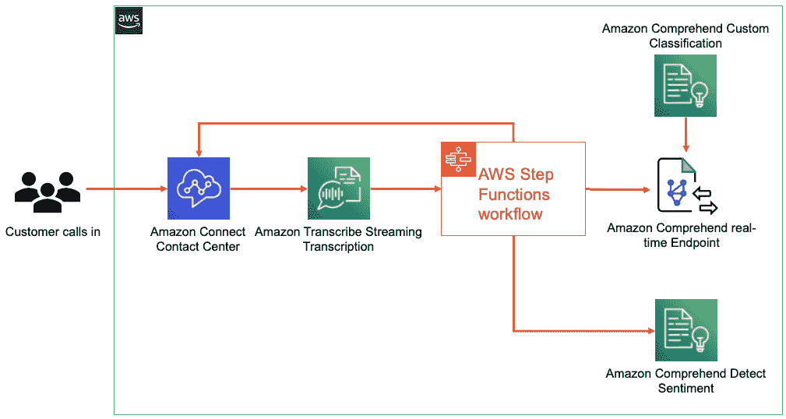

图 6.17 – 客户服务中的 NLP 与实时转录

Amazon Transcribe 提供实时流式转录功能，将客户电话的语音转为文本。详情请参考[`aws.amazon.com/transcribe/`](https://aws.amazon.com/transcribe/)。一个 AWS Step Functions([`aws.amazon.com/step-functions/`](https://aws.amazon.com/step-functions/))工作流可以实现对完整过程流的编排，结合 AWS Lambda（一个完全托管的无服务器计算服务，可以在无需配置服务器的情况下运行代码，[`aws.amazon.com/lambda/`](https://aws.amazon.com/lambda/)）和多个 AWS 服务，设置为在接收到指定长度的转录时触发。Step Functions 工作流将调用 AWS Lambda 函数，检测客户请求的路由选项，且电话可以自动被路由到该选项，或/和通过调用 Detect Sentiment API 分析客户请求/反馈的情感，正如我们在*自动化反馈分析*部分看到的那样。结果是在通话进行时，联系中心代理将获得一个自动响应，包含预测的路由选项和情感，从而帮助快速且高效地解决客户的请求。

# 概述

在本章中，我们学习了如何构建一个 NLP 解决方案，通过使用 Amazon Comprehend 的主题建模功能、情感检测功能，并通过训练我们自己的自定义分类器来预测路由选项，使用 Comprehend 自定义分类后，通过 Comprehend 实时端点托管该解决方案。我们还看到如何在无需任何机器学习技能的情况下，利用强大且准确的 NLP 模型的灵活性。对于企业需求，Amazon Comprehend 能够无缝扩展以处理数百万份文档，提供基于使用量的定价，支持批量推断，并且通过实时端点的自动扩展支持，您可以有效地管理推断请求量并控制推断成本。

对于我们的解决方案，我们首先介绍了客户服务的使用案例、目前设置方式所固有的挑战，以及需要执行自动化路由和情感分析来控制由于当前低效流程导致的高客户流失率。随后，我们设计了一个架构，利用 Amazon Comprehend 来识别常见的主题或话题，创建训练数据集，训练一个自定义分类器来预测路由选项，并对客户请求进行情感分析。我们假设你是被分配到这个项目的解决方案架构师，并提供了解决方案组件的概述，以及架构图，在*图 6.1*中展示。

接着，我们介绍了解决方案构建的前提条件，设置了一个 Amazon SageMaker 笔记本实例，克隆了我们的 GitHub 仓库，并根据本章提供的说明开始在笔记本中执行代码。

在下一章中，我们将探讨一个稍微相关的使用案例，使用 NLP 来执行客户声音分析过程。我们将介绍该使用案例，讨论如何设计架构，建立前提条件，并详细讲解构建解决方案所需的各个步骤。

# 进一步阅读

+   *宣布 Amazon Comprehend 自定义实体识别实时端点的发布*，作者：Mona Mona 和 Prem Ranga（[`aws.amazon.com/blogs/machine-learning/announcing-the-launch-of-amazon-comprehend-custom-entity-recognition-real-time-endpoints/`](https://aws.amazon.com/blogs/machine-learning/announcing-the-launch-of-amazon-comprehend-custom-entity-recognition-real-time-endpoints/)）。

+   *Amazon Comprehend 自定义分类模型的主动学习工作流 - 第二部分*，作者：Shanthan Kesharaju, Joyson Neville Lewis 和 Mona Mona（[`aws.amazon.com/blogs/machine-learning/active-learning-workflow-for-amazon-comprehend-custom-classification-part-2/`](https://aws.amazon.com/blogs/machine-learning/active-learning-workflow-for-amazon-comprehend-custom-classification-part-2/)）。
