# 第七章：*第七章*：理解客户声音分析

在前面的章节中，为了展示如何提升客户服务，我们构建了一个 AI 解决方案，利用**AWS NLP**服务**Amazon Comprehend**首先分析历史客户服务记录，使用 Amazon Comprehend 主题建模提取关键话题，并训练一个定制的分类模型，通过**Amazon Comprehend Custom Classification**预测呼叫路由的主题。最后，我们使用**Amazon Comprehend detect sentiment**来理解客户反馈的情感方面。

本章将重点讨论客户反馈的情感方面，客户可能是 Instagram 用户、Yelp 评论员，或者是你阿姨在 Facebook 上发表评论关于你生意的等等。

二十年前，想要尽快了解人们对你产品的感受并获取有意义的反馈以改进产品是非常困难的。随着全球化的进程和社交媒体的发明，今天，人人都有社交媒体应用程序，人们比以往任何时候都更自由地表达情感。我们都喜欢在 Twitter 上发表推文，表达我们的情感，无论是开心、悲伤、生气还是中立。如果你是一个非常受欢迎的人，比如电影明星，或者是一个有着成千上万评论的商业公司，那么挑战就变成了如何浏览粉丝发布的大量推文，并快速了解你的电影表现如何，是大获成功还是惨败。如果是公司、企业或初创公司，人们通过阅读评论迅速了解你的客户服务和产品支持是否好。

社交媒体分析是一个非常受欢迎且充满挑战的应用场景。本章我们将专注于文本分析的应用场景。我们将讨论一些非常常见的应用案例，其中 NLP 的强大功能将与分析技术相结合，分析来自聊天、社交媒体评论、电子邮件或 PDF 等非结构化数据。我们将展示如何快速为社交媒体评论设置强大的分析功能。

我们将通过以下几个部分进行讲解：

+   设置文本分析解决方案的挑战

+   设置 Yelp 评论文本分析工作流

# 技术要求

本章你需要有一个 AWS 账户。在开始之前，我们建议你创建一个 AWS 账户，如果你还没有账户，请参考前一章的注册细节。如果你已经有 AWS 账户并且按照前几章的说明进行操作，可以跳过注册步骤。Amazon Textract 示例的 Python 代码和示例数据集可以在此存储库链接中找到：[`github.com/PacktPublishing/Natural-Language-Processing-with-AWS-AI-Services/tree/main/Chapter%2007`](https://github.com/PacktPublishing/Natural-Language-Processing-with-AWS-AI-Services/tree/main/Chapter%2007)。

我们将在 *设置解决方案用例* 部分，逐步带您完成如何在 Jupyter notebook 上设置上述代码库并配置正确的 IAM 权限的步骤。

查看以下视频，观看 [`bit.ly/3mfioWX`](https://bit.ly/3mfioWX) 中的代码演示。

# 设置文本分析解决方案的挑战

大多数组织面临的挑战之一是从非结构化数据中获取业务洞察。

这些数据可以是各种格式，例如聊天记录、PDF 文档、电子邮件、推文等。由于这些数据没有结构，传统的数据分析工具很难对其进行分析。这正是 Amazon Textract 和 Amazon Comprehend 发挥作用的地方。

Amazon Textract 可以通过提取文本将这些非结构化数据转化为结构化数据，随后 Amazon Comprehend 可以提取洞察信息。一旦我们将数据转化为文本，就可以使用 **Amazon Glue** 执行无服务器的 **提取、转换、加载（ETL）**，并将其转换为结构化格式。此外，您可以使用 **Amazon Athena** 对刚刚使用 Glue ETL 提取并转换的非结构化文本执行无服务器的临时 SQL 分析。Amazon Glue 还可以爬取您从 Amazon Textract 提取的非结构化数据或文本，并将其存储在 Hive 元数据存储中。

最后，您还可以使用 **Amazon QuickSight** 分析和可视化这些数据，以获得业务洞察。

Amazon QuickSight 帮助您创建快速的可视化图表和仪表板，供您与业务共享或集成到您的应用程序中，供最终用户使用。例如，您正在使用 Instagram 做生意，想要分析您产品图片下的评论，并创建一个实时仪表板来了解人们是发布了关于这些评论的积极还是消极意见。您可以使用上述组件创建一个实时社交媒体分析仪表板。

我们都喜欢在餐馆用餐。挑战是仅仅根据评论来挑选最佳餐馆。

我们将向您展示如何使用以下架构分析 Yelp 评论：

![图 7.1 – 社交媒体分析无服务器架构]

](img/B17528_07_01.jpg)

图 7.1 – 社交媒体分析无服务器架构

*图 7.1* 中的架构向您展示了如何将原始数据转化为新的洞察信息，优化数据湖中的数据集，并可视化无服务器结果。我们将通过以下步骤开始：

1.  获取 Yelp 评论数据集，并使用 Jupyter notebook 上传到 Amazon S3 存储桶中。

1.  通过爬取原始数据将其注册到 AWS Glue 数据目录中。

1.  在 AWS Glue 数据目录中执行此原始数据目录的 AWS Glue ETL。一旦在 AWS Glue 数据目录中注册，在爬取 AWS S3 中的 Yelp 评论数据后，ETL 将把原始数据转换为 Parquet 格式，并用 Amazon Comprehend 的洞察信息进行丰富。

1.  现在我们可以在 AWS Glue 数据目录中再次抓取并编目这些数据。编目操作会为 Amazon Athena 添加表格和元数据，以便进行临时的 SQL 分析。

1.  最后，您可以使用 Amazon QuickSight 快速创建在 Amazon Athena 中抓取的转换后的 Parquet 数据的可视化。Amazon QuickSight 可以直接与 Amazon Athena 和 Amazon S3 集成，作为可视化的数据源。

您还可以通过使用 Amazon Kinesis Data Firehose 将此解决方案转换为实时流式解决方案，调用这些 Yelp 评论和 Twitter API，并将近实时流数据直接存储在 Amazon S3 中，然后您可以使用 AWS Glue ETL 和编目功能与 Amazon Comprehend 结合进行转换和 NLP 丰富处理。之后，这些转换后的数据可以直接在 QuickSight 和 Athena 中进行可视化。此外，您还可以使用 AWS Lambda 函数和 Step Functions 来设置完全无服务器架构并自动化这些步骤。

在本节中，我们介绍了使用非结构化数据设置文本分析工作流的挑战，并提出了架构方案。在下一节中，我们将带您一步步构建 Yelp 评论数据集或任何社交媒体分析数据集的解决方案，只需通过 Jupyter 笔记本编写几行代码即可完成。

# 设置 Yelp 评论文本分析工作流

在本节中，我们将向您展示如何通过遵循使用 Jupyter 笔记本和 Python API 的步骤，为 Yelp 评论数据集或任何社交媒体分析数据集构建解决方案：

+   设置以解决用例

+   使用 Jupyter 笔记本走查解决方案

设置步骤将包括配置 **身份与访问管理（IAM）** 角色，且演示笔记本会引导您完成架构设置。那么，我们开始吧。

## 设置以解决用例

如果您在前面的章节中没有这样做，您将需要先创建一个 Amazon SageMaker Jupyter 笔记本并设置 `Chapter 07` 文件夹，然后打开 `chapter07 social media text analytics.ipynb` 笔记本：

1.  您可以参考 Amazon SageMaker 文档来创建笔记本实例：[`docs.aws.amazon.com/sagemaker/latest/dg/gs-setup-working-env.html`](https://docs.aws.amazon.com/sagemaker/latest/dg/gs-setup-working-env.html)。为了按照这些步骤进行，请在搜索窗口中登录 `Amazon SageMaker`，选择它，然后导航到 **Amazon SageMaker** 控制台。

1.  选择 **Notebook 实例** 并通过指定实例类型、存储和 IAM 角色创建笔记本实例。

1.  在为此设置创建 SageMaker 笔记本时，您需要对以下服务具有 IAM 访问权限：

    1.  使用 AWS Glue 运行 ETL 任务并抓取数据

    1.  使用 AWS Athena 通过笔记本调用 Athena API

    1.  使用 AWS Comprehend 执行情感分析

    1.  AWS QuickSight 用于可视化

    1.  AWS S3 访问

    确保您的笔记本 IAM 具有以下角色：

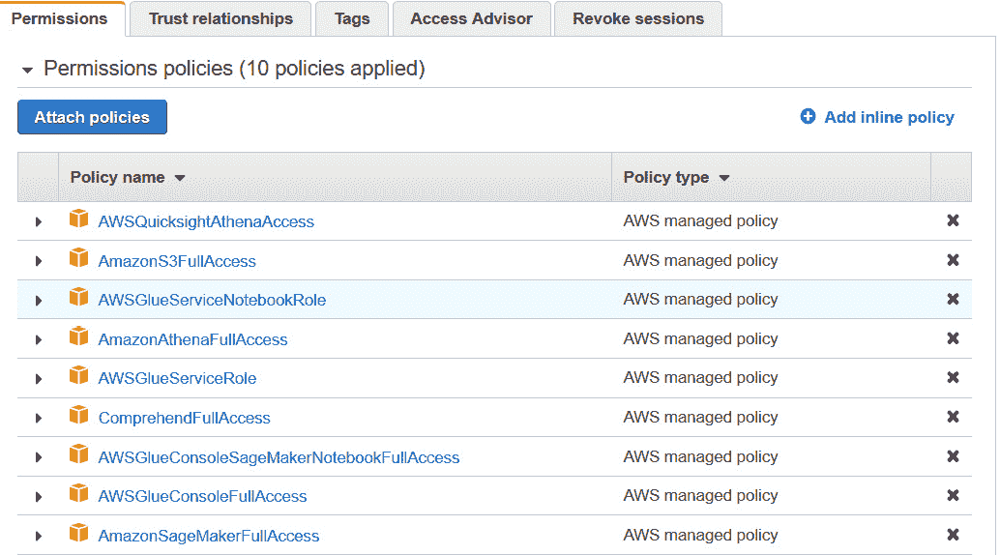

图 7.2 – 运行笔记本的重要 IAM 角色

你可以修改正在使用的现有笔记本角色，添加这些权限。在*图 7.2*中是你用于创建笔记本实例的 SageMaker IAM 角色。你可以导航到该角色并点击**附加策略**，确保你拥有执行笔记本所需的权限，以调用我们将使用的服务 API。

按照本笔记本中的步骤执行，逐个单元格地完成，每次执行时请阅读每个单元格中提供的描述。

### 从本笔记本调用 AWS Glue 的附加 IAM 先决条件

在上一部分中，我们引导你如何设置笔记本和重要的 IAM 角色以运行此笔记本。在本部分中，我们假设你已经进入笔记本，并且我们在笔记本中提供了有关如何获取笔记本执行角色并启用其从此笔记本调用 AWS Glue 作业的说明。

转到笔记本并按照*查找当前执行角色的笔记本*部分运行以下代码：

```py
import sagemaker
from sagemaker import get_execution_role
sess = sagemaker.Session()
role = get_execution_role()
role_name = role[role.rfind('/') + 1:]
print(role_name)
```

你将获取与此笔记本关联的角色。接下来，在下一部分中，我们将引导你如何将 AWS Glue 添加为此角色的附加受信实体。

### 将 AWS Glue 和 Amazon Comprehend 作为附加受信实体添加到该角色中

如果你希望在调用 Glue API 时传递此笔记本的执行角色，而无需创建额外的角色，则需要执行此步骤。如果你之前没有使用过 AWS Glue，则此步骤是必须的。如果你之前使用过 AWS Glue，则应该已经有一个可以用来调用 Glue API 的现有角色。在这种情况下，你可以在调用 Glue 时传递该角色（稍后在本笔记本中），并跳过下一步：

1.  在 IAM 仪表板中，点击左侧导航栏中的**角色**，搜索**角色**。角色出现后，点击**角色**以进入其**概述**页面。

1.  点击**概述**页面中的**信任关系**选项卡，以将 AWS Glue 添加为附加受信实体。

1.  点击**编辑信任关系**，并将 JSON 替换为以下 JSON：

    ```py
    {
      "Version": "2012-10-17",
      "Statement": [
        {
          "Effect": "Allow",
          "Principal": {
            "Service": [
              "sagemaker.amazonaws.com",
              "glue.amazonaws.com"
            ]
          },
          "Action": "sts:AssumeRole"
        }
      ]
    }
    ```

1.  完成后，点击**更新信任策略**，即可完成设置。

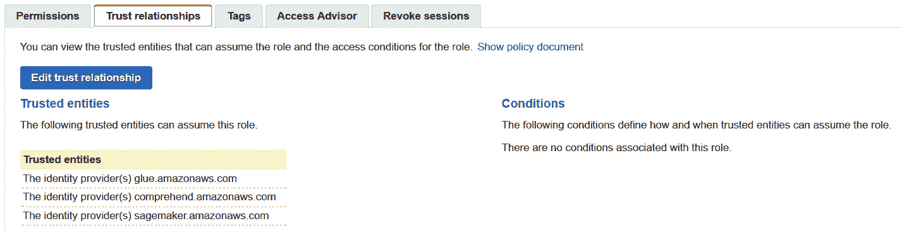

图 7.3 – 在 IAM 角色中设置与 Glue 的信任

在本部分中，我们介绍了如何设置 Jupyter 笔记本和运行 Jupyter 笔记本所需的 IAM 权限。在下一部分中，我们将通过你所做的笔记本设置来演练解决方案。

## 使用 Jupyter Notebook 演练解决方案

在本部分中，我们将引导你如何通过遵循给定的步骤，使用 Jupyter 笔记本和 Python API 来构建 Yelp 评论数据集或任何社交媒体分析数据集：

1.  从 Yelp Reviews NLP Fast.ai 下载评论数据集，我们已经在笔记本中为你完成了这一步。

1.  将原始数据集注册为 AWS Glue 数据目录中的一个表。

1.  运行 PySpark（AWS Glue 作业）将数据集转换为 Parquet 格式，并使用 Amazon Comprehend 获取评论情感。

1.  将转换后的结果存储在一个新创建的数据集中。

1.  使用 Amazon Athena 对优化后的数据集执行无服务器查询。

1.  使用 Amazon QuickSight 或 Bokeh AWS Glue 数据目录提供结果的可视化洞察。

1.  转到这个笔记本并运行代码块中的以下步骤来设置库：

    ```py
    import boto3
    import botocore
    import json
    import time
    import os
                  import project_path
    from lib import workshop
    glue = boto3.client('glue')
    s3 = boto3.resource('s3')
    s3_client = boto3.client('s3')
    session = boto3.session.Session()
    region = session.region_name
    account_id = boto3.client('sts').get_caller_identity().get('Account')
    database_name = 'yelp' # AWS Glue Data Catalog Database Name
    raw_table_name = 'raw_reviews' # AWS Glue Data Catalog raw table name
    parquet_table_name = 'parq_reviews' # AWS Glue Data Catalog parquet table name
    open_data_bucket = 'fast-ai-nlp'
    ```

1.  我们已经导入了笔记本设置所需的库，并定义了 AWS Glue 数据目录的数据库名和表名。在下一步中，我们将通过运行以下代码下载 Yelp 评论数据集：

    ```py
    try:
        s3.Bucket(open_data_bucket).download_file('yelp_review_full_csv.tgz', 'yelp_review_full_csv.tgz')
    except botocore.exceptions.ClientError as e:
        if e.response['Error']['Code'] == "404":
            print("The object does not exist.")
        else:
            raise
    ```

1.  现在，我们将运行以下代码来解压或解压这个评论数据集：

    ```py
    !tar -xvzf yelp_review_full_csv.tgz
    ```

1.  在 tar 包中有两个 CSV 文件，一个叫做`train.csv`，另一个是`test.csv`。有兴趣的人可以查看`readme.txt`文件，文件中对数据集有更详细的描述。

1.  我们将使用 Python 的 pandas 来读取 CSV 文件并查看数据集。你会注意到数据中包含两列未命名的列，分别是评分和评论。评分介于 1 到 5 之间，评论则是自由格式的文本字段：

    ```py
    import pandas as pd
    pd.set_option('display.max_colwidth', -1)
    df = pd.read_csv('yelp_review_full_csv/train.csv', header=None)
    df.head(5)
    ```

1.  你将得到如下输出：

    图 7.4 – 原始 Yelp 评论数据

1.  现在，我们将上传之前创建的文件到 S3，以便稍后使用，通过执行以下笔记本代码：

    ```py
    file_name = 'train.csv'
    session.resource('s3').Bucket(bucket).Object(os.path.join('yelp', 'raw', file_name)).upload_file('yelp_review_full_csv/'+file_name)
    ```

我们已经下载了 Yelp 数据集并将其存储在一个原始 S3 存储桶中。在下一部分中，我们将创建 AWS Glue 数据目录数据库。

### 创建 AWS Glue 数据目录数据库

在本部分中，我们将向你展示如何定义表并将其添加到 Glue 数据目录数据库中。Glue 爬虫会自动从 Amazon S3 或任何本地数据库中爬取数据，因为它支持多种数据存储。你也可以使用自己的 Hive 元数据存储并开始使用爬虫。一旦创建了爬虫，你可以执行 Glue ETL 作业，因为这些作业会使用这些数据目录表作为源数据和目标数据。此外，Glue ETL 作业将读取和写入 Glue 爬虫中指定的源数据和目标数据存储。每个 AWS 账户都有一个中央 Glue 数据目录：

1.  我们将使用`glue.create_database` API（[`boto3.amazonaws.com/v1/documentation/api/latest/reference/services/glue.html#Glue.Client.create_database`](https://boto3.amazonaws.com/v1/documentation/api/latest/reference/services/glue.html#Glue.Client.create_database)）来创建一个 Glue 数据库：

    ```py
    workshop.create_db(glue, account_id, database_name, 'Database for Yelp Reviews')
    ```

1.  现在我们将在 Glue 中创建原始表（[`docs.aws.amazon.com/glue/latest/dg/tables-described.html`](https://docs.aws.amazon.com/glue/latest/dg/tables-described.html)）。在 Glue 中创建表有不止一种方式：

    1.  *使用 AWS Glue 爬虫*：我们有分类器可以在爬取时自动确定数据集的架构，使用内置分类器。如果您的数据架构具有复杂的嵌套 JSON 结构，您还可以使用自定义分类器。

    1.  *手动创建表或使用 API*：您可以在控制台中手动创建表，也可以通过 API 创建表。在定义表时，您需要指定要分类的架构。

        注意：

        欲了解有关使用 AWS Glue 控制台创建表的更多信息，请参阅*在 AWS Glue 控制台上处理表*：[`docs.aws.amazon.com/glue/latest/dg/console-tables.html`](https://docs.aws.amazon.com/glue/latest/dg/console-tables.html)。

1.  我们使用`glue.create_table` API 来创建表：

    ```py
    location = 's3://{0}/yelp/raw'.format(bucket)
    response = glue.create_table(
        CatalogId=account_id,
        DatabaseName=database_name,
        TableInput={
            'Name': raw_table_name,
            'Description': 'Raw Yelp reviews dataset',
            'StorageDescriptor': {
                'Columns': [
                    {
                        'Name': 'rating',
                        'Type': 'tinyint',
                        'Comment': 'Rating of from the Yelp review'
                    },
                    {
                        'Name': 'review',
                        'Type': 'string',
                        'Comment': 'Review text of from the Yelp review'
                    }
                ],
                'Location': location,
                'InputFormat': 'org.apache.hadoop.mapred.TextInputFormat',
                'OutputFormat': 'org.apache.hadoop.hive.ql.io.HiveIgnoreKeyTextOutputFormat',
                'SerdeInfo': {
                    'SerializationLibrary': 'org.apache.hadoop.hive.serde2.OpenCSVSerde',
                    'Parameters': {
                        'escapeChar': '\\',
                        'separatorChar': ',',
                        'serialization.format': '1'
                    }
                },
            },
            'TableType': 'EXTERNAL_TABLE',
            'Parameters': {
                'classification': 'csv'
            }
        }
    )
    ```

    上述代码将创建 AWS Glue 数据目录中的表。

1.  现在，我们将使用 Amazon Athena 的`pyAthena` API 可视化这些数据。为了查看原始 Yelp 评论，我们将安装此 Python 库，以便使用 Athena 查询 Glue 数据目录中的数据：

    ```py
    !pip install PyAthena
    ```

1.  以下代码将帮助我们在 Glue 中可视化原始数据集的数据库和表：

    ```py
    from pyathena import connect
    from pyathena.pandas.util import as_pandas
    cursor = connect(region_name=region, s3_staging_dir='s3://'+bucket+'/yelp/temp').cursor()
    cursor.execute('select * from ' + database_name + '.' + raw_table_name + ' limit 10')
    df = as_pandas(cursor)
    df.head(5)
    ```

1.  您将在输出中看到以下表格：

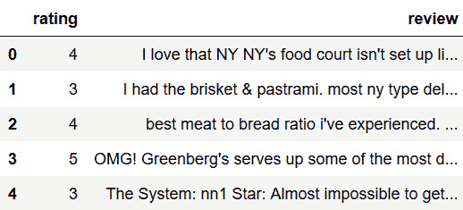

图 7.5 – Glue 数据目录中原始数据集的 Athena 输出

所以，我们介绍了如何创建 Glue 数据目录，并抓取我们在 Amazon S3 下载的原始 Yelp 数据。然后，我们展示了如何使用`pyAthena`库在 Amazon Athena 中可视化这些数据。在下一节中，我们将向您展示如何转换这些数据。

### 转换原始数据以提供见解和可视化

现在，我们将向您展示如何使用 PySpark 在 AWS Glue 作业中转换原始数据，调用 Amazon Comprehend API 对评论进行情感分析，将数据转换为 Parquet 格式，并按情感进行分区。这将使我们在按情感查看数据时优化分析查询，并仅返回我们需要的值，利用 Parquet 的列式格式。

我们在*第三章*中介绍了 Comprehend 的实时情感检测 API，*《介绍 Amazon Comprehend》*。在这个作业中，我们将使用实时批处理情感检测 API。

我们将创建一个 PySpark 作业来添加主键，并通过 Amazon Comprehend 批量处理评论，以获取评论的情感分析。该作业将限制转换的行数，但这段代码可以修改为处理整个数据集：

1.  为了在 AWS Glue 中运行代码，我们将直接将代码和依赖项上传到 S3，并在调用 Glue 作业时传递这些位置。我们将使用 Jupyter Notebook 的单元魔法`%%writefile`来编写 ETL 作业。接下来，我们使用 AWS Glue 脚本，通过 Glue 转换处理 Yelp 评论数据集，并通过使用 Amazon Comprehend 进行情感分析，将情感列添加到 DataFrame 中：

    ```py
    %%writefile yelp_etl.py
    import os
    import sys
    import boto3
    from awsglue.transforms import *
    from awsglue.utils import getResolvedOptions
    from pyspark.context import SparkContext
    from awsglue.context import GlueContext
    from awsglue.job import Job
    from awsglue.dynamicframe import DynamicFrame
    import pyspark.sql.functions as F
    from pyspark.sql import Row, Window, SparkSession
    from pyspark.sql.types import *
    from pyspark.conf import SparkConf
    from pyspark.context import SparkContext
    from pyspark.sql.functions import *
    args = getResolvedOptions(sys.argv, ['JOB_NAME', 'S3_OUTPUT_BUCKET', 'S3_OUTPUT_KEY_PREFIX', 'DATABASE_NAME', 'TABLE_NAME', 'REGION'])
    sc = SparkContext()
    glueContext = GlueContext(sc)
    spark = glueContext.spark_session
    job = Job(glueContext)
    job.init(args['JOB_NAME'], args)
    ```

1.  我们已经导入了必要的 API，现在我们将把 Glue DynamicFrame 转换为 Spark DataFrame，以便从 Glue 数据目录中读取数据。我们将从数据库和我们在 Glue 数据目录中创建的表中选择评论和评分列：

    ```py
    yelp = glueContext.create_dynamic_frame.from_catalog(database=args['DATABASE_NAME'], table_name=args['TABLE_NAME'], transformation_ctx = "datasource0")
    yelpDF = yelp.toDF().select('rating', 'review')
    ```

    我们正在定义一些限制，例如要发送多少个字符进行批量情感分析——`MAX_SENTENCE_LENGTH_IN_CHARS`——批量情感分析中每批评论的大小——`COMPREHEND_BATCH_SIZE`——以及要发送多少批次：

    ```py
    MIN_SENTENCE_LENGTH_IN_CHARS = 10 
    MAX_SENTENCE_LENGTH_IN_CHARS = 4500
    COMPREHEND_BATCH_SIZE = 5  
    NUMBER_OF_BATCHES = 10
    ROW_LIMIT = 1000 #Number of reviews we will process for this workshop
    ```

1.  每个任务处理 5*10 条记录，我们正在调用 Comprehend 批量情感分析 API 来获取情感，并在经过 AWS Glue 转换后添加该情感。创建一个函数，传递文本列表并调用批量情感分析 API，已在 *第三章* 中介绍，*介绍 Amazon Comprehend*：

    ```py
    ComprehendRow = Row("review", "rating", "sentiment")
    def getBatchComprehend(input_list):
        arr = []
        bodies = [i[0] for i in input_list]
        client = boto3.client('comprehend',region_name=args['REGION'])
        def callApi(text_list):
            response = client.batch_detect_sentiment(TextList = text_list, LanguageCode = 'en')
            return response

        for i in range(NUMBER_OF_BATCHES):
            text_list = bodies[COMPREHEND_BATCH_SIZE * i : COMPREHEND_BATCH_SIZE * (i+1)]
            #response = client.batch_detect_sentiment(TextList = text_list, LanguageCode = 'en')
            response = callApi(text_list)
            for r in response['ResultList']:
                idx = COMPREHEND_BATCH_SIZE * i + r['Index']
                arr.append(ComprehendRow(input_list[idx][0], input_list[idx][1], r['Sentiment']))

        return arr
    ```

1.  以下代码将获取一组评论大小小于 Comprehend 限制的记录样本：

    ```py
    yelpDF = yelpDF \
      .withColumn('review_len', F.length('review')) \
      .filter(F.col('review_len') > MIN_SENTENCE_LENGTH_IN_CHARS) \
      .filter(F.col('review_len') < MAX_SENTENCE_LENGTH_IN_CHARS) \
      .limit(ROW_LIMIT)
    record_count = yelpDF.count()
    print('record count=' + str(record_count))
    yelpDF = yelpDF.repartition(record_count/(NUMBER_OF_BATCHES*COMPREHEND_BATCH_SIZE))
    ```

1.  我们正在使用 Glue DataFrame 将提交 ID 和正文元组连接成大小相似的数组，并转换结果：

    ```py
    group_rdd = yelpDF.rdd.map(lambda l: (l.review.encode("utf-8"), l.rating)).glom()

    transformed = group_rdd \
      .map(lambda l: getBatchComprehend(l)) \
      .flatMap(lambda x: x) \
      .toDF()
    print("transformed count=" + str(transformed.count()))
    ```

    我们正在将转换后的带有情感的 DataFrame 转换为 Parquet 格式，并将其保存到我们转换后的 Amazon S3 存储桶中：

    ```py
    transformedsink = DynamicFrame.fromDF(transformed, glueContext, "joined")
    parquet_output_path = 's3://' + os.path.join(args['S3_OUTPUT_BUCKET'], args['S3_OUTPUT_KEY_PREFIX'])
    print(parquet_output_path)
    datasink5 = glueContext.write_dynamic_frame.from_options(frame = transformedsink, connection_type = "s3", connection_options = {"path": parquet_output_path, "partitionKeys": ["sentiment"]}, format="parquet", transformation_ctx="datasink5")

    job.commit()
    ```

1.  这段代码的关键点是利用 Glue 库，轻松访问 AWS Glue 数据目录：

    ```py
    glueContext.create_dynamic_frame.from_catalog- Read table metadata from the Glue Data Catalog using Glue libs to load tables into the job.
    yelpDF = yelp.toDF() - Easy conversion from Glue DynamicFrame to Spark DataFrame and vice-versa joinedsink= DynamicFrame.fromDF(joinedDF, glueContext, "joined").
    ```

1.  使用 `glueContext.write_dynamic_frame.from_options` 写入 S3，并指定以下选项：

    +   基于列对数据进行分区——`connection_options = {"path": parquet_output_path, "partitionKeys": ["sentiment"]}`。

        将数据转换为列式格式——`format="parquet"`。

1.  我们现在将把 `github_etl.py` 脚本上传到 S3，以便 Glue 可以使用它来运行 PySpark 作业。如果需要，您可以将其替换为您自己的脚本。如果您的代码有多个文件，您需要将这些文件压缩成一个 ZIP 文件并上传到 S3，而不是像这里所做的那样上传单个文件：

    ```py
    script_location = sess.upload_data(path='yelp_etl.py', bucket=bucket, key_prefix='yelp/codes')
    s3_output_key_prefix = 'yelp/parquet/'
    ```

1.  接下来，我们将通过 Boto3 创建一个 Glue 客户端，以便调用 `create_job` API。`create_job` API 将创建一个作业定义，该定义可用于在 Glue 中执行您的作业。这里创建的作业定义是可变的。在创建作业时，我们还将代码位置以及依赖项的位置传递给 Glue。`AllocatedCapacity` 参数控制 Glue 用于执行此作业的硬件资源。该参数以 **DPU** 单位进行度量。有关 **DPU** 的更多信息，请参见 [`docs.aws.amazon.com/glue/latest/dg/add-job.html`](https://docs.aws.amazon.com/glue/latest/dg/add-job.html)：

    ```py
    from time import gmtime, strftime
    import time
    timestamp_prefix = strftime("%Y-%m-%d-%H-%M-%S", gmtime())
    job_name = 'yelp-etl-' + timestamp_prefix
    response = glue.create_job(
        Name=job_name,
        Description='PySpark job to extract Yelp review sentiment analysis',
        Role=role, # you can pass your existing AWS Glue role here if you have used Glue before
        ExecutionProperty={
            'MaxConcurrentRuns': 1
        },
        Command={
            'Name': 'glueetl',
            'ScriptLocation': script_location
        },
        DefaultArguments={
            '--job-language': 'python',
            '--job-bookmark-option': 'job-bookmark-disable'
        },
        AllocatedCapacity=5,
        Timeout=60,
    )
    glue_job_name = response['Name']
    print(glue_job_name)
    ```

1.  上述作业现在将通过调用 `start_job_run` API 来执行。此 API 会创建一个不可变的运行/执行，对应于之前创建的作业定义。我们将需要该特定作业执行的 `job_run_id` 值来检查其状态。我们将把数据和模型的位置作为作业执行参数传递：

    ```py
    job_run_id = glue.start_job_run(JobName=job_name,
                                           Arguments = {
                                            '--S3_OUTPUT_BUCKET': bucket,
                                            '--S3_OUTPUT_KEY_PREFIX': s3_output_key_prefix,
                                            '--DATABASE_NAME': database_name,
                                            '--TABLE_NAME': raw_table_name,
                                            '--REGION': region
                                           })['JobRunId']
    print(job_run_id)
    ```

    注意：

    该作业大约需要 2 分钟才能完成。

1.  现在我们将检查作业状态，以查看其是否为`SUCCEEDED`、`FAILED`或`STOPPED`。一旦作业成功，我们将在 S3 中以 Parquet 格式获得转换后的数据，我们将使用 Athena 查询并通过 QuickSight 可视化。如果作业失败，您可以进入 AWS Glue 控制台，点击左侧的**Jobs**选项卡，并从页面中点击该特定作业，您将能够找到这些作业的 CloudWatch Logs 链接（**Logs**下的链接），这可以帮助您查看作业执行中究竟发生了什么错误：

    ```py
    job_run_status = glue.get_job_run(JobName=job_name,RunId=job_run_id)['JobRun']['JobRunState']
    while job_run_status not in ('FAILED', 'SUCCEEDED', 'STOPPED'):
        job_run_status = glue.get_job_run(JobName=job_name,RunId=job_run_id)['JobRun']['JobRunState']
        print (job_run_status)
        time.sleep(60)
    print(job_run_status)
    ```

在接下来的部分中，我们将演示如何使用 Glue 爬虫发现已转换的数据。

### 使用 Glue 爬虫发现已转换的数据

大多数 AWS Glue 用户使用爬虫将 AWS Glue 数据目录中的表填充为主要方法。为此，您需要在数据目录中添加一个爬虫来遍历您的数据存储。爬虫的输出由一个或多个在数据目录中定义的元数据表组成。您在 AWS Glue 中定义的**ETL** 作业使用这些元数据表作为数据源和目标：

+   爬虫可以抓取基于文件和基于表的数据存储。爬虫可以从各种类型的数据存储中抓取数据，例如 Amazon S3、RDS、Redshift、DynamoDB 或本地数据库：

    ```py
    parq_crawler_name = 'YelpCuratedCrawler'
    parq_crawler_path = 's3://{0}/yelp/parquet/'.format(bucket)
                     response = glue.create_crawler(
        Name=parq_crawler_name,
        Role=role,
        DatabaseName=database_name,
        Description='Crawler for the Parquet Yelp Reviews with Sentiment',
        Targets={
            'S3Targets': [
                {
                    'Path': parq_crawler_path
                }
            ]
        },
        SchemaChangePolicy={
            'UpdateBehavior': 'UPDATE_IN_DATABASE',
            'DeleteBehavior': 'DEPRECATE_IN_DATABASE'
        },
        TablePrefix='reviews_'
    )
    ```

+   **启动 Glue 爬虫**：您可以使用 Glue 爬虫将表格填充到 AWS Glue 数据目录中。爬虫将自动抓取您的数据源，这可以是本地数据库或 Amazon S3 中的原始 CSV 文件，并在 Glue 数据目录中创建元数据表，同时推断模式。Glue ETL 作业使用 Glue 数据目录中的这些元数据表作为源和目标。您还可以将现有的 Hive 数据目录引入并运行 Glue ETL：

    ```py
    response = glue.start_crawler(
        Name=parq_crawler_name
    )
    print ("Parquet Crawler: https://{0}.console.aws.amazon.com/glue/home?region={0}#crawler:name={1}".format(region, parq_crawler_name))
    ```

+   访问输出中的链接以在 Amazon Athena 中可视化您的爬虫：

![图 7.6 – Yelp 策划的爬虫]

](img/B17528_07_06.jpg)

图 7.6 – Yelp 策划的爬虫

+   `READY` 状态，意味着爬虫完成了抓取。您还可以查看爬虫的 CloudWatch 日志以获取更多详情：

    ```py
    crawler_status = glue.get_crawler(Name=parq_crawler_name)['Crawler']['State']
    while crawler_status not in ('READY'):
        crawler_status = glue.get_crawler(Name=parq_crawler_name)['Crawler']['State']
        print(crawler_status)
        time.sleep(30)
    ```

一旦您获得 `READY` 输出，继续下一步。在本节中，我们展示了如何爬取 Yelp 评论的转换后的 Parquet 数据，这些评论包含来自 Amazon Comprehend 的情感分数，并存储在 AWS Glue 数据目录中。在下一节中，我们将介绍如何可视化这些数据，以深入分析客户声音的见解。

### 查看转换后的结果

我们将再次使用 PyAthena 库，针对新创建的数据集运行查询，该数据集包含情感分析结果并以 Parquet 格式存储。为了节省时间，我们将使用笔记本中的 Bokeh AWS Glue 数据目录来可视化结果，而不是使用 Amazon QuickSight：

+   QuickSight 也能够使用相同的 Athena 查询来可视化结果，并且具有多个内置连接器，可以连接到许多数据源：

    ```py
    cursor.execute('select rating, review, sentiment from yelp.reviews_parquet')
                  df = as_pandas(cursor)
    df.head(10)
    ```

+   以下是通过 Amazon Athena 查询 Glue 数据目录，以获取 Yelp 评论表中的评分、评论和情感的输出：

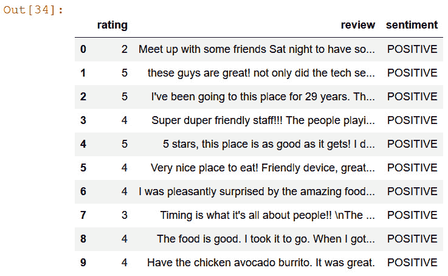

图 7.7 – 从 Glue 数据目录中的 Yelp 转换表中选择评分和情感的 Athena 查询

+   `groupby` 本地使用。或者，我们也可以使用 Athena 中的内置 SQL 和聚合函数来实现相同的结果：

    ```py
    group = df.groupby(('sentiment'))
    group.describe()
    ```

    接下来，你将看到按情感分组的 `groupby` 查询输出：

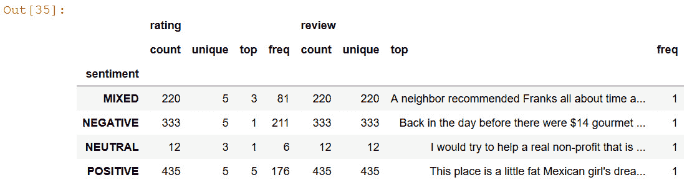

图 7.8 – 按情感分组查询的输出

从前面的输出中我们可以看到，Yelp 评论数据集中正面评论的数量多于负面评论。

+   Bokeh 框架有许多内置的可视化工具。我们将在随后的代码中使用 Bokeh 来可视化按情感和评分分组的评论。

+   *按评分可视化*：我们现在将比较 Comprehend API 与数据集中的用户评分之间的差异。我们正在更改 DataFrame 中的 `groupby` 来更改数据集：

    ```py
    group = df.groupby(('rating'))
    group.describe()
    ```

    你将在下一个屏幕截图中看到按评分分组的查询结果输出：

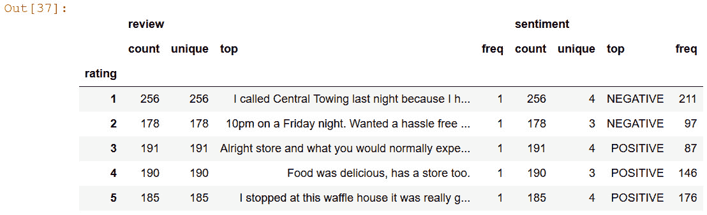

图 7.9 – 按评分分组的查询结果输出

+   现在，我们将向你展示如何在 Bokeh 中绘制这些数据：

    ```py
    source = ColumnDataSource(group)
    ",".join(source.column_names)
    rating_cmap = factor_cmap('rating', palette=Spectral5, factors=sorted(df.rating.unique()))
    p = figure(plot_height=350, x_range=group)
    p.vbar(x='rating', top='review_count', width=1, line_color="white", 
           fill_color=rating_cmap, source=source)
    p.xgrid.grid_line_color = None
    p.xaxis.axis_label = "Rating"
    p.yaxis.axis_label = "Count"
    p.y_range.start = 0
    ```

    你将看到显示用户评分计数的条形图。

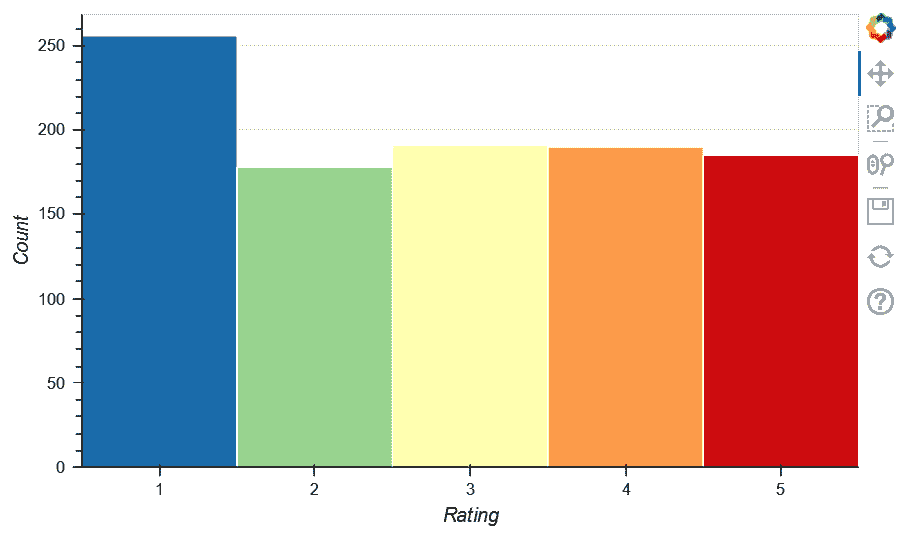

图 7.10 – 按用户评分的计数

我们可以看到，给出的最常见评分是 1，最不常见的是 2。本节中我们介绍了如何使用 Amazon Athena 中的简单查询和像 Bokeh 这样的可视化工具，对增强了 Amazon Comprehend 情感分析的 Yelp 评论数据集进行快速可视化和 SQL 分析。我们得到了很酷的洞察，例如大多数评论都是正面的，用户给出的最常见评分是 1。你可以通过使用简单的 SQL 进一步深入分析，获得特定评论的具体见解。这有助于迅速推动业务成果。在下一节中，我们将向你展示如何轻松创建一个 QuickSight 仪表板，为你的业务用户提供一些酷的见解。

### Amazon QuickSight 可视化

在本节中，我们将向你展示如何设置或开始使用 Amazon QuickSight，并可视化 Athena 中的表格，这些表格通过 AWS Glue 和 Comprehend 进行了情感分析转换：

1.  你可以按照 [`docs.aws.amazon.com/quicksight/latest/user/getting-started.html`](https://docs.aws.amazon.com/quicksight/latest/user/getting-started.html) 上的 `入门指南` 设置你的账户，然后按照代码块导航到 QuickSight 控制台：

    ```py
    print('https://{0}.quicksight.aws.amazon.com/sn/start?#'.format(region))
    ```

1.  **管理 QuickSight 中的 S3 访问**：我们需要完成这个必需的步骤，以确保在使用 Amazon QuickSight 访问 Amazon Athena 时不会遇到访问拒绝的异常。

1.  进入**管理 QuickSight | 安全和权限 | 添加或移除 | 在 S3 中**。点击**详细信息** | 选择您要查询的存储桶 | **更新**。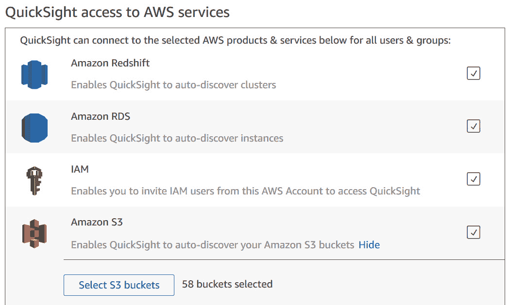

    图 7.11 – 管理 QuickSight 对 S3 数据湖的访问

1.  点击**创建数据集**选项，您将看到以下选项：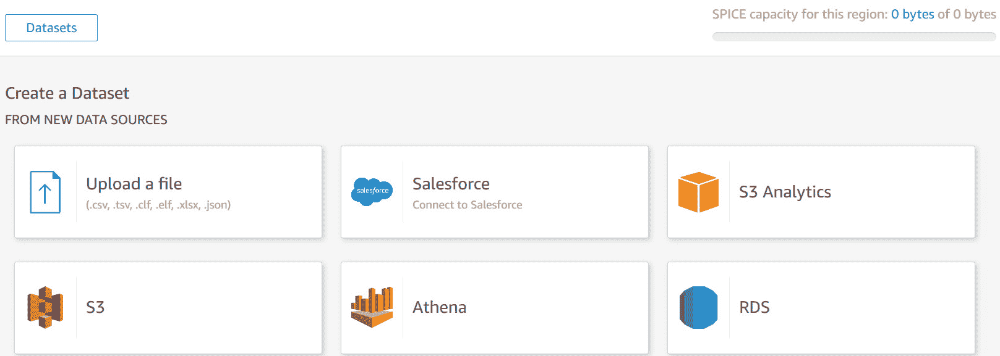

    图 7.12 – Amazon QuickSight 设置及创建数据集选项

1.  选择前面选项中的**Athena**。点击**新建数据集**按钮，并选择**Athena 数据源**。命名数据源并选择 Yelp 的**Glue 数据库**和**reviews_parquet**表。点击**创建数据源**按钮完成创建。QuickSight 支持多种数据连接器。

1.  在`yelp_reviews`中点击**创建数据源**。同时，点击**已验证**。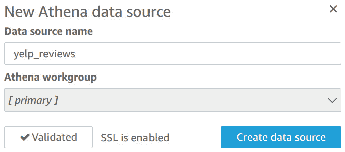

    图 7.13 – 在 QuickSight 中创建 Athena 数据源

1.  接下来，您将选择我们在 Glue 数据目录中创建的**Yelp**数据库和**reviews_parquet**表。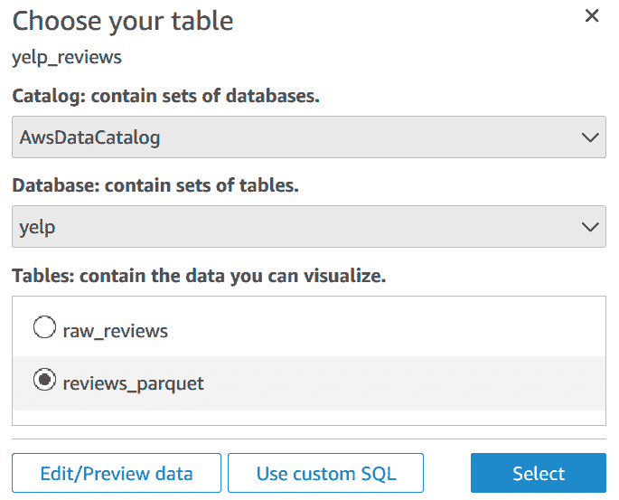

    图 7.14 – 在 QuickSight 中选择要可视化的表

1.  点击**保存并可视化**。

在本节中，我们介绍了如何创建 QuickSight 仪表板以分析 Yelp 评论。在下一节中，我们将讨论如何删除您在此过程中创建的资源，以避免产生费用。

### 清理工作

在本节中，我们将带您逐步了解如何在笔记本中通过代码示例清理 AWS 资源，避免在进行 Yelp 情感分析解决方案时产生费用。

运行清理步骤，通过执行以下代码删除您为本笔记本创建的资源：

```py
response = glue.delete_crawler(Name=parq_crawler_name)
response = glue.delete_job(JobName=glue_job_name)
response = glue.delete_database(
    CatalogId = account_id,
    Name = database_name
)
workshop.delete_bucket_completely(bucket)
```

我们删除了 Glue 爬虫、Glue ETL 作业以及使用笔记本创建的数据库。让我们继续下一部分，做个总结。

# 总结

在本章中，我们介绍了如何将文本分析解决方案与现有的社交媒体分析工作流相结合。我们给出了一个具体的例子，使用 Yelp 评论数据集并通过无服务器 ETL 结合 NLP，使用 Amazon Comprehend 快速创建一个可视化仪表板，并使用 Amazon QuickSight 进行展示。我们还介绍了通过 Amazon Athena 进行临时 SQL 分析，利用一些简单的 SQL 查询来了解大多数用户的声音或情感。这个解决方案可以与任何社交媒体平台集成，如 Twitter、Reddit 和 Facebook，支持批处理或实时模式。

在实时设置的情况下，你可以集成 Kinesis Data Firehose，在这个提议的工作流或架构中实现接近实时的流式推文或社交媒体信息流。查看*进一步阅读*部分，了解一个非常酷的**AI 驱动的社交媒体仪表盘**，可以在大规模实施该架构时使用。

你在文档自动化方面可以采取的另一种方法是使用 Amazon Textract 从你的 PDF 文件中提取数据，特别是在处理 RFP（请求建议书）或协议时，之后在提取的文本上执行 Glue ETL 操作后，可以按段落快速收集情感分析。

在下一章中，我们将讨论如何使用 AI 自动化媒体工作流，以降低成本并实现内容变现。

# 进一步阅读

+   *如何使用 Amazon Comprehend、AWS Glue 和 Amazon Athena 扩展情感分析* 作者：Roy Hasson ([`aws.amazon.com/blogs/machine-learning/how-to-scale-sentiment-analysis-using-amazon-comprehend-aws-glue-and-amazon-athena/`](https://aws.amazon.com/blogs/machine-learning/how-to-scale-sentiment-analysis-using-amazon-comprehend-aws-glue-and-amazon-athena/))

+   *AI 驱动的社交媒体仪表盘* ([`aws.amazon.com/solutions/implementations/ai-driven-social-media-dashboard/`](https://aws.amazon.com/solutions/implementations/ai-driven-social-media-dashboard/))

+   *使用 AWS Glue、Amazon Athena 和 Amazon QuickSight 协调、查询和可视化来自不同供应商的数据* 作者：Ben Snively ([`aws.amazon.com/blogs/big-data/harmonize-query-and-visualize-data-from-various-providers-using-aws-glue-amazon-athena-and-amazon-quicksight/`](https://aws.amazon.com/blogs/big-data/harmonize-query-and-visualize-data-from-various-providers-using-aws-glue-amazon-athena-and-amazon-quicksight/))
