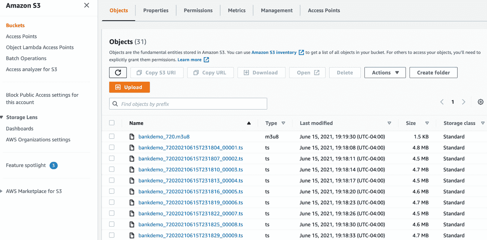
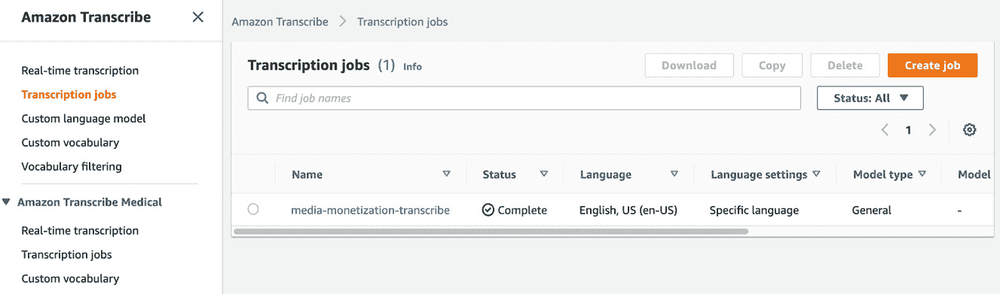

# 第八章：*第八章*：利用自然语言处理（NLP）赚取您的媒体内容

正如我们在本书中所见，人工智能（AI），特别是 NLP，由于数据的快速增长和云计算下机器学习（ML）的民主化，已经在传统 IT 领域有了广泛的应用。在上一章中，我们看到了一个很酷的例子，通过运行客户语音分析和情感检测，可以为社交媒体评论和其他形式的文本数据增添色彩。我们看到如何使用 AWS Glue 从 Amazon S3 中抓取原始数据，使用 Amazon Athena 交互式查询这些数据，使用 PySpark（[`spark.apache.org/docs/latest/api/python/index.html`](http://spark.apache.org/docs/latest/api/python/index.html)）在 AWS Glue 作业中转换原始数据，调用 Amazon Comprehend API（提供预训练的 NLP 模型）对评论进行情感分析，将数据转换为 Parquet 格式，并按情感分区（[`docs.aws.amazon.com/athena/latest/ug/partitions.html`](https://docs.aws.amazon.com/athena/latest/ug/partitions.html)）以优化分析查询。在本章中，我们将转向关注一个因流媒体内容的广泛采用而在近年来广受欢迎的用例，具体来说是如何赚取内容。

线上广告和平面媒体广告之间的差距越来越大。根据这篇文章，引用了 PwC 关于全球娱乐和媒体的展望报告（[`www.pwc.com/outlook`](https://www.pwc.com/outlook)），即使考虑到 COVID-19 大流行，线上广告支出在 2020 年估计比电视广告高出约 580 亿美元，比杂志和报纸广告高出 1000 亿美元。

当然，这也受智能消费设备的增加和互联网时代消费趋势爆炸性增长的推动。谷歌广告是今天最流行的广告发布平台之一，占据了 Alphabet（拥有谷歌的上市控股公司）80%的收入，根据这篇文章在 2020 年赚取了 1470 亿美元：[`www.cnbc.com/2021/05/18/how-does-google-make-money-advertising-business-breakdown-.html`](https://www.cnbc.com/2021/05/18/how-does-google-make-money-advertising-business-breakdown-.html)。没错，你没看错：在线广告确实是一件大事。因此，当您考虑下一次发布那个很酷的旅行视频或您制作绝佳辣椒肉酱的食谱时，实际上您可能会从您的内容中赚钱。你可能会问，这一切很棒，但 NLP 在这种情况下如何帮助？继续阅读了解更多！

答案，正如你可能已经猜到的，是基于上下文的广告投放。假设你有一个智能解决方案，可以监听内容中的音频/文本，理解讨论的内容，识别代表内容上下文的主题，查找与这些主题相关的广告，并将这些广告无缝地插入到你的内容中，而无需训练任何机器学习模型：那岂不是太棒了吗？是的，这正是我们现在要构建的内容。

我们将浏览以下几个部分：

+   介绍内容变现用例

+   构建内容变现的 NLP 解决方案

# 技术要求

对于本章内容，您需要拥有一个 AWS 账户。请确保按照*第二章*中*技术要求*部分的说明创建 AWS 账户，并在尝试*构建内容变现 NLP 解决方案*部分的步骤之前，登录 AWS 管理控制台。

我们解决方案的 Python 代码和示例数据集可以在此处找到：[`github.com/PacktPublishing/Natural-Language-Processing-with-AWS-AI-Services/tree/main/Chapter%2008`](https://github.com/PacktPublishing/Natural-Language-Processing-with-AWS-AI-Services/tree/main/Chapter%2008)。请按照以下部分的说明以及代码库中的代码构建解决方案。

查看以下视频，观看代码的实际应用：[`bit.ly/317mcSh`](https://bit.ly/317mcSh)。

# 介绍内容变现用例

我们知道 NLP 可以帮助提升客户服务体验，更好地理解客户的需求。现在，我们将使用 NLP 来确定媒体内容的上下文，并将相关广告无缝地插入到该内容中。为了说明我们的例子，让我们回到我们虚构的银行公司**LiveRight Holdings Private Limited**。LiveRight 的管理层决定，他们现在需要扩展到更多的地区，因为他们看到对无繁琐银行服务模式的需求很大，这种模式通过减少运营成本将节省下来的资金转移给客户。他们决定聘请你作为他们的营销技术架构师，负责所有内容创作，同时挑战你找到一种方式让这些内容通过其低成本政策实现自我盈利。你提出了创建有趣的教育视频的想法，这些视频展示了银行与技术交汇的最新趋势。由于这些视频可以免费观看，你可以在其中穿插广告以获得收入，同时它们还能提高银行的知名度，因此有很大的需求。

你已经思考过解决方案设计，并决定使用以下内容：

+   **AWS Elemental MediaConvert** ([`aws.amazon.com/mediaconvert/`](https://aws.amazon.com/mediaconvert/))，一种托管的视频转码服务，可以将您的视频内容转换并增强为多个广播版本。

+   **Amazon Transcribe** ([`aws.amazon.com/transcribe/`](https://aws.amazon.com/transcribe/)) 用来获取视频内容的转录文本。

+   **Amazon Comprehend** ([`aws.amazon.com/comprehend/`](https://aws.amazon.com/comprehend/)) 用来利用其预训练的机器学习模型进行主题建模，从视频的文本内容中确定常见主题，这些主题将推动广告选择过程。

+   **AWS Elemental MediaTailor** ([`aws.amazon.com/mediatailor/`](https://aws.amazon.com/mediatailor/))，一种托管服务，可以接受媒体内容作为输入，将其组装成在线频道交付，并将广告插入到视频内容中。

我们将构建的解决方案的组件如下图所示：


图 8.1 – 内容货币化的 NLP 解决方案构建

我们将通过 AWS 管理控制台 ([`aws.amazon.com/console/`](https://aws.amazon.com/console/)) 和 Amazon SageMaker Jupyter 笔记本 ([`docs.aws.amazon.com/sagemaker/latest/dg/nbi.html`](https://docs.aws.amazon.com/sagemaker/latest/dg/nbi.html)) 演示此解决方案，这将使我们能够在逐步执行时查看代码和结果。如果您没有访问 AWS 管理控制台的权限，请遵循本书中*第二章*《介绍 Amazon Textract》部分中的*技术要求*部分的详细说明。

作为第一步，我们将查看 GitHub 仓库中提供的示例视频文件 ([`github.com/PacktPublishing/Natural-Language-Processing-with-AWS-AI-Services/blob/main/Chapter%2008/media-content/bank-demo-prem-ranga.mp4`](https://github.com/PacktPublishing/Natural-Language-Processing-with-AWS-AI-Services/blob/main/Chapter%2008/media-content/bank-demo-prem-ranga.mp4))。示例视频展示了 AWS AI 服务在文档处理中的应用。有关该视频的完整版本，请参考 [`www.youtube.com/watch?v=vBtxjXjr_HA`](https://www.youtube.com/watch?v=vBtxjXjr_HA)。我们将把这个示例视频上传到 S3 存储桶：

1.  在视频加载到 S3 存储桶后，我们将使用 AWS Elemental MediaConvert 创建我们示例视频内容的广播版本。

1.  同时，我们将打开我们的 Amazon SageMaker Jupyter 笔记本来运行代码，创建一个 Amazon Transcribe 转录任务，将我们示例视频的音频轨道转换为文本。

1.  我们将使用 Amazon Comprehend 主题建模来检测此文本中的主题。

1.  然后，我们将使用来自 `'cmsid'` 的样本 URL 和由标签 `'vid'` 引用的视频内容 ID，这些内容将被填充以在前一步中从转录文本中检测到的主题特定广告。

1.  然后，我们将为 AWS Elemental MediaConvert 作业的输出视频文件创建一个 Amazon CloudFront 分发。

1.  最后，我们将使用 **AWS Elemental MediaTailor** 创建一个新的配置，用于广播级流媒体内容，该配置将利用 CloudFront 分发提供的 MediaConvert 输出文件以及我们在上一步中修改的广告决策服务器 URL 来创建一个新的插入广告的视频文件。

在本节中，我们介绍了我们试图构建的 NLP 解决方案中引入的内容货币化需求，审视了 LiveRight 面临的挑战，并查看了我们将构建的解决方案概述。在下一节中，我们将逐步介绍构建解决方案的过程。

# 为内容货币化构建 NLP 解决方案

在上一节中，我们介绍了内容货币化的需求，涵盖了我们将构建的解决方案的架构，并简要地介绍了解决方案组件和工作流步骤。在本节中，我们将开始执行构建解决方案的任务。但首先，我们需要处理一些先决条件。

## 设置以解决使用案例

如果您在之前的章节中尚未完成此操作，您需要先创建一个 Amazon SageMaker Jupyter 笔记本实例，并为该笔记本角色设置**身份和访问管理**（**IAM**）权限，以便访问我们在本笔记本中将使用的 AWS 服务。之后，您需要克隆 GitHub 仓库（[`github.com/PacktPublishing/Natural-Language-Processing-with-AWS-AI-Services`](https://github.com/PacktPublishing/Natural-Language-Processing-with-AWS-AI-Services)），创建一个 Amazon S3（[`aws.amazon.com/s3/`](https://aws.amazon.com/s3/)）存储桶，并在笔记本中提供存储桶名称以开始执行。请按照接下来的步骤完成这些任务，然后我们可以执行笔记本中的代码单元格：

注意

请确保您已完成 *技术要求* 部分中提到的任务。如果您已经在之前的章节中创建了 Amazon SageMaker 笔记本实例并克隆了书籍的 GitHub 仓库，您可以跳过其中一些步骤。请直接转到打开与本章对应的笔记本文件夹的步骤。

1.  如果尚未完成，请按照 *创建 Amazon SageMaker Jupyter 笔记本实例* 部分中 *设置 AWS 环境* 部分中的*第二章*中记录的说明操作。介绍 Amazon Textract 来创建您的 Jupyter 笔记本实例。

    创建 Amazon SageMaker Jupyter 笔记本实例时的 IAM 角色权限

    在创建 notebook 时，接受默认的 IAM 角色选项以允许访问任何 S3 桶。

1.  一旦你创建了 notebook 实例，并且其状态为 **InService**，请点击 notebook 实例中的 **操作** 菜单下的 **打开 Jupyter**。

    图 8.2 – 打开 Jupyter notebook

    这将带你进入 notebook 实例的主文件夹。

1.  如下图所示，点击 **新建** 并选择 **终端**：

    图 8.3 – 在 Jupyter notebook 中打开终端

1.  在终端窗口中，首先输入`cd SageMaker`，然后输入`git clone` [`github.com/PacktPublishing/Natural-Language-Processing-with-AWS-AI-Services`](https://github.com/PacktPublishing/Natural-Language-Processing-with-AWS-AI-Services)，如下面的截图所示。如果你在前面的章节中已经执行过此操作，则不必再次克隆该仓库。

    图 8.4 – git clone 命令

1.  现在，退出终端窗口，返回到主文件夹，你将看到一个名为 `Chapter 08` 的文件夹。点击该文件夹，你应该会看到一个名为 `contextual-ad-marking-for-content-monetization-with-nlp-github.ipynb` 的 notebook。

1.  点击该 notebook 以打开它。

1.  暂时保持 notebook 打开。我们将先执行 *上传示例视频并将其转换为广播格式* 部分中的步骤，然后再执行 notebook 中的步骤。

现在我们已经设置好了 notebook 并克隆了仓库，接下来让我们添加所需的权限策略，以成功运行我们的代码示例。

## 额外的 IAM 前提条件

要运行 notebook，我们必须启用额外的策略，并更新 SageMaker notebook 角色的信任关系。请按以下步骤操作：

1.  如果尚未完成，请将`ComprehendFullAccess`和`AmazonTranscribeFullAccess`策略附加到你的 Amazon SageMaker notebook IAM 角色上。要执行此步骤，请参考 *在《第二章》中*，*介绍 Amazon Textract* 部分中的 *更改 IAM 权限和信任关系*。

1.  你的 SageMaker 执行角色应该已经可以访问 S3。如果没有，请将以下 JSON 语句作为内联策略添加。有关说明，请参考 *在《第二章》中*，*介绍 Amazon Textract* 部分中的 *更改 IAM 权限和信任关系*：

    ```py
    { "Version": "2012-10-17", "Statement": [ {
      "Action": [
          "s3:GetObject",
          "s3:ListBucket",
          "s3:PutObject"
      ],
      "Resource": ["*"],
      "Effect": "Allow"
          }
      ]
    }
    ```

1.  最后，更新信任关系。有关说明，请参考本书中*第二章*，*介绍 Amazon Textract*部分中的*更改 IAM 权限和信任关系以执行 Amazon SageMaker 笔记本角色*小节。

    ```py
    { "Version": "2012-10-17", "Statement": [
      { "Effect": "Allow", 
        "Principal": 
          { "Service": 
              [ "sagemaker.amazonaws.com", 
                "s3.amazonaws.com",
    "transcribe.amazonaws.com",
                "comprehend.amazonaws.com" ] 
              }, 
              "Action": "sts:AssumeRole" } 
          ] 
      }
    ```

现在我们已经设置了笔记本并配置了 IAM 角色来运行演练笔记本，在下一节中，我们将开始创建示例视频的广播版本。

## 上传示例视频并将其转换为广播格式

本节中，我们将创建两个 S3 存储桶，并上传示例视频进行处理。请执行以下步骤：

1.  访问我们的 GitHub 网址 - [`github.com/PacktPublishing/Natural-Language-Processing-with-AWS-AI-Services/blob/main/Chapter%2008/media-content/bank-demo-prem-ranga.mp4`](https://github.com/PacktPublishing/Natural-Language-Processing-with-AWS-AI-Services/blob/main/Chapter%2008/media-content/bank-demo-prem-ranga.mp4)，点击页面右侧中间的**下载**按钮，将视频文件下载到计算机中。

1.  现在创建两个 Amazon S3 存储桶，一个用于我们的媒体输入，另一个用于媒体输出。请参阅本书中*第二章*，*介绍 Amazon Textract*部分中的*创建 Amazon S3 存储桶、文件夹和上传对象*小节的详细说明。确保两个存储桶的公共访问阻止功能已启用。

1.  在 Amazon S3 媒体输入存储桶中，创建一个名为`chapter8`的文件夹或前缀。在此文件夹内，创建一个名为`rawvideo`的文件夹。请参阅本书中*第二章*，*介绍 Amazon Textract*部分中的*创建 Amazon S3 存储桶、文件夹和上传对象*小节的详细说明。

1.  现在将`bank-demo-prem-ranga.mp4`文件上传到`rawvideo`文件夹中。所以，在 S3 存储桶内，视频文件应位于路径`chapter8/rawvideo/bank-demo-prem-ranga.mp4`。

1.  现在，我们将转向使用 AWS Elemental MediaConvert 创建视频的广播版本。在 AWS 管理控制台中，在顶部的搜索框中输入`Media`，选择**AWS Elemental MediaConvert**，然后在控制台中点击**开始使用**。

    图 8.5 – AWS Elemental MediaConvert

1.  在`s3://<media-input-bucket>/chapter8/rawvideo/bank-demo-prem-ranga.mp4`。

    图 8.6 – 提供作业输入文件的 URL

1.  现在，点击屏幕左侧面板中的 **添加** 按钮，在 **添加输出组** 中选择 **Apple HLS**，然后点击 **选择**。输出组决定了生成的内容文件类型以及它们可以在哪些设备上播放。

    ](img/B17528_08_07.jpg)

    图 8.7 – 为 MediaConvert 作业添加输出组

1.  现在，让我们填写 Apple HLS 输出组设置。提供自定义组名为 `HLS`。在 `s3://<media-output-bucket>/bankdemo` 中，AWS Elemental MediaConvert 服务将处理示例视频文件并生成用于广播的 Apple HLS 内容文件。在 `10` 和 `3` 中填写 **最小段长度（秒）**。

    图 8.8 – 为 MediaConvert 作业添加输出组设置

1.  滚动到 **Output 1** 的 **名称修饰符** 中的 `_720`。*不要* 点击 **创建**。

    图 8.9 – 为 MediaConvert 作业添加输出

1.  现在，点击 **Output 1**，如下所示：

    图 8.10 – 点击 Output 1

1.  如下图所示，在 `1280` 和 `720` 中输入 `$dt$`。在 **比特率（比特/秒）** 中输入 `3000000`。其他字段保持默认。

    图 8.11 – 修改输出和编码设置

1.  在左侧面板中，点击 **作业设置** 下的 **AWS 集成**。在右侧的 **服务访问** 下，对于 **服务角色控制**，选择 **创建新的服务角色，完全权限**。接受 **新角色名称** 中填充的默认名称。向下滚动并点击 **创建**。

    ](img/B17528_08_12.jpg)

    图 8.12 – 为 MediaConvert 作业添加服务访问

1.  作业应在几分钟内完成。点击 **Job ID** 查看作业的摘要视图，如下图所示：

    图 8.13 – 作业摘要

1.  一旦状态显示 `S3`，在屏幕顶部的搜索栏中输入并进入 S3 控制台。在 `bankdemo` 下，如下图所示：



图 8.14 – AWS Elemental MediaConvert Apple HLS 输出文件

我们现在已经成功完成了将示例视频文件转换为适合广播的输出文件的步骤，这对于我们将广告插入到视频中是必需的。在接下来的章节中，我们将进行视频音频内容的转录，执行主题建模，创建**VAST**广告标签 URL 以供广告插入，并展示如何进行内容货币化。

## 运行转录、查找主题，并创建 VAST 广告标签 URL

打开你从 GitHub 仓库克隆的笔记本([`github.com/PacktPublishing/Natural-Language-Processing-with-AWS-AI-Services/blob/main/Chapter%2008/contextual-ad-marking-for-content-monetization-with-nlp-github.ipynb`](https://github.com/PacktPublishing/Natural-Language-Processing-with-AWS-AI-Services/blob/main/Chapter%2008/contextual-ad-marking-for-content-monetization-with-nlp-github.ipynb))，进入*设置以解决用例*部分，并按照以下步骤逐个执行单元格：

注意

请确保在执行笔记本中的单元格之前，已经执行了*技术要求*、*设置以解决用例*和*上传示例视频并转换为广播格式*部分中的步骤。

1.  执行**转录**部分下的前三个单元格，确保我们已经拥有笔记本所需的库。注意，在第一个单元格中你导入了库，在第二个单元格中你创建了进行主题建模所需的文件夹，在第三个单元格中你指定了 S3 存储桶和前缀。你应该已经在运行此笔记本之前创建了两个 S3 存储桶，正如在*上传示例视频并转换为广播格式*部分中提到的那样。在此行中，请提供媒体输入存储桶名称，输入你选择的前缀，或者你可以接受笔记本中已有的前缀。在此单元格中，我们还使用 Boto3（AWS Python 开发 SDK）定义了 Amazon S3 的 Python SDK 句柄([`boto3.amazonaws.com/v1/documentation/api/latest/index.html`](https://boto3.amazonaws.com/v1/documentation/api/latest/index.html))：

    ```py
    bucket = '<your-s3-bucket>'
    prefix = 'chapter8'
    s3=boto3.client('s3')
    ```

1.  执行下一个单元格，以定义运行 Amazon Transcribe 转录任务的方法，将我们示例视频文件的音频内容转换为文本。请注意，我们将 MediaFormat 设置为 `mp4`。我们将使用来自 GitHub 仓库的原始示例视频文件([`github.com/PacktPublishing/Natural-Language-Processing-with-AWS-AI-Services/blob/main/Chapter%2008/media-content/bank-demo-prem-ranga.mp4`](https://github.com/PacktPublishing/Natural-Language-Processing-with-AWS-AI-Services/blob/main/Chapter%2008/media-content/bank-demo-prem-ranga.mp4))作为转录任务的输入：

    ```py
    import time
    import boto3
    def transcribe_file(job_name, file_uri, transcribe_client):
        transcribe_client.start_transcription_job(
            TranscriptionJobName=job_name,
            Media={'MediaFileUri': file_uri},
            MediaFormat='mp4',
            LanguageCode='en-US'
        )
    ```

1.  提供一个转录任务名称（一个文本字符串），以便我们在后续过程中能够识别该任务。获取 Amazon Transcribe 服务的 Boto3 句柄，传入我们在媒体输入 S3 存储桶中加载的示例视频文件的 S3 位置，并调用 `transcribe_file` 方法运行转录任务：

    ```py
    job_name = 'media-monetization-transcribe'
    transcribe_client = boto3.client('transcribe')
    file_uri = 's3://'+bucket+'/'+prefix+'/'+'rawvideo/bank-demo-prem-ranga.mp4'
    transcribe_file(job_name, file_uri, transcribe_client)
    ```

1.  现在，在新的标签页中导航到 AWS 管理控制台，在顶部的搜索框中输入 `Amazon Transcribe`，并打开 Amazon Transcribe 控制台。点击左侧面板中的**转录任务**。你应该能看到你之前指定的转录任务名称。当任务完成时，状态应该会变为**完成**。

    图 8.15 – Amazon Transcribe 转录任务

1.  现在回到笔记本并执行下一个单元，以获取转录结果的 S3 位置：

    ```py
    job = transcribe_client.get_transcription_job(TranscriptionJobName=job_name)
    job_status = job['TranscriptionJob']['TranscriptionJobStatus']
    if job_status in ['COMPLETED', 'FAILED']:
        print(f"Job {job_name} is {job_status}.")
        if job_status == 'COMPLETED':
            print(f"Download the transcript from\n"
                  f"\t{job['TranscriptionJob']['Transcript']['TranscriptFileUri']}") 
    ```

1.  我们现在将执行`transcript.csv`文件中的代码单元，目的是将段落文本转换为单独的行（`transcript_formatted.csv`），然后作为输入发送到 Amazon Comprehend 主题建模任务中。请按照以下代码块中的示例执行笔记本中的代码：

    ```py
    raw_df = pd.read_json(job['TranscriptionJob']['Transcript']['TranscriptFileUri'])
    raw_df = pd.DataFrame(raw_df.at['transcripts','results'].copy())
    raw_df.to_csv('topic-modeling/raw/transcript.csv', header=False, index=False)
    import csv
    folderpath = r"topic-modeling/raw" # make sure to put the 'r' in front and provide the folder where your files are
    filepaths  = [os.path.join(folderpath, name) for name in os.listdir(folderpath) if not name.startswith('.')] # do not select hidden directories
    fnfull = "topic-modeling/job-input/transcript_formatted.csv"
    for path in filepaths:
        print(path)
        with open(path, 'r') as f:
            content = f.read() # Read the whole file
            lines = content.split('.') # a list of all sentences
            with open(fnfull, "w", encoding='utf-8') as ff:
                csv_writer = csv.writer(ff, delimiter=',', quotechar = '"')
                for num,line in enumerate(lines): # for each sentence
                    csv_writer.writerow([line])
    f.close()
    s3.upload_file('topic-modeling/job-input/transcript_formatted.csv', bucket, prefix+'/topic-modeling/job-input/tm-input.csv')
    ```

1.  我们将对这个格式化的 CSV 文件运行一个 Amazon Comprehend 主题建模任务，提取一组适用于我们的转录内容的主题。这些主题代表并帮助我们识别相关文本的主题或领域，并表示在整个转录文本中具有相同上下文引用的共同单词集合。更多详情，请参阅*Amazon Comprehend 主题建模*：[`docs.aws.amazon.com/comprehend/latest/dg/topic-modeling.html`](https://docs.aws.amazon.com/comprehend/latest/dg/topic-modeling.html)。

1.  要开始使用，请访问 AWS 管理控制台（如果您没有访问 AWS 管理控制台的权限，请参考本书中*第二章*的*技术要求*，*介绍 Amazon Textract*），在我们之前上传到 S3 的`transcript_formatted.csv`文件中，输入`Amazon Comprehend`，如图所示：

    图 8.18 – 创建主题建模任务输入 2

    提供**输出数据**的 S3 位置，如图所示（你可以使用与输入相同的 S3 存储桶），然后输入一个名称后缀并点击**创建任务**。

    

    ](img/B17528_08_19.jpg)

    图 8.19 – 创建主题建模任务输入 3

    在 IAM 角色传播完成后，您应该会看到**任务已提交**的状态。30 分钟后，任务状态应变为**已完成**。现在点击任务名称并复制**输出数据位置**字段中提供的 S3 链接，然后返回笔记本。我们将继续在笔记本中的步骤。

    

    图 8.20 – 主题建模任务已完成

1.  我们现在将执行` tpprefix` 变量中的代码单元，特别是从 S3 URI 中复制的字符串，代码块如下所示，并突出显示粗体部分。

    ```py
    directory = "results"
    parent_dir = os.getcwd()+'/topic-modeling'
    path = os.path.join(parent_dir, directory)
    os.makedirs(path, exist_ok = True)
    print("Directory '%s' created successfully" %directory)
    tpprefix = prefix+'/'+topic terms DataFrame contains the topic number, what term corresponds to the topic, and the weightage this term contributes to the topic. Execute the code shown in the following code block to review the contents of the topic terms DataFrame:

    ```

    for i, x in tt_df.iterrows():

    print(str(x['topic'])+":"+x['term']+":"+str(x['weight']))

    ```py

    e.) We may have multiple topics on the same line, but for this solution, we are not interested in these duplicates, so we will drop them:

    ```

    dt_df = dt_df.drop_duplicates(subset=['docname'])

    ```py

    f.) Let's now filter the topics such that we select the topic with the maximum weight distribution for the text it refers to:

    ```

    ttdf_max = tt_df.groupby(['topic'], sort=False)['weight'].max()

    ```py

    g.) Load these into their own DataFrame and display it:

    ```

    newtt_df = pd.DataFrame()

    for x in ttdf_max:

    newtt_df = newtt_df.append(tt_df.query('weight == @x'))

    newtt_df = newtt_df.reset_index(drop=True)

    newtt_df

    ```py

    h.) We will select the `content` topic term as it has the highest weight and assign this to a variable for use in the subsequent steps:

    ```

    adtopic = newtt_df.at[1,'term']

    ```py

    ```

1.  我们现在将使用主题查找广告内容，并创建一个 VAST 广告标签 URL，该 URL 将作为输入用于将广告插入我们使用 AWS Elemental MediaConvert 创建的广播视频文件中。作者提供了两个包含广告查找内容元数据的示例 CSV 文件。`ad-index.csv`（[`github.com/PacktPublishing/Natural-Language-Processing-with-AWS-AI-Services/blob/main/Chapter%2008/media-content/ad-index.csv`](https://github.com/PacktPublishing/Natural-Language-Processing-with-AWS-AI-Services/blob/main/Chapter%2008/media-content/ad-index.csv)）包含作为键的主题列表和示例的`cmsid`与`vid`值。`cmsid`表示 Google Ad Server 中的内容管理源 ID，它是我们作为广告决策服务器在示例中使用的内容，而`vid`表示 Google Ad Server 中的视频内容 ID。`adserver.csv`（[`github.com/PacktPublishing/Natural-Language-Processing-with-AWS-AI-Services/blob/main/Chapter%2008/media-content/adserver.csv`](https://github.com/PacktPublishing/Natural-Language-Processing-with-AWS-AI-Services/blob/main/Chapter%2008/media-content/adserver.csv)）包含我们在此步骤中需要修改的示例 Google 广告决策服务器 URL。在此示例中，我们将使用从我们的主题建模任务中发现的主题作为键来获取`cmsid`和`vid`。

    然后，我们将在创建 AWS Elemental MediaTailor 配置之前，替换 VAST 广告标记 URL 中的这些值。按照以下代码块所示执行代码单元：

    ```py
    adindex_df = pd.read_csv('media-content/ad-index.csv', header=None, index_col=0)
    adindex_df
    ```

    a.) 请注意，这是来自作者为本次演示创建的示例`ad-index.csv`文件。当你在自己的使用场景中使用此解决方案时，你需要创建一个 Google Ads 账户以获取`cmsid`和`vid`值。更多详细信息，请查看此链接：[`support.google.com/admanager/topic/1184139?hl=en&ref_topic=7506089`](https://support.google.com/admanager/topic/1184139?hl=en&ref_topic=7506089)。

    b.) 运行以下代码片段，以根据我们的主题选择`cmsid`和`vid`值：

    ```py
    advalue = adindex_df.loc[adtopic]
    advalue
    ```

    c.) 我们得到以下响应：

    ```py
    1           cmsid=176
    2    vid=short_tencue
    ```

    d.) 现在，我们将创建用于 AWS Elemental MediaTailor 的广告服务器 URL。首先，从我们的 GitHub 仓库中复制可用的占位符 URL（[`github.com/PacktPublishing/Natural-Language-Processing-with-AWS-AI-Services/blob/main/Chapter%2008/media-content/adserver.csv`](https://github.com/PacktPublishing/Natural-Language-Processing-with-AWS-AI-Services/blob/main/Chapter%2008/media-content/adserver.csv)），其中已填充前滚、中滚和后滚广告段：

    ```py
    ad_rawurl = pd.read_csv('media-content/adserver.csv', header=None).at[0,0].split('&')
    ad_rawurl
    ```

    e.) 我们得到以下响应：

    ```py
    ['https://pubads.g.doubleclick.net/gampad/ads?sz=640x480',
     'iu=/124319096/external/ad_rule_samples',
     'ciu_szs=300x250',
     'ad_rule=1',
     'impl=s',
     'gdfp_req=1',
     'env=vp',
     'output=vmap',
     'unviewed_position_start=1',
     'cust_params=deployment%3Ddevsite%26sample_ar%3Dpremidpost',
     cmsid and vid values highlighted in the preceding response with the values corresponding to our topic and reformat the URL:

    ```

    ad_formattedurl = ''

    对于 x 在 ad_rawurl 中的每一项：

    如果'x'中包含'cmsid'：

    x = advalue[1]

    如果'x'中包含'vid'：

    x = advalue[2]

    ad_formattedurl += x + '&'

    ad_formattedurl = ad_formattedurl.rstrip('&')

    ad_formattedurl

    ```py

    g.) We get the following response. Copy the contents of the following URL:

    ```

    'https://pubads.g.doubleclick.net/gampad/ads?sz=640x480&iu=/124319096/external/ad_rule_samples&ciu_szs=300x250&ad_rule=1&impl=s&gdfp_req=1&env=vp&output=vmap&unviewed_position_start=1&cust_params=deployment%3Ddevsite%26sample_ar%3Dpremidpost&cmsid=176&vid=short_tencue&correlator=[avail.random]'

    ```py

    ```

好的，这一部分就到这里。我们成功地使用 Amazon Transcribe 转录了样本视频文件，对转录内容进行了 Amazon Comprehend 主题建模，选择了一个主题，并结合了广告服务器 VAST 标签 URL 和与该主题对应的广告内容 ID。在下一部分，我们将使用 AWS Elemental MediaTailor 创建插入广告片段的新视频输出，并通过播放视频进行测试。

## 插入广告并测试我们的视频

在我们继续之前，需要为我们在 *上传样本视频并将其转换为广播格式* 部分中使用 AWS Elemental MediaConvert 转码的视频输出文件创建一个 Amazon CloudFront ([`aws.amazon.com/cloudfront/`](https://aws.amazon.com/cloudfront/)) 内容分发。

Amazon CloudFront 是一个托管的内容分发网络，可用于站点托管、API 以及图像、媒体和视频文件的传输，支持实时或按需流媒体格式，可根据选择的价格类别配置全球分发。请按照以下步骤为转码后的视频文件设置 CloudFront 分发：

1.  在 AWS 管理控制台中，在顶部的搜索框中输入 `CloudFront`，然后选择 **Amazon CloudFront** 并点击 **创建分发**。

    图 8.21 – Amazon CloudFront 创建分发

1.  在下一页，点击 **开始使用** 以继续进入 **创建分发** 页面。请注意，需要填写多个部分。在页面的 **源设置** 部分，点击 **源域名** 下拉框，选择包含来自 AWS Elemental MediaConvert 作业的视频输出文件的媒体输出存储桶。对于 **限制存储桶访问** 选择 **是**，对于 **源访问身份** 选择 **创建新身份**。对于 **授予存储桶读取权限**，选择 **是，更新存储桶策略**。

    ](img/B17528_08_22.jpg)

    图 8.22 – Amazon CloudFront 创建分发的源设置

1.  向下滚动到 **默认缓存行为设置** 区域，并将 **查看器协议策略** 改为 **重定向 HTTP 到 HTTPS**。在 **缓存策略** 中，点击下拉框并选择 **Managed-Elemental-MediaPackage**。

    图 8.23 – 默认缓存行为设置

1.  向下滚动到**分发设置**区域，选择根据你所在位置的价格等级。将其他设置保持不变，向下滚动并点击**创建分发**。

    图 8.24 – 分发设置

1.  一旦分发创建完成，状态将变为**已部署**，并且状态会变为**启用**。复制从分发中得到的域名值。

    图 8.25 – 分发已启用

1.  我们现在将使用这个分发作为内容源，创建带有广告插入的新视频输出。在 AWS 管理控制台中，搜索框中输入`MediaTailor`，然后选择它以进入 AWS Elemental MediaTailor 控制台。点击**创建配置**开始。

    图 8.26 – AWS Elemental MediaTailor

1.  在**创建配置**页面， 在**必需设置**下，提供广告活动名称。在**内容源**字段中，粘贴前面步骤中复制的 Amazon CloudFront 分发域名。最后，在**广告决策服务器**字段中，输入你在*运行转录、查找主题和创建 VAST 广告标签 URL*部分最后一步中修改过的 VAST 广告标签 URL。滚动到底部并点击**创建配置**。

    图 8.27 – 创建 MediaTailor 配置

1.  创建的配置将如下面的截图所示。复制 HLS 播放前缀，因为我们在下一步中需要它。

    图 8.28 – MediaTailor 播放端点前缀

1.  下载 VLC 媒体播放器（[`www.videolan.org/`](https://www.videolan.org/)）并打开它。点击`bankdemo.m3u8`。这是带有广告插入的 MediaTailor 视频输出的清单文件。完整的 URL 应如下所示（这是一个示例 URL）：`https://<generated-hash-nr>.mediatailor.us-east-1.amazonaws.com/v1/master/<generated-hash-nr>/<chapter8-ad-campaign>/bankdemo.m3u8`。

    图 8.29 – 使用 VLC 媒体播放器测试视频输出

1.  点击**打开**。视频将很快开始播放。请注意，广告插入在视频中显示需要几分钟时间。你应该看到一个 10 秒的前滚广告、一个 10 秒的中滚广告，以及后滚广告空间。由于我们使用了示例广告服务器 URL，这里不会显示实际广告，但一旦你通过广告决策服务器注册，你可以按照此方案中的步骤获得实际的广告内容。

这就是本章的解决方案构建部分。有关使用 AWS AI 和媒体服务进行媒体内容货币化的更多详细信息，请参阅*进一步阅读*部分。

# 摘要

本章中，我们学习了如何利用 AWS AI 服务 Amazon Transcribe 和 Amazon Comprehend、Amazon CloudFront 内容分发网络以及 AWS 媒体服务 Elemental MediaConvert 和 Elemental MediaTailor，构建一个用于媒体内容货币化的智能解决方案。我们以一个 MP4 视频文件为例，首先使用 MediaConvert 将其转码为 Apple HLS 输出文件，然后使用 Amazon Transcribe 从 MP4 文件中创建转录，分析转录内容，并通过 Amazon Comprehend 的主题建模检测主题，创建 VAST 广告决策服务器 URL。我们还介绍了如何使用 Amazon CloudFront 为转码后的视频内容创建分发，并使用该分发和广告决策服务器 URL，将广告插入转码后的视频中，使用 MediaTailor 进行操作。

对于我们的解决方案，我们首先介绍了 LiveRight 的内容货币化用例，该用例需要通过使用内容来支付内容创作的费用，从而实现具有成本效益的扩展。然后我们设计了一个架构，使用了 AWS AI 服务、媒体服务和内容分发网络，构建了一个端到端的操作流程，展示如何在视频文件中实现内容货币化。我们假设你，作为读者，是被指派到这个项目的架构师，并且我们回顾了方案组件的概述，并附带了*图 8.1*中的架构示意图。

接着我们回顾了解决方案构建的前提条件，设置了一个 Amazon SageMaker 笔记本实例，克隆了我们的 GitHub 仓库，并开始根据本章的说明，通过 AWS 管理控制台和笔记本中的代码执行步骤。

在下一章中，我们将探讨一个重要的用例——使用命名实体识别进行元数据提取。我们将像之前一样，介绍这个用例，讨论如何设计架构，建立前提条件，并详细阐述构建解决方案所需的各种步骤。

# 进一步阅读

+   媒体工作流货币化 ([`aws.amazon.com/media/resources/monetization/`](https://aws.amazon.com/media/resources/monetization/))

+   *宣布 AWS 媒体智能解决方案* by Vasi Philozelligence-solutions/)
