# 第九章：*第九章*：从金融文档中提取元数据

在上一章中，我们学习了如何利用 AWS AI 服务为媒体内容创收构建智能解决方案。我们讨论了如何通过我们虚构的公司 **LiveRight Holdings 私人有限公司** 寻求低成本的内容创收扩展。我们设计了一个架构，结合了 AWS AI 服务、媒体服务和内容分发网络，提供了如何在视频文件中实现内容创收的端到端流程。

在本章中，我们将研究 AWS AI 服务如何帮助我们提取 **LiveRight Holdings** 的财务报告元数据。这将使他们的金融分析师能够查看重要信息，并就合并、收购和 IPO 等财务事件做出更好的决策。

我们将讨论什么是元数据，为什么提取元数据很重要。然后，我们将介绍如何使用 Amazon Comprehend 实体提取，以及如何使用 Amazon Comprehend 事件从文档中提取元数据。

在本章中，我们将涵盖以下主题：

+   从金融文档中提取元数据

+   设置使用案例

# 技术要求

对于本章，您需要访问一个 AWS 账户。请确保按照*第二章*《介绍 Amazon Textract》部分中指定的技术要求创建 AWS 账户，并登录 AWS 管理控制台，然后再尝试 *从金融文档中提取元数据* 部分中的步骤。

我们解决方案的 Python 代码和示例数据集可以在[`github.com/PacktPublishing/Natural-Language-Processing-with-AWS-AI-Services/tree/main/Chapter%2009`](https://github.com/PacktPublishing/Natural-Language-Processing-with-AWS-AI-Services/tree/main/Chapter%2009)找到。请按照以下部分中的说明以及上述仓库中的代码构建解决方案。

请查看以下视频，了解代码的实际应用：[`bit.ly/3jBxp3E`](https://bit.ly/3jBxp3E)。

# 从金融文档中提取元数据

在本节中，我们将讨论一个使用案例，其中 **LiveRight Holdings 私人有限公司** 正试图收购 AwakenLife Pvt Ltd。它们即将发布新闻稿，金融分析师希望识别重要的元数据，例如收购日期、金额、组织等，以便根据市场情况采取行动。LiveRight 分析了 Amazon Whole Foods 合并案，以确定它能从中学到什么，以及元数据提取如何有助于其尽职调查。我们将使用 Amazon Whole Foods 合并案的示例数据集，了解如何使用前述架构执行元数据提取：

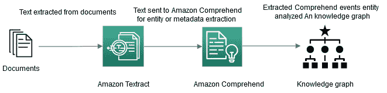

图 9.1 – 元数据提取架构

在此架构中，我们将从提取大规模财务文档的元数据开始。我们将展示如何使用 Amazon Textract 批处理作业从这些大型文档中提取数据，并将提取的数据保存为文本文件。然后，我们将展示如何使用 Comprehend Events 从该文本文件中提取实体，并使用知识图谱可视化实体之间的关系。你还可以使用 Amazon Neptune，它是一个图形数据库，可用于可视化这些关系。

在接下来的部分，我们将通过使用 Jupyter Notebook 代码来查看此架构。

# 设置用例

在本节中，我们将介绍如何入门，并带你走一遍上图所示的架构。

我们将解决方案代码演示分为以下几个部分：

+   设置笔记本代码和 S3 桶的创建

+   上传示例文档并使用 Textract 提取文本

+   使用 Comprehend 提取元数据

+   使用 SDK 启动 Comprehend Events 作业

+   从 S3 收集 Comprehend Events 作业结果

+   分析 Comprehend Events 的输出

## 设置笔记本代码和 S3 桶的创建

按照以下步骤设置笔记本：

1.  在你之前章节中设置的 SageMaker Jupyter 笔记本中，使用 Git 克隆 [`github.com/PacktPublishing/Natural-Language-Processing-with-AWS-AI-Services/`](https://github.com/PacktPublishing/Natural-Language-Processing-with-AWS-AI-Services/)。

1.  然后，前往 `/Chapter 09/chapter 09 metadata extraction.ipynb` 并开始运行笔记本。

1.  现在我们已经设置好了笔记本，接下来将创建一个 Amazon S3 桶。按照 *第二章*，*介绍 Amazon Textract* 中提供的步骤创建一个 Amazon S3 桶。

1.  复制创建的桶，打开你从 *第九章**，从财务文档提取元数据* (`Chapter 09/chapter 09 metadata extraction.ipynb`) 中获取的示例代码，并将其粘贴到以下笔记本单元格中以开始：

    ```py
    bucket = '<your s3 bucket name>'
    ```

    注意

    我们假设你的笔记本已获得 Amazon Comprehend 完全访问权限、Amazon S3 完全访问权限以及 Amazon Textract 完全访问权限。如果没有访问权限，将会遇到访问拒绝异常。

如果在运行笔记本中的任何步骤时遇到访问拒绝异常，请前往 *第二章*，*介绍 Amazon Textract*，并设置相关的 IAM 角色。

在下一部分，我们将引导你通过代码，让你了解架构是如何工作的。

### 上传示例文档并使用 Textract 提取文本

在本节中，我们将向您展示如何快速设置图 *9.1* 中显示的提议架构。我们已经创建了一个 Amazon S3 存储桶，用于存储您的输出和示例文件。我们还将该 S3 存储桶的名称粘贴在了笔记本单元格中。如果您还没有完成此步骤，请完成之前的步骤。

我们将参考以下笔记本：[`github.com/PacktPublishing/Natural-Language-Processing-with-AWS-AI-Services/blob/main/Chapter%2009/chapter%2009%20metadata%20extraction.ipynb`](https://github.com/PacktPublishing/Natural-Language-Processing-with-AWS-AI-Services/blob/main/Chapter%2009/chapter%2009%20metadata%20extraction.ipynb)。让我们开始吧：

1.  首先，我们必须从 Amazon S3 下载示例 PDF 财务新闻稿文件。

    现在，我们必须使用 `upload_file` S3 命令通过 `sample_financial_news_doc.pdf` boto3 API 将其上传到 S3 存储桶以进行处理。相同的存储桶将用于返回服务输出：

    ```py
    filename = "sample_financial_news_doc.pdf"
    s3_client.upload_file(filename, bucket, filename)
    ```

    注意

    该 PDF 文件包含关于 Whole Foods 和 Amazon 在 2017 年合并的新闻稿声明，共 156 页。

1.  现在，我们将运行 Amazon Textract 将此 PDF 转换为文本文件；Amazon Comprehend 接受 UTF-8 编码的文本输入文件用于元数据提取。您可以运行笔记本代码开始一个异步处理任务，从文档中提取文本。我们已经在 *第二章* 中详细解释了异步 Textract 批处理代码的工作原理，*介绍 Amazon Textract*。如果您想深入了解，请参阅该章节。运行以下单元格获取任务结果：

    ```py
    jobId = startJob(bucket, filename)
    print("Started job with id: {}".format(jobId))
    if(isJobComplete(jobId)):
        response = getJobResults(jobId)
    ```

    此时，您将获得一个 `Job ID`。等待任务的状态从进行中更改为完成：

    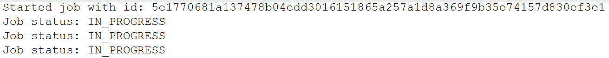

    图 9.2 – Textract 任务状态

1.  现在，我们将通过运行以下笔记本单元格，将从 Amazon Textract 提取的数据转换为 UTF-8 文本文件，以供 Amazon Comprehend 使用：

    ```py
    text_filename = 'sample_finance_data.txt'
    doc = Document(response)
    with open(text_filename, 'w', encoding='utf-8') as f:
        for page in doc.pages:
            page_string = ''
            for line in page.lines:
                #print((line.text))
                page_string += str(line.text)
            #print(page_string)
            f.writelines(page_string + "\n")
    ```

    财务新闻稿文件文本将从新闻稿文件中提取：

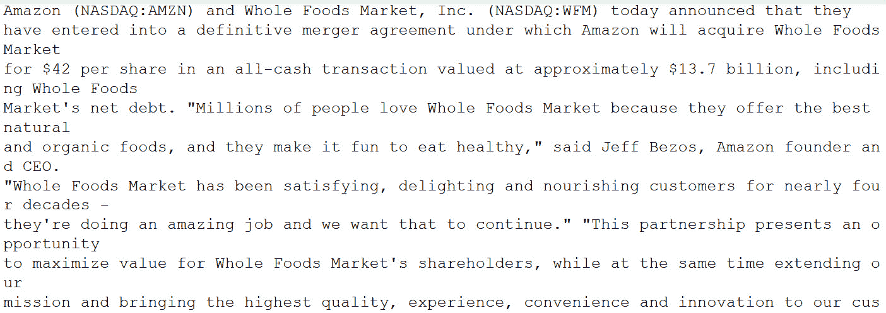

图 9.3 – 使用 Amazon Textract 从新闻稿文件中提取的文本

在本节中，我们介绍了如何使用 Amazon Textract 将新闻稿文件（关于 Amazon 收购 Whole Foods 的 2017 年新闻稿，共 156 页）中的文本数据提取为文本格式。在下一节中，我们将讨论如何使用 Comprehend 实体检测同步 API 和 Comprehend 事件异步任务从该文件中提取元数据。

### 使用 Comprehend 提取元数据

在本节中，我们将使用上述文本文件，利用 Amazon Comprehend 事件 API 提取元数据。

#### Comprehend 事件 API

Amazon Comprehend 事件是一个非常特定的 API，可以帮助您分析金融事件，如并购、收购、IPO 日期、新闻稿、破产等。它从这些事件中提取重要的金融实体，如 IPO 日期、并购方名称等，并建立关系，以便金融分析师能够实时处理其金融模型，做出准确的预测和快速决策。

Amazon Comprehend 事件可以帮助您分析异步作业。为此，您必须首先确保执行以下操作：

+   通过 AWS 控制台设置 Amazon Comprehend 事件作业。

+   通过笔记本设置 Amazon Comprehend 事件作业（[`github.com/PacktPublishing/Natural-Language-Processing-with-AWS-AI-Services/blob/main/Chapter%2009/chapter%2009%20metadata%20extraction.ipynb`](https://github.com/PacktPublishing/Natural-Language-Processing-with-AWS-AI-Services/blob/main/Chapter%2009/chapter%2009%20metadata%20extraction.ipynb)），使用 boto3 Python API。

    注意

    您可以选择上述方法之一，使用 Amazon Comprehend 事件分析您的新闻稿文档。

让我们从使用 Amazon Comprehend 控制台设置 Amazon Comprehend 事件作业开始：

1.  通过访问[`console.aws.amazon.com/comprehend/v2/home?region=us-east-1#home`](https://console.aws.amazon.com/comprehend/v2/home?region=us-east-1#home)打开 Amazon Comprehend 控制台。

1.  转到**分析作业** -> **创建分析作业**。

1.  在**作业设置**中，输入**名称：Test-events**。您将看到可以选择多种分析类型，如**情感分析**、**PII**、**实体**和**主题建模**。选择**事件**。对于**语言**，选择**英语**，对于**目标事件类型**，选择所有可用选项，如下图所示：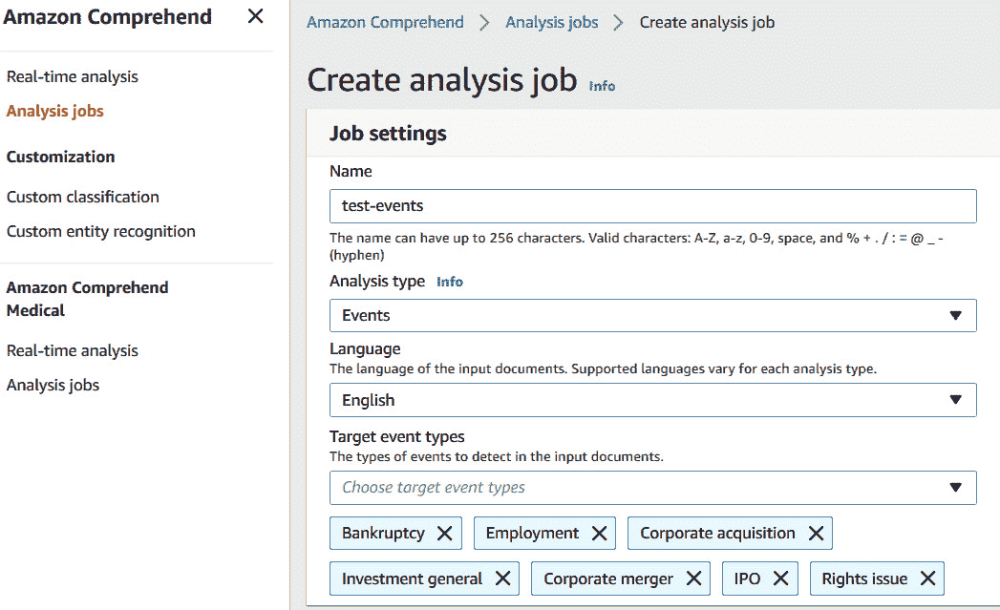

    ](img/B17528_09_04.jpg)

    图 9.4 – 创建 Comprehend 事件分析作业

1.  对于`s3://<your bucket>/sample_finance_data.txt`，选择每行一个文档作为**输入格式**。

    注意

    我们使用每行一个文档作为输入格式，而不是每个文件一个文档。这是因为这份新闻稿文档的总文件大小为 655 KB，而每个文件的文档大小限制为 10 KB。每行一个文档格式最多可以容纳 5,000 行；我们在本演示中使用的新闻稿文档包含 156 行。

    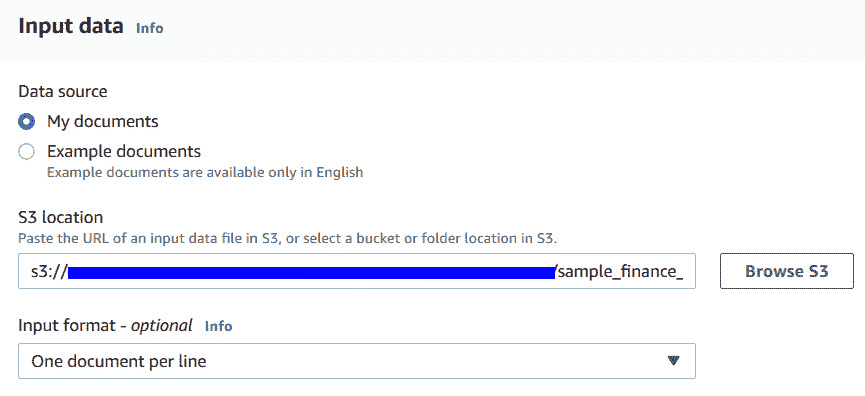

    图 9.5 – 为分析作业选择输入数据

1.  对于`s3://<your-bucket>`：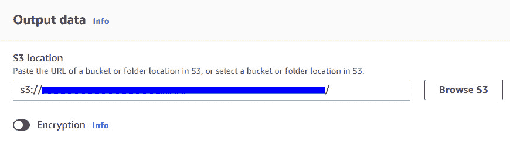

    图 9.6 – 为分析作业选择输出 S3 位置

1.  对于`events-role`：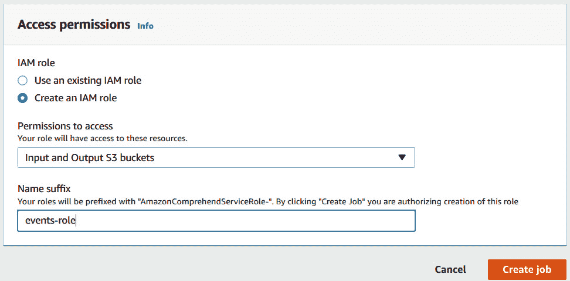

    ](img/B17528_09_07.jpg)

    图 9.7 – 通过创建 IAM 角色设置访问权限

1.  点击**创建作业**按钮以触发事件作业。趁此机会喝杯咖啡或茶，因为此作业需要 15 分钟才能完成。

1.  一旦作业完成，请前往`作业 ID`：

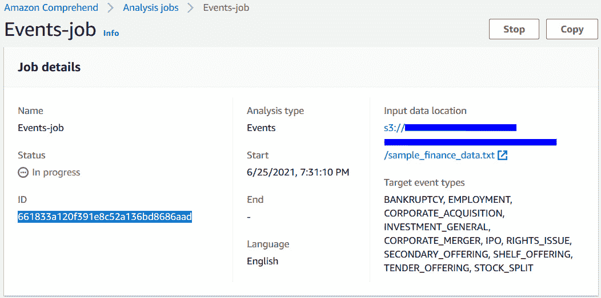

图 9.8 – 在创建作业后，从作业详情页面复制作业 ID

注意

如果你是通过 Amazon Comprehend 控制台创建事件作业，跳过笔记本中的*使用 SDK 启动异步作业*部分，直接进入*从 S3 收集结果*部分。

在本节中，我们讲解了如何使用**AWS 控制台**为一份大型财务新闻稿文档创建 Comprehend Events 作业。如果你已经通过控制台进行设置，请跳过下一部分。

### 使用 SDK 启动 Comprehend Events 作业

在本节中，我们将切换回笔记本，使用 SDK 启动异步作业。让我们开始：

1.  通过访问 IAM 控制台 [`console.aws.amazon.com/iam/home?region=us-east-1#/home`](https://console.aws.amazon.com/iam/home?region=us-east-1#/home) 创建一个 IAM 角色。确保创建一个有访问 Comprehend 权限并已指定 S3 的 IAM 角色。将以下内容粘贴到单元格中：

    ```py
    job_data_access_role = 'arn:aws:iam::<your account number>:role/service-role/AmazonComprehendServiceRole-test-events-role'
    ```

1.  运行以下单元格以设置其他 Events 作业参数，如事件类型和输入数据格式：

    ```py
    input_data_format = 'ONE_DOC_PER_LINE'
    job_uuid = uuid.uuid1()
    job_name = f"events-job-{job_uuid}"
    event_types = ["BANKRUPTCY", "EMPLOYMENT", "CORPORATE_ACQUISITION", 
                   "INVESTMENT_GENERAL", "CORPORATE_MERGER", "IPO",
                   "RIGHTS_ISSUE", "SECONDARY_OFFERING", "SHELF_OFFERING",
                   "TENDER_OFFERING", "STOCK_SPLIT"]
    ```

1.  运行以下单元格以触发 Events 分析作业。该作业正在调用 Python boto 3 启动事件检测作业的 API。请访问 [`boto3.amazonaws.com/v1/documentation/api/latest/reference/services/comprehend.html#Comprehend.Client.start_events_detection_job`](https://boto3.amazonaws.com/v1/documentation/api/latest/reference/services/comprehend.html#Comprehend.Client.start_events_detection_job) 了解更多信息：

    ```py
    response = comprehend_client.start_events_detection_job(
        InputDataConfig={'S3Uri': input_data_s3_path,
                         'InputFormat': input_data_format},
        OutputDataConfig={'S3Uri': output_data_s3_path},
        DataAccessRoleArn=job_data_access_role,
        JobName=job_name,
        LanguageCode='en',
        TargetEventTypes=event_types
    )
    events_job_id = response['JobId']
    ```

在本节中，我们讲解了如何使用 SDK 启动 Comprehend Events 分析作业。此时，我们已有一个作业 ID，接下来将使用它收集输出并分析元数据。

### 从 S3 收集结果

在本节中，我们将在 Amazon S3 中分析此作业的输出结果。让我们开始：

1.  如果你之前使用过 Amazon Comprehend 控制台，你应该已经在该部分末尾复制了`作业 ID`。请通过取消注释将其粘贴到以下单元格中，然后运行该单元格：

    ```py
    events_job_id ="<Job ID>"
    ```

1.  如果你使用 Amazon Comprehend SDK 启动了 Events 分析作业，请继续执行以下单元格来跟踪作业状态：

    ```py
    job = comprehend_client.describe_events_detection_job(JobId=events_job_id)
    waited = 0
    timeout_minutes = 30
    while job['EventsDetectionJobProperties']['JobStatus'] != 'COMPLETED':
        sleep(60)
        waited += 60
        assert waited//60 < timeout_minutes, "Job timed out after %d seconds." % waited
        job = comprehend_client.describe_events_detection_job(JobId=events_job_id)
    ```

1.  一旦作业完成，你可以通过运行以下单元格从 Amazon S3 获取输出：

    ```py
    output_data_s3_file = job['EventsDetectionJobProperties']['OutputDataConfig']['S3Uri'] + text_filename + '.out'
    results = []
    with smart_open.open(output_data_s3_file) as fi:
        results.extend([json.loads(line) for line in fi.readlines() if line])
    ```

在本节中，我们讲解了如何使用 SDK 跟踪 Comprehend Events 作业的完成情况，并从 Amazon S3 收集输出。现在我们已经收集了结果，接下来我们将分析提取的结果和元数据。

## 分析 Comprehend Events 的输出

在本节中，我们将向您展示不同的方式来分析 Comprehend Events 的输出。金融分析师可以利用这些输出预测市场趋势或查找大数据集中的关键信息。但首先，让我们了解一下**Comprehend Events**系统的输出（[`docs.aws.amazon.com/comprehend/latest/dg/how-events.html`](https://docs.aws.amazon.com/comprehend/latest/dg/how-events.html)）：

+   系统返回每个提交文档的 JSON 输出。响应的结构如下所示：

    ```py
    result = results[0]
    result
    ```

    在响应中，您会得到实体，以及作为 `mentions`、`arguments` 和 `triggers` 分组的实体，附带置信度分数。我们将在整个笔记本中看到这些术语的使用：

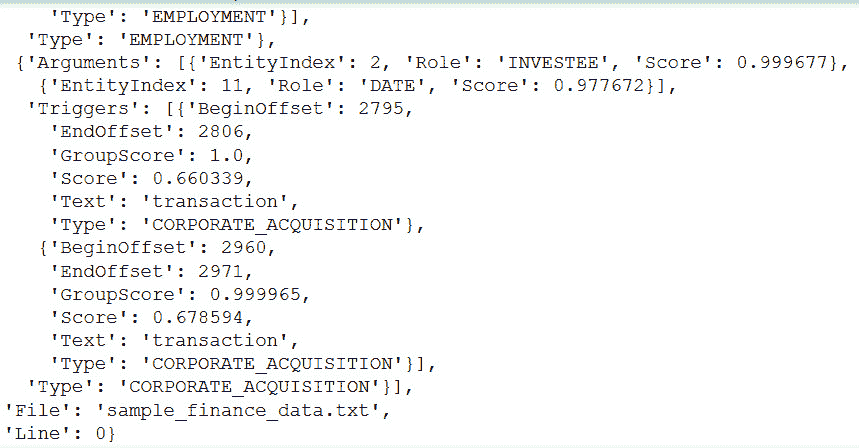

图 9.9 – Comprehend events JSON 输出

+   `Events` 是 `triggers` 的组。API 的输出包括每个触发器的文本、字符偏移量和类型，以及置信度分数。事件组的成员资格置信度由 `GroupScore` 提供。运行以下笔记本单元格来查看这些内容：

    ```py
    result['Events'][1]['Triggers']
    ```

    以下是前面代码的输出：

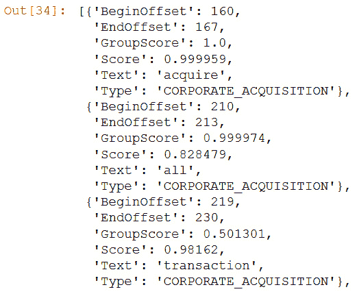

图 9.10 – Comprehend events 触发器

`acquire` 和 `transaction` 与 `CORPORATE_ACQUISTION` 类型的事件相关联。

+   参数通过 `EntityIndex` 与实体相关联，同时包括角色分配的分类置信度。它描述了实体与事件之间的关系。运行以下代码以理解这一点：

    ```py
    result['Events'][1]['Arguments']
    ```

    `arguments` 的输出将如下所示：

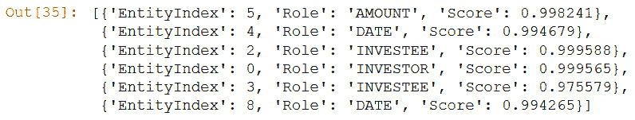

图 9.11 – Comprehend events 参数

`Investee`、`Amount` 和 `Date` 是具有实体索引和置信度分数的角色。

+   实体是由 `Mentions` 组成的组，这些 `Mentions` 包括每个提及的 `text`、字符 `offset` 和 `type`，以及它们的置信度分数。实体组的成员资格置信度由 `Group Scores` 提供。让我们运行以下单元格来理解这一点：

    ```py
    result['Entities'][5]['Mentions']
    ```

    以下输出显示了 `Mention` 实体的样子：

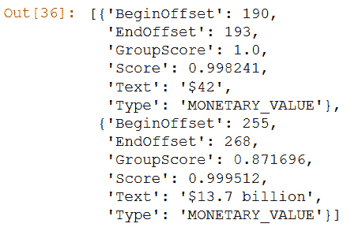

图 9.12 – Comprehend events 提及

`entityIndex` 5 指输出中的 `Type` `Monetary_Value`。

现在我们已经知道了什么是 `entity`、`arguments` 和 `mentions`，让我们可视化它们之间的关系。

### 事件和实体的可视化

在接下来的笔记本部分，我们将提供几种表格和可视化，帮助你理解 API 返回的内容。首先，我们将查看`spans`，包括`triggers`和实体`mentions`。序列标注任务中最基本的可视化任务之一是高亮文档中的标注文本。为了演示目的，我们将使用**displaCy**，这是一款内置的依存关系可视化工具，可以让你在浏览器中查看模型的预测结果（[`explosion.ai/demos/displacy`](https://explosion.ai/demos/displacy)）：

1.  运行以下代码将`entity`转换为 displaCy 格式。将`Events`的输出转换为 displaCy 格式：

    ```py
    entities = [
        {'start': m['BeginOffset'], 'end': m['EndOffset'], 'label': m['Type']}
        for e in result['Entities']
        for m in e['Mentions']
    ]
    ```

1.  使用以下代码映射`triggers`：

    ```py
    triggers = [
        {'start': t['BeginOffset'], 'end': t['EndOffset'], 'label': t['Type']}
        for e in result['Events']
        for t in e['Triggers']
    ]
    ```

1.  运行以下代码，使得`spans`被`sorted`，以便 displaCy 能够正确处理它：

    ```py
    spans = sorted(entities + triggers, key=lambda x: x['start'])
    tags = [s['label'] for s in spans]
    output = [{"text": raw_texts[0], "ents": spans, "title": None, "settings": {}}]
    ```

1.  现在，我们将通过运行以下笔记本代码，呈现所有参与事件的`entities`：

    ```py
    displacy.render(output, style="ent", options={"colors": color_map}, manual=True)
    ```

    以下是运行前述代码的输出：


图 9.13 – Comprehend 事件和实体

我们已根据发现的关系对事件进行了颜色编码。通过查看相同颜色的高亮实体和关系，我们可以看到 John Mackey 是联合创始人兼 CEO，并且他将继续在公司工作。

### 渲染表格数据

许多金融用户使用`Events`从非结构化文本中创建结构化数据。在本节中，我们将演示如何使用 pandas 做到这一点。

首先，我们必须通过以下操作将层次结构的 JSON 数据展平为 pandas DataFrame：

1.  创建`entities` DataFrame。实体索引必须显式创建：

    ```py
    entities_df = pd.DataFrame([
        {"EntityIndex": i, **m}
        for i, e in enumerate(result['Entities'])
        for m in e['Mentions']
    ])
    ```

1.  创建`events` DataFrame。`Event`索引必须显式创建：

    ```py
    events_df = pd.DataFrame([
        {"EventIndex": i, **a, **t}
        for i, e in enumerate(result['Events'])
        for a in e['Arguments']
        for t in e['Triggers']
    ])
    ```

1.  以下代码将把两个表连接成一个平坦的数据结构：

    ```py
    events_df = events_df.merge(entities_df, on="EntityIndex", suffixes=('Event', 'Entity'))
    ```

    以下是`EntityIndex`作为表格结构的输出：

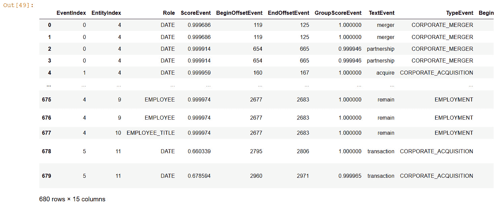

](img/B17528_09_14.jpg)

图 9.14 – Comprehend 事件作为 DataFrame 的实体

我们可以看到，将事件和相关元数据（如日期和时间）作为 python pandas DataFrame 进行分析和提取非常容易。一旦数据在 DataFrame 中，可以轻松保存到下游应用程序，如数据库或图数据库，进行进一步分析。

### 分析的表格表示

我们主要关注的是*事件结构*，因此我们通过创建一个新的表格，将`Roles`作为列标题，按事件分组来使其更加透明：

+   以下代码将为我们完成此操作：

    ```py
    def format_compact_events(x):
        This code will take the most commonly occurring EventType and the set of triggers.
        d = {"EventType": Counter(x['TypeEvent']).most_common()[0][0],
             "Triggers": set(x['TextEvent'])}
        This code will loop for each argument Role, collect the set of mentions in the group.
        for role in x['Role']:
            d.update({role: set((x[x['Role']==role]['TextEntity']))})
        return d
    ```

+   以下代码将按`EventIndex`对数据进行分组并格式化：

    ```py
    event_analysis_df = pd.DataFrame(
        events_df.groupby("EventIndex").apply(format_compact_events).tolist()
    ).fillna('')
    event_analysis_df
    ```

    以下截图展示了表示 Comprehend 事件表格格式的 DataFrame 输出：

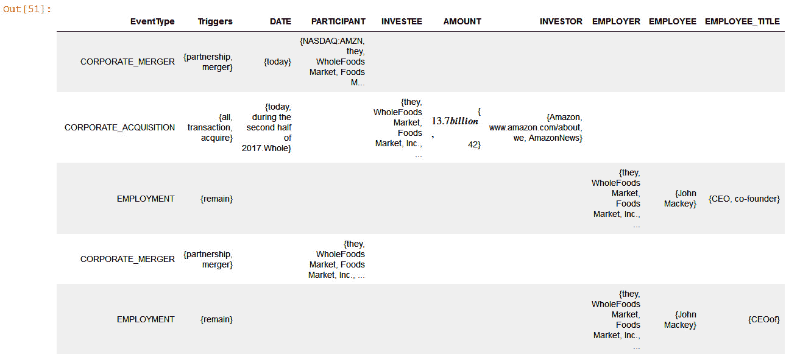

](img/B17528_09_15.jpg)

图 9.15 – Comprehend 事件的表格表示

在前面的输出中，我们有事件类型、日期、被投资方、投资者、雇主、雇员和职务的表格表示，金融分析师可以轻松利用这些信息查看必要的元数据。

### 事件语义图

Comprehend Events 输出的最引人注目的表示形式是在语义图中，这是一个包含在文档中引用的实体和事件的网络。我们稍后将介绍的代码（请打开`pyvis`链接查看）使用了两个开源库：`Networkx`和`pyvis`。`Networkx`是一个 Python 包，用于创建、操作和研究复杂网络的结构、动态和功能（[`networkx.org/`](https://networkx.org/)），而`pyvis`（[`pyvis.readthedocs.io/en/latest/`](https://pyvis.readthedocs.io/en/latest/)）是一个库，可以快速生成可视化网络来呈现事件系统输出。顶点代表实体`mentions`和`triggers`，边则是图中实体与`triggers`之间所持的参数角色。

### 格式化数据

系统输出必须符合 Networkx 要求的节点（即顶点）和边列表格式。这需要遍历`triggers`、`entities`和`argument`结构关系。请注意，我们可以使用`GroupScore`和`Score`键对各种对象进行修剪，以剔除模型信心较低的节点和边。我们还可以使用不同的策略从每个`mention`组中选取一个“规范”提及以在图中显示；在这里，我们选择了字符串长度最长的提及。运行以下代码进行格式化：

+   为了简化，实体是按组与事件关联的，而非单个`mentions`。以下方法假设规范提及为最长的一个：

    ```py
    def get_canonical_mention(mentions):
        extents = enumerate([m['Text'] form in mentions])
        longest_name = sorted(extents, key=lambda x: len(x[1]))
        return [mentions[longest_name[-1][0]]]
    ```

+   设置全局置信度阈值：

    ```py
    thr = 0.5
    ```

+   在以下代码中，我们将节点表示为（`id`，`type`，`tag`，`score`，`mention_type`）元组：

    ```py
    trigger_nodes = [
        ("tr%d" % i, t['Type'], t['Text'], t['Score'], "trigger")
        for i, e in enumerate(result['Events'])
        for t in e['Triggers'][:1]
        if t['GroupScore'] > thr
    ]
    entity_nodes = [
        ("en%d" % i, m['Type'], m['Text'], m['Score'], "entity")
        for i, e in enumerate(result['Entities'])
        for m in get_canonical_mention(e['Mentions'])
        if m['GroupScore'] > thr
    ]
    ```

+   在以下代码中，我们将边表示为（`trigger_id`，`node_id`，`role`，`score`）元组：

    ```py
    argument_edges = [
        ("tr%d" % i, "en%d" % a['EntityIndex'], a['Role'], a['Score'])
        for i, e in enumerate(result['Events'])
        for a in e['Arguments']
        if a['Score'] > thr
    ```

+   为了创建一个紧凑的图形，一旦节点和边被定义，我们可以使用以下代码块来创建和可视化图形：

    ```py
    G = nx.Graph()
    ```

+   遍历`triggers`和实体`mentions`，如下所示：

    ```py
    for mention_id, tag, extent, score, mtype in trigger_nodes + entity_nodes:
        label = extent if mtype.startswith("entity") else tag
        G.add_node(mention_id, label=label, size=score*10, color=color_map[tag], tag=tag, group=mtype)
    ```

+   以下代码遍历参数角色分配：

    ```py
    for event_id, entity_id, role, score in argument_edges:
        G.add_edges_from(
            [(event_id, entity_id)],
            label=role,
            weight=score*100,
            color="grey"
        )
    ```

+   以下代码会删除不参与事件的`mentions`：

    ```py
    G.remove_nodes_from(list(nx.isolates(G)))
    nt = Network("600px", "800px", notebook=True, heading="")
    nt.from_nx(G)
    nt.show("compact_nx.html")
    ```

    以下是图形格式的输出：

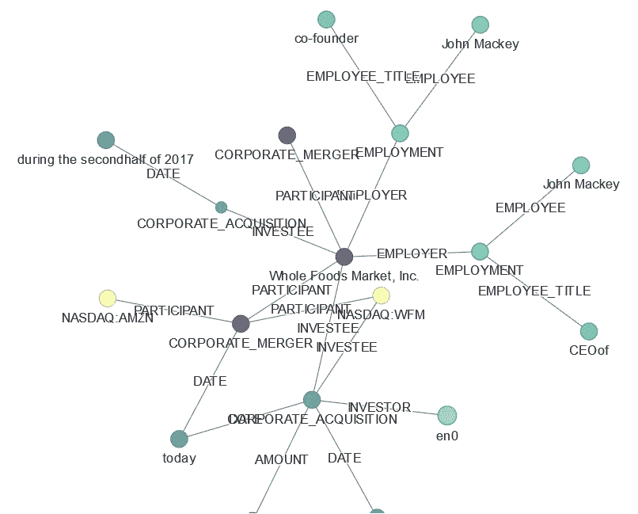

图 9.16 – 理解事件知识图谱表示

在前面的输出中，如果我们遍历此图，可以看到实体之间的关系，已知的实体名为 Whole Foods，参与了公司合并的过程，且与其雇主有关系。雇主是 John Macey，他的职务是 CEO。

### 更完整的图

前面的图表非常简洁，只传达了基本的事件类型和参数角色信息。我们可以使用一组稍微复杂的函数来绘制 API 返回的所有信息。

这是`events_graph.py`中的一个便捷函数。它绘制了文档的完整图，显示了所有的`events`、`triggers`和`entities`，以及它们的分组：

```py
import events_graph as evg
evg.plot(result, node_types=['event', 'trigger', 'entity_group', 'entity'], thr=0.5)
```

以下是图形格式的输出：

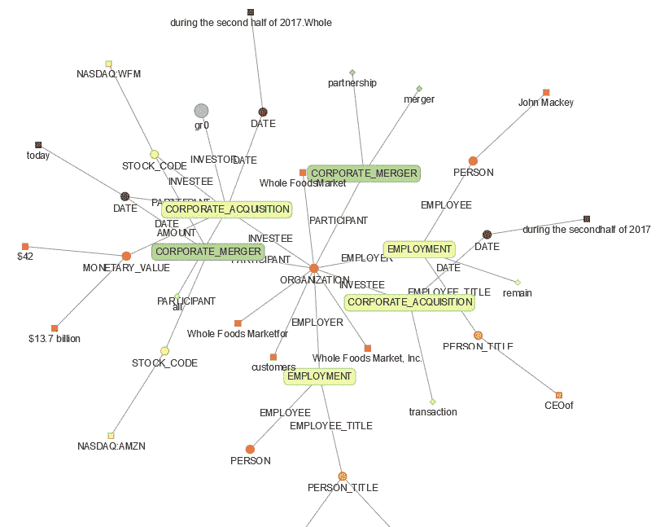

图 9.17 – 理解事件知识图谱可视化

注意

你可以使用**Amazon Neptune**与 Amazon Comprehend Events 进行大规模知识图谱分析。

在这里，我们已经提取了元数据并以表格方式分析它，并展示了如何将其呈现为图形。你可以使用 Amazon Neptune 与 Amazon Comprehend Events 进行大规模知识图谱分析，正如我们在*图 9.1*中所介绍的。

要深入了解如何使用 Amazon Neptune 实现这一点，请参考*进一步阅读*部分的相关博客，博客将引导你如何使用 Amazon Comprehend Events 在 Amazon Neptune 中构建知识图谱。

注意

使用 Comprehend Events 提取的`Entities`将与 Comprehend 的实体检测 API 不同，因为事件特定于金融事件的实体和关系提取。

你还可以使用 Amazon Comprehend 提取 Word 或 PDF 文档的元数据，使用检测实体、自定义实体，或者在金融文档的情况下使用 Comprehend Events，并通过**SageMaker Ground Truth**丰富文档标注过程。SageMaker Ground Truth 是一项主要用于标注数据的服务。

# 总结

本章中，我们学习了在查看**LiveRight**（我们虚构的银行）的用例之前，为什么元数据提取非常重要。该银行进行了收购并发布了新闻稿。财务分析师希望快速评估与该新闻稿相关的事件和实体，并进行市场预测。我们看了一种架构来帮助你实现这一目标。在*图 1.1*中展示的架构中，我们讨论了如何使用 AWS AI 服务，如 Amazon Textract，从样本新闻稿中提取文本。然后，我们将所有文本以 utf-8 编码保存在 Amazon S3 桶中，用于 Amazon Comprehend 的实体或元数据提取任务。

我们使用了一个 Amazon Comprehend Events 作业来提取实体及实体之间的关系。如果您希望进一步了解，可以在 *进一步阅读* 部分找到 *Comprehend Events 功能* 的 *演示视频* 链接。我们还提供了两种配置 Comprehend Events 作业的方法；即，可以使用 AWS 控制台或 AWS Python boto3 API。最后，我们讨论了如何使用图形 API（例如 `displayCy`、`Networkx` 或 `pyvis`）或使用 Amazon Neptune 的图形数据库来可视化提取的元数据之间的关系。我们还建议，可以将这些元数据进一步用作数据标注的输入，使用 **Amazon SageMaker Ground Truth**。

在下一章中，我们将讨论如何为您的酷炫网站进行内容变现。

# 进一步阅读

要了解更多本章中涵盖的主题，请查看以下资源：

+   *在 Amazon Neptune 中使用 Amazon Comprehend Events 构建知识图谱*，由 Brian O'Keefe、Graham Horwood 和 Navtanay Sinha 编写 ([`aws.amazon.com/blogs/database/building-a-knowledge-graph-in-amazon-neptune-using-amazon-comprehend-events/`](https://aws.amazon.com/blogs/database/building-a-knowledge-graph-in-amazon-neptune-using-amazon-comprehend-events/))。

+   *宣布推出 Amazon Comprehend Events*，由 Graham Horwood、Sameer Karnik 和 Ben Snively 编写 ([`aws.amazon.com/blogs/machine-learning/announcing-the-launch-of-amazon-comprehend-events/`](https://aws.amazon.com/blogs/machine-learning/announcing-the-launch-of-amazon-comprehend-events/))。

+   *Fintech Snacks 2 – 使用 Amazon Comprehend Events 提取市场驱动事件*，由 Mona Mona 和 Evan Peck 编写 ([`www.youtube.com/watch?v=QvmVT_8y7-Y`](https://www.youtube.com/watch?v=QvmVT_8y7-Y))。
