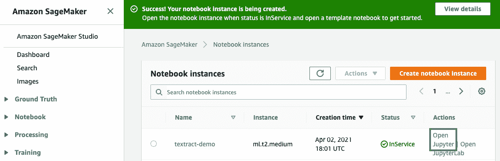
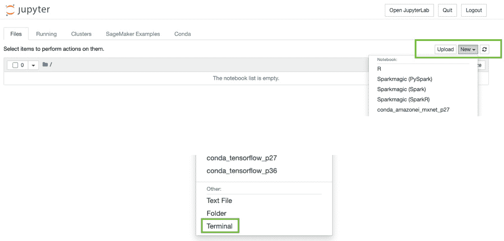
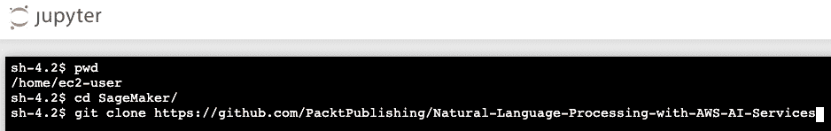
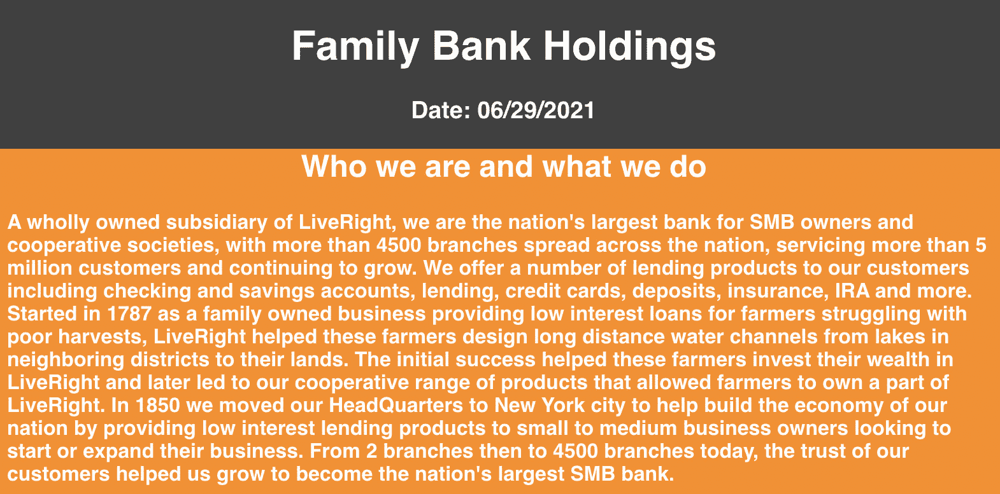
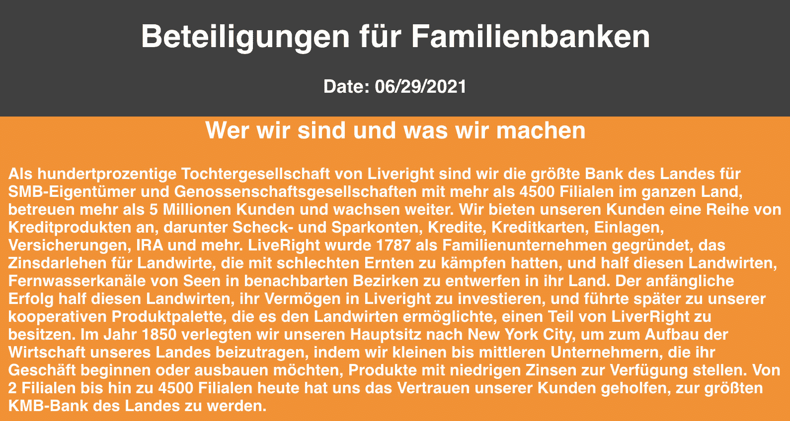
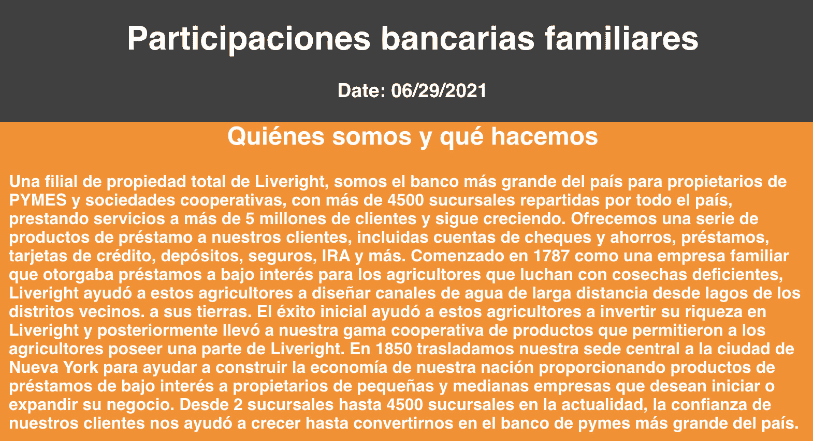
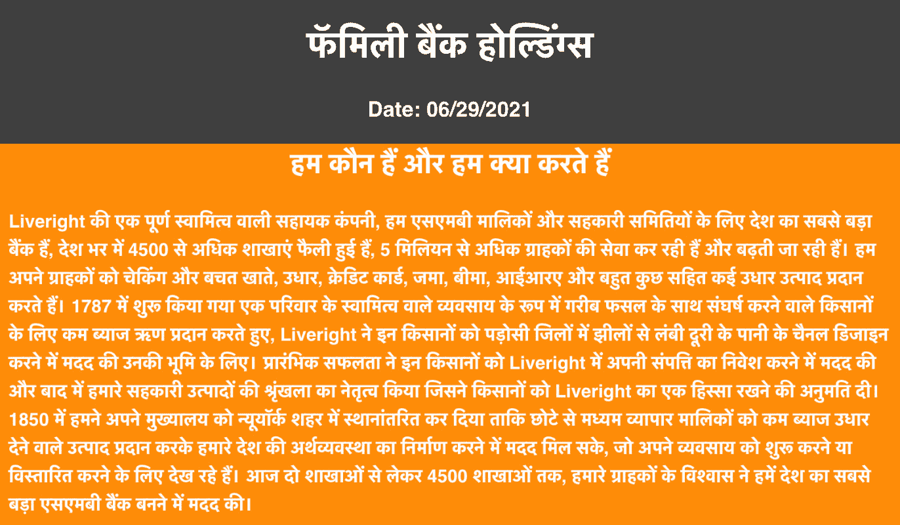

# 第十章：*第十章*：通过机器翻译降低本地化成本

大约十五年前（在互联网还不像今天这样发达的时候），其中一位作者去了瑞士进行观光旅行。这是一个冲动的、临时的决定，而且几乎没有太多规划。旅行本身很平淡，作者知道德语在瑞士是可接受的语言，于是在旅途中忙着进行英语到德语的*罗塞塔语音*练习。根据曾去过瑞士的朋友的建议，作者粗略地制定了一个行程，包括参观苏黎世、因特拉肯、伯尔尼等地。凭借他非常幼稚的德语，尤其是由于瑞士人流利的英语，作者逐渐放松了下来，甚至开始享受起旅行——直到，当然，他去了日内瓦，那里的每个人只说法语。他尝试用英语交谈时遭遇冷漠，他所知道的唯一法语单词就是“oui”（意思是“是”）和“au revoir”（意思是“再见”）！作者最终不得不使用手势语言，通过指着餐厅菜单上的项目、展示旅游指南书询问旅游景点等方式度过接下来的几天。如果当时作者能使用如今常见的基于机器学习的高级翻译解决方案——日内瓦本该是轻松愉快的。

在他 2005 年出版的书籍《*世界是平的*》中（几乎在这位作者前往日内瓦的同一时期），*托马斯·L·弗里德曼*详细描述了全球化的意义，特别是技术进步（包括个人电脑和互联网）如何导致经济界限和界区的崩塌，甚至将全球竞争的舞台拉平。当企业走向全球化时，他们最常遇到的任务之一就是将其网站的语言翻译成他们选择运营的国家或地区的本地语言。这就是所谓的本地化。传统上，组织会雇佣一个翻译团队， painstakingly（辛苦地）逐页翻译其网站内容，确保准确表达原文的上下文。这些内容会手动输入到多个页面中以搭建网站。这既耗时又昂贵，但由于这是必要的任务，组织们别无选择。如今，随着基于机器学习的翻译技术，如亚马逊翻译的出现，本地化可以以以前的几分之一的成本完成。

在上一章中，我们看到如何利用 AWS AI 服务的 NLP 功能为 **LiveRight** 提取财务报告的元数据，以便他们的财务分析师能够查看重要信息并就合并、收购和 IPO 等财务事件做出更好的决策。在本章中，我们将看到 NLP 和 AWS AI 服务如何通过 **Amazon Translate**（[`aws.amazon.com/translate/`](https://aws.amazon.com/translate/)）帮助自动化网站本地化。Amazon Translate 是一个基于机器学习的翻译服务，支持 71 种语言。使用 Amazon Translate 不需要进行任何机器学习训练，因为它是预训练的，并且支持通过简单的 API 调用进行调用。对于适用于您业务的特定用例，您可以使用 Amazon Translate 的高级功能，如**命名实体翻译自定义**（[`docs.aws.amazon.com/translate/latest/dg/how-custom-terminology.html`](https://docs.aws.amazon.com/translate/latest/dg/how-custom-terminology.html)）、**主动自定义翻译**（[`docs.aws.amazon.com/translate/latest/dg/customizing-translations-parallel-data.html`](https://docs.aws.amazon.com/translate/latest/dg/customizing-translations-parallel-data.html)）等。

为了学习如何构建一个高性价比的本地化解决方案，我们将涵盖以下主题：

+   介绍本地化用例

+   使用机器翻译构建多语言网页

# 技术要求

对于本章，你需要一个 AWS 账户。请确保按照*第二章*中*技术要求*部分的说明，创建你的 AWS 账户。在尝试执行*使用机器翻译构建多语言网页*部分的步骤之前，请确保已登录 AWS 管理控制台。

我们解决方案的 Python 代码和示例数据集可以在以下链接找到：[`github.com/PacktPublishing/Natural-Language-Processing-with-AWS-AI-Services/tree/main/Chapter%2010`](https://github.com/PacktPublishing/Natural-Language-Processing-with-AWS-AI-Services/tree/main/Chapter%2010)。请使用以下各节中的说明，并结合代码库中的代码来构建解决方案。

查看以下视频，了解代码演示：[`bit.ly/3meYsn0`](https://bit.ly/3meYsn0)。

# 介绍本地化用例

在前几章中，我们探讨了多种自然语言处理（NLP）如何帮助我们更好地理解客户。我们学习了如何构建应用程序来检测情感、实现内容货币化、识别独特实体，并理解上下文、引用及其他分析流程，这些都帮助组织获得关于其业务的重要洞察。在这一章中，我们将学习如何自动化将网站内容翻译成多种语言的过程。为了说明这个例子，我们假设我们的虚拟银行公司**LiveRight Holdings Private Limited**已经决定扩展到德国、西班牙以及印度的孟买和金奈等城市，以吸引潜在客户。这四个试点区域的上线日期即将来临，也就是在接下来的三周内。扩展项目负责人已向高层管理层提出了担忧，表示 IT 团队可能无法按时准备好对应地区的德语、西班牙语、印地语和泰米尔语网站，以迎接上线。你接到了一通来自 IT 总监的紧急电话，她要求你作为应用架构师，在接下来的两周内设计并构建这些网站，这样他们可以利用最后一周进行验收测试。

你知道手动方法不行，因为雇佣翻译人员、完成工作并在两周内构建网站几乎不可能。在进行了一些快速调研后，你决定使用**Amazon Translate**，这是一项基于机器学习的翻译服务，来自动化网站的翻译过程。你查看了 Amazon Translate 定价页面（https://aws.amazon.com/translate/pricing/），发现你可以以最低 15 美元的价格翻译一百万个字符，更重要的是，在前 12 个月内，你可以利用**AWS 免费套餐**（[`aws.amazon.com/free/`](https://aws.amazon.com/free/)），每月免费翻译 200 万个字符。对于试点网站，你进行了字符计数，发现大约有 50 万个字符。与此同时，您的总监联系你，要求你快速创建一个**关于我们**页面的可展示原型（[`github.com/PacktPublishing/Natural-Language-Processing-with-AWS-AI-Services/blob/main/Chapter%2010/input/aboutLRH.html`](https://github.com/PacktPublishing/Natural-Language-Processing-with-AWS-AI-Services/blob/main/Chapter%2010/input/aboutLRH.html)），并支持德语、西班牙语、印地语和泰米尔语这四种目标语言。

我们将通过 AWS 管理控制台和 Amazon SageMaker Jupyter 笔记本来演示这个解决方案。请参考*第二章*中*设置您的 AWS 环境*部分的*注册 AWS 账户*部分，获取关于如何注册 AWS 账户并登录**AWS 管理控制台**的详细说明。

首先，我们将创建一个 **Amazon SageMaker** Jupyter 笔记本实例（如果您在前几章中还没有创建的话），将代码库克隆到我们的笔记本实例中，打开用于解决方案演示的 Jupyter 笔记本 ([`github.com/PacktPublishing/Natural-Language-Processing-with-AWS-AI-Services/blob/main/Chapter%2010/Reducing-localization-costs-with-machine-translation-github.ipynb`](https://github.com/PacktPublishing/Natural-Language-Processing-with-AWS-AI-Services/blob/main/Chapter%2010/Reducing-localization-costs-with-machine-translation-github.ipynb))，并执行笔记本中的步骤。详细的操作说明将在 *使用机器翻译构建多语言网页* 部分提供。让我们一起来看看：

1.  在笔记本中，我们将查看**关于我们**页面的英文版本。

1.  然后，我们将审查 **关于我们** 页面的 HTML 代码，以确定哪些标签组件需要翻译。

1.  接下来，我们将为 Python 安装一个 HTML 解析器库（[`www.crummy.com/software/BeautifulSoup/bs4/doc/`](https://www.crummy.com/software/BeautifulSoup/bs4/doc/)），并将我们感兴趣的标签的文本内容从 HTML 页面提取到一个列表中。

1.  我们将使用 **boto3 AWS Python SDK** 通过 **Amazon Translate** 来调用翻译功能。我们将以循环的方式获取德语、西班牙语、印地语和泰米尔语的翻译内容。

1.  然后，我们将采用原始的 HTML（英文版），并用每种语言对应标签的内容进行更新，从而创建四个独立的 HTML 页面。

1.  最后，我们将展示 HTML 页面，以审查翻译内容。

完成此操作后，您可以将 HTML 上传到 **Amazon S3** 桶，并设置 **Amazon CloudFront** 分发，几分钟内便能全球部署您的网站。有关如何操作的更多细节，请参阅此链接：[`docs.aws.amazon.com/AmazonS3/latest/userguide/website-hosting-cloudfront-walkthrough.html`](https://docs.aws.amazon.com/AmazonS3/latest/userguide/website-hosting-cloudfront-walkthrough.html)。在本节中，我们介绍了 **LiveRight** 的本地化需求，该公司希望拓展国际市场，需要为这些市场的启动提供本地语言的网页。在下一节中，我们将学习如何构建解决方案。

# 使用机器翻译构建多语言网页

在上一节中，我们介绍了网页本地化的需求，讨论了我们将要构建的解决方案的设计方面，并简要介绍了解决方案组件和工作流程步骤。在本节中，我们将开始执行构建解决方案的任务。但首先，我们需要处理一些前提条件。

## 设置以解决用例

如果您在前面的章节中没有这样做，作为前提条件，您需要创建一个 Amazon SageMaker Jupyter Notebook 实例，设置`第十章`文件夹，并打开`Reducing-localization-costs-with-machine-translation-github.ipynb`笔记本以开始执行过程。

注意

请确保您已经完成了*技术要求*部分提到的任务。

请按照*第二章*中[*设置您的 AWS 环境*]章节的*创建 Amazon SageMaker Jupyter Notebook 实例*部分的说明，创建您的 Jupyter Notebook 实例。让我们开始吧：

重要 – 在创建 Amazon SageMaker Jupyter 笔记本时的 IAM 角色权限

接受在笔记本创建时 IAM 角色的默认设置，以允许访问任何 S3 存储桶。

1.  一旦创建了笔记本实例并将其状态设置为`TranslateFullAccess`策略，接下来需要为您的 Amazon SageMaker 笔记本 IAM 角色设置权限。要执行此步骤，请参阅*第二章*中*介绍 Amazon Textract*部分的*更改 IAM 权限和信任关系以便执行 Amazon SageMaker 笔记本角色*章节。

1.  现在，返回到您的笔记本实例并点击**操作**菜单中的**打开 Jupyter**：

    图 10.1 – 打开 Jupyter 笔记本

    这将带您进入笔记本实例的主文件夹。

1.  点击**新建**并选择**终端**，如下图所示：

    ](img/B17528_10_02.jpg)

    图 10.2 – 在 Jupyter 笔记本中打开终端

1.  在终端窗口中，键入`cd SageMaker`，然后键入`git clone https://github.com/PacktPublishing/Natural-Language-Processing-with-AWS-AI-Services`，如下图所示。如果您在前面的章节中已经为该笔记本实例执行了此操作，则无需再次克隆代码库：

    ](img/B17528_10_03.jpg)

    图 10.3 – git clone 命令

1.  现在，退出终端窗口并返回主文件夹–您将看到一个名为`Natural-Language-Processing-with-AWS-AI-Services`的文件夹。点击此文件夹后，您将看到`chapter-10-localization-with-machine-translation`。点击该文件夹，然后打开`Reducing-localization-costs-with-machine-translation-github.ipynb`笔记本。

现在，我们已经创建了笔记本实例并克隆了我们的代码库，可以开始运行笔记本代码了。

## 运行笔记本

打开你从本书 GitHub 仓库中克隆的笔记本（[`github.com/PacktPublishing/Natural-Language-Processing-with-AWS-AI-Services/blob/main/Chapter%2010/Reducing-localization-costs-with-machine-translation-github.ipynb`](https://github.com/PacktPublishing/Natural-Language-Processing-with-AWS-AI-Services/blob/main/Chapter%2010/Reducing-localization-costs-with-machine-translation-github.ipynb)），正如我们在*为解决用例做好准备*部分中讨论的那样，按照以下步骤逐步执行单元格：

注意

请确保在执行笔记本中的单元格之前，您已完成*技术要求*和*为解决用例做好准备*部分中的步骤。

1.  执行笔记本中的第一个单元格，位于*输入 HTML 网页*部分，渲染英文版网页的 HTML：

    ```py
    from IPython.display import IFrame
    IFrame(src='./input/aboutLRH.html', width=800, height=400)
    ```

1.  您将看到页面中有几个标题，然后是一个段落，讲述**家庭银行**，它是**LiveRight Holdings**的子公司：

    图 10.4 – 网页的英文版本

1.  执行以下单元格以查看网页的 HTML 代码：

    ```py
    !pygmentize './input/aboutLRH.html'
    ```

1.  我们将看到网页的以下输出。以下输出中突出显示的区域是我们感兴趣的、需要翻译的标签。在此代码块中，我们可以定义网页的标题以及一些默认的 JavaScript 导入：

    ```py
    <!DOCTYPE html>
    <html>
        <head>
            <title>Live Well with LiveRight</title>
            <meta name="viewport" charset="UTF-8" content="width=device-width, initial-scale=1.0">
            <script src="img/jquery.min.js"></script>
            <script src="img/popper.min.js"></script>
            <script src="img/bootstrap.min.js"></script>
            <script src="img/aws-sdk-2.408.0.min.js"></script>
            <script src="img/Chart.min.js"></script>
        </head>
    ```

1.  现在，我们将通过 h1、h2 和 h3 标题来定义页面的主体，如下代码块所示：

    ```py
        <body>
            <h1>Family Bank Holdings</h1>
            <h3>Date: <span id="date"></span></h3>
            <div id="home">
              <div id="hometext">
            <h2>Who we are and what we do</h2>
    ```

1.  接下来，我们将定义实际的正文部分为 h4 标题，以突出显示，如下代码块所示：

    ```py
            <h4><p>A wholly owned subsidiary of LiveRight, we are the nation's largest bank for SMB owners and cooperative societies, with more than 4500 branches spread across the nation, servicing more than 5 million customers and continuing to grow.
              We offer a number of lending products to our customers including checking and savings accounts, lending, credit cards, deposits, insurance, IRA and more. Started in 1787 as a family owned business providing low interest loans for farmers struggling with poor harvests, LiveRight helped these farmers design long distance water channels from lakes in neighboring districts
                 to their lands. The initial success helped these farmers invest their wealth in LiveRight and later led to our cooperative range of products that allowed farmers to own a part of LiveRight.
                 In 1850 we moved our HeadQuarters to New York city to help build the economy of our nation by providing low interest lending products to small to medium business owners looking to start or expand their business.
                  From 2 branches then to 4500 branches today, the trust of our customers helped us grow to become the nation's largest SMB bank. </p>
            </h4>
            </div>
            </div>
    ```

1.  现在，我们将开始 HTML 中的 JavaScript 部分，以获取当前日期并显示，如下代码块所示：

    ```py
            <script>
            // get date
                var today = new Date();
                var dd = String(today.getDate()).padStart(2, '0');
                var mm = String(today.getMonth() + 1).padStart(2, '0'); //January is 0!
                var yyyy = today.getFullYear();
                today = mm + '/' + dd + '/' + yyyy;
                document.getElementById('date').innerHTML = today; //update the date
            </script>
        </body>
        <style>
    ```

1.  最后，我们将声明每个部分所需的 CSS 样式（[`www.w3.org/Style/CSS/Overview.en.html`](https://www.w3.org/Style/CSS/Overview.en.html)）。首先，这里是网页主体的样式：

    ```py
        body {
              overflow: hidden;
              position: absolute;
              width: 100%;
              height: 100%;
              background: #404040;
              top: 0;
              margin: 0;
              padding: 0;
              -webkit-font-smoothing: antialiased;
    }
    ```

1.  以下是背景和背景文本小部件的样式，这些小部件被称为 `home` 和 `hometext`：

    ```py
            #home {
              width: 100%;
              height: 80%;
              bottom: 0;
              background-color: #ff8c00;
              color: #fff;
              margin: 0px;
              padding: 0;
            }
            #hometext {
              top: 20%;
              margin: 10px;
              padding: 0;
            }
    ```

1.  最后，我们将为网页中的每个标题和段落定义样式：

    ```py
            h1 {
                text-align: center;
                color: #fff;
                font-family: 'Lato', sans-serif;
            }
            h2 {
                text-align: center;
                color: #fff;
                font-family: 'Lato', sans-serif;
            }
            h3 {
                text-align: center;
                color: #fff;
                font-family: 'Lato', sans-serif;
            }
            h4 {
                font-family: 'Lato', sans-serif;
            }
            p {
                font-family: 'Lato', sans-serif;
            }

        </style>
    </html>
    ```

1.  现在，我们将执行*准备翻译*部分中的单元格。执行第一个单元格以安装我们解决方案所需的 HTML 解析器，名为 `Beautiful Soup`（[`www.crummy.com/software/BeautifulSoup/bs4/doc/`](https://www.crummy.com/software/BeautifulSoup/bs4/doc/)）：

    ```py
    !pip install beautifulsoup4
    ```

1.  接下来，运行以下单元格将我们的英文 HTML 页面代码加载到一个变量中，以便我们可以使用 `Beautiful Soup` 解析它：

    ```py
    html_doc = ''
    input_htm = './input/aboutLRH.html'
    with open(input_htm) as f:
        content = f.readlines()
    for i in content:
        html_doc += i+' '
    ```

1.  现在，解析 HTML 页面：

    ```py
    from bs4 import BeautifulSoup
    soup = BeautifulSoup(html_doc, 'html.parser')
    ```

1.  让我们定义我们感兴趣的 HTML 标签列表，并将这些 HTML 标签的文本内容加载到字典中：

    ```py
    tags = ['title','h1','h2','p']
    x_dict = {}
    for tag in tags:
        x_dict[tag] = getattr(getattr(soup, tag),'string')
    x_dict
    ```

1.  我们将收到以下响应：

    ```py
    {'title': 'Live Well with LiveRight',
     'h1': 'Family Bank Holdings',
     'h2': 'Who we are and what we do',
     'p': "A wholly owned subsidiary of LiveRight, we are the nation's largest bank for SMB owners and cooperative societies, with more than 4500 branches spread across the nation, servicing more than 5 million customers and continuing to grow.\n           We offer a number of lending products to our customers including checking and savings accounts, lending, credit cards, deposits, insurance, IRA and more. Started in 1787 as a family owned business providing low interest loans for farmers struggling with poor harvests, LiveRight helped these farmers design long distance water channels from lakes in neighboring districts\n              to their lands. The initial success helped these farmers invest their wealth in LiveRight and later led to our cooperative range of products that allowed farmers to own a part of LiveRight.\n              In 1850 we moved our HeadQuarters to New York city to help build the economy of our nation by providing low interest lending products to small to medium business owners looking to start or expand their business.\n               From 2 branches then to 4500 branches today, the trust of our customers helped us grow to become the nation's largest SMB bank. "}
    ```

1.  现在，我们将执行*翻译成目标语言*部分中的单元格。在第一个单元格中，我们将导入`boto3`库（[`boto3.amazonaws.com/v1/documentation/api/latest/index.html`](https://boto3.amazonaws.com/v1/documentation/api/latest/index.html)），AWS 服务的 Python SDK，创建 Amazon Translate 的句柄，然后将我们的网页翻译成目标语言：

    ```py
    import boto3
    translate = boto3.client(service_name='translate', region_name='us-east-1', use_ssl=True)
    out_text = {}
    languages = ['de','es','ta','hi']
    for target_lang in languages:
        out_dict = {}
        for key in x_dict:
            result = translate.translate_text(Text=x_dict[key], 
                SourceLanguageCode="en", TargetLanguageCode=target_lang)
            out_dict[key] = result.get('TranslatedText')
        out_text[target_lang] = out_dict
    ```

1.  现在，让我们执行*为翻译文本构建网页*部分中的单元格。该部分分为四个小节——每个目标语言一个。执行*德语网页*下的单元格。该代码将 HTML 解析器的输出分配给一个新变量，使用前一步翻译的内容更新 HTML 标签值，然后将完整的 HTML 写入输出 HTML 文件中。为简便起见，该小节下的四个独立单元格的代码被合并如下：

    ```py
    web_de = soup
    web_de.title.string = out_text['de']['title']
    web_de.h1.string = out_text['de']['h1']
    web_de.h2.string = out_text['de']['h2']
    web_de.p.string = out_text['de']['p']
    de_html = web_de.prettify()
    with open('./output/aboutLRH_DE.html','w') as de_w:
        de_w.write(de_html)
    IFrame(src='./output/aboutLRH_DE.html', width=800, height=500)
    ```

1.  我们将得到以下输出：

    图 10.5 – 翻译后的德语网页

1.  执行*西班牙语网页*下的单元格。该代码将 HTML 解析器的输出分配给一个新变量，使用前一步翻译的内容更新 HTML 标签值，然后将完整的 HTML 写入输出 HTML 文件中。为简便起见，该小节下的四个独立单元格的代码被合并如下：

    ```py
    web_es = soup
    web_es.title.string = out_text['es']['title']
    web_es.h1.string = out_text['es']['h1']
    web_es.h2.string = out_text['es']['h2']
    web_es.p.string = out_text['es']['p']
    es_html = web_es.prettify()
    with open('./output/aboutLRH_ES.html','w') as es_w:
        es_w.write(es_html)
    IFrame(src='./output/aboutLRH_ES.html', width=800, height=500)
    ```

1.  我们将得到以下输出：

    图 10.6 – 翻译后的西班牙语网页

1.  执行*印地语网页*下的单元格。该代码将 HTML 解析器的输出分配给一个新变量，使用前一步翻译的内容更新 HTML 标签值，然后将完整的 HTML 写入输出 HTML 文件中。为简便起见，该小节下的四个独立单元格的代码被合并如下：

    ```py
    web_hi = soup
    web_hi.title.string = out_text['hi']['title']
    web_hi.h1.string = out_text['hi']['h1']
    web_hi.h2.string = out_text['hi']['h2']
    web_hi.p.string = out_text['hi']['p']
    hi_html = web_hi.prettify()
    with open('./output/aboutLRH_HI.html','w') as hi_w:
        hi_w.write(hi_html)
    IFrame(src='./output/aboutLRH_HI.html', width=800, height=500)
    ```

1.  我们将得到以下输出：

    图 10.7 – 翻译后的印地语网页

1.  执行*泰米尔语网页*下的单元格。该代码将 HTML 解析器的输出分配给一个新变量，使用前一步翻译的内容更新 HTML 标签值，然后将完整的 HTML 写入输出 HTML 文件中。为简便起见，该小节下的四个独立单元格的代码被合并如下：

    ```py
    web_ta = soup
    web_ta.title.string = out_text['ta']['title']
    web_ta.h1.string = out_text['ta']['h1']
    web_ta.h2.string = out_text['ta']['h2']
    web_ta.p.string = out_text['ta']['p']
    ta_html = web_ta.prettify()
    with open('./output/aboutLRH_TA.html','w') as ta_w:
        ta_w.write(ta_html)
    IFrame(src='./output/aboutLRH_TA.html', width=800, height=500)
    ```

1.  我们将得到以下输出：

    图 10.8 – 翻译后的泰米尔语网页

1.  在某些情况下，你可能会发现特定于你组织的自定义品牌名称或产品术语未能正确翻译成目标语言中的所需上下文。在这种情况下，使用**Amazon Translate 自定义术语**来确保 Amazon Translate 能够识别这些独特单词的上下文。有关详细信息，你可以参考以下文档：[`docs.aws.amazon.com/translate/latest/dg/how-custom-terminology.html`](https://boto3.amazonaws.com/v1/documentation/api/latest/index.html)。

这就是本章解决方案的构建过程。如前所述，你可以将网页上传到 Amazon S3 存储桶 ([`boto3.amazonaws.com/v1/documentation/api/latest/guide/s3-uploading-files.html`](https://boto3.amazonaws.com/v1/documentation/api/latest/guide/s3-uploading-files.html))，并使用 Amazon CloudFront ([`docs.aws.amazon.com/AmazonS3/latest/userguide/website-hosting-cloudfront-walkthrough.html`](https://docs.aws.amazon.com/AmazonS3/latest/userguide/website-hosting-cloudfront-walkthrough.html)) 在几分钟内将你的网页全球分发。此外，Amazon Translate 每月免费支持翻译 200 万字符，12 个月后，每百万字符仅需$15，极大降低了翻译成本。有关如何利用 Amazon Translate 满足你的需求的更多想法，请参考*进一步阅读*部分。

# 总结

在本章中，我们学习了如何使用 Amazon Translate 快速且高效地构建网页的内容本地化，Amazon Translate 是一种基于机器学习的翻译服务，提供强大的机器翻译模型，并通过 API 端点便捷访问。首先，我们回顾了一个虚构公司的使用案例，该公司名为**LiveRight Holdings**，希望扩大国际市场，并需要在 3 周内将其网站推出四种不同语言版本。LiveRight 没有足够的时间或资金聘请经验丰富的翻译人员来手动完成网站转换。LiveRight 的 IT 总监雇佣了你来制定一个快速且具有成本效益的解决方案。

为此，你设计了一个使用 Amazon Translate 的解决方案，利用 Python HTML 解析器从英文版本的 HTML 页面中提取相关标签内容，将其翻译成德语、西班牙语、印地语和泰米尔语，然后生成包含翻译内容的新 HTML 页面。为了执行该解决方案，我们创建了一个 Amazon SageMaker Jupyter 笔记本实例，并为该笔记本实例分配了 Amazon Translate 的 IAM 权限，克隆了本章的 GitHub 代码库，并通过逐个执行代码块的方式演示了解决方案。最后，我们在笔记本中展示了包含翻译内容的 HTML 页面以供审阅。

在下一章中，我们将探讨一个有趣的用例，以及 NLP 的一个重要应用：使用聊天机器人构建与文档内容交互并为消费者提供自助工具的会话界面。我们将再次以**LiveRight Holdings**为例，具体讨论贷款部门的需求，他们进行房屋买家研究以设计产品提供方案。与本章类似，我们将介绍用例，讨论架构设计，确立前提条件，并逐步介绍构建解决方案所需的各个步骤。

# 进一步阅读

如果想要了解本章涉及的主题更多信息，请查看以下资源：

+   *在 CI/CD 流水线中使用 Amazon Translate 自动翻译您的网站或应用程序*，作者是 Carlos Afonso ([`aws.amazon.com/blogs/machine-learning/translating-your-website-or-application-automatically-with-amazon-translate-in-your-ci-cd-pipeline/`](https://aws.amazon.com/blogs/machine-learning/translating-your-website-or-application-automatically-with-amazon-translate-in-your-ci-cd-pipeline/))

+   *使用 Amazon Translate Active Custom Translation 自定义机器翻译*，作者是 Watson Srivathsan 和 Xingyao Wang ([`aws.amazon.com/blogs/machine-learning/customizing-your-machine-translation-using-amazon-translate-active-custom-translation/`](https://aws.amazon.com/blogs/machine-learning/customizing-your-machine-translation-using-amazon-translate-active-custom-translation/))

+   *在云中翻译语言文本* ([`aws.amazon.com/getting-started/hands-on/translate-text-between-languages-cloud/`](https://aws.amazon.com/getting-started/hands-on/translate-text-between-languages-cloud/))

+   *使用 Amazon Translate 翻译视频字幕*，作者是 Siva Rajamani 和 Raju Penmatcha (https://aws.amazon.com/blogs/machine-learning/translate-video-captions-and-subtitles-using-amazon-translate/)

+   *世界是平的* ([`www.amazon.com/World-Flat-History-Twenty-first-Century/dp/0374292884`](https://www.amazon.com/World-Flat-History-Twenty-first-Century/dp/0374292884))
