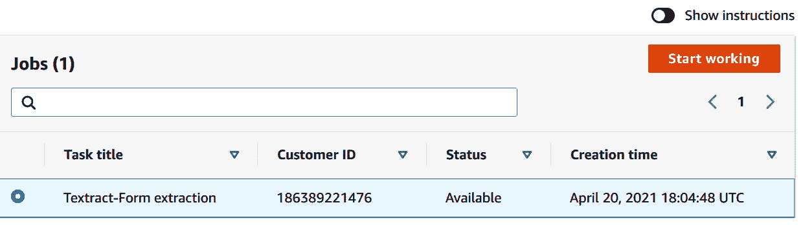

# 第十三章：*第十三章*：改善文档处理工作流的准确性

在上一章中，我们讨论了 AWS AI 服务，如**Amazon** **Textract**和**Amazon** **Comprehend Medical**，如何帮助快速自动化医疗工作流。在本章中，我们将讨论为什么在文档处理工作流中需要引入人工干预，并且如何通过设置**人类环节**（**HITL**）流程和**Amazon** **增强型 AI**（**Amazon A2I**）来提高现有文档处理工作流的准确性，尤其是在使用**Amazon** **Textract**时。

Amazon A2I 是一种托管服务，它使构建需要人工审阅**机器学习**（**ML**）预测的工作流变得简单。在本章中，我们将讨论以下主题：

+   设置 HITL 流程在文档处理中的必要性

+   了解使用 Amazon A2I 实现 HITL 工作流的好处

+   在您的文档处理管道中添加人工审阅

# 技术要求

本章需要您拥有一个**AWS** **账户**。请确保按照*第二章**《介绍 Amazon Textract》*中指定的*技术要求*部分中的说明创建您的 AWS 账户，并在尝试进行*改善文档处理工作流的准确性*的步骤之前，先登录到**AWS 管理控制台**。

我们解决方案的**Python**代码和示例数据集可以在以下链接找到：[`github.com/PacktPublishing/Natural-Language-Processing-with-AWS-AI-Services/tree/main/Chapter%2013`](https://github.com/PacktPublishing/Natural-Language-Processing-with-AWS-AI-Services/tree/main/Chapter%2013)。

查看以下视频，观看代码演示：[`bit.ly/3jBxBQq`](https://bit.ly/3jBxBQq)。

请按照以下各节中的说明，并结合代码库中的代码来构建解决方案。

# 设置 HITL 流程在文档处理中的必要性

在前几章中，我们已经讨论了如何使用 Amazon Textract 和 Amazon Comprehend 自动化现有的文档处理工作流，借助 AWS AI 服务。我们涵盖了一些关键应用场景，如使用 Comprehend 分析 SEC 备案报告，使用 Textract 从任何文档中提取文本或快速数字化任何文档。我们还谈到了这些 AI 服务如何为每个预测的文本、单词、行或实体提供置信度分数。现在，客户常常问的问题是如何改进这些预测，并确保它们的准确性。在大多数 AI 系统中，要么是 AI 完成自动化过程，要么只是人工或手动流程。

理想的场景是人类与 AI 协同工作，以便由人类审查这些 AI 系统预测的结果，确保其高度准确。这适用于我们在文档处理工作流中处理高度关键性信息的场景，例如处理贷款申请、发票处理、抵押贷款处理或法律文档审核等。在所有这些场景中，您都希望有人类来验证或审查机器学习或 AI 系统预测的贷款金额或发票金额是否准确，因为如果不准确，一个零可能改变您的生活！这可能导致公司损失数百万。此外，在低置信度预测的情况下，您还希望让人类审查员检查 AI 预测的信息。例如，在索赔处理的情况下，如果您的机器学习系统预测索赔的置信度较低，您会希望根据人工审核来决定是拒绝还是批准该索赔。人类与 AI/ML 的协同工作有助于建立对该过程的信任，同时也减少了整体文档处理解决方案的上市时间。

本节我们讲解了为何需要在现有文档处理工作流中设置人类审核循环——也就是，它有助于提高准确性并与 AI 系统建立信任。在下一节中，我们将讨论在设置 HITL 工作流时使用 Amazon A2I 的一些关键好处。

# 看到使用 Amazon A2I 进行 HITL 工作流的好处

Amazon A2I 是一项托管服务，使构建和管理与任何机器学习应用相关的人类审查变得更加简单。它直接与 Amazon Textract 和 **Amazon** **Rekognition** 集成，以设置适用于内容审核或文档处理等用例的人类工作流。您还可以使用任何 Sagemaker 模型创建自定义工作流。使用 Amazon A2I 的一些好处如下：

+   它提供了 70 多个 UI 模板，帮助您快速入门，设置人类审查的用户界面。请查看这里：[`github.com/aws-samples/amazon-a2i-sample-task-uis`](https://github.com/aws-samples/amazon-a2i-sample-task-uis)。

+   它缩短了 AI 系统的上市时间，因为您知道有人工审核作为后盾来捕捉低置信度评分。

+   它为您提供了选择劳动力的选项。我们所说的 *劳动力*，是指谁将审查创建的人类循环任务。A2I 提供了三种选择——私有劳动力、**Amazon** **Mechanical Turk** 和第三方供应商。Amazon Mechanical Turk 是一个全球分布的劳动力选项，供您使用。如果您有敏感数据，可以选择将自己的员工加入并使用私有劳动力选项。在本章中，我们将展示如何创建私有劳动力并在 Amazon A2I 中使用它。

我们已经讨论了一些好处，现在让我们深入了解 Amazon A2I 如何与任何 AWS AI 服务、您的自定义模型或通过 Sagemaker 部署的模型协同工作，下面是相关架构：


图 13.1 – Amazon A2I 架构

让我们通过逐步分析每个步骤来理解图示：

1.  您的客户端应用程序将数据或文档发送到您的 AWS AI 服务或任何自定义模型。

1.  AWS AI 服务，例如 Amazon Textract，或任何自定义机器学习模型，会进行预测。

1.  您可以与 ML 模型一起创建标准或阈值条件，以触发 Amazon A2I 的人工流程。在之前的架构中，阈值是高置信度预测，结果会立即返回给客户端应用程序。此阈值可以根据您的业务需求和用例进行设置，例如，检测到 99% 及以上的发票金额可以视为高置信度，因为它是高度关键的，要求非常准确。在提取某些实体（例如地点）时，您可以将 90% 视为高置信度水平，低于该水平时触发人工审核流程。

1.  低置信度预测，即低于您定义的阈值的预测，可以发送进行人工审核，人工审核者或您的工作人员将在由 Amazon A2I 管理的用户界面（UI）中查看。低置信度数据将在该 UI 中展示给人工审核者，他们将对低置信度预测进行审查，并进行增强、修正或验证。

1.  人工审核结果会保存在 Amazon S3 中，包含 AI 的预测结果以及人工修改或增强的部分。此数据可以视为*真实数据*，如果您使用自定义模型，它可以用来重新训练模型。您可以通过从增强数据集重新训练来自定义模型来提高其准确性。请参阅*进一步阅读*部分，了解有关如何实现这一点的博客参考。

从 Amazon S3，您修正或人工增强/验证后的 AI/ML 预测结果可以发送到客户端应用程序。

注意

使用 Amazon Textract，您只能增强或验证您的预测。当前不支持模型重新训练功能，因为 Amazon Textract 不支持自定义模型。然而，使用 Amazon Comprehend 的自定义分类和自定义实体，您可以使用 Amazon A2I 重新训练您的自定义模型并提高准确性。

在本节中，我们介绍了使用 Amazon A2I 的好处，并展示了它如何改善 AI/ML 系统的准确性。在接下来的部分，我们将指导您如何通过使用 Amazon Textract 和 Amazon A2I 设置文档处理工作流中的人工智能（HITL）流程。

# 向您的文档处理管道添加人工审核

我们已经介绍了 A2I 如何与任何 AWS AI 服务配合使用架构。在本节中，我们将专门讨论 Amazon A2I 如何与 Amazon Textract 集成，从而使您能够通过 HITL 自动化现有的文档工作流。我们还将展示如何使用 AWS 控制台设置人工审查工作流。

让我们首先来了解 Amazon A2I 如何与 Amazon Textract 协同工作：


图 13.2 – Amazon A2I 与 Amazon Textract 协同工作

您扫描的文档会发送到 Amazon Textract。Amazon Textract 会从文档中提取文本、键值对和表格。现在，对于这些提取的文本、键值对和表格，您还会获得置信度分数。您可以设置一个阈值，当达到该阈值时，Amazon A2I 会触发创建人工审查循环。您可以为 Amazon Textract 设置三个方面的阈值：

+   对于*键值对检测*中缺失的任何键，例如，如果在您审查的表单中邮寄地址是一个重要的键，但 AI 预测结果中缺失了该项。

+   您可以定义一个预测阈值，以便将其视为高置信度。

+   您可以发送**质量保证**（**QA**）审计的预测结果。

    注意

    Amazon Textract 和 Amazon A2I 在 API 中有原生集成，专门用于键值对或表单数据提取，如果您希望为 Amazon Textract 检测到的文本或表格数据设置人工审查，可以使用该集成。

您可以使用自定义的 A2I 用户界面模板，并通过 `starthumanloop` A2I API 设置循环，而不是使用 Textract API。当 Amazon A2I 启动人工审查 API 时，我们将添加如何设置自定义循环的示例（请参阅*进一步阅读*部分）：[`docs.aws.amazon.com/sagemaker/latest/dg/a2i-start-human-loop.html#a2i-instructions-starthumanloop`](https://docs.aws.amazon.com/sagemaker/latest/dg/a2i-start-human-loop.html#a2i-instructions-starthumanloop)。

让我们回到我们虚构的公司案例。该银行 LiveRight 想要数字化其支票处理系统。当前系统是手动审查支票金额和日期，这既耗时又容易出错。我们将展示 LiveRight 如何使用 Amazon Textract 和 Amazon A2I 来自动化其当前的支票处理系统。我们将使用这份示例支票文档：


图 13.3 – 示例支票

我们将使用这张支票来验证美元金额和日期，确保在向收款人发放之前准确无误。为此，我们将按照以下步骤操作：

+   创建一个 Amazon S3 存储桶

+   在 AWS 控制台中创建私人工作团队

+   在 AWS 控制台中创建人工审查工作流

+   通过调用 Amazon Textract API 将文档发送到 Amazon Textract 和 Amazon A2I

+   在 A2I 控制台中完成对文档的人工审查

+   在您的 S3 存储桶中查看结果

所以，让我们开始吧！

## 创建一个 Amazon S3 存储桶

首先，我们将讨论如何创建一个 Amazon S3 桶并上传示例文档，以便进行 Textract A2I 处理。正如我们在*图 13.1*的架构中所述，Amazon A2I 需要一个 Amazon S3 桶来存储人工注释结果。我们还将启用设置 A2I 循环所需的**跨源资源共享**（**CORS**）配置。

该配置允许 A2I 浏览器权限从此 S3 桶中下载资源。为此，请按照以下步骤操作：

1.  转到 Amazon S3 链接：[`s3.console.aws.amazon.com/s3/bucket/create?region=us-east-1`](https://s3.console.aws.amazon.com/s3/bucket/create?region=us-east-1)。

    然后，按照*第二章*中“*介绍 Amazon Textract*”的说明，创建一个名为`a2i-demos`的桶。

1.  创建桶后，将以下链接中的示例检查文件上传到桶：[`github.com/PacktPublishing/Natural-Language-Processing-with-AWS-AI-Services/blob/main/Chapter%2013/samplecheck.PNG`](https://github.com/PacktPublishing/Natural-Language-Processing-with-AWS-AI-Services/blob/main/Chapter%2013/samplecheck.PNG)。

1.  上传示例检查文件后，转到**Amazon S3 桶** | **权限**，然后向下滚动到**CORS**，然后复制并粘贴以下 CORS 配置：

    ```py
    [
        {
            "AllowedHeaders": [],
            "AllowedMethods": [
                "GET"
            ],
            "AllowedOrigins": [
                "*"
            ],
            "ExposeHeaders": []
        }
    ]
    ```

    你的 CORS 配置应该如下所示：


图 13.4 – 我们的 S3 A2I 输出桶的 CORS 配置

本节介绍了如何创建 S3 桶、上传示例检查文件并设置 CORS 配置。接下来，我们将设置私人工作团队。

## 在 AWS 控制台中创建私人工作团队

在本节中，我们将向你展示如何创建一个私人工作团队并使用你的电子邮件将自己添加为工作者：

1.  转到以下链接并选择**私人**：[`console.aws.amazon.com/sagemaker/groundtruth?region=us-east-1#/labeling-workforces`](https://console.aws.amazon.com/sagemaker/groundtruth?region=us-east-1#/labeling-workforces)。

1.  点击`demo-team`作为团队名称，向下滚动到**添加工作者**，输入你自己的有效电子邮件地址作为电子邮件地址，并在**组织名称字段**中输入你自己的组织：

    图 13.5 – 创建私人团队并添加工作者

1.  向下滚动并点击**创建私人团队**。

添加工作者到你创建的私人团队后，你将收到一封电子邮件。该邮件包含一个链接，可让你登录到 A2I 任务 UI 门户，并提供你的用户名和密码。

本节介绍了如何创建私人工作团队。接下来，让我们继续设置人工审核工作流。

## 在 AWS 控制台中创建人工审核工作流

在本节中，我们将展示如何使用 Amazon Textract 创建人工审核工作流。你需要在前面的章节中创建的 Amazon S3 存储桶和私人工作组，并且需要一个 UI 来显示审核和设置触发人工审核环节的阈值条件：

1.  访问此链接以创建人工审核工作流：[`console.aws.amazon.com/a2i/home?region=us-east-1#/create-human-review-workflows`](https://console.aws.amazon.com/a2i/home?region=us-east-1#/create-human-review-workflows)。

    在 `Textract-check` 中的 `s3://a2i-demos/`> 。对于**IAM 角色**，点击**创建新角色**并选择任意 S3 存储桶。你的设置应如下所示：

    

    图 13.6 – 使用 A2I 创建流程定义

1.  向下滚动并在**任务类型**中选择**Textract 键值对提取**。

1.  要触发人类审核，你可以选择至少一个条件或所有三个条件。对于缺失的 `$` 和 `0` 到 `90` 的置信度阈值，如下图所示：

    图 13.7 – 设置阈值以触发 Textract 的 A2I 循环

1.  现在，点击第二个条件的复选框，审核所有表单键的置信度分数在指定范围内，并输入 `0` 到 `90`。

    我们设置了三个触发条件中的两个条件，以便 Textract A2I 触发审核。只有在前述条件满足时，才会创建人类审核环节——也就是说，如果缺少任何键，比如美元金额和日期，或者任何表单键的置信度分数低于 90%。

1.  在 `textract-check-ui` 中。这是 Textract 表单与 A2I 集成的默认 UI。你可以使用自己的自定义 UI 并通过 API 将其添加，我们将在下一章进行讲解。

1.  在 `label the data`。

1.  向下滚动到**工作者**并选择**私人**，然后点击你刚刚创建的**私人**团队：

    图 13.8 – 在人工审核工作流设置中选择你的私人团队

1.  点击**创建**。这将创建一个人工流程定义。复制此流程定义的 ARN，我们将在满足此流程定义中定义的条件时，使用它来调用 Textract API 中的人类审核环节。

在本节中，我们展示了如何为人工审核环节创建流程定义。在下一节中，我们将展示如何在 Textract Analyze 文档 API 中触发此流程定义，同时传递文档。

## 通过调用 Amazon Textract API 将文档发送到 Amazon Textract 和 Amazon A2I

在本节中，我们将展示如何在 Textract Analyze 文档 API 中使用表单触发你刚刚创建的 A2I 流程定义。

如果你在前面的章节中没有进行此操作，首先需要创建一个`Chapter 13`文件夹，并打开`chapter13` `Improving` `accuracy` `of document processing` `.ipynb`笔记本：

注意

确保笔记本中的 IAM 角色具有 **AmazonTextractFullAccess** 权限（[`console.aws.amazon.com/iam/home?#/policies/arn:aws:iam::aws:policy/AmazonTextractFullAccess$jsonEditor`](https://console.aws.amazon.com/iam/home?#/policies/arn:aws:iam::aws:policy/AmazonTextractFullAccess%24jsonEditor)）和 **AmazonAugmentedAIFullAccess** 权限（[`console.aws.amazon.com/iam/home?#/policies/arn%3Aaws%3Aiam%3A%3Aaws%3Apolicy%2FAmazonAugmentedAIFullAccess`](https://console.aws.amazon.com/iam/home?#/policies/arn%3Aaws%3Aiam%3A%3Aaws%3Apolicy%2FAmazonAugmentedAIFullAccess)）。

1.  要开始，请转到这个笔记本并在以下笔记本单元格中输入你创建的 S3 桶名称：

    ```py
    bucket="<your s3 bucket name>"
    ```

1.  在 `humanLoopConfig` 中，粘贴从先前设置中复制的流程定义 ARN：

    ```py
    humanLoopConfig = {
        'FlowDefinitionArn':"<enter flow definition arn created> ",
        'HumanLoopName':"textract-10", 
        'DataAttributes': { 'ContentClassifiers': [ 'FreeOfPersonallyIdentifiableInformation' ]}
    }
    ```

1.  运行以下笔记本单元格，启动 HITL 配置，通过传递包含我们在控制台中创建的流程定义的`humanloopconfig json`，以便使用 A2I Analyze 文档 API：

    ```py
    response = textract.analyze_document(
            Document={'S3Object': {'Bucket': bucket,'Name':  "samplecheck.PNG"}},
            FeatureTypes=["FORMS"], 
            HumanLoopConfig=humanLoopConfig
        )
    ```

1.  运行此命令后，你将得到一个响应，其中包含**HumanLoopActivationConditionsEvaluationResults**，如以下截图所示：

    图 13.9 – Textract Analyze 文档 API 与 A2I 设置的 JSON 响应输出

1.  转到你创建的私有工作团队：[`console.aws.amazon.com/sagemaker/groundtruth?region=us-east-1#/labeling-workforces`](https://console.aws.amazon.com/sagemaker/groundtruth?region=us-east-1#/labeling-workforces)

    将工作团队的 ARN 复制并粘贴到笔记本单元格中，如下所示：

    ```py
    WORKTEAM_ARN= "enter your private workteam arn"
    ```

1.  运行以下代码块以导航到你的工作团队或 A2I 控制台：

    ```py
    workteamName = WORKTEAM_ARN[WORKTEAM_ARN.rfind('/') + 1:]
    ```

1.  你将获得一个链接。点击该链接，并使用在创建工作团队时收到的用户名和密码登录（通过你的电子邮件 ID）。你将看到你的 A2I 任务，如下图所示。点击**开始工作**：

    图 13.10 – 亚马逊 A2I 控制台屏幕，显示工作任务

1.  你将被重定向到调用 Textract A2I 循环时创建的任务：

    图 13.11 – A2I 控制台，显示从示例检查中 Textract 检测到的键值对

1.  你可以在这个 UI 门户的左侧看到原始样本检查，右侧显示提取的键值对。可以验证数据并在需要时输入更改。确保**$**金额和日期正确，然后点击**提交**。当你点击某个特定的键值时，可以看到 Textract 检测到的输出被映射到原始文档上（边框框映射）：

    图 13.12 – 在 A2I 控制台中查看和修正 Textract 响应

1.  增强和验证数值后，点击**提交**，你的输出将保存在你创建的同一个 S3 存储桶中。运行以下笔记本单元格以从 S3 获取 JSON 结果并查看注释结果：

    ```py
    for resp in completed_human_loops:
        splitted_string = re.split('s3://' + bucket  + '/', resp['HumanLoopOutput']['OutputS3Uri'])
        output_bucket_key = splitted_string[1]
        print(output_bucket_key)
        response = s3.get_object(Bucket= bucket, Key=output_bucket_key)
        content = response["Body"].read()
        json_output = json.loads(content)
        pp.pprint(json_output)
        print('\n')
    ```

    你将在以下截图中看到带有人类注释答案的输出：


图 13.13 – 人工修正的 A2I JSON 输出

本节内容为你提供了如何调用 Textract Analyze 文档 API 的笔记本操作指南，配置 HITL 以检测键值对或表单。

# 摘要

本章内容介绍了如何在使用 Amazon Textract 自动化文档工作流时提高现有文档处理工作流的准确性。我们介绍了 Amazon A2I 及其如何帮助提高文本预测的准确性，并且可以与 Amazon Textract 集成以设置人工审查工作流。我们还讨论了如何使用 A2I 和定制模型进行模型再训练以提高准确性，下一章将深入讲解这一部分内容。

为了进一步展示 A2I 的实际应用，我们还提供了一段 10 分钟的**YouTube**视频教程，由《深入阅读》部分提到的作者之一讲解。

# 深入阅读

+   *使用 Amazon Textract 与 Amazon A2I 处理关键文档* 由 Anuj Gupta, Talia Chopra 和 Pranav Sachdeva 编写：[`aws.amazon.com/blogs/machine-learning/using-amazon-textract-with-amazon-augmented-ai-for-processing-critical-documents//`](https://aws.amazon.com/blogs/machine-learning/using-amazon-textract-with-amazon-augmented-ai-for-processing-critical-documents//)

+   *了解如何在文档处理流程中添加人工审查* 由 Mona Mona 编写：[`www.youtube.com/watch?v=U2J_pq17POA`](https://www.youtube.com/watch?v=U2J_pq17POA)
