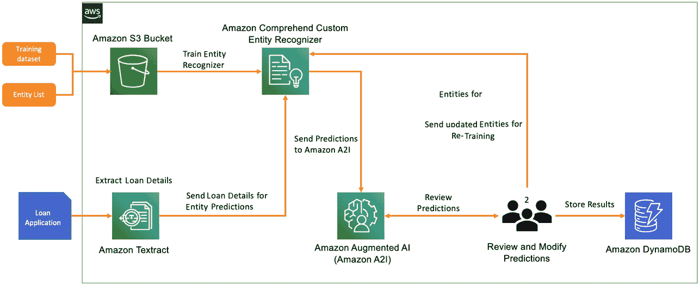
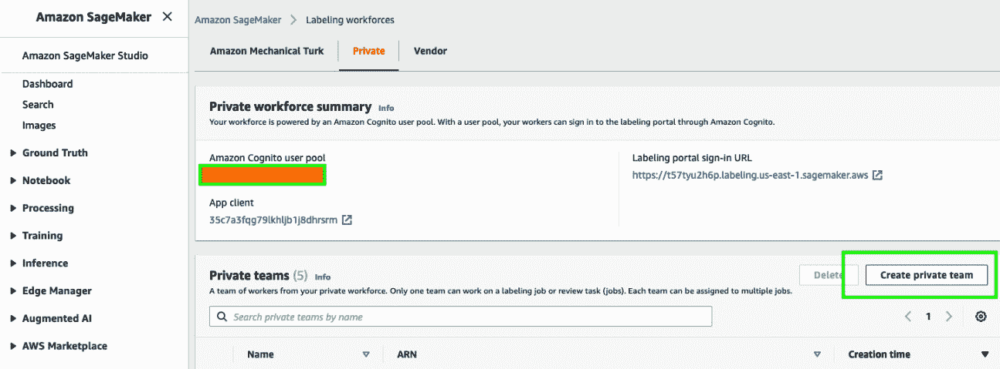
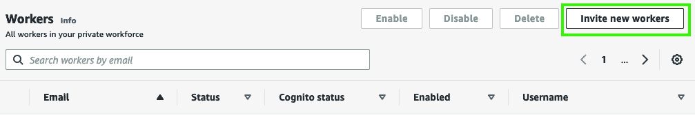
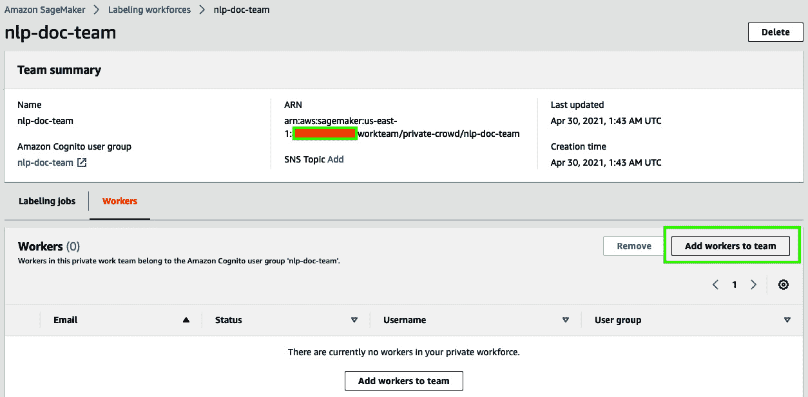
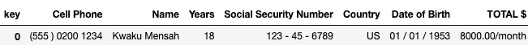
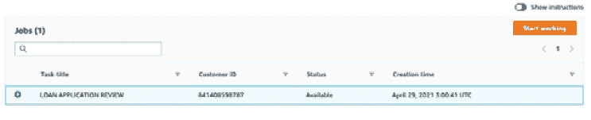
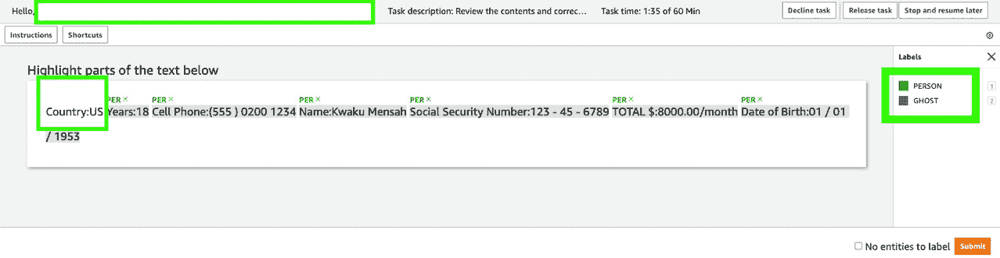
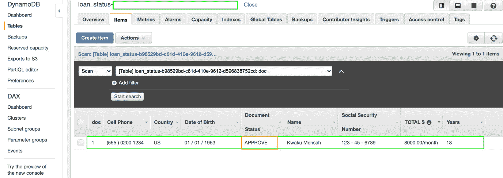

# 第十四章：*第十四章*：审计命名实体识别工作流

在前一章中，我们介绍了使用**Amazon** **Augmented AI**（**Amazon** **A2I**）来提高从文档中提取结果准确性的方案。我们看到，Amazon A2I 可以添加到文档处理工作流中，以审核模型预测的准确性。这使我们能够在 LiveRight 的检查处理系统中包含人工审核。

本章将通过将**Amazon** **Comprehend** 用于基于文本的洞察扩展前述方法，从而演示如何为您的自定义命名实体识别用例设置审计工作流的端到端过程。我们根据集体经验和在职业生涯中观察到的使用趋势，整理了这个解决方案。我们预计在本章过程中将进行实际操作，但我们已经准备好了所有需要的代码示例。

通过**机器学习**（**ML**），企业可以建立自动化文档处理解决方案，经过训练后能够识别并提取文档中的自定义实体。这有助于从文本语料库中获得独特的洞察力，从而推动战略决策。然而，首先需要应对一些挑战。通常，企业会接收到大量格式不同、内容各异的文档，且文档可能是多语言的。而且，随着企业的发展，文档的类型和数量也在不断变化，很快就会进入一种维护负担的状态，需要不断调整各种模板、格式和规则，以确保它们与操作需求的使用方式同步。此外，还必须确保基础设施能够扩展以支持处理需求。

为了解决这些挑战，我们将展示如何利用**Amazon** **Textract**的现成机器学习功能，借助迁移学习创建一个自定义实体识别模型，并通过使用 A2I 审核预测结果，结合人工审核循环。我们在*第十三章*《提高文档处理工作流准确性》中详细介绍了 Amazon A2I。在本章中，我们将按照以下几个部分展开：

+   贷款申请认证

+   构建贷款认证解决方案

# 技术要求

对于本章，您需要访问**AWS** **账户**，可以通过[`aws.amazon.com/console/`](https://aws.amazon.com/console/)进行访问。有关如何注册 AWS 账户并登录到**AWS** **Management Console**的详细说明，请参考*第二章*《介绍 Amazon Textract》中的*注册 AWS 账户*子部分。

本章讨论的解决方案的**Python**代码和示例数据集可以在以下链接找到：[`github.com/PacktPublishing/Natural-Language-Processing-with-AWS-AI-Services/tree/main/Chapter%2014`](https://github.com/PacktPublishing/Natural-Language-Processing-with-AWS-AI-Services/tree/main/Chapter%2014)。

查看以下视频以查看代码在[`bit.ly/3GoBh1B`](https://bit.ly/3GoBh1B)中的运行情况。

# 认证贷款申请

每天，金融机构收到大量的贷款申请。虽然主要的机构已经转向完全数字化处理，但世界各地仍有许多银行和机构依赖纸质文档。为了说明我们的例子，让我们回到我们的虚构银行公司*LiveRight Holdings Private Limited*，并审查此用例的要求：

+   LiveRight 向其主要是中小型企业和个人消费者的客户提供多种借贷产品。为了申请贷款，消费者填写基于纸张的贷款/抵押贷款申请表格，由专家团队验证申请的真实性（称为*真实性检查*过程）。如果被确认为有效申请人，LiveRight 的贷款处理人员将要求消费者提交支持文件以进行预批准资格。

+   LiveRight 每天从潜在客户处收到 8,000 至 10,000 份贷款申请。这些申请每晚从公司各分支机构转发至总部的文档入口中心。今天，他们的真实性检查过程需要团队大约 2 到 4 周的时间扫描所有申请，并确定是否足够好以转发给贷款处理人员，甚至在预批准阶段也造成了显著的延迟。这引起了许多客户的不满，他们正在将业务转移到其他地方。LiveRight 已经聘请您自动化真实性检查流程，并希望在解决方案实施的头三个月内将处理时间缩短至 24 小时以内。

作为项目的企业架构师，您决定使用 Amazon Textract 来利用其预训练的 ML 模型进行文本提取，使用 Amazon Comprehend 的**自定义实体识别器**功能逐步创建自己的实体识别器，用于贷款申请检查，无需构建复杂的**自然语言处理**（**NLP**）算法，以及使用 A2I 设置人工审查工作流程，监视实体识别器的预测，并向识别器发送反馈，以改善其检测独特用例的实体能力。

您计划在前 2 到 3 个月内提供私有人工工作流，然后禁用它，此时文档处理工作流将完全自动化。当人工团队检查并更新实体标签时，您需要确定真实性检查决策，决策结果为*批准*、*总结批准*或*拒绝*。该决策以及贷款申请中的相关内容应存储在**Amazon** **DynamoDB**（一项完全托管的低延迟**NoSQL**数据库服务）表中，以供贷款处理人员访问内容并启用预审批资格。我们将构建的解决方案组件如下图所示：



图 14.1 – 贷款审批文档处理解决方案架构

我们将使用**Amazon** **SageMaker** **Jupyter** **notebook**来逐步执行代码并查看结果，从而引导我们走完整个解决方案流程。该解决方案的构建包括以下任务：

1.  作为第一步，我们将根据 GitHub 仓库中提供的训练数据集创建 Amazon Comprehend 自定义实体识别器。

1.  接下来，我们将创建一个私有标签团队，并添加一名团队成员，负责使用 Amazon A2I 服务来审查 Amazon Comprehend 自定义实体识别器的预测结果。我们将使用 Amazon SageMaker 控制台中的*标签*团队功能来创建私有团队。有关详细信息，请参考此链接：[`docs.aws.amazon.com/sagemaker/latest/dg/sms-workforce-private.html`](https://docs.aws.amazon.com/sagemaker/latest/dg/sms-workforce-private.html)。

1.  我们通过检查在 GitHub 仓库中提供的示例贷款申请来开始解决方案工作流程。我们在笔记本中展示贷款申请的图片并查看其内容。

1.  然后，我们使用 Amazon Textract 从输入文档中提取键值对。

1.  然后，我们从键值对创建一个推理请求字符串，并准备将其发送到 Amazon Comprehend 自定义实体检测。

1.  接下来，我们设置一个 Amazon Comprehend 实时终端节点，并调用它来检测我们的推理请求字符串中的实体。

1.  我们将使用实体识别任务 UI 模板设置 Amazon A2I 人工审查循环，并将自定义实体检测的结果发送到 Amazon A2I 人工循环。

1.  以私有工作者身份登录后，我们将审查检测到的实体，并根据需要修改标签。

1.  接下来，我们将检查是否发生了新的实体检测事件，或者是否修改了现有的实体检测，更新实体列表，并将其发送回 Amazon Comprehend 进行实体检测模型的再训练。

1.  基于人工审查循环的输出，我们还将为贷款申请做出决定，并将此信息上传到**DynamoDB** 表中，以便后续处理。

现在我们已经了解了练习的背景并讨论了预定的流程，让我们开始构建解决方案。

# 构建贷款认证解决方案

在前面的部分，我们介绍了贷款申请审批的用例，讲解了我们将要构建的解决方案架构，并简要地介绍了解决方案组件和工作流程步骤。在本节中，我们将直接开始执行任务，构建我们的解决方案。但首先，我们需要处理一些先决条件。

## 设置以解决用例

如果您在之前的章节中尚未完成，您首先需要创建一个 Jupyter notebook，并为该 notebook 角色设置**身份与访问管理**（**IAM**）权限，以便访问我们将在本笔记本中使用的 AWS 服务。之后，您需要克隆 GitHub 仓库（[`github.com/PacktPublishing/Natural-Language-Processing-with-AWS-AI-Services`](https://github.com/PacktPublishing/Natural-Language-Processing-with-AWS-AI-Services)），创建一个**Amazon** **S3** 存储桶（[`aws.amazon.com/s3/`](https://aws.amazon.com/s3/)），并在笔记本中提供存储桶名称以开始执行。在我们可以执行笔记本单元格之前，请按照以下步骤完成这些任务：

注意：

请确保您已完成*技术要求*部分提到的任务。

1.  要创建您的 Jupyter Notebook 实例，请按照*第二章*中*设置您的 AWS 环境*部分的**创建 Amazon SageMaker Jupyter Notebook 实例**一节的说明操作，*介绍 Amazon Textract*。

    创建 Amazon SageMaker Jupyter 笔记本时的 IAM 角色权限

    在创建笔记本时接受默认的 IAM 角色，以便访问任何 S3 存储桶。

1.  一旦您创建了笔记本实例并且其状态为**服务中**，点击**操作**菜单中的**打开 Jupyter**，进入笔记本实例。

1.  这将带您进入笔记本实例的**主页**文件夹。

1.  点击**新建**，并选择**终端**。

1.  在`cd SageMaker`中输入，然后输入`git clone` [`github.com/PacktPublishing/Natural-Language-Processing-with-AWS-AI-Services`](https://github.com/PacktPublishing/Natural-Language-Processing-with-AWS-AI-Services)。

1.  现在，退出终端窗口，返回到`Natural-Language-Processing-with-AWS-AI-Services`。点击该文件夹以显示章节文件夹，再点击`Chapter 14`。点击该文件夹打开。您应该能看到名为`chapter14-auditing-workflows-named-entity-detection-forGitHub.ipynb`的笔记本。

1.  点击打开该笔记本。

按照本笔记本中本节下几小节对应的步骤，逐一执行每个单元格。请阅读每个笔记本单元格前提供的描述。

## 额外的 IAM 先决条件

为了训练 Comprehend 自定义实体识别器，设置实时端点，我们必须启用额外的策略，并更新我们的 SageMaker 笔记本角色的信任关系。请参考*第二章*中《*设置 AWS 环境*》章节里的*更改 IAM 权限和信任关系以支持 Amazon SageMaker Notebook 执行角色*部分，了解如何执行以下步骤的详细说明：

1.  请将`TextractFullAccess`、`ComprehendFullAccess`和`AmazonAugmentedAIFullAccess`策略附加到你的 Amazon SageMaker Notebook IAM 角色。

1.  向你的 SageMaker 笔记本执行角色添加`IAM:PassRole`权限作为内联策略：

    ```py
    { "Version": "2012-10-17", "Statement": [ {
      "Action": [
          "iam:PassRole"
      ],
      "Effect": "Allow",
      "Resource": "<your sagemaker notebook execution role ARN">
      }
     ]
    }
    ```

1.  最后，更新信任关系：

    ```py
    { "Version": "2012-10-17", "Statement": [
      { "Effect": "Allow", 
        "Principal": 
          { "Service": 
              [ "sagemaker.amazonaws.com", 
                "s3.amazonaws.com", 
                "comprehend.amazonaws.com" ] 
              }, 
              "Action": "sts:AssumeRole" } 
          ] 
      }
    ```

现在我们已经设置好了笔记本并配置了 IAM 角色来运行示范笔记本，在接下来的部分，我们将训练一个 Amazon Comprehend 实体识别器。

## 训练 Amazon Comprehend 自定义实体识别器

让我们开始训练一个自定义实体识别器，检测本解决方案特有的实体。Amazon Comprehend 提供了我们在上一章学习过的预训练实体识别功能。对于本解决方案，我们将使用 Amazon Comprehend 的**自定义实体识别**功能，它允许你使用增量训练训练一个适应自定义需求的识别器。我们所需要做的就是提供一个我们希望它识别的实体列表，以及包含文本行的原始数据集，这些文本行构成了将被识别为实体的上下文。打开笔记本并按照以下步骤执行：

1.  执行**步骤 0 - 导入库**下的单元，确保我们为笔记本准备好了所需的库。请注意，在此单元中，你将获取到用于笔记本的 Amazon SageMaker 执行角色，以及 SageMaker 会话。请确保你创建了一个 Amazon S3 存储桶（[`docs.aws.amazon.com/AmazonS3/latest/userguide/create-bucket-overview.html`](https://docs.aws.amazon.com/AmazonS3/latest/userguide/create-bucket-overview.html)），并在下面的行中提供存储桶名称：

    ```py
    bucket = '<bucket-name>'
    ```

1.  执行`boto3`处理的单元，以便在 Amazon Comprehend 下运行：

    ```py
    comprehend = boto3.client('comprehend')
    ```

    b) 然后，定义 S3 前缀的变量并将训练数据集和实体列表上传到 S3 存储桶：

    ```py
    s3_raw_key = prefix + "/train/raw_txt.csv" 
    s3_entity_key = prefix + "/train/entitylist.csv"
    s3.upload_file('train/raw_txt.csv',bucket,s3_raw_key)
    s3.upload_file('train/entitylist.csv',bucket,s3_entity_key)
    ```

    c) 继续执行笔记本中的其余单元，声明包含我们输入文档的完整 S3 **URI**的变量，定义实体识别器的输入对象，最后调用 Comprehend API 来创建自定义实体识别器。这将启动训练任务：

    ```py
    import datetime
    cer_name = "loan-app-recognizer"+str(datetime.datetime.now().strftime("%s"))
    cer_response = comprehend.create_entity_recognizer(
            RecognizerName = cer_name, 
            DataAccessRoleArn = role,
            InputDataConfig = cer_input_object,
            LanguageCode = "en"
    )
    ```

    d) 打印自定义实体识别器训练任务的结果：

    ```py
    import pprint
    pp = pprint.PrettyPrinter(indent=4)
    response = comprehend.describe_entity_recognizer(
        EntityRecognizerArn=cer_response['EntityRecognizerArn']
    )
    pp.pprint(response)
    ```

1.  定期访问 Amazon Comprehend AWS 控制台 ([`console.aws.amazon.com/comprehend/v2/home?region=us-east-1#entity-recognition`](https://console.aws.amazon.com/comprehend/v2/home?region=us-east-1#entity-recognition)) 检查训练作业的状态。训练过程大约需要 15 到 30 分钟。可以趁此时间喝杯咖啡或小吃一下。

## 创建用于人工环节的私有团队

请参阅笔记本中的 *第 2 步* ([`github.com/PacktPublishing/Natural-Language-Processing-with-AWS-AI-Services/blob/main/Chapter%2014/chapter14-auditing-workflows-named-entity-detection-forGitHub.ipynb`](https://github.com/PacktPublishing/Natural-Language-Processing-with-AWS-AI-Services/blob/main/Chapter%2014/chapter14-auditing-workflows-named-entity-detection-forGitHub.ipynb))，以获取我们现在要执行的指令。

在此步骤中，我们将使用 Amazon SageMaker 标注工作团队控制台创建一个私有团队，并将自己添加为该私有团队的工作人员。这样做是为了在我们进入此解决方案中的 Amazon A2I 步骤时，能够登录到标注任务的用户界面。请执行以下任务：

1.  如果尚未登录 AWS 管理控制台，请登录（更多详细信息，请参考本章开头的 *技术要求* 部分），在 **服务** 搜索栏中输入 `amazon sagemaker`，然后进入 Amazon SageMaker 控制台。进入后，在 UI 左侧点击 **Ground Truth**，再点击 **Labeling workforces**。在此页面，选择顶部标签中的 **Private**，然后点击 **Create private team**。

    图 14.2 – SageMaker 标注工作团队

1.  在 **Team name** 字段中输入您的私有团队名称，并在 **Add workers** 部分保持默认选择 **Create a new Amazon Cognito user group**。向下滚动并点击 **Create private team**。

1.  现在您将返回到 `nlp-doc-team`，应该可以在 `arn:aws:sagemaker:region-name-123456:workteam/private-crowd/team-name` 下看到它。请从屏幕上复制 ARN 并在笔记本单元格中提供：

    ```py
    WORKTEAM_ARN= '<workteam-arn>'
    ```

1.  接下来，向下滚动到前一页面，进入 `no-reply@verificationemail.com`。按照指示完成注册过程。

    图 14.3 – 邀请新工作人员

1.  接下来，通过点击 **nlp-doc-team**，再点击 **Add workers to team**，将自己添加到私有团队中。从列表中选择您的电子邮件地址，然后点击 **Add workers to team**。



图 14.4 – 向团队添加工作人员

现在我们已经添加了私有团队，让我们通过使用 Amazon Textract 提取内容来审阅我们的贷款申请。

## 使用 Amazon Textract 提取样本文档内容

本节对应于笔记本中的*步骤 3*：[`github.com/PacktPublishing/Natural-Language-Processing-with-AWS-AI-Services/blob/main/Chapter%2014/chapter14-auditing-workflows-named-entity-detection-forGitHub.ipynb`](https://github.com/PacktPublishing/Natural-Language-Processing-with-AWS-AI-Services/blob/main/Chapter%2014/chapter14-auditing-workflows-named-entity-detection-forGitHub.ipynb)。

在此步骤中，我们将回顾示例贷款申请，然后使用 Amazon Textract 提取我们解决方案所关注的关键值对或表单数据，创建推理请求 CSV 文件，并将其作为输入传递给我们的 Comprehend 自定义实体识别器以检测实体。请通过笔记本逐步执行，并运行单元格以完成此步骤所需的任务：

1.  通过执行笔记本单元格中的代码来查看输入文档，如下所示：

    ```py
    documentName = "input/sample-loan-application.png"
    display(Image(filename=documentName))
    ```

1.  现在让我们将此图像加载到我们的 S3 存储桶中：

    ```py
    s3.upload_file(documentName,bucket,prefix+'/'+documentName)
    ```

1.  我们将从此文档中提取关键值对数据，转换并创建一个用于推理的请求字符串，使用 Amazon Textract 的**AnalyzeDocument** API。此 API 接受图像文件（PNG 或 JPEG）作为输入。如果要使用 PDF 文件或处理多个文档，可以使用**StartDocumentAnalysis** API：[`docs.aws.amazon.com/textract/latest/dg/API_StartDocumentAnalysis.html`](https://docs.aws.amazon.com/textract/latest/dg/API_StartDocumentAnalysis.html)。

1.  我们将使用`amazon-textract-response-parser`库来处理来自 Textract 的 JSON 响应。通过输入以下命令进行安装：

    ```py
     !pip install amazon-textract-response-parser        
    ```

1.  现在，让我们使用 Textract 的`boto3` Python SDK 来检索文档内容，如下所示：

    ```py
    textract = boto3.client('textract')
    response = textract.analyze_document(Document={'S3Object': {
                'Bucket': bucket,
                'Name': prefix+'/'+documentName
            }}, FeatureTypes=['FORMS'])
    ```

1.  我们现在将提取我们解决方案所需的关键值对。我们将不使用复选框字段，仅使用那些有值的字段。同时，我们将在接下来的步骤中筛选出我们实际需要的字段：

    ```py
    from trp import Document
    doc = Document(response)
    df = pd.DataFrame()
    # Iterate over elements in the document
    x = 0
    for page in doc.pages:
        for field in page.form.fields:   
            if field.key is not None and field.value is not None:
                if field.value.text not in ('SELECTED','NOT_SELECTED'):
                    df.at[x,'key'] = field.key.text
                    df.at[x,'value'] = field.value.text
                    x+=1
    df
    ```

1.  现在，我们已经将 Textract 的结果加载到**p****andas** **DataFrame**中（[`pandas.pydata.org/docs/reference/api/pandas.DataFrame.html`](https://pandas.pydata.org/docs/reference/api/pandas.DataFrame.html)），接下来我们将运行一系列操作，从贷款申请中筛选出我们感兴趣的列。请执行笔记本中*Extract contents for sending to Comprehend CER*部分下的所有单元格。最终，我们应该会看到如下所示的过滤字段列表：



图 14.5 – 我们将用于 Comprehend 实体识别的最终字段列表

现在，让我们讨论如何使用 Amazon Comprehend 自定义实体识别器来检测实体。

## 使用 Amazon Comprehend 自定义实体识别器检测实体

现在我们已经从贷款申请中获得所需的内容，让我们构造一个字符串，该字符串将成为我们向最初训练的 Comprehend 自定义实体识别器发送的推理请求（笔记本中的*第 1 步*）。在检测实体之前，我们需要创建一个实时端点，并将其与我们的实体识别器关联。当你以批处理模式部署此解决方案或用于处理多个文档时，将使用 Amazon Comprehend **StartEntitiesDetection** API：[`docs.aws.amazon.com/comprehend/latest/dg/API_StartEntitiesDetectionJob.html`](https://docs.aws.amazon.com/comprehend/latest/dg/API_StartEntitiesDetectionJob.html)。

请按照本节中的说明执行笔记本中的*第 4 步*单元：[`github.com/PacktPublishing/Natural-Language-Processing-with-AWS-AI-Services/blob/main/Chapter%2014/chapter14-auditing-workflows-named-entity-detection-forGitHub.ipynb`](https://github.com/PacktPublishing/Natural-Language-Processing-with-AWS-AI-Services/blob/main/Chapter%2014/chapter14-auditing-workflows-named-entity-detection-forGitHub.ipynb)：

1.  我们现在将创建一个请求字符串，该字符串将发送到 Amazon Comprehend 自定义实体识别器模型，用于检测我们训练过的实体。这一字符串包含了我们在上一步骤中使用 Amazon Textract 从贷款申请文档中提取的数据。我们将转置 pandas DataFrame，添加一个文档编号列，并用它来准备推理请求字符串：

    ```py
    df_T.columns = df_T.columns.str.rstrip()
    df_T['doc'] = 1
    df_T
    for idx, row in df_T.iterrows():
            entry = 'Country'+':'+str(row['Country']).strip()+" "+'Years'+':'+str(row['Years']).strip()+" "+'Cell Phone'+':'+str(row['Cell Phone']).strip()+" "+'Name'+':'+str(row['Name']).strip()+" "+'Social Security Number'+':'+str(row['Social Security Number']).strip()+" "+'TOTAL $'+':'+str(row['TOTAL $']).strip()+" "+'Date of Birth'+':'+str(row['Date of Birth']).strip()
    ```

1.  接下来，让我们为 Comprehend 创建一个实时端点：

    ```py
    custom_recognizer_arn=cer_response['EntityRecognizerArn']
    endpoint_response = comprehend.create_endpoint(
        EndpointName='nlp-chapter4-cer-endpoint',
        ModelArn=custom_recognizer_arn,
        DesiredInferenceUnits=2,
        DataAccessRoleArn=role
    )
    endpoint_response['EndpointArn']
    ```

1.  我们看到端点 Arn 如下所示：

    ```py
    arn:aws:comprehend:us-east-1:<aws-account-nr>:entity-recognizer-endpoint/nlp-chapter4-cer-endpoint
    ```

1.  通过导航到 **Amazon Comprehend** 控制台，进入左侧菜单中的 **自定义实体识别**，点击你的识别器，然后向下滚动验证实时端点是否成功创建来检查端点的状态。如果端点未激活，笔记本中下一个单元的代码将失败。端点准备好可能需要约*15 分钟*：图 14.6 – 等待端点准备就绪

    

    图 14.6 – 等待端点准备就绪

1.  当端点**准备就绪**时，执行笔记本单元中的代码，将推理请求发送到自定义实体识别器，如下所示：

    ```py
    response = comprehend.detect_entities(Text=entry,
                        LanguageCode='en',
    EndpointArn=endpoint_response['EndpointArn']
                )
    print(response)
    ```

1.  我们看到的输出如下所示。此显示表明我们的 Comprehend 实体识别已识别出所有代表有效人的属性：

    ```py
    {'Entities': [{'Score': 0.9999999403953552, 'Type': 'PERSON', 'Text': 'Years:18', 'BeginOffset': 11, 'EndOffset': 19}, {'Score': 0.9999998211860657, 'Type': 'PERSON', 'Text': 'Cell Phone:(555 ) 0200 1234', 'BeginOffset': 20, 'EndOffset': 47}, {'Score': 1.0, 'Type': 'PERSON', 'Text': 'Name:Kwaku Mensah', 'BeginOffset': 48, 'EndOffset': 65}, {'Score': 1.0, 'Type': 'PERSON', 'Text': 'Social Security Number:123 - 45 - 6789', 'BeginOffset': 66, 'EndOffset': 104}, {'Score': 1.0, 'Type': 'PERSON', 'Text': 'TOTAL $:8000.00/month', 'BeginOffset': 105, 'EndOffset': 126}, {'Score': 1.0, 'Type': 'PERSON', 'Text': 'Date of Birth:01 / 01 / 1953', 'BeginOffset': 127, 'EndOffset': 155}], 'ResponseMetadata': {'RequestId': 'ecbd75fd-22bc-4dca-9aa0-73f58f6784e4', 'HTTPStatusCode': 200, 'HTTPHeaders': {'x-amzn-requestid': 'ecbd75fd-22bc-4dca-9aa0-73f58f6784e4', 'content-type': 'application/x-amz-json-1.1', 'content-length': '620', 'date': 'Tue, 06 Jul 2021 22:26:11 GMT'}, 'RetryAttempts': 0}}
    ```

1.  *第 4 步*中的最后一个任务是准备一个 `human_loop_input` 列表，以便与我们将在下一步中创建的 Amazon A2I 人工工作流一起使用：

    ```py
    import json
    human_loop_input = []
    data = {}
    ent = response['Entities']
    existing_entities = []
    if ent != None and len(ent) > 0:
        for entity in ent:       
            current_entity = {}
            current_entity['label'] = entity['Type']
            current_entity['text'] = entity['Text']
            current_entity['startOffset'] = entity['BeginOffset']
            current_entity['endOffset'] = entity['EndOffset']
            existing_entities.append(current_entity)
        data['ORIGINAL_TEXT'] = entry
        data['ENTITIES'] = existing_entities   
        human_loop_input.append(data)
    print(human_loop_input)        
    126}, {'label': 'PERSON', 'text': 'Date of Birth:01 / 01 / 1953', 'startOffset': 127, 'endOffset': 155}]}]
    ```

在本节中，我们能够使用 Amazon Comprehend 实体识别器检测实体。在下一节中，我们将介绍如何使用 Amazon A2I 审查预测并对预测实体与实际实体之间的差异进行修改。

## 设置 Amazon A2I 人工工作流循环

有关这里讨论的代码块，请参阅笔记本中的*步骤 5*：[`github.com/PacktPublishing/Natural-Language-Processing-with-AWS-AI-Services/blob/main/Chapter%2014/chapter14-auditing-workflows-named-entity-detection-forGitHub.ipynb`](https://github.com/PacktPublishing/Natural-Language-Processing-with-AWS-AI-Services/blob/main/Chapter%2014/chapter14-auditing-workflows-named-entity-detection-forGitHub.ipynb)。

现在，我们已经从 Comprehend 自定义实体识别器中获取了检测到的实体，是时候使用我们在*步骤 2*中创建的*私人团队*设置人工工作流，并将结果发送到亚马逊 A2I 人工循环进行审查，以及根据需要进行修改/增强。随后，我们将更新最初用于训练 Comprehend 自定义实体识别器的`entitylist.csv`文件，以便根据人工反馈准备重新训练：

1.  我们首先初始化一些接下来任务所需的变量：

    ```py
    timestamp = time.strftime("%Y-%m-%d-%H-%M-%S", time.gmtime())
    # Amazon SageMaker client
    sagemaker = boto3.client('sagemaker')
    # Amazon Augment AI (A2I) client
    a2i = boto3.client('sagemaker-a2i-runtime')
    # Flow definition name
    flowDefinition = 'fd-nlp-chapter14-' + timestamp
    # Task UI name - this value is unique per account and region. You can also provide your own value here.
    taskUIName = 'ui-nlp-chapter14-' + timestamp
    # Flow definition outputs
    OUTPUT_PATH = f's3://' + bucket + '/' + prefix + '/a2i-results'
    ```

1.  现在，我们将通过执行笔记本中的下一个单元格来创建人工任务的用户界面（参见笔记本中的*步骤 5*）。我们从亚马逊 A2I 示例任务 UI GitHub 仓库（[`github.com/aws-samples/amazon-a2i-sample-task-uis`](https://github.com/aws-samples/amazon-a2i-sample-task-uis)）选择了命名实体识别任务模板，并根据我们的需求进行了自定义。

1.  基于模板创建任务 UI：

    ```py
    def create_task_ui():
        '''
        Creates a Human Task UI resource.
        Returns:
        struct: HumanTaskUiArn
        '''
        response = sagemaker.create_human_task_ui(
            HumanTaskUiName=taskUIName,
            UiTemplate={'Content': template})
        return response
    # Create task UI
    humanTaskUiResponse = create_task_ui()
    humanTaskUiArn = humanTaskUiResponse['HumanTaskUiArn']
    print(humanTaskUiArn)
    ```

1.  我们得到如下所示的输出：

    ```py
    arn:aws:sagemaker:us-east-1:<aws-account-nr>:human-task-ui/ui-nlp-chapter14-<timestamp>
    ```

1.  执行笔记本中的接下来几个单元格，以创建**亚马逊 A2I 流程定义**，该定义管理任务分配给工作团队的编排以及输出数据的收集。我们现在准备启动人工工作流循环。执行笔记本中的下一个代码块以启动人工循环。

1.  通过执行笔记本中下一个单元格的代码来检查您的人工循环状态——它应该是`InProgress`：

    ```py
    completed_human_loops = []
    a2i_resp = a2i.describe_human_loop(HumanLoopName=humanLoopName)
    print(f'HumanLoop Name: {humanLoopName}')
    print(f'HumanLoop Status: {a2i_resp["HumanLoopStatus"]}')
    print(f'HumanLoop Output Destination: {a2i_resp["HumanLoopOutput"]}')
    print('\n')
    if a2i_resp["HumanLoopStatus"] == "Completed":
        completed_human_loops.append(resp)
    ```

1.  我们得到如下所示的输出：

    ```py
    HumanLoop Name: 0fe076a4-b6eb-49ea-83bf-78f953a71c89
    HumanLoop Status: InProgress
    HumanLoop Output Destination: {'OutputS3Uri': 's3://<your-bucket-name>/chapter4/a2i-results/fd-nlp-chapter4-2021-07-06-22-32-21/2021/07/06/22/33/08/<hashnr>/output.json'
    ```

在下一节中，我们将演示您的私人审查员如何登录到控制台并审查亚马逊 Comprehend 检测到的实体。

## 审查和修改检测到的实体

现在，我们将登录到**亚马逊 A2I 任务 UI**，审查、修改并重新标注从 Comprehend 自定义实体识别器中检测到的实体。根据本节讨论的指示执行笔记本中的单元格：

1.  让我们登录到工作门户以审查预测并根据需要修改它们。执行以下代码以获取我们的任务 UI 的 URL：

    ```py
    workteamName = WORKTEAM_ARN[WORKTEAM_ARN.rfind('/') + 1:]
    print("Navigate to the private worker portal and do the tasks. Make sure you've invited yourself to your workteam!")
    print('https://' + sagemaker.describe_workteam(WorkteamName=workteamName)['Workteam']['SubDomain'])
    ```

1.  登录后，您将看到一个**贷款申请审核**任务。选择它并点击**开始工作**：

    图 14.7 – 亚马逊 A2I 任务列表

1.  您应该能够看到亚马逊 A2I 标签 UI，其中显示了由 Comprehend 自定义实体识别高亮的实体列表及其标签，如下图所示：

    图 14.8 – Amazon A2I 标签界面准备好进行人工审核

1.  现在，从右侧的标签中选择**GHOST**标签，然后将其分配给 UI 中未标记的**Country:US**条目，并点击**提交**。图 14.9 – 向检测到的实体添加/修改标签并点击提交

    图 14.9 – 向检测到的实体添加/修改标签并点击提交

1.  继续执行笔记本中的单元格，再次检查人工环路的状态（这应该显示`entitylist.csv`文件的状态，并触发我们 Comprehend 自定义实体识别器的再训练。让我们验证是否存在新实体：

    ```py
    retrain='N'
    el = open('train/entitylist.csv','r').read()
    for annotated_entity in a2i_entities:
        if original_text[annotated_entity['startOffset']:annotated_entity['endOffset']] not in el:
            retrain='Y'
            word = '\n'+original_text[annotated_entity['startOffset']:annotated_entity['endOffset']]+','+annotated_entity['label'].upper()
            print("Updating Entity List with: " + word)
            open('train/entitylist.csv','a').write(word)
    if retrain == 'Y':
        print("Entity list updated, model to be retrained")
    ```

1.  我们看到如下代码块显示的输出。尽管 Comprehend 将`Years`和`Cell Phone`识别为`PERSON`实体，但它并未出现在原始的`entitylist.csv`文件中，因此它将与这些值一起更新，并且 Comprehend 实体识别将重新训练：

    ```py
    Updating Entity List with: 
    Country:US,GHOST
    Updating Entity List with: 
    Years:18,PERSON
    Updating Entity List with: 
    Cell Phone:(555 ) 0200 1234,PERSON
    Entity list updated, model to be retrained
    ```

此响应会自动保存为 Amazon S3 存储桶中的 JSON 文件，格式为标签。在下一部分，我们将使用这些修改或审核过的标签来重新训练我们的自定义实体识别器模型。

## 重新训练 Comprehend 自定义实体识别器

我们现在将重新训练我们的 Comprehend 自定义实体识别器。要执行的单元格与我们最初训练识别器时所做的类似：

1.  执行笔记本中的*步骤 7*单元格：[`github.com/PacktPublishing/Natural-Language-Processing-with-AWS-AI-Services/blob/main/Chapter%2014/chapter14-auditing-workflows-named-entity-detection-forGitHub.ipynb`](https://github.com/PacktPublishing/Natural-Language-Processing-with-AWS-AI-Services/blob/main/Chapter%2014/chapter14-auditing-workflows-named-entity-detection-forGitHub.ipynb)。

    在声明变量后，我们执行以下代码块以启动训练：

    ```py
    Import datetime
    cer_name = "retrain-loan-recognizer"+str(datetime.datetime.now().strftime("%s"))
    cer_response = comprehend.create_entity_recognizer(
            RecognizerName = cer_name, 
            DataAccessRoleArn = role,
            InputDataConfig = cer_input_object,
            LanguageCode = "en"
    )
    ```

1.  我们看到输出显示，表示重新训练任务已经提交。为了清晰起见，响应中的元数据已被移除：

    ```py
    {   'EntityRecognizerProperties': {   'DataAccessRoleArn': 'arn:aws:iam::<aws-account-nr>:role/service-role/<execution-role>',
                                          'EntityRecognizerArn': 'arn:aws:comprehend:us-east-1:<aws-account-nr>:entity-recognizer/retrain-loan-recognizer1625612436',
                                          'InputDataConfig': {   'DataFormat': 'COMPREHEND_CSV',
                                                                 'Documents': {   'S3Uri': 's3://<s3-bucket>/chapter4/train/raw_txt.csv'},
                                                                 'EntityList': {   'S3Uri': 's3://<s3-bucket>/chapter4/train/entitylist.csv'},
                                                                 'EntityTypes': [   {   'Type': 'PERSON'},
                                                                                    {   'Type': 'GHOST'}]},
                                          'LanguageCode': 'en',
                                          'Status': 'SUBMITTED',
                                          'SubmitTime': datetime.datetime(2021, 7, 6, 23, 0, 36, 759000, tzinfo=tzlocal())}}
    ```

1.  与之前一样，转到 Amazon Comprehend 控制台，检查实体识别器的状态，并验证状态是否已更改为**已训练**。

1.  请重复笔记本中的*步骤 3*到*步骤 5*，测试重新训练后的识别器。

现在，让我们执行步骤，将认证检查的结果存储，以便下游应用程序访问。

## 存储下游处理的决策

现在我们了解了如何设置审计工作流，让我们执行必要的步骤，将实体检测的结果持久化，以便将其发送到下游应用程序。如果大多数或所有实体都是`GHOST`类型，我们将发送*拒绝*决策；如果大多数是`PERSON`类型，我们将发送*总结批准*；如果全部都是`PERSON`，我们将发送*批准*；如果它们分布均匀，我们将发送*拒绝*决策：

1.  首先，让我们检查从 A2I 中检测到的`PERSON`或`GHOST`类型的实体数量。执行笔记本中*步骤 8*的第一个单元格。我们得到的输出如下：

    ```py
    [{'endOffset': 10, 'label': 'GHOST', 'startOffset': 0},
     {'endOffset': 19, 'label': 'PERSON', 'startOffset': 11},
     {'endOffset': 47, 'label': 'PERSON', 'startOffset': 20},
     {'endOffset': 65, 'label': 'PERSON', 'startOffset': 48},
     {'endOffset': 104, 'label': 'PERSON', 'startOffset': 66},
     {'endOffset': 126, 'label': 'PERSON', 'startOffset': 105},
     {'endOffset': 155, 'label': 'PERSON', 'startOffset': 127}]
    ```

1.  让我们应用之前的规则来决定该贷款申请的结果：

    ```py
    from collections import Counter
    docstatus = ''
    ghost = float(Counter(labellist)['GHOST'])
    person = float(Counter(labellist)['PERSON'])
    if ghost >= len(labellist)*.5:
        docstatus = 'REJECT'
    elif min(len(labellist)*.5, len(labellist)*.8) < person < max(len(labellist)*.5, len(labellist)*.8):
        docstatus = 'SUMMARY APPROVE'
    elif person > len(labellist)*.8:
        docstatus = 'APPROVE'
    print(docstatus)    
    ```

1.  我们得到的输出是 `APPROVE`。

1.  将决策存储在 Amazon DynamoDB 表中（提醒：这是一个托管的数据库服务，用于存储和访问具有极低延迟的键值对）。贷款处理器可以使用这些数据开始预资格审查过程。在笔记本中执行下一个单元格来创建 DynamoDB 表。

1.  现在，执行笔记本中的下一个单元格，将贷款申请的内容和决策插入到表中。我们看到插入到 DynamoDB 表中的值如下：



图 14.10 – DynamoDB 中的贷款真实性检查状态

这就结束了解决方案构建。请参考*进一步阅读*部分，获取更多关于此用例的解决方法示例，以及使用 **AWS** **Lambda** 和 **CloudFormation** 构建类似解决方案的代码示例。

# 总结

在本章中，我们学习了如何构建一个用于命名实体识别的审计工作流，以解决许多组织在文档处理方面面临的现实挑战，使用的工具包括 Amazon Textract、Amazon Comprehend 和 Amazon A2I。我们回顾了贷款认证的用例，以验证文档在传递给贷款处理器之前的有效性。我们考虑了一种架构，依据的条件包括将验证时间从 2 到 4 周减少到 24 小时，这个过程将在解决方案实施后的前三个月内完成。我们假设你是这项项目的解决方案架构师，并回顾了解决方案组件的概述以及*图 4.1*中的架构图示。

接着，我们逐步讲解了解决方案构建的先决条件，设置了一个 Amazon SageMaker Notebook 实例，克隆了我们的 GitHub 仓库，并根据本章的说明开始执行笔记本中的代码。我们涵盖了如何训练 Amazon Comprehend 的自定义实体识别器，如何使用 Amazon SageMaker 标注工作队伍建立我们的私人工作团队，如何使用 Amazon Textract 提取贷款申请中的相关内容，将其发送到 Comprehend 自定义实体识别器进行实体检测，将检测结果转发到 Amazon A2I 人工审核循环，使用 UI 完成人工任务步骤，审查审核结果，更新实体列表以重新训练自定义实体识别器，最后将文档内容和贷款验证决策存储到 Amazon DynamoDB 表中以供后续处理。

在下一章中，我们将构建一个为 NLP 量身定制的经典用例——即文本分类的主动学习工作流。我们将使用 Amazon Comprehend custom 训练一个文本分类模型，用于将文档标记为不同类别，利用 Amazon A2I 审查预测结果，并根据 Amazon A2I 人工审阅反馈重新训练分类器。我们将展示该解决方案如何通过反馈循环在提高分类准确性方面不断发展智能化。

# 深入阅读

+   *使用 AWS 构建端到端智能文档处理解决方案*，作者：Purnesh Tripathi: [`aws.amazon.com/blogs/machine-learning/building-an-end-to-end-intelligent-document-processing-solution-using-aws/`](https://aws.amazon.com/blogs/machine-learning/building-an-end-to-end-intelligent-document-processing-solution-using-aws/)

+   *使用 Amazon SageMaker Ground Truth、Amazon Comprehend 和 Amazon A2I 设置 NLP 基础的实体识别模型的人工审阅*，作者：Mona Mona 和 Prem Ranga: [`aws.amazon.com/blogs/machine-learning/setting-up-human-review-of-your-nlp-based-entity-recognition-models-with-amazon-sagemaker-ground-truth-amazon-comprehend-and-amazon-a2i/`](https://aws.amazon.com/blogs/machine-learning/setting-up-human-review-of-your-nlp-based-entity-recognition-models-with-amazon-sagemaker-ground-truth-amazon-comprehend-and-amazon-a2i/)

+   *宣布 Amazon Comprehend custom 实体识别模型改进和更低的标注限制*，作者：Prem Ranga、Chethan Krishna 和 Mona Mona: [`aws.amazon.com/blogs/machine-learning/announcing-model-improvements-and-lower-annotation-limits-for-amazon-comprehend-custom-entity-recognition/`](https://aws.amazon.com/blogs/machine-learning/announcing-model-improvements-and-lower-annotation-limits-for-amazon-comprehend-custom-entity-recognition/)
