# 第十五章：*第十五章*：文档分类及设置人类参与的主动学习

在上一章中，我们介绍了如何使用**Amazon Comprehend 自定义实体**从文档中提取业务实体，并展示了如何结合 Amazon 增强型 AI（A2I）使用人工参与来增强或改进实体预测。最后，我们展示了如何通过使用增强数据集对 Comprehend 自定义实体模型进行重新训练，以利用 Amazon A2I 提高准确性。

在本章中，我们将讨论如何使用**Amazon Comprehend** 自定义分类来分类文档，并介绍如何通过 Amazon A2I 设置主动学习反馈，以优化你的自定义分类模型。

本章将涵盖以下主题：

+   使用带有人工参与的 Comprehend 自定义分类进行主动学习

+   构建文档分类工作流

# 技术要求

本章需要访问 AWS 账户。请确保按照 *技术要求* 部分中的说明，通过 *第二章*，*介绍 Amazon Textract*，创建你的 AWS 账户，并登录 AWS 管理控制台，然后再执行本章中的步骤。

设置带有人工反馈环节的 Comprehend 自定义分类解决方案的 Python 代码和示例数据集请参考以下链接：[`github.com/PacktPublishing/Natural-Language-Processing-with-AWS-AI-Services/tree/main/Chapter%2015`](https://github.com/PacktPublishing/Natural-Language-Processing-with-AWS-AI-Services/tree/main/Chapter%2015)。

请查看以下视频，观看代码演示：[`bit.ly/3BiOjKt`](https://bit.ly/3BiOjKt)。

请按照以下各节中的说明，并结合代码库中的代码来构建解决方案。

# 使用带有人工参与的 Comprehend 自定义分类进行主动学习

Amazon Comprehend 提供了使用 Amazon Comprehend AutoML 分类数据的能力，并允许你使用自定义训练数据集。利用 Amazon Comprehend 自定义分类功能，你可以轻松完成很多任务，因为它要求用于训练 Comprehend AutoML 模型的文档较少。这意味着你花费更少时间在标注数据集上，而不用担心设置基础设施或选择正确的算法。

你可以使用 Amazon Comprehend 自定义分类处理各种用例，例如根据类型对文档进行分类、对新闻文章进行分类，或根据类型对电影进行分类。

虚构公司*LiveRight pvt ltd*希望在分析文档内容之前，先对客户提交的文档进行分类，例如判断提交的文档是身份证明还是银行对账单。此外，如果你使用分类模型来根据提交的文档类型对文档进行分类，你也希望基于 Amazon Comprehend 自定义分类模型预测的置信度分数，在实时中提高预测结果的准确性。这时，结合亚马逊增强型人工智能（Amazon Augmented AI）的人机协作将发挥作用。

我们在*第十三章*《提高文档处理工作流的准确性》中介绍了 Amazon A2I。在本章中，我们将带你了解一些参考架构，说明如何使用 Amazon Comprehend 轻松设置自定义分类模型，并与 Amazon A2I 建立反馈回路，以便对你的 Comprehend 自定义模型进行主动学习。

首先，我们将带你了解如何训练一个自定义分类模型，并创建一个实时端点，用于近实时地推断或分类文档。

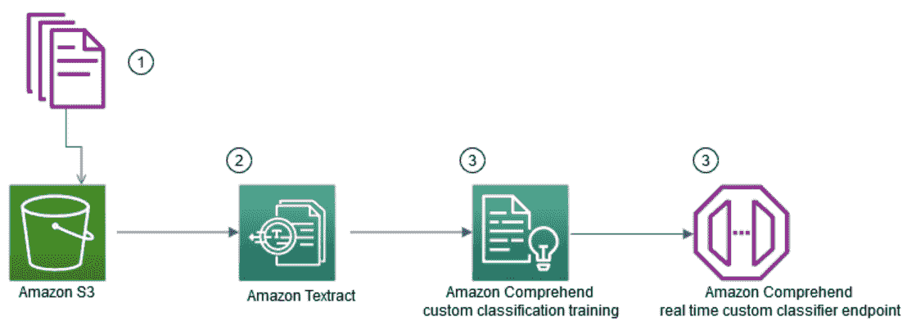

图 15.1 – Comprehend 自定义分类训练工作流

该架构包括以下步骤：

1.  训练文档，如银行对账单或工资单，被上传到 Amazon S3。

1.  Amazon Textract 从这些文档中提取文本，然后进行一些后处理，创建一个标签化的训练文件，用于 Comprehend 自定义分类训练。

1.  使用训练文件，创建一个 Amazon Comprehend 作业来分类文档，如银行对账单或工资单。

1.  训练完成后，你可以选择使用 Amazon Comprehend 执行批量推断，将一批文档分类，或者创建实时端点。在这个架构中，我们展示了如何设置实时端点来分类文档类型。

我们将在*解决用例设置*部分通过 Jupyter Notebook 和几行 Python 代码，带你了解前述概念架构的实现。

现在，我们有了一个近乎实时的文档分类端点。我们将展示如何使用这个 Amazon Comprehend 自定义分类端点设置人机协作，并通过以下架构建立模型重训练或主动学习循环，以提高模型的准确性：

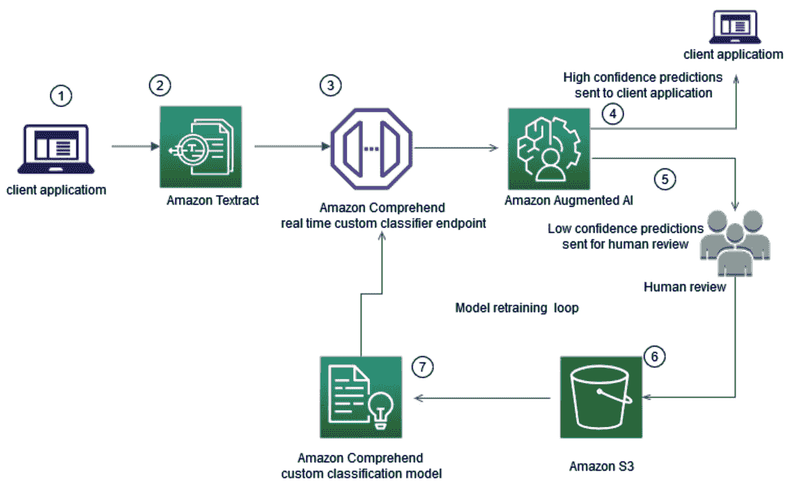

图 15.2 – 通过模型重训练实现实时分类

在这个架构中，我们将带你完成以下步骤：

1.  **客户端应用程序**将文档发送给 Amazon Textract。

1.  **Amazon Textract**实时提取数据或文本，并将提取的数据传递到 Amazon Comprehend 实时分类端点。

1.  Amazon Comprehend 自定义分类端点将对该文档类型进行分类。

1.  该分类端点配置了 Amazon A2I 人工环节。如果分类预测的置信度**高**，根据您的业务阈值（您可以配置该阈值），则高置信度预测会直接发送到客户端应用程序。

1.  对于低置信度的预测，例如任何低于 95% 置信度的预测，预测的得分为低置信度。这时会创建一个人工环节，将这些预测发送给人工审核。请参考*第三章*，*介绍 Amazon Comprehend*，了解什么是置信度分数以及 Comprehend 的自定义功能。

1.  人工标注者修正或增加的数据会以**JSON**文件的形式保存在 Amazon S3 存储桶中。

1.  然后，这些数据与原始训练数据集结合，并使用人工反馈对 Amazon Comprehend 自定义模型进行重新训练，以实现主动学习。

我们将带您完成*第 1 至第 6 步*，使用 Jupyter Notebook 在*设置用例部分*。您可以自由地将增强的分类标签与原始数据集结合，尝试重新训练以加深理解。您还可以使用步骤函数和 Lambda 函数自动化此架构。我们将在*进一步阅读*部分与您分享帮助您使用 Lambda 函数设置此架构的博客。

在本节中，我们介绍了模型训练和重新训练或主动学习的架构。接下来，让我们进入下一节，通过代码来展示这些概念。

# 构建文档分类工作流

在本节中，我们将直接开始执行任务来构建我们的解决方案。但首先，我们需要处理一些前提条件。

## 设置以解决用例

如果您在前面的章节中还没有完成此操作，您需要先创建一个 Amazon SageMaker Jupyter 笔记本，并设置 `Chapter 15` 文件夹，打开 `chapter15 classify documents with human in the loop.ipynb` 笔记本。

现在，让我们进入下一节，向您展示如何设置库并使用此笔记本将训练数据上传到 Amazon S3。

### 设置并上传样本文档到 Amazon S3

在此步骤中，我们将按照说明设置一个 S3 存储桶并上传文档：

1.  转到笔记本并运行以下 `boto 3` 单元格进行设置。

1.  继续到下一个单元格，输入一个存储桶名称，以在您的帐户中创建一个 S3 存储桶。在执行此单元格之前，请确保在 `data_bucket` 中添加当前月份和日期（格式为 `MMDD`），如下面的代码块所示：

    ```py
    data_bucket = "doc-processing-bucket-MMDD"
    region = boto3.session.Session().region_name
                   os.environ["BUCKET"] = data_bucket
    os.environ["REGION"] = region
    if region=='us-east-1':
        !aws s3api create-bucket --bucket $BUCKET
    else:
        !aws s3api create-bucket --bucket $BUCKET --create-bucket-configuration LocationConstraint=$REGION
    ```

1.  现在运行以下单元格，将本地笔记本中的样本银行对账单或工资单图像上传或复制为训练文件，上传到您刚刚创建的 S3 存储桶：

    ```py
    !aws s3 cp documents/train s3://{data_bucket}/train –recursive
    ```

1.  现在运行笔记本中的接下来的两个单元，以列出我们刚刚复制到 Amazon S3 中的训练图像。我们创建了一个名为`get_s3_bucket_items`的函数。我们从 S3 获取图像对象，并将其保存为 Textract 处理的图像，供后续步骤使用。请参考笔记本执行这些步骤。

1.  运行以下步骤，定义一个路径或本地目录结构，以存储从 Amazon Textract 提取的数据：

    ```py
    word_prefix=os.getcwd()+'/SAMPLE8/WORDS/'
    box_prefix=os.getcwd()+'/SAMPLE8/BBOX/'
    ```

我们已经介绍了如何创建 S3 存储桶并加载训练数据。接下来，让我们进入提取文本的下一部分。

### 使用 Amazon Textract 从示例文档中提取文本

转到笔记本并运行**步骤 2：使用 Amazon Textract 从示例文档中提取文本**中的代码，定义一个函数，使用 Amazon Textract 从 Amazon S3 中的示例图像提取数据。我们正在使用 DetectDocumentText 同步 API 进行提取；你也可以使用*异步 API*或*Textract 批量 API*来执行数据提取。请参考*第四章*，*自动化文档处理工作流*，深入了解这些 API：

```py
def data_retriever_from_path(path):    
    mapping={}
    for i in names:
        if os.path.isdir(path+i):
            mapping[i] = sorted(os.listdir(path+i))
    label_compre = []
    text_compre = []
    for i, j in mapping.items():
                for k in j:
            label_compre.append(i)
            text_compre.append(open(path+i+"/"+k, encoding="utf-8").read().replace('\n',' '))
    return label_compre, text_compre
```

这个函数接受*图片*的路径并返回图片中的文本和标签。

让我们通过运行笔记本中的以下单元，调用这个函数并传入扫描文档的图像：

```py
tic = time.time()
pool = mp.Pool(mp.cpu_count())
pool.map(textract_store_train_LM, [table for table in images ])
print("--- %s seconds for extracting ---" % (time.time() - tic))
pool.close()
```

上述函数提取数据并将其保存在你在**设置并上传示例文档**步骤中定义的本地目录结构中。以下是输出结果：

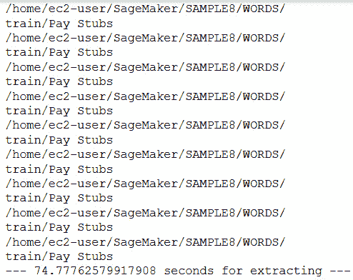

图 15.3 – Textract 输出

现在，我们已经提取了文本和相关标签，例如*0*代表银行对账单，*1*代表工资单。接下来，让我们进入 Comprehend 训练的下一部分。

## 创建 Amazon Comprehend 分类训练任务

在前一步中，我们已经从 Amazon S3 中的扫描文档样本提取了数据和标签。接下来，让我们了解如何使用**步骤 3：创建 Amazon Comprehend 分类训练任务**在笔记本中设置 Comprehend 分类训练任务：

1.  我们首先创建一个函数，将提取的数据和标签映射到 pandas DataFrame，以便在下一步将其转换为 CSV 训练文件。运行以下代码来定义该函数，它接受提取的数据位置并返回其中的标签和文本：

    ```py
    def data_retriever_from_path(path):    
        mapping={}
        for i in names:
            if os.path.isdir(path+i):
                mapping[i] = sorted(os.listdir(path+i))
        # label or class or target list
        label_compre = []
        # text file data list
        text_compre = []
        # unpacking and iterating through dictionary
        for i, j in mapping.items():
            # iterating through list of files for each class
            for k in j:
                # appending labels/class/target
                label_compre.append(i)
                # reading the file and appending to data list
                text_compre.append(open(path+i+"/"+k, encoding="utf-8").read().replace('\n',' '))
        return label_compre, text_compre
    ```

1.  现在，我们将通过运行以下代码调用之前定义的函数：

    ```py
    label_compre, text_compre=[],[]
    path=word_prefix+'train/'
    label_compre_train, text_compre_train=data_retriever_from_path(path)
    label_compre.append(label_compre_train)
    text_compre.append(text_compre_train)
    if type(label_compre[0]) is list:
            label_compre=[item for sublist in label_compre for item in sublist]
            #print(label_compre)
            text_compre=[item for sublist in text_compre for item in sublist]
            #print(text_compre)
    data_compre= pd.DataFrame()
    data_compre["label"] =label_compre   
    data_compre["document"] = text_compre
    data_compre
    ```

    你将获得一个包含标签和文档的 pandas DataFrame，内容如下所示：

    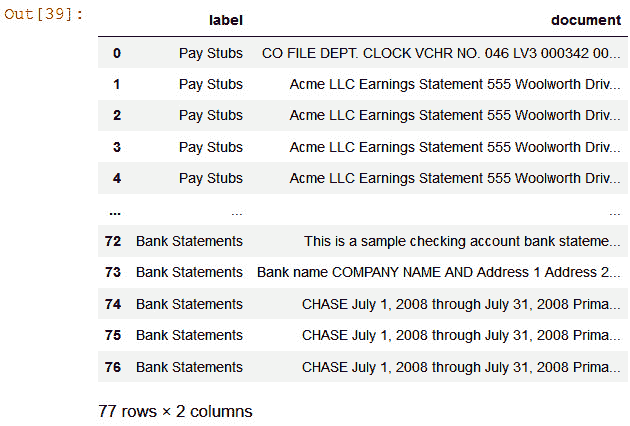

    图 15.4 – 带标签的训练 DataFrame

1.  现在，我们将把这个 DataFrame 保存为 CSV 文件，并使用 S3 上传到 Amazon S3。将`boto3` API 对象作为 Amazon Comprehend 训练文件进行训练：

    ```py
    csv_compre=io.StringIO()
    data_compre.to_csv(csv_compre,index=False, header=False)
    key='comprehend_train_data.csv'  
    input_bucket=data_bucket        
    output_bucket= data_bucket       
    response2 = s3.put_object(
            Body=csv_compre.getvalue(),
            Bucket=input_bucket,
            Key=key)
    ```

1.  现在，访问 Amazon Comprehend 控制台链接（https://console.aws.amazon.com/comprehend/v2/home?region=us-east-1#classification）创建分类作业。点击 **Train Classifier**。

1.  在 `doc-classifier` 中，选择 `1`，然后向下滚动选择 `csv 文件`。

    重要提示

    我们可以为 Amazon Comprehend 自定义模型添加版本。要了解更多关于此功能的信息，请参考此链接：[`docs.aws.amazon.com/comprehend/latest/dg/model-versioning.html`](https://docs.aws.amazon.com/comprehend/latest/dg/model-versioning.html)。

    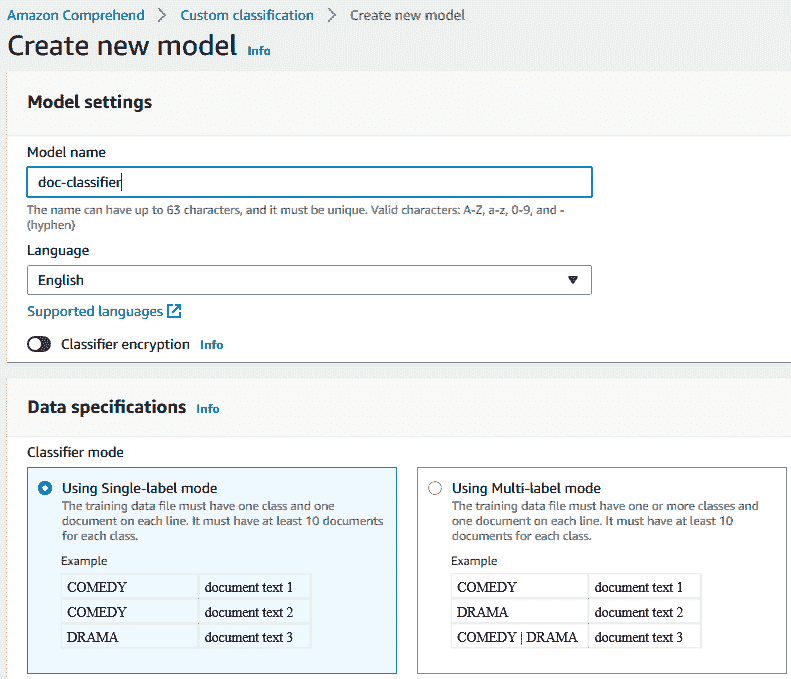

    图 15.5 – Amazon Comprehend 自定义分类 UI

1.  对于训练数据位置，浏览到 `doc-processing-bucket-MMDD` S3 桶，该桶位于 `s3://doc-processing-bucket-MMDD/comprehend_train_data.csv`。

1.  对于 `Autosplit`，这意味着 Amazon Comprehend 会自动为您拆分测试数据。您也可以选择通过提供自己的测试数据集来调整模型。

1.  对于输出数据，请输入 `s3://doc-processing-bucket-MMDD` S3 桶。

1.  对于访问权限，在 **NameSuffix** 中选择 `classifydoc`。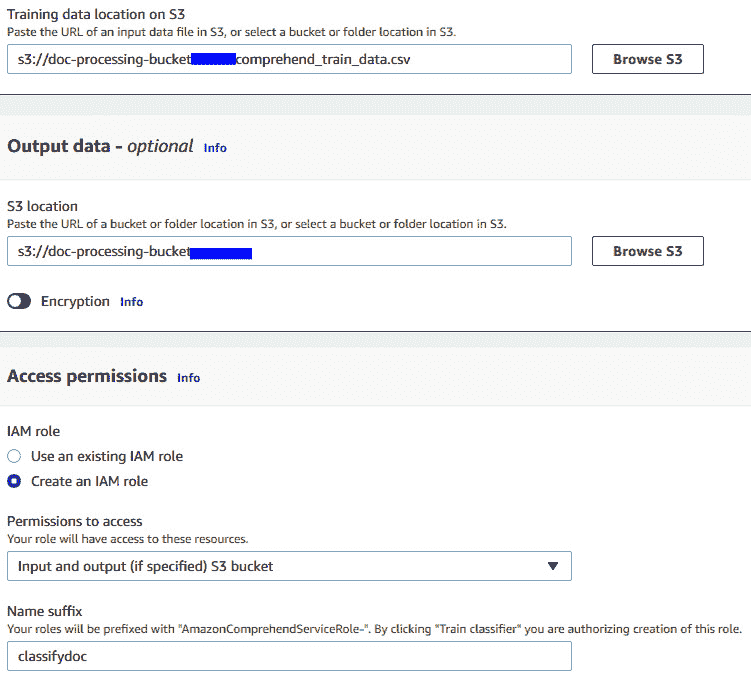

    图 15.6 – Amazon Comprehend 自定义分类 IAM 设置

1.  向下滚动并点击 **Train Classifier** 按钮开始训练。

    重要提示

    此训练将花费 30 分钟完成，因为本章中我们有大量文档需要训练。您可以利用这段时间设置一个私人工作队伍，为设置人类参与环节做准备，正如我们在*第十三章*中所做的，*提高文档处理工作流的准确性*。

一旦您的任务完成，继续进行下一步。

## 创建 Amazon Comprehend 实时端点并测试示例文档

在本节中，我们将展示如何在**AWS 管理控制台**中使用训练后的模型创建实时端点。Comprehend 使用**推理单元**（**IU**）来分析每秒钟可以实时分析多少个字符。IU 是端点吞吐量的度量。您可以随时调整端点的 IU。创建端点后，我们将展示如何使用 Jupyter Notebook 调用此端点来测试一个示例银行对账单：

1.  访问此链接，https://console.aws.amazon.com/comprehend/v2/home?region=us-east-1#endpoints，并点击 **创建端点**。

1.  输入 `classify-doc` 作为端点名称，设置我们在上一步中训练的 `doc-classifier`，并将**推理单元**设置为 **1**。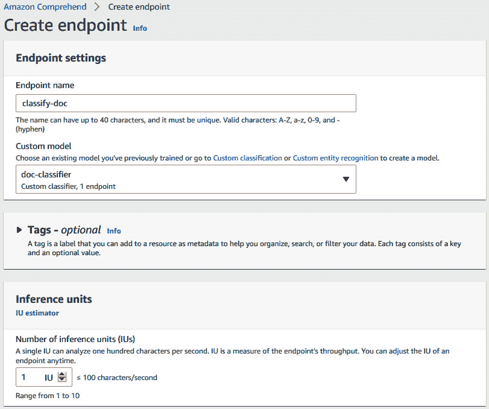

    图 15.7 – Amazon Comprehend 创建实时端点 UI

1.  向下滚动并选择 **I Acknowledge**，然后点击 **创建端点**。

    在笔记本的清理部分删除此端点，以避免产生费用。

1.  现在，复制下一张截图中显示的**ARN**，然后前往 Jupyter Notebook 链接：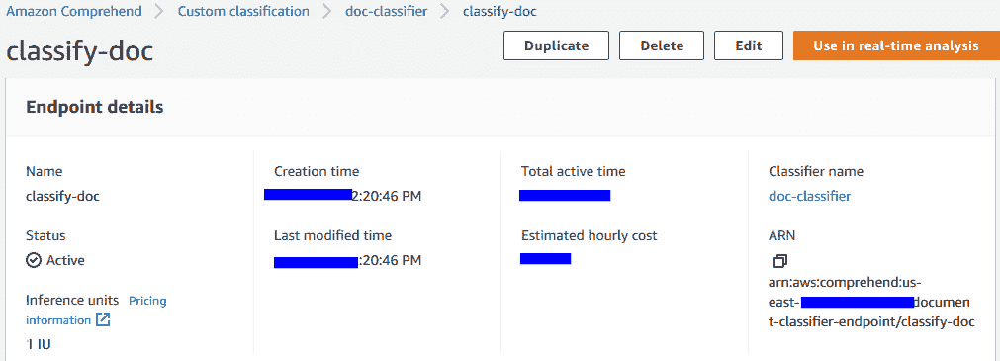

    图 15.8 – Comprehend 自定义分类终端节点 ARN

1.  在笔记本中，按如下方式将之前复制的终端节点 ARN 输入到笔记本单元格中：

    ```py
    ENDPOINT_ARN='your endpoint arn paste here'
    ```

1.  现在，我们将使用一个示例测试文档或任何未在训练中使用的薪资单进行实时分类。运行以下代码来查看示例薪资单：

    ```py
    documentName = "paystubsample.png"
    display(Image(filename=documentName))
    ```

    你将获得以下输出：

    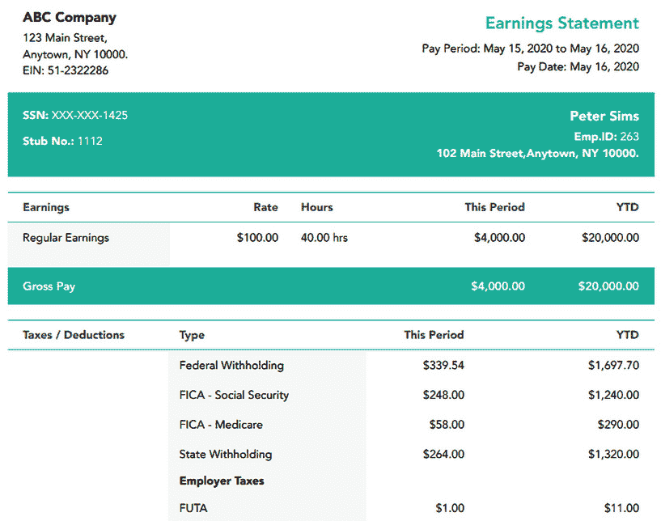

    图 15.9 – 示例薪资单文档

1.  在**使用 Textract 从此示例文档提取文本**部分运行接下来的两个单元格，以提取此示例文档中的文本。

1.  运行以下单元格，它调用 Comprehend 的 ClassifyDocument API。此方法将提取的文本和自定义分类终端节点传递给 API，并返回一个响应：

    ```py
    response = comprehend.classify_document(
        Text= page_string,
        EndpointArn=ENDPOINT_ARN
    )
    print(response)
    ```

    你将得到以下响应：

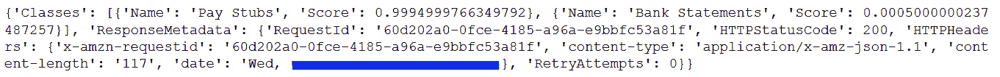

图 15.10 – ClassifyDocument 响应

根据响应，模型终端节点已经将文档分类为薪资单，置信度为 99%。我们已经测试了这个终端节点，现在让我们进入下一部分，设置人工环路。

## 使用实时终端节点和人工环路设置主动学习，结合 Comprehend

在本节中，我们将向你展示如何与 Comprehend 分类终端节点进行自定义集成，你可以使用 A2I StartHumanLoop API 调用此集成。你可以将任何类型的 AI/ML 预测响应传递给此 API 来触发人工环路。在*第十三章*中，*提高文档处理工作流的准确性*，我们通过将人工环路工作流 ARN 传递给 AnalyzeDocument API，向你展示了与 Textract Analyze 文档 API 的原生集成。设置自定义工作流包括以下步骤：

1.  创建一个**工作任务模板**。

1.  创建一个**人工审核工作流**。

1.  创建并启动 A2I 人工环路。

1.  检查人工环路状态并开始标注。

要开始，你需要创建一个私人工作团队，并在 Jupyter Notebook 中的*环境设置*步骤中复制私人 ARN：

1.  要创建一个私人工作团队，请参考*第十三章*中的*在 AWS 控制台创建私人工作团队*部分，*提高文档处理工作流的准确性*：

    ```py
    REGION = 'enter your region'
    WORKTEAM_ARN= "enter your private workforce arn "
    BUCKET = data_bucket
    ENDPOINT_ARN= ENDPOINT_ARN
    role = sagemaker.get_execution_role()
    region = boto3.session.Session().region_name
    prefix = "custom-classify" + str(uuid.uuid1())
    ```

1.  运行下一个单元并转到`创建工作任务`模板。这是工作人员在标注时将要查看的 UI。我们将在 UI 中显示预测结果和原始文档数据。我们已经为此用例使用了一个预构建的分类模板（[`github.com/aws-samples/amazon-a2i-sample-task-uis/blob/master/text/document-classification.liquid.html`](https://github.com/aws-samples/amazon-a2i-sample-task-uis/blob/master/text/document-classification.liquid.html)）。运行笔记本单元来定义 HTML 模板。

    重要提示

    你可以根据希望向标注者展示的数据类型，创建自定义的 UI HTML 模板。例如，你可以在右侧显示实际文档，在左侧高亮显示实体，使用自定义 UI。

1.  我们在前一步中定义或选择了 HTML 模板，在此模板中，我们将通过运行以下代码，使用`create_human_task_ui` API 创建一个 UI 任务：

    ```py
    def create_task_ui():
        response = sagemaker.create_human_task_ui(
            HumanTaskUiName=taskUIName,
            UiTemplate={'Content': template})
    return response
    ```

1.  运行下一个单元来调用前一步中定义的创建 UI 任务的函数。你将获得一个`human task arn`响应。

1.  现在，我们将定义一个人工审核工作流。这个人工审核工作流需要你创建的私人劳动力、你创建的 UI 模板任务，以及你希望将人工审核输出保存到的数据桶。我们将使用`sagemaker.create_flow_definition` API，通过运行以下代码创建一个工作流定义或人工审核工作流：

    ```py
    create_workflow_definition_response = sagemaker.create_flow_definition(
            FlowDefinitionName= flowDefinitionName,
            RoleArn= role,
            HumanLoopConfig= {
                "WorkteamArn": WORKTEAM_ARN,
                "HumanTaskUiArn": humanTaskUiArn,
                "TaskCount": 1,
                "TaskDescription": "Read the instructions",
                "TaskTitle": "Classify the text"
            },
            OutputConfig={
                "S3OutputPath" : "s3://"+BUCKET+"/output"
            }

    flowDefinitionArn = create_workflow_definition_response['FlowDefinitionArn']
    ```

1.  现在，我们将从 Comprehend 自定义分类器端点获取工资单示例数据的响应，并解析此响应以设置人工循环：

    ```py
    response = comprehend.classify_document(
        Text= page_string,
        EndpointArn=ENDPOINT_ARN
    )
    print(response)
    p = response['Classes'][0]['Name']
    score = response['Classes'][0]['Score']
            #print(f»S:{sentence}, Score:{score}»)
    response = {}
    response['utterance']=page_string
    response['prediction']=p
    response['confidence'] = score
    print(response)
    ```

1.  现在，使用这个前面的 JSON 响应，我们将设置一个信心阈值。这个`StartHumanloop` API 需要前一步创建的工作流 ARN 或流定义 ARN 以及 Comprehend 分类的 JSON 响应，以创建人工循环。我们将根据信心评分阈值触发这个循环，如下一个代码块所示：

    ```py
    human_loops_started = []
    CONFIDENCE_SCORE_THRESHOLD = .90
    if(response['confidence'] > CONFIDENCE_SCORE_THRESHOLD):
            humanLoopName = str(uuid.uuid4())
            human_loop_input = {}

            human_loop_input['taskObject'] = response['utterance']
            start_loop_response = a2i_runtime_client.start_human_loop(
            HumanLoopName=humanLoopName,
            FlowDefinitionArn=flowDefinitionArn,
            HumanLoopInput={
                    "InputContent": json.dumps(human_loop_input)
                }
            )
            print(human_loop_input)
            human_loops_started.append(humanLoopName)
            print(f'Score is less than the threshold of {CONFIDENCE_SCORE_THRESHOLD}')
            print(f'Starting human loop with name: {humanLoopName}  \n')
    else:
             print('No human loop created. \n')
    ```

    重要提示

    前面的条件说明，任何大于 90%信心的模型端点输出将触发一个循环。这个阈值仅用于演示目的，实际使用时需要更改，例如，低于 90%时触发人工循环。

1.  现在，运行以下代码以获取私人工作团队的链接，开始标注工作：

    ```py
    workteamName = WORKTEAM_ARN[WORKTEAM_ARN.rfind('/') + 1:]
    print("Navigate to the private worker portal and do the tasks. Make sure you've invited yourself to your workteam!")
    print('https://' + sagemaker.describe_workteam(WorkteamName=workteamName)['Workteam']['SubDomain'])
    ```

    你将获得以下 A2I 门户的链接：

    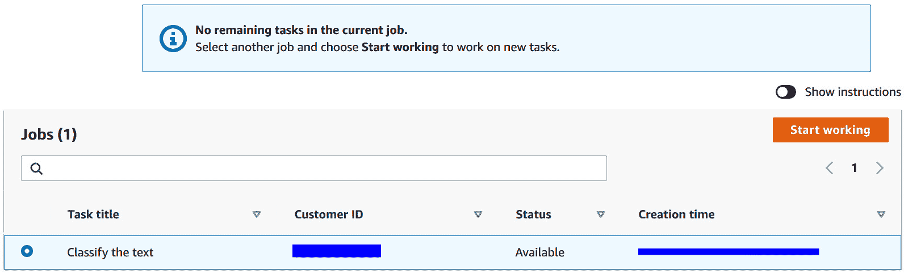

    图 15.11 – 亚马逊 A2I 登录控制台

1.  选择**任务标题**并点击**开始工作**；你将被重定向到分类任务 UI。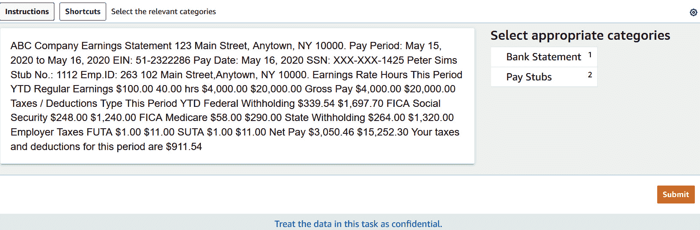

    图 15.12 – 亚马逊 A2I 示例分类任务 UI

    查看前一截图左侧的数据，并通过选择**工资单**类别进行分类，然后点击**提交**。

1.  提交此分类任务作为人工审查后，返回笔记本并运行以下代码，获取已完成的任务：

    ```py
    completed_human_loops = []
    resp = a2i_runtime_client.describe_human_loop(HumanLoopName=humanLoopName)
    ```

1.  现在，我们将审查从已完成的人工审查中获得的结果，这些结果会自动存储为 JSON 文件在 Amazon S3 中，你可以通过运行以下代码来查看：

    ```py
    for resp in completed_human_loops:
        splitted_string = re.split('s3://' + data_bucket  + '/', resp['HumanLoopOutput']['OutputS3Uri'])
        output_bucket_key = splitted_string[1]
        response = s3.get_object(Bucket=data_bucket, Key=output_bucket_key)
        content = response["Body"].read()
        json_output = json.loads(content)
        pp.pprint(json_output)
    ```

    你将收到以下响应：

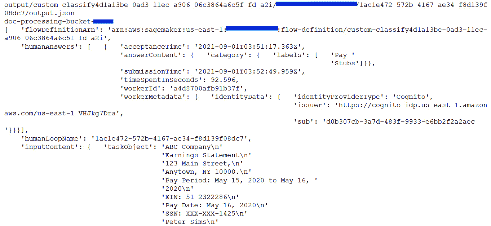

图 5.13 – 人工审查的 JSON 响应

利用这些数据，你可以扩展或丰富用于训练的现有数据集。试着将这些数据与我们创建的 Comprehend 训练数据结合，尝试重新训练你的模型以提高准确率。我们将在*进一步阅读*部分中提供一些博客链接，帮助你完成这一步。

重要提示

请删除我们在此笔记本中创建的模型和 Comprehend 端点。

# 总结

在这一章中，我们通过参考架构和代码演示讲解了两件事。首先，我们讲解了如何使用 Amazon Textract 从各种类型的文档中提取数据，如工资单、银行对账单或身份证。然后，我们学习了如何进行一些后处理操作，以创建用于 Amazon Comprehend 自定义分类训练的标签化训练文件。

我们向你展示了，即使只有 36 份银行对账单和 24 份工资单作为训练样本，你也可以通过使用 Amazon Comprehend 的迁移学习能力和 AutoML 进行文档或文本分类，获得非常好的准确率。显然，随着数据量的增加，准确率会提高。

接着，你学习了如何在 AWS 管理控制台中设置训练任务，以及如何在 AWS 管理控制台中设置实时分类端点。

其次，你学习了如何使用实时分类端点设置“人类在环”系统，以审查/验证和确认模型所分类的内容。我们还讨论了如何通过将这些数据与现有的训练数据一起添加，来重新训练现有的模型，并设置一个重新训练或主动学习循环。请参阅*进一步阅读*部分，了解如何使用 Lambda 函数自动化此工作流。

在下一章中，我们将讨论如何利用 Amazon Textract 和“人类在环”系统提高**PDF 批量处理**的准确性。敬请期待！

# 进一步阅读

+   *Amazon Comprehend 自定义分类模型的主动学习工作流 - 第二部分*，*Shanthan Kesharaju, Joyson Neville Lewis 和 Mona Mona* ([`aws.amazon.com/blogs/machine-learning/active-learning-workflow-for-amazon-comprehend-custom-classification-part-2/)`](https://aws.amazon.com/blogs/machine-learning/active-learning-workflow-for-amazon-comprehend-custom-classification-part-2/)%20)

+   *创建和使用自定义分类器*（*[`docs.aws.amazon.com/comprehend/latest/dg/getting-started-document-classification.html`](https://docs.aws.amazon.com/comprehend/latest/dg/getting-started-document-classification.html)）
