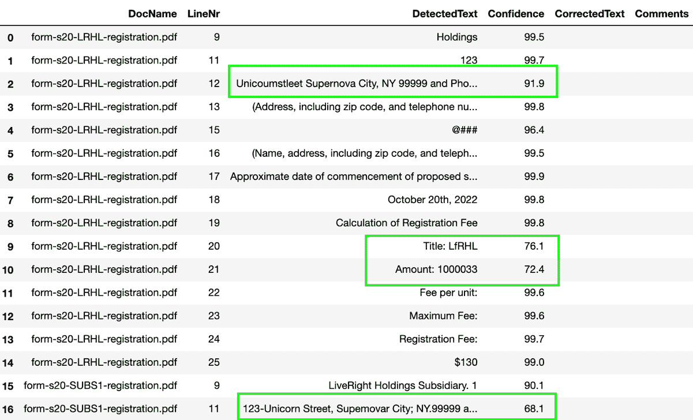
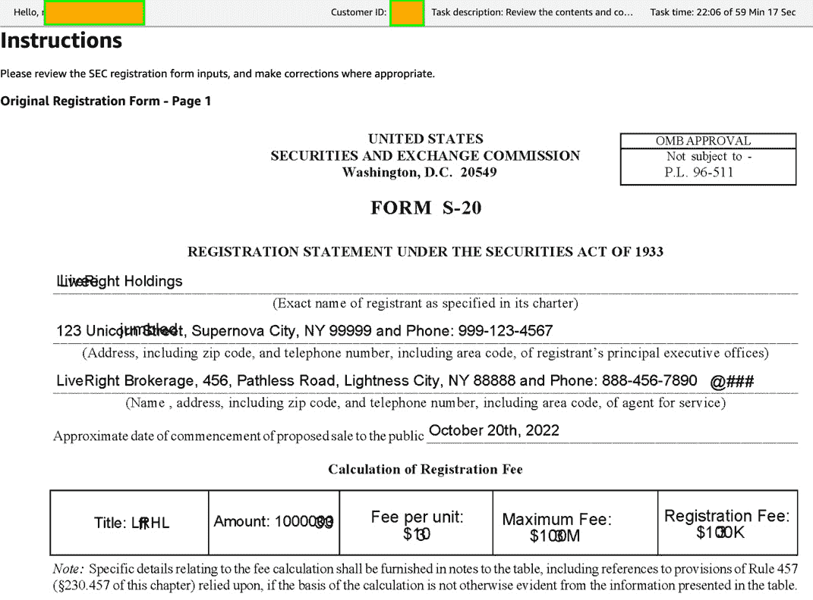
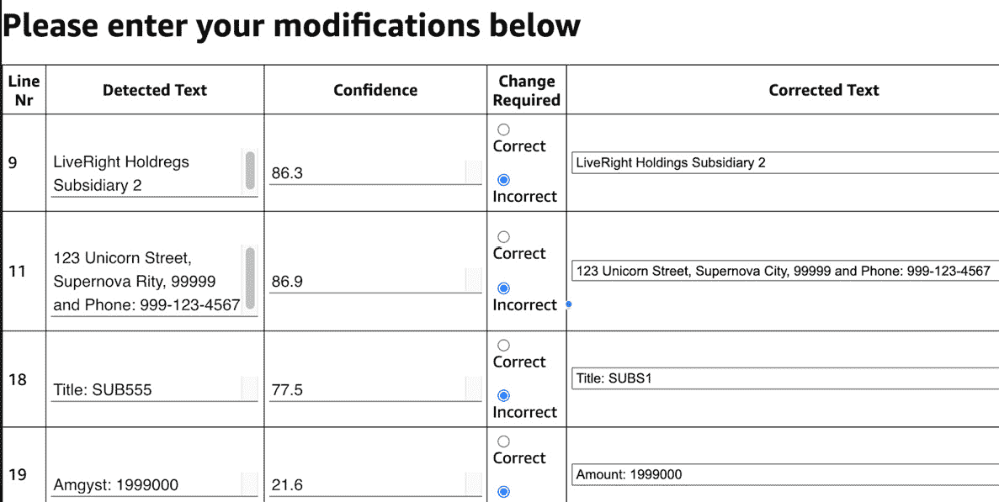
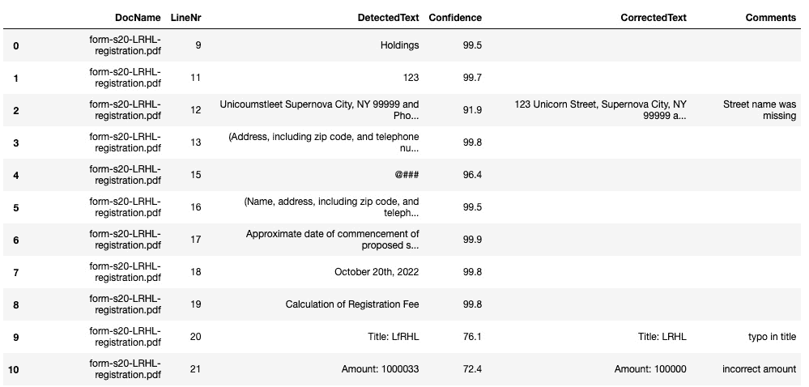
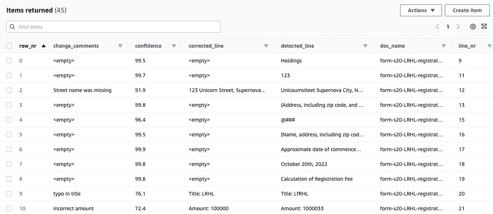

# 第十六章：*第十六章*：提高 PDF 批处理的准确性

恭喜你走到了这本书的这一阶段！此时，你已经是一个能够利用 NLP 和 AI 的力量，构建实际应用以带来实际业务效益的高级开发者。你可能没有意识到，但我们到目前为止讨论的主题——以及我们接下来要继续讨论的内容——解决了一些最受欢迎、最具需求的商业挑战，这是我们帮助客户解决的问题之一。**智能文档处理**（**IDP**）是目前非常热门的需求，几乎在每个行业中都有广泛应用。我们从*第十三章*《提高文档处理工作流的准确性》开始阅读，了解了**Amazon A2I**（[`aws.amazon.com/augmented-ai/`](https://aws.amazon.com/augmented-ai/)）在简化和提高 ML 工作流中人工审阅的准确性方面所发挥的关键作用，从而在过程中启用了主动学习。

在本章中，我们将解决一个已经存在了一段时间、普遍存在、但组织在高效处理上仍然面临困难的操作需求。这就是所谓的**PDF 批处理**。可以将其视为设置一个自动化文档处理工作流（类似于我们在前几章中构建的工作流），但它增加了批量处理 PDF 文档的灵活性，并结合智能技术，能够自动将文档中某些文本段落路由给人工审阅，原因是由于低置信度检测引起的无法辨认或错误的文本。

到现在为止，由于你在实施先进的 AI 解决方案方面的辛勤努力，**LiveRight Holdings**的盈利已经飙升。这个增长使得 LiveRight 开始将几个子公司独立出来，成为各自独立的组织，董事会决定这三家公司将在中期公开上市。你已经晋升为 LiveRight 的首席运营架构师，CIO 将任务交给你，要求你构建必要的组件，以便将三家公司作为公开交易公司注册到**证券交易委员会**（**SEC**）。

在本章中，我们将讨论以下主题：

+   介绍 PDF 批处理使用案例

+   构建解决方案

# 技术要求

本章内容需要你访问一个 AWS 账户，你可以通过访问[`aws.amazon.com/console/`](https://aws.amazon.com/console/)来获取。有关如何注册 AWS 账户并登录到**AWS 管理控制台**的详细说明，请参考*第二章*《介绍 Amazon Textract》中的*注册 AWS 账户*子章节。

本章节中讨论的解决方案的 Python 代码和示例数据集可以在本书的 GitHub 仓库中找到：[`github.com/PacktPublishing/Natural-Language-Processing-with-AWS-AI-Services/tree/main/Chapter%2016`](https://github.com/PacktPublishing/Natural-Language-Processing-with-AWS-AI-Services/tree/main/Chapter%2016)。

请查看以下视频，了解代码如何运行：[`bit.ly/3nobrCo`](https://bit.ly/3nobrCo)。

# 引入 PDF 批处理处理用例

要确定架构的样子，你需要与财务部门沟通，了解如何将公司注册到美国证券交易委员会（SEC）的流程。根据该流程，财务部门将使用 SEC 的注册模板生成 PDF 文件，该模板也被称为*Form S20*（[`www.sec.gov/files/forms-20.pdf`](https://www.sec.gov/files/forms-20.pdf)）。该流程还包括创建所有支持文档，并将这些文档与注册信息一同通过 API 调用发送给 SEC。LiveRight 的**Partner Integration**团队已经与 SEC 达成了合作协议，他们需要将表单数据存储在**Amazon DynamoDB**（[`aws.amazon.com/dynamodb/`](https://aws.amazon.com/dynamodb/)）表中，供他们用于创建向 SEC API 发送消息的调用。

然而，在将数据提供给 Partner Integration 团队之前，财务团队提到，他们需要审核一部分在 PDF 文档中检测到的文本行，特别是那些可能由于文档质量问题而未正确解析的文本。

通过这些信息，你意识到需要在文档处理解决方案中添加一个批处理组件。这将使得能够批量检测 PDF 文档中的文本，并将那些低于置信度阈值的文本行引导至人工审核环节，由财务团队成员进行审核。你决定使用**Amazon Textract**提供的异步文档文本检测 API，借助其预训练的机器学习模型从 PDF 文档中提取文本，使用**Amazon A2I**设置人工工作流，审核和修改那些置信度低于 95%的文本，同时利用 Amazon DynamoDB 存储原始检测到的文本以及修正后的内容，供 Partner Integration 团队使用。

我们将使用 Amazon SageMaker Jupyter 笔记本构建我们的解决方案，这将允许我们在逐步执行代码时查看代码和结果。我们将执行以下任务：

1.  作为第一步，我们将使用 Amazon SageMaker 控制台创建一个私有标签工作队伍进行人工审核。更多详情，请参考[`docs.aws.amazon.com/sagemaker/latest/dg/sms-workforce-private.html`](https://docs.aws.amazon.com/sagemaker/latest/dg/sms-workforce-private.html)。

1.  我们将通过检查从 GitHub 仓库克隆的本章示例注册表单来启动解决方案工作流。我们将使用 Amazon Textract 启动一个异步文本检测任务。

1.  然后，我们将获取文本检测任务的结果，从文档中选择特定行，并检查检测置信度分数。

1.  我们将使用表格任务 UI 模板设置一个 Amazon A2I 人工审查循环，并将每个文档中的文本行发送到人工循环中。

1.  以私人工作者身份登录后，我们将处理分配的审查任务，对所有文档中检测置信度较低的文本行进行修改。

1.  我们将把检测到并修正的文本行上传到 DynamoDB 表中，以便进行后续处理。

现在我们已经了解了本次练习的背景并过了一遍我们的流程，接下来让我们开始构建解决方案。

# 构建解决方案

在上一节中，我们介绍了我们的用例——将公司注册提交给 SEC 进行公开交易，涵盖了我们将要构建的解决方案的架构，并简要介绍了解决方案组件和工作流步骤。在这一节中，我们将直接进入正题，开始执行构建解决方案的任务。但首先，我们需要处理一些先决条件。

## 为解决方案构建做准备

如果你在之前的章节中没有做过，你需要创建一个 Amazon SageMaker Jupyter 笔记本，并设置**身份与访问管理**（**IAM**）权限，允许该笔记本角色访问我们将在本笔记本中使用的 AWS 服务。之后，你还需要克隆本书的 GitHub 仓库（[`github.com/PacktPublishing/Natural-Language-Processing-with-AWS-AI-Services`](https://github.com/PacktPublishing/Natural-Language-Processing-with-AWS-AI-Services)），创建一个 Amazon S3（[`aws.amazon.com/s3/`](https://aws.amazon.com/s3/)）存储桶，并在笔记本中提供存储桶的名称以开始执行。

注意

请确保你已经完成了*技术要求*部分中提到的任务。

请按照以下步骤完成这些任务，然后我们就可以执行笔记本中的单元格了：

1.  按照*第二章*中*设置 AWS 环境*部分的*创建 Amazon SageMaker Jupyter 笔记本实例*子节中的说明，创建你的 Jupyter 笔记本实例。

    创建 Amazon SageMaker Jupyter 笔记本时的 IAM 角色权限

    在创建笔记本时接受默认的 IAM 角色，以允许访问任何 S3 存储桶。

1.  一旦你创建了笔记本实例并且其状态为**InService**，点击笔记本实例的**操作**菜单中的**打开 Jupyter**。

1.  这将带你到笔记本实例的**首页**文件夹。

1.  点击 **New** 并选择 **Terminal**。

1.  在终端窗口中，输入 `cd SageMaker` 然后 `git clone https://github.com/PacktPublishing/Natural-Language-Processing-with-AWS-AI-Services`。

1.  现在，退出终端窗口，返回到主文件夹，您将看到一个名为 `Natural-Language-Processing-with-AWS-AI-Services` 的文件夹。点击该文件夹以显示章节文件夹，并点击 `Chapter 16`。

1.  通过点击打开该文件夹，您应该看到一个名为 `Improve-accuracy-of-pdf-processing-with-Amazon-Textract-and-Amazon-A2I-forGitHub.ipynb` 的笔记本。

1.  点击打开此笔记本。

1.  按照本笔记本中与本节接下来的子标题相对应的步骤，逐个执行每个单元格。请阅读添加到每个笔记本单元格中的描述。

接下来，我们将介绍一些额外的 IAM 前提条件。

## 额外的 IAM 前提条件

我们需要为我们的 SageMaker Notebook 角色启用额外的策略。请参阅 *第二章* 中的 *更改 IAM 权限和信任关系以执行 Amazon SageMaker Notebook 角色* 子章节，*介绍 Amazon Textract* 部分，了解如何执行以下步骤的详细说明：

1.  如果尚未执行，请将 `TextractFullAccess` 和 `AmazonAugmentedAIFullAccess` 策略附加到您的 Amazon SageMaker Notebook IAM 角色。

1.  将 `iam:PassRole` 权限作为内联策略添加到您的 SageMaker Notebook 执行角色中：

    ```py
    { "Version": "2012-10-17", "Statement": [ {
      "Action": [
          "iam:PassRole"
      ],
      "Effect": "Allow",
      "Resource": "<your sagemaker notebook execution role ARN">
      }
     ]
    }
    ```

现在，我们已经设置好了笔记本并配置了运行演练笔记本的 IAM 角色，接下来我们将创建私有标注工作队。

## 为人工循环创建一个私有团队

请参考笔记本中的 *Step 0*（[`github.com/PacktPublishing/Natural-Language-Processing-with-AWS-AI-Services/blob/main/Chapter%2016/Improve-accuracy-of-pdf-processing-with-Amazon-Textract-and-Amazon-A2I-forGitHub.ipynb`](https://github.com/PacktPublishing/Natural-Language-Processing-with-AWS-AI-Services/blob/main/Chapter%2016/Improve-accuracy-of-pdf-processing-with-Amazon-Textract-and-Amazon-A2I-forGitHub.ipynb)），以了解我们现在将执行的指令。在本节中，我们将使用 Amazon SageMaker 标注工作队控制台创建一个私有团队，并将我们自己作为工人添加到私有团队中。这是为了确保在此解决方案中的 Amazon A2I 步骤时，我们能够登录到标注任务 UI。请执行以下步骤：

1.  如果您尚未登录 AWS 管理控制台（请参阅本章开头的 *技术要求* 部分以了解更多详细信息），请在 **Services** 搜索栏中输入 Amazon SageMaker 并进入 Amazon SageMaker 控制台。进入控制台后，在 UI 左侧，点击 **Ground Truth**，然后选择 **Labelling workforces**。在屏幕上，选择顶部的 **Private** 标签并点击 **Create private team**。

1.  在**团队名称**字段中输入您的私人团队名称，并保持**创建一个新的 Amazon Cognito 用户组**为默认选择，保持在**添加工作人员**部分。向下滚动并点击**创建私人团队**。

1.  您将返回到`nlp-doc-team`团队，并应在`arn:aws:sagemaker:region-name-123456:workteam/private-crowd/team-name`下可见。请复制此 ARN 并在笔记本的**步骤 1 – 单元格 1**中提供它：

    ```py
    WORKTEAM_ARN= '<your-private-workteam-arn>'
    ```

1.  接下来，向下滚动到前一个屏幕，进入 `no-reply@verificationemail.com`。按照提供的说明完成注册过程。

1.  现在，点击**nlp-doc-team**，然后点击**向团队添加工作人员**，将自己添加到私人团队中。从列表中选择您的电子邮件地址并点击**向团队添加工作人员**。

现在我们已经添加了私人团队，接下来创建一个 Amazon S3 存储桶。

## 创建一个 Amazon S3 存储桶

请按照 *第二章*中*设置您的 AWS 环境*部分的*创建一个 Amazon S3 存储桶、文件夹并上传对象*小节中的说明，创建您的 Amazon S3 存储桶。如果您在前面的章节中创建了 S3 存储桶，请重复使用该存储桶。本章仅需创建 S3 存储桶。我们将在笔记本中直接创建文件夹并上传对象：

1.  获取存储桶名称后，请在笔记本中的**步骤 1 – 单元格 1**中输入它：

    ```py
    bucket = "<S3-bucket-name>"
    ```

1.  通过点击笔记本 UI 顶部菜单中的**步骤 1 – 单元格 1**的**运行**按钮来执行。这样将导入我们需要的库，初始化变量，并为下一组步骤准备好内核。

1.  最后，在笔记本中执行**步骤 1 – 单元格 2**，将注册文档上传到我们的 S3 存储桶：

    ```py
    s3_client = boto3.client('s3')
    for secfile in os.listdir():
        if secfile.endswith('pdf'):
            response = s3_client.upload_file(secfile, bucket, prefix+'/'+secfile)
            print("Uploaded {} to S3 bucket {} in folder {}".format(secfile, bucket, prefix))
    ```

现在我们已经创建了 S3 存储桶，导入了所需的库，并将文档上传到 S3 存储桶，接下来使用**Amazon Textract**提取内容。

## 使用 Amazon Textract 提取注册文档的内容

本节对应于笔记本中的*步骤 2*和*步骤 3*（[`github.com/PacktPublishing/Natural-Language-Processing-with-AWS-AI-Services/blob/main/Chapter%2016/Improve-accuracy-of-pdf-processing-with-Amazon-Textract-and-Amazon-A2I-forGitHub.ipynb`](https://github.com/PacktPublishing/Natural-Language-Processing-with-AWS-AI-Services/blob/main/Chapter%2016/Improve-accuracy-of-pdf-processing-with-Amazon-Textract-and-Amazon-A2I-forGitHub.ipynb)）。在本节中，我们将使用 Amazon Textract 提交一个异步文本检测作业。作业完成后，我们将获得文本检测的结果，并将其加载到**pandas DataFrame**中（[`pandas.pydata.org/docs/reference/api/pandas.DataFrame.html`](https://pandas.pydata.org/docs/reference/api/pandas.DataFrame.html)），选择我们需要的文本行并审查结果。请使用上述笔记本按照这些步骤执行单元格，以完成所需的任务：

1.  执行**步骤 2 – 单元格 1**来定义存储桶句柄，并声明一个字典，用于存储每个文档的 Textract 作业 ID：

    ```py
    input_bucket = s3.Bucket(bucket)
    jobids = {}
    ```

1.  执行`NotificationChannel`属性作为 Textract `StartDocumentTextDetection` API 的输入（[`docs.aws.amazon.com/textract/latest/dg/API_StartDocumentTextDetection.html`](https://docs.aws.amazon.com/textract/latest/dg/API_StartDocumentTextDetection.html)），以指示作业完成时，消息将发送到的 Amazon SNS（[`aws.amazon.com/sns`](https://aws.amazon.com/sns)）主题。您可以设置 AWS Lambda 来订阅该主题，并在收到消息后调用 Textract `GetDocumentTextDetection` API（[`docs.aws.amazon.com/textract/latest/dg/API_GetDocumentTextDetection.html`](https://docs.aws.amazon.com/textract/latest/dg/API_GetDocumentTextDetection.html)）以检索提取的文本。我们将在笔记本中执行该 API，在**步骤 3 – 单元格 1**中。

1.  最后，执行**步骤 2 – 单元格 3**来打印每个文档的作业 ID：

    ```py
    for j in jobids:
        print("Textract detection Job ID for {} is {}".format(j,str(jobids[j])))
    ```

1.  现在，我们必须进入笔记本中的*步骤 3*。在这里，我们将定义帮助类来解析来自 Textract 的 JSON 响应。然后，我们将需要的文本行加载到字典中，在后续步骤中使用。点击笔记本中的**运行**以执行**步骤 3 – 单元格 1**。

1.  执行`df_indoc`：

    ```py
    text_extractor = TextExtractor()
    indoc = {}
    df_indoc = pd.DataFrame(columns = ['DocName','LineNr','DetectedText','Confidence', 'CorrectedText', 'Comments'])
    for x in jobids:
        pages = text_extractor.extract_text(jobids[x])
        contdict =pages[1]['Content']
        for row in range(1,(int(len(contdict)/2))+1):
            df_indoc.loc[len(df_indoc.index)] = [x, row, contdict['Text'+str(row)], round(contdict['Confidence'+str(row)],1),'','']
    ```

1.  执行**步骤 3 – 单元格 3**以定义筛选条件，指定在审查注册文件时哪些文本行对我们重要。最后，执行**步骤 3 – 单元格 4**以创建一个新的 DataFrame，其中只包含我们感兴趣的文本行：

    ```py
    df_newdoc = pd.DataFrame(columns = ['DocName','LineNr','DetectedText','Confidence','CorrectedText','Comments'])
    for idx, row in df_indoc.iterrows():
        if str(row['LineNr']) in bounding_dict['lines'].split(':'):
            df_newdoc.loc[len(df_newdoc.index)] = [row['DocName'],row['LineNr'], row['DetectedText'], row['Confidence'], row['CorrectedText'],row['Comments']]
    df_newdoc
    ```

1.  DataFrame 的结果显示在下面的屏幕截图中。这里高亮显示了一些低置信度条目：



图 16.1 – 来自 SEC 注册文件的文本行

注意

由于这些文本条目是故意在 PDF 文档中引入的，以触发低置信度的预测，因此它们显示为乱码。

现在我们已经将注册文件中需要的文本数字化，让我们开始设置使用 Amazon A2I 的人工审核工作流。

## 设置一个 Amazon A2I 人工工作流循环

对于这里讨论的代码块，请参考笔记本中的*步骤 4*、*步骤 5*和*步骤 6*（[`github.com/PacktPublishing/Natural-Language-Processing-with-AWS-AI-Services/blob/main/Chapter%2016/Improve-accuracy-of-pdf-processing-with-Amazon-Textract-and-Amazon-A2I-forGitHub.ipynb`](https://github.com/PacktPublishing/Natural-Language-Processing-with-AWS-AI-Services/blob/main/Chapter%2016/Improve-accuracy-of-pdf-processing-with-Amazon-Textract-and-Amazon-A2I-forGitHub.ipynb)）。现在是时候使用我们在*步骤 0*中创建的私人团队设置一个人工工作流，并将结果发送到**Amazon A2I**人工循环进行审核和修改，如有必要：

1.  让我们从初始化一些我们在接下来任务中需要的变量开始。请执行笔记本中的**步骤 4 – 单元格 1**。

1.  执行**步骤 4 – 单元格 2**，在笔记本中定义我们将用于人工审核活动的任务 UI 模板。我们从 Amazon A2I 样本任务 UI 的 GitHub 仓库中选择了适用于表格数据的任务模板（[`github.com/aws-samples/amazon-a2i-sample-task-uis`](https://github.com/aws-samples/amazon-a2i-sample-task-uis)），并根据我们的需求进行了定制。

1.  执行**步骤 4 – 单元格 3**，根据模板创建任务 UI：

    ```py
    def create_task_ui():
            response = sagemaker.create_human_task_ui(
            HumanTaskUiName=taskUIName,
            UiTemplate={'Content': template})
        return response
    # Create task UI
    humanTaskUiResponse = create_task_ui()
    humanTaskUiArn = humanTaskUiResponse['HumanTaskUiArn']
    print(humanTaskUiArn)
    ```

1.  我们将获得以下输出：

    ```py
    arn:aws:sagemaker:us-east-1:<aws-account-nr>:human-task-ui /ui-pdf-docs-<timestamp>
    ```

1.  现在，执行笔记本中的**步骤 5 – 单元格 1**，创建一个**Amazon A2I 流定义**，以协调任务与工作队伍，并收集输出数据：

    ```py
    create_workflow_definition_response = sagemaker_client.create_flow_definition(
            FlowDefinitionName=flowDefinitionName,
            RoleArn=role,
            HumanLoopConfig= {
                "WorkteamArn": WORKTEAM_ARN,
                "HumanTaskUiArn": humanTaskUiArn,
                "TaskCount": 1,
                "TaskDescription": "Review the contents and correct values as indicated",
                "TaskTitle": "SEC Registration Form Review"
            },
            OutputConfig={
                "S3OutputPath" : OUTPUT_PATH
            }
        )
    flowDefinitionArn = create_workflow_definition_response['FlowDefinitionArn'] # let's save this ARN for future use
    ```

1.  执行**步骤 5 – 单元格 2**，启动人工工作流循环：

    ```py
    for x in range(60):
        describeFlowDefinitionResponse = sagemaker_client.describe_flow_definition(FlowDefinitionName=flowDefinitionName)
        print(describeFlowDefinitionResponse ['FlowDefinitionStatus'])
        if (describeFlowDefinitionResponse ['FlowDefinitionStatus'] == 'Active'):
            print("Flow Definition is active")
            break
        time.sleep(2)
    ```

1.  我们将获得以下结果：

    ```py
    Initializing
    Active
    Flow Definition is active
    ```

1.  执行**步骤 6 – 单元格 1**，将注册文件第一页的扫描图像上传到我们的 S3 存储桶。我们将在 Amazon A2I 任务 UI 中引用这些图像：

    ```py
    reg_images = {}
    for image in os.listdir():
        if image.endswith('png'):
            reg_images[image.split('_')[0]] = S3Uploader.upload(image, 's3://{}/{}'.format(bucket, prefix))
    ```

1.  执行**步骤 6 – 单元格 2**，为我们用例中的所有三份注册文件启动人工循环。在此单元格中，我们将为每个人工循环创建一个随机名称，选择每份文件中低于 95%置信度阈值的特定行，并将这些输入发送到 Amazon A2I 的**StartHumanLoop** API 调用（[`docs.aws.amazon.com/augmented-ai/2019-11-07/APIReference/API_StartHumanLoop.html`](https://docs.aws.amazon.com/augmented-ai/2019-11-07/APIReference/API_StartHumanLoop.html)）：

    ```py
    humanLoopName = {}
    docs = df_newdoc.DocName.unique()
    # confidence threshold
    confidence_threshold = 95
    for doc in docs:
        doc_list = []
        humanLoopName[doc] = str(uuid.uuid4())
        for idx, line in df_newdoc.iterrows():
            # Send only those lines whose confidence score is less than threshold
            if line['DocName'] == doc and line['Confidence'] <= confidence_threshold:
                doc_list.append({'linenr': line['LineNr'], 'detectedtext': line['DetectedText'], 'confidence':line['Confidence']})
        ip_content = {"document": doc_list,
                  'image': reg_images[doc.split('.')[0]]
                 }                
        start_loop_response = a2i.start_human_loop(
                HumanLoopName=humanLoopName[doc],
                FlowDefinitionArn=flowDefinitionArn,
                HumanLoopInput={
                    "InputContent": json.dumps(ip_content)
                }
            )
    ```

1.  执行**步骤 6 – 单元格 3**，检查我们人工循环的状态；状态应为**进行中**：

    ```py
    completed_human_loops = []
    for doc in humanLoopName:
        resp = a2i.describe_human_loop(HumanLoopName=humanLoopName[doc])
        print(f'HumanLoop Name: {humanLoopName[doc]}')
        print(f'HumanLoop Status: {resp["HumanLoopStatus"]}')
        print(f'HumanLoop Output Destination: {resp["HumanLoopOutput"]}')
        print('\n')
    ```

1.  现在，我们将登录到 Amazon A2I 任务 UI，审查并修改文本行。让我们登录到工作人员门户，审查预测并根据需要进行修改。执行**步骤 6 – 单元格 4**，获取我们的任务 UI 的 URL：

    ```py
    workteamName = WORKTEAM_ARN[WORKTEAM_ARN.rfind('/') + 1:]
    print("Navigate to the private worker portal and do the tasks. Make sure you've invited yourself to your workteam!")
    print('https://' + sagemaker.describe_workteam(WorkteamName=workteamName)['Workteam']['SubDomain'])
    ```

1.  使用你在*步骤 0*中设置的凭据登录任务 UI，凭据是在创建标注工作队时设置的。你会看到一个名为**SEC 注册表单审核**的任务。选择它并点击**开始工作**。

1.  原始注册表单的第一页将显示：

    图 16.2 – 任务 UI 显示带有难以辨认文本的注册表单图像

1.  向下滚动页面，找到一个表格，显示 Textract 检测到的内容、文本行的置信度分数、一个单选按钮用于检查我们是否认为检测到的文本是正确还是错误、一个输入区域用于修改检测到的文本，还有一个评论字段。修改表格后，点击页面左下角的**提交**按钮：

    图 16.3 – Amazon A2I 中的文档修改页面

1.  现在，任务 UI 将刷新，显示我们提交给 Amazon A2I 进行人工审核的三个文档中的下一个文档。重复前述两步，审查图像，滚动表格以进行修改，并点击**提交**。你还需要为最后一个文档重复此过程。

1.  完成所有三个文档的更改并提交任务后，返回笔记本，执行**步骤 6 – 单元格 5**以检查人工审核环节的状态。所有三个人工审核环节的状态将为**已完成**。

1.  最后，执行笔记本中的**步骤 6 – 单元格 7**，以获取人工审核员所做的更改，并将其添加到我们的 DataFrame 中。检查 DataFrame 时，我们将看到以下结果：



图 16.4 – A2I 人工审核结果已更新

在本节中，我们通过使用 Amazon Textract 异步 API 从多个 PDF 文档中提取文本，涵盖了此解决方案的大部分处理需求。之后，我们使用 Amazon A2I 设置了一个人工审核环节，审查并修正低置信度的文本检测结果。作为我们解决方案的最后一步，我们将保存我们的活动结果。

## 为下游处理存储结果

现在我们已经了解如何设置审核工作流，接下来让我们将结果持久化，以便下游应用程序使用。我们将在本节中执行笔记本中的*步骤 7*：

1.  执行**步骤 7 – 单元格 1**来创建一个**Amazon DynamoDB**表，这是一个用于存储和访问键值对的托管数据库服务，具有非常低的延迟。

1.  执行**步骤 7 – 单元格 2**来将我们的 DataFrame 内容上传到 DynamoDB 表：

    ```py
    for idx, row in df_newdoc.iterrows():
        table.put_item(
           Item={
            'row_nr': idx,
            'doc_name': str(row['DocName']) ,
            'line_nr': str(row['LineNr']),
            'detected_line': str(row['DetectedText']),
            'confidence': str(row['Confidence']),   
            'corrected_line': str(row['CorrectedText']),
            'change_comments': str(row['Comments'])   
            }
        )
    print("Items were successfully created in DynamoDB table")
    ```

1.  值将被插入到 DynamoDB 表中，如下所示：



图 16.5 – 在 DynamoDB 中纠正的注册文档条目

解决方案构建到此结束。请参考 *进一步阅读* 部分，以获取使用 AWS Lambda 和 CloudFormation 构建类似解决方案的代码示例。

# 总结

在本章中，我们继续构建先进的 NLP 解决方案，以应对现实世界的需求。我们重点讨论了异步处理 PDF 文档，并通过使用 Amazon Textract 和 Amazon A2I 审查和修改低置信度检测结果来提高其准确性。

我们了解了如何为需要提取文本的公司注册到 SEC 使用案例，然后验证并修改文档中的特定文本行，以便在提交给合作伙伴集成团队进行提交到 SEC 之前进行处理。我们考虑了一个为扩展性和易于设置而构建的架构。我们假设你是负责监督该项目的首席架构师，然后我们在 *介绍 PDF 批处理使用案例* 部分概述了解决方案组件。

接下来，我们讨论了解决方案构建的先决条件，设置了一个 Amazon SageMaker Notebook 实例，克隆了我们的 GitHub 仓库，并根据本章提供的说明开始执行 Notebook 中的代码。我们涉及了使用 Amazon SageMaker 标注工作队伍设置私有工作团队，使用 Amazon Textract 以批处理模式从 PDF 文档中提取相关内容，将检测结果转发到 Amazon A2I 人工审核循环，使用 UI 完成人工任务步骤，审查结果，并将文档内容及其修改存储到 Amazon DynamoDB 表中，以便后续处理。

在下一章中，我们将讨论 Amazon Textract 的另一个有趣功能——手写检测，以及如何设置解决方案来检测手写内容，以供审查、修改和使用。

# 进一步阅读

请参考以下资源以获取更多信息：

+   *通过 Amazon Textract、Amazon Comprehend 和 Amazon Lex 从发票中提取对话性见解*，作者：Mona Mona、Prem Ranga 和 Saida Chanda（[`aws.amazon.com/blogs/machine-learning/deriving-conversational-insights-from-invoices-with-amazon-textract-amazon-comprehend-and-amazon-lex/`](https://aws.amazon.com/blogs/machine-learning/deriving-conversational-insights-from-invoices-with-amazon-textract-amazon-comprehend-and-amazon-lex/)）。

+   *Amazon Textract 异步操作文档*（[`docs.aws.amazon.com/textract/latest/dg/async.html`](https://docs.aws.amazon.com/textract/latest/dg/async.html)）。
