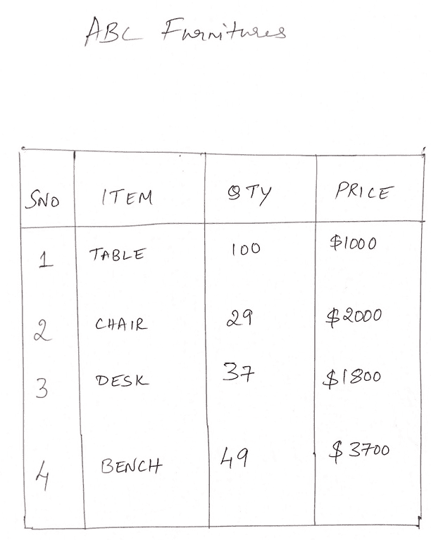
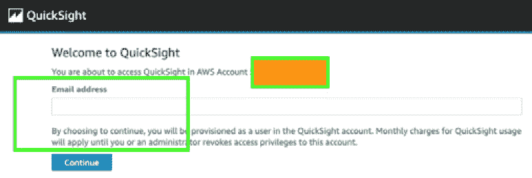
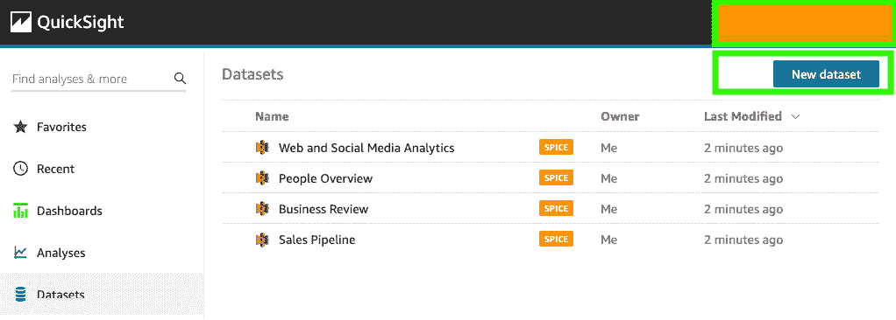
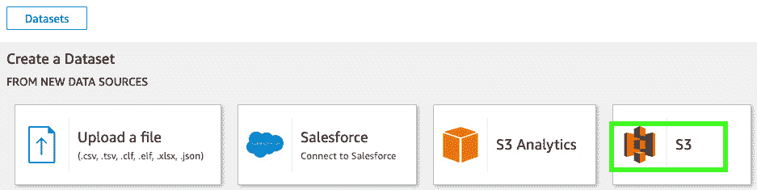
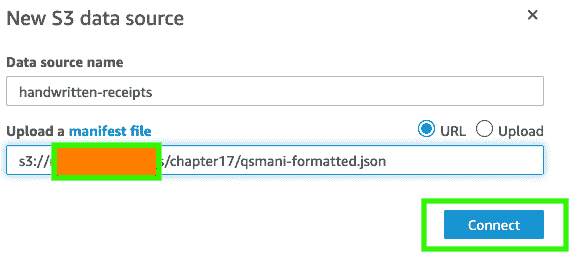
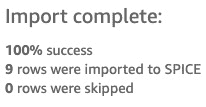
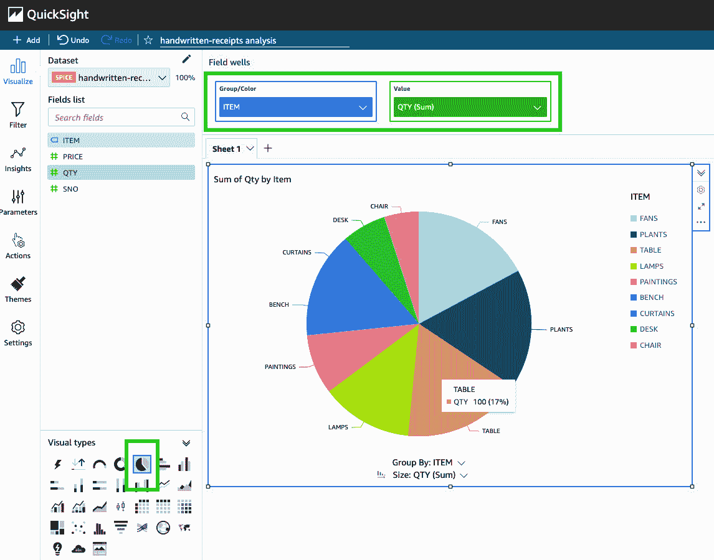
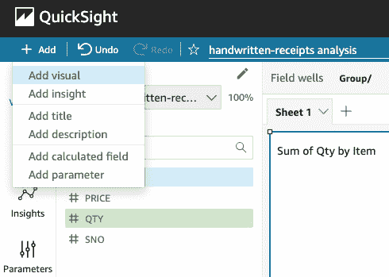
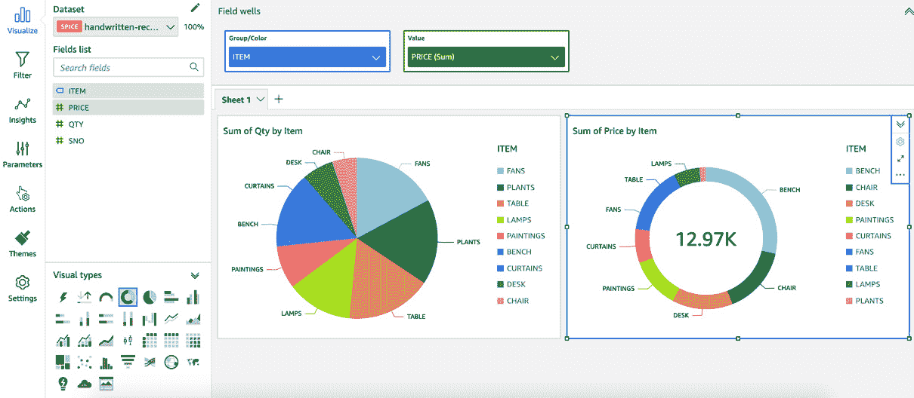
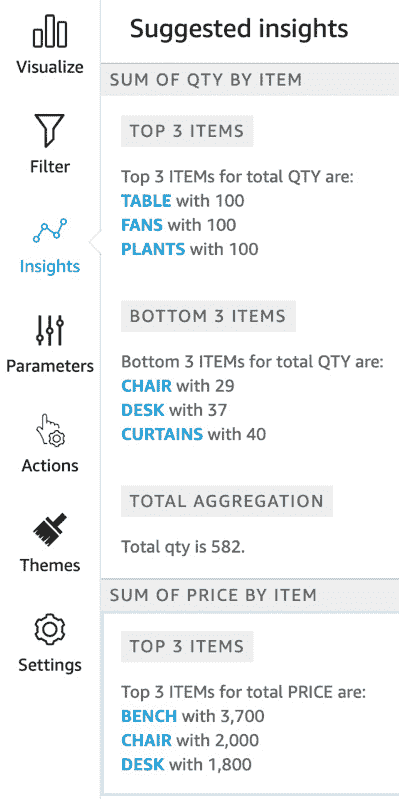

# 第十七章：*第十七章*：从手写内容中可视化见解

在前几章中，我们讨论并学习了如何使用**Amazon Textract**、**Amazon Comprehend**和**Amazon A2I**构建**智能文档处理**（**IDP**）流水线。设置此类流水线的优势在于，你可以将自动化引入到你的运营流程中，并解锁以前不太明显的见解。说到见解，它们究竟是什么？为什么每个人都如此热衷于从文本中挖掘见解，它们到底有什么用呢？

为了解答这个问题，让我们召唤*Doc Brown*和*马蒂·麦克弗莱*的时光旅行车，电影*回到未来*中的*DeLorean*，回到*第一章*，*商业环境中的 NLP 及 AWS AI 服务简介*，重新阅读*理解为什么 NLP 正在成为主流*这一部分。你现在记得了吗？也许这样能帮到你：根据*韦伯斯特词典*（[`www.merriam-webster.com/`](https://www.merriam-webster.com/)），“*见解*”一词被定义为“*理解事物内在本质或直觉性地看到的行为或结果*”。你明白了——这就是从看似模糊甚至平凡的数据中发现有用信息。简单来说，它意味着“*清晰地看到*”。

本章将介绍如何将文本中的见解可视化——也就是手写文本——并利用这些见解推动决策制定。根据维基百科，已知最早的手写文字是**楔形文字**（[`en.wikipedia.org/wiki/Cuneiform`](https://en.wikipedia.org/wiki/Cuneiform)），大约出现在 5500 多年前。与此一样古老的，还有其中一位作者的母语——泰米尔语，无论是在口语还是书写形式上都已有几千年的历史。话虽如此，现在让我们回到我们最喜爱的虚构组织——**LiveRight Holdings**，解决他们似乎遇到的新挑战。

你被赋予了为公司举办创始人日的任务，这场活动预计将是一场盛大的庆典，因为 LiveRight 的知名度日益提高。为了跟上 LiveRight 文化，推动社区利益，你需要与几家当地供应商合作，为活动提供所需的家具、食物及其他物品。你被告知管理层需要所有支出的汇总报告，所以你决定使用现有的文档处理流水线来处理他们的收据。然而，令你沮丧的是，你发现当地供应商仅提供手写收据。你记得你之前构建的一个解决方案中，Amazon Textract 支持手写内容，于是你开始思考如何最好地设计这个解决方案。

本章将涵盖以下主题：

+   从手写图像中提取文本

+   使用 Amazon QuickSight 可视化见解

# 技术要求

本章需要你拥有一个 AWS 账户，你可以在[`aws.amazon.com/console/`](https://aws.amazon.com/console/)注册。有关如何注册 AWS 账户并登录**AWS 管理控制台**的详细说明，请参考*第二章*中的*注册 AWS 账户*小节，*介绍 Amazon Textract*部分。

本章讨论的解决方案的 Python 代码和示例数据集可以在[`github.com/PacktPublishing/Natural-Language-Processing-with-AWS-AI-Services/tree/main/Chapter%2017`](https://github.com/PacktPublishing/Natural-Language-Processing-with-AWS-AI-Services/tree/main/Chapter%2017)找到。

请查看以下视频，了解代码的实际操作：[`bit.ly/3vLX5j0`](https://bit.ly/3vLX5j0)。

# 从手写图像中提取文本

此时，你已经准备好开始设计和构建方案。你意识到，为这个用例所构建的内容将成为现有文档处理解决方案的扩展，因此将在组织内长期使用。所以，你需要为未来的可扩展性进行设计。考虑到这一点，你决定使用**Amazon S3**（[`aws.amazon.com/s3/`](https://aws.amazon.com/s3/)）作为对象存储，**Amazon Textract**（[`aws.amazon.com/textract/`](https://aws.amazon.com/textract/)）进行手写识别，**Amazon QuickSight**（[`aws.amazon.com/quicksight/`](https://aws.amazon.com/quicksight/)），这是一项无服务器的、由机器学习驱动的商业智能服务，用于可视化手写内容的洞察。我们将使用 Amazon SageMaker Jupyter notebook 进行文本提取，然后使用 AWS 管理控制台来设置 QuickSight 可视化。让我们开始吧。

## 创建 SageMaker Jupyter notebook

如果你在前面的章节中没有进行过此操作，你需要创建一个 Amazon SageMaker Jupyter notebook，并为该 Notebook 角色设置**身份和访问管理**（**IAM**）权限，以便访问我们将在此 notebook 中使用的 AWS 服务。之后，你需要克隆本书的 GitHub 仓库（[`github.com/PacktPublishing/Natural-Language-Processing-with-AWS-AI-Services`](https://github.com/PacktPublishing/Natural-Language-Processing-with-AWS-AI-Services)），创建一个 Amazon S3 存储桶（[`aws.amazon.com/s3/`](https://aws.amazon.com/s3/)），并在 notebook 中提供存储桶名称以开始执行。

注意

请确保你已完成*技术要求*部分中提到的任务。

在执行 notebook 中的单元格之前，请按照以下步骤完成这些任务：

1.  按照*第二章*中*设置你的 AWS 环境*章节下的*创建一个 Amazon SageMaker Jupyter 笔记本实例*子章节中的说明，创建你的 Jupyter 笔记本实例。

    创建 Amazon SageMaker Jupyter 笔记本时的 IAM 角色权限

    在创建笔记本时接受 IAM 角色的默认设置，以允许访问 S3 存储桶。

1.  一旦你创建了笔记本实例并且其状态为**InService**，点击**操作**菜单中的**打开 Jupyter**，以获取笔记本实例。

1.  这将带你进入笔记本实例的主文件夹。

1.  点击**新建**并选择**终端**。

1.  如果你还没有这样做，在终端窗口中输入`cd SageMaker`，然后输入`git clone https://github.com/PacktPublishing/Natural-Language-Processing-with-AWS-AI-Services`。

1.  现在，退出终端窗口并返回到主文件夹；你将看到一个名为`Natural-Language-Processing-with-AWS-AI-Services`的文件夹。点击该文件夹，打开章节文件夹，并点击**第十七章**。

1.  点击该文件夹以打开。你应该会看到一个名为`chapter17-deriving-insights-from-handwritten-content-forGitHub.ipynb`的笔记本。点击它以打开。我们将在接下来的章节中使用此笔记本。现在，请保持此窗口打开。

接下来，我们将介绍一些额外的 IAM 先决条件。

## 额外的 IAM 先决条件

我们需要为 SageMaker 笔记本角色启用额外的策略。请参考*第二章*中*设置你的 AWS 环境*章节下的*更改 IAM 权限和信任关系以便于 Amazon SageMaker 笔记本执行角色*子章节中的详细说明，执行以下步骤：

1.  如果你还没有这样做，请将所有`TextractFullAccess`策略附加到你的 Amazon SageMaker 笔记本 IAM 角色上。

1.  将`iam:PassRole`权限作为内联策略添加到你的 SageMaker 笔记本执行角色中：

    ```py
    { "Version": "2012-10-17", "Statement": [ {
      "Action": [
          "iam:PassRole"
      ],
      "Effect": "Allow",
      "Resource": "<your sagemaker notebook execution role ARN">
      }
     ]
    }
    ```

现在我们已经设置好了笔记本并为运行演练笔记本设置了 IAM 角色，在接下来的章节中，我们将创建一个 Amazon S3 存储桶。

## 创建一个 Amazon S3 存储桶

按照*第二章*中*设置你的 AWS 环境*章节下的*创建一个 Amazon S3 存储桶、一个文件夹，并上传对象*子章节中的说明，创建你的 Amazon S3 存储桶。如果你在前面的章节中已经创建了 S3 存储桶，请重新使用该存储桶。对于本章，你只需创建 S3 存储桶；我们将直接通过笔记本创建文件夹并上传必要的对象。让我们开始吧：

1.  一旦你有了存储桶的名称，请在笔记本的*STEP 0 – CELL 1*中输入该名称：

    ```py
    bucket = "<enter-S3-bucket-name>"
    ```

1.  通过点击笔记本 UI 顶部菜单中的**运行**按钮，执行*步骤 0 – 单元格 1*。或者，你也可以按**Shift** **+ Enter**来执行该单元格。这将导入我们需要的库，初始化它们的变量，并为下一组步骤准备好内核。

现在我们已经创建了 S3 存储桶并导入了所需的库，接下来让我们使用**Amazon Textract**提取内容。

## 使用 Amazon Textract 提取文本

我们现在将继续执行笔记本中的其余单元格，以更新 QuickSight 清单文件，包含我们的存储桶和前缀条目。清单文件为 QuickSight 数据集提供元数据，以便正确导入内容进行可视化。更多详情，请参阅文档（[`docs.aws.amazon.com/quicksight/latest/user/create-a-data-set-s3.html`](https://docs.aws.amazon.com/quicksight/latest/user/create-a-data-set-s3.html)）。让我们开始吧：

1.  执行*步骤 1 – 单元格 1*以格式化清单文件，加入存储桶和前缀名称。

1.  现在，执行*步骤 1 – 单元格 2*将格式化后的清单文件上传到 S3 存储桶：

    ```py
    s3 = boto3.client('s3')
    s3.upload_file(outfile,bucket,prefix+'/'+outfile)
    ```

1.  我们将得到以下输出。请复制这里打印出的 S3 位置，稍后在设置 QuickSight 时需要用到：

    ```py
    Manifest file uploaded to: s3://<your-bucket-name>/chapter17/qsmani-formatted.json
    ```

1.  现在，执行*步骤 2 – 单元格 1*以安装**Amazon Textract Response Parser**（**TRP**）（[`github.com/aws-samples/amazon-textract-response-parser/blob/master/src-python/README.md`](https://github.com/aws-samples/amazon-textract-response-parser/blob/master/src-python/README.md)），这是一个帮助库，提供了一种简便的方法来解析 Textract 的 JSON 响应：

    ```py
    !python -m pip install amazon-textract-response-parser
    ```

1.  执行*步骤 2 – 单元格 2*以导入解析器的 Document 类，我们需要它来初始化 boto3 处理程序以用于 Textract。

1.  *步骤 2 – 单元格 3*做了几件事，让我们分部分来看。首先，它会在当前目录中查找以*.jpg*扩展名结尾的文件。这些是我们手写收据的输入图像文件。以下是其中一张收据：

    图 17.1 – 一张手写收据的示例

1.  当找到这些文件时，会逐个读取并转换成字节数组：

    ```py
    for docs in os.listdir('.'):
        if docs.endswith('jpg'):
            with open(docs, 'rb') as img:
                img_test = img.read()
                bytes_test = bytearray(img_test)
    ```

1.  接下来，它调用`AnalyzeDocument` Textract API，并将`bytearray`作为输入，特别是从输入图像中寻找表格和表单。然后，Textract 响应会被 Textract Response Parser 库解析，结果存储在一个变量中。接着，我们必须遍历这些结果，找到表格，并初始化一个变量，表示我们将写入的 CSV 文件：

    ```py
    response = textract.analyze_document(Document={'Bytes': bytes_test}, FeatureTypes=['TABLES','FORMS'])
            text = Document(response)
            for page in text.pages:
                for table in page.tables:
                    csvout = docs.replace('jpg','csv')
                    with open(csvout, 'w', newline='') as csvf:
    ```

1.  最终，单个单元格的值会写入 CSV 文件中，同时去除空格（如果有的话）以及表示货币的`$`符号。最后，新的 CSV 文件会上传到 S3 存储桶。对于输入文件夹中找到的每个图像文件，都会重复此过程：

    ```py
    tab = csv.writer(csvf, delimiter=',')
                        for r, row in enumerate(table.rows):
                            csvrow = []
                            for c, cell in enumerate(row.cells):
                                if cell.text:
                                    csvrow.append(cell.text.replace('$','').rstrip())
                            tab.writerow(csvrow)
            s3.upload_file(csvout,bucket,prefix+'/dashboard/'+csvout)
    ```

1.  执行*步骤 2 – 单元格 3* 完成前述步骤中概述的任务。我们将得到以下输出。请记下 CSV 文件的 S3 位置。我们之前格式化的清单文件包含这些位置，允许 QuickSight 上传这些 CSV 文件：

    ```py
    Extracted text from hw-receipt2.jpg
    CSV file for document hw-receipt2.jpg uploaded to: s3://<s3-bucket-name>/chapter17/dashboard/hw-receipt2.csv
    Extracted text from hw-receipt1.jpg
    CSV file for document hw-receipt1.jpg uploaded to: s3://<s3-bucket-name>/chapter17/dashboard/hw-receipt1.csv
    ```

    注意

    您还可以在此解决方案中使用**Amazon A2I**，设置人工循环来审查 Textract 输出，并根据需要对内容进行更改，然后创建 CSV 文件。更多详细信息，请参考*第十三章*，*提高文档处理工作流的准确性*，继续阅读。

这标志着笔记本中的步骤已经完成。接下来，我们将登录 AWS 管理控制台，设置 QuickSight 以进行可视化。

# 使用 Amazon QuickSight 进行洞察可视化

首先，我们需要为您的 AWS 账户启用 QuickSight，才能导入数据并运行可视化。请执行以下步骤继续：

1.  登录到 AWS 管理控制台（如果没有访问权限，请参考*技术要求*部分），并在页面顶部中间的服务搜索框中输入`QuickSight`。点击搜索结果中的**QuickSight**，进入**QuickSight 注册**页面。

1.  输入您的电子邮件地址并点击**继续**：

    图 17.2 – 注册 QuickSight

1.  登录后，点击左侧面板中的**数据集**，然后点击右上角的**新建数据集**按钮：

    图 17.3 – 新建数据集

1.  点击**数据集**页面上的**S3**：

    图 17.4 – S3

1.  在弹出的窗口中，对于`handwritten-receipts`，在**上传清单文件**输入区域，复制并粘贴在 Jupyter 笔记本中 *步骤 1 – 单元格 2* 打印的 S3 位置。然后，点击**连接**：

    图 17.5 – 指定 S3 清单文件

1.  数据集导入完成后，点击`Chapter17/dashboard`前缀：

    图 17.6 – 数据集导入成功

1.  您应该看到左侧显示来自 CSV 文件的列名，位于**字段列表**下方。您应该看到一个中间面板，里面有一个名为**AutoGraph**的图形空间。当您从左侧列表中添加字段时，QuickSight 会根据您的数据自动创建适当的图形。

1.  对于我们的使用案例，我们将创建饼图和甜甜圈图来可视化已订购的家具数量及其费用。在左侧的**视觉类型**部分，点击饼图符号，并将字段从**字段列表**添加到图表中，如下所示：

    图 17.7 – 可视化各类家具的数量

1.  现在，让我们向这个仪表板添加一个新的可视化。点击左上方的 **Add**，然后选择 **Add visual**：

    Figure 17.8 – 添加可视化

1.  现在，添加一个甜甜圈图来显示总成本和按家具类型分类的成本，如下图所示。首先，在左侧的 **Visual types** 部分选择甜甜圈可视化，选择 **ITEM** 和 **PRICE**，然后将它们添加到 **Group/Color** 和 **Value** 字段中：

    Figure 17.9 – 用于可视化总成本和按家具类型分类的成本的甜甜圈图

1.  在控制台左侧中间点击 **Insights** 选项，显示 QuickSight 能够从我们的数据中提取的见解：



Figure 17.10 – QuickSight 从我们的数据中提取的见解

就这么简单。随时可以尝试其他类型的可视化，以及 ML 驱动的预测和见解。有关更多详情，请参考以下文档：[`docs.aws.amazon.com/quicksight/latest/user/making-data-driven-decisions-with-ml-in-quicksight.html`](https://docs.aws.amazon.com/quicksight/latest/user/making-data-driven-decisions-with-ml-in-quicksight.html)。您可以设置、共享、发布或导出仪表板，以供管理层和其他利益相关者使用。这也标志着本用例解决方案构建的结束。

# 总结

在这个用例中，我们只是触及了我们能够处理书面文本的一小部分——可能性真的是无穷无尽的！只需几个步骤，通过利用 Amazon Textract 等服务提供的先进 AI 能力，以及 Amazon QuickSight 提供的无服务器可扩展可视化，我们就能够从一张纸上潦草的内容中创建出强大的可视化效果。

我们首先创建了这个解决方案所需的 SageMaker Jupyter notebook 实例，克隆了本章的 GitHub 仓库，创建了一个 S3 存储桶，并在 notebook 中执行了步骤以格式化 QuickSight S3 清单文件。然后，我们使用 Amazon Textract 和 Textract Response Parser 库读取手写收据的内容，之后创建了 CSV 文件并上传到 S3 存储桶。在执行完这些步骤后，我们结束了 notebook，并登录到 AWS 管理控制台，注册使用 Amazon QuickSight。

在 QuickSight 中，我们导入了包含 CSV 文件的 S3 数据集，并创建了两个可视化图表和一个洞察。第一个图表是一个饼图，显示了已订购物品与其数量的对比，第二个图表是一个甜甜圈图，显示了两张收据的总成本，以及每个物品的成本。最后，我们展示了 QuickSight 自动生成的洞察，提供了它从我们的内容中读取到的摘要。我们简要讨论了如何导出或分享仪表板及 QuickSight 的基于 ML 的洞察。这也完成了本章的解决方案构建。

基于本书至今覆盖的众多使用案例，你已经知道如何为你和你的客户解决 NLP 中的主流挑战，而且我们完成这一切时没有需要调优任何超参数或从零开始训练模型。当然，我们训练了几个自定义的 Comprehend 模型，但那是没有传统机器学习工作流开销的。

在下一章，我们将结束本书，因此我们想留下些最佳实践、技巧和指南，供你在作为 NLP 和 AI 专家的职业生涯中随时参考。我们将讨论文档的预处理、后处理以及在解决方案设计过程中需要考虑的其他事项。我们快到了！
