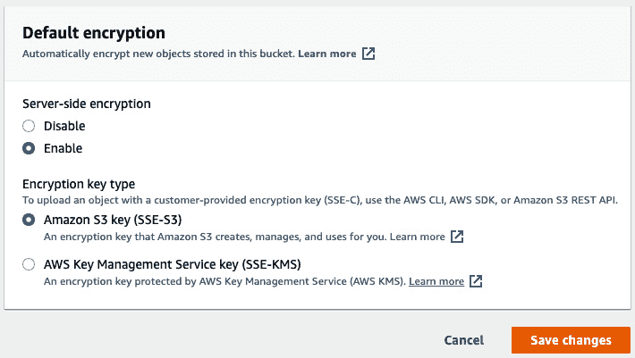

# 第十八章：*第十八章*：构建安全、可靠和高效的 NLP 解决方案

感谢亲爱的读者在这段（希望对您有帮助的）旅程中陪伴我们，帮助组织构建最佳的**自然语言处理**（**NLP**）解决方案，以从文本数据中发现洞察。本书的写作目的是让人们意识到，**人工智能**（**AI**）已经成为主流，我们正处于一个巨大的人工智能采用浪潮的边缘，许多企业都在朝着这个方向前进。这项激动人心的技术不仅能帮助你提升职业生涯，还为你提供了探索以前无法实现的创新领域的机会。例如，根据 BBC 的一篇文章（[`www.bbc.com/future/article/20181129-the-ai-transforming-the-way-aircraft-are-built`](https://www.bbc.com/future/article/20181129-the-ai-transforming-the-way-aircraft-are-built)），**Autodesk**（[`www.autodesk.com/`](https://www.autodesk.com/)）这家全球领先的设计和制造技术公司，使用**生成式人工智能**（[`www.amazon.com/Generative-AI-Python-TensorFlow-Transformer/dp/1800200889`](https://www.amazon.com/Generative-AI-Python-TensorFlow-Transformer/dp/1800200889)）帮助飞机制造商设计更高效的机身框架，这是减少燃油消耗的关键要求。

在本书中，我们回顾了企业今天处理的几种用例类型，旨在从基于文本的数据中获取有用信息。这些信息要么直接帮助他们提取洞察，要么作为推动下游决策的前兆，在这两种情况下都具有操作性影响。我们阅读了不同的商业场景，讨论了满足这些需求的不同解决方案设计方法、架构实施框架，以及实时和批处理解决方案。

现在我们了解如何使用**AWS** **AI** **服务**设计、架构和构建 NLP 解决方案，但我们仍然缺少一个重要步骤。我们如何确保我们的解决方案已经准备好投入生产？在处理真实世界数据时，确保解决方案按预期工作需要满足哪些操作要求？架构需要遵守哪些非功能性要求？我们该如何在实现过程中将这些融入解决方案？为了回答这些问题，我们将回顾最佳实践、技巧和指导，阐明如何让一个优秀的 NLP 解决方案更加出色。

在本章中，我们将讨论以下主题：

+   定义 NLP 解决方案的最佳实践

+   应用最佳实践进行优化

# 技术要求

对于本章，您需要访问一个 AWS 账户（[`aws.amazon.com/console/`](https://aws.amazon.com/console/)）。

请参阅 *第二章* 中 *设置您的 AWS 环境* 部分的 *注册 AWS 账户* 子部分，详细了解如何注册 AWS 账户并登录到**AWS** **管理控制台**的说明。

# 定义自然语言处理（NLP）解决方案的最佳实践。

如果您以前做过 DIY（自己动手）项目，您就知道工具对您的工作有多重要。在构建自然语言处理解决方案或任何解决方案时，您需要牢记以下几点：

+   您需要了解您的需求（"*what*"）。

+   您需要了解构建解决方案解决的问题（"*why*"）。

+   您需要了解构建解决方案所需的工具和技术（"*how*"）。

+   您需要估计构建解决方案所需的时间（"*when*"）。

+   最后，您需要确定团队所需的技能（"*who*"）。

但是，采用这种方法，您未必能够解决使解决方案可靠、可扩展、高效、安全或具有成本效益的需求。而这些同样重要（甚至更重要），以构建能够让客户满意的长久解决方案。

在构建使用 AWS 时，您可以获得几十年构建和运营高性能、大规模应用程序（如**亚马逊**）的经验中获得的指导和宝贵见解，以及帮助全球最大企业在 AWS 上运行其云工作负载的专业知识。所有这些经验和知识都已整理成一套架构指南和最佳实践，称为**AWS Well-Architected Framework**。

将*良构建*视为一个由五个支柱定义的全面问题清单。

+   **运营卓越**：运营卓越支柱建议自动化基础设施的提供和管理（如果适用），将解决方案架构模块化为可以独立管理的组件，实现敏捷性，实施基于 CI/CD 的 DevOps 实践，模拟运营故障，并为其做准备并从中学习。

+   **安全性**：安全性支柱建议通过从最基础的开始实施最少特权治理措施和相关的保护措施，注重身份和访问管理，计算和网络安全，数据在传输和静态状态下的保护，自动化，模拟和事件响应，将安全置于首要位置。

+   **可靠性**：可靠性支柱要求建立高度弹性的架构，能够从故障中自我修复，注重快速失败和恢复测试，具有自动缩放的弹性能力，并且高度自动化。

+   **性能效率**：性能效率支柱建议使用**AWS 管理服务**（**AMS**），以去除与管理基础设施相关的无差异重负担，利用全球 AWS 网络减少终端用户的延迟，并通过 API 去除重复实验和资源交互的耦合需求。

+   **成本优化**：成本优化支柱提供有关你可以采取的措施的建议，帮助你追踪并最小化使用成本。

欲了解更多有关*良好架构框架*的详细信息，以及帮助你入门的资源，请访问 Amazon 文档：[`docs.aws.amazon.com/wellarchitected/latest/framework/welcome.html`](https://docs.aws.amazon.com/wellarchitected/latest/framework/welcome.html)

从整体来看，各个支柱的良好架构问题引导你完成架构设计、构建和实施。这使得你能够融入关键设计原则，构建出安全、可靠、经济高效且高效运作的解决方案（因此得名“良好架构”）。那么，在我们的案例中，良好架构对于 NLP 解决方案和 AI 服务意味着什么呢？为了帮助你清楚地理解这一点，我们将创建一个良好架构支柱矩阵，结合 NLP 开发阶段，如文档预处理、预测和后处理，并从我们在本书中使用的主要 AWS AI 服务（**Amazon** **Textract** 和 **Amazon** **Comprehend**）的角度进行说明。我们还将探讨在构建 NLP 解决方案时普遍应用的原则。在矩阵的每个单元格中，我们将总结如何使用最佳实践应用良好架构原则进行设计和实施。


图 18.1 – 良好架构的 NLP 解决方案矩阵

从前面的矩阵中可以看出，在解决方案开发过程中，你可以采用一些设计原则来构建高效且安全的 NLP 应用。为了明确起见，我们将这些原则根据良好架构框架支柱和 NLP 开发阶段分开。但是，正如你可能注意到的，有些原则在各个单元格中是重复的。这是因为某个支柱原则的应用可能会自动解决其他支柱的需求，这取决于我们所参考的原则。例如，当使用**AWS** **Glue** **ETL** 作业进行文档预处理和后处理任务时，我们的良好架构需求——包括运营卓越、成本优化和性能效率，都会得到满足，而无需做其他额外工作。

我们将在下一节中更详细地解释这一原因。本节中我们介绍了 AWS Well-Architected 框架，并回顾了如何将 Well-Architected 原则应用于本书中使用的 AWS AI 服务的矩阵。在下一节中，我们将深入探讨并讨论如何实现矩阵中的一些原则。

# 应用优化的最佳实践

在本节中，我们将深入探讨我们在《Well-Architected NLP 解决方案矩阵》中记录的每个设计原则的含义，以及如何根据您的需求实施这些原则。由于本书的范围主要是关于 AWS AI 服务，我们已经有了使用无服务器托管服务的优势，这解决了《Well-Architected 框架》中提到的多个建议。此外，如前所述，矩阵中记录的一些最佳实践可能看起来有些重复——这并不是错误，而是有意为之，因为应用某一种设计模式可能会在《Well-Architected 框架》的多个支柱中产生级联效益。我们将在遇到时重点说明这些内容。话不多说，让我们开始深入探讨。

## 使用 AWS S3 数据湖

本节涉及《Well-Architected NLP 解决方案矩阵》中的原则*1.1a*和*1.3a*（*图 18.1*）。

**数据湖**是一个用于存储结构化、半结构化和非结构化数据的仓库。最初，它是来自企业不同来源的数据集合，并作为下游分析、商业智能、**机器学习**（**ML**）和运营需求的数据来源。然而，由于数据加载到数据湖时保持其源格式（数据在加载到数据湖之前不会进行转换），因此在从数据湖中获取数据时，数据需要进行转换。使用**Amazon S3**（AWS 云中的完全托管对象存储解决方案）构建数据湖非常有意义，因为它可以根据需要进行扩展，并且存储在 S3 中的数据具有高度耐久性（更多信息，请参见关于*“11 个 9s”*耐久性的部分（[`aws.amazon.com/s3/faqs/`](https://aws.amazon.com/s3/faqs/)）。

此外，AWS 提供了多种方式，帮助你将数据导入到 S3，并提供几种选项，帮助你从 S3 读取数据、转换数据并将其提供给消费者，以满足你的各种需求，所有这些步骤都以高度安全的方式进行。有关如何在 S3 上创建数据湖、将数据源注入数据湖、创建数据目录以及如何安全管理和转换数据的详细信息，请参考*《构建大数据存储解决方案》*白皮书（[`docs.aws.amazon.com/whitepapers/latest/building-data-lakes/building-data-lake-aws.html`](https://docs.aws.amazon.com/whitepapers/latest/building-data-lakes/building-data-lake-aws.html)）。有关如何使用**AWS** **Lake Formation**（一个用于构建和管理数据湖的完全托管服务）设置数据湖的说明，请参考入门指南（[`docs.aws.amazon.com/lake-formation/latest/dg/getting-started.html`](https://docs.aws.amazon.com/lake-formation/latest/dg/getting-started.html)）。

现在让我们讨论如何使用 AWS Glue 进行数据处理。

## 使用 AWS Glue 进行数据处理和转换任务

本节涵盖了《Well-Architected NLP 解决方案矩阵》中的原则*1.4a*、*1.5a*、*3.1a*、*3.4b*和*3.5a*（*图 18.1*）。

AWS Glue 是一个完全托管的无服务器数据目录、处理和转换服务，它使你能够构建端到端的 ETL 管道，提供现成的连接，以连接本地和 AWS 上的数据存储。AWS Glue 的无服务器托管特性消除了与基础设施管理和重复繁重工作相关的成本。AWS Glue 使你能够配置与数据存储以及 S3 数据湖的连接，直接拉取数据进行文档预处理。你可以使用 Glue ETL 作业在数据转换（如有需要）后将数据传送到 NLP 解决方案管道中，无论是用于训练自定义 NLP 模型，还是在推理时进行预测。这使得你的解决方案更加优雅和高效，避免了需要创建多个解决方案组件来处理这些任务。

AWS Glue ETL 作业可以根据你的需求按需触发或计划执行。你还可以在 NLP 解决方案完成识别或分类任务后，使用它进行文档后处理，以将数据持久化到下游数据存储，或供需要这些数据的操作流程使用。有关 AWS Glue 如何帮助你的详细演示，请参考以下使用**AWS** **Glue Studio**的教程，它是一个图形化界面，可以让你在创建和运行 ETL 作业时更方便地与 Glue 进行交互：[`docs.aws.amazon.com/glue/latest/ug/tutorial-create-job.html`](https://docs.aws.amazon.com/glue/latest/ug/tutorial-create-job.html)

在下一节中，我们将回顾如何使用**Amazon** **SageMaker** **Ground Truth**来进行文本标注任务。

## 使用 Amazon SageMaker Ground Truth 进行标注

本节讲解了 Well-Architected NLP 解决方案矩阵中的原则 *1.4b* (*图 18.1*)。

NLP 模型的准确性与其所基于的标注数据的质量成正比。虽然我们主要使用 AWS AI 服务中已预训练的模型，但我们也看到了一些需要使用 Amazon Comprehend 自定义模型进行实体识别和分类任务的用例。Amazon Comprehend 自定义模型使用**迁移学习**，通过使用我们提供的数据（即对我们业务独特的数据），从其自身的预训练模型中逐步训练自定义模型。因此，对于这些自定义训练需求，我们需要提供高质量的标注数据，这将影响我们模型的准确性。作为最佳实践，我们建议使用 Amazon SageMaker Ground Truth ([`aws.amazon.com/sagemaker/groundtruth/`](https://aws.amazon.com/sagemaker/groundtruth/)) 来处理这些标注任务。Ground Truth 已与 Amazon Comprehend 直接集成，你只需在设置 Amazon Comprehend 作业时，指向 Ground Truth 清单的位置。

Ground Truth 是一项完全托管的服务，提供易于使用的数据标注功能，可以选择使用你自己的私有劳动力、来自 **AWS** **Marketplace** 的第三方数据标注者，或者使用 **Amazon** **Mechanical Turk** 提供的众包公共数据标注者。

Ground Truth 默认提供数据加密，并通过在后台训练一个机器学习（ML）模型，自动学习人类标注者执行的标注活动。一旦达到一定的置信度阈值，Ground Truth 将应用该 ML 模型来自动化标注任务。Ground Truth 提供了适用于多种数据格式（如图像、文本和视频文件）的预构建任务模板。你还可以通过在创建标注作业时选择**自定义**任务类型，创建适合自己需求的模板。请参见以下截图，了解 Ground Truth 支持的不同类型的基于文本的标注任务：


图 18.2 – Amazon SageMaker Ground Truth 中的文本标注任务类型

要开始使用，你需要创建一个标注作业，选择数据集的 S3 存储位置，指定 **IAM** 角色（或者让 Ground Truth 为你创建一个），从预构建模板列表中选择任务类别（或者你可以选择 **自定义** 来创建自己的模板），并选择将处理你请求的标注劳动力。有关如何开始的更多细节，请参考以下文档：[`docs.aws.amazon.com/sagemaker/latest/dg/sms-label-text.html`](https://docs.aws.amazon.com/sagemaker/latest/dg/sms-label-text.html)

现在我们已经了解了如何使用 Ground Truth 进行标注，让我们回顾一下最近推出的新功能，它可以直接从**PDF**或**Microsoft** **Word**文档进行**自定义实体识别器训练**。

## 直接使用 Amazon Comprehend 处理 PDF 和 Word 格式

本节涉及 Well-Architected NLP 解决方案矩阵中的原则*1.4c*（*图 18.1*）。

注意：

Amazon Comprehend 在 2021 年 9 月更新了自定义实体识别功能，以支持直接使用 PDF 和 Word 文档进行训练和推理。

为了提高 NLP 解决方案管道的性能效率，Amazon Comprehend 现在支持直接从 PDF 和 Word 文档格式训练自定义实体识别器，而无需执行预处理步骤将文档转换为机器可读的格式。要使用此功能，您可以按照我们在*第十四章*中指定的步骤，即*审计命名实体识别工作流*，训练 Amazon Comprehend 自定义实体识别器，但有一个小的不同之处。

注意：

您仍然需要在训练文档中标注实体，并使用 Ground Truth 创建增强的清单。更多细节，请参考此博客中的说明：[`aws.amazon.com/blogs/machine-learning/custom-document-annotation-for-extracting-named-entities-in-documents-using-amazon-comprehend/`](https://aws.amazon.com/blogs/machine-learning/custom-document-annotation-for-extracting-named-entities-in-documents-using-amazon-comprehend/)

请按照以下步骤，直接使用 Amazon Comprehend 从 PDF 或 Word 文档中进行训练和推理：

1.  登录到您的 AWS 管理控制台（更多细节请参见*技术要求*部分），并在**服务**搜索栏中输入`comprehend`。

1.  在左侧面板中点击**自定义实体识别**，然后点击**创建新模型**。

1.  在**模型设置**部分，为您的模型提供名称，并向下滚动至**数据规范**部分，选择**增强的清单**和**PDF、Word 文档**格式进行训练。提供增强清单的 S3 位置。向下滚动以选择或创建 IAM 角色，并点击**创建**以开始训练。一旦模型训练完成，您可以使用我们在*第十四章*中讨论的相同步骤进行推理，*审计命名实体识别工作流*。但是，提供 PDF 或 Word 文档作为输入，而不是 CSV 文件。


图 18.3 – 使用 PDF、Word 文档进行 Amazon Comprehend 自定义实体识别器训练

这个功能更新提高了预处理效率，并减少了设置我们的 NLP 解决方案管道时的前期时间投入。在下一部分，我们将回顾如何在构建 NLP 解决方案时强制执行访问控制。

## 强制实施最小权限访问

本节讨论了来自“良好架构化 NLP 解决方案矩阵”（*图 18.1*）的原则 *1.2c*、*3.2b* 和 *4.2a*。

高度安全架构的核心原则之一是强制实施所谓的 *最小权限访问资源*。**AWS** **身份与访问管理**（**IAM**）是一个安全服务，它允许为您的用户定义并实施身份验证和授权策略，以确保对 AWS 基础设施的安全访问。通过 IAM，您可以创建权限策略，这些策略附加到角色或用户（*身份*）上，定义该身份能够或不能使用 AWS 服务（*资源*）执行哪些（*操作*）。如其名所示，最小权限就是为您的用户和角色定义高度限制性的权限策略。在 AWS 中，默认的权限是 *拒绝*。

如果没有为用户指定策略，则该用户没有权限在 AWS 中执行任何操作。因此，您需要添加策略声明，允许用户或角色使用 AWS 服务或资源执行特定任务。在本书的示例中，由于用例的性质以及为了简化和方便配置，我们建议您将托管权限策略（例如 *TextractFullAccess* 或 *ComprehendFullAccess*）添加到您的 **SageMaker 执行 IAM 角色** 中，用于您的笔记本。当您构建您的 NLP 解决方案并将其推广到生产环境时，作为最佳实践，您应该强制实施最小权限访问。让我们通过一个示例来讨论这意味着什么。*ComprehendFullAccess* 权限策略由以下 **JSON** 语句定义：

```py
{
    "Version": "2012-10-17",
    "Statement": [
        {
            "Action": [
                "comprehend:*",
                "s3:ListAllMyBuckets",
                "s3:ListBucket",
                "s3:GetBucketLocation",
                "iam:ListRoles",
                "iam:GetRole"
            ],
            "Effect": "Allow",
            "Resource": "*"
        }
    ]
}    
```

如果您参考前面 JSON 代码中突出显示的部分，附加在 `"comprehend"` 上的通配符（`*`）表示允许角色或用户使用此策略执行所有 Amazon Comprehend API 操作。这不是一个限制性的策略，而是提供了广泛的权限集。

为了强制实施最小权限访问，应该创建一个新的策略，并按照以下 JSON 语句进行更改：

```py
{
    "Version": "2012-10-17",
    "Statement": [
        {
            "Action": [
                "comprehend:DetectEntities",
                "comprehend:BatchDetectEntities",
                "comprehend:DetectPiiEntities",
                "comprehend:ContainsPiiEntities",
                "s3:ListAllMyBuckets",
                "s3:ListBucket",
                "s3:GetBucketLocation",
                "iam:ListRoles",
                "iam:GetRole"
            ],
            "Effect": "Allow",
            "Resource": "*"
        }
    ]
}
```

在这个更改后的 JSON 声明中，我们提供了限制性权限，允许用户或角色仅使用 Amazon Comprehend 中的**实体检测**功能。一种好的做法是仅提供完成任务所需的最基本权限。此外，你还需要确保监控 IAM 角色和策略分配，以确保在用户或角色完成任务后清理权限。这样可以避免因旧权限导致用户获得超出其需求的访问权限。AWS 提供了一种名为**IAM 访问分析器**的功能，用于主动监控权限并根据需要采取措施。有关 Access Analyzer 的详细介绍，请参考以下文档：[`docs.aws.amazon.com/IAM/latest/UserGuide/what-is-access-analyzer.html`](https://docs.aws.amazon.com/IAM/latest/UserGuide/what-is-access-analyzer.html)。

在下一节中，我们将回顾如何在构建 NLP 解决方案任务中保护敏感数据。

## 混淆敏感数据

本节讨论了《Well-Architected NLP 解决方案矩阵》中的原则 *1.2a* 和 *4.2b*（见 *图 18.1*）。

保护数据的机密性非常重要。企业通常将数据分类为*公开*、*机密*、*秘密*和*绝密*等类别，并根据这些分类应用控制措施和保护措施。如果你不确定如何对数据进行分类，请参考现有的数据分类模型，如**美国国家分类方案**。有关此模型的更多细节，以及 AWS 推荐的数据分类最佳实践，可以在以下文档中找到：[`docs.aws.amazon.com/whitepapers/latest/data-classification/welcome.html`](https://docs.aws.amazon.com/whitepapers/latest/data-classification/welcome.html)。

一旦你对数据进行了分类，下一步是确定数据所包含的保密性类型。数据可以是**个人身份信息**（**PII**），例如，可能包含社会保障号码、信用卡号码、银行账户号码等。或者，如果你的数据包含客户的私人健康记录，它被称为**受保护健康信息**（**PHI**）。如果你从事法律行业，那么*律师-客户特权信息*是受保护数据，必须保密。

如我们所见，数据保护至关重要，必须成为我们 NLP 解决方案开发中的关键考虑因素。在 AWS 上构建时，有多种方式可以保护你的机密数据，包括静态数据加密和传输数据加密，这些我们将在本章后续部分进行讨论。有关 AWS 如何支持最高隐私标准的详细信息，以及帮助你保护客户数据的资源信息，请参考以下链接：[`aws.amazon.com/compliance/data-privacy/`](https://aws.amazon.com/compliance/data-privacy/)

以下截图显示了 Amazon Comprehend 实时进行 PII 检测的结果。


图 18.4 – Amazon Comprehend PII 检测

在*第四章*，《自动化文档处理工作流》中，我们回顾了 Amazon Comprehend 如何提供检测数据中的个人身份信息（PII）实体的支持。你可以通过 `Lambda` 函数，在从 Amazon S3 获取数据时，自动对数据进行处理或转换，作为文档预处理阶段的一部分。对于 PII 检测，提供了两个 `Lambda` 函数，用于与 S3 对象访问 Lambda 一起使用。Amazon Comprehend 的 `ContainsPiiEntites` API 用于分类包含 PII 数据的文档，而 `DetectPiiEntities` API 用于识别文档中实际的 PII 数据，以便进行数据屏蔽。关于如何使用 S3 对象访问 Lambda 检测和屏蔽文档中的 PII 数据的教程，请参考这个 GitHub 仓库：[`github.com/aws-samples/amazon-comprehend-s3-object-lambda-functions`](https://github.com/aws-samples/amazon-comprehend-s3-object-lambda-functions)

在下一部分，我们将回顾如何实施静态数据保护和传输数据保护。

## 保护静态数据和传输中的数据

本节讨论了《Well-Architected NLP 解决方案矩阵》（*图 18.1*）中的原则 *1.2b*、*2.2a*、*3.2a* 和 *4.3b*。

既然我们已经讨论了最小权限和数据保密性，现在让我们回顾一下保护数据*静态存储*和*传输中*的最佳实践（也就是说，数据在数据存储中时以及在传输过程中，比如由于服务 API 调用时）。当我们谈论静态数据保护时，我们指的是在 AWS 中对数据进行加密。你的数据可以存储在 Amazon S3 数据湖中、**Amazon** **RDS**（AWS 提供的关系型数据库托管服务）、**Amazon** **Redshift**（一款支持 PB 级数据的云端数据仓库）、**Amazon** **DynamoDB**，或其他为特定用途构建的数据库中，比如 **Amazon** **DocumentDB**（为 **MongoDB** 提供的 AWS 托管服务），或 **Amazon** **Neptune**（为 **图形** 数据库提供的 AWS 托管服务）等。

使用 AWS 的优势在于，您可以轻松启用加密来保护静态数据，使用**AWS** **密钥管理服务**（**KMS**）（一个可靠且安全的服务，用于创建、管理和保护加密密钥，并在 AWS 中的多个服务之间应用数据加密）。加密使用**AES-256**标准（[`en.wikipedia.org/wiki/Advanced_Encryption_Standard`](https://en.wikipedia.org/wiki/Advanced_Encryption_Standard)）得到支持。

例如，当您将对象存储在 Amazon S3 时，您可以请求**服务器端加密**（在数据存储到 S3 时进行加密），通过选择使用 S3 管理的加密密钥（即您在存储桶级别创建的 KMS 密钥）或您自己的加密密钥（当您上传对象到 S3 存储桶时提供的密钥）来实现加密。



图 18.5 – 为您的 S3 存储桶启用加密

Amazon Redshift 在集群创建时提供类似的选项来加密您的数据（[`docs.aws.amazon.com/redshift/latest/mgmt/security-server-side-encryption.html`](https://docs.aws.amazon.com/redshift/latest/mgmt/security-server-side-encryption.html)）。

Amazon DynamoDB 默认使用 AWS KMS 加密您的所有数据（[`docs.aws.amazon.com/amazondynamodb/latest/developerguide/EncryptionAtRest.html`](https://docs.aws.amazon.com/amazondynamodb/latest/developerguide/EncryptionAtRest.html)）。

您可以为您的 Amazon RDS 数据库启用加密（[`docs.aws.amazon.com/AmazonRDS/latest/UserGuide/Overview.Encryption.html`](https://docs.aws.amazon.com/AmazonRDS/latest/UserGuide/Overview.Encryption.html)）。

您还可以为任何专用的 AWS 数据库启用加密，例如 Amazon DocumentDB ([`docs.aws.amazon.com/documentdb/latest/developerguide/encryption-at-rest.html`](https://docs.aws.amazon.com/documentdb/latest/developerguide/encryption-at-rest.html))。

所有处理客户数据的 AWS 服务都支持加密。更多细节请参阅此博客：[`aws.amazon.com/blogs/security/importance-of-encryption-and-how-aws-can-help/`](https://aws.amazon.com/blogs/security/importance-of-encryption-and-how-aws-can-help/)

为了保护数据传输，您可以使用如**传输层安全性**（**TLS**）等协议来保护您的 API 端点：[`en.wikipedia.org/wiki/Transport_Layer_Security`](https://en.wikipedia.org/wiki/Transport_Layer_Security)

类似于保护静态数据，AWS 提供了使用**AWS** **证书管理器**（一个托管服务，用于配置和管理 TLS 证书）来加密通信、验证身份，并实现应用程序交互的**HTTPS**端点。所有处理客户数据的 AWS 服务都使用 TLS 和 HTTPS 进行加密保护。

## 使用 Amazon API Gateway 进行请求限制

本节讨论了《Well-Architected NLP 解决方案矩阵》中原则*2.1a*（*图 18.1*）。

当我们构建 Amazon Comprehend 自定义实体识别器或分类器时，我们通过创建 Comprehend 实时端点来托管这些模型，如下图所示：


图 18.6 – 创建 Amazon Comprehend 实时端点

您可以直接从代码中调用这些端点来检测实体或进行文本分类需求，具体代码片段如下：

```py
response = comprehend.detect_entities(Text=entry,
                    LanguageCode='en',
                    EndpointArn='endpoint-arn'
            )
```

我们将在随后的章节中讨论如何为 Amazon Comprehend 实时端点设置自动扩展，但需要注意的是，您将按秒收费（[`aws.amazon.com/comprehend/pricing/`](https://aws.amazon.com/comprehend/pricing/)），且容量以推理单位计量，每个推理单位表示每秒 100 个字符的吞吐量。对端点进行请求限制将有助于更有效地管理容量。**Amazon** **API Gateway**（[`aws.amazon.com/api-gateway/`](https://aws.amazon.com/api-gateway/)）是一个完全托管的、安全的、可扩展的 API 管理服务，可以用来创建 API，通过 AWS Lambda 函数抽象调用 Amazon Comprehend 端点，具体操作请参考以下教程：[`github.com/aws-samples/amazon-comprehend-custom-entity-recognizer-api-example`](https://github.com/aws-samples/amazon-comprehend-custom-entity-recognizer-api-example)

除了请求限制外，API Gateway 还支持流量管理、访问控制、监控和版本管理，这有助于为我们的解决方案实施一个强健的请求处理方法。有关更多详细信息，请参阅以下文档：[`docs.aws.amazon.com/apigateway/latest/developerguide/api-gateway-create-api-as-simple-proxy-for-lambda.html`](https://docs.aws.amazon.com/apigateway/latest/developerguide/api-gateway-create-api-as-simple-proxy-for-lambda.html)

在下一节中，我们将介绍如何为 Amazon Comprehend 实时端点设置自动扩展。

## 为 Amazon Comprehend 端点设置自动扩展

本节讨论了《Well-Architected NLP 解决方案矩阵》中原则*2.3a*（*图 18.1*）。

在上一节中，我们讨论了需要终端节点来启用来自 Amazon Comprehend 自定义模型的实时预测。终端节点推理能力用 **推理单元** (**IU**) 表示，表示每秒 100 个字符的吞吐量。当您创建终端节点时，需要指定所需的 IU 数量，以帮助 Amazon Comprehend 确定为您的终端节点分配的资源。您根据终端节点所需的输出吞吐量（按字符每秒计算）来计算 IU，并且在终端节点处于活动状态时，无论是否接收请求，都会按持续时间收费。因此，您需要仔细管理 IU，以确保在需要时能够获得所需的容量（以保证性能），并在不需要时释放容量（以节省成本）。您可以通过 Amazon Comprehend 自动扩展来实现这一点：[`docs.aws.amazon.com/comprehend/latest/dg/comprehend-autoscaling.html`](https://docs.aws.amazon.com/comprehend/latest/dg/comprehend-autoscaling.html)

只能通过 **AWS** **命令行界面** (**AWS CLI**) 设置自动扩展。以下示例展示了如何为自定义实体识别启用自动扩展：

1.  通过在 AWS CLI 中运行以下代码片段注册可扩展目标。此处的 `scalable-dimension` 是指 Amazon Comprehend 资源类型以及容量的度量单位（IU）：

    ```py
    aws application-autoscaling register-scalable-target \
    --service-namespace comprehend \
    --region <region> \
    --resource-id <your-comprehend-custom-endpoint> \
    --scalable-dimension comprehend:entity-recognizer-endpoint:DesiredInferenceUnits \
    --min-capacity 1 \
    --max-capacity 2
    ```

1.  然后，您需要创建一个 JSON 配置文件，指定您希望跟踪的目标，如下所示的代码片段：

    ```py
    {
    "TargetValue": 90,
    "PredefinedMetricSpecification": 
    {
    "PredefinedMetricType": "ComprehendInferenceUtilization"
    }
    }
    ```

1.  最后，您将执行此扩展策略，如下所示的代码片段所示：

    ```py
    aws application-autoscaling put-scaling-policy \
    --service-namespace comprehend \
    --region <region> \
    --scalable-dimension comprehend:entity-recognizer-endpoint:DesiredInferenceUnits \
    --resource-id <your-comprehend-custom-endpoint> \
    --policy-name CERPolicy \
    --policy-type TargetTrackingScaling \
    --target-tracking-scaling-policy-configuration file://config.json 
    ```

在接下来的章节中，我们将回顾如何监控自定义模型的训练指标，以便采取主动行动。

## 自动化监控自定义训练指标

本节内容涉及 **Well-Architected NLP 解决方案矩阵**（*图 18.1*）中的原则 *4.3a*。

在训练自定义分类或实体识别模型时，Amazon Comprehend 会生成 `DescribeEntityRecognizer` API（用于实体识别）或 `DescribeDocumentClassifier` API（用于分类）以获取自定义模型的评估指标。

以下是如何使用 `DescribeEntityRecognizer` API 的代码片段：

```py
comprehend = boto3.client('comprehend')
response = comprehend.describe_entity_recognizer(
    EntityRecognizerArn='<arn-of-your-entity-recognizer>'
) 
```

要监控 Amazon Comprehend 自定义训练作业的完成情况，可以使用 `DescribeEntityRecognizer` 或 `DescribeDocumentClassifier` API 来获取评估指标。如果这些指标低于阈值，该功能可以通过 **Amazon** **Simple Notification Service** (**SNS**) 发送警报或通知。有关如何使用 Amazon EventBridge 安排事件的详细信息，请参考文档：[`docs.aws.amazon.com/eventbridge/latest/userguide/eb-run-lambda-schedule.html`](https://docs.aws.amazon.com/eventbridge/latest/userguide/eb-run-lambda-schedule.html)。

在接下来的章节中，我们将介绍如何使用 Amazon A2I 设置人工审核流程，以审查预测结果。

## 使用 Amazon A2I 审核预测结果

本节讨论了《良好架构化 NLP 解决方案矩阵》（*图 18.1*）中的原则 *2.3b*。

我们在本书的多个章节中详细介绍了如何使用 **Amazon** **增强 AI** (**Amazon** **A2I**)（一个托管服务，用于设置机器学习预测的人工审核），从 *第十三章*，《提高文档处理工作流的准确性》开始。当你的解决方案是新开发时，最佳做法是设置人工审核环节，用于预测审核、审计和根据需要进行修正。你的解决方案还应包括基于人工审核数据的反馈循环，并进行模型再训练。我们建议在前 3 到 6 个月内使用 Amazon A2I 的人工审核环节，以便根据直接反馈使你的解决方案不断演进。之后，你可以禁用人工审核环节。

在下一节中，我们将介绍如何使用 **异步** **API** 构建模块化、松耦合的解决方案。

## 使用异步 API 实现松耦合

本节讨论了《良好架构化 NLP 解决方案矩阵》（*图 18.1*）中的原则 *2.4a* 和 *4.4a*。

当我们设置一个需要扩展到处理数百万文档的 NLP 解决方案流水线时，最好使用 **异步批处理 API** 来实现这一架构。同步 API 遵循请求-响应模式，这意味着请求应用程序将等待响应，直到收到响应为止。当需要快速处理少量文档以满足实时或近实时、关键任务需求时，这种方式效果较好。然而，当文档量增大时，同步方式将占用计算资源，并且会减慢处理速度。通常，组织会实施两个独立的 NLP 解决方案流水线：一个用于实时处理，另一个用于批处理。对于批处理，根据处理的文档数量，推理结果将在几分钟到几小时后可用，具体取决于架构的设置方式。

使用 Amazon Comprehend 时，一旦实体识别器或分类器训练完成，当需要对大量文档进行 `推理` 时，使用 `Batch` API，如下面的实体识别代码片段所示。

1.  首先，我们提交一个 `实体检测` 任务（如果提供 `ARN` 端点，它将使用我们的自定义实体识别器）。响应返回一个 `JobId`、`Job ARN` 和 `任务状态`。任务完成后，结果会发送到你在 `OutputDataConfig` 中指定的 S3 位置：

    ```py
    response = comprehend.start_entities_detection_job(
        InputDataConfig={
            'S3Uri': '<s3-location-input-documents>',
            'InputFormat': 'ONE_DOC_PER_FILE'|'ONE_DOC_PER_LINE'
        },
        OutputDataConfig={
            'S3Uri': '<s3-location-output-results>'
        }, 
        DataAccessRoleArn='<IAM-role>',
        JobName='<provide a job name>',
        EntityRecognizerArn='<ARN of your custom entity recognizer>')
    ```

    使用 Amazon Textract 处理大量文档时，可以首先使用 `Batch` API 提交文本分析或检测任务，分析任务完成后，再获取提取结果。以下步骤展示了如何使用 Amazon Textract 批处理 API。

    假设我们的用例是处理包含表格和表单数据的文档以及文本。在这种情况下，我们将首先使用`StartDocumentAnalysis` API（[`docs.aws.amazon.com/textract/latest/dg/API_StartDocumentAnalysis.html`](https://docs.aws.amazon.com/textract/latest/dg/API_StartDocumentAnalysis.html)），并请求它查找表格和表单内容。段落中的文本默认会被提取。我们还会传递一个 Amazon SNS `topic`和一个`IAM role`，该角色为 Amazon Textract 提供权限，以便向 SNS `topic`发布消息。此 API 将返回一个`JobId`，我们将在下一步中使用：

    ```py
    textract = boto3.client('textract') 
    job = textract.start_document_analysis(
        DocumentLocation={
            'S3Object': {
                'Bucket': '<s3-bucket-name>',
                'Name': '<file-name>'
            }
        },
        FeatureTypes=[
            'TABLES'|'FORMS',
        ],
        NotificationChannel={
            'SNSTopicArn': '<SNS-topic-arn>',
            'RoleArn': '<IAM-role-arn>'
        }
    )
    ```

1.  当任务完成时，Amazon Textract 会向 SNS 主题发送一条消息，指示任务状态。你可以将 AWS Lambda 函数附加到此 SNS 主题作为事件触发器。此 Lambda 函数将调用`GetDocumentAnalysis` API（[`docs.aws.amazon.com/textract/latest/dg/API_GetDocumentAnalysis.html`](https://docs.aws.amazon.com/textract/latest/dg/API_GetDocumentAnalysis.html)），以从 Amazon Textract 任务中检索结果，如以下代码片段所示：

    ```py
    textract_results = textract.get_document_analysis(
        JobId='<JobID that was returned in the previous step>',
        NextToken='<pagination-token>'
    )
    ```

响应是一个 JSON 对象，包含文本数据块，包括表格和表单内容。在下一节中，我们将讨论如何使用 Amazon Textract 响应解析器简化 JSON 响应对象的解析。

## 使用 Amazon Textract 响应解析器

本节讨论了 Well-Architected NLP 解决方案矩阵中的原则*3.4a*（*图 18.1*）。

Amazon Textract API 返回的 JSON 文档内容非常全面，文档内容被分类为多个块，这些块封装了页面、行、词、表格、表单以及它们之间关系的信息。当使用 Amazon Textract 处理复杂或描述性的文档时，理解 JSON 结果并解析它们以获取我们需要的数据可能显得有些耗时，因为文本在文档中的存储方式各不相同。以下代码片段显示了 Amazon Textract 从我们在*第十四章*使用的文档中提取的一行的 JSON 响应，*审计命名实体识别工作流*：

```py
{'BlockType': 'LINE',
   'Confidence': 98.13241577148438,
   'Text': 'Lender Loan No./Universal Loan Identifier',
   'Geometry': {'BoundingBox': {'Width': 0.1989699900150299,
     'Height': 0.008062363602221012,
     'Left': 0.06528056412935257,
     'Top': 0.06330667436122894},
    'Polygon': [{'X': 0.06528056412935257, 'Y': 0.06330667436122894},
     {'X': 0.2642505466938019, 'Y': 0.06330667436122894},
     {'X': 0.2642505466938019, 'Y': 0.07136903703212738},
     {'X': 0.06528056412935257, 'Y': 0.07136903703212738}]},
   'Id': '678695ec-6c9c-4943-9dad-2d64fc5acc44',
   'Relationships': [{'Type': 'CHILD',
     'Ids': ['2600b0dc-ee1b-421b-a7f6-49de293c7b20',
      '70e20616-32b6-45f6-970d-e1a268ee97ec',
      '69792a6d-5df6-4729-8d25-b1f3b05a8cd5',
      'dfc16ed6-a526-46ac-98f3-f50453354c03',
      '71a1f5a2-3ff3-40de-9e58-3288f2ac83ee']}]},   
```

因此，为了简化从 JSON 输出中提取所需内容的过程，**Amazon** **Textract 响应解析器**库（或**TRP**）（[`github.com/aws-samples/amazon-textract-response-parser`](https://github.com/aws-samples/amazon-textract-response-parser)）应运而生。TRP 使我们能够用极少的代码行轻松获取所需的所有数据，并提高我们整体解决方案的效率。我们在本书中已经使用了 TRP，例如在*第十四章*中，*审计命名实体识别工作流*，以及*第十七章*中，*从手写内容中可视化洞察*。

以下代码片段展示了如何安装和使用 TRP 库：

1.  要安装 TRP 库，请使用以下代码片段：

    ```py
    !python -m pip install amazon-textract-response-parser
    ```

1.  导入库，调用 `Textract` API 来分析文档，并使用 `TRP` 解析结果：

    ```py
    from trp import Document
    textract = boto3.client('textract')
    response = textract.analyze_document(Document={'Bytes': bytes_test}, FeatureTypes=['TABLES','FORMS'])
    text = Document(response)
    ```

1.  现在，我们可以遍历结果以提取页面、表格等数据。有关如何使用 TRP 的**Python** 示例，请参阅代码示例：[`github.com/aws-samples/amazon-textract-response-parser/tree/master/src-python#parse-json-response-from-textract`](https://github.com/aws-samples/amazon-textract-response-parser/tree/master/src-python#parse-json-response-from-textract)

    ```py
    for page in text.pages:
                for table in page.tables:
    for r, row in enumerate(table.rows):
    for c, cell in enumerate(row.cells):
    ```

在下一节中，我们将回顾为什么持久化 NLP 解决方案的预测结果非常重要，以及我们如何利用这些数据。

## 持久化预测结果

在本书的过程中，我们看到了一些示例，其中实体识别或分类任务的结果被发送到**Amazon** **Elasticsearch** 实例（用于元数据提取）或 Amazon DynamoDB（用于持久化）。我们还看到了一些示例，这些结果被用来通知影响下游系统的决策。这样做的原因是，因为我们经常看到在组织中，文档处理为其主流业务操作提供了重要的输入。因此，当你设计和构建 NLP 解决方案时，必须考虑预测结果将如何被消费，谁会使用，以及目的是什么。根据消费的使用案例，我们有不同的选项可以使用。让我们回顾一下这些选项：

+   如果需要实时访问推理结果，请设置 API Gateway 和 AWS Lambda 函数，以抽象化 Amazon Comprehend 的实时端点。将推理请求和响应持久化到 Amazon S3 桶或 Amazon DynamoDB 以供将来参考。有关详细信息，请参考*使用 API Gateway 进行请求限流*部分。

+   如果结果需要发送到需要这些输入进行决策或功能需求的下游应用程序，您可以将结果持久化到 Amazon S3、Amazon RDS 数据库或 AWS 中的任何专用数据存储中。为了通知应用程序有新结果可用，您可以向 Amazon SNS 主题发布消息，或在数据存储中使用事件触发器。有关更多信息，请参考以下链接：[`docs.aws.amazon.com/lambda/latest/dg/services-rds-tutorial.html`](https://docs.aws.amazon.com/lambda/latest/dg/services-rds-tutorial.html)

+   如果您需要将结果填充到知识库或使其可供用户搜索，请将其发送到 Amazon Elasticsearch（现称为**OpenSearch**）索引。有关更多信息，请参考以下链接：[`docs.aws.amazon.com/opensearch-service/latest/developerguide/search-example.html`](https://docs.aws.amazon.com/opensearch-service/latest/developerguide/search-example.html)

+   如果你想将结果用于商业智能或可视化，可以将结果发送到 Amazon S3 存储桶，并使用 **Amazon** **QuickSight** 对存储在 Amazon S3 中的数据进行分析。更多信息，请参考以下链接：[`docs.aws.amazon.com/quicksight/latest/user/getting-started-create-analysis-s3.html`](https://docs.aws.amazon.com/quicksight/latest/user/getting-started-create-analysis-s3.html)

+   如果你想在将结果发送到数据存储之前进行转换，可以使用 AWS Glue ETL 作业。更多详细信息，请参考*使用 AWS Glue 进行数据处理和转换*部分。

现在，让我们回顾一下如何使用 **AWS** **Step Function** 自动化 NLP 解决方案的开发。

## 使用 AWS Step Function 进行编排

在前面的部分，我们了解了如何使用 Batch API 帮助扩展架构以处理大量文档。我们回顾了 Amazon Comprehend 和 Textract API，这些 API 可以帮助我们实现批处理管道。在开始设计批处理解决方案时，它可能会以一个 Amazon S3 存储桶的形式出现，附加一个 AWS Lambda 事件触发器，该触发器将调用 Amazon Textract API 开始文档分析。然后，一个 Amazon SNS 主题将被提供，Amazon Textract 会将消息发送到该主题，AWS Lambda 将附加到该主题，以此类推。你明白了，这样的解决方案很难管理。为了设计一个优雅高效的 NLP 解决方案，你可以使用 AWS Step Function 来管理整个管道的编排（[`aws.amazon.com/step-functions/`](https://aws.amazon.com/step-functions/)）。

AWS Step Function 是一个无服务器的事件驱动编排服务，可以帮助将多个过程步骤连接起来并进行端到端管理。错误处理是内建的，因此你可以在编排中配置重试、分支和补偿逻辑。以下截图展示了从 AWS 控制台中可用的示例中的 Step Function 编排：


图 18.7 – 一个示例的 Step Function 编排

要开始使用，你可以在 AWS 管理控制台的 Step Function 控制台中运行一个示例编排，方法是选择控制台左侧的**运行示例项目**，然后选择**状态机**选项。你还可以尝试这里提供的 Step Function 教程：[`aws.amazon.com/getting-started/hands-on/create-a-serverless-workflow-step-functions-lambda/`](https://aws.amazon.com/getting-started/hands-on/create-a-serverless-workflow-step-functions-lambda/)

在下一部分，我们将讨论如何使用 AWS CloudFormation 自动化部署过程。

## 使用 AWS CloudFormation 模板

**AWS** **CloudFormation** ([`aws.amazon.com/cloudformation/`](https://aws.amazon.com/cloudformation/)) 是一项基础设施即代码服务，帮助你自动化和管理 AWS 中的资源配置任务。在使用 AWS AI 服务构建 NLP 解决方案时，我们主要处理托管服务，但根据我们的操作架构，使用 AWS CloudFormation 来自动化部署过程是非常有意义的。主要原因是它去除了大量与设置相关的开销，使变更管理变得更加简单，并帮助我们实现操作卓越。每个解决方案的拓扑结构都不同，但如果你的 NLP 架构包括 Amazon S3 桶和其他类型的 AWS 数据存储、AWS Step Function、AWS Lambda 函数、Amazon SNS 主题等，那么你将受益于使用 AWS CloudFormation。模板可以用 JSON 或**YAML**编写，且有大量资源可供你入门。

如果你需要一个包含 AWS Step Function 和 AWS Lambda 函数的 CloudFormation 模板示例，请参考以下链接：[`docs.aws.amazon.com/step-functions/latest/dg/tutorial-lambda-state-machine-cloudformation.html`](https://docs.aws.amazon.com/step-functions/latest/dg/tutorial-lambda-state-machine-cloudformation.html)

如果你需要各种 AWS 服务的模板代码示例，请参考以下链接：[`docs.aws.amazon.com/AWSCloudFormation/latest/UserGuide/CHAP_TemplateQuickRef.html`](https://docs.aws.amazon.com/AWSCloudFormation/latest/UserGuide/CHAP_TemplateQuickRef.html)

正如我们在前面的章节中详细看到的，这些是你可以采纳的一些原则和最佳实践，帮助你设计和构建长久有效的 NLP 解决方案，具备成本效益、弹性、可扩展性、安全性和性能效率。这些特征构成了优秀解决方案的关键。

# 总结

在前几章学习了如何为多个实际应用案例构建 NLP 解决方案之后，本章我们阅读了如何利用 AWS Well-Architected Framework 构建安全、可靠且高效的架构。我们首先介绍了什么是 Well-Architected Framework，并回顾了它所包含的五大支柱：操作卓越、安全性、可靠性、性能效率和成本优化。我们简要阅读了每个支柱的内容，然后讨论了如何通过使用与 Well-Architected 原则和 NLP 解决方案开发不同阶段对齐的最佳实践矩阵，来帮助我们构建更好、更高效的 NLP 解决方案。

在总结了这些最佳实践后，我们深入探讨了每一个实践，学习如何通过 AWS 管理控制台、AWS 文档参考以及一些代码片段来实现它们。

这也意味着本书的结束。我们怀着沉重的心情向你告别，我们亲爱的读者。希望你在阅读这本书时，能像我们写书时那样感到愉快。请不要忘记查看*进一步阅读*部分，我们为你准备了一些参考资料，帮助你在令人兴奋的自然语言处理（NLP）领域继续学习。

# 进一步阅读

+   AWS Well-Architected Labs ([`www.wellarchitectedlabs.com/`](https://www.wellarchitectedlabs.com/))

+   亚马逊 Textract 博客 ([`aws.amazon.com/blogs/machine-learning/category/artificial-intelligence/amazon-textract/`](https://aws.amazon.com/blogs/machine-learning/category/artificial-intelligence/amazon-textract/))

+   亚马逊 Comprehend 博客 ([`aws.amazon.com/blogs/machine-learning/category/artificial-intelligence/amazon-comprehend/`](https://aws.amazon.com/blogs/machine-learning/category/artificial-intelligence/amazon-comprehend/))

+   亚马逊 Comprehend 工作坊 ([`comprehend-immersionday.workshop.aws/`](https://comprehend-immersionday.workshop.aws/))

+   AWS 自动化文档数据处理([`aws.amazon.com/machine-learning/ml-use-cases/document-processing/`](https://aws.amazon.com/machine-learning/ml-use-cases/document-processing/))
