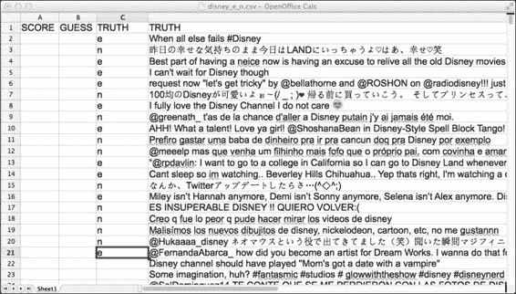
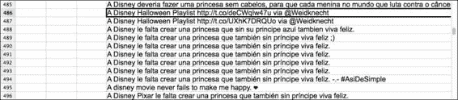

# 第一章：第1章：简单分类器

在本章中，我们将涵盖以下食谱：

+   反序列化和运行分类器

+   从分类器中获取置信度估计

+   从Twitter API获取数据

+   将分类器应用于`.csv`文件

+   分类器的评估——混淆矩阵

+   训练你自己的语言模型分类器

+   如何使用交叉验证进行训练和评估

+   查看错误类别——误报

+   理解精确度和召回率

+   如何序列化LingPipe对象——分类器示例

+   使用Jaccard距离消除近似重复项

+   如何进行情感分类——简单版本

# 简介

本章在LingPipe工具包的竞赛背景下介绍它，然后直接深入到文本分类器。文本分类器将类别分配给文本，例如，它们将语言分配给一个句子或告诉我们一条推文是正面、负面还是中性。本章涵盖了如何使用、评估和创建基于语言模型的文本分类器。这些是LingPipe API中最简单的基于机器学习的分类器。它们之所以简单，是因为它们仅操作于字符——稍后，分类器将具有单词/标记的概念，甚至更多。然而，不要被误导，字符语言模型非常适合语言识别，它们也是世界上一些最早的商业情感系统的基石。

本章还涵盖了关键的评价基础设施——结果证明，我们做的几乎所有事情在某种解释层面上都可以被视为分类器。因此，不要忽视交叉验证的力量、精确度/召回率的定义以及F度量。

最好的部分是，你将学习如何程序化地访问Twitter数据来训练和评估你自己的分类器。有关从/向磁盘读取和写入LingPipe对象的机制有一些枯燥的内容，但除此之外，这是一个有趣的章节。本章的目标是让你快速上手，掌握自然语言处理（**NLP**）领域中机器学习技术的基本维护和培养。

LingPipe是一个面向NLP应用的Java工具包。本书将向您展示如何以问题/解决方案的格式使用LingPipe解决常见的NLP问题，这允许开发者快速部署常见任务的解决方案。

## LingPipe及其安装

LingPipe 1.0于2003年作为双授权的开源NLP Java库发布。在撰写本书时，我们在Google Scholar上的引用接近2000次，并且有数千个商业安装，从大学到政府机构到财富500强公司。

当前许可协议是AGPL ([http://www.gnu.org/licenses/agpl-3.0.html](http://www.gnu.org/licenses/agpl-3.0.html)) 或我们提供的商业许可，它提供更多传统功能，如赔偿、代码不共享以及支持。

### 与LingPipe类似的项目

几乎所有自然语言处理（NLP）项目都有糟糕的缩写，所以我们将公开我们的缩写。**LingPipe**是**linguistic pipeline**的简称，这个名字是Bob Carpenter存放初始代码的`cvs`目录的名称。

LingPipe在NLP领域有很多竞争对手。以下是一些更受欢迎的、专注于Java的：

+   **NLTK**：这是NLP处理领域占主导地位的Python库。

+   **OpenNLP**：这是一个由一群聪明人构建的Apache项目。

+   **JavaNLP**：这是对斯坦福NLP工具的重新品牌，同样是由一群聪明人构建的。

+   **ClearTK**：这是一个博尔德大学的工具包，封装了许多流行的机器学习框架。

+   **DkPro**：德国达姆施塔特技术大学生产的这个基于UIMA的项目，以一种有用的方式封装了许多常见组件。UIMA是NLP的一个通用框架。

+   **GATE**：GATE实际上更像是一个框架而不是竞争对手。事实上，LingPipe组件是它们标准分布的一部分。它有一个很好的图形化“连接组件”功能。

+   **基于学习的Java**（**LBJ**）：LBJ是一种基于Java的特殊用途编程语言，它面向机器学习和NLP。它是在伊利诺伊大学厄巴纳-香槟分校的认知计算组开发的。

+   **Mallet**：这个名字是**MAchine Learning for LanguagE Toolkit**的简称。显然，合理的缩写生成现在是稀缺的。这也是由聪明人构建的。

这里有一些纯机器学习框架，它们具有更广泛的吸引力，但并不一定针对NLP任务：

+   **Vowpal Wabbit**：它非常专注于逻辑回归、潜在狄利克雷分配等可扩展性。由聪明人推动。

+   **Factorie**：它来自美国马萨诸塞大学阿默斯特分校，是Mallet的替代品。最初它主要关注图形模型，但现在也支持NLP任务。

+   **支持向量机**（**SVM**）：SVM light和`libsvm`是非常流行的SVM实现。LingPipe中没有SVM实现，因为逻辑回归也能做到这一点。

### 那么，为什么使用LingPipe？

提到前面提到的如此出色的免费竞争，合理地询问为什么选择LingPipe是有道理的。有几个原因：

+   **文档**：LingPipe中的类级别文档非常详尽。如果工作基于学术研究，那么这项工作会被引用。算法被列出，底层数学被解释，解释精确。文档缺乏的是“如何完成任务”的视角；然而，这一点在本书中有所涉及。

+   **企业/服务器优化**：LingPipe从一开始就是为了服务器应用程序而设计的，而不是为了命令行使用（尽管我们将在整本书中广泛使用命令行）。

+   **用Java方言编写**: LingPipe是一个遵循标准Java类设计原则（Addison-Wesley出版的Joshua Bloch的《Effective Java》）的本地Java API，例如在构造时的一致性检查、不可变性、类型安全、向后兼容的序列化以及线程安全。

+   **错误处理**: 在长时间运行的过程中，通过异常和可配置的消息流对错误处理给予了相当的关注。

+   **支持**: LingPipe有付费员工，他们的工作是回答您的问题并确保LingPipe正在完成其工作。通常，罕见的错误会在24小时内得到修复。他们非常快速地回答问题，并且非常愿意帮助人们。

+   **咨询**: 您可以雇佣LingPipe的专家为您构建系统。通常，他们会作为副产品教开发者如何构建NLP系统。

+   **一致性**: LingPipe API是由Bob Carpenter一个人设计的，他对一致性有着近乎狂热的追求。虽然它并不完美，但您会发现其中存在一种规律性和设计上的关注，这在学术努力中可能会缺失。研究生来来去去，因此对大学工具包的贡献可能会有很大的差异。

+   **开源**: 尽管有许多商业供应商，但他们的软件是一个黑盒。LingPipe的开源特性提供了透明度和信心，确保代码正在执行我们所要求的功能。当文档出现问题时，能够访问代码以更好地理解它是一种巨大的安慰。

### 下载书籍代码和数据

您需要从[http://alias-i.com/book.html](http://alias-i.com/book.html)下载此食谱的源代码，以及支持模型和数据。使用以下命令解包和解压缩：

```py
tar –xvzf lingpipeCookbook.tgz

```

### 小贴士

**下载示例代码**

您可以从[http://www.packtpub.com](http://www.packtpub.com)上您购买的所有Packt书籍的账户中下载示例代码文件。如果您在其他地方购买了这本书，您可以访问[http://www.packtpub.com/support](http://www.packtpub.com/support)并注册，以便将文件直接通过电子邮件发送给您。

或者，您的操作系统可能提供其他提取存档的方法。所有食谱都假设您在生成的食谱目录中运行命令。

### 下载LingPipe

下载LingPipe不是严格必要的，但您可能希望能够查看源代码并拥有Javadoc的本地副本。

LingPipe的下载和安装说明可以在[http://alias-i.com/lingpipe/web/install.html](http://alias-i.com/lingpipe/web/install.html)找到。

本章的示例使用命令行调用，但假设读者具备足够的开发技能，可以将示例映射到他们首选的IDE/ant或其他环境。

# 反序列化和运行分类器

本食谱做了两件事：介绍一个非常简单且有效的语言ID分类器，并演示如何反序列化LingPipe类。如果你是从后面的章节来到这里，试图理解反序列化，我鼓励你无论如何运行示例程序。这需要5分钟，你可能会学到一些有用的东西。

我们的语言ID分类器基于字符语言模型。每个语言模型都会给出文本在该语言下生成的概率。与文本最熟悉的模型是最佳匹配。这个模型已经构建好了，但稍后在本章中，你将学习如何创建自己的模型。

## 如何操作...

执行以下步骤以反序列化和运行分类器：

1.  前往书的`cookbook`目录并运行OSX、Unix和Linux的命令：

    ```py
    java -cp lingpipe-cookbook.1.0.jar:lib/lingpipe-4.1.0.jar com.lingpipe.cookbook.chapter1.RunClassifierFromDisk

    ```

    对于Windows调用（引用类路径并使用`;`代替`:`）：

    ```py
    java -cp "lingpipe-cookbook.1.0.jar;lib\lingpipe-4.1.0.jar" com.lingpipe.cookbook.chapter1.RunClassifierFromDisk

    ```

    我们将在本书中使用Unix风格的命令行。

1.  程序报告正在加载模型和默认设置，并提示输入一个句子进行分类：

    ```py
    Loading: models/3LangId.LMClassifier
    Type a string to be classified. Empty string to quit.
    The rain in Spain falls mainly on the plain.
    english
    Type a string to be classified. Empty string to quit.
    la lluvia en España cae principalmente en el llano.
    spanish
    Type a string to be classified. Empty string to quit.
    スペインの雨は主に平野に落ちる。
    japanese

    ```

1.  该分类器是在英语、西班牙语和日语上训练的。我们已输入了每种语言的示例——要获取一些日语，请访问[http://ja.wikipedia.org/wiki/](http://ja.wikipedia.org/wiki/)。这些是它所知道的唯一语言，但它会对任何文本进行猜测。所以，让我们尝试一些阿拉伯语：

    ```py
    Type a string to be classified. Empty string to quit.
    المطر في اسبانيا يقع أساسا على سهل.
    japanese

    ```

1.  它认为它是日语，因为这种语言的字符比英语或西班牙语多。这反过来又导致该模型期望更多的未知字符。所有的阿拉伯文字符都是未知的。

1.  如果你在一个Windows终端中工作，可能会遇到输入UTF-8字符的困难。

## 它是如何工作的...

jar文件中的代码位于`cookbook/src/com/lingpipe/cookbook/chapter1/RunClassifierFromDisk.java`。正在发生的事情是，一个用于语言识别的预构建模型被反序列化并可供使用。它已经在英语、日语和西班牙语上进行了训练。训练数据来自每种语言的维基百科页面。你可以在`data/3LangId.csv`中看到数据。本食谱的重点是向你展示如何反序列化分类器并运行它——训练在本章的“训练你自己的语言模型分类器”食谱中处理。`RunClassifierFromDisk.java`类的整个代码从包开始；然后它导入`RunClassifierFromDisk`类的开始和`main()`的开始：

```py
package com.lingpipe.cookbook.chapter1;
import java.io.File;
import java.io.IOException;

import com.aliasi.classify.BaseClassifier;
import com.aliasi.util.AbstractExternalizable;
import com.lingpipe.cookbook.Util;
public class RunClassifierFromDisk {
  public static void main(String[] args) throws
  IOException, ClassNotFoundException {
```

上述代码是一个非常标准的Java代码，我们在此不进行解释。接下来是大多数食谱中的一个特性，它为命令行中不包含的文件提供一个默认值。这允许你使用自己的数据（如果你有），否则它将从分发中的文件运行。在这种情况下，如果没有命令行参数，将提供一个默认分类器：

```py
String classifierPath = args.length > 0 ? args[0] :  "models/3LangId.LMClassifier";
System.out.println("Loading: " + classifierPath);
```

接下来，我们将看到如何从磁盘反序列化一个分类器或另一个LingPipe对象：

```py
File serializedClassifier = new File(classifierPath);
@SuppressWarnings("unchecked")
BaseClassifier<String> classifier
  = (BaseClassifier<String>)
  AbstractExternalizable.readObject(serializedClassifier);
```

```py
AbstractExternalizable.readObject method.
```

这个类在 LingPipe 中被用于执行类的编译，原因有两个。首先，它允许编译后的对象设置最终变量，这支持 LingPipe 对不可变性的广泛使用。其次，它避免了暴露外部化和反序列化所需的 I/O 方法所带来的混乱，特别是无参数构造函数。这个类被用作一个私有内部类的超类，该内部类执行实际的编译。这个私有内部类实现了所需的 `no-arg` 构造函数，并存储了 `readResolve()` 所需的对象。

### 注意

我们使用 `Externalizable` 而不是 `Serializable` 的原因是避免在更改任何方法签名或成员变量时破坏向后兼容性。`Externalizable` 扩展了 `Serializable` 并允许控制对象是如何被读取或写入的。有关更多信息，请参阅 Josh Bloch 的书 *Effective Java, 2nd Edition* 中的优秀章节。

`BaseClassifier<E>` 是 LingPipe 的基础分类器接口，其中 `E` 是在 LingPipe 中被分类的对象的类型。查看 Javadoc 以了解实现该接口的分类器的范围——共有 10 个。将序列化到 `BaseClassifier<E>` 中隐藏了很多复杂性，我们将在本章的 *如何序列化 LingPipe 对象 – 分类器示例* 菜谱中稍后探讨。

最后一行调用了一个实用方法，我们将在本书中经常使用：

```py
Util.consoleInputBestCategory(classifier);
```

此方法处理与命令行的交互。代码位于 `src/com/lingpipe/cookbook/Util.java`：

```py
public static void consoleInputBestCategory(
BaseClassifier<CharSequence> classifier) throws IOException {
  BufferedReader reader = new BufferedReader(new InputStreamReader(System.in));
  while (true) {
    System.out.println("\nType a string to be classified. " + " Empty string to quit.");
    String data = reader.readLine();
    if (data.equals("")) {
      return;
    }
    Classification classification = classifier.classify(data);
    System.out.println("Best Category: " + classification.bestCategory());
  }
}
```

一旦从控制台读取字符串，就会调用 `classifier.classify(input)`，它返回 `Classification`。然后，这会提供一个 `String` 标签并打印出来。就这样！你已经运行了一个分类器。

# 从分类器获取置信度估计

如果分类器提供了更多关于它们对分类的置信度的信息，那么它们通常更有用——这通常是一个分数或概率。我们经常设置分类器的阈值，以帮助满足安装的性能要求。例如，如果分类器永远不犯错误至关重要，那么我们可以在做出决定之前要求分类非常自信。

LingPipe 分类器基于它们提供的估计类型存在一个层次结构。其核心是一系列接口——不要惊慌；实际上它相当简单。你现在不需要理解它，但我们确实需要将其记录下来以供将来参考：

+   `BaseClassifier<E>`：这只是你的基本分类器，用于类型为 `E` 的对象。它有一个 `classify()` 方法，该方法返回一个分类，该分类又有一个 `bestCategory()` 方法和 `toString()` 方法，这些方法具有一定的信息用途。

+   `RankedClassifier<E> extends BaseClassifier<E>`：`classify()`方法返回`RankedClassification`，它扩展了`Classification`并添加了`category(int rank)`方法，该方法说明了第1到`n`个分类是什么。还有一个`size()`方法，表示有多少个分类。

+   `ScoredClassifier<E> extends RankedClassifier<E>`：返回的`ScoredClassification`添加了一个`score(int rank)`方法。

+   `ConditionalClassifier<E> extends RankedClassifier<E>`：由这个产生的`ConditionalClassification`具有这样一个属性，即所有类别的分数之和必须通过`conditionalProbability(int rank)`方法和`conditionalProbability(String category)`方法访问，总和为1。还有更多；你可以阅读这个的Javadoc。当事情变得复杂时，这种分类将成为本书的工作马，我们想知道推文是英语、日语还是西班牙语的置信度。这些估计之和必须为1。

+   `JointClassifier<E> extends ConditionalClassifier<E>`：这提供了输入和类别在所有可能输入空间中的`JointClassification`，并且所有这样的估计之和为1。这是一个稀疏空间，因此值是基于对数来避免下溢错误的。我们在生产中很少直接使用这个估计。

很明显，对所提出的分类栈进行了大量的思考。这是因为大量的工业级自然语言处理问题最终都是由分类系统处理的。

结果表明，我们最简单的分类器——在某种任意意义上的简单——产生了最丰富的估计，即联合分类。让我们深入探讨。

## 准备工作

在之前的配方中，我们轻率地反序列化为`BaseClassifier<String>`，这隐藏了所有正在发生的事情的细节。实际上，情况比模糊的抽象类所暗示的要复杂得多。请注意，加载到磁盘上的文件被命名为`3LangId.LMClassifier`。按照惯例，我们用将要反序列化的对象类型来命名序列化模型，在这种情况下，是`LMClassifier`，它扩展了`BaseClassifier`。对于分类器的最具体类型是：

```py
LMClassifier<CompiledNGramBoundaryLM, MultivariateDistribution> classifier = (LMClassifier <CompiledNGramBoundaryLM, MultivariateDistribution>) AbstractExternalizable.readObject(new File(args[0]));
```

将`LMClassifier<CompiledNGramBoundaryLM, MultivariateDistribution>`转换为类型指定了分布类型为`MultivariateDistribution`。`com.aliasi.stats.MultivariateDistribution`的Javadoc非常明确且有助于描述这是什么。

### 注意

`MultivariateDistribution`实现了一个离散分布，该分布覆盖了有限个结果，这些结果从零开始连续编号。

Javadoc对`MultivariateDistribution`进行了大量的详细说明，但基本上意味着我们可以有一个n路概率分配，这些概率之和为1。

接下来的类是为 `CompiledNGramBoundaryLM` 定制的，它是 `LMClassifier` 的“记忆”。实际上，每种语言都有自己的。这意味着英语将有一个与西班牙语等不同的语言模型。在这个分类器的这部分可能使用了八种不同的语言模型——请参阅 `LanguageModel` 接口的 Javadoc。每个 **语言模型**（**LM**）具有以下属性：

+   LM 将提供生成提供的文本的概率。它对之前未见过的数据具有鲁棒性，即它不会崩溃或给出零概率。在我们的示例中，阿拉伯语只是未知字符的序列。

+   对于边界语言模型（LM），任何长度的可能字符序列概率之和为 1。处理 LM 将概率加到相同长度的所有序列上。查看 Javadoc 了解这部分数学是如何实现的。

+   每个语言模型对其类别之外的数据一无所知。

+   分类器跟踪类别的边缘概率，并将此因素纳入类别的结果中。边缘概率是指我们倾向于在迪士尼推文中看到三分之二的英语，六分之一的西班牙语，六分之一的日语。这些信息与 LM 估计相结合。

+   LM 是 `LanguageModel.Dynamic` 的编译版本，我们将在稍后的关于训练的食谱中介绍。

`LMClassifier` 所构建的将这些组件包装成一个分类器。

幸运的是，接口通过更美观的反序列化来拯救了这一天：

```py
JointClassifier<String> classifier = (JointClassifier<String>) AbstractExternalizable.readObject(new File(classifierPath));
```

界面很好地隐藏了实现的细节，这正是我们在示例程序中要采用的。

## 如何做到这一点...

这个食谱是我们第一次开始剥去分类器能做什么，但首先，让我们先玩玩它：

1.  让你的魔法外壳精灵召唤一个带有 Java 解释器的命令提示符并输入：

    ```py
    java -cp lingpipe-cookbook.1.0.jar:lib/lingpipe-4.1.0.jar: com.lingpipe.cookbook.chapter1.RunClassifierJoint 

    ```

1.  我们将输入与之前相同的数据：

    ```py
    Type a string to be classified. Empty string to quit.
    The rain in Spain falls mainly on the plain.
    Rank Categ Score   P(Category|Input) log2 P(Category,Input)
    0=english -3.60092 0.9999999999         -165.64233893156052
    1=spanish -4.50479 3.04549412621E-13    -207.2207276413206
    2=japanese -14.369 7.6855682344E-150    -660.989401136873

    ```

如描述所述，`JointClassification` 在以 `Classification` 为根的层次结构中传递所有分类度量。以下所示分类的每一级都添加到其前面的分类器中：

+   `Classification` 提供了最佳类别作为排名 0 的类别。

+   `RankedClassification` 为所有可能的类别添加一个排序，较低排名对应于该类别的更大可能性。`rank` 列反映了这种排序。

+   `ScoredClassification` 为排序输出添加一个数值分数。请注意，分数可能或可能无法很好地与其他正在分类的字符串进行比较，具体取决于分类器的类型。这是标记为 `Score` 的列。要了解分数的基础，请参阅相关的 Javadoc。

+   `ConditionalClassification`通过将其作为输入条件下的类别概率来进一步细化分数。所有类别的概率之和为1。这是标记为`P(Category|Input)`的列，这是传统上写*给定输入的类别概率*的方式。

+   `JointClassification`添加了输入和类别的log2（以2为底的对数）概率——这是联合概率。所有类别和输入的概率之和为1，这实际上是一个非常大的空间，任何一对类别和字符串的概率都分配得非常低。这就是为什么使用log2值来防止数值下溢。这是标记为`log 2 P(Category, Input)`的列，它被翻译为*类别和输入的对数*`2`概率*。

查看关于实现这些度量标准和分类器的`com.aliasi.classify`包的Javadoc以获取更多信息。

## 它是如何工作的…

代码位于`src/com/lingpipe/cookbook/chapter1/RunClassifierJoint.java`中，并反序列化为`JointClassifier<CharSequence>`：

```py
public static void main(String[] args) throws IOException, ClassNotFoundException {
  String classifierPath  = args.length > 0 ? args[0] : "models/3LangId.LMClassifier";
  @SuppressWarnings("unchecked")
    JointClassifier<CharSequence> classifier = (JointClassifier<CharSequence>) AbstractExternalizable.readObject(new File(classifierPath));
  Util.consoleInputPrintClassification(classifier);
}
```

它调用`Util.consoleInputPrintClassification(classifier)`，这与`Util.consoleInputBestCategory(classifier)`最小不同之处在于它使用分类的`toString()`方法来打印。代码如下：

```py
public static void consoleInputPrintClassification(BaseClassifier<CharSequence> classifier) throws IOException {
  BufferedReader reader = new BufferedReader(new InputStreamReader(System.in));
  while (true) {
    System.out.println("\nType a string to be classified." + Empty string to quit.");
    String data = reader.readLine();
    if (data.equals("")) {
      return;
    }
    Classification classification = classifier.classify(data);
    System.out.println(classification);
  }
}
```

我们得到了比预期的更丰富的输出，因为类型是`Classification`，但`toString()`方法将被应用于运行时类型`JointClassification`。

## 相关内容

+   在Bob Carpenter和Breck Baldwin合著的《使用LingPipe 4进行文本分析》的*第6章*（[part0075_split_000.html#page "第6章. 字符语言模型"](part0075_split_000.html#page "第6章. 字符语言模型")）中，有关于语言模型的详细信息，由*LingPipe Publishing*出版([http://alias-i.com/lingpipe-book/lingpipe-book-0.5.pdf](http://alias-i.com/lingpipe-book/lingpipe-book-0.5.pdf))。

# 从Twitter API获取数据

我们使用流行的`twitter4j`包来调用Twitter搜索API，并搜索推文并将它们保存到磁盘。自版本1.1起，Twitter API需要身份验证，在我们开始之前，我们需要获取身份验证令牌并将它们保存到`twitter4j.properties`文件中。

## 准备中

如果你没有Twitter账户，请访问[twitter.com/signup](http://twitter.com/signup)并创建一个账户。你还需要访问[dev.twitter.com](http://dev.twitter.com)并登录以启用开发者账户。一旦你有了Twitter登录，我们就可以开始创建Twitter OAuth凭据了。请准备好这个过程可能与我们所展示的不同。无论如何，我们将在`data`目录中提供示例结果。现在让我们创建Twitter OAuth凭据：

1.  登录到[dev.twitter.com](http://dev.twitter.com)。

1.  在顶部栏图标旁边找到那个小下拉菜单。

1.  选择**我的应用**。

1.  点击**创建一个新应用**。

1.  填写表格并点击**创建Twitter应用**。

1.  下一页包含OAuth设置。

1.  点击**创建我的访问令牌**链接。

1.  您需要复制**消费者密钥**和**消费者密钥密钥**。

1.  您还需要复制**访问令牌**和**访问令牌密钥**。

1.  这些值应放入`twitter4j.properties`文件中的适当位置。属性如下：

    ```py
    debug=false
    oauth.consumerKey=ehUOExampleEwQLQpPQ
    oauth.consumerSecret=aTHUGTBgExampleaW3yLvwdJYlhWY74
    oauth.accessToken=1934528880-fiMQBJCBExamplegK6otBG3XXazLv
    oauth.accessTokenSecret=y0XExampleGEHdhCQGcn46F8Vx2E
    ```

## 如何操作...

现在，我们准备好使用以下步骤访问Twitter并获取一些搜索数据：

1.  进入本章目录并运行以下命令：

    ```py
    java -cp lingpipe-cookbook.1.0.jar:lib/twitter4j-core-4.0.1.jar:lib/opencsv-2.4.jar:lib/lingpipe-4.1.0.jar com.lingpipe.cookbook.chapter1.TwitterSearch

    ```

1.  代码显示输出文件（在这种情况下，默认值）。提供路径作为参数将写入此文件。然后，在提示符中输入您的查询：

    ```py
    Writing output to data/twitterSearch.csv
    Enter Twitter Query:disney

    ```

1.  代码随后查询Twitter，并报告每找到100条推文（输出被截断）：

    ```py
    Tweets Accumulated: 100
    Tweets Accumulated: 200
    …
    Tweets Accumulated: 1500
    writing to disk 1500 tweets at data/twitterSearch.csv 

    ```

该程序使用搜索查询，搜索Twitter中的术语，并将输出（限制为1500条推文）写入您在命令行中指定的`.csv`文件名或使用默认值。

## 它是如何工作的...

代码使用`twitter4j`库实例化`TwitterFactory`，并使用用户输入的查询搜索Twitter。`src/com/lingpipe/cookbook/chapter1/TwitterSearch.java`中`main()`的开始部分如下：

```py
String outFilePath = args.length > 0 ? args[0] : "data/twitterSearch.csv";
File outFile = new File(outFilePath);
System.out.println("Writing output to " + outFile);
BufferedReader reader = new BufferedReader(new InputStreamReader(System.in));
System.out.print("Enter Twitter Query:");
String queryString = reader.readLine();
```

上述代码获取输出文件，如果没有提供则使用默认值，并从命令行获取查询。

以下代码根据twitter4j开发者的愿景设置查询。有关此过程的更多信息，请阅读他们的Javadoc。然而，这应该是相当直接的。为了使我们的结果集更加独特，您会注意到，当我们创建查询字符串时，我们将使用`-filter:retweets`选项过滤掉重复推文。这仅是部分有效；请参阅本章后面的**使用Jaccard距离消除近似重复**配方以获得更完整的解决方案：

```py
Twitter twitter = new TwitterFactory().getInstance();
Query query = new Query(queryString + " -filter:retweets"); query.setLang("en");//English
query.setCount(TWEETS_PER_PAGE);
query.setResultType(Query.RECENT);
```

我们将得到以下结果：

```py
List<String[]> csvRows = new ArrayList<String[]>();
while(csvRows.size() < MAX_TWEETS) {
  QueryResult result = twitter.search(query);
  List<Status> resultTweets = result.getTweets();
  for (Status tweetStatus : resultTweets) {
    String row[] = new String[Util.ROW_LENGTH];
    row[Util.TEXT_OFFSET] = tweetStatus.getText();
    csvRows.add(row);
  }
  System.out.println("Tweets Accumulated: " + csvRows.size());
  if ((query = result.nextQuery()) == null) {
    break;
  }
}
```

```py
query to handle paging through the search results—it returns null when no more pages are available. The current Twitter API allows a maximum of 100 results per page, so in order to get 1500 results, we need to rerun the search until there are no more results, or until we get 1500 tweets. The next step involves a bit of reporting and writing:
```

```py
System.out.println("writing to disk " + csvRows.size() + " tweets at " + outFilePath);
Util.writeCsvAddHeader(csvRows, outFile);
```

然后使用`Util.writeCsvAddHeader`方法将推文列表写入`.csv`文件：

```py
public static void writeCsvAddHeader(List<String[]> data, File file) throws IOException {
  CSVWriter csvWriter = new CSVWriter(new OutputStreamWriter(new FileOutputStream(file),Strings.UTF8));
  csvWriter.writeNext(ANNOTATION_HEADER_ROW);
  csvWriter.writeAll(data);
  csvWriter.close();
}
```

我们将使用这个`.csv`文件在下一节中运行语言ID测试。

## 参见

关于使用Twitter API和twitter4j的更多详细信息，请访问他们的文档页面：

+   [http://twitter4j.org/javadoc/](http://twitter4j.org/javadoc/)

+   [https://dev.twitter.com/docs](https://dev.twitter.com/docs)

# 将分类器应用到.csv文件

现在，我们可以测试我们从Twitter下载的数据上的语言ID分类器。这个配方将向您展示如何在`.csv`文件上运行分类器，并为下一配方中的评估步骤做好准备。

## 如何操作...

将分类器应用到`.csv`文件上非常简单！只需执行以下步骤：

1.  获取命令提示符并运行：

    ```py
    java -cp lingpipe-cookbook.1.0.jar:lib/lingpipe-4.1.0.jar:lib/twitter4j-core-4.0.1.jar:lib/opencsv-2.4.jar com.lingpipe.cookbook.chapter1.ReadClassifierRunOnCsv

    ```

1.  这将使用`data/disney.csv`分布的默认CSV文件，遍历CSV文件的每一行，并对其应用来自`models/ 3LangId.LMClassifier`的语言ID分类器：

    ```py
    InputText: When all else fails #Disney
    Best Classified Language: english
    InputText: ES INSUPERABLE DISNEY !! QUIERO VOLVER:(
    Best Classified Language: Spanish

    ```

1.  您也可以指定输入作为第一个参数，分类器作为第二个参数。

## 它是如何工作的…

我们将反序列化一个来自之前配方中描述的外部化模型的分类器。然后，我们将遍历`.csv`文件的每一行，并调用分类器的classify方法。`main()`中的代码如下：

```py
String inputPath = args.length > 0 ? args[0] : "data/disney.csv";
String classifierPath = args.length > 1 ? args[1] : "models/3LangId.LMClassifier";
@SuppressWarnings("unchecked") BaseClassifier<CharSequence> classifier = (BaseClassifier<CharSequence>) AbstractExternalizable.readObject(new File(classifierPath));
List<String[]> lines = Util.readCsvRemoveHeader(new File(inputPath));
for(String [] line: lines) {
  String text = line[Util.TEXT_OFFSET];
  Classification classified = classifier.classify(text);
  System.out.println("InputText: " + text);
  System.out.println("Best Classified Language: " + classified.bestCategory());
}
```

之前的代码基于之前的配方，没有特别新的内容。以下所示的`Util.readCsvRemoveHeader`只是跳过了`.csv`文件的第一行，然后从磁盘读取并返回具有非空值和非空字符串的`TEXT_OFFSET`位置的行：

```py
public static List<String[]> readCsvRemoveHeader(File file) throws IOException {
  FileInputStream fileIn = new FileInputStream(file);
  InputStreamReader inputStreamReader = new InputStreamReader(fileIn,Strings.UTF8);
  CSVReader csvReader = new CSVReader(inputStreamReader);
  csvReader.readNext();  //skip headers
  List<String[]> rows = new ArrayList<String[]>();
  String[] row;
  while ((row = csvReader.readNext()) != null) {
    if (row[TEXT_OFFSET] == null || row[TEXT_OFFSET].equals("")) {
      continue;
    }
    rows.add(row);
  }
  csvReader.close();
  return rows;
}
```

# 分类器的评估 – 混淆矩阵

评估在构建坚实的NLP系统中至关重要。它允许开发人员和管理人员将业务需求映射到系统性能，反过来，这有助于将系统改进传达给利益相关者。“嗯，嗯，系统似乎做得更好”并不像“召回率提高了20%，并且特异性在50%更多训练数据的情况下保持良好”那样有分量。

此配方提供了创建真实或*黄金标准*数据的步骤，并告诉我们如何使用这些数据来评估我们预编译分类器的性能。它既简单又强大。

## 准备中

你可能已经注意到了CSV编写器输出中的标题以及可疑标记的列`TRUTH`。现在，我们可以使用它了。加载我们之前提供的推文或将你的数据转换为我们的`.csv`格式。获取新数据的简单方法是对Twitter运行一个多语言友好的查询，例如`Disney`，这是我们默认提供的数据。

打开CSV文件，为至少10个英语的`e`和非英语的`n`标注你认为推文所使用的语言。在分发中有一个`data/disney_e_n.csv`文件；如果你不想处理标注数据，可以使用这个文件。如果你对某个推文不确定，请随意忽略它。未标注的数据将被忽略。请看下面的截图：



包含对英语'e'和非英语'n'的人类标注的电子表格截图。它被称为真实数据或黄金标准数据，因为它正确地代表了现象。

通常，这类数据被称为**黄金标准数据**，因为它代表了真相。在“黄金标准”中的“黄金”字面意思非常明显。备份并存储它时，要考虑到其持久性——它很可能是你硬盘上最有价值的字节集合，因为它以任何数量生产都很昂贵，并且是对正在进行的事情最清晰的阐述。实现方式会来来去去；评估数据将永远存在。来自*《约翰·史密斯问题》*食谱的约翰·史密斯语料库，在[第7章](part0085_split_000.html#page "第7章. 找到概念/人物之间的指代关系")*找到概念/人物之间的指代关系*，是该特定问题的标准评估语料库，并且作为始于1997年的研究系列的比较基准而存在。原始实现已经被人遗忘。

## 如何操作...

执行以下步骤以评估分类器：

1.  在命令提示符中输入以下内容；这将运行默认分类器在默认黄金标准数据中的文本。然后，它将比较分类器的最佳类别与`TRUTH`列中标注的内容：

    ```py
    java -cp lingpipe-cookbook.1.0.jar:lib/opencsv-2.4.jar:lib/lingpipe-4.1.0.jar com.lingpipe.cookbook.chapter1.RunConfusionMatrix

    ```

1.  此类将生成混淆矩阵：

    ```py
    reference\response
     \e,n,
     e 11,0,
     n 1,9,

    ```

混淆矩阵的命名非常恰当，因为它最初几乎会让人困惑，但毫无疑问，它是分类器输出的最佳表示，因为它很难用它来隐藏糟糕的分类器性能。换句话说，它是一个出色的BS检测器。它明确地展示了分类器正确识别的内容、错误识别的内容以及它认为正确的答案。

每行的总和代表根据真相/参考/黄金标准已知属于该类别的项目。对于英语（e），有11条推文。每一列代表系统认为属于同一标记类别的内容。对于英语（e），系统认为有11条推文是英语，没有非英语（n）。对于非英语类别（n），在真相中有10个案例，其中分类器认为1个是英语（错误地）和9个是非英语（正确地）。完美系统性能将在非对角线上的所有单元格中为零，从左上角到底右角。

实际上被称为混淆矩阵的原因是，它相对容易看出分类器混淆的类别。例如，英国英语和美国英语可能会非常容易混淆。此外，混淆矩阵可以很好地扩展到多个类别，这一点将在后面看到。访问Javadoc以获取对混淆矩阵的更详细解释——掌握它是值得的。

## 它是如何工作的...

接下来，将加载语言模型和`.csv`数据。与`Util.CsvRemoveHeader`解释略有不同，因为它只接受`TRUTH`列中有值的行——如果这还不清楚，请参阅`src/com/lingpipe/cookbook/Util.java`：

```py
@SuppressWarnings("unchecked")
BaseClassifier<CharSequence> classifier = (BaseClassifier<CharSequence>) AbstractExternalizable.readObject(new File(classifierPath));

List<String[]> rows = Util.readAnnotatedCsvRemoveHeader(new File(inputPath));
```

接下来，将找到类别：

```py
String[] categories = Util.getCategories(rows);
```

该方法将累积来自 `TRUTH` 列的所有类别标签。代码很简单，如下所示：

```py
public static String[] getCategories(List<String[]> data) {
  Set<String> categories = new HashSet<String>();
  for (String[] csvData : data) {
    if (!csvData[ANNOTATION_OFFSET].equals("")) {
      categories.add(csvData[ANNOTATION_OFFSET]);
    }
  }
  return categories.toArray(new String[0]);
}
```

当我们运行任意数据，其中标签在编译时未知时，此代码将很有用。

然后，我们将设置 `BaseClassfierEvaluator`。这需要评估分类器。还将设置类别和一个 `boolean` 值，该值控制是否在分类器中存储输入以进行构建：

```py
boolean storeInputs = false;
BaseClassifierEvaluator<CharSequence> evaluator = new BaseClassifierEvaluator<CharSequence>(classifier, categories, storeInputs);
```

注意，分类器可以是空的，并且可以在稍后指定；类别必须与注释和分类器产生的类别完全匹配。我们不会麻烦配置评估器来存储输入，因为我们在这个配方中不会使用这个功能。有关输入存储和访问的示例，请参阅*查看错误类别 - 假阳性*配方。

接下来，我们将进行实际的评估。循环将遍历 `.csv` 文件中的每一行信息，构建一个 `Classified<CharSequence>`，并将其传递给评估器的 `handle()` 方法：

```py
for (String[] row : rows) {
  String truth = row[Util.ANNOTATION_OFFSET];
  String text = row[Util.TEXT_OFFSET];
  Classification classification = new Classification(truth);
  Classified<CharSequence> classified = new Classified<CharSequence>(text,classification);
  evaluator.handle(classified);
}
```

第四行将创建一个分类对象，其值来自真实注释——在本例中是 `e` 或 `n`。这与 `BaseClassifier<E>` 为 `bestCategory()` 方法返回的类型相同。没有为真实注释设置特殊类型。下一行添加了分类所应用的文本，我们得到一个 `Classified<CharSequence>` 对象。

循环的最后一行将应用处理方法到创建的分类对象上。评估器假定提供给其处理方法的 数据是真实注释，它通过提取正在分类的数据，将分类器应用于这些数据，获取结果 `firstBest()` 分类，并最终记录分类是否与刚刚用真实数据构造的分类相匹配。这发生在 `.csv` 文件的每一行上。

在循环外部，我们将使用 `Util.createConfusionMatrix()` 打印出混淆矩阵：

```py
System.out.println(Util.confusionMatrixToString(evaluator.confusionMatrix()));
```

检查此代码留给了读者。就是这样；我们已经评估了我们的分类器并打印出了混淆矩阵。

## 还有更多...

评估器有一个完整的 `toString()` 方法，它提供了关于您的分类器表现如何的大量信息。输出中的这些方面将在后面的配方中介绍。Javadoc 非常详尽，值得一读。

# 训练自己的语言模型分类器

当分类器被定制时，NLP 的世界真正地打开了。这个配方提供了如何通过收集分类器学习示例来定制分类器的详细信息——这被称为训练数据。它也被称为黄金标准数据、真实数据或基准数据。我们有一些来自前面的配方，我们将使用它们。

## 准备工作

我们将为英语和其他语言创建一个定制的语言 ID 分类器。创建训练数据涉及获取文本数据，然后为分类器的类别进行标注——在这种情况下，标注是语言。训练数据可以来自各种来源。一些可能性包括：

+   标准数据，如前述评估配方中创建的数据。

+   已经为你关心的类别进行标注的数据。例如，维基百科有针对特定语言的版本，这使得训练语言 ID 分类器变得容易。这就是我们创建 `3LangId.LMClassifier` 模型的方式。

+   要有创意——哪里是帮助分类器正确引导的数据？

语言 ID 不需要太多数据就能很好地工作，因此每种语言 20 条推文就可以可靠地区分不同的语言。训练数据量将由评估驱动——更多的数据通常可以提高性能。

示例假设大约有 10 条英文推文和 10 条非英文推文由人们标注并放入 `data/disney_e_n.csv`。

## 如何做到这一点...

为了训练你自己的语言模型分类器，执行以下步骤：

1.  启动一个终端并输入以下内容：

    ```py
    java -cp lingpipe-cookbook.1.0.jar:lib/opencsv-2.4.jar:lib/lingpipe-4.1.0.jar com.lingpipe.cookbook.chapter1.TrainAndRunLMClassifier

    ```

1.  然后，在命令提示符中输入一些英文，比如，库尔特·冯内古特的引言，以查看生成的 `JointClassification`。请参阅 *从分类器获取置信度估计* 的配方，以了解以下输出的解释：

    ```py
    Type a string to be classified. Empty string to quit.
    So it goes.
    Rank Categ Score  P(Category|Input)  log2 P(Category,Input)
    0=e -4.24592987919 0.9999933712053  -55.19708842949149
    1=n -5.56922173547 6.62884502334E-6 -72.39988256112824

    ```

1.  输入一些非英文，例如，博尔赫斯的《分叉之路》的西班牙语标题：

    ```py
    Type a string to be classified. Empty string to quit.
    El Jardín de senderos que se bifurcan 
    Rank Categ Score  P(Category|Input)  log2 P(Category,Input)
    0=n -5.6612148689 0.999989087229795 -226.44859475801326
    1=e -6.0733050528 1.091277041753E-5 -242.93220211249715

    ```

## 它是如何工作的...

程序位于 `src/com/lingpipe/cookbook/chapter1/TrainAndRunLMClassifier.java`；`main()` 方法的内文开始如下：

```py
String dataPath = args.length > 0 ? args[0] : "data/disney_e_n.csv";
List<String[]> annotatedData = Util.readAnnotatedCsvRemoveHeader(new File(dataPath));
String[] categories = Util.getCategories(annotatedData);
```

上述代码获取 `.csv` 文件的内容，然后提取标注的类别列表；这些类别将是标注列中的所有非空字符串。

下面的 `DynamicLMClassifier` 是通过一个静态方法创建的，该方法需要类别数组以及 `int` 类型的语言模型顺序。当顺序为 3 时，语言模型将在所有 1 到 3 个字符序列的文本训练数据上训练。因此，“I luv Disney”将产生“ I”，“ I ”，“ I l”，“ l”，“ lu”，“ u”，“ uv”，“ luv”等训练实例。`createNGramBoundary` 方法将一个特殊标记添加到每个文本序列的开始和结束处；如果序列的开始或结束对分类有信息性，这个标记可能会有所帮助。大多数文本数据对开始/结束都很敏感，因此我们将选择这个模型：

```py
int maxCharNGram = 3;
DynamicLMClassifier<NGramBoundaryLM> classifier = DynamicLMClassifier.createNGramBoundary(categories,maxCharNGram);
```

以下代码遍历训练数据的行，并创建 `Classified<CharSequence>`，就像在 *分类器的评估——混淆矩阵* 配方中展示的评估方式一样。然而，它不是将 `Classified` 对象传递给评估处理程序，而是用于训练分类器。

```py
for (String[] row: annotatedData) {
  String truth = row[Util.ANNOTATION_OFFSET];
  String text = row[Util.TEXT_OFFSET];
  Classification classification 
    = new Classification(truth);
  Classified<CharSequence> classified = new Classified<CharSequence>(text,classification);
  classifier.handle(classified);
}
```

不需要进一步的操作，分类器已经准备好供控制台使用：

```py
Util.consoleInputPrintClassification(classifier);
```

## 更多...

对于基于`DynamicLM`的分类器，训练和使用分类器可以交错进行。这通常不适用于其他分类器，如`LogisticRegression`，因为它们使用所有数据来编译一个可以进行分类的模型。

存在另一种训练分类器的方法，它让你能更多地控制训练过程。以下是这个方法的代码片段：

```py
Classification classification = new Classification(truth);
Classified<CharSequence> classified = new Classified<CharSequence>(text,classification);
classifier.handle(classified);
```

或者，我们可以用以下方法达到相同的效果：

```py
int count = 1;
classifier.train(truth,text,count);
```

`train()`方法允许在训练过程中有额外的控制，因为它允许显式设置计数。当我们探索LingPipe分类器时，我们经常会看到一种允许进行一些额外控制的替代训练方法，这超出了`handle()`方法提供的控制范围。

基于字符语言模型的分类器在处理具有独特字符序列的任务中表现非常好。语言识别是这种任务的理想候选者，但它也可以用于情感分析、主题分配和问答等任务。

## 参见

LingPipe分类器的Javadoc对驱动该技术的底层数学进行了相当广泛的描述。

# 如何使用交叉验证进行训练和评估

早期的食谱已经展示了如何使用真实数据进行分类器的评估和训练，但关于同时进行这两者呢？这个伟大的想法被称为交叉验证，它的工作方式如下：

1.  将数据分成`n`个不同的集合或折——标准的`n`是10。

1.  对于从1到`n`的`i`：

    +   在排除折`i`的情况下，使用*n - 1*个折进行训练

    +   在`i`折上进行评估

1.  报告所有折`i`的评估结果。

这就是大多数机器学习系统如何调整以获得性能。工作流程如下：

1.  查看交叉验证的性能。

1.  查看由评估指标确定的错误。

1.  查看实际错误——是的，数据——以了解如何改进系统。

1.  进行一些更改

1.  再次评估它。

交叉验证是对比不同问题解决方法、尝试不同的分类器、推动归一化方法、探索特征增强等的一种优秀方法。通常，在交叉验证中表现出更高性能的系统配置也会在新数据上表现出更高的性能。交叉验证不做的，尤其是在后面讨论的主动学习策略中，是可靠地预测新数据的性能。在发布生产系统之前，始终在新的数据上应用分类器作为最后的合理性检查。你已经收到警告了。

与在所有可能的训练数据上训练的分类器相比，交叉验证施加了负偏差，因为每个折都是一个稍微弱一些的分类器，它在10个折上只有90%的数据。

“清洗、泡沫、重复”是构建最先进的NLP系统的咒语。

## 准备中

注意这种方法与其他经典计算机工程方法的不同，后者侧重于针对由单元测试驱动的功能规范进行开发。这个过程更多的是根据评估指标来精炼和调整代码，以使其工作得更好。

## 如何实现…

要运行代码，请执行以下步骤：

1.  打开命令提示符并输入：

    ```py
    java -cp lingpipe-cookbook.1.0.jar:lib/opencsv-2.4.jar:lib/lingpipe-4.1.0.jar com.lingpipe.cookbook.chapter1.RunXValidate

    ```

1.  结果将是：

    ```py
    Training data is: data/disney_e_n.csv
    Training on fold 0
    Testing on fold 0
    Training on fold 1
    Testing on fold 1
    Training on fold 2
    Testing on fold 2
    Training on fold 3
    Testing on fold 3
    reference\response
        \e,n,
        e 10,1,
        n 6,4,
    ```

    上述输出将在下一节中更有意义。

## 它是如何工作的…

本配方介绍了一个用于管理交叉验证的`XValidatingObjectCorpus`对象。它在训练分类器时被大量使用。其他所有内容都应该与之前的配方熟悉。`main()`方法从以下内容开始：

```py
String inputPath = args.length > 0 ? args[0] : "data/disney_e_n.csv";
System.out.println("Training data is: " + inputPath);
List<String[]> truthData = Util.readAnnotatedCsvRemoveHeader(new File(inputPath));
```

上述代码从默认文件或用户输入的文件中获取数据。接下来的两行介绍了`XValidatingObjectCorpus`——本配方的明星：

```py
int numFolds = 4;
XValidatingObjectCorpus<Classified<CharSequence>> corpus = Util.loadXValCorpus(truthData, numFolds);
```

`numFolds`变量控制刚刚加载的数据如何分区——在这种情况下，它将分为四个分区。现在，我们将查看`Util.loadXValCorpus(truthData, numfolds)`子程序：

```py
public static XValidatingObjectCorpus<Classified<CharSequence>> loadXValCorpus(List<String[]> rows, int numFolds) throws IOException {
  XValidatingObjectCorpus<Classified<CharSequence>> corpus = new XValidatingObjectCorpus<Classified<CharSequence>>(numFolds);
  for (String[] row : rows) {
    Classification classification = new Classification(row[ANNOTATION_OFFSET]);
    Classified<CharSequence> classified = new Classified<CharSequence>(row[TEXT_OFFSET],classification);
    corpus.handle(classified);
  }
  return corpus;
}
```

构造的`XValidatingObjectCorpus<E>`将包含所有以`Objects E`形式存在的真实数据。在这种情况下，我们正在用本章之前配方中用于训练和评估的相同对象填充语料库—`Classified<CharSequence>`。这将很有用，因为我们将使用这些对象来训练和测试我们的分类器。`numFolds`参数指定要创建多少个数据分区。它可以在以后更改。

以下`for`循环应该很熟悉，因为它应该遍历所有已注释的数据，在应用`corpus.handle()`方法（该方法将其添加到语料库中）之前创建`Classified<CharSequence>`对象。最后，我们将返回语料库。如果您有任何问题，查看`XValidatingObjectCorpus<E>`的Javadoc可能会有所帮助。

返回到`main()`函数的主体，我们将对语料库进行排列以混合数据，获取类别，并在之前配方中提供分类器的地方设置`BaseClassifierEvaluator<CharSequence>`为null值：

```py
corpus.permuteCorpus(new Random(123413));
String[] categories = Util.getCategories(truthData);
boolean storeInputs = false;
BaseClassifierEvaluator<CharSequence> evaluator = new BaseClassifierEvaluator<CharSequence>(null, categories, storeInputs);
```

现在，我们已准备好进行交叉验证：

```py
int maxCharNGram = 3;
for (int i = 0; i < numFolds; ++i) {
  corpus.setFold(i);
  DynamicLMClassifier<NGramBoundaryLM> classifier = DynamicLMClassifier.createNGramBoundary(categories, maxCharNGram);
  System.out.println("Training on fold " + i);
  corpus.visitTrain(classifier);
  evaluator.setClassifier(classifier);
  System.out.println("Testing on fold " + i);
  corpus.visitTest(evaluator);
}
```

在`for`循环的每次迭代中，我们将设置正在使用的折数，这反过来将选择训练和测试分区。然后，我们将构建`DynamicLMClassifier`并通过向`corpus.visitTrain(classifier)`提供分类器来对其进行训练。接下来，我们将评估器的分类器设置为刚刚训练的那个。评估器被传递到`corpus.visitTest(evaluator)`方法中，其中包含的分类器应用于它未训练过的测试数据。有四个折，在任何给定迭代中，25%的数据将是测试数据，75%的数据将是训练数据。数据将在测试分区中恰好一次，在训练中三次。除非数据中有重复，否则训练和测试分区永远不会包含相同的数据。

一旦循环完成所有迭代，我们将打印一个在 *分类器的评估——混淆矩阵* 配方中讨论的混淆矩阵：

```py
System.out.println(
  Util.confusionMatrixToString(evaluator.confusionMatrix()));
```

## 还有更多...

这个配方引入了许多移动部件，即交叉验证和支撑它的语料库对象。`ObjectHandler<E>` 接口也被大量使用；这对于不熟悉该模式的开发者来说可能会令人困惑。它用于训练和测试分类器。它还可以用于打印语料库的内容。将 `for` 循环的内容更改为 `visitTrain` 并使用 `Util.corpusPrinter`：

```py
System.out.println("Training on fold " + i);
corpus.visitTrain(Util.corpusPrinter());
corpus.visitTrain(classifier);
evaluator.setClassifier(classifier);
System.out.println("Testing on fold " + i);
corpus.visitTest(Util.corpusPrinter());
```

现在，你将得到一个看起来像这样的输出：

```py
Training on fold 0
Malis?mos los nuevos dibujitos de disney, nickelodeon, cartoon, etc, no me gustannn:n
@meeelp mas que venha um filhinho mais fofo que o pr?prio pai, com covinha e amando a Disney kkkkkkkkkkkkkkkkk:n
@HedyHAMIDI au quartier pas a Disney moi:n
I fully love the Disney Channel I do not care ?:e

```

文本后面跟着 `:` 和类别。打印训练/测试折是检查语料库是否正确填充的良好合理性检查。这也是了解 `ObjectHandler<E>` 接口工作方式的一个很好的视角——这里，源代码来自 `com/lingpipe/cookbook/Util.java`：

```py
public static ObjectHandler<Classified<CharSequence>> corpusPrinter () {
  return new ObjectHandler<Classified<CharSequence>>() {
    @Override
    public void handle(Classified<CharSequence> e) {
      System.out.println(e.toString());
    }
  };
}
```

返回的类别没有多少内容。有一个单一的 `handle()` 方法，它只是打印 `Classified<CharSequence>` 的 `toString()` 方法。在这个配方中，分类器会调用文本和分类的 `train()` 方法，评估器将文本传递给分类器，并将结果与真实情况进行比较。

另一个值得进行的实验是报告每个折的性能而不是所有折的性能。对于小型数据集，你将看到非常大的性能变化。另一个值得进行的实验是将语料库随机排列10次，并观察来自不同数据划分的性能变化。

另一个问题是如何选择用于评估的数据。对于文本处理应用来说，重要的是不要在测试数据和训练数据之间泄露信息。如果每一天都是一个折而不是所有10天的10%的切片，那么10天的数据交叉验证将更加现实。原因是某一天的数据可能会相关，如果允许某一天同时出现在训练和测试中，这种相关性将在训练和测试中产生关于该天的信息。在评估最终性能时，如果可能，始终选择训练数据纪元之后的数据，以更好地模拟生产环境，在那里未来是未知的。

# 查看错误类别——误报

我们可以通过检查错误并对系统进行修改来达到最佳可能的分类器性能。开发人员和机器学习人员中存在一个非常不好的习惯，那就是不查看错误，尤其是在系统成熟之后。为了明确起见，在项目结束时，负责调整分类器的开发者应该非常熟悉被分类的领域，如果不是专家，因为他们在调整系统时已经查看了很多数据。如果开发者无法合理地模拟你正在调整的分类器，那么你查看的数据就不够。

这个食谱以最基本的形式查看系统出错的地方，即假阳性，这些是从训练数据中分配给某个类别的示例，但正确的类别是其他类别。

## 如何做到这一点...

按以下步骤执行以使用假阳性查看错误类别：

1.  这个食谱通过访问更多评估类提供的内容扩展了之前的*如何使用交叉验证进行训练和评估*食谱。获取命令提示符并输入：

    ```py
    java -cp lingpipe-cookbook.1.0.jar:lib/opencsv-2.4.jar:lib/lingpipe-4.1.0.jar com.lingpipe.cookbook.chapter1.ReportFalsePositivesOverXValidation

    ```

1.  这将导致：

    ```py
    Training data is: data/disney_e_n.csv
    reference\response
     \e,n,
     e 10,1,
     n 6,4,
    False Positives for e
    Malisímos los nuevos dibujitos de disney, nickelodeon, cartoon, etc, no me gustannn : n
    @meeelp mas que venha um filhinho mais fofo que o próprio pai, com covinha e amando a Disney kkkkkkkkkkkkkkkkk : n
    @HedyHAMIDI au quartier pas a Disney moi : n
    @greenath_ t'as de la chance d'aller a Disney putain j'y ai jamais été moi. : n
    Prefiro gastar uma baba de dinheiro pra ir pra cancun doq pra Disney por exemplo : n
    ES INSUPERABLE DISNEY !! QUIERO VOLVER:( : n
    False Positives for n
    request now "let's get tricky" by @bellathorne and @ROSHON on @radiodisney!!! just call 1-877-870-5678 or at http://t.co/cbne5yRKhQ!! <3 : e

    ```

1.  输出从混淆矩阵开始。然后，我们将看到来自混淆矩阵左下角单元格的实际六个假阳性实例，该单元格标记了分类器猜测的类别。然后，我们将看到`n`的假阳性，这是一个单独的示例。真实类别后面附加了`:`，这对于具有两个以上类别的分类器很有帮助。

## 它是如何工作的…

这个食谱基于之前的食谱，但其源代码位于`com/lingpipe/cookbook/chapter1/ReportFalsePositivesOverXValidation.java`。有两个不同之处。首先，对于评估器，`storeInputs`被设置为`true`：

```py
boolean storeInputs = true;
BaseClassifierEvaluator<CharSequence> evaluator = new BaseClassifierEvaluator<CharSequence>(null, categories, storeInputs);
```

其次，添加了一个`Util`方法来打印假阳性：

```py
for (String category : categories) {
  Util.printFalsePositives(category, evaluator, corpus);
}
```

前面的代码通过识别一个关注的类别——`e`或英文推文——并从分类器评估器中提取所有假阳性来实现。对于这个类别，假阳性是真实上非英文的推文，但分类器认为它们是英文的。引用的`Util`方法如下：

```py
public static <E> void printFalsePositives(String category, BaseClassifierEvaluator<E> evaluator, Corpus<ObjectHandler<Classified<E>>> corpus) throws IOException {
  final Map<E,Classification> truthMap = new HashMap<E,Classification>();
  corpus.visitCorpus(new ObjectHandler<Classified<E>>() {
    @Override
    public void handle(Classified<E> data) {
      truthMap.put(data.getObject(),data.getClassification());
    }
  });
```

前面的代码取包含所有真实数据的语料库，并填充`Map<E,Classification>`以允许根据输入查找真实注释。如果相同的输入存在于两个类别中，那么这个方法将不会很稳健，但会记录最后看到的示例：

```py
List<Classified<E>> falsePositives = evaluator.falsePositives(category);
System.out.println("False Positives for " + category);
for (Classified<E> classified : falsePositives) {
  E data = classified.getObject();
  Classification truthClassification = truthMap.get(data);
  System.out.println(data + " : " + truthClassification.bestCategory());
  }
}
```

代码从评估器获取假阳性，然后遍历所有这些，通过前一段代码中构建的`truthMap`进行查找，并打印出相关信息。`evaluator`中也有获取假阴性、真阳性和真阴性的方法。

识别错误的能力对于提高性能至关重要。这个建议看起来很明显，但开发者不查看错误的情况非常普遍。他们只会查看系统输出，并对系统是否足够好做出粗略估计；这不会导致性能最优秀的分类器。

下一个食谱将更深入地探讨更多评估指标及其定义。

# 理解精确率和召回率

前一个食谱中的假阳性是四种可能的错误类别之一。所有类别及其解释如下：

+   对于给定的类别X：

    +   **真阳性**：分类器猜测X，而真实类别也是X

    +   **假阳性**：分类器猜测X，但真实类别是不同于X的类别

    +   **真正的负例**：分类器猜测的类别与X不同，且真实类别也与X不同

    +   **假负例**：分类器猜测的类别与X不同，但真实类别是X

在掌握这些定义后，我们可以定义以下额外的常见评估度量标准：

+   类别X的精度是真正的正例 / (假正例 + 真正例)

    +   退化情况是做出一个非常有信心的一百 percent 精度的猜测。这最小化了假正例，但召回率会非常糟糕。

+   类别X的召回率或灵敏度是真正的正例 / (假负例 + 真正例)

    +   退化情况是猜测所有数据都属于类别X以实现100 percent 的召回率。这最小化了假负例，但精度会非常糟糕。

+   类别X的特定性是真正的负例 / (真正的负例 + 假正例)

    +   退化情况是猜测所有数据都不属于类别X。

提供退化情况是为了清楚地说明度量标准关注的是什么。有如f-measure这样的度量标准可以平衡精度和召回率，但即使如此，也没有包含真正的负例，而真正的负例可以提供高度信息。有关评估的更多详细信息，请参阅`com.aliasi.classify.PrecisionRecallEvaluation`的Javadoc。

+   在我们的经验中，大多数商业需求映射到三种场景之一：

+   **高精度** / **高召回率**：语言ID需要同时具有良好的覆盖率和准确性；否则，会出现很多问题。幸运的是，对于错误代价较高的不同语言（如日语与英语或英语与西班牙语），LM分类器表现相当不错。

+   **高精度** / **可用的召回率**：大多数商业用例都有这种形状。例如，如果一个搜索引擎在自动更改查询时如果拼写错误，最好不要犯很多错误。这意味着将“Breck Baldwin”更改为“Brad Baldwin”看起来很糟糕，但如果“Bradd Baldwin”没有被纠正，没有人会真正注意到。

+   **高召回率** / **可用的精度**：在寻找特定针的稻草堆中的智能分析会容忍大量的假正例以支持找到目标。这是我们DARPA早期的一个教训。

# 如何序列化LingPipe对象 – 分类器示例

在部署情况下，训练好的分类器、具有复杂配置的其他Java对象或训练最好通过从磁盘反序列化它们来访问。第一个配方正是这样做的，通过使用`AbstractExternalizable`从磁盘读取`LMClassifier`。这个配方展示了如何将语言ID分类器写入磁盘以供以后使用。

序列化`DynamicLMClassifier`并重新读取它会导致不同的类，这是一个`LMClassifier`的实例，其表现与刚刚训练的实例相同，但不再接受训练实例，因为计数已转换为对数概率，后缀树中存储了退避平滑弧。结果分类器要快得多。

通常，大多数LingPipe分类器、语言模型和**隐马尔可夫模型**（HMM）都实现了`Serializable`和`Compilable`接口。

## 准备工作

我们将使用与“查看错误类别 - 假阳性”食谱中相同的相同数据。

## 如何操作...

执行以下步骤以序列化LingPipe对象：

1.  前往命令提示符并传达：

    ```py
    java -cp lingpipe-cookbook.1.0.jar:lib/opencsv-2.4.jar:lib/lingpipe-4.1.0.jar com.lingpipe.cookbook.chapter1.TrainAndWriteClassifierToDisk

    ```

1.  程序将以默认的输入/输出文件值响应：

    ```py
    Training on data/disney_e_n.csv
    Wrote model to models/my_disney_e_n.LMClassifier

    ```

1.  通过在调用*反序列化和运行分类器*食谱时指定要读取的分类器文件来测试模型是否工作：

    ```py
    java -cp lingpipe-cookbook.1.0.jar:lib/lingpipe-4.1.0.jar com.lingpipe.cookbook.chapter1.LoadClassifierRunOnCommandLine models/my_disney_e_n.LMClassifier

    ```

1.  常规交互方式如下：

    ```py
    Type a string to be classified. Empty string to quit.
    The rain in Spain
    Best Category: e 

    ```

## 它是如何工作的...

`src/com/lingpipe/cookbook/chapter1/TrainAndWriteClassifierToDisk.java`中`main()`方法的起始内容涵盖了本章前面食谱中介绍的材料，用于读取`.csv`文件，设置分类器并对其进行训练。如果代码有任何不清楚的地方，请参考它。

本食谱的新内容发生在我们调用`DynamicLMClassifier`上的`AbtractExternalizable.compileTo()`方法时，该方法编译模型并将其写入文件。此方法的使用方式类似于Java的`Externalizable`接口中的`writeExternal`方法：

```py
AbstractExternalizable.compileTo(classifier,outFile);
```

这就是大家需要知道的所有内容，以便将分类器写入磁盘。

## 还有更多...

存在一种替代的序列化方法，它适用于更多基于`File`类之外的序列化数据源变体。编写分类器的另一种方法是：

```py
FileOutputStream fos = new FileOutputStream(outFile);
ObjectOutputStream oos = new ObjectOutputStream(fos);
classifier.compileTo(oos);
oos.close();
fos.close();
```

此外，`DynamicLM`可以通过使用静态的`AbstractExternalizable.compile()`方法编译，而不涉及磁盘。它将以以下方式使用：

```py
@SuppressWarnings("unchecked")
LMClassifier<LanguageModel, MultivariateDistribution> compiledLM = (LMClassifier<LanguageModel, MultivariateDistribution>) AbstractExternalizable.compile(classifier);
```

编译版本要快得多，但不再允许进一步训练实例。

# 使用Jaccard距离消除近似重复项

经常发生的情况是数据中存在重复或近似重复的数据，这些数据应该被过滤。Twitter数据有很多重复项，即使有搜索API提供的`-filter:retweets`选项，处理起来也可能相当令人沮丧。快速查看此问题的一种方法是按顺序排列电子表格中的文本，具有常见前缀的推文将相邻：



具有相同前缀的重复推文

此排序仅揭示共享前缀；还有许多不共享前缀的更多前缀。此食谱将允许您找到其他重叠来源和阈值，即删除重复项的点。

## 如何操作...

执行以下步骤以使用Jaccard距离消除近似重复项：

1.  在命令提示符中输入：

    ```py
    java -cp lingpipe-cookbook.1.0.jar:lib/opencsv-2.4.jar:lib/lingpipe-4.1.0.jar com.lingpipe.cookbook.chapter1.DeduplicateCsvData

    ```

1.  你将被大量的文本淹没：

    ```py
    Tweets too close, proximity 1.00
     @britneyspears do you ever miss the Disney days? and iilysm   please follow me. kiss from Turkey #AskBritneyJean ??
     @britneyspears do you ever miss the Disney days? and iilysm please follow me. kiss from Turkey #AskBritneyJean ??? 
    Tweets too close, proximity 0.50
     Sooo, I want to have a Disney Princess movie night....
     I just want to be a Disney Princess

    ```

1.  两个示例输出被展示出来——第一个是一个几乎完全相同的副本，只有最后的 `?` 有所不同。它的邻近度为 `1.0`；下一个示例的邻近度为 `0.50`，推文不同，但有很多单词重叠。请注意，第二种情况没有共享前缀。

## 它是如何工作的...

这个配方跳过了序列的一小部分，使用分词器驱动去重过程。它在这里是因为接下来的配方，用于情感分析，确实需要去重数据才能良好工作。[第2章](part0027_split_000.html#page "第2章. 寻找和操作单词"), *寻找和操作单词*，详细介绍了分词。

`main()` 的源代码如下：

```py
String inputPath = args.length > 0 ? args[0] : "data/disney.csv";
String outputPath = args.length > 1 ? args[1] : "data/disneyDeduped.csv";  
List<String[]> data = Util.readCsvRemoveHeader(new File(inputPath));
System.out.println(data.size());
```

```py
TokenizerFactory:
```

```py
TokenizerFactory tokenizerFactory = new RegExTokenizerFactory("\\w+");
```

简而言之，分词器将文本分解成由正则表达式 `\w+`（前一个代码中的第一个反斜杠转义了第二个反斜杠——这是Java的一个特性）定义的文本序列。它匹配连续的单词字符。字符串 "Hi, you here??" 产生标记 "Hi"、"you" 和 "here"。标点符号被忽略。

接下来，`Util.filterJaccard` 被调用，截止值为 `.5`，这大致消除了与一半单词重叠的推文。然后，过滤器数据被写入磁盘：

```py
double cutoff = .5;
List<String[]> dedupedData = Util.filterJaccard(data, tokenizerFactory, cutoff);
System.out.println(dedupedData.size());
Util.writeCsvAddHeader(dedupedData, new File(outputPath));
}
```

`Util.filterJaccard()` 方法的源代码如下：

```py
public static List<String[]> filterJaccard(List<String[]> texts, TokenizerFactory tokFactory, double cutoff) {
  JaccardDistance jaccardD = new JaccardDistance(tokFactory);
```

```py
JaccardDistance class is constructed with a tokenizer factory. The Jaccard distance divides the intersection of tokens from the two strings over the union of tokens from both strings. Look at the Javadoc for more information.
```

下面的例子中的嵌套 `for` 循环探索每一行与每一行其他行，直到找到更高的阈值邻近度或直到查看完所有数据。不要用于大型数据集，因为这个算法是 O(n²)。如果没有行超过邻近度，则该行被添加到 `filteredTexts`：

```py
List<String[]> filteredTexts = new ArrayList<String[]>();
for (int i = 0; i < texts.size(); ++i) {
  String targetText = texts.get(i)[TEXT_OFFSET];
  boolean addText = true;
  for (int j = i + 1; j < texts.size(); ++j ) {
    String comparisionText = texts.get(j)[TEXT_OFFSET];
    double proximity = jaccardD.proximity(targetText,comparisionText);
    if (proximity >= cutoff) {
      addText = false;
      System.out.printf(" Tweets too close, proximity %.2f\n", proximity);
      System.out.println("\t" + targetText);
      System.out.println("\t" + comparisionText);
      break;
    }
  }
  if (addText) {
    filteredTexts.add(texts.get(i));
  }
}
return filteredTexts;
}
```

有许多更有效的方法来过滤文本，但代价是额外的复杂性——一个简单的反向单词查找索引来计算初始覆盖集将大大提高效率——搜索具有 O(n) 到 O(n log(n)) 方法的 shingling 文本查找。

设置阈值可能有点棘手，但查看大量数据应该会使适当的截止值对您的需求相当清晰。

# 如何进行情感分类——简单版本

情感分析已经成为经典的以业务为导向的分类任务——哪位高管能抗拒知道他们业务中不断被说出的正面和负面事情的能力？情感分类器通过将文本数据分类为正面和负面类别来提供这种能力。这个配方解决了创建简单情感分类器的过程，但更普遍地，它解决了如何为新型类别创建分类器的问题。它也是一个三向分类器，与我们所使用的双向分类器不同。

我们在2004年为BuzzMetrics构建的第一个情感分析系统使用了语言模型分类器。我们现在倾向于使用逻辑回归分类器，因为它们通常表现更好。[第3章](part0036_split_000.html#page "第3章. 高级分类器"), *高级分类器*，介绍了逻辑回归分类器。

## 如何做到这一点...

之前的配方集中在语言识别——我们如何将分类器转移到完全不同的情感分析任务上？这会比人们想象的简单得多——唯一需要改变的是训练数据，信不信由你。步骤如下：

1.  使用Twitter搜索配方下载有关某个主题的推文，该主题有正面/负面的推文。以 `disney` 为例，但请随意扩展。此配方将适用于提供的CSV文件，`data/disneySentiment_annot.csv`。

1.  将创建的 `data/disneySentiment_annot.csv` 文件加载到您选择的电子表格中。已经有了一些标注。

1.  如同在 *分类器的评估 – 混淆矩阵* 配方中，为三个类别之一标注 `true class` 列：

    +   `p` 标注代表正面。例如：“哦，我真的很喜欢迪士尼电影。#hateonit”。

    +   `n` 标注代表负数。例如：“迪士尼真的让我失望了，事情不应该这样发展”。

    +   `o` 标注代表其他。例如：“关于迪士尼小镇的更新。[http://t.co/SE39z73vnw](http://t.co/SE39z73vnw)”。

    +   对于不是英文、无关、既正面又负面，或者您不确定的推文，请留空。

1.  继续标注，直到最小的类别至少有10个示例。

1.  保存标注。

1.  运行之前的交叉验证配方，提供标注文件的名称：

    ```py
    java -cp lingpipe-cookbook.1.0.jar:lib/lingpipe-4.1.0.jar:lib/opencsv-2.4.jar com.lingpipe.cookbook.chapter1.RunXValidate data/disneyDedupedSentiment.csv

    ```

1.  系统将随后运行四折交叉验证并打印出混淆矩阵。如果您需要进一步的解释，请查看 *如何使用交叉验证进行训练和评估* 配方：

    ```py
    Training on fold 0
    Testing on fold 0
    Training on fold 1
    Testing on fold 1
    Training on fold 2
    Testing on fold 2
    Training on fold 3
    Testing on fold 3
    reference\response
     \p,n,o,
     p 14,0,10,
     n 6,0,4,
     o 7,1,37,

    ```

就这样！分类器完全依赖于训练数据来进行分类。更复杂的技术将比字符n-gram带来更丰富的特征，但最终，训练数据施加的标签是传递给分类器的知识。根据您的观点，底层技术要么神奇，要么令人惊讶地简单。

## 它是如何工作的...

大多数开发者都会惊讶地发现，语言识别和情感分析之间的唯一区别是用于训练的数据标注。语言模型分类器为每个类别应用一个单独的语言模型，并在估计中记录类别的边缘分布。

## 还有更多...

如果分类器不被期望在其能力之外工作，它们虽然很笨拙但非常有用。语言识别作为分类问题工作得很好，因为观察事件与所进行的分类紧密相关——语言中的单词和字符。情感分析更困难，因为在这种情况下，观察事件与语言识别完全相同，但与最终分类的关联较弱。例如，“我爱”这个短语是句子是英语的良好预测指标，但并不是那么清晰地预测情感是正面、负面或其他。如果推文是“我爱迪士尼”，那么我们有一个积极的陈述。如果推文是“我爱迪士尼，不”，那么它是负面的。处理情感和其他更复杂现象的复杂性通常以下列方式解决：

+   创建更多训练数据。即使相对简单的技术，如语言模型分类器，只要有足够的数据，也能表现出色。人类在抱怨或赞扬某事的方式上并不那么有创造力。[第3章](part0036_split_000.html#page "第3章. 高级分类器")中提到的“训练一点，学习一点——主动学习”的配方，*高级分类器*，提供了一种巧妙的方式来做到这一点。

+   使用更复杂的分类器，这些分类器反过来又使用关于数据更复杂（观察）的特征来完成工作。更多信息请参阅逻辑回归配方。对于否定情况，一个在推文中寻找否定短语的特性可能有所帮助。这可以变得任意复杂。

注意，处理情感问题的更合适方式可能是创建一个用于*正面*和*非正面*的二分类器，以及一个用于*负面*和*非负面*的二分类器。这些分类器将拥有各自独立的训练数据，并允许一条推文同时具有正面和负面的情感。

### 常见问题作为分类问题

分类器是许多工业级自然语言处理问题的基础。这个配方将一些常见问题编码成基于分类的解决方案。只要可能，我们将从我们所构建的真实世界例子中提取信息。你可以把它们看作是迷你配方。

#### 主题检测

问题：从财务文件（10Qs和10Ks）中提取脚注，并确定是否应用了**可扩展商业报告语言**（**XBRL**）类别，例如“前瞻性财务报表”。结果证明，脚注是所有活动发生的地方。例如，脚注是否指的是已偿还的债务？需要达到90%以上的精确度，并接受可接受的召回率。

解决方案：这个问题与我们处理语言识别和情感分析的方法非常相似。实际的解决方案涉及一个句子识别器，它可以检测脚注——参见[第5章](part0061_split_000.html#page "第5章. 文本中的跨度查找——分块")，*文本中的跨度查找——分块*——并为每个XBRL类别创建训练数据。我们使用混淆矩阵输出帮助细化系统难以区分的XBRL类别。合并类别是可能的，我们也确实合并了它们。这个系统基于语言模型分类器。如果现在进行，我们会使用逻辑回归。

#### 问答

问题：在大量基于文本的客户支持数据集中识别常见问题（FAQs），并开发自动以90%精确度提供答案的能力。

解决方案：对日志进行聚类分析以找到常见问题（FAQs）——参见[第6章](part0075_split_000.html#page "第6章. 字符串比较和聚类")，*字符串比较和聚类*。这将导致一个非常大的常见问题（FAQs）集，实际上是非常**不常见的问题**（**IAQs**）；这意味着IAQ的普遍性可能低至1/20000。对于分类器来说，找到正数据相对容易，但创建负数据成本太高，无法在任何平衡分布上实现——对于每一个正面案例，预期将有19999个负面案例。解决方案是假设任何大样本的随机样本将包含非常少的正样本，并仅将其用作负样本。一个改进的方法是在负样本上运行一个训练好的分类器以找到得分高的案例，并标注它们以提取可能找到的正样本。

#### 情感程度

问题：根据负面到正面的程度，在1到10的尺度上对情感进行分类。

解决方案：尽管我们的分类器提供了一个可以映射到1到10分的分数，但这并不是背景计算所做的事情。为了正确映射到程度尺度，一个人将不得不在训练数据中标注区分——这条推文是1分，这条推文是3分，依此类推。然后我们将训练一个10路分类器，理论上第一个最佳类别应该是程度。我们写*理论上*是因为尽管有定期的客户请求这样做，但我们从未找到愿意支持所需标注的客户。

#### 非排他性类别分类

问题：所需的分类不是互斥的。一条推文可以同时表达正面和负面内容，例如，“喜欢米奇，讨厌普路托”。我们的分类器假设类别是互斥的。

解决方案：我们经常使用多个二元分类器来代替一个`n`-路或多项式分类器。这些分类器将针对正/非正和负/非负进行训练。然后一条推文可以被标注为`n`和`p`。

#### 人物/公司/地点检测

问题：在文本数据中检测提及的人。

解决方案：信不信由你，这个问题可以分解为一个词分类问题。参见[第6章](part0075_split_000.html#page "第6章. 字符串比较和聚类")，*字符串比较和聚类*。

通常将任何新问题视为一个分类问题是有益的，即使底层技术并不使用分类器。这有助于明确底层技术实际上需要做什么。
