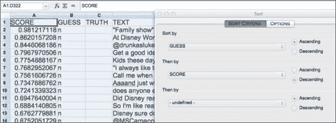
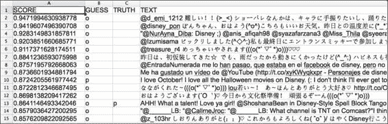

# 第三章：第3章：高级分类器

在本章中，我们将涵盖以下配方：

+   一个简单的分类器

+   基于标记的语言模型分类器

+   朴素贝叶斯

+   特征提取器

+   逻辑回归

+   多线程交叉验证

+   逻辑回归中的调参

+   定制特征提取

+   结合特征提取器

+   分类器构建生命周期

+   语言学调谐

+   阈值分类器

+   训练一点，学习一点——主动学习

+   注释

# 简介

本章介绍了更复杂的分类器，这些分类器使用不同的学习技术以及关于数据的更丰富观察（特征）。我们还将讨论构建机器学习系统的最佳实践以及数据标注和减少所需训练数据量的方法。

# 一个简单的分类器

这个配方是一个思想实验，应该有助于阐明机器学习做什么。回想一下[第1章](part0014_split_000.html#page "第1章。简单分类器")中*训练自己的语言模型分类器*的配方，在配方中训练自己的情感分类器。考虑一下对同一问题的保守方法可能是什么——从输入到正确类别的`Map<String,String>`。这个配方将探讨这可能如何工作以及可能产生的后果。

## 如何做到这一点...

准备好；这将是非常愚蠢但希望是有信息的。

1.  在命令行中输入以下内容：

    ```py
    java -cp lingpipe-cookbook.1.0.jar:lib/lingpipe-4.1.0.jar:lib/opencsv-2.4.jar com.lingpipe.cookbook.chapter3.OverfittingClassifier

    ```

1.  常见的贫血提示出现，伴随着一些用户输入：

    ```py
    Training
    Type a string to be classified. Empty string to quit.
    When all else fails #Disney
    Category is: e
    ```

1.  它正确地识别出语言为`e`或英语。然而，其他所有事情都将失败。接下来，我们将使用以下代码：

    ```py
    Type a string to be classified. Empty string to quit.
    When all else fails #Disne
    Category is: n
    ```

    我们刚刚在`#Disney`上省略了最后的`y`，结果我们得到了一个很大的混淆分类器。发生了什么？

## 它是如何工作的...

这一节实际上应该被称为*它不工作的方式*，但无论如何让我们深入细节。

为了清楚起见，这个配方不推荐作为任何需要灵活性的分类问题的实际解决方案。然而，它引入了如何与LingPipe的`Classification`类一起工作的最小示例，以及清楚地说明了过度拟合的极端案例；这反过来又有助于展示机器学习与标准计算机工程的不同之处。

从`main()`方法开始，我们将进入您从[第1章](part0014_split_000.html#page "第1章。简单分类器")中熟悉的常规代码编写：

```py
String dataPath = args.length > 0 ? args[0] : "data/disney_e_n.csv";
List<String[]> annotatedData = Util.readAnnotatedCsvRemoveHeader(new File(dataPath));

OverfittingClassifier classifier = new OverfittingClassifier();
System.out.println("Training");
for (String[] row: annotatedData) {
  String truth = row[Util.ANNOTATION_OFFSET];
  String text = row[Util.TEXT_OFFSET];
  classifier.handle(text,new Classification(truth));
}
Util.consoleInputBestCategory(classifier);
```

这里没有发生任何新颖的事情——我们只是在训练一个分类器，正如[第1章](part0014_split_000.html#page "第1章。简单分类器")中所示，*简单分类器*，然后将分类器提供给`Util.consoleInputBestCategory()`方法。查看类代码可以揭示发生了什么：

```py
public class OverfittingClassifier implements BaseClassifier<CharSequence> {

  Map<String,Classification> mMap 
         = new HashMap<String,Classification>();  

   public void handle(String text, Classification classification) {mMap.put(text, classification);
  }
```

因此，`handle()`方法接受`text`和`classification`对，并将它们放入`HashMap`中。分类器不会从数据中学习其他任何事情，因此训练相当于数据的记忆：

```py
@Override
public Classification classify(CharSequence text) {
  if (mMap.containsKey(text)) {
    return mMap.get(text);
  }
  return new Classification("n");
}
```

`classify()`方法只是在`Map`中进行查找，如果存在则返回值，否则，我们将得到类别`n`作为返回分类。

前一个代码的优点在于，你有一个`BaseClassifier`实现的简约示例，你可以看到`handle()`方法是如何向分类器添加数据的。

前一个代码的缺点在于从训练数据到类别的映射过于僵化。如果训练中没有看到确切的例子，那么就假设为`n`类别。

这是一个过度拟合的极端例子，但它本质上传达了拥有一个过度拟合模型的意义。一个过度拟合的模型过于贴近训练数据，无法很好地推广到新数据。

让我们再深入思考一下前一个用于语言识别的分类器有什么问题——问题是整个句子/推文是错误的处理单元。单词/标记是衡量正在使用哪种语言的更好指标。在后面的食谱中将会体现的一些改进包括：

+   将文本分解成单词/标记。

+   而不是简单的匹配/不匹配决策，考虑一个更细致的方法。简单的“哪种语言匹配更多单词”将是一个巨大的改进。

+   当语言越来越接近时，例如，英国英语与美国英语，可以调用概率。注意可能的区分性单词。

尽管这个食谱可能对于当前任务来说有些滑稽不合适，但考虑尝试一个更加荒谬的例子。它体现了一个计算机科学的核心假设，即输入的世界是离散且有限的。机器学习可以被视为对这样一个世界的回应。

## 还有更多...

令人奇怪的是，我们在商业系统中往往需要这样的分类器——我们称之为管理分类器；它在数据上预先运行。曾经发生过一位高级副总裁对系统输出的某些示例不满意的情况。这个分类器随后可以用确切的案例进行训练，以便立即修复系统并满足副总裁的需求。

# 基于标记的语言模型分类器

[第1章](part0014_split_000.html#page "第1章。简单分类器")，*简单分类器*，在不知道标记/单词是什么的情况下进行了分类，每个类别都有一个语言模型——我们使用了字符切片或ngram来对文本建模。[第2章](part0027_split_000.html#page "第2章。查找和使用单词")，*查找和使用单词*，详细讨论了在文本中查找标记的过程，现在我们可以使用它们来构建分类器。大多数时候，我们使用标记化输入到分类器中，所以这个食谱是概念的重要介绍。

## 如何实现...

这个食谱将告诉我们如何训练和使用一个分词语言模型分类器，但它将忽略诸如评估、序列化、反序列化等问题。您可以参考[第1章](part0014_split_000.html#page "第1章。简单分类器")中的食谱，*简单分类器*，以获取示例。这个食谱的代码在`com.lingpipe.cookbook.chapter3.TrainAndRunTokenizedLMClassifier`：

1.  以下代码的异常与[第1章](part0014_split_000.html#page "第1章。简单分类器")中“训练自己的语言模型分类器”食谱中找到的相同，*简单分类器*。`DynamicLMClassifier`类提供了一个用于创建分词语言模型分类器的静态方法。需要一些设置。`maxTokenNgram`变量设置了分类器中使用的最大标记序列大小——较小的数据集通常从低阶（标记数量）ngram中受益。接下来，我们将设置一个`tokenizerFactory`方法，选择来自[第2章](part0027_split_000.html#page "第2章。查找和使用单词")的“查找和使用单词”中的工作马分类器。最后，我们将指定分类器使用的类别：

    ```py
    int maxTokenNGram = 2;
    TokenizerFactory tokenizerFactory = IndoEuropeanTokenizerFactory.INSTANCE;
    String[] categories = Util.getCategories(annotatedData);
    ```

1.  接下来，构建分类器：

    ```py
    DynamicLMClassifier<TokenizedLM> classifier = DynamicLMClassifier.createTokenized(categories,tokenizerFactory,maxTokenNGram);
    ```

1.  通过命令行或您的IDE运行代码：

    ```py
    java -cp lingpipe-cookbook.1.0.jar:lib/lingpipe-4.1.0.jar:lib/opencsv-2.4.jar com.lingpipe.cookbook.chapter3.TrainAndRunTokenizedLMClassifier
    ```

## 还有更多...

在应用中，`DynamicLMClassifier`分类器在商业应用中并没有得到广泛的使用。这个分类器可能是一个很好的选择，用于作者识别分类器（即，判断给定的文本是由作者还是其他人写的）对短语和精确的单词使用非常敏感。Javadoc值得咨询，以更好地了解这个类的作用。

# 朴素贝叶斯

朴素贝叶斯可能是世界上最著名的分类技术，为了保持你的警惕，我们提供了两个具有许多可配置性的独立实现。朴素贝叶斯分类器最著名的应用之一是用于电子邮件中的垃圾邮件过滤。

使用单词“naïve”的原因是分类器假设单词（特征）彼此独立——这显然是一个简单的假设，但许多有用和不那么有用的技术都是基于这种方法。传统朴素贝叶斯的一些显著特点包括：

+   字符序列被转换为带有计数的标记袋。不考虑空白字符，并且标记的顺序无关紧要。

+   朴素贝叶斯分类器需要两个或更多类别，输入文本被分类到这些类别中。这些类别必须是详尽无遗且相互排斥的。这意味着用于训练的文档必须只属于一个类别。

+   数学非常简单：`p(category|tokens) = p(category,tokens)/p(tokens)`。

+   该类可以根据各种未知标记模型进行配置。

朴素贝叶斯分类器估计两件事。首先，它估计每个类别的概率，独立于任何标记。这是基于每个类别提供的训练示例的数量来执行的。其次，对于每个类别，它估计在该类别中看到每个标记的概率。朴素贝叶斯非常有用且重要，我们将向您展示它的工作原理以及如何使用公式。我们的例子是根据文本对炎热和寒冷天气进行分类。

首先，我们将计算出给定词序列的类别概率。其次，我们将插入一个示例，然后使用我们构建的分类器进行验证。

## 准备工作

让我们列出基本公式来计算给定文本输入的类别概率。基于标记的朴素贝叶斯分类器计算联合标记计数和类别概率如下：

```py
p(tokens,cat) = p(tokens|cat) * p(cat)
```

1.  条件概率是通过应用贝叶斯定理来反转概率计算得到的：

    ```py
    p(cat|tokens) = p(tokens,cat) / p(tokens)
                   = p(tokens|cat) * p(cat) / p(tokens)
    ```

1.  现在，我们将扩展所有这些术语。如果我们看`p(tokens|cat)`，这就是朴素假设发挥作用的地方。我们假设每个标记是独立的，因此所有标记的概率是每个标记概率的乘积：

    ```py
    p(tokens|cat) = p(tokens[0]|cat) * p(tokens[1]|cat) * . . . * p(tokens[n]|cat)
    ```

    标记本身的概率，即`p(tokens)`，是前面方程中的分母。这仅仅是它们在每个类别中的概率之和，并按该类别的概率本身进行加权：

    ```py
    p(tokens) = p(tokens|cat1) * p(cat1) + p(tokens|cat2) * p(cat2) + . . . + p(tokens|catN) * p(catN)
    ```

    ### 注意

    当构建朴素贝叶斯分类器时，`p(tokens)`不需要显式计算。相反，我们可以使用`p(tokens|cat) * p(cat)`并将标记分配给具有更高乘积的类别。

1.  现在我们已经列出了方程的每个元素，我们可以看看这些概率是如何计算的。我们可以使用简单的频率来计算这两个概率。

    一个类别的概率是通过计算该类别在训练实例中出现的次数除以训练实例的总数来计算的。正如我们所知，朴素贝叶斯分类器具有穷尽性和互斥性类别，因此每个类别的频率之和必须等于训练实例的总数：

    ```py
    p(cat) = frequency(cat) / (frequency(cat1) + frequency(cat2) + . . . + frequency(catN))
    ```

    一个类别中标记的概率是通过计算该标记在类别中出现的次数除以所有其他标记在该类别中出现的次数来计算的：

    ```py
    p(token|cat) = frequency(token,cat)/(frequency(token1,cat) + frequency(token2,cat) + . . . + frequency(tokenN,cat)
    ```

    这些概率被计算出来以提供所谓的**最大似然估计**的模型。不幸的是，这些估计为在训练期间未看到的标记提供了零概率。你可以在计算未看到标记的概率中非常容易地看到这一点。由于它没有被看到，它将有一个频率计数为0，并且我们原始方程中的分子将变为0。

    为了克服这一点，我们将使用一种称为**平滑**的技术，它分配一个先验，然后计算最大后验估计而不是最大似然估计。一个非常常见的平滑技术称为加性平滑，它只是将先验计数添加到训练数据中的每个计数。添加了两组计数：第一组是添加到所有标记频率计算中的标记计数，第二组是类别计数，它添加到所有类别计数计算中。

    这显然改变了`p(cat)`和`p(token|cat)`的值。让我们称添加到类别计数中的`alpha`先验和添加到标记计数中的`beta`先验为`alpha`。当我们调用`alpha`先验时，我们的先前计算将变为：

    ```py
    p(cat) = frequency(cat) + alpha / [(frequency(cat1) + alpha) + (frequency(cat2)+alpha) + . . . + (frequency(catN) + alpha)]
    ```

    当我们调用`beta`先验时，计算将变为：

    ```py
    p(token|cat) = (frequency(token,cat)+beta) / [(frequency(token1,cat)+beta) + frequency(token2,cat)+beta) + . . . + (frequency(tokenN,cat) + beta)]
    ```

1.  现在我们已经建立了方程，让我们看看一个具体的例子。

    我们将构建一个分类器，根据一组短语来分类预报是热天还是冷天：

    ```py
    hot : super steamy today
    hot : boiling out
    hot : steamy out

    cold : freezing out
    cold : icy
    ```

    这五个训练项中总共有七个标记：

    +   `super`

    +   `steamy`

    +   `today`

    +   `boiling`

    +   `out`

    +   `freezing`

    +   `icy`

    在这些中，所有标记都出现了一次，除了`steamy`在`hot`类别中出现了两次，以及`out`在每个类别中都出现了一次。这是我们训练数据。现在，让我们计算输入文本属于`hot`或`cold`类别的概率。假设我们的输入是单词`super`。让我们将类别先验`alpha`设置为`1`，将标记先验`beta`也设置为`1`。

1.  因此，我们将计算`p(hot|super)`和`p(cold|super)`的概率：

    ```py
    p(hot|super) = p(super|hot) * p(hot)/ p(super)

    p(super|hot) = (freq(super,hot) + beta) / [(freq(super|hot)+beta) + (freq(steamy|hot) + beta) + . . . + (freq(freezing|hot)+beta)
    ```

    我们将考虑所有标记，包括在`hot`类别中尚未见过的标记：

    ```py
    freq(super|hot) + beta = 1 + 1 = 2
    freq(steamy|hot) + beta = 2 + 1 = 3
    freq(today|hot) + beta = 1 + 1 = 2
    freq(boiling|hot) + beta = 1 + 1 = 2
    freq(out|hot) + beta = 1 + 1 = 2
    freq(freezing|hot) + beta = 0 + 1 = 1
    freq(icy|hot) + beta = 0 + 1 = 1
    ```

    这将给我们一个等于这些输入之和的分母：

    ```py
    2+3+2+2+2+1+1 = 13
    ```

1.  现在，`p(super|hot) = 2/13`是方程的一部分。我们还需要计算`p(hot)`和`p(super)`：

    ```py
    p(hot) = (freq(hot) + alpha) / 
                        ((freq(hot) + alpha) + freq(cold)+alpha)) 
    ```

    对于`hot`类别，我们有三个文档或案例，而对于`cold`类别，我们在训练数据中有两个文档。因此，`freq(hot) = 3`和`freq(cold) = 2`：

    ```py
    p(hot) = (3 + 1) / (3 + 1) + (2 +1) = 4/7
    Similarly p(cold) = (2 + 1) / (3 + 1) + (2 +1) = 3/7
    Please note that p(hot) = 1 – p(cold)

    p(super) = p(super|hot) * p(hot) + p(super|cold) + p(cold)
    ```

    要计算`p(super|cold)`，我们需要重复相同的步骤：

    ```py
    p(super|cold) = (freq(super,cold) + beta) / [(freq(super|cold)+beta) + (freq(steamy|cold) + beta) + . . . + (freq(freezing|cold)+beta)

    freq(super|cold) + beta = 0 + 1 = 1
    freq(steamy|cold) + beta = 0 + 1 = 1
    freq(today|cold) + beta = 0 + 1 = 1
    freq(boiling|cold) + beta = 0 + 1 = 1
    freq(out|cold) + beta = 1 + 1 = 2
    freq(freezing|cold) + beta = 1 + 1 = 2
    freq(icy|cold) + beta = 1 + 1 = 2

    p(super|cold) = freq(super|cold)+beta/sum of all terms above

                  = 0 + 1 / (1+1+1+1+2+2+2) = 1/10
    ```

    这给我们带来了标记`super`的概率：

    ```py
    P(super) = p(super|hot) * p(hot) + p(super|cold) * p(cold)
             = 2/13 * 4/7 + 1/10 * 3/7
    ```

    现在我们已经拥有了计算`p(hot|super)`和`p(cold|super)`的所有部分：

    ```py
    p(hot|super) = p(super|hot) * p(hot) / p(super)
                 = (2/13 * 4/7) / (2/13 * 4/7 + 1/10 * 3/7)

                 = 0.6722
    p(cold|super) = p(super|cold) * p(cold) /p(super)
                 = (1/10 * 3/7) / (2/13 * 4/7 + 1/10 * 3/7)
                 = 0.3277

    Obviously, p(hot|super) = 1 – p(cold|super)
    ```

    如果我们想要对输入流`super super`重复此操作，可以使用以下计算：

    ```py
    p(hot|super super) = p(super super|hot) * p(hot) / p(super super)
                 = (2/13 * 2/13 * 4/7) / (2/13 * 2/13 * 4/7 + 1/10 * 1/10 * 3/7)
                 = 0.7593
    p(cold|super super) = p(super super|cold) * p(cold) /p(super super)
                 = (1/10 * 1/10 * 3/7) / (2/13 * 2/13 * 4/7 + 1/10 * 1/10 * 3/7)
                 = 0.2406
    ```

    记住我们的朴素假设：标记的概率是概率的乘积，因为我们假设它们彼此独立。

让我们通过训练朴素贝叶斯分类器并使用相同的输入来验证我们的计算：

## 如何做...

让我们在代码中验证一些这些计算：

1.  在你的IDE中，运行本章代码包中的`TrainAndRunNaiveBayesClassifier`类，或者使用命令行，输入以下命令：

    ```py
    java -cp lingpipe-cookbook.1.0.jar:lib/lingpipe-4.1.0.jar:lib/opencsv-2.4.jar com.lingpipe.cookbook.chapter3.TrainAndRunNaiveBayesClassifier

    ```

1.  在提示中，让我们使用我们的第一个例子，`super`：

    ```py
    Type a string to be classified
    super
    h 0.67   
    c 0.33   
    ```

1.  如我们所见，我们的计算是正确的。对于在训练中不存在的单词`hello`的情况，我们将回退到由类别先验计数修改的类别的普遍性：

    ```py
    Type a string to be classified
    hello
    h 0.57   
    c 0.43
    ```

1.  再次，对于`super super`的情况，我们的计算是正确的。

    ```py
    Type a string to be classified
    super super

    
    h 0.76   
    c 0.24    
    ```

1.  生成前面输出的源代码在`src/com/lingpipe/chapter3/TrainAndRunNaiveBays.java`。代码应该是直截了当的，所以我们不会在这个配方中涵盖它。

## 参考内容

+   有关配置朴素贝叶斯的更多详细信息，包括长度归一化，请参阅[http://alias-i.com/lingpipe/docs/api/index.html?com/aliasi/classify/TradNaiveBayesClassifier.html](http://alias-i.com/lingpipe/docs/api/index.html?com/aliasi/classify/TradNaiveBayesClassifier.html)上的Javadoc

+   您可以参考[http://alias-i.com/lingpipe/demos/tutorial/em/read-me.html](http://alias-i.com/lingpipe/demos/tutorial/em/read-me.html)上的期望最大化教程

# 特征提取器

到目前为止，我们一直使用字符和单词来训练我们的模型。我们将介绍一个分类器（逻辑回归），它允许对数据进行其他观察，以告知分类器——例如，一个单词是否实际上是一个日期。特征提取器在CRF标记器和K-means聚类中使用。这个配方将介绍独立于任何使用它们的技术的特征提取器。

## 如何操作...

这个配方没有太多内容，但即将到来的*逻辑回归*配方有很多组成部分，这是其中之一。

1.  启动您的IDE或输入命令行：

    ```py
    java -cp lingpipe-cookbook.1.0.jar:lib/lingpipe-4.1.0.jar com.lingpipe.cookbook.chapter3.SimpleFeatureExtractor

    ```

1.  在我们的标准I/O循环中输入一个字符串：

    ```py
    Type a string to see its features
    My first feature extraction!
    ```

1.  然后产生特征：

    ```py
    !=1
    My=1
    extraction=1
    feature=1
    first=1
    ```

1.  注意，这里没有顺序信息。它是否保持计数？

    ```py
    Type a string to see its features
    My my my what a nice feature extractor.
    my=2
    .=1
    My=1
    a=1
    extractor=1
    feature=1
    nice=1
    what=1
    ```

1.  特征提取器使用`my=2`进行计数，并且它不规范化大小写（`My`与`my`不同）。请参考本章后面的配方，了解如何修改特征提取器——它们非常灵活。

## 它是如何工作的…

LingPipe为创建特征提取器提供了坚实的基础设施。这个配方的代码在`src/com/lingipe/chapter3/SimpleFeatureExtractor.java`：

```py
public static void main(String[] args) throws IOException {
  TokenizerFactory tokFact 
    = IndoEuropeanTokenizerFactory.INSTANCE;
  FeatureExtractor<CharSequence> tokenFeatureExtractor 
    = new TokenFeatureExtractor(tokFact);
```

上述代码使用`TokenizerFactory`构建了`TokenFeatureExtractor`。它是LingPipe提供的13个`FeatureExtractor`实现之一。

接下来，我们将应用I/O循环并打印出特征，它是`Map<String, ? extends Number>`。`String`元素是特征名称。在这种情况下，实际的标记是名称。映射的第二个元素是一个扩展`Number`的值，在这种情况下，是标记在文本中出现的次数。

```py
BufferedReader reader 
  = new BufferedReader(new   InputStreamReader(System.in));
while (true) {
  System.out.println("\nType a string to see its features");
  String text = reader.readLine();
  Map<String, ? extends Number > features 
    = tokenFeatureExtractor.features(text);
  System.out.println(features);
}
```

特征名称只需要是一个唯一的名称——我们可以在每个特征名称前加上`SimpleFeatExt_`以跟踪特征来源，这在复杂的特征提取场景中很有帮助。

# 逻辑回归

逻辑回归可能是大多数工业分类器的主要责任，可能除外的是朴素贝叶斯分类器。它几乎肯定是目前表现最好的分类器之一，尽管代价是训练速度慢，配置和调整相当复杂。

逻辑回归也被称为最大熵、单神经元神经网络分类以及其他名称。到目前为止，本书中的分类器都是基于底层字符或标记，但逻辑回归使用无限制的特征提取，这允许将任意观察到的情境编码到分类器中。

这个方法与[http://alias-i.com/lingpipe/demos/tutorial/logistic-regression/read-me.html](http://alias-i.com/lingpipe/demos/tutorial/logistic-regression/read-me.html)上的更完整的教程非常相似。

## 逻辑回归的工作原理

逻辑回归所做的只是对数据中的特征权重向量应用一个系数向量，并进行一些简单的数学运算，从而得到训练过程中遇到的每个类别的概率。复杂之处在于确定系数应该是什么。

以下是我们为21条标注为英语`e`和非英语`n`的推文训练的某些特征。由于我们的先验将特征权重推到`0.0`，因此特征相对较少，一旦权重为`0.0`，则删除该特征。请注意，一个类别`n`被设置为`0.0`，对于`n-1`类别的所有特征——这是逻辑回归过程的一个属性，一旦将类别特征固定为`0.0`，就调整所有其他类别特征相对于该值：

```py
FEATURE    e          n
I :   0.37    0.0
! :   0.30    0.0
Disney :   0.15    0.0
" :   0.08    0.0
to :   0.07    0.0
anymore : 0.06    0.0
isn :   0.06    0.0
' :   0.06    0.0
t :   0.04    0.0
for :   0.03    0.0
que :   -0.01    0.0
moi :   -0.01    0.0
_ :   -0.02    0.0
, :   -0.08    0.0
pra :   -0.09    0.0
? :   -0.09    0.0
```

以字符串“`I luv Disney`”为例，它将只有两个非零特征：`I=0.37`和`Disney=0.15`对于`e`，而`n`为0。由于没有与`luv`匹配的特征，它被忽略。推文是英语的概率分解如下：

*vectorMultiply(e,[I,Disney]) = exp(.37*1 + .15*1) = 1.68*

*vectorMultiply(n,[I,Disney]) = exp(0*1 + 0*1) = 1*

我们将通过求和结果并除以总数来将其转换为概率：

*p(e|,[I,Disney]) = 1.68/(1.68 +1) = 0.62*

*p(e|,[I,Disney]) = 1/(1.68 +1) = 0.38*

这就是运行逻辑回归模型时数学工作的方式。训练是另一个完全不同的问题。

## 准备工作

这个方法假设了我们一直在使用的相同框架，从`.csv`文件中获取训练数据，训练分类器，并在命令行中运行它。

设置训练分类器相对复杂，因为训练中使用的参数和对象数量众多。我们将讨论`com.lingpipe.cookbook.chapter3.TrainAndRunLogReg`中训练方法的10个参数。

`main()` 方法从应该熟悉的类和方法开始——如果它们不熟悉，请查看 *如何使用交叉验证进行训练和评估* 和 *介绍到介绍分词器工厂——在字符流中查找单词*，这些是从 [第1章](part0014_split_000.html#page "第1章。简单分类器")，*简单分类器* 和 [第2章](part0027_split_000.html#page "第2章。查找和使用单词*)，*查找和使用单词* 中摘录的食谱：

```py
public static void main(String[] args) throws IOException {
  String trainingFile = args.length > 0 ? args[0] 
           : "data/disney_e_n.csv";
  List<String[]> training 
    = Util.readAnnotatedCsvRemoveHeader(new File(trainingFile));

  int numFolds = 0;
  XValidatingObjectCorpus<Classified<CharSequence>> corpus 
    = Util.loadXValCorpus(training,numFolds);

  TokenizerFactory tokenizerFactory 
    = IndoEuropeanTokenizerFactory.INSTANCE;
```

注意，当我们可以使用更简单的实现，如 `ListCorpus` 时，我们正在使用 `XValidatingObjectCorpus`。我们不会利用其交叉验证的任何功能，因为 `numFolds` 参数设置为 `0` 将导致训练访问整个语料库。我们试图将新类别的数量保持在最低，而且我们通常在实际工作中总是使用这种实现。

现在，我们将开始为我们的分类器构建配置。`FeatureExtractor<E>` 接口提供了从数据到特征的映射；这将被用于训练和运行分类器。在这种情况下，我们使用 `TokenFeatureExtractor()` 方法，该方法基于在构建时提供的分词器找到的标记创建特征。这类似于朴素贝叶斯推理。前面的食谱更详细地介绍了特征提取器正在做什么，如果这还不清楚的话：

```py
FeatureExtractor<CharSequence> featureExtractor
  = new TokenFeatureExtractor(tokenizerFactory);
```

`minFeatureCount` 项目通常设置为一个大于1的数字，但在小型训练集中，这是获得任何性能所必需的。过滤特征计数的想法是，逻辑回归倾向于过度拟合低计数的特征，这些特征只是偶然存在于训练数据的一个类别中。随着训练数据的增长，`minFeatureCount` 值通常通过关注交叉验证性能来调整：

```py
int minFeatureCount = 1;
```

`addInterceptFeature` 布尔值控制是否存在一个类别特征，该特征用于建模训练中该类别的普遍性。截距特征的默认名称是 `*&^INTERCEPT%$^&**`，如果正在使用它，你将在权重向量输出中看到它。按照惯例，对于所有输入，截距特征被设置为 `1.0`。其想法是，如果一个类别非常普遍或非常罕见，应该有一个特征来捕捉这一事实，而与其他可能分布不干净的其它特征无关。这种方式在朴素贝叶斯中某种意义上建模了类别概率，但逻辑回归算法将决定它作为所有其他特征一样有用：

```py
boolean addInterceptFeature = true;
boolean noninformativeIntercept = true;
```

这些布尔值控制如果使用截距特征时会发生什么。在下面的代码中，先验通常不应用于截距特征；这是如果此参数为真的结果。将布尔值设置为 `false`，先验将应用于截距。

接下来是 `RegressionPrior` 实例，它控制模型如何拟合。您需要知道的是，先验有助于通过将系数推向 0 来防止逻辑回归过度拟合数据。存在一个非信息性先验，它不会这样做，结果是如果有一个只适用于一个类别的特征，它将被缩放到无穷大，因为模型在数值估计中增加系数时拟合得越来越好。在这个上下文中，先验充当了一种方式，以避免对世界的观察过于自信。

在 `RegressionPrior` 实例的另一个维度中是特征的预期方差。低方差会更有力地将系数推向零。静态 `laplace()` 方法返回的先验通常对 NLP 问题很有用。有关这里发生情况的更多信息，请参阅相关的 Javadoc 和食谱开头引用的逻辑回归教程——这里有很多事情发生，但无需深入的理论理解就可以管理。此外，请参阅本章中的“逻辑回归中的参数调整”食谱。

```py
double priorVariance = 2;
RegressionPrior prior 
  = RegressionPrior.laplace(priorVariance,
          noninformativeIntercept);
```

接下来，我们将控制算法搜索答案的方式。

```py
AnnealingSchedule annealingSchedule
  = AnnealingSchedule.exponential(0.00025,0.999);
double minImprovement = 0.000000001;
int minEpochs = 100;
int maxEpochs = 2000;
```

通过查阅 Javadoc 可以更好地理解 `AnnealingSchedule`，但它所做的就是改变在拟合模型时允许系数变化的程度。`minImprovement` 参数设置模型拟合必须改进的量，以避免终止搜索，因为算法已经收敛。`minEpochs` 参数设置最小迭代次数，而 `maxEpochs` 设置搜索没有根据 `minImprovement` 确定的收敛时上限。

接下来是一段允许进行基本报告/记录的代码。`LogLevel.INFO` 将报告分类器在尝试收敛过程中的大量信息：

```py
PrintWriter progressWriter = new PrintWriter(System.out,true);
progressWriter.println("Reading data.");
Reporter reporter = Reporters.writer(progressWriter);
reporter.setLevel(LogLevel.INFO);  
```

这是我们最复杂的课程之一“准备”部分的结束——接下来，我们将训练并运行分类器。

## 如何做到这一点...

设置训练和运行此类已经做了一些工作。我们将只通过步骤来使其运行；即将到来的食谱将解决其调整和评估：

1.  注意，还有一个更复杂的 14 参数的 `train` 方法以及扩展可配置性的一个方法。这是 10 参数版本：

    ```py
    LogisticRegressionClassifier<CharSequence> classifier
        = LogisticRegressionClassifier.
            <CharSequence>train(corpus,
            featureExtractor,
            minFeatureCount,
            addInterceptFeature,
            prior,
            annealingSchedule,
            minImprovement,
            minEpochs,
            maxEpochs,
            reporter);
    ```

1.  根据 `LogLevel` 常量，`train()` 方法将根据 `LogLevel.NONE` 从无到 `LogLevel.ALL` 的巨大输出产生。

1.  虽然我们不会使用它，但我们展示了如何将训练好的模型序列化到磁盘。[第 1 章](part0014_split_000.html#page "第 1 章。简单分类器")，“如何序列化 LingPipe 对象 – 分类器示例”食谱解释了这里发生的情况：

    ```py
    AbstractExternalizable.compileTo(classifier,
      new File("models/myModel.LogisticRegression"));
    ```

1.  训练完成后，我们将使用以下标准分类循环应用：

    ```py
    Util.consoleInputPrintClassification(classifier);
    ```

1.  在您选择的 IDE 中运行前面的代码或使用命令行命令：

    ```py
    java -cp lingpipe-cookbook.1.0.jar:lib/lingpipe-4.1.0.jar:lib/opencsv-2.4.jar com.lingpipe.cookbook.chapter3.TrainAndRunLogReg

    ```

1.  结果是关于训练的大量信息：

    ```py
    Reading data.
    :00 Feature Extractor class=class com.aliasi.tokenizer.TokenFeatureExtractor
    :00 min feature count=1
    :00 Extracting Training Data
    :00 Cold start
    :00 Regression callback handler=null
    :00 Logistic Regression Estimation
    :00 Monitoring convergence=true
    :00 Number of dimensions=233
    :00 Number of Outcomes=2
    :00 Number of Parameters=233
    :00 Number of Training Instances=21
    :00 Prior=LaplaceRegressionPrior(Variance=2.0, noninformativeIntercept=true)
    :00 Annealing Schedule=Exponential(initialLearningRate=2.5E-4, base=0.999)
    :00 Minimum Epochs=100
    :00 Maximum Epochs=2000
    :00 Minimum Improvement Per Period=1.0E-9
    :00 Has Informative Prior=true
    :00 epoch=    0 lr=0.000250000 ll=   -20.9648 lp= -232.0139 llp=  -252.9787 llp*=  -252.9787
    :00 epoch=    1 lr=0.000249750 ll=   -20.9406 lp= -232.0195 llp=  -252.9602 llp*=  -252.9602
    ```

1.  `epoch` 报告会持续进行，直到达到指定的 epoch 数量或搜索收敛。在以下情况下，达到了 epoch 数量：

    ```py
    :00 epoch= 1998 lr=0.000033868 ll=   -15.4568 lp=  -233.8125 llp=  -249.2693 llp*=  -249.2693
    :00 epoch= 1999 lr=0.000033834 ll=   -15.4565 lp=  -233.8127 llp=  -249.2692 llp*=  -249.2692
    ```

1.  现在，我们可以稍微玩一下这个分类器：

    ```py
    Type a string to be classified. Empty string to quit.
    I luv Disney
    Rank  Category  Score  P(Category|Input)
    0=e 0.626898085027528 0.626898085027528
    1=n 0.373101914972472 0.373101914972472
    ```

1.  这看起来很熟悉；这正是菜谱开头的工作示例的结果。

就这样！你已经训练并使用了世界上最具相关性的工业分类器。然而，要充分利用这个巨兽的力量还有很多。

# 多线程交叉验证

交叉验证（参考第 1 章 *如何使用交叉验证进行训练和评估* 菜谱，*简单分类器*），可能会非常慢，这会干扰系统调优。这个菜谱将向你展示一种简单但有效的方法，以访问系统上所有可用的核心，以便更快地处理每个折叠。

## 如何操作...

这个菜谱在下一个菜谱的上下文中解释了多线程交叉验证，所以不要因为同一个类被重复而感到困惑。

1.  启动你的 IDE 或在命令行中输入命令：

    ```py
    java -cp lingpipe-cookbook.1.0.jar:lib/lingpipe-4.1.0.jar:lib/opencsv-2.4.jar com.lingpipe.cookbook.chapter3.TuneLogRegParams

    ```

1.  系统随后会响应以下输出（你可能需要滚动到窗口顶部）：

    ```py
    Reading data.
    RUNNING thread Fold 5 (1 of 10)
    RUNNING thread Fold 9 (2 of 10)
    RUNNING thread Fold 3 (3 of 10)
    RUNNING thread Fold 4 (4 of 10)
    RUNNING thread Fold 0 (5 of 10)
    RUNNING thread Fold 2 (6 of 10)
    RUNNING thread Fold 8 (7 of 10)
    RUNNING thread Fold 6 (8 of 10)
    RUNNING thread Fold 7 (9 of 10)
    RUNNING thread Fold 1 (10 of 10)
    reference\response
              \e,n,
             e 11,0,
             n 6,4,
    ```

1.  默认的训练数据是 21 条标注为英语 `e` 和非英语 `n` 的推文。在前面的输出中，我们看到了作为线程运行的每个折叠的报告和结果混淆矩阵。就是这样！我们刚刚完成了多线程交叉验证。让我们看看它是如何工作的。

## 它是如何工作的…

所有操作都在 `Util.xvalLogRegMultiThread()` 方法中发生，我们从 `src/com/lingpipe/cookbook/chapter3/TuneLogRegParams.java` 调用此方法。`TuneLogRegParams` 的细节将在下一个菜谱中介绍。这个菜谱将专注于 `Util` 方法：

```py
int numThreads = 2;
int numFolds = 10;
Util.xvalLogRegMultiThread(corpus,
        featureExtractor,
        minFeatureCount,
        addInterceptFeature,
        prior,
        annealingSchedule,
        minImprovement,
        minEpochs,
        maxEpochs,
        reporter,
        numFolds,
        numThreads,
        categories);
```

用于配置逻辑回归的所有 10 个参数都是可控制的（你可以参考前面的菜谱进行解释），包括 `numFolds`，它控制将有多少个折叠，`numThreads`，它控制可以同时运行多少个线程，以及最后的 `categories`。

如果我们查看 `src/com/lingpipe/cookbook/Util.java` 中的相关方法，我们会看到：

```py
public static <E> ConditionalClassifierEvaluator<E> xvalLogRegMultiThread(
    final XValidatingObjectCorpus<Classified<E>> corpus,
    final FeatureExtractor<E> featureExtractor,
    final int minFeatureCount, 
    final boolean addInterceptFeature,
    final RegressionPrior prior, 
    final AnnealingSchedule annealingSchedule,
    final double minImprovement, 
    final int minEpochs, final int maxEpochs,
    final Reporter reporter, 
    final int numFolds, 
    final int numThreads, 
    final String[] categories) {
```

1.  方法从为逻辑回归配置信息匹配的参数开始，运行交叉验证。由于交叉验证最常用于系统调优，所有相关部分都暴露出来以供修改。一切都是最终的，因为我们使用匿名内部类来创建线程。

1.  接下来，我们将设置 `crossFoldEvaluator`，它将收集每个线程的结果：

    ```py
    corpus.setNumFolds(numFolds);
    corpus.permuteCorpus(new Random(11211));
    final boolean storeInputs = true;
    final ConditionalClassifierEvaluator<E> crossFoldEvaluator
      = new ConditionalClassifierEvaluator<E>(null, categories, storeInputs);
    ```

1.  现在，我们将着手为每个折叠创建线程，`i`：

    ```py
    List<Thread> threads = new ArrayList<Thread>();
    for (int i = 0; i < numFolds; ++i) {
      final XValidatingObjectCorpus<Classified<E>> fold 
        = corpus.itemView();
      fold.setFold(i);
    ```

    `XValidatingObjectCorpus` 类通过创建用于读取的线程安全版本的数据集，通过 `itemView()` 方法设置为多线程访问。此方法返回一个可以设置折叠的数据集，但不能添加数据。

    每个线程都是一个 `runnable` 对象，其中折叠的训练和评估的实际工作在 `run()` 方法中处理：

    ```py
    Runnable runnable 
      = new Runnable() {
        @Override
        public void run() {
        try {
          LogisticRegressionClassifier<E> classifier
            = LogisticRegressionClassifier.<E>train(fold,
                    featureExtractor,
                    minFeatureCount,
                    addInterceptFeature,
                    prior,
                    annealingSchedule,
                    minImprovement,
                    minEpochs,
                    maxEpochs,
                    reporter);
    ```

    在此代码中，我们首先训练分类器，这反过来又需要一个 `try/catch` 语句来处理 `LogisticRegressionClassifier.train()` 方法抛出的 `IOException`。接下来，我们将创建 `withinFoldEvaluator`，它将在线程中填充，而不会出现同步问题：

    ```py
    ConditionalClassifierEvaluator<E> withinFoldEvaluator 
      = new ConditionalClassifierEvaluator<E>(classifier, categories, storeInputs);
    fold.visitTest(withinFoldEvaluator);
    ```

    确保 `storeInputs` 为 `true` 非常重要，这样可以将折叠结果添加到 `crossFoldEvaluator`：

    ```py
    addToEvaluator(withinFoldEvaluator,crossFoldEvaluator);
    ```

    此方法，同样在 `Util` 中，遍历每个类别的所有真实正例和假负例，并将它们添加到 `crossFoldEvaluator`。请注意，这是同步的：这意味着一次只有一个线程可以访问该方法，但由于分类已经完成，这不应该成为瓶颈：

    ```py
    public synchronized static <E> void addToEvaluator(BaseClassifierEvaluator<E> foldEval, ScoredClassifierEvaluator<E> crossFoldEval) {
      for (String category : foldEval.categories()) {
       for (Classified<E> classified : foldEval.truePositives(category)) {
        crossFoldEval.addClassification(category,classified.getClassification(),classified.getObject());
       }
       for (Classified<E> classified : foldEval.falseNegatives(category)) {
        crossFoldEval.addClassification(category,classified.getClassification(),classified.getObject());
       }
      }
     }
    ```

    该方法将每个类别的真实正例和假负例添加到 `crossFoldEval` 评估器中。这些基本上是复制操作，计算起来不费时。

1.  返回到 `xvalLogRegMultiThread`，我们将处理异常并将完成的 `Runnable` 添加到我们的 `Thread` 列表中：

    ```py
        catch (Exception e) {
          e.printStackTrace();
        }
      }
    };
    threads.add(new Thread(runnable,"Fold " + i));
    ```

1.  在设置好所有线程后，我们将调用 `runThreads()` 并打印出由此产生的混淆矩阵。我们不会深入探讨 `runThreads()` 的来源，因为它只是简单的 Java 线程管理，而 `printConfusionMatrix` 在 [第 1 章](part0014_split_000.html#page "Chapter 1. Simple Classifiers")，*简单分类器* 中已经介绍过：

    ```py

      runThreads(threads,numThreads); 
      printConfusionMatrix(crossFoldEvaluator.confusionMatrix());
    }
    ```

这就是加快多核机器上交叉验证速度的全部内容。在调整系统时，这可以产生很大的影响。

# 调整逻辑回归中的参数

逻辑回归提供了一系列令人畏惧的参数来调整以获得更好的性能，与之合作有点像黑魔法。我们已经构建了数千个这样的分类器，但我们仍在学习如何做得更好。这个配方将指引你走向一般正确的方向，但这个主题可能值得一本自己的书。

## 如何做到这一点...

这个配方涉及到对 `src/com/lingpipe/chapter3/TuneLogRegParams.java` 源代码的广泛修改。我们在这里只运行它的一个配置，大部分解释都在 *它是如何工作的…* 部分中。

1.  启动你的 IDE 或在命令行中输入以下内容：

    ```py
    java -cp lingpipe-cookbook.1.0.jar:lib/lingpipe-4.1.0.jar:lib/opencsv-2.4.jar com.lingpipe.cookbook.chapter3.TuneLogRegParams

    ```

1.  系统随后会响应默认数据 `data/disney_e_n.csv` 的交叉验证输出混淆矩阵：

    ```py
    reference\response
              \e,n,
             e 11,0,
             n 6,4,
    ```

1.  接下来，我们将报告每个类别的假正例——这将涵盖所有错误：

    ```py
    False Positives for e
    ES INSUPERABLE DISNEY !! QUIERO VOLVER:( : n
    @greenath_ t'as de la chance d'aller a Disney putain : n 
    jamais été moi. : n
    @HedyHAMIDI au quartier pas a Disney moi: n
    …
    ```

1.  此输出之后是特征、它们的系数和计数——记住，我们将看到 `n-1` 个类别，因为其中一个类别的特征被设置为所有特征的 `0.0`：

    ```py
    Feature coefficients for category e
    I : 0.36688604
    ! : 0.29588525
    Disney : 0.14954419
    " : 0.07897427
    to : 0.07378086
    …
    Got feature count: 113
    ```

1.  最后，我们有我们的标准输入/输出，允许测试示例：

    ```py
    Type a string to be classified
    I luv disney
    Rank  Category  Score  P(Category|Input)
    0=e 0.5907060507161321 0.5907060507161321
    1=n 0.40929394928386786 0.40929394928386786
    ```

1.  这是我们将要工作的基本结构。在接下来的章节中，我们将更深入地探讨参数变化的影响。

## 它是如何工作的…

本菜谱假设你已经熟悉从两个菜谱之前的逻辑回归训练和配置以及交叉验证，这是之前的菜谱。代码的整体结构以提纲形式呈现，保留了调整参数。将讨论如何修改每个参数将在菜谱的后面部分——下面我们开始从`main()`方法开始，忽略一些由`...`指示的代码，并显示用于分词和特征提取的可调整代码：

```py
public static void main(String[] args) throws IOException {
    …
  TokenizerFactory tokenizerFactory 
     = IndoEuropeanTokenizerFactory.INSTANCE;
  FeatureExtractor<CharSequence> featureExtractor
     = new TokenFeatureExtractor(tokenizerFactory);
  int minFeatureCount = 1;
  boolean addInterceptFeature = false;
```

接下来设置先验概率：

```py
  boolean noninformativeIntercept = true;
  double priorVariance = 2 ;
  RegressionPrior prior 
    = RegressionPrior.laplace(priorVariance,
            noninformativeIntercept);
```

先验概率对行为系数分配有强烈的影响：

```py
  AnnealingSchedule annealingSchedule
    = AnnealingSchedule.exponential(0.00025,0.999);
  double minImprovement = 0.000000001;
  int minEpochs = 10;
  int maxEpochs = 20;
```

之前的代码控制着逻辑回归的搜索空间：

```py
Util.xvalLogRegMultiThread(corpus,…);
```

之前的代码运行交叉验证以查看系统表现如何——注意省略的参数使用`...`表示。

在以下代码中，我们将折数设置为`0`，这将使训练方法访问整个语料库：

```py
corpus.setNumFolds(0);
LogisticRegressionClassifier<CharSequence> classifier
  = LogisticRegressionClassifier.<CharSequence>train(corpus,…
```

然后，对于每个类别，我们将打印出刚刚训练好的分类器的特征及其系数：

```py
int featureCount = 0;
for (String category : categories) {
  ObjectToDoubleMap<String> featureCoeff 
    = classifier.featureValues(category);
  System.out.println("Feature coefficients for category " 
        + category);
  for (String feature : featureCoeff.keysOrderedByValueList()) {
    System.out.print(feature);
    System.out.printf(" :%.8f\n",featureCoeff.getValue(feature));
    ++featureCount;
  }
}
System.out.println("Got feature count: " + featureCount);
```

最后，我们将有常规的控制台分类器输入/输出：

```py
Util.consoleInputPrintClassification(classifier);    
```

### 调整特征提取

输入到逻辑回归中的特征对系统的性能有巨大影响。我们将在后面的菜谱中更详细地介绍特征提取，但在这里我们将使用一种非常实用且有些反直觉的方法，因为它非常容易执行——使用字符n-gram而不是单词/标记。让我们看一个例子：

```py
Type a string to be classified. Empty string to quit.
The rain in Spain
Rank  Category  Score  P(Category|Input)
0=e 0.5 0.5
1=n 0.5 0.5
```

此输出表明，分类器在`e`英语和`n`非英语之间做出决策。通过滚动回查看特征，我们将看到输入中的任何单词都没有匹配项。在英语方面有一些子串匹配。`The`对于特征词`the`有子串`he`。对于语言识别，考虑子串是有意义的，但根据经验，它对于情感和其他问题也可能有很大的帮助。

将分词器修改为两到四个字符的n-gram如下：

```py
int min = 2;
int max = 4;
TokenizerFactory tokenizerFactory 
  = new NGramTokenizerFactory(min,max);
```

这导致了适当的区分：

```py
Type a string to be classified. Empty string to quit.
The rain in Spain
Rank  Category  Score  P(Category|Input)
0=e 0.5113903651380305 0.5113903651380305
1=n 0.4886096348619695 0.4886096348619695
```

在交叉验证中的整体性能略有下降。对于非常小的训练集，例如21条推文，这是预料之中的。通常，通过查看错误的样子以及查看假阳性，交叉验证的性能将有助于指导这个过程。

在查看假阳性时，很明显`Disney`是问题之源，因为特征上的系数表明它是英语的证据。一些假阳性如下：

```py
False Positives for e
@greenath_ t'as de la chance d'aller a Disney putain j'y ai jamais été moi. : n
@HedyHAMIDI au quartier pas a Disney moi : n
Prefiro gastar uma baba de dinheiro pra ir pra cancun doq pra Disney por exemplo : n
```

以下是为`e`的特征：

```py
Feature coefficients for category e
I : 0.36688604
! : 0.29588525
Disney : 0.14954419
" : 0.07897427
to : 0.07378086
```

在没有更多训练数据的情况下，应该删除特征`!`、`Disney`和`"`以帮助此分类器表现更好，因为这些特征都不是语言特定的，而`I`和`to`是，尽管它们不是英语特有的。这可以通过过滤数据或创建适当的分词器工厂来完成，但最好的办法可能是获取更多数据。

当数据量很大，且你不想逻辑回归专注于非常低频的现象，因为它往往会引起过拟合时，`minFeature`计数变得有用。

将`addInterceptFeature`参数设置为`true`将添加一个始终触发的特征。这将允许逻辑回归具有对每个类别的示例数量敏感的特征。这并不是类别的边缘似然，因为逻辑回归会像任何其他特征一样调整权重——但是以下先验展示了如何进一步调整：

```py
de : -0.08864114
( : -0.10818647
*&^INTERCEPT%$^&** : -0.17089337
```

最终，截距是`n`的最强特征，在这种情况下，整体交叉验证性能有所下降。

### 先验

先验的作用是限制逻辑回归完美拟合训练数据的倾向。我们使用的那些先验在程度上试图将系数推向零。我们将从`nonInformativeIntercept`先验开始，它控制截距特征是否受到先验的归一化影响——如果为真，则截距不受先验影响，这在先前的例子中就是这样。将其设置为`false`使其从`-0.17`移动到接近零：

```py
*&^INTERCEPT%$^&** : -0.03874782
```

接下来，我们将调整先验的方差。这为权重设定了一个预期的变化。低方差意味着系数预计不会从零变化很大。在先前的代码中，方差被设置为`2`。这是将其设置为`.01`的结果：

```py
Feature coefficients for category e
' : -0.00003809
Feature coefficients for category n
```

这是从方差为`2`的104个特征下降到方差为`.01`的一个特征，因为一旦一个特征下降到`0`，它就会被移除。

增加方差将使我们的前`e`个特征从`2`增加到`4`：

```py
Feature coefficients for category e
I : 0.36688604
! : 0.29588525
Disney : 0.14954419

I : 0.40189501
! : 0.31387376
Disney : 0.18255271
```

这总共是119个特征。

考虑一个方差为`2`和`gaussian`先验：

```py
boolean noninformativeIntercept = false;
double priorVariance = 2;
RegressionPrior prior 
  = RegressionPrior.gaussian(priorVariance,
    noninformativeIntercept);
```

我们将得到以下输出：

```py
I : 0.38866670
! : 0.27367013
Disney : 0.22699340
```

奇怪的是，我们花很少的时间担心使用哪个先验，但方差在性能中起着重要作用，因为它可以快速减少特征空间。拉普拉斯是NLP应用中普遍接受的先验。

请参阅Javadoc和逻辑回归教程以获取更多信息。

### 退火计划和时期

随着逻辑回归收敛，退火计划控制着搜索空间的探索和终止方式：

```py
AnnealingSchedule annealingSchedule
    = AnnealingSchedule.exponential(0.00025,0.999);
  double minImprovement = 0.000000001;
  int minEpochs = 10;
  int maxEpochs = 20;
```

在调整时，如果搜索过程耗时过长，我们将按数量级（`.0025,.025,...`）增加退火计划的第一参数——通常，我们可以增加训练速度而不会影响交叉验证性能。此外，`minImprovement`值可以增加，以便收敛结束得更快，这既可以增加训练速度，又可以防止模型过拟合——这被称为**提前停止**。再次强调，在这种情况下，你的指导方针是查看在做出更改时的交叉验证性能。

实现收敛所需的epoch数可能会相当高，所以如果分类器正在迭代到`maxEpochs -1`，这意味着需要更多的epoch才能收敛。确保设置`reporter.setLevel(LogLevel.INFO);`属性或更详细的信息级别以获取收敛报告。这是强制提前停止的另一种方式。

参数调整是一门只能通过实践学习的黑艺术。训练数据的质量和数量可能是分类器性能的主要因素，但调整也可以产生重大影响。

# 自定义特征提取

逻辑回归允许使用任意特征。特征是关于正在分类的数据可以做出的任何观察。以下是一些例子：

+   文本中的单词/标记。

+   我们发现，在代替单词或词干的情况下，字符n-gram工作得非常好。对于小于10,000个训练单词的小数据集，我们将使用2-4个gram。更大的训练数据可能需要更长的gram，但我们从未在超过8-gram字符的情况下获得良好的结果。

+   来自另一个组件的输出可以是特征，例如，一个词性标注器。

+   关于文本已知的元数据，例如，推文的地点或创建时间。

+   从实际值中抽象出的日期和数字的识别。

## 如何做……

此菜谱的源代码位于`src/com/lingpipe/cookbook/chapter3/ContainsNumberFeatureExtractor.java`。

1.  特征提取器很容易构建。以下是一个返回带有权重`1`的`CONTAINS_NUMBER`特征的提取器：

    ```py
    public class ContainsNumberFeatureExtractor implements FeatureExtractor<CharSequence> {
      @Override
      public Map<String,Counter> features(CharSequence text) {
             ObjectToCounterMap<String> featureMap 
             = new ObjectToCounterMap<String>();
        if (text.toString().matches(".*\\d.*")) {
          featureMap.set("CONTAINS_NUMBER", 1);
        }
        return featureMap;  }
    ```

1.  通过添加`main()`方法，我们可以测试特征提取器：

    ```py
    public static void main(String[] args) {
      FeatureExtractor<CharSequence> featureExtractor 
             = new ContainsNumberFeatureExtractor();
      System.out.println(featureExtractor.features("I have a number 1"));
    }
    ```

1.  现在运行以下命令：

    ```py
    java -cp lingpipe-cookbook.1.0.jar:lib/lingpipe-4.1.0.jar:lib/opencsv-2.4.jar com.lingpipe.cookbook.chapter3.ContainsNumberFeatureExtractor

    ```

1.  上述代码产生以下输出：

    ```py
    CONTAINS_NUMBER=1

    ```

就这样。下一个菜谱将向您展示如何组合特征提取器。

## 还有更多……

设计特征有点像一门艺术。逻辑回归在面临无关特征时应该很稳健，但用真正愚蠢的特征来压倒它可能会降低性能。

思考你需要哪些特征的一种方式是思考文本或环境中哪些证据有助于你，作为人类，决定正确的分类。尝试在查看文本时忽略你的世界知识。如果世界知识，即法国是一个国家，很重要，那么尝试用 gazetteer 来模拟这种世界知识，以生成`CONTAINS_COUNTRY_MENTION`。

注意，特征是字符串，唯一的概念是精确的字符串匹配。`12:01pm`特征与`12:02pm`完全不同，尽管对人类来说，这些字符串非常接近，因为我们理解时间。要获取这两个特征之间的相似度，你必须有像`LUNCH_TIME`这样的特征，它是使用时间计算出来的。

# 组合特征提取器

特征提取器可以像 [第 2 章](part0027_split_000.html#page "第 2 章。查找和使用单词") 中的分词器一样组合，*查找和使用单词*。

## 如何操作...

本食谱将向您展示如何将前一个食谱中的特征提取器与一个非常常见的基于字符 n-gram 的特征提取器相结合。

1.  我们将在 `src/com/lingpipe/cookbook/chapter3/CombinedFeatureExtractor.java` 中的 `main()` 方法开始，我们将使用它来运行特征提取器。以下行设置了使用 LingPipe 类 `TokenFeatureExtractor` 通过分词器生成的特征：

    ```py
    public static void main(String[] args) {
       int min = 2;
      int max = 4;
      TokenizerFactory tokenizerFactory 
         = new NGramTokenizerFactory(min,max);
      FeatureExtractor<CharSequence> tokenFeatures 
    = new TokenFeatureExtractor(tokenizerFactory);
    ```

1.  然后，我们将从前一个食谱中构建特征提取器。

    ```py
    FeatureExtractor<CharSequence> numberFeatures 
    = new ContainsNumberFeatureExtractor();
    ```

1.  接下来，LingPipe 类 `AddFeatureExtractor` 将两个特征提取器合并为一个第三个：

    ```py
    FeatureExtractor<CharSequence> joinedFeatureExtractors 
      = new AddFeatureExtractor<CharSequence>(
              tokenFeatures,numberFeatures);
    ```

1.  剩余的代码获取特征并打印出来：

    ```py
    String input = "show me 1!";
    Map<String,? extends Number> features 
       = joinedFeatureExtractors.features(input);
    System.out.println(features);
    ```

1.  运行以下命令

    ```py
    java -cp lingpipe-cookbook.1.0.jar:lib/lingpipe-4.1.0.jar:lib/opencsv-2.4.jar com.lingpipe.cookbook.chapter3.CombinedFeatureExtractor

    ```

1.  输出看起来像这样：

    ```py
    {me =1.0,  m=1.0, me 1=1.0, e =1.0, show=1.0,  me =1.0, ho=1.0, ow =1.0, e 1!=1.0, sho=1.0,  1=1.0, me=1.0, how =1.0, CONTAINS_NUMBER=1.0, w me=1.0,  me=1.0, how=1.0,  1!=1.0, sh=1.0, ow=1.0, e 1=1.0, w m=1.0, ow m=1.0, w =1.0, 1!=1.0}

    ```

## 还有更多...

Javadoc 引用了广泛的功能提取器和组合器/过滤器，以帮助管理特征提取的任务。这个类的一个稍微令人困惑的方面是，`FeatureExtractor` 接口位于 `com.aliasi.util` 包中，而实现类都在 `com.aliasi.features`。

# 分类器构建生命周期

在顶级构建中，分类器通常按以下方式进行：

1.  创建训练数据——有关更多信息，请参阅以下食谱。

1.  使用健全性检查构建训练和评估基础设施。

1.  建立基线性能。

1.  选择分类器的优化指标——这是分类器试图完成的事情，并将指导调整。

1.  通过以下技术优化分类器：

    +   参数调整

    +   阈值

    +   语言学调整

    +   添加训练数据

    +   精炼分类器定义

本食谱将以具体术语展示前四个步骤，本章中还有针对优化步骤的食谱。

## 准备工作

没有训练数据，分类器不会发生任何作用。查看本章末尾的 *Annotation* 食谱，以获取创建训练数据的技巧。您还可以使用主动学习框架逐步生成训练语料库（本章后面将介绍），这是本食谱中使用的数据。

接下来，通过从最愚蠢的可能实现开始来降低风险，以确保所解决的问题范围正确，整体架构合理。用简单的代码将假设的输入连接到假设的输出。我们保证，大多数情况下，其中一个或另一个将不是你所想的。

本食谱假设您熟悉 [第 1 章](part0014_split_000.html#page "第 1 章。简单分类器") 中介绍的评价概念，如交叉验证和混淆矩阵，以及迄今为止涵盖的逻辑回归食谱。

整个源代码位于 `src/com/lingpipe/cookbook/chapter3/ClassifierBuilder.java`。

这个食谱还假设你可以在你首选的开发环境中编译和运行代码。我们做出的所有更改的结果在`src/com/lingpipe/cookbook/chapter3/ClassifierBuilderFinal.java`中。

### 注意

在这个食谱中有一个大前提——我们使用一个非常小的数据集来在分类器构建上阐述基本观点。我们试图构建的情感分类器将从10倍更多的数据中受益。

## 如何做到这一点…

我们从一组去重后的推文开始，这些推文是接下来这个食谱中将要遵循的“训练一点，学习一点——主动学习”食谱的结果。食谱的起点是以下代码：

```py
public static void main(String[] args) throws IOException {
  String trainingFile = args.length > 0 ? args[0] 
    : "data/activeLearningCompleted/"
    + "disneySentimentDedupe.2.csv";
  int numFolds = 10;
  List<String[]> training 
    = Util.readAnnotatedCsvRemoveHeader(new File(trainingFile));
  String[] categories = Util.getCategories(training);
  XValidatingObjectCorpus<Classified<CharSequence>> corpus 
  = Util.loadXValCorpus(training,numFolds);
TokenizerFactory tokenizerFactory 
  = IndoEuropeanTokenizerFactory.INSTANCE;
PrintWriter progressWriter = new PrintWriter(System.out,true);
Reporter reporter = Reporters.writer(progressWriter);
reporter.setLevel(LogLevel.WARN);
boolean storeInputs = true;
ConditionalClassifierEvaluator<CharSequence> evaluator 
    = new ConditionalClassifierEvaluator<CharSequence>(null, categories, storeInputs);
corpus.setNumFolds(0);
LogisticRegressionClassifier<CharSequence> classifier = Util.trainLogReg(corpus, tokenizerFactory, progressWriter);
evaluator.setClassifier(classifier);
System.out.println("!!!Testing on training!!!");
Util.printConfusionMatrix(evaluator.confusionMatrix());
}
```

### 理性检查 – 在训练数据上测试

首先要做的事情是让系统运行起来，并在训练数据上测试：

1.  我们留下了一条打印语句，宣传正在发生的事情：

    ```py
    System.out.println("!!!Testing on training!!!");
    corpus.visitTrain(evaluator);
    ```

1.  运行`ClassifierBuilder`将产生以下结果：

    ```py
    !!!Testing on training!!!
    reference\response
              \p,n,o,
             p 67,0,3,
             n 0,30,2,
             o 2,1,106,
    ```

1.  前面的混淆矩阵几乎是一个完美的系统输出，这验证了系统基本上是正常工作的。这是你将看到的最好的系统输出；永远不要让管理层看到它，否则他们会认为这种性能水平是可以做到的或者已经做到了。

### 使用交叉验证和指标建立基线

现在是时候看看真正发生的事情了。

1.  如果你数据量小，那么将折数设置为`10`，这样就有90%的数据用于训练。如果你数据量大或者时间紧迫，那么将其设置为`2`：

    ```py
    static int NUM_FOLDS = 10;
    ```

1.  取消注释或删除测试数据上的训练代码：

    ```py
    //System.out.println("!!!Testing on training!!!");
    //corpus.visitTrain(evaluator);
    ```

1.  插入一个交叉验证循环或者只是取消注释我们源代码中的循环：

    ```py
    corpus.setNumFolds(numFolds);
    for (int i = 0; i < numFolds; ++i) {
     corpus.setFold(i);
      LogisticRegressionClassifier<CharSequence> classifier 
         = Util.trainLogReg(corpus, tokenizerFactory, progressWriter);
      evaluator.setClassifier(classifier);
     corpus.visitTest(evaluator);
    }
    ```

1.  重新编译并运行代码将给出以下输出：

    ```py
    reference\response
              \p,n,o,
             p 45,8,17,
             n 16,13,3,
             o 18,3,88,
    ```

1.  分类器的标签意味着`p=positiveSentiment`，`n=negativeSentiment`，和`o=other`，这涵盖了其他语言或中性情感。混淆矩阵的第一行表明，系统得到了`45`个真正的正例，`8`个它认为是`n`的假阴性，以及`17`个它认为是`o`的假阴性：

    ```py
    reference\response
          \p,n,o,
        p 45,8,17,
    ```

1.  要获取`p`的假阳性，我们需要查看第一列。我们看到系统认为`16`个`n`注释是`p`，`18`个`o`注释是`p`：

    ```py
    reference\response
              \p,
             p 45
             n 16
             o 18
    ```

    ### 小贴士

    混淆矩阵是查看/展示分类器结果最诚实和直接的方式。性能指标如精确度、召回率、F度量、准确度都非常难以捉摸，并且经常被错误地使用。在展示结果时，始终准备好混淆矩阵，因为如果我们是听众或者类似的人，我们都会要求看到它。

1.  对其他类别执行相同的分析，你将有一个系统性能的评估。

### 选择一个单一指标进行优化

执行以下步骤：

1.  虽然混淆矩阵建立了分类器的整体性能，但它太复杂，不能用作调整指南。你不想每次调整一个特征时都要消化整个矩阵。你和你的团队必须同意一个单一数字，如果它上升，系统就被认为是更好的。以下指标适用于二元分类器；如果有超过两个类别，那么你将不得不以某种方式将它们相加。我们看到的常见指标包括：

    +   **F-measure**：F-measure是尝试同时奖励减少误负和误正：

        *F-measure = 2*TP / (2*TP + FP + FN)*

        这主要是一个学术指标，用来声明一个系统比另一个系统更好。在工业界几乎很少使用。

    +   **在90%精确度下的召回率**：目标是尽可能提供覆盖范围，同时不超过10%的误报。这是系统不希望频繁出错的时刻；这适用于拼写检查器、问答系统和情感仪表板。

    +   **在99.9%召回率下的精确度**：这个指标支持“大海捞针”或“针尖上的针堆”这类问题。用户不能容忍错过任何信息，并且愿意忍受大量的误报，只要不错过任何信息。如果误报率较低，系统会更好。用例包括情报分析师和医学研究人员。

1.  确定这个指标来源于业务/研究需求、技术能力、可用资源和意志力的混合。如果客户想要高召回率和高精确度的系统，我们首先会问每个文档的预算是多少。如果预算足够高，我们会建议雇佣专家来纠正系统输出，这是计算机擅长（全面性）和人类擅长（辨别力）的最佳结合。通常，预算不支持这一点，因此平衡行为开始了，但我们确实以这种方式部署了系统。

1.  对于这个配方，我们将选择在50%精确度下最大化召回率，对于`n`（负面），因为我们想确保拦截任何负面情绪，并且可以容忍误报。我们将选择65%的`p`（正面），因为好消息的可操作性较低，而且谁不喜欢迪士尼呢？我们不在乎`o`（其他性能）是什么——这个类别存在是出于语言原因，与业务用途无关。这是一个可能的情感仪表板应用指标。这意味着系统将为每个负面情绪类别的两个猜测犯一个错误，以及为正面情绪的20个猜测犯13个错误。

### 实现评估指标

执行以下步骤以实现评估指标：

1.  在打印出混淆矩阵后，我们将使用`Util.printPrecRecall`方法报告所有类别的精确度/召回率：

    ```py
    Util.printConfusionMatrix(evaluator.confusionMatrix());
    Util.printPrecRecall(evaluator);

    ```

1.  输出现在将看起来像这样：

    ```py
    reference\response
              \p,n,o,
             p 45,8,17,
             n 16,13,3,
             o 18,3,88,
    Category p
    Recall: 0.64
    Prec  : 0.57
    Category n
    Recall: 0.41
    Prec  : 0.54
    Category o
    Recall: 0.81
    Prec  : 0.81
    ```

1.  `n`的精度超过了我们的目标`.5`——因为我们希望在`.5`处最大化召回率，我们可以在达到极限之前犯一些错误。你可以参考*阈值分类器*配方来了解如何做到这一点。

1.  `p`的精度为57%，这对于我们的业务目标来说太低了。然而，逻辑回归分类器提供了一种条件概率，这可能允许我们仅通过关注概率来满足精度需求。添加以下代码行将允许我们按条件概率排序查看结果：

    ```py
    Util.printPRcurve(evaluator);

    ```

1.  上一行代码首先从评估器中获取一个`ScoredPrecisionRecallEvaluation`值。从这个对象中获取一个双评分曲线（`[][])`，布尔插值设置为false，因为我们希望曲线保持纯净。你可以查看Javadoc了解具体发生了什么。然后，我们将使用同一类中的打印路由来打印出曲线。输出将看起来像这样：

    ```py
    reference\response
              \p,n,o,
             p 45,8,17,
             n 16,13,3,
             o 18,3,88,
    Category p
    Recall: 0.64
    Prec  : 0.57
    Category n
    Recall: 0.41
    Prec  : 0.54
    Category o
    Recall: 0.81
    Prec  : 0.81
    PR Curve for Category: p
      PRECI.   RECALL    SCORE
    0.000000 0.000000 0.988542
    0.500000 0.014286 0.979390
    0.666667 0.028571 0.975054
    0.750000 0.042857 0.967286
    0.600000 0.042857 0.953539
    0.666667 0.057143 0.942158
    0.571429 0.057143 0.927563
    0.625000 0.071429 0.922381
    0.555556 0.071429 0.902579
    0.600000 0.085714 0.901597
    0.636364 0.100000 0.895898
    0.666667 0.114286 0.891566
    0.615385 0.114286 0.888831
    0.642857 0.128571 0.884803
    0.666667 0.142857 0.877658
    0.687500 0.157143 0.874135
    0.647059 0.157143 0.874016
    0.611111 0.157143 0.871183
    0.631579 0.171429 0.858999
    0.650000 0.185714 0.849296
    0.619048 0.185714 0.845691
    0.636364 0.200000 0.810079
    0.652174 0.214286 0.807661
    0.666667 0.228571 0.807339
    0.640000 0.228571 0.799474
    0.653846 0.242857 0.753967
    0.666667 0.257143 0.753169
    0.678571 0.271429 0.751815
    0.655172 0.271429 0.747515
    0.633333 0.271429 0.745660
    0.645161 0.285714 0.744455
    0.656250 0.300000 0.738555
    0.636364 0.300000 0.736310
    0.647059 0.314286 0.705090
    0.628571 0.314286 0.694125
    ```

1.  输出按分数排序，在第三列，在这种情况下，恰好是条件概率，所以最大值是1，最小值是0。注意，随着正确案例的发现（第二行），召回率会增长，并且它永远不会下降。然而，当出现错误，如第四行时，精度会下降到`.6`，因为到目前为止有3个案例是正确的。实际上，在找到最后一个值之前，精度实际上已经低于`.65`——在粗体中，分数为`.73`。

1.  因此，没有任何调整，我们可以报告，在65%的接受精度极限下，我们可以实现30%的召回率`p`。这要求我们将分类器在该类别上的阈值设置为`.73`，这意味着如果我们拒绝小于`.73`的`p`分数，一些评论是：

    +   我们很幸运。通常情况下，第一次分类器的运行不会立即揭示一个有用的阈值，默认值通常是不够的。

    +   逻辑回归分类器有一个非常好的特性，它们提供；它们还提供用于阈值化的条件概率估计。并非所有分类器都有这个特性——语言模型和朴素贝叶斯分类器倾向于将分数推向0或1，这使得阈值化变得困难。

    +   由于训练数据高度偏差（这是来自后续的*训练一点，学习一点——主动学习*配方），我们无法信任这个阈值。分类器必须指向新鲜数据来设置阈值。请参考*阈值分类器*配方了解如何进行。

    +   这个分类器看到的数据非常少，尽管有支持性的评估，但不会是一个好的部署候选。我们更愿意至少有来自不同日期的1,000条推文。

在这个处理阶段，我们要么通过验证在新鲜数据上的性能是否可接受来接受结果，要么通过本章其他配方中涵盖的技术来改进分类器。配方的最后一步是在所有训练数据上训练分类器并将其写入磁盘：

```py
corpus.setNumFolds(0);
LogisticRegressionClassifier<CharSequence> classifier 
  = Util.trainLogReg(corpus, tokenizerFactory, progressWriter);
AbstractExternalizable.compileTo(classifier, 
  new File("models/ClassifierBuilder.LogisticRegression"));
```

我们将在`Thresholding classifiers`配方中使用生成的模型。

# 语言学调优

此配方将通过关注系统犯的错误，通过调整参数和特征进行语言调整来处理围绕调整分类器的问题。我们将继续使用前一个配方中的情感用例，并使用相同的数据。我们将从一个新的类`src/com/lingpipe/cookbook/chapter3/LinguisticTuning.java`开始。

我们的数据非常少。在现实世界中，我们将坚持需要更多的训练数据——至少需要100个最小的类别，即负类别，并且需要正类别和其他类别的自然分布。

## 如何操作...

我们将直接运行一些数据——默认是`data/activeLearningCompleted/disneySentimentDedupe.2.csv`，但您可以在命令行中指定自己的文件。

1.  在您的命令行或IDE等效环境中运行以下命令：

    ```py
    java -cp lingpipe-cookbook.1.0.jar:lib/lingpipe-4.1.0.jar:lib/opencsv-2.4.jar com.lingpipe.cookbook.chapter3.LinguisticTuning

    ```

1.  对于每个折，将打印出分类器的特征。每个类别的输出将如下所示（仅显示每个类别的几个特征）：

    ```py
    Training on fold 0
    ######################Printing features for category p NON_ZERO 
    ?: 0.52
    !: 0.41
    love: 0.37
    can: 0.36
    my: 0.36
    is: 0.34
    in: 0.29
    of: 0.28
    I: 0.28
    old: 0.26
    me: 0.25
    My: 0.25
    ?: 0.25
    wait: 0.24
    ?: 0.23
    an: 0.22
    out: 0.22
    movie: 0.22
    ?: 0.21
    movies: 0.21
    shirt: 0.21
    t: 0.20
    again: 0.20
    Princess: 0.19
    i: 0.19 
    …
    ######################Printing features for category o NON_ZERO 
    :: 0.69
    /: 0.52
    *&^INTERCEPT%$^&**: 0.48
    @: 0.41
    *: 0.36
    (: 0.35
    …
    ######################Printing features for category n ZERO
    ```

1.  从`n`类别开始，请注意没有特征。这是逻辑回归的一个特性，即一个类别的所有特征都设置为`0.0`，而剩余的`n-1`个类别的特征相应地偏移。这无法控制，这有点令人烦恼，因为`n`或负类别可能会成为语言调优的焦点，考虑到它在示例中的表现非常糟糕。我们不会气馁，将继续前进。

1.  注意输出旨在便于使用`find`命令在大量的报告输出中定位特征输出。要查找特征，请在`category <feature name>`上进行搜索，以查看是否存在非零报告，在`category <feature name> NON_ZERO`上进行搜索。

1.  在这些特性中，我们寻找几个要点。首先，显然有一些奇特的特性得到了高分——输出按类别从正到负排序。我们想要寻找的是特征权重中的某些信号——因此“爱”与积极的情感相关是有意义的。查看这类特性可能会非常令人惊讶且反直觉。大写字母`I`和小写字母`i`暗示文本应该转换为小写。我们将进行这一更改并看看是否有所帮助。我们当前的性能如下：

    ```py
    Category p
    Recall: 0.64
    Prec  : 0.57
    ```

1.  代码更改是在当前的`IndoEuropeanTokenizerFactory`类中添加一个`LowerCaseTokenizerFactory`项：

    ```py
    TokenizerFactory tokenizerFactory 
      = IndoEuropeanTokenizerFactory.INSTANCE;
    tokenizerFactory = new   LowerCaseTokenizerFactory(tokenizerFactory);
    ```

1.  运行代码，我们将提高一些精确度和召回率：

    ```py
    Category p
    Recall: 0.69
    Prec  : 0.59
    ```

1.  特征如下：

    ```py
    Training on fold 0
    ######################Printing features for category p NON_ZERO 
    ?: 0.53
    my: 0.49
    love: 0.43
    can: 0.41
    !: 0.39
    i: 0.35
    is: 0.31
    of: 0.28
    wait: 0.27
    old: 0.25
    ♥: 0.24
    an: 0.22
    ```

1.  下一步是什么？`minFeature`计数非常低，为`1`。让我们将其提高到`2`并看看会发生什么：

    ```py
    Category p
    Recall: 0.67
    Prec  : 0.58
    ```

1.  这导致性能下降几个案例，因此我们将返回到`1`。然而，经验表明，随着更多数据的发现，最小计数会上升以防止过拟合。

1.  是时候加入秘密调料了——将分词器更改为`NGramTokenizer`；它通常比标准分词器效果更好——我们现在正在使用以下代码：

    ```py
    TokenizerFactory tokenizerFactory 
      = new NGramTokenizerFactory(2,4);
    tokenizerFactory 
    = new LowerCaseTokenizerFactory(tokenizerFactory);
    ```

1.  这有效了。我们将挑选一些更多的情况：

    ```py
    Category p
    Recall: 0.71
    Prec  : 0.64
    ```

1.  然而，现在的特征非常难以扫描：

    ```py
    #########Printing features for category p NON_ZERO 
    ea: 0.20
    !!: 0.20
    ov: 0.17
    n : 0.16
    ne: 0.15
     ?: 0.14
    al: 0.13
    rs: 0.13
    ca: 0.13
    ! : 0.13
    ol: 0.13
    lo: 0.13
     m: 0.13
    re : 0.12
    so: 0.12
    i : 0.12
    f : 0.12
     lov: 0.12 
    ```

1.  我们发现，随着时间的推移，字符n-gram是文本分类问题中首选的特征。它们似乎几乎总是有帮助，而且在这里也很有帮助。看看特征，你可以恢复出`love`仍然在以小块的方式贡献，例如`lov`、`ov`和`lo`。

1.  另一种值得注意的方法是，`IndoEuropeanTokenizerFactory`生成的某些标记很可能无用，它们只是混淆了问题。使用停用词表，关注更有用的分词，并可能应用像Porter词干提取器这样的词干提取器可能也会有效。这是处理这类问题的传统方法——我们从未在这方面取得过太多成功。

1.  现在是检查`n`类别性能的好时机；我们一直在调整模型，应该检查它：

    ```py
    Category n
    Recall: 0.41
    Prec  : 0.72
    ```

1.  输出还报告了`p`和`n`的误报。我们真的不太关心`o`，除非它作为其他类别的误报出现：

    ```py
    False Positives for p
    *<category> is truth category

    I was really excited for Disney next week until I just read that it's "New Jersey" week. #noooooooooo
     p 0.8434727204351016
     o 0.08488521562829848
    *n 0.07164206393660003

    "Why worry? If you've done the best you can, worrying won't make anything better." ~Walt Disney
     p 0.4791823543407749
    *o 0.3278392260935065
     n 0.19297841956571868
    ```

1.  查看误报情况，我们可以建议对特征提取进行修改。识别来自`~华特·迪士尼`的引语可能有助于分类器使用`IS_DISNEY_QUOTE`。

1.  此外，查看错误可以指出注释中的错误，有人可能会认为以下内容实际上是正面的：

    ```py
    Cant sleep so im watching.. Beverley Hills Chihuahua.. Yep thats right, I'm watching a Disney film about talking dogs.. FML!!!
     p 0.6045997587907997
     o 0.3113342571409484
    *n 0.08406598406825164
    ```

    到目前为止，系统已经进行了某种程度的调整。应将配置保存在某个地方，并考虑下一步。它们包括以下内容：

    +   宣布胜利并部署。在部署之前，务必使用所有训练数据在新型数据上进行测试。*阈值分类器*食谱将非常有用。

    +   标注更多数据。使用以下食谱中的主动学习框架来帮助识别错误和正确的高置信度案例。这可能会比其他任何方法更有助于性能，特别是对于低计数数据，如我们一直在处理的数据。

    +   查看纪元报告，系统从未自行收敛。将限制提高到10,000并看看这是否有帮助。

    我们调整努力的成果是提高性能，从：

    ```py
    reference\response
              \p,n,o,
             p 45,8,17,
             n 16,13,3,
             o 18,3,88,
    Category p
    Recall: 0.64
    Prec  : 0.57
    Category n
    Recall: 0.41
    Prec  : 0.54
    Category o
    Recall: 0.81
    Prec  : 0.81
    ```

    到以下：

    ```py
    reference\response
              \p,n,o,
             p 50,3,17,
             n 14,13,5,
             o 14,2,93,
    Category p
    Recall: 0.71
    Prec  : 0.64
    Category n
    Recall: 0.41
    Prec  : 0.72
    Category o
    Recall: 0.85
    Prec  : 0.81
    ```

    这不是在查看一些数据和思考如何帮助分类器完成其工作的情况下，以换取性能提升的坏交易。

# 阈值分类器

逻辑回归分类器通常使用阈值而不是提供的`classifier.bestCategory()`方法进行部署。该方法选择具有最高条件概率的类别，在一个三分类器中，这个概率可能略高于三分之一。本食谱将向您展示如何通过显式控制最佳类别的确定方式来调整分类器性能。

本食谱将考虑具有`p`、`n`和`o`标签的三分类情况，并使用本章前面提到的*分类器构建生命周期*食谱中产生的分类器。产生的交叉验证评估结果如下：

```py
Category p
Recall: 0.64
Prec  : 0.57
Category n
Recall: 0.41
Prec  : 0.54
Category o
Recall: 0.81
Prec  : 0.81
```

我们将运行新的数据来设置阈值。

## 如何做到这一点...

我们的业务用例是，在**分类器构建生命周期**中讨论的原因下，`p`具有`.65`的精确度，`n`具有`.5`的精确度，同时最大化召回率。在这种情况下，`o`类别并不重要。`p`类别似乎精确度太低，为`.57`，而`n`类别可以在精确度高于`.5`的情况下提高召回率。

1.  我们不能使用交叉验证结果，除非已经注意到了产生适当的注释分布——所使用的主动学习方法往往不会产生这样的分布。即使有良好的分布，由于分类器很可能经过交叉验证进行调优，因此它很可能过度拟合到该数据集，因为调优决策是为了最大化那些不适用于新数据的集合并不是一般性的性能。

1.  我们需要将训练好的分类器指向新的数据——一般来说，无论通过什么方式都要进行训练，但始终在新鲜数据上设置阈值。我们遵循了[第1章](part0014_split_000.html#page "第1章。简单分类器")中“从Twitter API获取数据”的食谱，*简单分类器*，并使用`disney`查询从Twitter下载了新的数据。自从我们最初的搜索以来，已经过去将近一年，因此推文很可能不会重叠。结果得到的1,500条推文被放入`data/freshDisney.csv`。

1.  确保不要在未备份的数据上运行此代码。I/O相对简单而不是健壮。代码会覆盖输入文件。

1.  在你的IDE中调用`RunClassifier`或运行以下命令：

    ```py
    java -cp lingpipe-cookbook.1.0.jar:lib/lingpipe-4.1.0.jar:lib/opencsv-2.4.jar com.lingpipe.cookbook.chapter3/RunClassifier
    Data is: data/freshDisney.csv model is: models/ClassifierBuilder.LogisticRegression
    No annotations found, not evaluating
    writing scored output to data/freshDisney.csv

    ```

1.  在你的最喜欢的电子表格中打开`.csv`文件。所有推文都应该有一个分数和一个猜测的类别，格式为标准注释格式。

1.  按照升序或降序对`GUESS`列进行主要排序，然后按`SCORE`降序排序。结果应该是每个类别的分数从高到低。这是我们设置自上而下注释的方式。

    设置用于自上而下注释的数据排序。所有类别都分组在一起，并建立分数的降序排序。

1.  对于你关心的类别，在这个例子中是`p`和`n`，从最高得分标注到最低得分，直到很可能已经达到了精度目标。例如，标注`n`直到你用完`n`的猜测，或者你有足够的错误使得精度达到`.50`。错误是指真实值为`o`或`p`。对于`p`也做同样的操作，直到你达到`.65`的精度，或者用完`p`的数量。在我们的示例中，我们将标注放在了`data/freshDisneyAnnotated.csv`。

1.  运行以下命令或你IDE中的等效命令（注意，我们提供了输入文件，而没有使用默认设置）：

    ```py
    java -cp lingpipe-cookbook.1.0.jar:lib/lingpipe-4.1.0.jar:lib/opencsv-2.4.jar com.lingpipe.cookbook.chapter3/RunClassifier data/freshDisneyAnnotated.csv

    ```

1.  这个命令将产生以下输出：

    ```py
    Data is: data/freshDisneyAnnotated.csv model is: models/ClassifierBuilder.LogisticRegression
    reference\response
     \p,n,o,
     p 141,25,0,
     n 39,37,0,
     o 51,28,0,
    Category p
    Recall: 0.85
    Prec  : 0.61
    Category n
    Recall: 0.49
    Prec  : 0.41
    Category o
    Recall: 0.00
    Prec  : NaN

    ```

1.  首先，这是一个令人惊讶的好系统性能，对于我们的最少训练分类器来说。`p`非常接近没有阈值时的目标精度`.65`，而且覆盖率也不错：在1500条推文中找到了141个真实正例。由于我们没有标注所有1500条推文，我们无法真正地说出分类器的召回率是多少，所以这个术语在常见用法中被过度使用。`n`类别表现不佳，但仍然相当不错。我们的标注没有对`o`类别进行标注，所以系统列都是零。

1.  接下来，我们将查看用于阈值指导的精度/召回/得分曲线：

    ```py
    PR Curve for Category: p
      PRECI.   RECALL    SCORE
    1.000000 0.006024 0.976872
    1.000000 0.012048 0.965248
    1.000000 0.018072 0.958461
    1.000000 0.024096 0.947749
    1.000000 0.030120 0.938152
    1.000000 0.036145 0.930893
    1.000000 0.042169 0.928653
    …
    0.829268 0.204819 0.781308
    0.833333 0.210843 0.777209
    0.837209 0.216867 0.776252
    0.840909 0.222892 0.771287
    0.822222 0.222892 0.766425
    0.804348 0.222892 0.766132
    0.808511 0.228916 0.764918
    0.791667 0.228916 0.761848
    0.795918 0.234940 0.758419
    0.780000 0.234940 0.755753
    0.784314 0.240964 0.755314
    …
    0.649746 0.771084 0.531612
    0.651515 0.777108 0.529871
    0.653266 0.783133 0.529396
    0.650000 0.783133 0.528988
    0.651741 0.789157 0.526603
    0.648515 0.789157 0.526153
    0.650246 0.795181 0.525740
    0.651961 0.801205 0.525636
    0.648780 0.801205 0.524874
    ```

1.  为了节省空间，前面的输出中省略了大多数值。我们注意到，分类器达到`.65`精度的点得分为`.525`。这意味着，如果我们以`.525`为阈值，我们可以期望达到65%的精度，但有一些注意事项：

    +   这是一个没有置信度估计的单点样本。有更复杂的方法来确定阈值，但这超出了本食谱的范围。

    +   时间是性能方差的一个大因素。

    +   在实践中，对于开发良好的分类器，性能的10%方差并不罕见。将这一点纳入性能要求中。

1.  前面的曲线的优点在于，如果我们决定需要更高的精度，那么在`.76`的阈值下，我们可以提供一个`.80`精度的分类器，并且几乎覆盖了`.65`精度分类器的30%。

1.  `n`的情况有一个看起来像这样的曲线：

    ```py
    PR Curve for Category: n
      PRECI.   RECALL    SCORE
    1.000000 0.013158 0.981217
    0.500000 0.013158 0.862016
    0.666667 0.026316 0.844607
    0.500000 0.026316 0.796797
    0.600000 0.039474 0.775489
    0.500000 0.039474 0.768295
    …
    0.468750 0.197368 0.571442
    0.454545 0.197368 0.571117
    0.470588 0.210526 0.567976
    0.485714 0.223684 0.563354
    0.500000 0.236842 0.552538
    0.486486 0.236842 0.549950
    0.500000 0.250000 0.549910
    0.487179 0.250000 0.547843
    0.475000 0.250000 0.540650
    0.463415 0.250000 0.529589
    ```

1.  看起来阈值`.549`就能完成任务。接下来的食谱将展示如何设置阈值分类器，现在我们已经有了阈值。

`RunClassifier.java`背后的代码在本章的上下文中没有提供任何新颖之处，所以留给你去实现。

## 它是如何工作的…

目标是创建一个分类器，如果某个推文的该类别得分为`.525`以上，则将其分配为`p`；如果得分为`.549`以上，则分配为`n`；否则，分配为`o`。错误……管理层看到了p/r曲线，现在坚持认为`p`必须达到80%的精度，这意味着阈值将是`.76`。

解决方案非常简单。如果 `p` 的分数低于 `.76`，则将其重新评分到 `0.0`。同样，如果 `n` 的分数低于 `.54`，则将其重新评分到 `0.0`。这种效果是，对于所有低于阈值的案例，`o` 将是最佳类别，因为 `.75` 的 `p` 最多是 `.25` 的 `n`，这仍然低于 `n` 的阈值，而 `.53` 的 `n` 最多是 `.47` 的 `p`，这低于该类别的阈值。如果所有类别都设置了阈值，或者阈值很低，这可能会变得复杂。

回顾一下，我们正在处理一个条件分类器，其中所有类别的分数必须加起来为 1，并打破这个合同，因为我们将对任何低于 `.76` 的 `p` 估计进行下推到 `0.0`。对于 `n` 也是如此。结果分类器现在将必须是 `ScoredClassifier`，因为这是 LingPipe API 中我们可以维持的下一个最具体的合同。

这个类的代码位于 `src/com/lingpipe/cookbook/chapter3/ThresholdedClassifier`。在顶层，我们有类、相关成员变量和构造函数：

```py
public class ThresholdedClassifier<E> implements  ScoredClassifier<E> {

  ConditionalClassifier<E> mNonThresholdedClassifier;

  public ThresholdedClassifier (ConditionalClassifier<E> classifier) {
    mNonThresholdedClassifier = classifier;
  }
```

接下来，我们将实现 `ScoredClassification` 所需的唯一方法，这就是魔法发生的地方：

```py
@Override
public ScoredClassification classify(E input) {
  ConditionalClassification classification 
    = mNonThresholdedClassifier.classify(input);
  List<ScoredObject<String>> scores 
      = new ArrayList<ScoredObject<String>>();
  for (int i = 0; i < classification.size(); ++i) {
    String category = classification.category(i);
    Double score = classification.score(i);
     if (category.equals("p") && score < .76d) {
       score = 0.0;
     }
    if (category.equals("n") && score < .549d) {
       score = 0.0;
     }
     ScoredObject<String> scored 
      = new ScoredObject<String>(category,score);
    scores.add(scored);
  }
  ScoredClassification thresholded 
    = ScoredClassification.create(scores);
  return thresholded;
}
```

关于评分分类的复杂之处在于，即使分数是 `0.0`，也必须将分数分配给所有类别。从条件分类（所有分数加起来为 `1.0`）到通用解决方案的映射并不适用，这就是为什么使用先前的临时实现的原因。

此外，还有一个 `main()` 方法，它会加载 `ThresholdedClassifier` 相关的片段并应用它们：

```py
java -cp lingpipe-cookbook.1.0.jar:lib/lingpipe-4.1.0.jar:lib/opencsv-2.4.jar com.lingpipe.cookbook.chapter3/ThresholdedClassifier data/freshDisneyAnnotated.csv 
Data is: data/freshDisneyAnnotated.csv model is: models/ClassifierBuilder.LogisticRegression

reference\response
 \p,n,o,
 p 38,14,114,
 n 5,19,52,
 o 5,5,69,
Category p
Recall: 0.23
Prec  : 0.79
Category n
Recall: 0.25
Prec  : 0.50
Category o
Recall: 0.87
Prec  : 0.29

```

阈值正在按设计执行；`p` 是 `.79` 精度，对于咨询来说足够接近，而 `n` 则非常准确。考虑到本章的上下文，`main()` 方法的来源应该是直截了当的。

就这样。我们几乎从不发布非阈值分类器，最佳实践要求在保留数据上设置阈值，最好是训练数据之后的时期。逻辑回归对倾斜的训练数据相当稳健，但清除倾斜数据缺陷的药膏是新颖的数据，这些数据从上到下精确标注到目标。是的，可以使用交叉验证进行阈值设置，但它存在由于调整而过度拟合的缺陷，并且你会搞砸你的分布。以回忆为导向的目标是另一回事。

# 少量训练，少量学习——主动学习

主动学习是一种快速开发分类器的超级能力。它已经在现实世界的许多项目中挽救了许多项目。这个想法非常简单，可以分解如下：

1.  组装一个远远超过你手动标注能力的原始数据包。

1.  仅标注一小部分原始数据。

1.  在那令人尴尬的小量训练数据上训练分类器。

1.  在所有数据上运行训练好的分类器。

1.  将分类器的输出按最佳类别的置信度排序放入一个 `.csv` 文件中。

1.  更正另一小部分令人尴尬的数据，从最自信的分类开始。

1.  评估性能。

1.  重复此过程，直到性能可接受，或者数据用尽。

1.  如果成功，请务必在新鲜数据上评估/阈值，因为主动学习过程可能会引入偏差到评估中。

这个过程所做的就是帮助分类器区分它做出更高置信度错误的案例，并对其进行纠正。它还充当一种分类驱动的搜索引擎，其中正训练数据充当查询，其余数据充当被搜索的索引。

传统上，主动学习应用于分类器不确定正确类别的近错案例。在这种情况下，更正将应用于置信度最低的分类。我们提出了高置信度更正方法，因为我们面临着在仅接受高置信度决策的阈值分类器中提高精度的压力。

## 准备工作

这里发生的事情是，我们正在使用分类器来找到更多看起来像它所知道的数据。对于目标类别在未标注数据中很少见的问题，它可以非常快速地帮助系统识别更多该类别的示例。例如，在一个二分类任务中，目标类别的原始数据中边际概率为1%，这几乎肯定是一条可行的途径。你不能要求标注者随着时间的推移可靠地标记1/100的现象。虽然这是正确的方法，但最终结果可能因为涉及的努力而不会这样做。

就像大多数作弊、捷径和超级能力一样，需要问的问题是付出了什么代价。在精确度和召回率的二元对立中，召回率会受到影响。这是因为这种方法倾向于已知案例的标注。具有非常不同措辞的案例不太可能被发现，因此覆盖率可能会受到影响。

## 如何做到这一点...

让我们开始主动学习：

1.  从[第1章](part0014_split_000.html#page "第1章。简单分类器")，*简单分类器*收集一些我们的`.csv`格式的训练数据，或者使用`data/activeLearning/disneyDedupe.0.csv`中的示例数据。我们的数据建立在[第1章](part0014_split_000.html#page "第1章。简单分类器")，*简单分类器*中的迪士尼推文之上。情感分析是主动学习的良好候选，因为它受益于高质量的训练数据，而创建高质量的训练数据可能很困难。如果你使用自己的数据，请使用Twitter搜索下载器的`.csv`文件格式。

1.  运行[第1章](part0014_split_000.html#page "第1章。简单分类器")，*简单分类器*中*消除近重复项使用Jaccard距离*食谱的`.csv`去重程序，以消除近重复推文。我们已经用示例数据做了这件事。我们从1,500条推文减少到1,343条。

1.  如果你有自己的数据，根据标准标注在`TRUTH`列中标注大约25个示例：

    +   `p`代表积极情感

    +   `n`代表消极情感

    +   `o`代表其他，这意味着没有表达情感，或者推文不是英文。

    +   确保获取每个类别的几个示例

    我们的示例数据已经为此步骤进行了标注。如果你使用自己的数据，请确保使用第一个文件（具有`0.csv`格式）的格式，路径中不包含其他`.`。

    

    已标注的推文示例。注意，所有类别都有示例。

1.  运行以下命令。在没有备份文件的情况下，不要在自己的标注数据上执行此操作。我们的I/O例程是为简单而编写的，而不是为了健壮性。我们已经警告过你：

    ```py
    java -cp lingpipe-cookbook.1.0.jar:lib/lingpipe-4.1.0.jar:lib/opencsv-2.4.jar: com.lingpipe.cookbook.chapter3.ActiveLearner 

    ```

1.  指向提供的标注数据，这将打印以下内容到控制台，并给出最终建议：

    ```py
    reference\response
              \p,n,o,
             p 7,0,1,
             n 1,0,3,
             o 2,0,11,
    Category p
    Recall: 0.88
    Prec  : 0.70
    Category n
    Recall: 0.00
    Prec  : NaN
    Category o
    Recall: 0.85
    Prec  : 0.73
    Writing to file: data/activeLearning/disneySentimentDedupe.1.csv
    Done, now go annotate and save with same file name
    ```

1.  这个配方将向你展示如何通过以更智能的方式使其更大来改进它。让我们看看我们目前的情况：

    +   数据已经为三个类别进行了一些标注

    +   在1,343条推文中，有25条进行了标注，其中13条是`o`，鉴于用例，我们并不特别关心这些，但它们仍然很重要，因为它们不是`p`或`n`。

    +   这并不是构建可靠分类器的足够标注数据，但我们可以用它来帮助标注更多数据

    +   最后一行鼓励进行更多标注，并指出要标注的文件名

1.  每个类别都报告了精确度和召回率，即对训练数据进行交叉验证的结果。还有一个混淆矩阵。到目前为止，我们并不期望有很好的性能，但`p`和`o`做得相当好。`n`类别做得非常不好。

    接下来，打开电子表格，使用UTF-8编码导入并查看指示的`.csv`文件。OpenOffice显示以下内容：

    

    活动学习方法的初始输出

1.  从左侧向右侧读取，我们将看到`SCORE`列，它反映了分类器的置信度；最可能的类别，在`GUESS`列中显示，是正确的。下一列是人工确定的`TRUTH`类别。最后一列`TEXT`是正在分类的推文。

1.  所有1,343条推文都通过两种方式之一进行了分类：

    +   如果推文有标注，即`TRUTH`列中的条目，那么标注是在推文处于10折交叉验证的测试折叠时进行的。第13行就是这样一种情况。在这种情况下，分类是`o`，但事实是`p`，所以对于`p`来说，这将是一个假阴性。

    +   如果推文没有标注，即`TRUTH`列中没有条目，那么它就是使用所有可用的训练数据进行分类的。显示的电子表格中的所有其他示例都是这样处理的。它们根本不影响评估。我们将标注这些推文以帮助提高分类器性能。

1.  接下来，我们将注释高置信度的推文，无论类别如何，如下面的屏幕截图所示：

    活动学习输出的更正输出。注意o类别的优势。

1.  注释到第19行，我们会注意到大多数推文都是`o`，并且主导着整个过程。只有三个`p`，没有`n`。我们需要得到一些`n`注释。

1.  我们可以通过选择整个工作表（除了标题外）并按列*`B`*或`GUESS`排序，来专注于可能的候选`n`注释。滚动到`n`猜测，我们应该看到置信度最高的示例。在下面的屏幕截图中，我们注释了所有的`n`猜测，因为该类别需要数据。我们的注释在`data/activeLearningCompleted/disneySentimentDedupe.1.csv`中。如果你想完全复制这个配方，你必须将此文件复制到`activeLearning`目录中。

    按类别排序的注释，其中n或负类别非常少。

1.  滚动到`p`猜测，我们也注释了一大堆。

    带有更正的正面标签和令人惊讶的负数数量

1.  我们在`p`猜测中发现了八个负案例，混合在许多`p`和一些`o`注释中。

1.  我们将保存文件，不更改文件名，并运行我们之前所做的相同程序：

    ```py
    java -cp lingpipe-cookbook.1.0.jar:lib/lingpipe-4.1.0.jar:lib/opencsv-2.4.jar: com.lingpipe.cookbook.chapter3.ActiveLearner 

    ```

1.  输出将如下所示：

    ```py
    First file: data/activeLearning2/disneySentimentDedupe.0.csv
    Reading from file data/activeLearning2/disneySentimentDedupe.1.csv
    reference\response
              \p,n,o,
             p 17,1,20,
             n 9,1,5,
             o 9,1,51,
    Category p
    Recall: 0.45
    Prec  : 0.49
    Category n
    Recall: 0.07
    Prec  : 0.33
    Category o
    Recall: 0.84
    Prec  : 0.67
    Corpus is: 114
    Writing to file: data/activeLearning2/disneySentimentDedupe.2.csv
    Done, now go annotate and save with same file name
    ```

1.  这是在注释过程中的一个相当典型的输出。正面`p`，一个简单的类别，以49%的准确率和45%的召回率缓慢前进。负面的`n`甚至更糟。尽管如此，我们将在输出文件上再进行一轮注释，重点关注`n`猜测，以帮助该类别提高性能。我们将保存并重新运行文件：

    ```py
    First file:  data/activeLearning2/disneySentimentDedupe.0.csv
    Reading from file data/activeLearning2/disneySentimentDedupe.2.csv
    reference\response
              \p,n,o,
             p 45,8,17,
             n 16,13,3,
             o 18,3,88,
    Category p
    Recall: 0.64
    Prec  : 0.57
    Category n
    Recall: 0.41
    Prec  : 0.54
    Category o
    Recall: 0.81
    Prec  : 0.81
    ```

1.  这最后一轮注释使我们达到了极限（如果你要完全复制这个配方，请记住将我们的注释从`activeLearningCompleted/disneySentimentDedupe.2.csv`复制过来）。我们从`p`和`n`中注释了高置信度示例，增加了近100个示例。`n`的第一个最佳注释的准确率超过50%，召回率为41%。我们假设将会有一个可调的阈值，以满足我们对`p`的80%要求，并在211步中宣布胜利，这比总共1,343个注释要少得多。

1.  就这样。这是一个真实世界的例子，也是我们为这本书尝试的第一个例子，所以数据是未经处理的。这种方法往往有效，尽管不能保证；有些数据甚至对装备精良的计算语言学家最专注的努力也表现出抵抗力。

1.  一定要将最终的`.csv`文件保存在安全的地方。丢失所有这些有针对性的注释将是件遗憾的事。

1.  在发布这个分类器之前，我们希望运行这个分类器，它训练所有注释数据，并在新文本上验证性能并设置阈值。这个注释过程会在数据中引入偏差，这些偏差在现实世界中不会反映出来。特别是，我们对`n`和`p`进行了有偏注释，并添加了`o`，正如我们所看到的。这并不是实际的分布。

## 它是如何工作的...

这个配方由于同时评估和创建注释的排名输出而有一些微妙之处。代码从您应该熟悉的构造开始：

```py
public static void main(String[] args) throws IOException {
  String fileName = args.length > 0 ? args[0] 
    : "data/activeLearning/disneySentimentDedupe.0.csv"; 
  System.out.println("First file:  " + fileName);
  String latestFile = getLatestEpochFile(fileName);
```

`getLatestEpochFile`方法寻找以`csv`结尾的最高编号文件，与文件名共享根目录，并返回它。我们决不会用这个程序做任何严肃的事情。这个方法是标准的Java，所以我们将不会涉及它。

一旦我们有了最新的文件，我们将进行一些报告，读取我们的标准`.csv`注释文件，并加载一个交叉验证语料库。所有这些程序在其他地方有详细说明，位置由`Util`源中指定的位置给出。最后，我们将得到在`.csv`注释文件中找到的类别：

```py
List<String[]> data 
  = Util.readCsvRemoveHeader(new File(latestFile));
int numFolds = 10;
XValidatingObjectCorpus<Classified<CharSequence>> corpus 
  = Util.loadXValCorpus(data,numFolds);
String[] categories = Util.getCategoryArray(corpus);
```

接下来，我们将配置一些标准的逻辑回归训练参数，并创建用于交叉验证评估的评估器。请注意，`storeInputs`的布尔值为`true`，这将便于记录结果。《第1章》（`part0014_split_000.html#page "Chapter 1. Simple Classifiers"`）中关于`*How to train and evaluate with cross validation*`的配方有完整的解释：

```py
PrintWriter progressWriter = new PrintWriter(System.out,true);
boolean storeInputs = true;
ConditionalClassifierEvaluator<CharSequence> evaluator 
  = new ConditionalClassifierEvaluator<CharSequence>(null, categories, storeInputs);
TokenizerFactory tokFactory 
  = IndoEuropeanTokenizerFactory.INSTANCE;
```

然后，我们将执行标准的交叉验证：

```py
for (int i = 0; i < numFolds; ++i) {
  corpus.setFold(i);
  final LogisticRegressionClassifier<CharSequence> classifier 
    = Util.trainLogReg(corpus,tokFactory, progressWriter);
  evaluator.setClassifier(classifier);
  corpus.visitTest(evaluator);
}
```

在交叉验证结束时，评估器在`visitTest()`中存储了所有的分类。接下来，我们将把这些数据转移到累加器中，它创建并存储将要放入输出电子表格的行，并冗余地存储分数；这个分数将用于排序以控制打印出的注释的顺序：

```py
final ObjectToDoubleMap<String[]> accumulator 
  = new ObjectToDoubleMap<String[]>();
```

然后，我们将遍历每个类别，并为该类别创建一个包含假阴性和真阳性的列表——这些是真实类别与类别标签相同的案例：

```py
for (String category : categories) {
List<Classified<CharSequence>> inCategory
   = evaluator.truePositives(category);    
inCategory.addAll(evaluator.falseNegatives(category));
```

接下来，所有属于类别的测试用例都用于为累加器创建行：

```py
for (Classified<CharSequence> testCase : inCategory) {
   CharSequence text = testCase.getObject();
  ConditionalClassification classification 
    = (ConditionalClassification)                  testCase.getClassification();
  double score = classification.conditionalProbability(0);
  String[] xFoldRow = new String[Util.TEXT_OFFSET + 1];
  xFoldRow[Util.SCORE] = String.valueOf(score);
  xFoldRow[Util.GUESSED_CLASS] = classification.bestCategory();
  xFoldRow[Util.ANNOTATION_OFFSET] = category;
  xFoldRow[Util.TEXT_OFFSET] = text.toString();
  accumulator.set(xFoldRow,score);
}
```

接下来，代码将打印出一些标准的评估器输出：

```py
Util.printConfusionMatrix(evaluator.confusionMatrix());
Util.printPrecRecall(evaluator);  
```

所述的所有步骤仅适用于注释数据。我们现在将转向获取`.csv`文件中所有未注释数据的最佳类别和分数。

首先，我们将设置交叉验证语料库的折数数量为`0`，这意味着`vistTrain()`将访问整个注释语料库——未注释的数据不包含在语料库中。逻辑回归分类器以通常的方式进行训练：

```py
corpus.setNumFolds(0);
final LogisticRegressionClassifier<CharSequence> classifier
  = Util.trainLogReg(corpus,tokFactory,progressWriter);
```

带着分类器，代码逐行遍历所有的`data`项。第一步是检查注释。如果值不是空字符串，则数据位于上述语料库中，并用作训练数据，因此循环跳到下一行：

```py
for (String[] csvData : data) {
   if (!csvData[Util.ANNOTATION_OFFSET].equals("")) {
    continue;
   }
   ScoredClassification classification = classifier.classify(csvData[Util.TEXT_OFFSET]);
   csvData[Util.GUESSED_CLASS] = classification.category(0);
   double estimate = classification.score(0);
   csvData[Util.SCORE] = String.valueOf(estimate);
   accumulator.set(csvData,estimate);
  }
```

如果行未标注，则在适当的位置添加分数和`bestCategory()`方法，并将行添加到累加器中，带有分数。

代码的其余部分增加文件名索引并输出带有少量报告的累加器数据：

```py
String outfile = incrementFileName(latestFile);
Util.writeCsvAddHeader(accumulator.keysOrderedByValueList(), 
        new File(outfile));    
System.out.println("Corpus size: " + corpus.size());
System.out.println("Writing to file: " + outfile);
System.out.println("Done, now go annotate and save with same" 
          + " file name");
```

这就是它的工作方式。记住，这种方法可能引入的偏差会使得评估数字无效。始终在新鲜保留数据上运行以获得分类器性能的正确感觉。

# 标注

我们提供的一项最有价值的服务是教我们的客户如何创建黄金标准数据，也称为训练数据。我们进行的几乎所有以成功为导向的自然语言处理项目都涉及大量的客户驱动标注。自然语言处理的质量完全取决于训练数据的质量。创建训练数据是一个相当直接的过程，但它需要关注细节和大量资源。从预算角度来看，你可以预期在标注上花费的金额与开发团队一样多，甚至更多。

## 如何做...

我们将以推文上的情感为例，并假设一个商业环境，但即使是学术努力也将有类似的维度。

1.  获取你期望的系统将执行的前10个示例。对于我们的例子，这意味着获取10条反映系统预期执行范围的推文。

1.  尽量从你期望的输入/输出范围内挑选。你可以自由挑选强有力的例子，但不要编造例子。人类在创建示例数据方面非常糟糕。真的，不要这么做。

1.  标注这些推文为预期的类别。

1.  与标注中的所有利益相关者召开会议。这包括用户体验设计师、商业人士、开发人员和最终用户。这次会议的目标是让所有相关方了解系统实际上将做什么——系统将使用这10个示例并产生类别标签。你会对这一步骤带来的多少清晰度感到惊讶。以下是一些清晰度：

    +   分类器的上游/下游用户将清楚地了解他们期望产生或消费的内容。例如，系统消耗UTF-8编码的英文推文，并产生一个ASCII单字符`p`、`n`或`u`。

    +   对于情感，人们往往希望得到一个严重程度分数，这非常难以获得。你可以预期标注成本至少翻倍。这值得吗？可以提供一个置信度分数，但这只是对类别正确的置信度，而不是情感的严重程度。这次会议将迫使进行讨论。

    +   在这次会议中解释说，每个类别可能至少需要100个示例，如果不是500个，才能做合理的工作。还解释说，切换领域可能需要新的标注。自然语言处理对于你的同事来说非常容易，因此他们往往低估了构建系统所需的努力。

    +   不要忽视包括支付所有这些费用的人。我想如果你这是本科论文，你应该不让你的父母参与。

1.  记录一个注释标准，解释每个类别的意图。它不需要非常复杂，但必须存在。注释标准应该分发给所有利益相关者。如果在提到的会议上已经有了这样的标准，那么加分；如果是这样，最终可能有所不同，但这没关系。例如：

    +   如果推文的情感明确地是关于迪士尼的积极，那么这条推文就是积极的`p`。如果一个积极的情感适用于非迪士尼的推文，那么它不是`p`而是`u`。一个例子是`n`推文明确表示对迪士尼的负面意图。其他所有推文都是`u`。

    +   在注释标准中的示例最能有效地传达意图。根据我们的经验，人类用示例比用描述做得更好。

1.  创建你的未注释数据集。这里的最佳实践是数据来自预期的来源，并且是随机的。这对于数据中具有明显普遍性的类别来说效果很好，比如说10%或更多，但我们已经构建了在问答系统中以1/2,000,000的比率出现的分类器。对于罕见类别，你可以使用搜索引擎来帮助找到该类别的实例——例如，搜索`luv`以找到积极的推文。或者，你可以使用在几个示例上训练的分类器，在数据上运行它，并查看得分高的积极项——我们已经在之前的食谱中介绍了这一点。

1.  招募至少两名注释员来注释数据。我们需要至少两名注释员的原因是，这项任务必须证明人类可以重复进行。如果人们无法可靠地完成任务，那么你不能期望计算机能够完成。这就是我们执行代码的地方。在命令行中输入以下命令或在你的IDE中调用你的注释员——这将使用我们的默认文件运行：

    ```py
    java -cp lingpipe-cookbook.1.0.jar:lib/lingpipe-4.1.0.jar:lib/opencsv-2.4.jar com.lingpipe.cookbook.chapter3.InterAnnotatorAgreement

    
    data/disney_e_n.csv treated as truth 
    data/disney1_e_n.csv treated as response
    Disagreement: n x e for: When all else fails #Disney
    Disagreement: e x n for: 昨日の幸せな気持ちのまま今日はLANDにいっ
    reference\response
     \e,n,
     e 10,1,
     n 1,9, 
    Category: e Precision: 0.91, Recall: 0.91 
    Category: n Precision: 0.90, Recall: 0.90

    ```

1.  代码报告分歧并打印出混淆矩阵。精确率和召回率也是有用的指标。

## 它是如何工作的……

在`src/com/lingpipe/cookbook/chapter3/InterAnnotatorAgreement.java`中的代码几乎没有新数据。有一点细微的区别是，我们使用了`BaseClassifierEvaluator`来执行评估工作，而不需要指定任何分类器——创建方式如下：

```py
BaseClassifierEvaluator<CharSequence> evaluator 
  = new BaseClassifierEvaluator<CharSequence>(null, 
                categories, storeInputs);
```

评估者直接填充分类，而不是像书中其他地方所做的那样使用`Corpus.visitTest()`方法：

```py
evaluator.addClassification(truthCategory, 
          responseClassification, text);
```

如果食谱需要进一步解释，请参考[第1章](part0014_split_000.html#page "第1章. 简单分类器")中的*分类器评估——混淆矩阵*食谱，*简单分类器*。

## 还有更多……

注释是一个非常复杂的领域，值得拥有一本自己的书，幸运的是，有一本很好的书，*《机器学习自然语言注释》*，作者是*詹姆斯·普斯特约夫斯基和安布尔·斯塔布斯*，由*奥莱利媒体*出版。为了完成注释工作，可以使用亚马逊的Mechanical Turk服务，以及专注于创建训练数据的公司，如CrowdFlower。然而，外包时要小心，因为分类器非常依赖于数据的质量。

注释者之间的冲突解决是一个具有挑战性的领域。许多错误将归因于注意力分散，但一些错误将作为合法的不同意见领域持续存在。两种简单的解决策略要么是丢弃数据，要么是保留两个注释。
