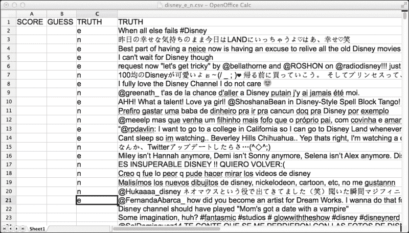
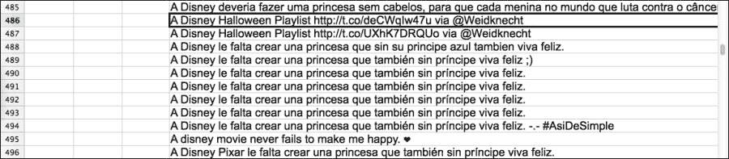

# 第一章：简单分类器

本章将涵盖以下内容：

+   反序列化和运行分类器

+   从分类器中获取置信度估计

+   从 Twitter API 获取数据

+   将分类器应用于 `.csv` 文件

+   分类器的评估 – 混淆矩阵

+   训练你自己的语言模型分类器

+   如何使用交叉验证进行训练和评估

+   查看错误类别 – 假阳性

+   理解精准度和召回率

+   如何序列化 LingPipe 对象 – 分类器示例

+   使用 Jaccard 距离消除近似重复项

+   如何分类情感 – 简单版

# 介绍

本章介绍了 LingPipe 工具包，并将其与同类工具进行比较，然后直接深入到文本分类器的内容。文本分类器将一个类别分配给文本，例如，它们可以确定一句话的语言，或者告诉我们一条推文的情感是积极、消极还是中立。本章讲解了如何使用、评估和创建基于语言模型的文本分类器。这些是 LingPipe API 中最简单的基于机器学习的分类器。它们之所以简单，是因为它们只处理字符——稍后，分类器将引入单词/标记等概念。然而，不要被迷惑，字符语言模型在语言识别方面是理想的，它们曾是世界上一些最早的商业情感系统的基础。

本章还涵盖了至关重要的评估基础设施——事实证明，我们所做的几乎所有事情在某种层次的解释中都可以看作是分类器。因此，不要忽视交叉验证、精准度/召回率定义和 F-measure 的强大作用。

最棒的部分是你将学习如何以编程方式访问 Twitter 数据，来训练和评估你自己的分类器。虽然有一部分内容涉及到从磁盘读取和写入 LingPipe 对象的机制，这部分有点枯燥，但除此之外，这一章还是很有趣的。本章的目标是让你快速上手，掌握机器学习技术在**自然语言处理**（**NLP**）领域的基本使用方法。

LingPipe 是一个面向 NLP 应用的 Java 工具包。本书将展示如何通过问题/解决方案的形式，使用 LingPipe 解决常见的 NLP 问题，使开发者能够快速部署解决方案来完成常见任务。

## LingPipe 及其安装

LingPipe 1.0 于 2003 年发布，作为一个双重许可的开源 NLP Java 库。在本书写作时，我们即将达到 Google Scholar 上 2000 次点击，且已有成千上万的商业安装，用户包括大学、政府机构以及财富 500 强公司。

当前的许可协议是 AGPL（[`www.gnu.org/licenses/agpl-3.0.html`](http://www.gnu.org/licenses/agpl-3.0.html)）或者我们的商业许可，后者提供更多传统的功能，如赔偿、代码不共享以及支持。

### 类似于 LingPipe 的项目

几乎所有的 NLP 项目都有糟糕的缩写，我们会公开自己的缩写。**LingPipe** 是 **语言处理管道**（linguistic pipeline）的缩写，这也是 Bob Carpenter 放置初始代码的 `cvs` 目录的名称。

LingPipe 在 NLP 领域有很多竞争者。以下是一些受欢迎的、专注于 Java 的竞争者：

+   **NLTK**：这是主流的 Python 库，用于 NLP 处理。

+   **OpenNLP**：这是一个 Apache 项目，由一群聪明的人构建。

+   **JavaNLP**：这是斯坦福 NLP 工具的重新品牌化，也由一群聪明的人构建。

+   **ClearTK**：这是科罗拉多大学博尔德分校的一个工具包，它封装了许多流行的机器学习框架。

+   **DkPro**：来自德国达姆施塔特工业大学的这个基于 UIMA 的项目以有用的方式封装了许多常见的组件。UIMA 是一个常见的 NLP 框架。

+   **GATE**：GATE 更像是一个框架，而不是竞争对手。实际上，LingPipe 的组件是它的标准分发包的一部分。它具有很好的图形化“连接组件”功能。

+   **基于学习的 Java**（**LBJ**）：LBJ 是一种基于 Java 的专用编程语言，面向机器学习和自然语言处理（NLP）。它是在伊利诺伊大学香槟分校的认知计算小组开发的。

+   **Mallet**：这个名字是 **机器学习语言工具包**（MAchine Learning for LanguagE Toolkit）的缩写。显然，如今生成合理的缩写非常困难。聪明的人也构建了这个工具。

这里有一些纯粹的机器学习框架，它们有更广泛的吸引力，但不一定是专门为 NLP 任务量身定制的：

+   **Vowpal Wabbit**：这个项目非常专注于围绕逻辑回归、潜在狄利克雷分配（Latent Dirichlet Allocation）等方面的可扩展性。聪明的人在推动这个项目。

+   **Factorie**：它来自马萨诸塞大学阿默斯特分校，是 Mallet 的一个替代方案。最初，它主要集中在图形模型上，但现在它也支持 NLP 任务。

+   **支持向量机**（**SVM**）：SVM light 和 `libsvm` 是非常流行的 SVM 实现。LingPipe 没有 SVM 实现，因为逻辑回归也可以实现这一功能。

### 那么，为什么要使用 LingPipe？

询问为什么选择 LingPipe 而不是上述提到的出色的免费竞争对手是非常合理的。原因有几个：

+   **文档**：LingPipe 的类级文档非常详尽。如果工作是基于学术研究的，相关研究会被引用。算法清晰列出，底层数学解释详细，说明精确。文档缺少的是一种“如何完成任务”的视角；不过，这本书会覆盖这一内容。

+   **面向企业/服务器优化**：LingPipe 从一开始就为服务器应用而设计，而不是为命令行使用（尽管我们将在本书中广泛使用命令行）。

+   **使用 Java 方言编写**：LingPipe 是一个本地的 Java API，设计遵循标准的 Java 类设计原则（Joshua Bloch 的《*Effective Java*》，由 Addison-Wesley 出版），例如在构造时进行一致性检查、不可变性、类型安全、向后兼容的可序列化性以及线程安全性。

+   **错误处理**：对于通过异常和可配置的消息流处理长时间运行的进程，LingPipe 给予了相当多的关注。

+   **支持**：LingPipe 有专职员工负责回答你的问题，并确保 LingPipe 执行其功能。罕见的 bug 通常在 24 小时内得到修复。他们对问题响应非常迅速，并且非常愿意帮助他人。

+   **咨询服务**：你可以聘请 LingPipe 的专家为你构建系统。通常，他们会作为副产品教授开发人员如何构建 NLP 系统。

+   **一致性**：LingPipe 的 API 由一个人，Bob Carpenter 设计，他非常注重一致性。虽然它并不完美，但你会发现它在设计上的规律性和眼光，这是学术界的工作中可能缺乏的。研究生来来去去，大学工具包中的贡献可能会有所不同。

+   **开源**：虽然有许多商业供应商，但他们的软件是一个黑盒子。LingPipe 的开源性质提供了透明性，并且让你确信代码按我们要求的方式运行。当文档无法解释时，能够访问源代码来更好地理解它是一个巨大的安慰。

### 下载书籍代码和数据

你需要从 [`alias-i.com/book.html`](http://alias-i.com/book.html) 下载本书的源代码，支持的模型和数据。使用以下命令解压和解压它：

```py
tar –xvzf lingpipeCookbook.tgz

```

### 小提示

**下载示例代码**

你可以从你的帐户在 [`www.packtpub.com`](http://www.packtpub.com) 下载你所购买的所有 Packt 书籍的示例代码文件。如果你在其他地方购买了本书，可以访问 [`www.packtpub.com/support`](http://www.packtpub.com/support) 并注册，直接将文件通过电子邮件发送给你。

或者，你的操作系统可能提供了其他方式来提取这个压缩包。所有示例假设你是在解压后的书籍目录中运行命令。

### 下载 LingPipe

下载 LingPipe 并不是绝对必要的，但你可能希望能够查看源代码，并拥有本地的 Javadoc 副本。

LingPipe 的下载和安装说明可以在 [`alias-i.com/lingpipe/web/install.html`](http://alias-i.com/lingpipe/web/install.html) 找到。

本章的示例使用了命令行调用，但假设读者具有足够的开发技能，将示例映射到自己偏好的 IDE/ant 或其他环境中。

# 反序列化并运行分类器

本食谱做了两件事：介绍了一个非常简单且有效的语言 ID 分类器，并演示了如何反序列化 LingPipe 类。如果你是从后面的章节来到这里，试图理解反序列化，我鼓励你还是运行这个示例程序。它只需要 5 分钟，或许你会学到一些有用的东西。

我们的语言 ID 分类器基于字符语言模型。每个语言模型会给出文本在该语言中生成的概率。最熟悉该文本的模型是最佳匹配的第一个。这个模型已经构建好了，但在本章稍后的部分，你将学习如何自己构建一个。

## 如何实现...

按照以下步骤反序列化并运行分类器：

1.  进入 `cookbook` 目录并运行适用于 OSX、Unix 和 Linux 的命令：

    ```py
    java -cp lingpipe-cookbook.1.0.jar:lib/lingpipe-4.1.0.jar com.lingpipe.cookbook.chapter1.RunClassifierFromDisk

    ```

    对于 Windows 调用（请引用类路径并使用 `;` 代替 `:`）：

    ```py
    java -cp "lingpipe-cookbook.1.0.jar;lib\lingpipe-4.1.0.jar" com.lingpipe.cookbook.chapter1.RunClassifierFromDisk

    ```

    本书中我们将使用 Unix 风格的命令行。

1.  程序报告加载的模型和默认模型，并提示输入一个待分类的句子：

    ```py
    Loading: models/3LangId.LMClassifier
    Type a string to be classified. Empty string to quit.
    The rain in Spain falls mainly on the plain.
    english
    Type a string to be classified. Empty string to quit.
    la lluvia en España cae principalmente en el llano.
    spanish
    Type a string to be classified. Empty string to quit.
    スペインの雨は主に平野に落ちる。
    japanese

    ```

1.  该分类器已在英语、西班牙语和日语上进行训练。我们已经输入了每种语言的一个示例——要获取一些日语内容，可以访问 [`ja.wikipedia.org/wiki/`](http://ja.wikipedia.org/wiki/)。这些是它所知道的唯一语言，但它会对任何文本进行猜测。所以，让我们试试一些阿拉伯语：

    ```py
    Type a string to be classified. Empty string to quit.
    المطر في اسبانيا يقع أساسا على سهل.
    japanese

    ```

1.  它认为这是日语，因为这种语言比英语或西班牙语有更多字符。这反过来导致该模型预计会有更多未知字符。所有的阿拉伯字符都是未知的。

1.  如果你在使用 Windows 终端，可能会遇到输入 UTF-8 字符的问题。

## 它是如何工作的...

JAR 包中的代码是 `cookbook/src/com/lingpipe/cookbook/chapter1/ RunClassifierFromDisk.java`。这里发生的事情是一个预构建的语言识别模型被反序列化并可用。该模型已在英语、日语和西班牙语上进行训练。训练数据来自每种语言的维基百科页面。你可以在 `data/3LangId.csv` 中看到这些数据。本示例的重点是向你展示如何反序列化分类器并运行它——训练部分内容请参见本章的*训练你自己的语言模型分类器*食谱。`RunClassifierFromDisk.java` 类的完整代码从包开始；接着导入 `RunClassifierFromDisk` 类的起始部分以及 `main()` 方法的起始部分：

```py
package com.lingpipe.cookbook.chapter1;
import java.io.File;
import java.io.IOException;

import com.aliasi.classify.BaseClassifier;
import com.aliasi.util.AbstractExternalizable;
import com.lingpipe.cookbook.Util;
public class RunClassifierFromDisk {
  public static void main(String[] args) throws
  IOException, ClassNotFoundException {
```

上述代码是非常标准的 Java 代码，我们将其展示而不做解释。接下来是大多数食谱中都有的一个功能，如果命令行中没有提供文件，它会为文件提供一个默认值。这样，如果你有自己的数据，可以使用自己的数据，否则它将从分发版中的文件运行。在这种情况下，如果命令行没有提供参数，则会提供一个默认的分类器：

```py
String classifierPath = args.length > 0 ? args[0] :  "models/3LangId.LMClassifier";
System.out.println("Loading: " + classifierPath);
```

接下来，我们将看到如何从磁盘反序列化一个分类器或其他 LingPipe 对象：

```py
File serializedClassifier = new File(classifierPath);
@SuppressWarnings("unchecked")
BaseClassifier<String> classifier
  = (BaseClassifier<String>)
  AbstractExternalizable.readObject(serializedClassifier);
```

前面的代码片段是第一个 LingPipe 特定的代码，其中分类器是使用静态的`AbstractExternalizable.readObject`方法构建的。

这个类在 LingPipe 中被广泛使用，用于执行类的编译，原因有两个。首先，它允许编译后的对象设置最终变量，这支持 LingPipe 对不可变对象的广泛使用。其次，它避免了暴露外部化和反序列化所需的 I/O 方法，最显著的是无参数构造函数。这个类被用作一个私有内部类的父类，后者执行实际的编译。这个私有内部类实现了所需的`no-arg`构造函数，并存储了`readResolve()`所需的对象。

### 注意

我们使用`Externalizable`而不是`Serializable`的原因是为了避免在更改任何方法签名或成员变量时破坏向后兼容性。`Externalizable`扩展了`Serializable`，并允许控制对象的读写方式。关于这一点的更多信息，请参阅 Josh Bloch 的书籍《*Effective Java, 第二版*》中关于序列化的精彩章节。

`BaseClassifier<E>`是基础的分类器接口，其中`E`是 LingPipe 中被分类的对象类型。查看 Javadoc 可以看到实现此接口的分类器范围——有 10 个。反序列化到`BaseClassifier<E>`隐藏了不少复杂性，我们将在本章的《*如何序列化 LingPipe 对象——分类器示例*》食谱中进一步探讨。

最后一行调用了一个实用方法，我们将在本书中频繁使用：

```py
Util.consoleInputBestCategory(classifier);
```

这个方法处理与命令行的交互。代码位于`src/com/lingpipe/cookbook/Util.java`：

```py
public static void consoleInputBestCategory(
BaseClassifier<CharSequence> classifier) throws IOException {
  BufferedReader reader = new BufferedReader(new InputStreamReader(System.in));
  while (true) {
    System.out.println("\nType a string to be classified. " + " Empty string to quit.");
    String data = reader.readLine();
    if (data.equals("")) {
      return;
    }
    Classification classification = classifier.classify(data);
    System.out.println("Best Category: " + classification.bestCategory());
  }
}
```

一旦从控制台读取字符串，就会调用`classifier.classify(input)`，该方法返回`Classification`。然后，它提供一个`String`标签并打印出来。就这样！你已经运行了一个分类器。

# 从分类器获取信心估算

如果分类器能够提供更多关于其分类信心的信息，通常会更有用——这通常是一个分数或概率。我们经常对分类器进行阈值设置，以帮助满足安装的性能要求。例如，如果分类器绝不能出错，那么我们可能要求分类结果必须非常有信心，才能做出最终决定。

LingPipe 分类器存在于一个基于它们提供的估算类型的层级结构中。核心是一个接口系列——别慌，它其实非常简单。你现在不需要理解它，但我们确实需要在某个地方写下来，以备将来参考：

+   `BaseClassifier<E>`：这只是一个基本的对象分类器，类型为`E`。它有一个`classify()`方法，该方法返回一个分类结果，而分类结果又有一个`bestCategory()`方法和一个具有一定信息用途的`toString()`方法。

+   `RankedClassifier<E> extends BaseClassifier<E>`：`classify()`方法返回`RankedClassification`，它扩展了`Classification`并添加了`category(int rank)`方法，说明第 1 至*n*个分类是什么。还有一个`size()`方法，表示分类的数量。

+   `ScoredClassifier<E> extends RankedClassifier<E>`：返回的`ScoredClassification`添加了一个`score(int rank)`方法。

+   `ConditionalClassifier<E> extends RankedClassifier<E>`：由此生成的`ConditionalClassification`具有一个特性，即所有类别的分数之和必须为 1，这可以通过`conditionalProbability(int rank)`方法和`conditionalProbability(String category)`方法访问。还有更多内容；你可以阅读 Javadoc 了解详细信息。当事情变得复杂时，这种分类方法将成为本书的核心工具，我们希望知道推文是英语、日语还是西班牙语的信心值。这些估算值必须加起来为 1。

+   `JointClassifier<E> extends ConditionalClassifier<E>`：这提供了输入和类别在所有可能输入空间中的`JointClassification`，所有这些估算值之和为 1。由于这是一个稀疏空间，因此值是基于对数的，以避免下溢错误。我们在生产中很少直接使用这种估算值。

显然，分类栈的设计考虑了很多因素。这是因为大量的工业 NLP 问题最终都由分类系统处理。

结果证明，我们最简单的分类器——在某种任意的意义上简单——产生了最丰富的估算值，这些估算值是联合分类。让我们深入了解一下。

## 准备工作

在前面的示例中，我们轻松地反序列化为`BaseClassifier<String>`，这隐藏了所有正在发生的细节。事实上，实际情况比模糊的抽象类所暗示的要复杂一些。请注意，加载的磁盘文件名为`3LangId.LMClassifier`。根据约定，我们将序列化的模型命名为它将反序列化为的对象类型，在这种情况下是`LMClassifier`，它扩展了`BaseClassifier`。分类器的最具体类型是：

```py
LMClassifier<CompiledNGramBoundaryLM, MultivariateDistribution> classifier = (LMClassifier <CompiledNGramBoundaryLM, MultivariateDistribution>) AbstractExternalizable.readObject(new File(args[0]));
```

对`LMClassifier<CompiledNGramBoundaryLM, MultivariateDistribution>`的强制转换指定了分布类型为`MultivariateDistribution`。`com.aliasi.stats.MultivariateDistribution`的 Javadoc 非常明确并且有帮助，详细描述了它是什么。

### 注意

`MultivariateDistribution` 实现了一个离散分布，覆盖从零开始连续编号的有限结果集。

Javadoc 详细介绍了`MultivariateDistribution`，但基本上意味着我们可以进行 n 维的概率分配，这些概率之和为 1。

接下来要介绍的类是`CompiledNGramBoundaryLM`，它是`LMClassifier`的“记忆”。实际上，每种语言都有自己的记忆模型。这意味着，英语将有一个与西班牙语不同的语言模型，依此类推。分类器的这一部分可以使用八种不同类型的语言模型——请参阅`LanguageModel`接口的 Javadoc。每个**语言模型**（**LM**）具有以下属性：

+   LM 会提供一个概率，表示它生成了给定的文本。它对之前未见过的数据具有鲁棒性，意味着它不会崩溃或给出零概率。对于我们的例子，阿拉伯语仅仅表现为一串未知字符。

+   对于边界语言模型（LM），任何长度的所有可能字符序列概率的总和为 1。过程型 LM 则将相同长度所有序列的概率总和为 1。查看 Javadoc 以了解这部分数学如何进行。

+   每个语言模型对于其类别外的数据没有任何了解。

+   分类器会跟踪类别的边际概率，并将其纳入该类别的结果中。边际概率意味着我们通常会看到三分之二是英语，一六分之一是西班牙语，一六分之一是日语的迪士尼推文。这些信息与 LM 的估计结果结合在一起。

+   LM 是`LanguageModel.Dynamic`的编译版本，我们将在后续的配方中讨论训练时如何使用。

构造的`LMClassifier`将这些组件封装成一个分类器。

幸运的是，接口通过更具美学感的反序列化解决了这个问题：

```py
JointClassifier<String> classifier = (JointClassifier<String>) AbstractExternalizable.readObject(new File(classifierPath));
```

该接口巧妙地隐藏了实现的内部细节，这是我们在示例程序中所采用的方式。

## 如何做…

这个步骤是我们第一次开始从分类器的功能中剥离出来，但首先，让我们玩一玩：

1.  让你的魔法 shell 精灵召唤一个命令提示符，并输入：

    ```py
    java -cp lingpipe-cookbook.1.0.jar:lib/lingpipe-4.1.0.jar: com.lingpipe.cookbook.chapter1.RunClassifierJoint 

    ```

1.  我们将输入与之前相同的数据：

    ```py
    Type a string to be classified. Empty string to quit.
    The rain in Spain falls mainly on the plain.
    Rank Categ Score   P(Category|Input) log2 P(Category,Input)
    0=english -3.60092 0.9999999999         -165.64233893156052
    1=spanish -4.50479 3.04549412621E-13    -207.2207276413206
    2=japanese -14.369 7.6855682344E-150    -660.989401136873

    ```

如前所述，`JointClassification`会将所有分类指标从根分类`Classification`传递下去。如下所示的每一层分类都会增加前面分类器的内容：

+   `Classification`提供了第一个最佳类别，作为排名 0 的类别。

+   `RankedClassification`按所有可能类别的顺序添加，其中较低的排名对应更高的类别可能性。`rank`列反映了这种排序。

+   `ScoredClassification`为排名输出添加了一个数字分数。请注意，根据分类器的类型，分数可能与其他正在分类的字符串进行比较时表现不佳。该列为`Score`。要理解该分数的依据，请参阅相关的 Javadoc。

+   `ConditionalClassification`通过将其设为基于输入的类别概率来进一步细化分数。所有类别的概率将加起来为 1。这个列被标记为`P(Category|Input)`，这是传统的写法，表示*给定输入的类别概率*。

+   `JointClassification`增加了输入和类别的 log2（以 2 为底的对数）概率——这是联合概率。所有类别和输入的概率将加起来为 1，这实际上是一个非常大的空间，任何类别和字符串对的概率都非常低。这就是为什么使用 log2 值来防止数值下溢的原因。这一列被标记为`log 2 P(Category, Input)`，它被翻译为*类别和输入的 log**2* *概率*。

查看`com.aliasi.classify`包的 Javadoc，了解实现这些度量和分类器的更多信息。

## 它是如何工作的…

代码位于`src/com/lingpipe/cookbook/chapter1/RunClassifierJoint.java`，它反序列化为`JointClassifier<CharSequence>`：

```py
public static void main(String[] args) throws IOException, ClassNotFoundException {
  String classifierPath  = args.length > 0 ? args[0] : "models/3LangId.LMClassifier";
  @SuppressWarnings("unchecked")
    JointClassifier<CharSequence> classifier = (JointClassifier<CharSequence>) AbstractExternalizable.readObject(new File(classifierPath));
  Util.consoleInputPrintClassification(classifier);
}
```

它调用`Util.consoleInputPrintClassification(classifier)`，这个方法与`Util.consoleInputBestCategory(classifier)`只有最小的区别，区别在于它使用分类的`toString()`方法来打印。代码如下：

```py
public static void consoleInputPrintClassification(BaseClassifier<CharSequence> classifier) throws IOException {
  BufferedReader reader = new BufferedReader(new InputStreamReader(System.in));
  while (true) {
    System.out.println("\nType a string to be classified." + Empty string to quit.");
    String data = reader.readLine();
    if (data.equals("")) {
      return;
    }
    Classification classification = classifier.classify(data);
    System.out.println(classification);
  }
}
```

我们得到了比预期更丰富的输出，因为类型是`Classification`，但`toString()`方法将应用于运行时类型`JointClassification`。

## 另见

+   在第六章中，有详细信息，*《使用 LingPipe 4 进行文本分析》*中，*Bob Carpenter*和*Breck Baldwin*编写的*字符语言模型*部分，*LingPipe 出版*（[`alias-i.com/lingpipe-book/lingpipe-book-0.5.pdf`](http://alias-i.com/lingpipe-book/lingpipe-book-0.5.pdf)）介绍了语言模型。

# 从 Twitter API 获取数据

我们使用流行的`twitter4j`包来调用 Twitter 搜索 API，搜索推文并将其保存到磁盘。Twitter API 从版本 1.1 开始要求身份验证，我们需要获取认证令牌并将其保存在`twitter4j.properties`文件中，然后才能开始。

## 准备工作

如果你没有 Twitter 账号，去[twitter.com/signup](http://twitter.com/signup)创建一个账号。你还需要访问[dev.twitter.com](http://dev.twitter.com)并登录，以启用你的开发者账号。一旦你有了 Twitter 登录，我们就可以开始创建 Twitter OAuth 凭证。请准备好这个过程可能与你所看到的不同。无论如何，我们会在`data`目录提供示例结果。现在让我们来创建 Twitter OAuth 凭证：

1.  登录到[dev.twitter.com](http://dev.twitter.com)。

1.  找到顶部栏上你图标旁边的小下拉菜单。

1.  选择**我的应用**。

1.  点击**创建一个新应用**。

1.  填写表单并点击**创建 Twitter 应用**。

1.  下一页包含 OAuth 设置。

1.  点击**创建我的访问令牌**链接。

1.  您需要复制**消费者密钥**和**消费者密钥密钥**。

1.  您还需要复制**访问令牌**和**访问令牌密钥**。

1.  这些值应放入`twitter4j.properties`文件中的适当位置。属性如下：

    ```py
    debug=false
    oauth.consumerKey=ehUOExampleEwQLQpPQ
    oauth.consumerSecret=aTHUGTBgExampleaW3yLvwdJYlhWY74
    oauth.accessToken=1934528880-fiMQBJCBExamplegK6otBG3XXazLv
    oauth.accessTokenSecret=y0XExampleGEHdhCQGcn46F8Vx2E
    ```

## 如何进行操作...

现在，我们已准备好通过以下步骤访问 Twitter 并获取一些搜索数据：

1.  进入本章节的目录并运行以下命令：

    ```py
    java -cp lingpipe-cookbook.1.0.jar:lib/twitter4j-core-4.0.1.jar:lib/opencsv-2.4.jar:lib/lingpipe-4.1.0.jar com.lingpipe.cookbook.chapter1.TwitterSearch

    ```

1.  代码显示输出文件（在本例中为默认值）。提供路径作为参数将写入此文件。然后，在提示符下键入您的查询：

    ```py
    Writing output to data/twitterSearch.csv
    Enter Twitter Query:disney

    ```

1.  然后，代码查询 Twitter，并报告每找到 100 条推文的结果（输出被截断）：

    ```py
    Tweets Accumulated: 100
    Tweets Accumulated: 200
    …
    Tweets Accumulated: 1500
    writing to disk 1500 tweets at data/twitterSearch.csv 

    ```

该程序使用搜索查询，搜索 Twitter 中的相关术语，并将输出（限制为 1500 条推文）写入您在命令行中指定的`.csv`文件名，或者使用默认值。

## 它是如何工作的...

代码使用`twitter4j`库实例化`TwitterFactory`并使用用户输入的查询搜索 Twitter。`main()`方法的开始部分位于`src/com/lingpipe/cookbook/chapter1/TwitterSearch.java`中：

```py
String outFilePath = args.length > 0 ? args[0] : "data/twitterSearch.csv";
File outFile = new File(outFilePath);
System.out.println("Writing output to " + outFile);
BufferedReader reader = new BufferedReader(new InputStreamReader(System.in));
System.out.print("Enter Twitter Query:");
String queryString = reader.readLine();
```

上面的代码获取输出文件，如果没有提供，则使用默认值，并从命令行获取查询。

以下代码根据 twitter4j 开发者的设计设置查询。有关此过程的更多信息，请阅读他们的 Javadoc。然而，这应该是相当直接的。为了使我们的结果集更加唯一，您会注意到在创建查询字符串时，我们会使用`-filter:retweets`选项来过滤掉转发。这只是一种部分有效的方法；有关更完整的解决方案，请参阅本章后面的*通过 Jaccard 距离消除近重复项*一节：

```py
Twitter twitter = new TwitterFactory().getInstance();
Query query = new Query(queryString + " -filter:retweets"); query.setLang("en");//English
query.setCount(TWEETS_PER_PAGE);
query.setResultType(Query.RECENT);
```

我们将得到以下结果：

```py
List<String[]> csvRows = new ArrayList<String[]>();
while(csvRows.size() < MAX_TWEETS) {
  QueryResult result = twitter.search(query);
  List<Status> resultTweets = result.getTweets();
  for (Status tweetStatus : resultTweets) {
    String row[] = new String[Util.ROW_LENGTH];
    row[Util.TEXT_OFFSET] = tweetStatus.getText();
    csvRows.add(row);
  }
  System.out.println("Tweets Accumulated: " + csvRows.size());
  if ((query = result.nextQuery()) == null) {
    break;
  }
}
```

上面的代码片段是相当标准的代码实现，尽管没有通常的面向外部代码的加固——try/catch、超时和重试。一个可能让人困惑的地方是使用`query`来处理搜索结果的分页——当没有更多页面时，它会返回`null`。当前的 Twitter API 每页最多返回 100 个结果，因此为了获得 1500 个结果，我们需要重新运行搜索，直到没有更多结果，或者直到我们获得 1500 条推文。下一步涉及一些报告和写入：

```py
System.out.println("writing to disk " + csvRows.size() + " tweets at " + outFilePath);
Util.writeCsvAddHeader(csvRows, outFile);
```

然后，使用`Util.writeCsvAddHeader`方法将推文列表写入`.csv`文件：

```py
public static void writeCsvAddHeader(List<String[]> data, File file) throws IOException {
  CSVWriter csvWriter = new CSVWriter(new OutputStreamWriter(new FileOutputStream(file),Strings.UTF8));
  csvWriter.writeNext(ANNOTATION_HEADER_ROW);
  csvWriter.writeAll(data);
  csvWriter.close();
}
```

我们将在下一节使用这个`.csv`文件进行语言识别测试。

## 另见

欲了解有关使用 Twitter API 和 twitter4j 的更多详细信息，请访问他们的文档页面：

+   [`twitter4j.org/javadoc/`](http://twitter4j.org/javadoc/)

+   [`dev.twitter.com/docs`](https://dev.twitter.com/docs)

# 对`.csv`文件应用分类器

现在，我们可以在从 Twitter 下载的数据上测试我们的语言 ID 分类器。本方案将向你展示如何在`.csv`文件上运行分类器，并为下一个方案中的评估步骤打下基础。

## 如何做到这一点...

将分类器应用于`.csv`文件是非常简单的！只需执行以下步骤：

1.  获取命令提示符并运行：

    ```py
    java -cp lingpipe-cookbook.1.0.jar:lib/lingpipe-4.1.0.jar:lib/twitter4j-core-4.0.1.jar:lib/opencsv-2.4.jar com.lingpipe.cookbook.chapter1.ReadClassifierRunOnCsv

    ```

1.  这将使用`data/disney.csv`分发中的默认 CSV 文件，逐行处理 CSV 文件，并应用来自`models/ 3LangId.LMClassifier`的语言 ID 分类器：

    ```py
    InputText: When all else fails #Disney
    Best Classified Language: english
    InputText: ES INSUPERABLE DISNEY !! QUIERO VOLVER:(
    Best Classified Language: Spanish

    ```

1.  你还可以将输入指定为第一个参数，将分类器指定为第二个参数。

## 它是如何工作的…

我们将从之前的方案中描述的外部模型反序列化一个分类器。然后，我们将遍历每一行`.csv`文件，并调用分类器的分类方法。`main()`中的代码是：

```py
String inputPath = args.length > 0 ? args[0] : "data/disney.csv";
String classifierPath = args.length > 1 ? args[1] : "models/3LangId.LMClassifier";
@SuppressWarnings("unchecked") BaseClassifier<CharSequence> classifier = (BaseClassifier<CharSequence>) AbstractExternalizable.readObject(new File(classifierPath));
List<String[]> lines = Util.readCsvRemoveHeader(new File(inputPath));
for(String [] line: lines) {
  String text = line[Util.TEXT_OFFSET];
  Classification classified = classifier.classify(text);
  System.out.println("InputText: " + text);
  System.out.println("Best Classified Language: " + classified.bestCategory());
}
```

前面的代码基于之前的方案，没有特别新的内容。`Util.readCsvRemoveHeader`，如下所示，它在从磁盘读取并返回具有非空值和非空字符串的行之前，会跳过`.csv`文件的第一行，并将`TEXT_OFFSET`位置的数据返回：

```py
public static List<String[]> readCsvRemoveHeader(File file) throws IOException {
  FileInputStream fileIn = new FileInputStream(file);
  InputStreamReader inputStreamReader = new InputStreamReader(fileIn,Strings.UTF8);
  CSVReader csvReader = new CSVReader(inputStreamReader);
  csvReader.readNext();  //skip headers
  List<String[]> rows = new ArrayList<String[]>();
  String[] row;
  while ((row = csvReader.readNext()) != null) {
    if (row[TEXT_OFFSET] == null || row[TEXT_OFFSET].equals("")) {
      continue;
    }
    rows.add(row);
  }
  csvReader.close();
  return rows;
}
```

# 分类器的评估 —— 混淆矩阵

评估在构建稳固的自然语言处理系统中至关重要。它使开发人员和管理层能够将业务需求与系统性能进行映射，从而帮助向利益相关方传达系统改进的情况。“嗯，系统似乎做得更好”并不如“召回率提高了 20％，特异性在增加 50％的训练数据下仍然保持良好”那样有分量。

本方案提供了创建真值或*黄金标准*数据的步骤，并告诉我们如何使用这些数据来评估我们预编译分类器的性能。它既简单又强大。

## 准备工作

你可能已经注意到 CSV 写入器输出中的表头和那个标记为`TRUTH`的列。现在，我们可以开始使用它了。加载我们之前提供的推文，或者将你的数据转换为我们`.csv`格式使用的格式。获取新数据的简单方法是通过 Twitter 运行一个多语言友好的查询，例如`Disney`，这是我们默认提供的数据。

打开 CSV 文件，并为至少 10 个示例标注你认为推文所用的语言，*e*代表英语，*n*代表非英语。如果你不想手动标注数据，分发包中有一个`data/disney_e_n.csv`文件，你可以使用这个文件。如果你对某条推文不确定，可以忽略它。未标注的数据会被忽略。请看下面的截图：



下面是包含英文'e'和非英文'n'的人类标注的电子表格截图。它被称为真值数据或黄金标准数据，因为它正确地表示了该现象。

通常，这些数据被称为**黄金标准数据**，因为它代表了真相。"黄金标准"中的"黄金"是字面意思。备份并长期存储这些数据——它很可能是你硬盘上最宝贵的一组字节，因为它的生产成本很高，而且最清晰地表达了所做的工作。实现方式会不断变化；而评估数据则永远存在。来自*The John Smith problem*案例的约翰·史密斯语料库，在第七章，*查找概念/人物之间的共指关系*，是该特定问题的权威评估语料库，并成为 1997 年开始的研究线的比较标准。最初的实现早已被遗忘。

## 如何操作……

执行以下步骤来评估分类器：

1.  在命令提示符中输入以下内容；这将运行默认分类器，对默认黄金标准数据中的文本进行分类。然后，它将比较分类器的最佳类别与在`TRUTH`列中标注的内容。

    ```py
    java -cp lingpipe-cookbook.1.0.jar:lib/opencsv-2.4.jar:lib/lingpipe-4.1.0.jar com.lingpipe.cookbook.chapter1.RunConfusionMatrix

    ```

1.  该类将生成混淆矩阵：

    ```py
    reference\response
     \e,n,
     e 11,0,
     n 1,9,

    ```

混淆矩阵恰如其名，因为它最初几乎让每个人都感到困惑，但毫无疑问，它是分类器输出的最佳表示方式，因为它很难掩盖分类器的差劲表现。换句话说，它是一个优秀的虚假检测器。它清晰地展示了分类器做对了什么，做错了什么，以及它认为正确的答案是什么。

每一行的总和表示由真相/参考/黄金标准所知的属于该类别的项目。对于英语（e），共有 11 条推文。每一列表示系统认为属于相同标签类别的内容。对于英语（e），系统认为这 11 条推文都是英语，且没有非英语（n）。对于非英语类别（n），在真相中有 10 个案例，其中分类器错误地认为 1 个是英语（错误），并正确地认为 9 个是非英语（正确）。完美的系统表现会使所有非对角线位置的单元格值为零，从左上角到右下角。

它之所以被称为混淆矩阵的真正原因是，因为它很容易看出分类器混淆的类别。例如，英式英语和美式英语可能会高度混淆。此外，混淆矩阵能够很好地扩展到多个类别，稍后会看到。访问 Javadoc 以获取更详细的混淆矩阵说明——它值得深入掌握。

## 它是如何工作的……

基于本章前面配方中的代码，我们将重点介绍评估设置中的新颖之处。完整的代码位于`src/com/lingpipe/cookbook/chapter1/RunConfusionMatrix.java`。`main()`方法的开头显示在下面的代码片段中。代码首先从命令行参数中读取，寻找非默认的 CSV 数据和序列化分类器。此配方使用的默认值如下所示：

```py
String inputPath = args.length > 0 ? args[0] : "data/disney_e_n.csv";
String classifierPath = args.length > 1 ? args[1] : "models/1LangId.LMClassifier";
```

接下来，将加载语言模型和`.csv`数据。该方法与`Util.CsvRemoveHeader`的解释略有不同，它仅接受在`TRUTH`列中有值的行—如果不清楚，请参阅`src/com/lingpipe/cookbook/Util.java`：

```py
@SuppressWarnings("unchecked")
BaseClassifier<CharSequence> classifier = (BaseClassifier<CharSequence>) AbstractExternalizable.readObject(new File(classifierPath));

List<String[]> rows = Util.readAnnotatedCsvRemoveHeader(new File(inputPath));
```

接下来，将找到类别：

```py
String[] categories = Util.getCategories(rows);
```

该方法将累积`TRUTH`列中的所有类别标签。代码很简单，下面显示了代码：

```py
public static String[] getCategories(List<String[]> data) {
  Set<String> categories = new HashSet<String>();
  for (String[] csvData : data) {
    if (!csvData[ANNOTATION_OFFSET].equals("")) {
      categories.add(csvData[ANNOTATION_OFFSET]);
    }
  }
  return categories.toArray(new String[0]);
}
```

当我们运行任意数据且标签在编译时未知时，这段代码将非常有用。

然后，我们将设置`BaseClassfierEvaluator`。这需要评估的分类器。类别和控制分类器是否为构造存储输入的`boolean`值也将进行设置：

```py
boolean storeInputs = false;
BaseClassifierEvaluator<CharSequence> evaluator = new BaseClassifierEvaluator<CharSequence>(classifier, categories, storeInputs);
```

请注意，分类器可以为 null，并且可以在稍后的时间指定；类别必须与注释和分类器产生的类别完全匹配。我们不会配置评估器来存储输入，因为在此配方中我们不打算使用此功能。请参阅*查看错误类别 – 假阳性*配方，其中存储并访问了输入。

接下来，我们将进行实际评估。循环将遍历`.csv`文件中的每一行信息，构建一个`Classified<CharSequence>`对象，并将其传递给评估器的`handle()`方法：

```py
for (String[] row : rows) {
  String truth = row[Util.ANNOTATION_OFFSET];
  String text = row[Util.TEXT_OFFSET];
  Classification classification = new Classification(truth);
  Classified<CharSequence> classified = new Classified<CharSequence>(text,classification);
  evaluator.handle(classified);
}
```

第四行将使用真值注释中的值创建一个分类对象—在这种情况下是*e*或*n*。这与`BaseClassifier<E>`为`bestCategory()`方法返回的类型相同。真值注释没有特殊类型。下一行添加了分类所应用的文本，我们得到了一个`Classified<CharSequence>`对象。

循环的最后一行将对创建的分类对象应用`handle`方法。评估器假设其`handle`方法所提供的数据是一个真值注释，该数据通过提取待分类数据、应用分类器进行分类、获得结果中的`firstBest()`分类，然后标记分类是否与刚刚构造的真值匹配。对于`.csv`文件中的每一行都会发生这种情况。

在循环外，我们将使用`Util.createConfusionMatrix()`打印出混淆矩阵：

```py
System.out.println(Util.confusionMatrixToString(evaluator.confusionMatrix()));
```

本段代码的详细分析留给读者自行阅读。就是这样；我们已经评估了分类器并打印出了混淆矩阵。

## 还有更多内容...

评估器有一个完整的`toString()`方法，可以提供大量的信息，说明你的分类器表现如何。输出中的这些方面将在后续配方中讲解。Javadoc 非常详尽，值得一读。

# 训练你自己的语言模型分类器

当分类器被定制时，自然语言处理的世界真正开始展开。本配方提供了如何通过收集分类器学习的示例来定制分类器的详细信息——这叫做训练数据。它也叫做黄金标准数据、真实值或地面真相。我们有一些来自前面配方的数据，将用它们。

## 准备工作

我们将为英语和其他语言创建一个定制的语言识别分类器。训练数据的创建涉及获取文本数据，并为分类器的类别进行标注——在这个例子中，标注的就是语言。训练数据可以来自多种来源。以下是一些可能性：

+   诸如在前面评估配方中创建的黄金标准数据。

+   已经以某种方式注释过的数据，针对你关心的类别。例如，维基百科有语言特定版本，方便用来训练语言识别分类器。这就是我们如何创建`3LangId.LMClassifier`模型的方式。

+   要有创意——数据在哪里能帮助引导分类器朝正确方向发展？

语言识别不需要太多数据就能很好地工作，因此每种语言 20 条推文就能开始可靠地区分出不同的语言。训练数据的数量将由评估结果驱动——一般来说，更多的数据能提高性能。

该示例假设大约 10 条英文推文和 10 条非英文推文已由人工注释并存放在`data/disney_e_n.csv`中。

## 如何实现...

为了训练你自己的语言模型分类器，请执行以下步骤：

1.  启动一个终端并输入以下内容：

    ```py
    java -cp lingpipe-cookbook.1.0.jar:lib/opencsv-2.4.jar:lib/lingpipe-4.1.0.jar com.lingpipe.cookbook.chapter1.TrainAndRunLMClassifier

    ```

1.  然后，在命令提示符中输入一些英文文本，或许是库尔特·冯内古特的名言，来查看生成的`JointClassification`。有关以下输出的解释，请参见*从分类器获取置信度估计*的配方：

    ```py
    Type a string to be classified. Empty string to quit.
    So it goes.
    Rank Categ Score  P(Category|Input)  log2 P(Category,Input)
    0=e -4.24592987919 0.9999933712053  -55.19708842949149
    1=n -5.56922173547 6.62884502334E-6 -72.39988256112824

    ```

1.  输入一些非英语文本，例如博尔赫斯的《*分岔小径*》的西班牙语标题：

    ```py
    Type a string to be classified. Empty string to quit.
    El Jardín de senderos que se bifurcan 
    Rank Categ Score  P(Category|Input)  log2 P(Category,Input)
    0=n -5.6612148689 0.999989087229795 -226.44859475801326
    1=e -6.0733050528 1.091277041753E-5 -242.93220211249715

    ```

## 它是如何工作的...

程序位于`src/com/lingpipe/cookbook/chapter1/TrainAndRunLMClassifier.java`；`main()`方法的内容如下：

```py
String dataPath = args.length > 0 ? args[0] : "data/disney_e_n.csv";
List<String[]> annotatedData = Util.readAnnotatedCsvRemoveHeader(new File(dataPath));
String[] categories = Util.getCategories(annotatedData);
```

前面的代码获取`.csv`文件的内容，然后提取已注释的类别列表；这些类别将是注释列中所有非空的字符串。

以下`DynamicLMClassifier`是通过一个静态方法创建的，该方法需要一个类别数组和`int`类型的语言模型顺序。顺序为 3 时，语言模型将在文本训练数据的所有 1 至 3 字符序列上进行训练。因此，“I luv Disney”将生成如“I”，“I ”，“I l”，“ l”，“ lu”，“u”，“uv”，“luv”等训练实例。`createNGramBoundary`方法会在每个文本序列的开始和结束处附加一个特殊符号；这个符号如果开头或结尾对于分类有帮助的话，会很有用。大多数文本数据对开头/结尾是敏感的，所以我们会选择这个模型：

```py
int maxCharNGram = 3;
DynamicLMClassifier<NGramBoundaryLM> classifier = DynamicLMClassifier.createNGramBoundary(categories,maxCharNGram);
```

以下代码遍历训练数据的行，并以与*分类器评估 – 混淆矩阵*食谱中相同的方式创建`Classified<CharSequence>`。然而，它不是将`Classified`对象传递给评估处理器，而是用来训练分类器。

```py
for (String[] row: annotatedData) {
  String truth = row[Util.ANNOTATION_OFFSET];
  String text = row[Util.TEXT_OFFSET];
  Classification classification 
    = new Classification(truth);
  Classified<CharSequence> classified = new Classified<CharSequence>(text,classification);
  classifier.handle(classified);
}
```

不需要进一步的步骤，分类器已经准备好可以通过控制台使用：

```py
Util.consoleInputPrintClassification(classifier);
```

## 还有更多内容...

对于基于`DynamicLM`的分类器，训练和使用可以交替进行。这通常不是其他分类器（如`LogisticRegression`）的情况，因为后者使用所有数据来编译一个模型，进行分类。

还有另一种训练分类器的方法，可以让你更好地控制训练过程。以下是这种方法的代码片段：

```py
Classification classification = new Classification(truth);
Classified<CharSequence> classified = new Classified<CharSequence>(text,classification);
classifier.handle(classified);
```

或者，我们可以通过以下方式实现相同的效果：

```py
int count = 1;
classifier.train(truth,text,count);
```

`train()`方法提供了更多的训练控制，因为它允许显式设置计数。在我们探讨 LingPipe 分类器时，我们通常会看到一种替代的训练方法，提供了一些额外的控制，超出了`handle()`方法所提供的控制。

基于字符语言模型的分类器在字符序列具有独特性的任务中表现非常好。语言识别是一个理想的候选任务，但它也可以用于情感分析、主题分配和问答等任务。

## 另见

LingPipe 分类器的 Javadoc 在其底层数学方面非常详细，解释了技术背后的原理。

# 如何使用交叉验证进行训练和评估

之前的食谱展示了如何使用真实数据评估分类器，以及如何使用真实数据训练分类器，但如果要同时进行这两者呢？这个好主意叫做交叉验证，其工作原理如下：

1.  将数据分为*n*个不同的集合或折叠——标准的*n*是 10。

1.  对于*i*从 1 到*n*：

    +   在通过排除第*i*折叠定义的*n - 1*折叠上进行训练

    +   在第*i*折上进行评估

1.  报告所有折叠*i*的评估结果。

这就是大多数机器学习系统调优性能的方式。工作流程如下：

1.  查看交叉验证的性能。

1.  查看通过评估指标确定的错误。

1.  查看实际错误——是的，就是数据——以洞察系统如何改进。

1.  做一些修改

1.  再次评估它。

交叉验证是比较不同问题解决方法、尝试不同分类器、激励归一化方法、探索特征增强等的优秀方式。通常，显示出在交叉验证上提高性能的系统配置，也会在新数据上表现出更好的性能。但交叉验证做不到的是，特别是在后面讨论的主动学习策略中，它无法可靠地预测新数据上的性能。在发布生产系统之前，始终将分类器应用于新数据，以作为最终的理智检查。你已经被警告了。

相较于使用所有可能的训练数据训练的分类器，交叉验证也会带来一定的负偏差，因为每个折叠都是一个略微较弱的分类器，因为它仅使用了 10 折数据中的 90%。

*冲洗、涂抹并重复*是构建最先进 NLP 系统的座右铭。

## 准备好

注意，这种方法与其他经典的计算机工程方法有何不同，后者侧重于根据单元测试驱动的功能规范进行开发。这个过程更多的是关于通过评估指标来完善和调整代码，使其表现更好。

## 如何做...

要运行代码，请执行以下步骤：

1.  打开命令提示符，输入：

    ```py
    java -cp lingpipe-cookbook.1.0.jar:lib/opencsv-2.4.jar:lib/lingpipe-4.1.0.jar com.lingpipe.cookbook.chapter1.RunXValidate

    ```

1.  结果将是：

    ```py
    Training data is: data/disney_e_n.csv
    Training on fold 0
    Testing on fold 0
    Training on fold 1
    Testing on fold 1
    Training on fold 2
    Testing on fold 2
    Training on fold 3
    Testing on fold 3
    reference\response
        \e,n,
        e 10,1,
        n 6,4,
    ```

    前面的输出将在以下部分更具意义。

## 它是如何工作的…

这个食谱介绍了一个`XValidatingObjectCorpus`对象，用于管理交叉验证。在训练分类器时，这个对象被广泛使用。其他部分的内容应该和前面的食谱类似。`main()`方法从以下内容开始：

```py
String inputPath = args.length > 0 ? args[0] : "data/disney_e_n.csv";
System.out.println("Training data is: " + inputPath);
List<String[]> truthData = Util.readAnnotatedCsvRemoveHeader(new File(inputPath));
```

前面的代码将从默认文件或用户输入的文件中获取数据。接下来的两行引入了`XValidatingObjectCorpus`——这个食谱的主角：

```py
int numFolds = 4;
XValidatingObjectCorpus<Classified<CharSequence>> corpus = Util.loadXValCorpus(truthData, numFolds);
```

`numFolds`变量控制刚加载的数据如何被划分——在这种情况下，它将被划分为四个部分。现在，我们来看一下`Util.loadXValCorpus(truthData, numfolds)`子例程：

```py
public static XValidatingObjectCorpus<Classified<CharSequence>> loadXValCorpus(List<String[]> rows, int numFolds) throws IOException {
  XValidatingObjectCorpus<Classified<CharSequence>> corpus = new XValidatingObjectCorpus<Classified<CharSequence>>(numFolds);
  for (String[] row : rows) {
    Classification classification = new Classification(row[ANNOTATION_OFFSET]);
    Classified<CharSequence> classified = new Classified<CharSequence>(row[TEXT_OFFSET],classification);
    corpus.handle(classified);
  }
  return corpus;
}
```

构建的`XValidatingObjectCorpus<E>`将包含所有真实数据，以`Objects E`的形式。在本例中，我们将使用前面食谱中训练和评估的相同对象——`Classified<CharSequence>`来填充语料库。这将非常方便，因为我们将同时使用这些对象来训练和测试分类器。`numFolds`参数指定了数据的划分数量，可以稍后进行更改。

以下`for`循环应该是熟悉的，它应该遍历所有标注数据，并在应用`corpus.handle()`方法之前创建`Classified<CharSequence>`对象，该方法将它添加到语料库中。最后，我们将返回语料库。如果你有任何问题，查看`XValidatingObjectCorpus<E>`的 Javadoc 值得一看。

返回`main()`方法体时，我们将打乱语料库以混合数据，获取类别，并使用空值初始化`BaseClassifierEvaluator<CharSequence>`，替代之前食谱中的分类器：

```py
corpus.permuteCorpus(new Random(123413));
String[] categories = Util.getCategories(truthData);
boolean storeInputs = false;
BaseClassifierEvaluator<CharSequence> evaluator = new BaseClassifierEvaluator<CharSequence>(null, categories, storeInputs);
```

现在，我们准备做交叉验证：

```py
int maxCharNGram = 3;
for (int i = 0; i < numFolds; ++i) {
  corpus.setFold(i);
  DynamicLMClassifier<NGramBoundaryLM> classifier = DynamicLMClassifier.createNGramBoundary(categories, maxCharNGram);
  System.out.println("Training on fold " + i);
  corpus.visitTrain(classifier);
  evaluator.setClassifier(classifier);
  System.out.println("Testing on fold " + i);
  corpus.visitTest(evaluator);
}
```

在每次`for`循环迭代时，我们将设置当前使用的折叠，这将选择训练和测试分区。然后，我们将构建`DynamicLMClassifier`并通过将分类器传递给`corpus.visitTrain(classifier)`来训练它。接下来，我们将把评估器的分类器设置为刚刚训练好的分类器。评估器将传递给`corpus.visitTest(evaluator)`方法，在这里，所包含的分类器将应用于它没有训练过的测试数据。对于四个折叠，任何给定的迭代中，25%的数据将是测试数据，75%的数据将是训练数据。数据将在测试分区中出现一次，在训练分区中出现三次。训练和测试分区中的数据永远不会重复，除非数据中有重复项。

循环完成所有迭代后，我们将打印在*评估分类器—混淆矩阵*食谱中讨论的混淆矩阵：

```py
System.out.println(
  Util.confusionMatrixToString(evaluator.confusionMatrix()));
```

## 还有更多内容…

本食谱引入了相当多的动态元素，即交叉验证和支持交叉验证的语料库对象。`ObjectHandler<E>`接口也被广泛使用；对于不熟悉该模式的开发人员来说，可能会感到困惑。该接口用于训练和测试分类器，也可以用于打印语料库的内容。将`for`循环中的内容改为`visitTrain`，并使用`Util.corpusPrinter`：

```py
System.out.println("Training on fold " + i);
corpus.visitTrain(Util.corpusPrinter());
corpus.visitTrain(classifier);
evaluator.setClassifier(classifier);
System.out.println("Testing on fold " + i);
corpus.visitTest(Util.corpusPrinter());
```

现在，你将得到如下输出：

```py
Training on fold 0
Malis?mos los nuevos dibujitos de disney, nickelodeon, cartoon, etc, no me gustannn:n
@meeelp mas que venha um filhinho mais fofo que o pr?prio pai, com covinha e amando a Disney kkkkkkkkkkkkkkkkk:n
@HedyHAMIDI au quartier pas a Disney moi:n
I fully love the Disney Channel I do not care ?:e

```

文本后面跟着`:`和类别。打印训练/测试折叠是检查语料库是否正确填充的一个好方法。这也是一个很好的示例，展示了`ObjectHandler<E>`接口是如何工作的——这里的源代码来自`com/lingpipe/cookbook/Util.java`：

```py
public static ObjectHandler<Classified<CharSequence>> corpusPrinter () {
  return new ObjectHandler<Classified<CharSequence>>() {
    @Override
    public void handle(Classified<CharSequence> e) {
      System.out.println(e.toString());
    }
  };
}
```

返回的类没有太多内容。它只有一个`handle()`方法，单纯地打印`Classified<CharSequence>`的`toString()`方法。在本食谱的上下文中，分类器会调用`train()`方法来处理文本和分类，而评估器则接受文本，将其传递给分类器，并将结果与真实值进行比较。

另一个不错的实验是报告每个折叠的性能，而不是所有折叠的性能。对于小数据集，你将看到性能的巨大波动。另一个有意义的实验是将语料库打乱 10 次，观察不同数据划分方式对性能的影响。

另一个问题是如何选择数据进行评估。对于文本处理应用程序，重要的是不要在测试数据和训练数据之间泄露信息。如果将每一天的数据作为一个折叠进行交叉验证，而不是将所有 10 天的数据切分成 10%的样本，那么跨越 10 天的数据将更具现实性。原因是，一天的数据可能会相关联，如果允许某些天的数据同时出现在训练和测试集中，那么这种相关性将在训练和测试中产生关于那一天的信息。在评估最终性能时，尽可能从训练数据周期之后选择数据，以更好地模拟生产环境，因为未来是不可知的。

# 查看错误类别——假阳性

通过检查错误并对系统进行修改，我们可以实现最佳的分类器性能。开发人员和机器学习人员有一个非常不好的习惯，那就是不去查看错误，尤其是当系统逐渐成熟时。为了明确说明，项目结束时，负责调整分类器的开发人员应该对所分类的领域非常熟悉，甚至如果不是专家，也是因为在调整系统时已经查看了大量的数据。如果开发人员无法合理地模拟你正在调整的分类器，那么你就没有查看足够的数据。

这个配方执行了最基本的形式，即查看系统在假阳性形式中犯的错误，这些假阳性是训练数据中分类器分配到一个类别的例子，但正确的类别应该是另一个。

## 如何进行...

执行以下步骤，以便通过假阳性查看错误类别：

1.  这个配方通过访问评估类提供的更多功能，扩展了之前的*如何进行交叉验证训练与评估*配方。打开命令提示符并输入：

    ```py
    java -cp lingpipe-cookbook.1.0.jar:lib/opencsv-2.4.jar:lib/lingpipe-4.1.0.jar com.lingpipe.cookbook.chapter1.ReportFalsePositivesOverXValidation

    ```

1.  这将导致：

    ```py
    Training data is: data/disney_e_n.csv
    reference\response
     \e,n,
     e 10,1,
     n 6,4,
    False Positives for e
    Malisímos los nuevos dibujitos de disney, nickelodeon, cartoon, etc, no me gustannn : n
    @meeelp mas que venha um filhinho mais fofo que o próprio pai, com covinha e amando a Disney kkkkkkkkkkkkkkkkk : n
    @HedyHAMIDI au quartier pas a Disney moi : n
    @greenath_ t'as de la chance d'aller a Disney putain j'y ai jamais été moi. : n
    Prefiro gastar uma baba de dinheiro pra ir pra cancun doq pra Disney por exemplo : n
    ES INSUPERABLE DISNEY !! QUIERO VOLVER:( : n
    False Positives for n
    request now "let's get tricky" by @bellathorne and @ROSHON on @radiodisney!!! just call 1-877-870-5678 or at http://t.co/cbne5yRKhQ!! <3 : e

    ```

1.  输出从混淆矩阵开始。然后，我们将看到混淆矩阵左下角单元格中标记为分类器猜测的类别的`p`的实际六个假阳性实例。接着，我们将看到`n`的假阳性，它是一个单一的例子。正确的类别后面附带有`:`，这对于具有多个类别的分类器非常有帮助。

## 它是如何工作的...

这个配方基于前一个配方，但它有自己的来源，位于`com/lingpipe/cookbook/chapter1/ReportFalsePositivesOverXValidation.java`。有两个不同之处。首先，`storeInputs`被设置为`true`，以供评估器使用：

```py
boolean storeInputs = true;
BaseClassifierEvaluator<CharSequence> evaluator = new BaseClassifierEvaluator<CharSequence>(null, categories, storeInputs);
```

其次，添加了一个`Util`方法来打印假阳性：

```py
for (String category : categories) {
  Util.printFalsePositives(category, evaluator, corpus);
}
```

前面的代码通过识别一个关注的类别——`e`或英文推文——并提取分类器评估器中的所有假阳性来工作。对于这个类别，假阳性是那些实际上是非英语的推文，但分类器认为它们是英语的。引用的`Util`方法如下：

```py
public static <E> void printFalsePositives(String category, BaseClassifierEvaluator<E> evaluator, Corpus<ObjectHandler<Classified<E>>> corpus) throws IOException {
  final Map<E,Classification> truthMap = new HashMap<E,Classification>();
  corpus.visitCorpus(new ObjectHandler<Classified<E>>() {
    @Override
    public void handle(Classified<E> data) {
      truthMap.put(data.getObject(),data.getClassification());
    }
  });
```

前面的代码获取包含所有真实数据的语料库，并填充`Map<E,Classification>`，以便在给定输入时查找真实注释。如果相同的输入存在于两个类别中，那么此方法将不够健壮，而是记录最后一个看到的示例：

```py
List<Classified<E>> falsePositives = evaluator.falsePositives(category);
System.out.println("False Positives for " + category);
for (Classified<E> classified : falsePositives) {
  E data = classified.getObject();
  Classification truthClassification = truthMap.get(data);
  System.out.println(data + " : " + truthClassification.bestCategory());
  }
}
```

代码从评估器中获取假阳性，并通过查找前面代码中构建的`truthMap`，对所有这些进行迭代，并打印出相关信息。`evaluator`中也有方法可以获取假阴性、真阳性和真阴性。

识别错误的能力对于提高性能至关重要。这个建议看起来显而易见，但开发者很常忽略错误。他们会查看系统输出，并粗略估计系统是否足够好；但这样不会产生表现最好的分类器。

下一个配方通过更多的评估指标及其定义来进行说明。

# 理解精确度和召回率

前面配方中的假阳性是四种可能错误类别之一。所有类别及其解释如下：

+   对于给定的类别 X：

    +   **真阳性**：分类器猜测 X，且真实类别是 X。

    +   **假阳性**：分类器猜测 X，但真实类别是与 X 不同的类别。

    +   **真阴性**：分类器猜测的类别与 X 不同，且真实类别也与 X 不同。

    +   **假阴性**：分类器猜测的类别不同于 X，但真实类别是 X。

有了这些定义，我们可以按如下方式定义额外的常见评估指标：

+   类别 X 的精确度为真阳性 / （假阳性 + 真阳性）

    +   退化案例是做出一个非常自信的猜测，以获得 100%的精度。这可以最小化假阳性，但会导致召回率非常差。

+   类别 X 的召回率或灵敏度为真阳性 / （假阴性 + 真阳性）

    +   退化案例是将所有数据猜测为属于类别 X，以获得 100%的召回率。这最小化了假阴性，但会导致精确度极差。

+   类别 X 的特异性为真阴性 / （真阴性 + 假阳性）

    +   退化案例是猜测所有数据都不属于类别 X。

提供了退化案例，以便清楚地说明该度量聚焦的内容。像 F-measure 这样的指标平衡了精确度和召回率，但即便如此，仍然没有包括真阴性，而真阴性往往是非常有价值的信息。有关评估的更多细节，请参见`com.aliasi.classify.PrecisionRecallEvaluation`的 Javadoc。

+   根据我们的经验，大多数业务需求可以映射到以下三种场景中的一种：

+   **高精度** / **高召回率**：语言 ID 需要同时具有良好的覆盖率和准确性；否则，很多事情会出错。幸运的是，对于区分度高的语言（例如日语与英语或英语与西班牙语），错误代价高昂，LM 分类器表现得相当不错。

+   **高精度** / **可用召回率**：大多数商业用例都是这种形式。例如，如果搜索引擎自动更正拼写错误，最好不要犯太多错误。这意味着将“Breck Baldwin”更改为“Brad Baldwin”会显得很糟糕，但如果“Bradd Baldwin”没有被更正，几乎没人会注意到。

+   **高召回率** / **可用精度**：智能分析在寻找稻草堆中的某根针时，会容忍大量的假阳性结果，以支持找到目标。这是我们在 DARPA 时期的早期经验教训。

# 如何序列化一个 LingPipe 对象——分类器示例

在部署环境中，训练好的分类器、其他具有复杂配置的 Java 对象或训练，最好通过从磁盘反序列化来访问。第一种方法正是通过使用`AbstractExternalizable`从磁盘读取`LMClassifier`来实现的。这个方法展示了如何将语言 ID 分类器写入磁盘以便以后使用。

对`DynamicLMClassifier`进行序列化并重新读取时，会得到一个不同的类，它是一个`LMClassifier`的实例，功能与刚刚训练的分类器相同，只是它不再接受训练实例，因为计数已经转换为对数概率，且回退平滑弧已存储在后缀树中。最终得到的分类器运行速度更快。

一般来说，大多数 LingPipe 分类器、语言模型和**隐马尔可夫模型**（**HMM**）都实现了`Serializable`和`Compilable`接口。

## 准备工作

我们将使用与*查看错误类别——假阳性*方法中相同的数据。

## 如何做到...

执行以下步骤来序列化一个 LingPipe 对象：

1.  打开命令提示符并输入以下命令：

    ```py
    java -cp lingpipe-cookbook.1.0.jar:lib/opencsv-2.4.jar:lib/lingpipe-4.1.0.jar com.lingpipe.cookbook.chapter1.TrainAndWriteClassifierToDisk

    ```

1.  程序将响应输入/输出的默认文件值：

    ```py
    Training on data/disney_e_n.csv
    Wrote model to models/my_disney_e_n.LMClassifier

    ```

1.  通过调用*反序列化并运行分类器*的方法，并指定要读取的分类器文件，来测试模型是否有效：

    ```py
    java -cp lingpipe-cookbook.1.0.jar:lib/lingpipe-4.1.0.jar com.lingpipe.cookbook.chapter1.LoadClassifierRunOnCommandLine models/my_disney_e_n.LMClassifier

    ```

1.  通常的交互流程如下：

    ```py
    Type a string to be classified. Empty string to quit.
    The rain in Spain
    Best Category: e 

    ```

## 它是如何工作的…

`src/com/lingpipe/cookbook/chapter1/ TrainAndWriteClassifierToDisk.java`中`main()`方法的内容，从本章之前的配方中开始，读取`.csv`文件，设置分类器并对其进行训练。如果有任何代码不清楚，请参考先前的内容。

本方法的新内容在于，当我们调用`DynamicLMClassifier`的`AbtractExternalizable.compileTo()`方法时，它会编译模型并将其写入文件。这个方法的使用方式类似于 Java 的`Externalizable`接口中的`writeExternal`方法：

```py
AbstractExternalizable.compileTo(classifier,outFile);
```

这就是你需要了解的所有内容，以将分类器写入磁盘。

## 还有更多内容…

还有一种可用于更多数据源变种的序列化方法，这些数据源的序列化方式并不基于`File`类。写一个分类器的替代方法是：

```py
FileOutputStream fos = new FileOutputStream(outFile);
ObjectOutputStream oos = new ObjectOutputStream(fos);
classifier.compileTo(oos);
oos.close();
fos.close();
```

此外，`DynamicLM`可以在不涉及磁盘的情况下通过静态的`AbstractExternalizable.compile()`方法进行编译。它将按以下方式使用：

```py
@SuppressWarnings("unchecked")
LMClassifier<LanguageModel, MultivariateDistribution> compiledLM = (LMClassifier<LanguageModel, MultivariateDistribution>) AbstractExternalizable.compile(classifier);
```

编译后的版本速度更快，但不允许进一步的训练实例。

# 使用 Jaccard 距离去除近似重复项

数据中经常会有重复项或近似重复项，这些都应该被过滤。Twitter 数据有很多重复项，即使使用了`-filter:retweets`选项来搜索 API，这也可能让人非常头痛。一个快速的方式来查看这些重复项是将文本在电子表格中排序，共享相同前缀的推文将会排在一起：



共享前缀的重复推文

这个排序只揭示了共享前缀的内容；还有很多没有共享前缀的内容。这个方法将帮助你找到其他的重叠源和阈值，即去除重复项的临界点。

## 如何操作…

执行以下步骤来使用 Jaccard 距离消除近似重复项：

1.  在命令提示符下输入：

    ```py
    java -cp lingpipe-cookbook.1.0.jar:lib/opencsv-2.4.jar:lib/lingpipe-4.1.0.jar com.lingpipe.cookbook.chapter1.DeduplicateCsvData

    ```

1.  你将被一大堆文本淹没：

    ```py
    Tweets too close, proximity 1.00
     @britneyspears do you ever miss the Disney days? and iilysm   please follow me. kiss from Turkey #AskBritneyJean ??
     @britneyspears do you ever miss the Disney days? and iilysm please follow me. kiss from Turkey #AskBritneyJean ??? 
    Tweets too close, proximity 0.50
     Sooo, I want to have a Disney Princess movie night....
     I just want to be a Disney Princess

    ```

1.  显示了两个示例输出——第一个是几乎完全相同的重复项，唯一的区别在于最后一个`?`。它的相似度为`1.0`；下一个示例的相似度为`0.50`，推文不同但有很多单词重叠。请注意，第二个例子没有共享前缀。

## 它是如何工作的…

这个方法跳过了序列的部分步骤，使用了分词器来驱动去重过程。之所以这样做，是因为接下来的情感分析方法确实需要去重后的数据才能更好地工作。第二章，*查找与处理单词*，详细介绍了分词化的内容。

`main()`的源代码如下：

```py
String inputPath = args.length > 0 ? args[0] : "data/disney.csv";
String outputPath = args.length > 1 ? args[1] : "data/disneyDeduped.csv";  
List<String[]> data = Util.readCsvRemoveHeader(new File(inputPath));
System.out.println(data.size());
```

上述代码片段没有新内容，但下面的代码片段包含了`TokenizerFactory`：

```py
TokenizerFactory tokenizerFactory = new RegExTokenizerFactory("\\w+");
```

简单来说，分词器通过匹配正则表达式`\w+`将文本分割成文本序列（前面的代码中的第一个`\`用来转义第二个`\`——这是 Java 的一个特点）。它匹配连续的单词字符。字符串"Hi, you here??"将生成"Hi"、"you"和"here"三个标记，标点符号被忽略。

接下来，调用`Util.filterJaccard`，设定截止值为`.5`，大致去除了那些与自己一半单词重叠的推文。然后，过滤后的数据被写入磁盘：

```py
double cutoff = .5;
List<String[]> dedupedData = Util.filterJaccard(data, tokenizerFactory, cutoff);
System.out.println(dedupedData.size());
Util.writeCsvAddHeader(dedupedData, new File(outputPath));
}
```

`Util.filterJaccard()`方法的源代码如下：

```py
public static List<String[]> filterJaccard(List<String[]> texts, TokenizerFactory tokFactory, double cutoff) {
  JaccardDistance jaccardD = new JaccardDistance(tokFactory);
```

在前面的代码片段中，使用分词器工厂构建了一个`JaccardDistance`类。Jaccard 距离通过两个字符串的标记交集与它们的标记并集之比来计算。请查看 Javadoc 了解更多信息。

以下示例中的嵌套`for`循环遍历每一行与其他每一行，直到找到更高的阈值接近度或直到所有数据都被检查过。如果数据集很大，尽量避免使用这种方法，因为它是 O(n²)算法。如果没有行的接近度超过阈值，则该行会被添加到`filteredTexts`中：

```py
List<String[]> filteredTexts = new ArrayList<String[]>();
for (int i = 0; i < texts.size(); ++i) {
  String targetText = texts.get(i)[TEXT_OFFSET];
  boolean addText = true;
  for (int j = i + 1; j < texts.size(); ++j ) {
    String comparisionText = texts.get(j)[TEXT_OFFSET];
    double proximity = jaccardD.proximity(targetText,comparisionText);
    if (proximity >= cutoff) {
      addText = false;
      System.out.printf(" Tweets too close, proximity %.2f\n", proximity);
      System.out.println("\t" + targetText);
      System.out.println("\t" + comparisionText);
      break;
    }
  }
  if (addText) {
    filteredTexts.add(texts.get(i));
  }
}
return filteredTexts;
}
```

有许多更好的方法可以高效过滤文本，虽然这些方法会增加复杂度——通过建立一个简单的反向词汇查找索引来计算初步的覆盖集，效率会高得多——你可以搜索一个用于 O(n)到 O(n log(n))方法的文本查找滑动窗口（shingling）技术。

设置阈值可能有些棘手，但查看大量数据应该能让你清楚地了解适合自己需求的分割点。

# 如何进行情感分类——简易版

情感分析已成为经典的面向商业的分类任务——哪个高管能抵挡住实时了解关于自己企业的正面和负面言论的能力呢？情感分类器通过将文本数据分类为正面和负面类别，提供了这种能力。本篇讲解了如何创建一个简单的情感分类器，但更广泛地说，它探讨了如何为新类别创建分类器。它还是一个三分类器，与我们之前使用的二分类器不同。

我们的第一个情感分析系统是在 2004 年为 BuzzMetrics 构建的，使用的是语言模型分类器。我们现在倾向于使用逻辑回归分类器，因为它们通常表现得更好。第三章，*高级分类器*，讲解了逻辑回归分类器。

## 如何操作……

之前的配方关注的是语言识别——我们如何将分类器转到截然不同的情感分析任务呢？这比想象的要简单——所需要改变的只是训练数据，信不信由你。步骤如下：

1.  使用 Twitter 搜索配方下载关于某个话题的推文，寻找其中有正面/负面评价的推文。我们使用`disney`作为示例，但你可以自由扩展。这个配方将与提供的 CSV 文件`data/disneySentiment_annot.csv`兼容。

1.  将创建的`data/disneySentiment_annot.csv`文件加载到你选择的电子表格中。文件中已经有一些标注。

1.  如同*分类器评估——混淆矩阵*配方一样，标注`true class`列为三种类别之一：

    +   `p`标注代表“正面”。示例是“哎呀，我爱迪士尼电影。#讨厌它”。

    +   `n`标注代表“负面”。示例是“迪士尼真让我崩溃，事情本不该是这样的。”

    +   `o`标注代表“其他”。示例是“关于迪士尼市中心的更新。[`t.co/SE39z73vnw`](http://t.co/SE39z73vnw)。

    +   对于不使用英语、不相关、包含正负两面内容或不确定的推文，留空。

1.  继续标注，直到最小类别至少有 10 个示例。

1.  保存标注。

1.  运行前面的交叉验证配方，并提供注释文件的名称：

    ```py
    java -cp lingpipe-cookbook.1.0.jar:lib/lingpipe-4.1.0.jar:lib/opencsv-2.4.jar com.lingpipe.cookbook.chapter1.RunXValidate data/disneyDedupedSentiment.csv

    ```

1.  系统接着会进行四折交叉验证并打印出混淆矩阵。如果需要更多解释，请参考*如何通过交叉验证训练和评估*的配方：

    ```py
    Training on fold 0
    Testing on fold 0
    Training on fold 1
    Testing on fold 1
    Training on fold 2
    Testing on fold 2
    Training on fold 3
    Testing on fold 3
    reference\response
     \p,n,o,
     p 14,0,10,
     n 6,0,4,
     o 7,1,37,

    ```

就是这样！分类器完全依赖于它们所分类的训练数据。更复杂的技术将比字符 n-gram 引入更丰富的特征，但最终，由训练数据施加的标签就是传授给分类器的知识。根据你的观点，底层技术可能是神奇的，或者令人惊讶地简单。

## 它是如何工作的...

大多数开发者会惊讶地发现，语言识别和情感分析之间唯一的区别在于为训练数据所应用的标签。语言模型分类器会为每个类别应用单独的语言模型，并在估计中记录各类别的边际分布。

## 还有更多...

分类器非常简单，但如果不期望它们超出自身的能力范围，它们是非常有用的。语言识别作为分类问题表现很好，因为观察到的事件与正在进行的分类密切相关——即一种语言的单词和字符。情感分析则更为复杂，因为在这种情况下，观察到的事件与语言识别完全相同，并且与最终分类的关联性较弱。例如，“I love”这个短语可以很好地预测该句子是英语，但不能明确预测情感是正面、负面还是其他。如果推文是“I love Disney”，那么它是一个正面陈述。如果推文是“I love Disney, not”，那么它就是负面。处理情感及其他更复杂现象的复杂性通常会通过以下方式解决：

+   创建更多的训练数据。即使是相对简单的技术，例如语言模型分类器，只要有足够的数据，也能表现得非常好。人类在抱怨或称赞某件事物时并没有那么富有创造力。*训练一点，学习一点——主动学习*的第三章，*高级分类器*，介绍了一种巧妙的方法来实现这一点。

+   使用更复杂的分类器，这些分类器又使用更复杂的特征（关于数据的观察）来完成任务。有关更多信息，请查看逻辑回归配方。在否定的情况下，可能通过查找推文中的负面短语来帮助解决问题。这可能会变得非常复杂。

请注意，更合适的处理情感问题的方式是为*正面*和*非正面*创建一个二分类器，为*负面*和*非负面*创建另一个二分类器。这些分类器将有独立的训练数据，并允许推文同时是正面和负面。

### 作为分类问题的常见问题

分类器是许多工业级自然语言处理（NLP）问题的基础。本解决方案将通过将一些常见问题编码为基于分类的解决方案的过程进行介绍。我们将在可能的情况下，提取我们实际构建的真实世界示例，你可以将它们视为小型解决方案。

#### 主题检测

问题：从财务文档（如 10Qs 和 10Ks）中提取脚注，并确定是否应用了**可扩展商业报告语言**（**XBRL**）类别，如“前瞻性财务报表”。事实证明，脚注是所有信息的核心。例如，脚注是否指的是已退休的债务？性能需要达到超过 90%的精度，并保持可接受的召回率。

解决方案：这个问题与我们处理语言识别和情感分析时的方法非常相似。实际解决方案包括一个句子识别器，能够检测脚注——见第五章，*文本中跨度的查找——分块*——然后为每个 XBRL 类别创建训练数据。我们使用混淆矩阵的输出帮助优化系统难以区分的 XBRL 类别。合并类别是一个可能的方案，我们确实进行了合并。该系统基于语言模型分类器。如果现在来做，我们将使用逻辑回归。

#### 问答

问题：在大量基于文本的客户支持数据中识别常见问题，并开发回答能力，实现 90%的精确度自动回答。

解决方案：对日志进行聚类分析以找出常见问题——见第六章，*字符串比较与聚类*。这将生成一个非常大的常见问题集合，实际上是**很少被提问的问题**（**IAQs**）；这意味着 IAQ 的出现频率可能低至 1/20000。对分类器来说，正向数据相对容易找到，但负向数据在任何平衡分布中都难以获取——每当出现一个正向案例时，通常会有 19999 个负向案例。解决方案是假设任何大规模的随机样本都会包含极少的正向数据，并将其作为负向数据使用。一种改进方法是对负向数据运行训练好的分类器，以找出高分案例，并为可能找到的正向数据进行注释。

#### 情感程度

问题：根据负面到正面情感的程度，将情感分类为 1 到 10 之间的等级。

解决方案：尽管我们的分类器提供了一个可以映射到 1 到 10 的评分，这并不是后台计算所做的工作。为了正确映射到程度量表，必须在训练数据中注释出这些区别——这条推文是 1 分，那条推文是 3 分，依此类推。然后，我们将训练一个 10 分类器，理论上，第一个最佳分类应该是这个程度。我们写*理论上*是因为尽管客户经常要求这种功能，我们从未找到一个愿意支持所需注释的客户。

#### 非互斥类别分类

问题：所需的分类不是互斥的。例如，一条推文可以同时表达正面和负面内容，如“喜欢米奇，讨厌普鲁托”。我们的分类器假设各个类别是互斥的。

解决方案：我们经常使用多个二分类器来代替一个*n*分类器或多项分类器。分类器将被训练为正面/非正面和负面/非负面。然后，可以将推文标注为`n`和`p`。

#### 人物/公司/地点检测

问题：在文本数据中检测人物的提及。

解决方案：信不信由你，这实际上是一个词汇分类问题。请参见第六章，*字符串比较与聚类*。

通常将任何新问题视为分类问题，即使分类器并不是作为底层技术使用，这也是有益的。它有助于澄清底层技术实际需要做什么。
